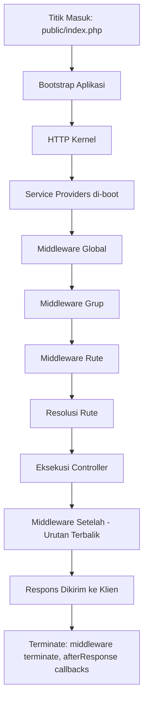
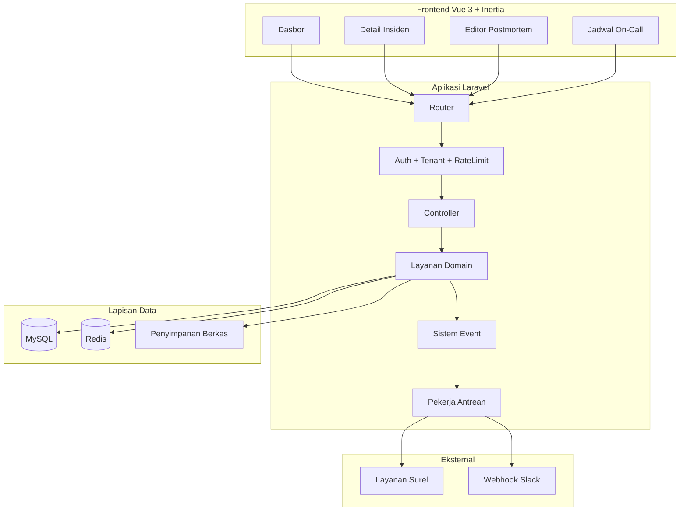
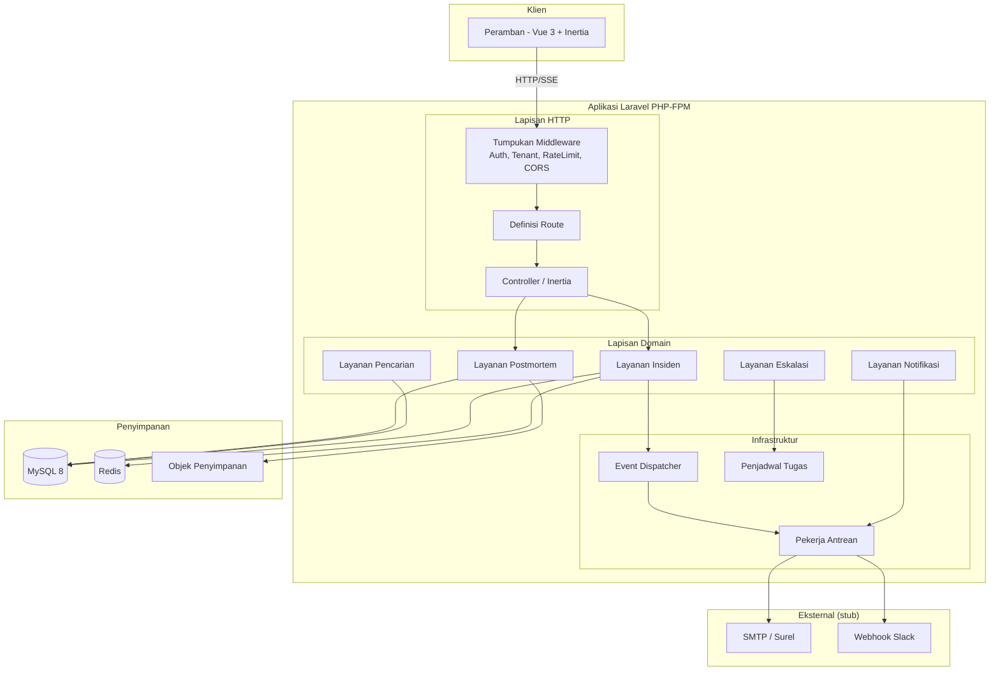
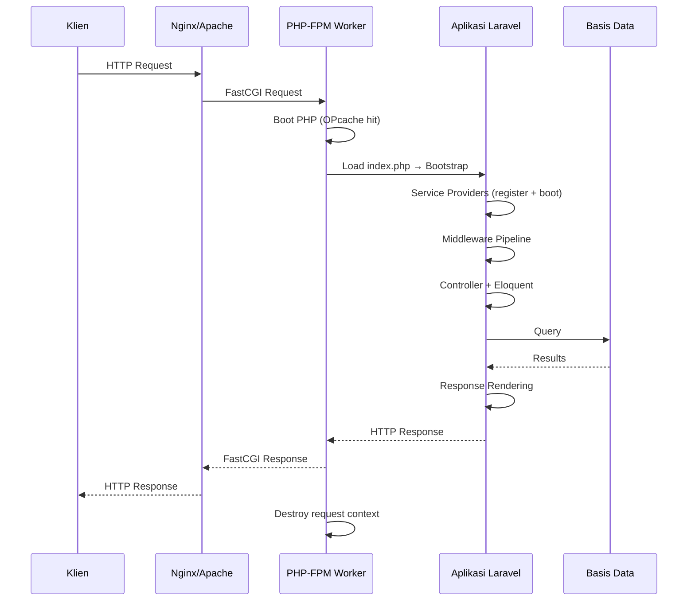
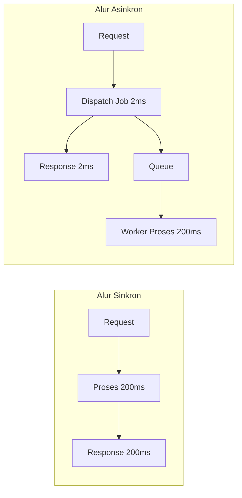
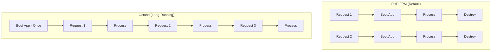

# Mid-Level Full Stack Laravel + Vue Engineer

## Executive Overview

Dokumen ini menyajikan roadmap komprehensif bagi engineer berlatar belakang Go atau Node.js yang bermigrasi ke posisi mid-level Full Stack Laravel + Vue. Roadmap dirancang berdasarkan perspektif hiring manager dan mencakup analisis mendalam terhadap ekspektasi peran, rencana pembelajaran bertahap, panduan pengambilan keputusan arsitektural, strategi portofolio, katalog kesalahan produksi, serta panduan pencarian kerja.

**Bagian pertama** mendefinisikan secara praktis apa artinya menjadi mid-level engineer dalam konteks Laravel dan Vue. Definisi ini berfokus pada tingkat *ownership* -- bukan sekadar lama pengalaman. Dokumen memetakan ekspektasi per domain (backend, frontend, database, *testing*, keamanan, DevOps, dan kolaborasi) serta menyajikan rubrik evaluasi hiring manager dengan bobot presentase per kategori. Sebuah *gap analysis* khusus mengidentifikasi keterampilan yang dapat ditransfer dari Go/Node.js beserta area yang harus dipelajari dari nol, lengkap dengan estimasi total usaha sebesar 325--525 jam atau setara 6--10 bulan dengan komitmen 12--15 jam per minggu.

**Bagian kedua** mempresentasikan rencana pembelajaran bertahap dalam enam fase: dimulai dari fondasi PHP dan *tooling* (Fase 0), kemudian inti Laravel (Fase 1), integrasi Vue dan Inertia.js (Fase 2), aspek produksi seperti *queue*, keamanan, dan *deployment* (Fase 3), arsitektur lanjutan (Fase 4), hingga pemantasan portofolio (Fase 5). Setiap fase dilengkapi dengan tujuan pembelajaran, justifikasi relevansi di lingkungan produksi, tabel kedalaman topik, *deliverable*, dan *definition of done*.

**Bagian ketiga** merupakan panduan pengambilan keputusan arsitektural yang mencakup sembilan area kritis: arsitektur frontend, monolit versus *microservices*, strategi akses data, pola sinkron versus asinkron, pilihan *caching*, *runtime*, autentikasi, strategi *multi-tenancy*, dan manajemen *state* di sisi Vue.

**Bagian keempat** merekomendasikan tiga proyek portofolio yang menyelesaikan masalah operasional nyata -- bukan sekadar CRUD generik -- dan menyajikan spesifikasi *capstone* lengkap untuk "IncidentHub", sebuah platform manajemen insiden B2B SaaS.

**Bagian kelima** berisi katalog 15 kesalahan umum PHP dan Laravel yang sering ditemui di kode produksi, beserta cara deteksi dan pencegahannya.

**Bagian keenam** membahas strategi pencarian kerja dan wawancara, termasuk contoh butir CV, struktur repositori GitHub, rencana *onboarding* 30/60/90 hari, dan rubrik wawancara simulasi.

**Bagian ketujuh** menyajikan rencana prioritas akhir: 10 aksi teratas, jadwal mingguan 12 minggu, dan daftar periksa portofolio.

**Bagian kedelapan** membahas penyetelan kinerja ekstrem secara holistik -- dari runtime PHP dan OPcache hingga Laravel Octane, strategi *caching*, kinerja basis data, desain antrean, optimasi frontend Vue/Vite, infrastruktur jaringan, observabilitas, dan *trade-off* keamanan. Setiap rekomendasi didasarkan pada bukti dari dokumentasi resmi dan dilengkapi dengan matriks keputusan serta daftar periksa studi berprioritas.

Dokumen ini bersifat pragmatis: arsitektur modular monolit direkomendasikan sebagai *default*, Eloquent ORM digunakan langsung untuk sebagian besar kasus, dan Inertia.js dipilih sebagai pendekatan frontend untuk proyek portofolio. Prinsip yang ditekankan adalah memulai dari kesederhanaan dan meningkatkan kompleksitas hanya ketika kebutuhan bisnis membenarkannya.

---

## Lingkup dan Asumsi

### Cakupan Dokumen

Dokumen ini mencakup delapan bagian utama: (1) analisis peran dan *gap analysis*, (2) rencana pembelajaran bertahap dalam enam fase, (3) panduan pengambilan keputusan arsitektural, (4) strategi portofolio dengan tiga proyek non-CRUD, (5) spesifikasi proyek *capstone*, (6) katalog 15 kesalahan umum produksi, (7) panduan pencarian kerja dan wawancara, (8) rencana prioritas akhir dengan jadwal 12 minggu, dan (9) penyetelan kinerja ekstrem mencakup seluruh tumpukan teknologi.

### Tabel Versi Komponen

| Komponen | Versi Stabil (Juli 2026) | Sumber |
|----------|--------------------------|--------|
| PHP | 8.5.x (8.5.8, 2026-07-02) | [php.net/releases](https://www.php.net/releases/) |
| Laravel | 13.x (13.0, 2026-03-17) | [laravel.com/docs](https://laravel.com/docs/releases) |
| Vue.js | 3.5.x (3.5.39, 2026-06-25) | [vuejs.org](https://vuejs.org/) |
| Inertia.js | 3.6.x (3.6.1, 2026-07-07) -- v3 *breaking*: ESM-*only*, Vite 8, Node 24+ | [inertiajs.com](https://github.com/inertiajs/inertia/releases) |
| Vite | 8.1.x (8.1.5, 2026-07-16) | [vitejs.dev](https://github.com/vitejs/vite/releases) |
| TypeScript | 5.7+ | [typescriptlang.org](https://www.typescriptlang.org/) |
| Node.js | 24 LTS (v24.18.0) | [nodejs.org](https://nodejs.org/en/about/previous-releases) |
| MySQL | 8.4 LTS / 9.x Innovation | [dev.mysql.com](https://dev.mysql.com/) |
| PostgreSQL | 17.x | [postgresql.org](https://www.postgresql.org/) |
| Redis | 7.4+ | [redis.io](https://redis.io/) |
| PHPUnit | 13.2.x | [phpunit.de](https://github.com/sebastianbergmann/phpunit/releases) |
| Pest | 4.7.x | [pestphp.com](https://github.com/pestphp/pest/releases) |
| PHPStan | 2.2.x | [phpstan.org](https://github.com/phpstan/phpstan/releases) |
| Composer | 2.10.x | [getcomposer.org](https://github.com/composer/composer/releases) |

> **Catatan:** Prinsip arsitektural dan praktik terbaik dalam dokumen ini tetap relevan meskipun versi baru dirilis setelah Juli 2026. Periksa *changelog* resmi untuk perubahan API. Perubahan signifikan dari asumsi awal meliputi Laravel 13 (bukan 12) yang menghadirkan AI SDK dan JSON:API Resources, serta Inertia.js v3 (bukan v2) dengan *breaking changes* berupa ESM-*only*, penghapusan dukungan Vite 6, dan kebutuhan Node 24+.

---

# 1. Analisis Peran

## 1.1 Definisi Praktis: Mid-Level Full Stack Laravel + Vue

Gelar mid-level tidak ditentukan oleh lama pengalaman, melainkan oleh tingkat *ownership*[^1]. Seorang engineer mid-level dalam konteks Laravel dan Vue diharapkan mampu:

**Tanggung Jawab dan Kepemilikan:**
- Mengambil satu fitur secara *end-to-end*: dari *requirement* menjadi kode siap produksi, mencakup skema *database*, logika backend, antarmuka pengguna frontend, *testing*, dan *deployment*
- Mengambil keputusan arsitektural lokal (dalam satu fitur atau modul) tanpa memerlukan persetujuan pada setiap langkah
- Mengenali kapan suatu keputusan memerlukan eskalasi ke engineer senior atau *lead*
- Menulis kode yang dapat di-*review* dan di-*maintain* oleh orang lain
- Mendesain dan mengimplementasikan kontrak API[^2] yang konsisten
- Memahami *trade-off* antara kecepatan pengiriman dan kualitas teknis
- Melakukan *debugging* terhadap isu produksi dengan bimbingan minimal

**Bukan Karakteristik Mid-Level:**
- Memerlukan arsitektur sistem secara keseluruhan didesainkan oleh orang lain
- Tidak mampu mengidentifikasi N+1 *query*[^3], celah keamanan, atau *race condition*[^4]
- Hanya mampu mengikuti tutorial tanpa kemampuan adaptasi terhadap kebutuhan spesifik
- Tidak mampu menjelaskan *trade-off* dari pilihan teknis yang diambil

## 1.2 Ekspektasi per Domain

| Domain | Ekspektasi Mid-Level | Ekspektasi Junior (Perbandingan) | Ekspektasi Senior (Konteks) |
|--------|---------------------|----------------------------------|----------------------------|
| **Backend** | Implementasi fitur kompleks dengan *validation*, *authorization*, *error handling* yang tepat. Memahami *service container*[^5], *middleware*[^6], relasi Eloquent[^7], *queue jobs*[^8] | Implementasi CRUD sederhana dengan bimbingan; masih perlu diingatkan tentang N+1 dan *validation* | Mendesain sistem: batas modul, alur data, titik integrasi, mode kegagalan |
| **Frontend** | Implementasi komponen Vue[^9] kompleks dengan Composition API[^10], manajemen *state*, penanganan formulir, dan *error states* | Implementasi *template* sederhana; masih kesulitan dengan *reactivity* dan komunikasi antar komponen | Mendesain arsitektur frontend: strategi *state*, *code splitting*, anggaran kinerja |
| **Database** | Desain skema untuk fitur baru, indeks yang tepat, optimalisasi *query*, *migration* yang benar | Menulis *query* dasar; masih memerlukan bantuan untuk *complex joins* dan pengindeksan | Mendesain arsitektur data: partisi, strategi replikasi, siklus hidup data |
| **Testing** | Menulis *integration test* yang bermakna, *factory* setup, *fakes* untuk layanan eksternal | Menulis *unit test* sederhana; berorientasi pada cakupan semata | Mendesain strategi *testing*: *contract test*, *chaos testing* |
| **Keamanan** | Mengimplementasi *authorization* (Policies[^11]), pencegahan CSRF[^12] dan XSS[^13], *input validation* | Berpotensi melewatkan *mass assignment* atau celah *authorization* | Pemodelan ancaman, arsitektur keamanan, kepatuhan regulasi |
| **DevOps** | Menyiapkan *pipeline* CI/CD[^14], pengembangan lokal dengan Docker, *deployment* dengan *zero-downtime migration* | Masih memerlukan bimbingan untuk proses *deployment* | Arsitektur infrastruktur, strategi *observability*[^15], respons insiden |
| **Kolaborasi** | *Code review* yang konstruktif, dokumentasi teknis, diskusi kontrak API | Masih memerlukan banyak umpan balik pada *pull request* | Mentoring, pengambilan keputusan teknis, koordinasi antar tim |

## 1.3 Rubrik Evaluasi Hiring Manager

Evaluasi kandidat mid-level didasarkan pada bukti yang dapat diamati, bukan klaim.

### Backend (35% Bobot Evaluasi)

| Kompetensi | Sinyal Kuat | Sinyal Merah |
|-----------|-------------|-------------|
| **Eloquent dan Query** | Mampu menjelaskan kapan menggunakan Eloquent, kapan Query Builder[^16], kapan *raw SQL*. Repositori menunjukkan *eager loading* yang tepat | Hanya mengetahui `Model::all()` atau `Model::find()`; tidak dapat menjelaskan perilaku *query* |
| **Service Container** | Mampu menjelaskan *binding*, *contextual binding*, dan kapan menggunakan *constructor injection* versus `resolve()` | Menggunakan `app()` atau `new` secara langsung di mana-mana tanpa *dependency injection* |
| **Queue dan Async** | Menunjukkan desain *job* dengan *retry*, *idempotency*[^17], dan penanganan kegagalan yang tepat | Tidak dapat menjelaskan apa yang terjadi jika *job* gagal di tengah eksekusi |
| **Validation dan Authorization** | Menggunakan Form Request[^18] dan Policy secara konsisten; mampu menjelaskan perbedaan *validation* dan *authorization* | Menggunakan *validation* secara *inline* di *controller*; tidak ada lapisan *authorization* |
| **Error Handling** | *Structured logging*, penanganan *exception* yang tepat, respons kesalahan yang informatif | `try/catch` kosong, kesalahan yang disembunyikan, *error* 500 generik |

### Frontend (25% Bobot Evaluasi)

| Kompetensi | Sinyal Kuat | Sinyal Merah |
|-----------|-------------|-------------|
| **Vue 3 Proficiency** | Composition API dengan *script setup*, *reactivity* yang tepat, *computed properties*, *watchers* yang sesuai | Masih menggunakan Options API secara eksklusif; tidak memahami nuansa *reactivity* |
| **Component Design** | Komponen yang dapat digunakan ulang dan terketik dengan benar, kontrak *props*/*emits* yang jelas | *God components* yang menangani seluruh logika |
| **State Management** | Mampu menjelaskan kapan cukup menggunakan *local state*, kapan memerlukan Pinia[^19], beserta *trade-off*-nya | Menggunakan Pinia untuk seluruh *state*, atau tidak konsisten dalam pendekatan |
| **Form Handling** | Tampilan *validation* yang tepat, penanganan kesalahan, *loading states*, *optimistic updates* | Formulir tanpa penanganan kesalahan atau *loading state* |
| **Inertia/SPA** | Mampu menjelaskan *trade-off* Inertia versus SPA dan mengimplementasikan pendekatan yang dipilih dengan benar | Tidak dapat menjelaskan bagaimana alur data bekerja pada pendekatan yang dipilih |

### Praktik Rekayasa (25% Bobot Evaluasi)

| Kompetensi | Sinyal Kuat | Sinyal Merah |
|-----------|-------------|-------------|
| **Testing** | *Integration test* yang menguji perilaku, bukan implementasi; *factory pattern* yang tepat | Uji coba yang hanya menguji *getter*/*setter*, atau tidak ada pengujian sama sekali |
| **Git dan Code Review** | Riwayat *commit* yang bersih, deskripsi *pull request* yang bermakna, komentar *review* yang konstruktuf | *Commit* masif tunggal tanpa deskripsi *pull request* |
| **Database** | *Migration* yang tepat, indeks, *foreign key*. Mampu membaca hasil EXPLAIN | *Migration* tanpa indeks; tidak memahami integritas referensial |
| **Keamanan** | Pemeriksaan *authorization* yang konsisten, *input validation* yang tepat, kesadaran terhadap CSRF | Celah *mass assignment*, *authorization* yang hilang |

### Keterampilan Lunak dan Penilaian (15% Bobot Evaluasi)

| Kompetensi | Sinyal Kuat | Sinyal Merah |
|-----------|-------------|-------------|
| **Analisis Trade-off** | Mampu menjelaskan "Saya memilih X karena Y, meskipun konsekuensinya Z" | Tidak dapat menjelaskan alasan di balik pilihan teknis |
| **Dekomposisi Masalah** | Memecah fitur kompleks menjadi langkah-langkah yang terkelola | Langsung menulis kode tanpa perencanaan, terjebak di tengah |
| **Komunikasi** | Mampu menjelaskan konsep teknis kepada non-teknis; deskripsi *pull request* yang jelas | Tidak dapat menjelaskan apa yang diubah dan mengapa |

## 1.4 Gap Analysis: Go/Node.js ke Laravel + Vue

### Keterampilan yang Dapat Ditransfer

| Keterampilan dari Go/Node.js | Relevansi ke Laravel+Vue | Catatan |
|------------------------------|--------------------------|---------|
| Pengembangan HTTP/API | Tinggi | Konsep *request*/*response*, REST, dan *middleware* serupa; abstraksi Laravel lebih tinggi |
| *Database* dan SQL | Tinggi | SQL tetap SQL; Eloquent ORM[^20] merupakan lapisan tambahan yang perlu dipelajari |
| Autentikasi dan *Authorization* | Tinggi | Konsep JWT[^21], sesi, RBAC[^22] sama; implementasi berbeda (Laravel Sanctum/Passport) |
| Metodologi *testing* | Tinggi | Konsep *unit*/*integration*/E2E sama; *tooling* berbeda (PHPUnit/Pest versus Go *testing*/Jest) |
| Docker dan kontainerisasi | Tinggi | Sama; Laravel menyediakan Sail untuk pengembangan lokal |
| Alur kerja Git | Tinggi | Sama persis |
| Konsep *async*/*queue* | Tinggi | Konsep sama (*message queue*, *retry*, *idempotency*); abstraksi Laravel Queue berbeda dari Go *channels* atau Bull di Node.js |
| *Pipeline* CI/CD | Tinggi | Sama; langkah spesifik Laravel (PHPStan, Pint) perlu ditambah |
| Strategi *caching* | Tinggi | Konsep Redis/Memcached sama; *facade* Cache Laravel merupakan abstraksi |
| Pola *error handling* | Sedang | Model *exception* PHP berbeda dari *error return* Go dan `try/catch` Node.js |

### Keterampilan Spesifik PHP/Laravel yang Harus Dipelajari dari Nol

| Area | Alasan Tidak Dapat Ditransfer | Estimasi Usaha |
|------|-------------------------------|----------------|
| **Sistem tipe dan model *runtime* PHP** | PHP memiliki aturan *type coercion*, penanganan `null`, dan perilaku *runtime* yang berbeda signifikan dari Go (ketat) dan Node.js (longgar). `declare(strict_types=1)` mengubah perilaku secara mendasar | 20--30 jam |
| **Composer dan *autoloading*** | *Autoloading* PSR-4, resolusi dependensi, dan batasan versi berbeda dari Go modules dan npm | 5--10 jam |
| **Laravel Service Container** | Tidak ada padanan di Go (*DI* manual) atau Node.js (IoC jarang digunakan); ini fondamental Laravel | 15--25 jam |
| **Eloquent ORM** | Go menggunakan sqlx/GORM (berbeda secara fundamental); Node.js menggunakan Prisma/TypeORM (lebih mirip). Eloquent memiliki *magic methods* yang tidak ada di Go | 30--40 jam |
| **Laravel Middleware dan *Lifecycle*** | Konsep mirip tetapi model eksekusi berbeda; Laravel memiliki *request lifecycle* yang unik | 10--15 jam |
| **Blade *templating*** | Tidak ada di Go (*Go templates* sangat berbeda). Di Node.js mungkin familiar dengan EJS/Pug | 5--10 jam |
| **Inertia.js** | Tidak ada padanan di ekosistem Go/Node; ini paradigma baru | 10--15 jam |
| **Model proses PHP-FPM** | Berbeda secara fundamental dari Go *goroutines* atau *event loop* Node.js; model isolasi per *request* | 10--15 jam |
| **Laravel Facades** | Pola yang kontroversial tanpa padanan di Go/Node; perlu dipahami untuk membaca *codebase* orang lain | 5--10 jam |
| **Vue 3 Composition API** | Jika sudah mengenal React, dapat ditransfer sekitar 60%. Jika tidak, harus dari nol | 30--40 jam |

### Estimasi Total Usaha

| Kategori | Jam Minimum | Jam Maksimum |
|----------|-------------|--------------|
| Fondasi PHP | 30 | 50 |
| Inti Laravel | 80 | 120 |
| Vue 3 + TypeScript | 40 | 60 |
| Integrasi Laravel + Vue | 20 | 30 |
| *Testing* (PHP/Vue) | 20 | 30 |
| DevOps dan *deployment* | 15 | 25 |
| Proyek portofolio | 120 | 200 |
| **Total** | **325** | **525** |

Dengan komitmen 12--15 jam per minggu, estimasi ini setara dengan **6 hingga 10 bulan** untuk mencapai kesiapan mid-level yang kredibel.

---

# 2. Rencana Pembelajaran Bertahap

## Ikhtisar Fase

| Fase | Durasi | Fokus | Deliverable |
|------|--------|-------|-------------|
| **Fase 0: Fondasi** | 2--3 minggu | PHP 8.4, Composer, *tooling* | Aplikasi CLI sederhana dengan *strict types* |
| **Fase 1: Inti Laravel** | 4--6 minggu | *Service container*, Eloquent, *middleware*, *testing* | Backend API untuk domain masalah |
| **Fase 2: Vue + Inertia** | 3--4 minggu | Vue 3 Composition API, integrasi Inertia | Fitur *full-stack* dengan Inertia |
| **Fase 3: Kepentingan Produksi** | 4--6 minggu | *Queue*, keamanan, *caching*, *deployment* | Aplikasi siap produksi |
| **Fase 4: Arsitektur dan Kedalaman** | 4--6 minggu | Desain modular, pola lanjutan, *observability* | Proyek *capstone* |
| **Fase 5: Pemantasan Portofolio** | 2--3 minggu | Dokumentasi, persiapan demo, CI/CD | Portofolio siap untuk hiring manager |

---

## Fase 0: Fondasi PHP dan Tooling (2--3 minggu, 30--50 jam)

### Tujuan

PHP 8.5 bukan "Go yang lebih longgar" atau "Node.js yang sinkron". PHP memiliki sistem tipe, model *runtime*, dan konvensi ekosistem yang unik. Fase ini memastikan fondasi yang benar sebelum memasuki Laravel.

### Relevansi di Lingkungan Produksi

Model *runtime* PHP (isolasi per *request* melalui PHP-FPM[^23]) berbeda secara fundamental dari Go *goroutines* atau *event loop* Node.js. Pemahaman ini mencegah asumsi keliru tentang *state*, memori, dan *concurrency* yang dapat menyebabkan *bug* di produksi.

### Topik dan Kedalaman

#### 0.1 Sistem Tipe PHP 8.5 (Penguasaan Mendalam)

| Sub-Topik | Pentingnya di Produksi | Padanan Go/Node.js |
|-----------|------------------------|-------------------|
| `declare(strict_types=1)` | Tanpa ini, PHP melakukan *implicit type coercion*. `strlen(123)` tidak menghasilkan *error* tetapi mengembalikan `3`. Ini sumber *bug* yang sulit dideteksi | Go: ketat saat kompilasi. Node.js: TypeScript |
| *Union types* (`int\|string`) | Laravel menggunakannya secara internal. Pemahaman perilaku diperlukan untuk keselamatan tipe | Go: tidak ada (harus *interface*). TS: *union types* |
| *Intersection types* (`A&B`) | Lebih jarang tetapi muncul pada *package* tingkat lanjut | Go: tidak ada |
| *Nullable types* (`?string` versus `string\|null`) | Keduanya valid, tetapi memiliki nuansa di PHP 8.4 | Go: *pointer* (`*string`). TS: `string \| null` |
| Deklarasi tipe kembalian | Wajib untuk kode yang dapat di-*maintain* | Go: wajib. TS: opsional tetapi direkomendasikan |
| Tipe properti (*typed properties*) | PHP 7.4+. Kritis untuk kebenaran model Eloquent | Go: *struct fields*. TS: properti *interface* |
| *Enums* (PHP 8.1+) | *Backed enums* versus *unit enums*. Laravel menggunakannya untuk bidang *status* dan tipe | Go: iota + const. TS: *enum* atau *union literals* |
| *Readonly properties* dan kelas | Immutabilitas untuk *value objects* | Go: tipe nilai (salinan secara implisit tidak dapat diubah). TS: `readonly` |
| *Attributes* (PHP 8.0+) | Sistem metadata, seperti *decorators* di NestJS atau *annotations* di Java. Laravel menggunakannya untuk *routing* dan *validation* | Go: *struct tags*. TS: *decorators* (eksperimental) |
| *Named arguments** | Meningkatkan keterbacaan, tetapi memiliki risiko pemeliharaan saat penggantian nama | Tidak ada padanan di Go. TS 4.0+ memiliki |
| *Match expression* | Lebih ketat dari *switch* (perbandingan ketat, *exhaustive*) | Go: *switch*. TS: *switch* |

**Catatan penting:** PHP memiliki *implicit type coercion* bahkan dengan *type hints* jika `strict_types` tidak aktif. Ini sangat berbeda dari Go (selalu ketat saat kompilasi) dan Node.js (aturan *coercion* JavaScript yang berbeda). **Selalu gunakan `declare(strict_types=1)` di setiap file.**

#### 0.2 Composer dan Autoloading (Kemampuan Kerja)

| Sub-Topik | Pentingnya | Usaha |
|-----------|-----------|-------|
| PSR-4 *autoloading* | Standar *autoloading*; *namespace* = struktur direktori | 3 jam |
| `composer.json` versus `composer.lock` | Analogi: `package-lock.json` di Node.js, `go.sum` di Go. *Lock file* wajib di-*commit* | 2 jam |
| Batasan versi (`^`, `~`, `>=`) | *Semantic versioning*, rentang kompatibel. Mirip npm/Go modules | 2 jam |
| *Dev dependencies* | `require-dev` versus `require`. Alat *testing* termasuk di sini | 1 jam |
| *Scripts* dan konfigurasi *autoload* | Perintah kustom, optimasi *classmap* | 2 jam |

**Sumber:** [Dokumentasi Composer](https://getcomposer.org/doc/) (resmi, diperbarui secara berkala)

#### 0.3 Model Runtime PHP (Kemampuan Kerja)

Ini adalah topik yang paling sering disalahpahami oleh engineer dari latar belakang Go/Node.js.

| Konsep | PHP (FPM) | Go | Node.js |
|--------|-----------|-----|---------|
| **Model proses** | Proses/*thread* per *request*. Setelah *request* selesai, *state* hilang | Proses berjalan lama, *goroutines* | Berjalan lama, *event loop* |
| **Global state** | Tidak persisten antar *request* (kecuali penyimpanan eksternal) | Persisten selama proses hidup | Persisten selama proses hidup |
| **Memori** | Dilepaskan setelah *request* (*cycle collector*) | GC, manajemen manual | GC |
| **Concurrency** | Tidak ada (dalam satu *request*). Paralelisme melalui multi-proses | *Goroutines* + *channels* | *Event loop*, *async*/*await* |
| **Implikasi** | Tidak perlu khawatir tentang *shared state* dalam *request*. Namun *DI container* dan *singletons* di-*boot* setiap *request* | | |

**Mengapa ini penting:** Di Go/Node.js, data dapat di-*cache* di memori antar *request* (*in-process cache*). Di PHP-FPM, hal ini tidak berfungsi. Seluruh *state* yang perlu persisten harus disimpan di penyimpanan eksternal (Redis, *database*, *file*). Ini juga berarti *service container* Laravel di-*boot* ulang setiap *request*.

**Perbedaan dengan Laravel Octane:** Octane melakukan *pre-boot* aplikasi dan melayani banyak *request* dari proses yang sama. Hal ini mengubah asumsi di atas -- *state* dapat bocor antar *request*. Inilah mengapa Octane memerlukan kehati-hatian dan termasuk topik lanjutan.

**Sumber:** [Dokumentasi PHP-FPM](https://www.php.net/manual/en/install.fpm.php), [Dokumentasi Laravel Octane](https://laravel.com/docs/octane)

#### 0.4 OPcache dan Kinerja (Kesadaran)

| Konsep | Alasan Penting |
|--------|---------------|
| OPcache | Meng-*cache* *bytecode* PHP yang telah dikompilasi. Produksi wajib mengaktifkan. Menjelaskan mengapa perubahan kode kadang tidak langsung terlihat |
| JIT *compiler* (PHP 8.0+) | Dampak minimal untuk beban kerja web. Cukup kesadaran |
| `realpath_cache` | *Cache* jalur *file*. Jarang perlu penyesuaian |

**Kedalaman: Kesadaran.** Detail konfigurasi dapat dicari saat *deployment*.

#### 0.5 Exception dan Error Handling PHP (Kemampuan Kerja)

| Konsep | Padanan Go | Padanan Node.js |
|--------|-----------|----------------|
| `try/catch/finally` | `if err != nil` | `try/catch/finally` |
| Hirarki *exception* | Tidak ada (*error interface*) | Hirarki kelas *Error* |
| `Throwable` (*interface* tertinggi) | *Interface* `error` | Kelas *Error* |
| *Custom exceptions* | Tipe *error* kustom | Kelas *Error* kustom |
| `set_error_handler` / `set_exception_handler` | `recover()` | `process.on('uncaughtException')` |

**Penting:** PHP menggunakan *exception* untuk kontrol alur lebih banyak daripada Go (di mana *error return* eksplisit merupakan konvensi). Ini bukan *anti-pattern* di PHP -- ini norma. Laravel melemparkan *exception* untuk banyak hal (404, 403, *validation*, *model not found*).

### Deliverable Fase 0

Aplikasi CLI PHP yang:
- Menggunakan `declare(strict_types=1)` di setiap file
- Memiliki struktur *namespace* yang tepat (PSR-4)
- Menggunakan Composer untuk manajemen dependensi
- Menggunakan *enums*, *readonly properties*, dan *typed properties*
- Memiliki *test suite* PHPUnit
- Dapat dijalankan melalui `php bin/app.php`

### Definition of Done Fase 0

- [ ] Dapat menjelaskan perbedaan model *runtime* PHP dengan Go/Node.js
- [ ] Dapat menulis PHP dengan *strict types* tanpa mencari referensi sintaksis
- [ ] Dapat menyiapkan proyek Composer dengan PSR-4 *autoloading*
- [ ] Dapat menjelaskan mengapa `declare(strict_types=1)` itu penting
- [ ] Dapat menulis *unit test* PHPUnit sederhana

### Sumber Daya Fase 0

| Sumber | Alasan |
|--------|--------|
| [Dokumentasi PHP 8.5](https://www.php.net/manual/en/) | Sumber utama untuk sintaksis dan perilaku |
| [PHP: The Right Way](https://phptherightway.com/) | Praktik terbaik kurasi komunitas, diperbarui untuk PHP 8.x |
| [Daftar RFC PHP](https://wiki.php.net/rfc) | Untuk memahami mengapa fitur tertentu ada dan perilaku spesifik |
| [Dokumentasi Composer](https://getcomposer.org/doc/) | Dokumentasi resmi Composer |
| [Dokumentasi PHPUnit](https://phpunit.de/documentation.html) | Dokumentasi resmi kerangka pengujian |

### Topik yang Dilewati atau Ditunda

- **PHP 8.5 Fibers:** Primitif asinkron. Laravel menggunakannya di Octane, tetapi tidak perlu dipahami pada fase ini. Ditunda ke Fase 3.
- **Generators/Iterators:** Berguna untuk *streaming* kumpulan data besar, tetapi bukan fondamental. Ditunda ke Fase 3.
- **Ekstensi PEAR/PECL:** Ekosistem lama. Dilewati kecuali kebutuhan spesifik.
- **Penyesuaian konfigurasi PHP ini:** Cukup tingkat kesadaran. Detail saat *deployment*.

---

## Fase 1: Inti Laravel (4--6 minggu, 60--90 jam)

### Tujuan

Membangun *mental model* yang benar tentang cara kerja internal Laravel, bukan sekadar "sihir" yang diharapkan berfungsi. Hal inilah yang membedakan engineer yang mampu menyelesaikan isu produksi dari yang hanya mampu mengikuti tutorial.

### Relevansi di Lingkungan Produksi

Laravel memiliki tingkat abstraksi yang tinggi. Tanpa memahami *service container*, *request lifecycle*, dan internal Eloquent, seorang engineer tidak dapat:
- Melakukan *debugging* ketika *dependency injection* tidak berfungsi
- Memahami mengapa *query* lambat (N+1, indeks yang hilang)
- Memahami mengapa *middleware* tidak dieksekusi dalam urutan yang diharapkan
- Mengambil keputusan kapan abstraksi Laravel sudah cukup dan kapan pendekatan *raw* diperlukan

### 1.1 Service Container dan Dependency Injection (Penguasaan Mendalam)

| Sub-Topik | Pentingnya | Analogi Go/Node.js |
|-----------|-----------|-------------------|
| *Container binding* (`bind`, `singleton`, `scoped`) | Mekanisme sentral. Seluruh *DI* di Laravel melewati ini | Go: *DI* manual (*constructor injection*). Node.js: *IoC container* NestJS |
| *Automatic resolution* (*constructor injection*) | Laravel me-*resolve* dependensi secara otomatis. Ini "sihir" yang perlu dipahami | Go: eksplisit. NestJS: `@Injectable()` |
| *Contextual binding* | *Interface* berbeda pada konteks berbeda. Misal: `StorageInterface` menuju `S3Storage` di produksi, `LocalStorage` di *testing* | Go: manual. NestJS: *named providers* |
| *Helper* `app()` dan `resolve()` | *Service locator pattern*. Kapan aman, kapan sebaiknya dihindari | Go: jarang. Node.js: `container.get()` |
| *Tagging* dan *resolving groups* | Untuk pengembangan *package* dan sistem *plugin* | Go: *interface slices*. NestJS: *multi-providers* |
| *Method injection* di *controller* | Laravel melakukan *auto-inject* ke parameter metode. Perlu dipahami kapan berfungsi dan kapan tidak | Go: *parameter passing* eksplisit |

**Catatan penting:** *Service container* di Laravel di-*boot* ulang setiap *request* (pada PHP-FPM). *Singleton* berarti "satu *instance* per *request*", bukan "satu *instance* global" seperti di Go/Node.js.

**Sumber:** [Dokumentasi Laravel Service Container](https://laravel.com/docs/container)

#### Praktik Langsung: Implementasi

1. Buat *service interface* `PaymentGateway` dengan dua implementasi (`StripeGateway`, `MockGateway`)
2. Lakukan *binding* secara *contextual*: produksi menuju Stripe, *testing* menuju Mock
3. Suntikkan ke *controller* melalui *constructor injection*
4. Buat *test* yang memverifikasi *contextual binding* berfungsi

### 1.2 Service Providers (Kemampuan Kerja)

| Sub-Topik | Pentingnya |
|-----------|-----------|
| *Boot* versus *register* | *Timing* berpengaruh. `register` untuk *binding*, `boot` untuk konfigurasi yang memerlukan *service* yang sudah di-*resolve* |
| *Deferred providers* | Optimalisasi kinerja. *Provider* tidak di-*boot* sampai dibutuhkan |
| *Package service providers* | Ekosistem *package* Laravel bekerja melalui ini. Pemahaman diperlukan untuk mengintegrasikan *package* |

**Sumber:** [Dokumentasi Laravel Service Providers](https://laravel.com/docs/providers)

### 1.3 Facades (Kesadaran + Kemampuan Kerja)

| Aspek | Penjelasan |
|-------|-----------|
| Definisi *Facade* | *Static proxy* ke *service container*. `Cache::get()` sebenarnya me-*resolve* `CacheManager` dari *container*, lalu memanggil `get()` |
| *Trade-off* | Keuntungan: sintaksis yang ringkas dan mudah dibaca. Risiko: dependensi tersembunyi, lebih sulit diuji jika tidak menggunakan *facade fakes*, menyamar sebagai panggilan statis |
| *Testing* | Laravel menyediakan *facade fakes*: `Cache::fake()`, `Bus::fake()`, `Event::fake()` |
| Kapan menghindari | Di kelas domain/*service* -- suntikkan dependensi secara langsung. *Facade* dapat diterima di *controller*/*handler* yang terikat *framework* |

**Catatan sebagai sinyal perekrutan:** Kandidat yang mampu menjelaskan *trade-off* Facades (dan kapan menghindarinya) menunjukkan pemahaman yang lebih dalam daripada yang hanya menggunakannya tanpa pertimbangan.

**Sumber:** [Dokumentasi Laravel Facades](https://laravel.com/docs/facades)

### 1.4 Request Lifecycle (Penguasaan Mendalam)

Ini adalah **topik paling penting** yang sering dilewati oleh pembelajar.



**Mengapa ini krusial:**
- Melakukan *debugging* terhadap masalah urutan *middleware*
- Memahami kapan *service providers* sudah di-*boot*
- Memahami *timing* *middleware* transaksi
- Memahami mengapa *exception handler* menangkap kesalahan pada tahap tertentu

**Sumber:** [Dokumentasi Laravel Request Lifecycle](https://laravel.com/docs/lifecycle)

### 1.5 Eloquent ORM (Penguasaan Mendalam)

Ini area yang paling membutuhkan waktu bagi engineer dari latar belakang Go, karena Eloquent memiliki "sihir" yang tidak ada di ekosistem ORM Go.

| Sub-Topik | Pentingnya | Usaha |
|-----------|-----------|-------|
| Dasar Model, *fillable*, *guarded* | Perlindungan *mass assignment*. Kritis untuk keamanan | 3 jam |
| Relasi (*hasMany*, *belongsTo*, *morphMany*, dll.) | Fitur inti. Setiap jenis memiliki perilaku *query* yang berbeda | 8 jam |
| *Eager loading* versus *lazy loading* | **Pencegahan N+1 *query*.** Ini pembunuh kinerja nomor satu pada aplikasi Laravel | 5 jam |
| *Query scopes* (lokal dan global) | Logika *query* yang dapat digunakan ulang. Alternatif dari *repository pattern* | 3 jam |
| *Accessors*, *mutators*, *casts* | Transformasi data. Sintaksis berbasis *Attribute* PHP 8.1+ | 3 jam |
| *Model events* dan *observers* | *Lifecycle hooks*. *Trade-off*: praktis tetapi dapat menjadi efek samping tersembunyi | 3 jam |
| *Soft deletes* | Penghapusan logis. *Trade-off*: kompleksitas *query*, pembengkakan indeks, integritas referensial | 2 jam |
| Eloquent versus Query Builder versus *raw SQL* | Matriks keputusan untuk kapan menggunakan yang mana | 5 jam |
| *Pagination* (*cursor* versus *offset*) | *Trade-off* kinerja untuk kumpulan data besar | 2 jam |
| *Database transactions* | `DB::transaction()` versus *model transaction*. Efek samping di dalam transaksi | 3 jam |

**Wawasan kritis produksi:** `Model::all()` pada tabel dengan 100.000 baris adalah bencana. Selalu pertimbangkan *pagination*, *chunking*, atau pendekatan berbasis *cursor*.

**Sumber:** [Dokumentasi Eloquent ORM](https://laravel.com/docs/eloquent)

#### Praktik Langsung: Penguasaan Eloquent

Implementasi model domain untuk "Sistem Reimbursement Pengeluaran" dengan:
- Model Employee, Expense, ExpenseCategory, Approval, Attachment
- Relasi yang tepat (*hasMany*, *belongsTo*, *morphMany* untuk komentar/lampiran)
- *Scopes*: `pendingApproval()`, `forDepartment($dept)`, `dateRange($start, $end)`
- *Testing* berbasis *factory*
- *Seeder* dengan data realistis
- Bukti tidak ada N+1 *query* melalui `DB::listen()` atau Laravel Debugbar

### 1.6 Pipeline Middleware (Kemampuan Kerja)

| Sub-Topik | Pentingnya |
|-----------|-----------|
| *Middleware* global versus grup versus rute | Lingkup eksekusi. Kesalahpahaman di sini menyebabkan *middleware* tidak berjalan |
| Prioritas *middleware* | Laravel 10+ memiliki prioritas eksplisit. Urutan eksekusi berpengaruh |
| *Terminable middleware* | Untuk *logging*, pembersihan setelah respons dikirim |
| *Middleware* + *DI* | Dapat menyuntikkan dependensi ke konstruktor *middleware* |

**Sumber:** [Dokumentasi Middleware](https://laravel.com/docs/middleware)

### 1.7 Validation dan Form Requests (Kemampuan Kerja)

| Sub-Topik | Pentingnya |
|-----------|-----------|
| *Inline validation* versus Form Request | Form Request = dapat digunakan ulang, dapat diuji, terpisah dari *controller* |
| *Custom rules* | Untuk aturan bisnis yang tidak dicakup oleh aturan bawaan |
| *Validation* versus *Authorization* | **Ini dua hal berbeda.** *Validation* = "Apakah data valid?". *Authorization* = "Apakah pengguna berhak?". Jangan dicampur |
| *Nested validation* | Struktur data kompleks, aturan berbentuk *array* |

**Kritis:** *Validation* bukan *authorization*. `FormRequest::authorize()` sering disalahgunakan -- ini untuk pemeriksaan *authorization*, bukan *validation*. Jika Anda mengembalikan `true` pada `authorize()` tanpa logika, Anda melewati *authorization*.

**Sumber:** [Dokumentasi Validation](https://laravel.com/docs/validation), [Dokumentasi Form Request](https://laravel.com/docs/validation#form-request-validation)

### 1.8 Testing dengan PHPUnit/Pest (Kemampuan Kerja)

| Sub-Topik | Pentingnya | Usaha |
|-----------|-----------|-------|
| Dasar PHPUnit versus Pest | Pest = *wrapper* di atas PHPUnit dengan sintaksis yang lebih ekspresif. Keduanya berfungsi; Pest semakin populer | 3 jam |
| *Feature test* versus *Unit test* | *Feature test* = simulasi *HTTP request*. *Unit test* = isolasi kelas/metode | 3 jam |
| Strategi *database testing* | `RefreshDatabase` versus `DatabaseTransactions` versus SQLite dalam memori. *Trade-off* | 5 jam |
| *Factories* | *Model factories* untuk data uji. Pola *state* | 3 jam |
| *Fakes* versus *Mocks* | `Event::fake()`, `Bus::fake()`, `Http::fake()` -- pengujian khas Laravel | 5 jam |
| Metode *assertion* | `assertJsonStructure`, `assertDatabaseHas`, `assertRedirect` | 2 jam |

**Sumber:** [Dokumentasi Laravel Testing](https://laravel.com/docs/testing), [Dokumentasi Pest](https://pestphp.com/docs)

### 1.9 Konsep Inti Tambahan (Kemampuan Kerja)

| Topik | Pentingnya | Usaha |
|-------|-----------|-------|
| **Events dan Listeners** | *Decoupling*. Kapan terlalu banyak *event* menjadi *spaghetti* | 3 jam |
| **Queues** (pengenalan) | Pemrosesan asinkron. *Job*, *dispatch*, dasar *retry*. Pendalaman di Fase 3 | 3 jam |
| **Caching** | *facade* Cache, *driver*, *tag*, strategi invalidasi | 3 jam |
| **Rate Limiting** | *facade* RateLimiter, *middleware throttle* | 2 jam |
| **Authorization (Policies dan Gates)** | *Authorization* tingkat model. Kritis untuk keamanan | 3 jam |
| **API Resources** | Lapisan transformasi untuk respons API | 2 jam |
| **Konfigurasi dan .env** | Hirarki konfigurasi, *parsing env*, implikasi *caching* | 2 jam |

### Deliverable Fase 1

Aplikasi backend yang:
- Menggunakan *service container* dengan *DI* yang tepat
- Memiliki model Eloquent dengan relasi, *scopes*, *factories* yang benar
- Menggunakan Form Requests untuk *validation*
- Menggunakan Policies untuk *authorization*
- Memiliki *test suite* komprehensif (cakupan minimum 80% *feature test* untuk alur inti)
- Tidak ada N+1 *query* (diverifikasi melalui *test* atau *profiling*)
- Menggunakan *events* untuk *decoupling*
- Memiliki *endpoint* API dengan Resources yang tepat

### Definition of Done Fase 1

- [ ] Dapat menjelaskan *request lifecycle* Laravel secara detail
- [ ] Dapat menjelaskan kapan menggunakan Eloquent versus Query Builder versus *raw SQL*
- [ ] Dapat mendeteksi dan mencegah N+1 *query*
- [ ] Dapat mengimplementasi *authorization* yang tepat dengan Policies
- [ ] Dapat menulis *integration test* yang menguji perilaku, bukan implementasi
- [ ] Dapat menjelaskan *trade-off* Facades versus *constructor injection*

---


## Fase 2: Integrasi Vue 3 dan Inertia (3--4 minggu, 40--60 jam)

### Tujuan

Membangun frontend yang tidak hanya berfungsi, tetapi juga mudah dirawat, memiliki type safety, serta terintegrasi secara solid dengan backend Laravel melalui Inertia.js[^inertia].

### Justifikasi Produksi

Inertia.js mengubah paradigma dari "API + SPA" menjadi "server-driven routing dengan client-side rendering." Pendekatan ini mengurangi boilerplate pada lapisan API, tetapi menuntut pemahaman yang tepat mengenai aliran data.

### 2.1 Vue 3 Composition API (Penguasaan Mendalam)

| Sub-topik | Relevansi Produksi | Estimasi |
|---|---|---|
| `setup()` / `<script setup>` | Sintaks standar; `<script setup>` lebih disarankan | 3 jam |
| `ref()` vs `reactive()` | Reaktivitas primitif vs objek; nuansa kritis | 3 jam |
| `computed()` | State turunan; evaluasi malas dan penyimpanan tembolok | 2 jam |
| `watch()` vs `watchEffect()` | Pelacakan dependensi eksplisit vs otomatis | 2 jam |
| `provide()` / `inject()` | Dependency injection[^di] pada Vue; kapan cukup, kapan perlu Pinia[^pinia] | 2 jam |
| Lifecycle hooks | `onMounted`, `onUnmounted`, `onUpdated`; pola pembersihan | 2 jam |
| Template refs | Akses DOM langsung; kapan diperlukan | 1 jam |
| Composables | Ekstraksi logika yang dapat digunakan ulang; ekuivalen custom hooks pada React | 5 jam |

**Analogi:** Apabila terbiasa dengan React hooks, konsep Composition API serupa. Jika belum, ini adalah cara Vue 3 mengorganisir logika reaktif -- setiap potongan state dan perilaku dikelompokkan secara logis.

**Sumber:** [Vue 3 Composition API documentation](https://vuejs.org/guide/extras/composition-api-faq.html)

### 2.2 Desain Komponen (Kecakapan Kerja)

| Sub-topik | Relevansi Produksi | Estimasi |
|---|---|---|
| Props & emits | Kontrak komponen yang type-safe; `defineProps` dengan TypeScript[^ts] | 3 jam |
| Pola komponen | Renderless components, compound components, hierarki provide/inject | 3 jam |
| Slots | Proyeksi konten; named slots, scoped slots | 2 jam |
| v-model | Pola two-way binding; komponen v-model kustom | 2 jam |
| Komponen asinkron | `defineAsyncComponent()` untuk code splitting[^code-split] | 1 jam |

### 2.3 TypeScript pada Vue (Kecakapan Kerja)

| Sub-topik | Relevansi Produksi | Estimasi |
|---|---|---|
| Props type-safe (defineProps dengan generics) | Mencegah kesalahan tipe saat runtime | 2 jam |
| Emits type-safe | Penegakan kontrak peristiwa | 1 jam |
| TypeScript + composables | Inferensi tipe kembalian, definisi antarmuka | 2 jam |
| Komponen generik | Komponen bertipe yang dapat digunakan ulang (contoh: `DataTable<T>`) | 2 jam |

**Catatan penting:** Hindari penggunaan `any` pada komponen Vue. Penggunaan `any` menghilangkan manfaat TypeScript dan menunjukkan kurangnya keseriusan terhadap type safety.

### 2.4 Manajemen State (Kecakapan Kerja)

| Pendekatan | Kapan Digunakan | Trade-off |
|---|---|---|
| State lokal (`ref`, `reactive`) | State yang hanya dipakai dalam satu komponen atau hubungan parent-child langsung | Paling sederhana; tanpa overhead |
| `provide` / `inject` | State yang dibagikan ke child tanpa prop drilling | Lebih fleksibel dari props, tetapi kurang eksplisit |
| Pinia | State yang dipakai di banyak komponen yang tidak berkaitan; state level aplikasi | Dukungan DevTools penuh, ramah TypeScript, mudah diuji |
| Inertia shared data | State dari server yang perlu tersedia secara global (pengguna terotentikasi, pesan flash) | Digerakkan server; tidak perlu dikelola di sisi klien |

**Aturan keputusan:** Mulai dengan state lokal. Naikkan ke provide/inject jika prop drilling menjadi masalah. Naikkan ke Pinia hanya apabila state dipakai pada tiga atau lebih komponen yang tidak berkaitan, atau memerlukan logika kompleks (aksi asinkron, derived state).

**Sumber:** [Pinia documentation](https://pinia.vuejs.org/), [Vue State Management](https://vuejs.org/guide/scaling-up/state-management.html)

### 2.5 Integrasi Inertia.js (Penguasaan Mendalam)

| Sub-topik | Relevansi Produksi | Estimasi |
|---|---|---|
| Konfigurasi sisi server (adapter Laravel) | Controller mengembalikan `Inertia::render()`, bukan JSON/Blade | 2 jam |
| Shared data & props | Aliran data dari controller Laravel ke komponen Vue | 2 jam |
| Page visits (GET) vs form submissions (POST/PUT/DELETE) | Inertia menangani kedua jenis secara berbeda | 3 jam |
| Form helper (`useForm`) | Penanganan formulir bawaan: kesalahan validasi, progres, status pemrosesan | 3 jam |
| Partial reloads (prop `only`) | Optimasi pemuatan ulang: hanya data yang berubah | 2 jam |
| Evaluasi malas | Data yang tidak selalu dibutuhkan dapat dimuat secara lazy | 1 jam |
| Pemulihan gulir & navigasi | Detail UX yang membedakan aplikasi Inertia dari SPA biasa | 1 jam |

**Analogi:** Inertia bukan REST API. Controller mengembalikan respons Inertia yang berisi nama komponen halaman beserta data. Vue merender halaman dan menangani navigasi di sisi klien (perilaku SPA). Paradigma ini tidak ada pada ekosistem Go/Node.js -- paling mirip Livewire (server-rendered), tetapi di sisi klien.

**Trade-off versus REST API + SPA:**

- **Inertia:** Lebih sedikit boilerplate, server-driven routing, penanganan formulir bawaan, tetapi terikat pada Laravel.
- **REST + SPA:** Lebih fleksibel, dapat melayani banyak klien, tetapi lebih banyak boilerplate (lapisan API, manajemen state, penanganan token autentikasi).

**Sumber:** [Inertia.js documentation](https://inertiajs.com/)

### 2.6 Vite dan Asset Pipeline (Kesadaran + Kecakapan Kerja)

| Sub-topik | Relevansi Produksi |
|---|---|
| Konfigurasi Vite | Dev server, HMR[^hmr], output build; plugin Laravel Vite |
| Code splitting | Impor dinamis untuk mengurangi ukuran bundel awal |
| Strategi CSS | Tailwind CSS (dominan dalam ekosistem Laravel) atau UnoCSS |
| Versioning aset | Cache busting melalui hash konten |

**Sumber:** [Laravel Vite documentation](https://laravel.com/docs/vite)

### 2.7 Pengujian Frontend (Kesadaran)

| Pendekatan | Kapan Digunakan | Peralatan |
|---|---|---|
| Pengujian komponen | Menguji perilaku komponen (render, peristiwa, state) | Vitest + Vue Test Utils |
| Pengujian E2E | Menguji alur pengguna secara utuh | Playwright / Cypress |

**Kedalaman: Kesadaran** pada fase ini. Pendalaman dilakukan di Fase 4. Alasan: proyek portofolio perlu menunjukkan kemampuan pengujian minimal, tetapi pengujian frontend bukan sinyal perekrutan utama untuk level mid-level Laravel+Vue (pengujian backend lebih krusial).

### Deliverable Fase 2

Fitur full-stack yang:

- Menggunakan Inertia.js untuk aliran data
- Vue 3 Composition API dengan `<script setup>`
- TypeScript pada seluruh komponen Vue
- Penanganan formulir dengan tampilan kesalahan validasi
- Manajemen state yang tepat (lokal + Inertia shared)
- Antarmuka responsif dengan Tailwind CSS
- Status pemuatan dan penanganan kesalahan

### Definisi Selesai Fase 2

- [ ] Dapat menjelaskan aliran data Inertia dari server ke klien
- [ ] Dapat mengimplementasikan formulir dengan penanganan kesalahan validasi yang benar
- [ ] Dapat menggunakan Composition API dengan TypeScript
- [ ] Dapat mengambil keputusan tentang pendekatan manajemen state
- [ ] Dapat mengimplementasikan antarmuka responsif dengan Tailwind CSS

---

## Fase 3: Perhatian Produksi (4--6 minggu, 60--90 jam)

### Tujuan

Beralih dari "kode yang berfungsi" menjadi "kode yang dapat diandalkan di produksi." Fase ini paling membedakan kandidat tingkat tutorial dari kandidat yang siap produksi.

### 3.1 Sistem Queue (Penguasaan Mendalam)

| Sub-topik | Relevansi Produksi | Estimasi |
|---|---|---|
| Desain job (dispatch, handle) | Pemrosesan asinkron untuk email, pembuatan laporan, panggilan API | 3 jam |
| Job chaining & batches | Eksekusi berurutan, pelacakan progres | 3 jam |
| Mekanisme retry & backoff | Penanganan kegagalan sementara; `retryUntil()`, `backoff()` | 3 jam |
| Idempotensi | **Kritis.** Queue dapat mengantarkan duplikat; job harus aman dieksekusi berulang kali | 5 jam |
| Failed jobs & dead letter | Tabel `failed_jobs`, strategi retry, intervensi manual | 2 jam |
| Job middleware | Rate limiting, throttling, deduplikasi per job | 3 jam |
| Queue workers & Supervisor | Proses jangka panjang, manajemen memori, restart saat deploy | 3 jam |
| Horizon (opsional) | Dasbor untuk queue berbasis Redis | 2 jam |

**Analogi:**

- **Go:** Channel + goroutine. Lebih primitif; retry dan persistensi dikelola sendiri.
- **Node.js:** Bull/BullMQ. Lebih mirip Laravel Queue tetapi berpusat pada Redis.
- **Laravel Queue:** Abstraksi di atas berbagai driver (Redis, SQS, database, sync). Lebih tinggi levelnya.

**Konsep kritis -- Idempotensi:**

Sistem queue dapat mengantarkan pesan lebih dari sekali (worker mogok setelah memproses tetapi sebelum mengonfirmasi). Setiap job harus dirancang agar aman dieksekusi berulang:

- Database: gunakan `firstOrCreate` atau `upsert`, bukan `create`.
- API eksternal: periksa idempotency key, atau cek status sebelum memanggil.
- Operasi berkas: cek keberadaan berkas sebelum menulis.

**Sumber:** [Laravel Queues documentation](https://laravel.com/docs/queues)

### 3.2 Keamanan (Penguasaan Mendalam)

| Sub-topik | Relevansi Kritis | Relevansi OWASP |
|---|---|---|
| Autentikasi | Sanctum (SPA + token API); keputusan session-based vs token-based | A07: Identification & Authentication |
| Otorisasi | Gates, Policies, berbasis middleware; isolasi data multi-tenancy[^multi-tenancy] | A01: Broken Access Control |
| CSRF | Laravel menangani otomatis pada rute web; rute API dikecualikan (autentikasi token) | A01 |
| XSS | Blade `{{ }}` melakukan escape otomatis; `v-html` pada Vue berbahaya; header CSP[^csp] | A03: Injection |
| SQL Injection | Eloquent menggunakan parameterized query -- aman secara default; query mentah = risiko manual | A03: Injection |
| Mass Assignment | `$fillable` / `$guarded`; kritis secara keamanan -- jangan gunakan `$guarded = []` | A04: Insecure Design |
| Rate Limiting | Middleware throttle, per pengguna, per rute; mencegah brute force | A04: Insecure Design |
| Unggah Berkas | Validasi (ukuran, tipe, ekstensi), penyimpanan di luar public, pemindahan virus | A04: Insecure Design |
| Manajemen Rahasia | Berkas `.env`, jangan di-commit, gunakan variabel lingkungan di produksi | A05: Security Misconfiguration |
| Keamanan Dependensi | `composer audit`, `npm audit`, otomatisasi di CI | A06: Vulnerable Components |
| Pencatatan Aman | Jangan mencatat kata sandi, token, atau PII[^pii]; gunakan structured logging | A09: Security Logging & Monitoring |

**Keamanan multi-tenancy (khusus B2B SaaS):**

Area ini paling sering menyebabkan kebocoran data:

- Setiap query harus di-scope ke tenant. Global scope pada Eloquent dapat membantu.
- Tenant ID harus ditentukan dari sesi yang terotentikasi, bukan dari masukan pengguna.
- Foreign key constraints harus menegakkan batas tenant.
- Penyimpanan berkas harus diisolasi per tenant.
- Job queue harus membawa konteks tenant.

**Sumber:** [Laravel Security documentation](https://laravel.com/docs/security), [OWASP Top 10 2025](https://owasp.org/Top10/)

> **Catatan OWASP 2025:** Perubahan signifikan dari 2021 -- "Software Supply Chain Failures" masuk peringkat 3 (baru), "Mishandling of Exceptional Conditions" menggantikan SSRF di peringkat 10.

### 3.3 Strategi Caching (Kecakapan Kerja)

| Sub-topik | Relevansi Produksi | Estimasi |
|---|---|---|
| Driver cache (Redis vs file vs database) | Redis = standar produksi; file = pengembangan lokal saja | 2 jam |
| Cache tags | Invalidasi berkelompok; fitur khusus Redis | 2 jam |
| Pola cache-aside | Level aplikasi: cek cache -> miss -> query -> simpan | 2 jam |
| Risiko cache basi | Perubahan izin, pembaruan data -- invalidasi cache merupakan masalah sulit | 3 jam |
| Response caching vs data caching | Response cache = seluruh respons HTTP; data cache = hasil query | 2 jam |

**Masalah mendasar:** "Cache invalidation" adalah salah satu dari dua hal tersulit dalam ilmu komputer. Pada Laravel:

- Perubahan izin/peran -> invalidasi cache izin pengguna.
- Perubahan konfigurasi -> `php artisan config:cache` harus dijalankan ulang.
- Perubahan data -> invalidasi berbasis tag atau kedaluwarsa berbasis TTL[^ttl].

**Sumber:** [Laravel Cache documentation](https://laravel.com/docs/cache)

### 3.4 Perhatian Database Produksi (Kecakapan Kerja)

| Sub-topik | Relevansi Produksi | Estimasi |
|---|---|---|
| Strategi indeks | Covering indexes, composite indexes, selektivitas indeks; analisis EXPLAIN | 5 jam |
| Keamanan migrasi | Migrasi non-blocking, penambahan kolom vs penggantian nama, migrasi tabel besar | 3 jam |
| Performa query | Slow query log, EXPLAIN ANALYZE, analisis rencana query | 5 jam |
| Transaksi & isolasi | READ COMMITTED vs REPEATABLE READ, phantom reads, deadlocks | 3 jam |
| Connection pooling | PgBouncer/ProxySQL untuk penskalaan produksi | 2 jam |
| Pencadangan & pemulihan | Pencadangan otomatis, pemulihan titik-waktu, pengujian pemulihan | 2 jam |

**Aturan keamanan migrasi kritis:**

1. Jangan menghapus kolom yang masih dibaca -- terapkan kode yang berhenti membaca terlebih dahulu.
2. ALTER pada tabel besar -- gunakan `pt-online-schema-change` (MySQL) atau `pg_repack` (PostgreSQL).
3. Selalu tambahkan indeks secara `CONCURRENTLY` (PostgreSQL) atau dengan `ALGORITHM=INPLACE` (MySQL).
4. Uji rollback migrasi sebelum men-deploy.
5. Jangan mencampur migrasi data dengan migrasi skema dalam berkas yang sama.

**Sumber:** [Laravel Migrations](https://laravel.com/docs/migrations), [MySQL EXPLAIN documentation](https://dev.mysql.com/doc/refman/8.0/en/explain-output.html)

### 3.5 Observabilitas (Kecakapan Kerja)

| Sub-topik | Relevansi Produksi | Estimasi |
|---|---|---|
| Structured logging | `Log::info()` dengan konteks array; format JSON di produksi | 3 jam |
| Log channels | Stack, daily, slack, syslog; kanal kesalahan terpisah | 2 jam |
| Pelaporan kesalahan | Integrasi Sentry/Bugsnag/Flare | 2 jam |
| Pemeriksaan kesehatan | Endpoint `/health`: DB, Redis, queue, layanan eksternal | 2 jam |
| Metrik | Dasar: waktu respons, tingkat kesalahan, panjang antrian; format Prometheus | 3 jam |
| Pelacakan permintaan | Propagasi Correlation ID: permintaan HTTP -> job queue -> log | 3 jam |

**Pola Correlation ID:**

Setiap permintaan masuk mendapat ID unik. ID ini dipropagasikan ke:

- Seluruh entri log untuk permintaan tersebut.
- Job queue yang di-dispatch selama permintaan berlangsung.
- Laporan kesalahan.

Pola ini memungkinkan pelacakan satu aksi pengguna melintasi berbagai layanan dan job asinkron.

### 3.6 Deployment dan DevOps (Kecakapan Kerja)

| Sub-topik | Relevansi Produksi | Estimasi |
|---|---|---|
| Docker untuk pengembangan lokal | Laravel Sail (pembungkus Docker Compose); lingkungan yang konsisten | 3 jam |
| Pipeline CI/CD | GitHub Actions / GitLab CI; Lint -> Test -> Build -> Deploy | 5 jam |
| Deployment tanpa downtime | Risiko `php artisan migrate --force`; rolling deploy vs blue-green | 3 jam |
| Paritas lingkungan | Dev ~ Staging ~ Produksi; Docker memastikan hal ini | 2 jam |
| Config caching | `php artisan config:cache` -- implikasi dan jebakan | 1 jam |
| Restart worker queue saat deploy | Restart Supervisor/systemd; tanpa ini, worker menjalankan kode basi | 1 jam |

**Jebakan config caching (insiden produksi umum):**

`php artisan config:cache` menyimpan semua nilai konfigurasi. Setelah caching, `env()` mengembalikan `null` -- nilai konfigurasi berasal dari berkas cache. Jika Anda memanggil `env()` secara langsung (di luar berkas konfigurasi), hasilnya akan `null` setelah caching. Selalu gunakan helper `config()`, bukan `env()`, dalam kode aplikasi.

**Sumber:** [Laravel Deployment documentation](https://laravel.com/docs/deployment)

### Deliverable Fase 3

Aplikasi yang siap produksi dengan:

- Job queue dengan retry, idempotensi, dan penanganan kegagalan yang benar.
- Implementasi keamanan komprehensif (otentikasi, otorisasi, pencegahan CSRF, XSS).
- Structured logging dengan correlation ID.
- Endpoint pemeriksaan kesehatan.
- Pipeline CI/CD (lint -> test -> build -> deploy).
- Pengembangan lokal berbasis Docker.
- Migrasi database yang aman untuk produksi.
- Strategi cache yang tepat.

### Definisi Selesai Fase 3

- [ ] Dapat menjelaskan siklus hidup job queue dan penanganan kegagalan
- [ ] Dapat mengimplementasikan job yang idempoten
- [ ] Dapat mengimplementasikan otorisasi yang benar dan mencegah kerentanan umum
- [ ] Dapat menyiapkan pipeline CI/CD dengan quality gates
- [ ] Dapat menjelaskan perhatian deployment tanpa downtime

---

## Fase 4: Arsitektur dan Kedalaman (4--6 minggu, 60--90 jam)

### Tujuan

Mengembangkan kemampuan arsitektural -- desain modular, pola lanjutan, dan kedalaman yang membedakan level mid dari junior.

### 4.1 Desain Modular Monolith (Kecakapan Kerja)

| Sub-topik | Relevansi Produksi | Estimasi |
|---|---|---|
| Batas modul | Pemisahan berbasis domain; struktur folder mencerminkan domain bisnis | 5 jam |
| Service classes vs Action classes | Kelas berfungsi tunggal; Service = lebih luas, Action = satu kasus penggunaan | 3 jam |
| Pemodelan domain | Entities, value objects, aggregates (pragmatis, bukan dogma DDD[^ddd]) | 5 jam |
| Kapan TIDAK mengabstraksi | Biaya abstraksi prematur; prinsip YAGNI[^yagni] | 3 jam |

**Pendekatan pragmatis:** Laravel memiliki struktur "berpendirian" (Controllers, Models, Requests, dst.). Modular monolith berarti menambahkan batas domain DI ATAS konvensi Laravel, bukan menggantinya. Hindari "Clean Architecture" yang terlalu abstrak dan bertentangan dengan konvensi Laravel.

**Sumber:** [Laravel application structure](https://laravel.com/docs/structure), Matt Stauffer's *Laravel: Up & Running* (O'Reilly)

### 4.2 Pola Database Lanjutan (Kecakapan Kerja)

| Sub-topik | Relevansi Produksi | Estimasi |
|---|---|---|
| Trade-off Repository pattern | Komunitas Laravel terbagi; Eloquent langsung di controller = lebih sederhana; Repository = testability, abstraksi | 3 jam |
| CQRS lite | Pemisahan model baca (dioptimalkan query) vs model tulis (dinormalisasi); pragmatis, bukan CQRS penuh | 3 jam |
| Outbox pattern | Penerbitan pesan transaksional; tulis DB + pesan queue dalam transaksi yang sama | 3 jam |
| Kesadaran event sourcing | Event sourcing penuh berlebihan untuk mayoritas aplikasi; kesadaran untuk audit trail | 2 jam |
| Trade-off soft delete | Pembengkakan indeks, integritas referensial, kompleksitas query; kapan harus dihindari | 2 jam |

### 4.3 Pengujian Lanjutan (Kecakapan Kerja)

| Sub-topik | Relevansi Produksi | Estimasi |
|---|---|---|
| Arsitektur pengujian | Matriks keputusan feature test vs integration test vs unit test | 3 jam |
| Strategi pengujian database | In-memory SQLite (cepat, perilaku berbeda) vs test DB (akurat, lebih lambat) | 3 jam |
| Pengujian alur kerja asinkron | Queue fake, event fake, notification fake | 3 jam |
| Contract testing | Pengujian kontrak API untuk integrasi eksternal | 2 jam |
| Pengujian performa | Dasar load testing, profiling query | 3 jam |

### 4.4 Frontend Lanjutan (Kesadaran + Kecakapan Kerja)

| Sub-topik | Relevansi Produksi | Estimasi |
|---|---|---|
| Accessibility (a11y) | HTML semantik, ARIA, navigasi keyboard; persyaratan legal di banyak yurisdiksi | 3 jam |
| Optimasi performa | Analisis bundel, lazy loading, virtual scrolling | 3 jam |
| Error boundaries | Penanganan kesalahan Vue, UI cadangan, pelaporan kesalahan | 2 jam |
| Composables lanjutan | Logika kompleks yang dapat digunakan ulang: debouncing, intersection observer, WebSocket | 3 jam |

### Deliverable Fase 4

Proyek capstone yang mendemonstrasikan:

- Arsitektur modular dengan batas yang jelas.
- Pola database lanjutan (berpindah dari CRUD sederhana).
- Strategi pengujian komprehensif.
- Frontend yang accessible dan performan.
- Observabilitas level produksi.

---

## Fase 5: Pemolesan Portofolio dan Persiapan Pencarian Kerja (2--3 minggu, 30--40 jam)

### Tujuan

Mengubah hasil kerja teknis menjadi portofolio yang meyakinkan bagi hiring manager.

### 5.1 Dokumentasi (Kecakapan Kerja)

| Artefak | Tujuan | Estimasi |
|---|---|---|
| README.md | Ikhtisar proyek, pengaturan, arsitektur, keputusan utama | 3 jam |
| ADR (Architecture Decision Records) | Mendokumentasikan "mengapa" di balik setiap keputusan signifikan | 5 jam |
| Dokumentasi API | OpenAPI/Swagger atau diagram alur halaman Inertia | 3 jam |
| Runbook | Operasi umum: deploy, rollback, restart queue, migrasi DB | 3 jam |
| Laporan postmortem | Mendokumentasikan satu bug/insiden menarik beserta cara penyelesaiannya | 3 jam |

### 5.2 Persiapan Demo

| Artefak | Tujuan |
|---|---|
| Data seed | Data demo yang realistis; `php artisan db:seed` harus menghasilkan keadaan siap demo |
| Tangkapan layar/GIF | Menampilkan alur kerja utama tanpa memerlukan pengaturan |
| Demo langsung | Aplikasi yang di-deploy (Railway, Fly.io, atau VPS) |
| Lencana CI/CD | Menunjukkan hasil pengujian yang lulus di README |
| Laporan pengujian | Laporan cakupan, keluaran pengujian |

### Deliverable Fase 5

Repositori portofolio yang:

- README profesional dengan diagram arsitektur.
- ADR untuk keputusan penting.
- Demo yang telah di-deploy.
- Suite pengujian komprehensif dengan lencana CI.
- Runbook dan dokumentasi.

---


# 3. Panduan Arsitektur dan Trade-off

## Matriks Keputusan

### 3.1 Arsitektur Frontend: Inertia versus REST API + SPA versus Blade/Livewire

| Aspek | Inertia.js | REST API + Vue SPA | Blade + Livewire |
|-------|-----------|-------------------|------------------|
| **Kecocokan terbaik** | Tim kecil-menengah, berpusat pada Laravel, aplikasi *form-heavy* | Tim besar, *multi-client* (web + seluler), frontend kompleks | Fokus *server-rendered*, JS minimal, *prototyping* cepat |
| **Keunggulan** | Lebih sedikit *boilerplate* (tanpa lapisan API), *form handling* bawaan, *routing* sisi *server* | Fleksibel, dapat melayani aplikasi seluler, kontrak API yang jelas | Model mental paling sederhana, *server-state* adalah kebenaran |
| **Biaya/Risiko** | Terikat Laravel, tidak ada API publik secara *default*, SSR lebih kompleks | Pekerjaan ganda (API + frontend), kompleksitas manajemen *state*, manajemen *token* autentikasi | Interaktivitas terbatas, *full page reloads* (Livewire mengurangi ini) |
| **Operasional** | Satu *deployment* (Laravel + *build* Vue). Lebih sederhana | Dua *deployment* (API + frontend). Lebih banyak infrastruktur | Satu *deployment*. Paling sederhana |
| **Sinyal pilihan keliru** | Memerlukan API publik untuk seluler/pihak ketiga, frontend sangat kompleks (*dashboard real-time*, penyuntingan kolaboratif) | Tim kecil, CRUD sederhana, tenggat ketat | Antarmuka interaktif kompleks, fitur *real-time* |
| **Rekomendasi *default*** | **Pilih ini untuk proyek portofolio.** Paling produktif untuk pengembang Laravel, dan menunjukkan kemampuan *full-stack* | Pilih jika peran target di perusahaan yang menggunakan arsitektur SPA | Pilih jika peran target spesifik di tim Livewire |

### 3.2 Monolit versus Microservices

| Aspek | Monolit Modular | Microservices |
|-------|-----------------|---------------|
| **Kecocokan terbaik** | Tim kurang dari 10 *engineers*, produk yang belum stabil, satu domain | Tim lebih dari 20, batas domain yang terbukti, kebutuhan penskalaan independen |
| **Keunggulan** | *Deployment* lebih sederhana, *debugging* lebih mudah, pengembangan lebih cepat, integritas referensial | *Deployability* independen, fleksibilitas teknologi, otonomi tim |
| **Biaya/Risiko** | Batas penskalaan, penggabungan *deployment* (dimitigasi oleh desain modular) | Kompleksitas sistem terdistribusi, tantangan konsistensi data, beban operasional |
| **Sinyal pilihan keliru** | Batas modul tidak jelas, tim tidak memiliki disiplin untuk menegakkan batas | Tim kurang dari 10, domain belum stabil, tidak ada tim DevOps/Platform khusus |
| **Rekomendasi *default*** | **Pilih ini.** Untuk portofolio dan sebagian besar tim produksi. Monolit modular dengan batas yang baik dapat dipecah menjadi *microservices* KEMUDIAN jika dibenarkan | Hampir tidak pernah untuk portofolio. Menunjukkan *over-engineering* |

### 3.3 Akses Data: Eloquent versus Query Builder versus Repository

| Aspek | Eloquent Langsung | Query Builder | Repository Pattern |
|-------|-------------------|--------------|-------------------|
| **Kecocokan terbaik** | Logika domain yang erat terkait struktur *database* | *Query* kompleks, pelaporan, analitik | Banyak sumber data, persyaratan pengujian kompleks |
| **Keunggulan** | Produktif, mudah dibaca, *eager loading* relasi, *scopes* | Kontrol SQL penuh, tanpa sihir, eksplisit | Sumber data yang diabstraksi, dapat diuji tanpa DB |
| **Biaya/Risiko** | *Query* tersembunyi, risiko N+1, pembengkakan model, penggabungan ketat ke DB | Kurang ekspresif untuk logika domain, lebih verbose | *Over-abstraction* di Laravel (Eloquent SUDAH merupakan *repository*), beban pemeliharaan |
| **Pilihan keliru** | *Query* sangat kompleks, kebutuhan banyak sumber data | CRUD sederhana (kelebihan kepanjangan) | Aplikasi sederhana, satu sumber data, tim tidak berpengalaman dengan abstraksi |
| **Rekomendasi *default*** | **Eloquent untuk sebagian besar kasus** dengan *scopes* dan Query Builder untuk *query* kompleks. *Repository* hanya jika dibenarkan (*multi-source*, strategi pengujian memerlukannya) | | |

### 3.4 Sinkron versus Asinkron (Queue)

| Aspek | Sinkron | Queue/Async |
|-------|---------|-------------|
| **Kecocokan terbaik** | Operasi yang ditunggu pengguna (kurang dari 1 detik) | Email, notifikasi, pembuatan laporan, panggilan API eksternal, pemrosesan *file* |
| **Keunggulan** | Lebih sederhana, umpan balik langsung, *debugging* lebih mudah | UX lebih baik (respons instan), ketahanan terhadap kegagalan *downstream*, manajemen sumber daya |
| **Biaya/Risiko** | Memblokir *request*, risiko *timeout* untuk operasi lambat | Kompleksitas (*retry*, *idempotency*, pemantauan), konsistensi eventual, *debugging* lebih sulit |
| **Pilihan keliru** | Operasi yang lambat (lebih dari 2 detik), dependensi eksternal | Operasi yang memerlukan konfirmasi langsung, perhitungan sederhana |
| **Rekomendasi *default*** | **Sinkron untuk kebutuhan langsung, *queue* untuk sisanya.** Jika ragu, mulai sinkron dan pindah ke *queue* ketika latensi menjadi masalah | | |

### 3.5 Caching: Redis versus Database

| Aspek | Redis | Berbasis Database |
|-------|-------|-------------------|
| **Kecocokan terbaik** | Kebutuhan baca tinggi, latensi rendah. Sesi, *cache*, *queue* | Lalu lintas rendah, anggaran terbatas, infrastruktur minimal |
| **Keunggulan** | Cepat (dalam memori), dukungan TTL, struktur data (*sorted sets*, *lists*), pub/sub | Tanpa infrastruktur tambahan, perkakas yang familiar |
| **Biaya/Risiko** | Layanan tambahan untuk dikelola, biaya memori, risiko kehilangan data (tanpa persistensi) | Lebih lambat, tanpa TTL bawaan, pembengkakan tabel |
| **Rekomendasi *default*** | **Redis untuk produksi.** *Cache* basis data dapat diterima untuk proyek kecil dengan anggaran terbatas | | |

### 3.6 Runtime: Laravel Octane versus PHP-FPM

| Aspek | PHP-FPM | Laravel Octane |
|-------|---------|---------------|
| **Kecocokan terbaik** | Sebagian besar aplikasi. *Default* yang aman | API *throughput* tinggi, latensi rendah. Kritis kinerja |
| **Keunggulan** | Teruji, isolasi per *request* (tidak ada kebocoran *state*), operasi sederhana | Peningkatan kinerja signifikan (aplikasi *pre-booted*), biaya per *request* lebih rendah |
| **Biaya/Risiko** | Beban *boot* per *request* | Kebocoran *state* antar *request* (*singletons* persisten), memerlukan kode yang hati-hati, manajemen memori |
| **Pilihan keliru** | Persyaratan kinerja melampaui kemampuan FPM | Kode yang menyimpan *state* spesifik *request* di *singleton*/properti statis, tim tidak menyadari risiko kebocoran *state* |
| **Rekomendasi *default*** | **PHP-FPM untuk portofolio.** Octane adalah optimasi, bukan titik awal. Menunjukkan penilaian yang lebih baik untuk memulai dari kesederhanaan | | |

### 3.7 Autentikasi: Sesi versus Token

| Aspek | Autentikasi Sesi | Autentikasi Token (Sanctum/Passport) |
|-------|-----------------|--------------------------------------|
| **Kecocokan terbaik** | Aplikasi web tradisional (Inertia, Blade) | API yang dikonsumsi seluler/pihak ketiga, SPA dengan backend terpisah |
| **Keunggulan** | Lebih sederhana, CSRF otomatis, invalidasi terkontrol *server* | *Stateless*, dukungan *multi-client*, izin bergranularitas halus |
| **Biaya/Risiko** | Penyimpanan sesi sisi *server*, *sticky sessions* di *multi-server* | Kompleksitas manajemen *token*, tantangan pencabutan (JWT), alternatif CSRF (*bearer tokens*) |
| **Rekomendasi *default*** | **Autentikasi sesi untuk aplikasi Inertia.** Autentikasi *token* hanya jika benar-benar memiliki konsumen API. Jangan menambah JWT "untuk jaga-jaga" | | |

### 3.8 Multi-tenancy

| Aspek | Satu DB (tabel bersama) | Database per Tenant |
|-------|------------------------|---------------------|
| **Kecocokan terbaik** | Banyak *tenant* kecil, sensitif terhadap biaya | Sedikit *tenant* besar, persyaratan kepatuhan, isolasi kuat |
| **Keunggulan** | Operasi lebih sederhana, biaya lebih rendah, *query* lintas *tenant* lebih mudah | Isolasi kuat, *backup*/*restore* per *tenant*, kepatuhan |
| **Biaya/Risiko** | Risiko kebocoran data (harus membatasi setiap *query*), *noisy neighbor* | Kompleksitas operasional (*migration* per DB), manajemen koneksi |
| **Rekomendasi *default*** | **Satu DB dengan *global scopes* untuk portofolio.** Menunjukkan kesadaran tanpa *over-engineering* | | |

### 3.9 State Vue: Lokal versus Pinia versus Server-driven

| Aspek | *Local State* | Pinia | *Server-driven* (Inertia) |
|-------|--------------|-------|---------------------------|
| **Kecocokan terbaik** | *State* spesifik komponen (masukan formulir, tombol UI) | *State* aplikasi kompleks, lintas komponen, kemampuan *offline* | Data *server* yang berubah melalui aksi *server* |
| **Keunggulan** | Paling sederhana, tanpa beban | DevTools, TypeScript, dapat diuji, pola yang jelas | Satu sumber kebenaran (*server*), tanpa masalah sinkronisasi *state* klien |
| **Biaya/Risiko** | *Prop drilling* untuk *state* bersama | Beban untuk *state* sederhana, abstraksi tambahan | *Full page reloads* untuk perubahan data (dimitigasi oleh Inertia *partial reloads*) |
| **Rekomendasi *default*** | **Mulai dari lokal, tingkatkan sesuai kebutuhan.** Untuk aplikasi Inertia, utamakan *state* *server-driven* (data dari *server*) dengan *local state* hanya untuk kepentingan UI | | |

---


# 4. Strategi Portfolio

## Prinsip Portfolio yang Meyakinkan

Sebagai hiring manager, penulis melihat ratusan portfolio. Yang menarik perhatian bukan jumlah teknologi, melainkan:

1. **Pemahaman domain** -- Apakah kandidat memahami MASALAH yang dipecahkan, bukan sekadar teknologi?
2. **Daya ingineer** -- Apakah keputusan teknis dibenarkan dengan trade-off[^1] yang jelas?
3. **Kesadaran produksi** -- Apakah kandidat memikirkan mode kegagalan, keamanan, dan keteroperasian?
4. **Kualitas kode** -- Apakah kode dapat di-review oleh pihak lain tanpa kesulitan?

**Yang TIDAK meyakinkan:** Todo app dengan 15 teknologi, klon e-commerce dari tutorial, "full-stack app" tanpa pengujian, proyek tanpa README.

---

## Proyek 1: Platform Manajemen Insiden Operasional (Capstone)

### Masalah di Dunia Nyata

Perusahaan SaaS B2B (50--500 karyawan) memerlukan platform untuk mengelola insiden operasional -- mulai dari deteksi hingga resolusi dan postmortem[^2]. Tanpa sistem terstruktur, penanganan insiden menjadi tidak konsisten: SLA[^3] terlewat, komunikasi terfragmentasi (Slack + surel + lembar kerja), dan postmortem tidak pernah ditulis.

### Pengguna Sasaran

- **Insinyur SRE/On-call:** Menerima peringatan, mengoordinasi respons.
- **Manajer Rekayasa:** Memantau tren insiden, kepatuhan SLA.
- **Kepatuhan/Jaminan Kualitas:** Jejak audit, tinjauan postmortem.

### Mengapa Masalah Ini Penting

Manajemen insiden adalah domain yang dibutuhkan setiap tim rekayasa. Masalah ini memiliki batasan yang menarik:

- **Koordinasi waktu nyata** -- beberapa penanggung jawab, pembaruan status.
- **Pelacakan SLA** -- waktu respons, waktu resolusi per tingkat keparahan.
- **Jejak audit** -- siapa melakukan apa dan kapan (persyaratan kepatuhan).
- **Alur kerja postmortem** -- tinjauan terstruktur dengan butir tindakan.
- **Komunikasi asinkron** -- padat antrean (notifikasi, eskalasi).

### Alur Kerja Inti

1. Insiden dilaporkan (manual atau melalui webhook[^4]).
2. Klasifikasi otomatis berdasarkan tingkat keparahan.
3. Penanggung jawab on-call ditugaskan.
4. Pembaruan status dengan lini masa.
5. Eskalasi jika SLA terancam.
6. Resolusi dan tinjauan.
7. Pembuatan postmortem dan pelacakan butir tindakan.

### Skenario Kegagalan

- Penanggung jawab tidak merespons dalam SLA -- eskalasi otomatis.
- Pengiriman notifikasi gagal -- ulangi dengan saluran cadangan.
- Pembaruan bersamaan ke insiden -- penyelesaian konflik.
- Insiden dibuka kembali setelah diselesaikan -- validasi transisi mesin status.
- Impor massal insiden historis -- pemrosesan antrean, pelacakan progres.

### Persyaratan Fungsional

- CRUD insiden dengan tingkat keparahan (P1--P4).
- Manajemen jadwal on-call.
- Eskalasi otomatis berdasarkan SLA.
- Dasbor waktu nyata (Server-Sent Events[^5] atau polling).
- Templat postmortem dan pelacakan butir tindakan.
- Sistem notifikasi (surel, webhook Slack).
- Pencarian dan penyaringan dengan tampilan tersimpan.
- Ekspor data insiden (CSV, PDF).
- Akses berbasis peran (Admin, Penanggung Jawab, Pemirsa).
- API[^6] untuk integrasi dengan alat pemantauan.

### Persyaratan Non-Fungsional

| Persyaratan | Target | Justifikasi |
|---|---|---|
| **Latensi** | < 200 ms untuk pemuatan laman, < 100 ms untuk API | Dasbor disegarkan secara berkala oleh petugas on-call |
| **Ketersediaan** | 99,5% (4,3 jam waktu henti/bulan) | Proyek portfolio, bukan SLA produksi |
| **Integritas Data** | Data insiden tidak boleh hilang, jejak audit tidak dapat diubah | Persyaratan kepatuhan |
| **Keamanan** | Isolasi multi-penyewa[^7], RBAC[^8], autentikasi API | Persyaratan SaaS B2B |
| **Keterobservasian** | Pencatatan terstruktur, pemeriksaan kesehatan, pelacakan kesalahan | Mendemonstrasikan kesadaran produksi |
| **Skalabilitas** | Menangani 1000 insiden bersamaan, 100 pengguna bersamaan | Beban SaaS B2B yang realistis |
| **Biaya** | < $20/bulan untuk hosting portfolio | Penyebaran hemat anggaran |

### Model Domain

**Entitas Utama:**

- `Organization` (penyewa)
- `User` (dengan peran: admin, penanggung jawab, pemirsa)
- `Incident` (tingkat keparahan, status, lini masa)
- `IncidentUpdate` (perubahan status, komentar)
- `OnCallSchedule` (rotasi, penggantian)
- `EscalationPolicy` (aturan, target)
- `Postmortem` (templat, temuan, butir tindakan)
- `ActionItem` (penanggung jawab, tanggal jatuh tempo, status)
- `Notification` (saluran, status pengiriman)

### Diagram Arsitektur



### Konsep Kunci yang Didemonstrasikan

| Konsep | Cara Didemonstrasikan |
|---|---|
| **Service Container dan DI** | Layanan domain di-inject ke controller, binding kontekstual untuk saluran notifikasi |
| **Eloquent** | Relasi kompleks (Incident -> Updates -> User), scope (aktif, berdasarkan tingkat keparahan), eager loading[^9] |
| **Multi-penyewa** | Global scope, middleware penyewa, isolasi data |
| **Antrean** | Pengiriman notifikasi, pemeriksaan eskalasi, impor massal |
| **Otorisasi** | Policy per model, akses berbasis peran, cakupan penyewa |
| **Event** | IncidentCreated, StatusChanged, SLABreached -- listener |
| **Caching** | Agregasi dasbor, jadwal on-call, izin pengguna |
| **Waktu nyata** | SSE untuk pembaruan dasbor langsung |
| **Pengujian** | Uji fitur per alur, fake antrean, fake event |
| **Keterobservasian** | Log terstruktur, ID korelasi, pemeriksaan kesehatan |

### 5 Keputusan Rekayasa yang Menantang

**Keputusan 1: Pembaruan waktu nyata -- SSE vs WebSocket vs Polling**

- **SSE (Server-Sent Events):** Sederhana, satu arah (server ke klien), kompatibel dengan Laravel. Paling sesuai untuk pembaruan dasbor.
- **WebSocket:** Dua arah, lebih kompleks (Laravel Echo + Pusher/Soketi). Berlebihan kecuali diperlukan pengeditan kolaboratif.
- **Polling:** Paling sederhana, tetapi boros. Interval 10 detik dapat diterima untuk lalu lintas rendah.
- **Keputusan:** SSE untuk dasbor langsung, cadangan polling. Alasan: SSE cukup untuk pembaruan status, lebih sederhana dari WebSocket, dan Laravel memiliki dukungan bawaan.

**Keputusan 2: Pendekatan multi-penyewa -- Basis data tunggal + scope vs Basis data per penyewa**

- **Basis data tunggal + Global Scope:** Operasi lebih sederhana, biaya lebih rendah, cakupan penyewa otomatis melalui Eloquent. Risiko: scope yang terlewat = kebocoran data.
- **Basis data per penyewa:** Isolasi kuat, cadangan per penyewa. Risiko: kompleksitas operasional, migrasi bermasalah.
- **Keputusan:** Basis data tunggal + global scope + middleware. Alasan: Proyek portfolio dengan anggaran terbatas. Menunjukkan kesadaran akan trade-off tanpa rekayasa berlebihan.

**Keputusan 3: Pengiriman notifikasi -- Basis data terlebih dahulu vs Kirim langsung**

- **Basis data terlebih dahulu:** Buat catatan Notification -- dispatch pekerja antrean -- kirim. Jejak audit terjamin, kemampuan ulangi.
- **Kirim langsung:** Kirim langsung dari layanan. Lebih sederhana, tetapi tanpa jejak audit jika pengiriman gagal.
- **Keputusan:** Basis data terlebih dahulu. Alasan: Persyaratan kepatuhan untuk jejak audit. Ulangi antrean menangani kegagalan sementara.

**Keputusan 4: Manajemen status insiden -- Mesin status vs Enum + validasi**

- **Mesin status (pustaka):** Transisi eksplisit, aturan ditegakan, dapat divisualisasikan. Menambah dependensi.
- **Enum + validasi:** Lebih sederhana, tanpa dependensi. Aturan transisi dalam validasi.
- **Keputusan:** Enum + validasi dengan peta transisi di kelas layanan. Alasan: Transisi status relatif sederhana (5 status). Menunjukkan pemahaman tanpa abstraksi prematur.

**Keputusan 5: Pencarian -- LIKE basis data vs Indeks teks lengkap vs Elasticsearch**

- **LIKE basis data:** Paling sederhana, kinerja buruk pada skala besar.
- **MySQL FULLTEXT / PostgreSQL tsvector:** Cukup untuk < 100.000 catatan, tanpa infrastruktur tambahan.
- **Elasticsearch:** Kuat, tetapi beban operasional untuk portfolio.
- **Keputusan:** Indeks FULLTEXT MySQL untuk pencarian, dengan paginasi kursor[^10]. Alasan: Skala realistis untuk portfolio. Menunjukkan standar pragmatis.

### Desain Pekerjaan Asinkron/Latar Belakang

| Pekerjaan | Pemicu | Ulangi | Idempotensi[^11] |
|---|---|---|---|
| `SendNotification` | Event IncidentCreated, StatusChanged | 3x backoff eksponensial | Periksa `notification.sent_at` sebelum mengirim |
| `CheckSLAEscalation` | Terjadwal setiap menit | Tidak diulangi (tik berikutnya menangani) | Periksa status insiden sebelum eskalasi |
| `BulkImportIncidents` | Unggahan CSV pengguna | 3x pada kesalahan koneksi | Lacak ID yang diimpor, lewati yang sudah ada |
| `GeneratePostmortemPDF` | Permintaan pengguna | 2x | Periksa keberadaan berkas sebelum membuat ulang |
| `ArchiveOldIncidents` | Jadwal mingguan | 3x | Periksa status arsip sebelum memindahkan |

### Ancaman Keamanan dan Mitigasi

| Ancaman | Mitigasi |
|---|---|
| Akses data lintas penyewa | Global scope, isolasi middleware penyewa, batasan kunci asing |
| Eskalasi hak istimewa | Otorisasi berbasis Policy, middleware peran |
| Paparan kunci API | Token Sanctum dengan kemampuan, pembatasan laju |
| XSS pada deskripsi insiden | Auto-escape Blade, rendering markdown ter-sanitasi |
| Mass assignment | Daftar putih `$fillable`, validasi Form Request |
| Brute force login | Pembatasan laju pada titik akhir autentikasi |
| Malware unggahan berkas | Validasi tipe/ukuran, simpan di luar direktori publik |

### Strategi Pengujian

| Lapisan | Target Cakupan | Alat |
|---|---|---|
| Uji fitur (API + Web) | 90% alur bisnis | PHPUnit/Pest + pengujian HTTP |
| Uji unit (layanan, utilitas) | Logika kritis saja | PHPUnit/Pest |
| Uji basis data | Migrasi, seeder, factory | Trait RefreshDatabase |
| Uji antrean | Dispatch pekerja, ulangi, kegagalan | Queue::fake(), Bus::fake() |
| Uji peramban | Alur pengguna kritis (3--5) | Laravel Dusk atau Playwright |

### Rencana Penyebaran

**Opsi pragmatis berbiaya rendah:**

- **Hosting:** Railway.app atau Fly.io ($5--15/bulan).
- **Basis data:** PlanetScale tingkat gratis atau Railway managed MySQL.
- **Redis:** Railway managed Redis ($3/bulan).
- **Antrean:** Aplikasi Laravel yang sama, proses pekerja terpisah.
- **Penyimpanan:** Cloudflare R2 (tingkat gratis) atau S3.
- **CI/CD[^12]:** GitHub Actions (gratis untuk repositori publik).
- **Pemantauan:** Laravel Cloud tingkat gratis atau self-hosted.

### Implementasi Bertahap

**MVP[^13] (Minggu 1--4):**

- CRUD Organisasi dan Pengguna.
- CRUD insiden dengan tingkat keparahan/status.
- Penugasan on-call dasar.
- Notifikasi surel.
- Dasbor dasar.

**Penguatan Produksi (Minggu 5--8):**

- Multi-penyewa dengan global scope.
- Pelacakan SLA dan eskalasi otomatis.
- Dasbor waktu nyata (SSE).
- Pencarian dan penyaringan.
- Otorisasi berbasis peran.
- Suite pengujian komprehensif.
- Pipa CI/CD.
- Pencatatan terstruktur.

**Perluasan Lanjutan (Minggu 9--12):**

- Alur kerja postmortem dengan templat.
- Pelacakan butir tindakan.
- Impor massal melalui antrean.
- Ekspor PDF.
- Dokumentasi API (OpenAPI[^14]).
- Optimasi kinerja.
- Pengujian beban.
- Penyempurnaan dokumentasi.

### Pengendalian Cakupan: Apa yang TIDAK Perlu Dibangun

- Sistem peringatan/pemantauan kustom (integrasikan melalui webhook).
- Sistem obrolan/pesan (gunakan integrasi Slack).
- Aplikasi seluler (web responsif sudah memadai).
- Infrastruktur notifikasi kustom (gunakan surel + webhook Slack).
- Pembelajaran mesin untuk klasifikasi otomatis.
- Pengeditan kolaboratif waktu nyata.
- Integrasi kalender kustom (berbasis API).

### Bukti untuk Hiring Manager

- [ ] README profesional dengan diagram arsitektur.
- [ ] 5+ ADR[^15] yang mendokumentasikan keputusan utama.
- [ ] Dokumentasi API (OpenAPI/Swagger).
- [ ] Suite pengujian dengan cakupan >80% (lencana CI di README).
- [ ] Demo ter-sebar dengan data seed.
- [ ] Buku panduan operasi untuk operasi umum.
- [ ] Tulisan bergaya postmortem tentang satu bug yang menarik.
- [ ] Cuplikan layar/GIF alur kerja utama.
- [ ] Hasil pengujian beban.
- [ ] Verifikasi daftar periksa keamanan.

---

## Proyek 2: Mesin Rekonsiliasi Keuangan

### Masalah di Dunia Nyata

Platform pembayaran/fintech perlu merekonsiliasi transaksi dari beberapa sumber (gerbang pembayaran, rekening koran bank, buku besar internal). Ketidaksesuaian yang tidak terdeteksi menyebabkan kerugian finansial dan masalah kepatuhan.

### Pengguna Sasaran

- Tim keuangan yang melakukan rekonsiliasi harian.
- Tim operasi yang menyelidiki ketidaksesuaian.
- Tim kepatuhan yang memerlukan jejak audit.

### Mengapa Masalah Ini Menarik

- **Padat data:** Memproses ribuan transaksi per batch.
- **Kritis konsistensi:** Data keuangan tidak boleh salah.
- **Padat asinkron:** Pemrosesan batch melalui antrean.
- **Logika pencocokan kompleks:** Cocok persis, cocok samar, cocok sebagian.
- **Persyaratan audit:** Setiap langkah rekonsiliasi harus tercatat.

### Alur Kerja Inti

1. Unggah rekening koran bank (CSV/Excel).
2. Sistem mengambil transaksi internal.
3. Pencocokan otomatis berdasarkan aturan (jumlah, tanggal, referensi).
4. Tandai item yang tidak cocok untuk tinjauan manual.
5. Tim keuangan menyelesaikan ketidaksesuaian.
6. Hasilkan laporan rekonsiliasi.
7. Arsipkan rekonsiliasi yang selesai.

### Konsep Teknis Kunci yang Didemonstrasikan

- Pemrosesan berkas melalui antrean (pembacaan chunk).
- Isolasi transaksi untuk data keuangan.
- Impor idempoten (unggah ulang berkas yang sama = aman).
- Algoritma pencocokan kompleks.
- Penguncian optimistis untuk tinjauan bersamaan.
- Pembuatan laporan PDF.
- Strategi pengarsipan data.

### 5 Keputusan Menantang

1. **Algoritma pencocokan:** Berbasis aturan vs berbantuan ML[^16]. Keputusan: berbasis aturan (deterministik, dapat dijelaskan, tanpa dependensi ML).
2. **Pemrosesan berkas:** Pembacaan chunk hemat memori vs muat semua. Keputusan: chunk dengan LazyCollection.
3. **Konkurensi:** Beberapa peninjau pada rekonsiliasi yang sama. Keputusan: penguncian optimistis dengan UI penyelesaian konflik.
4. **Penyimpanan:** Simpan semua data vs arsipkan yang lama. Keputusan: arsipkan ke penyimpanan dingin setelah 90 hari.
5. **Pelaporan:** Dasbor waktu nyata vs laporan batch. Keputusan: laporan batch dengan pengiriman surel.

---

## Proyek 3: Alur Kerja Persetujuan Konten Multi-Penyewa

### Masalah di Dunia Nyata

Platform SaaS B2B yang memproduksi konten (pemasaran, dokumentasi, dokumen kepatuhan) memerlukan alur kerja persetujuan terstruktur: draf -- tinjauan -- persetujuan -- publikasi. Setiap penyewa memiliki alur kerja yang berbeda.

### Pengguna Sasaran

- Pembuat konten yang mengirimkan draf.
- Peninjau yang menyetuju/menolak dengan komentar.
- Admin yang mengonfigurasi tahap alur kerja.
- Petugas kepatuhan yang mengaudit riwayat persetujuan.

### Mengapa Menarik

- **Konfigurasi alur kerja multi-penyewa:** Setiap penyewa dapat menyesuaikan tahap.
- **Kompleksitas mesin status:** Beberapa status dengan aturan transisi.
- **Pengelolaan versi berkas:** Beberapa revisi konten.
- **Padat notifikasi:** Setuju/tolak memicu notifikasi.
- **Jejak audit:** Siapa menyetujui kapan dengan komentar apa.

### Alur Kerja Inti

1. Pembuat mengirimkan konten dengan lampiran berkas.
2. Konten masuk tahap alur kerja (dapat dikonfigurasi per penyewa).
3. Peninjau diberi tahu, dapat menyetujui/menolak/meminta perubahan.
4. Unggah revisi jika diperlukan perubahan.
5. Persetujuan akhir -- publikasi.
6. Jejak audit lengkap tersimpan.

### Konsep Kunci

- Mesin status yang dapat dikonfigurasi per penyewa.
- Pengelolaan versi berkas dengan S3.
- Delegasi persetujuan (peninjau tidak tersedia -- delegasi).
- Operasi massal (menyetujui beberapa item sekaligus).
- Preferensi notifikasi per pengguna.
- Lini aktivitas / log audit.

---

# 5. Spesifikasi Capstone: Platform Manajemen Insiden Operasional

## Ringkasan Produk

"IncidentHub" -- platform SaaS B2B untuk mengelola insiden operasional dari deteksi hingga postmortem. Sasaran: tim rekayasa di perusahaan 50--500 yang memerlukan manajemen insiden terstruktur tanpa kompleksitas tingkat perusahaan (PagerDuty/OpsGenie) atau biaya perusahaan.

## Asumsi Eksplisit

- Pengembang tunggal (proyek portfolio), bukan ketersediaan tingkat produksi.
- MySQL 8 sebagai basis data utama (paling umum di ekosistem Laravel).
- Redis untuk cache, antrean, dan sesi.
- Disebar di Railway/Fly.io (anggaran $15--20/bulan).
- Tanpa kolaborasi waktu nyata (SSE untuk dasbor, bukan WebSocket).
- Tanpa integrasi eksternal pada awalnya (hanya stub webhook).
- Multi-penyewa melalui basis data tunggal + global scope.
- Autentikasi berbasis sesi (aplikasi Inertia, bukan API-first).

## Diagram Arsitektur



## Konteks Terbatas / Modul

| Modul | Tanggung Jawab | Model Utama |
|---|---|---|
| **Organization** | Manajemen penyewa, undangan pengguna, pengaturan | Organization, User, Role, Invitation |
| **Incident** | Siklus hidup insiden inti | Incident, IncidentUpdate, IncidentTimeline, Severity, Status |
| **On-Call** | Manajemen jadwal, eskalasi | OnCallSchedule, Rotation, EscalationPolicy, EscalationRule |
| **Notification** | Pengiriman notifikasi multi-saluran | Notification, NotificationPreference, DeliveryLog |
| **Postmortem** | Tinjauan pasca-insiden, butir tindakan | Postmortem, ActionItem, PostmortemTemplate |
| **Search** | Pencarian teks lengkap, penyaringan tersimpan | SavedSearch (model Eloquent berbasis kueri) |
| **Audit** | Pencatatan aktivitas, jejak kepatuhan | ActivityLog |

## Alur Laman Inertia dan API

### Laman Inertia Utama

| Laman | Rute | Data |
|---|---|---|
| Dasbor | `GET /dashboard` | Insiden aktif, status SLA, aktivitas terkini |
| Daftar Insiden | `GET /incidents` | Daftar insiden terpaginasi, dapat disaring |
| Detail Insiden | `GET /incidents/{id}` | Insiden lengkap dengan lini masa, pembaruan, postmortem terlampir |
| Buat Insiden | `GET /incidents/create` | Formulir dengan tingkat keparahan, penanggung jawab, deskripsi |
| Jadwal On-Call | `GET /on-call` | Tampilan kalender rotasi |
| Editor Postmortem | `GET /postmortems/{id}` | Editor kaya dengan templat, butir tindakan |
| Pengaturan | `GET /settings` | Pengaturan organisasi, preferensi notifikasi |

### Titik Akhir API Utama (untuk Integrasi)

| Titik Akhir | Metode | Tujuan |
|---|---|---|
| `/api/incidents` | POST | Buat insiden melalui webhook |
| `/api/incidents/{id}` | PATCH | Perbarui status |
| `/api/incidents/{id}/acknowledge` | POST | Akui insiden |
| `/api/on-call/current` | GET | Penanggung jawab on-call saat ini |
| `/api/health` | GET | Pemeriksaan kesehatan |

## Ringkasan Model Data

```mermaid
erDiagram
    Organization ||--o{ User : memiliki
    Organization ||--o{ Incident : memiliki
    Organization ||--o{ OnCallSchedule : memiliki
    Organization ||--o{ EscalationPolicy : memiliki

    User ||--o{ Incident : ditugaskan_ke
    User ||--o{ IncidentUpdate : dibuat_oleh
    User ||--o{ OnCallRotation : berpartisipasi_dalam

    Incident ||--o{ IncidentUpdate : memiliki
    Incident ||--o| Postmortem : memiliki
    Incident }o--|| Severity : diklasifikasikan_oleh
    Incident }o--|| Status : memiliki

    Postmortem ||--o{ ActionItem : berisi

    OnCallSchedule ||--o{ OnCallRotation : memiliki
    EscalationPolicy ||--o{ EscalationRule : memiliki

    Incident {
        id bigint PK
        organization_id bigint FK
        title varchar
        severity enum P1-P4
        status enum open_acknowledged_investigating_resolved_closed
        assigned_to bigint FK
        sla_response_due timestamp
        sla_resolution_due timestamp
        acknowledged_at timestamp
        resolved_at timestamp
        created_at timestamp
        updated_at timestamp
    }

    IncidentUpdate {
        id bigint PK
        incident_id bigint FK
        user_id bigint FK
        type enum status_change_comment_escalation
        content text
        old_status varchar nullable
        new_status varchar nullable
        created_at timestamp
    }

    Postmortem {
        id bigint PK
        incident_id bigint FK
        summary text
        root_cause text
        impact text
        what_went_well text
        what_went_wrong text
        action_items text
        created_at timestamp
    }
```

## Desain Antrean / Pekerjaan

| Pekerjaan | Pemicu | Antrean | Ulangi | Idempotensi |
|---|---|---|---|---|
| `SendNotificationJob` | Event IncidentCreated, StatusChanged | notifications | 3x, eksponensial | Periksa tabel `notifications` untuk pengiriman yang sudah ada |
| `CheckSLAEscalationJob` | Penjadwal (setiap menit) | escalations | Tidak diulangi | Periksa status insiden + eskalasi yang sudah ada |
| `EscalateIncidentJob` | Pelanggaran SLA terdeteksi | escalations | 2x | Periksa apakah sudah diekalasi pada level ini |
| `GenerateDashboardMetricsJob` | Penjadwal (setiap 5 menit) | metrics | 2x | Timpa metrik tersimpan (idempoten secara alami) |
| `ArchiveResolvedIncidentsJob` | Jadwal mingguan | maintenance | 3x | Periksa usia resolusi |

## Strategi Cache

| Data | Kunci Cache | TTL[^17] | Invalidasi |
|---|---|---|---|
| Jumlah insiden aktif | `org:{id}:active_count` | 5 menit | Event IncidentCreated/StatusChanged |
| Metrik dasbor | `org:{id}:dashboard` | 5 menit | Timpa oleh pekerja terjadwal |
| Izin pengguna | `user:{id}:permissions` | 1 jam | Event perubahan peran/izin |
| Jadwal on-call | `org:{id}:oncall:current` | 15 menit | Event perubahan jadwal |
| Hasil pencarian (tersimpan) | `user:{id}:search:{hash}` | 10 menit | Kedaluwarsa TTL |

## Strategi Otorisasi

| Aksi | Siapa yang Boleh | Implementasi |
|---|---|---|
| Melihat insiden | Anggota org mana pun | `IncidentPolicy::view()` -- periksa keanggotaan org |
| Membuat insiden | Anggota org mana pun | `IncidentPolicy::create()` |
| Memperbarui insiden | Penanggung jawab + admin | `IncidentPolicy::update()` |
| Menugaskan penanggung jawab | Hanya admin | `IncidentPolicy::assign()` |
| Melihat postmortem | Anggota org mana pun | `PostmortemPolicy::view()` |
| Mengedit postmortem | Pemilik insiden + admin | `PostmortemPolicy::update()` |
| Mengelola jadwal on-call | Hanya admin | `OnCallPolicy::manage()` |
| Mengelola pengaturan organisasi | Hanya admin | `OrganizationPolicy::manage()` |

## Desain Keterobservasian

| Sinyal | Implementasi |
|---|---|
| **Pencatatan Terstruktur** | Format log JSON, ID korelasi per permintaan, entri kaya konteks |
| **Pelacakan Kesalahan** | Integrasi Sentry atau Flare (tingkat gratis) |
| **Pemeriksaan Kesehatan** | Titik akhir `/health`: konektivitas DB, Redis, Antrean |
| **Metrik** | Waktu respons, tingkat kesalahan, kedalaman antrean (dicatat, belum didasbori pada awalnya) |
| **Pelacakan** | ID korelasi: permintaan HTTP -- pekerjaan -- log. Disimpan di header `X-Request-ID` |

## Daftar Periksa Keamanan

- [ ] Multi-penyewa: Global scope pada semua model bercakupan penyewa.
- [ ] Autentikasi: Berbasis sesi melalui Laravel Breeze/Sanctum.
- [ ] Otorisasi: Policy pada semua model, teruji.
- [ ] CSRF[^18]: Diaktifkan pada semua rute web (standar Laravel).
- [ ] XSS[^19]: Blade `{{ }}` untuk keluaran, tanpa `v-html` tanpa sanitasi.
- [ ] SQL Injection[^20]: Kueri berparameter Eloquent, tanpa masukan mentah pengguna.
- [ ] Mass Assignment: `$fillable` pada semua model, tanpa `$guarded = []`.
- [ ] Pembatasan Laju: Titik akhir autentikasi, titik akhir API, unggahan berkas.
- [ ] Unggahan Berkas: Batas ukuran, validasi tipe, penyimpanan di luar direktori publik.
- [ ] Rahasia: `.env` tidak di-commit, variabel lingkungan di produksi.
- [ ] Dependensi: `composer audit` dan `npm audit` dalam CI.
- [ ] Pencatatan: Tanpa kata sandi/token/PII dalam log.
- [ ] HTTPS: Diterapkan di produksi (standar Railway/Fly.io).

## Matriks Pengujian

| Kategori | Jenis Uji | Perkiraan Jumlah |
|---|---|---|
| CRUD insiden (buat, perbarui, ubah status) | Fitur | 12 |
| Otorisasi insiden (siapa boleh melakukan apa) | Fitur | 8 |
| Pencarian dan penyaringan insiden | Fitur | 6 |
| Manajemen jadwal on-call | Fitur | 6 |
| Pengiriman notifikasi (surel, webhook) | Fitur + fake antrean | 8 |
| Logika eskalasi | Fitur + penjadwal | 5 |
| Alur kerja postmortem | Fitur | 6 |
| Isolasi multi-penyewa | Fitur | 5 |
| Titik akhir API | Fitur | 8 |
| Pemeriksaan kesehatan | Fitur | 2 |
| **Total** | | **~66** |

## Pipa CI/CD

```mermaid
graph LR
    Push[Git Push] --> Lint[PHPStan + Pint]
    Lint --> Test[Suite Uji Pest]
    Test --> Build[Build Aset<br/>npm run build]
    Build --> Deploy[Deploy ke Railway]
    Deploy --> Migrate[Jalankan Migrasi]
    Migrate --> Seed[Seed Data Demo<br/>(staging saja)]
```

## Milestone

### Minggu 8 (MVP)

- [ ] CRUD Organisasi + Pengguna dengan autentikasi.
- [ ] CRUD insiden dengan tingkat keparahan/status.
- [ ] Laman detail insiden dasar dengan lini masa.
- [ ] Notifikasi surel saat insiden dibuat.
- [ ] Dasbor dasar dengan insiden aktif.
- [ ] Suite pengujian (cakupan >50%).
- [ ] Disebar ke Railway dengan data demo.

### Minggu 12 (Penguatan Produksi)

- [ ] Multi-penyewa dengan global scope.
- [ ] Pelacakan SLA dan eskalasi.
- [ ] Manajemen jadwal on-call.
- [ ] Dasbor waktu nyata (SSE).
- [ ] Otorisasi berbasis peran (Policy).
- [ ] Pencarian dan penyaringan.
- [ ] Pipa CI/CD.
- [ ] Pencatatan terstruktur dengan ID korelasi.
- [ ] Suite pengujian (cakupan >80%).
- [ ] Daftar periksa keamanan terverifikasi.

### Minggu 16 (Penyempurnaan dan Lanjutan)

- [ ] Alur kerja postmortem dengan templat.
- [ ] Pelacakan butir tindakan.
- [ ] Impor massal melalui antrean.
- [ ] Titik akhir API dengan Sanctum.
- [ ] Dokumentasi API (OpenAPI).
- [ ] Optimasi kinerja (audit N+1, penyetelan indeks).
- [ ] Hasil pengujian beban.
- [ ] README, ADR, buku panduan lengkap.
- [ ] Tulisan bergaya postmortem tentang bug.
- [ ] Video demo / GIF.

## Kriteria Penerimaan: "Siap Ditunjukkan ke Rekruter"

1. Demo ter-sebar dapat diakses melalui URL.
2. Seeder data demo menghasilkan skenario realistis.
3. README menjelaskan masalah, arsitektur, dan keputusan utama.
4. Lencana CI menunjukkan pengujian lolos.
5. 5+ ADR mendokumentasikan keputusan yang tidak sepele.
6. Dokumentasi API tersedia.
7. Suite pengujian dengan cakupan >80%.
8. Tanpa kueri N+1 (terverifikasi).
9. Daftar periksa keamanan lengkap.
10. Setidaknya satu tulisan bergaya postmortem.

## Pertanyaan Wawancara yang Mungkin Muncul dan Jawaban Kuat

**T: Mengapa memilih Inertia daripada REST API + SPA?**

> Jawaban kuat: "Untuk proyek ini, mayoritas interaksi adalah pengiriman formulir dan tampilan data. Inertia mengeliminasi boilerplate lapisan API, manajemen state, dan autentikasi token. Risikonya adalah coupling ke Laravel dan tidak ada API publik. Saya mitigasi dengan menyediakan titik akhir API terpisah untuk integrasi."

**T: Bagaimana Anda menangani multi-penyewa?**

> Jawaban kuat: "Basis data tunggal dengan global scope di Eloquent. Setiap model yang bercakupan penyewa memiliki `organization_id` dan global scope yang menyaring secara otomatis. ID penyewa diatur dari sesi terotentikasi di middleware, bukan dari masukan pengguna. Ini trade-off: operasi lebih sederhana tetapi risiko lebih tinggi jika scope terlewat. Saya menguji isolasi dengan pengujian yang memverifikasi akses lintas penyewa diblokir."

**T: Apa yang terjadi jika pekerja antrean mogok di tengah pekerjaan?**

> Jawaban kuat: "Pekerjaan akan diulangi sesuai konfigurasi jumlah ulangi. Karena Laravel menandai pekerjaan sebagai 'reserved' saat diproses, mogok akan memicu batas waktu dan pekerjaan kembali ke antrean. Oleh karena itu, pekerjaan harus idempoten -- aman dieksekusi lebih dari sekali. Di proyek ini, saya memeriksa status yang sudah ada sebelum setiap efek samping."

**T: Bagaimana Anda mencegah kueri N+1?**

> Jawaban kuat: "Pendekatan tiga lapisan: (1) Eager loading dengan `with()` pada kueri, (2) `DB::listen()` di pengembangan untuk mencatat semua kueri, (3) Pengujian yang memverifikasi jumlah kueri tidak melebihi ambang batas. Saya juga menggunakan Laravel Debugbar di pengembangan."

**T: Mengapa tidak menggunakan microservices?**

> Jawaban kuat: "Untuk tim satu orang dan domain yang belum stabil, microservices menambah kompleksitas sistem terdistribusi (kegagalan jaringan, konsistensi data, koordinasi penyebaran) tanpa manfaat yang terjustifikasi. Monolit modular dengan batas domain yang jelas dapat dipecah KEMUDIAN jika persyaratan skala berubah."

---

# 6. Kesalahan Umum PHP dan Laravel

Katalog ini didasarkan pada anti-pola yang paling sering ditemui pada basis kode kandidat mid-level dan insiden produksi.

---

## Kesalahan 1: Pengetikan Lemah/Implisit dan Penanganan Null

**Asumsi yang salah:** "Saya sudah menggunakan type hints, jadi type-safe."

**Mengapa terjadi:** PHP memiliki koersi tipe implisit saat `strict_types` tidak aktif. `"5" + 3 = 8` (int). `strlen(123)` mengembalikan `3` (karena `123` di-cast ke string `"123"`).

**Konsekuensi teknis:** Bug diam yang sangat sulit di-debug. Fungsi menerima tipe yang salah tanpa kesalahan.

**Cara deteksi:** PHPStan level 8/9, `declare(strict_types=1)` di semua berkas.

**Pencegahan:**

```php
// SELALU di awal setiap berkas:
declare(strict_types=1);

// JANGAN:
function process($data) { ... }  // Tanpa tipe = tipe apa pun

// LAKUKAN:
function process(array $data): ProcessResult { ... }

// Penanganan null:
// JANGAN: $user->name (mungkin null, tanpa peringatan tanpa strict)
// LAKUKAN: $user->name ?? 'Unknown' atau null coalescing
```

---

## Kesalahan 2: Membingungkan Runtime PHP dengan Node.js/Go

**Asumsi yang salah:** "Variabel/status global persist antar permintaan seperti di Node.js."

**Mengapa terjadi:** Insinyur dari latar belakang proses jangka panjang (Go, Node.js) mengasumsikan status in-memory persist.

**Konsekuensi teknis:**

- Properti statis di kelas tidak persist antar permintaan (PHP-FPM).
- Cache in-memory tidak berfungsi.
- Namun di Octane, properti statis PERSIST -- dapat membocorkan data antar pengguna/permintaan.

**Cara deteksi:** Code review, uji dengan permintaan bersamaan.

**Pencegahan:**

```php
// SALAH (tidak persist di FPM, BOCOR di Octane):
class UserService {
    protected static $currentUser; // Berbahaya!
}

// BENAR: Gunakan dependensi bercope permintaan
class UserService {
    public function __construct(
        private readonly AuthManager $auth
    ) {}
}
```

---

## Kesalahan 3: Kueri N+1

**Asumsi yang salah:** "Eloquent menangani relasi secara otomatis, jadi tidak perlu memikirkan kueri."

**Mengapa terjadi:** Eloquent lazy loading: `$post->comments` mengeksekusi kueri setiap kali diakses dalam perulangan.

**Konsekuensi teknis:** 1 kiriman = 1 kueri. 100 kiriman = 101 kueri (1 untuk kiriman + 100 untuk komentar). Waktu respons: 200 ms menjadi 2000 ms+.

**Cara deteksi:**

```php
// Pengembangan:
DB::listen(function ($query) {
    Log::info($query->sql, $query->bindings);
});
// Atau gunakan Laravel Debugbar / Clockwork
```

**Pencegahan:**

```php
// SALAH:
$posts = Post::all();
foreach ($posts as $post) {
    echo $post->comments->count(); // N+1!
}

// BENAR:
$posts = Post::with('comments')->get();
// Eager load: 2 kueri total

// Eager loading bersyarat:
$posts = Post::with(['comments' => fn($q) => $q->latest()])->get();
```

---

## Kesalahan 4: Kueri Tersembunyi Eloquent dan Event Model

**Asumsi yang salah:** "Panggilan metode sederhana tidak mengeksekusi kueri."

**Mengapa terjadi:** Eloquent memiliki "sihir" yang menyembunyikan eksekusi kueri:

- `$model->relation` (lazy load).
- `$model->relation_count` (lazy count).
- `$model->save()` (memicu event, observer).
- Factory model `create()` (memicu event).

**Konsekuensi teknis:** Efek samping yang tidak terlihat di kode. Observer yang memicu surel saat factory create di pengujian.

**Cara deteksi:** `DB::listen()`, uji yang memverifikasi tidak ada event tak terduga yang dipicu.

**Pencegahan:**

```php
// Kenali metode Eloquent yang memicu kueri:
$model->exists;      // Tanpa kueri
$model->relation;    // Kueri! (lazy load)
$model->relation()->count(); // Kueri!
$model->relation_count; // Kueri! (jika tidak eager loaded)

// Untuk uji, fake event:
Event::fake();
$model = User::factory()->create(); // Observer tidak berjalan
```

---

## Kesalahan 5: Mass Assignment

**Asumsi yang salah:** "`$guarded = []` lebih praktis daripada `$fillable`."

**Mengapa terjadi:** Pengembang malas mendaftarkan bidang. `$guarded = []` = "tidak ada yang dijaga" = semua bidang dapat di-assign.

**Konsekuensi teknis:** Penyerang dapat mengatur `is_admin = true`, `balance = 999999`, atau bidang yang seharusnya tidak boleh diubah melalui formulir.

**Cara deteksi:** Aturan PHPStan, code review, audit keamanan.

**Pencegahan:**

```php
// BERBAHAYA:
class User extends Model {
    protected $guarded = []; // BIDANG APA PUN dapat di-assign massal
}

// AMAN:
class User extends Model {
    protected $fillable = [
        'name', 'email', 'password',
        // Hanya bidang yang dicantumkan secara eksplisit
    ];
}

// SANGAT AMAN untuk model sensitif:
class User extends Model {
    protected $fillable = ['name', 'email'];
    // password harus diatur melalui metode, bukan mass assignment
    public function setPasswordAttribute(string $value): void {
        $this->attributes['password'] = Hash::make($value);
    }
}
```

---

## Kesalahan 6: Validasi BUKAN Otorisasi

**Asumsi yang salah:** "FormRequest::authorize() mengembalikan true berarti terotorisasi."

**Mengapa terjadi:** `authorize()` secara default mengembalikan `true`. Pengembang tidak mengubahnya.

**Konsekuensi teknis:** Semua pengguna dapat mengakses semua sumber daya. Validasi memeriksa format data, bukan izin.

**Cara deteksi:** Uji yang mencoba mengakses sumber daya dari pengguna tidak terotorisasi.

**Pencegahan:**

```php
// SALAH (default -- tanpa otorisasi):
public function authorize(): bool {
    return true; // Selalu terotorisasi!
}

// BENAR:
public function authorize(): bool {
    return $this->user()->can('update', $this->route('post'));
    // Menggunakan Policy
}
```

---

## Kesalahan 7: Transaksi dengan Efek Samping

**Asumsi yang salah:** "Semua logika di dalam `DB::transaction()` aman."

**Mengapa terjadi:** Pengembang tidak memikirkan apa yang terjadi jika transaksi di-rollback setelah efek samping sudah terjadi.

**Konsekuensi teknis:**

```php
DB::transaction(function () {
    $order = Order::create($data);
    Notification::send($user, new OrderCreated($order)); // Surel terkirim!
    // Jika sesuatu gagal SETELAH baris ini, surel sudah terkirim
    // tetapi pesanan di-rollback. Pengguna bingung.
});
```

**Cara deteksi:** Uji yang memverifikasi efek samping hanya terjadi saat commit.

**Pencegahan:**

```php
// SALAH: Efek samping di dalam transaksi
DB::transaction(function () use ($data, $user) {
    $order = Order::create($data);
    dispatch(new SendOrderNotification($order)); // Mungkin dieksekusi sebelum rollback!
});

// BENAR: Efek samping setelah transaksi commit
$order = DB::transaction(function () use ($data) {
    return Order::create($data);
});
// Kirim hanya jika transaksi berhasil:
Notification::send($user, new OrderCreated($order));
```

---

## Kesalahan 8: Ulangi Antrean yang Membuat Duplikat

**Asumsi yang salah:** "Ulangi antrean aman -- Laravel menangani semuanya."

**Mengapa terjadi:** Pekerja antrean dapat mogok SETELAH memproses tetapi SEBELUM mengakui. Laravel mengantre ulang pekerjaan. Pekerjaan diproses lagi = duplikat.

**Konsekuensi teknis:** Surel ganda, tagihan ganda, catatan duplikat.

**Cara deteksi:** Pantau pemrosesan duplikat melalui log, periksa tabel `failed_jobs`.

**Pencegahan:**

```php
// SALAH: Tanpa pemeriksaan idempotensi
public function handle(): void {
    $this->order->markAsPaid(); // Mungkin berjalan dua kali!
}

// BENAR: Periksa sebelum efek samping
public function handle(): void {
    if ($this->order->isPaid()) {
        return; // Sudah diproses, aman untuk dilewati
    }
    $this->order->markAsPaid();
}
```

---

## Kesalahan 9: Invalidasi Cache dan Izin Kedaluwarsa

**Asumsi yang salah:** "Cache ter-invalidate otomatis saat data berubah."

**Mengapa terjadi:** Pengembang meng-cache izin/peran tetapi tidak meng-invalidate saat admin mengubah peran pengguna.

**Konsekuensi teknis:** Pengguna yang perannya dicabut masih memiliki akses hingga cache kedaluwarsa.

**Cara deteksi:** Uji yang memverifikasi perubahan izin bersifat segera.

**Pencegahan:**

```php
// SALAH: Cache tanpa invalidasi
$permissions = Cache::remember("user.{$id}.permissions", 3600, fn() => ...);

// BENAR: Invalidate saat perubahan
class RoleChanged implements ShouldBroadcast {
    // ...
}

// Listener:
class InvalidatePermissionCache {
    public function handle(RoleChanged $event): void {
        Cache::forget("user.{$event->userId}.permissions");
    }
}
```

---

## Kesalahan 10: Kebocoran Memori Pekerja Jangka Panjang

**Asumsi yang salah:** "Pekerja antrean berjalan tanpa batas tanpa masalah."

**Mengapa terjadi:** PHP-FPM melepaskan memori setelah permintaan. Tetapi pekerja antrean jangka panjang -- memori terakumulasi.

**Konsekuensi teknis:** Pekerja OOM (kehabisan memori) setelah memproses ribuan pekerjaan.

**Cara deteksi:** Pantau penggunaan memori pekerja, periksa `php artisan queue:work --memory=128`.

**Pencegahan:**

```php
// Konfigurasi Supervisor:
// Mulai ulang pekerja setiap 100 pekerjaan atau 1 jam
php artisan queue:work --max-jobs=100 --max-time=3600

// Atau mulai ulang saat deploy:
php artisan queue:restart
```

---

## Kesalahan 11: Cache Konfigurasi dan env()

**Asumsi yang salah:** "`env()` selalu mengembalikan nilai dari berkas .env."

**Mengapa terjadi:** `php artisan config:cache` menyimpan semua nilai konfigurasi ke berkas. Setelah caching, `env()` mengembalikan `null` -- konfigurasi hanya dapat diakses melalui `config()`.

**Konsekuensi teknis:** Produksi yang menggunakan `config:cache` tiba-tiba kehilangan variabel lingkungan. Insiden produksi yang umum.

**Cara deteksi:** Uji proses deploy, verifikasi `env()` vs `config()` setelah caching.

**Pencegahan:**

```php
// SALAH:
$apiKey = env('STRIPE_KEY'); // null setelah config:cache!

// BENAR: Definisikan di berkas konfigurasi terlebih dahulu
// config/services.php:
return [
    'stripe' => [
        'key' => env('STRIPE_KEY'),
    ],
];

// Kemudian gunakan:
$apiKey = config('services.stripe.key'); // Berfungsi setelah config:cache
```

---

## Kesalahan 12: Kunci Migrasi dan Perubahan Skema Tidak Aman

**Asumsi yang salah:** "Migrasi selalu aman di produksi."

**Mengapa terjadi:** `ALTER TABLE` pada tabel besar dapat mengunci tabel selama menit/jam.

**Konsekuensi teknis:** Waktu henti produksi. `ALTER TABLE users ADD COLUMN bio TEXT` pada tabel dengan 10 juta baris = menit penguncian tabel.

**Cara deteksi:** Uji waktu migrasi di staging dengan data berukuran produksi.

**Pencegahan:**

```php
// TIDAK AMAN pada tabel besar:
Schema::table('users', function (Blueprint $table) {
    $table->string('bio')->nullable(); // MENGUNCI TABEL
});

// PENDEKATAN LEBIH AMAN:
// 1. Tambah kolom sebagai nullable (instan di MySQL 8.0+)
// 2. Isi data secara bertahap melalui antrean
// 3. Tambah batasan NOT NULL kemudian

// PostgreSQL: gunakan CONCURRENTLY untuk indeks
DB::statement('CREATE INDEX CONCURRENTLY idx_users_email ON users(email)');
```

---

## Kesalahan 13: Abstraksi Berlebihan yang Melawan Konvensi Laravel

**Asumsi yang salah:** "Clean Architecture = kode lebih baik. Repository pattern selalu."

**Mengapa terjadi:** Pengembang dari latar belakang Java/Go membawa pola yang tidak cocok di Laravel.

**Konsekuensi teknis:** 5 lapisan abstraksi untuk CRUD sederhana. Lebih sulit dipahami, lebih sulit dipelihara, tidak memanfaatkan fitur Eloquent yang powerful.

**Cara deteksi:** Code review. Jika sederhana tetapi memiliki 5+ lapisan kelas.

**Pencegahan:**

```php
// BERLEBIHAN untuk CRUD sederhana:
interface UserRepositoryInterface { ... }
class EloquentUserRepository implements UserRepositoryInterface { ... }
class UserService { ... }
class UserController extends BaseController { ... }

// IDIOMATIK LARAVEL:
class UserController extends Controller {
    public function index() {
        return Inertia::render('Users/Index', [
            'users' => User::with('team')->paginate(),
        ]);
    }
}
// Eloquent ADALAH repositori Anda. Lapisan layanan hanya untuk logika bisnis kompleks.
```

---

## Kesalahan 14: Pengujian Hanya Jalur Bahagia

**Asumsi yang salah:** "Cakupan pengujian >80% = teruji dengan baik."

**Mengapa terjadi:** Pengembang menulis uji untuk alur yang berhasil, tetapi tidak menguji kasus kesalahan, kasus tepi, dan otorisasi.

**Konsekuensi teknis:** Uji lolos tetapi produksi gagal. Metrik cakupan menyesatkan.

**Cara deteksi:** Tinjau suite pengujian. Apakah ada uji untuk: akses tidak terotorisasi, kegagalan validasi, modifikasi bersamaan, keadaan kosong, nilai batas?

**Pencegahan:**

```php
// TIDAK LENGKAP: Jalur bahagia saja
test('user can create incident', function () {
    $this->actingAs($user)->post('/incidents', $validData)->assertCreated();
});

// LENGKAP: Juga uji:
test('unauthorized user cannot create incident', function () {
    $this->actingAs($viewer)->post('/incidents', $validData)->assertForbidden();
});

test('invalid data returns validation errors', function () {
    $this->actingAs($user)->post('/incidents', [])->assertInvalid();
});

test('cross-tenant access is blocked', function () {
    $this->actingAs($orgA_user)->get("/incidents/{$orgB_incident->id}")->assertNotFound();
});
```

---

## Kesalahan 15: Bug Reaktivitas Frontend

**Asumsi yang salah:** "Reaktivitas Vue berfungsi secara intuitif."

**Mengapa terjadi:** Reaktivitas Vue 3 memiliki nuansa yang berbeda dari React:

- `ref()` ter-unwrap di templat tetapi TIDAK di `<script>`.
- `reactive()` tidak dapat di-destructure tanpa `toRefs()`.
- Reassignment objek memutus reaktivitas.

**Konsekuensi teknis:** UI tidak memperbarui saat data berubah. Data di memori berbeda dari yang di-render.

**Cara deteksi:** Vue DevTools, uji perilaku komponen.

**Pencegahan:**

```typescript
// SALAH: Destructuring reactive memutus reaktivitas
const state = reactive({ count: 0, name: 'test' })
const { count, name } = state // TIDAK reaktif lagi!

// BENAR: Gunakan toRefs
const { count, name } = toRefs(state)

// SALAH: Reassignment ref .value dengan objek
const user = ref({ name: 'John' })
user.value = { name: 'Jane' } // Berfungsi tetapi dapat kehilangan reaktivitas dalam kasus tertentu

// BENAR: Modifikasi properti
user.value.name = 'Jane'

// SALAH: Reaktivitas array
const items = ref([1, 2, 3])
items[0] = 99 // TIDAK reaktif di Vue 2, berfungsi di Vue 3 Proxy

// BENAR (Vue 3): Keduanya berfungsi, tetapi eksplisit
items.value[0] = 99 // Berfungsi di Vue 3
// ATAU
items.value = [99, 2, 3] // Array baru
```

---

# 7. Bukti Pencarian Kerja dan Wawancara

## 7.1 Contoh Butir Curriculum Vitae

**Prinsip:** Jangan melebih-lebihkan. Hubungkan pengalaman Go/Node.js dengan kesiapan Laravel/Vue secara konkret.

### Contoh Butir Poin

**Backend (Go/Node.js ke Laravel):**

- "Merancang dan mengimplementasi API RESTful yang melayani 50.00+ permintaan harian dalam Go, dengan penanganan kesalahan terstruktur, validasi masukan, dan pembatasan laju -- langsung relevan untuk pengembangan API Laravel dengan Form Request dan middleware."
- "Membangun pemrosesan pekerjaan asinkron dalam Node.js (BullMQ) yang menangani 10.000+ pekerjaan/hari dengan logika ulangi, idempotensi, dan antrean mati -- pola yang sama diterapkan pada sistem Antrean Laravel."
- "Mengimplementasi arsitektur SaaS multi-penyewa dalam Go dengan keamanan tingkat baris dan kueri bercakupan penyewa -- pengalaman langsung relevan untuk multi-penyewa Laravel dengan Eloquent global scope."

**Frontend (keterampilan yang dapat ditransfer):**

- "Mengembangkan SPA responsif dengan TypeScript dan arsitektur berbasis komponen -- beralih ke Vue 3 Composition API dengan TypeScript untuk UI reaktif yang type-safe."
- "Mengimplementasi validasi formulir kompleks, penanganan kesalahan, dan status pemuatan dalam React -- pola yang berlaku untuk penanganan formulir Inertia.js dengan Vue."

**Praktik Rekayasa:**

- "Menetapkan pipa CI/CD dengan linting, pengujian, dan penyebaran otomatis -- menerapkan disiplin yang sama dengan PHPStan, Pest, dan gerbang kualitas khusus Laravel."
- "Melakukan tinjauan kode dengan fokus pada keamanan, kinerja (deteksi N+1), dan daya peliharaan -- langsung berlaku untuk tinjauan basis kode Laravel."

### Contoh Ringkasan untuk CV

> "Insinyur Full Stack berbobot Backend dengan pengalaman 3+ tahun membangun sistem produksi dalam Go dan Node.js, kini mengkhususkan diri dalam Laravel + Vue. Berpengalaman dengan pemrosesan asinkron berbasis antrean, arsitektur SaaS multi-penyewa, optimasi basis data, dan pengujian komprehensif. Mencari peran mid-level Laravel + Vue di mana saya dapat memanfaatkan fondasi backend yang kuat sambil berkontribusi pada pengiriman full-stack."

## 7.2 Struktur Repositori GitHub

```mermaid
graph TD
    ROOT["incidenthub"]

    ROOT --> README["README.md<br/>Ringkasan proyek, arsitektur, pengaturan"]
    ROOT --> ADRs["ADRs/"]
    ROOT --> APP["app/"]
    ROOT --> DB["database/"]
    ROOT --> RES["resources/js/"]
    ROOT --> TESTS["tests/"]
    ROOT --> DC["docker-compose.yml<br/>Pengembangan lokal"]
    ROOT --> CI[".github/workflows/ci.yml<br/>Pipa CI"]
    ROOT --> DOCS["docs/"]
    ROOT --> SS["screenshots/<br/>Gambar demo"]

    ADRs --> ADR1["001-frontend-approach.md"]
    ADRs --> ADR2["002-multi-tenancy.md"]
    ADRs --> ADR3["003-notification-delivery.md"]
    ADRs --> ADR4["004-search-strategy.md"]
    ADRs --> ADR5["005-state-management.md"]

    APP --> HTTP["Http/Controllers/<br/>Controller tipis"]
    APP --> MODELS["Models/<br/>Model Eloquent dengan scope"]
    APP --> SERVICES["Services/<br/>Layanan domain"]
    APP --> POLICIES["Policies/<br/>Otorisasi"]
    APP --> EVENTS["Events/<br/>Event domain"]
    APP --> LISTENERS["Listeners/<br/>Penangan event"]
    APP --> JOBS["Jobs/<br/>Pekerja antrean"]

    DB --> MIGR["migrations/<br/>Bernomor, nama deskriptif"]
    DB --> FACT["factories/<br/>Data uji realistis"]
    DB --> SEED["seeders/<br/>Data demo"]

    RES --> PAGES["Pages/<br/>Laman Inertia"]
    RES --> COMPS["Components/<br/>Komponen reusable"]
    RES --> COMPOS["Composables/<br/>Logika bersama"]
    RES --> TYPES["Types/<br/>Antarmuka TypeScript"]

    TESTS --> FEAT["Feature/<br/>Uji integrasi"]
    TESTS --> UNIT["Unit/<br/>Uji unit"]

    DOCS --> RUNBOOK["runbook.md<br/>Panduan operasi"]
    DOCS --> API["api.md<br/>Dokumentasi API"]
```



### Daftar Periksa untuk Setiap Repositori

- [ ] README: Masalah, diagram arsitektur, instruksi pengaturan, keputusan utama.
- [ ] ADR: 5+ dokumen yang menjelaskan keputusan yang tidak sepele.
- [ ] Suite pengujian: cakupan >80%, CI lolos.
- [ ] Lencana CI di README.
- [ ] Data seed yang menghasilkan keadaan siap demo.
- [ ] Docker Compose untuk pengembangan lokal.
- [ ] `.env.example` dengan semua variabel yang diperlukan didokumentasikan.
- [ ] Tanpa rahasia yang di-hardcode di mana pun.
- [ ] Kode terformat (Pint), analisis statis bersih (PHPStan).

## 7.3 Apa yang Ditunjukkan dalam Demo Langsung

**Alur demo 5 menit:**

1. **Ringkasan arsitektur** (30 detik) -- README, diagram.
2. **Alur kerja inti** (2 menit) -- Buat insiden, pembaruan status, lini masa.
3. **Keprihatinan produksi** (1 menit) -- Tunjukkan: log terstruktur, pemrosesan antrean, pemeriksaan kesehatan.
4. **Pengujian** (1 menit) -- Jalankan suite pengujian, tunjukkan laporan cakupan.
5. **Keputusan rekayasa** (30 detik) -- Arahkan ke ADR, jelaskan trade-off.

**Yang tidak perlu di-demo:** Alur masuk, admin CRUD, pengaturan. Ini kompetensi yang diasumsikan.

## 7.4 Membahas Trade-off dan Eksperimen Gagal

**Formula:** Konteks -- Keputusan -- Trade-off -- Pembelajaran.

**Contoh:**

> "Pada awalnya saya menggunakan repository pattern untuk semua model karena itulah yang saya pelajari dari Go. Setelah 2 minggu, saya menyadari Eloquent pada dasarnya ADALAH repositori, dan lapisan abstraksi tambahan menambah kompleksitas tanpa manfaat untuk data sumber tunggal. Saya melakukan refactoring untuk menggunakan Eloquent langsung dengan scope, dan mendokumentasikan keputusan ini di ADR-004. Repository pattern tetap digunakan untuk layanan notifikasi yang benar-benar perlu mengabstraksi beberapa saluran."

**Mengapa ini kuat:** Menunjukkan (1) kerendahan hati, (2) penalaran berbasis bukti, (3) kemampuan refactoring, (4) disiplin dokumentasi.

## 7.5 Rencana Onboarding Hari 30/60/90

### Hari 1--30: Pahami dan Kontribusi

- **Minggu 1:** Pengaturan lingkungan pengembangan, baca dokumentasi basis kode, pahami arsitektur.
- **Minggu 2:** Perbaiki bug, implementasikan fitur kecil dengan tinjauan PR.
- **Minggu 3:** Implementasikan fitur sedang end-to-end (backend + frontend).
- **Minggu 4:** Tulis uji untuk kode yang belum teruji, tingkatkan dokumentasi.

**Sinyal keberhasilan:** PR di-merge tanpa perombakan besar, dapat menjelaskan arsitektur kepada orang baru.

### Hari 31--60: Miliki dan Tingkatkan

- **Minggu 5--6:** Miliki satu modul fitur end-to-end.
- **Minggu 7:** Ajukan dan implementasikan peningkatan (kinerja, cakupan pengujian, keamanan).
- **Minggu 8:** Berpartisipasi dalam tinjauan kode, berikan umpan balik konstruktif.

**Sinyal keberhasilan:** Dapat mengambil persyaratan dari tiket hingga produksi secara mandiri.

### Hari 61--90: Pimpin dan Pengaruhi

- **Minggu 9--10:** Rancang dan ajukan fitur atau peningkatan yang tidak sepele.
- **Minggu 11:** Bimbing anggota tim yang lebih baru, lakukan berbagi pengetahuan.
- **Minggu 12:** Identifikasi dan tangani utang teknis.

**Sinyal keberhasilan:** Membuat keputusan arsitektural pada tingkat modul, berkontribusi pada standar tim.

## 7.6 Rubrik Wawancara Simulasi

### Backend / Laravel (30%)

| Jenis Pertanyaan | Contoh | Jawaban Kuat Mid-Level |
|---|---|---|
| **Service Container** | "Jelaskan bagaimana kontainer DI Laravel bekerja" | Menjelaskan binding, resolusi, binding kontekstual. Dapat memberikan contoh konkret kapan menggunakan masing-masing. Menyebutkan siklus hidup per permintaan |
| **Eloquent** | "Bagaimana Anda mencegah kueri N+1?" | Menyebutkan eager loading, `DB::listen()`, asersi uji. Dapat menjelaskan trade-off antara eager loading semua relasi vs relasi spesifik |
| **Antrean** | "Apa yang terjadi saat pekerjaan gagal?" | Menjelaskan mekanisme ulangi, `retryUntil()`, tabel `failed_jobs`. Menyebutkan persyaratan idempotensi. Dapat menggambarkan padanan dead letter |
| **Keamanan** | "Bagaimana Anda mencegah mass assignment?" | Menjelaskan `$fillable` vs `$arged`, mengapa `$guarded=[]` berbahaya. Dapat menyebutkan kekhawatiran keamanan lain (CSRF, XSS, otorisasi) |

### Vue / Frontend (20%)

| Jenis Pertanyaan | Contoh | Jawaban Kuat Mid-Level |
|---|---|---|
| **Reaktivitas** | "Apa perbedaan `ref` dan `reactive`?" | Menjelaskan reaktivitas primitif vs objek, perilaku unwrapping, kapan menggunakan masing-masing |
| **Inertia** | "Bagaimana data mengalir dari server ke komponen Vue?" | Menjelaskan controller -- Inertia::render -- props -- komponen Vue. Dapat menyebutkan pemuatan parsial |
| **Manajemen State** | "Kapan Anda menggunakan Pinia vs state lokal?" | Kriteria keputusan: lintas komponen, logika kompleks, kebutuhan DevTools. Standar: mulai lokal |

### Arsitektur dan Daya Pertimbangan (30%)

| Jenis Pertanyaan | Contoh | Jawaban Kuat Mid-Level |
|---|---|---|
| **Trade-off** | "Mengapa Anda memilih X daripada Y?" | Penalaran spesifik konteks, menyebutkan biaya pendekatan yang dipilih, menggambarkan apa yang akan mengubah keputusan |
| **Debugging** | "Aplikasi Anda lambat di produksi. Jelaskan langkah Anda." | Periksa log -- identifikasi titik akhir lambat -- EXPLAIN kueri -- periksa N+1 -- periksa panggilan eksternal -- periksa tumpukan antrean |
| **Mode Kegagalan** | "Apa yang bisa salah dengan fitur ini?" | Mengidentifikasi: kondisi balap, kegagalan parsial, konsistensi data, celah otorisasi, kasus tepi |

### Kolaborasi dan Komunikasi (20%)

| Jenis Pertanyaan | Contoh | Jawaban Kuat Mid-Level |
|---|---|---|
| **Tinjauan Kode** | "Tinjau PR ini" | Mengidentifikasi: masalah keamanan terlebih dahulu, kemudian kinerja, kemudian keterbacaan. Memberikan saran konstruktif |
| **Komunikasi Teknis** | "Jelaskan keputusan teknis kompleks ke pemangku kepentingan non-teknis" | Menggunakan analogi, menghindari jargon, berfokus pada dampak bisnis |
| **Ketidakpastian** | "Saya tidak tahu fitur Laravel spesifik ini" | Jujur, menggambarkan bagaimana mereka akan mengetahuinya (dokumentasi, kode sumber, eksperimen) |

---

# 8. Rencana Prioritas Akhir

## 8.1 10 Aksi Teratas (Urutan Prioritas Ketat)

| No. | Aksi | Mengapa Prioritas Ini |
|---|---|---|
| 1 | **Instal PHP 8.5 + Laravel 13, buat proyek, jalankan `php artisan serve`** | Hambatan masuk. Tidak ada yang terjadi tanpa lingkungan yang berfungsi |
| 2 | **Pelajari PHP strict types, Composer, dan PSR-4 autoloading** | Fondasi untuk segalanya. Asumsi yang salah di sini berdampak berantai |
| 3 | **Selesaikan dokumentasi resmi Laravel (baca menyeluruh, bukan sekadar lirik)** | Sumber utama. Setiap sumber lain melengkapi ini |
| 4 | **Bangun deliverable Fase 1 (backend dengan Eloquent, pengujian, otorisasi)** | Sebagian besar keputusan perekrutan didasarkan pada keterampilan backend. Ini sinyal inti |
| 5 | **Pelajari Eloquent secara mendalam -- relasi, N+1, scope, transaksi** | Pembunuh kinerja #1 di aplikasi Laravel. Memisahkan yang kompeten dari junior |
| 6 | **Pelajari Vue 3 Composition API + integrasi Inertia.js** | Diperlukan untuk peran full-stack. Tanpa ini, Anda hanya backend |
| 7 | **Bangun proyek capstone MVP (IncidentHub Minggu 1--8)** | Portfolio adalah sinyal perekrutan utama untuk perubah karier |
| 8 | **Implementasi sistem antrean dengan idempotensi dan penanganan kegagalan** | Persyaratan produksi. Menunjukkan Anda memikirkan mode kegagalan |
| 9 | **Siapkan CI/CD, analisis statis (PHPStan), dan pipa pengujian** | Sinyal disiplin rekayasa. Menunjukkan kesiapan produksi |
| 10 | **Dokumentasikan keputusan (ADR), tulis README, sebarkan demo** | Penyempurnaan portfolio. Mengubah pekerjaan teknis menjadi bukti perekrutan |

## 8.2 Jadwal Mingguan: 12 Minggu (12--15 jam/minggu)

| Minggu | Fokus | Jam | Deliverable |
|---|---|---|---|
| **1** | Fondasi PHP 8.5, Composer, pengaturan alat | 12--15 | Proyek PHP yang berfungsi dengan strict types, uji PHPUnit |
| **2** | Inti Laravel: routing, controller, middleware, Blade | 12--15 | Aplikasi Laravel dasar dengan 3+ rute |
| **3** | Eloquent mendalam: relasi, scope, factory | 12--15 | Model domain dengan relasi yang benar, uji berbasis factory |
| **4** | Service container, validasi, otorisasi, pengujian | 12--15 | Backend dengan DI, Form Request, Policy, uji integrasi |
| **5** | Vue 3 Composition API, dasar TypeScript | 12--15 | Komponen Vue dengan Composition API dan TypeScript |
| **6** | Integrasi Inertia.js, penanganan formulir, Tailwind CSS | 12--15 | Fitur full-stack dengan alur data Inertia |
| **7** | Capstone: Mulai IncidentHub -- model, autentikasi, CRUD dasar | 12--15 | CRUD insiden yang berfungsi dengan autentikasi |
| **8** | Capstone: Sistem antrean, notifikasi, event | 12--15 | Pengiriman notifikasi asinkron, sistem event |
| **9** | Capstone: Multi-penyewa, otorisasi, pelacakan SLA | 12--15 | Isolasi data multi-penyewa, akses berbasis peran |
| **10** | Capstone: Dasbor (SSE), pencarian, pengujian, CI/CD | 12--15 | Dasbor waktu nyata, suite pengujian, GitHub Actions |
| **11** | Capstone: Alur kerja postmortem, optimasi kinerja | 12--15 | Fitur postmortem, audit N+1, penyetelan indeks |
| **12** | Dokumentasi (README, ADR, buku panduan), sebarkan, sempurnakan | 12--15 | Demo ter-sebar, README profesional, 5 ADR |

**Catatan:** Jadwal ini agresif. Jika waktu tidak mencukupi, perpanjang ke 16 minggu dengan lebih banyak waktu per topik.

## 8.3 Daftar Periksa Portfolio Minimum yang Dapat Dipekerjakan

- [ ] 1 proyek yang ter-sebar dan dapat diakses.
- [ ] Backend: Eloquent dengan relasi, scope, factory yang benar.
- [ ] Backend: Form Request + Policy (validasi + otorisasi).
- [ ] Backend: Pekerjaan antrean dengan idempotensi.
- [ ] Backend: Suite uji integrasi (cakupan >60%).
- [ ] Frontend: Vue 3 Composition API + TypeScript.
- [ ] Frontend: Integrasi Inertia.js dengan penanganan formulir yang benar.
- [ ] DevOps: Pengembangan lokal Docker, pipa CI, disebar ke cloud.
- [ ] Dokumentasi: README dengan diagram arsitektur.
- [ ] Dokumentasi: 3+ ADR.

## 8.4 Daftar Periksa Sinyal Mid-Level yang Kuat

Semua item di "Minimum Dapat Dipekerjakan" DITAMBAH:

- [ ] Implementasi multi-penyewa dengan isolasi terbukti uji.
- [ ] Fitur waktu nyata (SSE atau WebSocket).
- [ ] Pencatatan terstruktur dengan ID korelasi.
- [ ] Titik akhir pemeriksaan kesehatan.
- [ ] Daftar periksa keamanan terverifikasi (XSS, CSRF, mass assignment, SQL injection).
- [ ] Cakupan pengujian >80% dengan uji yang bermakna (bukan hanya jalur bahagia).
- [ ] 5+ ADR yang mendokumentasikan keputusan rekayasa.
- [ ] Bukti optimasi kinerja (audit N+1, strategi indeks, optimasi kueri).
- [ ] Buku panduan untuk operasi umum.
- [ ] Tulisan bergaya postmortem tentang satu bug yang menarik.
- [ ] Dokumentasi API (OpenAPI) atau diagram alur laman.
- [ ] Hasil pengujian beban (k6/Artillery dasar).
- [ ] Riwayat commit profesional (pesan bermakna, struktur bersih).

## 8.5 Pertanyaan yang Akan Mengubah Roadmap

Jawaban atas pertanyaan-pertanyaan ini dapat mengubah prioritas secara signifikan:

1. **"Apakah Anda sudah familiar dengan Vue.js atau React?"**
   - Jika React -- kurva belajar Vue lebih pendek. Kurangi Fase 2 dari 4 minggu menjadi 2 minggu.
   - Jika tidak ada pengalaman frontend -- Tambah 2 minggu untuk dasar frontend.

2. **"Apakah peran target spesifik di perusahaan tertentu atau terbuka?"**
   - Jika spesifik -- Riset tumpukan teknologi perusahaan tersebut, sesuaikan prioritas.
   - Jika terbuka -- Roadmap ini sudah cukup umum.

3. **"Berapa jam per minggu yang REALISTIS untuk Anda?"**
   - 15+ jam/minggu -- Rencana 12 minggu layak.
   - 8--10 jam/minggu -- Perpanjang ke 18--20 minggu.
   - 5 jam/minggu -- Perpanjang ke 6+ bulan, atau prioritaskan daftar periksa minimum dapat dipekerjakan.

4. **"Apakah Anda memiliki akses ke lingkungan produksi di pekerjaan saat ini?"**
   - Jika ya -- Pelajari keprihatinan produksi di tempat kerja, portfolio dapat lebih fokus pada arsitektur.
   - Jika tidak -- Portfolio harus mendemonstrasikan kesadaran produksi.

5. **"Apakah Laravel yang digunakan di perusahaan target menggunakan Livewire atau Inertia?"**
   - Jika Livewire -- Pelajari Livewire alih-alih Inertia.
   - Jika tidak tahu -- Inertia lebih aman (sinyal full-stack lebih kuat).

6. **"Apakah Anda tertarik pada peran berbobot backend atau true full-stack?"**
   - Berbobot backend -- Prioritaskan kedalaman Laravel, kurangi frontend.
   - True full-stack -- Roadmap ini sudah seimbang.

7. **"Apakah Anda bersedia belajar sambil bekerja atau ingin jeda karier?"**
   - Sambil bekerja -- 12--15 jam/minggu realistis, perpanjang lini masa.
   - Jeda karier -- Dapat intensif 30+ jam/minggu, padatkan ke 8--10 minggu.

---


---

# 9. Penyetelan Kinerja Ekstrem

Bagian ini membahas penyetelan kinerja[^perf-tuning] pada tingkat ekstrem untuk aplikasi Laravel + Vue yang beroperasi di lingkungan produksi. Pendekatan yang diambil bersifat analitis: setiap rekomendasi didasarkan pada bukti dari dokumentasi resmi, hasil benchmark yang dapat diverifikasi, atau penalaran teknis yang dikualifikasi secara eksplisit. Bagian ini bukan kumpulan tips melainkan panduan sistematis yang mencakup seluruh tumpukan teknologi (*stack*) -- dari runtime PHP hingga pengiriman aset frontend.

> **Prinsip dasar:** Penyetelan kinerja tanpa pengukuran adalah spekulasi. Setiap optimalisasi memiliki biaya dalam kompleksitas, kemampuan di-debug, keandalan, atau pemeliharaan. Bagian ini secara eksplisit mencatat biaya-biaya tersebut.

---

## 9.1 Kerangka Kerja Kinerja dan Disiplin Pengukuran

### Terminologi Kinerja

Sebelum menyetel, penting untuk mendefinisikan secara tepat apa yang akan diukur dan mengapa. Istilah-istilah berikut sering digunakan secara bergantian tetapi memiliki makna teknis yang berbeda:

| Istilah | Definisi | Satuan | Konteks Penting |
|---------|----------|--------|-----------------|
| *Latency*[^latency] | Waktu tunggu untuk satu permintaan dari klien hingga respons diterima | milidetik (ms) | Ukur dari sudut pandang pengguna, bukan hanya waktu pemrosesan *server* |
| *Throughput*[^throughput] | Jumlah permintaan yang diproses per satuan waktu | *request*/detik (req/s) | Tidak boleh diukur tanpa menyertakan *latency*; *throughput* tinggi dengan *latency* tinggi menunjukkan masalah *queue* |
| *Tail latency* | *Latency* pada persentil ke-95, ke-99, atau ke-999 (P95, P99, P999) | milidetik | Lebih penting daripada rata-rata karena mencerminkan pengalaman pengguna terburuk |
| *Concurrency* | Jumlah permintaan yang diproses secara bersamaan | koneksi aktif | Berbeda dari *throughput*; sistem bisa memiliki *throughput* tinggi tetapi *concurrency* rendah |
| Efisiensi sumber daya | Sumber daya (CPU, memori, I/O) yang digunakan per permintaan | CPU-ms, MB | Menentukan biaya infrastruktur |
| Efisiensi biaya | *Throughput* per dolar pengeluaran infrastruktur | req/dolar | Metrik akhir untuk keputusan bisnis |

### Mengapa *Profiling* Sebelum *Tuning*

Menyetel tanpa *profiling*[^profiling] berarti mengasumsikan lokasi *bottleneck*[^bottleneck]. Asumsi ini sering salah. Studi klasik oleh Jon Bentley dalam *Writing Efficient Programs* (1982) menunjukkan bahwa programmer secara konsisten salah menebak di mana program menghabiskan waktu. Dalam konteks aplikasi web modern, *bottleneck* bisa berada di:

- Kueri basis data (paling umum menurut pengalaman praktisi Laravel)
- Jaringan antar-layanan (*microservices*, *cache*, *queue*)
- Serialisasi/deserialisasi data (JSON, Eloquent *hydration*)
- Resolusi *Service Container* dan *middleware* pipeline
- I/O sistem berkas (*log*, *session*, *cache file*)
- *Garbage collection* pada *long-running worker*

**Langkah yang diperlukan sebelum menyetel:**

1. Pasang *profiler* yang memberikan visibilitas ke *backend* (contoh: Laravel Debugbar di *development*, *APM agent*[^apm] di *production*).
2. Kumpulkan metrik dasar (*baseline*) selama minimal 24 jam di bawah beban normal.
3. Identifikasi *hot path* -- titik kode yang paling sering dieksekusi dan paling banyak mengonsumsi sumber daya.
4. Tetapkan target kuantitatif (misalnya: P95 *latency* < 200ms, *throughput* > 500 req/s pada 4 *core*).
5. Verifikasi bahwa *profiler* itu sendiri tidak mengubah perilaku sistem (efek *observer*[^observer-effect]).

### Merancang Benchmark yang Tidak Menyesatkan

Benchmark yang buruk lebih berbahaya daripada tidak ada benchmark karena menghasilkan kepercayaan palsu. Kesalahan umum meliputi:

| Kesalahan Benchmark | Mengapa Menyesatkan | Pencegahan |
|--------------------|--------------------|------------|
| Menggunakan `ab` atau `wrk` terhadap endpoint "Hello World" | Tidak mencerminkan beban kerja nyata (*query*, *cache*, serialisasi) | Gunakan *scenario* yang merepresentasikan alur pengguna nyata |
| Mengukur hanya *latency* rata-rata | Menyembunyikan *outlier* yang dialami 5% pengguna | Laporkan P50, P95, P99, dan *standard deviation* |
| Menjalankan benchmark pada mesin yang sama dengan *server* | *Resource contention* antara *client* dan *server* | Gunakan mesin terpisah untuk *load generator* |
| Tidak membedakan jalur dingin dan hangat | OPcache, *query cache*, dan *application cache* menghasilkan hasil yang sangat berbeda | Jalankan *warm-up* sebelum pengukuran; laporkan keduanya |
| Tidak mengontrol variabel lingkungan | Perbedaan CPU, memori, *network latency*, atau beban *background* mempengaruhi hasil | Gunakan lingkungan yang terisolasi dan dokumentasikan spesifikasi |
| Menggunakan lalu lintas sintetis yang seragam | Tidak mencerminkan variasi beban kerja nyata (ukuran *payload*, kueri berbeda) | Variasikan *request* sesuai pola penggunaan nyata |

> **Catatan kritis:** Benchmark sintetis memberikan angka *throughput* yang jauh lebih tinggi daripada beban kerja produksi. Jangan menggunakan angka benchmark sebagai kapasitas produksi tanpa faktor koreksi.

---

## 9.2 Runtime PHP dan Model Eksekusi

### Siklus Hidup Permintaan PHP-FPM

PHP-FPM[^fpm] memproses setiap permintaan HTTP dalam isolasi proses. Siklus hidup satu permintaan adalah:



**Implikasi kinerja kritis:**

- Setiap permintaan melewati tahap *boot* aplikasi (pemuatan berkas, resolusi *Service Provider*, inisialisasi *container*). Ini adalah biaya tetap per permintaan.
- Status (variabel global, *singleton*, properti statis) dihancurkan setelah permintaan selesai. Ini berbeda dari Node.js atau Go di mana status persist antar-permintaan.
- OPcache menghilangkan biaya *parsing* dan kompilasi PHP, tetapi *bootstrap* aplikasi tetap terjadi setiap permintaan.

### Konfigurasi PHP-FPM yang Relevan dengan Kinerja

| Parameter | Fungsi | Rekomendasi Produksi | Risiko Jika Salah |
|-----------|--------|---------------------|-------------------|
| `pm` | *Process manager* mode | `static` untuk beban stabil; `dynamic` untuk beban bervariasi | `dynamic` dengan `max_children` terlalu rendah = *502 errors* di bawah beban |
| `pm.max_children` | Jumlah maksimum *worker* | `(Total RAM - OPcache - OS) / Per-request memory` | Terlalu tinggi = OOM[^oom]; terlalu rendah = antrian *request* |
| `pm.start_servers` | *Worker* awal (mode `dynamic`) | Sesuaikan dengan beban minimum harian | Terlalu rendah = *cold start* saat beban naik |
| `pm.min_spare_servers` | *Worker* cadangan minimum | 5--10% dari `max_children` | Terlalu rendah = *latency spike* saat *burst* |
| `pm.max_requests` | *Worker* restart setelah N *request* | 500--1000 | Terlalu tinggi = potensi *memory leak*; terlalu rendah = *overhead* *restart* |
| `request_terminate_timeout` | Batas waktu *request* | 30--60 detik | Terlalu pendek = *timeout* pada *query* yang sah |

**Rumus estimasi `pm.max_children`:**

```
pm.max_children = (Total_RAM - OPcache_memory - OS_overhead) / Per_request_memory
```

Contoh: Server 4 GB RAM, OPcache 256 MB, OS 512 MB, rata-rata *request* 64 MB:
```
(4096 - 256 - 512) / 64 = ~50 worker
```

### OPcache: Mekanisme dan Konfigurasi

OPcache[^opcache] mengkompilasi skrip PHP menjadi *opcode* bytecode dan menyimpannya di memori bersama (*shared memory*). Ini menghilangkan biaya *parsing* dan kompilasi untuk permintaan berikutnya.

**Parameter OPcache yang material:**

| Parameter | Fungsi | Pengaruh Kinerja |
|-----------|--------|-----------------|
| `opcache.enable` | Mengaktifkan OPcache | **Wajib `1` di produksi.** Tanpa ini, setiap permintaan mengkompilasi ulang semua berkas PHP |
| `opcache.memory_consumption` | Ukuran memori *shared* untuk *opcode* | 128--256 MB untuk aplikasi Laravel menengah. Terlalu rendah = *cache eviction* yang mengembalikan biaya kompilasi |
| `opcache.interned_strings_buffer` | Ukuran buffer untuk *interned strings* | 16 MB+ (berbagi antar *pool*; maksimum 32767 pada PHP 8.4+ 64-bit) |
| `opcache.max_accelerated_files` | Jumlah berkas yang di-*cache* | Sesuaikan dengan jumlah berkas di `vendor/` dan `app/`. Laravel + *dependency* biasanya 2000--5000 berkas |
| `opcache.validate_timestamps` | Periksa perubahan berkas | `0` di produksi (kinerja lebih baik); `1` di *development* |
| `opcache.revalidate_freq` | Frekuensi pemeriksaan perubahan | `0` jika `validate_timestamps=1`; abaikan jika `validate_timestamps=0` |
| `opcache.jit` | JIT[^jit] compiler mode | `1255` (mode *tracing*) untuk PHP 8.x; dampak terukur bervariasi berdasarkan beban kerja |
| `opcache.jit_buffer_size` | Ukuran buffer JIT | 64--128 MB jika JIT aktif; `0` jika tidak menggunakan JIT |
| `opcache.huge_code_pages` | Gunakan *huge pages* untuk kode | `1` jika OS mendukung (Linux); meningkatkan kinerja TLB[^tlb] |
| `realpath_cache_size` | Ukuran *cache* jalur berkas | 4096 KB (4 MB); *default* 16 KB terlalu kecil untuk struktur direktori Laravel |
| `realpath_cache_ttl` | TTL *cache* jalur | 600 detik (default 120 detik); cukup untuk produksi |
| `memory_limit` | Batas memori per *request* | 256 MB; Laravel baseline ~20--50 MB |

> **Catatan PHP 8.4+:** JIT diaktifkan secara *default* sejak PHP 8.4 (`opcache.jit_buffer_size` *default* 64MB). Untuk PHP 8.3 dan sebelumnya, JIT harus diaktifkan secara manual.

**Peringatan operasional:** Setelah `validate_timestamps=0` diaktifkan di produksi, perubahan kode tidak ter-*reflect* sampai OPcache di-*flush* (`opcache_reset()` atau *restart* PHP-FPM). Ini harus ditangani oleh proses *deployment*, bukan secara manual.

**Peringatan `open_basedir`:** Pembatasan `open_basedir` secara **total menonaktifkan** `realpath_cache` (bug PHP #52312 yang terdokumentasi). Ini menyebabkan degradasi kinerja yang signifikan karena setiap *include/require* memerlukan pencarian jalur berkas secara penuh. Jika menggunakan `open_basedir`, pastikan direktori Laravel termasuk dalam daftar yang diizinkan.

### Dampak JIT Compiler pada Beban Kerja Web

JIT (*Just-In-Time*) compiler PHP 8.x mengkompilasi *opcode* menjadi *native machine code* secara *runtime*. Dampaknya pada beban kerja web bersifat konservatif:

- **Aplikasi CRUD tipikal:** Peningkatan 0--5% karena sebagian besar waktu dihabiskan di I/O basis data dan jaringan, bukan komputasi CPU PHP.
- **Kalkulasi CPU-intensif (pemrosesan gambar, *encryption*, *hashing*):** Peningkatan 10--30%.
- **Framework *bootstrapping* (Eloquent, *Service Container*):** Peningkatan minimal karena kode ini jarang menjadi *bottleneck* CPU.

**Kesimpulan praktis:** JIT bukan "peluru perak" untuk aplikasi Laravel tipikal. Aktifkan jika sudah mengonfigurasi OPcache dan optimasi basis data. Jangan aktifkan JIT sebelum mengoptimasi kueri.

### Perbedaan CLI vs FPM

| Aspek | CLI | FPM |
|-------|-----|-----|
| OPcache | Tidak aktif secara *default* (aktifkan secara manual jika diperlukan) | Aktif dan berbagi *cache* antar *worker* |
| *Memory limit* | Biasanya -1 (tanpa batas) | Sesuai konfigurasi `memory_limit` |
| *Time limit* | Biasanya 0 (tanpa batas) | Sesuai `max_execution_time` |
| *State* | Persist selama proses berjalan | Dihancurkan setelah *request* |
| Kegunaan benchmark | Tidak representatif untuk beban web | Lebih representatif |

> **Catatan:** Jangan menggunakan benchmark CLI untuk memprediksi kinerja FPM. Model eksekusinya berbeda secara fundamental.

---

## 9.3 Penyetelan di Level Laravel

### Biaya Resolusi *Service Container*

*Service Container*[^service-container] Laravel adalah *IoC container*[^ioc] yang menyelesaikan dependensi secara otomatis melalui *reflection*[^reflection]. Biaya resolusi meliputi:

1. *Parsing* *type hint* dari *constructor* melalui *reflection API* PHP.
2. *Recursive resolution* jika dependensi memiliki dependensi lain.
3. Inisialisasi *singleton* pada panggilan pertama.

Pada aplikasi Laravel tipikal, *Service Container* menyelesaikan 20--50 dependensi per *request*. Biaya individu kecil (~0.01ms per *resolution*), tetapi akumulasinya bisa mencapai 0.5--1ms per *request*.

**Kapan ini material:**
- Tidak material untuk sebagian besar aplikasi (< 1% dari *latency* total).
- Menjadi material jika *latency* target sangat ketat (< 10ms) atau *throughput* sangat tinggi (> 10.000 req/s).

**Kapan tidak perlu dioptimasi:**
- Jika *bottleneck* berada di kueri basis data (paling umum).
- Jika *latency* jaringan ke basis data atau *cache* mendominasi.

### *Caching* Konfigurasi, Rute, dan Event

Laravel menyediakan perintah *caching* yang menghilangkan biaya *parsing* berkas konfigurasi, definisi rute, dan *event listener* pada setiap *request*:

| Perintah | Fungsi | Dampak | Kapan Digunakan |
|----------|--------|--------|-----------------|
| `php artisan config:cache` | Menggabungkan semua `config/*.php` ke satu berkas *cached* | Menghilangkan *parsing* ~20--30 berkas per *request* | **Selalu di produksi.** Setelah ini, `env()` mengembalikan `null` |
| `php artisan route:cache` | Meng-*cache* rute dalam format yang dioptimalkan | Mengurangi waktu *route matching* dari ~1ms ke ~0.1ms | **Selalu di produksi.** Tidak kompatibel dengan *closure-based routes* |
| `php artisan event:cache` | Meng-*cache* *event-listener mapping* | Menghilangkan *scanning* berkas `EventServiceProvider` | Di produksi jika menggunakan banyak *event listener* |
| `php artisan view:cache` | Meng-*compile* semua template Blade | Menghilangkan *compilation* pada *request* pertama | Di produksi; *zero impact* pada *request* hangat jika OPcache aktif |

**Peringatan kritis tentang `config:cache`:** Setelah *caching*, `env()` hanya berfungsi di dalam berkas `config/*.php`. Kode yang memanggil `env()` langsung (di luar berkas konfigurasi) akan menerima `null`. Ini adalah sumber insiden produksi yang umum.

### Biaya *Middleware Pipeline*

Setiap *request* melewati *middleware* global, kemudian *middleware* grup, kemudian *middleware* rute. Biaya akumulatif dari *middleware* bisa mencapai 1--3ms per *request* pada aplikasi dengan banyak *middleware*.

*Middleware* yang paling mahal (berdasarkan urutan biaya):
1. `StartSession` -- memuat sesi dari *driver* (basis data, Redis, berkas): 0.5--2ms
2. `EncryptCookies` -- mendekripsi kuki: 0.1--0.5ms
3. `VerifyCsrfToken` -- memverifikasi token CSRF: 0.05--0.1ms
4. *Middleware* kustom yang melakukan kueri (misalnya, memuat izin pengguna): bervariasi

**Rekomendasi:** Audit *middleware* untuk endpoint dengan *latency* target ketat. Pertimbangkan untuk memindahkan *middleware* yang jarang diperlukan ke grup rute spesifik, bukan global.

### Perilaku Pembuatan Kueri Eloquent

Eloquent[^eloquent] menggunakan *Active Record pattern*[^active-record] yang menghasilkan kueri SQL secara *runtime*. Biaya pembuatan kueri meliputi:

1. Resolusi *connection* dari *database manager*.
2. Membangun kueri melalui *Query Builder* (menggabungkan klausa WHERE, JOIN, ORDER BY).
3. Mengirim kueri ke *driver* basis data.
4. *Hydration*[^hydration] hasil menjadi objek Eloquent (paling mahal untuk *result set* besar).

**Perbandingan biaya relatif:**

| Pendekatan | Biaya per Kueri (estimasi) | Kegunaan |
|-----------|---------------------------|----------|
| Eloquent `Model::find($id)` | ~0.5--1ms (termasuk *hydration*) | *CRUD* standar |
| Query Builder `DB::table('users')->where(...)` | ~0.2--0.5ms (tanpa *hydration*) | Kueri *read-heavy* di mana objek model tidak diperlukan |
| Raw SQL `DB::select(...)` | ~0.1--0.3ms | Kueri laporan, *aggregation*, atau *hotspot* yang teridentifikasi |

> **Catatan penting:** *Hydration* Eloquent menjadi *bottleneck* saat *result set* besar (> 1000 baris). Untuk kasus ini, gunakan `->select()` untuk membatasi kolom, `->cursor()` untuk iterasi *streaming*, atau Query Builder langsung.

### Strategi *Eager Loading*

*Eager loading*[^eager-loading] menghindari masalah N+1 dengan memuat relasi dalam kueri terpisah yang dioptimalkan. Namun, *eager loading* yang berlebihan juga memiliki biaya:

- Memuat relasi yang tidak digunakan = *over-fetching*.
- Memuat relasi dengan *nested eager loading* (`with('comments.user.profile')`) = kueri tambahan per level.
- Memuat relasi pada *collection* besar = kueri `WHERE IN` dengan ribuan ID.

**Pendekatan yang tepat:**

```php
// SALAH: Eager loading berlebihan
$posts = Post::with(['comments', 'user', 'tags', 'category', 'attachments'])->paginate(20);
// Memuat SEMUA relasi meskipun halaman hanya menampilkan judul

// LEBIH BAIK: Eager loading selektif berdasarkan kebutuhan halaman
$posts = Post::with(['user:id,name', 'category:id,name'])
    ->select('id', 'title', 'user_id', 'category_id', 'created_at')
    ->paginate(20);
```

**Alat deteksi N+1:**
- Laravel Debugbar (development) -- menampilkan semua kueri per *request*.
- `DB::listen()` -- *callback* yang mengeksekusi untuk setiap kueri.
- `Model::preventLazyLoading()` -- melempar *exception* pada *lazy loading* (PHP 8.x, Laravel 9+).
- *Slow query log* basis data -- pendekatan paling andal di produksi.

### Biaya Serialisasi untuk *Queue*

Ketika *job* dikirim ke *queue*[^queue], Laravel menserialisasi objek *job* ke JSON. Biaya ini sering diabaikan tetapi bisa material:

- Objek dengan *Eloquent model* di-*serialize* sebagai referensi (*model identifier*), bukan objek penuh (kecuali `SerializesModels` trait).
- *Payload* besar (misalnya, *collection* dengan ribuan *record*) = *payload queue* besar = biaya jaringan ke *driver queue*.
- Redis *driver* menyimpan *payload* di memori; *payload* besar meningkatkan penggunaan memori Redis.

**Rekomendasi:** Kirim *identifier* (ID) ke *job*, bukan objek model penuh. Muat ulang data di dalam `handle()`.

---

## 9.4 Kinerja Basis Data

Basis data adalah *bottleneck* paling umum di aplikasi Laravel. Penyetelan basis data sering menghasilkan peningkatan yang jauh lebih besar daripada optimalisasi aplikasi *micro-level*.

### Strategi *Indexing*

*Index* adalah struktur data tambahan yang dipercepat pencarian tetapi menambah biaya tulis. Pemilihan *index* yang tepat adalah keputusan kinerja tunggal paling penting di level basis data.

| Jenis *Index* | Kegunaan | Contoh |
|---------------|----------|--------|
| B-tree *index* (default) | Pencarian kesetaraan dan rentang | `WHERE email = ?`, `WHERE created_at > ?` |
| *Composite index* | Kueri dengan beberapa kolom WHERE | `INDEX(org_id, status, created_at)` untuk `WHERE org_id=? AND status=?` |
| *Covering index* | *Index* yang mencakup semua kolom yang dipilih | Menghindari akses ke tabel utama (*index-only scan*) |
| *Partial index* (PostgreSQL) | *Index* pada subset data | `CREATE INDEX ... WHERE status = 'active'` |
| FULLTEXT | Pencarian teks | `MATCH(title, body) AGAINST(? IN BOOLEAN MODE)` |

**Metodologi analisis kueri:**

1. Aktifkan *slow query log* dengan ambang batas (misalnya, 100ms).
2. Gunakan `EXPLAIN ANALYZE` (PostgreSQL) atau `EXPLAIN` (MySQL) pada kueri lambat.
3. Periksa *query plan* untuk *full table scan* (indikasi *index* hilang), *filesort* (indikasi ORDER BY tanpa *index*), dan *temporary table* (indikasi GROUP BY tanpa *index*).
4. Verifikasi bahwa *index* benar-benar digunakan dengan membandingkan `rows` yang diperiksa dengan baris yang dikembalikan.

### OFFSET vs *Cursor-Based Pagination*

| Aspek | OFFSET | Cursor |
|-------|--------|--------|
| Mekanisme | `LIMIT N OFFSET M` -- melewati M baris pertama | `WHERE created_at < ? LIMIT N` -- menggunakan *index* untuk posisi |
| Kinerja pada halaman awal | Baik | Baik |
| Kinerja pada halaman jauh | **Buruk** -- basis data memindai dan membuang semua baris sebelum OFFSET | **Konsisten** -- tidak bergantung pada posisi halaman |
| Dukungan "lompat ke halaman X" | Didukung | Tidak didukung |
| Kegunaan | Admin panel, daftar kecil | *Infinite scroll*, API, *feed*, *dashboard* |

**Rekomendasi Laravel:**
```php
// OFFSET (default) -- baik untuk daftar kecil (< 10.000 total baris)
User::paginate(20);

// Cursor -- untuk tabel besar atau *infinite scroll*
User::orderBy('created_at', 'desc')->cursorPaginate(20);
```

### Tingkat Isolasi Transaksi dan Dampak Kinerja

| Tingkat Isolasi | *Dirty Read* | *Non-Repeatable Read* | *Phantom Read* | Dampak Kinerja |
|----------------|-------------|---------------------|----------------|----------------|
| READ UNCOMMITTED | Ya | Ya | Ya | Tercepat, jarang aman |
| READ COMMITTED | Tidak | Ya | Ya | *Default* PostgreSQL. Keseimbangan baik |
| REPEATABLE READ | Tidak | Tidak | Ya | *Default* MySQL/InnoDB. Lebih ketat, *locking* lebih banyak |
| SERIALIZABLE | Tidak | Tidak | Tidak | Paling lambat, *deadlock* lebih sering |

**Rekomendasi:** Gunakan *default* basis data (READ COMMITTED untuk PostgreSQL, REPEATABLE READ untuk MySQL) kecuali ada alasan spesifik untuk mengubah. Jangan mengubah tingkat isolasi tanpa memahami konsekuensi *locking*.

### *Read/Write Splitting*

Laravel mendukung *read/write splitting* melalui konfigurasi *database*:

```php
// config/database.php
'mysql' => [
    'read' => [
        'host' => ['read1.example.com', 'read2.example.com'],
    ],
    'write' => [
        'host' => ['write.example.com'],
    ],
],
```

**Kapan ini menguntungkan:**
- Rasio baca:tulis > 5:1.
- *Replica* memiliki *latency* yang dapat diterima (*replication lag* < 1 detik).
- Aplikasi dapat menoleransi *stale read* sesaat.

**Kapan ini merugikan:**
- Rasio baca:tulis rendah (< 3:1).
- *Replication lag* tinggi (pengguna melihat data usang).
- Menambah kompleksitas tanpa *bottleneck* baca yang terbukti.

### Denormalisasi yang Dibenarkan

Denormalisasi[^denormalization] menambahkan redundansi data untuk menghindari JOIN yang mahal. Ini dibenarkan hanya ketika:

1. JOIN pada tabel besar (> 1 juta baris) secara konsisten muncul di *slow query log*.
2. Data yang dinormalisasi jarang berubah (misalnya, `user_name` pada tabel pesanan).
3. Konsistensi dapat dipertahankan melalui *event listener* atau *trigger*.

**Risiko:** Data tidak konsisten jika *update* pada tabel sumber tidak di-*propagate*. Denormalisasi adalah *trade-off* antara kinerja baca dan konsistensi data.

---

## 9.5 *Caching* dan Lokalitas Data

### Kapan *Caching* Menang Bersih

*Caching* menguntungkan ketika kondisi berikut terpenuhi secara bersamaan:

1. Data dibaca jauh lebih sering daripada ditulis (rasio > 10:1).
2. Biaya mengambil data dari sumber asli (kueri, API eksternal) lebih besar dari biaya mengambil dari *cache*.
3. Data yang *stale* (usang) dapat ditoleransi untuk durasi TTL[^ttl] tertentu.
4. Mekanisme *invalidation*[^cache-invalidation] dapat diandalkan.

### Kapan *Caching* Merugikan

- **Menyembunyikan kueri yang buruk:** *Cache* pada kueri yang tidak memiliki *index* hanya menunda masalah. Perbaiki kuerinya terlebih dahulu.
- **Konsistensi kritis:** Untuk data yang harus selalu konsisten (saldo akun, izin keamanan), *cache* menambah risiko *stale data*.
- **Beban tulis tinggi:** Jika data sering berubah, *cache* sering *miss*, dan biaya *invalidation* melebihi manfaat.

### Pola *Cache-Aside*

Pola paling umum di Laravel:

```php
$value = Cache::remember("user:{$id}:profile", 3600, function () use ($id) {
    return User::with('profile')->find($id);
});
```

Laravel 11+ juga menyediakan pola *stale-while-revalidate* melalui `Cache::flexible()`:

```php
// 0-5 detik: sajikan dari cache
// 5-10 detik: sajikan cache usang + perbarui di latar belakang
// > 10 detik: blokir hingga data baru tersedia
$value = Cache::flexible('users', [5, 10], fn() => DB::table('users')->get());
```

**Masalah yang harus diwaspadai:**

1. ***Cache stampede*:** Banyak *request* secara bersamaan menemukan *cache miss* dan semuanya mengeksekusi kueri yang sama. Solusi: `Cache::lock()` atau *stale-while-revalidate* pattern.
2. ***Cache penetration*:** *Request* untuk kunci yang tidak ada di *cache* maupun di basis data terus-menerus menembus ke basis data. Solusi: *Cache* nilai `null` dengan TTL pendek.
3. ***Cache avalanche*:** Banyak kunci kedaluwarsa secara bersamaan. Solusi: Tambahkan *jitter* (variabilitas acak) pada TTL.

### Desain Kunci *Cache*

| Praktik | Contoh | Alasan |
|---------|--------|--------|
| Gunakan *namespace* | `users:{id}:profile` | Menghindari tabrakan kunci; memudahkan *flush* per entitas |
| Sertakan *version* | `users:{id}:v2:profile` | Memungkinkan *invalidation* massal dengan mengubah *version* |
| Hindari kunci panjang | `u:{id}:p` vs `users:{id}:full_profile_data_with_all_relations` | Kunci Redis memakan memori |
| Hindari kunci yang bergantung pada *input* pengguna | `search:{user_input}` | Risiko *cache poisoning* dan *memory exhaustion* |

### Redis sebagai *Cache* dan *Session Store*

Redis[^redis] mendukung beberapa *data structure* yang relevan:

| Struktur | Kegunaan Kinerja |
|----------|-----------------|
| STRING | *Cache* nilai sederhana, *session* |
| HASH | Menyimpan objek dengan beberapa *field* (hemat memori dibanding STRING terpisah) |
| SORTED SET | *Leaderboard*, *rate limiting* berbasis waktu |
| LIST | *Queue* sederhana |
| SET | *Tag cache*, *membership check* |

**Penggunaan memori Redis:**
- Setiap kunci Redis memiliki *overhead* ~50--100 byte.
- 1 juta kunci kecil = ~50--100 MB *overhead*.
- Gunakan `INFO memory` untuk memantau.

---

## 9.6 Antrean, Pekerjaan Latar Belakang, dan Desain *Throughput*

### Prinsip Desain Antrean

Antrean[^queue] mengubah *latency* pengguna dari "waktu eksekusi total" menjadi "waktu pengiriman ke antrean" (biasanya < 5ms). Namun, ini menambah kompleksitas operasional.



### *Trade-off* Sinkron vs Asinkron

| Aspek | Sinkron | Asinkron (Antrean) |
|-------|---------|-------------------|
| *Latency* pengguna | Lebih tinggi (menunggu semua proses) | Lebih rendah (hanya waktu *dispatch*) |
| Kompleksitas operasional | Rendah | Tinggi (*worker*, *monitoring*, *retry*, *dead letter*) |
| *Failure handling* | Langsung ke pengguna | Tersembunyi dari pengguna; perlu *monitoring* |
| Konsistensi data | Langsung | *Eventually consistent* |
| Kapasitas | Terbatas oleh *request timeout* | Tidak terbatas oleh *timeout*; terbatas oleh *worker* |

### Desain Job yang Idempoten

*Queue* bisa mengirimkan *job* lebih dari sekali (*at-least-once delivery*). Setiap *job* harus aman untuk dieksekusi berulang:

```php
// TIDAK IDEMPOTEN:
public function handle(): void
{
    $this->order->increment('process_count'); // Akan diincrement dua kali jika job diulang
}

// IDEMPOTEN:
public function handle(): void
{
    if ($this->order->processed_at !== null) {
        return; // Sudah diproses
    }
    $this->order->update(['processed_at' => now()]);
}
```

### *Visibility Timeout* dan *Poison Jobs*

*Visibility timeout* adalah durasi di mana *job* yang sedang diproses "tersembunyi" dari *worker* lain. Jika *worker* mogok, *job* menjadi terlihat kembali setelah *timeout* ini.

- **Terlalu pendek:** *Job* yang sedang diproses diambil oleh *worker* lain sebelum selesai = duplikasi.
- **Terlalu panjang:** *Job* yang menyebabkan *worker* mogok tersembunyi terlalu lama sebelum di-*retry*.

*Poison job* adalah *job* yang selalu gagal. Laravel menanganinya melalui `failed_jobs` tabel dan konfigurasi `maxExceptions` atau `retryUntil()`.

---

## 9.7 Laravel Octane dan *Long-Running Application Server*

### Apa yang Diubah oleh Octane

Laravel Octane[^octane] meng-*boot* aplikasi Laravel sekali dan menyajikan banyak *request* dari proses yang sama (menggunakan Swoole[^swoole] atau RoadRunner[^roadrunner]). Ini menghilangkan biaya *boot* per *request*.



### Keuntungan yang Dapat Diukur

- Eliminasi *boot* aplikasi: ~2--5ms per *request* (tergantung jumlah *Service Provider*).
- *Singleton* tetap hidup antar *request*: *database connection*, *config cache*, *route cache* tidak perlu dimuat ulang.
- *Throughput* yang lebih tinggi untuk beban kerja dengan *boot* yang berat dan *I/O* yang rendah.

### Risiko Tersembunyi

| Risiko | Mekanisme | Dampak |
|--------|-----------|--------|
| *State leakage* antar *request* | *Singleton*, properti statis, *static variable* dari *request* sebelumnya tetap ada | Pengguna A melihat data pengguna B |
| *Memory leak* | Objek yang tidak di-*release* menumpuk di memori *worker* | *Worker* kehabisan memori seiring waktu |
| *Request contamination* | *Middleware* atau *event listener* yang menyimpan *state* berdasarkan *request* | *State* dari *request* sebelumnya mempengaruhi *request* berikutnya |
| *Database connection* *stale* | Koneksi basis data yang dibuat di *boot* bisa *timeout* | *Exception* pada *request* pertama setelah periode idle |
| Kesulitan *debugging* | *Bug* hanya muncul setelah *worker* memproses beberapa *request* | Sulit direproduksi di *development* |

### Kriteria Keputusan Octane vs FPM

| Kriteria | FPM | Octane |
|----------|-----|--------|
| Aplikasi CRUD standar | **Pilihan tepat** | *Overkill* dengan risiko tambahan |
| API *throughput* tinggi dengan *boot* berat | Membatasi | Menguntungkan |
| Aplikasi dengan banyak *global state* atau *static variable* | Aman | **Berisiko tinggi** |
| Tim yang tidak memahami *state management* | Aman | **Berisiko tinggi** |
| Aplikasi yang menggunakan *file upload* *streaming* | Didukung | Perlu penanganan khusus |
| Kebutuhan *WebSocket* bawaan | Memerlukan layanan terpisah | Didukung (Swoole) |

> **Rekomendasi konservatif:** Jangan menggunakan Octane kecuali *bottleneck* *boot* aplikasi telah terbukti melalui *profiling*, dan tim memahami implikasi *state management*.

---

## 9.8 Kinerja Frontend dan Pengiriman Aset

### Ukuran *Bundle* dan *Code Splitting*

Vite[^vite] secara otomatis melakukan *code splitting* untuk *dynamic imports*. Namun, ukuran *bundle* tetap merupakan tanggung jawab pengembang.

| Metrik | Target | Alat Ukur |
|--------|--------|-----------|
| *Initial bundle* (JS) | < 200 KB (setelah *gzip*) | `vite build --analyze` atau *source map explorer* |
| *Total JS* | < 500 KB (setelah *gzip*) | Lighthouse, WebPageTest |
| Waktu *hydration* | < 500ms pada perangkat menengah | Chrome DevTools Performance |

*Code splitting* yang efektif:

```typescript
// Dynamic import untuk halaman yang jarang diakses
const AdminPanel = defineAsyncComponent(() => import('./pages/Admin.vue'))

// Route-level code splitting dengan Inertia
// Vite secara otomatis membuat chunk terpisah untuk dynamic imports
```

### Pitfall Reaktivitas Vue yang Mempengaruhi Kinerja

| Pitfall | Mekanisme | Dampak Kinerja |
|---------|-----------|----------------|
| *Reactive object* terlalu besar | Vue melacak perubahan setiap *property* secara *recursive* | *Memory overhead* dan *CPU overhead* untuk *dependency tracking* |
| *Computed property* yang tidak di-*cache* | *Computed* yang bergantung pada *reactive* yang sering berubah | Rekalkulasi berulang |
| `v-for` tanpa `:key` | Vue tidak dapat melacak elemen secara efisien | *Re-render* seluruh daftar |
| `v-for` pada daftar besar (> 1000 item) | Semua elemen di-*render* ke DOM | *Memory* dan *render time* yang tinggi |
| *Watcher* yang memicu *cascading updates* | Satu *watcher* mengubah *state* yang memicu *watcher* lain | *Render loop* |

**Solusi untuk daftar besar:**
- *Virtual scrolling* (hanya me-*render* item yang terlihat). Library: `@tanstack/vue-virtual`.
- *Pagination* di sisi klien.
- *Debounced* *search* dan *filter*.

### Metrik Kinerja Berpusat Pengguna (*Core Web Vitals*)

| Metrik | Apa yang Diukur | Target | Faktor Laravel+Vue |
|--------|----------------|--------|-------------------|
| LCP (*Largest Contentful Paint*) | Waktu *render* elemen terbesar | < 2.5 detik | Ukuran *bundle*, *server response time*, *lazy loading* gambar |
| INP (*Interaction to Next Paint*) | Responsivitas interaksi | < 200ms | Kinerja JavaScript, *hydration*, *state update* |
| CLS (*Cumulative Layout Shift*) | Pergeseran tata letak visual | < 0.1 | *Font loading*, dimensi gambar, *dynamic content* |

---

## 9.9 Infrastruktur dan Jalur Jaringan

### *Reverse Proxy* dan Kompresi

Nginx[^nginx] sebagai *reverse proxy* menambahkan *overhead* minimal (~0.1--0.5ms) tetapi menyediakan fitur kinerja penting:

- **Gzip/Brotli *compression*:** Mengurangi ukuran *response* 60--80% untuk HTML, CSS, JS. *Trade-off*: peningkatan CPU.
- ***Connection keep-alive*:** Menghindari *overhead* *TCP handshake* untuk *request* berikutnya.
- ***Buffer* dan *timeout*:** Konfigurasi yang salah bisa menyebabkan *timeout* pada *response* besar.

### Pertimbangan TLS

TLS 1.3 memiliki *overhead* *handshake* minimal (~1 *round-trip* tambahan) untuk koneksi baru. Untuk koneksi berulang (dengan *session resumption*), *overhead* mendekati nol. Jangan menghindari HTTPS untuk alasan kinerja.

### *Horizontal* vs *Vertical Scaling*

| Aspek | *Vertical Scaling* | *Horizontal Scaling* |
|-------|-------------------|---------------------|
| Mekanisme | Menambah CPU/RAM ke satu server | Menambah server |
| Batas | Fisik (maksimum server) | Teoritis tidak terbatas |
| Kompleksitas | Rendah | Tinggi (*load balancer*, *session* terdistribusi, *shared storage*) |
| Biaya | *Non-linear* (server besar semakin mahal per unit) | Lebih *linear* |
| Kegunaan | Aplikasi awal-menengah | Aplikasi dengan *throughput* tinggi |

**Rekomendasi:** *Vertical scaling* terlebih dahulu. Beralih ke *horizontal scaling* hanya ketika satu server tidak lagi mencukupi dan *bottleneck* bukan di basis data.

---

## 9.10 Observabilitas untuk Rekayasa Kinerja

Penyetelan tanpa observabilitas[^observability] mengurangi kemampuan diagnosis dan meningkatkan risiko operasional.

### Minimum *Instrumentation*

| Sinyal | Alat | Kegunaan |
|--------|------|----------|
| *Structured logging* | `Log::info()` dengan konteks JSON | Korelasi *error* dengan *request* spesifik |
| *Slow query log* | Konfigurasi MySQL/PostgreSQL | Identifikasi kueri yang perlu dioptimasi |
| *Request tracing* | *Correlation ID* di setiap *request* | Pelacakan alur *request* melalui *queue* dan layanan |
| Metrik *queue* | Laravel Horizon[^horizon] atau *custom metrics* | Kedalaman antrian, waktu proses, *failure rate* |
| Penggunaan memori | `memory_get_peak_usage()` dalam log | Deteksi *memory leak* pada *long-running worker* |
| *Error tracking* | Sentry[^sentry], Flare, atau Bugsnag | Korelasi *error* dengan perubahan kinerja |

### *Correlation ID Pattern*

```php
// Middleware: tambahkan ID ke setiap request
public function handle($request, Closure $next)
{
    $requestId = $request->header('X-Request-ID', uniqid());
    Log::withContext(['request_id' => $requestId]);
    
    $response = $next($request);
    $response->headers->set('X-Request-ID', $requestId);
    return $response;
}
```

*Correlation ID* harus di-*propagate* ke *queue job*, kueri basis data (melalui *comment* SQL), dan *log entry*.

---

## 9.11 *Trade-off* Keamanan dan Kebenaran

Setiap optimalisasi kinerja harus dievaluasi terhadap dampak keamanan dan konsistensi.

| Optimalisasi | Risiko Keamanan/Kebenaran | Mitigasi |
|-------------|--------------------------|----------|
| *Cache* data pengguna | *Cache* antar-penyewa (*multi-tenancy*) bisa membocorkan data | Kunci *cache* harus menyertakan *tenant ID*; *flush* saat *tenant* berubah |
| *Cache* izin/rol | Perubahan izin tidak langsung berlaku | *Invalidate* *cache* saat izin berubah; TTL sangat pendek (< 5 menit) |
| Melewati validasi input untuk "kecepatan" | Celah injeksi SQL, XSS | **Jangan pernah melewati validasi.** Eloquent *parameterized query* sudah cukup cepat |
| *Read replica* | *Stale read* bisa menampilkan data usang | Gunakan *read replica* hanya untuk data yang toleran *staleness* |
| *Connection pooling* | Koneksi berbagi bisa mencampur konteks *tenant* | Pastikan *pool* mengisolasi per *tenant* atau reset konteks |
| *Async processing* | *Job* yang gagal bisa meninggalkan data tidak konsisten | Gunakan *outbox pattern* atau *transactional job dispatch* |
| Octane *shared state* | *State leakage* antar *request* = celah keamanan | Hindari Octane untuk aplikasi multi-penyewa tanpa *stateless design* yang ketat |

> **Prinsip:** Optimasi yang mengorbankan kebenaran atau keamanan bukan optimasi -- itu adalah *technical debt* yang berisiko.

---

## 9.12 Matriks Keputusan

| Keputusan | Pilihan A | Pilihan B | *Best Fit* A | *Best Fit* B | Biaya Operasional A | Biaya Operasional B |
|-----------|-----------|-----------|-------------|-------------|-------------------|-------------------|
| Runtime | PHP-FPM | Octane | Sebagian besar aplikasi | API *throughput* tinggi, tim berpengalaman | Rendah | Tinggi (*state management*, *debugging*) |
| *Cache* | Tanpa *cache* | *Cache* target | Data harus selalu konsisten, volume rendah | Data dibaca sering, toleran *stale* | N/A | Kompleksitas *invalidation* |
| Pemrosesan | Sinkron | Antrean | Operasi < 100ms, butuh konfirmasi langsung | Operasi > 500ms, *email*, *export* | Rendah | *Worker*, *monitoring*, *retry* |
| Akses data | Eloquent | Query Builder / Raw SQL | *CRUD* standar, *development* cepat | *Hotspot* kinerja yang terbukti | Rendah | Hilangnya fitur Eloquent |
| Basis data | Tunggal | *Read replica* | Volume baca rendah-menengah | Rasio baca:tulis > 5:1 | Rendah | *Replication lag*, kompleksitas |
| Deployment | Standar | Dioptimalkan | Tim kecil, frekuensi deploy rendah | *Throughput* tinggi, *latency* target ketat | Rendah | Kompleksitas infrastruktur |

---

## 9.13 Daftar Periksa Studi

Berikut adalah daftar prioritas apa yang harus dipelajari, diuji, di-*benchmark*, dan dipantau sebelum mengklaim keahlian kinerja dalam sistem Laravel + Vue.

### Prioritas 1: Fondasi (wajib sebelum optimalisasi lain)

- [ ] Konfigurasi OPcache di produksi (verifikasi `opcache.enable=1`, `validate_timestamps=0`)
- [ ] `config:cache` dan `route:cache` di produksi
- [ ] *Slow query log* aktif dengan ambang batas yang sesuai (100ms)
- [ ] *Index* pada kolom yang paling sering di-*query* (verifikasi dengan `EXPLAIN`)
- [ ] *Eager loading* untuk semua relasi yang dimuat dalam *loop*
- [ ] Konfigurasi PHP-FPM (`pm`, `pm.max_children`) sesuai dengan sumber daya server

### Prioritas 2: Pengukuran (sebelum menyetel lebih lanjut)

- [ ] *Baseline* *latency* P50, P95, P99 untuk 5 *endpoint* terpenting
- [ ] *Baseline* *throughput* (req/s) pada beban normal dan puncak
- [ ] *Slow query log* dianalisis mingguan
- [ ] Metrik *queue* (kedalaman, waktu proses, *failure rate*) dipantau
- [ ] Penggunaan memori *worker* dipantau (deteksi *leak*)

### Prioritas 3: Optimalisasi target (setelah *profiling* membuktikan *bottleneck*)

- [ ] *Cursor pagination* untuk tabel besar
- [ ] *Read/write splitting* jika rasio baca:tulis > 5:1
- [ ] *Cache* target untuk data yang dibaca sering dan jarang berubah
- [ ] *Queue* untuk operasi > 500ms
- [ ] *Index* *composite* untuk kueri multi-kolom yang sering
- [ ] Denormalisasi hanya untuk *hotspot* yang terbukti

### Prioritas 4: Lanjutan (hanya jika *bottleneck* terbukti)

- [ ] *Connection pooling* (PgBouncer/ProxySQL) jika koneksi basis data menjadi *bottleneck*
- [ ] Octane hanya jika *boot* aplikasi terbukti > 5ms dan tim memahami *state management*
- [ ] *Horizontal scaling* hanya jika *vertical scaling* tidak mencukupi
- [ ] CDN untuk aset statis jika *TTFB* baik tetapi *page load* lambat
- [ ] *Virtual scrolling* untuk daftar > 1000 item di Vue

> **Prinsip akhir:** Jangan mengoptimasi apa yang belum diukur. Jangan mengukur apa yang belum dipahami. Jangan mengklaim keahlian kinerja tanpa bukti *profiling* dari lingkungan produksi.

[^perf-tuning]: **Penyetelan kinerja (*performance tuning*)** -- proses identifikasi dan eliminasi *bottleneck* dalam sistem berdasarkan data pengukuran, bukan intuisi.
[^latency]: ***Latency*** -- waktu antara mengirim *request* dan menerima respons, diukur dari sudut pandang pengguna akhir.
[^throughput]: ***Throughput*** -- jumlah unit kerja (misalnya *request*) yang diselesaikan per satuan waktu.
[^profiling]: ***Profiling*** -- teknik pengukuran penggunaan sumber daya (CPU, memori, I/O) dari program selama eksekusi.
[^bottleneck]: ***Bottleneck*** -- komponen dalam sistem yang membatasi *throughput* keseluruhan.
[^apm]: **APM (*Application Performance Monitoring*)** -- kategori alat yang memantau kinerja aplikasi secara *real-time* (contoh: New Relic, Datadog, Sentry Performance).
[^observer-effect]: **Efek *observer*** -- fenomena di mana proses pengukuran mengubah perilaku sistem yang diukur.
[^fpm]: **PHP-FPM (*FastCGI Process Manager*)** -- *process manager* PHP yang mengelola kumpulan proses untuk menangani *request* HTTP.
[^opcache]: **OPcache** -- ekstensi PHP yang meng-*cache* *bytecode* hasil kompilasi skrip PHP di memori bersama, menghilangkan biaya *parsing* dan kompilasi berulang.
[^jit]: **JIT (*Just-In-Time*) compiler** -- komponen yang mengkompilasi *bytecode* menjadi *native machine code* selama eksekusi program, bukan sebelumnya.
[^service-container]: ***Service Container*** -- *IoC container* Laravel yang mengelola resolusi dependensi dan *binding* antarmuka ke implementasi.
[^ioc]: **IoC (*Inversion of Control*) container** -- objek yang bertanggung jawab untuk membuat dan mengelola *instance* kelas beserta dependensinya.
[^reflection]: ***Reflection*** -- kemampuan PHP untuk memeriksa struktur kelas, metode, dan parameter secara *runtime*.
[^eloquent]: **Eloquent** -- ORM (*Object-Relational Mapping*) bawaan Laravel yang menggunakan *Active Record pattern*.
[^active-record]: ***Active Record pattern*** -- pola desain di mana objek model langsung merepresentasikan baris di basis data dan menyimpan logika akses data.
[^hydration]: ***Hydration*** -- proses mengubah baris basis data (*raw data*) menjadi objek PHP (model Eloquent).
[^eager-loading]: ***Eager loading*** -- teknik memuat relasi model bersamaan dengan model utama dalam kueri terpisah yang dioptimalkan, untuk menghindari masalah N+1.
[^queue]: **Antrean (*queue*)** -- mekanisme untuk menunda eksekusi tugas ke proses latar belakang, memungkinkan *request* HTTP selesai tanpa menunggu tugas selesai.
[^ttl]: **TTL (*Time To Live*)** -- durasi (dalam detik) sebelum data *cache* dianggap kedaluwarsa dan perlu diperbarui.
[^redis]: **Redis** -- penyimpanan data dalam memori yang sering digunakan sebagai *cache*, *session store*, dan *queue broker*.
[^denormalization]: **Denormalisasi** -- teknik menambahkan redundansi data ke dalam skema basis data untuk menghindari JOIN yang mahal.
[^octane]: **Laravel Octane** -- paket Laravel yang menyajikan aplikasi menggunakan *server* *long-running* (Swoole atau RoadRunner) alih-alih PHP-FPM.
[^swoole]: **Swoole** -- ekstensi PHP yang menyediakan *coroutine-based* *async I/O* dan *application server* *long-running*.
[^roadrunner]: **RoadRunner** -- *application server* *long-running* berbasis Go yang digunakan sebagai alternatif PHP-FPM.
[^vite]: **Vite** -- *build tool* dan *dev server* untuk aplikasi frontend yang menggunakan *native ES modules* dan *Hot Module Replacement* (HMR).
[^nginx]: **Nginx** -- *web server* dan *reverse proxy* yang sering digunakan di depan PHP-FPM.
[^horizon]: **Laravel Horizon** -- *dashboard* dan sistem *monitoring* untuk antrean Redis Laravel.
[^sentry]: **Sentry** -- layanan *error tracking* dan *performance monitoring* untuk aplikasi.
[^observability]: **Observabilitas** -- kemampuan untuk memahami keadaan internal sistem dari *output* eksternalnya (log, metrik, *traces*).
# Lampiran: Sumber Utama

## Sumber Primer

| Sumber | URL | Frekuensi Pembaruan |
|---|---|---|
| Dokumentasi Laravel | https://laravel.com/docs | Per rilis |
| Dokumentasi PHP | https://www.php.net/manual/en/ | Berkelanjutan |
| Dokumentasi Vue.js | https://vuejs.org/ | Berkelanjutan |
| Dokumentasi Inertia.js | https://inertiajs.com/ | Per rilis |
| Dokumentasi Composer | https://getcomposer.org/doc/ | Berkelanjutan |
| Dokumentasi PHPUnit | https://phpunit.de/documentation.html | Per rilis |
| Dokumentasi Pest | https://pestphp.com/docs | Per rilis |
| Dokumentasi PHPStan | https://phpstan.org/user-guide/getting-started | Berkelanjutan |
| Psalm | https://psalm.dev/docs/ | Kurang aktif dari PHPStan; PHPStan direkomendasikan |
| OWASP Top 10 | https://owasp.org/Top10/ | Per revisi mayor |
| Dokumentasi MySQL | https://dev.mysql.com/doc/refman/8.0/en/ | Per rilis |

## Sumber Sekunder Bernilai Tinggi

| Sumber | Mengapa Kredibel |
|---|---|
| **Laracasts** (Jeffrey Way) | Platform edukasi Laravel de facto. Dikelola oleh pendidik terkemuka |
| **Laravel: Up & Running** (Matt Stauffer, O'Reilly) | Buku komprehensif oleh praktisi berpengalaman |
| **PHP: The Right Way** | Praktik terbaik kurasi komunitas, dipelihara oleh pemimpin komunitas PHP |
| **Stitcher.io** (Brent Roose) | Internal PHP, pengembangan paket, artikel ter riset dengan baik |
| **Blog Tighten** | Konsultan Laravel, artikel berfokus produksi |
| **Laravel News** | Berita komunitas resmi, tutorial, liputan rilis |
| **Blog/pidato Taylor Otwell** | Pembuat kerangka. Otoritatif tentang pola yang dimaksudkan |

---

# Daftar Pustaka

1. PHP Group, "PHP Manual," php.net, diakses Juli 2026. https://www.php.net/manual/en/

2. PHP Group, "PHP Type Juggling," php.net, diakses Juli 2026. https://www.php.net/manual/en/language.types.type-juggling.php

3. PHP Group, "PHP RFC: Strict Operators," wiki.php.net, diakses Juli 2026. https://wiki.php.net/rfc/strict_operators

4. PHP Group, "PHP-FPM Installation," php.net, diakses Juli 2026. https://www.php.net/manual/en/install.fpm.php

5. Laravel, "Laravel Documentation," laravel.com, diakses Juli 2026. https://laravel.com/docs

6. Laravel, "Service Container," laravel.com, diakses Juli 2026. https://laravel.com/docs/container

7. Laravel, "Service Providers," laravel.com, diakses Juli 2026. https://laravel.com/docs/providers

8. Laravel, "Facades," laravel.com, diakses Juli 2026. https://laravel.com/docs/facades

9. Laravel, "Request Lifecycle," laravel.com, diakses Juli 2026. https://laravel.com/docs/lifecycle

10. Laravel, "Eloquent ORM," laravel.com, diakses Juli 2026. https://laravel.com/docs/eloquent

11. Laravel, "Eloquent Relationships -- Eager Loading," laravel.com, diakses Juli 2026. https://laravel.com/docs/eloquent-relationships#eager-loading

12. Laravel, "Mass Assignment," laravel.com, diakses Juli 2026. https://laravel.com/docs/eloquent#mass-assignment

13. Laravel, "Middleware," laravel.com, diakses Juli 2026. https://laravel.com/docs/middleware

14. Laravel, "Validation," laravel.com, diakses Juli 2026. https://laravel.com/docs/validation

15. Laravel, "Form Request Validation," laravel.com, diakses Juli 2026. https://laravel.com/docs/validation#form-request-validation

16. Laravel, "Testing," laravel.com, diakses Juli 2026. https://laravel.com/docs/testing

17. Laravel, "Queues," laravel.com, diakses Juli 2026. https://laravel.com/docs/queues

18. Laravel, "Queue Workers and Deployment," laravel.com, diakses Juli 2026. https://laravel.com/docs/queues#queue-workers-and-deployment

19. Laravel, "Job Middleware," laravel.com, diakses Juli 2026. https://laravel.com/docs/queues#job-middleware

20. Laravel, "Security," laravel.com, diakses Juli 2026. https://laravel.com/docs/security

21. Laravel, "Cache," laravel.com, diakses Juli 2026. https://laravel.com/docs/cache

22. Laravel, "Migrations," laravel.com, diakses Juli 2026. https://laravel.com/docs/migrations

23. Laravel, "Configuration -- Configuration Caching," laravel.com, diakses Juli 2026. https://laravel.com/docs/configuration#configuration-caching

24. Laravel, "Deployment," laravel.com, diakses Juli 2026. https://laravel.com/docs/deployment

25. Laravel, "Vite," laravel.com, diakses Juli 2026. https://laravel.com/docs/vite

26. Laravel, "Octane -- Considerations," laravel.com, diakses Juli 2026. https://laravel.com/docs/octane#considerations

27. Laravel, "Application Structure," laravel.com, diakses Juli 2026. https://laravel.com/docs/structure

28. Vue.js, "Vue.js Documentation," vuejs.org, diakses Juli 2026. https://vuejs.org/

29. Vue.js, "Composition API FAQ," vuejs.org, diakses Juli 2026. https://vuejs.org/guide/extras/composition-api-faq.html

30. Vue.js, "State Management," vuejs.org, diakses Juli 2026. https://vuejs.org/guide/scaling-up/state-management.html

31. Vue.js, "Reactivity In Depth," vuejs.org, diakses Juli 2026. https://vuejs.org/guide/extras/reactivity-in-depth.html

32. Inertia.js, "Inertia.js Documentation," inertiajs.com, diakses Juli 2026. https://inertiajs.com/

33. Pinia, "Pinia Documentation," pinia.vuejs.org, diakses Juli 2026. https://pinia.vuejs.org/

34. Composer, "Composer Documentation," getcomposer.org, diakses Juli 2026. https://getcomposer.org/doc/

35. PHPUnit, "PHPUnit Documentation," phpunit.de, diakses Juli 2026. https://phpunit.de/documentation.html

36. Pest, "Pest Documentation," pestphp.com, diakses Juli 2026. https://pestphp.com/docs

37. PHPStan, "PHPStan Getting Started," phpstan.org, diakses Juli 2026. https://phpstan.org/user-guide/getting-started

38. OWASP Foundation, "OWASP Top 10 2025," owasp.org, 2025. https://owasp.org/Top10/

39. MySQL, "EXPLAIN Output Format," dev.mysql.com, diakses Juli 2026. https://dev.mysql.com/doc/refman/8.0/en/explain-output.html

40. PHP Group, "PHP: The Right Way," phptherightway.com, diakses Juli 2026. https://phptherightway.com/

41. PHP Group, "PHP RFC List," wiki.php.net, diakses Juli 2026. https://wiki.php.net/rfc

42. Matt Stauffer, "Laravel: Up & Running," O'Reilly Media, 2019.

43. Jeffrey Way, "Laracasts," laracasts.com, diakses Juli 2026. https://laracasts.com/

44. Brent Roose, "Stitcher.io," stitcher.io, diakses Juli 2026. https://stitcher.io/

45. Tighten, "Tighten Blog," tighten.co, diakses Juli 2026. https://tighten.com/blog/

46. Laravel News, "Laravel News," laravel-news.com, diakses Juli 2026. https://laravel-news.com/

47. PHP Group, "OPcache Configuration," php.net, diakses Juli 2026. https://www.php.net/manual/en/opcache.configuration.php

48. Laravel, "Octane," laravel.com, diakses Juli 2026. https://laravel.com/docs/octane

49. Laravel, "Configuration Caching," laravel.com, diakses Juli 2026. https://laravel.com/docs/configuration#configuration-caching

50. Laravel, "Database: Read/Write Splitting," laravel.com, diakses Juli 2026. https://laravel.com/docs/database#read-and-write-connections

51. Laravel, "Pagination: Cursor Pagination," laravel.com, diakses Juli 2026. https://laravel.com/docs/pagination#cursor-pagination

52. Laravel, "Preventing Lazy Loading," laravel.com, diakses Juli 2026. https://laravel.com/docs/eloquent-relationships#preventing-lazy-loading

53. Vue.js, "Virtual Scrolling," vuejs.org, diakses Juli 2026. Referensi komunitas: https://tanstack.com/virtual/latest

54. Vite, "Build Optimizations," vitejs.dev, diakses Juli 2026. https://vitejs.dev/guide/build.html

55. Google, "Core Web Vitals," web.dev, diakses Juli 2026. https://web.dev/vitals/

56. MySQL, "Slow Query Log," dev.mysql.com, diakses Juli 2026. https://dev.mysql.com/doc/refman/8.0/en/slow-query-log.html

57. PostgreSQL, "EXPLAIN," postgresql.org, diakses Juli 2026. https://www.postgresql.org/docs/current/sql-explain.html

58. Redis, "Redis Documentation," redis.io, diakses Juli 2026. https://redis.io/docs/

59. Nginx, "Nginx Documentation," nginx.org, diakses Juli 2026. https://nginx.org/en/docs/

60. Sentry, "Sentry Documentation," sentry.io, diakses Juli 2026. https://docs.sentry.io/

61. Laravel, "Horizon," laravel.com, diakses Juli 2026. https://laravel.com/docs/horizon

62. Jon Bentley, "Writing Efficient Programs," Prentice Hall, 1982.

63. Swoole, "Swoole Documentation," swoole.com, diakses Juli 2026. https://www.swoole.com/docs/

64. RoadRunner, "RoadRunner Documentation," roadrunner.dev, diakses Juli 2026. https://roadrunner.dev/docs

---


# Catatan Kaki

[^1]: **Trade-off** -- pertukaran antara dua atau lebih pilihan desain di mana keunggulan satu aspek mengorbankan aspek lain.

[^10]: **Paginasi kursor (cursor pagination)** -- metode paginasi yang menggunakan penanda posisi (kursor) alih-alih offset, lebih efisien untuk kumpulan data besar.

[^11]: **Idempotensi** -- sifat operasi yang menghasilkan hasil yang sama meskipun dieksekusi beberapa kali.

[^12]: **CI/CD (Continuous Integration/Continuous Deployment)** -- praktik mengotomatisasi integrasi kode, pengujian, dan penyebaran secara berkelanjutan.

[^13]: **MVP (Minimum Viable Product)** -- versi produk dengan fitur minimum yang memadai untuk memvalidasi konsep dan mengumpulkan umpan balik pengguna.

[^14]: **OpenAPI** -- spesifikasi standar untuk mendeskripsikan API RESTful secara terstruktur dan dapat dibaca mesin.

[^15]: **ADR (Architecture Decision Record)** -- dokumen ringkas yang mencatat keputusan arsitektural beserta konteks dan konsekuensinya.

[^16]: **ML (Machine Learning)** -- cabang kecerdasan buatan di mana sistem belajar dari data untuk membuat prediksi atau keputusan tanpa diprogram secara eksplisit.

[^17]: **TTL (Time To Live)** -- batas waktu sebelum data cache dianggap kedaluwarsa dan dihapus atau diperbarui.

[^18]: **CSRF (Cross-Site Request Forgery)** -- serangan di mana penyerang memaksa pengguna terotentikasi mengirim permintaan yang tidak diinginkan ke aplikasi web.

[^19]: **XSS (Cross-Site Scripting)** -- kerentanan keamanan di mana skrip berbahaya disisipkan ke halaman web yang dilihat oleh pengguna lain.

[^2]: **Postmortem** -- dokumen analisis pasca-insiden yang mendokumentasikan kronologi, akar penyebab, dampak, dan tindakan pencegahan.

[^20]: **SQL Injection** -- serangan di mana kode SQL berbahaya disisipkan ke masukan aplikasi untuk memanipulasi basis data. --- *Dokumen ini dibuat Juli 2026. Asumsi versi tercantum di bagian atas dokumen utama. Prinsip arsitektural dan praktik terbaik tetap relevan meskipun versi kerangka kerja berubah.*

[^21]: JWT (*JSON Web Token*) -- standar *token* terotentikasi yang berisi klaim terenkripsi untuk otorisasi.

[^22]: RBAC (*Role-Based Access Control*) -- model keamanan yang memetakan izin ke peran, lalu peran ke pengguna.

[^23]: PHP-FPM (*FastCGI Process Manager*) -- *process manager* PHP yang mengelola kumpulan proses untuk menangani *request* HTTP.

[^3]: **SLA (Service Level Agreement)** -- perjanjian terukur tentang tingkat layanan yang dijanjikan, termasuk waktu respons dan resolusi.

[^4]: **Webhook** -- mekanisme komunikasi di mana satu sistem mengirim data HTTP POST ke URL yang telah dikonfigurasi ketika peristiwa tertentu terjadi.

[^5]: **Server-Sent Events (SSE)** -- teknologi yang memungkinkan server mengirim pembaruan real-time ke klien melalui koneksi HTTP satu arah yang persisten.

[^6]: **API (Application Programming Interface)** -- sekumpulan protokol dan definisi yang memungkinkan komponen perangkat lunak berkomunikasi satu sama lain.

[^7]: **Multi-penyewa (multi-tenancy)** -- arsitektur di mana satu instans aplikasi melayani beberapa penyewa (organisasi) dengan isolasi data yang ketat.

[^8]: **RBAC (Role-Based Access Control)** -- model keamanan di mana izin akses ditetapkan berdasarkan peran pengguna dalam organisasi.

[^9]: **Eager loading** -- teknik pemuatan relasi basis data secara bersamaan dengan kueri utama untuk mencegah kueri N+1.

[^code-split]: **Code splitting** -- teknik memecah bundel JavaScript menjadi beberapa berkas yang dimuat sesuai kebutuhan.

[^csp]: **CSP (Content Security Policy)** -- mekanisme keamanan yang mengontrol sumber daya yang boleh dimuat oleh browser.

[^ddd]: **DDD (Domain-Driven Design)** -- pendekatan pengembangan perangkat lunak yang berfokus pada pemodelan domain bisnis.

[^di]: **Dependency injection** -- teknik desain perangkat lunak di mana dependensi suatu kelas disediakan dari luar, bukan dibuat sendiri di dalam kelas.

[^hmr]: **HMR (Hot Module Replacement)** -- fitur yang memungkinkan pembaruan modul di browser tanpa memuat ulang halaman penuh.

[^inertia]: **Inertia.js** -- pustaka yang menjembatani framework server-side (Laravel) dengan framework frontend (Vue/React) tanpa membangun API terpisah.

[^multi-tenancy]: **Multi-tenancy** -- arsitektur di mana satu instansi aplikasi melayani banyak penyewa (tenant) dengan data yang terisolasi.

[^pii]: **PII (Personally Identifiable Information)** -- data yang dapat mengidentifikasi individu secara langsung.

[^pinia]: **Pinia** -- pustaka manajemen state resmi untuk Vue 3.

[^ts]: **TypeScript** -- superset JavaScript yang menambahkan pengetikan statis.

[^ttl]: **TTL (Time to Live)** -- durasi suatu entri cache dianggap valid sebelum kedaluwarsa.

[^perf-tuning]: **Penyetelan kinerja (*performance tuning*)** -- proses identifikasi dan eliminasi *bottleneck* dalam sistem berdasarkan data pengukuran, bukan intuisi.

[^throughput]: ***Throughput*** -- jumlah unit kerja (misalnya *request*) yang diselesaikan per satuan waktu.

[^apm]: **APM (*Application Performance Monitoring*)** -- kategori alat yang memantau kinerja aplikasi secara *real-time* (contoh: New Relic, Datadog, Sentry Performance).

[^observer-effect]: **Efek *observer*** -- fenomena di mana proses pengukuran mengubah perilaku sistem yang diukur.

[^opcache]: **OPcache** -- ekstensi PHP yang meng-*cache* *bytecode* hasil kompilasi skrip PHP di memori bersama, menghilangkan biaya *parsing* dan kompilasi berulang.

[^jit]: **JIT (*Just-In-Time*) compiler** -- komponen yang mengkompilasi *bytecode* menjadi *native machine code* selama eksekusi program.

[^service-container]: ***Service Container*** -- *IoC container* Laravel yang mengelola resolusi dependensi dan *binding* antarmuka ke implementasi.

[^ioc]: **IoC (*Inversion of Control*) container** -- objek yang bertanggung jawab untuk membuat dan mengelola *instance* kelas beserta dependensinya.

[^reflection]: ***Reflection*** -- kemampuan PHP untuk memeriksa struktur kelas, metode, dan parameter secara *runtime*.

[^hydration]: ***Hydration*** -- proses mengubah baris basis data (*raw data*) menjadi objek PHP (model Eloquent).

[^denormalization]: **Denormalisasi** -- teknik menambahkan redundansi data ke dalam skema basis data untuk menghindari JOIN yang mahal.

[^octane]: **Laravel Octane** -- paket Laravel yang menyajikan aplikasi menggunakan *server* *long-running* (Swoole atau RoadRunner) alih-alih PHP-FPM.

[^swoole]: **Swoole** -- ekstensi PHP yang menyediakan *coroutine-based* *async I/O* dan *application server* *long-running*.

[^roadrunner]: **RoadRunner** -- *application server* *long-running* berbasis Go yang digunakan sebagai alternatif PHP-FPM.

[^vite]: **Vite** -- *build tool* dan *dev server* untuk aplikasi frontend yang menggunakan *native ES modules* dan *Hot Module Replacement* (HMR).

[^nginx]: **Nginx** -- *web server* dan *reverse proxy* yang sering digunakan di depan PHP-FPM.

[^horizon]: **Laravel Horizon** -- *dashboard* dan sistem *monitoring* untuk antrean Redis Laravel.

[^observability]: **Observabilitas** -- kemampuan untuk memahami keadaan internal sistem dari *output* eksternalnya (log, metrik, *traces*).

[^cache-invalidation]: ***Cache invalidation*** -- proses menghapus atau memperbarui data *cache* ketika data sumber berubah.

[^tlb]: **TLB (*Translation Lookaside Buffer*)** -- *cache* perangkat keras yang memetakan alamat virtual ke alamat fisik. *Huge pages* mengurangi jumlah entri TLB yang diperlukan, meningkatkan kinerja akses memori.

[^yagni]: **YAGNI (You Aren't Gonna Need It)** -- prinsip yang menyatakan bahwa fungsionalitas tidak boleh ditambahkan sampai benar-benar dibutuhkan.
