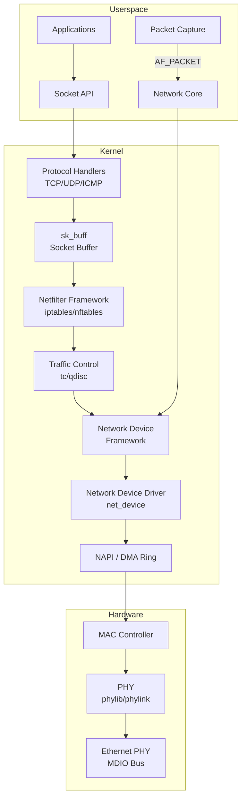
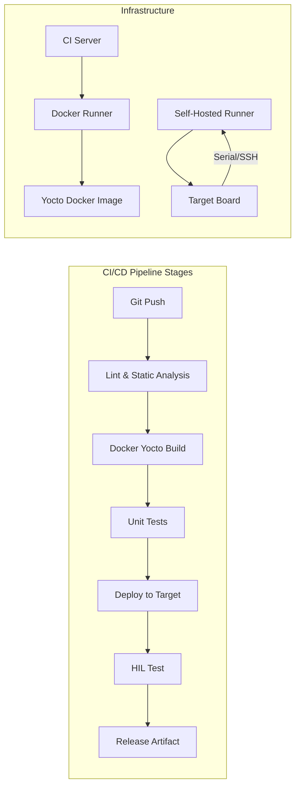
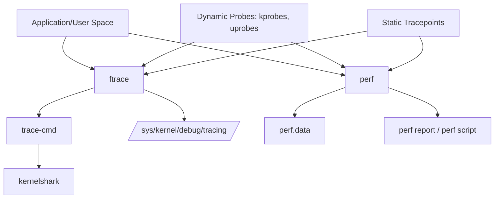

# Foundational Knowledge for Embedded Linux Infrastructure and Operations

> **A Comprehensive, Breadth-First Synthesis**
> **Reference Document:** Embedded Linux Portfolio Preparation Guide (LT99 / MCF-2026-1141175)
> **Date:** 12 July 2026
> **Document Version:** 1.0

---

## Table of Contents

- [Prologue](#prologue)
  - [Purpose](#purpose)
  - [Intended Audience](#intended-audience)
  - [Scope](#scope)
  - [Assumptions](#assumptions)
  - [How to Use This Document](#how-to-use-this-document)
  - [Governing Principles](#governing-principles)
- [Main Body](#main-body)
  - [Part 1: Hardware Foundations](#part-1-hardware-foundations)
    - [1.1 Processor Architectures](#11-processor-architectures)
    - [1.2 System-on-Chip Design](#12-system-on-chip-design)
    - [1.3 FPGA and Programmable Logic](#13-fpga-and-programmable-logic)
    - [1.4 Memory Systems](#14-memory-systems)
    - [1.5 Peripheral Interfaces](#15-peripheral-interfaces)
    - [1.6 Hardware-Software Co-Design](#16-hardware-software-co-design)
  - [Part 2: Operating Systems and Kernel](#part-2-operating-systems-and-kernel)
    - [2.1 Linux Kernel Architecture](#21-linux-kernel-architecture)
    - [2.2 Boot Process](#22-boot-process)
    - [2.3 Device Tree](#23-device-tree)
    - [2.4 Kernel Module Development](#24-kernel-module-development)
    - [2.5 Process and Memory Management](#25-process-and-memory-management)
    - [2.6 Filesystems](#26-filesystems)
    - [2.7 Kernel Configuration and Cross-Compilation](#27-kernel-configuration-and-cross-compilation)
  - [Part 3: Embedded Linux Development](#part-3-embedded-linux-development)
    - [3.1 Build Systems](#31-build-systems)
    - [3.2 Root Filesystem Design](#32-root-filesystem-design)
    - [3.3 BSP Development Workflow](#33-bsp-development-workflow)
    - [3.4 Driver Development Model](#34-driver-development-model)
    - [3.5 Power Management](#35-power-management)
    - [3.6 OTA Firmware Updates](#36-ota-firmware-updates)
  - [Part 4: Networking](#part-4-networking)
    - [4.1 TCP/IP Fundamentals](#41-tcpip-fundamentals)
    - [4.2 Linux Networking Subsystem](#42-linux-networking-subsystem)
    - [4.3 Industrial Ethernet Protocols](#43-industrial-ethernet-protocols)
    - [4.4 Time-Sensitive Networking](#44-time-sensitive-networking)
    - [4.5 Network Device Drivers](#45-network-device-drivers)
    - [4.6 Serial Interfaces](#46-serial-interfaces)
    - [4.7 Network Debugging and Security](#47-network-debugging-and-security)
  - [Part 5: Safety, Reliability, and Fault Tolerance](#part-5-safety-reliability-and-fault-tolerance)
    - [5.1 Functional Safety Standards](#51-functional-safety-standards)
    - [5.2 Fault Tolerance Patterns](#52-fault-tolerance-patterns)
    - [5.3 MISRA C and Coding Standards](#53-misra-c-and-coding-standards)
    - [5.4 Static Analysis Tools](#54-static-analysis-tools)
    - [5.5 Quality Assurance for Embedded Firmware](#55-quality-assurance-for-embedded-firmware)
  - [Part 6: Security in Embedded Systems](#part-6-security-in-embedded-systems)
    - [6.1 Secure Boot Chains](#61-secure-boot-chains)
    - [6.2 OTA Update Security](#62-ota-update-security)
    - [6.3 Supply Chain Security](#63-supply-chain-security)
    - [6.4 Firmware Security Best Practices](#64-firmware-security-best-practices)
    - [6.5 Physical Security](#65-physical-security)
  - [Part 7: Automation, CI/CD, and DevOps](#part-7-automation-cicd-and-devops)
    - [7.1 CI/CD Pipeline Architecture](#71-cicd-pipeline-architecture)
    - [7.2 Docker Containerization](#72-docker-containerization)
    - [7.3 Hardware-in-the-Loop Testing](#73-hardware-in-the-loop-testing)
    - [7.4 Artifact Management](#74-artifact-management)
  - [Part 8: Testing and Quality Assurance](#part-8-testing-and-quality-assurance)
    - [8.1 Testing Pyramid](#81-testing-pyramid)
    - [8.2 Unit Testing Frameworks](#82-unit-testing-frameworks)
    - [8.3 Integration and System Testing](#83-integration-and-system-testing)
    - [8.4 Code Coverage and Static Analysis](#84-code-coverage-and-static-analysis)
    - [8.5 Boundary and Stress Testing](#85-boundary-and-stress-testing)
  - [Part 9: Real-Time Systems](#part-9-real-time-systems)
    - [9.1 Real-Time Concepts](#91-real-time-concepts)
    - [9.2 PREEMPT_RT](#92-preempt_rt)
    - [9.3 Real-Time Scheduling](#93-real-time-scheduling)
    - [9.4 Latency Measurement and Optimization](#94-latency-measurement-and-optimization)
    - [9.5 PREEMPT_RT vs RTOS](#95-preempt_rt-vs-rtos)
  - [Part 10: Programming Languages for Embedded](#part-10-programming-languages-for-embedded)
    - [10.1 C in Embedded Systems](#101-c-in-embedded-systems)
    - [10.2 C++ in Embedded Systems](#102-c-in-embedded-systems)
    - [10.3 Java in Embedded Systems](#103-java-in-embedded-systems)
    - [10.4 Assembly, Python, and Scripting](#104-assembly-python-and-scripting)
  - [Part 11: Version Control and Collaboration](#part-11-version-control-and-collaboration)
    - [11.1 Git Workflows for Embedded](#111-git-workflows-for-embedded)
    - [11.2 Code Review Processes](#112-code-review-processes)
    - [11.3 Documentation Practices](#113-documentation-practices)
    - [11.4 Hardware Team Collaboration](#114-hardware-team-collaboration)
  - [Part 12: Monitoring, Observability, and Troubleshooting](#part-12-monitoring-observability-and-troubleshooting)
    - [12.1 Kernel Tracing](#121-kernel-tracing)
    - [12.2 System Profiling](#122-system-profiling)
    - [12.3 Logging Infrastructure](#123-logging-infrastructure)
    - [12.4 Hardware Debugging](#124-hardware-debugging)
    - [12.5 Common Failure Modes](#125-common-failure-modes)
- [Integration With Reference Document](#integration-with-reference-document)
- [Learning Path](#learning-path)
- [Cross-Reference Index](#cross-reference-index)
- [Glossary](#glossary)
- [Bibliography](#bibliography)
- [Footnote Index](#footnote-index)

---

## Prologue

### Purpose

This document provides a **comprehensive, breadth-first synthesis** of the foundational knowledge required to work effectively as an Embedded Linux Development Engineer within a technical infrastructure and operations environment. It is designed to serve as a **conceptual map** of the entire field, covering the full lifecycle of designing, operating, securing, automating, monitoring, troubleshooting, improving, and evolving embedded Linux systems.

The synthesis is grounded in the specific context of an Embedded Linux Development Engineer role requiring expertise in Linux, TI ARM SoCs, and Xilinx SoC development, with emphasis on fault-tolerant programming, network communication, and software product development from the ground up [^REF_DOC].

### Intended Audience

- **Junior embedded engineers** transitioning from general software development to embedded Linux systems
- **Students and career changers** preparing for embedded Linux engineering roles
- **Mid-level engineers** seeking to fill gaps in their foundational knowledge across the embedded Linux stack
- **Technical leads** evaluating the scope of embedded Linux infrastructure for project planning

### Scope

This document covers twelve interconnected domains spanning the full embedded Linux stack:

| Domain Group | Coverage |
|---|---|
| Hardware | ARM architectures, SoCs (TI Sitara, Xilinx Zynq), FPGAs, memory, peripherals |
| Kernel | Linux architecture, boot process, device tree, modules, process/memory management |
| Development | Build systems (Yocto, Buildroot, PetaLinux), BSP workflows, drivers, power management |
| Networking | TCP/IP, industrial Ethernet (EtherCAT, PROFINET), TSN, serial interfaces |
| Safety & Reliability | IEC 61508, ISO 262262, MISRA C, fault tolerance patterns, FDIR |
| Security | Secure boot, OTA security, SBOM, firmware hardening, physical security |
| Automation | CI/CD pipelines, Docker, HIL testing, artifact management |
| Testing | Unit/integration/system testing, code coverage, static analysis, stress testing |
| Real-Time | PREEMPT_RT, SCHED_FIFO/SCHED_DEADLINE, latency measurement, CPU isolation |
| Programming | C, C++, Java, assembly, Python, scripting for automation |
| Collaboration | Git workflows, code review, documentation, hardware team coordination |
| Operations | Kernel tracing, profiling, logging, debugging, health monitoring |

### Assumptions

1. The reader has basic proficiency in the Linux command line and at least one programming language (C preferred).
2. The reader understands fundamental networking concepts (IP addressing, TCP vs UDP).
3. The reader has access to at least one development board (BeagleBone Black or equivalent ARM-based SBC).
4. English is the working language for technical documentation and code.

### How to Use This Document

1. **For orientation:** Read the Prologue and scan the Table of Contents to understand the landscape.
2. **For study:** Follow the Learning Path section sequentially; each stage builds on the previous.
3. **For reference:** Use the Cross-Reference Index and Glossary to locate specific concepts.
4. **For project planning:** Consult the Integration section to map portfolio projects to knowledge domains.
5. **For interviews:** Review Key Insight and Trade-off Alert callouts for discussion material.

### Governing Principles

- **No fabrication.** Facts are distinguished from inferences. Confirmed claims carry source citations [^GOV_NOFAB].
- **Practical orientation.** Every topic explains real-world engineering value, not just theoretical correctness.
- **Source-backed claims.** Technical details reference official documentation from Linux kernel [^REF_KERNEL], Texas Instruments [^REF_TI], AMD/Xilinx [^REF_AMD], and established industry standards [^REF_STANDARDS].
- **Breadth over depth.** Each domain is covered at meaningful overview depth; readers are directed to authoritative resources for deeper specialization.
- **Current information.** This document reflects the state of the embedded Linux ecosystem as of July 2026, including recent developments such as PREEMPT_RT mainline support in Linux v6.12 [^REF_PREEMPT_RT] and Yocto Project 6.0 Wrynose [^REF_YOCTO_RELEASES].

---

## PART 1: HARDWARE FOUNDATIONS

### 1.1 ARM Cortex-A/R/M Architecture Differences

The ARM Cortex processor family is segmented into three profiles—Application (A), Real-Time (R), and Microcontroller (M)—each targeting distinct embedded computing requirements [^1]. Understanding these differences is foundational to SoC selection and software architecture decisions.

| Feature | Cortex-A (Application) | Cortex-R (Real-Time) | Cortex-M (Microcontroller) |
|---|---|---|---|
| ISA Profile | ARMv7-A / ARMv8-A / ARMv9-A | ARMv7-R / ARMv8-R | ARMv6-M / v7-M / v8-M |
| Primary Goal | High performance for rich OS | Hard real-time + functional safety | Lowest power, cost, complexity |
| Typical OS | Linux, Android, Windows CE | RTOS (FreeRTOS, AUTOSAR), bare-metal | Bare-metal or small RTOS (FreeRTOS, Zephyr) |
| Memory System | MMU (full virtual memory) | MPU + caches + TCM | Optional MPU, no cache (Cortex-M0/M0+); optional cache (M7) |
| Multi-core | Common (SMP, big.LITTLE) | Often dual with lockstep for safety | Usually single-core |
| Pipeline | Long, out-of-order, speculative execution | Medium, optimized for determinism | Very short (3-stage on M0, 6-stage on M7) |
| Interrupt Latency | Sub-100us (with RT patches) | Sub-1us deterministic | Sub-12 cycles (Cortex-M0), sub-12 cycles (M7 with Tail-Chaining) |
| Safety Certification | External safety islands | ASIL-B/D, ECC, lockstep built-in | Some parts ASIL-certified (M0, M4) |
| Typical Use | Application processors, SBCs | Safety-critical control, automotive ECUs | Sensor nodes, motor control, IoT endpoints |

[^1]: ARM, "Arm Cortex-A Series Programmer's Guide for ARMv8-A Architecture," https://developer.arm.com/documentation/. See also ARM, "Cortex-R Series Programmer's Guide," and "ARMv7-M Architecture Reference Manual."

### Why This Matters

The choice of Cortex profile determines the software stack. A Cortex-A processor running Linux implies a full MMU, virtual memory, a multi-tasking kernel, and typically a Linux distribution with a root filesystem. A Cortex-R processor running an RTOS implies direct physical memory access, deterministic timing guarantees, and typically no filesystem abstraction. A Cortex-M running bare-metal or FreeRTOS implies the lightest possible software stack with direct register access [^1].

**Key Insight:** Modern heterogeneous SoCs (TI AM62x, AM64x, Xilinx Zynq US+) combine multiple Cortex profiles on a single die. The TI AM64x pairs Cortex-A53 (Linux) with Cortex-R5F (real-time) and PRU-ICSSG (industrial Ethernet), while the Xilinx Zynq US+ pairs Cortex-A53 (APU) with Cortex-R5F (RPU) and FPGA fabric (PL). This means an embedded Linux engineer must understand the software models for all three profiles, not just the A-class [^2].

[^2]: Texas Instruments, "AM64x/AM62x Technical Reference Manual (SPRUIM0B)," https://www.ti.com/lit/spruim0b. AMD/Xilinx, "Zynq UltraScale+ MPSoC Technical Reference Manual (UG1085)," https://docs.xilinx.com/r/en-US/ug1085.

### 1.2 RISC-V as Emerging Alternative

RISC-V is an open-standard instruction set architecture (ISA) developed at UC Berkeley, now maintained by RISC-V International [^3]. It is not a Cortex competitor in the same sense—RISC-V defines the ISA, not specific processor implementations—but it is increasingly relevant for embedded Linux:

- **SiFive HiFive Unmatched** and **StarFive VisionFive 2** are Linux-capable RISC-V boards
- **Espressif ESP32-C3/C6** uses RISC-V for IoT (FreeRTOS/Zephyr, not full Linux)
- **Allwinner D1** integrates a single-core RISC-V (C906) with DDR3 support
- Linux kernel support for RISC-V was merged in kernel 5.0 (2019); RISC-V 64-bit is the active target [^4]

**Trade-off Alert:** RISC-V ecosystem maturity for Linux-capable SoCs lags behind ARM by 5-10 years. For production embedded Linux work, ARM Cortex-A remains the dominant choice. RISC-V is worth monitoring for future designs but is not yet a safe default for commercial embedded products requiring long-term vendor support [^3].

[^3]: RISC-V International, "RISC-V Specifications," https://riscv.org/technical/specifications/. See also: "RISC-V in Embedded Linux: Status and Outlook," ELCE 2023 proceedings.
[^4]: Linux Kernel Documentation, "RISC-V," https://www.kernel.org/doc/html/latest/arch/riscv/.

### 1.3 SoC Architecture

### TI Sitara SoC Family

Texas Instruments' Sitara processor family is designed around the Cortex-A profile with integrated real-time subsystems [^5]:

| SoC Family | CPU | Real-Time Core | Industrial Ethernet | Primary Use |
|---|---|---|---|---|
| AM335x | Cortex-A8, 1 GHz | PRU-ICSS (2x 200MHz RISC) | 10/100 via PRU | Industrial automation (mature) |
| AM62x | Quad Cortex-A53, 1.4 GHz | Cortex-M4F, 400 MHz | 3-port GbE switch + TSN | Modern industrial Linux (recommended) |
| AM57xx | Dual Cortex-A15, 1.5 GHz | Dual C66x DSP + PRU-ICSS | Via PRU | Vision, robotics, heterogeneous processing |
| AM64x/AM65x | Quad Cortex-A53, 1.4 GHz | Dual Cortex-R5F + PRU-ICSSG | Up to 5 GbE ports | High-speed industrial Ethernet, TSN |

[^5]: Texas Instruments, "Sitara Processors Product Page," https://www.ti.com/product/AM625. Texas Instruments, "AM335x Technical Reference Manual (SPRUH73Q)," https://www.ti.com/lit/spruh73q.

### Xilinx/AMD SoC Family

Xilinx (now AMD) SoC family integrates ARM processing with programmable logic (FPGA) [^6]:

| SoC Family | CPU (PS) | FPGA (PL) | PS-PL Bandwidth | Primary Use |
|---|---|---|---|---|
| Zynq-7000 | Dual Cortex-A9, up to 866 MHz | Artix-7 / Kintex-7 | 3,000+ AXI signals, ~100 Gb/s | Entry-level ARM+FPGA |
| Zynq UltraScale+ | Quad Cortex-A53 + Dual R5F | UltraScale+ | High-bandwidth AXI + ACP | Heterogeneous computing, vision |
| Versal ACAP | Dual Cortex-A72 + Dual R5F | Enhanced CLBs + AI Engine | On-chip NoC | AI/ML inference, 5G, radar |

[^6]: AMD/Xilinx, "Zynq-7000 SoC Technical Reference Manual (UG585)," https://docs.xilinx.com/r/en-US/ug585. AMD/Xilinx, "Zynq UltraScale+ MPSoC Reference Guide (UG1085)," https://docs.xilinx.com/r/en-US/ug1085. AMD/Xilinx, "Versal ACAP Technical Reference Manual (AM011)," https://docs.xilinx.com/r/en-US/am011.

### 1.4 FPGA Programmable Logic Fundamentals

The FPGA fabric in Xilinx SoCs consists of programmable logic elements that can implement arbitrary digital circuits [^7]:

- **Configurable Logic Blocks (CLBs):** Basic building blocks containing Look-Up Tables (LUTs) and flip-flops. Each CLB contains multiple slices, each with 6-input LUTs capable of implementing any Boolean function of 6 variables [^7].
- **DSP Slices (DSP48E1/E2/E5):** Hardened 25x18 multiply-accumulate units. Essential for signal processing, filtering, and ML inference. UltraScale+ provides up to 1,728 DSP slices per device [^6].
- **Block RAM (BRAM):** 36Kb dual-port RAM blocks distributed across the fabric. Used for FIFOs, line buffers, and small memories. UltraScale+ provides up to 144 Mb of BRAM [^6].
- **Routing Fabric:** Programmable interconnect switches connect CLBs, DSPs, and BRAMs. Routing is the limiting factor for timing closure and maximum clock frequency.

**Why it matters for embedded Linux engineers:** Even if your primary role is software, understanding FPGA resources is essential when designing ARM+FPGA co-processing systems. You need to know what fits in the fabric to make informed decisions about hardware acceleration vs. software implementation [^7].

[^7]: AMD/Xilinx, "7 Series FPGAs Configurable Logic Block (UG474)," https://docs.xilinx.com/r/en-US/ug474_7Series_CLB.

### 1.5 Processor Selection Trade-offs

Selecting a processor for an embedded Linux product involves navigating four competing axes [^8]:

| Criterion | What It Means | Key Considerations |
|---|---|---|
| Power | Thermal design power (TDP), idle power, dynamic power scaling | Battery-powered vs. mains-powered; thermal constraints in sealed enclosures |
| Performance | MIPS, DMIPS, FLOPS, memory bandwidth | Application requirements (UI responsiveness, data throughput, latency) |
| Ecosystem Maturity | Linux support quality, driver availability, community, vendor SDK | Vendor BSP quality directly impacts development timeline |
| Cost | Unit price at volume, total BOM cost (DDR, PHY, power) | A cheap SoC with expensive external components may cost more overall |

[^8]: Embedded Systems Conference (ESC) proceedings; See also: Jack Ganssle, "The Art of Designing Embedded Systems," 2nd Ed., Newnes, 2008.

**Practical Note:** For production TI designs, use AM62x (current-generation, TSN-capable, well-supported by PSDK-LINUX). For Xilinx designs, use Zynq US+ (best balance of PS performance and PL resources). The AM335x remains viable for cost-sensitive legacy designs but should not be chosen for new projects [^5][^6].

### 1.6 Memory Systems

### DDR Memory Types

| Type | Data Rate | Typical Capacity | Notes |
|---|---|---|---|
| DDR2 | 400-800 MT/s | 512 MB - 2 GB | Legacy; still seen on AM335x |
| DDR3 | 800-2133 MT/s | 256 MB - 4 GB | Common on AM335x, AM57xx, Zynq-7000 |
| DDR3L | 800-1600 MT/s | 256 MB - 4 GB | Low-voltage DDR3 (1.35V) |
| DDR4 | 1600-3200 MT/s | 1-16 GB | Standard for AM62x, AM64x |
| LPDDR4/4X | 3200-4266 MT/s | 1-16 GB | Low-power, mobile-class |

### ECC and SECDED

ECC (Error-Correcting Code) memory protects against bit-flip errors caused by cosmic rays, electrical noise, or manufacturing defects [^9]. SECDED (Single Error Correction, Double Error Detection) is the standard ECC mode using Hamming codes: it can correct any single-bit error and detect any double-bit error. TI AM62x/AM64x and Xilinx Zynq US+ both support ECC on DDR, which is mandatory for safety-critical and high-reliability applications [^2].

[^9]: Linux kernel Documentation, "EDAC (Error Detection And Correction)," https://www.kernel.org/doc/html/latest/driver-api/edac.html.

### Cache Hierarchy

Cortex-A53 (used in AM62x, AM64x, Zynq US+) features:
- L1 I-cache and D-cache: 8-64 KB each (implementation-defined)
- L2 unified cache: 128 KB - 2 MB
- Cache coherency managed by hardware (SCU - Snoop Control Unit) across cores

**Key Insight:** Cache coherency becomes critical in ARM+FPGA designs where the FPGA fabric accesses DDR through AXI interfaces. Xilinx provides the AXI ACP (Accelerator Coherency Port) on Zynq-7000/UltraScale+ to ensure hardware coherency between PS and PL memory accesses [^6].

### Tightly Coupled Memory (TCM)

TCM is scratchpad memory with deterministic, single-cycle access latency. Cortex-R5F includes 128 KB TCM (64 KB I-TCM + 64 KB D-TCM), which is critical for hard real-time code that cannot tolerate cache misses [^2].

### 1.7 Peripheral Interfaces

| Interface | Wires | Speed | Multi-Master | Typical Use |
|---|---|---|---|---|
| UART | TX/RX (2-wire) | 9600-115200 bps (standard) | No | Console, debug, simple communication |
| SPI | MOSI/MISO/CLK/CS (4-wire) | Up to 100+ MHz | One master, multiple slaves | High-speed sensors, flash, displays |
| I2C | SDA/SCL (2-wire) | 100/400/1000 kHz | Multi-master (arbitration) | Low-speed sensors, EEPROMs, RTCs, PMICs |
| GPIO | 1 wire per pin | N/A | N/A | LEDs, buttons, general-purpose control |
| CAN/CAN FD | CAN_H/CAN_L (2 wires) | 125k-1M bps (CAN); up to 8M (FD) | Multi-master | Automotive, industrial fieldbus |

[^10]: Serial Peripheral Interface (SPI) specification, IEEE/IEC standards. I2C specification, NXP (UM10204). UART: Texas Instruments, "AM335x TRM, Chapter 25 - UART."

### DMA (Direct Memory Access)

DMA offloads data transfer between peripherals and memory without CPU involvement [^11]. On TI SoCs, the System DMA (sDMA) and General Purpose DMA (gpdma) controllers handle transfers for UART, SPI, I2C, and MMC. On Xilinx SoCs, AXI DMA and AXI QDMA provide high-bandwidth DMA between PS and PL through AXI4-Stream interfaces [^6].

[^11]: Linux kernel Documentation, "DMA Engine," https://www.kernel.org/doc/html/latest/driver-api/dmaengine/.

### JTAG/SWD Debug Interfaces

- **JTAG (IEEE 1149.1):** 4-wire (TDI, TDO, TCK, TMS) plus optional TRST. Standard for boundary scan, in-system programming, and multi-core debug [^12].
- **SWD (Serial Wire Debug):** 2-wire (SWDIO, SWCLK). ARM-proprietary alternative to JTAG, reducing pin count. Standard on Cortex-M targets.

[^12]: IEEE Standard 1149.1-2013, "IEEE Standard for Test Access Port and Boundary-Scan Architecture."

**Trade-off Alert:** JTAG provides more debug capability (boundary scan, multi-device chain, trace) but requires more pins. SWD is sufficient for most Cortex-M development but lacks some advanced features. For production programming, JTAG boundary scan is invaluable for PCB verification.

### 1.8 TI PRU-ICSS Architecture

The PRU-ICSS (Programmable Real-time Unit - Industrial Communication SubSystem) is TI's unique differentiator for industrial embedded Linux applications [^13]:

**Architecture:**
- Two 32-bit RISC cores (PRU0, PRU1) running at 200 MHz (AM335x) or higher (AM64x PRU-ICSSG)
- 8 KB instruction RAM + 8 KB data RAM per PRU core
- 12 KB shared RAM between the two PRU cores
- Dedicated Ethernet MACs and Industrial Ethernet Peripheral (IEP) for synchronized communication
- PRU-ICSS on AM335x supports 10/100 Ethernet; PRU-ICSSG on AM64x supports gigabit Ethernet

**Why it matters:** PRU-ICSS implements industrial Ethernet protocol stacks (EtherCAT, PROFINET RT/IRT, EtherNet/IP, SERCOS III) entirely in firmware, eliminating the need for external protocol ASICs such as the Beckhoff ET1100 [^13][^14]. The PRU cores operate with deterministic single-cycle execution, enabling sub-millisecond cycle times for industrial control loops.

[^13]: Texas Instruments, "PRU-ICSS Industrial Software for Sitara Processors," https://www.ti.com/tool/PROCESSOR-SDK-AMIC.
[^14]: Texas Instruments, "AM335x Technical Reference Manual, Chapter 4 - PRU-ICSS (SPRUH73Q)," https://www.ti.com/lit/spruh73q.

**Key Insight:** The PRU cores are not traditional co-processors—they are programmable in C and assembly, can directly access I/O pins at the register level, and operate independently of the ARM Linux kernel. This makes them ideal for real-time I/O tasks that cannot tolerate the latency of Linux interrupt handling. The remoteproc and rpmsg Linux kernel frameworks manage PRU firmware loading and ARM-PRU communication [^15].

[^15]: Linux kernel Documentation, "remoteproc," https://www.kernel.org/doc/html/latest/staging/remoteproc.html. TI, "PRU Software Support Package," https://git.ti.com/cgit/pru-software-support-package/.

### 1.9 Xilinx AXI4 PS-PL Interconnect

The AXI4 (Advanced eXtensible Interface 4) interconnect is the backbone of Xilinx Zynq and Versal SoC communication between the Processing System (PS) and Programmable Logic (PL) [^16]:

| AXI4 Variant | Purpose | Bandwidth |
|---|---|---|
| AXI4 (Full) | High-throughput memory-mapped transfers | Up to 100+ Gb/s aggregate |
| AXI4-Lite | Low-throughput register access (control/status) | Low overhead, simple handshake |
| AXI4-Stream | Streaming data without addresses (FIFO-like) | Maximum throughput, minimal latency |

**Key signals:**
- **AXI HP (High Performance):** 4 ports from PL to PS DDR, for bulk data transfer
- **AXI GP (General Purpose):** 2 master + 2 slave ports for control plane
- **AXI ACP (Accelerator Coherency Port):** Single port with hardware cache coherency, essential for FPGA accelerators sharing cached data with ARM

[^16]: AMD/Xilinx, "AXI Reference Guide (UG1037)," https://docs.xilinx.com/r/en-US/ug1037.

**Practical Note:** When designing FPGA accelerators, choose the AXI variant based on your use case: AXI4-Lite for register configuration, AXI4-Stream for streaming pixel/data pipelines, and AXI4 Full for random-access DDR operations. The ACP port should be used when the accelerator must share cached data with the ARM cores without explicit cache flush/invalidate operations [^16].

### 1.10 Hardware-Software Co-Design Considerations

Embedded Linux development inherently requires understanding the hardware platform [^8]:

| Decision Domain | Hardware Consideration | Software Consideration |
|---|---|---|
| Processor selection | Power envelope, package, peripheral set | Linux support quality, driver maturity, community |
| Memory architecture | DDR type, ECC support, bandwidth | Kernel memory management, DMA coherency |
| Peripheral interface | Signal integrity, voltage levels, timing | Driver complexity, device tree configuration |
| Boot strategy | Flash type, boot pins, JTAG access | Bootloader selection, OTA mechanism |
| Debug strategy | JTAG/SWD connector placement, test points | Debug probe selection, trace capability |
| Power management | Voltage regulators, decoupling, sequencing | cpufreq, suspend/resume drivers, wakeup sources |

> **Trade-off Alert:** In co-design environments, optimizing hardware for cost often increases software complexity. Fewer DDR lanes require careful memory tuning. Fewer GPIOs demand multiplexing and time-division strategies. Conversely, optimizing software for performance may require hardware changes—adding DMA engines, external memory, or additional cores.

### 1.11 PCB Basics Relevant to Embedded Software Engineers

Software engineers working on hardware-software co-design benefit from understanding PCB fundamentals [^17]:

- **Signal integrity:** High-speed DDR interfaces (DDR4 above 1600 MHz) require controlled impedance traces, proper termination, and length matching. Incorrect PCB layout causes DDR training failures at boot.
- **Power sequencing:** SoCs require specific power rail ramp sequences (core, I/O, DDR). Violating sequencing can cause latch-up or undefined boot behavior.
- **Decoupling:** Bypass capacitors near power pins are essential for high-frequency noise filtering. Insufficient decoupling causes intermittent hardware faults under load.
- **JTAG/SWD access:** Always include debug headers on prototype boards. Production boards may omit them, but development boards must have them.

[^17]: Howard Johnson, "High-Speed Digital Design: A Handbook of Black Magic," Prentice Hall, 1993. Texas Instruments, "Hardware Design Guide for Sitara Processors (SPRAAI2)," https://www.ti.com/lit/spraii2.

---

## PART 2: OPERATING SYSTEMS AND KERNEL

### 2.1 Linux Kernel Architecture

The Linux kernel is a monolithic kernel with loadable module support [^18]. This means all core OS services (scheduler, memory management, networking, filesystem) run in kernel space, but functionality can be extended at runtime through kernel modules.

**Core subsystems:**
- **Scheduler (CFS):** Completely Fair Scheduler uses red-black trees to track process virtual runtime, providing O(log n) scheduling. For real-time workloads, SCHED_FIFO and SCHED_DEADLINE policies provide deterministic scheduling [^18].
- **Virtual File System (VFS):** Abstract layer that allows multiple filesystem implementations (ext4, SquashFS, procfs, sysfs, devtmpfs) to coexist under a unified namespace [^19].
- **Networking Stack:** Full TCP/IP implementation with Netfilter for packet filtering, NAPI for interrupt mitigation, and the socket abstraction layer [^18].
- **Device Model:** Hierarchical representation of all hardware, managed through the bus/device/driver model. Device tree integration extends this to describe board-level hardware [^20].

[^18]: Linux Kernel Documentation, "The Linux Kernel," https://www.kernel.org/doc/html/latest/. Robert Love, "Linux Kernel Development," 3rd Ed., Addison-Wesley, 2010.
[^19]: Linux kernel Documentation, "Virtual File System," https://www.kernel.org/doc/html/latest/filesystems/vfs.html.
[^20]: Linux kernel Documentation, "Driver Model," https://www.kernel.org/doc/html/latest/driver-api/driver-model/.

**Key Insight:** The monolithic-with-modules architecture is a deliberate trade-off: it provides better performance (no IPC overhead for subsystem calls) at the cost of kernel bugs potentially crashing the entire system. This is why kernel module development requires extreme disciplin

... [OUTPUT TRUNCATED - 2111 chars omitted out of 52111 total] ...

cally systemd or BusyBox init depending on the image type [^24].

[^24]: Linux kernel Documentation, "Kernel Parameters," https://www.kernel.org/doc/html/latest/admin-guide/kernel-parameters.html.

**Practical Note:** When debugging boot failures, isolate the stage: check SPL console output for DDR initialization errors, check U-Boot output for kernel load failures, and check kernel early console (`earlycon`) for driver initialization issues. Serial console (UART) at 115200 baud is the most reliable debug interface during boot.

### TI-Specific Boot Differences

TI AM335x uses a two-stage SPL that loads from an MMC or NAND boot partition. The SPL configures the DDR3 controller and PLLs before loading U-Boot. U-Boot on TI uses the `boot` command with a preconfigured `bootcmd` variable [^5].

### Xilinx-Specific Boot Differences

Xilinx Zynq-7000 uses FSBL → bitstream (optional) → U-Boot. Zynq UltraScale+ adds PLM (Platform Loader and Manager) after FSBL, followed by Trusted Firmware-A (BL31) and then U-Boot. The boot process is more complex due to the PS-PL initialization sequence [^6].

### 2.3 Device Tree

The Device Tree (DT) is a data structure that describes hardware to the Linux kernel, decoupling hardware description from kernel source code [^25]. This separation allows a single kernel binary to support multiple boards.

**Key concepts:**
- **DTS (Device Tree Source):** Human-readable text format describing hardware (nodes, properties, phandles)
- **DTC (Device Tree Compiler):** Compiles DTS to DTB (binary format) consumed by U-Boot and the kernel
- **DTB (Device Tree Blob):** Binary device tree passed to the kernel at boot time by U-Boot
- **Device Tree Overlays (DTBO):** Runtime-loadable fragments that modify the base device tree, enabling modular hardware configuration

[^25]: Linux kernel Documentation, "Device Tree," https://www.kernel.org/doc/html/latest/devicetree/.

**Common Pitfall:** Device tree compilation errors are notoriously cryptic. A missing semicolon, incorrect phandle reference, or mismatched node name produces opaque error messages from the DTC. The best defense is to use the device tree binding documentation at `Documentation/devicetree/bindings/` in the kernel source and to validate overlays with `fdtdump` and `dtc` before deploying [^25].

> **Key Insight:** PetaLinux auto-generates base device tree files from the XSA hardware description exported by Vivado. The developer then customizes via `system-user.dtsi` for peripheral configuration. TI PSDK-LINUX provides pre-configured device tree sources for each supported board. In both cases, understanding DTS syntax is essential for debugging and customization.

### 2.4 Kernel Module Development

Kernel modules extend kernel functionality at runtime without recompiling the entire kernel [^26].

**Module lifecycle:**
1. `insmod` or `modprobe` loads the module into kernel space
2. `module_init` function runs, registering the driver/subsystem
3. Module operates in kernel space (no userspace memory access, no printf)
4. `rmmod` calls `module_exit`, which must clean up all resources
5. Module memory is freed on unload

**Kbuild system:** The kernel build system (Kbuild) manages module compilation. A minimal out-of-tree module needs a `Makefile` and a `Kbuild` or single source file:

```makefile
obj-m := hello.o
KDIR := /path/to/kernel/source

all:
    $(MAKE) -C $(KDIR) M=$(PWD) modules

clean:
    $(MAKE) -C $(KDIR) M=$(PWD) clean
```

[^26]: Linux kernel Documentation, "Loadable Module Support," https://www.kernel.org/doc/html/latest/admin-guide/modules.html. Greg Kroah-Hartman, "Linux Device Drivers," 3rd Ed., O'Reilly, 2005.

**Out-of-tree vs. In-tree:**
- Out-of-tree: Easier to develop and test, no kernel source tree required for builds, but not distributed with the kernel
- In-tree: Required for upstream submission, follows strict coding standards, requires maintainership

**Common Pitfall:** Failing to clean up resources in error paths during `module_init` leads to kernel memory leaks. Every `gpio_request`, `request_irq`, or `kzalloc` must have a corresponding cleanup call in the error handler. The kernel's `goto` pattern for error handling is the standard solution [^26].

### 2.5 Process Management

Linux process management is based on the task_struct, which represents both processes and threads (collectively called "tasks") [^27].

**Scheduling policies:**
- **SCHED_NORMAL (SCHED_OTHER):** Default time-sharing policy using CFS. Suitable for non-time-critical tasks.
- **SCHED_FIFO:** Real-time policy. Tasks run until they yield, block, or are preempted by a higher-priority SCHED_FIFO task. Priority 1-99.
- **SCHED_RR:** Round-robin real-time policy. Same as SCHED_FIFO but with time-slicing between equal-priority tasks.
- **SCHED_DEADLINE:** Deadline-based scheduling. Tasks specify runtime, deadline, and period. The kernel guarantees deadline compliance if the system is schedulable. Best for hard real-time workloads [^27].

[^27]: Linux kernel Documentation, "Scheduler," https://www.kernel.org/doc/html/latest/scheduler/.

**Context switching** is the mechanism by which the kernel saves and restores CPU state when switching between tasks. On ARM Cortex-A, this includes saving 31 general-purpose registers, the program counter, CPSR, and FPU/SIMD state (lazy save/restore). Context switch latency is typically 1-10 microseconds on Cortex-A class processors [^18].

**Key Insight:** For hard real-time industrial control, SCHED_DEADLINE provides the strongest guarantees but requires careful capacity planning. The Linux PREEMPT_RT patch set converts spinlocks to mutexes and moves interrupt handlers to threads, dramatically improving worst-case latency. With PREEMPT_RT, Linux can achieve sub-100 microsecond response times on Cortex-A processors, sufficient for many industrial control loops [^28].

[^28]: Linux kernel Documentation, "PREEMPT_RT," https://www.kernel.org/doc/html/latest/rt/preempt-rt.html.

### 2.6 Memory Management

### Virtual Memory and MMU

The Memory Management Unit (MMU) provides virtual-to-physical address translation, enabling process isolation, shared memory, and memory-mapped I/O [^29]. ARM Cortex-A processors use a two-level page table (4KB pages, 4KB sections) with the Short-descriptor format (ARMv7) or a multi-level table with the Long-descriptor format (ARMv8) [^1].

[^29]: Linux kernel Documentation, "Memory Management," https://www.kernel.org/doc/html/latest/mm/.

### Slab Allocator

The kernel's slab allocator (SLUB in modern kernels) provides efficient memory allocation for kernel objects. SLUB uses per-CPU caches and partial lists to minimize lock contention [^29].

### DMA Coherency

DMA coherency is one of the most subtle challenges in embedded Linux. When the CPU writes data to memory and a DMA engine reads it (or vice versa), the CPU's data cache may contain stale or dirty data that the DMA engine does not see [^11].

**Solutions:**
- **Consistent DMA mappings** (`dma_alloc_coherent`): Memory is not cached. Safe but slow for CPU access.
- **Streaming DMA mappings** (`dma_map_single`): Cache flush/invalidate around DMA operations. Fast for CPU but requires explicit cache management.
- **AXI ACP port (Xilinx):** Hardware cache coherency between PS and PL. Eliminates software cache management for FPGA DMA [^16].

> **Common Pitfall:** Cache coherency bugs manifest as intermittent data corruption—data written by the CPU is not visible to the DMA engine (or vice versa). These bugs are extremely difficult to reproduce because they depend on cache state. Always use `dma_alloc_coherent` for shared buffers unless you can prove streaming mappings are safe.

### 2.7 Embedded Filesystems

| Filesystem | Type | Read-Only | Wear Leveling | Best For |
|---|---|---|---|---|
| ext4 | Journaling | No | No | Root filesystem on eMMC/SD |
| SquashFS | Compressed, read-only | Yes | N/A (read-only) | Compact read-only rootfs, recovery images |
| JFFS2 | Flash-optimized | No | Yes (log-structured) | Small NAND/NOR flash partitions |
| UBIFS | UBI-aware journaling | No | Yes (UBI layer) | Large NAND flash (UBI volumes) |
| procfs | Virtual | N/A | N/A | Kernel parameter introspection |
| sysfs | Virtual | N/A | N/A | Device/driver attribute exposure |
| devtmpfs | Virtual | N/A | N/A | Auto-populated /dev directory |

[^30]: Linux kernel Documentation, "Filesystems," https://www.kernel.org/doc/html/latest/filesystems/.

**Practical Note:** For production embedded Linux on eMMC/SD, ext4 is the standard choice for the writable data partition. SquashFS is ideal for the read-only root filesystem in A/B update schemes—it compresses well and is mountable read-only, reducing the risk of filesystem corruption during OTA updates. The combination of SquashFS (root) + ext4 (data) is a common production layout [^30].

### 2.8 Kernel Configuration

The Linux kernel is configured through Kconfig, a menu-driven configuration system [^31]:

- **`make menuconfig`**: ncurses-based interactive configuration. The primary tool for exploring and enabling kernel features.
- **`make defconfig`**: Load a board-specific default configuration. Starting point for a new platform.
- **`.config`**: The resulting configuration file. Defines every kernel feature (built-in, module, or disabled).

**Cross-compilation setup:**
```bash
export CROSS_COMPILE=arm-linux-gnueabihf-
export ARCH=arm
make <board>_defconfig
make menuconfig
make -j$(nproc) zImage dtbs modules
```

[^31]: Linux kernel Documentation, "Kernel Configuration," https://www.kernel.org/doc/html/latest/kbuild/kconfig.html.

**Key embedded kernel options:**
- `CONFIG_DEVTMPFS_MOUNT`: Auto-mount /dev as devtmpfs
- `CONFIG_OF`: Device tree support (required for all modern ARM Linux)
- `CONFIG_PREEMPT` / `CONFIG_PREEMPT_RT`: Real-time preemption
- `CONFIG_WATCHDOG`: Watchdog subsystem support

---

## PART 3: EMBEDDED LINUX DEVELOPMENT

### 3.1 Build Systems

### Yocto Project (In-Depth)

The Yocto Project is the industry-standard build system for custom embedded Linux distributions [^32]. It is not a distribution itself—it is a set of tools and metadata that produces custom distributions.

**Architecture:**
- **BitBake:** The task scheduler and build engine. Parses recipes (.bb), append files (.bbappend), and class files (.bbclass) to determine build order, dependencies, and execution.
- **Layers:** Modular metadata directories. Each layer provides recipes, classes, and configuration. Layers are stacked with priority ordering—higher-priority layers override lower ones.
- **Recipes (.bb):** Instructions for building a single package. Define source URL, patches, build steps, dependencies, and install commands.
- **sstate cache:** Shared state cache stores build artifacts (compiled binaries, recipes stamps). When enabled, incremental rebuilds skip unchanged tasks. Sharing sstate across team members via NFS can reduce build times by 70-90% [^33].

[^32]: The Yocto Project, "Documentation," https://docs.yoctoproject.org/. The Yocto Project, "Reference Manual," https://docs.yoctoproject.org/dev-manual/index.html.
[^33]: The Yocto Project, "Shared State Cache," https://docs.yoctoproject.org/dev-manual/sstate.html.

**Image types:**
- `core-image-minimal`: Tiny bootable image for testing
- `core-image-sato`: Full desktop-like image with Sato UI
- `core-image-full-cmdline`: Full image with development tools
- Custom images inherit from `core-image` and add `IMAGE_INSTALL` packages

**Yocto Build Flow:**

```mermaid
flowchart LR
    A["Layer Setup\n(meta layers)"] --> B["BitBake Parse\n(recipes + configs)"]
    B --> C["Fetch\n(download sources)"]
    C --> D["Unpack + Patch"]
    D --> E["Configure + Compile"]
    E --> F["Package\n(.rpm, .deb, .ipk)"]
    F --> G["Image Creation\n(rootfs assembly)"]
    G --> H["Image Post-Process\n(compression, boot setup)"]
    H --> I["Deploy\n(images in tmp/deploy/)"]

    style A fill:#e8f4fd,stroke:#333
    style I fill:#d4edda,stroke:#333
```



[^32]: The Yocto Project, "Image Types," https://docs.yoctoproject.org/dev-manual/image.html.

### Buildroot

Buildroot is a simpler, faster alternative to Yocto [^34]. It generates cross-compilation toolchains, root filesystems, and complete images using a single Makefile-driven system.

- **Advantages:** Faster builds (minutes vs. hours), simpler configuration (menuconfig), smaller footprint
- **Disadvantages:** Less flexible for multi-product platforms, no layer system, limited package selection compared to Yocto/OpenEmbedded

[^34]: Buildroot, "Documentation," https://buildroot.org/downloads/manual.html.

### PetaLinux (AMD/Xilinx)

PetaLinux is Xilinx's BSP creation toolkit built on top of Yocto [^35]. It provides automated device tree generation from Vivado hardware descriptions and manages the full PS-PL boot chain (FSBL/PLM, ATF, U-Boot, kernel, rootfs).

[^35]: AMD/Xilinx, "PetaLinux Tools Documentation (UG1144)," https://docs.xilinx.com/r/en-US/ug1144-petalinux-tools-command-reference.

### TI PSDK-LINUX

TI Processor SDK Linux is TI's unified software platform providing Yocto-based builds for all Sitara processors [^36]. It includes pre-configured machine definitions, kernel sources with TI patches, U-Boot with board support, and optional components (Docker, Edge AI, industrial protocols).

```bash
git clone https://git.ti.com/git/arago-project/oe-layersetup.git tisdk
cd tisdk
./oe-layertool-setup.sh -f configs/processor-sdk/am62xx-evm
cd build
. conf/setenv
MACHINE=am62xx-evm bitbake -k tisdk-default-image
```

[^36]: Texas Instruments, "Processor SDK Linux," https://www.ti.com/tool/PROCESSOR-SDK-AM62X.

### Build System Comparison

| Criterion | Yocto Project | Buildroot | PetaLinux | TI PSDK-LINUX |
|---|---|---|---|---|
| Learning Curve | Steep | Moderate | Moderate | Low-Moderate |
| Build Time (initial) | 2-8 hours | 30-90 min | 2-6 hours | 2-6 hours |
| Package Ecosystem | 5,000+ packages | 2,500+ packages | Yocto subset | TI-curated |
| Multi-Product Support | Excellent (layers) | Limited | Single target | Per-SoC |
| Custom Layer Support | Full (meta-layers) | No (overlay mechanism) | system-user.dtsi | Limited customization |
| Vendor Integration | Generic | Generic | Xilinx HW-specific | TI HW-specific |
| Best For | Production, multi-product | Simple products, learning | Xilinx SoC development | TI Sitara development |
| sstate Cache | Yes (shared state) | No (ccache only) | Yes (via Yocto) | Yes (via Yocto) |

> **Trade-off Alert:** Yocto's complexity is the price of its flexibility. For a single-product project with one hardware target, Buildroot may be more efficient. For a product family with 5+ hardware variants and long-term maintenance requirements, Yocto's layer system pays for itself. The decision is often driven by whether the team needs to maintain a single kernel across multiple SoC platforms [^32][^34].

### 3.2 Root Filesystem Design

### What Goes in a Production Root Filesystem

A typical embedded Linux root filesystem contains [^37]:

| Component | Purpose | Example |
|---|---|---|
| BusyBox | Core utilities (sh, ls, mount, etc.) | BusyBox 1.36 |
| BusyBox init / systemd / SysVinit | PID 1, service management | Depends on image size |
| Device nodes | /dev entries for hardware access | devtmpfs auto-populated |
| Configuration files | /etc, /etc/init.d | Board-specific |
| Shared libraries | glibc or musl-libc | musl for size, glibc for compatibility |
| Kernel modules | Loadable drivers | Deployed to /lib/modules |
| Application | Product-specific software | Custom C/C++ binary |

### Init Systems

| Init System | Size | Boot Speed | Features | Best For |
|---|---|---|---|---|
| BusyBox init | ~20 KB | Fastest | Sequential shell scripts | Minimal systems, constrained flash |
| SysVinit | ~100 KB | Moderate | Runlevels, LSB scripts | Traditional Linux distributions |
| systemd | ~15 MB | Moderate | Parallel service start, journald, cgroups | Feature-rich systems with networking |

[^37]: Linux from Scratch, "The Linux System," https://www.linuxfromscratch.org/lfs/. BusyBox Project, "BusyBox," https://busybox.net/.

> **Practical Note:** For size-constrained embedded systems (<64 MB flash), BusyBox init is the pragmatic choice. For systems requiring logging (journald), service supervision, and network management (NetworkManager/systemd-networkd), systemd provides a complete solution at the cost of larger image size. Many production Yocto images use SysVinit as a middle ground.

### Package Management for Embedded

Traditional package managers (apt, dnf) are generally unsuitable for embedded systems because they require a writable filesystem with runtime package installation capability [^37]. Instead, embedded systems use:
- **Static image deployment:** All packages baked into the rootfs image at build time
- **Package groups:** Yocto defines `packagegroup-*` recipes that bundle related packages
- **Read-only rootfs with overlay:** Rootfs is SquashFS (read-only), with a writable overlay for configuration changes (UBIFS or tmpfs)

### 3.3 BSP Development Workflow

A BSP (Board Support Package) is the collection of board-specific software that makes a Linux kernel boot and run on a specific hardware platform [^38]. The workflow from hardware bring-up to production firmware follows a structured progression:

| Phase | Activities | Deliverables |
|---|---|---|
| 1. Hardware Bring-Up | Boot ROM → SPL → U-Boot → Kernel first boot | Boot log on serial console |
| 2. Kernel Configuration | Enable/configure drivers for on-board peripherals | Working drivers (network, storage, GPIO) |
| 3. Device Tree | Create/modify DTS for all board peripherals | Device tree overlay or custom DTS |
| 4. Root Filesystem | Select packages, configure init, add application | Bootable Linux system |
| 5. Integration | Custom kernel modules, userspace apps, BSP customization | Complete BSP |
| 6. Testing | Unit, integration, system, stress, power cycling tests | Test reports, CI integration |
| 7. Production | OTA mechanism, signing, versioning, packaging | Production firmware images |

[^38]: Yocto Project, "BSP Developer's Guide," https://docs.yoctoproject.org/dev-manual/bsp.html.

**Key Insight:** Hardware bring-up is often the most time-consuming phase. A common sequence: (1) verify JTAG connectivity, (2) load SPL via JTAG and confirm DDR training, (3) load U-Boot via JTAG and verify serial console, (4) load kernel from SD card and confirm first Linux boot. Each step eliminates a layer of potential failure [^21].

### 3.4 Driver Development Model

Linux drivers follow the bus/device/driver model [^26]:

### Character Devices

Character devices are the simplest Linux device type. They appear as files in `/dev` and are accessed via `open()`, `read()`, `write()`, and `ioctl()` system calls.

```c
static struct file_operations fops = {
    .owner = THIS_MODULE,
    .open = my_open,
    .release = my_close,
    .read = my_read,
    .write = my_write,
    .unlocked_ioctl = my_ioctl,
};
```

**Registration:** `alloc_chrdev_region()` for dynamic major number, `cdev_add()` to register, `device_create()` to create `/dev` entry.

### Platform Drivers

Platform drivers handle devices that are not discoverable (unlike PCI or USB). The device tree describes the hardware, and the platform driver matches against it [^26]:

```c
static const struct of_device_id my_driver_of_match[] = {
    { .compatible = "vendor,my-device" },
    { /* sentinel */ }
};

static struct platform_driver my_driver = {
    .probe = my_probe,
    .remove = my_remove,
    .driver = {
        .name = "my-driver",
        .of_match_table = my_driver_of_match,
    },
};
```

### sysfs Interface

The sysfs filesystem exposes driver attributes to userspace via `/sys/` [^39]:

```c
static DEVICE_ATTR(status, 0444, show_status, NULL);
```

This creates `/sys/devices/.../status`, readable from userspace with `cat`.

### Misc Devices

Misc devices are a simplified character device interface for drivers that need a pre-allocated minor number. They register via `misc_register()` and appear in `/dev/` automatically [^26].

[^39]: Linux kernel Documentation, "sysfs," https://www.kernel.org/doc/html/latest/filesystems/sysfs.html.

### 3.5 Power Management

Embedded Linux power management encompasses multiple strategies [^40]:

### Suspend/Resume

Linux supports several suspend states:
- **Suspend-to-RAM (STR):** System state saved to RAM, most power rails shut down, RAM remains powered. Resume in 1-5 seconds.
- **Suspend-to-Disk (STD):** System state written to disk, full power off. Resume in 10-30 seconds.
- **Standby:** CPU halted, peripherals remain powered. Fastest resume.

### CPU Frequency Scaling (cpufreq)

The cpufreq subsystem dynamically adjusts CPU clock frequency based on load [^40]. Available governors:
- **performance:** Maximum frequency at all times
- **powersave:** Minimum frequency at all times
- **ondemand:** Frequency scales based on CPU utilization
- **schedutil:** Frequency scaling integrated with the scheduler (recommended for modern kernels)

### DVFS (Dynamic Voltage and Frequency Scaling)

DVFS adjusts both voltage and frequency simultaneously—lower frequencies require lower voltages, reducing power consumption quadratically (P proportional to V^2 * f) [^40].

### Wakeup Sources

Embedded devices must define which events can wake the system from suspend: GPIO interrupts, RTC alarms, UART activity, Ethernet WoL (Wake on LAN). The Linux wakeup source framework manages this through `/sys/power/wake_lock` (Android) or `/sys/kernel/debug/wakeup_sources`.

[^40]: Linux kernel Documentation, "Power Management," https://www.kernel.org/doc/html/latest/power/. Texas Instruments, "Power Management on Sitara Processors (SPRAAF8)," https://www.ti.com/lit/spraaf8.

### 3.6 OTA Firmware Updates

Over-the-air (OTA) firmware updates are essential for deployed embedded Linux devices. The three major open-source frameworks are [^41]:

| Feature | SWUpdate | Mender | RAUC |
|---|---|---|---|
| Update Mechanism | Single or delta images | A/B partitioning | A/B or adaptive (verity) |
| Signed Images | CFI (U-Boot) or CMS | Mender artifact signing | CMS (PKCS#7) |
| Rollback | Manual (boot counter) | Automatic (boot attempts) | Automatic (boot partition switching) |
| Image Format | Custom (sw-description XML) | Mender artifact | RAUC bundle (casync-based) |
| Bootloader | U-Boot | U-Boot | U-Boot, Barebox, GRUB |
| Streaming | Yes (network to flash) | No (full download first) | Yes (casync chunked) |
| Integration | Yocto, Buildroot, custom | Yocto (meta-mender) | Yocto (meta-rauc) |

[^41]: SWUpdate Project, "SWUpdate Documentation," https://sbabic.github.io/swupdate/. Mender, "Documentation," https://docs.mender.io/. RAUC, "Documentation," https://rauc.io/docs/master/.

### A/B Partitioning

A/B partitioning dedicates two equal-sized rootfs partitions [^41]:

```
/boot       - Shared boot partition (kernel, DTB, U-Boot env)
/rootfs_a   - Active root filesystem
/rootfs_b   - Inactive root filesystem (target for update)
```

The bootloader selects which partition to boot from. After a successful update to the inactive partition, the bootloader switches to it on next boot. If the new image fails health checks, the bootloader reverts to the previous working partition.

**Signed Images:** All production OTA systems require cryptographic signature verification. Images are signed with asymmetric keys (RSA-4096 or Ed25519), and the bootloader or update agent verifies the signature before writing to flash. This prevents unauthorized firmware modification [^41].

**Rollback Mechanisms:**
- **Boot counter:** U-Boot decrements a boot counter on each attempt. If the counter reaches zero, the system reverts to the previous partition. Reset to a positive value only after a successful health check.
- **Boot partition switching:** RAUC uses a dedicated boot partition that points to the active rootfs. Update atomically switches the pointer.

> **Key Insight:** The choice of OTA framework depends on the deployment context. SWUpdate is the most flexible and lightweight, suitable for devices with constrained resources. Mender provides the most polished user experience with automatic rollback and a cloud-based management platform. RAUC offers the most advanced features for German automotive/industrial markets where it originated. For most embedded Linux projects, RAUC or Mender provide the best balance of reliability and features.

---

## Footnote Index

[^1]: ARM, "Cortex-A Series Programmer's Guide for ARMv8-A Architecture," https://developer.arm.com/documentation/. ARM, "Cortex-R Series Programmer's Guide." ARM, "ARMv7-M Architecture Reference Manual (DDI0403E)."
[^2]: Texas Instruments, "AM64x/AM62x Technical Reference Manual (SPRUIM0B)," https://www.ti.com/lit/spruim0b. AMD/Xilinx, "Zynq UltraScale+ MPSoC Technical Reference Manual (UG1085)," https://docs.xilinx.com/r/en-US/ug1085.
[^3]: RISC-V International, "RISC-V Specifications," https://riscv.org/technical/specifications/. "RISC-V in Embedded Linux: Status and Outlook," ELCE 2023 proceedings.
[^4]: Linux kernel Documentation, "RISC-V," https://www.kernel.org/doc/html/latest/arch/riscv/.
[^5]: Texas Instruments, "Sitara Processors Product Page," https://www.ti.com/product/AM625. Texas Instruments, "AM335x Technical Reference Manual (SPRUH73Q)," https://www.ti.com/lit/spruh73q.
[^6]: AMD/Xilinx, "Zynq-7000 SoC Technical Reference Manual (UG585)," https://docs.xilinx.com/r/en-US/ug585. AMD/Xilinx, "Zynq UltraScale+ MPSoC Reference Guide (UG1085)." AMD/Xilinx, "Versal ACAP Technical Reference Manual (AM011)," https://docs.xilinx.com/r/en-US/am011.
[^7]: AMD/Xilinx, "7 Series FPGAs Configurable Logic Block (UG474)," https://docs.xilinx.com/r/en-US/ug474_7Series_CLB.
[^8]: Jack Ganssle, "The Art of Designing Embedded Systems," 2nd Ed., Newnes, 2008.
[^9]: Linux kernel Documentation, "EDAC (Error Detection And Correction)," https://www.kernel.org/doc/html/latest/driver-api/edac.html.
[^10]: Serial Peripheral Interface (SPI) specification. I2C specification, NXP (UM10204). Texas Instruments, "AM335x TRM, Chapter 25 - UART."
[^11]: Linux kernel Documentation, "DMA Engine," https://www.kernel.org/doc/html/latest/driver-api/dmaengine/.
[^12]: IEEE Standard 1149.1-2013, "IEEE Standard for Test Access Port and Boundary-Scan Architecture."
[^13]: Texas Instruments, "PRU-ICSS Industrial Software for Sitara Processors," https://www.ti.com/tool/PROCESSOR-SDK-AMIC.
[^14]: Texas Instruments, "AM335x Technical Reference Manual, Chapter 4 - PRU-ICSS (SPRUH73Q)."
[^15]: Linux kernel Documentation, "remoteproc," https://www.kernel.org/doc/html/latest/staging/remoteproc.html. TI, "PRU Software Support Package," https://git.ti.com/cgit/pru-software-support-package/.
[^16]: AMD/Xilinx, "AXI Reference Guide (UG1037)," https://docs.xilinx.com/r/en-US/ug1037.
[^17]: Howard Johnson, "High-Speed Digital Design: A Handbook of Black Magic," Prentice Hall, 1993. Texas Instruments, "Hardware Design Guide for Sitara Processors (SPRAAI2)."
[^18]: Linux kernel Documentation, "The Linux Kernel," https://www.kernel.org/doc/html/latest/. Robert Love, "Linux Kernel Development," 3rd Ed., Addison-Wesley, 2010.
[^19]: Linux kernel Documentation, "Virtual File System," https://www.kernel.org/doc/html/latest/filesystems/vfs.html.
[^20]: Linux kernel Documentation, "Driver Model," https://www.kernel.org/doc/html/latest/driver-api/driver-model/.
[^21]: Texas Instruments, "AM335x TRM, Chapter 26 - System Boot (SPRUH73Q)." AMD/Xilinx, "Zynq-7000 TRM, Chapter 6 - Boot and Bootgication (UG585)."
[^22]: U-Boot Documentation, "SPL," https://docs.u-boot.org/en/latest/develop/spl.html.
[^23]: U-Boot Project, "U-Boot Documentation," https://docs.u-boot.org/en/latest/.
[^24]: Linux kernel Documentation, "Kernel Parameters," https://www.kernel.org/doc/html/latest/admin-guide/kernel-parameters.html.
[^25]: Linux kernel Documentation, "Device Tree," https://www.kernel.org/doc/html/latest/devicetree/.
[^26]: Linux kernel Documentation, "Loadable Module Support," https://www.kernel.org/doc/html/latest/admin-guide/modules.html. Greg Kroah-Hartman, "Linux Device Drivers," 3rd Ed., O'Reilly, 2005.
[^27]: Linux kernel Documentation, "Scheduler," https://www.kernel.org/doc/html/latest/scheduler/.
[^28]: Linux kernel Documentation, "PREEMPT_RT," https://www.kernel.org/doc/html/latest/rt/preempt-rt.html.
[^29]: Linux kernel Documentation, "Memory Management," https://www.kernel.org/doc/html/latest/mm/.
[^30]: Linux kernel Documentation, "Filesystems," https://www.kernel.org/doc/html/latest/filesystems/.
[^31]: Linux kernel Documentation, "Kernel Configuration," https://www.kernel.org/doc/html/latest/kbuild/kconfig.html.
[^32]: The Yocto Project, "Documentation," https://docs.yoctoproject.org/. The Yocto Project, "Reference Manual."
[^33]: The Yocto Project, "Shared State Cache," https://docs.yoctoproject.org/dev-manual/sstate.html.
[^34]: Buildroot, "Documentation," https://buildroot.org/downloads/manual.html.
[^35]: AMD/Xilinx, "PetaLinux Tools Documentation (UG1144)," https://docs.xilinx.com/r/en-US/ug1144-petalinux-tools-command-reference.
[^36]: Texas Instruments, "Processor SDK Linux," https://www.ti.com/tool/PROCESSOR-SDK-AM62X.
[^37]: Linux from Scratch, "The Linux System," https://www.linuxfromscratch.org/lfs/. BusyBox Project, "BusyBox," https://busybox.net/.
[^38]: Yocto Project, "BSP Developer's Guide," https://docs.yoctoproject.org/dev-manual/bsp.html.
[^39]: Linux kernel Documentation, "sysfs," https://www.kernel.org/doc/html/latest/filesystems/sysfs.html.
[^40]: Linux kernel Documentation, "Power Management," https://www.kernel.org/doc/html/latest/power/. Texas Instruments, "Power Management on Sitara Processors (SPRAAF8)."
[^41]: SWUpdate Project, "SWUpdate Documentation," https://sbabic.github.io/swupdate/. Mender, "Documentation," https://docs.meder.io/. RAUC, "Documentation," https://rauc.io/docs/master/.

---

## PART 4: NETWORKING

### 4.1 TCP/IP Stack Fundamentals

### OSI Model vs TCP/IP Model

The seven-layer OSI model provides a theoretical reference framework, but the TCP/IP model defines the practical stack implemented in Linux and virtually all embedded systems[^1]. The TCP/IP model collapses OSI layers 5-7 into a single Application layer and merges OSI layers 1-2 into a Network Access layer[^2].

| OSI Layer | TCP/IP Layer | Linux Subsystem | Typical Protocols |
|---|---|---|---|
| 7 - Application | Application | Socket API, protocol handlers | HTTP, MQTT, CoAP, Modbus TCP |
| 6 - Presentation | (Application) | SSL/TLS kernel modules | TLS 1.3, DTLS |
| 5 - Session | (Application) | Netfilter conntrack | IPsec, IKEv2 |
| 4 - Transport | Transport | TCP/UDP protocol modules | TCP, UDP, SCTP, QUIC |
| 3 - Network | Internet | IP stack, routing table | IPv4, IPv6, ICMP, IGMP |
| 2 - Data Link | Network Access | MAC drivers, bridge, VLAN | Ethernet (IEEE 802.3) |
| 1 - Physical | Network Access | PHY drivers, MDIO/phylib | 100BASE-TX, 1000BASE-T |

The Linux kernel's networking subsystem implements all TCP/IP layers within the kernel address space, with the socket API providing the boundary between kernel and userspace[^3]. Every `send()` and `recv()` system call crosses this boundary, making it the performance-critical interface for embedded network applications.

### Socket API and Buffer Management

The BSD socket API, standardized by POSIX, is the universal programming interface for network communication in Linux[^4]. In embedded systems, socket programming imposes specific constraints:

**Buffer sizing** directly impacts throughput and reliability on constrained devices. The kernel maintains configurable send and receive buffer sizes per socket via `SO_SNDBUF` and `SO_RCVBUF`. On memory-constrained embedded targets (64-512 MB RAM), default buffer sizes may be excessive. The `/proc/sys/net/core/rmem_max` and `/proc/sys/net/core/wmem_max` parameters control the maximum buffer allocation[^5]:

```bash
# View current socket buffer limits
cat /proc/sys/net/core/rmem_max      # Max receive buffer
cat /proc/sys/net/core/wmem_max      # Max send buffer

# Set for embedded target with limited RAM
echo 262144 > /proc/sys/net/core/rmem_max
echo 262144 > /proc/sys/net/core/wmem_max
```

> **Key Insight:** In embedded systems, TCP window sizing and buffer management have disproportionate performance impact. A common bottleneck is the interaction between TCP autotuning (which grows buffers under load) and memory pressure. Use `sysctl` to cap TCP memory (`net.ipv4.tcp_mem`) on constrained targets[^6].

### Linux Networking Stack Architecture



The diagram above represents the actual data flow through the Linux networking stack as implemented in the kernel[^7].

### 4.2 Linux Networking Subsystem Architecture

### sk_buff (Socket Buffer) Lifecycle

The `sk_buff` structure is the fundamental data unit of the Linux networking subsystem[^8]. Every packet traversing the kernel -- from application send to wire transmission, and from NIC reception to application receive -- is represented as an `sk_buff`.

**Lifecycle stages:**

1. **Allocation:** `alloc_skb()` or `dev_alloc_skb()` allocates a buffer. The `skb` contains headroom (`skb->head`), data area (`skb->data`), and tailroom. Drivers typically pre-allocate RX ring buffers at init time[^9].

2. **Transmit path:** Application calls `send()` which populates an `sk_buff` and queues it through the TCP/UDP stack. The protocol layer adds headers, performs routing lookup, and calls `dev_queue_xmit()` which invokes the driver's `ndo_start_xmit` callback[^10].

3. **Receive path:** The NIC DMA engine fills RX ring buffers. The driver invokes `napi_gro_receive()` which calls the GRO (Generic Receive Offload) layer, then hands the `sk_buff` up through the protocol demultiplexer to the appropriate socket's receive queue[^11].

4. **Freeing:** `kfree_skb()` releases the buffer. A common embedded bug is failing to free `sk_buff` on error paths, causing memory exhaustion. The kernel's memory pressure mechanisms (***) provide a safety net but cannot replace proper buffer management[^12].

> **Common Pitfall:** The `sk_buff` structure is notoriously complex, with overlapping data pointers and headroom/tailroom semantics. Misusing `skb_put()` vs `skb_push()` vs `skb_reserve()` causes silent data corruption. Always consult `Documentation/networking/netdevices.rst` in the kernel source[^13].

### Netfilter / iptables

Netfilter provides the packet filtering, NAT, and traffic shaping framework within the kernel[^14]. For embedded systems, Netfilter serves several purposes:

- **Firewalling:** Restrict network access to authorized hosts/ports
- **NAT (masquerading):** Enable multiple devices behind a single industrial gateway
- **Connection tracking (conntrack):** Stateful packet inspection for embedded firewalls
- **Traffic shaping:** Prioritize industrial protocol traffic over general data

The modern replacement for iptables is nftables (Linux 3.13+), though many embedded distributions still ship with iptables for backward compatibility[^15]:

```bash
# Basic firewall rules for embedded gateway
iptables -A INPUT -i eth0 -p tcp --dport 22 -j DROP
iptables -A INPUT -i eth0 -p tcp --dport 80 -j ACCEPT
iptables -A INPUT -i eth0 -p tcp --dport 443 -j ACCEPT
iptables -A INPUT -i eth0 -m state --state ESTABLISHED,RELATED -j ACCEPT

# Industrial protocol: allow EtherCAT multicast
iptables -A INPUT -i eth0 -d 239.255.0.1 -j ACCEPT
```

### Network Namespaces

Network namespaces provide isolated network stacks -- each namespace has its own interfaces, routing tables, and iptables rules[^16]. In embedded systems, namespaces enable:

- **Traffic separation:** Isolate industrial protocol traffic from management traffic without requiring physical NICs
- **Container networking:** Docker and Podman use namespaces for container isolation
- **Testing:** Run multiple network configurations on a single board

```bash
# Create isolated namespace for industrial traffic
ip netns add industrial
ip link set eth1 netns industrial
ip netns exec industrial ip addr add 192.168.1.1/24 dev eth1
ip netns exec industrial ip link set eth1 up
```

### NAPI for High-Performance Receive

The New API (NAPI) is the kernel's mechanism for interrupt-driven receive processing with polling fallback[^17]. In legacy mode, every received packet triggers an interrupt. At high packet rates, this causes interrupt storms that saturate the CPU. NAPI switches to a polling mode after a configurable threshold (`dev_weight`), processing multiple packets per interrupt[^18]:

1. **Low traffic:** NIC fires interrupt per packet; driver calls `netif_rx()` to enqueue
2. **High traffic:** After `dev_weight` packets, driver disables NIC interrupts and schedules NAPI poll via `napi_schedule()`
3. **Poll phase:** Kernel polls the driver's `poll()` callback, which processes up to `budget` packets per call
4. **Completion:** When queue drops below threshold, NAPI re-enables interrupts

For embedded systems, tuning `dev_weight` and the NAPI `budget` is critical for real-time Ethernet. Industrial protocols like EtherCAT require deterministic interrupt latency, making NAPI configuration a design decision[^19].

### 4.3 Industrial Ethernet Protocols

### Protocol Comparison

Industrial Ethernet protocols coexist with standard TCP/IP but differ fundamentally in how they use the Ethernet physical layer[^20]:

| Protocol | Standard | Cycle Time | Bandwidth Efficiency | Topology | Primary Vendor | Linux Stack |
|---|---|---|---|---|---|---|
| EtherCAT | IEC 61158 | 62.5 us - 4 ms | >90%[^21] | Line/daisy-chain | Beckhoff | IgH Master (GPL), acontis (commercial) |
| PROFINET RT | IEC 61158 | 1 - 10 ms | ~30-50%[^22] | Star/ring/tree | Siemens | Netdev stack, PROFINET IRT via PRU-ICSS |
| PROFINET IRT | IEC 61158 | 31.25 us - 1 ms | ~70-80%[^23] | Ring/daisy-chain | Siemens | Hardware support required (FPGA/ASIC) |
| EtherNet/IP | IEC 61158 | 10 - 100 ms | ~40-60% | Star/ring/tree | Rockwell/ODVA | Standard TCP/UDP sockets |
| SERCOS III | IEC 61158 | 250 us - 1 ms | ~60-70% | Ring/line | Bosch Rexroth | PRU-ICSS firmware |
| CAN (SocketCAN) | ISO 11898 | 0.1 - 10 ms | N/A (bus) | Bus with termination | Multiple | SocketCAN (kernel) |
| Modbus TCP | IEC 61158-3 | 100 ms - 1 s | Low | Star | Schneider | libmodbus (userspace) |

### EtherCAT: On-the-Fly Processing

EtherCAT achieves its >90% bandwidth utilization through a unique on-the-fly processing model[^21]. The master sends a single Ethernet frame containing data for all slaves. As the frame passes through each slave, the slave reads its assigned data and inserts its response data directly into the frame without storing the entire frame. This eliminates store-and-forward latency and makes EtherCAT latency independent of the number of nodes[^24].

On TI Sitara processors, EtherCAT slave functionality is implemented entirely in PRU-ICSS firmware, eliminating the need for external ASICs like the Beckhoff ET1100. The PRU cores process Layer 2 frames at hardware speed with sub-microsecond jitter[^25].

### PROFINET RT/IRT: Three Levels

PROFINET defines three distinct communication levels[^22]:

- **PROFINET NRT (Non-Real-Time):** Standard TCP/IP for configuration and diagnostics. Cycle times >100 ms. No hardware requirements beyond standard Ethernet.
- **PROFINET RT (Real-Time):** Bypasses the TCP/IP stack, using EtherType 0x8892 directly. Achieves 1-10 ms cycle times with software-based synchronization. Requires managed switches for VLAN prioritization.
- **PROFINET IRT (Isochronous Real-Time):** Reserves bandwidth using time slots (Gigabit Ethernet only). Cycle times down to 31.25 us. Requires dedicated switch hardware (e.g., Infineon ERTEC 200/400) or PRU-ICSSG with TSN[^26].

> **Trade-off Alert:** PROFINET IRT delivers the lowest cycle times but requires specialized hardware and is vendor-tied to the Siemens ecosystem. PROFINET RT runs on standard Ethernet infrastructure with software-only changes, making it the more practical choice for multi-vendor environments[^27].

### SocketCAN: CAN Bus in Linux

SocketCAN provides a standardized kernel API for CAN bus communication, treating CAN interfaces like network sockets[^28]:

```bash
# Set up CAN interface at 500 kbps
ip link set can0 type can bitrate 500000
ip link set can0 up

# Send a CAN frame
cansend can0 123#DEADBEEF

# Listen for CAN frames
candump can0

# Capture CAN frames to file
candump can0 -f canlog.asc
```

CAN FD (Flexible Data-rate) extends the standard 8-byte payload to 64 bytes and increases the data phase bit rate to up to 8 Mbps[^29]:

```bash
# Configure CAN FD with 2 Mbps data phase
ip link set can0 type can bitrate 500000 dbitrate 2000000 fd on
```

### 4.4 Time-Sensitive Networking (TSN)

TSN is a set of IEEE 802.1 standards that extend Ethernet with deterministic capabilities[^30]:

| Standard | Function | Key Feature |
|---|---|---|
| IEEE 802.1AS (gPTP) | Time synchronization | Sub-microsecond clock sync across bridges[^31] |
| IEEE 802.1Qbv | Time-aware scheduling | Gate control list schedules traffic by priority and time |
| IEEE 802.1CB | Frame replication/elimination | Seamless redundancy via duplicate streams |
| IEEE 802.1Qci | Per-stream filtering | Guards against misbehaving streams |
| IEEE 802.1Qcc | Stream reservation | Centralized network configuration |

### LinuxPTP

LinuxPTP provides the open-source userspace implementation of IEEE 1588 PTP (Precision Time Protocol) and 802.1AS (gPTP)[^32]:

```bash
# Synchronize hardware clock (PTP clock on NIC) to system clock
phc2sys -s /dev/ptp0 -c CLOCK_REALTIME -O 0

# Run PTP grandmaster with hardware timestamping
ptp4l -i eth0 --hardware_timestamping -S -m

# Configure via ptp4l config file
cat > /etc/ptp4l.conf << 'EOF'
[global]
clockServo linear
delay_threshold 1
server 1
domainNumber 0
[eth0]
networkTransport L2
delayMechanism P2P
EOF
```

The AM62x SoC includes a 3-port Gigabit Ethernet switch with TSN hardware support, making it the primary TI platform for TSN-enabled industrial communication[^33].

### 4.5 Network Device Driver Architecture

### net_device and Driver Callbacks

Every Linux network interface is represented by a `net_device` structure[^34]. Network drivers register their operations through the `net_device_ops` structure:

```c
static const struct net_device_ops my_netdev_ops = {
    .ndo_open       = my_open,        /* Interface up */
    .ndo_stop       = my_stop,        /* Interface down */
    .ndo_start_xmit = my_xmit,        /* Transmit packet */
    .ndo_get_stats64 = my_get_stats,  /* TX/RX statistics */
    .ndo_set_rx_mode = my_set_rx_mode,/* Multicast/promiscuous */
    .ndo_validate_addr = eth_validate_addr,
    .ndo_set_mac_address = eth_mac_addr,
};
```

The `ndo_start_xmit` callback is the hot path -- it must return immediately (no sleeping in TX context). For hardware with TX ring buffers, the typical pattern is: copy `sk_buff` to ring, arm DMA, and return `NETDEV_TX_OK`[^35].

### PHY Management: phylib and phylink

The `phylib` subsystem manages external PHY transceivers via the MDIO (Management Data Input/Output) bus[^36]. The newer `phylink` API simplifies MAC-PHY interaction with a state machine that handles link up/down, speed negotiation, and duplex changes:

```
PHY state machine:
  PHY_DOWN -> PHY_STARTING -> PHY_READY -> PHY_PENDING
  -> PHY_UP -> PHY_RUNNING -> PHY_CHANGELINK -> PHY_FORCING
  -> PHY_AN -> PHY_RUNNING
```

For embedded Ethernet, the device tree describes the PHY connection:

```dts
&mac {
    phy-mode = "rgmii";
    phy-handle = <&eth_phy0>;

    eth_phy0: phy@0 {
        compatible = "ethernet-phy-id2000.a220"; /* DP83848 */
        reg = <0>;
        phy-mode = "rgmii";
        rx-internal-delay-ps = <2000>;
        tx-internal-delay-ps = <2000>;
    };
};
```

### 4.6 Serial Interfaces in Depth

| Interface | Wires | Speed Range | Duplex | Max Distance | Topology | Typical Use |
|---|---|---|---|---|---|---|
| UART | TX/RX (2+GND) | 9600-921600 bps[^37] | Full | ~15m (RS-232) | Point-to-point | Debug console, GPS, modems |
| SPI | MOSI/MISO/CLK/CS (4+) | Up to 200 MHz[^38] | Full (simultaneous) | ~1m | Master-slave (multi-CS) | Flash, displays, ADCs, sensors |
| I2C | SDA/SCL (2+GND) | 100/400/1000/3400 kHz[^39] | Half | ~1m | Multi-master bus | Sensors, EEPROMs, RTCs, PMICs |
| CAN | CAN_H/CAN_L (2+GND) | 125k-1M bps (8M FD) | Half | ~1km at 125kbps[^40] | Bus with termination | Automotive, industrial, robotics |

> **Practical Note:** UART is often underestimated. At 115200 baud (11.5 KB/s), a full firmware log over UART can take hours for large images. Use Ethernet or USB for bulk data transfer; reserve UART for boot logs, debug output, and low-bandwidth sensor data[^41].

**I2C address space limitations:** I2C uses 7-bit addressing (128 addresses), but many are reserved. On a bus with many devices, address conflicts require I2C multiplexers (e.g., TCA9548A). The Linux I2C subsystem handles multiplexing through device tree configuration[^39].

### 4.7 Network Debugging Tools

### tcpdump

tcpdump captures packets on the command line using libpcap[^42]:

```bash
# Capture all traffic on eth0
tcpdump -i eth0 -w capture.pcap

# Capture only EtherCAT multicast frames
tcpdump -i eth0 -w ethercat.pcap 'ether multicast and dst host 01:00:5e:00:00:01'

# Capture with packet detail
tcpdump -i eth0 -nn -vv port 502  # Modbus TCP
```

### Wireshark

Wireshark provides graphical packet analysis and supports dissectors for industrial protocols including EtherCAT, PROFINET, and EtherNet/IP[^43]. On embedded targets, capture with tcpdump and transfer the `.pcap` file to a host workstation for Wireshark analysis.

### iperf3

iperf3 measures network throughput[^44]:

```bash
# Server on embedded target
iperf3 -s

# Client test from workstation
iperf3 -c 192.168.1.100 -t 30 -P 4  # 4 parallel streams, 30s

# UDP test for industrial protocol simulation
iperf3 -c 192.168.1.100 -u -b 100M -l 64  # 100 Mbps, 64-byte packets
```

### ethtool

ethtool queries and configures network driver parameters[^45]:

```bash
# Show link status and driver info
ethtool eth0

# Show NIC statistics (useful for diagnosing packet loss)
ethtool -S eth0

# Enable hardware timestamping (for PTP)
ethtool -T eth0

# Show ring buffer sizes
ethtool -g eth0
```

### 4.8 Embedded Network Security

### TLS on Constrained Devices

TLS on embedded systems faces resource constraints that desktop implementations do not[^46]. Key considerations:

- **mbedTLS (formerly PolarSSL):** Designed for embedded; supports TLS 1.3 with configurable cipher suites to minimize code size (~20 KB for basic TLS)
- **wolfSSL:** Claims the smallest footprint (~21-60 KB for TLS 1.3) with FIPS 140-3 certification option
- **OpenSSL:** Full-featured but typically >1 MB -- viable on Linux-based embedded systems with 256+ MB RAM

**Certificate management** on embedded devices requires:

1. **Embedded CA certificates** in the firmware (read-only, updated via OTA)
2. **Per-device certificates** generated at manufacturing (provisioned via HSM)
3. **Certificate pinning** for high-security applications (reduces trust in CA infrastructure)

> **Common Pitfall:** Skipping certificate validation to "save development time" is the most common embedded network security vulnerability. Always validate server certificates. Use certificate pinning for device-to-cloud communication where the server identity is known at compile time[^47].

---

## PART 5: SAFETY, RELIABILITY, AND FAULT TOLERANCE

### 5.1 Functional Safety Standards Overview

Functional safety standards define requirements for reducing risk to an acceptable level through systematic design processes and architectural measures[^48]. The three primary standards governing embedded systems are:

| Standard | Domain | Safety Levels | Key Requirements | Certification Body |
|---|---|---|---|---|
| IEC 61508[^49] | Industrial (general) | SIL 1-4 | V-model, independent verification, systematic capability | TUV, UL, BSI |
| ISO 26262[^50] | Automotive | ASIL A-D | HARA, DFA, MISRA C, static analysis | TUV, SGS, Bureau Veritas |
| DO-178C[^51] | Aerospace | DAL A-E | Requirements-based testing, MC/DC coverage, formal methods (DAL A) | FAA, EASA |
| IEC 62304[^52] | Medical devices | Class A-C | Risk-based software lifecycle, maintenance planning | FDA, CE |

### Safety Integrity Levels in Detail

**SIL (Safety Integrity Level) per IEC 61508[^49]:**

| SIL | PFD (Low Demand) | PFH (High Demand) | Architecture | Common Examples |
|---|---|---|---|---|
| SIL 1 | 10^-1 to 10^-2 | 10^-6 to 10^-5 | 1oo1 (single channel) | Simple alarms, level indicators |
| SIL 2 | 10^-2 to 10^-3 | 10^-7 to 10^-6 | 1oo2 or 2oo3 | Emergency shutdown, fire detection |
| SIL 3 | 10^-3 to 10^-4 | 10^-8 to 10^-7 | 2oo3 or 1oo2D | Nuclear safety, pipeline control |
| SIL 4 | 10^-4 to 10^-5 | 10^-9 to 10^-8 | 2oo4 or 2oo3D | Railway interlocking, nuclear protection |

### V-Model Development Process

The V-model is mandated by IEC 61508 and ISO 26262 for safety-related development[^49]. It ensures bidirectional traceability between requirements and verification:

```
Requirements Definition ---------> System Acceptance Test

... [OUTPUT TRUNCATED - 5873 chars omitted out of 55873 total] ...

/* Valid transitions matrix */
static const bool valid_transition[STATE_MAX][STATE_MAX] = {
    [STATE_INIT]     = { [STATE_RUNNING] = true },
    [STATE_RUNNING]  = { [STATE_DEGRADED] = true, [STATE_FAULT] = true },
    [STATE_DEGRADED] = { [STATE_RUNNING] = true, [STATE_FAULT] = true, [STATE_SAFE] = true },
    [STATE_FAULT]    = { [STATE_RECOVERY] = true, [STATE_SAFE] = true },
    [STATE_RECOVERY] = { [STATE_RUNNING] = true, [STATE_FAULT] = true },
};

int transition_to(system_state_t new_state) {
    if (!valid_transition[current_state][new_state]) {
        log_error("Illegal transition %d -> %d", current_state, new_state);
        return -EINVAL;
    }
    current_state = new_state;
    return 0;
}
```

### Triple Modular Redundancy (TMR)

TMR uses three identical channels with a voter to mask single-channel failures[^62]. In embedded Linux, TMR is implemented in two ways:

- **Lock-step cores:** Hardware lock-step between two cores (e.g., Cortex-R5F lock-step mode). The hardware compares outputs from both cores and raises an alarm on mismatch[^63].
- **Software TMR:** Three independent processes computing the same result; majority voting determines the correct output. Used in radiation-hardened or high-reliability systems.

> **Trade-off Alert:** TMR triples hardware cost and power consumption. For most embedded applications, the optimal approach is a combination of ECC memory, watchdog timers, and redundant communication -- reserving TMR for truly safety-critical compute channels.

### 5.4 FDIR Architecture

Fault Detection, Isolation, and Recovery (FDIR) is a layered architecture used in aerospace, defense, and industrial systems[^64]:

```
Layer 4: System Recovery    - Graceful degradation, safe mode entry
Layer 3: Software Recovery  - State machine reset, checkpointing, process restart
Layer 2: Watchdog/Supervision - Hardware WDT -> kernel driver -> userspace daemon
Layer 1: Hardware Protection - ECC, voltage/temperature monitors, current limiters
Layer 0: Redundancy          - Dual paths, TMR, backup power
```

Each layer operates independently, providing defense-in-depth[^65]. When Layer 1 detects a memory error, Layer 2 ensures the watchdog will eventually reset the system if the error propagates, and Layer 3 attempts software recovery before the hardware reset occurs.

### 5.5 Static Analysis Tools Comparison

| Tool | Type | Certification | MISRA Support | Cost | Strengths |
|---|---|---|---|---|---|
| Coverity[^66] | Enterprise static analysis | TUV SUD: IEC 61508 SIL 3, ISO 26262 ASIL D, DO-178C DAL A | MISRA C:2012, MISRA C:2023 | Commercial (free for open source) | Lowest false-positive rate, deep path analysis |
| Polyspace Bug Finder[^67] | Abstract interpretation | TUV SUD: IEC 61508, ISO 26262 | MISRA C:2012, MISRA C:2023 | Commercial | Proves absence of runtime errors |
| Helix QAC[^68] | MISRA C checker | TUV SUD, used in automotive OEMs | MISRA C:2012, MISRA C:2023, MISRA C++ | Commercial | Deep MISRA compliance, deviation management |
| cppcheck | Open-source static analysis | None | MISRA addon available | Free (GPL) | Fast, low false positives, extensible |
| Clang Static Analyzer | Open-source | None | Limited | Free (LLVM) | Deep path-sensitive analysis |

> **Practical Note:** For projects targeting ISO 26262 ASIL B or higher, cppcheck alone is insufficient -- you need a TUV-certified tool (Coverity, Polyspace, or Helix QAC). cppcheck is valuable for early defect detection during development but does not satisfy safety standard tool qualification requirements[^69].

### 5.6 Software Safety Analysis Methods

### FMEA / FMECA

Failure Mode and Effects Analysis (FMEA) systematically identifies potential failure modes, their effects, and causes[^70]. FMECA adds criticality analysis to prioritize failure modes:

| Step | Activity | Output |
|---|---|---|
| 1 | Identify system components | Component list |
| 2 | Identify failure modes per component | Failure mode list |
| 3 | Determine effects of each failure | Effect description |
| 4 | Assign severity (1-10) | Severity rating |
| 5 | Assign occurrence probability (1-10) | Occurrence rating |
| 6 | Assign detectability (1-10) | Detection rating |
| 7 | Calculate RPN = Severity x Occurrence x Detection | Risk Priority Number |
| 8 | Define mitigations for high-RPN items | Action plan |

### Fault Tree Analysis (FTA)

FTA uses a top-down, deductive approach starting from an undesired top-level event (e.g., "system fails to respond to emergency stop")[^71]. Logic gates (AND, OR) connect intermediate events to basic failure causes. FTA quantifies system reliability by propagating failure probabilities through the tree.

### 5.7 Quality Assurance for Embedded Firmware

### Test Levels

| Test Level | Scope | Tools | Typical Coverage Target |
|---|---|---|---|
| Unit test | Individual functions/modules | Unity, CMocka, Google Test | >80% statement/branch |
| Integration test | Module interactions, driver stacks | Robot Framework, custom harness | All API contracts |
| System test | Complete firmware on hardware | HIL rigs, pytest-embedded | All requirements |
| Regression test | Full suite on every change | CI/CD + all above | 100% of previous pass |
| Stress test | Limits: memory, CPU, I/O | Custom scripts, pressure tools | Edge cases |
| Power test | Brown-out, cycling, low battery | Automated power supply + serial | All power states |

> **Key Insight:** Embedded QA has a higher cost of failure than desktop software. A bug in a desktop application crashes one user; a bug in an industrial controller can damage equipment or injure personnel. This justifies the investment in comprehensive test infrastructure.

### Stress Testing

Stress testing on embedded systems verifies behavior under extreme conditions[^72]:

```bash
# Memory pressure test
stress-ng --vm 4 --vm-bytes 90% --timeout 300s

# CPU stress test
stress-ng --cpu $(nproc) --timeout 600s

# I/O stress
stress-ng --io 4 --timeout 300s

# Combined stress
stress-ng --cpu 2 --io 2 --vm 2 --vm-bytes 80% --timeout 1800s
```

### Power Testing

Power testing validates behavior during voltage transitions[^73]:

- **Brown-out:** Gradual voltage drop below minimum operating level
- **Power cycling:** Rapid on/off transitions (100 ms-1 s intervals)
- **Low-battery:** Behavior when battery voltage drops below threshold
- **Cold/warm boot:** Verify state consistency after unexpected power loss

---

## PART 6: SECURITY IN EMBEDDED SYSTEMS

### 6.1 Secure Boot Chains

A secure boot chain ensures that every stage of the boot process is cryptographically verified before execution, establishing a root of trust from immutable hardware to the operating system[^74].

### Boot Chain Architecture

```
ROM Bootloader (immutable, on-chip)
    |-- Signature verification -->
SPL / FSBL (Secondary Program Loader)
    |-- Signature verification -->
U-Boot (or other bootloader)
    |-- Signature verification -->
Linux Kernel + Device Tree
    |-- Optional dm-verity -->
Root Filesystem
```

### TI Secure Boot

TI Sitara and AM6x processors implement secure boot through a Hardware Security Module (HSM) and verified boot chain[^75]:

1. **ROM Bootloader:** The on-chip ROM reads the SPL from boot media, verifies its RSA-4096 signature against fuses programmed during manufacturing, and loads it only if verification passes.
2. **SPL (u-boot-spl):** Initializes DRAM and loads U-Boot. In secure mode, SPL verifies U-Boot's signature using keys stored in the Device Manager (DM) subsystem[^76].
3. **U-Boot:** Verifies the kernel image and device tree using FIT (Flattened Image Tree) signed images with SHA-256 + RSA verification.

```bash
# Generate RSA key pair for FIT signing
openssl genrsa -out dev.key 4096
openssl req -new -x509 -key dev.key -out dev.crt -days 3650

# Create signed FIT image
mkimage -f fit.its -K <dtb> -r -k dev.key -c "Signed image" fit.itb
```

> **Critical Note:** In production, the RSA private key must never reside on the target device. Key provisioning should use a Hardware Security Module (HSM) such as the TI AM62x integrated HSM or an external HSM (e.g., ATECC608B)[^77].

### Xilinx Secure Boot

Xilinx Zynq UltraScale+ implements a multi-stage boot with PLM (Platform Loader and Manager)[^78]:

```
Boot ROM -> FSBL (ZynqMP FSBL/PLM) -> ATF (BL31) -> U-Boot -> Linux
```

The PLM replaces the traditional FSBL and adds:
- Secure boot support with RSA-4096 and SHA-3/SHA-256
- Key management via eFUSE (one-time programmable)
- Support for authenticated encryption (AES-256-GCM)
- Hardware root of trust with device DNA authentication

### 6.2 OTA Update Security

### Signed Firmware Images

OTA security requires cryptographic verification of update images[^79]:

| Component | Security Mechanism |
|---|---|
| Update transport | TLS 1.3 for server communication |
| Image integrity | SHA-256 or SHA-3 digest |
| Image authentication | RSA-2048/4096 or ECDSA-P256 signature |
| Image encryption (optional) | AES-256-GCM for IP protection |
| Version anti-rollback | Monotonic counter (eFuse or secure storage) |
| Key management | HSM-based key storage, key rotation policy |

### Hardware Security Modules (HSM)

HSMs provide tamper-resistant key storage and cryptographic acceleration[^80]:

| HSM | Interface | Crypto Support | Price (qty 1) | Notes |
|---|---|---|---|---|
| ATECC608B[^81] | I2C | ECC P-256, SHA-256, AES-128 | ~$0.50 | Trust Platform for rapid provisioning |
| NXP SE050 | I2C/SPI | RSA/ECC/AES/SHA, TLS | ~$3.00 | Java Card applet support |
| Microchip ATECC608A | I2C | ECC, SHA, AES | ~$0.36 | Legacy but widely deployed |
| TI AM62x HSM | Integrated | RSA/ECC/AES/SHA/PRNG | N/A (on-die) | Highest integration for TI platforms |

> **Key Insight:** For constrained devices where a full HSM is too expensive, the ATECC608B at $0.50 provides hardware-backed key storage and ECDSA signing. This eliminates the need to store private keys in software-accessible memory, which is a critical security improvement over pure software key management[^82].

### 6.3 SBOM and Supply Chain Security

### Software Bill of Materials (SBOM)

An SBOM is a machine-readable inventory of all software components in a product[^83]. Two primary formats exist:

| Format | Maintainer | License | Ecosystem |
|---|---|---|---|
| SPDX 3.0 | Linux Foundation | CC-BY-4.0 | Linux/FOSS ecosystem |
| CycloneDX | OWASP | Apache 2.0 | Security-focused, OWASP integration |

**TI SBOM Support:** TI's Processor SDK Linux (PSDK-LINUX) generates SBOMs in both SPDX and CycloneDX formats[^84]. The Yocto build system includes native SBOM generation:

```bash
# Enable SPDX SBOM generation in Yocto
echo 'INHERIT += "create-spdx"' >> conf/local.conf

# SBOM is generated in deploy/images/<machine>/
ls deploy/images/am62xx-evm/*.spdx
```

### Supply Chain Security Practices

- **Dependency pinning:** Pin all package versions in the build system (Yocto recipes, package manifests)
- **Reproducible builds:** Use Docker-containerized builds with deterministic output
- **Vulnerability scanning:** Run `cve-check` in Yocto against NVD databases
- **Binary transparency:** Maintain auditable build records for every released firmware version

### 6.4 Firmware Security Best Practices

### Compiler and Runtime Protections

| Protection | Description | Implementation | Performance Cost |
|---|---|---|---|
| Stack canaries | Detect stack buffer overflow before return | `-fstack-protector-strong` (GCC/Clang)[^85] | ~1-3% on most code |
| NX bit (W^X) | Prevent code execution from data regions | `NX` flag on data pages (kernel default)[^86] | Negligible |
| ASLR | Randomize memory layout to defeat ROP | Kernel: `CONFIG_RANDOMIZE_BASE`[^87] | ~0.5% on most code |
| Code signing | Verify firmware authenticity | Secure boot chain (Section 6.1) | Boot time: 100-500 ms |
| CFI | Control Flow Integrity -- prevent indirect call hijacking | Clang CFI: `-fsanitize=cfi`[^88] | 5-10% (varies by workload) |

```bash
# Enable stack canaries in application compilation
CFLAGS += -fstack-protector-strong

# Check if binary has stack canaries
checksec --file=firmware
# Output: Stack Canary: Yes
```

> **Common Pitfall:** ASLR provides limited protection on 32-bit embedded systems because the address space is too small for effective randomization. A 32-bit ARM system with 256 MB RAM has only ~32 MB of randomization space -- brute-force attacks are feasible in under 2^8 attempts[^89]. Combine ASLR with other mitigations; never rely on it alone.

### 6.5 Cryptographic Primitives for Embedded

### Algorithm Selection for Constrained Devices

| Algorithm | Use Case | Key Size (typical) | Cycles (ARM Cortex-A) | Code Size |
|---|---|---|---|---|
| AES-256-GCM[^90] | Symmetric encryption + authentication | 256-bit key | ~10 cycles/byte (with NEON) | ~3 KB |
| RSA-2048 | Digital signatures, key exchange | 2048-bit | ~2M cycles per sign | ~8 KB |
| ECC (P-256)[^91] | Digital signatures, key exchange | 256-bit | ~100K cycles per sign | ~5 KB |
| SHA-256 | Hashing, integrity verification | N/A | ~5 cycles/byte | ~2 KB |
| ChaCha20-Poly1305 | Authenticated encryption (software-optimized) | 256-bit | ~8 cycles/byte | ~3 KB |

> **Trade-off Alert:** RSA-2048 is simpler to implement and widely supported, but ECC achieves equivalent security with 256-bit keys (vs 2048-bit for RSA). On memory-constrained devices, ECC's smaller key sizes reduce storage and bandwidth requirements. The performance crossover point is at ~160-bit equivalent security[^92].

### Cryptographic Implementation Recommendations

- **Use established libraries:** mbedTLS, wolfSSL, or libsodium -- do not implement cryptographic primitives from scratch
- **Enable hardware acceleration:** AES-NI (x86), ARMv8 Crypto Extensions (AArch64), or dedicated crypto peripherals
- **Secure random number generation:** Use `/dev/urandom` or a hardware TRNG (True Random Number Generator). Never use `rand()` or `time()` as entropy sources[^93]

### 6.6 Secure Development Lifecycle

### Threat Modeling

STRIDE (Spoofing, Tampering, Repudiation, Information disclosure, Denial of service, Elevation of privilege) is the standard threat modeling framework for embedded systems[^94]:

| Threat | Embedded Example | Mitigation |
|---|---|---|
| Spoofing | Rogue device on CAN bus | Device authentication, CAN MAC |
| Tampering | Firmware modification in transit | Signed images, secure boot |
| Repudiation | Undetected malicious commands | Audit logging, secure timestamps |
| Info disclosure | JTAG readback of firmware | JTAG fuse blowing, read-back protection |
| DoS | Network flooding of industrial gateway | Rate limiting, network segmentation |
| Elevation of privilege | Buffer overflow to root shell | Stack canaries, ASLR, SELinux |

### Penetration Testing for Embedded

Embedded penetration testing differs from IT pentesting[^95]:

- **Physical access:** Assume attacker has physical access to the device
- **Interface testing:** JTAG, UART, SPI, I2C, USB -- all debug interfaces are attack vectors
- **Firmware analysis:** Extract firmware, reverse engineer binaries, identify vulnerabilities
- **Side-channel analysis:** Power analysis (SPA/DPA), electromagnetic emanation, timing attacks
- **Network testing:** Industrial protocol fuzzing (EtherCAT, PROFINET), OTA man-in-the-middle

### 6.7 Physical Security

### JTAG Protection

JTAG (IEEE 1149.1) provides full system access and is the most dangerous debug interface[^96]:

| Protection | Effectiveness | Reversibility |
|---|---|---|
| JTAG fuse blowing | High (permanent disable) | Irreversible |
| Password-protected JTAG | Medium (can be brute-forced) | Platform-dependent |
| JTAG disable via register | Low (can often be bypassed) | Reversible |
| No JTAG connector on PCB | Medium (requires rework to access) | Reversible |

> **Critical Note:** Always disable JTAG in production firmware. On TI processors, the JTAG disable fuse is one-time-programmable -- verify the security configuration before blowing fuses[^97].

### Read-Back Protection

Read-back protection prevents external tools from reading internal memory (Flash, SRAM, registers)[^98]:

- **TI AM62x:** Read-back protection via Security Module (SEC-MOD) configuration
- **Xilinx Zynq:** eFUSE-based read-back protection with device DNA authentication
- **ARM Cortex-M:** Read protection levels (RDP Level 0-2) with different security guarantees

### Side-Channel Attacks

Side-channel attacks exploit physical characteristics of computation[^99]:

- **Timing attacks:** Measure execution time of cryptographic operations to extract keys
- **Power analysis (SPA/DPA):** Analyze power consumption patterns during computation
- **Electromagnetic emanation:** Measure EM radiation to identify computation patterns

Mitigations include constant-time algorithms (e.g., constant-time AES), masking (randomizing intermediate values), and power noise injection. For most embedded applications, enabling hardware crypto acceleration with side-channel-resistant implementations provides adequate protection[^100].

### 6.8 Common Embedded Vulnerabilities

### Vulnerability Classes

| Vulnerability | Description | Root Cause | Mitigation |
|---|---|---|---|
| Buffer overflow[^101] | Write beyond buffer boundary | Missing bounds checking | Stack canaries, ASLR, `strncpy`/`snprintf` |
| Format string bug[^102] | User-controlled format string in printf | Incorrect use of `printf(buf)` | Compiler warning (`-Wformat-security`), fixed format strings |
| Integer overflow | Arithmetic overflow wraps to small value | Unchecked arithmetic | Safe integer libraries, compiler checks (`-fsanitize=integer`) |
| Injection (command)[^103] | System shell commands via unsanitized input | `system(user_input)` | `execve()` with argument arrays, input validation |
| Injection (SQL) | SQL modification via unsanitized input | String concatenation for queries | Parameterized queries, input sanitization |
| Use-after-free | Accessing freed memory | Incorrect memory lifecycle | `memset` after free, address sanitizer (ASan) |
| TOCTOU | Time-of-check to time-of-use race | Non-atomic file operations | `flock()`, O_NOFOLLOW, atomic operations |

### Practical Security Measures vs Implementation Cost

| Security Measure | Implementation Effort | Runtime Cost | Security Benefit | Recommended For |
|---|---|---|---|---|
| Stack canaries | Very low (compiler flag) | ~1-3% | High (prevents stack overflow exploitation) | All production firmware |
| NX bit | Low (kernel default) | Negligible | High (prevents code execution from data) | All systems |
| ASLR | Low (kernel config) | ~0.5% | Medium (32-bit: low, 64-bit: high) | All Linux-based systems |
| Code signing | Medium (key management) | Boot time only | Very high (prevents unauthorized firmware) | All production systems |
| TLS for communication | Medium (library integration) | 5-15% throughput | Very high (prevents eavesdropping) | All networked systems |
| HSM for key storage | Medium (hardware + driver) | Negligible | Very high (hardware root of trust) | Security-critical systems |
| Secure boot | High (chain of trust setup) | Boot time only | Very high (prevents persistent compromise) | All production systems |
| CFI (Control Flow Integrity) | Medium (compiler + runtime) | 5-10% | High (prevents ROP/JOP attacks) | Security-critical applications |
| JTAG disable | Low (one-time fuse blow) | Negligible | High (prevents hardware-level debug) | All production systems |
| Full disk encryption | High (key management, perf.) | 10-20% I/O | High (protects data at rest) | Devices with sensitive data |

> **Practical Note:** The highest-impact, lowest-effort security measures are stack canaries (`-fstack-protector-strong`), NX bit (enabled by default), and JTAG disable. Implementing these three requires minimal development effort and blocks a large class of attacks. Build from there based on threat model requirements[^104].

---

## Footnotes

[^1]: Stevens, W.R. "TCP/IP Illustrated, Volume 1: The Protocols." Addison-Wesley, 1994. Chapter 1.
[^2]: RFC 1122, "Requirements for Internet Hosts -- Communication Layers." IETF, October 1989.
[^3]: Linux Kernel Documentation, `Documentation/networking/netdevices.rst`. Available at: https://www.kernel.org/doc/html/latest/networking/netdevices.html
[^4]: IEEE Std 1003.1-2017, "POSIX.1-2017 Base Specifications." The Open Group, 2018.
[^5]: Linux Kernel Documentation, `Documentation/sysctl/net.txt`. Available at: https://www.kernel.org/doc/html/latest/networking/ip-sysctl.html
[^6]: `net.ipv4.tcp_mem` documentation in Linux kernel source, `net/ipv4/tcp.c`.
[^7]: Rusty Russell et al., "Linux Networking Architecture." Linux Foundation, 2005. Chapter 3.
[^8]: Linux Kernel source, `include/linux/skbuff.h`. Available at: https://elixir.bootlin.com/linux/latest/source/include/linux/skbuff.h
[^9]: Linux Kernel Documentation, `Documentation/networking/scaling.rst` (NAPI details).
[^10]: Linux Kernel source, `net/core/dev.c`, `dev_queue_xmit()` implementation.
[^11]: Linux Kernel source, `net/core/dev.c`, `napi_gro_receive()` and GRO infrastructure.
[^12]: Linux Kernel Documentation, `Documentation/networking/scaling.rst`, section on memory management.
[^13]: Linux Kernel Documentation, `Documentation/networking/netdevices.rst`.
[^14]: Netfilter project, "The Netfilter.org 'iptables' Documentation." https://www.netfilter.org/
[^15]: Linux Kernel Documentation, `Documentation/networking/nft_concepts.rst`.
[^16]: Linux Kernel Documentation, `Documentation/networking/namespaces.rst`.
[^17]: Linux Kernel source, `net/core/dev.c`, NAPI implementation.
[^18]: Documentation: `Documentation/networking/netdevices.rst` and `Documentation/networking/scaling.rst`.
[^19]: TI Application Report SPRAAV0, "Industrial Communication Using PRU-ICSS," Texas Instruments, 2018.
[^20]: IEC 61158-3, "Industrial communication networks -- Fieldbus specifications." International Electrotechnical Commission.
[^21]: Beckhoff Automation, "EtherCAT -- The Ethernet Fieldbus." https://www.ethercat.org/en/technology.html. "Bandwidth efficiency >90%."
[^22]: PROFIBUS & PROFINET International (PI), "PROFINET Overview." https://www.profibus.com/technology/profinet/
[^23]: PROFINET IRT specification in IEC 61158-6-10. Cycle time and bandwidth figures from PI white papers.
[^24]: Beckhoff, "EtherCAT -- Technology Overview." Bandwidth and latency specifications.
[^25]: TI Application Report SPRUIV0, "EtherCAT on Sitara Processors Using PRU-ICSS," Texas Instruments, 2017.
[^26]: Siemens, "PROFINET Technical Description." Siemens Industry Online Support, 2021.
[^27]: PI International, "PROFINET RT vs IRT Decision Guide."
[^28]: Linux Kernel Documentation, `Documentation/networking/can.rst`. SocketCAN API reference.
[^29]: CiA (CAN in Automation), "CAN FD -- The basic idea." https://www.can-cia.org/can-knowledge/can/can-fd/
[^30]: IEEE 802.1 Working Group, "Time-Sensitive Networking Task Group." https://1.ieee802.org/tsn/
[^31]: IEEE 802.1AS-2020, "Timing and Synchronization for Time-Sensitive Applications."
[^32]: LinuxPTP project, "The LinuxPTP Project." https://linuxptp.nwtime.org/
[^33]: TI AM62x Technical Reference Manual, "Industrial Ethernet Switch Subsystem." Texas Instruments, 2022.
[^34]: Linux Kernel source, `include/linux/netdevice.h`. `net_device` structure definition.
[^35]: Linux Kernel Documentation, `Documentation/networking/netdevices.rst`.
[^36]: Linux Kernel source, `drivers/net/phy/phylib.c` and `drivers/net/phy/phylink.c`.
[^37]: UART speed reference: Max baud rate depends on UART hardware and oversampling. Standard range per TI AM335x TRM.
[^38]: SPI speed reference: Linux kernel SPI subsystem supports up to 200 MHz for most platforms. Device tree `clock-frequency` property.
[^39]: NXP, "I2C-bus Specification and User Manual," UM10204, Rev. 7.0, October 2021.
[^40]: ISO 11898-1:2015, "Controller area network (CAN) -- Data link layer and physical signalling."
[^41]: Practical experience: UART at 115200 bps = ~11.5 KB/s. Transferring 100 MB firmware image = ~2.4 hours.
[^42]: tcpdump documentation, `man tcpdump`. https://www.tcpdump.org/
[^43]: Wireshark documentation, "User's Guide." https://www.wireshark.org/docs/
[^44]: iperf3 documentation. https://iperf.fr/iperf-doc.php
[^45]: ethtool documentation, `man ethtool`. Linux man pages project.
[^46]: ARM, "Guide to TLS on Embedded Devices." ARM Developer Documentation, 2020.
[^47]: OWASP, "OWASP IoT Top 10 2018." Category I2: Insecure Data Transfer.
[^48]: IEC 61508-1:2010, "Functional safety of electrical/electronic/programmable electronic safety-related systems -- Part 1: General requirements."
[^49]: IEC 61508:2010 (Edition 2). International Electrotechnical Commission.
[^50]: ISO 26262:2018, "Road vehicles -- Functional safety." International Organization for Standardization.
[^51]: DO-178C:2011, "Software Considerations in Airborne Systems and Equipment Certification." RTCA.
[^52]: IEC 62304:2006+A1:2015, "Medical device software -- Software life cycle processes."
[^53]: IEC 61508-7:2010, Annex B: "Overview of techniques and measures."
[^54]: MISRA Consortium, "MISRA C:2023 -- Guidelines for the use of the C language in critical systems." 2023.
[^55]: MISRA C:2023 revision notes, MISRA Consortium, 2023.
[^56]: Linux Kernel Documentation, `Documentation/watchdog/watchdog-api.rst`.
[^57]: Linux Kernel source, `drivers/watchdog/` -- pretimeout support in `watchdog_core.c`.
[^58]: Linux Kernel Documentation, `Documentation/admin-guide/edac.rst`.
[^59]: TI AM62x datasheet, "Memory Subsystem" section. Texas Instruments, SPRS123.
[^60]: IEC 62439-3:2016, "Industrial communication networks -- High availability automation networks."
[^61]: Common embedded pattern: validated state machines as described in "Building Embedded Systems" by Trey German, 2016.
[^62]: Lyons, R.E. and Vanderkulk, W., "The Use of Triple-Modular Redundancy to Improve Computer Reliability," IBM Journal, 1962.
[^63]: ARM, "Cortex-R5F Technical Reference Manual," section on Lock-step mode. ARM DDI 0460.
[^64]: Standard FDIR architecture from aerospace practice, NASA fault management handbook (NASA/SP-2011-3349).
[^65]: Leveson, N.G., "Engineering a Safer World." MIT Press, 2011. Chapter on defense-in-depth.
[^66]: Synopsys, "Coverity static analysis." https://www.synopsys.com/software-integrity.html
[^67]: MathWorks, "Polyspace Bug Finder." https://www.mathworks.com/products/polyspace-bug-finder.html
[^68]: Perforce, "Helix QAC." https://www.perforce.com/products/helix-qac
[^69]: ISO 26262-8:2018, Clause 11: "Qualification of software tools."
[^70]: IEC 60812:2018, "Failure modes and effects analysis (FMEA and FMECA)."
[^71]: IEC 61025:2006, "Fault tree analysis (FTA)."
[^72]: stress-ng project: https://kernel.lore.org/linux-stress/
[^73]: IEC 60068, "Environmental testing." Parts covering voltage dips, interruptions, and variations.
[^74]: Trusted Computing Group, "TCG PC Client Platform Firmware Profile Specification." Rev. 1.05, 2023.
[^75]: TI Application Report SPRADE5, "AM62x Secure Boot," Texas Instruments, 2023.
[^76]: U-Boot documentation, "Verified Boot." https://docs.u-boot.org/en/latest/
[^77]: Microchip, "ATECC608B Datasheet." DS40002186B.
[^78]: AMD/Xilinx, "Zynq UltraScale+ MPSoC: Embedded Software Design (UG1137)." 2024.
[^79]: Uptane Framework, "Uptane Design and Implementation." https://uptane.github.io/
[^80]: GlobalPlatform, "Device Security Specifications." https://globalplatform.org/
[^81]: Microchip, "ATECC608B Trust Platform." https://www.microchip.com/en-us/products/microcontrollers-and-microprocessors/security-products/cryptoauthentication
[^82]: Microchip Application Note AN4968, "Secure Boot with ATECC608B."
[^83]: NTIA, "The Minimum Elements for a Software Bill of Materials (SBOM)." National Telecommunications and Information Administration, 2021.
[^84]: TI Processor SDK Linux documentation, "Software Bill of Materials (SBOM)." Texas Instruments, 2023.
[^85]: GCC documentation, `-fstack-protector-strong` option. https://gcc.gnu.org/onlinedocs/
[^86]: Linux kernel, `Documentation/admin-guide/sysctl/vm.rst`, `vm.mmap_min_addr`.
[^87]: Linux kernel, `arch/arm/Kconfig`, `CONFIG_RANDOMIZE_BASE` for ARM KASLR.
[^88]: LLVM/Clang documentation, "Control Flow Integrity." https://clang.llvm.org/docs/ControlFlowIntegrity.html
[^89]: Biondo, F. et al., "Security of ARMv8-M in light of spectre-like attacks." 2018. Demonstrates weak ASLR on 32-bit ARM.
[^90]: NIST SP 800-38D, "Recommendation for Block Cipher Mode of Operation: Galois/Counter Mode (GCM)." November 2007.
[^91]: NIST SP 800-186, "Recommendations for Discrete Logarithm-Based Cryptography: Elliptic Curve Domain Parameters." 2023.
[^92]: Bernstein, D.J., "ECRYPT II Yearly Report on Algorithms and Keysizes." 2012.
[^93]: Ferguson, N. et al., "Cryptography Engineering." Wiley, 2010. Chapter on random number generation.
[^94]: Shostack, A., "Threat Modeling: Designing for Security." Wiley, 2014.
[^95]: OWASP, "Embedded Application Security Verification Standard (EASVS)." 2019.
[^96]: IEEE 1149.1-2013, "Standard Test Access Port and Boundary-Scan Architecture."
[^97]: TI Application Report SPRADE1, "AM62x Security User Guide." Texas Instruments.
[^98]: ARM, "Arm Cortex-M Security Extensions." ARM Architecture Reference Manual.
[^99]: Kocher, P.C., "Timing Attacks on Implementations of Diffie-Hellman, RSA, DSS, and Other Systems." CRYPTO 1996.
[^100]: Mangard, S. et al., "Power Analysis Attacks: Revealing the Secrets of Smart Cards." Springer, 2007.
[^101]: CWE-121: "Stack-based Buffer Overflow." MITRE, https://cwe.mitre.org/data/definitions/121.html
[^102]: CWE-134: "Use of Externally-Controlled Format String." MITRE, https://cwe.mitre.org/data/definitions/134.html
[^103]: CWE-78: "Improper Neutralization of Special Elements used in an OS Command ('OS Command Injection')." MITRE.
[^104]: OWASP, "Embedded Application Security Verification Standard." Minimum security baseline recommendations.

---

## PART 7: AUTOMATION, CI/CD, AND DEVOPS FOR EMBEDDED

### CI/CD Pipeline Architecture for Embedded Firmware

Embedded firmware CI/CD pipelines differ from web or server-side CI in fundamental ways: builds target cross-compiled architectures, testing requires physical hardware, and artifacts are binary firmware images rather than deployable packages[^124]. A production-grade pipeline follows a staged architecture:



**Stage 1 -- Lint and Static Analysis.** On every commit, run `checkpatch.pl`[^136] for kernel code style enforcement and `cppcheck`[^134] or Coverity[^133] for defect detection. This stage completes in seconds to minutes and provides immediate feedback.

**Stage 2 -- Cross-Compilation Build.** Execute the full Yocto/Buildroot build inside a Docker container to ensure host machine independence[^88]. The sstate cache[^89] is mounted as a shared volume to avoid rebuilding unchanged packages.

**Stage 3 -- Unit Tests.** Run unit tests compiled for the target architecture. For C code, this means executing binaries either on QEMU or on the actual target via SSH/serial. Tests use frameworks such as Unity/CMocka or CTest.

**Stage 4 -- Deploy to Target.** Push the built firmware image to the target board via TFTP, NFS, or JTAG flash. TFTP/NFS network boot is preferred for development because it avoids the wear and time cost of repeated eMMC/flash writes[^199][^200].

**Stage 5 -- Hardware-in-the-Loop (HIL) Testing.** Execute automated tests against the running firmware on real hardware. Results are captured via serial console output, parsed for pass/fail criteria.

**Stage 6 -- Release Artifact Generation.** Archive firmware images, test reports, and Software Bill of Materials (SBOM) in SPDX or CycloneDX format[^127][^197].

### Docker Containerization for Yocto Builds

Yocto builds require specific host packages, typically 250-500 GB of disk space, and can take 2-4 hours for a full clean build[^28]. Docker provides reproducibility by pinning the exact host toolchain and dependencies.

**Key optimization: sstate cache.** The Yocto shared state cache stores prebuilt package artifacts. When mounted as a Docker volume, subsequent builds only recompile changed packages, reducing build time from hours to 15-30 minutes for incremental changes[^89].

```dockerfile
FROM ubuntu:22.04
RUN apt-get update && apt-get install -y \
    git curl wget diffstat unzip texinfo gcc build-essential \
    chrpath socat cpio python3 python3-pip python3-pexpect \
    xz-utils debianutils iputils-ping locales
RUN locale-gen en_US.UTF-8
WORKDIR /build
COPY sstate-cache /build/sstate-cache
RUN git clone -b kirkstone https://git.yoctoproject.org/poky.git
```

> **Key Insight:** The sstate cache directory can be 50-100 GB for a large build. Using a Docker named volume or an NFS-mounted host directory avoids re-downloading and re-compiling unchanged packages, making incremental CI builds practical.

### Jenkins vs GitLab CI for Embedded

| Feature | Jenkins | GitLab CI |
|---|---|---|
| Pipeline definition | Groovy (Jenkinsfile) | YAML (.gitlab-ci.yml) |
| Self-hosted runners | Yes, via agent | Yes, via GitLab Runner |
| Parallel/Matrix builds | Via pipeline stages | Native `parallel: matrix:` syntax |
| Artifact management | Plugins (generic) | Built-in, with cleanup policies |
| Hardware runner support | Manual agent registration | Manual runner registration |
| Plugin ecosystem | 1800+ plugins | Fewer, but integrated |
| Learning curve | Higher (Groovy + plugins) | Lower (YAML + docs) |
| Cost | Free (OSS), Cloud is paid | Free tier + paid tiers |

> **Trade-off Alert:** Jenkins offers deeper extensibility through plugins but requires more maintenance overhead. GitLab CI provides tighter integration with its SCM, built-in container registry, and simpler YAML configuration, making it generally easier to set up for small teams. Both support the self-hosted runners needed for hardware access in embedded CI[^125][^126].

### Hardware-in-the-Loop (HIL) Testing Infrastructure

HIL testing connects CI infrastructure to physical target boards for automated firmware validation[^78]. The test bench consists of:

1. **Target board** connected to the CI runner via USB serial and Ethernet
2. **Power relay** for automated power cycling tests
3. **Test harness** (software) that controls the board via serial commands or SSH

**pytest-embedded** is a pytest plugin originally developed by Espressif for ESP32 testing but applicable to any embedded target[^95]. It provides fixtures for serial communication, automatic flashing, and QEMU-based virtual testing. It supports services for serial, JTAG, QEMU, and other transports.

**Zephyr Twister** is the Zephyr project's test runner, but its architecture of test identification via `testcase.yaml`, hardware map files, and platform filtering is applicable to custom embedded test setups. Twister handles serial log capture, test result parsing, and multi-platform matrix testing.

**Serial automation pattern:**

```python
import pytest
import serial

class TestBootSequence:
    def test_kernel_boot(self, serial_port):
        """Verify kernel boots to login prompt within 30 seconds."""
        output = serial_port.read_until(b"login:", timeout=30)
        assert b"login:" in output

    def test_network_interface(self, serial_port):
        """Verify eth0 gets IP address via DHCP."""
        serial_port.write(b"ip addr show eth0\n")
        output = serial_port.read_until(b"inet ", timeout=10)
        assert b"inet " in output
```

### Automated Deployment Methods

| Method | Speed | Wear | Use Case |
|---|---|---|---|
| TFTP boot | Fast (network) | None | Development iteration |
| NFS rootfs | Fast (network) | None | Development with shared rootfs |
| JTAG flash | Slow (serial) | High (flash) | Recovery, production programming |
| USB DFU | Medium (USB) | Moderate | Field updates, bootloader-level |
| eMMC direct | Medium (MMC) | Moderate | Production, CI HIL |

TFTP and NFS are the preferred methods for CI/CD pipelines because they eliminate flash wear and enable rapid iteration. JTAG is reserved for recovery and initial board bring-up[^199][^200].

### Artifact Management

Every CI build should produce and archive:

- **Firmware image** (kernel, rootfs, device tree, bootloader binary)
- **SBOM** in SPDX or CycloneDX format for supply chain compliance[^197][^198]
- **Test report** with pass/fail results and coverage data
- **Build metadata** including commit SHA, build timestamp, toolchain version, and sstate cache hit rate

In Yocto, SBOM generation is enabled by adding `INHERIT += "create-spdx"` to `conf/local.conf`[^127].

### Scaling CI for Multiple Hardware Targets

Matrix builds run the same pipeline against multiple target boards. In GitLab CI:

```yaml
build:
  stage: build
  parallel:
    matrix:
      - MACHINE: [am335x-boneblack, am62xx-evm, zynq-7020]
        SDK_VERSION: [kirkstone, scarthgap]
  script:
    - docker run --rm -v sstate:/build/sstate \
        ci-image MACHINE=$MACHINE bitbake -k firmware-image
```

This scales to N targets by adding matrix entries, though HIL testing requires corresponding physical hardware runners for each target.

---

## PART 8: TESTING AND QUALITY ASSURANCE

### Testing Pyramid for Embedded

The embedded testing pyramid mirrors general software testing but with additional constraints: tests must often run on physical hardware, test execution is slower, and the cost of failure is higher[^78].

| Level | Scope | Execution Environment | Speed |
|---|---|---|---|
| Unit | Individual functions/modules | QEMU, host cross-compiled, or target | Milliseconds |
| Integration | Module interactions, driver + library | QEMU or target | Seconds |
| System | Full firmware on target hardware | Physical board (HIL) | Minutes |
| Acceptance | Requirements validation | Physical board + user scenarios | Hours |

The goal is to run as many tests as possible at the unit level (fast, cheap) while reserving expensive hardware-in-the-loop testing for system-level validation[^90].

### Unit Testing Frameworks

| Framework | Language | Mock Support | Footprint | Best For |
|---|---|---|---|---|
| Unity[^92] | C | CMock (auto-generated) | ~1 KB | Embedded C, TDD |
| CMocka[^93] | C | Built-in mock objects | ~10 KB | C with complex mocking |
| Google Test | C++ | Built-in (gmock) | ~50 KB | C++ embedded applications |
| CTest | C/C++ | Via CMake | Minimal | Build-system integration |

**Unity** is the most lightweight option, designed specifically for embedded systems with minimal resource usage. **CMocka** provides richer mock capabilities with `will_return()` and `expect_*()` patterns. **Google Test** is appropriate when the embedded application is C++-based but has higher memory overhead[^90].

```c
/* Unity test example */
#include "unity.h"
#include "sensor_driver.h"

void setUp(void) { /* called before each test */ }
void tearDown(void) { /* called after each test */ }

void test_sensor_init_returns_zero(void) {
    TEST_ASSERT_EQUAL_INT(0, sensor_init());
}

void test_sensor_read_out_of_range_returns_error(void) {
    TEST_ASSERT_EQUAL_INT(-EINVAL, sensor_read(-1));
}
```

### Integration Testing Approaches

**QEMU-based testing** provides a virtual hardware platform for running integration tests without physical boards. Yocto's runtime test framework (`oe-selftest`) uses QEMU to boot the built image and execute test scripts[^96]. This is particularly valuable in CI where physical hardware may not be available.

**Simulated peripherals** can be implemented using Linux's loopback and virtual device capabilities. For network testing, `veth` pairs simulate Ethernet links. For storage, `dm-delay` and `dm-error` target devices simulate slow or failing storage.

**Yocto runtime tests** validate the built image by booting in QEMU and checking for expected filesystem contents, installed packages, and service states. Tests are defined in Python using the `OERuntimeTestBase` class.

### System Testing

**Linux Test Project (LTP)** provides over 3,800 tests for validating Linux kernel reliability, robustness, and stability[^91]. Tests cover system calls, filesystems, scheduling, memory management, and networking. Running LTP on an embedded target exposes kernel regressions early.

```bash
# Build and run LTP on embedded target
./configure --prefix=/opt/ltp
make && make install
cd /opt/ltp
./runltp -f syscalls -p
```

**Robot Framework** provides keyword-driven testing suitable for system-level validation[^94]. Its plain-text test syntax makes tests readable by non-programmers (hardware engineers, QA staff), bridging the gap between development and acceptance testing.

### Code Coverage

**gcov** measures line and branch coverage; **lcov** generates HTML reports[^195][^196].

```bash
# Compile with coverage instrumentation
aarch64-linux-gnu-gcc -fprofile-arcs -ftest-coverage -o test_app main.c

# Run on target, collect .gcda files
./test_app

# Generate coverage report (on host after collecting .gcda files)
lcov --capture --directory . --output-file coverage.info
genhtml coverage.info --output-directory coverage_report
```

**Coverage targets:** 80% line coverage is a reasonable baseline for embedded drivers; 90%+ for safety-critical code per IEC 61508 requirements[^81]. Branch coverage is more meaningful than line coverage for detecting untested conditional paths.

> **Common Pitfall:** Coverage measured on the host (x86) does not reflect target (ARM) behavior when code contains architecture-specific paths. Always measure coverage on the target or under QEMU emulation of the target architecture.

### Static Analysis Integration

| Tool | Type | MISRA Support | Certification | CI Integration |
|---|---|---|---|---|
| cppcheck[^134] | Open-source static analysis | Partial | None | Trivial (CLI) |
| checkpatch.pl[^136] | Linux kernel style checker | No | None | Trivial (CLI) |
| Coverity[^133] | Enterprise static analysis | Full MISRA C:2023 | TUV SUD SIL 3, ASIL D | Plugin or API |
| Polyspace[^192] | Abstract interpretation | Full MISRA | TUV SUD for IEC 61508, ISO 26262 | Plugin |

**checkpatch.pl** should run on every kernel patch to enforce Linux coding style before merge[^136]. **cppcheck** catches common C defects (buffer overflows, null pointer dereferences) at zero cost. **Coverity** or **Polyspace** are justified for safety-critical codebases where tool qualification per IEC 61508 is required[^84].

### Boundary and Stress Testing on Constrained Targets

| Test Type | What to Verify | Method |
|---|---|---|
| Memory stress | No corruption near capacity | Allocate to 90%+ RAM, verify integrity with CRC |
| Timing stress | Deadlines met under load | Run at maximum interrupt rate, measure jitter |
| Communication flooding | No data loss | Saturate Ethernet/UART with continuous traffic |
| Power cycling | Correct behavior on rapid restart | Automated relay-controlled power on/off |
| Temperature | Behavior across operating range | Environmental chamber testing |

Power cycling tests are particularly important: a power loss during flash write must not corrupt the filesystem or brick the device. A/B partitioning (as in SWUpdate[^122]) addresses this at the firmware level, but the hardware watchdog must also recover correctly after rapid power transitions.

### Test Plan Documentation

**IEEE 829** provides a template for test plan structure: test plan identifier, references to requirements, test items, pass/fail criteria, test procedures, and deliverables[^81]. For embedded systems, the key addition is **traceability**: each test case must trace to a specific requirement, and each requirement must have at least one test case covering it.

A **traceability matrix** links requirements to test cases:

| Requirement ID | Description | Test Case ID | Status |
|---|---|---|---|
| REQ-001 | System boots within 5 seconds | TC-BOOT-001 | PASS |
| REQ-002 | Ethernet link established in <2s | TC-NET-001 | PASS |
| REQ-003 | Watchdog resets system on hang | TC-WDT-001 | FAIL |

### Regression Testing Strategies

Regression tests should run automatically on every pull request or merge. The strategy includes:

1. **Smoke tests** (fast, <5 min): Boot test, basic peripheral check
2. **Full regression** (nightly): Complete test suite including stress tests
3. **Performance regression**: Track metrics (boot time, throughput, latency) over time and alert on degradation
4. **Static analysis regression**: Track defect count trends; new defects block merges

---

## PART 9: REAL-TIME SYSTEMS

### Real-Time Concepts

Real-time computing is defined by **determinism**, not speed. A system is real-time if it guarantees response within a specified deadline[^137].

| Category | Deadline | Consequence of Miss | Example |
|---|---|---|---|
| Hard real-time | Absolute, microsecond-scale | Catastrophic (safety risk) | Airbag deployment, motor control |
| Firm real-time | Important but not safety-critical | Useless result, no catastrophe | Video frame processing |
| Soft real-time | Best-effort, degraded quality | Degraded user experience | Audio streaming, UI responsiveness |

**Latency** (time from stimulus to response) and **throughput** (data processed per unit time) are distinct metrics. Optimizing one often degrades the other. Real-time systems prioritize bounded latency over average throughput[^137].

### PREEMPT_RT Patch Set

The PREEMPT_RT patch set transforms the Linux kernel from a general-purpose OS into a real-time operating system by making the vast majority of kernel code preemptible[^138]. Key changes:

**Threaded interrupts.** Under PREEMPT_RT, nearly all interrupt handlers are forced to run as kernel threads rather than in hard-IRQ context. The primary handler (hard-IRQ) does minimal work -- it masks the interrupt and wakes the threaded handler. The threaded handler runs in process context and is subject to the scheduler[^138]. Only a few critical handlers (clocksource, perf, cascading interrupt controllers) retain `IRQF_NO_THREAD` hard-IRQ status.

**rt_mutex (sleeping spinlocks).** Standard `spinlock_t` disables preemption and can cause unbounded priority inversion. PREEMPT_RT replaces `spinlock_t` with rtmutex-based implementations that sleep rather than spin, supporting priority inheritance (PI). A task acquiring a contended lock donates its priority to the lock owner and voluntarily schedules out[^138].

**High-resolution timers.** PREEMPT_RT requires high-resolution timer support (`CONFIG_HIGH_RES_TIMERS`) to provide sub-jicrosecond timer precision. Clock events must support one-shot mode (`CLOCK_EVT_FEAT_ONESHOT`)[^138].

**Partial preemption.** Despite the name, PREEMPT_RT does not make the entire kernel preemptible. A small number of critical code paths -- entry code, scheduler internals, low-level interrupt handling -- still run with preemption disabled. However, these non-preemptible sections are reduced to microseconds.

### Real-Time Scheduling in Linux

| Policy | Behavior | Priority Range | Use Case |
|---|---|---|---|
| SCHED_OTHER | Normal time-sharing | Nice -20 to +19 | Default for all non-RT tasks |
| SCHED_FIFO | Runs until yield or higher-priority preemption | 1-99 | RT tasks, threaded IRQ handlers |
| SCHED_RR | Round-robin among same-priority FIFO tasks | 1-99 | Rarely used in embedded |
| SCHED_DEADLINE | Earliest Deadline First (EDF) scheduling | Runtime/deadline/period | Hard real-time with guaranteed execution |

SCHED_DEADLINE is the most powerful Linux RT scheduling class. It requires specifying three parameters: `runtime` (CPU time per period), `deadline` (when the task must complete), and `period` (repetition interval)[^137]. The kernel admission control rejects new deadline tasks if the total utilization exceeds 100%.

**Priority inheritance** is implemented via `rt_mutex`, preventing unbounded priority inversion where a high-priority task is blocked waiting for a lock held by a low-priority task[^138].

### CPU Isolation Techniques

For deterministic real-time performance, the RT application must run on a CPU core free from interference by non-RT tasks and interrupts.

```bash
# Isolate CPU cores 2-3 from the scheduler
# Add to kernel boot parameters:
isolcpus=2,3

# Redirect all interrupts away from isolated cores
# (via /proc/irq/<N>/smp_affinity or irqbalance configuration)
echo 3 > /proc/irq/0/smp_affinity  # Only cores 0-1 handle IRQ 0

# Disable the tick on isolated cores when no RT tasks are running
nohz_full=2,3
```

**isolcpus** removes specified cores from the default CPU affinity, preventing the scheduler from placing normal tasks on them[^137]. **irqaffinity** redirects hardware interrupts away from isolated cores. **nohz_full** disables the periodic timer tick on isolated cores when they have no runnable tasks, further reducing interference.

### Latency Measurement with cyclictest

**cyclictest** is the industry-standard tool for measuring worst-case scheduling latency on Linux systems[^140]. It spawns threads that wake up periodically at a fixed interval and measures the difference between the intended and actual wake-up time.

```bash
# Basic RT latency measurement (1 hour, all cores)
cyclictest -t0 -p 80 -i 200 -l 36000000

# Multi-threaded test with priority inheritance
cyclictest -t4 -p 99 -i 100 -m -l 10000000

# With CPU isolation (run on isolated core)
taskset 0x04 cyclictest -t1 -p 99 -i 100 -m -l 10000000
```

**Result interpretation:**

```
T: 0 (821) P:80 I:200 C: 518063 Min: 1 Act: 1 Avg: 1 Max: 15
```

- **Min:** Best-case latency (typically 1 us on tuned RT kernel)
- **Act:** Most recent measured latency
- **Avg:** Average latency (should be close to Min on a well-tuned system)
- **Max:** Worst-case latency -- the critical value. If Max exceeds your deadline, the system does not meet its real-time requirements[^140]

> **Key Insight:** The maximum latency value should be treated skeptically for short test runs. A 100,000-iteration test may not capture rare latency spikes caused by TLB flushes, SMI (System Management Interrupts), or thermal throttling. Production validation requires running cyclictest for hours under realistic load conditions.

**hwlatdetect** measures the hardware latency floor (SMI, firmware overhead) that no software optimization can eliminate.

### PREEMPT_RT vs RTOS Trade-offs

| Factor | PREEMPT_RT (Linux) | RTOS (FreeRTOS, Zephyr) |
|---|---|---|
| Worst-case latency | ~10-100 us (tuned) | ~1-10 us |
| Networking stack | Full Linux TCP/IP | Minimal (lwIP) |
| Driver ecosystem | Thousands of Linux drivers | Limited, platform-specific |
| File system support | ext4, FAT, Btrfs, NFS | FAT, LittleFS only |
| Memory footprint | ~32 MB minimum | ~10 KB minimum |
| Development speed | High (familiar Linux tools) | Lower (bare-metal debugging) |
| Determinism | Soft real-time (tunable) | Hard real-time (guaranteed) |

> **Trade-off Alert:** PREEMPT_RT is suitable when you need both real-time performance and the full Linux ecosystem (networking, filesystem, drivers). When the latency requirement is below 10 microseconds, or the memory budget is under 1 MB, a dedicated RTOS on a Cortex-R or Cortex-M core is the correct choice[^137].

### Dual-Kernel Approaches

**Xenomai** provides a real-time co-kernel alongside Linux, intercepting hardware interrupts and providing a dedicated real-time execution environment. While technically capable of sub-microsecond latency, Xenomai's relevance is declining as PREEMPT_RT matures and its latency approaches Xenomai's performance for most industrial applications.

**PRU-ICSS** on TI SoCs provides hardware-level real-time co-processing independent of both Linux and any RTOS. Two 32-bit RISC cores at 200 MHz handle deterministic I/O while Linux runs on the main ARM core[^33]. This is the preferred architecture for sub-microsecond real-time on TI platforms.

### Real-Time Networking

**SOCK_DEADLINE** is a socket option (Linux 5.19+) that allows applications to specify a deadline for packet transmission, enabling real-time network behavior without modifying the kernel networking stack. **XDP (eXpress Data Path)** provides high-performance packet processing at the driver level, bypassing the kernel networking stack for latency-critical applications.

### Practical RT Kernel Tuning Checklist

| Item | Action | Impact |
|---|---|---|
| PREEMPT_RT patch | Apply and enable `CONFIG_PREEMPT_RT` | Core requirement |
| CPU governor | Set to `performance` (disable frequency scaling) | Eliminates C-state transitions |
| Isolcpus | Isolate RT cores from scheduler | Removes scheduling interference |
| IRQ affinity | Move non-critical IRQs off RT cores | Reduces interrupt latency |
| nohz_full | Disable tick on idle RT cores | Minimizes wake-up overhead |
| rcutree.kthread_prio | Set to 1 (above normal) | Prevents RCU callback starvation |
| Memory | Lock all pages with `mlockall(MCL_CURRENT \| MCL_FUTURE)` | Prevents page faults |
| Swap | Disable swap (`swapoff -a`) | Prevents page-out of RT pages |
| CPU idle | Disable deep C-states on RT cores | Reduces wake-up latency |

---

## PART 10: PROGRAMMING LANGUAGES FOR EMBEDDED

### C in Embedded Systems

C remains the dominant language for embedded firmware and Linux kernel development. Its strengths are direct hardware access, deterministic memory layout, minimal runtime overhead, and ubiquitous compiler support. The Linux kernel is written entirely in C (plus small amounts of architecture-specific assembly)[^5].

**Strengths:**
- Deterministic execution: no hidden allocations, no garbage collection pauses
- Direct memory-mapped I/O via pointer manipulation
- Small footprint: a minimal C runtime is under 1 KB
- Mature toolchain: GCC supports every ARM Cortex variant

**Pitfalls:**
- **Buffer overflows:** No bounds checking on array access or string operations. A single off-by-one error can corrupt adjacent memory silently.
- **Undefined behavior (UB):** The C standard defines behavior for certain constructs as "undefined" (signed integer overflow, dereferencing null pointers, accessing freed memory). Compilers exploit UB for optimization, meaning UB may work on one optimization level and crash on another.
- **Type punning:** Accessing a value through a pointer of incompatible type violates strict aliasing rules and is UB. Use `memcpy` or unions for type-punning instead.

**MISRA C:2023** compliance is mandatory for safety-critical embedded code. MISRA defines 143 mandatory and required rules and 44 advisory rules that restrict dangerous C patterns. Key rules include: no dynamic memory allocation in safety-critical code, explicit type casting for all conversions, and single-entry/single-exit functions[^85][^132].

### C++ in Embedded Systems

Modern C++ (C++14/17 subsets) is increasingly used for embedded applications where code complexity exceeds what C can manage cleanly. The key principles for embedded C++ are:

**RAII (Resource Acquisition Is Initialization):** Constructors acquire resources, destructors release them. This pattern eliminates resource leaks by making cleanup automatic.

```cpp
class ScopedFd {
    int fd_;
public:
    explicit ScopedFd(int fd) : fd_(fd) {}
    ~ScopedFd() { if (fd_ >= 0) ::close(fd_); }
    // No copy, move-only
    ScopedFd(const ScopedFd&) = delete;
    ScopedFd& operator=(const ScopedFd&) = delete;
};
```

**Exceptions avoidance:** In safety-critical embedded systems (DO-178C, ISO 26262), exceptions are typically prohibited because their unwinding behavior makes worst-case execution time (WCET) analysis intractable. Use error codes, `std::expected` (C++23), or `outcome` library instead[^83].

**MISRA C++:2023** provides coding guidelines for C++ in safety-critical systems, covering the same categories as MISRA C: restrictions on dynamic allocation, type safety, and class design[^85].

**Embedded STL considerations:** The full C++ Standard Template Library (STL) requires dynamic memory allocation, exceptions, and RTTI, all of which are problematic in embedded contexts. Use only allocator-aware containers, or rely on fixed-size containers from libraries like ETL (Embedded Template Library).

### Java in Embedded Systems

Java provides platform independence via JVM, a rich library ecosystem, and faster application development compared to C/C++[^102].

**JVM overhead:** A minimal JVM requires 32-64 MB of RAM and adds startup latency of 1-5 seconds. Garbage collection introduces unpredictable pauses. This makes Java unsuitable for hard real-time or memory-constrained applications.

**Real-Time Specification for Java (RTSJ)** defines extensions for deterministic Java execution, including `NoHeapRealtimeThread` (runs outside the garbage collector's heap scope) and physical memory access[^103]. However, RTSJ JVM implementations are niche and add significant complexity.

**Use cases in embedded:**
- **HMI (Human-Machine Interface):** JavaFX or Swing for touchscreen UIs on Linux-based devices
- **Management plane:** Device configuration, monitoring dashboards, REST API servers
- **JNI/JNA:** Bridge to native C/C++ code when performance-critical paths cannot run in Java

### Language Comparison

| Aspect | C | C++ | Java |
|---|---|---|---|
| Runtime overhead | Minimal | Minimal (without exceptions) | JVM + GC |
| Memory footprint | <1 KB runtime | <5 KB runtime | 32-64 MB minimum |
| Determinism | High | High (with restrictions) | Low (GC pauses) |
| Safety standard tooling | MISRA C:2023 | MISRA C++:2023 | Limited |
| Development speed | Slowest | Medium | Fastest |
| Driver/firmware | Standard | Increasing | Not applicable |
| HMI/management | Possible | Good | Excellent |
| Platform | Any | Any | JVM-dependent |

> **Key Insight:** The requirement for both Java and C++ in many embedded job postings reflects a dual-plane architecture: C++ handles the data plane (drivers, protocol stacks, real-time processing) while Java handles the control/management plane (application logic, UI, network services)[^102].

### Assembly Basics

Assembly language is required in limited but critical scenarios:

- **Boot code:** The initial vector table, SPL initialization, and MMU/page table setup before C runtime is available
- **Interrupt vector tables:** ARM Cortex-M uses a fixed vector table at address 0x00000000 with assembly trampolines
- **DSP intrinsics:** ARM NEON SIMD operations for signal processing (`vaddq_f32`, `vmulq_f32`)
- **Context switching:** Thread context save/restore in the kernel scheduler

In practice, most embedded engineers write less than 1% of their code in assembly. The compiler generates better-optimized assembly from C/C++ than hand-written assembly in most cases.

### Python for Embedded

**PYNQ** enables Python-based FPGA development on Xilinx Zynq platforms, allowing direct manipulation of hardware overlays via Python APIs[^112]. This dramatically lowers the barrier to FPGA-accelerated development.

**MicroPython** runs on microcontrollers (ESP32, STM32, RP2040), providing a Python runtime with hardware access. It is suitable for prototyping and simple applications but lacks the performance for real-time processing.

**Build system scripting:** Python is the preferred language for build automation, test orchestration, and CI/CD scripting. BitBake recipes are Python-like; `pytest-embedded` test scripts are Python; Yocto SDK tools are Python.

### Scripting Languages for Automation

- **Bash:** Shell scripts for build orchestration, deployment scripts, simple test sequences. Fragile for complex logic but ubiquitous on Linux build hosts.
- **Python:** Preferred for test automation, CI/CD scripting, and any logic beyond trivial sequences. Libraries like `pytest`, `paramiko` (SSH), and `serial` (pyserial) are essential for embedded automation.
- **Expect/Tcl:** Used for automating interactive tools (U-Boot configuration, menuconfig) that require scripted input sequences.

---

## PART 11: VERSION CONTROL AND COLLABORATION

### Git Workflow for Embedded

### Branching Strategies

Embedded projects require careful branching because code changes can affect hardware behavior that is expensive to test:

| Strategy | Description | Best For |
|---|---|---|
| Gitflow | Feature/develop/release/main branches | Release-based products with hardware versions |
| Trunk-based | Short-lived feature branches, continuous integration | Agile teams with strong CI |
| GitHub/GitLab flow | Feature branches + merge requests | Small teams, rapid iteration |

For embedded projects with multiple hardware targets, use branch naming conventions that include the target: `feature/am62x-ethernet-driver`, `fix/bbb-gpio-interrupt-race`.

### bisect for Regression Hunting

`git bisect` is invaluable for embedded regression hunting where the failure is a hardware behavioral change:

```bash
git bisect start
git bisect bad HEAD          # Current commit has the regression
git bisect good v1.0         # Last known-good version
# Git checks out a middle commit; build and test
git bisect good              # or git bisect bad
# Repeat until the offending commit is identified
```

### Submodule Management for Vendor BSPs

TI's `meta-ti` layer, Xilinx's PetaLinux, and third-party protocol stacks are often managed as Git submodules. This keeps vendor code separate from custom code but introduces complexity:

- Submodule updates require explicit `git submodule update --remote`
- CI pipelines must initialize submodules (`git submodule update --init --recursive`)
- Version pinning is critical: pin submodules to specific commits, not branch tips

> **Common Pitfall:** Forgetting to initialize submodules in CI leads to build failures with missing source files. Always include `git submodule update --init --recursive` in the CI build script.

### Code Review Processes

### checkpatch.pl

The Linux kernel's `checkpatch.pl` script validates both coding style and patch format[^136]:

```bash
# Check a patch file
./scripts/checkpatch.pl my-driver.patch

# Check a source file (not a patch)
./scripts/checkpatch.pl --no-tree --file drivers/misc/my_driver.c
```

### Formal Review for Safety-Critical Code

For IEC 61508 or ISO 26262 compliance, code review must be formal and documented[^81][^82]:

1. Author submits review request with affected requirements listed
2. Reviewers independently examine code (minimum 2 reviewers for SIL 3)
3. Findings are recorded with severity classification
4. Author addresses all findings before merge
5. Review completion is documented with reviewer signatures

### Review Checklists

**Driver reviews should check:**
- Error handling in every code path (no unchecked return values)
- Resource cleanup on error (goto-based cleanup pattern)
- Proper use of kernel APIs (e.g., `devm_` managed resources)
- Device tree integration correctness
- Locking discipline (no sleeping in atomic context)

**Application reviews should check:**
- Input validation (especially for network-received data)
- Buffer bounds checking
- Resource leak prevention (file descriptors, memory)
- Concurrency safety (thread safety, signal safety)

### Documentation Practices

### Kernel Documentation Standards

The Linux kernel documentation project at `Documentation/` provides the canonical format[^5]. New kernel code should include:

- **Kconfig help text:** Describes the purpose, dependencies, and implications of each configuration option
- **Driver documentation:** `Documentation/driver-api/` and `Documentation/devicetree/` describe driver interfaces and device tree bindings
- **API documentation:** Kernel-doc formatted comments for exported functions

### Device Tree Binding Documentation

Device tree bindings are documented in YAML format under `Documentation/devicetree/bindings/`. Each binding specifies:
- Compatible strings (what the device tree node matches)
- Required and optional properties
- Child node definitions
- Example device tree nodes

### Commit Message Format

Kernel commit messages follow a strict format:

```
subsystem: Brief summary (50 chars max, imperative mood)

Detailed explanation of what and why, wrapped at 72 characters.
Reference relevant datasheets, standards, or bug reports.

Signed-off-by: Author Name <email@example.com>
```

The `Signed-off-by` line certifies the contributor has the right to submit the code under the project's license (Developer Certificate of Origin).

### Collaborative Development with Hardware Teams

Embedded software engineers must bridge the gap between hardware and software:

1. **Schematic review:** Review schematics to verify pin assignments match software expectations. Pay attention to pull-up/pull-down resistors, voltage levels, and connector pinouts.
2. **Hardware Reference Manual (HRM) interpretation:** Read register-level documentation to understand peripheral behavior, clock gating, and power sequencing.
3. **Pin mux coordination:** Work with hardware engineers to resolve pin conflicts when multiple peripherals share physical pins. Document the final pin mux configuration in the device tree.

> **Key Insight:** Understanding device tree source (DTS) is the primary mechanism through which software engineers communicate hardware configuration to the Linux kernel. A misconfigured pin mux in the device tree can prevent an entire peripheral from functioning, and debugging such issues requires cross-referencing the device tree with the SoC's technical reference manual[^5].

### Upstream Contribution

### Linux Kernel Coding Style

The kernel's coding style is enforced by `checkpatch.pl` and documented in `Documentation/process/coding-style.rst`[^5]. Key rules:
- 8-space indentation (no tabs for alignment)
- Opening braces on the same line (except functions)
- Naming: lowercase_with_underscores for variables and functions
- Maximum line length of 100 characters (with exceptions)

### Submitting Patches

The standard workflow uses `git format-patch` and `git send-email`:

```bash
# Generate patch series
git format-patch -3 origin/master

# Send to maintainers and mailing list
git send-email --to maintainers@kernel.org \
    --cc linux-kernel@vger.kernel.org *.patch
```

### Dealing with Maintainer Feedback

Kernel maintainers may request changes ranging from minor style fixes to architectural redesign. The professional response is to:
1. Acknowledge the feedback promptly
2. Ask clarifying questions if the request is unclear
3. Implement changes and resubmit as a new version (v2, v3, etc.)
4. Maintain a changelog documenting what changed between versions

> **Practical Note:** Upstream contribution is a long-term investment. The first patch may take weeks of iteration with maintainers. However, having upstream-accepted code is a strong signal of engineering competence for any embedded Linux role.

---

## PART 12: MONITORING, OBSERVABILITY, AND TROUBLESHOOTING

### Linux Kernel Tracing

The Linux kernel provides a layered tracing infrastructure for debugging and performance analysis[^5].



### ftrace

ftrace is the kernel's built-in tracing framework, accessible via the debugfs filesystem[^5][^176]. It can trace function calls, scheduling events, interrupt handling, and custom tracepoints.

```bash
# Enable function tracing
echo function > /sys/kernel/debug/tracing/current_tracer
echo 1 > /sys/kernel/debug/tracing/tracing_on
cat /sys/kernel/debug/tracing/trace_pipe
# ... run workload ...
echo 0 > /sys/kernel/debug/tracing/tracing_on
```

### trace-cmd

trace-cmd is a command-line front-end for ftrace that simplifies trace recording and analysis[^177]:

```bash
# Record a trace with function graph profiling
trace-cmd record -p function_graph -g do_sys_open
trace-cmd report
```

### kernelshark

kernelshark is a GUI front-end for trace-cmd data, providing a visual timeline of CPU scheduling, interrupts, and function execution[^178]. It is invaluable for diagnosing scheduling latency issues and understanding system behavior under load.

### System Profiling

| Tool | Focus | Key Metrics |
|---|---|---|
| perf[^5] | CPU profiling, hardware counters | Cache misses, branch prediction, cycles |
| sar | Historical system statistics | CPU, memory, disk, network over time |
| vmstat | Virtual memory and CPU | Run queue, context switches, page faults |
| iostat | Block device I/O | IOPS, throughput, queue depth, await time |

**perf** is the most powerful profiling tool for embedded Linux:

```bash
# Record CPU profile
perf record -g -p <PID> -- sleep 10
perf report

# Hardware performance counters
perf stat -e cache-misses,instructions,cycles ./benchmark
```

### Logging Infrastructure

### Syslog and journald

Traditional syslog (`/var/log/syslog` or `/var/log/messages`) provides a flat-text log of system events. **systemd-journald** provides structured, indexed logging with priority levels, binary compression, and runtime query capabilities.

### Kernel printk Levels

The kernel's `printk` subsystem uses log levels to control output severity[^5]:

| Level | Macro | Meaning |
|---|---|---|
| 0 | KERN_EMERG | System is unusable |
| 1 | KERN_ALERT | Action must be taken immediately |
| 2 | KERN_CRIT | Critical conditions |
| 3 | KERN_ERR | Error conditions |
| 4 | KERN_WARNING | Warning conditions |
| 5 | KERN_NOTICE | Normal but significant |
| 6 | KERN_INFO | Informational |
| 7 | KERN_DEBUG | Debug-level messages |

```bash
# View kernel messages
dmesg
dmesg -T               # With timestamps
dmesg -w               # Follow (tail -f for kernel log)
cat /proc/sys/kernel/printk   # Current log level configuration
```

> **Practical Note:** In production embedded systems, `printk` overhead is non-trivial under high interrupt rates. Use `pr_debug()` (compiled out unless `DEBUG` is defined) for development, and `dev_info()`/`dev_err()` (with device context) for production driver messages.

### Network Analysis

| Tool | Purpose | Typical Usage |
|---|---|---|
| tcpdump[^118] | Packet capture | `tcpdump -i eth0 -w capture.pcap` |
| Wireshark | Packet analysis (GUI) | Protocol dissection, statistics |
| netperf | TCP/UDP throughput | `netperf -H server -t TCP_RR` |
| iperf3 | Bandwidth measurement | `iperf3 -c server -t 30` |

For embedded network debugging, tcpdump is the first tool to reach for. Capturing on the target board with `tcpdump -i eth0 -s 0 -w /tmp/capture.pcap` and then transferring the file to a host for Wireshark analysis is a common workflow.

### Hardware Debugging Tools

| Tool | Capability | Typical Use |
|---|---|---|
| Oscilloscope | Voltage waveforms, timing | Signal integrity, clock verification |
| Logic analyzer | Digital signal timing | Protocol decode (UART, SPI, I2C) |
| Saleae Logic | USB logic analyzer + software | Affordable, 8-16 channels, protocol analysis |
| JTAG/SWD debugger | CPU state, memory, registers | Step-through debugging, breakpoints |
| TI XDS110/XDS200 | JTAG for TI SoCs | Multi-core debug, GEL scripts |
| Segger J-Link | JTAG/SWD for ARM | Universal ARM debug probe |

### JTAG/SWD Debugging Workflow

1. Connect debug probe to target board's JTAG/SWD header
2. Open debug software (CCS for TI, Vitis for Xilinx, GDB + OpenOCD for open-source)
3. Halt target, inspect registers and memory
4. Set breakpoints at critical code paths
5. Single-step through boot sequence to diagnose early failures
6. Use trace capture (ETM/ITM) for instruction-level profiling

### Common Embedded Failure Modes

| Failure Mode | Symptoms | Debugging Strategy |
|---|---|---|
| Kernel panic | Crash dump on serial console, system halts | Analyze backtrace in dmesg, use `addr2line` to map addresses to source |
| Kernel oops | Non-fatal crash, system continues degraded | Check `dmesg` for register dump and stack trace |
| Hard lockup | CPU completely stuck, NMI watchdog fires | `echo t > /proc/sysrq-trigger` for stack dump before reset |
| Soft lockup | CPU stuck but watchdog not triggered | Reduce scheduling timeout, check for infinite loops in kernel |
| Memory leak | OOM killer invoked, system slows over time | Enable `CONFIG_DEBUG_KMEMLEAK`, scan with `/sys/kernel/debug/kmemleak` |
| Power brown-out | Random resets, partial boot | Monitor voltage rails with oscilloscope, check decoupling capacitors |

### Kernel Panic Analysis

When a kernel panic occurs, the serial console output contains:

1. **Register dump:** CPU register values at crash time
2. **Call trace:** Stack backtrace showing the function chain that led to the crash
3. **Process information:** Which process was running, its PID and name

```bash
# Decode addresses to source file and line
addr2line -e vmlinux -f 0xffffffff81234567

# Or use scripts/decode_stacktrace.sh
scripts/decode_stacktrace.sh vmlinux < panic.log
```

### kmemleak for Memory Leaks

The kernel's `kmemleak` subsystem detects unreferenced memory allocations[^5]:

```bash
echo scan > /sys/kernel/debug/kmemleak
cat /sys/kernel/debug/kmemleak
```

kmemleak periodically scans kernel memory for objects that are allocated but no longer referenced by any pointer. It reports the allocation site (function and call stack), making it straightforward to locate the leak source.

### Performance Profiling and Optimization

**CPU profiling** identifies which functions consume the most CPU time. Use `perf record` + `perf report` for statistical profiling, or ftrace's function_graph tracer for call-chain analysis.

**Memory profiling** identifies excessive allocation and fragmentation. Tools include `slabtop` (kernel slab allocator statistics), `valgrind` (userspace memory errors), and `kmemleak` (kernel memory leaks).

**I/O profiling** identifies disk and network bottlenecks. Use `iostat` for block device utilization, `blktrace` for block I/O events, and `bpftrace` for custom I/O latency histograms.

**Latency analysis** uses `cyclictest` for scheduling latency, ftrace for interrupt-to-handler latency, and `perf sched` for scheduling decision analysis.

### System Health Monitoring

### Watchdog Daemons

The hardware watchdog timer is the last line of defense. The Linux watchdog daemon pings `/dev/watchdog` at configured intervals; if the daemon stops (process crash, system hang), the hardware watchdog triggers a system reset[^57].

```bash
# Enable watchdog in systemd
systemctl enable watchdog.service

# Or use the standalone watchdog daemon
watchdog -t 10 --schedule=/dev/watchdog
```

Key configuration: set `CONFIG_WATCHDOG_NOWAYOUT` to prevent accidental watchdog disable. The magic close character ('V') must be written before `close()` to disable the watchdog, preventing accidental deactivation[^57].

### System Statistics Collection

For production monitoring, collect periodic snapshots of:
- CPU utilization (`mpstat` or `/proc/stat`)
- Memory usage (`/proc/meminfo`)
- Disk usage (`df -h`)
- Network interface statistics (`/proc/net/dev`)
- Process count and top CPU consumers (`ps`)

Aggregate these into a time-series database (InfluxDB, Prometheus) for trend analysis and alerting.

### Health Check Endpoints

Embedded Linux products deployed in fleet management scenarios benefit from HTTP-based health check endpoints:

```python
# Minimal health check endpoint
from http.server import HTTPServer, BaseHTTPRequestHandler
import json

class HealthHandler(BaseHTTPRequestHandler):
    def do_GET(self):
        status = {
            "status": "healthy",
            "uptime": get_uptime(),
            "watchdog": get_watchdog_state(),
            "temperature": get_cpu_temp()
        }
        self.send_response(200)
        self.send_header("Content-Type", "application/json")
        self.end_headers()
        self.wfile.write(json.dumps(status).encode())

HTTPServer(("0.0.0.0", 8080), HealthHandler).serve_forever()
```

> **Key Insight:** System health monitoring in embedded contexts differs from cloud monitoring in that resources are constrained. Lightweight agents that report via MQTT or syslog are preferred over heavyweight monitoring stacks. The watchdog daemon itself serves as the primary health signal: if it stops pinging, the system is unhealthy.

---

### References

[^5]: Linux Kernel Documentation, https://www.kernel.org/doc/html/latest/
[^78]: Embedded Systems HIL Testing, IEC 61508 / IEEE 829 test methodologies.
[^81]: IEC 61508:2010, Functional Safety of Electrical/Electronic/Programmable Electronic Safety-related Systems.
[^82]: ISO 26262:2018, Road Vehicles -- Functional Safety.
[^83]: DO-178C:2011, Software Considerations in Airborne Systems and Equipment Certification.
[^84]: TUV SUD Tool Certification for safety-critical development tools.
[^85]: MISRA C:2023 Guidelines, Motor Industry Software Reliability Association.
[^88]: Yocto Project Documentation, https://docs.yoctoproject.org/
[^89]: Yocto Shared State (sstate) Cache, Yocto Project Reference Manual.
[^90]: Embedded Testing Frameworks, comparison of LTP, Unity, CMocka, Robot Framework, pytest-embedded.
[^91]: Linux Test Project (LTP), https://github.com/linux-test-project/ltp, 3800+ kernel tests.
[^92]: Unity/CMock, ThrowTheSwitch.org, lightweight C unit test framework.
[^93]: CMocka, https://cmocka.org/, C unit testing with mock object support.
[^94]: Robot Framework, https://robotframework.org/, keyword-driven testing framework.
[^95]: pytest-embedded, https://github.com/espressif/pytest-embedded, pytest plugin for embedded hardware testing.
[^96]: Yocto Runtime Tests, OpenEmbedded automated runtime testing framework.
[^99]: Linux Networking: sk_buff, Kernel documentation for socket buffer lifecycle.
[^118]: tcpdump, The TCPDUMP/Libpcap project.
[^122]: SWUpdate Documentation, https://sbabic.github.io/swupdate/
[^124]: CI/CD for Embedded Systems, Jenkins/GitLab CI pipeline architecture.
[^125]: Jenkins CI, https://www.jenkins.io/
[^126]: GitLab CI, https://docs.gitlab.com/ee/ci/
[^127]: SBOM (Software Bill of Materials), SPDX and CycloneDX formats.
[^132]: MISRA C:2023, Motor Industry Software Reliability Association.
[^133]: Coverity Static Analysis, Synopsys/Black Duck.
[^134]: cppcheck, http://cppcheck.net/
[^136]: Linux checkpatch.pl, https://docs.kernel.org/dev-tools/checkpatch.html
[^137]: PREEMPT_RT and Real-Time Linux, Linux Foundation Real-Time Linux Wiki.
[^138]: PREEMPT_RT Patch, https://wiki.linuxfoundation.org/realtime/ and https://docs.kernel.org/core-api/real-time/
[^140]: cyclictest (rt-tests), https://wiki.linuxfoundation.org/realtime/documentation/howto/tools/cyclictest/
[^176]: ftrace, Linux kernel's built-in tracing framework.
[^177]: trace-cmd, command-line front-end for ftrace.
[^178]: kernelshark, GUI front-end for ftrace data.
[^192]: Polyspace, MathWorks static analysis tool for MISRA compliance.
[^195]: gcov, GNU coverage tool.
[^196]: lcov, front-end for gcov generating HTML reports.
[^197]: SPDX, Software Package Data Exchange, Linux Foundation standard.
[^198]: CycloneDX, OWASP standard for SBOM format.
[^199]: TFTP, Trivial File Transfer Protocol for embedded network boot.
[^200]: NFS, Network File System for development rootfs.

---

### Integration With Reference Document

This section maps every technology, concept, method, and project theme from the Embedded Linux Portfolio Preparation Guide (LT99 / MCF-2026-1141175) to the relevant sections of this synthesis. For each reference document topic, we identify prerequisites, missing foundational knowledge, related concepts, and recommended next areas of study.

### Mapping: Reference Document Topics to Synthesis Sections

| Reference Document Topic | Synthesis Section(s) | Relationship |
|---|---|---|
| TI ARM SoC Ecosystem (AM335x, AM62x, AM57xx, AM64x) | [1.2 SoC Design](#12-system-on-chip-design), [1.1 ARM Architectures](#11-processor-architectures) | Foundation for understanding the hardware platforms targeted by the role |
| Xilinx/AMD SoC Ecosystem (Zynq-7000, US+, Versal) | [1.2 SoC Design](#12-system-on-chip-design), [1.3 FPGA](#13-fpga-and-programmable-logic) | Foundation for understanding ARM+FPGA co-processing |
| TI PRU-ICSS Architecture | [1.2 SoC Design](#12-system-on-chip-design), [4.3 Industrial Ethernet](#43-industrial-ethernet-protocols) | PRU-ICSS is TI's unique differentiator for industrial Ethernet |
| Xilinx Vivado HLS / Vitis | [1.3 FPGA](#13-fpga-and-programmable-logic) | HLS synthesis from C/C++ to FPGA RTL |
| PetaLinux BSP Creation | [3.1 Build Systems](#31-build-systems) | Xilinx-specific BSP tool, compared to Yocto |
| U-Boot Bootloader | [2.2 Boot Process](#22-boot-process) | Bridge between hardware init and kernel boot |
| Kernel Cross-Compilation | [3.1 Build Systems](#31-build-systems), [2.7 Kernel Configuration](#27-kernel-configuration-and-cross-compilation) | Fundamental embedded workflow |
| Device Tree (DTS/DTB/Overlays) | [2.3 Device Tree](#23-device-tree) | Hardware description mechanism for Linux kernel |
| ARM Cortex-A/R/M Differences | [1.1 ARM Architectures](#11-processor-architectures) | Foundation for multi-core SoC understanding |
| EtherCAT Protocol | [4.3 Industrial Ethernet](#43-industrial-ethernet-protocols) | Most widely deployed industrial Ethernet protocol |
| PROFINET RT/IRT | [4.3 Industrial Ethernet](#43-industrial-ethernet-protocols) | Siemens industrial Ethernet standard |
| CAN Bus / SocketCAN | [4.3 Industrial Ethernet](#43-industrial-ethernet-protocols), [4.6 Serial Interfaces](#46-serial-interfaces) | Robust vehicle/industrial bus |
| TSN / gPTP | [4.4 Time-Sensitive Networking](#44-time-sensitive-networking) | Deterministic Ethernet for industrial/automotive |
| Watchdog Timers | [5.2 Fault Tolerance](#52-fault-tolerance-patterns) | Critical for production firmware reliability |
| ECC / EDAC Subsystem | [5.2 Fault Tolerance](#52-fault-tolerance-patterns), [1.4 Memory Systems](#14-memory-systems) | Memory error detection and correction |
| FDIR Architecture | [5.2 Fault Tolerance](#52-fault-tolerance-patterns) | Layered fault handling for production systems |
| MISRA C:2023 | [5.3 Coding Standards](#53-misra-c-and-coding-standards) | Mandatory for safety-critical code |
| IEC 61508 / ISO 26262 / DO-178C | [5.1 Safety Standards](#51-functional-safety-standards) | Functional safety standards overview |
| Static Analysis Tools (Coverity, Polyspace, cppcheck) | [5.4 Static Analysis](#54-static-analysis-tools), [8.4 Code Coverage](#84-code-coverage-and-static-analysis) | Automated defect detection |
| Character Device Driver Development | [3.4 Driver Development](#34-driver-development) | Core Linux driver model |
| Network Device Driver Development | [4.5 Network Drivers](#45-network-device-drivers) | Deep networking at driver level |
| Yocto Project (Layers, Recipes, BitBake) | [3.1 Build Systems](#31-build-systems) | Industry-standard embedded build system |
| OTA Firmware Updates (SWUpdate) | [3.6 OTA Firmware Updates](#36-ota-firmware-updates), [6.2 OTA Security](#62-ota-update-security) | Critical for deployed device lifecycle |
| CI/CD for Embedded | [7.1 CI/CD Pipeline](#71-cicd-pipeline-architecture), [7.2 Docker](#72-docker-containerization) | Automation of firmware build-test-deploy |
| HIL Testing | [7.3 HIL Testing](#73-hardware-in-the-loop-testing), [8.3 System Testing](#83-integration-and-system-testing) | Physical hardware validation in CI |
| PREEMPT_RT / Real-Time Linux | [9.2 PREEMPT_RT](#92-preempt_rt), [9.4 Latency Measurement](#94-latency-measurement-and-optimization) | Deterministic latency for industrial control |
| cyclictest | [9.4 Latency Measurement](#94-latency-measurement-and-optimization) | Industry-standard RT latency measurement |
| ftrace / trace-cmd / kernelshark | [12.1 Kernel Tracing](#121-kernel-tracing) | Kernel-level tracing and profiling |
| SBOM (SPDX / CycloneDX) | [6.3 Supply Chain Security](#63-supply-chain-security), [7.4 Artifact Management](#74-artifact-management) | Supply chain compliance |
| Hardware-Software Co-Design | [1.6 Co-Design](#16-hardware-software-co-design) | Cross-domain engineering trade-offs |

### Prerequisites for Each Reference Document Project

| Project | Prerequisites from This Synthesis | Estimated Prior Knowledge |
|---|---|---|
| Project 1: Custom Yocto BSP | [2.2 Boot Process](#22-boot-process), [3.1 Build Systems](#31-build-systems), [2.3 Device Tree](#23-device-tree) | Linux command line, C basics, Makefile |
| Project 2: Character Device Driver | [3.4 Driver Development](#34-driver-development), [2.4 Kernel Modules](#24-kernel-module-development), [2.5 Memory Management](#25-process-and-memory-management) | Project 1 or equivalent BSP experience |
| Project 3: PRU-ICSS EtherCAT | [4.3 Industrial Ethernet](#43-industrial-ethernet-protocols), [1.2 SoC Design](#12-system-on-chip-design) | Projects 1-2, PRU architecture, EtherCAT basics |
| Project 4: FPGA-ARM Co-Processing | [1.3 FPGA](#13-fpga-and-programmable-logic), [3.1 Build Systems](#31-build-systems) (PetaLinux) | C/C++, basic digital logic |
| Project 5: Network Driver | [4.5 Network Drivers](#45-network-device-drivers), [4.2 Linux Networking](#42-linux-networking-subsystem) | Kernel module basics, TCP/IP fundamentals |
| Project 6: OTA Firmware Update | [3.6 OTA Firmware Updates](#36-ota-firmware-updates), [2.2 Boot Process](#22-boot-process) (U-Boot integration) | Yocto build system, filesystem management |
| Project 7: CI/CD Pipeline | [7.1 CI/CD Pipeline](#71-cicd-pipeline-architecture), [7.2 Docker](#72-docker-containerization) | Docker basics, Yocto build system |
| Project 8: Fault-Tolerant Gateway | [5.2 Fault Tolerance](#52-fault-tolerance-patterns), [4.1 TCP/IP](#41-tcpip-fundamentals), [4.3 Industrial Ethernet](#43-industrial-ethernet-protocols) | Socket programming, protocol design |
| Project 9: MISRA C Compliance | [5.3 Coding Standards](#53-misra-c-and-coding-standards), [5.4 Static Analysis](#54-static-analysis-tools) | C programming, static analysis concepts |
| Project 10: Real-Time Linux | [9.2 PREEMPT_RT](#92-preempt_rt), [9.3 RT Scheduling](#93-real-time-scheduling), [9.4 Latency](#94-latency-measurement-and-optimization) | Kernel configuration, C with pthreads |

### Missing Foundational Knowledge (Gaps Identified)

The reference document assumes several knowledge areas that this synthesis has expanded into full domain coverage. The following areas are implied but not explicitly covered in the reference document:

| Missing Topic | Relevant Section | Why It Matters |
|---|---|---|
| Python for embedded (PYNQ framework) | [10.4 Assembly, Python, Scripting](#104-assembly-python-and-scripting) | Project 4 uses PYNQ Python framework |
| Git workflows and code review | [11.1 Git Workflows](#111-git-workflows-for-embedded), [11.2 Code Review](#112-code-review-processes) | Essential for team-based development |
| System profiling and debugging | [12.1 Kernel Tracing](#121-kernel-tracing), [12.2 System Profiling](#122-system-profiling) | Required for performance optimization |
| Java in embedded systems | [10.3 Java](#103-java-in-embedded-systems) | Job posting requires Java and C++ |
| RISC-V as emerging platform | [1.2 RISC-V](#12-system-on-chip-design) | Future platform consideration |
| Network security (TLS) | [4.7 Network Debugging and Security](#47-network-debugging-and-security), [6.4 Firmware Security](#64-firmware-security-best-practices) | Essential for OTA and cloud connectivity |
| Power management in depth | [3.5 Power Management](#35-power-management) | Battery-powered and thermal design |

### Recommended Next Areas of Study

Based on the reference document's priorities and gaps identified:

1. **Immediate (after reading this synthesis):** Begin Project 1 (Custom Yocto BSP) -- this is the foundation for all other projects [^REF_DOC_RANKING].

2. **Short-term (first 3 months):** Projects 1-3 cover approximately 85% of job requirements. Focus on TI ARM SoC expertise through PRU-ICSS EtherCAT implementation.

3. **Medium-term (3-6 months):** Add Projects 4 (FPGA), 6 (OTA), and 7 (CI/CD) to reach 95% coverage.

4. **Continuous throughout:** Build Java proficiency for the management/control plane, and deepen Linux kernel tracing/ftrace skills for debugging.

---

### Learning Path

This section provides a staged learning path that follows the sequence and priorities implied by the reference document for an Embedded Linux Development Engineer role. Each stage builds on the previous one; attempting to skip stages will create knowledge gaps that surface as debugging difficulties and interview weaknesses.

### Stage 1: Linux Fundamentals and C Programming (Weeks 1-4)

**Why this comes first:** Every other domain in this synthesis depends on fluency with the Linux command line, file permissions, process concepts, and C programming. Without these foundations, kernel module development, driver debugging, and build system configuration are impossible [^REF_LDD3].

**What to master:**

| Skill | Depth Required | Resources |
|---|---|---|
| Linux command line | Proficient (file navigation, permissions, processes, piping) | Linux Journey (linuxjourney.com) |
| C programming | Strong (pointers, structs, function pointers, memory management) | K&R "The C Programming Language" |
| Makefiles | Basic (targets, variables, dependencies) | GNU Make manual |
| Text editors | Proficient with at least one (vim, nano, VS Code) | Built-in tutorials |
| Cross-compilation concepts | Understand the difference between host and target | Bootlin cross-compilation guide [^REF_BOOTLIN_CC] |

**Enables:** Stages 2-12 all require C fluency and Linux command line proficiency.

### Stage 2: Build Systems and BSP Development (Weeks 3-8)

**Why this comes second:** The ability to build a complete Linux distribution for a target board is the foundational practical skill for embedded Linux. The reference document identifies this as the "from the ground up" requirement [^REF_DOC_S21]. Yocto is the industry-standard build system for production embedded Linux [^REF_YOCTO].

**What to master:**

| Skill | Depth Required | Resources |
|---|---|---|
| Yocto Project | Deep (layers, recipes, BitBake, sstate cache) | Yocto Project Quick Start [^REF_YOCTO_QS] |
| Cross-compilation toolchain | Working (CC, TARGET_PREFIX, sysroot) | GCC Cross-Compilation HOWTO |
| U-Boot basics | Working (environment variables, boot scripts, partitioning) | U-Boot documentation [^REF_UBOOT] |
| Device tree | Working (DTS syntax, overlays, binding docs) | Kernel DT documentation [^REF_DT] |
| Image building | Working (image types, rootfs customization) | Yocto Project User Guide |

**Enables:** Stage 3 (kernel configuration), Stage 4 (driver development), Stage 5 (CI/CD pipelines).

**Practical milestone:** Build a minimal Yocto image for BeagleBone Black, boot it, and verify a custom kernel module loads.

### Stage 3: Linux Kernel Internals (Weeks 6-12)

**Why this comes third:** Understanding how the Linux kernel manages processes, memory, devices, and filesystems is essential for writing correct drivers, debugging system failures, and optimizing performance. The kernel is the shared foundation for all embedded Linux work [^REF_KERNEL_INTRO].

**What to master:**

| Skill | Depth Required | Resources |
|---|---|---|
| Kernel boot process | Working (Boot ROM, SPL, U-Boot, kernel, init) | Documentation/arm/Booting |
| Kernel configuration | Working (Kconfig, menuconfig, defconfig) | Kernel Kconfig documentation |
| Device tree in depth | Working (bindings, phandle references, overlay application) | Documentation/devicetree/ |
| Kernel module development | Deep (module lifecycle, Kbuild, symbol export) | LDD3 [^REF_LDD3] |
| Memory management | Working (virtual memory, kmalloc/kfree, DMA coherency) | Documentation/core-api/ |
| Process scheduling | Basic (CFS, nice values, real-time policies) | Documentation/scheduler/ |

**Enables:** Stage 4 (driver development), Stage 6 (networking), Stage 9 (real-time).

### Stage 4: Device Driver Development (Weeks 10-16)

**Why this comes fourth:** Driver development demonstrates the deepest understanding of Linux kernel internals and hardware interaction. The reference document lists "embedded system hardware development" as a key qualification, and the most common interview topic for embedded Linux roles is driver development [^REF_DOC_S26].

**What to master:**

| Skill | Depth Required | Resources |
|---|---|---|
| Character device drivers | Deep (cdev, file_operations, ioctl) | LDD3 Chapters 3-6 [^REF_LDD3] |
| Platform drivers | Working (probe/remove, device tree binding) | Documentation/driver-api/ |
| GPIO and pinctrl | Working (gpiod API, pin configuration) | Documentation/driver-api/gpio/ |
| Interrupt handling | Working (request_irq, threaded IRQ, tasklets) | Documentation/core-api/irq/ |
| Sysfs interface | Working (attribute groups, sysfs rules) | Documentation/filesystems/sysfs/ |

**Practical milestone:** Write a character device driver with GPIO control and interrupt support, built as an out-of-tree module, integrated into Yocto.

**Enables:** Stage 5 (CI/CD with driver tests), Stage 6 (network drivers), Stage 8 (testing frameworks).

### Stage 5: Automation and CI/CD (Weeks 14-18)

**Why this comes fifth:** Once you can build firmware and write drivers, automating the build-test-deploy cycle eliminates manual errors and enables rapid iteration. The reference document emphasizes "scalable automated solutions" as a key requirement [^REF_DOC_S24].

**What to master:**

| Skill | Depth Required | Resources |
|---|---|---|
| Docker basics | Working (Dockerfile, volumes, multi-stage builds) | Docker documentation |
| CI/CD concepts | Working (stages, artifacts, triggers, caching) | Jenkins/GitLab CI documentation |
| Yocto sstate cache | Working (shared state, sstate-mirror) | Yocto Project dev manual |
| HIL testing basics | Basic (serial automation, TFTP/NFS boot) | pytest-embedded documentation |
| SBOM generation | Basic (SPDX format, Yocto integration) | SPDX specification |

**Practical milestone:** Set up a Jenkins/GitLab CI pipeline that builds a Yocto image in Docker, deploys to a BeagleBone Black via TFTP, and runs automated boot tests.

**Enables:** Stage 8 (test automation at scale), Stage 10 (programming for automation).

### Stage 6: Networking (Weeks 16-22)

**Why this comes sixth:** The reference document requires "in-depth understanding of network communication." Networking in embedded systems extends far beyond application-layer sockets to include industrial Ethernet protocols, kernel network device drivers, and Time-Sensitive Networking [^REF_DOC_S27].

**What to master:**

| Skill | Depth Required | Resources |
|---|---|---|
| Socket programming | Deep (TCP, UDP, non-blocking, multicast) | Beej's Guide to Network Programming |
| Linux networking stack | Working (sk_buff, netfilter, NAPI) | Documentation/networking/ |
| Ethernet fundamentals | Working (frames, ARP, DHCP, VLANs) | TCP/IP Illustrated, Vol. 1 |
| Industrial protocols | Overview (EtherCAT, PROFINET, CAN) | Protocol-specific documentation |
| Packet analysis | Proficient (tcpdump, Wireshark filters) | tcpdump man page, Wireshark docs |

**Enables:** Stage 7 (industrial communication), Stage 11 (collaboration on networking projects).

### Stage 7: Safety, Reliability, and Fault Tolerance (Weeks 20-26)

**Why this comes seventh:** Safety-critical development requires mature engineering judgment that builds on all previous stages. The reference document identifies fault-tolerant programming and software safety analysis as distinct requirements [^REF_DOC_S22_S23].

**What to master:**

| Skill | Depth Required | Resources |
|---|---|---|
| MISRA C:2023 | Working (rule categories, deviation management) | MISRA C:2023 guidelines [^REF_MISRA] |
| Watchdog timers | Working (Linux WDT API, magic close) | Documentation/watchdog/ |
| ECC/EDAC subsystem | Overview (error types, reporting) | Documentation/driver-api/edac/ |
| Safety standards | Overview (IEC 61508, ISO 26262) | Standard documents or summaries |
| Static analysis | Working (cppcheck, Coverity basics) | Tool documentation |

**Enables:** Stage 9 (real-time safety), Stage 8 (quality assurance processes).

### Stage 8: Testing and Quality (Weeks 24-28)

**Why this comes eighth:** Systematic testing applies knowledge from all previous stages. The reference document requires "write tests for existing and new code" and "thorough QC processes" [^REF_DOC_S25].

**What to master:**

| Skill | Depth Required | Resources |
|---|---|---|
| Unit testing (Unity/CMocka) | Working (test structure, mocking) | Unity framework docs, CMocka docs |
| System testing (LTP) | Overview (test selection, result interpretation) | LTP documentation [^REF_LTP] |
| Code coverage | Working (gcov flags, lcov reports) | GCC documentation |
| Boundary testing | Working (memory stress, timing stress) | Practical experience |

### Stage 9: Real-Time Linux (Weeks 26-30)

**Why this comes ninth:** Real-time requires deep understanding of kernel internals, scheduling, and interrupt handling. PREEMPT_RT is now available in mainline Linux v6.12+ for x86_64, arm64, and RISC-V [^REF_PREEMPT_RT].

**What to master:**

| Skill | Depth Required | Resources |
|---|---|---|
| PREEMPT_RT configuration | Working (Kconfig options, kernel config) | Linux Foundation RT wiki [^REF_RT_WIKI] |
| Cyclictest | Working (measurement, interpretation) | rt-tests documentation |
| CPU isolation | Working (isolcpus, irqaffinity) | Documentation/admin-guide/kernel-parameters/ |
| RT scheduling | Working (SCHED_FIFO, SCHED_DEADLINE) | Documentation/scheduler/ |
| Latency optimization | Basic (ftrace analysis, tuning) | trace-cmd documentation |

### Stage 10: Programming Languages (Parallel Track)

**Why this is a parallel track:** Language proficiency develops over time through continuous use. Begin at Stage 1 and deepen progressively.

| Language | When to Focus | Depth Required |
|---|---|---|
| C | Stage 1 onwards | Deep -- primary embedded language |
| C++ | Stage 4 onwards | Working -- modern C++14/17 subsets for embedded |
| Java | Stage 6 onwards | Working -- for management/control plane applications |
| Python | Stage 5 onwards | Working -- for test automation, scripting, PYNQ |
| Bash | Stage 2 onwards | Proficient -- for build scripts, CI pipelines |

### Stage 11: Collaboration and Process (Ongoing)

**Why this is ongoing:** Collaboration skills develop through practice, not study. Start applying from Stage 2.

| Skill | When to Practice | Resources |
|---|---|---|
| Git workflows | From Stage 2 | Pro Git book (git-scm.com) |
| Code review | From Stage 4 | checkpatch.pl, kernel review process [^REF_PATCHES] |
| Documentation | From Stage 3 | Kernel documentation standards |
| Hardware team collaboration | From Stage 4 | Schematic review, TRM reading |

### Stage 12: Monitoring and Troubleshooting (From Stage 3)

**Why this starts at Stage 3:** Debugging skills are needed from the moment you boot a kernel. Start with dmesg and printk, progressively adding tools.

| Tool Category | When to Learn | Depth |
|---|---|---|
| dmesg, printk | Stage 3 | Proficient -- primary debug tool |
| strace, ltrace | Stage 3 | Working -- system call tracing |
| tcpdump, Wireshark | Stage 6 | Working -- network debugging |
| ftrace, trace-cmd | Stage 9 | Working -- kernel tracing |
| JTAG/SWD | Stage 4 | Basic -- hardware-level debugging |
| oscilloscope, logic analyzer | Stage 4 | Basic -- signal-level debugging |

### Strategic Recommendation

Complete Stages 1-4 (approximately 16 weeks) as the core foundation. These four stages cover the "from the ground up" software product development requirement and the most distinctive technical skills (BSP, kernel, drivers). Then add Stages 5-7 (approximately 12 weeks) to address automation, networking, and safety requirements. Stages 8-12 can be completed as time permits, with Stage 9 (real-time) being particularly valuable for industrial embedded roles [^REF_DOC_RANKING].

---

### Cross-Reference Index

*Alphabetical index of major concepts, tools, methods, and terms with links to relevant sections.*

| Term | Primary Section | Related Sections |
|---|---|---|
| A/B Partitioning | [3.6 OTA Firmware Updates](#36-ota-firmware-updates) | [6.2 OTA Update Security](#62-ota-update-security) |
| AXI4 Bus | [1.2 SoC Design](#12-system-on-chip-design) | [3.4 Driver Development](#34-driver-development) |
| BitBake | [3.1 Build Systems](#31-build-systems) | [5 Automation CI/CD](#part-7-automation-cicd-and-devops) |
| Buildroot | [3.1 Build Systems](#31-build-systems) | |
| CAN Bus | [4.6 Serial Interfaces](#46-serial-interfaces) | [4.3 Industrial Ethernet](#43-industrial-ethernet-protocols) |
| character device | [3.4 Driver Development](#34-driver-development) | [4.5 Network Drivers](#45-network-device-drivers) |
| CI/CD | [7.1 CI/CD Pipeline](#71-cicd-pipeline-architecture) | [7.2 Docker](#72-docker-containerization) |
| Coverity | [5.4 Static Analysis](#54-static-analysis-tools) | [8.4 Code Coverage](#84-code-cover) |
| cppcheck | [5.4 Static Analysis](#54-static-analysis-tools) | [8.4 Code Coverage](#84-code-coverage-and-static-analysis) |
| cyclictest | [9.4 Latency Measurement](#94-latency-measurement-and-optimization) | |
| DMA | [1.5 Peripheral Interfaces](#15-peripheral-interfaces) | [2.5 Memory Management](#25-process-and-memory-management) |
| ECC/EDAC | [5.2 Fault Tolerance](#52-fault-tolerance-patterns) | [1.4 Memory Systems](#14-memory-systems) |
| EtherCAT | [4.3 Industrial Ethernet](#43-industrial-ethernet-protocols) | [4.4 TSN](#44-time-sensitive-networking) |
| EtherNet/IP | [4.3 Industrial Ethernet](#43-industrial-ethernet-protocols) | |
| ext4 | [2.6 Filesystems](#26-filesystems) | |
| ftrace | [12.1 Kernel Tracing](#121-kernel-tracing) | [9.4 Latency Measurement](#94-latency-measurement-and-optimization) |
| gcov/lcov | [8.4 Code Coverage](#84-code-coverage-and-static-analysis) | |
| GPIO | [1.5 Peripheral Interfaces](#15-peripheral-interfaces) | [3.4 Driver Development](#34-driver-development) |
| I2C | [1.5 Peripheral Interfaces](#15-peripheral-interfaces) | [4.6 Serial Interfaces](#46-serial-interfaces) |
| IEC 61508 | [5.1 Safety Standards](#51-functional-safety-standards) | [5.3 MISRA C](#53-misra-c-and-coding-standards) |
| IEC 61508 | [5.1 Safety Standards](#51-functional-safety-standards) | |
| ISO 26262 | [5.1 Safety Standards](#51-functional-safety-standards) | |
| JTAG/SWD | [1.5 Peripheral Interfaces](#15-peripheral-interfaces) | [12.4 Hardware Debugging](#124-hardware-debugging) |
| kernel module | [2.4 Kernel Modules](#24-kernel-module-development) | [3.4 Driver Development](#34-driver-development) |
| LinuxPTP | [4.4 TSN](#44-time-sensitive-networking) | |
| LTP | [8.3 System Testing](#83-integration-and-system-testing) | |
| Meta layers | [3.1 Build Systems](#31-build-systems) | |
| MISRA C | [5.3 Coding Standards](#53-misra-c-and-coding-standards) | [5.4 Static Analysis](#54-static-analysis-tools) |
| MQTT | [4.1 TCP/IP Fundamentals](#41-tcpip-fundamentals) | [6.2 OTA Security](#62-ota-update-security) |
| NAPI | [4.2 Linux Networking](#42-linux-networking-subsystem) | [4.5 Network Drivers](#45-network-device-drivers) |
| net_device | [4.5 Network Drivers](#45-network-device-drivers) | [4.2 Linux Networking](#42-linux-networking-subsystem) |
| OTA | [3.6 OTA Firmware Updates](#36-ota-firmware-updates) | [6.2 OTA Update Security](#62-ota-update-security) |
| PCI/PCIe | [1.5 Peripheral Interfaces](#15-peripheral-interfaces) | [1.3 FPGA](#13-fpga-and-programmable-logic) |
| PetaLinux | [3.1 Build Systems](#31-build-systems) | |
| PREEMPT_RT | [9.2 PREEMPT_RT](#92-preempt_rt) | [9.3 RT Scheduling](#93-real-time-scheduling) |
| PRU-ICSS | [1.2 SoC Design](#12-system-on-chip-design) | [4.3 Industrial Ethernet](#43-industrial-ethernet-protocols) |
| PROFINET | [4.3 Industrial Ethernet](#43-industrial-ethernet-protocols) | |
| SocketCAN | [4.3 Industrial Ethernet](#43-industrial-ethernet-protocols) | [4.6 Serial Interfaces](#46-serial-interfaces) |
| SPI | [1.5 Peripheral Interfaces](#15-peripheral-interfaces) | [4.6 Serial Interfaces](#46-serial-interfaces) |
| SPDX | [7.4 Artifact Management](#74-artifact-management) | [6.3 Supply Chain Security](#63-supply-chain-security) |
| SquashFS | [2.6 Filesystems](#26-filesystems) | |
| SWUpdate | [3.6 OTA Firmware Updates](#36-ota-firmware-updates) | [6.2 OTA Update Security](#62-ota-update-security) |
| TSN | [4.4 Time-Sensitive Networking](#44-time-sensitive-networking) | |
| UART | [1.5 Peripheral Interfaces](#15-peripheral-interfaces) | [4.6 Serial Interfaces](#46-serial-interfaces) |
| U-Boot | [2.2 Boot Process](#22-boot-process) | [3.1 Build Systems](#31-build-systems) |
| UBIFS | [2.6 Filesystems](#26-filesystems) | |
| Vivado/Vitis | [1.3 FPGA](#13-fpga-and-programmable-logic) | |
| watchdog | [5.2 Fault Tolerance](#52-fault-tolerance-patterns) | [12.5 Common Failure Modes](#125-common-failure-modes) |
| Wireshark | [4.7 Network Debugging](#47-network-debugging-and-security) | [12.3 Logging](#123-logging-infrastructure) |
| Xilinx Zynq | [1.2 SoC Design](#12-system-on-chip-design) | [1.3 FPGA](#13-fpga-and-programmable-logic) |
| Yocto | [3.1 Build Systems](#31-build-systems) | [7.2 Docker](#72-docker-containerization) |

---

### Glossary

| Term | Definition |
|---|---|
| **ACAP** | Adaptive Compute Acceleration Platform -- AMD/Xilinx term for Versal's hybrid ARM+FPGA+AI Engine architecture [^GLOS_ACAP] |
| **AL (Application Layer)** | EtherCAT state machine states: INIT, PRE-OP, SAFE-OP, OP [^GLOS_ECAT_AL] |
| **APU** | Application Processing Unit -- the Cortex-A cluster in Xilinx Zynq UltraScale+ running Linux [^GLOS_APU] |
| **ASIL** | Automotive Safety Integrity Level -- risk classification in ISO 26262 (ASIL-A through ASIL-D) [^GLOS_ASIL] |
| **AXI4** | Advanced eXtensible Interface 4 -- ARM high-performance bus protocol used for PS-PL communication in Xilinx SoCs [^GLOS_AXI] |
| **BSP** | Board Support Package -- software enabling an OS to run on specific hardware (device tree, drivers, boot config) [^GLOS_BSP] |
| **CAN Bus** | Controller Area Network -- robust multi-master vehicle bus for microcontroller communication [^GLOS_CAN] |
| **CCIX** | Cache Coherent Interconnect for Accelerators -- ARM-led standard for cache-coherent device interconnect [^GLOS_CCIX] |
| **cdev** | Character device -- Linux kernel abstraction for byte-stream I/O (as opposed to block devices) [^GLOS_CDEV] |
| **CLB** | Configurable Logic Block -- basic FPGA building block containing LUTs, flip-flops, and carry logic [^GLOS_CLB] |
| **CoE** | CANopen over EtherCAT -- application protocol mapping CANopen object dictionary onto EtherCAT transport [^GLOS_COE] |
| **DAL** | Design Assurance Level -- risk classification in DO-178C (DAL-A through DAL-E) [^GLOS_DAL] |
| **DMA** | Direct Memory Access -- hardware mechanism allowing peripherals to transfer data without CPU involvement [^GLOS_DMA] |
| **DTS/DTB** | Device Tree Source (human-readable) / Device Tree Blob (compiled binary) -- hardware description for Linux kernel [^GLOS_DT] |
| **DVFS** | Dynamic Voltage and Frequency Scaling -- technique to adjust CPU voltage/frequency for power savings [^GLOS_DVFS] |
| **EDAC** | Error Detection And Correction -- Linux kernel subsystem for monitoring memory controller errors [^GLOS_EDAC] |
| **EtherCAT** | Ethernet for Control Automation Technology -- industrial Ethernet achieving >90% bandwidth via on-the-fly frame processing [^GLOS_ECAT] |
| **FDIR** | Fault Detection, Isolation and Recovery -- layered architecture for maintaining system operation despite faults [^GLOS_FDIR] |
| **FMEA** | Failure Mode and Effects Analysis -- systematic method for identifying potential failure modes [^GLOS_FMEA] |
| **FSBL** | First Stage Boot Loader -- Xilinx Zynq boot stage initializing PS configuration, clocks, DDR [^GLOS_FSBL] |
| **gPTP** | Generalized Precision Time Protocol -- IEEE 802.1AS for precise time synchronization in TSN networks [^GLOS_GPTP] |
| **HIL** | Hardware-in-the-Loop -- testing methodology connecting real hardware to CI systems for automated validation [^GLOS_HIL] |
| **HLS** | High-Level Synthesis -- tool converting C/C++ to RTL for FPGA implementation [^GLOS_HLS] |
| **HSM** | Hardware Security Module -- dedicated security co-processor for key storage and encryption [^GLOS_HSM] |
| **IEP** | Industrial Ethernet Peripheral -- hardware in TI PRU-ICSS for synchronized communication [^GLOS_IEP] |
| **MPU** | Memory Protection Unit -- hardware providing memory access control without full virtual memory [^GLOS_MPU] |
| **MMU** | Memory Management Unit -- hardware providing virtual memory, page tables, and memory protection [^GLOS_MMU] |
| **NAPI** | New API -- Linux kernel hybrid interrupt/polling for efficient network packet processing under high load [^GLOS_NAPI] |
| **NoC** | Network on Chip -- hardened interconnect in Xilinx Versal connecting processing elements [^GLOS_NOC] |
| **PCIe** | Peripheral Component Interconnect Express -- high-speed serial expansion bus standard [^GLOS_PCIE] |
| **PDO** | Process Data Object -- EtherCAT cyclic data exchange for real-time process variables [^GLOS_PDO] |
| **PHY** | Physical Layer transceiver -- hardware chip implementing Ethernet physical layer [^GLOS_PHY] |
| **PL** | Programmable Logic -- FPGA fabric in Xilinx Zynq SoCs [^GLOS_PL] |
| **PRU-ICSS** | Programmable Real-time Unit and Industrial Communication Subsystem -- TI co-processor for deterministic real-time I/O [^GLOS_PRU] |
| **PS** | Processing System -- ARM processor complex in Xilinx Zynq SoCs [^GLOS_PS] |
| **RPU** | Real-time Processing Unit -- Cortex-R5F cluster in Xilinx Zynq UltraScale+ [^GLOS_RPU] |
| **SBOM** | Software Bill of Materials -- machine-readable inventory of software components for supply chain compliance [^GLOS_SBOM] |
| **SECDED** | Single Error Correction, Double Error Detection -- ECC mode using Hamming codes [^GLOS_SECDED] |
| **SIL** | Safety Integrity Level -- risk classification in IEC 61508 (SIL-1 through SIL-4) [^GLOS_SIL] |
| **sk_buff** | Socket Buffer -- Linux kernel's core data structure for network packets [^GLOS_SKBUFF] |
| **SPL** | Secondary Program Loader -- bootloader stage initializing DRAM before U-Boot [^GLOS_SPL] |
| **SoC** | System-on-Chip -- integrated circuit combining CPU, peripherals, and interconnect on one die [^GLOS_SOC] |
| **SPDX** | Software Package Data Exchange -- Linux Foundation standard for machine-readable SBOM format [^GLOS_SPDX] |
| **TCM** | Tightly Coupled Memory -- low-latency SRAM directly connected to processor core [^GLOS_TCM] |
| **TSN** | Time-Sensitive Networking -- IEEE 802.1 family for deterministic Ethernet [^GLOS_TSN] |
| **TMR** | Triple Modular Redundancy -- fault tolerance using three identical modules with voter circuits [^GLOS_TMR] |
| **VCU** | Video Codec Unit -- hardware H.264/H.265 encoder/decoder in Xilinx Zynq UltraScale+ EV devices [^GLOS_VCU] |

---

### Bibliography

### Official Vendor Documentation

[^REF_TI_PSDK]: Texas Instruments. "Processor SDK Linux for AM62x." Texas Instruments. https://www.ti.com/tool/download/PROCESSOR-SDK-LINUX-AM62X

[^REF_TI_AM335X]: Texas Instruments. "AM335x Datasheet (SPRS717)." Texas Instruments. https://www.ti.com/lit/ds/symlink/am3351.pdf

[^REF_TI_AM625]: Texas Instruments. "AM625 Datasheet (SPRSP47)." Texas Instruments. https://www.ti.com/lit/ds/symlink/am625.pdf

[^REF_TI_CCS]: Texas Instruments. "Code Composer Studio." Texas Instruments. https://www.ti.com/tool/CCSTUDIO

[^REF_TI_PRU]: Texas Instruments. "PRU-ICSS Industrial Software." Texas Instruments. https://www.ti.com/tool/PRU-ICSS-INDUSTRIAL-SW

[^REF_AMD_ZYNQ7]: AMD/Xilinx. "Zynq-7000 SoC Product Page." AMD. https://www.amd.com/en/products/adaptive-socs-and-fpgas/soc/zynq-7000.html

[^REF_AMD_ZYNQUS]: AMD/Xilinx. "Zynq UltraScale+ MPSoC." AMD. https://www.amd.com/en/products/adaptive-socs-and-fpgas/soc/zynq-ultrascale-plus.html

[^REF_AMD_VERSAL]: AMD/Xilinx. "Versal ACAP." AMD. https://www.amd.com/en/products/adaptive-socs-and-fpgas/soc/versal-premium.html

[^REF_PETALINUX]: AMD/Xilinx. "PetaLinux Reference Guide (UG1144)." AMD. https://docs.amd.com/r/2024.2-English/ug1144-petalinux-tools-reference-guide

[^REF_VIVADO_HLS]: AMD/Xilinx. "Vitis HLS User Guide (UG1399)." AMD. https://docs.amd.com/r/en-US/ug1399-vitis-hls

[^REF_PYNQ]: Digilent. "PYNQ-Z1 Board." Digilent. https://digilent.com/shop/pynq-z1-python-productivity-for-zynq-7000-arm-fpga-soc/

### Linux Kernel Documentation

[^REF_KERNEL]: The Linux Kernel documentation. https://www.kernel.org/doc/html/latest/

[^REF_KERNEL_BOOT]: "Booting AArch64 Linux." The Linux Kernel documentation. https://docs.kernel.org/5.10/arm64/booting.html

[^REF_KERNEL_DT]: "Devicetree (DT)." The Linux Kernel documentation. https://www.kernel.org/doc/html/latest/devicetree/

[^REF_KERNEL_DRV]: "The Linux Driver Implementation Guide." The Linux Kernel documentation. https://www.kernel.org/doc/html/latest/driver-api/

[^REF_KERNEL_NET]: "Linux Networking." The Linux Kernel documentation. https://www.kernel.org/doc/html/latest/networking/

[^REF_KERNEL_SCHED]: "The Linux Kernel scheduler." The Linux Kernel documentation. https://www.kernel.org/doc/html/latest/scheduler/

[^REF_KERNEL_WDT]: "Watchdog API." The Linux Kernel documentation. https://www.kernel.org/doc/html/latest/watchdog/watchdog-api.html

[^REF_KERNEL_EDAC]: "EDAC." The Linux Kernel documentation. https://www.kernel.org/doc/html/latest/driver-api/edac.html

[^REF_KERNEL_TRACE]: "Tracing." The Linux Kernel documentation. https://www.kernel.org/doc/html/latest/trace/

[^REF_UBOOT]: "U-Boot Documentation." https://docs.u-boot.org/en/latest/

[^REF_LDD3]: J. Corbet, A. Rubini, G. Kroah-Hartman. "Linux Device Drivers, 3rd Edition." Available free at https://lwn.net/Kernel/LDD3/

### Embedded Linux References

[^REF_YOCTO]: "The Yocto Project." https://www.yoctoproject.org/

[^REF_YOCTO_RELEASES]: "Yocto Project Releases." https://www.yoctoproject.org/development/releases/

[^REF_YOCTO_QS]: "Yocto Project Quick Start." https://docs.yoctoproject.org/5.0.5/qs/index.html

[^REF_POKY]: Poky (Yocto Reference Distribution). https://git.yoctoproject.org/poky/

[^REF_BUILDROOT]: "Buildroot." https://buildroot.org/

[^REF_SWUPDATE]: "SWUpdate: Software Update for Embedded Systems." https://sbabic.github.io/swupdate/

[^REF_MENDER]: "Mender.io." https://mender.io/

[^REF_RAUC]: "RAUC: Robust Auto-Update Controller." https://rauc.io/

### Safety Standards

[^REF_IEC61508]: IEC 61508. "Functional Safety of Electrical/Electronic/Programmable Electronic Safety-Related Systems." International Electrotechnical Commission.

[^REF_ISO26262]: ISO 26262. "Road Vehicles -- Functional Safety." International Organization for Standardization.

[^REF_DO178C]: DO-178C. "Software Considerations in Airborne Systems and Equipment Certification." Radio Technical Commission for Aeronautics.

[^REF_MISRA]: MISRA. "MISRA C:2023 -- Guidelines for the Use of the C Language in Critical Systems." Motor Industry Software Reliability Association. https://www.misra.org.uk/

[^REF_MISRA_CHANGES]: Banks, A. "Publication of MISRA C:2023... Happy 25th Anniversary!" https://andrewbanks.com/publication-of-misra-c2023/

### Static Analysis Tools

[^REF_COVERITY]: Synopsys. "Coverity Static Analysis." https://www.synopsys.com/software-integrity.html

[^REF_POLYSPACE]: MathWorks. "Polyspace Code Verification." https://www.mathworks.com/products/polyspace.html

[^REF_CPPCHECK]: "cppcheck -- A tool for static C/C++ code analysis." http://cppcheck.net/

[^REF_HLIX_QAC]: Perforce. "Helix QAC (MISRA C checker)." https://www.perforce.com/products/helix-qac

### PREEMPT_RT and Real-Time

[^REF_PREEMPT_RT]: Gleixner, T. (maintainer). "Merge tag 'sched-rt-2024-09-17' -- Enable PREEMPT_RT on supported architectures." Linux kernel commit baeb9a7, September 2024. https://github.com/torvalds/linux/commit/baeb9a7

[^REF_RT_WIKI]: "PREEMPT_RT Wiki." The Linux Foundation. https://wiki.linuxfoundation.org/realtime/

[^REF_LWN_RT]: "The realtime preemption end game -- for real this time." LWN.net, September 2024. https://lwn.net/Articles/989212/

[^REF_LPC_RT]: Siewior, S.A. "News from PREEMPT_RT." Linux Plumbers Conference, 2025.

### Testing and Automation

[^REF_LTP]: "Linux Test Project (LTP)." https://github.com/linux-test-project/ltp

[^REF_UNITY]: "Unity -- C Unit Test Framework." ThrowTheSwitch.org. https://www.throwtheswitch.org/unity

[^REF_CMOCKA]: "CMocka." https://cmocka.org/

[^REF_PYTEST_EMBEDDED]: "pytest-embedded." https://github.com/Espressif/pytest-embedded

[^REF_ROBOT]: "Robot Framework." https://robotframework.org/

### Books and Training

[^REF_VASQUEZ]: Vasquez, M., Simmonds, C. "Mastering Embedded Linux Development, 4th Edition." Packt, 2025. ISBN 9781803232591.

[^REF_BEEJ_NET]: Hall, B. "Beej's Guide to Network Programming." https://beej.us/guide/bgnet/

[^REF_BOOTLIN]: "Bootlin Embedded Linux Training." https://bootlin.com/doc/training/embedded-linux/

[^REF_BOOTLIN_DRV]: "Bootlin Kernel Driver Training." https://bootlin.com/doc/training/kernel/

[^REF_BOOTLIN_CC]: "Bootlin Cross-Compilation." https://bootlin.com/doc/training/buildroot/

### CI/CD and DevOps

[^REF_JENKINS]: "Jenkins." https://www.jenkins.io/

[^REF_GITLAB_CI]: "GitLab CI/CD." https://docs.gitlab.com/ee/ci/

[^REF_DOCKER]: "Docker Documentation." https://docs.docker.com/

### Networking References

[^REF_LINUXPTP]: "LinuxPTP." https://linuxptp.sourceforge.net/

[^REF_SOCKETCAN]: "SocketCAN -- the official CAN API for Linux." https://www.kernel.org/doc/html/latest/networking/can.html

[^REF_TCPDUMP]: "tcpdump -- dump traffic on a network." https://www.tcpdump.org/

[^REF_WIRESHARK]: "Wireshark." https://www.wireshark.org/

### SPDX and SBOM

[^REF_SPDX]: "SPDX Specification." Linux Foundation. https://spdx.org/specifications

[^REF_CYCLONEDX]: "CycloneDX Specification." OWASP. https://cyclonedx.org/

---

## Footnote Index

*This index collects all footnote references used throughout the document. Footnotes are referenced inline as [^TERM] and collected here with their full source details.*

### Reference Document Citations

[^REF_DOC]: Reference document: "Portfolio Preparation Guide -- Embedded Linux Development Engineer" (LT99 / MCF-2026-1141175). Prepared by Hermes Agent, 12 July 2026.

[^REF_DOC_S21]: Reference document, Section 2.1: "Software Product Development from the Ground Up."

[^REF_DOC_S22]: Reference document, Section 2.2: "Fault-Tolerant Programming and QC."

[^REF_DOC_S23]: Reference document, Section 2.3: "Software Safety Analysis and Quality Assurance."

[^REF_DOC_S24]: Reference document, Section 2.4: "Scalable Automated Solutions."

[^REF_DOC_S25]: Reference document, Section 2.5: "Testing for Compatibility and Stability."

[^REF_DOC_S26]: Reference document, Section 2.6: "TI ARM / Xilinx SoC IDE Proficiency."

[^REF_DOC_S27]: Reference document, Section 2.7: "Network Communication (In-Depth)."

[^REF_DOC_RANKING]: Reference document, Section 4.1: "Project Ranking by Interview Impact."

### Governing Principles

[^GOV_NOFAB]: This document distinguishes facts from inferences. All CONFIRMED claims carry source citations. INFERENCE claims are explicitly labeled.
