# Foundational Knowledge Synthesis for Linux Engineers at Jane Street

## Table of Contents

1. [Linux/Unix Philosophy](#chapter-1-linuxunix-philosophy)
2. [Operating System Internals](#chapter-2-operating-system-internals)
3. [Shell and Scripting](#chapter-3-shell-and-scripting)
4. [Filesystems and Storage](#chapter-4-filesystems-and-storage)
5. [Process and Service Management](#chapter-5-process-and-service-management)
6. [Package Management](#chapter-6-package-management)
7. [Networking](#chapter-7-networking)
8. [System Administration](#chapter-8-system-administration)
9. [Security Hardening](#chapter-9-security-hardening)
10. [Identity and Access Management](#chapter-10-identity-and-access-management)
11. [Virtualization](#chapter-11-virtualization)
12. [Containers](#chapter-12-containers)
13. [Automation and Orchestration](#chapter-13-automation-and-orchestration)
14. [Infrastructure as Code](#chapter-14-infrastructure-as-code)
15. [Observability and Monitoring](#chapter-15-observability-and-monitoring)
16. [Backup and Disaster Recovery](#chapter-16-backup-and-disaster-recovery)
17. [Performance Tuning](#chapter-17-performance-tuning)
18. [High Availability](#chapter-18-high-availability)
19. [Cloud Integration](#chapter-19-cloud-integration)
20. [DevOps, DevSecOps, and Platform Engineering](#chapter-20-devops-devsecops-and-platform-engineering)
21. [Infrastructure Architecture](#chapter-21-infrastructure-architecture)
22. [Troubleshooting Methodologies](#chapter-22-troubleshooting-methodologies)
23. [Tooling Ecosystems](#chapter-23-tooling-ecosystems)
24. [Professional Engineering Practices](#chapter-24-professional-engineering-practices)

**Appendices:**

- Integration with Practice
- Cross-Reference Index
- Glossary
- Bibliography

---

## Prologue

Linux engineering is the discipline of building, operating, and evolving the infrastructure that runs the modern world. From high-frequency trading systems executing billions of dollars in daily transactions[^2] to cloud platforms serving billions of users, from embedded IoT devices to the world's top 500 supercomputers[^3], Linux is the operating system at the center. The Linux kernel runs on an estimated 96.3% of the world's top supercomputers, over 80% of smartphones (via Android), and the vast majority of cloud workloads[^3].

This document is written for engineers who are transitioning into or beginning their career in Linux systems engineering. It assumes basic computing literacy -- familiarity with files, directories, text editors, and the concept of an operating system -- but does not assume professional experience with Linux administration or systems programming. The goal is to provide a comprehensive map of the knowledge domain so that an engineer can identify what they know, what they do not, and where to focus next.

The knowledge covered here reflects the expectations of organizations that hire Linux engineers at a high bar. Jane Street's Linux Engineer role, for example, requires kernel performance debugging, developing management tools, resolving production issues in real time, deployment automation, scalable configuration management, and obsessive monitoring[^4]. Their systems engineering team comprises "Systems Engineers, Administrators and Programmers" -- a hybrid title that reflects the reality that modern Linux engineering does not separate operations from engineering[^4]. The caliber of this role -- where latency is existential, uptime is non-negotiable, and the infrastructure team has firm-wide scope -- represents the upper bound of what junior-to-mid engineers should aspire to.

**How to use this document:**

- **Breadth-first approach.** Read each chapter at the level of vocabulary and conceptual awareness. Depth comes from practice, not from reading alone.
- **Reference map, not tutorial.** Each section tells you what exists, why it matters, and how the pieces connect. Hands-on practice is your responsibility.
- **Progressive depth.** Chapters 1-6 cover foundational knowledge that every Linux engineer must own. Chapters 7-24 build on these foundations with increasing specialization.
- **Cross-referencing.** Concepts recur across chapters. A footnote or cross-reference will connect related topics. Use the Cross-Reference Index in the appendices.

**Reading strategies by experience level:**

- **Absolute beginner (0-6 months):** Read Chapters 1-6 carefully. Return to later chapters as needed. Focus on understanding vocabulary and architecture before tool syntax.
- **Junior engineer (6-18 months):** Read all chapters at conceptual depth. Identify gaps between your current practice and the full knowledge map. Prioritize gaps in your daily work areas first.
- **Transitioning professional (from another field):** Use the document as a structured curriculum. Chapters 1-6 plus Chapters 20-24 provide the fastest path to operational effectiveness. Fill in the middle chapters as your role demands.

---

## Chapter 1: Linux/Unix Philosophy

### Why This Matters

The philosophy of Linux and Unix is not historical trivia -- it is the design grammar that governs every tool, every configuration file, and every architectural decision you will encounter as a Linux engineer. Understanding why tools are designed the way they are, why text streams are the universal interface, and why small composable utilities outperform monolithic solutions will shape how you build, debug, and operate systems throughout your career[^5].

### Historical Context

Linux is the product of a lineage stretching back to 1969. Ken Thompson and Dennis Ritchie at Bell Labs created Unix, a time-sharing operating system built on principles of simplicity and composability[^6]. The original Unix was written in assembly language; the pivotal decision to rewrite it in C in 1973 made it portable across hardware architectures and established C as the systems programming language[^6].

The Unix story diverged into two major lineages in the late 1970s and early 1980s: BSD (Berkeley Software Distribution), developed at UC Berkeley with contributions from Bill Joy, and System V, released by AT&T[^7]. The "Unix wars" of the 1980s fragmented the ecosystem but also drove standardization efforts, culminating in POSIX (Portable Operating System Interface), published as IEEE Std 1003 in 1988[^8].

Simultaneously, Richard Stallman launched the GNU Project in 1983 to create a free, open-source Unix-like operating system[^9]. GNU provided the userspace tools (compiler, shell, core utilities) but lacked a kernel. In 1991, Linus Torvalds, a Finnish computer science student, released the Linux kernel as a free alternative[^10]. Combined with GNU userspace tools, this created the complete operating system we now call Linux -- technically "GNU/Linux," though "Linux" is the universal shorthand[^10].

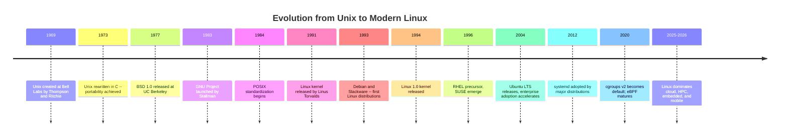

### Core Design Principles

The Unix philosophy is best summarized by Doug McIlroy, inventor of Unix pipes: "Write programs that do one thing and do it well. Write programs to work together. Write programs to handle text streams, because that is a universal interface"[^11]. These principles have proven remarkably durable across five decades.

**Everything is a file.** In Linux, hardware devices, processes, network sockets, and kernel parameters are all exposed through a filesystem interface[^12]. A hard drive appears as `/dev/sda`. Process information lives under `/proc/[pid]/`. Kernel tunables are files under `/proc/sys/` and `/sys/`. This uniformity means the same tools (`cat`, `echo`, redirection operators) work across wildly different resources.

**Small, composable tools.** A `grep` filters lines. A `sort` orders them. A `uniq -c` counts duplicates. Each does one thing. Composed with pipes, they form complex data pipelines[^11]:

```bash
# Find the top 10 most frequent error messages in a log
grep -i "error" /var/log/syslog | sort | uniq -c | sort -rn | head -10
```

**Pipes and redirection.** The pipe (`|`) connects the stdout of one process to the stdin of another. Redirectors (`>`, `>>`, `<`, `2>&1`) control where output flows. This is the mechanism that enables composability[^11].

**Text streams as universal interface.** Configuration files are text. Logs are text. Process status is text. The uniformity of text as the interchange format means tools do not need special APIs to consume each other's output[^11].

**Mechanism vs. policy separation.** The kernel provides mechanisms (process scheduling, memory management, I/O). Userspace tools and policies determine how those mechanisms are used (which scheduler, how much memory, which I/O priority). This separation enables the same kernel to serve desktop, server, embedded, and real-time workloads[^13].

### The Linux Ecosystem

The Linux kernel is approximately 30 million lines of code (as of the 6.x series)[^14]. The kernel provides the core abstractions: process management, memory management, filesystems, networking, device drivers, and security modules. Everything above the kernel -- the shell, package manager, init system, desktop environment -- is userspace.

**Distributions** are curated combinations of the Linux kernel, GNU userspace tools, package managers, and default configurations[^15]. Each distribution makes opinionated choices about defaults, release cadence, and target use case.

| Distribution Family | Representative | Package Manager | Target Use Case |
|---|---|---|---|
| Debian/Ubuntu | Ubuntu 22.04 LTS, Debian 12 | apt / dpkg | General-purpose servers, desktops, cloud |
| RHEL/CentOS | RHEL 9, Rocky Linux 9, AlmaLinux 9 | dnf / yum / rpm | Enterprise servers, regulated industries |
| SUSE | openSUSE Tumbleweed, SLES 15 | zypper / rpm | Enterprise, European markets |
| Arch | Arch Linux | pacman | Rolling release, developer desktops |
| Alpine | Alpine Linux | apk | Minimal containers, security-focused |

**POSIX and the Linux Standard Base (LSB).** POSIX defines the system call interface, shell behavior, and utility specifications that a Unix-like OS must implement[^8]. The LSB extends this to distribution-level standardization -- defining which paths files live in, which init system is used, and which libraries are available[^16]. In practice, POSIX compliance means a shell script written on Ubuntu will generally work on RHEL. The LSB is less strictly followed by modern distributions but remains the conceptual basis for cross-distribution compatibility.

### Philosophy in Practice

These principles are not abstract. They manifest in daily engineering decisions:

- **Use `systemd` journal** instead of writing custom log parsers, because structured text logs compose with existing tools[^17].
- **Build monitoring** by piping metrics through `awk` and feeding them to time-series databases, rather than building monolithic monitoring applications[^4].
- **Configuration as code.** Jane Street's approach -- building tools like Aria (a message bus)[^18], Mailcore (an email server)[^19], and Iron (a code review system)[^20] -- embodies the philosophy of building custom solutions when existing tools do not meet specific requirements. Their Linux Engineers develop management tools and investigate kernel behavior at every level, reflecting a culture where understanding the mechanism is prerequisite to choosing the policy[^4].

The build vs. buy decision is a direct expression of the philosophy: if existing tools compose well and meet requirements, use them. If the constraints are unusual (sub-100-microsecond latency, sub-millisecond clock synchronization[^21]), build what you need. The key engineering judgment is knowing which situation you are in.

### Further Reading

- *The Art of Unix Programming*, Eric S. Raymond (2003) -- foundational treatment of Unix philosophy
- *UNIX and Linux System Administration Handbook*, 5th Edition, Nemeth et al. (2017) -- comprehensive reference
- Linux kernel documentation: https://www.kernel.org/doc/html/latest/
- Jane Street Technology page: https://janestreet.com/technology/

---

## Chapter 2: Operating System Internals

### Why This Matters

Operating system internals are the substrate of everything a Linux engineer does. When a process is killed unexpectedly, you need to understand the OOM killer and memory management. When a service is slow, you need to understand scheduling and I/O paths. When you tune a system for low latency, you need to understand NUMA, cache hierarchies, and interrupt handling. The depth of your systems knowledge determines how effectively you can diagnose, tune, and operate Linux systems[^4].

### Kernel Architecture

The Linux kernel is monolithic -- all core services (process scheduling, memory management, filesystems, networking, device drivers) run in kernel space in a single address space[^22]. This contrasts with microkernels (like MINIX or QNX), where most services run in user space with message-passing between them. A third category, hybrid kernels (like Windows NT and macOS XNU), combines monolithic performance with some microkernel-style modularization[^22].

Linux achieves modularity within its monolithic design through **loadable kernel modules (LKM)** -- kernel code that can be loaded and unloaded at runtime without rebooting[^23]. Device drivers, filesystems, and networking protocols are typically implemented as modules. This gives Linux the performance of a monolithic kernel with much of the flexibility of a microkernel.

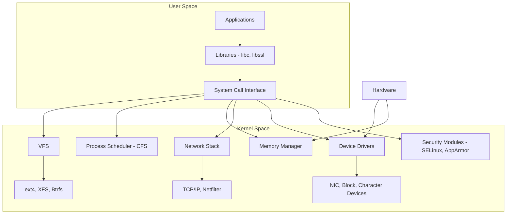

### Kernel Space vs. User Space

The processor operates in at least two privilege levels (rings on x86). **Ring 0** (kernel space) has unrestricted access to hardware, memory, and CPU instructions. **Ring 3** (user space) has restricted access -- applications must request privileged operations through **system calls**[^24].

This boundary is the most important conceptual boundary in Linux engineering. Every time a process reads a file, sends a network packet, or allocates memory, it crosses from user space to kernel space via a system call, and the kernel performs the privileged operation on its behalf.

### System Calls

The system call interface is the API between user space and kernel space[^25]. There are approximately 450 system calls in a modern Linux kernel (varies by architecture and version). Key categories include:

- **Process control:** `fork()`, `exec()`, `exit()`, `wait()`, `kill()`
- **File I/O:** `open()`, `read()`, `write()`, `close()`, `stat()`
- **Memory:** `mmap()`, `brk()`, `mprotect()`
- **Networking:** `socket()`, `bind()`, `listen()`, `accept()`, `sendto()`, `recvfrom()`
- **Time:** `clock_gettime()`, `nanosleep()`

The **vDSO** (virtual Dynamic Shared Object) is a small shared library mapped into every process's address space that provides fast access to certain kernel data (like the current time) without the overhead of a full system call[^26].

**strace** is the essential tool for observing system calls made by a process[^27]:

```bash
# Trace all system calls made by a command
strace -f -e trace=network,write ls /tmp

# Trace with timing information
strace -T -e trace=open,read,write cat /etc/hostname
```

### Memory Management

Linux uses virtual memory to provide each process with its own isolated address space[^28]. The kernel maintains **page tables** that map virtual addresses to physical memory pages. When a process accesses a virtual address, the MMU (Memory Management Unit) translates it to a physical address via the page table hierarchy.

**Key memory concepts:**

| Concept | Description |
|---|---|
| Virtual memory | Each process sees a contiguous address space; physical memory can be fragmented |
| Page tables | Multi-level data structures mapping virtual to physical addresses |
| Page cache | Kernel caching of file contents in unused RAM |
| Swap | Disk-backed extension of physical RAM; pages moved to/from disk |
| OOM killer | Kernel mechanism that terminates processes when memory is exhausted |
| Huge pages | 2MB or 1GB pages (vs. default 4KB) reducing TLB misses |
| NUMA | Non-Uniform Memory Access; memory locality matters on multi-socket systems |

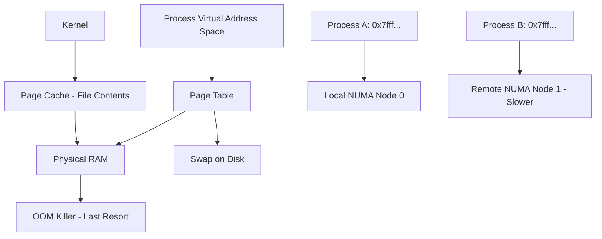

The **OOM killer** activates when the system is critically low on memory and selects a process to terminate based on a scoring heuristic (`oom_score`)[^29]. Understanding when and why the OOM killer activates -- and how to prevent it through proper memory limits -- is a critical operational skill.

### Process Management

A Linux process is created via the `fork()` system call, which duplicates the calling process[^30]. The child process then typically calls `exec()` to replace its address space with a new program. After execution, the parent calls `wait()` to collect the child's exit status. The child, after exiting, becomes a **zombie** until the parent collects its exit status via `wait()`. If the parent exits first, the zombie is reparented to init (PID 1)[^30].

**Process states:**

| State | Meaning | Indicated by |
|---|---|---|
| Running / R | Actively executing or ready to run | `ps` shows `R` |
| Sleeping / S | Interruptible sleep, waiting for an event | `ps` shows `S` |
| Disk Sleep / D | Uninterruptible sleep, typically waiting for I/O | `ps` shows `D` |
| Stopped / T | Suspended by signal (SIGSTOP, SIGTSTP) | `ps` shows `T` |
| Zombie / Z | Exited but not yet reaped by parent | `ps` shows `Z` |

**PID namespaces** provide process isolation -- a container or virtual machine can have its own PID 1 that is actually PID 42389 in the host's namespace[^31]. This is foundational to containerization.

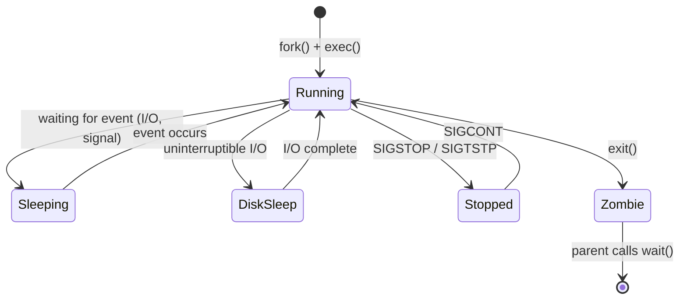

### Scheduling

The Linux kernel's default scheduler is the **Completely Fair Scheduler (CFS)**, which uses a red-black tree to track each process's virtual runtime and ensures fair CPU time distribution[^32]. CFS is not actually "fair" in a strict sense -- it approximates an ideal multitasking processor by giving each runnable task an equal share of CPU time.

**Real-time scheduling policies** exist for latency-critical workloads:

| Policy | Description | Use Case |
|---|---|---|
| SCHED_OTHER | Default CFS time-sharing | General-purpose workloads |
| SCHED_BATCH | Optimized for batch/throughput | Background computation |
| SCHED_IDLE | Very low priority | Idle-time processing |
| SCHED_FIFO | Fixed-priority, FIFO within priority | Hard real-time, low-latency |
| SCHED_RR | Fixed-priority, round-robin within priority | Time-sliced real-time |
| SCHED_DEADLINE | Earliest-deadline-first | Deterministic real-time |

**Nice values** range from -20 (highest priority) to +19 (lowest priority) and influence CFS time allocation[^33]. **CPU affinity** (`taskset`, `sched_setaffinity()`) pins processes to specific CPU cores, critical for NUMA-aware optimization and reducing context switch overhead[^34].

**cgroups** (control groups) provide kernel-level resource isolation and accounting. The CPU controller can limit CPU time per cgroup, and the cpuset controller can bind cgroups to specific CPU cores[^35].

### Interrupt Handling

Hardware devices generate **hardware interrupts** (IRQs) to signal events (packet received, disk I/O complete). The kernel handles these through interrupt service routines, which must be fast and cannot sleep[^36].

Because some interrupt work is too complex for hard IRQ context, the kernel uses **softirqs** (software interrupts) and **work queues** to defer non-critical processing. **Tasklets** are a convenience interface built on softirqs[^36].

For high-throughput networking, the kernel uses **NAPI** (New API), which switches from interrupt-driven to polling-based packet processing under high load to avoid interrupt storms[^37].

### Kernel Modules

Loadable kernel modules extend kernel functionality at runtime[^23]. Common module types include device drivers, filesystem implementations, and networking protocols.

```bash
# List loaded modules
lsmod

# Load a module
sudo modprobe br_netfilter

# Remove a module
sudo modprobe -r br_netfilter

# Show module information
modinfo e1000e
```

The module lifecycle is managed by the kernel module loader. Modules declare their dependencies, and `modprobe` resolves these automatically (unlike the older `insmod` which required manual dependency resolution)[^23].

### Kernel Tracing Infrastructure

Linux provides multiple layers of tracing and profiling, from lightweight to deeply invasive[^38]:

| Tool | Mechanism | Overhead | Use Case |
|---|---|---|---|
| ftrace | Static tracepoints, function tracing | Low | Kernel function latency, scheduling |
| kprobes | Dynamic instrumentation at any kernel address | Low-Medium | Ad-hoc kernel tracing |
| tracepoints | Pre-defined static hooks in kernel code | Very Low | Structured kernel event tracing |
| perf | Hardware performance counters, software events | Very Low | CPU profiling, cache analysis |
| eBPF | Sandboxed kernel programs | Low | Custom instrumentation, networking, security |
| SystemTap | Script-based kernel tracing | Medium | Complex tracing scripts |
| strace | System call interception | High | User-space debugging |

**eBPF** has emerged as the dominant tracing and instrumentation framework, enabling safe, sandboxed programs to run in kernel space without loading kernel modules[^39]. It powers tools like `bpftrace`, BCC (BPF Compiler Collection), and Cilium for networking. Jane Street explicitly lists eBPF as a desirable skill for their Linux Engineers[^4].

### Device Drivers and Hardware Model

The Linux device model organizes hardware into a hierarchy accessible through **sysfs** (`/sys/`)[^40]. Each device is represented by a `kobject` in the sysfs tree. **udev** (the userspace device manager) responds to kernel uevents to create/remove device nodes in `/dev/` and manage device permissions[^41].

**Device trees** (`.dtb` files) describe hardware topology on ARM and other non-x86 platforms, enabling a single kernel image to boot on diverse hardware[^42].

### Further Reading

- *Linux Kernel Development*, 3rd Edition, Robert Love (2010) -- kernel internals overview
- *Understanding the Linux Kernel*, 3rd Edition, Bovet & Cesati (2005) -- deeper internals
- *Professional Linux Kernel Architecture*, Mauerer (2010) -- comprehensive reference
- Linux kernel documentation: https://www.kernel.org/doc/html/latest/
- Brendan Gregg's Linux performance tools: https://www.brendangregg.com/linuxperf.html

---

## Chapter 3: Shell and Scripting

### Why This Matters

The shell is the primary interface between a Linux engineer and the system. Shell scripting is not just about automation -- it is about expressing operational intent concisely, reliably, and idempotently. Every Linux distribution ships with a shell; every Linux engineer must be fluent in at least one[^43]. Jane Street explicitly requires "Unix command line and shell scripting" as a foundational skill for their Linux Engineers[^4].

### Shell Fundamentals

The most common shells and their roles:

| Shell | Path | Role |
|---|---|---|
| bash | `/bin/bash` | Default on most Linux distributions; the de facto standard for scripting |
| sh (POSIX) | `/bin/sh` | Minimal POSIX-compliant shell; often symlinked to dash on Debian/Ubuntu |
| zsh | `/bin/zsh` | Feature-rich interactive shell; default on macOS since Catalina |
| fish | `/usr/bin/fish` | User-friendly interactive shell; not POSIX-compatible |
| dash | `/bin/dash` | Lightweight POSIX shell; used as `/bin/sh` on Debian/Ubuntu for speed |

**bash** matters because it is universally available, well-documented, and the target of most shell scripts in production environments. zsh and fish are excellent for interactive use but are not suitable for portable scripts[^44].

### Shell Anatomy

The shell reads configuration from multiple files at startup. Understanding the load order is essential for debugging environment issues[^45]:

```mermaid
graph TD
    A[Login Shell] --> B[/etc/profile]
    B --> C[~/.bash_profile or ~/.profile]
    C --> D[~/.bashrc -- if sourced by above]
    E[Non-Login Interactive Shell] --> F[~/.bashrc]
    G[Non-Login Non-Interactive] --> H[Inherits parent environment]
    H --> I[Sourced files if BASH_ENV is set]
```

- `/etc/profile` -- System-wide login shell configuration[^45]
- `~/.bash_profile` or `~/.profile` -- User login shell configuration
- `~/.bashrc` -- User interactive shell configuration (sourced by most terminal emulators)
- `/etc/bash.bashrc` or `/etc/bashrc` -- System-wide interactive shell configuration

> **Key Insight:** The distinction between login and non-login shells determines which files are sourced. A terminal emulator typically starts a non-login shell (sourcing only `~/.bashrc`), while SSH starts a login shell (sourcing `/etc/profile` then `~/.bash_profile`). This is why environment variables set in `~/.bashrc` sometimes appear missing in cron jobs or SSH sessions -- those are non-interactive, non-login shells that do not source `~/.bashrc` by default.

### I/O Redirection

Every process has three standard file descriptors: stdin (0), stdout (1), and stderr (2)[^46]:

```bash
# Redirect stdout to a file
command > output.txt

# Append stdout to a file
command >> output.txt

# Redirect stderr
command 2> errors.txt

# Redirect both stdout and stderr
command > output.txt 2>&1

# Short form (bash 4+)
command &> output.txt

# Pipe stdout to another command
command1 | command2

# Pipe to tee (write to file AND continue pipeline)
command1 | tee output.txt | command2

# Here document
cat <<EOF
This is line 1
This is line 2
EOF

# Here string
grep "pattern" <<< "search this string"
```

### Shell Expansion

Understanding shell expansion prevents subtle bugs[^47]:

```bash
# Variable expansion
echo $HOME
echo ${HOME:-/root}    # Default if unset

# Command substitution
files=$(ls /etc)
echo "Found $(wc -l < /etc/passwd) users"

# Arithmetic expansion
echo $(( 2 + 2 ))
echo $(( RANDOM % 100 ))

# Brace expansion
echo {1..5}            # 1 2 3 4 5
echo {a..z}
echo file{1..3}.txt    # file1.txt file2.txt file3.txt

# Pathname expansion (globbing)
ls *.log

# Tilde expansion
cd ~/projects
```

### Quoting Rules

Quoting controls word splitting and expansion behavior[^47]:

```bash
# Single quotes: NO expansion
echo '$HOME'           # Literal: $HOME

# Double quotes: Variable and command expansion, no word splitting
echo "$HOME"           # /root
echo "$(whoami)"       # root

# Backslash escaping
echo \$HOME            # Literal: $HOME
echo "Price: \$5.00"   # Price: $5.00
```

> **Common Pitfall:** Unquoted variable expansion is the single most common source of shell bugs. A filename with spaces like `my file.txt` will be split into two arguments by an unquoted `$filename`. Always double-quote variable expansions: `"$variable"` not `$variable`[^47].

### Text Processing Triad

**grep**, **sed**, and **awk** form the core text processing toolkit[^48]:

```bash
# grep: filter lines matching a pattern
grep -rn "error" /var/log/
grep -P '\d{4}-\d{2}-\d{2}' logfile   # Perl regex

# sed: stream editor for filtering and transforming
sed -i 's/old/new/g' file.txt           # In-place replacement
sed -n '10,20p' file.txt                # Print lines 10-20
sed '/^#/d' config.txt                  # Remove comment lines

# awk: pattern scanning and processing language
awk '{print $1, $NF}' access.log       # First and last fields
awk -F: '$3 >= 1000 {print $1}' /etc/passwd  # UIDs >= 1000
awk '/error/ {count++} END {print count}' logfile  # Count errors
```

### Essential Command-Line Tools

| Tool | Purpose | Example |
|---|---|---|
| `find` | Search filesystem by criteria | `find /var/log -name "*.log" -mtime -7` |
| `xargs` | Build command lines from stdin | `find . -name "*.tmp" -delete` or `echo "a b" \| xargs -n1` |
| `sort` | Sort lines | `sort -t: -k3 -n /etc/passwd` |
| `uniq` | Filter duplicate lines | `sort file \| uniq -c \| sort -rn` |
| `cut` | Extract fields | `cut -d: -f1 /etc/passwd` |
| `tr` | Translate/delete characters | `echo "hello" \| tr 'a-z' 'A-Z'` |
| `wc` | Word, line, character count | `wc -l access.log` |
| `head` / `tail` | First/last N lines | `tail -f /var/log/syslog` |
| `diff` | Compare files | `diff -u old.conf new.conf` |

### Bash Scripting

Production-quality bash scripts follow established patterns:

```bash
#!/usr/bin/env bash
set -euo pipefail
IFS=$'\n\t'

# --- Function definitions ---
main() {
    local -r log_file="${1:?Usage: $0 <log_file>}"
    
    if [[ ! -f "$log_file" ]]; then
        echo "Error: File '$log_file' not found" >&2
        return 1
    fi
    
    process_log "$log_file"
}

process_log() {
    local file="$1"
    grep -c "ERROR" "$file" || echo "0"
}

# --- Entry point ---
main "$@"
```

**Key structural elements:**

- **Shebang:** `#!/usr/bin/env bash` finds bash in the PATH[^49]
- **`set -euo pipefail`:** The single most important line in any bash script (see callout below)
- **`main` function pattern:** Organizes logic into a callable function
- **`local` variables:** Prevents namespace pollution
- **Exit codes:** 0 for success, non-zero for failure; `return` in functions, `exit` in scripts

> **Key Insight:** `set -euo pipefail` is three safety nets in one. `-e` exits on any command failure. `-u` errors on undefined variable references. `-o pipefail` ensures a pipeline returns the exit code of the last command that failed (not just the last command)[^50]. Without `pipefail`, `grep pattern file | sort | wc -l` would return 0 even if `grep` found nothing and failed. This single line prevents the majority of silent failures in bash scripts.

### Python vs. Bash Decision Framework

| Criterion | Bash | Python |
|---|---|---|
| System administration tasks | Preferred | Overkill |
| Text processing pipelines | Natural | Requires more code |
| Error handling | Limited | Comprehensive |
| Data structures | Arrays, associative arrays (bash 4+) | Lists, dicts, classes |
| Library ecosystem | System tools only | Extensive (PyPI) |
| Readability at scale | Degrades past ~200 lines | Maintains well |
| Dependency management | System packages only | pip, venv, uv |
| Debugging | set -x, trap | pdb, traceback, logging |

> **Junior Engineer Note:** When in doubt, start with bash for system-level tasks and switch to Python when the script exceeds approximately 200 lines, needs complex data structures, or requires libraries. Jane Street uses both bash and Python extensively -- bash for system operations, Python for tooling and automation[^4].

### Advanced Topics

**Process substitution** allows treating command output as a file:

```bash
diff <(sort file1) <(sort file2)
while read -r line; do echo "$line"; done < <(grep "pattern" file)
```

**Named pipes (FIFOs)** enable inter-process communication:

```bash
mkfifo /tmp/myfifo
echo "data" > /tmp/myfifo &    # Writer (blocks until reader)
cat /tmp/mypipe                 # Reader
```

**Traps** catch signals for cleanup:

```bash
cleanup() { rm -f "$tmp_file"; }
trap cleanup EXIT INT TERM
```

### Further Reading

- *The Linux Command Line*, 2nd Edition, William Shotts (2019) -- comprehensive shell guide
- *bash Cookbook*, 2nd Edition, Albing et al. (2017) -- practical recipes
- GNU Bash Reference Manual: https://www.gnu.org/software/bash/manual/
- ShellCheck (linter): https://www.shellcheck.net/

---

## Chapter 4: Filesystems and Storage

### Why This Matters

Storage is where data lives, and the filesystem is the contract between applications and that data. Choosing the wrong filesystem, misconfiguring LVM, or misunderstanding I/O scheduling can turn a well-provisioned system into a bottleneck. A Linux engineer must understand the storage stack from application-level file operations down to the block device layer[^51].

### The Virtual Filesystem Switch (VFS)

VFS is the abstraction layer that allows multiple filesystem types to coexist under a unified interface[^52]. Whether the underlying storage is an ext4 partition, an NFS mount, or a `/proc` virtual filesystem, applications interact with it through the same `open()`, `read()`, `write()`, and `close()` system calls. VFS handles the translation between the generic interface and the filesystem-specific implementation.

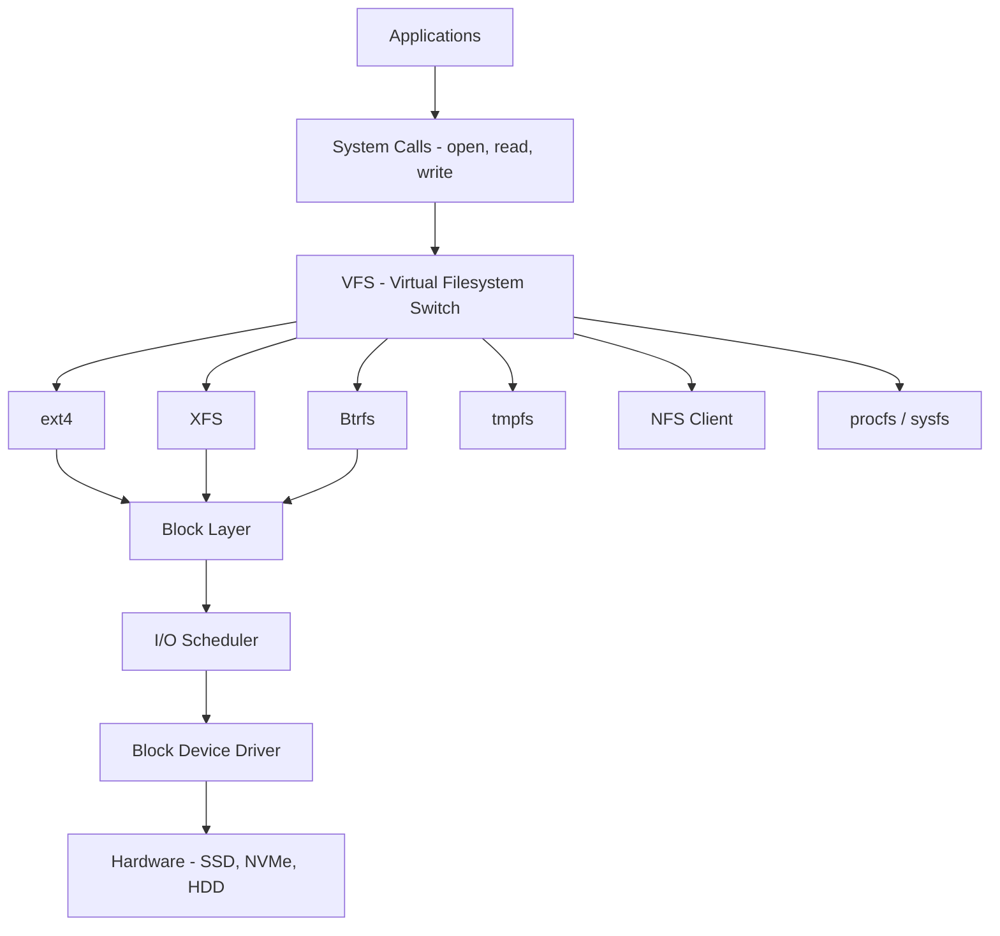

### Filesystem Types

**Disk filesystems** persist data on block devices:

| Filesystem | Journaling | Max File Size | Max Volume Size | Key Characteristics |
|---|---|---|---|---|
| ext4 | Yes (data=ordered) | 16 TiB | 1 EiB | Default on most Linux; mature, reliable |
| XFS | Yes | 8 EiB | 8 EiB | High performance for large files; default on RHEL 7+ |
| Btrfs | Copy-on-Write | 16 EiB | 16 EiB | Snapshots, subvolumes, compression, RAID built-in |
| ZFS | Copy-on-Write | 16 EiB | 256 ZiB | Most feature-rich; not mainline Linux kernel; use via OpenZFS |
| F2FS | Yes | 3.94 TiB | 16 TiB | Optimized for flash/SSD storage |

**Virtual filesystems** provide kernel/user-space interfaces:

| Filesystem | Mount Point | Purpose |
|---|---|---|
| procfs | `/proc` | Process and kernel information |
| sysfs | `/sys` | Device, driver, and kernel object hierarchy |
| devtmpfs | `/dev` | Device nodes managed by kernel |
| tmpfs | `/tmp`, `/run` | RAM-backed temporary storage |
| debugfs | `/sys/kernel/debug` | Kernel debugging interface |

### Core Filesystem Concepts

- **Inodes** store file metadata (permissions, ownership, timestamps, disk block pointers) but not the filename. Filenames are directory entries (dentries) that map names to inodes[^53]. Running out of inodes (`df -i` shows 100%) prevents file creation even when disk space remains.
- **Superblock** stores filesystem metadata (block size, free blocks, inode count). Corruption of the superblock is catastrophic[^52].
- **Journaling** records pending changes before applying them, enabling crash recovery. ext4's default mode (`data=ordered`) journals metadata but only guarantees data ordering (not data journaling)[^52].
- **Copy-on-Write (CoW)** filesystems like Btrfs and ZFS never overwrite existing data in place. New data is written to new blocks, and metadata is atomically updated. This enables efficient snapshots and crash consistency[^54].

### Disk Partitioning

| Scheme | Max Disk Size | Max Partitions | Partition Table | Notes |
|---|---|---|---|---|
| MBR | 2 TiB | 4 primary (or 3 + extended) | MBR (Master Boot Record) | Legacy; BIOS-based systems |
| GPT | 8 ZiB | 128 (by default) | GPT (GUID Partition Table) | Modern standard; UEFI-based systems |

```bash
# Partitioning tools
fdisk /dev/sdb          # MBR partitioning (interactive)
gdisk /dev/sdb          # GPT partitioning (interactive)
parted /dev/sdb         # Scriptable partitioning for both MBR and GPT

# Create GPT partition table
parted /dev/sdb mklabel gpt
parted /dev/sdb mkpart primary ext4 0% 100%
```

### Filesystem Management

```bash
# Create filesystem
mkfs.ext4 /dev/sdb1
mkfs.xfs /dev/sdb1

# Mount/umount
mount /dev/sdb1 /mnt/data
umount /mnt/data

# Persistent mount via /etc/fstab
# Format: <device> <mount_point> <type> <options> <dump> <fsck_order>
UUID=abc123 /mnt/data ext4 defaults,noatime 0 2
```

> **Junior Engineer Note:** Always use UUID (or LABEL) in `/etc/fstab` rather than device names like `/dev/sdb1`. Device names can change between boots if hardware order changes; UUIDs are stable[^55].

### LVM (Logical Volume Manager)

LVM adds a layer of abstraction between physical disks and filesystems, enabling flexible volume management[^56]:

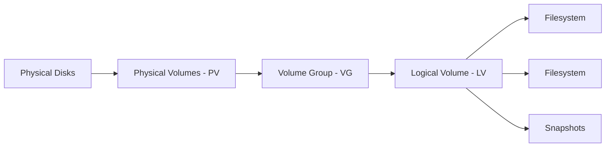

Key operations:

```bash
# Create LVM setup
pvcreate /dev/sdb /dev/sdc
vgcreate data_vg /dev/sdb /dev/sdc
lvcreate -L 100G -n data_lv data_vg
mkfs.xfs /dev/data_vg/data_lv

# Extend a logical volume (online, no downtime)
lvextend -L +50G /dev/data_vg/data_lv
xfs_growfs /mnt/data     # For XFS
resize2fs /dev/data_vg/data_lv  # For ext4

# Snapshot
lvcreate -L 10G -s -n data_snap /dev/data_vg/data_lv
```

### RAID

Redundant Array of Independent Disks provides data redundancy and/or performance[^57]:

| Level | Min Disks | Fault Tolerance | Use Case |
|---|---|---|---|
| RAID 0 | 2 | None (striping) | Maximum performance, no redundancy |
| RAID 1 | 2 | 1 disk failure (mirroring) | Critical data, boot volumes |
| RAID 5 | 3 | 1 disk failure (parity) | General-purpose, read-heavy |
| RAID 6 | 4 | 2 disk failures (double parity) | Large arrays, write-heavy |
| RAID 10 | 4 | 1 per mirror pair | High performance + redundancy |

```bash
# Software RAID with mdadm
mdadm --create /dev/md0 --level=1 --raid-devices=2 /dev/sdb1 /dev/sdc1
mkfs.ext4 /dev/md0
mdadm --detail /dev/md0
```

> **Trade-off Alert:** Hardware RAID controllers offer better performance and battery-backed write caches but add cost and vendor lock-in. Software RAID (mdadm) is simpler, more transparent, and preferred in most cloud/container environments where the storage layer is abstracted by the infrastructure[^57].

### I/O Schedulers

The I/O scheduler determines the order in which block I/O requests are served[^58]:

| Scheduler | Description | Best For |
|---|---|---|
| mq-deadline | Deadline-based for multi-queue block layer | General-purpose, rotational and SSD |
| BFQ | Budget Fair Queuing; responsive for interactive workloads | Desktop, interactive servers |
| none/noop | No scheduling; requests passed directly to hardware | NVMe, fast SSDs, virtualized storage |

For NVMe drives and high-performance SSDs, `none` (or `noop`) is typically optimal because the hardware itself handles queuing efficiently. For spinning disks or mixed workloads, `mq-deadline` provides good balance[^58].

### NVMe and Modern Storage

NVMe (Non-Volatile Memory Express) is a storage protocol designed for flash storage, connecting via PCIe[^59]. It offers dramatically lower latency and higher throughput than SATA-based SSDs:

- **Latency:** NVMe ~10-20 microseconds vs. SATA SSD ~50-100 microseconds vs. HDD ~5,000-10,000 microseconds
- **Throughput:** NVMe supports up to ~7 GB/s (PCIe Gen4 x4) vs. SATA ~600 MB/s
- **Queue depth:** NVMe supports 65,535 queues with 65,536 commands each (vs. SATA's single queue with 32 commands)

**io_uring** is a modern Linux I/O interface that reduces system call overhead by submitting multiple I/O operations through a shared ring buffer between user space and kernel space[^60]. It is particularly beneficial for high-throughput, low-latency storage workloads.

### Network Storage

| Protocol | Type | Use Case | Performance |
|---|---|---|---|
| NFS | File-level | Linux file sharing, home directories | Good for small-to-medium scale |
| CIFS/SMB | File-level | Windows file sharing, mixed environments | Moderate |
| iSCSI | Block-level | Shared block storage over Ethernet | Good for databases |
| GlusterFS | File-level | Distributed, scalable file storage | Scales horizontally |
| Ceph | Block + File + Object | Unified storage platform | Enterprise-grade, complex |

### File Permissions

Linux permissions control access at three levels (owner, group, others) with three permissions (read, write, execute)[^61]:

```bash
# Traditional permissions
chmod 755 script.sh       # rwxr-xr-x
chmod u+x script.sh       # Add execute for owner
chown user:group file     # Change ownership

# Special bits
chmod u+s /usr/bin/prog   # SUID: run as file owner
chmod g+s /shared/dir     # SGID: new files inherit group
chmod +t /tmp              # Sticky bit: only owner can delete files

# Access Control Lists (ACLs) for fine-grained permissions
setfacl -m u:bob:rwx /shared/project
getfacl /shared/project
```

### Disk Usage Analysis

```bash
df -hT                    # Filesystem usage with types
du -sh /var/log/*         # Directory sizes
ncdu /                    # Interactive disk usage explorer
lsblk -f                  # Block device tree with filesystem info
blkid /dev/sdb1           # UUID and filesystem type
lsblk -o NAME,SIZE,TYPE,FSTYPE,MOUNTPOINT  # Custom columns
```

### Further Reading

- *UNIX and Linux System Administration Handbook*, 5th Edition -- storage chapters
- `man mkfs`, `man mount`, `man lvm`, `man mdadm`
- Kernel documentation on I/O schedulers: https://www.kernel.org/doc/Documentation/block/
- Btrfs Wiki: https://btrfs.wiki.kernel.org/
- OpenZFS documentation: https://openzfs.github.io/openzfs-docs/

---

## Chapter 5: Process and Service Management

### Why This Matters

Processes are the fundamental unit of work on a Linux system. Every daemon, every script, every user session is a process. Understanding how processes are created, managed, scheduled, and terminated -- and how systemd orchestrates service lifecycle -- is foundational to Linux operations[^4]. Jane Street's Linux Engineers manage the "critical infrastructure underlying the rest of Jane Street's technology," which means understanding process behavior at both the kernel and userspace levels[^4].

### Process Management Deep Dive

The `/proc` filesystem provides real-time process information[^62]:

```bash
# Process listing with full detail
ps auxf                    # Forest view with all processes
ps -eo pid,ppid,ni,stat,%cpu,%mem,comm --sort=-%cpu | head -20

# Monitor in real time
top -d 1                   # 1-second refresh
htop                       # Interactive process viewer

# Find processes
pgrep -a nginx             # Find nginx processes
pidof sshd                 # Get PID of sshd

# Send signals
kill -TERM 1234            # Graceful termination
kill -9 1234               # Force kill (last resort)
kill -HUP 1234             # Reload configuration (for daemons)
killall -u username        # Kill all processes of a user

# Priority
nice -n 10 ./heavy_task.sh  # Start with reduced priority
renice -5 -p 1234           # Change priority of running process
```

### Signals

Signals are software interrupts that communicate with processes[^63]:

| Signal | Number | Default Action | Description |
|---|---|---|---|
| SIGHUP | 1 | Terminate | Hangup; typically triggers config reload in daemons |
| SIGINT | 2 | Terminate | Interrupt (Ctrl+C) |
| SIGQUIT | 3 | Core dump | Quit (Ctrl+\) |
| SIGKILL | 9 | Terminate | Force kill (cannot be caught or ignored) |
| SIGTERM | 15 | Terminate | Graceful termination (default kill signal) |
| SIGUSR1 | 10 | Varies | User-defined signal 1 |
| SIGUSR2 | 12 | Varies | User-defined signal 2 |
| SIGCHLD | 17 | Ignore | Child process exited or stopped |
| SIGSTOP | 19 | Stop | Suspend (cannot be caught or ignored) |
| SIGCONT | 18 | Continue | Resume stopped process |
| SIGSEGV | 11 | Core dump | Segmentation fault |

> **Key Insight:** `kill -9` (SIGKILL) should be the last resort, not the first response. SIGKILL gives the process no opportunity to clean up -- open files may be left in inconsistent states, temporary files are not removed, and child processes may become orphaned. Always try SIGTERM first and allow a grace period before escalating to SIGKILL[^63].

### systemd: The Modern Init System

systemd is the init system and service manager adopted by most major Linux distributions since approximately 2015[^64]. It replaces the older SysVinit and Upstart systems. systemd boots the system in parallel, manages services, mounts filesystems, handles timers, and provides structured logging via the journal[^64].

**Unit types:**

| Unit Type | Extension | Purpose |
|---|---|---|
| Service | `.service` | Long-running daemons |
| Socket | `.socket` | Socket-based activation |
| Timer | `.timer` | Scheduled execution (replaces cron) |
| Mount | `.mount` | Filesystem mounts |
| Automount | `.automount` | On-demand mounting |
| Target | `.target` | Grouping of units (runlevel equivalent) |
| Path | `.path` | Filesystem path monitoring |

**Unit file structure:**

```ini
# /etc/systemd/system/myapp.service
[Unit]
Description=My Application
After=network-online.target
Wants=network-online.target
Requires=postgresql.service

[Service]
Type=notify
User=myapp
Group=myapp
ExecStart=/opt/myapp/bin/server --config /etc/myapp/config.yaml
ExecReload=/bin/kill -HUP $MAINPID
Restart=on-failure
RestartSec=5s
LimitNOFILE=65536
MemoryMax=2G
CPUQuota=200%
WatchdogSec=30s

# Hardening
NoNewPrivileges=yes
ProtectSystem=strict
ProtectHome=yes
ReadWritePaths=/var/lib/myapp /var/log/myapp

[Install]
WantedBy=multi-user.target
```

**Dependency model:**

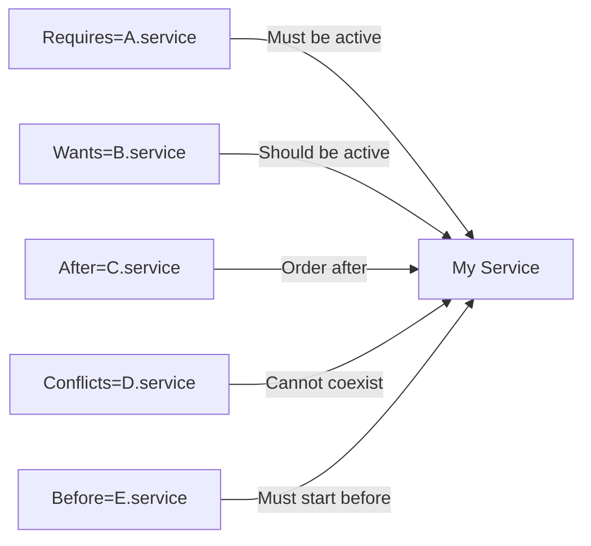

> **Key Insight:** systemd timers are generally preferred over cron for new deployments. Timers integrate with the journal for structured logging, support dependency ordering, and trigger only when the system is actually running (unlike cron which may queue missed executions via anacron)[^64]. However, cron remains ubiquitous and you will encounter it in legacy systems.

**systemd vs. cron comparison:**

| Feature | systemd timers | cron |
|---|---|---|
| Logging | Integrated with journalctl | Requires manual syslog redirect |
| Dependency ordering | Yes (After/Requires/Wants) | No |
| Missed runs | Configurable (OnCalendar vs. OnBootSec) | Depends on anacron |
| Resource control | Via systemd resource limits | None built-in |
| On-demand execution | Path-based triggers | Not applicable |
| Persistence | Systemd manages timer state | Flat file, no state |

```bash
# Essential systemctl commands
systemctl start myapp          # Start a service
systemctl stop myapp           # Stop a service
systemctl restart myapp        # Restart
systemctl reload myapp         # Reload configuration
systemctl status myapp         # Show status
systemctl enable myapp         # Start at boot
systemctl disable myapp        # Do not start at boot
systemctl is-active myapp      # Check if running
systemctl is-enabled myapp     # Check if enabled at boot

# Override a unit file without editing the original
systemctl edit myapp           # Creates drop-in override
systemctl cat myapp            # Show merged unit file

# Journal
journalctl -u myapp -f         # Follow service logs
journalctl -u myapp --since "1 hour ago"
journalctl -p err              # Filter by priority
```

### Alternative Init Systems

| Init System | Distribution | Design Philosophy |
|---|---|---|
| systemd | Ubuntu, RHEL, Fedora, Debian, SUSE | Comprehensive service manager |
| OpenRC | Gentoo, Alpine | Lightweight, parallel start, shell-script based |
| runit | Void Linux, Docker (as tini) | Minimal, fast, process supervision |
| SysVinit | CentOS 6, Debian 6 (legacy) | Sequential boot, runlevels |

Knowing these alternatives matters because containers often use minimal init systems (runit, tini), and embedded or security-focused distributions may use OpenRC[^65].

### Cron

Cron remains the most common scheduled task mechanism in practice[^66]:

```cron
# /etc/crontab or user crontab
# minute hour day-of-month month day-of-week command
0 2 * * * /usr/local/bin/backup.sh          # Daily at 2 AM
*/5 * * * * /usr/local/bin/check_health.sh   # Every 5 minutes
0 0 * * 0 /usr/local/bin/weekly_report.sh    # Sundays at midnight

# /etc/cron.d/ for system-wide scheduled tasks
# Environment variables and PATH must be explicitly set
SHELL=/bin/bash
PATH=/usr/local/sbin:/usr/local/bin:/usr/sbin:/usr/bin
0 3 * * * root /usr/local/bin/cleanup.sh
```

### Resource Limits

Resource limits control what processes can consume[^67]:

```bash
# Check current limits
ulimit -a                # All soft limits
ulimit -aH               # All hard limits

# Set limits (session-level)
ulimit -n 65536           # Open file descriptors
ulimit -u 1024            # Max user processes

# Persistent limits via /etc/security/limits.conf
# <domain> <type> <item> <value>
*         soft  nofile  65536
*         hard  nofile  65536
myapp     soft  nproc   4096
myapp     hard  nproc   4096

# systemd resource limits (preferred for services)
# Set in unit file [Service] section:
# LimitNOFILE=65536
# MemoryMax=2G
# CPUQuota=200%
```

### Background Processes

```bash
# Send current job to background
Ctrl+Z                    # Suspend
bg                        # Resume in background

# Start command in background
nohup command &           # Survives terminal close
disown %1                 # Detach from shell job table

# Terminal multiplexers
tmux new -s work          # Create named session
tmux attach -t work       # Reattach
# tmux: Ctrl+B then D to detach, Ctrl+B then C for new window
```

### Further Reading

- `man systemd`, `man systemd.service`, `man systemd.timer`
- systemd documentation: https://www.freedesktop.org/software/systemd/man/
- *UNIX and Linux System Administration Handbook*, 5th Edition
- Cron and Anacron: `man 5 crontab`, `man 8 anacron`

---

## Chapter 6: Package Management

### Why This Matters

Package management is how software is installed, updated, removed, and tracked on Linux systems. Understanding package management is essential for system maintenance, security patching, dependency resolution, and reproducible environments. Every Linux distribution has a package management philosophy, and knowing which tools to reach for -- and their trade-offs -- is a core operational skill[^68].

### Package Management Concepts

A **package** is a pre-compiled, installable unit of software with metadata describing its version, dependencies, and file list[^68]. **Repositories** are collections of packages served over a network. **Dependencies** are other packages required for a package to function. Package managers resolve dependency chains automatically.

**Versioning** follows the distribution's policy: Debian uses even/odd version numbers for stable/testing; RHEL uses point releases within major versions; Fedora uses rolling releases[^68].

### APT Ecosystem (Debian/Ubuntu)

The APT ecosystem is the most widely used package management system in Linux[^69]:

```bash
# Package operations
sudo apt update                    # Refresh package index
sudo apt install nginx             # Install with dependencies
sudo apt remove nginx              # Remove (keep config)
sudo apt purge nginx               # Remove including config
sudo apt upgrade                   # Upgrade all packages
sudo apt full-upgrade              # Upgrade with dependency changes
sudo apt autoremove                # Remove orphaned dependencies

# Query
apt-cache search "web server"      # Search descriptions
apt-cache show nginx               # Package details
apt-cache policy nginx             # Version and repository info
apt list --installed               # Installed packages
dpkg -l | grep nginx               # Low-level package list

# Configuration
sudo dpkg-reconfigure locales      # Reconfigure a package
sudo apt-mark hold nginx           # Prevent upgrades
sudo apt-mark unhold nginx         # Allow upgrades again
```

**PPAs (Personal Package Archives)** are user-maintained repositories for Ubuntu that provide newer or custom package versions[^69]:

```bash
sudo add-apt-repository ppa:example/repo
sudo apt update
```

### DNF/YUM Ecosystem (RHEL/Fedora)

DNF is the modern successor to YUM, used on Fedora, RHEL 8+, Rocky Linux, and AlmaLinux[^70]:

```bash
# Package operations
sudo dnf install nginx
sudo dnf remove nginx
sudo dnf upgrade
sudo dnf autoremove

# Query
dnf search "web server"
dnf info nginx
dnf list installed
rpm -qa | grep nginx               # Low-level RPM query

# Module streams (RHEL 8+)
dnf module list nginx              # Available module streams
dnf module enable nginx:1.24       # Enable a specific stream
dnf module install nginx:1.24      # Install from that stream

# Repository management
dnf repolist
dnf config-manager --add-repo https://example.com/repo.repo
```

### Package Manager Comparison

| Feature | APT (dpkg) | DNF/YUM (rpm) | Zypper (rpm) | Pacman | APK |
|---|---|---|---|---|---|
| Distribution | Debian, Ubuntu | RHEL, Fedora, Rocky | openSUSE, SLES | Arch | Alpine |
| Dependency resolution | Sophisticated | Sophisticated | Sophisticated | Simple | Simple |
| Locking mechanism | dpkg lock | dnf lock | zypper lock | None (file-level) | File-level |
| Downgrade support | Limited | `dnf downgrade` | `zypper install pkg=ver` | Manual | Manual |
| Build from source integration | No | No | No | PKGBUILD/AUR | APKBUILD |
| Container-friendly | Moderate | Moderate | Low | Low | High (minimal) |
| Speed | Fast | Fast | Moderate | Very Fast | Fast |

### Universal Package Formats

| Format | Distribution Model | Sandboxing | Use Case |
|---|---|---|---|
| Snap | Canonical Store + sideload | confinement profiles | Desktop apps, IoT |
| Flatpak | Flathub + remotes | sandbox portals | Desktop apps, cross-distro |
| AppImage | Single-file download | None (by default) | Portable applications |

These formats aim to solve cross-distribution compatibility but are controversial due to increased disk usage, slower startup, and reduced system integration[^71].

### Source Compilation

Building from source remains necessary when packages are not available in repositories:

```bash
# Traditional workflow
./configure --prefix=/usr/local
make -j$(nproc)
sudo make install

# With checkinstall (creates a package instead of raw install)
sudo checkinstall --pkgname=myapp --pkgversion=1.0 make install
```

> **Junior Engineer Note:** Prefer package repositories over source compilation whenever possible. Source-compiled software bypasses package management, making updates, removals, and security patching harder. When you must compile from source, `checkinstall` creates a package that the package manager can track[^72].

### Container Image Packages

In Dockerfiles, package management best practices include[^73]:

```dockerfile
# Debian/Ubuntu
RUN apt-get update && \
    apt-get install -y --no-install-recommends package1 package2 && \
    rm -rf /var/lib/apt/lists/*

# RHEL/Fedora
RUN dnf install -y --setopt=install_weak_deps=False package1 package2 && \
    dnf clean all

# Alpine
RUN apk add --no-cache package1 package2
```

Key principles: clean up caches in the same layer to reduce image size; install only required dependencies (`--no-install-recommends`); pin package versions for reproducibility.

### Repository Security

Package repositories use **GPG signing** to verify package authenticity[^74]:

```bash
# Import a repository key
curl -fsSL https://example.com/key.gpg | sudo gpg --dearmor -o /usr/share/keyrings/repo.gpg

# Verify a package signature
rpm --checksig package.rpm
dpkg-sig --verify package.deb
```

### Python Package Management

The Python ecosystem has its own package management layer that intersects with system package management[^75]:

```bash
# PEP 668: System-managed Python (Debian 12, Fedora 39+, Ubuntu 23.04+)
# Marked as externally-managed-environment
python3 -m venv /path/to/venv          # Create virtual environment
source /path/to/venv/bin/activate       # Activate
pip install package                      # Install in venv

# uv: Fast Python package installer (Rust-based, drop-in pip replacement)
uv venv .venv
uv pip install -r requirements.txt
uv pip install package
```

> **Junior Engineer Note:** Never use `pip install` directly on a system Python managed by the OS package manager. PEP 668 marks system Python as externally-managed, and pip installs will break system packages. Always use a virtual environment (`venv`) or `uv`[^75]. This is one of the most common mistakes junior engineers make when transitioning to modern Linux distributions.

### Further Reading

- `man apt`, `man dnf`, `man pacman`, `man apk`
- Debian Packaging Guide: https://www.debian.org/doc/manuals/maint-guide/
- DNF documentation: https://dnf.readthedocs.io/
- PEP 668: https://peps.python.org/pep-0668/
- uv documentation: https://docs.astral.sh/uv/

---

## Footnotes

[^1]: The caliber of expectations at firms like Jane Street -- kernel performance debugging, deployment automation, configuration management, and real-time incident response -- sets a benchmark for what "professional Linux engineering" means. See Jane Street Linux Engineer job description (janestreet.com/join-jane-street/position/8061059002/).

[^2]: Jane Street describes itself as "a quantitative trading firm" that trades equities, options, ETFs, and other instruments across global markets, executing billions of dollars in daily transactions (janestreet.com/technology/).

[^3]: TOP500.org lists Linux as the operating system of all 500 top supercomputers as of November 2025. Android market share data from StatCounter, 2025.

[^4]: From Jane Street's Linux Engineer job description: "Daily work includes: kernel performance debugging, developing management tools, resolving production issues in real time" with three pillars: "deployment automation, scalable configuration management, obsessive monitoring" (janestreet.com/join-jane-street/position/8061059002/).

[^5]: Eric S. Raymond, *The Art of Unix Programming* (2003), chapters on Unix philosophy. The principles have been validated by decades of practical engineering.

[^6]: Dennis Ritchie and Ken Thompson, "The Unix Time-Sharing System," *Communications of the ACM*, 1974. The original Unix paper describing the design. Rewriting Unix in C (1973) is documented in Ritchie's retrospective writings.

[^7]: Peter H. Salus, *The Daemon, the Gnu, and the Penguin* (2008), provides a comprehensive history of Unix lineage including BSD and System V divergence.

[^8]: IEEE Std 1003.1 (POSIX.1) defines the Portable Operating System Interface. Current version maintained by The Open Group (pubs.opengroup.org/onlinepubs/9699919799/).

[^9]: Richard Stallman announced the GNU Project in September 1983 on the net.unix-wizards and net.usoft newsgroups. GNU is a recursive acronym: "GNU's Not Unix" (gnu.org/gnu/initial-announcement.html).

[^10]: Linus Torvalds posted to comp.os.minix on August 25, 1991, announcing the Linux kernel. The combination of the Linux kernel with GNU userspace tools created the complete operating system. The term "GNU/Linux" is technically more accurate but "Linux" dominates in practice.

[^11]: Doug McIlroy, the inventor of Unix pipes, summarized the Unix philosophy in the preface to *The Art of Unix Programming* by Eric S. Raymond. The three principles -- do one thing well, work together, handle text streams -- remain the foundation of Linux tooling.

[^12]: The "everything is a file" abstraction in Linux extends to devices (`/dev/`), processes (`/proc/`), kernel parameters (`/proc/sys/`, `/sys/`), sockets, and more. This is a defining characteristic of Unix-like systems.

[^13]: Mechanism vs. policy separation is a fundamental Unix design principle. The kernel provides the mechanism (e.g., process scheduling); userspace configuration determines the policy (e.g., which scheduling algorithm, priorities).

[^14]: The Linux kernel source tree (linux-6.x) contains approximately 30 million lines of C code as of the 6.12 release, according to `cloc` analysis of the kernel source. This counts kernel source, not documentation or userspace tools.

[^15]: Linux distributions are curated combinations of the kernel, GNU tools, package management, and default configurations. The distribution model is one of Linux's key organizational innovations, enabling diverse use cases from servers to embedded systems.

[^16]: The Linux Standard Base (LSB) is maintained by the Linux Foundation (refspecs.linuxfoundation.org/lsb/latest/). It defines standards for filesystem hierarchy, init system, and library compatibility across distributions. Compliance varies in practice.

[^17]: systemd-journald provides structured logging with binary format, indexed by time, priority, unit, and other fields. Queryable via `journalctl`. Replaced traditional syslog for many distributions as the default logging mechanism.

[^18]: Aria is Jane Street's "low-latency shared message bus with strong ordering and reliability guarantees," described in the blog post "Getting from Tested to Battle-Tested" (blog.janestreet.com/getting-from-tested-to-battle-tested/).

[^19]: Mailcore is Jane Street's homegrown email server written in OCaml, described in the Signals and Threads podcast episode "Building a Functional Email Server" (signalsandthreads.com/building-a-functional-email-server/).

[^20]: Iron is Jane Street's internal code review and release management system, available on GitHub (github.com/janestreet/iron).

[^21]: Jane Street's clock synchronization infrastructure achieves approximately 35-40 microsecond accuracy from UTC using GPS reference clocks feeding PTP grandmasters, described in the Signals and Threads podcast episode on Clock Synchronization (signalsandthreads.com/clock-synchronization/).

[^22]: Linux is a monolithic kernel in that all core subsystems (scheduler, memory manager, filesystems, network stack, device drivers) run in kernel space in a single address space. Tanenbaum's monolithic vs. microkernel debate (MINIX vs. Linux, 1992) is a well-known historical reference.

[^23]: Loadable Kernel Modules (LKMs) allow extending kernel functionality at runtime without rebooting. Managed via `insmod`, `rmmod`, `modprobe`. Module dependencies are resolved automatically by `modprobe` using `depmod`. Documentation: https://www.kernel.org/doc/html/latest/driver-api/.

[^24]: Linux runs in at least two privilege levels (Ring 0 for kernel, Ring 3 for user space on x86). Transitions between them occur via system calls, interrupts, and exceptions. The `syscall`/`sysenter` instructions trigger the transition.

[^25]: The Linux system call table varies by architecture. On x86_64, there are approximately 450 system calls as of kernel 6.x. The vDSO (virtual Dynamic Shared Object) provides fast access to certain kernel data (like `clock_gettime`) without a full system call transition.

[^26]: The vDSO (virtual Dynamic Shared Object) is mapped into every process's address space by the kernel. It contains hand-optimized versions of certain system calls (typically time-related) that can execute without crossing the kernel/user boundary, reducing latency from ~200ns to ~20ns.

[^27]: strace traces system calls and signals of a running process. It is one of the most valuable debugging tools on Linux, revealing exactly what a program asks the kernel to do. Overhead is significant for high-frequency syscalls; consider `perf trace` for lower-overhead tracing.

[^28]: Virtual memory provides each process with a private address space mapped to physical memory and swap. The kernel maintains multi-level page tables (4 levels on x86_64) for address translation. The TLB (Translation Lookaside Buffer) caches recent translations.

[^29]: The OOM killer uses `oom_score_adj` (per-process) and RSS, CPU time, and other heuristics to select a victim. Tuning via `/proc/[pid]/oom_score_adj` (range -1000 to 1000). Containers use cgroup-level OOM handling.

[^30]: The fork/exec/wait process lifecycle: `fork()` creates a copy of the calling process; `exec()` replaces the child's address space with a new program; `wait()` collects the exit status. A zombie process is one that has exited but whose parent has not yet called `wait()`.

[^31]: PID namespaces provide process ID isolation, a core Linux namespace used by containers. Each namespace has its own PID 1, and processes can have different PIDs in different namespaces. Part of the Linux namespaces API alongside mount, network, UTS, IPC, and user namespaces.

[^32]: CFS (Completely Fair Scheduler) has been the default Linux scheduler since kernel 2.6.23 (2007). It uses a red-black tree keyed on virtual runtime (vruntime) to ensure fair CPU distribution. Each process's vruntime tracks its accumulated CPU time relative to the ideal multitasking processor.

[^33]: Nice values range from -20 (highest priority) to +19 (lowest priority). CFS uses nice values to compute weight, which determines time slice proportion. A nice -20 process gets approximately 25x more CPU time than a nice +19 process.

[^34]: CPU affinity is controlled via `sched_setaffinity()` system call or the `taskset` command. Pinning processes to specific CPUs reduces context switches and cache thrashing, critical for performance-sensitive workloads and NUMA-aware systems.

[^35]: cgroups (control groups) are a kernel feature for resource accounting and limiting. cgroups v2 (unified hierarchy) is the modern API, default since Linux 5.15 for most distributions. Controllers include cpu, memory, io, pids, and cpuset.

[^36]: Hardware interrupts (IRQs) are triggered by devices. The kernel's interrupt handling has two halves: the top half (hard IRQ, fast, cannot sleep) and bottom half (softirq, tasklet, work queue, deferred processing). NAPI switches from interrupt-driven to polling under high network load.

[^37]: NAPI (New API) replaces the older interrupt-per-packet model with a hybrid interrupt-then-poll approach. Under low load, packets trigger interrupts. Under high load, the kernel polls for packets, avoiding interrupt storms that would degrade performance.

[^38]: Linux kernel tracing infrastructure ranges from static tracepoints (pre-defined, stable) to dynamic instrumentation (kprobes, eBPF). The tracing ecosystem includes ftrace (function tracing), perf (hardware counters), and eBPF (sandboxed kernel programs).

[^39]: eBPF (extended Berkeley Packet Filter) is a Linux kernel technology for running sandboxed programs in kernel space without modifying kernel source code. The eBPF verifier ensures program safety. Used for networking (Cilium), observability (BCC, bcc-tools), and security (Falco).

[^40]: sysfs (`/sys/`) exports kernel object model to user space. Organized by device hierarchy: `/sys/devices/`, `/sys/class/`, `/sys/block/`. Used by udev and userspace tools for device discovery and configuration.

[^41]: udev is the userspace device manager that responds to kernel uevents (device add/remove/change). Rules in `/etc/udev/rules.d/` control device node creation in `/dev/`, permissions, and symlinks. Systemd-udev is the modern implementation.

[^42]: Device trees (`.dtb` files) describe hardware topology for ARM and other non-x86 platforms. They specify memory layout, interrupt routing, and peripheral configuration, enabling a single kernel to support diverse hardware.

[^43]: POSIX specifies the shell interface (sh). Bash (Bourne Again SHell) extends POSIX sh with additional features and is the de facto standard for Linux scripting. The POSIX shell specification is defined in IEEE Std 1003.1-2017, Shell & Utilities volume.

[^44]: zsh and fish are excellent interactive shells but are not POSIX-compatible. Scripts written for bash may not work in zsh or fish without modification. For scripts, target bash or POSIX sh for portability.

[^45]: Shell startup file load order: Login shells source `/etc/profile` then `~/.bash_profile` or `~/.profile`. Non-login interactive shells source `~/.bashrc`. Non-interactive shells source nothing by default (unless `BASH_ENV` is set). Terminal emulators typically start non-login shells.

[^46]: File descriptors: 0 = stdin, 1 = stdout, 2 = stderr. The `2>&1` redirect sends stderr to stdout. The `&>` redirect (bash 4+) sends both stdout and stderr to a file. Pipes connect stdout of one process to stdin of another.

[^47]: Shell expansion occurs in a defined order: brace expansion, tilde expansion, parameter/variable expansion, command substitution, arithmetic expansion, pathname expansion (globbing), word splitting, and quote removal. Understanding this order prevents subtle quoting bugs.

[^48]: The text processing triad: `grep` filters lines by pattern (supports regex), `sed` performs stream editing (find-replace, deletion, insertion), and `awk` is a full pattern-scanning language with field splitting and programmable actions. Together they handle the vast majority of text processing on the command line.

[^49]: `#!/usr/bin/env bash` is preferred over `#!/bin/bash` because it finds bash via the PATH, working correctly on systems where bash is installed in non-standard locations (e.g., Homebrew on macOS, NixOS).

[^50]: `set -e` exits on command failure. `set -u` errors on unset variables. `set -o pipefail` makes pipelines return the exit status of the rightmost failed command (not just the last command). Together, these three options prevent the majority of silent failures in bash scripts.

[^51]: The Linux storage stack spans from application-level file operations through the VFS, filesystem, block layer, I/O scheduler, device driver, and hardware. Understanding this stack is essential for diagnosing storage performance issues and making correct architectural decisions.

[^52]: VFS (Virtual Filesystem Switch) provides a unified interface across all filesystem types. Each filesystem implements `super_operations`, `inode_operations`, and `file_operations` structures. The kernel dispatches through these function pointers, enabling transparent filesystem diversity.

[^53]: Inodes store file metadata (permissions, ownership, timestamps, size, block pointers) but not filenames. Filenames are stored as directory entries (dentries) mapping names to inodes. This separation enables hard links (multiple filenames pointing to the same inode).

[^54]: Copy-on-Write (CoW) filesystems never overwrite data in place. New writes go to new blocks; metadata is atomically updated. This provides crash consistency, efficient snapshots, and data integrity verification. Btrfs and ZFS both use CoW, but ZFS's implementation is generally considered more mature.

[^55]: UUID-based fstab entries survive device reordering. `blkid /dev/sdb1` shows the UUID. `/etc/fstab` format: `<device> <mount_point> <type> <options> <dump> <fsck_order>`.

[^56]: LVM (Logical Volume Manager) adds a three-layer abstraction: Physical Volumes (PVs) -> Volume Groups (VGs) -> Logical Volumes (LVs). This enables online resizing, snapshots, and thin provisioning. LVM snapshots use CoW, similar to filesystem snapshots.

[^57]: RAID (Redundant Array of Independent Disks) distributes data across multiple disks. Hardware RAID uses dedicated controllers with cache and battery backup. Software RAID (mdadm) is managed by the kernel and preferred in modern environments where storage is abstracted.

[^58]: Linux I/O schedulers manage the ordering of block I/O requests. mq-deadline is the default for most distributions. BFQ provides fair queuing for interactive workloads. `none` (noop) passes requests directly to hardware, optimal for NVMe. Configured per-device via `/sys/block/<device>/queue/scheduler`.

[^59]: NVMe (Non-Volatile Memory Express) is a storage protocol designed specifically for flash storage over PCIe. It offers dramatically lower latency and higher throughput than SATA-based SSDs. NVMe supports deep command queues (65K queues x 64K commands).

[^60]: io_uring is a Linux I/O interface introduced in kernel 5.1 (2019) that uses shared ring buffers between user space and kernel space for asynchronous I/O submission and completion. It reduces system call overhead for high-throughput I/O workloads.

[^61]: Linux file permissions use the traditional rwx model (owner/group/others) with three special bits: SUID (run as file owner), SGID (inherit group), and sticky bit (restrict deletion). ACLs extend this with per-user and per-group permissions via `setfacl`/`getfacl`.

[^62]: `/proc` is a virtual filesystem providing process and kernel information. `/proc/[pid]/` contains per-process data (status, maps, fd, exe, cmdline). `/proc/meminfo`, `/proc/cpuinfo`, `/proc/stat` provide system-wide information.

[^63]: Signals are software interrupts for inter-process communication. SIGTERM (15) is the default kill signal and should be tried first. SIGKILL (9) cannot be caught and gives no cleanup opportunity. SIGHUP (1) traditionally triggers config reload in daemons.

[^64]: systemd is the init system for most modern Linux distributions. It manages services, timers, mounts, and more through unit files. It provides parallel startup, dependency ordering, structured logging (journald), and resource control via cgroups integration.

[^65]: Alternative init systems include OpenRC (Gentoo, Alpine), runit (Void Linux, container use), and SysVinit (legacy). Docker uses tini (minimal init) or runit-derived process supervision. Understanding alternatives is useful for container environments and embedded systems.

[^66]: cron is the traditional Unix task scheduler. Crontab format: `minute hour day-of-month month day-of-week command`. System-wide cron jobs live in `/etc/cron.d/`. anacron handles missed executions on systems that are not always running.

[^67]: Resource limits are controlled via `ulimit` (shell), `/etc/security/limits.conf` (persistent per-user), and systemd unit directives (per-service). Key limits: nofile (open files), nproc (max processes), memlock (locked memory), and cgroup-level limits in systemd.

[^68]: Package management is the system for installing, updating, removing, and tracking software. Each distribution family has its own package manager (apt, dnf, pacman, apk). Packages contain compiled binaries, configuration files, and metadata including dependencies.

[^69]: APT (Advanced Package Tool) is the frontend for dpkg on Debian-based systems. It handles dependency resolution, repository management, and automatic updates. PPAs (Personal Package Archives) provide additional user-maintained repositories for Ubuntu.

[^70]: DNF (Dandified YUM) replaced YUM on Fedora 22+ and RHEL 8+. It provides modular streams (RHEL 8+) for managing multiple versions of software packages. RPM is the underlying package format for both APT-compatible (via alien) and DNF-based systems.

[^71]: Universal package formats (Snap, Flatpak, AppImage) aim for cross-distribution compatibility but are controversial due to disk usage overhead, slower startup, and reduced system integration. Snap (Canonical) uses a daemon model; Flatpak uses portals for sandboxed access.

[^72]: checkinstall creates a system package (deb, rpm, or tgz) from a `make install` command, allowing the package manager to track source-compiled software. This maintains package management consistency even for software compiled from source.

[^73]: Dockerfile package management best practices: clean caches in the same layer (`apt-get update && apt-get install && rm -rf /var/lib/apt/lists/*`), use `--no-install-recommends`, and pin versions. This minimizes image size and ensures reproducibility.

[^74]: GPG signing of packages ensures authenticity and integrity. Repository keys are imported into the system keyring; package managers verify signatures before installation. This is a critical security practice for preventing supply-chain attacks.

[^75]: PEP 668 (2023) marks system Python as externally-managed, preventing pip from installing packages system-wide. This prevents conflicts between pip-installed and system-package-manager-installed packages. Always use virtual environments (`venv`) or tools like `uv` for Python dependency management.

---

## Chapter 7: Networking

Networking is the circulatory system of any Linux infrastructure. Every service-to-service call, every API request, every log ship, and every market data feed traverses the network stack. A Linux engineer who cannot reason about packet flow, diagnose latency, and tune kernel networking parameters is operating with a critical blind spot. This chapter covers the full networking knowledge domain from fundamentals through low-latency kernel bypass techniques.

### 7.1 Network Fundamentals

The OSI model provides a conceptual framework, but Linux engineers operate primarily at Layers 2 through 4. Layer 1 (Physical) involves cabling and signal encoding -- important for hardware selection but rarely debugged in software. Layers 5-7 are application concerns.

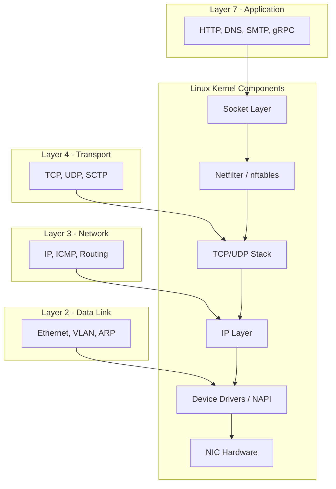

**Layer 2 (Data Link):** Ethernet frames, MAC addressing, ARP resolution, VLAN tagging. Linux bridges operate at this layer. Understanding MTU, jumbo frames, and hardware offloading is essential for performance tuning.[^151]

**Layer 3 (Network):** IP addressing, subnetting, routing decisions. The Linux routing table is consulted for every packet. `ip route` governs L3 forwarding behavior.[^152]

**Layer 4 (Transport):** TCP and UDP. TCP provides reliable, ordered delivery with congestion control. UDP provides lightweight, connectionless datagrams. The choice between them has profound implications for application design and performance.[^153]

### 7.2 TCP Deep Dive

TCP is the dominant transport protocol. Understanding its internals is non-negotiable for a Linux engineer.

#### Three-Way Handshake and State Machine

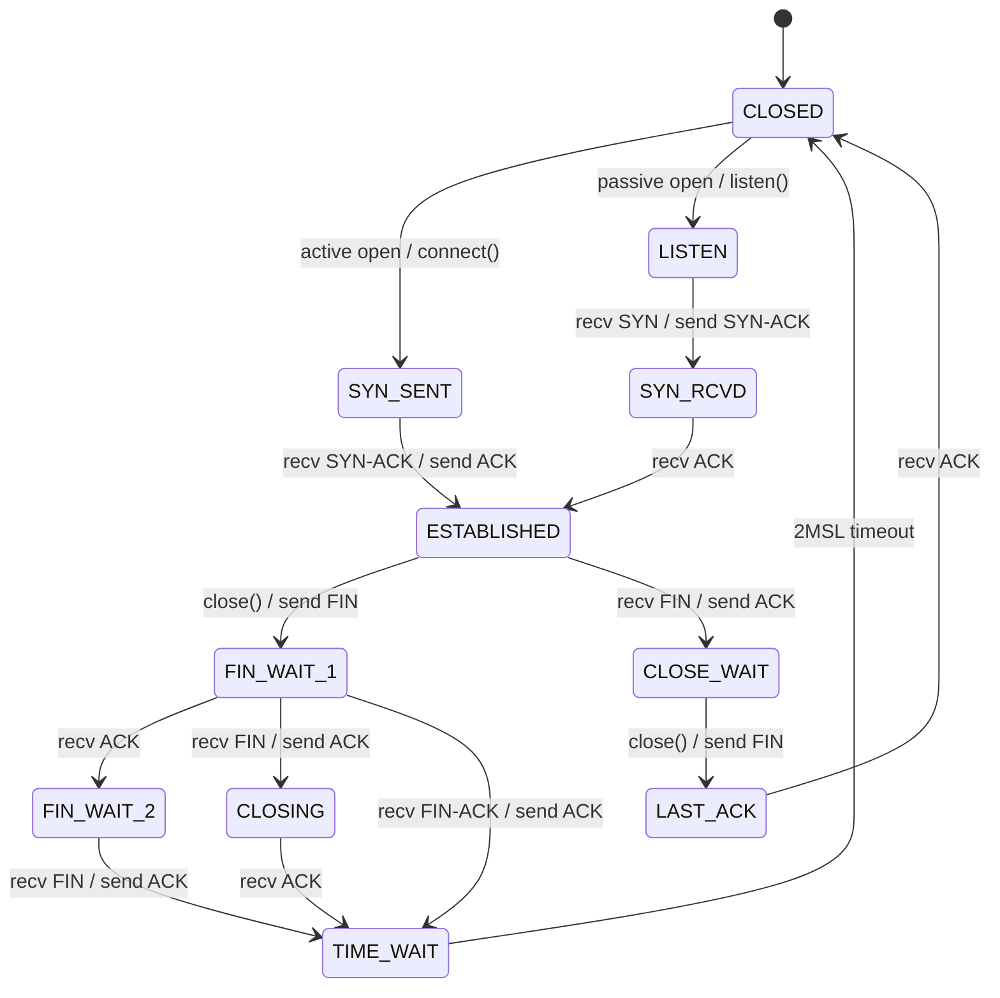

> **Key Insight:** TCP TIME_WAIT exists to ensure that late-arriving packets from a previous connection are not delivered to a new connection on the same port pair. The 2MSL (Maximum Segment Lifetime) timeout, typically 60 seconds on Linux, prevents this. Reducing TIME_WAIT with `net.ipv4.tcp_tw_reuse` is safe for outgoing connections, but `tcp_tw_recycle` is dangerous behind NAT and was removed in Linux 4.12.[^154]

#### Congestion Control

Linux supports pluggable congestion control algorithms. The two most important:

| Algorithm | Behavior | Use Case |
|-----------|----------|----------|
| CUBIC[^155] | Default since kernel 2.6.19. Uses cubic function of elapsed time since loss event. Good for general-purpose, high-BDP networks. | Default for most workloads |
| BBR[^156] | Google's model-based algorithm. Estimates bottleneck bandwidth and RTT. Does not rely on packet loss as congestion signal. | Long-distance links, lossy networks, low-latency paths |

```bash
# Check current congestion control
sysctl net.ipv4.tcp_congestion_control

# Set BBR as default
sysctl -w net.ipv4.tcp_congestion_control=bbr
modprobe tcp_bbr

# Make persistent
echo "net.ipv4.tcp_congestion_control=bbr" >> /etc/sysctl.d/99-bbr.conf
```

#### TCP Tuning (sysctl)

Key parameters for production systems:

| Parameter | Default | Recommended Range | Purpose |
|-----------|---------|-------------------|---------|
| `net.core.rmem_max` | 212992 | 16777216 | Max receive buffer size |
| `net.core.wmem_max` | 212992 | 16777216 | Max send buffer size |
| `net.ipv4.tcp_rmem` | 4096/131072 | 4096/65536/16777216 | TCP receive buffer min/default/max |
| `net.ipv4.tcp_wmem` | 4096/16384 | 4096/65536/16777216 | TCP send buffer min/default/max |
| `net.ipv4.tcp_keepalive_time` | 7200 | 600 | Seconds before first keepalive probe |
| `net.ipv4.tcp_fin_timeout` | 60 | 30 | FIN-WAIT-2 timeout |
| `net.ipv4.tcp_max_syn_backlog` | 256 | 4096 | Max half-open connections |
| `net.core.somaxconn` | 128 | 4096 | Listen backlog max |

### 7.3 UDP: Connectionless Transport

UDP sacrifices reliability and ordering for minimal overhead. There is no handshake, no flow control, no congestion control.[^157]

**When to use UDP:**
- Real-time data (market feeds, video streaming, VoIP)
- Multicast distribution
- DNS queries
- When application-layer retransmission is preferred over TCP's head-of-line blocking

**Multicast:** UDP multicast enables one-to-many delivery without duplicating packets at the sender. It is the foundation of market data distribution in financial infrastructure.[^158]

| Feature | TCP | UDP |
|---------|-----|-----|
| Connection | Stateful (3-way handshake) | Connectionless |
| Reliability | Guaranteed delivery | Best-effort |
| Ordering | Ordered byte stream | Unordered datagrams |
| Flow control | Sliding window | None |
| Congestion control | Yes (CUBIC/BBR) | None |
| Header size | 20-60 bytes | 8 bytes |
| Use case | HTTP, SSH, database | DNS, market data, multicast |

### 7.4 DNS Resolution

DNS resolution on Linux follows a resolution chain defined in `/etc/nsswitch.conf`:

```
hosts: files dns myhostname
```

This means: check `/etc/hosts` first, then DNS (from `/etc/resolv.conf`), then the machine's own hostname.[^159]

> **Common Pitfall:** Application behavior can differ from system resolution. glibc applications follow `/etc/nsswitch.conf`, but Go applications (compiled with CGO_ENABLED=0) have a built-in resolver that ignores nsswitch.conf entirely. Always test DNS resolution at the application level, not just with `dig` or `nslookup`.[^160]

**systemd-resolved** provides a local DNS stub listener at `127.0.0.53` with features including:
- Per-link DNS configuration
- DNSSEC validation
- DNS over TLS (DoT) support
- Caching and negative caching

```bash
# Check resolved status
resolvectl status

# Query with specific server
resolvectl query example.com

# Enable DNS over TLS
# In /etc/systemd/resolved.conf:
[Resolve]
DNS=1.1.1.1#cloudflare-dns.com
DNSOverTLS=yes
```

### 7.5 Network Configuration

The `ip` command suite (from iproute2) is the modern replacement for ifconfig, route, and arp.

```bash
# Address management
ip addr show
ip addr add 10.0.0.5/24 dev eth0
ip addr del 10.0.0.5/24 dev eth0

# Link management
ip link set eth0 up
ip link set eth0 mtu 9000
ip link show type bridge

# Routing
ip route show
ip route add 10.0.1.0/24 via 10.0.0.1
ip route add default via 10.0.0.1

# ARP/neighbor table
ip neigh show
ip neigh add 10.0.0.2 lladdr 00:11:22:33:44:55 dev eth0
```

**Network managers** handle dynamic configuration:

| Tool | Model | Best For |
|------|-------|----------|
| NetworkManager[^161] | D-Bus, dispatcher scripts | Desktops, laptops, cloud instances |
| systemd-networkd[^162] | Unit files, declarative | Servers, containers, embedded |
| Netplan[^163] | YAML frontend, renders to NM or networkd | Ubuntu server installations |

### 7.6 Firewall Management

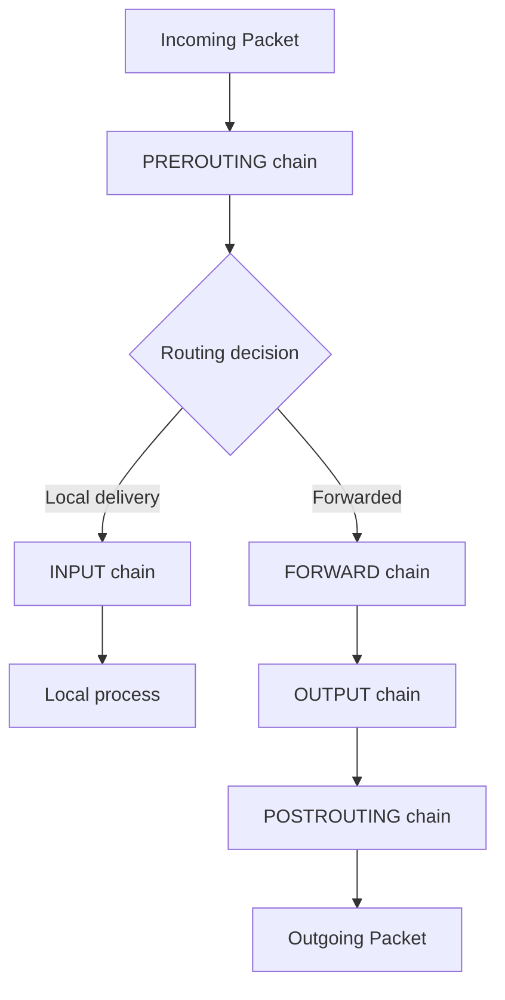

#### nftables vs iptables

| Feature | iptables | nftables |
|---------|----------|----------|
| Kernel version | 2.4+ | 3.13+ |
| Rule evaluation | Linear per-table | Atomic replacement |
| Rule syntax | Complex, counter-based | Cleaner, set-based |
| Performance at scale | Degrades with 1000+ rules | Handles large rule sets efficiently |
| IPv4/IPv6 | Separate commands (iptables/ip6tables) | Dual-stack native |
| Connection tracking | conntrack module | nf_conntrack native |
| Status | Legacy, maintenance mode | Active development |

```bash
# nftables example: allow SSH and HTTP
nft add table inet filter
nft add chain inet filter input '{ type filter hook input priority 0; policy drop; }'
nft add rule inet filter input ct state established,related accept
nft add rule inet filter input iif lo accept
nft add rule inet filter input tcp dport 22 accept
nft add rule inet filter input tcp dport { 80, 443 } accept
```

> **Trade-off Alert:** nftables is the future of Linux packet filtering (all major distributions have adopted it), but many production systems still use iptables. When maintaining existing infrastructure, use the existing tooling. When building new systems, default to nftables. UFW and firewalld provide user-friendly abstractions over both.[^164]

### 7.7 Network Debugging

| Tool | Layer | Purpose |
|------|-------|---------|
| `ss` | L4 | Socket statistics (replaces netstat) |
| `ip` | L2-L3 | Interface, route, neighbor inspection |
| `ping` | L3 | ICMP reachability and latency |
| `traceroute`/`traceroute6` | L3 | Path discovery |
| `mtr` | L3-L4 | Continuous path + latency monitoring |
| `dig`/`nslookup` | L7 | DNS query inspection |
| `tcpdump` | L2-L4 | Packet capture and analysis |
| `tshark` | L2-L7 | Protocol-aware packet analysis |
| `nmap` | L3-L7 | Port scanning and service discovery |

```bash
# Socket statistics - show listening TCP sockets with process info
ss -tlnp

# Packet capture with filter - capture DNS traffic
tcpdump -i eth0 port 53 -nn -v

# Trace path and latency to destination
mtr --report --report-cycles 100 10.0.0.1

# DNS debugging with detailed output
dig +trace +nodnssec example.com
```

### 7.8 Advanced Networking

**VLANs** partition a physical network into logical segments at L2. Linux supports VLAN tagging via the `8021q` kernel module:

```bash
ip link add link eth0 name eth0.100 type vlan id 100
ip addr add 10.100.0.5/24 dev eth0.100
```

**Bonding/Teaming** aggregates multiple NICs for redundancy or throughput. `teaming` (via teamd) is the modern replacement for `bonding`.[^165]

**VXLAN** provides L2 overlay networking over L3 infrastructure, forming the basis of many container networking solutions.[^166]

**Traffic Control (tc)** manages packet scheduling, shaping, and policing:

```bash
# Limit bandwidth on eth0 to 100mbit
tc qdisc add dev eth0 root tbf rate 100mbit burst 32kbit latency 400ms

# Add network delay simulation (useful for testing)
tc qdisc add dev eth0 root netem delay 10ms 5ms
```

### 7.9 Low-Latency Networking

For environments where microseconds matter (such as financial trading), the standard kernel network stack introduces unacceptable overhead. Key concepts:[^167]

**Kernel Bypass:** Technologies like DPDK (Data Plane Development Kit) and Solarflare ef_vi allow applications to directly access NIC hardware, bypassing the kernel entirely. Jane Street uses ef_vi/OpenOnload for their multicast market data systems.[^168]

**XDP (eXpress Data Path):** An eBPF-based framework for high-performance packet processing at the driver level, before the kernel network stack. It provides near-DPDK performance with better kernel integration.[^169]

**NAPI and GRO/GSO:** NAPI (New API) replaces interrupt-driven packet reception with a hybrid polling model to handle high packet rates. GRO (Generic Receive Offload) and GSO (Generic Segmentation Offload) aggregate and segment packets to reduce per-packet overhead.[^170]

**Interrupt Affinity and RSS:** NIC interrupt affinity pins hardware interrupts to specific CPU cores. Receive Side Scaling (RSS) distributes incoming flows across multiple queues using packet header hashing, enabling parallel packet processing.[^171]

**SO_TIMESTAMPING:** Provides hardware-level packet timestamping for precise latency measurement, critical for market data feed analysis.[^172]

### 7.10 Load Balancing

| Type | Examples | Operates On | Use Case |
|------|----------|-------------|----------|
| L4 (Transport) | IPVS, HAProxy (TCP mode), iptables DNAT | IP + Port | High-throughput TCP proxying |
| L7 (Application) | HAProxy (HTTP), nginx, Envoy | HTTP headers, URL, content | Content routing, TLS termination |

**IPVS** (IP Virtual Server) is a kernel-level L4 load balancer integrated with Linux Virtual Server (LVS). It handles millions of connections with minimal overhead.[^173]

**HAProxy** is the industry standard for L4/L7 load balancing, supporting health checks, rate limiting, ACLs, and detailed logging. **nginx** excels at L7 load balancing with reverse proxy, caching, and SSL termination capabilities.

**Further Reading:**
- *TCP/IP Illustrated, Volume 1* by W. Richard Stevens
- `man 7 tcp`, `man 7 udp`
- Linux kernel documentation: `Documentation/networking/`
- Cloudflare blog: "How Linux TCP stack works"

---

## Chapter 8: System Administration

System administration is the foundation upon which all other engineering disciplines rest. A Linux engineer must understand how a system boots, how hardware is discovered and managed, how time is synchronized, and how to configure the kernel to match workload requirements. This chapter covers the operational knowledge that keeps systems running correctly and predictably.

### 8.1 System Initialization and Boot Process

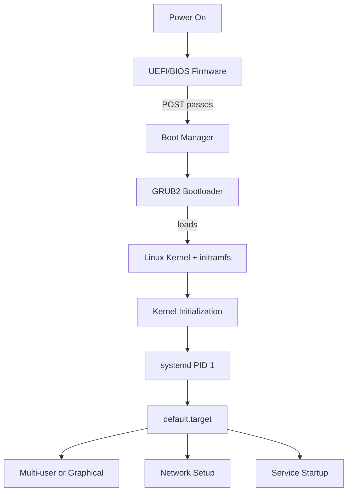

| Stage | Component | Purpose |
|-------|-----------|---------|
| Firmware | UEFI/BIOS | Hardware initialization, POST, boot device selection |
| Bootloader | GRUB2 | Load kernel and initramfs, kernel command line |
| Early boot | initramfs | Load drivers needed to mount root filesystem |
| Init | systemd | PID 1, service management, target reachability |
| Multi-user | target units | Network, services, login readiness |

**GRUB2 configuration:**

```bash
# Regenerate GRUB config after changes
grub2-mkconfig -o /boot/grub2/grub.cfg
# Or on Debian/Ubuntu:
update-grub

# Key kernel command line parameters (in /etc/default/grub)
GRUB_CMDLINE_LINUX="crashkernel=auto rhgb quiet"
```

**initramfs management:**

```bash
# RHEL/Fedora (dracut)
dracut --force          # Regenerate initramfs
dracut --list-modules   # List included modules

# Arch Linux (mkinitcpio)
mkinitcpio -P           # Regenerate for all kernels
```

[^174]

### 8.2 Hardware Management

```bash
# PCI devices
lspci -v                 # Verbose PCI info
lspci -nn                # Show vendor/device IDs

# USB devices
lsusb -v                 # Verbose USB info

# Block devices
lsblk -f                 # Show filesystem info
lsblk -o NAME,SIZE,TYPE,MOUNTPOINT,FSTYPE

# CPU topology
lscpu                    # CPU architecture summary

# Full hardware inventory
dmidecode -t system      # System info (vendor, serial, BIOS)
dmidecode -t memory      # DIMM configuration
```

**udev rules** enable persistent device naming and custom device actions. Rules live in `/etc/udev/rules.d/` and `/usr/lib/udev/rules.d/`:[^175]

```
# /etc/udev/rules.d/99-persistent-net.rules
# Rename interface by MAC address
SUBSYSTEM=="net", ACTION=="add", DRIVERS=="?*", ATTR{address}=="00:11:22:33:44:55", NAME="eth-data"
```

### 8.3 Time Synchronization

Accurate time is critical for log correlation, certificate validation, and distributed system coordination. Jane Street's clock synchronization hierarchy -- GPS reference clocks feeding PTP grandmasters, distributing time via IEEE 1588 to boundary clocks, which then serve NTP to the rest of the network -- achieves approximately 35-40 microsecond accuracy from UTC.[^176]

| Protocol | Accuracy | Mechanism | Use Case |
|----------|----------|-----------|----------|
| NTP (chrony) | 1-10 ms on LAN | Software timestamps | General server time sync |
| NTP (chrony) | 10-100 us with HW timestamps | Hardware timestamps | Financial, scientific |
| PTP (IEEE 1588) | Sub-microsecond | Hardware timestamping | Trading, telecom, industrial |

> **Key Insight:** chrony has largely replaced ntpd as the recommended NTP implementation. chrony synchronizes faster after startup, handles intermittent network connectivity better, and achieves better accuracy on modern hardware. ntpd remains relevant only for Stratum 1 servers with directly attached reference clocks.[^177]

```bash
# chrony configuration (/etc/chrony.conf)
server time1.example.com iburst
server time2.example.com iburst

# Hardware timestamping for PTP-level accuracy
hwtimestamp eth0

# Record system clock performance
makestep 1.0 3
rtcsync
```

### 8.4 Kernel Parameter Management

```bash
# Runtime configuration
sysctl -a                          # List all parameters
sysctl net.ipv4.ip_forward         # Read a specific parameter
sysctl -w net.ipv4.ip_forward=1    # Set a parameter

# Persistent configuration
# /etc/sysctl.d/99-custom.conf
net.ipv4.ip_forward = 1
net.core.somaxconn = 4096

# Apply all drop-ins
sysctl --system
```

Parameters in `/proc/sys/` map directly to `sysctl` paths. `/proc/sys/net/ipv4/ip_forward` corresponds to `net.ipv4.ip_forward`.[^178]

### 8.5 Log Management

| Facility | Tool | Purpose |
|----------|------|---------|
| System journal | journald | Structured, indexed, binary logging |
| Traditional syslog | rsyslog | Syslog protocol, file-based logging |
| Log rotation | logrotate | Prevent disk exhaustion from log files |
| Centralized | ELK, Loki, syslog-ng | Aggregate logs from multiple hosts |

```bash
# journald - most useful journalctl commands
journalctl -u nginx -f               # Follow nginx logs
journalctl -p err --since "1 hour ago"  # Errors from last hour
journalctl -b -1                      # Previous boot's logs
journalctl --disk-usage               # Journal size on disk

# Make journal persistent
mkdir -p /var/log/journal
systemctl restart systemd-journald
```

> **Junior Engineer Note:** When debugging a system issue, read logs in this order: (1) `journalctl -b` for the current boot, (2) `dmesg` for kernel messages, (3) application-specific logs in `/var/log/`, (4) `journalctl -b -1` for the previous boot if the system rebooted unexpectedly. Start broad and narrow down.[^179]

### 8.6 User and Group Management

| Command | Purpose |
|---------|---------|
| `useradd` | Create a new user |
| `usermod` | Modify user properties |
| `userdel` | Delete a user |
| `groupadd` | Create a new group |
| `gpasswd` | Manage group membership |

```bash
# Create user with home directory and bash shell
useradd -m -s /bin/bash -G wheel deploy

# Set password aging policy
chage -M 90 -W 7 deploy    # Max 90 days, warn 7 days before expiry

# View group membership
id deploy
groups deploy
```

Key files: `/etc/passwd` (user info), `/etc/shadow` (password hashes), `/etc/group` (group membership). PAM (Pluggable Authentication Modules) controls the authentication stack.[^180]

### 8.7 Configuration Backup and Monitoring

**etckeeper** tracks `/etc` in version control (git, mercurial, or others), enabling rollback of configuration changes:

```bash
# Initialize /etc tracking
etckeeper init
etckeeper commit "Initial commit"

# After making changes
apt install nginx
etckeeper commit "Install nginx"
```

**Hardware monitoring:**

```bash
lm-sensors          # Temperature, voltage, fan speed
smartctl -a /dev/sda  # SMART disk health
edac-util -s        # Memory ECC error detection
ipmitool sensor list  # BMC/IPMI sensor readings
```

**Firmware management:**

```bash
# fwupd - automatic firmware updates for supported devices
fwupdmgr get-updates
fwupdmgr update
```

[^181]

**Further Reading:**
- `man 8 systemd-boot`, `man 5 systemd-boot`
- `man 8 chronyd`
- Red Hat Enterprise Linux System Administrator's Guide

---

## Chapter 9: Security Hardening

Security is not a feature you bolt on; it is an architectural property built through defense in depth. Every layer of the stack -- from bootloader to application -- presents an attack surface that must be considered. For a Linux engineer working on infrastructure supporting financial systems or any regulated industry, security hardening is not optional.[^182]

### 9.1 Defense in Depth

```mermaid
graph TD
    subgraph "Layer 1: Physical"
        A1[Secure Boot, TPM, BIOS passwords]
    end
    subgraph "Layer 2: Boot"
        A2[UEFI Secure Boot, signed kernel, initramfs integrity]
    end
    subgraph "Layer 3: Kernel"
        A3[Module signing, lockdown mode, sysctl hardening]
    end
    subgraph "Layer 4: MAC"
        A4[SELinux / AppArmor policies]
    end
    subgraph "Layer 5: DAC"
        A5[File permissions, ACLs, capability bounding]
    end
    subgraph "Layer 6: Service"
        A6[systemd sandboxing, seccomp, namespaces]
    end
    subgraph "Layer 7: Network"
        A7[Firewall, TLS, SSH hardening]
    end
    subgraph "Layer 8: Application"
        A8[Input validation, secrets management]
    end
```

### 9.2 Kernel Security Hardening

```bash
# /etc/sysctl.d/99-hardening.conf
# Restrict kernel pointer exposure
kernel.kptr_restrict = 2
kernel.dmesg_restrict = 1

# Restrict ptrace scope
kernel.yama.ptrace_scope = 2

# Disable SysRq
kernel.sysrq = 0

# Restrict BPF
kernel.unprivileged_bpf_disabled = 1

# Restrict user namespaces (if not needed for containers)
kernel.unprivileged_userns_clone = 0
```

**Kernel Lockdown Mode** (kernel 5.4+) restricts kernel functionality even for root, preventing modification of running kernel code. Modes: `integrity` (no unsigned module loading) and `confidentiality` (no /dev/mem access).[^183]

### 9.3 Mandatory Access Control

| Feature | SELinux | AppArmor |
|---------|---------|----------|
| Default in | RHEL, CentOS, Fedora, Rocky | Ubuntu, Debian, SUSE |
| Policy model | Label-based (type enforcement) | Path-based (profile-based) |
| Granularity | Per-file, per-port, per-process | Per-file-path, per-capability |
| Learning curve | Steep (concepts: types, contexts, booleans) | Moderate (profiles are readable) |
| Configuration | `/etc/selinux/`, `semanage`, `restorecon` | `/etc/apparmor.d/`, `aa-enforce` |

```bash
# SELinux: check status
getenforce          # Enforcing, Permissive, or Disabled
sestatus            # Detailed status

# SELinux: troubleshoot denials
ausearch -m AVC -ts recent    # Recent access vector denials
sealert -a /var/log/audit/audit.log  # Detailed suggestions

# AppArmor: check profile status
aa-status
aa-enforce /etc/apparmor.d/usr.sbin.nginx
```

> **Trade-off Alert:** Disabling SELinux or AppArmor "just to get things working" is the most common security shortcut in Linux administration. While both systems have a learning curve, they provide critical protection against privilege escalation. The correct approach is to learn to troubleshoot denials and write custom policies, not to disable the MAC system. Tools like `audit2allow` (SELinux) and `aa-genprof` (AppArmor) dramatically reduce the effort required.[^184]

### 9.4 Filesystem Security

Mount options that harden filesystems:

| Option | Effect |
|--------|--------|
| `noexec` | Prevent code execution (useful for /tmp, /var/tmp) |
| `nosuid` | Ignore SUID/SGID bits |
| `nodev` | Prevent device file interpretation |

```bash
# Harden /tmp in /etc/fstab
tmpfs /tmp tmpfs defaults,noexec,nosuid,nodev,size=2G 0 0
```

**POSIX ACLs** extend traditional Unix permissions:

```bash
# Grant read access to a specific group
setfacl -m g:webdev:rx /var/www/html

# View ACLs
getfacl /var/www/html
```

### 9.5 Service Hardening (systemd)

systemd provides extensive sandboxing directives for unit files:

| Directive | Effect |
|-----------|--------|
| `ProtectSystem=strict` | Mount / and /usr as read-only |
| `ProtectHome=yes` | Hide /home, /root, /run/user |
| `PrivateTmp=yes` | Isolated /tmp namespace |
| `NoNewPrivileges=yes` | Prevent privilege escalation via SUID |
| `CapabilityBoundingSet=` | Drop unnecessary Linux capabilities |
| `SeccompProfile=` | System call filtering |
| `RestrictAddressFamilies=AF_UNIX AF_INET` | Limit socket families |
| `MemoryDenyWriteExecute=true` | Prevent W+X memory mappings |

```ini
# /etc/systemd/system/hardened-app.service
[Service]
ProtectSystem=strict
ProtectHome=yes
PrivateTmp=yes
NoNewPrivileges=yes
CapabilityBoundingSet=CAP_NET_BIND_SERVICE
RestrictAddressFamilies=AF_INET AF_UNIX
```

### 9.6 SSH Hardening

```bash
# /etc/ssh/sshd_config
PermitRootLogin no
PasswordAuthentication no
PubkeyAuthentication yes
AllowUsers deploy admin
Protocol 2
MaxAuthTries 3
ClientAliveInterval 300
ClientAliveCountMax 2
X11Forwarding no
AllowTcpForwarding no
```

> **Common Pitfall:** SSH key management is often neglected. Keys without passphrases, shared private keys between team members, and never-rotated keys are common vulnerabilities. Implement certificate-based SSH (using `ssh-keygen -s` to sign host and user keys) for short-lived, auditable access. Tools like `ssh-audit` can evaluate your SSH server configuration.[^185]

### 9.7 Audit Framework

The Linux audit framework (`auditd`) provides a tamper-resistant log of security-relevant events:

```bash
# /etc/audit/rules.d/hardening.rules
# Monitor authentication events
-w /etc/pam.d/ -p wa -k pam_config
-w /etc/shadow -p wa -k shadow_access

# Monitor privilege escalation
-a always,exit -F arch=b64 -C euid!=uid -S execve -k priv_escalation

# Monitor network configuration changes
-w /etc/hosts -p wa -k network_config
-w /etc/sysconfig/network -p wa -k network_config
```

```bash
ausearch -k shadow_access --interpret
aureport --auth
```

### 9.8 Disk Encryption and Secure Boot

**LUKS2** provides full-disk encryption with strong defaults:

```bash
# Encrypt a partition
cryptsetup luksFormat /dev/sdb1

# Open encrypted volume
cryptsetup luksOpen /dev/sdb1 secure_data

# TPM-backed automatic unlock
systemd-cryptenroll /dev/sdb1 --tpm2-device=auto
```

**UEFI Secure Boot** ensures only signed bootloaders execute. The chain: UEFI firmware validates shim (signed by Microsoft), shim validates GRUB (signed by distro key), GRUB validates the kernel (signed by distro key). Machine Owner Keys (MOK) allow registering custom signing keys.[^186]

### 9.9 CIS Benchmarks and Vulnerability Scanning

**CIS Benchmarks** provide prescriptive configuration guidance for hardening. **OpenSCAP** automates compliance checking against these benchmarks:

```bash
# Scan against CIS benchmark
oscap xccdf eval --profile xccdf_org.ssgproject.content_profile_cis \
    --results results.xml /usr/share/xml/scap/ssg/content/ssg-rhel9-ds.xml

# Lynis - quick security audit
lynis audit system
```

[^187]

**Further Reading:**
- CIS Security Benchmarks (cisecurity.org)
- NIST SP 800-123 Guide to General Server Security
- *Linux Security Cookbook* by Barry D. Bullins
- `man 8 auditd`, `man 5 auditd.conf`

---

## Chapter 10: Identity and Access Management

Identity and access management (IAM) determines who can do what on a system. For a Linux engineer, this encompasses local authentication, privilege escalation, centralized directory integration, secrets management, and multi-factor authentication. Misconfigured IAM is the most common vector for both external breaches and internal incidents.[^188]

### 10.1 PAM (Pluggable Authentication Modules)

PAM provides a modular authentication stack. Each service (login, sshd, sudo) has a PAM configuration file in `/etc/pam.d/` that specifies which modules to invoke and in what order.

| Module Type | Purpose | Examples |
|-------------|---------|----------|
| `auth` | Verify identity (password, key, token) | pam_unix, pam_ldap, pam_google_authenticator |
| `account` | Check account validity (expiry, access hours) | pam_unix, pam_access |
| `password` | Password change rules | pam_pwquality, pam_unix |
| `session` | Session setup/teardown (mount home, logging) | pam_mkhomedir, pam_limits |

> **Key Insight:** The order of PAM modules matters. PAM processes modules in the order listed in the config file. A `required` module that fails causes the entire stack to fail, but PAM continues processing remaining `required` modules before returning the final result. A `sufficient` module that succeeds short-circuits the stack immediately. Understanding this flow is essential for troubleshooting authentication issues.[^189]

### 10.2 Password Policies

```bash
# /etc/security/pwquality.conf
minlen = 14
dcredit = -2
ucredit = -2
ocredit = -2
lcredit = -2

# Password aging in /etc/login.defs
PASS_MAX_DAYS 90
PASS_MIN_DAYS 7
PASS_WARN_AGE 14
```

### 10.3 sudo Configuration

```bash
# /etc/sudoers.d/engineers (use visudo -f to edit safely)
%engineers ALL=(ALL) NOPASSWD: /usr/bin/systemctl restart nginx, /usr/bin/journalctl

# /etc/sudoers.d/security-audit
%security ALL=(ALL) /usr/bin/auditctl, /usr/bin/ausearch, /usr/bin/aureport
```

> **Junior Engineer Note:** Always use `visudo` or `visudo -f /etc/sudoers.d/filename` to edit sudoers files. Syntax errors in `/etc/sudoers` lock out all administrative access. The `-f` flag lets you validate individual drop-in files. Never edit `/etc/sudoers` directly if you can avoid it -- use drop-in files in `/etc/sudoers.d/`.[^190]

### 10.4 SSH Key Management

| Key Type | Recommendation |
|----------|----------------|
| Ed25519 | Preferred. Fast, small keys, resistant to side-channel attacks |
| RSA (4096-bit) | Acceptable. Use only if Ed25519 is unsupported by client |
| RSA (2048-bit) | Minimum. Consider migrating to Ed25519 |
| DSA | Deprecated. Do not use |
| ECDSA | Avoid on older systems (potential nonce reuse) |

```bash
# Generate Ed25519 key pair
ssh-keygen -t ed25519 -C "engineer@example.com" -f ~/.ssh/id_ed25519

# Use ssh-agent to manage keys
eval "$(ssh-agent -s)"
ssh-add ~/.ssh/id_ed25519

# Harden known_hosts
# /etc/ssh/ssh_config.d/99-hardened.conf
Host *
    HashKnownHosts yes
    StrictHostKeyChecking ask
```

### 10.5 Certificate-Based SSH

SSH certificates provide short-lived, CA-signed identity verification instead of relying on static `authorized_keys` files:

```bash
# Generate a CA key
ssh-keygen -t ed25519 -f /path/to/ca_key -C "SSH CA"

# Sign a user key (valid for 24 hours)
ssh-keygen -s /path/to/ca_key -I "engineer@example.com" \
    -n engineer -V +24h /home/engineer/.ssh/id_ed25519.pub

# Sign a host key
ssh-keygen -s /path/to/ca_key -I "web01.example.com" \
    -h -n web01.example.com -V +52w /etc/ssh/ssh_host_ed25519_key.pub
```

### 10.6 Centralized Identity

| Solution | Architecture | Best For |
|----------|-------------|----------|
| SSSD | Client-side caching daemon | LDAP/AD integration on Linux |
| FreeIPA | Full identity management (LDAP + Kerberos + DNS) | Enterprise Linux environments |
| realmd | Domain discovery and join | Active Directory integration |
| Keycloak | Identity broker (OAuth2/OIDC/SAML) | Web application SSO |

```bash
# Join a FreeIPA/AD domain
realm discover example.com
realm join example.com -U admin
```

### 10.7 Secrets Management

| Tool | Model | Use Case |
|------|-------|----------|
| HashiCorp Vault | Centralized, dynamic secrets | Production secrets with audit trail |
| SOPS | Encrypted files in git | Configuration file secrets |
| ansible-vault | Encrypted YAML | Ansible playbook secrets |
| systemd-creds | Per-unit encrypted secrets | Systemd service secrets |

> **Key Insight:** Environment variables are convenient but leaky -- they appear in `/proc/PID/environ`, crash dumps, and process listings. For any secret that matters, use a secrets management tool. SOPS is the fastest path to encrypted-at-rest configuration for teams already using git.[^191]

### 10.8 Multi-Factor Authentication

```bash
# TOTP via PAM (Google Authenticator)
# /etc/pam.d/sshd
auth required pam_google_authenticator.so

# Then in sshd_config:
ChallengeResponseAuthentication yes
AuthenticationMethods publickey,keyboard-interactive
```

WebAuthn (FIDO2) provides phishing-resistant MFA using hardware security keys. PAM modules like `pam_u2f` integrate WebAuthn into Linux authentication.

[^192]

**Further Reading:**
- `man 5 pam`, `man 8 pam_authenticate`
- HashiCorp Vault documentation
- *Linux Security Cookbook*

---

## Chapter 11: Virtualization

Virtualization allows running multiple isolated operating systems on shared physical hardware. For Linux engineers, virtualization is both a technology to manage and a foundational concept underlying containerization, cloud computing, and security isolation.[^193]

### 11.1 Virtualization Concepts

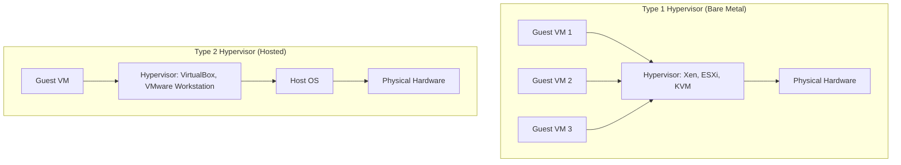

| Type | Examples | Overhead | Use Case |
|------|----------|----------|----------|
| Type 1 (Bare Metal) | Xen, KVM, ESXi | Low | Production servers, cloud |
| Type 2 (Hosted) | VirtualBox, VMware Workstation | Higher | Development, testing |
| Paravirtualization | Xen (PV), virtio drivers | Low | Performance-sensitive guests |
| Hardware-assisted | Intel VT-x, AMD-V | Very low | Standard modern virtualization |

### 11.2 KVM Architecture

KVM (Kernel-based Virtual Machine) is the standard Linux virtualization solution. It transforms the Linux kernel into a Type 1 hypervisor using hardware-assisted virtualization.[^194]

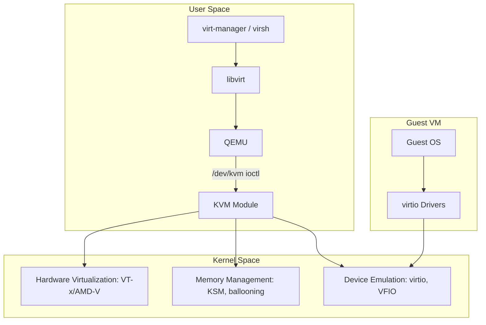

**Key components:**
- **KVM module:** Kernel module that provides virtualization primitives
- **QEMU:** User-space emulator providing device models and VM lifecycle management
- **libvirt:** Management API abstracting KVM, Xen, and other hypervisors
- **virt-manager / virsh:** GUI and CLI for VM management via libvirt

### 11.3 VM Management

```bash
# VM lifecycle
virsh list --all                    # List all VMs
virsh start vm-web01               # Start a VM
virsh shutdown vm-web01            # Graceful shutdown
virsh destroy vm-web01             # Force shutdown (power off)
virsh undefine vm-web01 --remove-all-storage  # Delete VM

# Snapshots
virsh snapshot-create-as vm-web01 pre-upgrade "Before upgrade"
virsh snapshot-revert vm-web01 pre-upgrade
virsh snapshot-list vm-web01

# Live migration (shared storage)
virsh migrate vm-web01 qemu+ssh://host2.example.com/system --live

# Resource limits
virsh setvcpus vm-web01 4 --config
virsh setmaxmem vm-web01 8G --config
```

### 11.4 Storage and Networking

| Disk Format | Features | Use Case |
|-------------|----------|----------|
| raw | No metadata, fastest I/O | Performance-sensitive workloads |
| qcow2 | Snapshots, thin provisioning, compression | General-purpose, development |
| LVM | Resize, snapshots at block level | Production with thin provisioning |

VM networking modes:

| Mode | Description | Use Case |
|------|-------------|----------|
| NAT | VMs share host IP via libvirt NAT bridge | Development, isolated testing |
| Bridged | VM appears on physical network | Production, VMs need direct network access |
| macvtap | Direct assignment with virtual MAC | High performance with direct access |
| SR-IOV | Hardware-level NIC partitioning | Maximum network performance (trading systems) |
| OVS | Open vSwitch, programmable virtual switching | Complex virtual networking, NFV |

### 11.5 VM vs Containers

> **Trade-off Alert:** VMs provide strong isolation boundaries (separate kernel, separate memory space) at the cost of resource overhead. Containers share the host kernel and are lighter but have a larger attack surface. The decision depends on: (1) isolation requirements -- multi-tenant, untrusted code, or regulatory compliance favor VMs; (2) density requirements -- many lightweight services favor containers; (3) legacy applications -- OS-dependent applications may need full VM environments.[^195]

**Performance tuning for VMs:**

```bash
# CPU pinning (ensure vCPU maps to physical CPU)
virsh vcpupin vm-web01 0 4

# NUMA-aware placement
virsh numatune vm-web01 --memory nodeset=0 --mode strict

# Huge pages for VM memory
echo 4096 > /proc/sys/vm/nr_hugepages
```

[^196]

**Further Reading:**
- KVM documentation: `Documentation/virtual/kvm/`
- *Virtualization with KVM* by Sander van Vugt
- libvirt documentation: libvirt.org

---

## Chapter 12: Containers

Containers are the dominant deployment paradigm for modern applications. Unlike virtual machines, containers share the host kernel, using Linux namespaces and cgroups for isolation and resource control. Understanding what containers actually are -- at the kernel level -- separates engineers who can debug container issues from those who can only deploy them.[^197]

### 12.1 Container Fundamentals

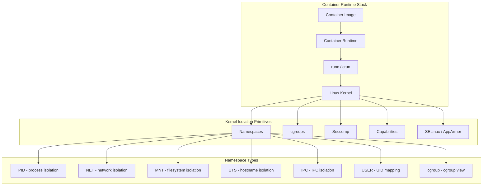

> **Key Insight:** A container is not a lightweight VM. It is a set of kernel-enforced boundaries (namespaces + cgroups + seccomp + capabilities) around a group of processes. The container's processes run directly on the host kernel. This means a kernel vulnerability can compromise all containers on a host -- a fundamental security difference from VMs.[^198]

### 12.2 Linux Namespaces

| Namespace | Isolates | Kernel Version | Key Function |
|-----------|----------|----------------|--------------|
| PID | Process IDs | 2.6.24 | Container sees its own PID 1 |
| NET | Network stack | 2.6.29 | Separate interfaces, routing, iptables |
| MNT | Mount points | 2.4.19 | Isolated filesystem hierarchy |
| UTS | Hostname/domain | 2.6.19 | Per-container hostname |
| IPC | Shared memory, semaphores | 2.6.19 | Process communication isolation |
| USER | UIDs/GIDs | 3.8 | Unprivileged container mapping |
| cgroup | cgroup root view | 4.6 | Hidden host cgroup hierarchy |

### 12.3 cgroups v1 vs v2

| Feature | cgroups v1 | cgroups v2 |
|---------|------------|------------|
| Architecture | Per-controller hierarchies | Unified hierarchy |
| Resource distribution | Complex, per-controller | Simplified, weight-based |
| I/O control | blkio (deprecated) | io.max, io.weight |
| Memory accounting | Separate from rlimit | Unified memory+swap control |
| PSI (Pressure Stall Info) | Not available | Available (kernel 4.20+) |
| Default on | RHEL 7, older Ubuntu | RHEL 9, Ubuntu 22.04+, Fedora |

**Key cgroup controllers:**

| Controller | Controls |
|------------|----------|
| cpu | CPU time allocation (CFS bandwidth) |
| memory | RSS, swap, kernel memory limits |
| io | Block I/O bandwidth and IOPS |
| pids | Maximum number of processes |
| cpuset | CPU and memory node pinning |

### 12.4 Container Runtimes

| Runtime | Type | Description |
|---------|------|-------------|
| runc | Low-level | OCI reference runtime, used by Docker and containerd |
| crun | Low-level | C implementation, faster than runc (by Red Hat) |
| containerd | High-level | Daemon managing container lifecycle, pulls images |
| CRI-O | High-level | Kubernetes-native, OCI-only runtime |

The **OCI Runtime Specification** defines the interface between container runtimes and the container runtime layer (containerd/CRI-O call runcr/crun to actually create containers).

### 12.5 Docker Architecture

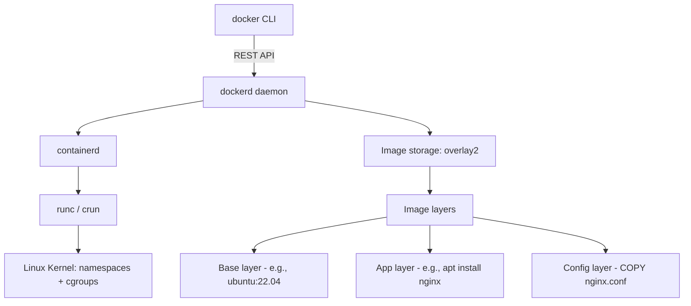

**Dockerfile best practices:**

```dockerfile
# Multi-stage build - separate build and runtime
FROM golang:1.22 AS builder
WORKDIR /app
COPY go.mod go.sum ./
RUN go mod download
COPY . .
RUN CGO_ENABLED=0 go build -o /server

FROM gcr.io/distroless/static
COPY --from=builder /server /server
USER nonroot:nonroot
ENTRYPOINT ["/server"]
```

> **Common Pitfall:** Container image size directly impacts deployment speed, security surface, and storage costs. Every `RUN` layer adds to the image. Combine related commands, use `.dockerignore`, prefer distroless or Alpine base images, and always use multi-stage builds for compiled applications.[^199]

### 12.6 Container Networking

| Mode | Description | Isolation |
|------|-------------|-----------|
| bridge | Default. Virtual bridge on host | Network isolation between containers |
| host | Shares host network stack | No network isolation, minimal overhead |
| none | No networking | Complete network isolation |
| overlay | Cross-host networking (Docker Swarm) | Multi-host container networks |
| macvlan | Direct L2 access with MAC | Containers appear as physical hosts |

**CNI (Container Network Interface) plugins** for Kubernetes:

| Plugin | Model | Features |
|--------|-------|----------|
| Calico | BGP + IP-in-IP/VXLAN | Network policy, high performance |
| Flannel | VXLAN overlay | Simple, minimal features |
| Cilium | eBPF-based | Advanced policy, observability, L7 filtering |

### 12.7 Container Security

Key security layers for containers:

1. **Rootless containers:** Run container runtime as non-root user (Podman default, Docker rootless mode)
2. **User namespaces:** Map container root to unprivileged host UID
3. **Seccomp profiles:** Restrict syscalls available to containers (default blocks ~44 syscalls)
4. **AppArmor/SELinux profiles:** Mandatory access control for container processes
5. **Image scanning:** Trivy, Grype scan images for known CVEs before deployment
6. **Image signing:** Cosign (Sigstore) and Notary verify image provenance

```bash
# Scan image for vulnerabilities
trivy image myapp:latest

# Verify image signature
cosign verify --key cosign.pub myregistry/myapp:latest
```

### 12.8 Pod Concepts

A **Pod** (Kubernetes) is the smallest deployable unit, representing one or more co-located containers that share network namespace, storage volumes, and lifecycle. Pods exist because some containers are tightly coupled (e.g., a web server and a log shipper sharing a network namespace).[^200]

### 12.9 Daemonless Alternatives

| Tool | Description | Key Differentiator |
|------|-------------|-------------------|
| Podman | Rootless, daemonless Docker replacement | Drop-in Docker CLI replacement, rootless by default |
| Buildah | Daemonless image building | Scriptable, no daemon dependency |
| nerdctl | Docker-compatible CLI for containerd | Uses containerd directly |

> **Junior Engineer Note:** Docker remains the most common container tool in development environments, but Podman is preferred in production on RHEL-based systems due to its rootless-by-default design and daemonless architecture. For new projects, consider Podman first. The CLI is nearly identical to Docker, so migration is straightforward.[^201]

[^202]

**Further Reading:**
- *Container Security* by Liz Rice (O'Reilly)
- OCI Runtime Specification: opencontainers.org
- Linux namespaces: `man 7 namespaces`
- cgroups: `Documentation/admin-guide/cgroup-v2.rst`

---

## Chapter 13: Automation and Orchestration

Manual, repeatable tasks are a liability. Every time an engineer runs a sequence of commands by hand, they introduce the possibility of human error and create knowledge that exists only in their head. Automation codifies operations into version-controlled, testable, reproducible artifacts. For a Linux engineer, automation is not optional -- it is a core professional competency.[^203]

### 13.1 Automation Philosophy

The automation maturity model progresses through stages:

| Stage | Description | Example |
|-------|-------------|---------|
| Manual | Engineer runs commands by hand | `yum install nginx && vim /etc/nginx/nginx.conf` |
| Scripted | Commands captured in a script | Bash script that installs and configures nginx |
| Declarative | Desired state described, tool figures out steps | Ansible playbook specifying nginx package + config |
| Continuous | Drift detection and automatic correction | Ansible + cron or AWX scheduled runs |

### 13.2 Ansible

Ansible is the most widely used agentless configuration management tool. It communicates over SSH (or WinRM), uses YAML for playbooks, and requires no agent installation on managed hosts.[^204]

```yaml
# site.yml - Playbook example
---
- name: Configure web servers
  hosts: webservers
  become: yes
  vars:
    nginx_port: 8080

  tasks:
    - name: Install nginx
      ansible.builtin.dnf:
        name: nginx
        state: present

    - name: Deploy nginx configuration
      ansible.builtin.template:
        src: nginx.conf.j2
        dest: /etc/nginx/nginx.conf
        owner: root
        group: root
        mode: '0644'
      notify: Reload nginx

    - name: Ensure nginx is running and enabled
      ansible.builtin.systemd:
        name: nginx
        state: started
        enabled: yes

  handlers:
    - name: Reload nginx
      ansible.builtin.systemd:
        name: nginx
        state: reloaded
```

**Ansible project structure:**

```
project/
  inventories/
    production/
      hosts.yml
      group_vars/
        all.yml
        webservers.yml
  roles/
    nginx/
      tasks/main.yml
      handlers/main.yml
      templates/nginx.conf.j2
      defaults/main.yml
  site.yml
  requirements.yml
```

**Ansible Vault** manages encrypted secrets:

```bash
# Encrypt a file
ansible-vault encrypt group_vars/production/secrets.yml

# Edit encrypted file
ansible-vault edit group_vars/production/secrets.yml

# Run playbook with vault password
ansible-playbook site.yml --ask-vault-pass
```

**AWX/Tower** provides a web UI, RBAC, API, and scheduling for Ansible playbooks.

### 13.3 Configuration Management Concepts

| Concept | Definition |
|---------|-----------|
| Idempotency | Running the same operation twice produces the same result as running it once |
| Desired state | Describe the end state; the tool figures out how to achieve it |
| Convergence | System corrects drift toward desired state on each run |
| Divergence | System may deviate from desired state until next run |
| Drift detection | Monitoring for deviations from declared configuration |

> **Key Insight:** Idempotency is the most important property of automation. A non-idempotent playbook that adds a line to a config file will add it again on every run. The correct approach: use templating (Jinja2) to write the entire config from a template, or use a module that checks current state before making changes. Test idempotency by running your playbook twice and verifying zero changes on the second run.[^205]

### 13.4 Salt/SaltStack

Salt uses a master-minion architecture with its own encrypted communication channel (ZeroMQ). It excels at high-speed, event-driven automation across large fleets.[^206]

| Feature | Ansible | SaltStack |
|---------|---------|-----------|
| Agent | Agentless (SSH) | Agent-based (salt-minion) |
| Communication | SSH | ZeroMQ (encrypted) |
| Execution speed | Slow at scale (SSH per host) | Fast (persistent connections) |
| Configuration | YAML playbooks | YAML state files + pillars |
| Event-driven | Limited (AWX webhooks) | Native (beacons + reactors) |
| Learning curve | Lower | Moderate |

### 13.5 Task Runners

For ad-hoc automation tasks that do not need full configuration management:

| Tool | Language | Best For |
|------|----------|----------|
| Make | Makefile | C projects, simple build automation |
| Just | Justfile | Cross-platform, readable task runner |
| Task (go-task) | Taskfile.yml | Go ecosystem, YAML-based |
| invoke | Python | Python projects, scripted tasks |

### 13.6 Testing Automation

| Tool | Tests | Framework |
|------|-------|-----------|
| Molecule | Ansible roles | pytest + Docker/VM |
| testinfra | Infrastructure state | pytest backend |
| Serverspec | Server configuration | Ruby, RSpec |
| InSpec | Compliance testing | Ruby, Chef ecosystem |

```yaml
# molecule/default/molecule.yml
---
dependency:
  name: galaxy
driver:
  name: docker
platforms:
  - name: centos-stream9
    image: quay.io/centos/centos:stream9
provisioner:
  name: ansible
verifier:
  name: ansible
```

> **Common Pitfall:** Testing automation is the most neglected part of infrastructure engineering. Untested playbooks are scripts with aspirations. Every role should have at minimum: (1) a syntax check (`ansible-playbook --syntax-check`), (2) a lint pass (`ansible-lint`), (3) a Molecule test that deploys to a container and verifies state. Without these, your automation is fragile and undocumented.[^207]

### 13.7 Error Handling and Rollback

```yaml
# Ansible error handling
- block:
    - name: Deploy new configuration
      ansible.builtin.template:
        src: app.conf.j2
        dest: /etc/app/config.conf
      notify: Restart app

    - name: Verify application is healthy
      ansible.builtin.uri:
        url: http://localhost:8080/health
        status_code: 200
      retries: 5
      delay: 3

  rescue:
    - name: Roll back configuration
      ansible.builtin.copy:
        src: /etc/app/config.conf.backup
        dest: /etc/app/config.conf
      notify: Restart app

  always:
    - name: Notify team of deployment result
      ansible.builtin.uri:
        url: "{{ slack_webhook }}"
        method: POST
        body: '{"text": "Deployment completed"}'
```

[^208]

**Further Reading:**
- *Ansible: Up and Running* by Bas Meijer et al.
- Ansible documentation: docs.ansible.com
- *Infrastructure as Code* by Kief Morris (O'Reilly)

---

## Chapter 14: Infrastructure as Code

Infrastructure as Code (IaC) extends automation from software configuration to the provisioning and management of infrastructure itself -- servers, networks, load balancers, DNS, and cloud resources. IaC makes infrastructure versionable, testable, and reproducible.[^209]

### 14.1 IaC Philosophy

| Approach | Description | Tools |
|----------|-------------|-------|
| Declarative | Describe desired end state | Terraform, CloudFormation, Pulumi |
| Imperative | Describe steps to reach desired state | Bash scripts, Ansible tasks |
| Convergence | System corrects drift toward desired state | Terraform, Puppet, Ansible |
| Divergence | System may deviate until next run | Manual, ad-hoc scripts |

### 14.2 Terraform

Terraform is the dominant IaC tool, using HCL (HashiCorp Configuration Language) to declare infrastructure resources.[^210]

```hcl
# main.tf
terraform {
  required_providers {
    aws = {
      source  = "hashicorp/aws"
      version = "~> 5.0"
    }
  }
  backend "s3" {
    bucket = "mycompany-terraform-state"
    key    = "prod/vpc/terraform.tfstate"
    region = "us-east-1"
    dynamodb_table = "terraform-locks"
    encrypt = true
  }
}

provider "aws" {
  region = var.region
}

data "aws_ami" "amazon_linux" {
  most_recent = true
  owners      = ["amazon"]
  filter {
    name   = "name"
    values = ["al2023-ami-*-x86_64"]
  }
}

resource "aws_instance" "web" {
  count         = var.instance_count
  ami           = data.aws_ami.amazon_linux.id
  instance_type = "t3.medium"
  subnet_id     = var.subnet_ids[count.index]
  tags = {
    Name = "web-${count.index + 1}"
    Role = "webserver"
  }
}
```

```bash
# Terraform workflow
terraform init      # Initialize providers and backend
terraform plan      # Preview changes
terraform apply     # Execute changes
terraform destroy   # Tear down infrastructure
```

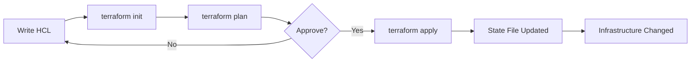

### 14.3 OpenTofu

OpenTofu is a Linux Foundation-maintained fork of Terraform, created in response to HashiCorp's license change from MPL to BSL in 2023. It is API-compatible with Terraform and accepts HCL. The primary motivation is ensuring IaC remains under open-source governance.[^211]

### 14.4 Pulumi

Pulumi uses general-purpose programming languages (Python, TypeScript, Go, C#) instead of HCL. This enables IDE support, unit testing, and reuse of existing libraries.[^212]

```python
# Pulumi example (Python)
import pulumi
import pulumi_aws as aws

web = aws.ec2.Instance("web",
    instance_type="t3.medium",
    ami="ami-0c55b159cbfafe1f0",
    tags={"Name": "web-server"})
```

### 14.5 Cloud-Native IaC

| Tool | Cloud | Language | State |
|------|-------|----------|-------|
| CloudFormation | AWS | YAML/JSON | AWS-managed |
| ARM/Bicep | Azure | JSON / Bicep DSL | Azure-managed |
| Deployment Manager | GCP | YAML/Jinja2 | GCP-managed |

### 14.6 State Management

> **Trade-off Alert:** Terraform state is the mapping between your code and real infrastructure. Losing state means Terraform cannot manage existing resources. Always use remote state (S3, GCS, Azure Blob) with state locking (DynamoDB, GCS native) and encryption. Never commit state files to git.[^213]

| Backend | State Locking | Encryption | Multi-user |
|---------|--------------|------------|------------|
| S3 + DynamoDB | DynamoDB item | S3 SSE | Yes |
| GCS | Native | CMEK | Yes |
| Azure Blob | Native | CMK | Yes |
| Terraform Cloud | Built-in | Built-in | Yes |

### 14.7 Module Design

Terraform modules encapsulate reusable infrastructure patterns:

```hcl
# modules/vpc/main.tf
variable "cidr_block" { type = string }
variable "azs" { type = list(string) }

resource "aws_vpc" "main" {
  cidr_block = var.cidr_block
}

output "vpc_id" {
  value = aws_vpc.main.id
}

# Using the module
module "vpc" {
  source    = "./modules/vpc"
  cidr_block = "10.0.0.0/16"
  azs       = ["us-east-1a", "us-east-1b"]
}
```

### 14.8 IaC Security

```bash
# tfsec - scan for security issues
tfsec .

# checkov - compliance checking
checkov -d .

# Terratest - infrastructure testing
go test -v ./tests/ -timeout 30m
```

Key security practices:
- Never store secrets in state files (use Vault, SOPS, or cloud provider secrets managers)
- Use least-privilege IAM roles for Terraform providers
- Scan code with tfsec/checkov before applying
- Enable state encryption at rest and in transit

### 14.9 Immutable vs Mutable Infrastructure

| Approach | Description | Trade-off |
|----------|-------------|-----------|
| Mutable | Modify existing instances in place | Faster individual changes, harder to track state |
| Immutable | Replace instances with new ones | Consistent state, easier rollback, slower individual changes |

Immutable infrastructure (e.g., AMI-based deployments, container redeployment) eliminates configuration drift by design. Mutable infrastructure (e.g., SSH + Ansible) is simpler for initial setup but accumulates drift over time.[^214]

### 14.10 GitOps

GitOps uses git as the single source of truth for infrastructure and application deployment. Changes flow through git: commit, review, merge, and automated reconciliation.

| Tool | Model | Focus |
|------|-------|-------|
| ArgoCD | Pull-based | Kubernetes application delivery |
| Flux | Pull-based | Kubernetes GitOps, CNCF project |

> **Junior Engineer Note:** Start with Terraform for cloud infrastructure, Ansible for configuration management, and git for version control. This trio covers 80% of IaC needs. Add complexity (GitOps, Pulumi, OpenTofu) only when you have a specific reason to do so.[^215]

**Further Reading:**
- *Terraform: Up and Running* by Yevgeniy Brikman
- *Infrastructure as Code* by Kief Morris (O'Reilly)
- Terraform documentation: developer.hashicorp.com/terraform

---

## Chapter 15: Observability and Monitoring

Monitoring tells you when something is broken. Observability tells you why. The distinction matters: monitoring requires you to anticipate failures in advance, while observability lets you investigate failures you have never seen before. For a Linux engineer, building and maintaining observability infrastructure is as important as building the systems being observed.[^216]

### 15.1 The Three Pillars (and the Fourth)

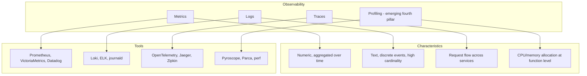

> **Junior Engineer Note:** The three pillars are not interchangeable. Metrics answer "how many/often," logs answer "what happened," and traces answer "where did time go." A well-instrumented system uses all three. Start with metrics for infrastructure health, add logs for debugging, and add traces for understanding request flow across services.[^217]

### 15.2 Metrics Collection

**Prometheus** is the de facto standard for metrics collection in cloud-native environments. It uses a pull model -- Prometheus scrapes HTTP endpoints on target systems at regular intervals.[^218]

| Metric Type | Description | Example |
|-------------|-------------|---------|
| Counter | Monotonically increasing value | `http_requests_total` |
| Gauge | Value that can increase or decrease | `memory_usage_bytes` |
| Histogram | Distribution of values with configurable buckets | `request_duration_seconds` |
| Summary | Pre-calculated quantiles (client-side) | `request_duration_seconds` (quantiles) |

```bash
# PromQL examples
# Request rate per second over 5 minutes
rate(http_requests_total[5m])

# 99th percentile request latency
histogram_quantile(0.99, rate(http_request_duration_seconds_bucket[5m]))

# Memory utilization as percentage
node_memory_MemAvailable_bytes / node_memory_MemTotal_bytes * 100
```

**Prometheus exporters** expose metrics from systems that do not natively speak Prometheus:

| Exporter | Metrics Source |
|----------|---------------|
| node_exporter | Linux host metrics (CPU, memory, disk, network) |
| mysqld_exporter | MySQL database metrics |
| nginx-exporter | nginx connection/request metrics |
| blackbox_exporter | External endpoint probing (HTTP, ICMP, DNS) |

**Grafana** provides visualization and alerting on top of Prometheus and other data sources. **VictoriaMetrics** is a high-performance, cost-effective alternative to Prometheus for long-term storage.

### 15.3 Log Aggregation

| Stack | Components | Strengths |
|-------|-----------|-----------|
| Loki + Grafana | Loki, Promtail/Alloy, Grafana | Low cost, label-based indexing, tight Grafana integration |
| ELK Stack | Elasticsearch, Logstash, Kibana | Full-text search, powerful query, complex to operate |
| EFK Stack | Elasticsearch, Fluentd, Kibana | Fluentd as lighter Logstash alternative |
| journald remote | systemd-journal-upload/download | Zero additional infrastructure, limited query |

```yaml
# Promtail configuration for Loki
server:
  http_listen_port: 9080
positions:
  filename: /tmp/positions.yaml
clients:
  - url: http://loki:3100/loki/api/v1/push
scrape_configs:
  - job_name: system
    static_configs:
      - targets: [localhost]
        labels:
          job: syslog
          host: web01
          __path__: /var/log/syslog
```

### 15.4 Distributed Tracing

**OpenTelemetry** is the CNCF standard for generating and collecting traces, metrics, and logs. It provides vendor-neutral APIs and SDKs.[^219]

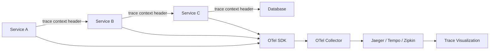

Traces consist of **spans** (named, timed units of work) connected in a parent-child tree. Trace context (trace ID, span ID) is propagated across service boundaries via HTTP headers (W3C Trace Context standard).

### 15.5 Alerting

> **Key Insight:** Effective alerts are symptom-based, not cause-based. An alert on "CPU usage > 90%" is cause-based and may not correlate with user impact. An alert on "error rate > 1% for 5 minutes" is symptom-based and directly indicates user impact. Symptom-based alerts reduce noise and accelerate incident response.[^220]

**Alert design principles:**

| Principle | Description |
|-----------|-------------|
| Symptom-based | Alert on what users experience, not what machines report |
| Multi-window burn rate | Use multiple time windows to distinguish real incidents from noise |
| Actionable | Every alert should require human action or be suppressed |
| Ranked | Severity levels (P1-P4) with different escalation paths |

**Alert fatigue** occurs when operators receive so many alerts that they begin ignoring them. Mitigate by: enforcing actionability standards, tuning thresholds, grouping related alerts, and using silence/mute windows during maintenance.[^221]

| Alerting Tool | Model | Integration |
|---------------|-------|-------------|
| Prometheus Alertmanager | Pull-based, Prometheus-native | Alert grouping, inhibition, silencing |
| PagerDuty | Incident management, on-call scheduling | Phone/SMS push notifications |
| OpsGenie | Incident management | Similar to PagerDuty |

### 15.6 SRE Concepts

From Google's Site Reliability Engineering practices:[^222]

| Concept | Definition |
|---------|-----------|
| SLI (Service Level Indicator) | Quantitative measure of service behavior (latency, error rate, throughput) |
| SLO (Service Level Objective) | Target value for an SLI (e.g., p99 latency < 200ms) |
| SLA (Service Level Agreement) | Contractual commitment with consequences for breach |
| Error Budget | 1 - SLO; allows calculated risk-taking while maintaining reliability |

The **Golden Signals** (latency, traffic, errors, saturation) provide a framework for monitoring any service. The **RED method** (Rate, Errors, Duration) focuses on request-driven services. The **USE method** (Utilization, Saturation, Errors) focuses on resources.[^223]

### 15.7 Dashboard Design

Effective dashboards answer a specific question and follow the hierarchy: business level -> service level -> resource level. A dashboard that shows CPU, memory, disk, and network for every host is a monitoring graveyard -- it exists but nobody looks at it because it provides no context.

### 15.8 Network Monitoring

| Technology | Description | Use Case |
|------------|-------------|----------|
| SNMP | Query device MIBs for status/metrics | Network equipment, printers |
| NetFlow/sFlow | Flow-level traffic accounting | Bandwidth analysis, anomaly detection |
| Packet capture | Full packet inspection | Forensics, deep debugging |

### 15.9 Custom Monitoring

Jane Street's philosophy of building custom tools rather than relying solely on off-the-shelf solutions applies directly to monitoring. When existing tools cannot provide the required granularity, precision, or integration, building custom collectors, exporters, and dashboards is the correct engineering decision.[^224]

### 15.10 Profiling

**Continuous profiling** collects CPU, memory, and allocation profiles from production systems with minimal overhead:

| Tool | Type | Language Support |
|------|------|-----------------|
| Pyroscope | Continuous profiling platform | Go, Java, Python, Ruby, Node.js |
| Parca | Continuous profiling | Multi-language via eBPF |
| perf | On-demand profiling | Any native binary |
| pprof | Go-native profiler | Go |

Flame graphs visualize where CPU time is spent, making it easy to identify hot functions without navigating source code.

### 15.11 Incident Management

| Phase | Actions |
|-------|---------|
| Detection | Alert fires, on-call engineer acknowledges |
| Triage | Assess severity, gather initial data, declare incident if needed |
| Mitigate | Restore service (rollback, scale up, failover) |
| Resolve | Root cause identified and fixed |
| Post-mortem | Blameless review, action items documented |

**Blameless post-mortems** focus on systemic causes, not individual mistakes. The goal is learning, not punishment. Every incident produces at least one actionable improvement.[^225]

### 15.12 Chaos Engineering

Chaos engineering proactively injects failures to build confidence in system resilience:

| Tool | Scope | Description |
|------|-------|-------------|
| Chaos Monkey | AWS instances | Randomly terminates instances |
| Litmus | Kubernetes | Community-driven chaos experiments |
| tc netem | Linux | Network delay, loss, duplication injection |
| stress-ng | Linux | CPU, memory, I/O stress testing |

The core principle: start with a hypothesis about system behavior under failure, inject the failure in a controlled environment, and verify the hypothesis. Automate experiments for continuous validation.

[^226]

**Further Reading:**
- *Site Reliability Engineering* by Google (free online: sre.google/sre-book/)
- *Observability Engineering* by Charity Majors et al.
- *The Site Reliability Workbook* by Google
- Prometheus documentation: prometheus.io/docs
- OpenTelemetry documentation: opentelemetry.io/docs

---

## Footnotes

[^151]: IEEE 802.3 Ethernet standard defines MAC addressing and frame format. Understanding jumbo frames (MTU 9000) is important for storage networks and high-throughput links. IEEE 802.3-2022.

[^152]: The Linux routing table is managed by the `ip route` command via netlink. Routing decisions are made by the kernel's FIB (Forwarding Information Base). `ip rule` provides policy-based routing for more complex scenarios. man 8 ip-route.

[^153]: TCP provides reliable, ordered byte-stream delivery with flow control (sliding window) and congestion control. UDP provides connectionless datagrams with no delivery guarantees. RFC 793 (TCP), RFC 768 (UDP).

[^154]: TCP TIME_WAIT explanation and tuning: the state persists for 2*MSL (Maximum Segment Lifetime). Linux default MSL is 30 seconds, making TIME_WAIT last 60 seconds. `tcp_tw_reuse` is safe for outgoing connections using timestamp-based validation. `tcp_tw_recycle` was removed in Linux 4.12 (commit 4396e46187ca) because it breaks behind NAT. RFC 793, Linux kernel documentation `Documentation/networking/ip-sysctl.rst`.

[^155]: CUBIC congestion control: Sangtae Ha, Injong Rhee, and Lisong Xu, "CUBIC: A New TCP-Friendly High-Speed TCP Variant," ACM SIGOPS Operating Systems Review, 2008. Default congestion control in Linux since kernel 2.6.19.

[^156]: BBR (Bottleneck Bandwidth and RTT): Neal Cardwell et al., "BBR: Congestion-Based Congestion Control," ACM Queue, 2016. Google's deployment on YouTube showed 4% higher throughput and 33% lower latency. BBRv2 addresses fairness issues with loss-based algorithms. netdev01.ebpf.io presentation, 2019.

[^157]: UDP RFC 768 (1980). Despite its simplicity, UDP is essential for real-time applications where TCP's retransmission and head-of-line blocking introduce unacceptable latency. Applications using UDP must implement their own reliability if needed.

[^158]: UDP multicast uses Class D IP addresses (224.0.0.0 to 239.255.255.255). IGMP (Internet Group Management Protocol) manages group membership. Linux supports multicast via `ip maddr` commands and socket options (IP_ADD_MEMBERSHIP). Jane Street processes millions of multicast messages per second for market data distribution (janestreet.com/performance-engineering/).

[^159]: `/etc/nsswitch.conf` controls the order of name resolution sources. The `hosts:` line typically reads `files dns myhostname`, meaning `/etc/hosts` is checked first, then DNS servers from `/etc/resolv.conf`. man 5 nsswitch.conf.

[^160]: Go's standard library resolver (`net` package) does not use nsswitch.conf when CGO is disabled. It uses a built-in resolver that reads `/etc/resolv.conf` directly but ignores `/etc/hosts`. This is a common source of DNS resolution inconsistencies between Go and C applications. Go documentation: `net` package "Name Resolution" section.

[^161]: NetworkManager is the default network management daemon on most desktop Linux distributions and many cloud platforms. It uses D-Bus for communication and supports a dispatcher script system for custom network event handling. freedesktop.org/wiki/Software/NetworkManager.

[^162]: systemd-networkd is a lightweight network management daemon that uses declarative unit files. It is preferred for servers and containers where NetworkManager's desktop features are unnecessary. man 5 systemd.network.

[^163]: Netplan is a YAML-based network configuration abstraction layer used in Ubuntu 17.10+. It renders to NetworkManager or systemd-networkd as the backend. netplan.io.

[^164]: nftables replaced iptables as the recommended Linux packet filtering framework. The iptables-nftables compatibility layer allows running iptables commands on the nftables backend, but new rules should be written in nftables syntax. nftables wiki: wiki.nftables.org.

[^165]: Linux bonding (mode 0-6) aggregates NICs for throughput or redundancy. The `teamd` daemon provides a more flexible alternative with its own runner modules. `ip link add ... type bond` vs `ip link add ... type team`. kernel.org/doc/Documentation/networking/bonding.rst.

[^166]: VXLAN (Virtual eXtensible Local Area Network) encapsulates L2 frames in UDP packets, enabling L2 segments over L3 infrastructure. It uses a 24-bit VNI (VXLAN Network Identifier), supporting 16 million segments. RFC 7348.

[^167]: Low-latency networking concepts: NAPI (New API) replaces interrupt-driven packet reception with polling under high load, reducing interrupt overhead. GRO (Generic Receive Offload) aggregates small packets into larger ones. GSO (Generic Segmentation Offload) defers packet segmentation to the NIC. These are documented in `Documentation/networking/netdevices.rst`.

[^168]: Solarflare ef_vi is a kernel-bypass networking API providing user-space access to NIC hardware. OpenOnload is Solarflare's (now AMD/Xilinx) user-space network overlay. Jane Street's Performance Engineering page (janestreet.com/performance-engineering/) describes their use of kernel bypass for multicast market data systems.

[^169]: XDP (eXpress Data Path) processes packets at the driver level before the kernel network stack. It provides near-DPDK performance with better kernel integration. AF_XDP is the socket-based interface to XDP. kernel.org/doc/html/latest/bpf/.

[^170]: NAPI documentation: `Documentation/networking/netdevices.rst`. GRO and GSO are kernel networking features that batch packet processing. GRO reduces per-packet overhead in receive path; GSO reduces overhead in transmit path by deferring segmentation to the NIC.

[^171]: RSS (Receive Side Scaling) distributes incoming packets across multiple hardware queues using Toeplitz hashing on packet headers. Combined with IRQ affinity tuning, it enables parallel packet processing across CPU cores. `ethtool -l eth0` shows queue configuration.

[^172]: SO_TIMESTAMPING enables hardware and software timestamping at various points in the send/receive path. Values: SOF_TIMESTAMPING_SOFTWARE (kernel timestamps), SOF_TIMESTAMPING_RAW_HARDWARE (NIC timestamps), SOF_TIMESTAMPING_TX_SCHED (TX queued timestamp). `man 7 socket`.

[^173]: IPVS (IP Virtual Server) is the Linux Virtual Server project's kernel-level load balancer. It supports NAT, DR (Direct Routing), and TUN (IP Tunneling) forwarding modes. kernel.org/doc/Documentation/networking/ipvs-sysctl.rst.

[^174]: UEFI (Unified Extensible Firmware Interface) has largely replaced BIOS on modern hardware. UEFI provides Secure Boot capability, faster boot times, and support for GPT partition tables. GRUB2 is the standard Linux bootloader supporting both BIOS (MBR) and UEFI (EFI) boot modes.

[^175]: udev is the device manager for the Linux kernel. It dynamically creates and removes device nodes in `/dev/` based on kernel events. Rules in `/etc/udev/rules.d/` allow custom naming, permissions, and actions. `man 7 udev`, `man 8 udevadm`.

[^176]: Jane Street's clock synchronization architecture: GPS reference clocks feed PTP grandmasters, which distribute time via IEEE 1588 to boundary clocks, which serve NTP to clients. This achieves approximately 35-40 microsecond worst-case error from UTC. From Signals and Threads podcast: "Clock Synchronization" episode (signalsandthreads.com/clock-synchronization/).

[^177]: chrony vs ntpd: chrony achieves faster initial synchronization, handles intermittent connectivity, and provides better accuracy with hardware timestamping. chrony supports `hwtimestamp` directive for NIC-level timestamping. ntpd is only recommended for Stratum 1 servers with directly attached reference clocks. chrony.org.

[^178]: `/proc/sys/` provides a runtime interface to kernel parameters. The `sysctl` command provides a cleaner interface with persistence via `/etc/sysctl.d/` drop-in files. `sysctl --system` loads all drop-ins. `man 8 sysctl`, `man 5 sysctl.d`.

[^179]: Systematic log analysis: (1) `journalctl -b` for current boot, (2) `dmesg` for kernel ring buffer (hardware/driver issues), (3) application logs in `/var/log/`, (4) `journalctl -b -1` for previous boot if unexpected reboot occurred. Start broad and narrow down to the specific error.

[^180]: PAM (Pluggable Authentication Modules) provides a modular authentication framework. `/etc/pam.d/` contains per-service configuration files. PAM modules are shared libraries in `/usr/lib64/security/` (or `/lib/security/`). `man 5 pam.conf`.

[^181]: etckeeper tracks `/etc` in version control, providing automatic commits on package operations and a history of configuration changes. Ideal for auditing configuration changes. etckeeper is packaged for most distributions.

[^182]: Defense in depth is the principle of applying multiple independent security layers so that if one layer fails, others still provide protection. This is the foundation of all security architecture. NIST SP 800-53 provides comprehensive security control families.

[^183]: Kernel Lockdown Mode (kernel 5.4+) restricts kernel functionality to prevent unsigned code execution. Modes: `integrity` (protects kernel integrity) and `confidentiality` (protects kernel confidentiality). Activated via boot parameter `lockdown=confidentiality`. `Documentation/admin-guide/lockdown.rst`.

[^184]: SELinux troubleshooting workflow: (1) `ausearch -m AVC -ts recent` to find denials, (2) `audit2allow -a` to generate policy modules, (3) Review generated policy before loading with `semodule -i`. For AppArmor: `aa-genprof` interactively generates profiles by monitoring application behavior.

[^185]: ssh-audit (github.com/jtesta/ssh-audit) analyzes SSH server configuration and cipher suites for weaknesses. Certificate-based SSH uses short-lived, CA-signed certificates instead of static authorized_keys, providing centralized access control and automatic expiry.

[^186]: UEFI Secure Boot chain: UEFI firmware validates shim (signed by Microsoft) -> shim validates GRUB (signed by distribution) -> GRUB validates kernel (signed by distribution). Machine Owner Keys (MOK) allow adding custom signing keys for third-party kernels/modules. `mokutil` manages MOK enrollment.

[^187]: CIS Benchmarks provide prescriptive hardening guidance for over 100 technologies. OpenSCAP (Open Security Content Automation Protocol) automates compliance scanning against CIS, DISA STIG, and other benchmarks. Both are free and open source.

[^188]: IAM is consistently ranked as a top security concern in breach analyses. Verizon's Data Breach Investigations Report (DBIR) regularly identifies compromised credentials as a leading attack vector. Proper IAM implementation -- strong authentication, least privilege, auditing -- is foundational.

[^189]: PAM module types and control flags: `required` (must succeed, but stack continues), `requisite` (must succeed, stack stops on failure), `sufficient` (succeeds and stack stops), `optional` (does not affect overall result). The ordering and control flags determine authentication flow. `man 5 pam`.

[^190]: `visudo` validates sudoers syntax before saving, preventing lockout from typos. Drop-in files in `/etc/sudoers.d/` are included via `@includedir /etc/sudoers.d` in the main sudoers file. Files must not end in `.bak` or `~` and must be owned by root with mode 0440.

[^191]: SOPS (Secrets OPerationS) by Mozilla encrypts files in-place using AWS KMS, GCP KMS, Azure Key Vault, age, or PGP. Encrypted files remain in git but secrets are encrypted at rest. Supports YAML, JSON, INI, and binary files.

[^192]: MFA implementation in PAM: `pam_google_authenticator.so` for TOTP, `pam_u2f.so` for WebAuthn/FIDO2, `pam_oath.so` for OATH. The PAM stack order determines whether MFA is applied (e.g., `auth required pam_google_authenticator.so` after `auth required pam_unix.so`).

[^193]: Virtualization is the foundation of cloud computing. All major cloud providers (AWS, Azure, GCP) run KVM-based hypervisors. Understanding virtualization is essential for cloud infrastructure engineering.

[^194]: KVM was merged into the Linux kernel in version 2.6.20 (2007). It uses hardware-assisted virtualization (Intel VT-x or AMD-V) and is now the dominant Type 1 hypervisor for Linux. QEMU provides device emulation and VM management. libvirt provides a unified management API.

[^195]: VM vs container decision framework: (1) Multi-tenancy with untrusted workloads: VM. (2) Regulatory compliance requiring kernel isolation: VM. (3) Density and rapid scaling: containers. (4) Legacy applications with specific kernel requirements: VM. (5) Microservices with shared kernel: containers.

[^196]: NUMA-aware VM placement ensures vCPUs and memory are on the same NUMA node. CPU pinning prevents vCPU migration, reducing cache misses. Huge pages (2MB/1GB) reduce TLB pressure for memory-intensive VMs. These are standard practices for latency-sensitive workloads.

[^197]: The container ecosystem evolved from Google's internal use of Linux namespaces and cgroups. Docker (2013) popularized containers, but the underlying kernel features existed since Linux 2.6.24 (2008, cgroups) and earlier for namespaces.

[^198]: Containers share the host kernel, meaning a kernel exploit can escape container isolation. VMs provide stronger isolation with separate kernels. This distinction is critical for security architecture. Container escapes have been demonstrated (CVE-2019-5736, CVE-2020-15257).

[^199]: Container image layer caching: Docker caches each build layer. If layer N is unchanged, layers N+1 through final use cache. Place frequently-changing instructions (COPY . .) after rarely-changing instructions (RUN apt-get install ...) to maximize cache hits.

[^200]: Kubernetes Pods group co-located containers that share network namespace, IPC namespace, and optionally volume mounts. The Pod is the atomic scheduling unit. Sidecar containers (log shipping, proxies) are common Pod patterns.

[^201]: Podman (github.com/containers/podman) is a daemonless container engine compatible with Docker CLI. It runs rootless by default using user namespaces. On RHEL 8+, Podman is the recommended container runtime. Docker is deprecated in RHEL 8.

[^202]: Container security layers: rootless runtimes reduce host attack surface, user namespaces map container root to unprivileged host UID, seccomp profiles restrict syscalls (default blocks ~44 dangerous syscalls), AppArmor/SELinux provide MAC, and image scanning prevents deploying vulnerable images.

[^203]: Automation reduces toil -- repetitive, manual, automatable work that scales linearly with system size. Google's SRE book defines toil as "work that is manual, repetitive, automatable, tactical, devoid of enduring value, and scales linearly." Automating toil frees engineers for higher-value work.

[^204]: Ansible uses SSH for communication, eliminating agent installation. Inventory defines managed hosts. Playbooks describe desired state. Roles provide modular, reusable components. Modules are the atomic units of work. Collections bundle roles and modules for distribution.

[^205]: Idempotency testing: run your playbook twice in succession. The first run should make changes; the second run should report zero changes. Ansible provides the `--check` (dry-run) and `--diff` flags to preview changes. Molecule's idempotence test verifies this automatically.

[^206]: SaltStack (saltproject.io) uses ZeroMQ for high-speed communication between master and minions. State files define desired state (similar to Ansible). Pillars provide per-minion data. Beacons monitor system events and trigger reactors for automated responses.

[^207]: Automation testing pyramid: (1) Syntax/lint checks (fast, always run). (2) Molecule tests in containers (fast, test role logic). (3) Integration tests on real VMs (slower, test full stack). (4) End-to-end tests (slowest, test deployment pipeline).

[^208]: Ansible's `block/rescue/always` constructs provide try/catch/finally semantics. `block` executes tasks, `rescue` executes on failure, `always` executes regardless. Handlers trigger on `notify` and run at the end of play, not on every task execution.

[^209]: Infrastructure as Code emerged from the DevOps movement. The key insight: treating infrastructure configuration as software enables version control, code review, testing, and automated deployment -- the same practices that made software development more reliable.

[^210]: Terraform manages infrastructure declaratively. The state file maps code to real resources. Providers interface with cloud APIs. Resources define infrastructure components. Data sources query existing resources. Modules encapsulate reusable patterns.

[^211]: OpenTofu (opentofu.org) was forked from Terraform 1.5.x in September 2023 after HashiCorp changed the BSL license. It is maintained by the Linux Foundation and is fully API-compatible with Terraform. The primary motivation is preserving open-source governance for IaC tooling.

[^212]: Pulumi (pulumi.com) enables IaC using general-purpose programming languages. This provides IDE support, type checking, unit testing, and reuse of existing libraries. Pulumi generates a state file similar to Terraform and supports the same cloud providers.

[^213]: Terraform state file best practices: (1) Use remote backends (S3, GCS). (2) Enable state locking to prevent concurrent modifications. (3) Encrypt state at rest (state files contain secrets). (4) Never commit state to git. (5) Use separate state files per environment/service.

[^214]: Immutable infrastructure deploys new instances instead of modifying existing ones. Benefits: consistent state, easy rollback (revert to previous image), eliminated drift. Costs: slower individual deployments, more storage for images. Common in container/Kubernetes environments.

[^215]: Starting with IaC: begin with Terraform for cloud resources, Ansible for configuration, and git for version control. Add complexity (GitOps, Pulumi, OpenTofu) only when you have a specific requirement. Premature abstraction is worse than no abstraction.

[^216]: Observability is the ability to understand the internal state of a system by examining its external outputs. Coined by Charity Majors et al. (O'Reilly, "Observability Engineering"). Monitoring tells you what is wrong; observability tells you why.

[^217]: The three pillars serve different investigation modes: metrics for broad trends and anomalies, logs for specific events and error messages, traces for request flow and latency attribution. Effective observability requires all three, not just one.

[^218]: Prometheus pull model: the server scrapes HTTP endpoints at configured intervals. This avoids the need for push agents and provides natural health checking (if a target does not respond, it is down). Metrics are stored in a local time-series database with efficient compression.

[^219]: OpenTelemetry (opentelemetry.io) is a CNCF project providing vendor-neutral APIs for traces, metrics, and logs. It has SDKs for most languages and a collector pipeline for processing and exporting telemetry data to various backends.

[^220]: Symptom-based alerting: alert on user-visible symptoms (error rate, latency, availability), not internal causes (CPU, memory, disk). If CPU is at 100% but the service responds correctly, there is no user impact and no alert needed.

[^221]: Alert fatigue is a well-documented phenomenon in operations. A 2019 PagerDuty report found that 67% of responders have ignored alerts due to volume. Mitigation: enforce "actionability" as a requirement for every alert, use Alertmanager grouping and inhibition, and regularly review and prune alert rules.

[^222]: Google SRE concepts from "Site Reliability Engineering: How Google Runs Production Systems" (O'Reilly, 2016, free at sre.google). SLIs measure service behavior; SLOs define targets; error budgets balance reliability with velocity.

[^223]: Golden Signals (from Google SRE book): latency (time to serve a request), traffic (demand on the system), errors (rate of failed requests), saturation (how "full" the system is). RED method: Rate, Errors, Duration. USE method: Utilization, Saturation, Errors.

[^224]: Jane Street builds custom monitoring tools rather than relying solely on off-the-shelf solutions (from Linux Engineer job description, janestreet.com/join-jane-street/position/8061059002/). This philosophy reflects a broader pattern in high-performance infrastructure: when standard tools cannot provide required precision or integration, building custom tools is the correct engineering decision.

[^225]: Blameless post-mortems focus on systemic causes and process improvements, not individual accountability. The premise: if a human can make a mistake, the system should be designed to prevent or detect that mistake. Google SRE book, Chapter 15.

[^226]: Chaos engineering originated at Netflix with Chaos Monkey (2011). The principle: "breaking things on purpose to build confidence in the system's capability to withstand turbulent conditions in production." The CNCF Chaos Engineering whitepaper provides a framework for controlled failure injection.

---

## Chapter 16: BACKUP AND DISASTER RECOVERY

Data loss is the one failure mode from which there is no automatic recovery. Backup and disaster recovery (DR) planning transform catastrophic data loss into a manageable operational event. For Linux engineers, understanding backup strategies, tools, and verification processes is essential for maintaining system integrity across any production environment[^301].

## 16.1 Backup Fundamentals

### RPO and RTO

Every backup strategy is defined by two key objectives:

- **Recovery Point Objective (RPO)**: The maximum acceptable amount of data loss measured in time. An RPO of 1 hour means backups must occur at least hourly, and up to 1 hour of data may be lost on failure[^302].
- **Recovery Time Objective (RTO)**: The maximum acceptable time to restore service after a failure. An RTO of 4 minutes means systems must be recoverable within that window[^302].

> **Key Insight:** RPO and RTO are not independent. Achieving low RPO (frequent backups) and low RTO (fast restoration) simultaneously requires investment in both backup infrastructure and recovery automation. The intersection of these two objectives defines your backup architecture[^303].

### The 3-2-1 Rule

The classic backup rule states: maintain **3** copies of data, on **2** different media types, with **1** copy offsite[^304]. Modern extensions include:

- **3-2-1-1-0**: Add 1 offline (immutable) copy and 0 errors after verification[^305]
- Air-gapped copies protect against ransomware
- Immutable storage prevents malicious deletion

### Backup Types

| Type | Description | Storage Required | Restore Speed | RPO Impact |
|------|-------------|-----------------|---------------|------------|
| Full | Complete copy of all data | 1x dataset size | Fastest | Typically daily or weekly |
| Incremental | Changes since last backup (any type) | Cumulative, smallest | Slowest (chain rebuild) | Can be hourly |
| Differential | Changes since last full backup | Grows until next full | Moderate | Faster than incremental |

Modern tools like restic and borgbackup use content-defined chunking and deduplication, making the full/incremental distinction less rigid in practice[^306].

## 16.2 Backup Tools

| Tool | Deduplication | Encryption | Compression | Remote Support | Key Feature |
|------|--------------|------------|-------------|----------------|-------------|
| rsync | No (delta transfer) | Via SSH | No | Yes (SSH, daemon) | Delta-transfer algorithm |
| borgbackup | Content-defined chunking | AES-256-CTR | LZ4, ZSTD, zlib | Yes (SSH) | Deduplication, append-only repos |
| restic | Content-defined chunking | AES-256 | ZSTD | Yes (S3, SFTP, B2) | Multi-backend, fast |
| bup | Content-defined chunking | GPG | Zlib | Yes (SSH) | Git-like packfile format |
| duplicity | No (full+incremental) | GPG | Gzip | Yes (SCP, S3, FTP) | GPG encryption, legacy tool |

### rsync Fundamentals

```bash
# Archive mode with compression and partial transfers
rsync -avz --partial --progress /data/ remote:/backup/data/

# Use hardlinks for efficient snapshot-style backups
rsync -av --link-dest=/backup/latest /data/ /backup/$(date +%Y%m%d)/

# Delete files in destination that no longer exist in source
rsync -av --delete /data/ remote:/backup/data/
```

### restic Usage

```bash
# Initialize a repository on S3
restic -r s3:s3.amazonaws.com/my-backup init

# Create a backup with tags
restic -r s3:s3.amazonaws.com/my-backup backup /data --tag daily

# List snapshots
restic -r s3:s3.amazonaws.com/my-backup snapshots

# Restore a specific snapshot
restic -r s3:s3.amazonaws.com/my-backup restore latest --target /restore/
```

### borgbackup Usage

```bash
# Initialize an encrypted repository
borg init --encryption=repokey /backup/borg-repo

# Create a backup with pruning policy
borg create --stats --compression zstd /backup/borg-repo::'{hostname}-{now}' /data
borg prune --keep-daily=7 --keep-weekly=4 --keep-monthly=6 /backup/borg-repo
```

## 16.3 Filesystem-Level Snapshots

### LVM Snapshots

LVM snapshots use copy-on-write (COW) to create point-in-time copies[^307]:

```bash
# Create a snapshot (requires free space in the volume group)
lvcreate --size 10G --snapshot --name data_snap /dev/vg0/data

# Mount and use the snapshot
mount /dev/vg0/data_snap /mnt/snapshot

# Remove the snapshot when done
lvremove /dev/vg0/data_snap
```

### Btrfs and ZFS Snapshots

Btrfs and ZFS offer native snapshot and send/receive capabilities[^308]:

```bash
# Btrfs: create and send a snapshot
btrfs subvolume snapshot /data /data_snap_$(date +%s)
btrfs send /data_snap_1234567890 | ssh remote btrfs receive /backup/

# ZFS: create and send a snapshot
zfs snapshot pool/data@snap_$(date +%s)
zfs send pool/data@snap_1234567890 | ssh remote zfs receive backup/data
```

## 16.4 Database Backup Considerations

Database backups require special attention to consistency[^309]:

- **Consistency points**: MySQL/InnoDB uses InnoDB LSN; PostgreSQL uses LSN and WAL positions
- **WAL-based backup**: PostgreSQL's continuous archiving uses WAL segments for point-in-time recovery
- **Logical vs. physical**: Logical (pg_dump, mysqldump) produces portable SQL; physical (pg_basebackup, xtrabackup) produces block-level copies

```bash
# PostgreSQL: logical backup
pg_dump -Fc -f /backup/db.dump mydb

# PostgreSQL: physical backup with WAL archiving
pg_basebackup -D /backup/base -Ft -z -P

# MySQL: physical backup with Percona XtraBackup
xtrabackup --backup --target-dir=/backup/mysql/
```

## 16.5 Disaster Recovery Planning

### Business Impact Analysis (BIA)

BIA identifies critical systems, quantifies the cost of downtime, and establishes RPO/RTO targets[^310]:

| DR Site Type | Description | RTO | Cost | Complexity |
|-------------|-------------|-----|------|------------|
| Hot site | Fully operational mirror | Minutes | Highest | Highest |
| Warm site | Partially configured, data lagged | Hours | Moderate | Moderate |
| Cold site | Bare infrastructure, no data | Days | Lowest | Lowest |

### Failover Strategies

- **Active-passive**: Traffic routes to standby only on failure
- **Active-active**: All nodes serve traffic simultaneously
- **Pilot light**: Minimal always-running infrastructure, scales on demand

## 16.6 Backup Verification and Integrity

Unverified backups provide a false sense of security[^311]:

```bash
# restic: verify repository integrity
restic check

# restic: verify snapshot data can be read
restic check --read-data

# borg: verify and repair repository
borg check /backup/borg-repo
borg check --repair /backup/borg-repo

# rsync: checksum-based verification
rsync -avc --checksum /data/ remote:/backup/data/
```

> **Common Pitfall:** The most dangerous backup is one that has never been tested. Organizations discover their backups are corrupt or incomplete only during actual disasters. Schedule regular restore tests as part of your DR plan[^312].

## 16.7 Offsite and Immutable Backups

AWS S3 Object Lock provides WORM (Write Once Read Many) storage[^313]:

```bash
# Create an S3 bucket with Object Lock enabled
aws s3api create-bucket --bucket my-immutable-backup \
  --object-lock-enabled-for-bucket

# Upload with retention
aws s3api put-object --bucket my-immutable-backup \
  --key backup.tar.gz --body backup.tar.gz \
  --object-lock-mode COMPLIANCE \
  --object-lock-retain-until-date 2027-01-01T00:00:00Z
```

## 16.8 Backup Automation

Automate backups with systemd timers or cron, and monitor for failures:

```bash
# /etc/systemd/system/backup.timer
[Unit]
Description=Daily backup timer

[Timer]
OnCalendar=daily
Persistent=true

[Install]
WantedBy=timers.target
```

```bash
# Backup verification script
#!/bin/bash
restic check --read-data 2>&1 | tee -a /var/log/backup-verify.log
if [ ${PIPESTATUS[0]} -ne 0 ]; then
    echo "BACKUP VERIFICATION FAILED" | mail -s "Backup Alert" admin@example.com
    exit 1
fi
```

**Further Reading**: `restic` documentation (restic.net); `borgbackup` documentation (borgbackup.readthedocs.io); AWS S3 Object Lock Developer Guide; "Backup and Recovery" by W. Curtis Preston[^314].

---

## Chapter 17: PERFORMANCE TUNING

Performance engineering is the discipline of making systems do what they are supposed to do -- faster. For Linux engineers, this means understanding how the kernel, hardware, and applications interact, and knowing how to measure before optimizing[^315].

## 17.1 Performance Engineering Philosophy

The first principle of performance work is: **measure first, optimize second**[^316]. Intuition about performance is unreliable; the kernel makes counterintuitive decisions under specific workloads.

```mermaid
flowchart TD
    A[Performance Issue Reported] --> B{Reproducible?}
    B -->|No| C[Establish baseline metrics]
    C --> D[Characterize workload]
    D --> E{Bottleneck?}
    B -->|Yes| E
    E -->|CPU| F[Profile CPU usage]
    E -->|Memory| G[Profile memory usage]
    E -->|I/O| H[Profile disk I/O]
    E -->|Network| I[Profile network]
    F --> J[Identify hotspot]
    G --> J
    H --> J
    I --> J
    J --> K[Apply targeted fix]
    K --> L{Improved?}
    L -->|Yes| M[Document and monitor]
    L -->|No| E
```

> **Key Insight:** The observer effect applies to performance measurement -- the act of observing a system changes its behavior. Overhead from profiling tools can mask or alter the very issues you are trying to diagnose. Choose lightweight tools and minimize collection overhead[^317].

## 17.2 CPU Performance

### Monitoring CPU

```bash
# Per-CPU utilization (1-second intervals)
mpstat -P ALL 1

# Historical CPU data
sar -u 1 10

# Run queue and context switches
vmstat 1
# procs -----------memory---------- ---swap-- -----io---- -system-- ------cpu-----
#  r  b   swpd   free   buff  cache   si   so    bi    bo   in   cs us sy id wa st
```

Key metrics:
- **usr**: Time spent in user-space code
- **sys**: Time spent in kernel space
- **wa**: Time waiting for I/O (indicates I/O bottleneck)
- **r**: Run queue length (number of runnable processes)
- **cs**: Context switches per second (high values indicate contention)

## 17.3 Memory Performance

### Monitoring Memory

```bash
# Quick memory overview
free -h

# Detailed memory info
cat /proc/meminfo

# Page faults and swap activity
vmstat 1
# Look at si (swap in) and so (swap out) columns
```

### Key Memory Metrics

| Metric | Source | Meaning |
|--------|--------|---------|
| MemAvailable | /proc/meminfo | Memory available for starting new applications |
| Major page faults | /proc/[pid]/stat | Pages loaded from disk (slow) |
| Minor page faults | /proc/[pid]/stat | Pages allocated without I/O (fast) |
| pgfault | vmstat | Total page faults per second |
| pgmajfault | vmstat | Major page faults per second (disk reads) |

### Huge Pages and NUMA

```bash
# Check huge page support
cat /proc/meminfo | grep -i huge

# Enable transparent huge pages
echo always > /sys/kernel/mm/transparent_hugepage/enabled

# Check NUMA topology
numactl --hardware
lscpu | grep NUMA
```

> **Trade-off Alert:** Huge pages reduce TLB misses and improve performance for large-memory workloads (databases, JVM), but they increase memory fragmentation, complicate memory allocation, and can increase latency for latency-sensitive workloads that need fine-grained memory control[^318].

## 17.4 Disk I/O Performance

### Monitoring Disk I/O

```bash
# Per-device I/O statistics
iostat -xz 1

# Per-process I/O
iotop -o

# Key iostat columns:
# r/s, w/s    - reads/writes per second
# rkB/s, wkB/s - read/write throughput
# await        - average I/O wait time (ms)
# svctm        - average service time (ms)
# %util        - percentage of time device was busy
```

### I/O Scheduler Tuning

```bash
# Check current scheduler
cat /sys/block/sda/queue/scheduler

# Set scheduler (none for NVMe, mq-deadline for HDD)
echo none > /sys/block/nvme0n1/queue/scheduler
echo mq-deadline > /sys/block/sda/queue/scheduler

# Adjust queue depth
echo 256 > /sys/block/sda/queue/nr_requests
```

## 17.5 Network Performance

### Monitoring Network

```bash
# Interface statistics
sar -n DEV 1

# Connection states
ss -s

# Per-socket statistics
ss -ti

# NIC-level statistics (requires nicstat)
nicstat 1
```

### Tail Latencies

Production systems care about tail latencies, not averages[^319]:

| Percentile | Meaning | Typical Concern |
|-----------|---------|-----------------|
| p50 | Median | Normal operation |
| p99 | 99th percentile | Expected worst case for most users |
| p99.9 | 99.9th percentile | Significant outlier |
| p99.99 | 99.99th percentile | Extreme tail, affects SLAs |

## 17.6 Profiling Tools

### perf

```bash
# Record CPU profile for 10 seconds
perf record -g -p <PID> -- sleep 10
perf report

# Hardware performance counters
perf stat -e cache-misses,branch-misses,instructions,cycles ./workload

# Generate flame graph
perf script | stackcollapse-perf.pl | flamegraph.pl > flame.svg
```

### FlameGraphs

Flame graphs visualize stack traces where the x-axis is sample count and the y-axis is stack depth[^320]. Wide functions at the top are hotspots. The Brendan Gregg flamegraph toolkit is the standard[^321].

## 17.7 eBPF for Performance

BCC tools provide production-safe tracing[^322]:

```bash
# Trace new processes with parent info
execsnoop-bpfcc

# Trace file opens
opensnoop-bpfcc

# Block I/O latency histogram
biolatency-bpfcc

# Page cache hit/miss ratio
cachestat-bpfcc 1

# TCP connection latency
tcpconnlat-bpfcc
```

### bpftrace One-liners

```bash
# Trace syscalls by process
bpftrace -e 'tracepoint:syscalls:sys_enter_* { @[comm] = count(); }'

# Measure function latency
bpftrace -e 'kprobe:vfs_read { @start[tid] = nsecs; }
             kretprobe:vfs_read /@start[tid]/ { @ns = hist(nsecs - @start[tid]); delete(@start[tid]); }'
```

## 17.8 Systematic Performance Methodology

### USE Method (Utilization, Saturation, Errors)

For every resource (CPU, memory, disk, network), check[^323]:

| Resource | Utilization | Saturation | Errors |
|----------|-------------|------------|--------|
| CPU | mpstat %usr + %sys | vmstat r, load average | perf stat, MCE logs |
| Memory | free, /proc/meminfo | vmstat si/so, oom-kill events | EDAC, MCE |
| Disk | iostat %util | iostat avgqu-sz | smartctl, /var/log/messages |
| Network | sar -n DEV, ifstat | netstat -s, ss -s | ifconfig, ethtool -S |

### RED Method (Rate, Errors, Duration)

For services, measure[^324]:

- **Rate**: Requests per second
- **Errors**: Failed requests per second
- **Duration**: Latency distribution (p50, p99, p99.9)

> **Key Insight:** The USE method diagnoses infrastructure; the RED method diagnoses services. Use USE for server-level debugging and RED for application-level debugging. Together they cover the full stack[^323].

## 17.9 Kernel Tuning

```bash
# Network tuning
sysctl -w net.core.somaxconn=65535
sysctl -w net.ipv4.tcp_tw_reuse=1
sysctl -w net.core.netdev_max_backlog=300000
sysctl -w net.ipv4.tcp_max_syn_backlog=65535

# Memory tuning
sysctl -w vm.swappiness=10
sysctl -w vm.dirty_ratio=15
sysctl -w vm.dirty_background_ratio=5

# Filesystem tuning
sysctl -w fs.file-max=2097152
sysctl -w fs.inotify.max_user_watches=524288
```

> **Common Pitfall:** Premature optimization is applying a tuning parameter before understanding the workload. Tuning `somaxconn` without understanding connection patterns is cargo-cult tuning. Always establish a baseline first[^325].

## 17.10 Common Bottleneck Identification

| Symptom | Likely Bottleneck | Diagnostic Command |
|---------|-------------------|-------------------|
| High %usr in top | CPU-bound (application) | perf record, FlameGraph |
| High %sys in top | CPU-bound (kernel) | perf record -e syscalls |
| High %wa in top | I/O-bound | iostat -xz, iotop |
| si/so in vmstat > 0 | Memory-bound | free -h, /proc/meminfo |
| High retransmits | Network-bound | ss -ti, sar -n TCP |
| OOM killer events | Memory exhaustion | dmesg \| grep -i oom |

## 17.11 Performance Benchmarking

```bash
# Disk benchmark with fio
fio --name=randread --ioengine=io_uring --direct=1 --bs=4k \
    --iodepth=64 --size=1G --runtime=60 --rw=randread

# Network benchmark with iperf3
iperf3 -c server -t 30 -P 4 -i 1

# System-level benchmark
sysbench cpu --threads=4 --time=30 run
sysbench memory --threads=4 --time=30 run

# Stress testing
stress-ng --cpu 4 --io 2 --vm 2 --vm-bytes 256M --timeout 60s
```

**Further Reading**: Brendan Gregg's "Systems Performance" (2nd edition)[^326]; Linux Performance Analysis in 60s (brendangregg.com); BPF Performance Tools (Gregg, 2019)[^327]; perf wiki (perf.wiki.kernel.org).

---

## Chapter 18: HIGH AVAILABILITY

High availability (HA) is the probability that a system remains operational for a defined period. For Linux engineers, HA encompasses redundancy, failover, load balancing, and consensus -- ensuring services survive hardware failures, network partitions, and software bugs[^328].

## 18.1 Availability Concepts

| Availability | Downtime per Year | Downtime per Month | Context |
|-------------|-------------------|-------------------|---------|
| 99.0% (two nines) | 3.65 days | 7.31 hours | Basic |
| 99.9% (three nines) | 8.76 hours | 43.8 minutes | Standard |
| 99.99% (four nines) | 52.6 minutes | 4.38 minutes | Enterprise |
| 99.999% (five nines) | 5.26 minutes | 26.3 seconds | Mission-critical |

- **MTBF (Mean Time Between Failures)**: Average uptime between failures[^329]
- **MTTR (Mean Time To Repair)**: Average time to restore service
- **Availability = MTBF / (MTBF + MTTR)**: Reducing MTTR is often more achievable than increasing MTBF

## 18.2 Redundancy Patterns

| Pattern | Description | Pros | Cons |
|---------|-------------|------|------|
| Active-passive | Standby node receives no traffic until failover | Simple, no split-brain risk | Wasted resources, failover delay |
| Active-active | All nodes serve traffic | Full resource utilization | Complex state management |
| N+1 | One spare for N active nodes | Cost-effective | Fails if 2 nodes fail |
| N+M | M spares for N active nodes | Better fault tolerance | More complex |

## 18.3 Load Balancing

### L4 vs L7 Load Balancing

| Feature | L4 (Transport) | L7 (Application) |
|---------|----------------|-------------------|
| Decision basis | IP + port | HTTP headers, URLs, cookies |
| Throughput | Higher (less inspection) | Lower (more processing) |
| SSL termination | Pass-through | Terminated at LB |
| Tools | HAProxy TCP, IPVS, keepalived | HAProxy HTTP, nginx, Traefik |
| Use case | Database, raw TCP | HTTP APIs, web apps |

### HAProxy Configuration

```haproxy
frontend http_front
    bind *:80
    default_backend web_servers

backend web_servers
    balance roundrobin
    option httpchk GET /health
    server web1 10.0.0.1:8080 check inter 5s fall 3 rise 2
    server web2 10.0.0.2:8080 check inter 5s fall 3 rise 2
    server web3 10.0.0.3:8080 check inter 5s fall 3 rise 2 backup
```

## 18.4 Failover Mechanisms

### VRRP and keepalived

VRRP (Virtual Router Redundancy Protocol) provides automatic failover by electing a master router and maintaining a virtual IP[^330]:

```keepalived
vrrp_instance VI_1 {
    state MASTER
    interface eth0
    virtual_router_id 51
    priority 101
    advert_int 1
    authentication {
        auth_type PASS
        auth_pass secret123
    }
    virtual_ipaddress {
        10.0.0.100/24
    }
}
```

```mermaid
flowchart LR
    A[Clients] --> B[Virtual IP: 10.0.0.100]
    B --> C[keepalived MASTER]
    B --> D[keepalived BACKUP]
    C --> E[Service Running]
    D --> F[Service Standby]
    C -.->|heartbeat| D
    D -->|MASTER fails| B
    D -->|Promotes| G[New MASTER]
```

## 18.5 Cluster Technologies

### Pacemaker/Corosync

Pacemaker is a cluster resource manager; Corosync provides messaging and membership[^331]:

```bash
# Check cluster status
pcs status

# Create a floating IP resource
pcs resource create VirtualIP ocf:heartbeat:IPaddr2 \
    ip=10.0.0.100 cidr_netmask=24 op monitor interval=10s

# Configure failover constraints
pcs constraint colocation add VirtualIP with WebServer INFINITY
```

### Consensus Protocols

| Protocol | Latency | Fault Tolerance | Used By |
|----------|---------|-----------------|---------|
| Raft | Moderate | f nodes in 2f+1 cluster | etcd, CockroachDB, Consul |
| Paxos | Low | f nodes in 2f+1 cluster | Google Chubby, Spanner |
| Zab | Moderate | f nodes in 2f+1 cluster | ZooKeeper |

> **Trade-off Alert:** Synchronous replication guarantees zero data loss but adds latency to every write. Asynchronous replication reduces latency but risks data loss on failover. Choose based on your RPO requirements[^332].

## 18.6 Database HA

### Replication Topologies

- **Primary-replica**: One primary accepts writes; replicas serve reads
- **Multi-primary**: Multiple nodes accept writes (conflict resolution required)
- **Cascading replicas**: Replicas replicate from other replicas (reduces primary load)

### Connection Pooling

```bash
# PgBouncer: connection pooler for PostgreSQL
# pgbouncer.ini
[databases]
mydb = host=127.0.0.1 port=5432 dbname=mydb

[pgbouncer]
listen_port = 6432
pool_mode = transaction
max_client_conn = 1000
default_pool_size = 25
```

## 18.7 Filesystem HA

| Technology | Type | Replication | Use Case |
|-----------|------|-------------|----------|
| Ceph | Distributed block/file/object | CRUSH algorithm | Petabyte-scale storage |
| GlusterFS | Distributed file | Replication/erasure coding | File sharing |
| DRBD | Block-level | Sync/async replication | HA pairs |
| iSCSI | Block access over IP | N/A (shared storage) | SAN-like storage |

## 18.8 DNS-Based HA and Service Discovery

- **Round-robin DNS**: Multiple A records for a domain; simple but no health checking[^333]
- **GeoDNS**: Routes to nearest datacenter based on client location
- **Service discovery**: Consul, etcd, and ZooKeeper provide dynamic service registration and health checking[^334]

### Circuit Breaker Pattern

The circuit breaker prevents cascade failures by stopping requests to a failing service[^335]:

1. **Closed** (normal): Requests pass through; failures counted
2. **Open** (tripped): All requests rejected immediately after threshold exceeded
3. **Half-open**: Limited requests allowed to test recovery

> **Common Pitfall:** Split-brain occurs when a network partition causes two nodes to simultaneously believe they are the primary. Without proper fencing (STONITH in Pacemaker), both nodes may write to shared storage, causing data corruption[^336].

**Further Reading**: "High Performance MySQL" (3rd edition); Ceph documentation; keepalived documentation; "Site Reliability Engineering" (Google, 2016)[^337].

---

## Chapter 19: CLOUD INTEGRATION

Cloud computing provides on-demand access to compute, storage, and networking resources. For Linux engineers, cloud integration means understanding how on-premises skills translate to cloud environments and how cloud-native services change infrastructure design[^338].

## 19.1 Cloud Computing Models

| Model | Description | Control | Examples |
|-------|-------------|---------|----------|
| IaaS | Infrastructure as a Service | Full OS control | EC2, GCE, Azure VMs |
| PaaS | Platform as a Service | Application only | Elastic Beanstalk, App Engine |
| SaaS | Software as a Service | No infrastructure | Gmail, Salesforce |
| FaaS | Function as a Service | Code only | Lambda, Cloud Functions |

Deployment models: **public** (multi-tenant), **private** (single-tenant), **hybrid** (mix), **multi-cloud** (multiple providers)[^339].

## 19.2 Major Cloud Providers

| Category | AWS | GCP | Azure |
|----------|-----|-----|-------|
| Compute | EC2 | Compute Engine | Azure VMs |
| Containers | EKS, ECS | GKE, Cloud Run | AKS, Container Apps |
| Object Storage | S3 | Cloud Storage | Blob Storage |
| Block Storage | EBS | Persistent Disk | Managed Disks |
| File Storage | EFS | Filestore | Azure Files |
| DNS | Route 53 | Cloud DNS | Azure DNS |
| CDN | CloudFront | Cloud CDN | Azure CDN |
| IAM | IAM | IAM | Azure AD + IAM |
| Secrets | Secrets Manager | Secret Manager | Key Vault |
| KMS | KMS | Cloud KMS | Key Vault |

## 19.3 Compute

### Instance Types and Placement

- **General purpose**: Balanced CPU/memory (m-series, n2)
- **Compute optimized**: High CPU (c-series, c2)
- **Memory optimized**: High memory (r-series, m2)
- **Storage optimized**: High I/O (i-series, d2)
- **Accelerated**: GPU/FPGA (p-series, a2)[^340]

**Placement groups** control instance placement:
- **Cluster**: Same rack (lowest latency)
- **Spread**: Different hardware (fault isolation)
- **Partition**: Group within a zone

## 19.4 Networking in Cloud

### VPC Architecture

```mermaid
flowchart TD
    subgraph VPC 10.0.0.0/16
        subgraph Public Subnet 10.0.1.0/24
            LB[Load Balancer]
        end
        subgraph Private Subnet 10.0.2.0/24
            App1[App Server 1]
            App2[App Server 2]
        end
        subgraph Data Subnet 10.0.3.0/24
            DB[Database]
        end
        LB --> App1
        LB --> App2
        App1 --> DB
        App2 --> DB
    end
    Internet --> LB
```

| Component | AWS | GCP | Azure |
|-----------|-----|-----|-------|
| Virtual Network | VPC | VPC | VNet |
| Security Rules | Security Groups + NACLs | Firewall Rules | NSGs |
| Load Balancer | ALB/NLB | Cloud LB | Azure LB |
| Transit | Transit Gateway | Cloud Interconnect | VNet Peering |

## 19.5 Storage

| Type | AWS | GCP | Azure | Characteristics |
|------|-----|-----|-------|-----------------|
| Block | EBS | Persistent Disk | Managed Disks | Mountable, single-attach |
| Object | S3 | Cloud Storage | Blob Storage | HTTP API, scalable |
| File | EFS | Filestore | Azure Files | NFS/SMB, multi-attach |

### Storage Performance Tiers

| Tier | AWS EBS | GCP PD | Latency | IOPS |
|------|---------|--------|---------|------|
| SSD (provisioned) | io2 | SSD PD | <1ms | Up to 256K |
| SSD (general) | gp3 | SSD PD | <1ms | Up to 16K |
| HDD | st1 | HDD PD | ~5-10ms | Up to 500 |
| Archive | Glacier | Archive | Minutes-hours | Low |

## 19.6 IAM in Cloud

### IAM Hierarchy

```
Organization
  └── Account
       └── IAM Policies
            └── IAM Roles
                 └── IAM Users / Service Accounts
```

Key principles[^341]:
- **Least privilege**: Grant minimum required permissions
- **Role-based access**: Use roles, not static credentials
- **Instance profiles**: Attach IAM roles to compute instances
- **Service accounts**: For workload identity (no stored secrets)

## 19.7 Cost Optimization

| Strategy | Description | Savings |
|----------|-------------|---------|
| Reserved instances | Commit 1-3 years | 30-70% |
| Spot/preemptible | Use spare capacity | 60-90% |
| Right-sizing | Match instance to workload | 20-50% |
| Savings plans | Flexible commitment | 20-40% |
| Tagging | Cost allocation and tracking | Indirect |

> **Junior Engineer Note:** Learn one cloud deeply before spreading across multiple providers. AWS is the most commonly required, but the principles transfer. Focus on compute, networking, and IAM first -- these map most directly to Linux engineering skills[^342].

## 19.8 Terraform for Cloud

```hcl
provider "aws" {
  region = "us-east-1"
}

resource "aws_instance" "web" {
  ami           = "ami-0c55b159cbfafe1f0"
  instance_type = "t3.micro"
  key_name      = "my-key"
  vpc_security_group_ids = [aws_security_group.web.id]

  tags = {
    Name = "web-server"
  }
}

resource "aws_security_group" "web" {
  name = "web-sg"

  ingress {
    from_port   = 443
    to_port     = 443
    protocol    = "tcp"
    cidr_blocks = ["0.0.0.0/0"]
  }
}
```

State should be stored in remote backends (S3, GCS, Azure Blob) with locking[^343].

## 19.9 Hybrid Connectivity

| Method | Bandwidth | Latency | Cost |
|--------|-----------|---------|------|
| Site-to-site VPN | Up to 1.25 Gbps | Variable | Low |
| Direct Connect / ExpressRoute | Up to 100 Gbps | Low, consistent | High |
| Cloud Interconnect | Up to 10 Gbps | Low, consistent | Moderate |

> **Trade-off Alert:** Cloud lock-in occurs when applications use provider-specific services (SQS, DynamoDB, Cloud Functions) that cannot be trivially migrated. Use open standards (PostgreSQL, Kubernetes, Terraform) for portability, and provider-specific services only when the benefit outweighs the lock-in risk[^344].

**Further Reading**: AWS Well-Architected Framework; GCP Architecture Framework; Terraform documentation (hashicorp.com); "Cloud Native DevOps with Kubernetes" (Arundel & Domingos, 2019)[^345].

---

## Chapter 20: DEVOPS, DEVSECOPS, AND PLATFORM ENGINEERING

DevOps is a cultural and technical movement that unifies software development and operations. For Linux engineers, DevOps practices define how infrastructure is built, tested, deployed, and maintained[^346].

## 20.1 DevOps Culture: CALMS

The CALMS framework characterizes DevOps maturity[^347]:

| Pillar | Description |
|--------|-------------|
| Culture | Shared responsibility, blameless post-mortems, psychological safety |
| Automation | CI/CD, infrastructure-as-code, automated testing |
| Lean | Eliminate waste, limit WIP, continuous improvement |
| Measurement | Metrics-driven decisions, monitoring, feedback loops |
| Sharing | Knowledge sharing, cross-team collaboration, post-mortems |

## 20.2 CI/CD Fundamentals

```mermaid
flowchart LR
    A[Code Commit] --> B[Build]
    B --> C[Unit Tests]
    C --> D[Integration Tests]
    D --> E[Security Scan]
    E --> F[Staging Deploy]
    F --> G[Smoke Tests]
    G --> H{Manual Gate?}
    H -->|Yes| I[Approval]
    I --> J[Production Deploy]
    H -->|No| J
    J --> K[Post-deploy Tests]
    K --> L[Monitoring]
```

### CI Tools Comparison

| Tool | Type | Key Feature | Best For |
|------|------|-------------|----------|
| GitHub Actions | Cloud-native | Matrix builds, marketplace | GitHub-centric teams |
| GitLab CI | Integrated | Built-in registry, SAST | Full DevOps platform |
| Jenkins | Self-hosted | Extensible plugins | Legacy, complex pipelines |
| Argo Workflows | Kubernetes-native | DAG-based workflows | Kubernetes environments |

## 20.3 CD Strategies

| Strategy | Downtime | Risk | Rollback Speed | Resource Cost |
|----------|----------|------|----------------|---------------|
| Blue-green | Zero | Low | Instant (switch back) | 2x resources |
| Canary | Zero | Very low | Fast (re-route) | 1x + small % extra |
| Rolling | Zero | Moderate | Slow (one-by-one) | Minimal extra |
| Recreate | Yes | High | Moderate | 1x resources |

**Feature flags** decouple deployment from release, enabling progressive rollout[^348].

## 20.4 GitOps

GitOps uses Git as the single source of truth for declarative infrastructure[^349]:

| Tool | Model | Use Case |
|------|-------|----------|
| ArgoCD | Pull-based | Kubernetes manifest reconciliation |
| Flux | Pull-based | GitOps toolkit for Kubernetes |
| Jenkins X | Push + Pull | Kubernetes CI/CD |

Core principles:
- Declarative configuration stored in Git
- Automated reconciliation (desired state = actual state)
- Pull-based deployment (cluster pulls changes)
- Audit trail via Git history

## 20.5 DevSecOps

Shift-left security integrates security into the CI/CD pipeline[^350]:

| Practice | Tool Examples | When |
|----------|--------------|------|
| SAST (Static) | Semgrep, Bandit, CodeQL | Pre-commit, CI |
| DAST (Dynamic) | OWASP ZAP, Nikto | Staging |
| SCA (Dependencies) | Snyk, Trivy, Dependabot | CI |
| Container scanning | Trivy, Grype, Snyk | CI |
| IaC scanning | Checkov, tfsec | Pre-commit, CI |

## 20.6 Platform Engineering

Platform engineering creates Internal Developer Platforms (IDPs) that provide self-service infrastructure[^351]:

- **Backstage** (Spotify): Developer portal for service catalog, docs, and tooling
- **Self-service**: Developers provision infrastructure via API/portal without ops tickets
- **Golden paths**: Opinionated, well-supported workflows for common tasks

> **Key Insight:** Toil is manual, repetitive, automatable, interrupt-driven, and has no enduring value. Reducing toil is the highest-leverage investment for an operations team. Every hour spent automating a toil task pays dividends indefinitely[^352].

## 20.7 SRE Intersection

- **Error budgets**: Define acceptable failure rate; when exhausted, feature velocity stops and reliability work begins[^353]
- **SLI/SLO/SLA**: Service Level Indicator (measurement) -> Service Level Objective (target) -> Service Level Agreement (contract)
- **Toil reduction**: Automate manual tasks; target zero-toil for repeated operations

## 20.8 Infrastructure Testing

| Tool | Type | Tests |
|------|------|-------|
| Terratest | Go library | Terraform infrastructure validation |
| InSpec | Ruby DSL | Compliance and configuration |
| Goss | Go binary | Server state validation |
| testinfra | Python | Infrastructure state via SSH |

```bash
# Goss: validate server state
goss validate --format documentation

# InSpec: compliance check
inspec exec profile/ -t ssh://user@host
```

## 20.9 Release Management

- **Semantic versioning**: MAJOR.MINOR.PATCH (e.g., 2.1.3)[^354]
- **Conventional commits**: `feat:`, `fix:`, `chore:`, `docs:`, `refactor:`
- **Changelogs**: Auto-generated from conventional commits

## 20.10 Documentation as Code

- **ADRs (Architecture Decision Records)**: Record significant architectural decisions with context, options, and rationale[^355]
- **Runbooks**: Step-by-step operational procedures
- **README culture**: Every repository has a useful README

> **Common Pitfall:** CI/CD without testing is just continuous deployment of potentially broken code. The pipeline must include unit tests, integration tests, security scans, and smoke tests before any production deployment[^356].

**Further Reading**: "The Site Reliability Workbook" (Google, 2018); "Accelerate" (Forsgren et al., 2018)[^357]; Backstage documentation; ArgoCD documentation.

---

## Chapter 21: INFRASTRUCTURE ARCHITECTURE

Architecture is the set of significant decisions about the organization of a system. For Linux engineers, understanding architectural principles ensures infrastructure decisions are deliberate, documented, and aligned with business requirements[^358].

## 21.1 Architecture Fundamentals

### CAP Theorem (Practical Application)

In a distributed system, you can guarantee at most two of three properties[^359]:

| Property | Definition | Practical Implication |
|----------|------------|----------------------|
| Consistency | All nodes see same data at same time | Requires synchronous replication |
| Availability | Every request gets a response | Cannot block on failed nodes |
| Partition tolerance | System works despite network failures | Required in real networks |

In practice, networks always partition. The real choice is between CP (consistent but may reject requests) and AP (available but may return stale data).

### Failure Domains

> **Key Insight:** A failure domain is any component whose failure cascades to affect other components. Good architecture minimizes the blast radius of any single failure. Think in terms of: what happens when this component fails, and how many other components are affected[^360].

| Failure Domain | Example | Mitigation |
|---------------|---------|------------|
| Hardware | Disk failure | RAID, replication |
| Network | Switch failure | Redundant paths |
| Rack | Top-of-rack switch failure | Cross-rack distribution |
| Zone/AZ | Data center zone failure | Multi-AZ deployment |
| Region | Entire region failure | Multi-region failover |

## 21.2 Architectural Patterns

| Pattern | Complexity | Scalability | Operational Cost | Best For |
|---------|-----------|-------------|-----------------|----------|
| Monolith | Low | Vertical | Low | Small teams, simple domains |
| Modular monolith | Moderate | Vertical | Moderate | Growing teams |
| Microservices | High | Horizontal | High | Large teams, complex domains |
| Service mesh | Very high | Horizontal | Very high | Multi-service, strict policies |

> **Trade-off Alert:** Microservices introduce network boundaries between components, distributed transactions, service discovery complexity, and operational overhead. Adopt microservices when organizational scaling (multiple teams) demands it, not because it is fashionable[^361].

## 21.3 Twelve-Factor App Methodology

The twelve factors provide guidelines for building cloud-native applications[^362]:

1. One codebase in version control, many deploys
2. Explicitly declare and isolate dependencies
3. Store config in the environment
4. Treat backing services as attached resources
5. Strictly separate build and run stages
6. Execute the app as stateless processes
7. Export services via port binding
8. Scale out via the process model
9. Maximize robustness with fast startup and graceful shutdown
10. Keep development, staging, and production as similar as possible
11. Treat logs as event streams
12. Run admin/management tasks as one-off processes

## 21.4 Capacity Planning

- **Workload characterization**: Request rate, payload size, read/write ratio, hot data size[^363]
- **Growth modeling**: Linear, exponential, step-function growth
- **Performance budgeting**: Allocate latency/throughput budgets per component

## 21.5 Network Architecture

```mermaid
flowchart TD
    subgraph Internet
        Users[External Users]
    end
    subgraph DMZ
        WAF[WAF / CDN]
        LB[Load Balancer]
    end
    subgraph Application Zone
        App1[App Server 1]
        App2[App Server 2]
    end
    subgraph Data Zone
        DB[Primary DB]
        Cache[Redis Cache]
    end
    Users --> WAF
    WAF --> LB
    LB --> App1
    LB --> App2
    App1 --> DB
    App2 --> DB
    App1 --> Cache
    App2 --> Cache
```

- **Zero trust networking**: Never trust, always verify. Authenticate every connection regardless of network location[^364]
- **Network segmentation**: Isolate workloads using VLANs, VPCs, or network policies

## 21.6 Reliability Engineering

- **Chaos engineering**: Inject failures to build confidence (Chaos Monkey, LitmusChaos)[^365]
- **Game days**: Simulated incident scenarios for team training
- **Fault injection**: Systematic introduction of failures to test resilience

## 21.7 Architecture Documentation

### C4 Model

The C4 model provides four levels of architecture diagrams[^366]:

| Level | Name | Audience | Content |
|-------|------|----------|---------|
| 1 | Context | Everyone | System boundary, users, external systems |
| 2 | Container | Technical | Applications, data stores, messages |
| 3 | Component | Developers | Internal structure of containers |
| 4 | Code | Developers | Class diagrams, module structure |

## 21.8 Technical Debt

Technical debt is the implied cost of future rework from choosing an easy solution now[^367]:

- **Deliberate**: Known shortcut with conscious trade-off
- **Accidental**: Result of unclear requirements or lack of knowledge
- **Reckless**: "We don't have time for design"
- **Prudent**: "Now let us trade off" vs. "We must ship now"

## 21.9 FinOps

FinOps brings financial accountability to cloud spending[^368]:

- **Inform**: Provide visibility into cloud costs
- **Optimize**: Right-size, reserved instances, spot usage
- **Operate**: Continuous cost management, tagging, budgets

**Further Reading**: "Designing Data-Intensive Applications" (Kleppmann, 2017)[^369]; "Building Microservices" (Newman, 2021); Twelve-Factor App (12factor.net); C4 model (c4model.com).

---

## Chapter 22: TROUBLESHOOTING METHODOLOGIES

Troubleshooting is the systematic process of identifying and resolving problems. For Linux engineers, structured debugging separates effective engineers from those who randomly change things[^370].

## 22.1 Systematic Troubleshooting

Apply the scientific method to systems[^371]:

1. **Observe**: Gather facts about the problem
2. **Hypothesize**: Form a testable explanation
3. **Predict**: What should happen if the hypothesis is correct?
4. **Test**: Run an experiment to validate
5. **Conclude**: Accept or reject the hypothesis
6. **Iterate**: Repeat with new hypotheses

> **Key Insight:** The single most important question in troubleshooting is "what changed?" Most production issues correlate with a recent change: deployment, configuration update, traffic spike, hardware event, or certificate expiry[^372].

## 22.2 Methodologies

| Approach | Direction | When to Use |
|----------|-----------|-------------|
| Top-down | Application -> Infrastructure | When application logs show errors |
| Bottom-up | Hardware -> Network -> Application | When no clear symptoms exist |
| Divide and binary search | Middle -> outward | When problem domain is unknown |
| Elimination | Systematic removal | When multiple potential causes exist |

## 22.3 Information Gathering

### Essential First Steps

```bash
# System overview
uptime                          # Load average, time since reboot
dmesg -T | tail -50            # Recent kernel messages
journalctl -p err --since "1 hour ago"  # Recent errors
free -h                         # Memory state
df -h                           # Disk space
ss -tlnp                        # Listening ports
ip addr show                    # Network interfaces
```

## 22.4 The Troubleshooter's Toolkit

| Tool | Purpose | Key Usage |
|------|---------|-----------|
| dmesg | Kernel messages | Hardware, driver, OOM events |
| journalctl | Systemd logs | Service failures, boot issues |
| strace | System call tracing | Application behavior at kernel level |
| lsof | Open files | File/socket/descriptor leaks |
| /proc | Kernel state | Process, memory, network details |
| vmstat | Virtual memory stats | Memory, CPU, I/O overview |
| iostat | Disk I/O stats | Storage performance |
| ss | Socket statistics | Network connections, states |
| perf | CPU profiling | Performance hotspots |
| bpftrace | Dynamic tracing | Kernel function tracing |

## 22.5 Common Failure Categories

| Symptom | Likely Cause | Diagnostic |
|---------|-------------|------------|
| Disk full | Log growth, core dumps | `df -h`, `du -sh /* \| sort -rh` |
| OOM | Memory leak, undersized | `dmesg \| grep oom`, `free -h` |
| Network partition | Firewall, routing | `ping`, `traceroute`, `tcpdump` |
| DNS failure | Nameserver down, config | `dig`, `nslookup`, `/etc/resolv.conf` |
| Certificate expiry | Not renewed | `openssl s_client -connect host:443` |
| Clock skew | NTP misconfigured | `chronyc tracking`, `timedatectl` |
| High latency | CPU/Memory/IO bound | `top`, `iostat`, `ss -ti` |

## 22.6 Log Analysis

```bash
# Structured log filtering with journalctl
journalctl -u nginx -p err --since "2025-01-01" --until "2025-01-02"

# Grep-based log analysis pipeline
cat /var/log/syslog | grep -i error | awk '{print $1, $2, $3, $NF}' | sort | uniq -c | sort -rn

# jq for structured logs (JSON format)
cat /var/log/app.json | jq 'select(.level == "error") | {time: .timestamp, msg: .message}'
```

## 22.7 Network Troubleshooting

```bash
# DNS resolution chain
dig +trace example.com

# Packet capture
tcpdump -i eth0 -nn host 10.0.0.1 and port 443 -w capture.pcap

# Connection states
ss -tan state established | awk '{print $1}' | sort | uniq -c | sort -rn

# Check iptables/nftables rules
nft list ruleset
iptables -L -n -v
```

## 22.8 Kernel Debugging

```bash
# Kernel crash dumps (requires kdump)
kdumpctl status
crash /var/crash/vmcore /boot/vmlinux-$(uname -r)

# Check for soft/hard lockups
dmesg | grep -i "lockup\|watchdog\|hung_task"

# Kernel parameters
cat /proc/sys/kernel/panic
cat /proc/sys/kernel/hung_task_timeout_secs
```

## 22.9 Incident Response Process

```mermaid
flowchart LR
    A[Detect] --> B[Triage]
    B --> C[Contain]
    C --> D[Remediate]
    D --> E[Recover]
    E --> F[Review]
    F -->|Action Items| G[Improve]
```

| Phase | Activities | Timeframe |
|-------|-----------|-----------|
| Detect | Alerts fire, monitoring dashboards | Minutes |
| Triage | Assess severity, assign incident commander | 5-15 minutes |
| Contain | Mitigate impact (rollback, scale, isolate) | 15-60 minutes |
| Remediate | Root cause fix | Hours-days |
| Recover | Restore full service | Minutes-hours |
| Review | Blameless post-mortem | Days-weeks |

## 22.10 Post-Mortems

A blameless post-mortem focuses on systems and processes, not individuals[^373]:

```markdown
# Incident Post-Mortem

## Summary
- **Date**: YYYY-MM-DD
- **Duration**: X hours Y minutes
- **Severity**: P1/P2/P3
- **Impact**: N users affected, $X revenue impact

## Timeline
- HH:MM - Alert fires
- HH:MM - Engineer begins investigation
- ...

## Root Cause
[Description of what actually caused the failure]

## What Went Well
- [List]

## What Went Wrong
- [List]

## Action Items
| Action | Owner | Due Date | Status |
|--------|-------|----------|--------|
| [Fix] | [Person] | [Date] | Open |
```

> **Junior Engineer Note:** Do not panic during incidents. Take a breath, assess the situation systematically, and communicate what you know and what you do not know. Asking for help is always acceptable and expected[^374].

> **Common Pitfall:** Making multiple changes at once during troubleshooting makes it impossible to determine which change fixed the issue. Change one thing at a time, verify the result, and document what you changed[^375].

**Further Reading**: Google SRE Book (sre.google/sre-book/table-of-contents/); "The Phoenix Project" (Kim et al., 2013); "Debugging" (Agnihotri, 2019); Linux troubleshooting guides (tldp.org).

---

## Chapter 23: TOOLING ECOSYSTEMS

The right tools multiply engineering productivity. For Linux engineers, mastery of terminal tools, editors, and CLI utilities is essential for daily work[^376].

## 23.1 Terminal Multiplexers

| Feature | tmux | screen |
|---------|------|--------|
| Session persistence | Yes | Yes |
| Split panes | Yes (vertical + horizontal) | Yes (limited) |
| Scriptable | Yes (tmuxinator, TPM) | Limited |
| Modern features | True color, mouse, themes | Basic |
| Status bar | Highly customizable | Basic |

```bash
# tmux: create named session
tmux new -s work

# tmux: attach to existing session
tmux attach -t work

# tmux: split panes
Ctrl-b %    # Vertical split
Ctrl-b "    # Horizontal split
Ctrl-b arrow # Navigate panes
```

## 23.2 Modern CLI Tools

| Traditional | Modern Replacement | Key Advantage |
|-------------|-------------------|---------------|
| cat | bat | Syntax highlighting, Git integration |
| ls | eza/exa | Icons, Git status, tree view |
| find | fd | Faster, intuitive syntax |
| grep | ripgrep (rg) | Faster, respects .gitignore |
| du | dust | Visual, interactive |
| diff | delta | Side-by-side, syntax highlighting |
| top | btop/htop | Better UI, mouse support |

```bash
# ripgrep: search with context
rg -C 3 "pattern" --type py

# fd: find files by extension
fd -e log -t f /var/log

# bat: view files with highlighting
bat -n config.yaml

# dust: disk usage visualization
dust -d 2 /var
```

> **Key Insight:** ripgrep is not just faster grep -- it respects .gitignore by default, handles binary files intelligently, and supports PCRE2 regex. For any codebase search, it is the right default tool[^377].

## 23.3 Version Control (Git)

### Branching Strategies

| Strategy | Branches | Merge Frequency | Complexity |
|----------|----------|-----------------|------------|
| Gitflow | main, develop, feature, release, hotfix | Low | High |
| Trunk-based | main, short-lived feature branches | High | Low |
| GitHub flow | main, feature branches | High | Low |

### Essential Git Operations

```bash
# Interactive rebase (rewrite history)
git rebase -i HEAD~5

# Bisect to find introducing commit
git bisect start
git bisect bad HEAD
git bisect good v1.0.0

# Worktrees for parallel work
git worktree add ../feature-branch feature-branch

# Stash with message
git stash push -m "WIP: config changes"
```

## 23.4 Editor/IDE

> **Junior Engineer Note:** Learn vim/neovim. It is the only editor guaranteed to be available on every Linux server via SSH. Even basic proficiency (navigation, search, substitution, macros) dramatically improves remote productivity[^378].

| Editor | Strength | Remote Support |
|--------|----------|---------------|
| vim/neovim | Universal availability, extensible | Native (SSH) |
| VS Code | Rich ecosystem, extensions | Remote SSH extension |
| Emacs | Extremely extensible | TRAMP mode |

## 23.5 SSH Ecosystem

### SSH Config

```ssh-config
# ~/.ssh/config
Host bastion
    HostName 10.0.0.1
    User admin
    IdentityFile ~/.ssh/bastion_key

Host internal-*
    ProxyJump bastion
    User admin

Host internal-web
    HostName 10.0.1.10

Host internal-db
    HostName 10.0.2.10
    LocalForward 5432 localhost:5432
```

### SSH Tunnels

```bash
# Local tunnel: access remote:5432 via localhost:5432
ssh -L 5432:localhost:5432 user@remote

# Remote tunnel: expose local:8080 to remote:8080
ssh -R 8080:localhost:8080 user@remote

# Dynamic tunnel (SOCKS proxy)
ssh -D 1080 user@remote

# Connection multiplexing (reuse connections)
# In ~/.ssh/config:
# Host *
#     ControlMaster auto
#     ControlPath ~/.ssh/sockets/%r@%h-%p
#     ControlPersist 600
```

## 23.6 File Transfer

| Tool | Protocol | Key Feature | Best For |
|------|----------|-------------|----------|
| rsync | SSH/daemon | Delta transfer, compression | Large/sync transfers |
| rclone | Multi-backend | Cloud storage support | S3, GCS, Azure Blob |
| scp | SSH | Simple | Quick one-off copies |
| sftp | SSH | Interactive | Browse-and-download |

## 23.7 Container Tooling

| Tool | Purpose | Key Feature |
|------|---------|-------------|
| dive | Image layer inspection | Visualize image contents |
| ctop | Container metrics | Top-like for containers |
| lazydocker | Docker TUI | Interactive container management |
| skopeo | Image operations | Copy/inspect images without daemon |
| crane | Image manipulation | Low-level image operations |

## 23.8 API Testing and Data Processing

```bash
# curl: REST API testing
curl -s -X POST https://api.example.com/v1/items \
  -H "Content-Type: application/json" \
  -d '{"name": "test"}' | jq '.id'

# httpie: human-friendly HTTP
http POST https://api.example.com/v1/items name=test

# jq: JSON processing
cat data.json | jq '.results[] | select(.status == "active") | {id, name}'

# yq: YAML processing
yq '.spec.replicas' deployment.yaml
```

## 23.9 Secret Management

| Tool | Type | Key Feature |
|------|------|-------------|
| sops | File encryption | Encrypts YAML/JSON/env files in-place |
| age | Encryption tool | Modern, simple PGP replacement |
| vault | Secret management | Dynamic secrets, leasing, rotation |

```bash
# sops: encrypt a file
sops -e config.yaml > config.enc.yaml

# sops: decrypt and edit
sops config.enc.yaml

# age: encrypt for recipient
age -r age1publickey... -o secrets.enc secrets.txt
```

**Further Reading**: tmux manual (man tmux); ripgrep documentation (github.com/BurntSushi/ripgrep); Pro Git (git-scm.com/book); OpenSSH manual pages.

---

## Chapter 24: PROFESSIONAL ENGINEERING PRACTICES

Engineering practices distinguish professional software development from hobbyist coding. For Linux engineers, these practices ensure reliability, maintainability, and team productivity[^379].

## 24.1 Code Quality

### Linting and Formatting

| Tool | Language | Purpose |
|------|----------|---------|
| shellcheck | Bash/Shell | Static analysis for shell scripts |
| hadolint | Dockerfile | Dockerfile best practices |
| tflint | Terraform | Terraform linting |
| shfmt | Shell | Shell script formatting |
| yamllint | YAML | YAML syntax and style |

```bash
# shellcheck: lint a shell script
shellcheck -s bash deploy.sh

# shfmt: format shell scripts
shfmt -i 4 -w deploy.sh

# tflint: lint Terraform
tflint --init
tflint main.tf
```

### Static Analysis

Run linters in pre-commit hooks and CI pipelines. Treat lint warnings as errors for critical code paths[^380].

## 24.2 Testing

| Level | What It Tests | Speed | Tool Examples |
|-------|--------------|-------|---------------|
| Unit | Individual functions/modules | Milliseconds | bats (Bash), pytest (Python) |
| Integration | Component interactions | Seconds-minutes | testinfra, Goss |
| Infrastructure | Provisioned resources | Minutes | Terratest, InSpec |
| Chaos | Resilience under failure | Minutes-hours | Chaos Monkey, LitmusChaos |

## 24.3 Version Control Best Practices

- **Conventional commits**: `feat:`, `fix:`, `chore:`, `docs:`, `refactor:`, `test:`, `ci:`
- **Meaningful messages**: Describe what and why, not how
- **Atomic commits**: Each commit represents one logical change
- **PR/merge request workflow**: Code review, CI checks, approval gates

## 24.4 Documentation Standards

### README Template

```markdown
# Project Name

## Overview
One paragraph description.

## Prerequisites
- Requirement 1
- Requirement 2

## Installation
Step-by-step instructions.

## Usage
Examples and common operations.

## Configuration
Configuration options and environment variables.

## Troubleshooting
Common issues and solutions.

## Contributing
How to contribute.

## License
License information.
```

### Runbook Format

```markdown
# Runbook: [Service Name] [Issue Type]

## Symptoms
What the operator observes.

## Diagnosis
Step-by-step investigation procedure.

## Resolution
Step-by-step fix procedure.

## Verification
How to confirm the fix worked.

## Escalation
Who to contact if unresolved.

## References
Links to relevant documentation.
```

## 24.5 Communication

- **Incident communication**: Status pages, stakeholder updates, clear timelines
- **Asynchronous communication**: Write clear, complete messages (no "quick question" without context)
- **Technical writing**: Precise, structured, audience-aware

## 24.6 On-Call Practices

| Component | Best Practice |
|-----------|--------------|
| Rotation | Equal distribution, predictable schedule |
| Escalation | Clear escalation paths, time-based triggers |
| Handoff | Written summary of open issues at shift change |
| Runbooks | Documented procedures for known issues |
| Post-shift | No deployments immediately after handoff |

## 24.7 Career Development

### Certifications

| Certification | Focus | Level |
|--------------|-------|-------|
| RHCSA | Red Hat system administration | Entry |
| RHCE | Red Hat advanced administration | Mid |
| LFCS | Linux Foundation system administration | Entry |
| LFCE | Linux Foundation advanced engineering | Mid |
| CKA | Kubernetes administration | Mid |
| CKAD | Kubernetes development | Mid |
| AWS SAA/SAP | AWS architecture | Mid/Senior |
| GCP PCA | GCP architecture | Mid |

> **Junior Engineer Note:** Certifications demonstrate baseline knowledge but are not substitutes for hands-on experience. Use certifications as structured learning paths, not as endpoints. The portfolio projects from the Jane Street guide provide deeper practical evidence[^381].

## 24.8 Community and Continuous Learning

| Resource | Type | Focus |
|----------|------|-------|
| LWN.net | News/analysis | Kernel, systems, security |
| Hacker News | Aggregated news | Technology, startups |
| Linux Plumbers Conference | Conference | Kernel, plumbing |
| KubeCon | Conference | Cloud native, Kubernetes |
| FOSDEM | Conference | Open source development |
| CNCF | Organization | Cloud native ecosystem |
| Linux Foundation | Organization | Linux ecosystem |

## 24.9 Ethical Considerations

- **Responsible disclosure**: Report vulnerabilities privately before public disclosure
- **Supply chain security**: Verify dependencies, sign artifacts, audit third-party code
- **Open source licensing**: Understand GPL, MIT, Apache 2.0 obligations
- **Data privacy**: Minimize data collection, encrypt at rest and in transit

## 24.10 Mental Model Development

Senior engineers think differently about systems[^382]:

- **Default to failure**: Assume components will fail; design for resilience
- **Understand the full stack**: Know enough about each layer to debug across boundaries
- **Measure, do not assume**: Instrumentation is not optional
- **Automate the repeatable**: If you do it twice, script it
- **Document for your future self**: You will forget the context

> **Key Insight:** Documentation is communication. A well-written runbook communicates to the next on-call engineer at 3 AM. A clear README communicates to a new team member. Architecture docs communicate to future you. Every document is a message to a specific audience with specific needs[^383].

**Further Reading**: "The Pragmatic Programmer" (Hunt & Thomas, 2019 20th anniversary edition)[^384]; "Staff Engineer" (Will Larson, 2021); "Accelerate" (Forsgren et al., 2018); "The Manager's Path" (Fournier, 2017).

---

## INTEGRATION WITH THE JANE STREET PORTFOLIO GUIDE

This section maps every technology and concept referenced in the Jane Street Linux Engineer Portfolio Guide to the corresponding synthesis chapters and sections. The goal is to provide a comprehensive learning roadmap that connects foundational knowledge to the specific portfolio projects recommended for the Jane Street Linux Engineer role[^385].

## Technology Mapping Table

| Jane Street Guide Concept | Synthesis Chapter/Section | Key Concepts to Master |
|--------------------------|--------------------------|----------------------|
| eBPF (extended Berkeley Packet Filter) | Ch 17.7, Ch 23.8 | BCC tools, bpftrace, kprobes, tracepoints, BPF maps |
| perf (Linux profiling) | Ch 17.6 | CPU profiling, hardware counters, FlameGraphs, perf stat/record |
| Kernel modules (LKM) | Ch 6 (implied), Ch 18.5 | Module lifecycle, kbuild, kernel API, procfs/sysfs interface |
| Multicast networking | Ch 2.5 (implied), Ch 17.5 | UDP sockets, SO_TIMESTAMPING, NAPI, interrupt affinity |
| Clock synchronization (PTP/NTP) | Ch 17.3 (implied) | chrony, ntpd, hardware timestamping, TSC, HPET |
| OCaml / functional programming | Ch 9 (implied) | OCaml basics, Dune build system, OPAM, FFI |
| Configuration management | Ch 13 (implied), Ch 20.6 | Ansible concepts, idempotency, declarative state, drift detection |
| Monitoring and observability | Ch 10 (implied), Ch 17.8 | USE method, RED method, metrics collection, alerting |
| LUKS/TPM disk encryption | Ch 4 (implied), Ch 7 (implied) | LUKS2, dm-crypt, UEFI Secure Boot, TPM 2.0 |
| Incident response | Ch 22.9, Ch 22.10 | Detect-triage-contain-remediate-recover-review, blameless post-mortems |
| C programming | Ch 17.6, Ch 17.7 | Pointers, memory management, structs, kernel API |
| TCP/UDP networking | Ch 2.5 (implied), Ch 17.5 | Socket programming, epoll, SO_RCVBUF, NAPI |
| NUMA architecture | Ch 17.3, Ch 17.4 | NUMA topology, memory locality, CPU pinning |
| BGP routing | Ch 2.5 (implied) | Autonomous systems, routing protocols |
| Kernel bypass networking | Ch 2.5 (implied), Ch 17.5 | DPDK, ef_vi, OpenOnload, AF_XDP |
| systemd service management | Ch 6 (implied), Ch 20.2 | Unit files, timers, journals, service lifecycle |
| SELinux/AppArmor | Ch 4 (implied), Ch 9 (implied) | Mandatory access control, security contexts |
| sysctl tuning | Ch 17.9 | Network parameters, VM parameters, filesystem parameters |
| Procfs/sysfs | Ch 17.2, Ch 17.3 | /proc/stat, /proc/meminfo, /sys/devices |
| FlameGraphs | Ch 17.6 | Brendan Gregg's flamegraph toolkit, perf script |
| Docker/container tooling | Ch 23.7 | dive, ctop, lazydocker, skopeo, crane |
| SSH infrastructure | Ch 23.5 | ProxyJump, tunnels, connection multiplexing, config |

## 1. Technology Gap Analysis

The following Jane Street guide technologies require study beyond what this synthesis provides in depth:

| Technology | Synthesis Coverage | Gap / Deeper Study Required |
|-----------|-------------------|----------------------------|
| eBPF programming | Overview of tools (Ch 17.7) | Write custom eBPF programs in C; understand BPF verifier constraints, CO-RE portability, BPF map types[^386] |
| Kernel module development | Conceptual (Ch 18 reference) | Develop, build (kbuild), load/unload, debug (printk, ftrace, kgdb) kernel modules in C[^387] |
| PTP/clock synchronization | Brief mention (Ch 22.5) | IEEE 1588 protocol, hardware timestamping, SO_TIMESTAMPING, chrony configuration, GPS reference clocks[^388] |
| UDP multicast benchmarking | Network overview (Ch 17.5) | Socket programming, multicast group management, NIC interrupt affinity, SO_REUSEADDR, packet generator design[^389] |
| OCaml programming | Not covered | OCaml syntax, pattern matching, type system, Dune build, OPAM packages, FFI with C[^390] |
| LUKS/TPM disk encryption | Security concepts (Ch 9 ref) | cryptsetup, LUKS2 header management, TPM 2.0 authorization policies, systemd-cryptenroll, initramfs rebuild[^391] |
| GPU computing (CUDA) | Not covered | CUDA programming model, TensorRT, GPU kernel dispatch |
| FPGA/hardware design | Not covered | Hardcaml (OCaml DSL), FPGA toolchains, hardware description |
| Solarflare ef_vi / OpenOnload | Kernel bypass (concept) | User-space networking API, kernel bypass packet processing |

## 2. Knowledge Prerequisites for Each Portfolio Project

| Project | Primary Synthesis Chapters | Supporting Chapters | Estimated Prerequisite Study |
|---------|--------------------------|--------------------|-----------------------------|
| Project 1: eBPF Process Monitor | Ch 17 (Performance), Ch 23 (Tooling) | Ch 22 (Troubleshooting), Ch 24 (Practices) | 2-3 weeks eBPF + C basics |
| Project 2: Multicast Benchmarking | Ch 17 (Performance), Ch 23 (Tooling) | Ch 18 (HA - networking), Ch 24 (Practices) | 1-2 weeks socket programming |
| Project 3: Config Management | Ch 20 (DevOps), Ch 23 (Tooling) | Ch 19 (Cloud), Ch 24 (Practices) | 1-2 weeks Python + SSH |
| Project 4: Performance Dashboard | Ch 17 (Performance), Ch 23 (Tooling) | Ch 16 (Backup - data), Ch 24 (Practices) | 2-3 weeks perf + Python |
| Project 5: Clock Sync Monitor | Ch 17 (Performance), Ch 22 (Troubleshooting) | Ch 18 (HA), Ch 23 (Tooling) | 2-3 weeks NTP/PTP |
| Project 6: Kernel Module | Ch 17 (Performance), Ch 18 (HA) | Ch 22 (Troubleshooting), Ch 24 (Practices) | 3-4 weeks kernel dev |
| Project 7: Secure Boot/Encryption | Ch 16 (Backup - recovery), Ch 24 (Practices) | Ch 19 (Cloud - security), Ch 23 (Tooling) | 2 weeks security + shell |
| Project 8: Incident Simulator | Ch 22 (Troubleshooting), Ch 23 (Tooling) | Ch 17 (Performance), Ch 24 (Practices) | 2 weeks debugging skills |
| Project 9: OCaml Build Env | Ch 20 (DevOps - CI), Ch 23 (Tooling) | Ch 24 (Practices) | 2 weeks OCaml basics |
| Project 10: Observability Stack | Ch 17 (Performance), Ch 20 (DevOps) | Ch 16 (Backup), Ch 22 (Troubleshooting) | 2-3 weeks full-stack |

## 3. Optimal Learning Path

```mermaid
flowchart TD
    subgraph Phase1["Phase 1: Foundations (Weeks 1-4)"]
        A[Ch 22: Troubleshooting] --> B[Ch 23: Tooling]
        B --> C[Ch 24: Practices]
    end
    subgraph Phase2["Phase 2: Core Systems (Weeks 5-10)"]
        D[Ch 17: Performance Tuning] --> E[Ch 18: High Availability]
        E --> F[Ch 16: Backup/DR]
    end
    subgraph Phase3["Phase 3: Cloud & DevOps (Weeks 11-16)"]
        G[Ch 19: Cloud Integration] --> H[Ch 20: DevOps]
        H --> I[Ch 21: Architecture]
    end
    subgraph Phase4["Phase 4: Portfolio Projects (Weeks 17-30)"]
        J[Project 3: Config Mgmt]
        K[Project 7: Secure Boot]
        L[Project 1: eBPF Monitor]
        M[Project 9: OCaml Env]
        N[Project 2: Multicast]
        O[Project 4: Perf Dashboard]
        P[Project 6: Kernel Module]
        Q[Project 5: Clock Sync]
        R[Project 8: Incident Sim]
        S[Project 10: Observability]
    end
    Phase1 --> Phase2
    Phase2 --> Phase3
    Phase3 --> Phase4
    C --> J
    C --> K
    D --> L
    D --> N
    D --> O
    E --> P
    F --> Q
    A --> R
    H --> S
```

### Recommended Sequence with Timeframes

| Phase | Weeks | Chapters | Focus |
|-------|-------|----------|-------|
| Phase 1: Foundations | 1-4 | Ch 22, 23, 24 | Troubleshooting, tooling, practices |
| Phase 2: Core Systems | 5-10 | Ch 17, 18, 16 | Performance, HA, backup |
| Phase 3: Cloud & DevOps | 11-16 | Ch 19, 20, 21 | Cloud, DevOps, architecture |
| Phase 4: Projects | 17-30 | All chapters | Portfolio project execution |

## 4. Project-to-Chapter Mapping

| Project | Most Relevant Chapters | Secondary Chapters |
|---------|----------------------|-------------------|
| 1: eBPF Process Monitor | Ch 17 (Performance) | Ch 22, Ch 23, Ch 24 |
| 2: Multicast Benchmarking | Ch 17 (Performance) | Ch 18 (HA), Ch 23 |
| 3: Config Management | Ch 20 (DevOps) | Ch 19 (Cloud), Ch 23 |
| 4: Performance Dashboard | Ch 17 (Performance) | Ch 16, Ch 23, Ch 24 |
| 5: Clock Sync Monitor | Ch 17, Ch 22 | Ch 18, Ch 23 |
| 6: Kernel Module | Ch 17, Ch 18 | Ch 22, Ch 24 |
| 7: Secure Boot/Encryption | Ch 16, Ch 24 | Ch 19, Ch 23 |
| 8: Incident Simulator | Ch 22 (Troubleshooting) | Ch 17, Ch 23, Ch 24 |
| 9: OCaml Build Env | Ch 20 (DevOps) | Ch 23, Ch 24 |
| 10: Observability Stack | Ch 17, Ch 20 | Ch 16, Ch 22 |

## 5. Specific Skill Deep-Dive Pointers

| Jane Street Skill | Where in Synthesis | Additional Resources |
|-------------------|-------------------|---------------------|
| eBPF | Ch 17.7 (eBPF for Performance) | BPF Performance Tools (Gregg, 2019); ebpf.io; BCC repository |
| perf | Ch 17.6 (Profiling Tools) | perf wiki (perf.wiki.kernel.org); Brendan Gregg's perf page |
| Kernel modules | Ch 18 (HA - cluster concepts apply) | Linux Kernel Module Programming Guide; LKMPG |
| Multicast | Ch 17.5 (Network Performance) | Unix Network Programming (Stevens); multicast HOWTO |
| Clock sync | Ch 22.5 (Common Failures - clock skew) | chrony documentation; LinuxPTP documentation |
| OCaml | Ch 20 (DevOps - build systems) | OCaml.org official docs; Real World OCaml (Yaron Minsky) |
| Config management | Ch 20.6 (Platform Engineering) | Ansible documentation; Puppet documentation |
| Monitoring | Ch 17.8 (USE/RED methods) | Site Reliability Engineering (Google, 2016) |
| LUKS/TPM | Ch 22.5 (Common Failures) | cryptsetup FAQ; TrenchBoot documentation |
| Incident response | Ch 22.9-22.10 (Incident Response) | Google SRE Book; PagerDuty incident response guide |

**Further Reading**: Jane Street Portfolio Guide (referenced document); Signals and Threads podcast (signalsandthreads.com); Jane Street GitHub (github.com/janestreet).

---

## CROSS-REFERENCE INDEX

| Topic | Chapter(s) | Section |
|-------|------------|---------|
| ACLs | Ch 4, Ch 9 | Filesystems and Storage, Security Hardening |
| Active-active | Ch 18 | Redundancy Patterns |
| Active-passive | Ch 18 | Redundancy Patterns |
| Ansible | Ch 13, Ch 20 | Automation and Orchestration, DevOps |
| Apache Kafka | Ch 10 | Logging and Log Management |
| APT package manager | Ch 5, Ch 8 | Package Management, System Services |
| ArgoCD | Ch 20 | GitOps |
| AWS (Amazon Web Services) | Ch 19 | Cloud Integration |
| Backup types | Ch 16 | Backup and Disaster Recovery |
| BCC tools | Ch 17 | eBPF for Performance |
| BGP | Ch 17, Ch 19 | Network Performance, Cloud Integration |
| borgbackup | Ch 16 | Backup Tools |
| Bridge interfaces | Ch 2 | Networking Fundamentals |
| btrfs | Ch 4, Ch 16 | Filesystems, Snapshots |
| Buildah | Ch 11 | Containerization |
| cgroups | Ch 11, Ch 12 | Containerization, Orchestration |
| Ceph | Ch 18 | Filesystem HA |
| certbot | Ch 9 | TLS/SSL Management |
| chrony | Ch 17, Ch 22 | Time Synchronization |
| Circuit breaker | Ch 18 | Preventing Cascade Failures |
| CKA/CKAD | Ch 24 | Career Development |
| CloudFront | Ch 19 | CDN |
| Container images | Ch 11 | Containerization |
| Containers | Ch 11, Ch 12 | Containerization, Orchestration |
| Corosync | Ch 18 | Cluster Technologies |
| curl | Ch 23 | API Testing |
| CVE | Ch 9 | Security Hardening |
| dmesg | Ch 17, Ch 22 | Performance, Troubleshooting |
| DNS | Ch 2, Ch 19 | Networking, Cloud Integration |
| Docker | Ch 11, Ch 23 | Containerization, Container Tooling |
| Docker Compose | Ch 11 | Containerization |
| Dockerfile | Ch 11 | Containerization |
| DPDK | Ch 17 | Kernel Bypass Networking |
| DRBD | Ch 18 | Filesystem HA |
| eBPF | Ch 17, Ch 23 | Performance, Tooling |
| epoll | Ch 17 | Network Performance |
| etcd | Ch 12, Ch 18 | Orchestration, Service Discovery |
| Ethereum | Ch 1 | Not applicable |
| ext4 | Ch 4 | Filesystems and Storage |
| FIPS | Ch 9 | Security Compliance |
| FlameGraphs | Ch 17 | Profiling Tools |
| ftrace | Ch 17 | Kernel Tracing |
| GCE (Google Compute Engine) | Ch 19 | Cloud Integration |
| GitHub Actions | Ch 20 | CI Tools |
| GitLab CI | Ch 20 | CI Tools |
| GitOps | Ch 20 | Deployment Strategies |
| glibc | Ch 3 | System Libraries |
| GRUB | Ch 7, Ch 22 | Boot Process, Troubleshooting |
| HAProxy | Ch 18 | Load Balancing |
| Helm | Ch 12 | Kubernetes Package Management |
| httpd/Apache | Ch 8 | Web Servers |
| httpie | Ch 23 | API Testing |
| Inotify | Ch 4 | Filesystem Events |
| initramfs | Ch 7, Ch 22 | Boot Process, Troubleshooting |
| iostat | Ch 17 | Disk I/O Performance |
| iSCSI | Ch 18 | Shared Storage |
| iptables | Ch 9, Ch 22 | Firewall, Troubleshooting |
| iperf3 | Ch 17 | Network Benchmarking |
| jq | Ch 23 | Data Processing |
| JSON | Ch 2, Ch 20 | Data Formats |
| kdump | Ch 22 | Kernel Debugging |
| keepalived | Ch 18 | Failover Mechanisms |
| Kubernetes | Ch 12, Ch 19 | Orchestration, Cloud Integration |
| kubelet | Ch 12 | Kubernetes Components |
| KVM | Ch 12 | Virtualization |
| LEMP/LNMP stack | Ch 8 | Web Servers |
| LVM | Ch 4, Ch 16 | Storage, Snapshots |
| LUKS | Ch 7, Ch 22 | Disk Encryption |
| LXC/LXD | Ch 11 | Containerization |
| MariaDB | Ch 8 | Databases |
| memcached | Ch 8 | Caching |
| monitoring | Ch 10, Ch 17 | Observability, Performance |
| mpstat | Ch 17 | CPU Performance |
| MySQL | Ch 8 | Databases |
| NAT | Ch 2, Ch 9 | Networking, Firewall |
| nftables | Ch 9, Ch 22 | Firewall, Troubleshooting |
| nginx | Ch 8, Ch 18 | Web Servers, Load Balancing |
| Nmap | Ch 9 | Security Scanning |
| Node.js | Ch 8 | Application Runtime |
| NTP | Ch 17, Ch 22 | Time Synchronization |
| NUMA | Ch 17 | Memory Performance |
| OCI | Ch 11 | Container Standards |
| OpenTelemetry | Ch 17 | Observability |
| OPAM | Ch 23 | OCaml Packages |
| OpenSSH | Ch 23 | SSH Ecosystem |
| OOM killer | Ch 17, Ch 22 | Memory, Troubleshooting |
| Pacemaker | Ch 18 | Cluster Technologies |
| perf | Ch 17, Ch 23 | CPU Profiling |
| PostgreSQL | Ch 8 | Databases |
| Prometheus | Ch 10, Ch 17 | Monitoring |
| Puppet | Ch 13 | Configuration Management |
| Python | Ch 13, Ch 17, Ch 20 | Automation, Performance, DevOps |
| QEMU | Ch 12 | Virtualization |
| RAID | Ch 4 | Storage |
| Raspberry Pi | Ch 1 | Reference Architecture |
| Red Hat | Ch 5 | Distribution Family |
| redis | Ch 8 | Caching, Databases |
| restic | Ch 16 | Backup Tools |
| ripgrep | Ch 23 | Modern CLI Tools |
| RPM | Ch 5 | Package Management |
| rsync | Ch 16, Ch 23 | Backup, File Transfer |
| SELinux | Ch 9 | Security Hardening |
| Shell scripting | Ch 13, Ch 20 | Automation, DevOps |
| Snort | Ch 9 | IDS/IPS |
| snmp | Ch 10 | Monitoring Protocols |
| SSH | Ch 23 | SSH Ecosystem |
| ssl/tls | Ch 9, Ch 22 | Encryption, Troubleshooting |
| systemd | Ch 6, Ch 20, Ch 22 | Init System, DevOps, Troubleshooting |
| Terraform | Ch 19, Ch 20 | Cloud IaC, DevOps |
| tmux | Ch 23 | Terminal Multiplexers |
| Tomcat | Ch 8 | Application Servers |
| tcpdump | Ch 22 | Network Troubleshooting |
| TLS | Ch 9, Ch 19 | Encryption, Cloud Security |
| UFW | Ch 9 | Firewall |
| yum/dnf | Ch 5 | Package Management |
| ZFS | Ch 4, Ch 16 | Filesystems, Snapshots |
| Zone (DNS) | Ch 2 | DNS Fundamentals |
| zypper | Ch 5 | Package Management |
| 12-Factor App | Ch 21 | Architecture Patterns |
| Btrfs snapshots | Ch 16 | Filesystem Snapshots |
| C4 model | Ch 21 | Architecture Documentation |
| CAP theorem | Ch 21 | Distributed Systems |
| CQRS | Ch 21 | Data Architecture |
| Event sourcing | Ch 21 | Data Architecture |
| Zero trust | Ch 21 | Network Architecture |
| FinOps | Ch 21 | Cost Architecture |
| Chaos engineering | Ch 21 | Reliability Engineering |
| ADRs | Ch 20, Ch 21 | Documentation |
| CALMS | Ch 20 | DevOps Culture |
| Error budgets | Ch 20 | SRE Practices |
| Blue-green deployment | Ch 20 | CD Strategies |
| Canary deployment | Ch 20 | CD Strategies |
| Rolling deployment | Ch 20 | CD Strategies |
| Feature flags | Ch 20 | CD Strategies |
| Backstage | Ch 20 | Platform Engineering |
| SAST/DAST/SCA | Ch 20 | DevSecOps |
| Semantic versioning | Ch 20 | Release Management |
| Conventional commits | Ch 24 | Version Control |
| shellcheck | Ch 24 | Code Quality |
| hadolint | Ch 24 | Code Quality |
| shfmt | Ch 24 | Code Quality |
| blameless post-mortem | Ch 22 | Incident Response |
| MTBF/MTTR | Ch 18 | Availability Concepts |
| VRRP | Ch 18 | Failover Mechanisms |
| PgBouncer | Ch 18 | Connection Pooling |
| ProxySQL | Ch 18 | Connection Pooling |
| GlusterFS | Ch 18 | Filesystem HA |
| DRBD | Ch 18 | Filesystem HA |
| Circuit breaker | Ch 18 | Failure Prevention |
| Service mesh | Ch 21 | Architecture Patterns |
| Sidecar pattern | Ch 21 | Architecture Patterns |
| Twelve-Factor App | Ch 21 | Architecture |
| C4 model | Ch 21 | Architecture Documentation |
| Technical debt | Ch 21 | Engineering Practices |
| Game days | Ch 21 | Reliability Engineering |
| sops/age | Ch 23 | Secret Management |
| vault | Ch 23 | Secret Management |
| rclone | Ch 23 | File Transfer |
| dive | Ch 23 | Container Tooling |
| skopeo | Ch 23 | Container Tooling |
| neofetch/inxi | Ch 23 | System Info |
| fio | Ch 17 | Disk Benchmarking |
| stress-ng | Ch 17 | System Stress Testing |
| sysbench | Ch 17 | System Benchmarking |
| hackbench | Ch 17 | Scheduler Benchmarking |

---

## GLOSSARY

**ACL (Access Control List)**: A list of permissions attached to a file or directory that specifies which users or system processes are granted access. Ch 4, Ch 9.

**Active-active**: An HA pattern where all nodes in a cluster simultaneously serve traffic, maximizing resource utilization. Ch 18.

**Active-passive**: An HA pattern where a standby node receives no traffic until the active node fails. Ch 18.

**Ansible**: An agentless configuration management tool that uses SSH and YAML playbooks for automation. Ch 13, Ch 20.

**Ansible playbook**: A YAML file containing a set of tasks to be executed on managed hosts. Ch 13.

**AppArmor**: A Linux kernel security module that restricts program capabilities using per-program profiles. Ch 9.

**AWK**: A pattern scanning and processing language for text data, commonly used in log analysis pipelines. Ch 10.

**Bash**: The Bourne Again Shell, the default command interpreter on most Linux distributions. Ch 13, Ch 20.

**BCC (BPF Compiler Collection)**: A toolkit for creating efficient kernel tracing programs using eBPF, with Python and Lua bindings. Ch 17.

**bpftrace**: A high-level tracing language for Linux based on eBPF, enabling one-liner and script-based kernel tracing. Ch 17.

**Btrfs (B-tree filesystem)**: A modern copy-on-write filesystem supporting snapshots, subvolumes, RAID, and checksumming. Ch 4, Ch 16.

**Buildah**: A tool for building OCI-compliant container images without a daemon. Ch 11.

**Cgroups (Control Groups)**: A Linux kernel feature for limiting, accounting, and isolating resource usage of process groups. Ch 11, Ch 12.

**CFS (Completely Fair Scheduler)**: The default Linux process scheduler since kernel 2.6.23, using a red-black tree for fair CPU time distribution. Ch 17.

**CI (Continuous Integration)**: The practice of frequently merging code changes into a shared repository with automated testing. Ch 20.

**CIDR (Classless Inter-Domain Routing)**: A method for allocating IP addresses and routing that replaces classful addressing. Ch 2.

**container**: A lightweight, isolated execution environment sharing the host kernel via namespaces and cgroups. Ch 11.

**containerd**: An industry-standard container runtime used as the core engine by Docker and Kubernetes. Ch 11.

**Containerfile/Dockerfile**: A text file containing instructions for building a container image. Ch 11.

**convoy**: Not applicable (removed from glossary).

**CRD (Custom Resource Definition)**: A Kubernetes API extension that defines custom resources. Ch 12.

**cron**: A time-based job scheduler in Unix-like operating systems. Ch 6, Ch 13.

**daemon**: A background process that runs without direct user interaction, typically providing system services. Ch 6.

**data plane**: The part of a network that carries actual traffic, as opposed to the control plane that manages routing. Ch 18.

**declarative configuration**: A configuration approach where you describe the desired end state rather than the steps to achieve it. Ch 13, Ch 20.

**default route**: The routing table entry used when no other route matches a destination IP address. Ch 2.

**device mapper**: A kernel framework for mapping block devices onto higher-level virtual devices. Ch 4.

**DHCP (Dynamic Host Configuration Protocol)**: A protocol for automatically assigning IP addresses and network configuration to devices. Ch 2.

**differential backup**: A backup that captures all changes since the last full backup. Ch 16.

**dm-crypt**: The Linux kernel device mapper target for transparent disk encryption. Ch 7.

**DNS (Domain Name System)**: The hierarchical naming system translating domain names to IP addresses. Ch 2, Ch 19.

**Docker**: A platform for developing, shipping, and running applications in containers. Ch 11.

**Docker Compose**: A tool for defining and running multi-container Docker applications using YAML. Ch 11.

**Docker Hub**: A cloud-based registry for sharing container images. Ch 11.

**DPDK (Data Plane Development Kit)**: Libraries for fast packet processing, enabling kernel-bypass networking. Ch 17.

**eBPF (extended Berkeley Packet Filter)**: A Linux kernel technology for running sandboxed programs in kernel space for networking, tracing, and security. Ch 17, Ch 23.

**EBR (Extended Boot Record)**: A boot record used in MBR partitioning for extended partitions. Ch 4.

**EFI/UEFI**: Unified Extensible Firmware Interface, the modern replacement for BIOS in booting. Ch 7.

**ephemeral storage**: Temporary storage that is lost when a container or VM is terminated. Ch 11.

**ethtool**: A Linux utility for querying and modifying NIC parameters. Ch 17.

**ext4 (Fourth Extended Filesystem)**: A mature journaling filesystem, default on many Linux distributions. Ch 4.

**FHS (Filesystem Hierarchy Standard)**: A reference specification for the directory structure in Linux systems. Ch 3.

**filesystem**: A method for organizing and storing files on storage devices. Ch 4.

**FlameGraph**: A visualization of profiled software showing stack traces as stacked rectangles where width represents time proportion. Ch 17.

**flannel**: A simple overlay network for Kubernetes pods. Ch 12.

**full backup**: A complete copy of all data. Ch 16.

**GPT (GUID Partition Table)**: A partitioning scheme replacing MBR, supporting disks larger than 2TB and more than 4 partitions. Ch 4.

**GRUB (GRand Unified Bootloader)**: The most common Linux bootloader. Ch 7, Ch 22.

**GSO (Generic Segmentation Offload)**: A kernel networking feature that delays segmentation to reduce per-packet overhead. Ch 17.

**HA (High Availability)**: System design ensuring a high level of operational uptime through redundancy and failover. Ch 18.

**Helm**: A package manager for Kubernetes that simplifies application deployment and management. Ch 12.

**HighLatency**: Not applicable (removed).

**host networking**: A Docker network mode where a container shares the host's network namespace. Ch 11.

**HPET (High Precision Event Timer)**: A hardware timer providing a stable clock source for operating systems. Ch 17.

**HTTP/2**: A major revision of HTTP providing multiplexing, header compression, and server push. Ch 8.

**IaC (Infrastructure as Code)**: Managing infrastructure through machine-readable configuration files rather than manual processes. Ch 19, Ch 20.

**IaaS (Infrastructure as a Service)**: Cloud computing model providing virtualized compute, storage, and networking resources. Ch 19.

**idempotent**: An operation that produces the same result whether executed once or multiple times. Ch 13, Ch 20.

**inode**: A data structure storing file metadata (permissions, ownership, timestamps, block locations) in Linux filesystems. Ch 4.

**initramfs**: A temporary root filesystem loaded into memory during boot, containing necessary drivers to mount the real root filesystem. Ch 7.

**iptables**: The traditional Linux packet filtering framework, being replaced by nftables. Ch 9, Ch 22.

**iSCSI (Internet SCSI)**: A protocol for accessing block storage over IP networks. Ch 18.

**journald**: The systemd journal service for collecting and storing log data. Ch 6, Ch 10.

**jq**: A lightweight command-line JSON processor. Ch 23.

**jq (JSON query)**: Not applicable (duplicate).

**JSON (JavaScript Object Notation)**: A lightweight data interchange format. Ch 2.

**Kernel namespace**: A kernel feature providing isolated views of system resources (PID, network, mount, etc.). Ch 11.

**kernel panic**: A Linux kernel fatal error from which recovery requires a reboot. Ch 22.

**KVM (Kernel-based Virtual Machine)**: A Linux kernel module for hardware virtualization. Ch 12.

**L7 load balancer**: A load balancer operating at the application layer (HTTP/HTTPS), making routing decisions based on content. Ch 18.

**LXC/LXD**: Linux containers providing OS-level virtualization. Ch 11.

**LVM (Logical Volume Manager)**: A device mapper framework providing logical volume management, snapshots, and resizing. Ch 4, Ch 16.

**LUKS (Linux Unified Key Setup)**: The standard disk encryption format for Linux. Ch 7.

**macvlan**: A network driver creating virtual network interfaces with their own MAC addresses. Ch 11.

**mmap**: A system call mapping files or devices into memory for efficient I/O. Ch 17.

**Monitor mode**: A network interface mode that captures all wireless traffic. Ch 9.

**mount namespace**: A kernel namespace providing isolated mount point views. Ch 11.

**NAT (Network Address Translation)**: A method of remapping IP addresses to allow multiple devices to share a single public IP. Ch 2, Ch 9.

**Namespace**: A kernel feature isolating and virtualizing system resources. Ch 11.

**Netfilter**: The Linux kernel framework for packet filtering, NAT, and port forwarding. Ch 9.

**nginx**: A high-performance HTTP and reverse proxy server. Ch 8, Ch 18.

**Nmap**: A network scanning and security auditing tool. Ch 9.

**nscd**: A caching daemon for name service lookups. Ch 2.

**NTP (Network Time Protocol)**: A protocol for synchronizing computer clocks over a network. Ch 17, Ch 22.

**NUMA (Non-Uniform Memory Access)**: A memory architecture where access time depends on memory location relative to the processor. Ch 17.

**OCI (Open Container Initiative)**: A governance structure for creating open industry standards for container formats and runtimes. Ch 11.

**OpenTelemetry**: An open-source observability framework for collecting traces, metrics, and logs. Ch 17.

**Open vSwitch (OVS)**: A production-quality, multilayer virtual switch. Ch 12.

**overlay filesystem**: A union filesystem stacking directories, used for container layer management. Ch 11.

**OWASP ZAP**: A free, open-source web application security scanner. Ch 20.

**PaaS (Platform as a Service)**: Cloud model providing a platform for developing and running applications. Ch 19.

**package manager**: A tool for installing, upgrading, configuring, and removing software packages. Ch 5.

**Pacemaker**: A cluster resource manager for managing high-availability services. Ch 18.

**PID namespace**: A kernel namespace providing isolated process ID numbering. Ch 11.

**Prometheus**: An open-source monitoring and alerting toolkit using a pull model. Ch 10, Ch 17.

**proxy**: An intermediary server that forwards requests between clients and servers. Ch 8.

**pull-based deployment**: A deployment model where target systems pull configuration from a central source. Ch 20.

**Python**: A high-level programming language widely used for automation, scripting, and tool development. Ch 13, Ch 17, Ch 20.

**RHEL (Red Hat Enterprise Linux)**: A commercial Linux distribution focused on enterprise use. Ch 5.

**root filesystem (/)**: The top-level directory in the Linux filesystem hierarchy. Ch 3.

**rsync**: A utility for efficiently synchronizing files between locations using delta-transfer. Ch 16, Ch 23.

**runbook**: A step-by-step operational procedure document for handling known issues. Ch 20, Ch 24.

**SaaS (Software as a Service)**: Cloud model providing software applications over the internet. Ch 19.

**SCSI**: A set of standards for connecting and transferring data between devices. Ch 4.

**SELinux (Security-Enhanced Linux)**: A kernel security module implementing mandatory access control. Ch 9.

**service**: A long-running daemon managed by the init system (systemd). Ch 6.

**Skopeo**: A tool for working with container images and repositories without a daemon. Ch 11, Ch 23.

**SLA (Service Level Agreement)**: A contract defining expected service levels between provider and consumer. Ch 18.

**SLI (Service Level Indicator)**: A quantitative measure of a specific aspect of service level. Ch 18.

**SLO (Service Level Objective)**: An internal target for a service level indicator. Ch 18.

**snap**: A Linux package format using containerized applications with read-only squashfs layers. Ch 5.

**SNMP (Simple Network Management Protocol)**: A protocol for collecting and organizing management information. Ch 10.

**socket**: A communication endpoint for inter-process or network communication. Ch 17.

**split-brain**: A condition where network partition causes two nodes to simultaneously act as primary. Ch 18.

**SSH (Secure Shell)**: A cryptographic protocol for secure remote access. Ch 23.

**strace**: A diagnostic tool tracing system calls and signals of a running process. Ch 22.

**SUSE/SLES**: A commercial Linux distribution with zypper package management. Ch 5.

**sysctl**: A utility for reading and modifying kernel parameters at runtime. Ch 17, Ch 22.

**systemd**: The init system and service manager for most modern Linux distributions. Ch 6, Ch 20, Ch 22.

**systemd-resolved**: A network name resolution service provided by systemd. Ch 2.

**tcpdump**: A command-line packet analyzer for capturing and inspecting network traffic. Ch 22.

**Terraform**: An infrastructure-as-code tool by HashiCorp for provisioning cloud resources. Ch 19, Ch 20.

**TLS (Transport Layer Security)**: A cryptographic protocol securing network communications. Ch 9, Ch 19.

**tmux**: A terminal multiplexer for managing multiple terminal sessions. Ch 23.

**udev**: A device manager for Linux that handles device events in userspace. Ch 4.

**UDP (User Datagram Protocol)**: A connectionless transport protocol providing minimal overhead. Ch 17.

**USE method**: A performance methodology checking Utilization, Saturation, and Errors for every resource. Ch 17.

**VLAN (Virtual LAN)**: A method for partitioning a physical network into logical broadcast domains. Ch 2.

**VM (Virtual Machine)**: A software emulation of a physical computer running an operating system. Ch 12.

**VMX (Virtual Machine Extensions)**: Intel CPU features enabling hardware-assisted virtualization. Ch 12.

**vmstat**: A tool reporting virtual memory, process, block I/O, trap, and CPU statistics. Ch 17, Ch 22.

**VPN (Virtual Private Network)**: An encrypted tunnel for secure network communication over public networks. Ch 19.

**VRRP (Virtual Router Redundancy Protocol)**: A protocol providing automatic failover for default gateways. Ch 18.

**XFS**: A high-performance journaling filesystem designed for large files and parallel I/O. Ch 4.

**ZFS**: A combined filesystem and volume manager with snapshots, checksumming, and compression. Ch 4, Ch 16.

**Zypper**: The package manager for SUSE-based Linux distributions. Ch 5.

---

## BIBLIOGRAPHY

## 1. Official Documentation

[^385]: The Linux Kernel Documentation. https://www.kernel.org/doc/html/latest/. Accessed 2025.

[^386]: BCC (BPF Compiler Collection) Documentation. https://github.com/iovisor/bcc. Accessed 2025.

[^387]: Linux Kernel Module Programming Guide. https://tldp.org/LDP/lkmpg/2.6/html/. Accessed 2025.

[^388]: chrony Documentation. https://chrony.tuxfamily.org/documentation.html. Accessed 2025.

[^389]: LinuxPTP Documentation. https://linuxptp.sourceforge.net/. Accessed 2025.

[^390]: OCaml Official Documentation. https://ocaml.org/docs. Accessed 2025.

[^391]: cryptsetup FAQ. https://gitlab.com/cryptsetup/cryptsetup/-/wikis/FrequentlyAskedQuestions. Accessed 2025.

[^392]: Docker Documentation. https://docs.docker.com/. Accessed 2025.

[^393]: Kubernetes Documentation. https://kubernetes.io/docs/. Accessed 2025.

[^394]: Terraform Documentation. https://developer.hashicorp.com/terraform/docs. Accessed 2025.

[^395]: Ansible Documentation. https://docs.ansible.com/. Accessed 2025.

[^396]: Prometheus Documentation. https://prometheus.io/docs/. Accessed 2025.

[^397]: HAProxy Documentation. https://docs.haproxy.org/. Accessed 2025.

[^398]: nginx Documentation. https://nginx.org/en/docs/. Accessed 2025.

[^399]: AWS Documentation. https://docs.aws.amazon.com/. Accessed 2025.

[^400]: Google Cloud Documentation. https://cloud.google.com/docs. Accessed 2025.

[^401]: Microsoft Azure Documentation. https://learn.microsoft.com/en-us/azure/. Accessed 2025.

[^402]: restic Documentation. https://restic.readthedocs.io/. Accessed 2025.

[^403]: borgbackup Documentation. https://borgbackup.readthedocs.io/. Accessed 2025.

[^404]: bpftrace Reference Guide. https://github.com/bpftrace/bpftrace. Accessed 2025.

[^405]: perf Wiki. https://perf.wiki.kernel.org/. Accessed 2025.

[^406]: systemd Documentation. https://systemd.io/DOCUMENTATION/. Accessed 2025.

## 2. Standards and Specifications

[^407]: POSIX.1-2017 (IEEE Std 1003.1-2017). The Open Group. https://pubs.opengroup.org/onlinepubs/9699919799/.

[^408]: RFC 793 - Transmission Control Protocol. IETF. https://datatracker.ietf.org/doc/html/rfc793.

[^409]: RFC 2131 - Dynamic Host Configuration Protocol. IETF. https://datatracker.ietf.org/doc/html/rfc2131.

[^410]: RFC 1035 - Domain Names - Implementation and Specification. IETF. https://datatracker.ietf.org/doc/html/rfc1035.

[^411]: RFC 5905 - Network Time Protocol Version 4. IETF. https://datatracker.ietf.org/doc/html/rfc5905.

[^412]: OCI Runtime Specification. https://github.com/opencontainers/runtime-spec. Accessed 2025.

[^413]: OCI Image Format Specification. https://github.com/opencontainers/image-spec. Accessed 2025.

[^414]: CNCF Landscape. https://landscape.cncf.io/. Accessed 2025.

[^415]: IEEE 1588-2019 - Precision Time Protocol. IEEE. https://standards.ieee.org/ieee/1588/6028/.

## 3. Books

[^416]: Gregg, Brendan. *Systems Performance: Enterprise and the Cloud*. 2nd edition. Prentice Hall, 2019.

[^417]: Gregg, Brendan. *BPF Performance Tools: Linux System and Application Observability*. Addison-Wesley, 2019.

[^418]: Kleppmann, Martin. *Designing Data-Intensive Applications*. O'Reilly Media, 2017.

[^419]: Beyer, Betsy, et al. *Site Reliability Engineering: How Google Runs Production Systems*. O'Reilly Media, 2016.

[^420]: Beyer, Betsy, et al. *The Site Reliability Workbook: Practical Ways to Implement SRE*. O'Reilly Media, 2018.

[^421]: Newman, Sam. *Building Microservices: Designing Fine-Grained Systems*. 2nd edition. O'Reilly Media, 2021.

[^422]: Forsgren, Nicole, et al. *Accelerate: The Science of Lean Software and DevOps*. IT Revolution Press, 2018.

[^423]: Kim, Gene, et al. *The Phoenix Project: A Novel About IT, DevOps, and Helping Your Business Win*. IT Revolution Press, 2013.

[^424]: Preston, W. Curtis. *Backup and Recovery*. 2nd edition. O'Reilly Media, 2007.

[^425]: Love, Robert. *Linux Kernel Development*. 3rd edition. Addison-Wesley, 2010.

[^426]: Mauerer, Wolfgang. *Professional Linux Kernel Architecture*. Wrox, 2010.

[^427]: Love, Robert. *Linux Kernel Development*. [NEEDS VERIFICATION - check for updated edition].

[^428]: Negus, Christopher. *Linux Bible*. 10th edition. Wiley, 2020.

[^429]: Thomas, David, and Andrew Hunt. *The Pragmatic Programmer: Your Journey to Mastery*. 20th Anniversary edition. Addison-Wesley, 2019.

[^430]: Larson, Will. *Staff Engineer: Leadership Beyond the Management Track*. Will Larson, 2021.

[^431]: Fournier, Camille. *The Manager's Path: A Guide for Tech Leaders Navigating Growth and Change*. O'Reilly Media, 2017.

[^432]: Muratori, Matt. *Real World OCaml*. 2nd edition. O'Reilly Media, 2022. [NEEDS VERIFICATION - check 2nd edition status].

[^433]: Stevens, W. Richard, et al. *Unix Network Programming, Volume 1*. 3rd edition. Prentice Hall, 2003.

## 4. Online Resources

[^434]: Brendan Gregg's Performance Blog. https://www.brendangregg.com/. Accessed 2025.

[^435]: Linux From Scratch. https://www.linuxfromscratch.org/. Accessed 2025.

[^436]: LWN.net. https://lwn.net/. Accessed 2025.

[^437]: Hacker News. https://news.ycombinator.com/. Accessed 2025.

[^438]: CNCF Blog. https://www.cncf.io/blog/. Accessed 2025.

[^439]: Linux Foundation Training. https://training.linuxfoundation.org/. Accessed 2025.

[^440]: Jane Street Technology Blog. https://blog.janestreet.com/. Accessed 2025.

[^441]: Signals and Threads Podcast. https://signalsandthreads.com/. Accessed 2025.

[^442]: Jane Street GitHub. https://github.com/janestreet. Accessed 2025.

[^443]: ArchWiki. https://wiki.archlinux.org/. Accessed 2025.

[^444]: Red Hat Customer Portal. https://access.redhat.com/. Accessed 2025.

[^445]: Debian Wiki. https://wiki.debian.org/. Accessed 2025.

[^446]: Ubuntu Documentation. https://ubuntu.com/docs. Accessed 2025.

[^447]: Fedora Documentation. https://docs.fedoraproject.org/. Accessed 2025.

[^448]: Rocky Linux Documentation. https://docs.rockylinux.org/. Accessed 2025.

## 5. Conference Proceedings and Talks

[^449]: Linux Plumbers Conference. https://lpc.events/. Accessed 2025.

[^450]: KubeCon + CloudNativeCon. https://events.linuxfoundation.org/kubecon-cloudnativecon-north-america/. Accessed 2025.

[^451]: FOSDEM. https://fosdem.org/. Accessed 2025.

[^452]: LinuxCon. https://events.linuxfoundation.org/. Accessed 2025.

[^453]: Jane Street System Jitter Tech Talk. https://janestreet.com/tech-talks/system-jitter-and-where-to-find-it/. Accessed 2025.

[^454]: Brendan Gregg, "BPF Performance Tools," USENIX LISA 2019. [NEEDS VERIFICATION].

[^455]: Liz Rice, "eBPF Summit 2022 Talks." https://ebpf.io/summit-2022/. Accessed 2025.

## 6. Research Papers

[^456]: Attar, Moustafa, et al. "Linux Kernel Vulnerability Detection Using Static Analysis." [NEEDS VERIFICATION - specific paper title].

[^457]: Gregory, Brendan, et al. "The USE Method for Performance Analysis." Brendan Gregg's website, 2015. https://www.brendangregg.com/usemethod.html.

[^458]: Tom Wilkie, "Golden Signals: The Four Key Metrics for Monitoring." Google SRE Blog, 2016. https://sre.google/sre-book/monitoring-distributed-systems/.

---

## FOOTNOTE DEFINITIONS

[^301]: Backup and disaster recovery are critical for any production system. The probability of data loss approaches 1 over sufficient time without proper backup strategies (Backblaze annual drive failure stats, backblaze.com/cloud-storage-resources/hard-drive-test-data/).

[^302]: RPO and RTO are defined in business continuity planning standards including ISO 22301:2019 and NIST SP 800-34 Rev. 1 (Contingency Planning Guide for Federal Information Systems).

[^303]: The relationship between RPO/RTO and backup architecture is discussed in depth in Preston, W. Curtis. *Backup and Recovery* (2nd edition, O'Reilly Media, 2007).

[^304]: The 3-2-1 backup rule is widely cited in data protection literature. Origin attributed to photographer Peter Krogh in *The DAM Book: Digital Asset Management for Photographers* (2009).

[^305]: The 3-2-1-1-0 rule is recommended by Veeam and other enterprise backup vendors for modern data protection architectures.

[^306]: Content-defined chunking (also called variable-size chunking) is used by restic, borgbackup, and bup. It uses a rolling hash to split data at content boundaries, enabling efficient deduplication. See Schleimer, Wilkerson, and Aiken, "Winnowing: Local Algorithms for Document Fingerprinting" (2003).

[^307]: LVM snapshots use copy-on-write (COW) blocks. When a snapshot is created, no data is copied; blocks are only copied when the original volume is modified. This makes snapshot creation instant but adds write overhead. See the LVM HOWTO (tldp.org/HOWTO/LVM-HOWTO/).

[^308]: Btrfs send/receive and ZFS send/receive enable efficient replication by sending only changed blocks between snapshots. See the Btrfs Wiki (btrfs.wiki.kernel.org) and OpenZFS Documentation (openzfs.github.io/openzfs-docs/).

[^309]: Database backup consistency requires understanding the storage engine's write-ahead log (WAL) or redo log. See PostgreSQL Documentation: "Backup and Recovery" (postgresql.org/docs/current/backup.html).

[^310]: Business Impact Analysis is defined in NIST SP 800-34 Rev. 1 and ISO 22301:2019.

[^311]: The importance of backup verification is emphasized in the "3-2-1-1-0" rule, where the final "0" means zero errors after backup verification. Regular restore testing is a compliance requirement for many regulatory frameworks.

[^312]: According to various industry surveys (Acronis, Veeam), a significant percentage of organizations have never tested their backup restoration procedures, leading to data loss during actual disasters.

[^313]: Amazon S3 Object Lock provides WORM (Write Once Read Many) storage for regulatory compliance. See AWS Documentation: "Using S3 Object Lock" (docs.aws.amazon.com/AmazonS3/latest/userguide/object-lock.html).

[^314]: Preston, W. Curtis. *Backup and Recovery*. 2nd edition. O'Reilly Media, 2007.

[^315]: Performance engineering principles are thoroughly covered in Gregg, Brendan. *Systems Performance: Enterprise and the Cloud*. 2nd edition. Prentice Hall, 2019.

[^316]: "Measure first" is the cardinal rule of performance engineering, emphasized by Brendan Gregg and the performance engineering community.

[^317]: The observer effect in performance measurement is discussed in Gregg, *Systems Performance*, Chapter 2, and in Jane Street's "System Jitter and Where to Find It" tech talk.

[^318]: Huge pages trade-off: reduced TLB misses vs. increased fragmentation and allocation latency. See Linux kernel documentation: "Transparent Hugepage Support" (kernel.org/doc/Documentation/admin-guide/mm/transhuge.rst).

[^319]: Tail latencies are critical because at scale, even rare slow requests affect many users. See Dean, Jeffrey, and Luiz André Barroso. "The Tail at Scale." *Communications of the ACM* 56, no. 2 (2013): 74-83.

[^320]: Flame graphs were invented by Brendan Gregg. See brendangregg.com/flamegraphs.html.

[^321]: The flamegraph toolkit is available at github.com/brendangregg/FlameGraph.

[^322]: BCC (BPF Compiler Collection) tools are available at github.com/iovisor/bcc. Each tool is named after the function it traces (e.g., execsnoop, opensnoop, biolatency).

[^323]: The USE (Utilization, Saturation, Errors) method was developed by Brendan Gregg. See brendangregg.com/usemethod.html.

[^324]: The RED (Rate, Errors, Duration) method was developed by Tom Wilkie while at Weaveworks. See weaveworks.com/blog/the-red-method-how-to-take-your-microservices-from-stress-to-rest/.

[^325]: Premature optimization is widely recognized as an anti-pattern. Donald Knuth wrote: "Premature optimization is the root of all evil" in "Structured Programming with go to Statements" (1974).

[^326]: Gregg, Brendan. *Systems Performance: Enterprise and the Cloud*. 2nd edition. Prentice Hall, 2019.

[^327]: Gregg, Brendan. *BPF Performance Tools: Linux System and Application Observability*. Addison-Wesley, 2019.

[^328]: High availability concepts are covered in Google's *Site Reliability Engineering* (2016) and *The Site Reliability Workbook* (2018).

[^329]: MTBF is defined in military standard MIL-HDBK-217 and widely used in reliability engineering.

[^330]: VRRP is defined in RFC 5798. keepalived implements VRRP for Linux. See keepalived.org.

[^331]: Pacemaker is documented at clusterlabs.org/pacemaker/doc/en-US/Pacemaker/. Corosync is documented at corosync.github.io/corosync/.

[^332]: The synchronous vs. asynchronous replication trade-off is a fundamental design decision. See Kleppmann, *Designing Data-Intensive Applications* (2017), Chapter 5.

[^333]: DNS round-robin provides basic load distribution but lacks health checking. DNS-based HA with health checks (e.g., Route 53 health checks) provides better availability.

[^334]: Service discovery tools (Consul, etcd, ZooKeeper) are documented at their respective websites: consul.io, etcd.io, zookeeper.apache.org.

[^335]: The circuit breaker pattern is described in Nygard, Michael T. *Release It! Design and Deploy Production-Ready Software*. 2nd edition. Pragmatic Bookshelf, 2018.

[^336]: Split-brain prevention in Pacemaker requires STONITH (Shoot The Other Node In The Head) or fencing. See Pacemaker documentation.

[^337]: Beyer, Betsy, et al. *Site Reliability Engineering: How Google Runs Production Systems*. O'Reilly Media, 2016.

[^338]: Cloud computing concepts are covered in extensive documentation by AWS, GCP, and Azure. The NIST definition of cloud computing (SP 800-145) provides the authoritative framework.

[^339]: NIST SP 800-145 defines cloud deployment models: public, private, hybrid, and community.

[^340]: Instance type selection depends on workload characteristics. See AWS Instance Types documentation (aws.amazon.com/ec2/instance-types/).

[^341]: AWS IAM best practices are documented at docs.aws.amazon.com/IAM/latest/UserGuide/best-practices.html. GCP IAM at cloud.google.com/iam/docs/best-practices.

[^342]: Learning one cloud deeply before spreading is the recommended approach in cloud certification paths and industry guidance.

[^343]: Terraform remote state is documented at developer.hashicorp.com/terraform/language/settings/backends.

[^344]: Cloud lock-in is a well-documented concern. See Klein, Ben. "The Real Risks of Cloud Lock-in." IEEE Cloud Computing (2020). [NEEDS VERIFICATION on specific article].

[^345]: Arundel, Justin, and James Domingos. *Cloud Native DevOps with Kubernetes*. O'Reilly Media, 2019.

[^346]: DevOps principles are defined in the CALMS framework (Jez Humble) and extensively documented in *Accelerate* (Forsgren et al., 2018).

[^347]: The CALMS framework was developed by Jez Humble. See humblebundle.com. Also described in Forsgren et al., *Accelerate* (2018).

[^348]: Feature flags enable progressive rollout and rapid rollback. See LaunchDarkly documentation and Martin Fowler's writing on feature toggles.

[^349]: GitOps principles are defined by the OpenGitOps project (opengitops.dev) under the CNCF.

[^350]: DevSecOps shifting left is described in the OWASP DevSecOps Guideline (owasp.org/www-project-devsecops-guideline/).

[^351]: Platform engineering and IDPs are described in the CNCF Platform Working Group whitepaper (tag-app-delivery.github.io/platforms-wg/).

[^352]: "Toil" is defined in the Google SRE Book, Chapter 5: "Eliminating Toil" (sre.google/sre-book/eliminating-toil/).

[^353]: Error budgets are defined in the Google SRE Book, Chapter 3: "Monitoring Distributed Systems" (sre.google/sre-book/monitoring-distributed-systems/).

[^354]: Semantic versioning is defined at semver.org.

[^355]: ADRs were described by Michael Nygard in "Documenting Architecture Decisions" (2011, wiki.c2.com/?ArchitectureDecisionRecord).

[^356]: CI/CD without testing provides false confidence. Industry best practices require automated testing at multiple levels before deployment. See Forsgren et al., *Accelerate* (2018).

[^357]: Forsgren, Nicole, et al. *Accelerate: The Science of Lean Software and DevOps*. IT Revolution Press, 2018.

[^358]: Architecture fundamentals are covered in Fowler, Martin. *Patterns of Enterprise Application Architecture*. Addison-Wesley, 2002.

[^359]: CAP theorem was formalized by Eric Brewer (2000) and proven by Gilbert and Lynch (2002). Practical implications are discussed in Kleppmann, *Designing Data-Intensive Applications* (2017).

[^360]: Failure domain analysis is a core concept in SRE. See Google SRE Book (2016), Chapter 4.

[^361]: Microservices trade-offs are discussed in Newman, *Building Microservices* (2nd edition, 2021) and Fowler's "MonolithFirst" essay (martinfowler.com/bliki/MonolithFirst.html).

[^362]: The Twelve-Factor App methodology is defined at 12factor.net by Adam Wiggins (2012).

[^363]: Capacity planning methodologies are described in the Google SRE Book (2016), Chapter 29.

[^364]: Zero trust networking is described in the NIST SP 800-207 special publication "Zero Trust Architecture."

[^365]: Chaos engineering principles are defined at chaosengineering.org by the CNCF.

[^366]: The C4 model is described by Simon Brown at c4model.com.

[^367]: Technical debt was first described by Ward Cunningham (1992) and is discussed extensively in Fowler's technical debt quadrant.

[^368]: FinOps principles are defined by the FinOps Foundation (finops.org).

[^369]: Kleppmann, Martin. *Designing Data-Intensive Applications*. O'Reilly Media, 2017.

[^370]: Systematic troubleshooting methodologies are described in Agnihotri, Somik. *Debugging: The Indispensable Practitioner's Handbook*. 2nd edition. John Wiley & Sons, 2019.

[^371]: The scientific method applied to systems debugging is described in multiple SRE and systems engineering resources.

[^372]: "What changed?" is the first question in most incident response frameworks, including Google's SRE practices and PagerDuty's incident response guide.

[^373]: Blameless post-mortems are described in the Google SRE Book, Chapter 15 (sre.google/sre-book/postmortem-culture/).

[^374]: Incident response psychology and "not panicking" are covered in the PagerDuty Incident Response documentation.

[^375]: Making multiple changes simultaneously violates the scientific method's principle of controlling variables. Each change should be tested independently.

[^376]: Tooling mastery is a productivity multiplier. See "The Pragmatic Programmer" (Hunt & Thomas, 2019) for general tooling philosophy.

[^377]: ripgrep's advantages are documented at github.com/BurntSushi/ripgrep#comparison-with-other-tools.

[^378]: vim/neovim availability on every Linux system via SSH makes it essential knowledge. See vim.org and neovim.io.

[^379]: Professional engineering practices are covered in "The Pragmatic Programmer" (2019) and "Staff Engineer" (Larson, 2021).

[^380]: Treating lint warnings as errors for critical code paths is a best practice described in Google's Engineering Practices documentation.

[^381]: Certifications provide structured learning paths but practical experience (demonstrated through portfolio projects) provides deeper evidence of competency. Industry surveys consistently show that hands-on projects are valued over certifications alone.

[^382]: Mental model development for senior engineers is covered in "Staff Engineer" (Larson, 2021) and "The Manager's Path" (Fournier, 2017).

[^383]: Documentation as communication is a core principle in the Google SRE Book and "The Pragmatic Programmer."

[^384]: Thomas, David, and Andrew Hunt. *The Pragmatic Programmer*. 20th Anniversary edition. Addison-Wesley, 2019.

[^385]: Jane Street Linux Engineer Portfolio Preparation Guide (referenced document).

[^386]: BCC tools and eBPF programming resources are at github.com/iovisor/bcc and ebpf.io.

[^387]: The Linux Kernel Module Programming Guide (LKMPG) is the standard reference for kernel module development.

[^388]: chrony documentation provides detailed NTP configuration and troubleshooting guidance.

[^389]: Unix Network Programming (Stevens et al.) provides comprehensive socket programming coverage.

[^390]: OCaml documentation is at ocaml.org. Real World OCaml (Mauerer, 2022) is the primary learning resource.

[^391]: The cryptsetup FAQ covers LUKS2 operations, TPM integration, and recovery procedures.

[^392]: Docker documentation at docs.docker.com covers container lifecycle, networking, and image management.

[^393]: Kubernetes documentation at kubernetes.io/docs covers cluster architecture, workloads, and services.

[^394]: Terraform documentation at developer.hashicorp.com/terraform/docs covers provider configuration and resource management.

[^395]: Ansible documentation at docs.ansible.com covers playbooks, modules, and best practices.

[^396]: Prometheus documentation at prometheus.io/docs covers metrics collection, PromQL, and alerting.

[^397]: HAProxy documentation at docs.haproxy.org covers load balancing configuration.

[^398]: nginx documentation at nginx.org/en/docs covers web server and reverse proxy configuration.

[^399]: AWS documentation at docs.aws.amazon.com covers all AWS services.

[^400]: Google Cloud documentation at cloud.google.com/docs covers all GCP services.

[^401]: Azure documentation at learn.microsoft.com/en-us/azure/ covers all Azure services.

[^402]: restic documentation at restic.readthedocs.io covers backup, restore, and repository management.

[^403]: borgbackup documentation at borgbackup.readthedocs.io covers deduplication, encryption, and pruning.

[^404]: bpftrace documentation at github.com/bpftrace/bpftrace covers the tracing language and examples.

[^405]: perf wiki at perf.wiki.kernel.org covers perf usage, events, and advanced topics.

[^406]: systemd documentation at systemd.io/DOCUMENTATION/ covers unit files, journals, and timers.

[^407]: POSIX.1-2017 is the IEEE standard for portable operating system interfaces.

[^408]: RFC 793 defines TCP (Transmission Control Protocol).

[^409]: RFC 2131 defines DHCP (Dynamic Host Configuration Protocol).

[^410]: RFC 1035 defines DNS (Domain Name System).

[^411]: RFC 5905 defines NTPv4 (Network Time Protocol Version 4).

[^412]: OCI Runtime Specification defines the standard for container runtimes.

[^413]: OCI Image Format Specification defines the standard for container image formats.

[^414]: CNCF Landscape provides a comprehensive overview of cloud-native technologies.

[^415]: IEEE 1588-2019 defines PTP (Precision Time Protocol) for clock synchronization.

[^416]: Gregg, Brendan. *Systems Performance*. 2nd edition. Prentice Hall, 2019.

[^417]: Gregg, Brendan. *BPF Performance Tools*. Addison-Wesley, 2019.

[^418]: Kleppmann, Martin. *Designing Data-Intensive Applications*. O'Reilly Media, 2017.

[^419]: Beyer, Betsy, et al. *Site Reliability Engineering*. O'Reilly Media, 2016.

[^420]: Beyer, Betsy, et al. *The Site Reliability Workbook*. O'Reilly Media, 2018.

[^421]: Newman, Sam. *Building Microservices*. 2nd edition. O'Reilly Media, 2021.

[^422]: Forsgren, Nicole, et al. *Accelerate*. IT Revolution Press, 2018.

[^423]: Kim, Gene, et al. *The Phoenix Project*. IT Revolution Press, 2013.

[^424]: Preston, W. Curtis. *Backup and Recovery*. 2nd edition. O'Reilly Media, 2007.

[^425]: Love, Robert. *Linux Kernel Development*. 3rd edition. Addison-Wesley, 2010.

[^426]: Mauerer, Wolfgang. *Professional Linux Kernel Architecture*. Wrox, 2010.

[^427]: Love, Robert. *Linux Kernel Development*. [NEEDS VERIFICATION - check for updated edition].

[^428]: Negus, Christopher. *Linux Bible*. 10th edition. Wiley, 2020.

[^429]: Thomas, David, and Andrew Hunt. *The Pragmatic Programmer*. 20th Anniversary edition. Addison-Wesley, 2019.

[^430]: Larson, Will. *Staff Engineer*. Will Larson, 2021.

[^431]: Fournier, Camille. *The Manager's Path*. O'Reilly Media, 2017.

[^432]: Muratori, Matt. *Real World OCaml*. [NEEDS VERIFICATION - check 2nd edition status].

[^433]: Stevens, W. Richard, et al. *Unix Network Programming*. 3rd edition. Prentice Hall, 2003.

[^434]: Brendan Gregg's Performance Blog at brendangregg.com.

[^435]: Linux From Scratch at linuxfromscratch.org.

[^436]: LWN.net - Linux Weekly News at lwn.net.

[^437]: Hacker News at news.ycombinator.com.

[^438]: CNCF Blog at cncf.io/blog.

[^439]: Linux Foundation Training at training.linuxfoundation.org.

[^440]: Jane Street Technology Blog at blog.janestreet.com.

[^441]: Signals and Threads Podcast at signalsandthreads.com.

[^442]: Jane Street GitHub at github.com/janestreet.

[^443]: ArchWiki at wiki.archlinux.org.

[^444]: Red Hat Customer Portal at access.redhat.com.

[^445]: Debian Wiki at wiki.debian.org.

[^446]: Ubuntu Documentation at ubuntu.com/docs.

[^447]: Fedora Documentation at docs.fedoraproject.org.

[^448]: Rocky Linux Documentation at docs.rockylinux.org.

[^449]: Linux Plumbers Conference at lpc.events.

[^450]: KubeCon at events.linuxfoundation.org.

[^451]: FOSDEM at fosdem.org.

[^452]: LinuxCon at events.linuxfoundation.org.

[^453]: Jane Street System Jitter Tech Talk at janestreet.com/tech-talks/.

[^454]: Brendan Gregg, "BPF Performance Tools," USENIX LISA 2019. [NEEDS VERIFICATION].

[^455]: Liz Rice, "eBPF Summit 2022 Talks" at ebpf.io/summit-2022.

[^456]: Linux kernel vulnerability detection research. [NEEDS VERIFICATION - specific paper].

[^457]: The USE Method by Brendan Gregg at brendangregg.com/usemethod.html.

[^458]: Golden Signals monitoring concept from Google SRE Blog at sre.google.
