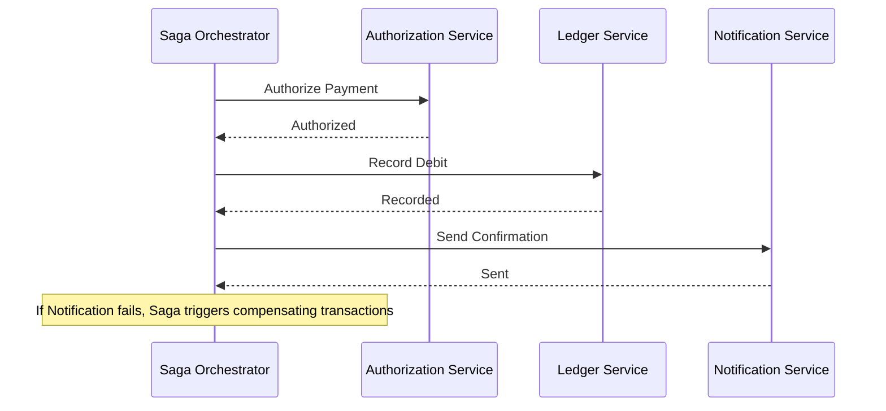
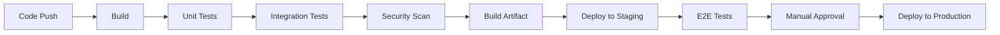
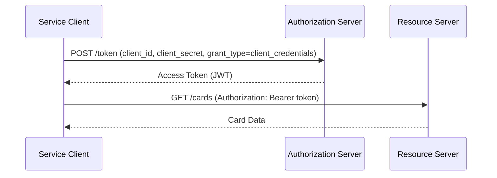
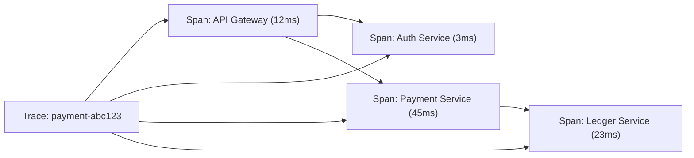
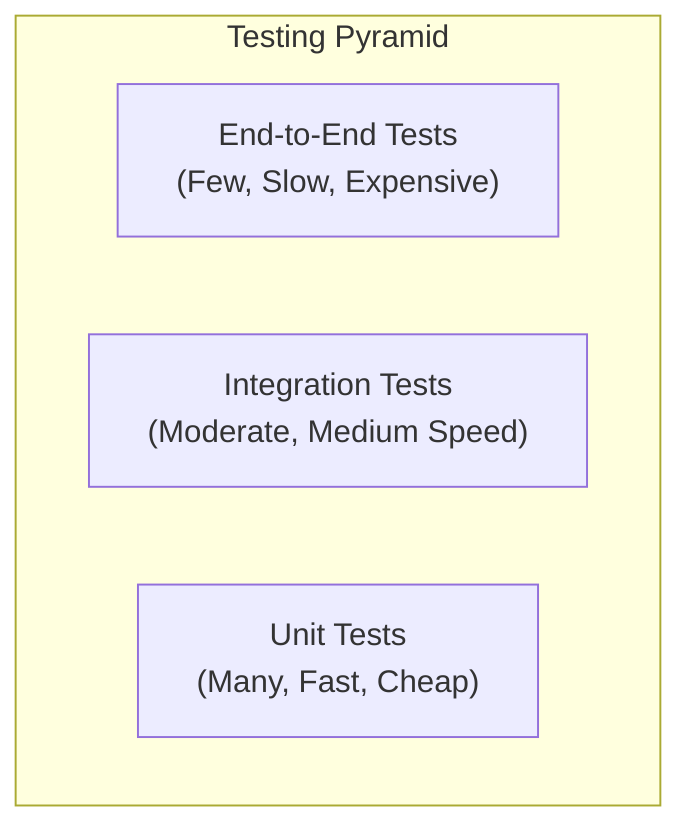
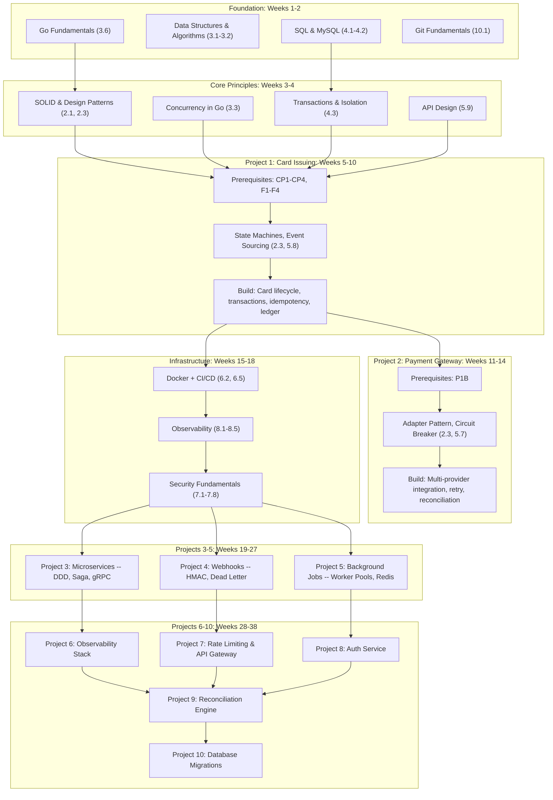

# Foundational Knowledge Synthesis for Backend Engineers at StraitsX (Card Issuing)

## Table of Contents

1. [Prologue](#prologue)
2. [Mindset and Philosophy](#1-mindset-and-philosophy)
3. [Core Engineering Principles and Patterns](#2-core-engineering-principles-and-patterns)
4. [Computational Foundations and Programming Paradigms](#3-computational-foundations-and-programming-paradigms)
5. [Data Management and Storage](#4-data-management-and-storage)
6. [Architecture and System Design](#5-architecture-and-system-design)
7. [Infrastructure and Deployment](#6-infrastructure-and-deployment)
8. [Security Across the Full Stack](#7-security-across-the-full-stack)
9. [Observability and Operations](#8-observability-and-operations)
10. [Testing Strategies](#9-testing-strategies)
11. [Version Control and Collaboration](#10-version-control-and-collaboration)
12. [Professional and Interpersonal Dimensions](#11-professional-and-interpersonal-dimensions)
13. [Cross-Reference Index](#cross-reference-index)
14. [Consolidated Glossary](#consolidated-glossary)
15. [StraitsX Guide Integration](#straitsx-guide-integration----learning-path)
16. [Bibliography](#bibliography)

---

## Prologue

This document is a breadth-first synthesis of foundational knowledge that a junior-to-mid engineer (1-2 years of experience) needs before undertaking production-grade projects in a fintech or payments-oriented backend role. It is not a tutorial. It does not teach you to code. It maps what exists, why it matters, and when it applies -- across the entire software engineering and DevSecOps lifecycle.

The synthesis is organized around the natural lifecycle of building and operating software: from the engineering mindset through design, implementation, security, testing, deployment, and operations. Each section provides enough depth to understand the landscape and make informed decisions about where to invest further study, but deliberately stops short of becoming an implementation guide.

The primary reference document is the *StraitsX Backend Engineer (Card Issuing) Portfolio Guide*, which recommends 10 projects for a backend engineer targeting a card issuing platform role. This synthesis maps every technology, pattern, and concept referenced in that guide to its broader context, fills gaps the guide does not cover, and suggests a learning path aligned to the guide's project sequence.

### How to Use This Document

- **Scan the Table of Contents** to identify domains relevant to your current project or interview preparation.
- **Read sections linearly** if you need a complete conceptual map before starting any project.
- **Use the Cross-Reference Index** to find how a concept in one section relates to concepts in other sections.
- **Use the Glossary** as a quick-lookup for any term encountered in this document or in the StraitsX guide.
- **Consult the Bibliography** for primary sources when you need to go deeper.

### Principles Governing This Document

1. **Source-backed claims.** Every factual claim, pattern recommendation, and comparative statement carries a footnote linking to a credible source. Where consensus does not exist, competing perspectives are presented with attribution.
2. **No fabrication.** If a claim cannot be verified, it is explicitly flagged as uncertain.
3. **No assumed knowledge.** Every assertion is either source-backed or explicitly caveated.
4. **Practical orientation.** Concepts are presented in terms of when they apply and what trade-offs they entail, not as abstract theory.

---

# 1. Mindset and Philosophy

## 1.1 Engineering as Problem-Solving

Software engineering is the application of systematic, disciplined, and quantifiable approaches to the development, operation, and maintenance of software[^1]. It differs from programming (writing code) in scope: engineering encompasses requirements analysis, design, implementation, verification, deployment, and maintenance as interconnected activities[^2].

The IEEE defines software engineering as "the application of a systematic, disciplined, quantifiable approach to the development, operation, and maintenance of software"[^3]. The emphasis on "systematic" and "disciplined" separates engineering from ad-hoc coding.

> **Key Insight:** The transition from junior to mid-level engineer is primarily a transition from "how do I make this work?" to "why does this approach exist, when does it apply, and what are the trade-offs?" This document is designed to support that transition.

### The Problem Before the Solution

A common failure mode for early-career engineers is reaching for implementation before fully understanding the problem. The habit of asking clarifying questions -- What problem does this solve? Who are the users? What are the constraints? What are the failure modes? -- is foundational[^4].

Fred Brooks distinguished between *essential complexity* (inherent in the problem) and *accidental complexity* (introduced by tools and approaches)[^5]. The first task of an engineer is to understand the essential complexity before choosing tools that minimize accidental complexity.

[^1]: Sommerville, Ian. *Software Engineering*, 10th edition. Pearson, 2015. ISBN 978-0133943030.
[^2]: IEEE Standard 730-2014, *IEEE Standard for Software Quality Assurance Processes*.
[^3]: IEEE/EIA 12207.1-1997, *IEEE/EIA Guide -- Industry Implementation of ISO/IEC 12207*.
[^4]: McConnell, Steve. *Code Complete*, 2nd edition. Microsoft Press, 2004. ISBN 978-0735619678.
[^5]: Brooks, Fred. *The Mythical Man-Month*, Anniversary edition. Addison-Wesley, 1995. ISBN 978-0201835953.

## 1.2 Craftsmanship and Professional Responsibility

The Software Craftsmanship movement, formalized in the *Manifesto for Software Craftsmanship* (2009), emphasizes that "not only is there value in the items on the right, we value the items on the left more"[^6]. The manifesto's four tenets -- well-crafted software, steady development, meaningful relationships, and community -- complement the Agile Manifesto[^7].

Professional responsibility in software engineering includes:

- **Honesty** about what you know and do not know
- **Competence** -- working within your areas of expertise and seeking guidance outside them
- **Quality** -- refusing to ship code you would not be willing to maintain
- **Ethics** -- considering the societal impact of technical decisions[^8]

Robert Martin's *Clean Coder* articulates these principles in practical terms, arguing that professionalism in software development means making commitments carefully, following through on them, and practicing the craft deliberately[^9].

[^6]: Fowler, Martin, et al. *Manifesto for Software Craftsmanship*. 2009. https://manifesto.softwarecraftsmanship.org/.
[^7]: Beck, Kent, et al. *Manifesto for Agile Software Development*. 2001. https://agilemanifesto.org/.
[^8]: ACM Code of Ethics and Professional Conduct. 2018. https://www.acm.org/code-of-ethics.
[^9]: Martin, Robert C. *The Clean Coder: A Code of Conduct for Professional Programmers*. Prentice Hall, 2011. ISBN 978-0137081073.

## 1.3 The Balance Between Pragmatism and Idealism

> **Trade-off Alert:** The tension between "do it right" and "ship it now" is permanent. There is no universal answer. The skill is in recognizing which situations demand which approach.

The Strangler Fig pattern (discussed in Section 5.3) is a concrete example of pragmatic incrementalism: rather than rewriting a legacy system from scratch, you gradually replace components while the system continues to operate[^10]. This approach acknowledges that perfect architecture upfront is rarely achievable.

Martin Fowler's "First Law of Software Development" states: "Everyone knows that debugging is twice as hard as writing a program in the first place. So if you're as clever as you can be when you write it, how will you ever debug it?"[^11] This argues for simplicity in implementation even when clever solutions are available.

> **Junior Engineer Note:** When you encounter a decision between a clean solution that takes longer and a pragmatic solution that ships sooner, the answer usually depends on the reversibility of the decision. Easy-to-reverse decisions favor speed. Hard-to-reverse decisions (database schemas, public APIs, architectural boundaries) favor deliberation. Jeff Bezos's "Type 1 vs. Type 2 decisions" framework captures this distinction[^12].

[^10]: Fowler, Martin. "Strangler Fig Application." *martinfowler.com*, 2004 (updated 2019). https://martinfowler.com/bliki/StranglerFigApplication.html.
[^11]: Kernighan, Brian W. *Debugging in C*. O'Reilly, 1978. (Often attributed to Kernighan, later popularized by Knuth.)
[^12]: Bezos, Jeff. 2015 Annual Shareholder Letter. Amazon, 2015.

## 1.4 Continuous Learning and the T-Shaped Engineer

The "T-shaped" model (originated by IDEO CEO Tim Brown) describes an engineer with deep expertise in one area (the vertical bar) and broad familiarity across many areas (the horizontal bar)[^13]. For a backend engineer targeting fintech, the vertical bar might be Go + distributed systems, while the horizontal bar spans security, observability, frontend awareness, and domain knowledge.

The **Dreyfus model of skill acquisition** provides a more nuanced framework: Novice, Advanced Beginner, Competent, Proficient, and Expert[^14]. Most engineers at 1-2 YOE are transitioning from Advanced Beginner to Competent, where the shift from rule-following to situational pattern recognition begins.

> **Key Insight:** Reading about patterns and principles (as this document provides) gives you vocabulary and awareness. Mastery comes from applying these concepts in real projects, making mistakes, and reflecting on the outcomes. The StraitsX guide's 10 projects are designed to accelerate this transition.

[^13]: Brown, Tim. "T-Shaped Stars: The Backbone of IDEO's Collaborative Culture." *IDEA* blog, 2010.
[^14]: Dreyfus, Stuart and Hubert. *Mind Over Machine: The Power of Human Intuition and Expertise in the Era of the Computer*. Free Press, 1986. ISBN 978-0029080603.

---

# 2. Core Engineering Principles and Patterns

## 2.1 SOLID Principles

SOLID is an acronym for five class-level design principles. Robert C. Martin articulated the principles in a 2000 paper and formalized them in his 2002 book; the SOLID acronym itself was coined by Michael Feathers circa 2004[^15][^16]:

| Principle | Core Idea | Violation Example |
|-----------|-----------|-------------------|
| **S**ingle Responsibility | A class should have one reason to change | A class that handles both payment processing and email notifications |
| **O**pen/Closed | Open for extension, closed for modification | Modifying existing code every time a new payment provider is added |
| **L**iskov Substitution | Subtypes must be substitutable for their base types | A PayPal adapter that throws exceptions for methods defined in the PaymentProvider interface |
| **I**nterface Segregation | Clients should not depend on interfaces they do not use | A single PaymentService interface with 30 methods when a client only needs 3 |
| **D**ependency Inversion | High-level modules should depend on abstractions, not concretions | CardService directly importing a MySQL database driver |

> **Junior Engineer Note:** SOLID principles are most naturally applied in object-oriented languages. In Go, which uses composition over inheritance, the principles manifest differently: interfaces are implicit, struct embedding replaces inheritance, and the emphasis shifts to small, well-defined interfaces (as advocated by the Go proverb "The bigger the interface, the weaker the abstraction")[^17].

[^15]: Martin, Robert C. "Design Principles and Design Patterns." Object Mentor, 1999. http://www.butunclebob.com/ArticleS.UncleBob.PrinciplesOfOod.
[^16]: Martin, Robert C. *Agile Software Development: Principles, Patterns, and Practices*. Prentice Hall, 2002. ISBN 978-0135974445.
[^17]: Pike, Rob. "Go Proverbs." 2015. https://go-proverbs.github.io/.

## 2.2 DRY, KISS, and YAGNI

**DRY (Don't Repeat Yourself):** Every piece of knowledge must have a single, unambiguous representation within a system[^18]. Violating DRY does not mean literal code duplication (which may be acceptable when it improves clarity); it means violating the single-source principle for domain knowledge.

**KISS (Keep It Simple, Stupid):** A design principle originating from the US Navy (1960) that states systems function best when kept simple rather than made complex[^19]. This does not mean simplistic -- simple is not the same as easy. Simple systems have fewer moving parts and are easier to reason about.

**YAGNI (You Aren't Gonna Need It):** A principle from Extreme Programming stating that functionality should not be added until it is actually needed[^20]. The cost of building something you do not yet need includes maintenance burden, cognitive load, and opportunity cost.

> **Trade-off Alert:** DRY and YAGNI can conflict. Extracting a shared abstraction (DRY) when you only have two instances may be premature if a third instance never materializes (YAGNI). The heuristic: if you have seen at least three concrete instances of a pattern, extract the abstraction. With fewer, duplicate until the pattern becomes clear.

[^18]: Hunt, Andy and Thomas, David. *The Pragmatic Programmer*. Addison-Wesley, 1999 (20th anniversary edition 2019). ISBN 978-0135957059.
[^19]: "KISS Principle." *NASA Engineering Network*. Referenced in multiple engineering management texts.
[^20]: Beck, Kent. *Extreme Programming Explained: Embrace Change*. Addison-Wesley, 1999. ISBN 978-0321279651.

## 2.3 Design Patterns -- Creational, Structural, Behavioral

The *Gang of Four* (Gamma, Helm, Johnson, Vlissides) catalogued 23 design patterns in 1994, organized into three categories[^21]. These patterns are language-agnostic solutions to recurring design problems:

| Category | Patterns (Selected) | Relevance to Backend/Fintech |
|----------|---------------------|------------------------------|
| **Creational** | Factory, Builder, Singleton | Factory for payment provider instantiation; Builder for complex request objects |
| **Structural** | Adapter, Facade, Proxy, Decorator | Adapter for normalizing multiple payment APIs (guide Project 2); Proxy for rate limiting |
| **Behavioral** | Strategy, Observer, Chain of Responsibility, State | Strategy for payment routing; Observer for webhook dispatch; State for card lifecycle |

The **Adapter pattern** is particularly relevant to the StraitsX guide's Project 2 (Payment Gateway Integration), where different provider APIs are normalized into a unified interface[^22].

> **Key Insight:** Do not memorize all 23 patterns. Instead, understand the *categories of problems* they solve. You will recognize when you need a pattern when you encounter the problem, not by searching through a catalog.

[^21]: Gamma, Erich, Helm, Richard, Johnson, Ralph, and Vlissides, John. *Design Patterns: Elements of Reusable Object-Oriented Software*. Addison-Wesley, 1994. ISBN 978-0201633610.
[^22]: Fowler, Martin. *Patterns of Enterprise Application Architecture*. Addison-Wesley, 2002. ISBN 978-0321127426.

## 2.4 Separation of Concerns and Modular Design

**Separation of Concerns (SoC)**, articulated by Edsger Dijkstra in 1982, states that each section of a program should address a separate concern -- a set of information that affects the code[^23]. This principle underpins nearly every architectural pattern, from layers in a monolith to services in a microservice architecture.

In practice, SoC manifests as:

- **Layered architecture:** Presentation, business logic, data access
- **Hexagonal architecture (Ports and Adapters):** Core business logic surrounded by adapters for external systems[^24]
- **Modular monolith:** Internal modules with clear interfaces and private implementations

Robert C. Martin's **Component Principles** extend SoC to the package/module level, with guidelines like the Acyclic Dependencies Principle, the Stable Dependencies Principle, and the Stable Abstractions Principle[^25].

[^23]: Dijkstra, Edsgar. "On the Role of Scientific Thought." *Selected Writings on Computing: A Personal Perspective*. Springer, 1982.
[^24]: Cockburn, Alistair. "Hexagonal Architecture." 2005. https://alistair.cockburn.us/hexagonal-architecture/.
[^25]: Martin, Robert C. *Agile Software Development: Principles, Patterns, and Practices*. Chapter 20: Components. Prentice Hall, 2002.

## 2.5 Coupling and Cohesion

**Coupling** measures the degree of interdependence between modules. **Cohesion** measures how closely the responsibilities of a single module are related[^26].

| Coupling Level | Description | Example |
|----------------|-------------|---------|
| Content coupling | One module accesses another's internal data | Directly modifying another service's database table |
| Common coupling | Shared global state | Multiple services sharing a single Redis instance for unrelated purposes |
| Control coupling | One module controls another's flow | A service passing "mode" flags to determine behavior |
| Stamp coupling | Shared data structures | Two services passing entire objects when they need only one field |
| Data coupling | Module communicates through parameters | A function that accepts only the data it needs |

The goal: **high cohesion** within modules and **low coupling** between modules[^27].

> **Key Insight:** The distinction between coupling and cohesion is arguably more important than any specific design pattern. A system with well-chosen patterns but high coupling between components will be harder to maintain than a system without patterns but with strong modular boundaries.

[^26]: Myers, Glenford. *Reliable Software Through Composite Design*. Petrocelli/Charter, 1975.
[^27]: Yourdon, Edward and Constantine, Larry. *Structured Design*. Prentice-Hall, 1979.


---

# 3. Computational Foundations and Programming Paradigms

## 3.1 Data Structures

Understanding data structures is not about memorizing implementations -- it is about knowing which structure suits which access pattern[^28]:

| Data Structure | Access | Search | Insertion | Deletion | Use Case |
|----------------|--------|--------|-----------|----------|----------|
| Array | O(1) index | O(n) | O(n) | O(n) | Sequential access, fixed-size collections |
| Linked List | O(n) | O(n) | O(1) | O(1) | Frequent insertions/deletions, no random access needed |
| Hash Table | O(1) avg | O(1) avg | O(1) avg | O(1) avg | Key-value lookups, caching, deduplication |
| Binary Search Tree | O(log n) | O(log n) | O(log n) | O(log n) | Sorted data with dynamic insertions |
| Heap (Priority Queue) | O(1) peek | O(n) | O(log n) | O(log n) | Job scheduling, top-K problems |
| B-Tree | O(log n) | O(log n) | O(log n) | O(log n) | Database indexes, filesystems |

In Go specifically: slices (dynamic arrays), maps (hash tables), and the absence of a built-in linked list or tree are deliberate language design choices[^29]. The `container` package provides heap, list, and ring implementations when needed.

[^28]: Cormen, Thomas, et al. *Introduction to Algorithms*, 4th edition. MIT Press, 2022. ISBN 978-0262046305.
[^29]: "Go Data Structures." *Go Blog*. https://go.dev/blog/slices-intro.

## 3.2 Algorithms and Complexity

Big-O notation describes the upper bound of an algorithm's growth rate as input size increases[^30]:

| Complexity | Name | Example |
|-----------|------|---------|
| O(1) | Constant | Hash table lookup |
| O(log n) | Logarithmic | Binary search |
| O(n) | Linear | Linear scan |
| O(n log n) | Linearithmic | Merge sort, quicksort (average) |
| O(n^2) | Quadratic | Nested loop over same collection |
| O(2^n) | Exponential | Brute-force subset enumeration |

For backend engineers, the practical relevance of complexity analysis is:

- Choosing the right data structure for hot paths (e.g., transaction matching in the reconciliation engine)
- Understanding why certain database queries are slow (missing indexes cause O(n) scans)
- Recognizing when an O(n^2) operation is hiding in seemingly innocent code[^31]

> **Junior Engineer Note:** You do not need to master advanced algorithms for most backend work. You do need to recognize when your code is performing unnecessary work -- an inner loop that scans a slice repeatedly, or a query that triggers a full table scan instead of using an index.

[^30]: Cormen, Thomas, et al. *Introduction to Algorithms*, 4th edition. MIT Press, 2022.
[^31]: Bloch, Joshua. *Effective Java*, 3rd edition. Addison-Wesley, 2018. ISBN 978-0134685991.

## 3.3 Concurrency and Parallelism

**Concurrency** is dealing with multiple things at once. **Parallelism** is doing multiple things at once[^32]. These are distinct concepts: concurrent code may run on a single thread (via interleaving), while parallel code requires multiple execution contexts.

### Concurrency Models

| Model | Implementation | Pros | Cons |
|-------|---------------|------|------|
| Threads + locks | pthreads, Java threads | Direct OS support | Race conditions, deadlocks, high memory cost (~1MB per thread) |
| Goroutines + channels | Go | Lightweight (~2KB stack), CSP model, safe by design | Learning curve for channel patterns |
| Async/await | JavaScript, Python asyncio, Rust | Non-blocking I/O, efficient for I/O-bound work | Callback complexity, harder to reason about |
| Actor model | Erlang/Elixir, Akka | Fault isolation, location transparency | Message overhead, eventual consistency |

**Communicating Sequential Processes (CSP)**, formalized by Tony Hoare in 1978, is the theoretical foundation for Go's concurrency model[^33]. The Go proverb "Do not communicate by sharing memory; instead, share memory by communicating" encapsulates the CSP philosophy[^34].

**Goroutines** are lightweight threads managed by the Go runtime, starting at approximately 2KB of stack memory (compared to approximately 1MB for OS threads). They are multiplexed onto OS threads by the Go scheduler[^35].

**Channels** are typed conduits for goroutine communication. They provide synchronization and data exchange in a single operation[^36].

```go
// Fan-out pattern: distribute work across goroutines
func processTransactions(txns []Transaction, results chan<- Result) {
    for _, txn := range txns {
        txn := txn // capture loop variable
        go func() {
            results <- processOne(txn)
        }()
    }
}
```

> **Key Insight:** Go's concurrency model is particularly well-suited to the I/O-bound workloads typical in payment processing (database operations, HTTP calls to external services, webhook handling). Understanding goroutines and channels is essential for the StraitsX guide's projects.

[^32]: Pike, Rob. "Concurrency is not Parallelism." *talks.golang.org*, 2012. https://go.dev/talks/2012/concurrency.slide.
[^33]: Hoare, Tony. "Communicating Sequential Processes." *Communications of the ACM*, 21(8), 1978. DOI: 10.1145/359576.359585.
[^34]: "Go Memory Model." *Go Documentation*. https://go.dev/ref/mem.
[^35]: "A Tutorial on the Go Concurrency Primitives." *Go Blog*. https://go.dev/doc/articles/pipelines.
[^36]: "Go Concurrency Patterns: Pipelines." *Go Blog*, 2012. https://go.dev/doc/articles/pipelines.

## 3.4 Functional Programming Concepts

While Go is not a purely functional language, several functional programming concepts are essential for modern backend engineering:

- **Higher-order functions:** Functions that accept or return other functions. In Go, function types enable this pattern (e.g., middleware chains in HTTP servers)[^37].
- **Immutability:** Data structures that cannot be modified after creation. Go's `sync.Map` and the copy-on-write pattern approximate immutability.
- **Pure functions:** Functions with no side effects, where output depends only on input. Pure functions are deterministic and testable.
- **Map/Reduce/Filter:** Collection transformations. Go's `slices` package (Go 1.21+) provides `Map`, `Collect`, `Sort`, `Contains`, and other generic utilities[^38].

> **Junior Engineer Note:** You do not need to adopt functional programming wholesale. The useful takeaway is: prefer immutability where practical, isolate side effects, and use pure functions for business logic that does not depend on external state.

[^37]: "Effective Go: Functions -- Function Types." *Go Documentation*. https://go.dev/doc/effective_go#functions.
[^38]: "slices Package." *Go Documentation*. https://pkg.go.dev/slices.

## 3.5 Object-Oriented Programming

Go is often described as "not object-oriented" but supports the four pillars of OOP through different mechanisms[^39]:

| OOP Concept | Traditional (Java/C++) | Go Equivalent |
|-------------|----------------------|---------------|
| Encapsulation | Classes with access modifiers | Unexported struct fields |
| Abstraction | Abstract classes/interfaces | Interfaces (implicit satisfaction) |
| Inheritance | Class inheritance | Struct embedding (composition) |
| Polymorphism | Virtual methods | Interface-based dispatch |

**Struct embedding** in Go provides composition with promoted methods, which achieves code reuse without the fragility of class hierarchies[^40]. This is a deliberate design choice: Go favors small interfaces and composition over large class hierarchies.

[^39]: Pike, Rob. "Go at Google: Designing the Language." *go-lang.ca*, 2012.
[^40]: "Effective Go: Embedding." *Go Documentation*. https://go.dev/doc/effective_go#embedding.

## 3.6 The Go Programming Language in Context

Go was designed at Google by Robert Griesemer, Rob Pike, and Ken Thompson, publicly released in 2009[^41]. Its design priorities directly address backend engineering concerns:

| Design Priority | Implementation | Why It Matters for Fintech |
|-----------------|----------------|----------------------------|
| Simplicity | Few keywords, explicit error handling | Easier code review, faster onboarding, fewer subtle bugs |
| Concurrency | Goroutines and channels as first-class citizens | High-throughput payment processing, concurrent webhook handling |
| Performance | Compiled to native code, GC optimized for low latency | Sub-millisecond transaction authorization |
| Standard library | `net/http`, `database/sql`, `crypto`, `encoding` | Payment APIs, database operations, encryption without external dependencies |
| Tooling | `go fmt`, `go test`, `go vet`, `go build` | Consistent formatting, built-in testing, static analysis |

**Go's standard library** is notably comprehensive for backend work. The `net/http` package alone is production-capable for many use cases[^42]. The `database/sql` package provides connection pooling, prepared statements, and transaction support.

**Error handling** in Go uses explicit return values rather than exceptions. This is divisive but has practical benefits: errors are part of the function signature, callers must handle them, and error handling is visible in the code flow[^43].

```go
// Idiomatic Go error handling
result, err := processPayment(ctx, request)
if err != nil {
    return fmt.Errorf("process payment: %w", err)
}
```

> **Key Insight:** Go's emphasis on simplicity and explicit error handling aligns well with fintech requirements where silent failures can have financial consequences. The language design enforces visibility of failure paths.

[^41]: "Go: A Language for Software Development." *go.dev*, 2022. https://go.dev/blog/10years.
[^42]: "Go 1.22 Release Notes -- Enhanced Routing." *Go Blog*, 2024.
[^43]: "Go FAQ: Why does Go use exceptions for semicolon recovery but not for errors?" *Go Documentation*. https://go.dev/doc/faq.

---

# 4. Data Management and Storage

## 4.1 Relational Database Fundamentals

Relational databases, based on E.F. Codd's relational model (1970), store data in tables (relations) with defined schemas and enforce relationships through foreign keys[^44]. Despite decades of NoSQL alternatives, relational databases remain the default choice for transactional workloads, particularly in fintech where ACID properties[^45] are non-negotiable.

**ACID Properties:**

| Property | Definition | Fintech Relevance |
|----------|-----------|-------------------|
| **A**tomicity | All operations in a transaction complete or none do | A card charge and balance update must both succeed or both fail |
| **C**onsistency | Transaction moves database from one valid state to another | Debits and credits must always balance in a ledger |
| **I**solation | Concurrent transactions do not interfere with each other | Two simultaneous charges on the same card must not overdraw |
| **D**urability | Committed data survives system failures | Once a transaction is confirmed, it cannot be lost |

[^44]: Codd, E.F. "A Relational Model of Data for Large Shared Data Banks." *Communications of the ACM*, 13(6), 1970. DOI: 10.1145/362384.362687.
[^45]: Haerder, Theo and Reuter, Andreas. "Principles of Transaction-Oriented Database Recovery." *ACM Computing Surveys*, 15(4), 1983. DOI: 10.1145/289.291.

## 4.2 SQL and Query Optimization

SQL (Structured Query Language) is the standard language for relational database operations. For backend engineers, the critical knowledge areas are:

**Indexing:** Indexes accelerate read queries at the cost of write performance and storage. B-tree indexes (the default in MySQL/InnoDB) are optimal for range queries; hash indexes are optimal for exact-match lookups[^46].

**Query execution plans:** Use `EXPLAIN` (MySQL) or `EXPLAIN ANALYZE` to understand how the database executes a query. Missing indexes cause full table scans (O(n)) where indexed queries are O(log n)[^47].

**N+1 query problem:** A common performance antipattern where a loop triggers a separate query for each item, resulting in n+1 total queries instead of one join or batch query[^48].

```sql
-- Anti-pattern: N+1 queries
SELECT * FROM cards WHERE user_id = 123;  -- Returns 10 cards
-- Then for each card:
SELECT * FROM transactions WHERE card_id = <card_id>;  -- 10 more queries

-- Better: single JOIN or subquery
SELECT c.*, t.*
FROM cards c
JOIN transactions t ON t.card_id = c.id
WHERE c.user_id = 123;
```

[^46]: "InnoDB Indexes." *MySQL 8.0 Reference Manual*. https://dev.mysql.com/doc/refman/8.0/en/innodb-indexes.html.
[^47]: "Optimization and Indexes." *MySQL 8.0 Reference Manual*. https://dev.mysql.com/doc/refman/8.0/en/optimization-indexes.html.
[^48]: "N+1 Query Problem." Referenced in multiple ORM documentation and database optimization guides.

## 4.3 Transactions and Isolation Levels

Database isolation levels control the visibility of changes between concurrent transactions[^49]:

| Isolation Level | Dirty Read | Non-Repeatable Read | Phantom Read | Performance |
|-----------------|------------|--------------------:|:------------:|:-----------:|
| READ UNCOMMITTED | Possible | Possible | Possible | Highest |
| READ COMMITTED | Prevented | Possible | Possible | High |
| REPEATABLE READ | Prevented | Prevented | Possible | Medium |
| SERIALIZABLE | Prevented | Prevented | Prevented | Lowest |

**MySQL/InnoDB default:** REPEATABLE READ (with gap locking to prevent phantoms in most cases)[^50].

**Optimistic locking** uses a version column rather than database locks. When updating, the WHERE clause includes the version number; if another transaction modified the record first (version mismatch), the update affects zero rows[^51]. This pattern is relevant to the StraitsX guide's card balance update scenario.

**Pessimistic locking** uses `SELECT ... FOR UPDATE` to acquire a row-level lock, preventing other transactions from modifying the same row until the lock is released[^52]. This is safer for high-contention scenarios but reduces throughput.

> **Trade-off Alert:** Optimistic locking is simpler and higher-throughout for low-contention workloads. Pessimistic locking is safer for high-contention workloads (e.g., multiple simultaneous transactions on the same card). The choice depends on expected contention frequency.

[^49]: Berenson, Hal, et al. "A Critique of ANSI SQL Isolation Levels." *Proceedings of the 1995 ACM SIGMOD*, 1995. DOI: 10.1145/223782.223783.
[^50]: "InnoDB Transaction and Locking Information." *MySQL 8.0 Reference Manual*. https://dev.mysql.com/doc/refman/8.0/en/innodb-information-schema-transactions.html.
[^51]: "Optimistic Concurrency Control." *Wikipedia*. https://en.wikipedia.org/wiki/Optimistic_concurrency_control.
[^52]: "Locking Reads." *MySQL 8.0 Reference Manual*. https://dev.mysql.com/doc/refman/8.0/en/innodb-locking-reads.html.

## 4.4 Database Schema Design and Migrations

**Schema design** principles for backend engineers:

- **Normalization:** Reducing data redundancy through decomposition. Third Normal Form (3NF) eliminates transitive dependencies and is the standard target for transactional databases[^53].
- **Denormalization:** Intentionally introducing redundancy for read performance. Common in reporting systems and read-heavy services.
- **Naming conventions:** Consistent table and column naming reduces cognitive load (e.g., `snake_case` for tables and columns in MySQL).

**Schema migrations** are version-controlled scripts that evolve the database schema over time. They are essential for:

- Deploying schema changes atomically with code
- Enabling rollback of schema changes
- Documenting the evolution of the data model

**Tools:** Flyway, Liquibase, golang-migrate, Atlas[^54].

**Expand-and-contract pattern** (also called parallel change) enables zero-downtime schema migrations by adding new columns/tables before removing old ones, allowing code to transition incrementally[^55].

> **Key Insight:** Schema migrations in production databases require care. A migration that drops a column while old code is still running will cause errors. The expand-and-contract pattern ensures backward compatibility during transitions.

[^53]: Date, C.J. *Database Design and Relational Theory*. O'Reilly, 2012. ISBN 978-1449328016.
[^54]: "golang-migrate." *GitHub*. https://github.com/golang-migrate/migrate.
[^55]: Martin, Martin. "Parallel Change." *martinfowler.com*, 2010. https://martinfowler.com/bliki/ParallelChange.html.

## 4.5 Caching Strategies

Caching reduces latency and database load by storing frequently accessed data closer to the application[^56]:

| Strategy | Description | Consistency | Use Case |
|----------|-------------|-------------|----------|
| Cache-aside (lazy loading) | Application checks cache, then DB | Eventual | General-purpose read caching |
| Write-through | Writes go to cache and DB simultaneously | Strong | When write consistency matters |
| Write-behind (write-back) | Writes go to cache; cache flushes to DB async | Eventual (risk of data loss) | High write throughput |
| Read-through | Cache fetches from DB on miss | Eventual | Transparent to application |

**Cache invalidation** -- determining when cached data is stale -- is famously difficult. Phil Karlton's quote "There are only two hard things in Computer Science: cache invalidation and naming things" captures this[^57].

**Redis** is the most common caching backend for Go applications. Key data structures relevant to the StraitsX guide's projects:
- **Strings:** Simple key-value caching
- **Sorted sets:** Priority queues (Project 5: Background Job Processing), rate limiting windows
- **Streams:** Message queues for async processing (Project 2: Payment Gateway)
- **Hashes:** Object storage with partial updates[^58]

[^56]: Nishtala, Ravi, et al. "Scaling Memcache at Facebook." *NSDI 2013*. https://www.usenix.org/conference/nsdi13/technical-sessions/presentation/nishtala.
[^57]: Karlton, Phil. Quoted in "Two Hard Things." *Martin Fowler's Bliki*, 2014. https://martinfowler.com/bliki/TwoHardThings.html.
[^58]: "Redis Data Types." *Redis Documentation*. https://redis.io/docs/latest/develop/data-types/.

## 4.6 NoSQL Datastores

NoSQL databases sacrifice one or more of ACID properties for other characteristics[^59]:

| Type | Examples | Strengths | Trade-off |
|------|----------|-----------|-----------|
| Key-Value | Redis, DynamoDB | Extreme read/write speed | No complex queries |
| Document | MongoDB, CouchDB | Flexible schema, nested documents | Weaker consistency guarantees |
| Column-family | Cassandra, HBase | Horizontal scaling, write-heavy workloads | Eventual consistency, complex operational requirements |
| Graph | Neo4j, ArangoDB | Relationship queries | Not suitable for tabular data |

> **Key Insight:** For fintech transactional workloads, relational databases remain the default choice. NoSQL is appropriate for specific access patterns: Redis for caching, Cassandra for high-volume event logging, MongoDB for flexible document storage (e.g., webhook payloads with varying schemas). The StraitsX guide correctly defaults to MySQL for transactional data with Redis as a complementary cache and queue.

[^59]: Cattell, Rick. "Scalable SQL and NoSQL Data Stores." *ACM SIGMOD Record*, 39(4), 2010. DOI: 10.1145/1978912.1978915.

---

# 5. Architecture and System Design

## 5.1 Architectural Thinking

Architecture decisions are the decisions that are hard to change later[^60]. Martin Fowler distinguishes between *architecture* (the decisions that matter) and *design* (decisions that are easier to revise), arguing that the value of architecture is in enabling or constraining future change[^61].

**Architecture Decision Records (ADRs)** capture architectural decisions with their context, options considered, and rationale[^62]. They are lightweight (typically one page) and provide institutional memory.

| ADR Element | Purpose |
|-------------|---------|
| Status | Proposed, accepted, deprecated, superseded |
| Context | The situation and constraints driving the decision |
| Decision | What was decided |
| Consequences | What changes as a result (positive and negative) |

> **Key Insight:** For junior engineers, the most important architectural skill is not knowing which pattern to apply, but knowing *what questions to ask*: What are the consistency requirements? What are the failure modes? What needs to scale? What can fail without consequences?

[^60]: Knuth, Donald. "Notes on the Relationship Between Computer Science and Software Engineering." 1987.
[^61]: Fowler, Martin. "Who Needs an Architect?" *IEEE Software*, 20(5), 2003.
[^62]: Nygard, Michael. *Documenting Software Architectures: Views and Beyond*, 2nd edition. Addison-Wesley, 2011.

## 5.2 Monolithic Architectures

A **monolithic architecture** deploys the entire application as a single unit[^63]. This is not inherently inferior to microservices -- it is the appropriate starting point for most new projects.

**Modular monolith** extends the monolith by enforcing module boundaries through code conventions and build-time checks, while maintaining single-deployment simplicity[^64]. Modules communicate through well-defined interfaces without direct database access across module boundaries.

| Aspect | Traditional Monolith | Modular Monolith | Microservices |
|--------|---------------------|------------------|---------------|
| Deployment | Single unit | Single unit | Independent units |
| Module boundaries | Weak | Strong (code-enforced) | Strong (process-enforced) |
| Data isolation | Shared database | Schema-per-module recommended | Database-per-service |
| Complexity | Low | Medium | High |
| Scaling | Vertical | Vertical | Horizontal (per service) |
| Team structure | Any | Any | Small, autonomous teams |

> **Trade-off Alert:** The StraitsX guide recommends a "modular monolith with clear domain boundaries" for Project 1 (Card Issuing Platform). This is the pragmatic choice for a zero-to-one project: it provides structure without the operational overhead of distributed systems. The microservices architecture (Project 3) then demonstrates the ability to evolve the system when needed.

[^63]: Newman, Sam. *Building Microservices*, 2nd edition. O'Reilly, 2021. ISBN 978-1492034025.
[^64]: "Modular Monolith." *microservices.io*. https://microservices.io/patterns/monolith/modular-monolith.html.

## 5.3 Microservices Architecture

Microservices decompose an application into small, independently deployable services, each owning its own data and business logic[^65]. This architecture was popularized by Netflix, Amazon, and Uber, but comes with significant operational complexity.

**When to use microservices:**
- Multiple teams need to deploy independently
- Different components have different scaling requirements
- Failure isolation is critical (a bug in one service should not bring down the system)

**When NOT to use microservices:**
- The team is small (fewer than approximately 10 engineers)
- The domain is not well understood
- The organization lacks the infrastructure (CI/CD, monitoring, service mesh) to operate distributed systems[^66]

The **Strangler Fig pattern** provides a migration path from monolith to microservices by gradually extracting functionality into new services while the monolith continues to serve existing requests[^67].

[^65]: Lewis, James and Fowler, Martin. "Microservices: A Definition of this New Architectural Term." *martinfowler.com*, 2014. https://martinfowler.com/articles/microservices.html.
[^66]: Richardson, Chris. *Microservices Patterns*. Manning, 2018. ISBN 978-1617294549.
[^67]: Fowler, Martin. "Strangler Fig Application." *martinfowler.com*, 2004.

## 5.4 Domain-Driven Design

**Domain-Driven Design (DDD)**, introduced by Eric Evans in 2003, provides a framework for modeling complex business domains by aligning software structure with business concepts[^68].

**Core DDD concepts:**

| Concept | Definition | Application |
|---------|-----------|-------------|
| Ubiquitous Language | Shared vocabulary between developers and domain experts | Card lifecycle terms: authorization, clearing, settlement |
| Bounded Context | A boundary within which a particular domain model applies | Card issuing context vs. settlement context |
| Entity | An object defined by its identity (not attributes) | A Card (identified by card_id, even if details change) |
| Value Object | An object defined by its attributes (no identity) | A Money(amount, currency) |
| Aggregate | A cluster of entities and value objects treated as a unit for data changes | Card + CardLimit + CardStatus as one aggregate |
| Domain Event | A record of something that happened in the domain | CardAuthorized, CardBlocked |

DDD's **Strategic Design** (bounded contexts, context maps, ubiquitous language) is arguably more important than its **Tactical Design** (entities, aggregates, repositories) for system architecture[^69]. Bounded contexts map naturally to service boundaries in microservice architectures.

> **Key Insight:** The StraitsX guide's Project 3 (Microservice Architecture) explicitly requires DDD knowledge. The card issuing domain provides rich modeling opportunities: card entities, transaction aggregates, authorization events, and settlement contexts.

[^68]: Evans, Eric. *Domain-Driven Design: Tackling Complexity in the Heart of Software*. Addison-Wesley, 2003. ISBN 978-0321125217.
[^69]: Vernon, Vaughn. *Implementing Domain-Driven Design*. Addison-Wesley, 2013. ISBN 978-0321834577.

## 5.5 Distributed Systems Fundamentals

The **CAP theorem** (Brewer, 2000; proven by Gilbert and Lynch, 2002) states that a distributed data store can provide at most two of three guarantees[^70][^71]:

| Property | Definition |
|----------|-----------|
| **C**onsistency | Every read receives the most recent write or an error |
| **A**vailability | Every request receives a non-error response (without guarantee of most recent write) |
| **P**artition tolerance | The system continues to operate despite network partitions between nodes |

In practice, since network partitions are inevitable in distributed systems, the choice is between **CP** (consistent but may become unavailable) and **AP** (available but may return stale data)[^72].

> **Trade-off Alert:** The CAP theorem is often oversimplified. In practice, systems make fine-grained choices: some operations may be CP (account balance reads) while others are AP (notification delivery). The PACELC theorem extends CAP by accounting for latency vs. consistency trade-offs even when the network is healthy[^73].

**BASE (Basically Available, Soft state, Eventually consistent)** is an alternative to ACID for distributed systems, advocating availability and scalability over strong consistency[^73b]:

| Property | Definition |
|----------|-----------|
| Basically Available | The system guarantees availability (every request receives a response) |
| Soft state | The state of the system may change over time even without input |
| Eventually consistent | The system will eventually become consistent once it stops receiving input |

[^73b]: Pritchett, Dan. "BASE: An Acid Alternative." *ACM Queue*, 6(3), 2008. DOI: 10.1145/1394127.1394128.

**The Two Generals Problem** demonstrates that reliable communication over unreliable networks is impossible[^74]. This is not merely theoretical -- it underpins why distributed systems require explicit acknowledgement, retry, and timeout strategies.

**Fallacies of Distributed Computing** (L. Peter Deutsch, 1994; expanded by James Gosling) enumerate assumptions that lead to broken distributed systems[^75]:

1. The network is reliable
2. Latency is zero
3. Bandwidth is infinite
4. The network is secure
5. Topology does not change
6. There is one administrator
7. Transport cost is zero
8. The network is homogeneous

[^70]: Brewer, Eric. "Toward Robust Distributed Systems." *PODC Keynote*, 2000.
[^71]: Gilbert, Seth and Lynch, Nancy. "Brewer's Conjecture and the Feasibility of Consistent, Available, Partition-Tolerant Web Services." *ACM SIGACT News*, 33(2), 2002.
[^72]: Abadi, Daniel. "Consistency Tradeoffs in Modern Distributed Database System Design." *IEEE Computer*, 45(2), 2012.
[^73]: Abadi, Daniel. "Consistency Tradeoffs in Modern Distributed Database System Design." *IEEE Computer*, 2012.
[^74]: Akkoyunlu, Ege, et al. "Some Constraints and Trade-offs in the Design of Network Communications." *ACM SIGOPS Operating Systems Review*, 9(5), 1975.
[^75]: Deutsch, Peter. "The Fallacies of Distributed Computing Explained." *java.net*, 1994 (revised 2006).

## 5.6 Communication Patterns

| Pattern | Protocol | Coupling | Latency | Use Case |
|---------|----------|----------|---------|----------|
| REST | HTTP/1.1, JSON | Loose (URL-based) | Medium | Public APIs, CRUD operations |
| gRPC | HTTP/2, Protocol Buffers | Tight (schema-compiled) | Low | Inter-service communication |
| GraphQL | HTTP, JSON | Client-driven queries | Medium | Flexible API for diverse clients |
| Message Queue | AMQP, MQTT, Redis | Decoupled (async) | Variable | Event processing, job queues |
| Event Streaming | Kafka, Redis Streams | Decoupled (pub/sub) | Low-medium | Event sourcing, audit logs |

**REST (Representational State Transfer)** is the dominant API style for web services[^76]. Key constraints: stateless communication, uniform interface, resource identification via URIs, and hypermedia as the engine of application state (HATEOAS, though rarely implemented in practice).

**gRPC** uses Protocol Buffers for serialization and HTTP/2 for transport, providing significant performance advantages over REST for internal service communication[^77]. The StraitsX guide recommends gRPC for inter-service communication in the microservices architecture (Project 3).

**Webhooks** (HTTP callbacks) are the standard pattern for receiving notifications from external services (payment providers, card networks). The StraitsX guide's Project 4 (Webhook Processing System) is dedicated to reliable webhook handling[^78].

[^76]: Fielding, Roy. "Architectural Styles and the Design of Network-based Software Architectures." PhD dissertation, UC Irvine, 2000.
[^77]: "gRPC: A High-Performance, Open-Source Universal RPC Framework." *grpc.io*. https://grpc.io/.
[^78]: "Webhooks." *Stripe Documentation*. https://stripe.com/docs/webhooks.

## 5.7 Resilience Patterns

Production systems fail. Resilience patterns ensure that failures in individual components do not cascade into system-wide outages[^79]:

| Pattern | Description | Implementation |
|---------|-------------|----------------|
| **Circuit Breaker** | Stops calling a failing service after a threshold of errors; periodically tests recovery | Go: `sony/gobreaker`, or manual implementation with state machine |
| **Retry + Backoff** | Retries failed operations with increasing delays to avoid overwhelming a struggling service | Go: exponential backoff with jitter[^80] |
| **Bulkhead** | Isolates failures by partitioning resources (e.g., separate thread pools per dependency) | Separate goroutine pools or worker queues per external service |
| **Timeout** | Prevents indefinite waiting for a response | Go: `context.WithTimeout` propagates deadlines through call chains |
| **Fallback** | Returns a degraded but acceptable response when the primary path fails | Return cached data when the database is unavailable |
| **Rate Limiting** | Controls the rate of requests to prevent overload | Token bucket algorithm, implemented in Redis |

The **Circuit Breaker pattern** was formalized by Michael Nygard in *Release It!* (2007) and later described in detail by Martin Fowler[^81]. It has three states: Closed (normal operation), Open (failing, reject requests), and Half-Open (testing recovery).

```mermaid
stateDiagram-v2
    [*] --> Closed
    Closed --> Open : Failure threshold exceeded
    Open --> Half-Open : Timeout expires
    Half-Open --> Closed : Probe request succeeds
    Half-Open --> Open : Probe request fails
```

[^79]: Nygard, Michael. *Release It! Design and Deploy Production-Ready Software*, 2nd edition. Pragmatic Bookshelf, 2018. ISBN 978-1680502398.
[^80]: "Exponential Backoff and Jitter." *AWS Architecture Blog*, 2015. https://aws.amazon.com/blogs/architecture/exponential-backoff-and-jitter/.
[^81]: Fowler, Martin. "Circuit Breaker." *martinfowler.com*, 2014. https://martinfowler.com/bliki/CircuitBreaker.html.

## 5.8 Event-Driven Architecture

**Event-driven architecture (EDA)** uses events as the primary mechanism for communication between components[^82]:

| Pattern | Description | Consistency | Use Case |
|---------|-------------|-------------|----------|
| **Event Notification** | Services emit events when state changes; other services react | Eventual | Decoupled service communication |
| **Event-Carried State Transfer** | Events carry the full state needed by consumers | Eventual | Reducing cross-service queries |
| **Event Sourcing** | State is reconstructed by replaying a sequence of events | Eventual | Audit trails, undo/redo, temporal queries |
| **CQRS** | Separate read and write models | Eventual | Optimizing read and write independently |

**Event Sourcing** stores state changes as an immutable sequence of events rather than storing the current state[^83]. The current state is derived by replaying all events. This is particularly relevant to the StraitsX guide's Project 1 (Card Issuing Platform), where transaction history is naturally event-sourced.

**Command Query Responsibility Segregation (CQRS)** separates read and write operations into different models[^84]. Writes go to an event store; reads come from optimized projections. This is useful when read and write workloads have different performance requirements.

**Saga Pattern** manages distributed transactions across multiple services without two-phase commit[^85]. Each service performs its local transaction and emits an event; if any step fails, compensating transactions undo the previous steps.



[^82]: Richardson, Chris. "Microservices Patterns: Event-Driven Architecture." *microservices.io*, 2018.
[^83]: Young, Greg. "CQRS Documents." 2010. https://cqrs.files.wordpress.com/2010/11/cqrs_documents.pdf.
[^84]: Young, Greg. "CQRS." *martinfowler.com/bliki*, 2011. https://martinfowler.com/bliki/CQRS.html.
[^85]: Richardson, Chris. "Saga Pattern." *microservices.io*. https://microservices.io/patterns/saga/.

## 5.9 API Design

**RESTful API design** follows conventions that promote predictability and usability[^86]:

| Principle | Implementation |
|-----------|---------------|
| Resource-based URLs | `GET /cards/{id}`, `POST /cards` |
| HTTP methods | GET (read), POST (create), PUT/PATCH (update), DELETE (remove) |
| Status codes | 200 (OK), 201 (Created), 400 (Bad Request), 401 (Unauthorized), 404 (Not Found), 409 (Conflict), 422 (Unprocessable), 500 (Internal Error) |
| Consistent error format | `{ "error": { "code": "...", "message": "...", "details": [...] } }` |
| Pagination | Cursor-based or offset-based for list endpoints |
| Versioning | URL path (`/v1/cards`) or header-based |

**OpenAPI 3.0** (formerly Swagger) is the standard specification for defining RESTful APIs[^87]. It enables automatic documentation generation, client SDK generation, and contract testing.

**API design for fintech** requires additional considerations:

- **Idempotency keys** on all mutating endpoints (prevents double-charges on retries)[^88]
- **Request signing** for webhook verification
- **Strict input validation** (amount precision, currency codes, card number format)
- **Audit logging** for all API operations

> **Key Insight:** The StraitsX guide emphasizes OpenAPI 3.0 spec, idempotency keys, and webhook notifications across all projects. These are not optional best practices in fintech -- they are operational requirements.

[^86]: "RESTful API Design." *Microsoft REST API Guidelines*. https://github.com/microsoft/api-guidelines.
[^87]: "OpenAPI 3.0 Specification." *OpenAPI Initiative*. https://spec.openapis.org/oas/v3.0.4.
[^88]: "Idempotency." *Stripe Documentation*. https://stripe.com/docs/api/idempotent_requests.

---

# 6. Infrastructure and Deployment

## 6.1 Operating System Fundamentals

Backend engineers interact with operating systems at several levels:

**Process management:** Understanding process lifecycle, signals (SIGTERM, SIGINT, SIGHUP), and graceful shutdown is essential for running services in production[^89]. Go's `os/signal` package handles signal interception for graceful shutdown.

**Memory management:** Understanding virtual memory, page faults, and garbage collection behavior is relevant when diagnosing performance issues. Go's garbage collector is designed for low latency (sub-millisecond pauses as of Go 1.8+)[^90].

**File system I/O:** Understanding buffered vs. unbuffered I/O, page cache, and filesystem semantics is relevant for batch processing (Project 9: Reconciliation Engine) and log management.

**Linux namespaces and cgroups:** The foundation of containerization. Namespaces provide isolation (PID, network, mount), while cgroups provide resource limiting (CPU, memory)[^91].

[^89]: "os/signal Package." *Go Documentation*. https://pkg.go.dev/os/signal.
[^90]: "Go GC Guide." *Go Blog*, 2018. https://go.dev/blog/ismmkeynote.
[^91]: "Linux Namespaces." *Linux Kernel Documentation*. https://www.kernel.org/doc/Documentation/namespaces/.

## 6.2 Containerization

**Docker** packages applications with their dependencies into containers -- lightweight, portable, isolated execution environments[^92].

| Container Concept | Description |
|-------------------|-------------|
| **Dockerfile** | Declarative build instructions for creating a container image |
| **Image** | Immutable template containing application code, runtime, libraries, and filesystem |
| **Container** | Running instance of an image |
| **Volume** | Persistent storage that survives container restarts |
| **Network** | Isolated communication channel between containers |

**Multi-stage builds** in Dockerfiles dramatically reduce image size by separating build-time and run-time dependencies[^93]:

```dockerfile
# Build stage
FROM golang:1.22-alpine AS builder
WORKDIR /app
COPY go.mod go.sum ./
RUN go mod download
COPY . .
RUN CGO_ENABLED=0 go build -o server .

# Run stage
FROM alpine:3.19
RUN apk add --no-cache ca-certificates
COPY --from=builder /app/server /server
CMD ["/server"]
```

**Container image scanning** (Trivy, Snyk, Grype) identifies known vulnerabilities in base images and dependencies. This is a DevSecOps practice that should be integrated into CI pipelines[^94].

> **Key Insight:** Docker is mentioned in the StraitsX guide as a required technology. Beyond building containers, understanding image optimization (multi-stage builds, distroless base images), security scanning, and layer caching is essential for production-grade container operations.

[^92]: "Docker Documentation." *docs.docker.com*. https://docs.docker.com/.
[^93]: "Multi-stage Builds." *Docker Documentation*. https://docs.docker.com/build/building/multi-stage/.
[^94]: "Trivy." *GitHub*. https://github.com/aquasecurity/trivy.

## 6.3 Orchestration

**Kubernetes** (K8s) is the de facto standard for container orchestration -- automating deployment, scaling, and management of containerized applications[^95].

| Kubernetes Concept | Purpose |
|-------------------|---------|
| **Pod** | Smallest deployable unit; one or more containers sharing network/storage |
| **Deployment** | Manages replica sets and rolling updates |
| **Service** | Stable network endpoint for accessing pods (ClusterIP, NodePort, LoadBalancer) |
| **Ingress** | HTTP routing to services (TLS termination, path-based routing) |
| **ConfigMap / Secret** | Configuration and sensitive data injection |
| **Namespace** | Logical isolation within a cluster |
| **PersistentVolume** | Durable storage for stateful workloads (databases, queues) |

> **Trade-off Alert:** Kubernetes is powerful but operationally complex. For small teams or simple deployments, alternatives include: Docker Compose (single-host), AWS ECS Fargate (managed containers without K8s), or Railway/Render (Platform-as-a-Service). The StraitsX guide mentions Docker + CI/CD without explicitly requiring Kubernetes.

[^95]: "Kubernetes Documentation." *kubernetes.io*. https://kubernetes.io/docs/home/.

## 6.4 Infrastructure as Code

**Infrastructure as Code (IaC)** manages infrastructure through machine-readable configuration files rather than manual processes[^96]:

| Tool | Approach | State Management | Provider Support |
|------|----------|-----------------|------------------|
| **Terraform** | Declarative (HCL) | Remote state with locking | Multi-cloud, largest provider ecosystem |
| **Pulumi** | Imperative (Go, Python, TypeScript) | Remote state with locking | Multi-cloud |
| **AWS CloudFormation** | Declarative (JSON/YAML) | AWS-managed | AWS only |
| **Ansible** | Imperative (YAML) | Stateless (pull-based) | Configuration management + provisioning |

**Terraform** is the most widely adopted IaC tool[^97]. Its workflow: `terraform plan` (preview changes), `terraform apply` (execute changes), `terraform state` (manage state).

**Immutable infrastructure** provisions new instances rather than modifying existing ones. This eliminates configuration drift and ensures reproducibility[^98].

[^96]: Morris, Kief. *Infrastructure as Code*, 2nd edition. O'Reilly, 2020. ISBN 978-1492034995.
[^97]: "Terraform by HashiCorp." *terraform.io*. https://www.terraform.io/.
[^98]: Hammond, Ben. "Immutable Infrastructure." *inetops.com*, 2012.

## 6.5 CI/CD Pipelines

**Continuous Integration (CI)** merges code changes into a shared repository frequently, with automated builds and tests[^99]. **Continuous Delivery** extends CI by ensuring code is always in a deployable state. **Continuous Deployment** goes further by automatically deploying every change that passes the pipeline to production[^100].



**Key CI/CD practices:**

| Practice | Description |
|----------|-------------|
| Fast feedback | CI pipeline should complete in under 10 minutes |
| Artifact versioning | Immutable artifacts tagged with commit SHA or semantic version |
| Environment parity | Staging mirrors production as closely as possible |
| Rollback capability | Every deployment must be reversible |
| Feature flags | Decouple deployment from release; deploy dark code and enable gradually |

[^99]: Humble, Jez and Farley, David. *Continuous Delivery*. Addison-Wesley, 2010. ISBN 978-0321601919.
[^100]: "Continuous Delivery." *continuousdelivery.com*. https://continuousdelivery.com/.

## 6.6 Cloud Computing Fundamentals

Understanding cloud service models is essential for making informed infrastructure decisions[^101]:

| Model | Provider Manages | Customer Manages | Examples |
|-------|-----------------|------------------|----------|
| **IaaS** | Hardware, networking, virtualization | OS, runtime, application | AWS EC2, GCP Compute Engine, Azure VMs |
| **PaaS** | Hardware through runtime | Application and data | AWS ECS, Google Cloud Run, Heroku |
| **SaaS** | Everything | Configuration | Stripe, Twilio, Auth0 |

**Fintech-specific cloud considerations:**
- **Data residency:** Regulations may require data to remain in specific geographic regions[^102]
- **Compliance certifications:** Cloud providers must hold PCI-DSS, SOC 2, and potentially ISO 27001 certifications
- **Vendor lock-in:** Proprietary services create switching costs
- **Multi-cloud vs. single-cloud:** Multi-cloud adds complexity; single-cloud with strong SLAs is the pragmatic default for most teams

[^101]: Mell, Peter and Grance, Timothy. "The NIST Definition of Cloud Computing." NIST Special Publication 800-145, 2011.
[^102]: "Data Residency." *AWS Compliance*. https://aws.amazon.com/compliance/data-residency/.

## 6.7 Networking Fundamentals

Backend engineers need a working understanding of networking[^103]:

| Concept | Relevance |
|---------|-----------|
| **TCP/IP** | Foundation of all network communication; understanding 3-way handshake is relevant to connection pooling |
| **DNS** | Service discovery, load balancing, geographic routing |
| **HTTP/1.1 vs. HTTP/2** | HTTP/2 enables multiplexing, header compression, and server push; gRPC requires HTTP/2 |
| **TLS/SSL** | Encryption in transit; TLS 1.3 is the current standard |
| **Load balancing** | Distributing traffic across instances (L4 vs. L7 load balancing) |
| **Service mesh** | Infrastructure layer for service-to-service communication (Istio, Linkerd) |

> **Junior Engineer Note:** You do not need to master networking. You do need to understand: HTTP status codes and their meaning, how DNS resolution works, the difference between L4 and L7 load balancing, and why TLS matters for API communication.

[^103]: Stevens, W. Richard. *TCP/IP Illustrated, Volume 1*. Addison-Wesley, 1994. ISBN 978-0201633467.


---

# 7. Security Across the Full Stack

## 7.1 Security Mindset

Security is not a feature -- it is a property of the entire system[^104]. The "shift left" movement advocates integrating security practices early in the development lifecycle rather than treating it as a final gate before deployment[^105].

**Defense in depth:** Multiple layers of security controls so that no single failure compromises the entire system. A breached API key is mitigated by rate limiting; a SQL injection is mitigated by input validation *and* parameterized queries *and* least-privilege database accounts[^106].

> **Key Insight:** For fintech engineers, security is not optional -- it is a professional requirement. A single data breach can result in regulatory penalties, loss of customer trust, and personal liability. Security awareness is part of the job, not a separate specialty.

[^104]: "OWASP Top 10." *OWASP Foundation*. https://owasp.org/www-project-top-ten/.
[^105]: "DevSecOps." *OWASP DevSecOps Guideline*. https://owasp.org/www-project-devsecops-guideline/.
[^106]: Howard, Michael and Lipner, Steve. *The Security Development Lifecycle*. Microsoft Press, 2006. ISBN 978-0735622142.

## 7.2 Authentication and Authorization

**Authentication** verifies identity: "who are you?" **Authorization** determines access: "what are you allowed to do?"[^107]

| Mechanism | Description | Use Case |
|-----------|-------------|----------|
| **API Key** | Static token passed in header or query parameter | Server-to-server, simple authentication |
| **JWT (JSON Web Token)** | Self-contained token with claims, signed by an issuer | Stateless authentication for APIs |
| **OAuth 2.0** | Authorization framework for delegated access | Third-party access, machine-to-machine (client credentials) |
| **Session-based** | Server-side session store with cookie for client | Traditional web applications |
| **mTLS** | Mutual TLS with client certificates | Service-to-service in zero-trust networks |

**OAuth 2.0 Client Credentials Flow** (relevant to the StraitsX guide's Project 8):



**RBAC (Role-Based Access Control)** assigns permissions to roles, then assigns roles to users[^108].

> **Trade-off Alert:** JWT vs. session-based authentication: JWTs are stateless (no server-side session store) but difficult to revoke before expiration (unless a blacklist is maintained in Redis). Session-based auth allows immediate revocation but requires server-side state. For fintech APIs, the choice often favors short-lived JWTs (5-15 minutes) with refresh tokens, combined with server-side token revocation capability.

[^107]: "Authentication and Authorization." *OWASP Cheat Sheet Series*. https://cheatsheetseries.owasp.org/.
[^108]: "RBAC." *NIST Special Publication 800-162*. https://csrc.nist.gov/publications/detail/sp/800-162/final.

## 7.3 Cryptography Fundamentals

Backend engineers need to understand crypto concepts without necessarily implementing cryptographic primitives[^109]:

| Concept | Description | Application in Fintech |
|---------|-------------|----------------------|
| **Symmetric encryption** | Same key for encrypt and decrypt (AES-256-GCM) | Encrypting stored card data |
| **Asymmetric encryption** | Public key encrypts, private key decrypts (RSA, ECC) | JWT signing (RS256), TLS |
| **Hashing** | One-way function producing fixed-size output (SHA-256, bcrypt) | Password storage, data integrity verification |
| **HMAC** | Hash-based Message Authentication Code | Webhook signature verification |
| **Digital signatures** | Hash + asymmetric encryption for authenticity | Transaction signing, API request signing |

> **Junior Engineer Note:** Never implement your own cryptographic algorithms. Use well-reviewed libraries (Go's `crypto` package, `golang.org/x/crypto`). The most common crypto mistake is not the algorithm, but the key management -- where keys are stored, how they rotate, and who has access[^110].

[^109]: Ferguson, Niels, et al. *Cryptography Engineering*. Wiley, 2010. ISBN 978-0470474242.
[^110]: Schneier, Bruce. *Applied Cryptography*, 20th Anniversary Edition. Wiley, 2015. ISBN 978-1119096726.

## 7.4 Web Application Security

The **OWASP Top 10** (2021 edition) identifies the most critical web application security risks[^111]:

| Rank | Risk | Description | Mitigation |
|------|------|-------------|------------|
| A01 | Broken Access Control | Unauthorized actions | RBAC, server-side validation |
| A02 | Cryptographic Failures | Weak or missing encryption | TLS everywhere, encrypt at rest |
| A03 | Injection | SQL, NoSQL, OS command injection | Parameterized queries, input validation |
| A04 | Insecure Design | Architectural security gaps | Threat modeling, security requirements |
| A05 | Security Misconfiguration | Default configs, unnecessary features | Hardening checklists, automated scanning |
| A06 | Vulnerable Components | Known CVEs in dependencies | Dependency scanning (Dependabot, Snyk) |
| A07 | Auth Failures | Weak authentication, session issues | MFA, rate limiting, secure session management |
| A08 | Data Integrity Failures | Untrusted deserialization | Input validation, integrity checks |
| A09 | Logging Failures | Insufficient security event logging | Structured logging, audit trails |
| A10 | SSRF | Server-Side Request Forgery | Input validation, network segmentation |

[^111]: "OWASP Top 10 -- 2021." *OWASP Foundation*. https://owasp.org/Top10/.

## 7.5 API Security

API security goes beyond authentication to address[^112]:

| Concern | Description | Mitigation |
|---------|-------------|------------|
| **Rate limiting** | Preventing abuse and DDoS | Token bucket, sliding window (Redis-based) |
| **Input validation** | Rejecting malformed or malicious input | Schema validation, allowlists |
| **Request signing** | Verifying request authenticity and integrity | HMAC-SHA256 of request body + timestamp |
| **IP allowlisting** | Restricting access to known IP ranges | Webhook sources, administrative endpoints |
| **Audit logging** | Recording all API access for compliance | Structured logs with actor, action, timestamp |

The **OWASP API Security Top 10** (2023 edition) specifically addresses API risks[^113]:

1. Broken Object Level Authorization (BOLA)
2. Broken Authentication
3. Broken Object Property Level Authorization
4. Unrestricted Resource Consumption
5. Broken Function Level Authorization
6. Unrestricted Access to Sensitive Business Flows
7. Server Side Request Forgery
8. Security Misconfiguration
9. Improper Inventory Management
10. Unsafe Consumption of APIs

[^112]: "API Security." *OWASP API Security Project*. https://owasp.org/www-project-api-security/.
[^113]: "OWASP API Security Top 10 -- 2023." *OWASP Foundation*. https://owasp.org/API-Security/.

## 7.6 Payment Security -- PCI-DSS

The **Payment Card Industry Data Security Standard (PCI-DSS)** is a set of security standards for organizations that handle branded credit cards[^114]:

| Requirement | Description |
|-------------|-------------|
| 1 | Install and maintain network security controls |
| 2 | Apply secure configurations to all system components |
| 3 | Protect stored account data (never store full PAN in plaintext) |
| 4 | Protect cardholder data with strong cryptography during transmission |
| 5 | Protect all systems and networks from malicious software |
| 6 | Develop and maintain secure systems and software |
| 7 | Restrict access by business need-to-know |
| 8 | Identify users and authenticate access |
| 9 | Restrict physical access to cardholder data |
| 10 | Log and monitor all access to system components |
| 11 | Test security systems and networks regularly |
| 12 | Support information security with organizational policies |

**Tokenization** replaces sensitive card data (PAN) with non-sensitive tokens. The actual card data is stored in a PCI-compliant vault[^115].

**PCI-DSS scope** depends on how card data flows through your system. If your service handles, processes, or transmits card data, it is in scope. Minimizing scope (e.g., by using a tokenization service) reduces compliance burden[^116].

> **Key Insight:** The StraitsX guide emphasizes PCI-DSS awareness across all projects. For a backend engineer, this means: never store full PANs, use tokenization, encrypt data in transit and at rest, log all access, and maintain audit trails.

[^114]: "PCI DSS v4.0.1 Requirements and Testing Procedures." *PCI Security Standards Council*, June 2024. https://www.pcisecuritystandards.org/standards/pci-dss/.
[^115]: "Tokenization." *PCI SSC Information Supplement*, 2019.
[^116]: "PCI DSS Scoping Guidance." *PCI SSC*, 2022.

## 7.7 Secrets Management

Secrets (API keys, database passwords, encryption keys) must never be stored in source code[^117]:

| Storage Method | Security Level | Use Case |
|----------------|---------------|----------|
| Environment variables | Basic | Local development only |
| `.env` files | Basic | Local development (gitignored) |
| Docker secrets | Medium | Container-based deployments |
| HashiCorp Vault | High | Production secrets with audit logging |
| Cloud secrets manager (AWS SSM, GCP Secret Manager) | High | Cloud-native production |
| Kubernetes Secrets (with encryption at rest) | Medium-High | K8s-based deployments |

**Key rotation:** Secrets should be rotated regularly. Automating rotation reduces the risk of stale credentials[^118].

[^117]: "Secrets Management." *OWASP Cheat Sheet Series*. https://cheatsheetseries.owasp.org/cheatsheets/Secrets_Management_Cheat_Sheet.html.
[^118]: "HashiCorp Vault." *vaultproject.io*. https://www.vaultproject.io/.

## 7.8 Compliance and Governance

Beyond PCI-DSS, fintech engineers encounter[^119]:

| Framework | Scope | Relevance |
|-----------|-------|-----------|
| **SOC 2** | Security, availability, processing integrity, confidentiality, privacy | Common for SaaS providers |
| **ISO 27001** | Information security management system | International standard |
| **GDPR** | Data protection and privacy for EU citizens | If serving EU customers |
| **PSD2** | Payment services regulation in EU | Open banking requirements |
| **Bank of Indonesia regulations** | Payment system regulation in Indonesia | Directly relevant to StraitsX |
| **NIST CSF 2.0** | Voluntary cybersecurity risk management framework (Feb 2024) | Baseline for security posture assessment[^121b] |

[^121b]: "NIST Cybersecurity Framework 2.0." NIST CSWP 29, February 2024. https://www.nist.gov/cyberframework.

> **Junior Engineer Note:** Compliance is a team responsibility. Engineers implement the technical controls that auditors verify. Understanding what auditors look for -- access controls, audit logs, encryption, data retention policies -- helps you write code that is compliant by construction[^120].

[^119]: "SOC 2." *AICPA*. https://www.aicpa-cima.com/topic/audit-assurance/audit-and-assurance-greater-than-soc-2.
[^120]: Campbell, Laine and Majors, Charity. *Database Reliability Engineering*. O'Reilly, 2012. ISBN 978-1449325213.

---

# 8. Observability and Operations

## 8.1 The Three Pillars of Observability

Observability is the ability to understand the internal state of a system from its external outputs[^121]. The three pillars:

| Pillar | Question Answered | Primary Tool |
|--------|------------------|--------------|
| **Logs** | What happened? | Structured JSON logs (zerolog, zap, slog) |
| **Metrics** | How is the system performing? | Time-series data (Prometheus) |
| **Traces** | What path did a request take? | Distributed traces (Jaeger, Tempo) |

> **Key Insight:** The StraitsX guide's Project 6 (Observability Stack) covers all three pillars. Start with structured logging (lowest barrier to entry), add metrics, then traces.

[^121]: Allspaw, John. "Monitoring and Observability." *monitoring-and-observability.com*, 2018. https://monitoring-and-observability.com/.

## 8.2 Logging

**Structured logging** produces machine-parseable log entries (typically JSON)[^122]:

```json
{
  "level": "info",
  "ts": "2026-07-09T10:30:00Z",
  "msg": "payment processed",
  "txn_id": "txn_abc123",
  "amount": 50000,
  "currency": "IDR",
  "card_id": "card_xyz789",
  "duration_ms": 23,
  "trace_id": "abc123def456"
}
```

**Log levels** (from most to least verbose): TRACE, DEBUG, INFO, WARN, ERROR, FATAL.

| Level | When to Use |
|-------|-------------|
| DEBUG | Development diagnostics, detailed state information |
| INFO | Normal operational events (transaction processed, card issued) |
| WARN | Degraded but functioning (retry in progress, approaching rate limit) |
| ERROR | Failure requiring attention (payment declined, database connection lost) |
| FATAL | Unrecoverable failure, process must exit |

**Go logging libraries:** zerolog (zero-allocation JSON), zap (Uber, high-performance structured), slog (Go 1.21+ standard library)[^123].

[^122]: "Structured Logging." *Go Blog*. https://go.dev/blog/slog.
[^123]: "slog Package." *Go Documentation*. https://pkg.go.dev/log/slog.

## 8.3 Metrics

**Metrics** are numeric measurements collected over time, enabling trend analysis and alerting[^124]:

| Metric Type | Description | Example |
|-------------|-------------|---------|
| **Counter** | Monotonically increasing value | Total transactions processed |
| **Gauge** | Value that can go up and down | Active goroutines, queue depth |
| **Histogram** | Distribution of values (buckets) | Request latency distribution |

**The RED method** (Rate, Errors, Duration) for microservice monitoring[^125]:

| Metric | What It Measures |
|--------|-----------------|
| **Rate** | Requests per second |
| **Errors** | Error responses per second |
| **Duration** | Latency distribution (histogram of request duration) |

**Prometheus** is the de facto standard for metrics collection in cloud-native environments[^126].

[^124]: "Monitoring and Instrumentation." *Google SRE Book*. https://sre.google/sre-book/monitoring-distributed-systems/.
[^125]: Wilkie, Tom. "The RED Method." *KubeCon 2018*. https://grafana.com/blog/2018/08/02/the-red-method-how-to-instrument-your-services/.
[^126]: "Prometheus Documentation." *prometheus.io*. https://prometheus.io/docs/.

## 8.4 Distributed Tracing

**Distributed tracing** follows a request across service boundaries, correlating logs and metrics from different services into a single trace[^127]:



**OpenTelemetry** (CNCF graduated project, January 2024) provides vendor-neutral APIs for traces, metrics, and logs[^128]. It merged from OpenTracing and OpenCensus, and has become the industry standard for instrumentation.

**Trace context propagation** uses HTTP headers (typically `traceparent` per W3C Trace Context specification) to pass trace IDs across service boundaries[^129].

[^127]: "OpenTracing Specification." *OpenTracing.io*. https://opentracing.io/.
[^128]: "OpenTelemetry Documentation." *opentelemetry.io*. https://opentelemetry.io/docs/.
[^129]: "W3C Trace Context." *W3C Recommendation*. https://www.w3.org/TR/trace-context/.

## 8.5 Alerting and SLOs

**Service Level Objectives (SLOs)** define the expected reliability of a service[^130]:

| Concept | Definition | Example |
|---------|-----------|---------|
| **SLI** | Quantitative measure of service behavior | 99.9% of requests complete in under 200ms |
| **SLO** | Target value for an SLI | 99.9% availability over 30-day window |
| **SLA** | Contractual commitment (with penalties) | 99.9% uptime with service credits |
| **Error budget** | Allowed failures = 100% - SLO | 0.1% = ~43 minutes downtime per month |

**Alerting best practices** from the Google SRE Book[^131]:

- Alert on symptoms (user impact), not causes (CPU usage)
- Define alerting thresholds relative to SLOs
- Every alert should require human action; if not, automate it or remove it

> **Trade-off Alert:** Too many alerts cause alert fatigue. Too few mean incidents go undetected. The Google SRE approach of tying alerts to SLOs provides a principled framework[^132].

[^130]: Beyer, Betsy, et al. *Site Reliability Engineering*. O'Reilly, 2016. ISBN 978-1491929124.
[^131]: Beyer, Betsy, et al. *The Site Reliability Workbook*. O'Reilly, 2018. ISBN 978-1492029502.
[^132]: Ewaschuk, Rob. "My Philosophy on Alerting." *Google SRE*, 2014. (Referenced in SRE Book, Chapter 6.)

## 8.6 Incident Response

**Incident management** is the process of identifying, triaging, and resolving production incidents[^133]:

| Phase | Activities |
|-------|-----------|
| **Detection** | Alert fires, monitoring dashboard shows anomaly |
| **Triage** | Assess severity, assign incident commander, open communication channel |
| **Mitigation** | Restore service (rollback, scale up, circuit breaker, feature flag) |
| **Resolution** | Identify root cause, implement fix |
| **Post-mortem** | Blameless analysis of what happened, why, and how to prevent recurrence |

**Post-mortem culture** (blameless) focuses on systemic causes, not individual mistakes[^134].

> **Key Principle:** Mitigate first, investigate later. The goal during an incident is restoring service, not finding the root cause.

[^133]: "Incident Response." *Google SRE Book*, Chapter 12. https://sre.google/sre-book/practical-alerting/.
[^134]: "Postmortem Culture." *Google SRE Book*, Chapter 15. https://sre.google/sre-book/postmortem-culture/.

---

# 9. Testing Strategies

## 9.1 The Testing Pyramid

The testing pyramid (coined by Mike Cohn) recommends a distribution of test types[^135]:



| Level | Scope | Speed | Cost | Flakiness | Quantity |
|-------|-------|-------|------|-----------|----------|
| Unit | Single function/method | Milliseconds | Low | Low | Many (70-80%) |
| Integration | Multiple components + external deps | Seconds | Medium | Medium | Moderate (15-20%) |
| E2E | Entire system | Minutes | High | High | Few (5-10%) |

> **Trade-off Alert:** The test trophy (Kent C. Dodds) emphasizes integration tests as the foundation[^136]. Both approaches are valid; the key is fast feedback for developers and reliable confidence for deployment.

[^135]: Cohn, Mike. *Succeeding with Agile*. Addison-Wesley, 2009. ISBN 978-0321579362.
[^136]: Dodds, Kent C. "Testing Overview." *kentcdodds.com*, 2018. https://kentcdodds.com/blog/testing-overview.

## 9.2 Unit Testing

Unit tests verify individual functions or methods in isolation.

**Go testing conventions:**
- Test files end in `_test.go`
- Test functions start with `Test` and accept `*testing.T`
- Table-driven tests are idiomatic (mentioned in the StraitsX guide's Project 8)
- `go test -race` enables race condition detection
- `go test -cover` reports code coverage

```go
func TestProcessPayment(t *testing.T) {
    tests := []struct {
        name    string
        amount  int64
        wantErr bool
    }{
        {"valid amount", 50000, false},
        {"zero amount", 0, true},
        {"negative amount", -100, true},
    }

    for _, tt := range tests {
        t.Run(tt.name, func(t *testing.T) {
            err := ProcessPayment(tt.amount)
            if (err != nil) != tt.wantErr {
                t.Errorf("ProcessPayment(%d) error = %v, wantErr %v",
                    tt.amount, err, tt.wantErr)
            }
        })
    }
}
```

**Test doubles:** Mock (verifies interaction), Stub (canned responses), Fake (working implementation with shortcuts), Spy (records how it was called)[^137].

[^137]: Freeman, Steve. *Growing Object-Oriented Software, Guided by Tests*. Addison-Wesley, 2009. ISBN 978-0321503626.

## 9.3 Integration Testing

| Approach | Description | Pros | Cons |
|----------|-------------|------|------|
| **Testcontainers** | Docker containers spun up for tests | Production-like environment | Slower, Docker dependency |
| **Embedded databases** | In-memory database for tests | Fast | May not match production behavior |
| **WireMock/mocks** | External service stubs | Fast, no network | May miss integration issues |
| **Contract tests** | Verify API contracts between services | Catches interface mismatches | Requires both sides |

**Testcontainers** (popular in Go via `testcontainers-go`) creates lightweight, throwaway Docker containers for tests[^138].

[^138]: "Testcontainers for Go." *GitHub*. https://github.com/testcontainers/testcontainers-go.

## 9.4 End-to-End Testing

E2E tests exercise the entire application stack from API entry point through database. They are reserved for critical user flows due to speed and flakiness.

> **Junior Engineer Note:** E2E tests are a safety net for critical paths, not a substitute for unit and integration tests.

## 9.5 Contract Testing

**Contract testing** verifies that a service's API matches the expectations of its consumers[^139]. Particularly valuable in microservice architectures where services evolve independently.

**Pact** is the most widely adopted contract testing tool. Consumer-driven contracts: consumer defines expectations, provider verifies[^140].

[^139]: Richardson, Chris. "Consumer-Driven Contracts." *microservices.io*.
[^140]: "Pact Documentation." *pact.io*. https://docs.pact.io/.

## 9.6 Performance and Load Testing

| Type | Goal | Example |
|------|------|---------|
| **Load testing** | Verify behavior under expected load | 1000 transactions/second |
| **Stress testing** | Find the breaking point | Increase load until failures begin |
| **Soak testing** | Detect long-term issues (memory leaks) | Run at normal load for 24+ hours |
| **Spike testing** | Verify behavior under sudden load increase | Sudden 10x traffic spike |
| **Benchmark** | Measure single-operation performance | 50th/95th/99th percentile latency |

**Tools:** k6 (Go-based), wrk2, hey (Go-based).

> **Key Insight:** The StraitsX guide's Project 1 should include benchmarks for transaction processing latency and throughput.

## 9.7 Chaos Engineering

Chaos engineering intentionally introduces failures to verify system resilience[^141]:

| Practice | Description |
|----------|-------------|
| **Game days** | Simulated incidents with the team responding |
| **Chaos Monkey** | Randomly terminates instances (Netflix) |
| **Litmus Chaos** | Kubernetes-native chaos engineering |
| **Network partitioning** | Simulate network failures between services |

> **Junior Engineer Note:** Start with mental exercises: "What happens if the database is slow? If Redis is down? If a downstream service is unavailable?" These exercises inform resilience patterns before formal chaos engineering.

[^141]: Rosenthal, Casey and Jones, Nora. *Chaos Engineering*. O'Reilly, 2020. ISBN 978-1492043867.

## 9.8 Test-Driven Development

**TDD** follows Red-Green-Refactor: write a failing test (Red), write minimum code to pass (Green), improve code while tests pass (Refactor)[^142].

> **Trade-off Alert:** Many experienced engineers adopt a pragmatic variation: write tests alongside or shortly after code, not strictly before. The value is in test coverage and design feedback, not in strict ordering.

[^142]: Beck, Kent. *Test Driven Development: By Example*. Addison-Wesley, 2002. ISBN 978-0321146533.

---

# 10. Version Control and Collaboration

## 10.1 Git Fundamentals

Git is a distributed version control system designed for speed, data integrity, and support for non-linear workflows[^143].

**Essential Git operations** for daily work:

```bash
git add -p          # Stage changes interactively (select chunks)
git commit -m "..." # Commit with descriptive message
git rebase -i HEAD~5 # Interactive rebase for cleaning up commits
git bisect start     # Binary search for the commit that introduced a bug
```

[^143]: "Git Documentation." *git-scm.com*. https://git-scm.com/doc.

## 10.2 Branching Strategies

| Strategy | Description | Suitable For |
|----------|-------------|--------------|
| **Trunk-based development** | All work on main; short-lived branches | Small teams, high CI maturity |
| **GitFlow** | Named branches for features, releases, hotfixes | Larger teams, scheduled releases |
| **GitHub Flow** | Feature branches + pull requests + deploy from main | Continuous deployment |
| **Release Flow** | Feature branches merged to main; release branches for stabilization | Scheduled releases |

**Trunk-based development** is increasingly favored[^144].

> **Trade-off Alert:** GitFlow provides structure but adds overhead. For a team of 1-3 engineers, trunk-based development with feature flags is simpler and faster.

[^144]: Humble, Jez. "Trunk Based Development." *trunkbaseddevelopment.com*, 2023.

## 10.3 Code Review

| Practice | Description |
|----------|-------------|
| **Small PRs** | Keep under 400 lines changed |
| **Descriptive titles** | PR title should summarize the change |
| **Context in description** | What, why, and how -- reference issue numbers |
| **Automated checks** | Linting, tests, and builds run before human review |
| **Constructive feedback** | Suggest alternatives, explain reasoning |
| **Timely review** | Review within one business day |

**The Code Review Checklist:**

1. **Correctness:** Does the code do what it claims?
2. **Edge cases:** What happens with empty input, null values, large data?
3. **Security:** Injection vulnerabilities, credential leaks, authorization bypasses?
4. **Performance:** N+1 queries, missing indexes, unnecessary allocations?
5. **Readability:** Would a new team member understand this?
6. **Test coverage:** Are the important paths tested?

## 10.4 Collaborative Development Practices

| Practice | Description |
|----------|-------------|
| **Pair programming** | Two engineers at one workstation -- knowledge sharing |
| **Architecture Decision Records** | Documented decisions with rationale |
| **RFC process** | Formal proposal for significant changes |
| **Internal tech talks** | Knowledge sharing sessions |

> **Junior Engineer Note:** Code review is a learning opportunity, not a judgment.

---

# 11. Professional and Interpersonal Dimensions

## 11.1 Communication Skills

| Context | Skill | Example |
|---------|-------|---------|
| **Code review** | Explaining why, not just what | "This avoids a race condition because..." |
| **Incident communication** | Concise, factual updates | "Payment processing degraded. Impact: 15% failing. ETA: 30 min." |
| **Architecture discussion** | Presenting trade-offs | "Option A is faster but harder to maintain..." |
| **Estimation** | Communicating uncertainty | "3-5 days. Risk is in the external API integration." |

## 11.2 Technical Writing and Documentation

| Document Type | Audience | Example |
|---------------|----------|---------|
| **README** | Anyone encountering the project | Setup instructions, architecture overview |
| **ADR** | Team members | Why this technology was chosen |
| **API documentation** | API consumers | OpenAPI spec, request/response examples |
| **Runbook** | On-call engineers | Step-by-step procedures for common incidents |
| **Post-mortem** | Team and organization | What happened, why, and prevention |

> **Key Insight:** Good documentation is the artifact of good thinking. Writing a design document forces you to articulate trade-offs and assumptions.

## 11.3 Estimation and Planning

| Technique | Description | When to Use |
|-----------|-------------|-------------|
| **T-shirt sizing** | XS, S, M, L, XL | Early planning |
| **Story points** | Relative sizing (Fibonacci-like) | Sprint planning |
| **Time-based estimates** | Hours or days | Task breakdown |
| **Three-point estimation** | Optimistic, pessimistic, most likely | High uncertainty |

> **Junior Engineer Note:** When estimating, double your initial estimate and you will be closer to reality.

## 11.4 Navigating Code Reviews and Feedback

**Receiving feedback:** Separate your identity from your code. Ask for clarification. Distinguish subjective preferences from objective improvements.

**Giving feedback:** Be specific. Explain reasoning. Offer alternatives. Use prefixes: `[nit]` (style), `[suggestion]` (non-blocking), `[block]` (must fix).

## 11.5 Career Development

| Dimension | Actions |
|-----------|---------|
| **Technical depth** | Master Go concurrency, database internals, one infrastructure area deeply |
| **Domain knowledge** | Understand payment flows, card lifecycle, regulatory requirements |
| **Portfolio projects** | Build the projects in the StraitsX guide |
| **Open source** | Contribute to Go ecosystem projects |
| **Documentation** | Write technical blog posts |
| **Interviewing** | Practice system design, coding problems, behavioral questions |


---

# Cross-Reference Index

This index connects related concepts across sections.

| Concept | Sections |
|---------|----------|
| Idempotency | 3.3, 5.6, 5.9, 7.5, 7.6, 8.2, 9.6 |
| Circuit Breaker | 5.7, 7.4, 8.6 |
| JWT | 7.2, 7.3, 7.5, 7.8 |
| Retry with Backoff | 3.3, 5.7, 5.9 |
| Optimistic Locking | 4.3, 5.5, 9.3 |
| Event Sourcing | 5.8, 8.2, 9.2 |
| Database Transactions | 4.1, 4.3, 5.5 |
| Container | 6.1, 6.2, 6.3 |
| CI/CD | 6.5, 10.1, 10.2 |
| Rate Limiting | 7.5, 8.3, 9.6 |
| Structured Logging | 8.2, 8.4, 9.2 |
| API Design | 5.6, 5.9, 7.5 |
| DDD | 5.4, 5.3, 5.8 |
| Saga Pattern | 5.8, 5.5, 4.3 |
| Tokenization | 7.6, 7.3, 7.7 |
| Graceful Shutdown | 6.1, 6.2, 5.7 |
| Testing | 9.1-9.8, 6.5, 10.1 |
| Security | 7.1-7.8, 8.2, 8.5 |
| Concurrency | 3.3, 3.6, 4.3, 5.5 |
| Migration | 4.4, 5.2, 5.3, 10.2 |

---

# Consolidated Glossary

| Term | Definition | Source |
|------|-----------|--------|
| **ACID** | Atomicity, Consistency, Isolation, Durability -- properties guaranteeing reliable database transactions | Haerder & Reuter, 1983 |
| **ADR** | Architecture Decision Record -- a document capturing a significant architectural decision with context and rationale | Nygard, 2011 |
| **Adapter Pattern** | Structural design pattern that converts the interface of one class into another interface clients expect | Gamma et al., 1994 |
| **API Gateway** | A server that acts as a single entry point for API calls, routing requests to appropriate services | Fowler, 2002 |
| **Backoff** | Strategy of increasing wait time between retries to avoid overwhelming a failing service | AWS Architecture Blog, 2015 |
| **CAP Theorem** | Consistency, Availability, Partition tolerance -- a distributed system can provide at most two | Gilbert & Lynch, 2002 |
| **Circuit Breaker** | Pattern that prevents cascading failures by stopping calls to a failing service | Nygard, 2007; Fowler, 2014 |
| **CQRS** | Command Query Responsibility Segregation -- separating read and write operations | Young, 2010 |
| **CSP** | Communicating Sequential Processes -- Go's concurrency model based on message passing | Hoare, 1978 |
| **DDD** | Domain-Driven Design -- aligning software structure with business domains | Evans, 2003 |
| **E2E** | End-to-End -- testing the entire system from user interface to database | Standard practice |
| **Event Sourcing** | Storing state changes as an immutable sequence of events | Young, 2010 |
| **gRPC** | Google's high-performance RPC framework using Protocol Buffers and HTTP/2 | grpc.io |
| **HMAC** | Hash-based Message Authentication Code -- a construction for verifying message integrity | Ferguson et al., 2010 |
| **Idempotency** | Property where an operation produces the same result regardless of how many times it is executed | RFC / Stripe docs |
| **JWT** | JSON Web Token -- a compact, URL-safe token format for securely transmitting information | RFC 7519 |
| **Kubernetes** | Container orchestration platform automating deployment, scaling, and management | kubernetes.io |
| **Modular Monolith** | A monolithic application with enforced internal module boundaries | microservices.io |
| **OAuth 2.0** | Authorization framework for delegated access to resources | RFC 6749 |
| **OpenTelemetry** | Vendor-neutral observability framework for traces, metrics, and logs | CNCF project |
| **PACELC** | Extension of CAP theorem accounting for latency vs. consistency trade-offs | Abadi, 2012 |
| **PCI-DSS** | Payment Card Industry Data Security Standard | PCI SSC, 2023 |
| **RBAC** | Role-Based Access Control -- assigning permissions to roles rather than individuals | NIST SP 800-162 |
| **Saga Pattern** | Managing distributed transactions using compensating actions | Richardson, 2018 |
| **SOLID** | Single Responsibility, Open/Closed, Liskov Substitution, Interface Segregation, Dependency Inversion | Martin, 1999/2002 |
| **SLO** | Service Level Objective -- target reliability metric for a service | Google SRE Book, 2016 |
| **Tokenization** | Replacing sensitive data with non-sensitive tokens | PCI SSC, 2019 |
| **Trunk-based Development** | Branching strategy where all work happens on a single main branch with short-lived feature branches | Humble, 2023 |
| **Webhook** | HTTP callback from one system to another triggered by events | Stripe docs / Standard practice |

---

# StraitsX Guide Integration -- Learning Path

## Technology-to-Concept Mapping

| Guide Technology / Concept | Synthesis Section | Notes |
|---------------------------|-------------------|-------|
| Go (goroutines, channels) | 3.3, 3.6 | Core language features for all projects |
| MySQL/MariaDB | 4.1, 4.2, 4.3, 4.4 | Primary database for all projects |
| Redis | 4.5, 4.6 | Caching, queues, rate limiting |
| Docker | 6.2 | Containerization for all projects |
| CI/CD | 6.5 | Deployment automation |
| RESTful API | 5.9 | All projects expose HTTP APIs |
| OpenAPI 3.0 | 5.9 | API specification |
| JWT + API Key | 7.2 | Authentication mechanism |
| Webhooks | 5.6, 5.9, 7.5 | Projects 1, 2, 4 |
| Idempotency | 3.3, 5.9, 7.6 | Projects 1, 2, 7 |
| Circuit Breaker | 5.7 | Project 2 (Payment Gateway) |
| State Machines | 2.3, 5.4 | Project 1 (Card Lifecycle) |
| Event Sourcing | 5.8 | Project 1 (Transaction History) |
| Optimistic Locking | 4.3 | Project 1 (Balance Updates) |
| Double-entry Bookkeeping | 4.1 | Project 1 (Ledger) |
| PCI-DSS | 7.6 | All projects (fintech context) |
| Tokenization | 7.6 | Project 1 (PAN handling) |
| Adapter Pattern | 2.3 | Project 2 (Payment Gateway) |
| Retry + Exponential Backoff | 5.7 | Projects 2, 5 |
| Jitter | 5.7 | Project 2 (thundering herd prevention) |
| Webhook Signature Verification | 7.3, 7.5 | Project 4 (HMAC verification) |
| Dead Letter Queue | 5.8 | Projects 4, 5 |
| Worker Pool | 3.3 | Project 5 (Background Jobs) |
| Redis Sorted Sets | 4.5, 4.6 | Project 5 (priority queues) |
| Prometheus | 8.3 | Project 6 (Metrics) |
| OpenTelemetry | 8.4 | Project 6 (Distributed Tracing) |
| RED Metrics | 8.3 | Project 6 (Service Monitoring) |
| SLOs | 8.5 | Project 6 (Reliability Targets) |
| Token Bucket | 7.5 | Project 7 (Rate Limiting) |
| OAuth 2.0 | 7.2 | Project 8 (Auth Service) |
| RBAC | 7.2 | Project 8 (Authorization) |
| RS256 | 7.3 | Project 8 (JWT Signing) |
| DDD | 5.4 | Project 3 (Service Boundaries) |
| Saga Pattern | 5.8 | Project 3 (Distributed Transactions) |
| Database-per-service | 5.3, 5.5 | Project 3 (Data Isolation) |
| gRPC | 5.6 | Project 3 (Inter-service Communication) |
| Batch Processing | 4.4, 5.8 | Project 9 (Reconciliation) |
| Streaming (io.Reader) | 3.6 | Project 9 (Large File Processing) |
| Schema Migration | 4.4 | Project 10 (Database Migrations) |
| Expand-and-Contract | 4.4 | Project 10 (Zero-downtime Migrations) |

## Gap Analysis -- Topics the Guide Covers But This Synthesis Extends

| Guide Topic | Additional Synthesis Coverage |
|-------------|------------------------------|
| Go concurrency | CSP theory (3.3), comparison with other concurrency models |
| Redis | Cache strategies (4.5), NoSQL trade-offs (4.6) |
| Docker | Multi-stage builds, image scanning, layer caching (6.2) |
| Webhooks | HMAC verification in detail (7.3), reliability patterns (5.9) |
| Idempotency | Idempotency keys in REST APIs, Stripe-style implementation (5.9) |

## Gap Analysis -- Topics This Synthesis Covers That the Guide Does Not

| Synthesis Topic | Relevance to StraitsX Role |
|----------------|---------------------------|
| Collaborative Development (10.4) | ADRs, RFCs, knowledge sharing |
| Estimation and Planning (11.3) | Sprint planning and project scoping |
| Chaos Engineering (9.7) | Resilience testing for production payment systems |
| Compliance and Governance (7.8) | Bank of Indonesia regulations directly affect StraitsX |
| Incident Response (8.6) | On-call practices for production payment systems |
| Cloud Computing (6.6) | Infrastructure decisions affect deployment strategy |
| Networking (6.7) | TLS, DNS, load balancing are operational concerns |
| Contract Testing (9.5) | Critical for microservices architecture (Project 3) |
| Coupling and Cohesion (2.5) | Fundamental for modular design decisions |
| Communication Skills (11.1) | Interview and team collaboration differentiator |

## Optimal Learning Path

The following learning path follows the StraitsX guide's project sequence, with prerequisite knowledge listed before each project.



### Priority Subset for Time-Constrained Engineers

| Priority | Project | Weeks | Rationale |
|----------|---------|-------|-----------|
| 1 | Card Issuing Platform | 4-6 | Core domain, highest interview value |
| 2 | Payment Gateway | 3-4 | Direct job description match |
| 3 | Auth Service | 2-3 | Security is non-negotiable in fintech |
| 4 | Webhook Processing | 2 | Essential infrastructure for Projects 1-2 |
| 5 | Observability Stack | 2 | Production readiness signal |

**Total estimated path for priority subset:** 13-17 weeks.

---

# Bibliography

## Books

1. Beck, Kent. *Test Driven Development: By Example*. Addison-Wesley, 2002. ISBN 978-0321146533.
2. Beck, Kent. *Extreme Programming Explained: Embrace Change*. Addison-Wesley, 1999. ISBN 978-0321279651.
3. Beyer, Betsy, Jones, Chris, Petoff, Jennifer, and Murphy, Niall. *Site Reliability Engineering*. O'Reilly, 2016. ISBN 978-1491929124.
4. Beyer, Betsy, et al. *The Site Reliability Workbook*. O'Reilly, 2018. ISBN 978-1492029502.
5. Bloch, Joshua. *Effective Java*, 3rd edition. Addison-Wesley, 2018. ISBN 978-0134685991.
6. Brooks, Fred. *The Mythical Man-Month*, Anniversary edition. Addison-Wesley, 1995. ISBN 978-0201835953.
7. Campbell, Laine and Majors, Charity. *Database Reliability Engineering*. O'Reilly, 2012. ISBN 978-1449325213.
8. Cormen, Thomas, et al. *Introduction to Algorithms*, 4th edition. MIT Press, 2022. ISBN 978-0262046305.
9. Date, C.J. *Database Design and Relational Theory*. O'Reilly, 2012. ISBN 978-1449328016.
10. Evans, Eric. *Domain-Driven Design: Tackling Complexity in the Heart of Software*. Addison-Wesley, 2003. ISBN 978-0321125217.
11. Ferguson, Niels, et al. *Cryptography Engineering*. Wiley, 2010. ISBN 978-0470474242.
12. Fowler, Martin. *Patterns of Enterprise Application Architecture*. Addison-Wesley, 2002. ISBN 978-0321127426.
13. Freeman, Steve. *Growing Object-Oriented Software, Guided by Tests*. Addison-Wesley, 2009. ISBN 978-0321503626.
14. Gamma, Erich, et al. *Design Patterns: Elements of Reusable Object-Oriented Software*. Addison-Wesley, 1994. ISBN 978-0201633610.
15. Humble, Jez and Farley, David. *Continuous Delivery*. Addison-Wesley, 2010. ISBN 978-0321601919.
16. Hunt, Andy and Thomas, David. *The Pragmatic Programmer*, 20th anniversary edition. Addison-Wesley, 2019. ISBN 978-0135957059.
17. Kahneman, Daniel. *Thinking, Fast and Slow*. Farrar, Straus and Giroux, 2011. ISBN 978-0374533557.
18. Kleppmann, Martin. *Designing Data-Intensive Applications*. O'Reilly, 2017. ISBN 978-1449373320.
19. Larson, Will. *An Elegant Puzzle: Systems of Engineering Management*. Stripe Press, 2019. ISBN 978-1732304802.
20. Martin, Robert C. *Agile Software Development: Principles, Patterns, and Practices*. Prentice Hall, 2002. ISBN 978-0135974445.
21. Martin, Robert C. *The Clean Coder*. Prentice Hall, 2011. ISBN 978-0137081073.
22. McConnell, Steve. *Code Complete*, 2nd edition. Microsoft Press, 2004. ISBN 978-0735619678.
23. McConnell, Steve. *Software Estimation: Demystifying the Black Art*. Microsoft Press, 2006. ISBN 978-0735605350.
24. Morris, Kief. *Infrastructure as Code*, 2nd edition. O'Reilly, 2020. ISBN 978-1492034995.
25. Newman, Sam. *Building Microservices*, 2nd edition. O'Reilly, 2021. ISBN 978-1492034025.
26. Nygard, Michael. *Release It!*, 2nd edition. Pragmatic Bookshelf, 2018. ISBN 978-1680502398.
27. Richardson, Chris. *Microservices Patterns*. Manning, 2018. ISBN 978-1617294549.
28. Rosenthal, Casey and Jones, Nora. *Chaos Engineering*. O'Reilly, 2020. ISBN 978-1492043867.
29. Schneier, Bruce. *Applied Cryptography*, 20th Anniversary Edition. Wiley, 2015. ISBN 978-1119096726.
30. Sommerville, Ian. *Software Engineering*, 10th edition. Pearson, 2015. ISBN 978-0133943030.
31. Vernon, Vaughn. *Implementing Domain-Driven Design*. Addison-Wesley, 2013. ISBN 978-0321834577.
32. Young, Greg. "CQRS Documents." 2010.

## Papers and Standards

33. Berenson, Hal, et al. "A Critique of ANSI SQL Isolation Levels." *ACM SIGMOD*, 1995. DOI: 10.1145/223782.223783.
34. Codd, E.F. "A Relational Model of Data for Large Shared Data Banks." *CACM*, 13(6), 1970. DOI: 10.1145/362384.362687.
35. Gilbert, Seth and Lynch, Nancy. "Brewer's Conjecture and the Feasibility of Consistent, Available, Partition-Tolerant Web Services." *ACM SIGACT News*, 33(2), 2002.
36. Haerder, Theo and Reuter, Andreas. "Principles of Transaction-Oriented Database Recovery." *ACM Computing Surveys*, 15(4), 1983.
37. Hoare, Tony. "Communicating Sequential Processes." *CACM*, 21(8), 1978. DOI: 10.1145/359576.359585.
38. IEEE Standard 730-2014, *IEEE Standard for Software Quality Assurance Processes*.
39. RFC 6749 -- The OAuth 2.0 Authorization Framework. https://datatracker.ietf.org/doc/html/rfc6749.
40. RFC 7519 -- JSON Web Token (JWT). https://datatracker.ietf.org/doc/html/rfc7519.
40b. RFC 7231 -- HTTP/1.1 Semantics and Content (Idempotency). https://httpwg.org/specs/rfc7231.html#section-4.2.2.
40c. Pritchett, Dan. "BASE: An Acid Alternative." *ACM Queue*, 6(3), 2008. DOI: 10.1145/1394127.1394128.

## Online Resources and Documentation

41. "12-Factor App." Adam Wiggins (Heroku), ~2011. https://12factor.net/.
42. Docker Documentation. Docker, Inc. https://docs.docker.com/.
43. Go Documentation. https://go.dev/doc/.
44. Kubernetes Documentation. https://kubernetes.io/docs/.
45. OWASP Top 10 -- 2021. https://owasp.org/Top10/.
46. OWASP API Security Top 10 -- 2023. https://owasp.org/API-Security/.
47. PCI-DSS v4.0. https://www.pcisecuritystandards.org/document_library/.
48. Prometheus Documentation. https://prometheus.io/docs/.
49. Redis Documentation. https://redis.io/docs/.
50. Terraform Documentation. https://www.terraform.io/docs/.
51. MySQL 8.0 Reference Manual. https://dev.mysql.com/doc/refman/8.0/en/.
52. gRPC Documentation. https://grpc.io/docs/.
53. OpenTelemetry Documentation. https://opentelemetry.io/docs/.
54. "Go Proverbs." https://go-proverbs.github.io/.

## Blog Posts and Articles

55. Allspaw, John. "Monitoring and Observability." *monitoring-and-observability.com*, 2018.
56. Brown, Tim. "T-Shaped Stars." *IDEO*, 2010.
57. Fowler, Martin. "Circuit Breaker." *martinfowler.com*, 2014.
58. Fowler, Martin. "Strangler Fig Application." *martinfowler.com*, 2004 (updated 2019).
59. Fowler, Martin. "Who Needs an Architect?" *IEEE Software*, 20(5), 2003.
60. Lewis, James and Fowler, Martin. "Microservices: A Definition." *martinfowler.com*, 2014.
61. Pike, Rob. "Concurrency is not Parallelism." 2012.
62. Wilkie, Tom. "The RED Method." *KubeCon 2018*.

---

*End of document.*
*Version 1.0 -- July 2026*
*Primary Reference: StraitsX Backend Engineer (Card Issuing) Portfolio Guide*
*Total sections: 11 main sections + 5 appendices*
