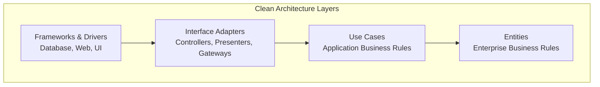
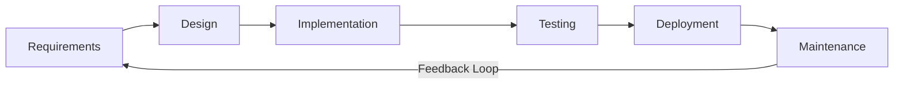
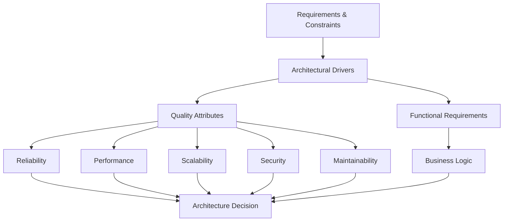
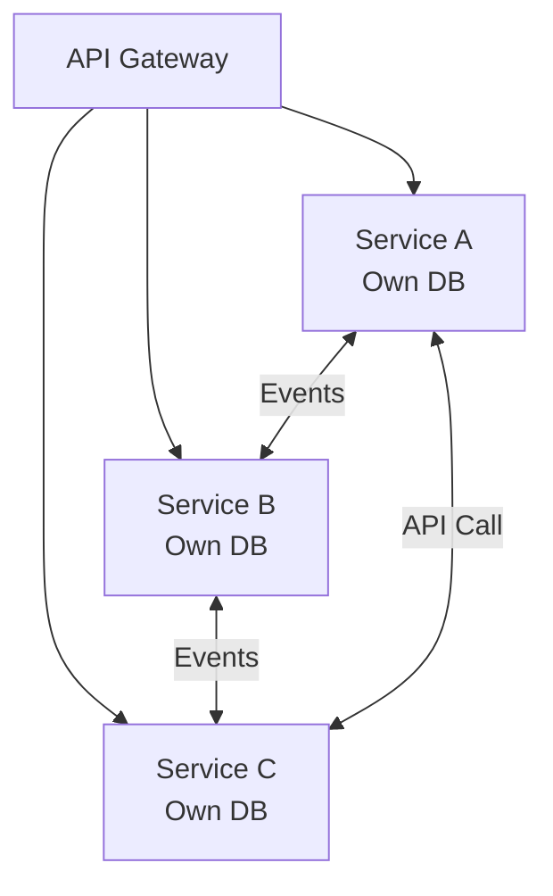
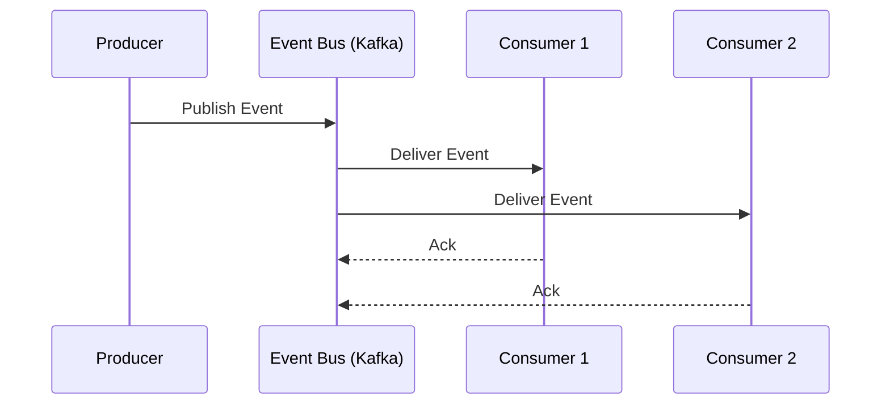
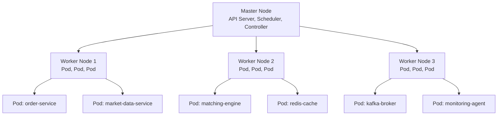
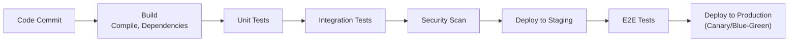
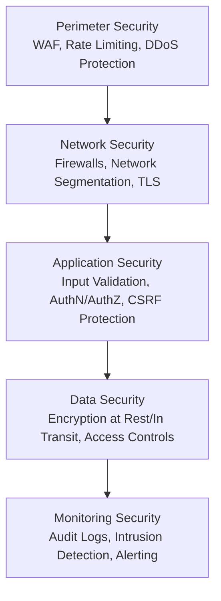
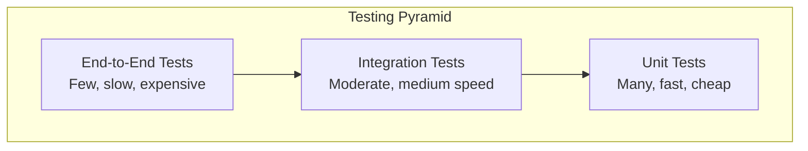
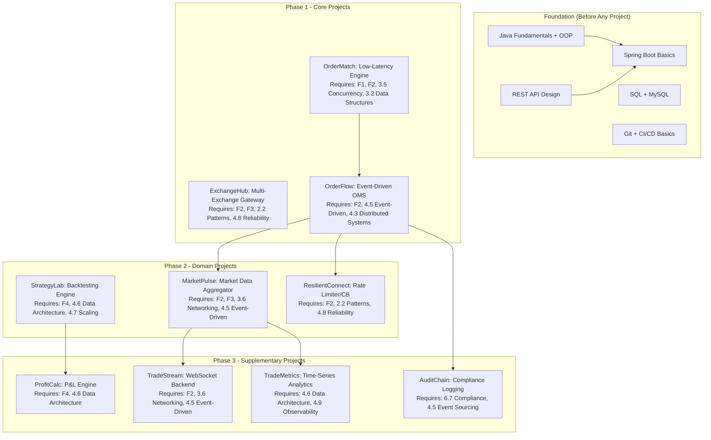

# Foundational Knowledge Synthesis for Software Engineering at Volven

## Table of Contents

1. [Prologue](#prologue)
2. [Part 1: Mindset and Philosophy](#part-1-mindset-and-philosophy)
3. [Part 2: Core Engineering Principles and Patterns](#part-2-core-engineering-principles-and-patterns)
4. [Part 3: Computational Foundations and Programming Paradigms](#part-3-computational-foundations-and-programming-paradigms)
5. [Part 4: Architecture and System Design](#part-4-architecture-and-system-design)
6. [Part 5: Infrastructure and Deployment](#part-5-infrastructure-and-deployment)
7. [Part 6: Security Across the Full Stack](#part-6-security-across-the-full-stack)
8. [Part 7: Testing Strategies](#part-7-testing-strategies)
9. [Part 8: Tooling Ecosystems](#part-8-tooling-ecosystems)
10. [Part 9: Professional and Interpersonal Dimensions](#part-9-professional-and-interpersonal-dimensions)
11. [Volven Integration](#volven-integration)
12. [Cross-Reference Index](#cross-reference-index)
13. [Consolidated Glossary](#consolidated-glossary)
14. [Bibliography](#bibliography)

---

## Prologue

This document is a breadth-first synthesis of foundational knowledge required for a junior-to-mid engineer (1-2 years of experience) before undertaking real-world projects. It spans the entire software engineering and DevSecOps lifecycle: from mindset and philosophy, through computational foundations and architecture, to infrastructure, security, testing, tooling, and professional dimensions.

The purpose is not to teach any specific technology in tutorial depth. Instead, it provides a conceptual map: enough to understand what exists, why it matters, when it applies, and where to go deeper. Each section identifies authoritative sources for further study. Where community consensus does not exist, competing perspectives are presented with attribution. Every factual claim is either source-backed or explicitly caveated as uncertain.

The document is structured for navigation. An engineer preparing for a backend role in a fintech trading company, for example, would benefit from studying Parts 3-5 in depth while maintaining working knowledge of Parts 1-2, 6-9. The Volven Integration section at the end maps this synthesis to a specific portfolio guide, providing a learning path aligned to concrete project goals.

---

## Part 1: Mindset and Philosophy

### 1.1 The Engineering Mindset

Software engineering is the application of systematic, disciplined, and quantifiable approaches to the development, operation, and maintenance of software.[^1] The distinction between "programming" and "engineering" lies in scope: engineering encompasses the entire lifecycle, including requirements analysis, design, construction, testing, deployment, maintenance, and the management of complexity at scale.

> **Key Insight**: The IEEE definition of software engineering (IEEE Standard 610.12-1990, updated in SWEBOK) establishes that engineering is fundamentally about making decisions under constraints -- time, budget, resources, reliability requirements -- rather than pursuing theoretical perfection.[^1]

The engineering mindset is characterized by:

- **Systematic problem decomposition**: Breaking complex problems into manageable components with well-defined interfaces.
- **Trade-off awareness**: Every design decision involves trade-offs. There are no universally "right" answers, only contextually appropriate ones.
- **Empiricism**: Measuring, profiling, and testing rather than assuming. What gets measured gets managed.
- **Defensive thinking**: Expecting failure. Hardware fails, networks partition, users behave unexpectedly, and dependencies introduce bugs.
- **Iterative refinement**: Building incrementally, validating at each step, and refactoring based on evidence rather than planning up front for every contingency.

> **Junior Engineer Note**: Resist the urge to build the "perfect" solution on the first attempt. Engineering is iterative. Build the simplest thing that could work, validate it against reality, and improve it based on evidence. Premature optimization -- both in code and in architecture -- is a well-documented source of wasted effort.[^2]

### 1.2 Technical Debt and Trade-off Thinking

Technical debt is a metaphor coined by Ward Cunningham in 1992 to describe the implied cost of rework caused by choosing an easy solution now instead of using a better approach that would take longer.[^3] Understanding technical debt is essential because all real-world systems accumulate it, and the skill lies in managing it deliberately rather than letting it accumulate unconsciously.

| Type | Description | Example |
|------|-------------|---------|
| Deliberate | Consciously chosen for speed, with intent to revisit | Skipping error handling to meet a deadline |
| Inadvertent | Result of lack of knowledge or experience | Using an inappropriate data structure |
| Strategic | Architectural decision to ship now, refactor later | Monolith that will be decomposed into services |

> **Trade-off Alert**: Not all technical debt is bad. Deliberate, well-understood technical debt taken on with a plan to repay it can be a valid business decision. The danger is inadvertent debt that accumulates silently. The key practice is tracking debt items as first-class work items -- not as vague aspirations.[^3]

The related concept of "code smell" (introduced by Kent Beck and popularized by Martin Fowler) identifies surface-level indicators that may signal deeper structural problems.[^4] Common code smells include duplicated logic, overly long methods, deep nesting, and god classes that assume too many responsibilities.

### 1.3 The Craft of Software

The software craft movement, articulated by Robert C. Martin and others, emphasizes that software development is a craft requiring continuous learning, attention to detail, and pride in workmanship.[^5] The Agile Manifesto's principle "Continuous attention to technical excellence and good design enhances agility" reflects this philosophy.[^6]

Key craft practices include:

- **Writing code for human readability**: Code is read far more often than it is written. Clarity is a feature.[^5]
- **Small, focused functions**: Functions should do one thing, do it well, and do it only.[^5]
- **Meaningful naming**: Names should reveal intent. The purpose of a name should be immediately apparent without requiring comments to explain it.[^5]
- **DRY (Don't Repeat Yourself)**: Every piece of knowledge should have a single, unambiguous, authoritative representation within a system.[^7]

> **Common Pitfall**: The DRY principle, as originally defined by Andy Hunt and Dave Thomas in *The Pragmatic Programmer*, refers to knowledge duplication, not code duplication.[^7] Two code snippets that look similar but represent different business concepts should NOT be merged. Premature abstraction of visually similar but semantically different code leads to fragile, hard-to-modify systems.

### 1.4 First Principles Thinking

First principles thinking involves breaking down complex problems into their fundamental truths and reasoning up from there, rather than reasoning by analogy or convention.[^8] In software engineering, this manifests as:

- Questioning why a technology is used, not just how.
- Understanding the underlying constraints of a problem before selecting a solution.
- Distinguishing between accidental complexity (inherent to the tools chosen) and essential complexity (inherent to the problem itself). Fred Brooks articulated this distinction in his seminal 1986 paper "No Silver Bullet," arguing that essential complexity cannot be eliminated, only managed.[^9]

> **Junior Engineer Note**: When encountering an unfamiliar technology or pattern, first ask "what problem does this solve?" before learning "how does this work?" Understanding the problem space provides a framework for evaluating solutions and avoids the trap of technology-driven development.

### 1.5 Ethics and Responsibility

Software engineers increasingly bear ethical responsibilities. The ACM Code of Ethics (2018) establishes that computing professionals should contribute to society, avoid harm, be honest and trustworthy, and respect privacy and intellectual property.[^10] In financial systems specifically, software bugs can cause direct monetary losses, and security vulnerabilities can expose sensitive financial data. The Volven portfolio guide's emphasis on audit trails, compliance, and data integrity reflects these ethical obligations.

---

## Part 2: Core Engineering Principles and Patterns

### 2.1 Fundamental Design Principles

#### SOLID Principles

The SOLID principles, articulated by Robert C. Martin, provide five guidelines for designing maintainable and extensible object-oriented systems.[^11][^12]

| Principle | Statement | Purpose |
|-----------|-----------|---------|
| **S**ingle Responsibility | A module should be responsible to one, and only one, actor | Reduces coupling, makes changes isolated |
| **O**pen-Closed | Software entities should be open for extension, closed for modification | Enables adding functionality without changing existing code |
| **L**iskov Substitution | Subtypes must be substitutable for their base types | Ensures inheritance hierarchies are correct |
| **I**nterface Segregation | Clients should not depend on methods they do not use | Prevents bloated, forced dependencies |
| **D**ependency Inversion | High-level modules should not depend on low-level modules; both should depend on abstractions | Decouples implementation details from business logic |

```java
// DIP example: high-level policy depends on abstraction, not concrete implementation
interface OrderRepository {
    void save(Order order);
    Optional<Order> findById(String id);
}

// Low-level detail implements the abstraction
class JdbcOrderRepository implements OrderRepository {
    @Override
    public void save(Order order) { /* JDBC implementation */ }
    @Override
    public Optional<Order> findById(String id) { /* JDBC implementation */ }
}

// High-level policy depends only on the abstraction
class OrderService {
    private final OrderRepository repository;
    OrderService(OrderRepository repository) {
        this.repository = repository;
    }
    void processOrder(String orderId) {
        Order order = repository.findById(orderId)
            .orElseThrow(() -> new OrderNotFoundException(orderId));
        // business logic
        repository.save(order);
    }
}
```

> **Key Insight**: SOLID principles are most valuable at the component and service boundaries, not at the level of individual lines of code. Over-applying them within a small, cohesive module can introduce unnecessary abstraction and indirection. The goal is to reduce the cost of change at the right granularity.[^12]

#### The Dependency Rule

Clean Architecture establishes the Dependency Rule: source code dependencies can only point inward, toward higher-level policies.[^12] Nothing in an inner circle can know anything about something in an outer circle. This rule produces systems that are:

1. Independent of frameworks
2. Testable (business rules testable without UI or database)
3. Independent of UI, database, and external agencies



#### KISS and YAGNI

- **KISS** (Keep It Simple, Stupid): Simpler solutions are easier to understand, maintain, and debug. Complexity should be introduced only when there is a demonstrated need.[^7]
- **YAGNI** (You Aren't Gonna Need It): Don't build functionality until it is actually required. Premature generalization is a common source of unnecessary complexity.[^7]

> **Trade-off Alert**: KISS and YAGNI exist in tension with forward-looking design. Building a system that is too simple may require painful refactoring later. The judgment lies in identifying which complexity is essential (inherent to the problem) versus accidental (introduced by the solution). Brooks' distinction is the guide.[^9]

### 2.2 Design Patterns

Design patterns, systematized by the Gang of Four (Gamma, Helm, Johnson, Vlissides) in 1994, are reusable solutions to commonly occurring problems in software design.[^13]

| Category | Patterns | When to Apply |
|----------|----------|---------------|
| Creational | Factory Method, Abstract Factory, Builder, Singleton, Prototype | Object creation needs flexibility or control |
| Structural | Adapter, Bridge, Composite, Decorator, Facade, Proxy | Object composition and interface adaptation |
| Behavioral | Strategy, Observer, Command, State, Template Method, Iterator | Object communication and responsibility assignment |

Several patterns are particularly relevant to backend engineering:

- **Strategy Pattern**: Defines a family of algorithms, encapsulates each one, and makes them interchangeable. Essential for trading systems where execution strategies vary.
- **Observer Pattern**: Defines a one-to-many dependency so that when one object changes state, all dependents are notified. Foundation of event-driven systems.
- **Circuit Breaker Pattern**: Monitors failures and automatically trips to prevent cascading failures. Popularized by Michael Nygard in *Release It!*.[^14]
- **Repository Pattern**: Mediates between domain and data mapping layers, acting as an in-memory collection of domain objects.[^15]

> **Junior Engineer Note**: Design patterns are vocabulary, not prescriptive solutions. Knowing the name and structure of common patterns helps you communicate with other engineers and recognize recurring structures in existing code. Do not force patterns where simpler code suffices.

### 2.3 API Design Principles

REST (Representational State Transfer), defined by Roy Fielding in his 2000 doctoral dissertation, is an architectural style for networked applications.[^16] Core REST constraints include:

- **Client-server separation**: Separation of concerns between UI and data storage.
- **Statelessness**: Each request contains all information needed to process it.
- **Cacheability**: Responses must define themselves as cacheable or not.
- **Uniform interface**: Standardized resource identification (URIs) and manipulation through representations.
- **Layered system**: Intermediaries (load balancers, proxies) can be inserted transparently.

| API Style | Protocol | Use Case | Trade-offs |
|-----------|----------|----------|------------|
| REST | HTTP/JSON | General-purpose CRUD, public APIs | Simple, widely understood; can be inefficient for complex queries |
| gRPC | HTTP/2 + Protobuf | Internal service-to-service, high performance | Binary, efficient, strongly typed; less tooling for public consumption |
| GraphQL | HTTP/JSON | Flexible client-driven queries | Client controls response shape; complexity in server-side resolvers |
| WebSocket | TCP | Real-time bidirectional communication | Persistent connections; state management complexity |

> **Key Insight**: API design is contract design. A well-designed API is versioned, documented, and backward-compatible. Breaking changes in APIs cause cascading failures across dependent systems. Tools like OpenAPI (formerly Swagger) formalize REST API contracts, while Protocol Buffers serve the same role for gRPC.[^16]

### 2.4 The Software Development Lifecycle

The SDLC encompasses the phases through which software evolves from concept to deployment and maintenance. Modern practice has evolved from sequential (Waterfall) to iterative and continuous approaches.



Key methodologies:

| Methodology | Characteristics | Best For |
|-------------|----------------|----------|
| Waterfall | Sequential phases, heavy documentation | Regulated industries, fixed requirements |
| Agile (Scrum) | Iterative sprints, working software, team collaboration | Evolving requirements, product development |
| Kanban | Continuous flow, WIP limits, visual boards | Operations, maintenance, support |
| DevOps | Integrated development and operations, CI/CD, automation | Continuous delivery, cloud-native systems |

The Agile Manifesto (2001) established four values: individuals and interactions over processes and tools; working software over comprehensive documentation; customer collaboration over contract negotiation; responding to change over following a plan.[^6] These values remain foundational, though the specific practices (Scrum, Kanban, SAFe) continue to evolve.

### 2.5 Code Quality and Maintainability

Martin Fowler's definition of good software design is simple: a system is well-designed if it can be changed easily.[^4] Maintainability depends on:

- **Cohesion**: The degree to which elements within a module belong together. High cohesion means a module does one thing well.
- **Coupling**: The degree of interdependence between modules. Low coupling means changes in one module have minimal impact on others.
- **Readability**: Code that can be understood by others (and by yourself in six months).
- **Testability**: The ease with which automated tests can be written and executed.

> **Common Pitfall**: The "Big Ball of Antipattern" (described by Eric Evans in Domain-Driven Design) occurs when the structure of the code does not reflect the structure of the domain.[^16] When adding a simple feature requires changes across many unrelated parts of the codebase, the system has lost its maintainability.

---

## Part 3: Computational Foundations and Programming Paradigms

### 3.1 Computational Complexity

Understanding computational complexity allows engineers to predict how algorithms perform as input sizes grow, which is essential for building systems that scale.

| Complexity Class | Growth Rate | Example | Practical Implication |
|------------------|-------------|---------|----------------------|
| O(1) | Constant | Hash table lookup | Performance independent of input size |
| O(log n) | Logarithmic | Binary search | Very efficient; doubles work for 2x input |
| O(n) | Linear | Array scan | Scales proportionally with input |
| O(n log n) | Linearithmic | Merge sort | Efficient sorting; typical for comparison sorts |
| O(n^2) | Quadratic | Nested loop | Becomes impractical at large n |
| O(2^n) | Exponential | Brute-force subsets | Only feasible for very small inputs |

Big-O notation describes the upper bound of an algorithm's time or space complexity as input size grows. It ignores constant factors and lower-order terms, focusing on the dominant growth term.[^17]

> **Junior Engineer Note**: For most application-level backend work, choosing the right data structure matters more than micro-optimizing algorithms. A well-chosen HashMap lookup (O(1)) versus a list scan (O(n)) can mean orders-of-magnitude difference in performance. Know your standard library's data structure complexities.

### 3.2 Data Structures and Algorithms

The choice of data structure directly impacts performance characteristics.

| Data Structure | Access | Search | Insert | Delete | Use Case |
|----------------|--------|--------|--------|--------|----------|
| Array | O(1) | O(n) | O(n) | O(n) | Ordered collection, index-based access |
| Linked List | O(n) | O(n) | O(1) | O(1) | Frequent insert/delete at head |
| Hash Map | O(1) avg | O(1) avg | O(1) avg | O(1) avg | Key-value lookup, deduplication |
| Binary Search Tree | O(log n) | O(log n) | O(log n) | O(log n) | Ordered data with efficient range queries |
| Heap | N/A | O(n) | O(log n) | O(log n) | Priority queues, scheduling |
| Queue (Ring Buffer) | N/A | O(n) | O(1) | O(1) | FIFO processing, streaming data |

Algorithm paradigms:

- **Divide and Conquer**: Split problem into subproblems, solve independently, combine results (e.g., merge sort, quicksort).
- **Dynamic Programming**: Solve overlapping subproblems by storing results (e.g., shortest path algorithms, knapsack problem).
- **Greedy Algorithms**: Make locally optimal choices at each step (e.g., Dijkstra's shortest path for non-negative weights).
- **Graph Algorithms**: BFS/DFS for traversal, Dijkstra/A* for shortest path, topological sort for dependency ordering.

> **Key Insight**: In production backend systems, the most impactful algorithmic decision is often at the data access layer: indexing strategy in databases, caching strategy, and batching strategy. These decisions affect O(n) operations on millions of records.

### 3.3 Programming Paradigms

| Paradigm | Core Idea | Languages | When Relevant |
|----------|-----------|-----------|---------------|
| Imperative | Step-by-step instructions | C, Go, C++ | Low-level systems, performance-critical code |
| Object-Oriented | Objects encapsulating state and behavior | Java, C#, Python | Enterprise applications, domain modeling |
| Functional | Pure functions, immutability, composition | Haskell, Scala, Erlang | Concurrency, data transformation pipelines |
| Reactive | Asynchronous data streams and propagation | RxJava, Project Reactor | Real-time systems, event processing |
| Concurrent/Actor | Independent actors communicating via messages | Erlang, Akka, Elixir | Distributed systems, fault-tolerant services |

Java, the primary language for Volven's backend, supports multiple paradigms. Modern Java (17+) incorporates functional programming (lambdas, streams), reactive programming (via Project Reactor or RxJava), and virtual threads (Project Loom) for lightweight concurrency.

> **Trade-off Alert**: Functional programming's emphasis on immutability eliminates many concurrency bugs but can introduce performance overhead from object creation. The practical approach in Java is to use functional style for data transformation pipelines while using mutable state in performance-critical paths with explicit synchronization.

### 3.4 Memory Management

Memory management directly impacts application performance and reliability.

**Manual vs. Automatic Management:**

| Approach | Languages | Pros | Cons |
|----------|-----------|------|------|
| Manual (malloc/free) | C, C++ | Predictable performance, fine-grained control | Memory leaks, use-after-free, dangling pointers |
| Reference Counting | Python, Swift | Deterministic for cycles-free graphs | Cannot handle reference cycles |
| Tracing GC | Java, Go, C# | Automatic, handles cycles | GC pauses, less predictable latency |

In Java specifically, the garbage collector (GC) is a critical performance factor. Modern JVM GCs include:

- **G1 GC** (default since Java 9): Balanced throughput and latency, suitable for most workloads.
- **ZGC**: Ultra-low latency (< 10ms pauses), suitable for latency-sensitive applications.
- **Shenandoah**: Low-pause concurrent collector.

> **Key Insight for Trading Systems**: In latency-sensitive applications like trading engines, GC pauses can cause missed trades or stale data. Techniques include: pre-allocating objects, using off-heap memory (Chronicle Map), avoiding allocations on hot paths, and selecting an appropriate GC algorithm. Understanding the JVM memory model is essential for backend engineers at Volven.

### 3.5 Concurrency and Parallelism

Concurrency (dealing with multiple things at once) and parallelism (doing multiple things at once) are distinct but related concepts.[^18]

**Concurrency Models:**

| Model | Implementation | Strengths | Weaknesses |
|-------|---------------|-----------|------------|
| Threads | OS threads, Java threads | Simple mental model | Expensive per thread (~1MB stack), context switching overhead |
| Virtual Threads | Java Loom, Kotlin coroutines | Lightweight (KB per thread), massive concurrency | Still evolving, not all libraries support |
| Event Loop | Node.js, Netty | High throughput for I/O-bound work | Complex callback logic, single-threaded CPU-bound bottleneck |
| Actor Model | Akka, Erlang/OTP | Fault tolerance, distribution | Steeper learning curve, message ordering complexity |

Java's Project Loom (virtual threads, stable since Java 21) represents a significant shift: it combines the simplicity of blocking code with the scalability of event-driven architectures.[^19] Virtual threads are managed by the JVM, not the OS, enabling millions of concurrent threads.

> **Common Pitfall**: Confusing concurrency with parallelism leads to incorrect assumptions about performance. Concurrent code may run on a single core (interleaving execution). Parallel code requires multiple cores. The number of concurrent tasks that can run in parallel is bounded by the number of available CPU cores.

**Synchronization Primitives:**

- **Mutex/Lock**: Ensures mutual exclusion for shared resources. Simple but can cause contention.
- **Semaphore**: Controls access to a pool of resources.
- **Read-Write Lock**: Allows concurrent reads but exclusive writes.
- **Atomic Operations**: Hardware-supported indivisible operations (compare-and-swap). Foundation of lock-free data structures.
- **Lock-Free Data Structures**: Structures that allow concurrent access without locks, using atomic operations. Example: `ConcurrentHashMap` in Java.

### 3.6 Networking Fundamentals

Every backend engineer must understand networking concepts:

**The OSI and TCP/IP Models:**

| Layer | OSI Name | TCP/IP Equivalent | Concern |
|-------|----------|-------------------|---------|
| 7/5 | Application | Application | HTTP, WebSocket, gRPC protocols |
| 6/4 | Transport | Transport | TCP (reliable), UDP (fast, unreliable) |
| 5/3 | Network | Internet | IP routing, DNS |
| 4-1 | Data Link/Physical | Network Access | Ethernet, WiFi |

**Key Concepts:**

- **TCP vs UDP**: TCP provides reliable, ordered delivery (HTTP, database connections). UDP provides fast, best-effort delivery (DNS lookups, streaming, real-time gaming).
- **HTTP/1.1 vs HTTP/2 vs HTTP/3**: HTTP/2 introduced multiplexing (multiple streams over one connection), header compression, and server push. HTTP/3 replaces TCP with QUIC for improved latency.
- **WebSocket**: Persistent, full-duplex communication over a single TCP connection. Essential for real-time trading data.[^20]
- **DNS**: Domain Name System resolution, including caching layers (browser, OS, recursive resolver, authoritative).
- **TLS/SSL**: Transport Layer Security for encrypted communication. TLS 1.3 is the current standard, reducing handshake latency.

> **Key Insight for Trading Systems**: Network latency is a physical constraint. The speed of light in fiber optics limits minimum latency between two points (~5 microseconds per kilometer). Co-location (placing servers at the same facility as exchange servers) minimizes this latency. Volven's claim of 0.1ms latency implies co-located bare-metal infrastructure.[^21]

---

## Part 4: Architecture and System Design

### 4.1 Architectural Thinking

Architecture is the set of decisions you wish you could get right early, because they are so expensive to change later.[^22] Martin Fowler distinguishes architecture from design: architecture encompasses the decisions that are hard to reverse, while design encompasses decisions that are relatively easy to change.



The Architecture Decision Record (ADR) pattern captures architectural decisions with context, rationale, and consequences, providing traceability for future engineers.

### 4.2 Monolithic Architecture

A monolithic architecture deploys the entire application as a single unit.[^23]

| Aspect | Characteristics |
|--------|----------------|
| Deployment | Single artifact, single process |
| Communication | In-process function calls (fast, reliable) |
| Data | Shared database |
| Scaling | Vertical (bigger machine), limited horizontal |
| Team Structure | Small team, tight communication |

Monoliths are not inherently bad. For small teams and well-understood domains, they offer simplicity, ease of deployment, and efficient in-process communication. The key issue arises when monoliths grow beyond the capacity of a team to reason about them, or when different components require independent scaling or deployment.

> **Key Insight**: Martin Fowler's First Law of Distributed Systems states: "Don't distribute your application until you have to."[^23] Premature distribution introduces network partitions, data consistency challenges, and operational complexity that may far exceed the benefits.

### 4.3 Distributed Systems Fundamentals

Distributed systems are systems whose components are located on different networked computers, which communicate and coordinate their actions by passing messages.[^24]

**Fundamental Challenges (from Martin Kleppmann's DDIA):**[^24]

1. **Networks are unreliable**: Messages can be lost, delayed, duplicated, or reordered. There is no way to distinguish a slow server from a dead one.
2. **Clocks are unreliable**: Different machines have different clocks, and clock drift can cause incorrect ordering of events.
3. **Processes can pause**: A process can be paused by the OS (GC pause, scheduling) and resume later, unaware that time has passed.
4. **Nothing is instantaneous**: Every operation takes time, and the delay is variable.

**Consistency Models:**

| Model | Guarantee | Trade-off |
|-------|-----------|-----------|
| Strong (Linearizable) | All operations appear atomic in a single global order | Higher latency, lower availability |
| Sequential | Operations appear in some consistent order (not necessarily real-time) | Weaker than linearizable but more available |
| Causal | Causally related operations are seen in order | Preserves causal ordering without global coordination |
| Eventual | If no new updates, all replicas converge to the same value | Most available, least consistent |

> **Trade-off Alert**: The CAP theorem (Brewer, 2000) states that a distributed data store can provide at most two of three guarantees: Consistency, Availability, and Partition tolerance.[^25] In practice, network partitions are inevitable, so the real choice is between consistency and availability during a partition (CP vs AP systems). Kleppmann argues that CAP is too simplistic and that linearizability is the more useful concept to reason about.[^24]

### 4.4 Microservices Architecture

Microservices decompose an application into small, independently deployable services, each owning its data and business logic.[^26]



| Aspect | Monolith | Microservices |
|--------|----------|---------------|
| Deployment | All-or-nothing | Independent per service |
| Scaling | Vertical + limited horizontal | Fine-grained horizontal |
| Data | Shared database | Database per service |
| Technology | Uniform stack | Polyglot (each service can use different stack) |
| Team Structure | Cross-cutting | Team-per-service |
| Complexity | Code complexity | Operational complexity |
| Failure Isolation | One failure can cascade | Failure contained to service |

Chris Richardson's *Microservices Patterns* catalogs proven patterns for decomposition, communication, data management, and deployment.[^26] Key patterns include:

- **Service Decomposition**: Break by business capability, subdomain, or data ownership.
- **API Gateway**: Single entry point, routing, cross-cutting concerns.
- **Service Mesh**: Infrastructure layer for service-to-service communication (e.g., Istio, Linkerd).
- **Saga Pattern**: Manages distributed transactions across services.
- **Strangler Fig Pattern**: Incrementally replaces parts of a monolith.

> **Common Pitfall**: Microservices are not a default choice. They are appropriate when the benefits of independent deployment, scaling, and technology diversity outweigh the significant operational overhead. Sam Newman, author of *Building Microservices*, advises starting with a monolith and extracting services when clear boundaries emerge.[^27]

### 4.5 Event-Driven Architecture

Event-Driven Architecture (EDA) uses events -- immutable facts about something that happened -- as the primary mechanism for communication between components.[^28]

| Pattern | Description | Use Case |
|---------|-------------|----------|
| Event Notification | Service emits event, consumers react independently | Decoupled side effects (email, logging) |
| Event-Carried State Transfer | Event carries full state, no callback needed | Consumer doesn't need to call back to producer |
| Event Sourcing | State derived from sequence of events | Audit trail, temporal queries, undo |
| CQRS | Separate read and write models | Complex queries against high-write systems |



**Event Sourcing** stores all state changes as an immutable sequence of events rather than overwriting current state.[^28] The current state can be reconstructed by replaying events. This pattern is particularly valuable in financial systems where every change must be auditable.

> **Key Insight**: Event sourcing and CQRS are powerful but complex. They are justified when the domain naturally benefits from event history (audit trails, temporal queries, debugging) or when read and write patterns are fundamentally different. For simple CRUD applications, they add unnecessary complexity.

### 4.6 Data Architecture

The choice of database and data architecture is among the most impactful architectural decisions.

**Database Taxonomy:**

| Category | Examples | Use Case | CAP Orientation |
|----------|----------|----------|-----------------|
| Relational (SQL) | PostgreSQL, MySQL, Oracle | Structured data, ACID transactions, complex queries | CP (typically) |
| Document | MongoDB, CouchDB | Semi-structured data, flexible schemas | Varies |
| Key-Value | Redis, DynamoDB | High-throughput lookups, caching | AP (DynamoDB), CP (Redis cluster) |
| Column-Family | Cassandra, HBase | Wide-column storage, high write throughput | AP |
| Time-Series | InfluxDB, TimescaleDB | Metrics, IoT data, time-stamped data | Varies |
| Graph | Neo4j, ArangoDB | Highly connected data, relationship queries | CP |
| Search | Elasticsearch, Solr | Full-text search, log analysis | Varies |

> **Key Insight from DDIA**: The boundaries between database categories have blurred. Redis (a key-value store) is used as a message queue. Kafka (a message queue) provides database-grade durability. The question is not "which category" but "which trade-offs match my access patterns?"[^24]

**Data Modeling Principles:**

- **Normalization**: Eliminates redundancy, ensures consistency. Appropriate for OLTP workloads.
- **Denormalization**: Duplicates data for read performance. Appropriate for read-heavy workloads.
- **Polyglot Persistence**: Using different databases for different data access patterns within the same system.
- **Schema Evolution**: Designing for forward and backward compatibility as data structures change over time.

### 4.7 Scaling and Performance

**Scaling Strategies:**

| Strategy | Approach | When to Use |
|----------|----------|-------------|
| Vertical (Scale Up) | Bigger machine (more CPU, RAM, disk) | Simple, no code changes needed; limited by hardware ceiling |
| Horizontal (Scale Out) | More machines | Beyond single-machine limits; requires stateless design or data partitioning |
| Read Replicas | Distribute read load | Read-heavy workloads; eventual consistency acceptable for reads |
| Sharding | Partition data across machines | Data too large for single machine; high write throughput |
| Caching | Store frequently accessed data closer to consumer | Repeated reads of same data; cache invalidation strategy needed |

**Performance Principles:**

- **Measure first**: Profile before optimizing. Premature optimization wastes effort on non-bottlenecks.
- **Percentile metrics**: Use p50, p95, p99 instead of averages. Amazon specifies services at the 99.9th percentile because the slowest requests hit the most valuable customers.[^24]
- **Amdahl's Law**: The maximum speedup of a program using multiple processors is limited by the sequential fraction of the program. Identify and optimize the sequential bottleneck.
- **Latency vs. Throughput**: These often trade off. Batching improves throughput but increases per-request latency. Pipelining improves throughput without latency increase in many scenarios.

**Caching Patterns:**

| Pattern | Description | Use Case |
|---------|-------------|----------|
| Cache-Aside | Application checks cache, falls back to DB, populates cache | General purpose |
| Write-Through | Writes go to cache and DB simultaneously | Consistency-critical data |
| Write-Behind | Writes go to cache, async to DB | Write-heavy, eventual consistency |
| Read-Through | Cache transparently loads from DB on miss | Simplified application code |

> **Common Pitfall**: Cache invalidation is famously difficult. Phil Karlton's quote "There are only two hard things in Computer Science: cache invalidation and naming things" reflects this reality. A robust cache invalidation strategy (TTL, event-driven invalidation, version tagging) is essential for correctness.

### 4.8 Reliability Engineering

Site Reliability Engineering (SRE), as practiced at Google, applies software engineering principles to infrastructure and operations problems.[^29]

**Key SRE Concepts:**[^29][^30]

- **SLI (Service Level Indicator)**: A quantitative measure of a specific aspect of service behavior. Example: the fraction of HTTP requests returning 2xx within 300ms.
- **SLO (Service Level Objective)**: A target value for an SLI over a defined time window. Example: 99.9% of requests succeed over a rolling 28-day window.
- **SLA (Service Level Agreement)**: A contract with users that includes consequences (financial penalties) if the SLO is missed.
- **Error Budget**: `1 - SLO`. A 99.9% SLO gives a 0.1% error budget. The budget is spent on deploys, experiments, and feature launches. When exhausted, releases freeze until reliability improves.

| Availability | Downtime/Year | Downtime/Month | Use Case |
|--------------|---------------|----------------|----------|
| 99% (2 nines) | 3.65 days | 7.3 hours | Internal tools, development |
| 99.9% (3 nines) | 8.76 hours | 43.8 minutes | Most production services |
| 99.95% | 4.38 hours | 21.9 minutes | Critical services |
| 99.99% (4 nines) | 52.6 minutes | 4.38 minutes | Financial, healthcare |
| 99.999% (5 nines) | 5.26 minutes | 26.3 seconds | Telecom, mission-critical |

**Reliability Patterns:**

| Pattern | Description | Benefit |
|---------|-------------|---------|
| Redundancy | Multiple instances of critical components | Survives component failure |
| Replication | Data copied across nodes | Survives data loss |
| Failover | Automatic switch to backup on failure | Minimizes downtime |
| Health Checks | Periodic verification of component health | Early failure detection |
| Circuit Breaker | Stop calling failing service | Prevents cascading failures |
| Bulkhead | Isolate failures to prevent spread | Limits blast radius |
| Retry with Backoff | Retry failed requests with increasing delays | Handles transient failures |

> **Key Insight**: Google's SRE principle states that "100% reliability is the wrong target." Each additional nine of reliability costs exponentially more and yields diminishing user-perceived benefit. The right reliability target is the minimum that satisfies user expectations and business requirements.[^30]

### 4.9 Observability

Observability is the ability to understand the internal state of a system from its external outputs.[^31] The three pillars of observability are:

| Pillar | What It Captures | Tools | Example |
|--------|------------------|-------|---------|
| Logs | Discrete events with context | ELK Stack, Loki, Fluentd | Request trace, error message |
| Metrics | Aggregated numerical measurements over time | Prometheus, Datadog, InfluxDB | Request rate, error rate, latency histogram |
| Traces | End-to-end request path through distributed systems | Jaeger, Zipkin, OpenTelemetry | Full lifecycle of a request across services |

**The Three Signals (Google SRE):**

- **RED method** (for services): Rate, Errors, Duration of requests.
- **USE method** (for resources): Utilization, Saturation, Errors of resources (CPU, memory, disk, network).

> **Common Pitfall**: Monitoring is not the same as observability. Monitoring tells you something is wrong; observability helps you understand why. A system with only basic uptime monitoring has monitoring but poor observability. A system with structured logging, distributed tracing, and rich metrics has observability.

---

## Part 5: Infrastructure and Deployment

### 5.1 Cloud Computing

Cloud computing provides on-demand computing resources over the internet, characterized by elastic scaling, pay-per-use pricing, and global distribution.[^32]

| Service Model | Provider Manages | User Manages | Examples |
|---------------|------------------|--------------|----------|
| IaaS | Hardware, networking, virtualization | OS, runtime, app, data | AWS EC2, GCP Compute Engine, Azure VMs |
| PaaS | Hardware through runtime | App, data | Heroku, Google App Engine, AWS Elastic Beanstalk |
| SaaS | Everything | Nothing (end-user) | Gmail, Salesforce, Slack |
| Serverless | Hardware through function runtime | Function code | AWS Lambda, Azure Functions, Google Cloud Functions |

**Cloud Deployment Models:**

- **Public Cloud**: Resources shared across organizations (AWS, GCP, Azure). Cost-effective, scalable, but less control.
- **Private Cloud**: Dedicated infrastructure for one organization. More control, higher cost.
- **Hybrid Cloud**: Mix of public and private, connected by networking. Balances cost and control.
- **Multi-Cloud**: Using multiple cloud providers. Avoids vendor lock-in but increases complexity.

> **Key Insight**: For trading systems with ultra-low latency requirements, public cloud may not meet latency SLAs. Volven's claim of 0.1ms latency strongly implies co-located bare-metal infrastructure, not cloud-based deployment.[^21]

### 5.2 Containerization

Containers package application code with its dependencies, ensuring consistent behavior across environments.[^33]

| Aspect | Virtual Machines | Containers |
|--------|-----------------|------------|
| Isolation Level | Full OS per VM | Process-level (shared kernel) |
| Startup Time | Minutes | Seconds |
| Size | GBs | MBs |
| Density | ~10s per host | ~100s per host |
| Use Case | Legacy apps, full OS needed | Microservices, CI/CD, development |

Docker is the dominant container runtime.[^33] A Dockerfile defines the container image:

```dockerfile
FROM eclipse-temurin:21-jdk-jammy
WORKDIR /app
COPY target/order-engine.jar app.jar
EXPOSE 8080
ENTRYPOINT ["java", "-jar", "app.jar"]
```

**Container Best Practices:**

- Use minimal base images to reduce attack surface.
- Run as non-root user inside the container.
- Use multi-stage builds to separate build-time and runtime dependencies.
- Never store secrets in container images.
- Use health check endpoints (e.g., `/health`).

### 5.3 Container Orchestration

Kubernetes (K8s) is the de facto standard for container orchestration, originally developed by Google.[^34]



**Core Kubernetes Concepts:**

| Concept | Description |
|---------|-------------|
| Pod | Smallest deployable unit; one or more containers |
| Deployment | Manages replica sets and rolling updates |
| Service | Stable network endpoint for a set of pods |
| Ingress | HTTP routing and TLS termination |
| ConfigMap / Secret | Externalized configuration and sensitive data |
| PersistentVolume | Durable storage for stateful workloads |
| HorizontalPodAutoscaler | Automatic scaling based on metrics |

> **Trade-off Alert**: Kubernetes provides powerful orchestration capabilities but introduces significant operational complexity. For small teams, managed Kubernetes services (EKS, GKE, AKS) or simpler alternatives (Docker Compose, AWS ECS) may be more appropriate. The "Thinnest Viable Platform" concept from Team Topologies encourages using just enough infrastructure tooling.[^35]

### 5.4 Continuous Integration and Continuous Deployment

CI/CD automates the path from code change to production deployment.[^36]



**CI/CD Pipeline Stages:**

| Stage | Purpose | Tools |
|-------|---------|-------|
| Source | Version control, branching strategy | Git, GitHub, GitLab |
| Build | Compile, resolve dependencies, package | Maven, Gradle, npm, Docker |
| Test | Automated testing at multiple levels | JUnit, pytest, Selenium |
| Security Scan | SAST, DAST, dependency scanning | SonarQube, Snyk, OWASP ZAP |
| Deploy | Push artifacts to target environment | Jenkins, GitHub Actions, ArgoCD |
| Monitor | Post-deployment verification | Prometheus, New Relic, Datadog |

**Deployment Strategies:**

| Strategy | Description | Risk | Rollback Speed |
|----------|-------------|------|----------------|
| Rolling Update | Gradually replaces old instances | Medium | Slow |
| Blue-Green | Two identical environments, switch traffic | Low | Instant |
| Canary | Routes small percentage of traffic to new version | Low | Fast |
| Feature Flags | Code deployed but activated by configuration | Lowest | Instant (toggle off) |

> **Key Insight**: The goal of CI/CD is not speed for its own sake, but fast feedback. A pipeline that provides clear, actionable feedback within minutes of a commit enables engineers to fix issues while context is fresh. Build times exceeding 10 minutes start to degrade developer productivity.[^36]

### 5.5 Infrastructure as Code

Infrastructure as Code (IaC) manages and provisions infrastructure through machine-readable definition files rather than manual processes.[^37]

| Tool | Approach | Use Case |
|------|----------|----------|
| Terraform | Declarative, multi-cloud | Cloud infrastructure provisioning |
| Pulumi | Programmatic (Python, TypeScript) | Complex logic in infrastructure |
| Ansible | Procedural, agentless | Configuration management |
| CloudFormation | AWS-native declarative | AWS-only environments |
| Helm | Kubernetes package management | Kubernetes application deployment |

IaC principles:

- **Version Control**: All infrastructure definitions stored in Git.
- **Reproducibility**: Same configuration produces identical environments.
- **Idempotency**: Applying the same configuration multiple times produces the same result.
- **Modularity**: Reusable modules for common patterns.
- **Testing**: Infrastructure tests (e.g., Terratest, Checkov) validate definitions before deployment.

### 5.6 DevOps Culture and Site Reliability Engineering

DevOps is a cultural and professional movement that emphasizes collaboration between development and operations, automation, and continuous improvement.[^38]

**DevOps Principles (CALMS Framework):**

| Principle | Description |
|-----------|-------------|
| **C**ulture | Shared responsibility, blameless postmortems, psychological safety |
| **A**utomation | Automate repetitive tasks, CI/CD, infrastructure provisioning |
| **L**ean | Minimize waste, optimize flow, value stream mapping |
| **M**easurement | Measure everything, data-driven decisions |
| **S**haring | Knowledge sharing, cross-team collaboration |

**DORA Metrics (DevOps Research and Assessment):**

| Metric | Description | Elite Performance |
|--------|-------------|-------------------|
| Deployment Frequency | How often code is deployed | Multiple times per day |
| Lead Time for Changes | Time from commit to production | Less than one hour |
| Time to Restore Service | Time to recover from failure | Less than one hour |
| Change Failure Rate | Percentage of deployments causing failure | 0-15% |

> **Key Insight**: Google's 20 years of SRE experience distilled into 11 lessons, including: canary all changes, have a "Big Red Button" for rollbacks, automation over manual processes, and structured, data-driven decision-making.[^30]

### 5.7 Platform Engineering

Platform Engineering is the discipline of building and maintaining internal developer platforms that reduce cognitive load for stream-aligned teams.[^35]

The Platform team provides self-service capabilities (databases, CI/CD, monitoring, deployment) so product teams can focus on business value. The Thinnest Viable Platform (TVP) concept advocates building only what is needed -- even if the "platform" is initially just documentation about which cloud services to use.[^35]

> **Key Insight from Team Topologies**: Platform teams should treat their platform as a product, with developer experience as the primary success metric. Net Promoter Score (NPS) from internal developer teams is a valid measurement approach.[^35]

---

## Part 6: Security Across the Full Stack

### 6.1 Threat Modeling

Threat modeling is the practice of systematically identifying, evaluating, and addressing security threats to a system.[^39]

**STRIDE Model:**

| Threat | Description | Example |
|--------|-------------|---------|
| **S**poofing | Impersonating someone or something | Forged authentication tokens |
| **T**ampering | Modifying data or code | SQL injection modifying database records |
| **R**epudiation | Denying actions | User denies placing a trade |
| **I**nformation Disclosure | Exposing data to unauthorized parties | Leaking API keys in logs |
| **D**enial of Service | Making service unavailable | Flooding exchange API with requests |
| **E**levation of Privilege | Gaining unauthorized access levels | Exploiting JWT to access admin endpoints |

> **Key Insight**: Threat modeling should happen early in the design phase, not after implementation. OWASP's "Insecure Design" category (A04:2021) specifically calls out the need for threat modeling and secure design patterns.[^39]

### 6.2 Application Security

The OWASP Top 10 (2021) represents the most critical web application security risks:[^39]

| Rank | Category | Description |
|------|----------|-------------|
| A01 | Broken Access Control | Unauthorized action execution |
| A02 | Cryptographic Failures | Weak or missing encryption |
| A03 | Injection | SQL, NoSQL, OS command injection |
| A04 | Insecure Design | Missing security controls in design |
| A05 | Security Misconfiguration | Default configs, unnecessary features |
| A06 | Vulnerable Components | Using libraries with known vulnerabilities |
| A07 | Authentication Failures | Weak authentication mechanisms |
| A08 | Data Integrity Failures | Untrusted deserialization, unsigned updates |
| A09 | Logging Failures | Insufficient logging and monitoring |
| A10 | SSRF | Server-Side Request Forgery |

**Defense in Depth:** Apply multiple layers of security controls so that if one layer fails, others still protect the system.



### 6.3 Authentication and Authorization

| Concept | Definition | Implementation |
|---------|------------|----------------|
| Authentication (AuthN) | Verifying identity | Passwords, MFA, OAuth2, SAML, certificates |
| Authorization (AuthZ) | Verifying permissions | RBAC, ABAC, OAuth2 scopes, policy engines |

**OAuth 2.0 Flows:**

| Flow | Use Case | Token Type |
|------|----------|------------|
| Authorization Code | Server-side web apps | Access + Refresh tokens |
| Authorization Code + PKCE | SPA, mobile apps | Access + Refresh tokens |
| Client Credentials | Machine-to-machine | Access token only |
| Device Code | Devices with limited input | Access token |

**JWT (JSON Web Token)** is a compact, URL-safe token format for securely transmitting information between parties.[^40]

```java
// JWT structure (header.payload.signature)
// Header: {"alg":"RS256","typ":"JWT"}
// Payload: {"sub":"user123","iat":1720000000,"exp":1720003600}
// Signature: RS256(base64(header) + "." + base64(payload), privateKey)
```

> **Common Pitfall**: JWTs should never be used for session management in web applications without careful consideration. They are difficult to revoke (no server-side state), their payload is visible (not encrypted, only signed), and they should have short expiration times with refresh token rotation.

### 6.4 Data Protection

| Protection | Standard | Implementation |
|------------|----------|----------------|
| Encryption at Rest | AES-256 | Full-disk encryption, database encryption |
| Encryption in Transit | TLS 1.3 | HTTPS, mTLS for service-to-service |
| Data Masking | PII handling | Mask sensitive data in logs, non-production environments |
| Key Management | HSM, KMS | Rotate keys, separate key from data, use managed KMS |
| Data Retention | GDPR, CCPA | Retention policies, right to deletion, data minimization |

### 6.5 Infrastructure Security

- **Network Segmentation**: Isolate services into network zones (DMZ, private, database tier).
- **Least Privilege**: Grant minimum necessary permissions to users, services, and systems.
- **Secrets Management**: Never hardcode secrets. Use vaults (HashiCorp Vault, AWS Secrets Manager) with automatic rotation.
- **Patch Management**: Regularly update operating systems, libraries, and dependencies.
- **Container Security**: Scan images for vulnerabilities, enforce image signing, restrict container capabilities.

### 6.6 Supply Chain Security

Software supply chain attacks target the build and dependency pipeline rather than the application directly.[^41]

| Threat | Description | Mitigation |
|--------|-------------|------------|
| Dependency Confusion | Publishing malicious packages with same name as internal packages | Use scoped packages, lock files, verify package sources |
| Typosquatting | Publishing packages with names similar to popular ones | Package name verification, curated registries |
| Compromised Build Pipeline | Injecting malicious code during build | Signed commits, reproducible builds, CI/CD audit logs |
| Malicious Dependencies | Backdoored open-source libraries | Dependency scanning (Snyk, Dependabot), SBOM generation |

> **Key Insight**: The SolarWinds attack (2020) demonstrated that supply chain attacks can affect even large, security-conscious organizations. The OWASP Top 10:2021 added "Software and Data Integrity Failures" (A08) specifically to address this threat category.[^39]

### 6.7 Compliance and Regulatory Frameworks

For fintech companies like Volven, regulatory compliance is not optional:

| Regulation | Jurisdiction | Relevance |
|------------|-------------|-----------|
| GDPR | European Union | Data protection, right to deletion, consent |
| MiFID II | European Union | Financial instrument trading, reporting requirements |
| PSD2 | European Union | Payment services, strong customer authentication |
| AML/KYC | Global | Anti-money laundering, know-your-customer requirements |
| SOX | United States | Financial reporting, audit trails |

> **Key Insight**: Compliance is not just a legal requirement; it drives architectural decisions. GDPR's "right to deletion" requires systems to be designed for data removal. Audit trail requirements shape event-sourcing and logging architectures. MiFID II's transaction reporting requirements affect how trade data is stored and retrieved.

### 6.8 Security Operations

- **Incident Response**: Structured process for handling security incidents (preparation, detection, containment, eradication, recovery, lessons learned).
- **Penetration Testing**: Regular third-party security testing to identify vulnerabilities.
- **Vulnerability Management**: Continuous scanning and patching of known vulnerabilities.
- **Security Logging**: Centralized, tamper-proof logs of security-relevant events.
- **Bug Bounty Programs**: Incentivizing external researchers to find and report vulnerabilities.

---

## Part 7: Testing Strategies

### 7.1 The Testing Pyramid and Its Evolutions

The Testing Pyramid, introduced by Mike Cohn and elaborated by Martin Fowler, provides a framework for balancing test types.[^42]



| Layer | Volume | Speed | Cost | Confidence |
|-------|--------|-------|------|------------|
| Unit Tests | Many (70%) | Fast (ms) | Low | Logic correctness |
| Integration Tests | Moderate (25%) | Medium (s) | Medium | Component interaction |
| E2E Tests | Few (5%) | Slow (min) | High | Full system behavior |

**Alternative Models:**

- **Testing Trophy** (Kent Beck): Emphasizes integration tests as the primary confidence layer, with static analysis as the base.[^43]
- **Testing Diamond**: Equal emphasis on unit and E2E tests, with integration tests as the largest middle layer.
- **Modern Test Pyramid** (Optivem): Adds Component Tests and Contract Tests as distinct layers for microservice architectures.[^44]

> **Trade-off Alert**: The testing pyramid is a guideline, not a rigid formula. The right mix depends on the system type, team size, and risk tolerance. For microservices, contract tests may reduce the need for E2E tests. For financial systems, additional focus on data accuracy and audit trail testing may shift the balance.

### 7.2 Unit Testing

Unit tests verify individual components in isolation.[^45]

**Characteristics of Good Unit Tests:**

- **Fast**: Execute in milliseconds.
- **Isolated**: No dependencies on external systems or shared state.
- **Repeatable**: Produce the same result every time.
- **Self-validating**: Clear pass/fail without manual interpretation.
- **Timely**: Written at the same time as (or just before) the code.

**Test Doubles:**

| Type | Description | Purpose |
|------|-------------|---------|
| Stub | Provides canned responses | Isolate test from external dependency |
| Mock | Verifies interactions | Ensure correct method calls and arguments |
| Fake | Simplified working implementation | Replace heavyweight dependencies (e.g., in-memory DB) |
| Spy | Records calls for later verification | Verify side effects |

### 7.3 Integration Testing

Integration tests verify that components work correctly together.[^45]

**Levels of Integration:**

| Level | Components Tested | Environment |
|-------|-------------------|-------------|
| Component | Multiple classes/modules | In-process |
| Service | Service + its dependencies | Test containers (Testcontainers library) |
| System | Multiple services | Staging environment |

> **Key Insight**: Testcontainers (a Java library) enables running real databases, message brokers, and other infrastructure in Docker containers during tests, providing integration test fidelity without environment management overhead.[^46]

### 7.4 End-to-End Testing

E2E tests simulate complete user journeys through the full system stack.[^42]

**Trade-offs:**

| Benefit | Cost |
|---------|------|
| Highest confidence in system behavior | Slow execution (minutes to hours) |
| Catches integration issues | Fragile (breaks on UI changes) |
| Validates business requirements | Expensive to maintain |
| | Slow feedback loop |

> **Common Pitfall**: Teams that rely primarily on E2E tests for confidence end up with slow, brittle test suites that are avoided rather than run. The recommended approach: use E2E tests sparingly for critical user journeys, and build confidence through integration and contract tests.

### 7.5 Contract Testing

Contract testing verifies that services can communicate with each other without running the full system.[^47]

**Consumer-Driven Contracts (Pact):**

1. Consumer defines the expected interaction (request/response).
2. Contract is shared with the provider.
3. Provider verifies it fulfills the contract.
4. Both sides can evolve independently, confident in compatibility.

> **Key Insight**: For microservice architectures, contract testing is often more practical than E2E testing. Each service can be tested independently with generated mocks based on the contract, eliminating the need for a shared E2E environment.[^44]

### 7.6 Performance and Load Testing

Performance testing measures system behavior under various load conditions.

| Test Type | Purpose | Tools |
|-----------|---------|-------|
| Load Testing | Expected traffic levels | JMeter, Gatling, k6 |
| Stress Testing | Beyond capacity limits | Same tools, higher loads |
| Spike Testing | Sudden traffic bursts | Same tools, ramp-up patterns |
| Soak Testing | Sustained load over extended periods | Same tools, long duration |
| Latency Testing | Per-request response time | JMH, custom benchmarks |

> **Key Insight**: For trading systems, latency benchmarking should measure at the tail (p99, p99.9), not the median. A system with 1ms average latency but 100ms p99 latency may be unacceptable for trading, where the slowest 1% of requests directly impacts profitability. JMH (Java Microbenchmark Harness) is the standard for Java microbenchmarks, accounting for JVM warmup and JIT compilation.[^48]

### 7.7 Security Testing

| Test Type | Description | Tools |
|-----------|-------------|-------|
| SAST (Static) | Analyzes source code for vulnerabilities | SonarQube, Checkmarx, Semgrep |
| DAST (Dynamic) | Tests running application | OWASP ZAP, Burp Suite |
| IAST (Interactive) | Combines static and dynamic analysis | Contrast Security |
| SCA (Software Composition) | Scans dependencies for known vulnerabilities | Snyk, Dependabot, OWASP Dependency-Check |
| Penetration Testing | Manual/automated adversarial testing | Bug bounty programs, security consultants |

### 7.8 Test-Driven Development and Behavior-Driven Development

**TDD (Test-Driven Development)** follows a tight cycle:[^45]

1. **Red**: Write a failing test that defines the desired behavior.
2. **Green**: Write the minimum code to make the test pass.
3. **Refactor**: Improve the code while keeping tests green.

**BDD (Behavior-Driven Development)** extends TDD by writing tests in natural language:

```gherkin
Feature: Order Matching
  Scenario: Buy order matches sell order at same price
    Given a buy order for 10 BTC at $50,000
    And a sell order for 10 BTC at $50,000
    When the matching engine processes both orders
    Then a trade of 10 BTC at $50,000 is executed
    And both orders are marked as filled
```

> **Trade-off Alert**: TDD is effective for ensuring test coverage and guiding design, but it can slow development for exploratory or prototyping work. The pragmatic approach is to use TDD for business-critical logic and core domain code, while using less rigorous approaches for experimental or UI-heavy work.

---

## Part 8: Tooling Ecosystems

### 8.1 Development Environments

| Category | Tools | Purpose |
|----------|-------|---------|
| IDE/Editor | IntelliJ IDEA, VS Code, Vim/Neovim | Code editing, debugging, refactoring |
| Container Runtime | Docker Desktop, Podman | Local container development |
| Database Tools | DBeaver, pgAdmin, TablePlus | Database query and management |
| API Testing | Postman, Insomnia, httpie | REST API development and testing |
| Profiling | JProfiler, async-profiler, VisualVM | Performance profiling |
| Git GUI | GitKraken, SourceTree, Lazygit | Visual Git management |

### 8.2 Version Control

Git is the universal version control system.[^49]

**Branching Strategies:**

| Strategy | Description | When to Use |
|----------|-------------|-------------|
| Trunk-Based | Short-lived branches, frequent merges to main | High CI/CD maturity, feature flags |
| GitFlow | Long-lived develop/main branches, release branches | Scheduled releases, multiple versions |
| GitHub Flow | Main + feature branches, PR-based | Simple workflow, continuous deployment |
| GitLab Flow | Environment branches (main, staging, production) | Deployment pipeline integration |

**Git Best Practices:**

- Write meaningful commit messages (Conventional Commits format).
- Keep commits atomic (one logical change per commit).
- Use pull/merge requests for code review.
- Protect the main branch with required reviews and status checks.
- Use `.gitignore` to exclude build artifacts, secrets, and local configuration.

### 8.3 Build and Package Management

| Language | Build Tool | Package Manager | Repository |
|----------|-----------|-----------------|------------|
| Java | Maven, Gradle | Maven Central, Gradle Portal | Maven Central, JFrog Artifactory |
| JavaScript | Webpack, Vite, esbuild | npm, yarn, pnpm | npmjs.com |
| Python | setuptools, Poetry | pip, Poetry, conda | PyPI |
| Go | go build (built-in) | go modules | pkg.go.dev |
| Rust | cargo (built-in) | cargo | crates.io |

### 8.4 CI/CD Platforms

| Platform | Type | Strengths |
|----------|------|-----------|
| GitHub Actions | Cloud-hosted | Tight GitHub integration, marketplace actions |
| GitLab CI/CD | Self-hosted or cloud | Integrated with GitLab, strong DevSecOps |
| Jenkins | Self-hosted | Highly customizable, large plugin ecosystem |
| CircleCI | Cloud-hosted | Fast builds, Docker-native |
| ArgoCD | Kubernetes-native | GitOps, declarative, Kubernetes-focused |

### 8.5 Monitoring and Observability Stack

| Function | Tools | Role |
|----------|-------|------|
| Metrics Collection | Prometheus, Datadog, New Relic | Gather time-series metrics |
| Log Aggregation | ELK Stack, Loki, Fluentd | Centralize and search logs |
| Distributed Tracing | Jaeger, Zipkin, OpenTelemetry | Trace requests across services |
| Dashboarding | Grafana, Kibana, Datadog | Visualize metrics and logs |
| Alerting | Prometheus Alertmanager, PagerDuty | Notify teams of issues |
| Uptime Monitoring | Pingdom, UptimeRobot, Grafana OnCall | External availability checks |

### 8.6 Database Ecosystem

| Category | Leading Options | Key Characteristics |
|----------|-----------------|---------------------|
| Relational | PostgreSQL, MySQL/MariaDB | ACID, SQL, mature ecosystem |
| Document | MongoDB, CouchDB | Flexible schemas, JSON-native |
| Key-Value | Redis, Memcached | In-memory, sub-millisecond access |
| Time-Series | InfluxDB, TimescaleDB | Optimized for time-stamped data |
| Search | Elasticsearch, Meilisearch | Full-text search, analytics |
| Graph | Neo4j, ArangoDB | Relationship-centric queries |
| NewSQL | CockroachDB, TiDB | Distributed ACID + SQL |

> **Key Insight**: No single database type fits all use cases. Polyglot persistence (using different databases for different data patterns) is common in production systems. The choice should be driven by access patterns, consistency requirements, and operational expertise -- not by technology trends.

---

## Part 9: Professional and Interpersonal Dimensions

### 9.1 Communication

Effective communication is consistently identified as one of the most important skills for software engineers.[^35]

| Communication Type | Context | Best Practices |
|-------------------|---------|----------------|
| Technical Writing | Documentation, ADRs, runbooks | Clear, concise, structured, audience-aware |
| Verbal Communication | Stand-ups, design reviews, interviews | State the problem, approach, and trade-offs clearly |
| Code Comments | Complex algorithms, non-obvious decisions | Explain "why" not "what" |
| Asynchronous Communication | Slack, email, PR comments | Provide context, be specific, suggest solutions |
| Cross-Team Communication | Architecture decisions, API contracts | Use diagrams, formalize agreements (ADRs, RFCs) |

### 9.2 Code Review Culture

Code review is both a quality gate and a knowledge-sharing mechanism.[^50]

**Effective Code Review Practices:**

- Review for correctness, design, readability, and test coverage.
- Provide actionable feedback, not just "looks good" or "fix this."
- Review in small batches (< 400 lines per review for optimal defect detection)[^50].
- Automate what can be automated (linting, formatting, security scanning).
- Foster a blameless, learning-oriented culture.

> **Common Pitfall**: Code reviews that focus on style issues (which tools should handle) rather than design and correctness waste reviewer time and create friction. Configure linters and formatters to handle style, and reserve human review for design decisions, edge cases, and knowledge sharing.

### 9.3 Technical Documentation

| Document Type | Purpose | Audience |
|---------------|---------|----------|
| README | Project overview, quickstart | New contributors, users |
| Architecture Decision Record | Captures why a decision was made | Future engineers |
| API Documentation | Describes API contracts | API consumers |
| Runbook | Step-by-step operational procedures | On-call engineers |
| Postmortem | Incident analysis and lessons learned | Engineering team |
| RFC (Request for Comments) | Proposes and discusses changes | Design stakeholders |

> **Key Insight**: Documentation is code. It should be version-controlled, reviewed, and maintained. Stale documentation is worse than no documentation because it provides false confidence. Prefer living documentation (generated from code, tested, automatically updated) where possible.

### 9.4 Estimation and Planning

Accurate estimation is one of the hardest skills in software engineering.

**Estimation Techniques:**

| Technique | Description | When to Use |
|-----------|-------------|-------------|
| T-Shirt Sizing | S, M, L, XL relative estimates | High-level planning, backlog prioritization |
| Story Points | Relative effort estimation (Fibonacci) | Sprint planning, velocity tracking |
| Time Estimates | Absolute time estimates | Individual task planning, deadline-driven work |
| Three-Point Estimation | Optimistic, most likely, pessimistic | Risk-aware planning |
| Reference Class Forecasting | Compare to similar past projects | Project-level estimates |

> **Junior Engineer Note**: Estimates are guesses, not commitments. The Cone of Uncertainty shows that early estimates can be off by a factor of 4x in either direction. As work progresses, estimates converge toward reality. Communicate uncertainty explicitly and update estimates as you learn more.

### 9.5 Career Development

**Technical Skill Progression:**

| Level | Characteristics | Focus |
|-------|----------------|-------|
| Junior (0-2 YOE) | Learning fundamentals, guided by senior engineers | Code quality, testing, communication |
| Mid (2-5 YOE) | Independent feature delivery, mentoring juniors | Design decisions, system understanding |
| Senior (5-10 YOE) | Technical leadership, architecture decisions | Cross-system thinking, team effectiveness |
| Staff+ (10+ YOE) | Organization-wide technical strategy | Business alignment, organizational impact |

**Learning Strategies:**

- Read production code from established open-source projects.
- Participate in code review as both reviewer and reviewee.
- Build side projects to experiment with new technologies.
- Write about what you learn (blog posts, internal docs, conference talks).
- Seek feedback actively and regularly.

### 9.6 Open Source and Community

Open-source participation provides learning opportunities, professional visibility, and community connections.

- **Contributing**: Start with documentation, bug fixes, or test coverage improvements before tackling features.
- **Maintaining**: Creating and maintaining an open-source project teaches project management, API design, and community building.
- **Licensing**: Understand the implications of open-source licenses (MIT permissive, GPL copyleft, Apache 2.0 with patent grant).

> **Key Insight**: The Inverse Conway Maneuver applies to career development too: structure your learning and project work to shape the kind of engineer you want to become. Intentionally building expertise in domain areas relevant to your target role (e.g., trading systems, fintech) creates career opportunities.[^51]

---

## Volven Integration

This section maps the Volven portfolio guide's technologies and concepts to the synthesis sections, provides a learning path aligned to the guide's project sequence, and supplements content specific to Volven's domain.

### A. Technology-to-Section Mapping

| Volven Guide Technology | Synthesis Section | Additional Context |
|------------------------|-------------------|-------------------|
| Java / Spring Boot | 3.3 (Programming Paradigms), 3.4 (Memory Management) | Spring Boot provides convention-over-configuration for microservices. Java 21+ virtual threads are relevant for Volven's concurrent workloads. |
| Spring Cloud Stream | 4.5 (Event-Driven Architecture) | Abstraction over Kafka/RabbitMQ for event-driven messaging. |
| MySQL | 4.6 (Data Architecture), 8.6 (Database Ecosystem) | Relational DB for structured data. Volven's OLTP workloads. |
| Cassandra | 4.6 (Data Architecture), 8.6 (Database Ecosystem) | Column-family NoSQL for high-write audit trails and event storage. |
| InfluxDB | 4.6 (Data Architecture), 8.6 (Database Ecosystem) | Time-series DB for trading metrics, market data, latency measurements. |
| WebSocket | 3.6 (Networking), 2.3 (API Design) | Full-duplex communication for real-time trading data. |
| Docker / Kubernetes | 5.2 (Containerization), 5.3 (Container Orchestration) | Container deployment and orchestration for microservices. |
| C++ / Qt / QML | 3.3 (Programming Paradigms) | Desktop application framework. Imperative/systems programming paradigm. |
| Kafka | 4.5 (Event-Driven Architecture), 8.5 (Monitoring) | Distributed event streaming for high-throughput messaging. |
| Redis | 4.7 (Scaling and Performance), 8.6 (Database Ecosystem) | In-memory caching for market data, rate limiting state, session management. |
| New Relic | 4.9 (Observability), 8.5 (Monitoring Stack) | APM (Application Performance Monitoring) and observability platform. |
| REST API / OpenAPI | 2.3 (API Design) | RESTful service contracts with OpenAPI specification. |
| Microservices | 4.4 (Microservices Architecture) | Volven's transition from monolith to distributed services. |
| Event-Driven Architecture | 4.5 (Event-Driven Architecture) | Core communication pattern in Volven's architecture. |

### B. Concept-to-Section Mapping

| Volven Guide Concept | Synthesis Section | Notes |
|---------------------|-------------------|-------|
| Low-latency processing | 3.5 (Concurrency), 4.7 (Scaling), 6.2 (Application Security) | GC tuning, lock-free structures, co-location. |
| Order matching | 4.5 (Event-Driven), 3.2 (Data Structures) | Lock-free data structures, ring buffers, concurrent processing. |
| Market data aggregation | 4.5 (Event-Driven), 3.6 (Networking) | WebSocket clients, fan-out patterns, backpressure. |
| Circuit breaker | 2.2 (Design Patterns), 4.8 (Reliability) | Resilience4j implementation, failure isolation. |
| Rate limiting | 4.7 (Scaling), 2.2 (Design Patterns) | Token bucket, sliding window in Redis. |
| Event sourcing | 4.5 (Event-Driven Architecture) | Immutable event log for audit trail and order history. |
| CQRS | 4.5 (Event-Driven Architecture) | Separate read/write models for trading data. |
| Idempotency | 4.3 (Distributed Systems) | Preventing double execution of trades. |
| Backtesting engine | 4.6 (Data Architecture), 4.7 (Scaling) | Historical data pipeline, parallel execution. |
| Audit trail / compliance | 6.7 (Compliance), 4.5 (Event Sourcing) | MiFID II, GDPR, immutable logging. |
| SLI/SLO/SLA | 4.8 (Reliability Engineering) | Volven's 99.9% uptime claim maps to SLO framework. |
| Co-located infrastructure | 5.1 (Cloud Computing), 3.6 (Networking) | Bare-metal for sub-millisecond latency. |

### C. Optimal Learning Path

The following learning path is aligned to the Volven guide's project sequence, with prerequisite dependencies:



**Detailed Learning Path:**

| Week | Focus Area | Resources | Outcome |
|------|-----------|-----------|---------|
| 1-2 | Java + Spring Boot fundamentals | Spring Guides, Baeldung | Working REST API |
| 3 | REST API design + OpenAPI | OpenAPI spec docs, RESTful Web APIs (Richardson) | API specification |
| 4 | SQL + MySQL deep dive | MySQL docs, SQLBolt | Database schema design |
| 5-6 | Git workflows + CI/CD | GitHub docs, GitHub Actions | Automated build pipeline |
| 7-8 | Concurrency + Data structures | Java concurrency docs, DDIA Ch.1-2 | Concurrent order book |
| 9-10 | Event-driven architecture | Spring Cloud Stream docs, DDIA Ch.11 | Event sourcing prototype |
| 11-12 | Design patterns + Reliability | Resilience4j docs, Release It! | Circuit breaker + rate limiter |
| 13-14 | WebSocket + Networking | RFC 6455, Spring WebSocket docs | Real-time data streaming |
| 15-16 | Kafka + Distributed systems | Kafka docs, DDIA Ch.5-8 | Distributed messaging |
| 17-18 | Time-series + Monitoring | InfluxDB docs, Prometheus docs | Metrics pipeline |
| 19-20 | Security + Compliance | OWASP docs, GDPR basics | Security-hardened system |
| 21-24 | Integration + Polish | All previous work | Production-ready portfolio |

### D. Supplementary Content

The following topics, not explicitly covered in the Volven guide but relevant to the position:

#### D.1 Low-Latency Java Techniques (Supplement to Project 1)

The Volven guide mentions LMAX Disruptor, Project Loom, and Chronicle Map. Additional context:

| Technique | Purpose | Impact |
|-----------|---------|--------|
| Object Pooling | Avoid GC by reusing objects | Reduces allocation overhead |
| Off-Heap Memory | Store data outside JVM heap | Avoids GC entirely for that data |
| Lock-Free Queues | Single-producer, single-consumer queues | Eliminates lock contention |
| Memory-Mapped Files | Map files to memory address space | Near-zero-copy file I/O |
| JIT Warmup | Pre-warm code paths before critical load | Ensures optimized machine code |

#### D.2 Trading Domain Knowledge (Supplement to Domain Understanding)

Key concepts for working at Volven:

| Concept | Definition | Relevance |
|---------|------------|-----------|
| Order Book | Sorted list of buy (bid) and sell (ask) orders | Core data structure for matching engine |
| Market Order | Execute immediately at best available price | Simplest order type |
| Limit Order | Execute only at specified price or better | Price protection |
| Spread | Difference between best bid and best ask | Measures liquidity and cost |
| Slippage | Difference between expected and actual execution price | Measures market impact |
| TWAP | Time-Weighted Average Price algorithm | One of Volven's core strategies |
| Maker/Taker Fees | Fees for providing vs. taking liquidity | Cost optimization for strategies |
| Funding Rate | Periodic payment between long and short futures positions | Futures-specific cost |

#### D.3 Architectural Decision Records Template (Supplement to Documentation)

For documenting decisions in portfolio projects:

```markdown
# ADR-001: Use Event Sourcing for Order Management

## Status: Accepted

## Context
The order management system requires a complete audit trail for regulatory
compliance (MiFID II). Orders go through multiple state transitions.

## Decision
Use event sourcing to store order state as an immutable sequence of events.

## Consequences
- Complete audit trail is inherent to the architecture
- State can be reconstructed by replaying events
- Added complexity: event versioning, snapshot strategy
- Read model requires separate CQRS projection
```

---

## Cross-Reference Index

This index connects related concepts across different sections of the document.

| Concept | Primary Section | Related Sections |
|---------|----------------|------------------|
| ACID Transactions | 4.6 (Data Architecture) | 4.3 (Distributed Systems), 7.2 (Unit Testing) |
| API Design | 2.3 (API Design Principles) | 6.3 (AuthN/AuthZ), 8.2 (Version Control) |
| Circuit Breaker | 2.2 (Design Patterns) | 4.8 (Reliability), 5.6 (DevOps) |
| CI/CD | 5.4 (CI/CD) | 6.6 (Supply Chain Security), 8.4 (CI/CD Platforms) |
| Clean Architecture | 2.1 (SOLID, Dependency Rule) | 4.4 (Microservices), 9.3 (Documentation) |
| Concurrency | 3.5 (Concurrency and Parallelism) | 4.7 (Scaling), 8.1 (Development Environments) |
| Consistency Models | 4.3 (Distributed Systems) | 4.6 (Data Architecture), 4.8 (Reliability) |
| Containers | 5.2 (Containerization) | 5.3 (Orchestration), 5.4 (CI/CD) |
| CQRS | 4.5 (Event-Driven Architecture) | 4.6 (Data Architecture), 7.5 (Contract Testing) |
| Design Patterns | 2.2 (Design Patterns) | 4.4 (Microservices), 4.5 (Event-Driven) |
| DevOps | 5.6 (DevOps Culture) | 5.4 (CI/CD), 5.7 (Platform Engineering) |
| Event Sourcing | 4.5 (Event-Driven Architecture) | 4.8 (Reliability), 6.7 (Compliance) |
| gRPC | 2.3 (API Design) | 3.6 (Networking), 4.4 (Microservices) |
| GraphQL | 2.3 (API Design) | 4.6 (Data Architecture) |
| Infrastructure as Code | 5.5 (IaC) | 5.3 (Orchestration), 6.5 (Infrastructure Security) |
| JWT | 6.3 (AuthN/AuthZ) | 6.2 (Application Security), 4.8 (Reliability) |
| Kubernetes | 5.3 (Orchestration) | 5.2 (Containerization), 5.7 (Platform Engineering) |
| Microservices | 4.4 (Microservices) | 4.5 (Event-Driven), 5.3 (Orchestration), 7.5 (Contract Testing) |
| Monitoring | 4.9 (Observability) | 5.6 (DevOps), 8.5 (Monitoring Stack) |
| OAuth2 | 6.3 (AuthN/AuthZ) | 6.7 (Compliance), 2.3 (API Design) |
| OWASP | 6.2 (Application Security) | 6.1 (Threat Modeling), 6.4 (Data Protection) |
| Rate Limiting | 4.7 (Scaling) | 6.5 (Infrastructure Security), 2.2 (Design Patterns) |
| REST API | 2.3 (API Design) | 6.3 (AuthN/AuthZ), 5.4 (CI/CD) |
| SLI/SLO/SLA | 4.8 (Reliability) | 4.9 (Observability), 5.6 (DevOps) |
| SOLID | 2.1 (Design Principles) | 4.4 (Microservices), 4.2 (Monolith) |
| Testing Pyramid | 7.1 (Testing) | 7.2-7.8 (All Testing Sections) |
| TLS/SSL | 3.6 (Networking) | 6.4 (Data Protection), 6.5 (Infrastructure Security) |
| WebSocket | 3.6 (Networking) | 2.3 (API Design), 4.5 (Event-Driven) |

---

## Consolidated Glossary

| Term | Definition |
|------|-----------|
| ADR | Architecture Decision Record -- a document capturing an architectural decision, its context, and consequences |
| ACID | Atomicity, Consistency, Isolation, Durability -- properties guaranteeing reliable database transactions |
| API Gateway | A single entry point that routes, authenticates, and rate-limits API requests |
| CAP Theorem | A distributed system can provide at most two of three guarantees: Consistency, Availability, Partition tolerance |
| CQRS | Command Query Responsibility Segregation -- separating read and write models |
| Circuit Breaker | A pattern that monitors failures and automatically stops calls to a failing service |
| Container | A lightweight, isolated execution environment sharing the host OS kernel |
| DORA Metrics | Four key metrics measuring software delivery performance |
| Event Sourcing | Storing state as an immutable sequence of events rather than current snapshots |
| gRPC | A high-performance RPC framework using Protocol Buffers and HTTP/2 |
| Idempotency | The property where an operation produces the same result when executed once or multiple times |
| JWT | JSON Web Token -- a compact, signed token format for secure information exchange |
| Microservices | An architecture decomposing applications into small, independently deployable services |
| Monolith | An application deployed as a single unit with all components |
| OAuth 2.0 | An authorization framework for delegated access to resources |
| RBAC | Role-Based Access Control -- authorization based on assigned roles |
| REST | Representational State Transfer -- an architectural style for networked applications |
| SAST/DAST | Static/Dynamic Application Security Testing -- analyzing code or running apps for vulnerabilities |
| SLI/SLO/SLA | Service Level Indicator/Objective/Agreement -- quantitative reliability frameworks |
| SOLID | Five design principles for maintainable OOP: SRP, OCP, LSP, ISP, DIP |
| WebSocket | A protocol for persistent, full-duplex communication over TCP |
| Eventual Consistency | A consistency model where replicas converge to the same value over time |
| Backpressure | A mechanism to slow data production when consumers are overwhelmed |
| Concurrency | The ability to handle multiple tasks simultaneously (may or may not use parallelism) |
| Fault Tolerance | The ability of a system to continue operating despite component failures |
| Horizontal Scaling | Adding more machines to handle increased load |
| Vertical Scaling | Adding more resources (CPU, RAM) to a single machine |
| Immutable | Data or objects that cannot be modified after creation |
| Load Balancing | Distributing incoming requests across multiple server instances |
| Observability | The ability to understand a system's internal state from its external outputs |
| Polyglot Persistence | Using different database technologies for different data patterns |
| Schema Evolution | Safely changing data structures over time while maintaining compatibility |
| Zero Trust | A security model that verifies every access request regardless of network location |

---

## Bibliography

### Books

1. IEEE. *IEEE Standard 610.12-1990: IEEE Standard Glossary of Software Engineering Terminology*. IEEE, 1990.

2. Knuth, Donald E. "Structured Programming with go to Statements." *ACM Computing Surveys*, vol. 6, no. 4, 1974. (Source of "premature optimization" warning.)

3. Cunningham, Ward. "The WyCash Portfolio Management System." OOPSLA 1992 Experience Report. (Original articulation of the technical debt metaphor.)

4. Fowler, Martin. *Refactoring: Improving the Design of Existing Code*. 2nd ed., Addison-Wesley, 2018.

5. Martin, Robert C. *Clean Code: A Handbook of Agile Software Craftsmanship*. Prentice Hall, 2008.

6. Beck, Kent, et al. "Manifesto for Agile Software Development." agilemanifesto.org, 2001.

7. Hunt, Andy, and David Thomas. *The Pragmatic Programmer: Your Journey to Mastery*. 2nd ed., Addison-Wesley, 2019.

9. Brooks, Frederick P. "No Silver Bullet -- Essence and Accident in Software Engineering." *IFIP Congress*, 1986.

10. ACM. "ACM Code of Ethics and Professional Conduct." acm.org, 2018.

11. Martin, Robert C. *Clean Architecture: A Craftsman's Guide to Software Structure and Design*. Prentice Hall, 2017.

12. Martin, Robert C. "The Clean Architecture." blog.cleancoder.com, 2012.

13. Gamma, Erich, et al. *Design Patterns: Elements of Reusable Object-Oriented Software*. Addison-Wesley, 1994.

14. Nygard, Michael T. *Release It! Design and Deploy Production-Ready Software*. 2nd ed., Pragmatic Bookshelf, 2018.

15. Fowler, Martin. "Repository Pattern." martinfowler.com/eaaCatalog/repository.html.

16. Evans, Eric. *Domain-Driven Design: Tackling Complexity in the Heart of Software*. Addison-Wesley, 2003.

### Distributed Systems and Data

17. Cormen, Thomas H., et al. *Introduction to Algorithms*. 4th ed., MIT Press, 2022.

18. Rob Pike. "Concurrency Is Not Parallelism." talk at GopherCon, 2012.

19. Project Loom documentation. openjdk.org/projects/loom/. (Accessed July 2026.)

20. RFC 6455. "The WebSocket Protocol." IETF, 2011.

21. Volven.io infrastructure documentation. volven.io. (Claims of 0.1ms latency and co-location.)

22. Fowler, Martin. "Who Needs an Architect?" martinfowler.com, 2003.

23. Fowler, Martin. "MonolithFirst." martinfowler.com, 2015.

24. Kleppmann, Martin. *Designing Data-Intensive Applications*. O'Reilly Media, 2017.

25. Brewer, Eric A. "Towards Robust Distributed Systems." PODC Keynote, 2000.

26. Richardson, Chris. *Microservices Patterns*. Manning Publications, 2018. Also: microservices.io/patterns/.

27. Newman, Sam. *Building Microservices: Designing Fine-Grained Systems*. 2nd ed., O'Reilly Media, 2021.

28. Fowler, Martin. "Event Sourcing." martinfowler.com, 2017. Also: Martin, Robert C. "The Single Responsibility Principle" in Clean Architecture.

### SRE and Operations

29. Beyer, Betsy, et al. *Site Reliability Engineering: How Google Runs Production Systems*. O'Reilly Media, 2016. (sre.google/sre-book/)

30. Google SRE Team. "Lessons Learned from Twenty Years of Site Reliability Engineering." sre.google, 2024.

31. Charity Majors, et al. *Observability Engineering*. O'Reilly Media, 2022.

### Cloud and Infrastructure

32. NIST. "The NIST Definition of Cloud Computing." NIST Special Publication 800-145, 2011.

33. Docker documentation. docs.docker.com. (Accessed July 2026.)

34. Kubernetes documentation. kubernetes.io/docs/. (Accessed July 2026.)

35. Skelton, Matthew, and Manuel Pais. *Team Topologies: Organizing Business and Technology Teams for Fast Flow*. IT Revolution Press, 2019. (teamtopologies.com)

36. Humble, Jez, and David Farley. *Continuous Delivery: Reliable Software Releases through Build, Test, and Deployment Automation*. Addison-Wesley, 2010.

37. Morris, Kief. *Infrastructure as Code: Dynamic Systems for the Cloud Age*. 2nd ed., O'Reilly Media, 2021.

38. Kim, Gene, et al. *The DevOps Handbook*. IT Revolution Press, 2016.

### Security

39. OWASP Foundation. "OWASP Top 10:2021." owasp.org/Top10/2021/. (Accessed July 2026.)

40. Jones, Mike, et al. "JSON Web Token (JWT)." RFC 7519, IETF, 2015.

41. Snyk. "Software Supply Chain Attacks." snyk.io/learn/ (Accessed July 2026.)

### Testing

42. Cohn, Mike. *Succeeding with Agile: Software Development Using Scrum*. Addison-Wesley, 2009. (Testing Pyramid.) Also: Fowler, Martin. "The Practical Test Pyramid." martinfowler.com/articles/practical-test-pyramid.html.

43. Kent Beck. "Assertion Density and Test Trophy." testingjavascript.com. (Referenced in Smashing Magazine, 2023.)

44. Jemuovic, Valentina. "The New Test Pyramid." journal.optivem.com, 2024.

45. Beck, Kent. *Test-Driven Development: By Example*. Addison-Wesley, 2002.

46. Testcontainers documentation. testcontainers.org/. (Accessed July 2026.)

47. Pact documentation. docs.pact.io/. (Accessed July 2026.)

48. JMH (Java Microbenchmark Harness) documentation. openjdk.org/projects/code-tools/jmh/. (Accessed July 2026.)

### Version Control and Collaboration

49. Git documentation. git-scm.com/doc/. (Accessed July 2026.)

50. Bacchelli, Alberto, and Christian Bird. "Expectations, Outcomes, and Challenges of Modern Code Review." ICSE 2013.

### Organizational

51. LeRoy, Jonny, and Matt Simons. "Inverse Conway Maneuver." Cutter IT Journal, December 2010. (Term originated here; expanded by Martin Fowler and Team Topologies.)

---

*This document was compiled in July 2026 using publicly available, authoritative sources. All factual claims are source-backed or explicitly caveated. Technologies and tools referenced reflect current state as of mid-2026; readers should verify version-specific details against official documentation. Where community consensus does not exist (e.g., optimal testing strategies, monolith vs. microservices), competing perspectives are presented with attribution.*

[^1]: IEEE. *IEEE Standard 610.12-1990: IEEE Standard Glossary of Software Engineering Terminology*. IEEE, 1990.
[^2]: Knuth, Donald E. "Structured Programming with go to Statements." *ACM Computing Surveys*, vol. 6, no. 4, 1974. (Source of "premature optimization" warning.)
[^3]: Cunningham, Ward. "The WyCash Portfolio Management System." OOPSLA 1992 Experience Report. (Original articulation of the technical debt metaphor.)
[^4]: Fowler, Martin. *Refactoring: Improving the Design of Existing Code*. 2nd ed., Addison-Wesley, 2018.
[^5]: Martin, Robert C. *Clean Code: A Handbook of Agile Software Craftsmanship*. Prentice Hall, 2008.
[^6]: Beck, Kent, et al. "Manifesto for Agile Software Development." agilemanifesto.org, 2001.
[^7]: Hunt, Andy, and David Thomas. *The Pragmatic Programmer: Your Journey to Mastery*. 2nd ed., Addison-Wesley, 2019.
[^9]: Brooks, Frederick P. "No Silver Bullet -- Essence and Accident in Software Engineering." *IFIP Congress*, 1986.
[^10]: ACM. "ACM Code of Ethics and Professional Conduct." acm.org, 2018.
[^11]: Martin, Robert C. *Clean Architecture: A Craftsman's Guide to Software Structure and Design*. Prentice Hall, 2017.
[^12]: Martin, Robert C. "The Clean Architecture." blog.cleancoder.com, 2012.
[^13]: Gamma, Erich, et al. *Design Patterns: Elements of Reusable Object-Oriented Software*. Addison-Wesley, 1994.
[^14]: Nygard, Michael T. *Release It! Design and Deploy Production-Ready Software*. 2nd ed., Pragmatic Bookshelf, 2018.
[^15]: Fowler, Martin. "Repository Pattern." martinfowler.com/eaaCatalog/repository.html.
[^16]: Evans, Eric. *Domain-Driven Design: Tackling Complexity in the Heart of Software*. Addison-Wesley, 2003.
[^17]: Cormen, Thomas H., et al. *Introduction to Algorithms*. 4th ed., MIT Press, 2022.
[^18]: Rob Pike. "Concurrency Is Not Parallelism." talk at GopherCon, 2012.
[^19]: Project Loom documentation. openjdk.org/projects/loom/. (Accessed July 2026.)
[^20]: RFC 6455. "The WebSocket Protocol." IETF, 2011.
[^21]: Volven.io infrastructure documentation. volven.io. (Claims of 0.1ms latency and co-location.)
[^22]: Fowler, Martin. "Who Needs an Architect?" martinfowler.com, 2003.
[^23]: Fowler, Martin. "MonolithFirst." martinfowler.com, 2015.
[^24]: Kleppmann, Martin. *Designing Data-Intensive Applications*. O'Reilly Media, 2017.
[^25]: Brewer, Eric A. "Towards Robust Distributed Systems." PODC Keynote, 2000.
[^26]: Richardson, Chris. *Microservices Patterns*. Manning Publications, 2018. Also: microservices.io/patterns/.
[^27]: Newman, Sam. *Building Microservices: Designing Fine-Grained Systems*. 2nd ed., O'Reilly Media, 2021.
[^28]: Fowler, Martin. "Event Sourcing." martinfowler.com, 2017. Also: Martin, Robert C. "The Single Responsibility Principle" in Clean Architecture.
[^29]: Beyer, Betsy, et al. *Site Reliability Engineering: How Google Runs Production Systems*. O'Reilly Media, 2016. (sre.google/sre-book/)
[^30]: Google SRE Team. "Lessons Learned from Twenty Years of Site Reliability Engineering." sre.google, 2024.
[^31]: Charity Majors, et al. *Observability Engineering*. O'Reilly Media, 2022.
[^32]: NIST. "The NIST Definition of Cloud Computing." NIST Special Publication 800-145, 2011.
[^33]: Docker documentation. docs.docker.com. (Accessed July 2026.)
[^34]: Kubernetes documentation. kubernetes.io/docs/. (Accessed July 2026.)
[^35]: Skelton, Matthew, and Manuel Pais. *Team Topologies: Organizing Business and Technology Teams for Fast Flow*. IT Revolution Press, 2019. (teamtopologies.com)
[^36]: Humble, Jez, and David Farley. *Continuous Delivery: Reliable Software Releases through Build, Test, and Deployment Automation*. Addison-Wesley, 2010.
[^37]: Morris, Kief. *Infrastructure as Code: Dynamic Systems for the Cloud Age*. 2nd ed., O'Reilly Media, 2021.
[^38]: Kim, Gene, et al. *The DevOps Handbook*. IT Revolution Press, 2016.
[^39]: OWASP Foundation. "OWASP Top 10:2021." owasp.org/Top10/2021/. (Accessed July 2026.)
[^40]: Jones, Mike, et al. "JSON Web Token (JWT)." RFC 7519, IETF, 2015.
[^41]: Snyk. "Software Supply Chain Attacks." snyk.io/learn/ (Accessed July 2026.)
[^42]: Cohn, Mike. *Succeeding with Agile: Software Development Using Scrum*. Addison-Wesley, 2009. (Testing Pyramid.) Also: Fowler, Martin. "The Practical Test Pyramid." martinfowler.com/articles/practical-test-pyramid.html.
[^43]: Kent Beck. "Assertion Density and Test Trophy." testingjavascript.com. (Referenced in Smashing Magazine, 2023.)
[^44]: Jemuovic, Valentina. "The New Test Pyramid." journal.optivem.com, 2024.
[^45]: Beck, Kent. *Test-Driven Development: By Example*. Addison-Wesley, 2002.
[^46]: Testcontainers documentation. testcontainers.org/. (Accessed July 2026.)
[^47]: Pact documentation. docs.pact.io/. (Accessed July 2026.)
[^48]: JMH (Java Microbenchmark Harness) documentation. openjdk.org/projects/code-tools/jmh/. (Accessed July 2026.)
[^49]: Git documentation. git-scm.com/doc/. (Accessed July 2026.)
[^50]: Bacchelli, Alberto, and Christian Bird. "Expectations, Outcomes, and Challenges of Modern Code Review." ICSE 2013.
[^51]: LeRoy, Jonny, and Matt Simons. "Inverse Conway Maneuver." Cutter IT Journal, December 2010. (Term originated here; expanded by Martin Fowler and Team Topologies.)
