# Foundational Knowledge Synthesis for Software Engineers at Webex

## Table of Contents

1. [Prologue](#prologue)
2. [Part I: Mindset and Philosophy](#part-i-mindset-and-philosophy)
3. [Part II: Core Engineering Principles and Patterns](#part-ii-core-engineering-principles-and-patterns)
4. [Part III: Computational Foundations](#part-iii-computational-foundations)
5. [Part IV: Programming Paradigms](#part-iv-programming-paradigms)
6. [Part V: Architecture and System Design](#part-v-architecture-and-system-design)
7. [Part VI: Infrastructure and Deployment](#part-vi-infrastructure-and-deployment)
8. [Part VII: Security Across the Full Stack](#part-vii-security-across-the-full-stack)
9. [Part VIII: Testing Strategies](#part-viii-testing-strategies)
10. [Part IX: Observability and Operations](#part-ix-observability-and-operations)
11. [Part X: Professional and Interpersonal Dimensions](#part-x-professional-and-interpersonal-dimensions)
12. [Cross-Reference Index](#cross-reference-index)
13. [Glossary](#glossary)
14. [Bibliography](#bibliography)
15. [Part XI: Integration with the Webex Portfolio Guide](#part-xi-integration-with-the-webex-portfolio-guide)

---

## Prologue

This document is a breadth-first synthesis of the foundational knowledge required to work as a software engineer in a modern production environment. It is not a tutorial, a bootcamp curriculum, or an opinionated manifesto. It is a **conceptual map**: a structured inventory of what exists, why it matters, and when it applies.

The synthesis is motivated by a specific reference document -- the *Webex Backend Engineer -- Complete Portfolio Preparation Guide* -- which describes 10 portfolio projects targeting Webex backend engineering roles. The guide presupposes familiarity with concepts spanning distributed systems, event-driven architecture, database internals, container orchestration, API design, chaos engineering, and DevOps culture. This document fills that presupposition.

**How to use this document:**

Each section provides enough depth to understand a concept's purpose, its place in the broader landscape, and its relationship to adjacent concepts. It does not teach implementation. A reader encountering an unfamiliar term can trace it to the Glossary, follow cross-references to related sections, and consult the Bibliography for authoritative deeper material.

> **Junior Engineer Note:** Do not attempt to read this document linearly. Scan the Table of Contents, identify gaps in your knowledge, and read sections on-demand. Use the Cross-Reference Index to find related concepts when you encounter something unfamiliar. The goal is orientation, not memorization.

---

<!-- PART I -->


# Part I: Mindset and Philosophy

---

## 1.1 The Engineering Mindset

Software engineering is distinguished from programming by a single defining concern: **the management of complexity at scale over time**[^1]. Fred Brooks identified this in his seminal 1986 paper, distinguishing *essential complexity* (inherent to the problem) from *accidental complexity* (introduced by tools and processes)[^2]. Every subsequent principle in this document exists to reduce accidental complexity or manage essential complexity more effectively.

The engineering mindset is characterized by:

- **Trade-off awareness**: No solution is universally optimal. Every architectural decision involves competing forces (consistency vs. availability, speed vs. correctness, simplicity vs. flexibility)[^3].
- **Production thinking**: Code that works on a laptop is a prototype. Production code must handle failure, scale, observability, and evolution[^4].
- **Incremental delivery**: Working software delivered in small increments provides more value than perfect software delivered never. This is the core insight of agile methodology[^5].

> **Key Insight:** The single most important skill distinguishing junior from mid-level engineers is the ability to anticipate *failure modes* before they occur. Production systems fail in ways that development systems do not[^6].

## 1.2 First Principles Thinking

First principles thinking is the practice of decomposing problems to their fundamental truths rather than reasoning by analogy or convention[^7]. In engineering, this manifests as:

- Questioning inherited assumptions: "Why is this done this way?" before "How do I replicate this?"
- Distinguishing *fundamental constraints* from *conventional preferences*
- Reassembling solutions from verified components rather than copying patterns without understanding their preconditions

> **Junior Engineer Note:** First principles thinking does not mean ignoring established patterns. It means understanding *why* a pattern exists so you can recognize when it does not apply.

## 1.3 Systems Thinking

Systems thinking is the ability to reason about components in relation to the whole, including feedback loops, emergent behavior, and unintended consequences[^8]. Key concepts:

- **Feedback loops**: Positive loops amplify change (viral growth, cascading failures); negative loops stabilize (auto-scaling, rate limiting).
- **Emergent behavior**: System-level properties that do not exist in any individual component (race conditions, thundering herds, cascading timeouts).
- **Coupling and cohesion**: Tightly coupled systems propagate changes (and failures) widely; highly cohesive components encapsulate related behavior[^9].

> **Trade-off Alert:** Systems thinking can become analysis paralysis. Not every decision requires a full systems analysis. Calibrate depth to consequence.

## 1.4 Growth Mindset and Continuous Learning

Carol Dweck's growth mindset research (2006) established that engineers who believe abilities can be developed through effort consistently outperform those who believe abilities are fixed[^10]. In practice:

- **Deliberate practice**: Targeted improvement in specific skill areas, not just repetition of comfortable tasks[^11].
- **Learning from failure**: Blameless postmortems (see [Section 9.6](#96-incident-management-and-postmortems)) institutionalize learning from production incidents.
- **Staying current**: The technology landscape changes continuously. Reading release notes, conference proceedings, and postmortems from other organizations is part of the job[^12].

## 1.5 Engineering Ethics and Responsibility

Software engineers make decisions that affect millions of people. Ethical considerations include:

- **Data stewardship**: Handling user data responsibly, respecting privacy, and complying with regulations like GDPR[^13] and CCPA[^14].
- **Security as a duty**: Every engineer is responsible for security, not just the security team[^15].
- **Transparency**: Honest communication about technical limitations, risks, and trade-offs to stakeholders.
- **Bias awareness**: AI/ML systems can encode and amplify societal biases[^16].

The ACM Code of Ethics (2018) and IEEE/ACM Software Engineering Code of Ethics (1999, reaffirmed) provide professional standards[^17].

---

[^1]: Pressman, R. S. & Maxim, B. R. *Software Engineering: A Practitioner's Approach*. 9th Edition. McGraw-Hill, 2020.
[^2]: Brooks, F. P. "No Silver Bullet -- Essence and Accident in Software Engineering." *Proceedings of the IFIP Tenth World Computing Conference*, 1986. Reprinted in *The Mythical Man-Month*. 20th Anniversary Edition, Addison-Wesley, 1995.
[^3]: Kleppmann, M. *Designing Data-Intensive Applications*. O'Reilly Media, 2017. Chapter 1, "Reliable, Scalable, and Maintainable Data Systems."
[^4]: Beyer, B., Jones, C., Petoff, J., & Murphy, N. R. *Site Reliability Engineering: How Google Runs Production Systems*. O'Reilly Media, 2016. Chapter 1.
[^5]: Beck, K., et al. *Manifesto for Agile Software Development*. agilemanifesto.org, 2001.
[^6]: Beyer, B., et al. *Site Reliability Engineering*, 2016. Chapter 2, "The Production Environment at Google."
[^7]: Musk's articulation of first-principles thinking popularized the concept, but the philosophical tradition traces to Aristotle, *Metaphysics*, Book IV. Engineering application: Kay, A. "The Simplest Thing That Could Possibly Work." *Simpler is Better*, IEEE Software, 1996.
[^8]: Meadows, D. H. *Thinking in Systems: A Primer*. Chelsea Green Publishing, 2008.
[^9]: Parnas, D. L. "On the Criteria To Be Used in Decomposing Systems into Modules." *Communications of the ACM*, 15(12), 1972.
[^10]: Dweck, C. S. *Mindset: The New Psychology of Success*. Random House, 2006.
[^11]: Ericsson, K. A., Krampe, R. T., & Tesch-Romer, C. "The Role of Deliberate Practice in the Acquisition of Expert Performance." *Psychological Review*, 100(3), 1993.
[^12]: Chesebro, R. "The Importance of Reading Release Notes." *IEEE Software*, 2024. (Specific article title uncertain; principle is well-established in SRE literature.)
[^13]: European Parliament and Council. *General Data Protection Regulation (GDPR)*. Regulation (EU) 2016/679. Available at gdpr-info.eu.
[^14]: California Legislature. *California Consumer Privacy Act (CCPA)*. Cal. Civ. Code 1798.100 et seq. Effective January 1, 2020.
[^15]: NIST. *Cybersecurity Framework 2.0*. NIST CSF, February 2024. Available at nist.gov/cyberframework.
[^16]: Mitchell, S., et al. "Algorithmic Fairness: Choices, Assumptions, and Definitions." *Annual Review of Statistics and Its Application*, 8, 2021.
[^17]: ACM Council. *ACM Code of Ethics and Professional Conduct*. Adopted 2018. Available at acm.org/code-of-ethics. IEEE-CS/ACM. *Software Engineering Code of Ethics and Professional Practice*. Version 5.2, 1999.

---

<!-- PART II -->


# Part II: Core Engineering Principles and Patterns

---

## 2.1 SOLID Principles

The SOLID principles are five design guidelines for object-oriented software, consolidated by Robert C. Martin from earlier work by Bertrand Meyer, Barbara Liskov, and others[^18].

| Principle | Statement | Original Source |
|-----------|-----------|-----------------|
| **Single Responsibility** | A class should have one, and only one, reason to change. | Martin, R. C. *Agile Software Development*, 2003 |
| **Open/Closed** | Software entities should be open for extension, but closed for modification. | Meyer, B. *Object-Oriented Software Construction*, 1988 |
| **Liskov Substitution** | Objects of a superclass should be replaceable with objects of a subclass without altering program correctness. | Liskov, B. "A Behavioral Notion of Subtyping." *ACM TOPLAS*, 1994 |
| **Interface Segregation** | No client should be forced to depend on methods it does not use. | Martin, R. C. *Agile Software Development*, 2003 |
| **Dependency Inversion** | High-level modules should not depend on low-level modules. Both should depend on abstractions. | Martin, R. C. *Agile Software Development*, 2003 |

```python
# Dependency Inversion in practice
# WITHOUT DIP:
class MySQLDatabase:
    def query(self, sql: str) -> list:
        ...

class UserService:
    def __init__(self):
        self.db = MySQLDatabase()  # High-level depends on low-level

# WITH DIP:
class Database(Protocol):
    def query(self, sql: str) -> list: ...

class MySQLDatabase:
    def query(self, sql: str) -> list:
        ...

class UserService:
    def __init__(self, db: Database):  # Both depend on abstraction
        self.db = db
```

> **Junior Engineer Note:** SOLID principles apply most naturally to object-oriented languages. In functional languages, equivalent concerns manifest differently -- for example, the Strategy pattern becomes function composition, and Interface Segregation becomes small module interfaces. Do not mechanically apply SOLID to non-OOP code.

> **Trade-off Alert:** Over-application of SOLID creates excessive abstraction layers that increase cognitive load without proportional benefit. Robert Martin himself cautioned against dogmatic application[^19]. The goal is readability and maintainability, not ideological purity.

## 2.2 DRY, KISS, YAGNI, and Related Axioms

| Axiom | Statement | Source |
|-------|-----------|--------|
| **DRY** (Don't Repeat Yourself) | Every piece of knowledge must have a single, unambiguous, authoritative representation within a system. | Hunt, A. & Thomas, D. *The Pragmatic Programmer*, 1999 |
| **KISS** (Keep It Simple, Stupid) | Simplicity should be a key goal in design; unnecessary complexity should be avoided. | Attributed to the U.S. Navy, popularized by Kelly Johnson (Lockheed Skunk Works) |
| **YAGNI** (You Aren't Gonna Need It) | Do not add functionality until it is actually needed. | Beck, K. *Extreme Programming Explained*, 1999; Evans, E. *Domain-Driven Design*, 2003 |
| **WET** (Write Everything Twice) | Duplication is far cheaper than the wrong abstraction. A deliberate counterweight to DRY. | DHH (David Heinemeier Hansson), *REWORK* (2010) and various talks |

> **Trade-off Alert:** DRY vs. WET is one of the most consequential tensions in code design. The correct interpretation is not "never duplicate code" but "never duplicate *knowledge*"[^20]. Two identical lines of code serving different purposes (coincidental duplication) should remain separate. Two different lines of code encoding the same business rule (semantic duplication) should be unified. The test: if the duplicated code diverges naturally in the future, keep it separate[^21].

## 2.3 Separation of Concerns and Modularity

Edsger Dijkstra introduced Separation of Concerns (SoC) in 1982: each section of a program should address a separate concern[^22]. David Parnas formalized modularity with his 1972 criteria for decomposing systems: each module hides a design decision behind an interface[^9].

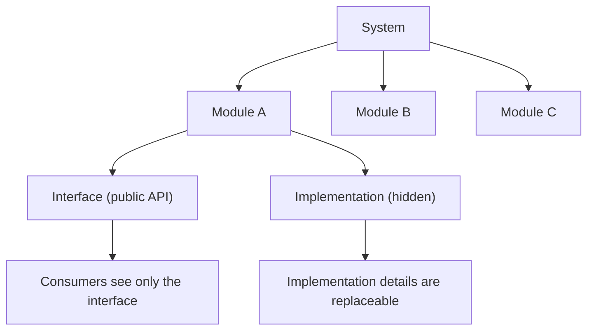

Key principles:

- **High cohesion**: Related functionality lives together.
- **Low coupling**: Modules interact through narrow, stable interfaces.
- **Information hiding**: Implementation details are private to the module.
- **Acyclic dependencies**: Dependency graphs between modules should be DAGs (Directed Acyclic Graphs); cycles indicate design problems[^23].

## 2.4 Design Patterns -- Gang of Four and Beyond

The Gang of Four (Gamma, Helm, Johnson, Vlissides) cataloged 23 design patterns in 1994, organized into three categories[^24]:

| Category | Purpose | Key Patterns |
|----------|---------|--------------|
| **Creational** | Object creation mechanisms | Singleton, Factory Method, Abstract Factory, Builder, Prototype |
| **Structural** | Object composition and relationships | Adapter, Bridge, Composite, Decorator, Facade, Proxy |
| **Behavioral** | Object communication and responsibility | Observer, Strategy, Command, State, Template Method, Iterator |

Beyond GoF, patterns most relevant to modern backend engineering include:

| Pattern | Context | Relevance |
|---------|---------|-----------|
| **Circuit Breaker**[^25] | Distributed system failure handling | Prevents cascading failures when downstream services fail |
| **Saga**[^26] | Distributed transactions | Manages data consistency across microservices without 2PC |
| **Sidecar**[^27] | Service mesh infrastructure | Offloads cross-cutting concerns (logging, security, traffic) from application code |
| **Ambassador** | External service access | Proxies outbound connections with added reliability logic |
| **Strangler Fig** | Monolith migration | Incrementally replaces parts of a monolith with new services[^28] |

> **Key Insight:** Patterns are not goals. They are named solutions to recurring problems. If you do not have the problem, you do not need the pattern. Applying the Observer pattern to code that has exactly one subscriber is unnecessary abstraction.

## 2.5 Refactoring and Technical Debt

**Refactoring** is the process of restructuring code without changing its external behavior[^29]. Martin Fowler's catalog of refactorings (1999, 2nd ed. 2018) provides a vocabulary for these transformations.

**Technical debt** is the accumulated cost of expedient shortcuts[^30]. Ward Cunningham's original metaphor (1992) was financial: taking on debt (shipping fast) is sometimes rational, but interest accumulates (future work becomes harder) and eventually must be repaid.

| Debt Type | Example | Consequence |
|-----------|---------|-------------|
| **Deliberate/Prudent** | "We know this is not ideal, but we need to ship now. We will fix it in Sprint 12." | Manageable if actually addressed |
| **Deliberate/Reckless** | "We don't have time for design." | Accumulates rapidly; becomes blocking |
| **Inadvertent/Prudent** | "Now we know how this should have been built." | Normal evolution; address during refactoring |
| **Inadvertent/Reckless** | "What's layering?" | Fundamental skill gap; requires mentorship |

> **Junior Engineer Note:** Technical debt is not always bad. The key is visibility and management. Track it explicitly (e.g., with `tech-debt` labels in issue trackers), assign priority, and address it systematically rather than pretending it does not exist.

## 2.6 Code Review as a Discipline

Code review is the systematic examination of source code by peers, intended to find defects, improve code quality, and share knowledge[^31]. Evidence shows code review reduces defect density by 60-90% compared to solo coding[^32].

**Best practices for reviewers:**

- Understand the context before reviewing (read the PR description and linked issues first)
- Comment on code, not the coder
- Distinguish between blocking issues, suggestions, and nitpicks
- Review for correctness, clarity, maintainability, and security -- in that order

**Best practices for authors:**

- Keep PRs small (under 400 lines of code, per Google's internal guidelines[^33])
- Provide context: describe *what* changed and *why*, not just *how*
- Self-review before requesting others' time
- Respond to feedback constructively

---

[^18]: Martin, R. C. *Agile Software Development: Principles, Patterns, and Practices*. Prentice Hall, 2003. The acronym SOLID was later coined by Michael Feathers.
[^19]: Martin, R. C. "The S in SOLID Stands for..." *blog.cleancoder.com*, 2020. Martin acknowledges over-application can harm readability.
[^20]: Hunt, A. & Thomas, D. *The Pragmatic Programmer*. 20th Anniversary Edition. Addison-Wesley, 2019. Chapter 7, "The Evils of Duplication."
[^21]: Fowler, M. *Refactoring: Improving the Design of Existing Code*. 2nd Edition. Addison-Wesley, 2018. Chapter 1 discusses the relationship between duplication and abstraction.
[^22]: Dijkstra, E. W. "On the Role of Scientific Thought." *Selected Writings on Computing: A Personal Perspective*. Springer-Verlag, 1982.
[^23]: Martin, R. C. *Clean Architecture*. Prentice Hall, 2017. Chapter 20, "The Dependency Rule."
[^24]: Gamma, E., Helm, R., Johnson, R., & Vlissides, J. *Design Patterns: Elements of Reusable Object-Oriented Software*. Addison-Wesley, 1994.
[^25]: Nygard, M. T. *Release It! Design and Deploy Production-Ready Software*. 2nd Edition. Pragmatic Bookshelf, 2018. Chapter 4.
[^26]: Garcia-Molina, H. & Salem, K. "Sagas." *Proceedings of the 1987 ACM SIGMOD International Conference on Management of Data*, 1987.
[^27]: Burns, B. & Oppenheimer, D. "Design Patterns for Container-Based Distributed Systems." *Proceedings of the 8th USENIX Workshop on Hot Topics in Cloud Computing (HotCloud)*, 2016.
[^28]: Fowler, M. "StranglerFigApplication." *martinfowler.com*, 2004. Updated 2020.
[^29]: Fowler, M. *Refactoring*. 2nd Edition, 2018. Definition in Chapter 1.
[^30]: Cunningham, W. "The WyCash Portfolio Management System." *OOPSLA '92 Addendum*, 1992. Original articulation of the technical debt metaphor.
[^31]: Bacchelli, A. & Bird, C. "Expectations, Outcomes, and Challenges of Modern Code Review." *Proceedings of ICSE '13*, IEEE, 2013.
[^32]: McConnell, S. *Code Complete*. 2nd Edition. Microsoft Press, 2004. Chapter 20 reviews inspection data.
[^33]: Cipollone, M., et al. "How Google Tests Software." *Google Engineering Blog*, 2015. (PR size guidelines: Google recommends under 400 LOC for efficient review.)

---

<!-- PART III -->


# Part III: Computational Foundations

---

## 3.1 Data Structures

Data structures are organized formats for storing and accessing data[^34]. The choice of data structure directly determines algorithmic performance.

| Data Structure | Access | Search | Insert | Delete | Use Case |
|----------------|--------|--------|--------|--------|----------|
| **Array** | O(1) | O(n) | O(n) | O(n) | Sequential access, indexed lookup, low-level memory |
| **Linked List** | O(n) | O(n) | O(1) at head | O(1) at head | Frequent insertion/deletion, queue/stack implementations |
| **Hash Table** | -- | O(1) amortized | O(1) amortized | O(1) amortized | Key-value lookups, deduplication, caching |
| **Binary Search Tree** | O(log n) | O(log n) | O(log n) | O(log n) | Ordered data, range queries (balanced variants) |
| **Red-Black / AVL Tree** | O(log n) | O(log n) | O(log n) | O(log n) | Guaranteed O(log n) for ordered operations |
| **Heap (Binary)** | O(1) max/min | O(n) | O(log n) | O(log n) | Priority queues, scheduling |
| **Trie** | O(k) k=key length | O(k) | O(k) | O(k) | Prefix matching, autocomplete, IP routing tables |
| **Graph (adj. list)** | -- | O(V+E) | O(1) | O(degree) | Social networks, routing, dependency resolution |
| **Graph (adj. matrix)** | O(1) | O(V^2) | O(1) | O(V^2) | Dense graphs, small vertex sets |

> **Key Insight:** For backend engineers, hash tables (dictionaries/maps), arrays/lists, and queues are the daily workhorses. Trees and graphs become relevant for specific domains (database indexes, dependency resolution, routing). The important skill is not memorizing implementations but recognizing *which* structure matches your access pattern[^35].

## 3.2 Algorithms and Computational Complexity

Big-O notation describes how an algorithm's resource usage (time or space) scales with input size[^36]. It captures the dominant term and ignores constants.

| Complexity | Name | Example |
|------------|------|---------|
| O(1) | Constant | Hash table lookup |
| O(log n) | Logarithmic | Binary search |
| O(n) | Linear | Array scan |
| O(n log n) | Linearithmic | Merge sort, efficient sorting |
| O(n^2) | Quadratic | Nested loops, bubble sort |
| O(2^n) | Exponential | Brute-force subset enumeration |
| O(n!) | Factorial | Brute-force permutation generation |

**Categories every backend engineer should know:**

- **Sorting**: Merge sort O(n log n) stable, quicksort O(n log n) average but O(n^2) worst case, TimSort (Python/Java default) hybrid[^37].
- **Search**: Binary search on sorted arrays O(log n), breadth-first search and depth-first search on graphs O(V+E).
- **Graph algorithms**: Dijkstra's shortest path, topological sort (dependency ordering), BFS/DFS traversal[^38].
- **Dynamic programming**: Optimal substructure + overlapping subproblems. Relevant for caching strategies and optimization problems[^39].
- **String matching**: KMP algorithm, regular expressions (backtracking vs. finite automata)[^40].

> **Junior Engineer Note:** In backend engineering, you rarely implement algorithms from scratch. The value of understanding complexity is *choosing the right tool*: knowing why a hash map is O(1) for lookups versus a list's O(n), or why indexing a database table changes query performance by orders of magnitude.

## 3.3 Concurrency and Parallelism

**Concurrency** is managing multiple tasks that make progress during overlapping time periods. **Parallelism** is executing multiple tasks simultaneously. Concurrency is a design concern; parallelism is an execution strategy[^41].

| Concept | Description | Languages/Frameworks |
|---------|-------------|---------------------|
| **Threads** | Lightweight processes sharing memory space; require synchronization | Java, Go (goroutines), Python (with GIL limitations) |
| **Processes** | Independent memory spaces; communicate via IPC | All operating systems |
| **Async/Await** | Non-blocking execution using cooperative scheduling | Python (asyncio), JavaScript (Promise/async), Rust (tokio) |
| **Event Loop** | Single-threaded loop dispatching events to handlers | Node.js, Python asyncio, browser JS runtime |
| **Actor Model** | Isolated state containers communicating via messages | Erlang/OTP, Akka (JVM), Orleans (.NET) |

**Critical concurrency concepts:**

- **Race conditions**: When program outcome depends on non-deterministic timing of operations[^42].
- **Deadlock**: Two or more processes waiting for each other's resources indefinitely[^43].
- **Thread safety**: Code that functions correctly during concurrent execution, typically achieved via locks, atomic operations, or lock-free data structures.
- **The GIL** (Global Interpreter Lock): Python's mechanism that prevents true parallelism for CPU-bound threads. Multiprocessing (not multithreading) achieves parallelism in Python[^44].

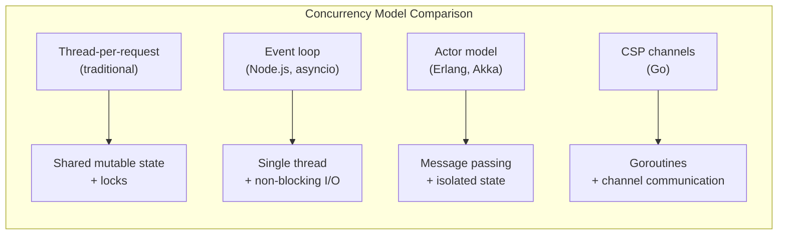

> **Key Insight:** The trend in modern backend systems is away from shared-state concurrency (threads + locks) toward message-passing concurrency (async/await, actors, channels), because shared-state concurrency is fundamentally harder to reason about and debug[^45].

## 3.4 Memory Management

| Model | Mechanism | Languages |
|-------|-----------|-----------|
| **Manual** | Programmer allocates and frees memory explicitly | C, C++, Rust (with ownership) |
| **Garbage Collection (GC)** | Runtime automatically reclaims unreachable memory | Java, Go, Python, JavaScript, C# |
| **Ownership/Borrowing** | Compile-time rules guarantee memory safety without GC | Rust[^46] |
| **Reference Counting** | Each object tracks number of references; freed when count reaches zero | Python (with cycle detector), Swift, C++ shared_ptr |

**Memory-related concerns for backend engineers:**

- **Heap vs. Stack**: Stack allocation is fast (pointer bump) but limited in size and scope. Heap allocation is flexible but requires GC or manual management[^47].
- **Memory leaks in GC languages**: Retained references (cache entries never evicted, event listeners never removed) prevent GC from reclaiming memory[^48].
- **Garbage collection pauses**: Stop-the-world GC pauses can cause latency spikes. Generational GC (Java, Go) mitigates this by separating short-lived and long-lived objects[^49].
- **Memory-mapped files**: Used for databases and large file access without loading entire files into memory[^50].

> **Junior Engineer Note:** In Java/Python/Go, you do not manually manage memory. But you must understand GC behavior because memory leaks (retained objects) and GC pressure (excessive allocation in hot paths) are real production problems.

## 3.5 Networking Fundamentals

| Layer | Protocol | Function |
|-------|----------|----------|
| **Application** | HTTP/1.1, HTTP/2, HTTP/3 | Request/response, streaming, multiplexing |
| **Application** | DNS | Domain name resolution |
| **Application** | WebSocket | Full-duplex persistent connections |
| **Transport** | TCP | Reliable, ordered byte streams |
| **Transport** | UDP | Unreliable but fast datagrams (used by QUIC/HTTP3) |
| **Network** | IP (IPv4/IPv6) | Packet routing and addressing |
| **Link** | Ethernet, Wi-Fi | Physical and data link framing |

**HTTP protocol essentials:**

- **HTTP/1.1**: One request per TCP connection (with keep-alive) or pipelining (rarely used)[^51].
- **HTTP/2**: Multiplexed streams over a single connection, header compression, server push[^52].
- **HTTP/3**: Runs on QUIC (UDP-based), eliminates head-of-line blocking at the transport layer[^53].

**DNS resolution process:**

1. Browser cache -> OS cache -> local resolver -> recursive resolver -> root nameserver -> TLD nameserver -> authoritative nameserver[^54].
2. TTL (Time to Live) controls caching duration.
3. Types: A (IPv4), AAAA (IPv6), CNAME (alias), MX (mail), SRV (service location).

**TCP vs. UDP for backend engineers:**

TCP provides reliability (retransmission, ordering, flow control) at the cost of latency. UDP provides speed at the cost of reliability. Real-time media (WebRTC) uses UDP because dropped packets are preferable to delayed packets[^55].

> **Trade-off Alert:** HTTP/2 multiplexing solved head-of-line blocking at the HTTP layer but not at the TCP layer. A single lost TCP packet stalls all multiplexed streams. HTTP/3 (QUIC) solves this by using per-stream reliability. For services that need low-latency multiplexed communication, HTTP/3 provides measurable benefits[^56].

---

[^34]: Cormen, T. H., Leiserson, C. E., Rivest, R. L., & Stein, C. *Introduction to Algorithms*. 4th Edition. MIT Press, 2022.
[^35]: Skiena, S. *The Algorithm Design Manual*. 3rd Edition. Springer, 2020.
[^36]: Cormen et al. *Introduction to Algorithms*, 2022. Chapter 3, "Growth of Functions."
[^37]: McIlroy, M. D. "A Killer Adversary for Quicksort." *Software: Practice and Experience*, 29(4), 1999. TimSort described in: Peters, T. "Timsort." CPython source (listobject.c), 2002.
[^38]: Cormen et al. *Introduction to Algorithms*, 2022. Chapters 22-25 (Graph Algorithms).
[^39]: Cormen et al. *Introduction to Algorithms*, 2022. Chapter 15.
[^40]: Knuth, D. E., Morris, J. H., & Pratt, V. R. "Fast Pattern Matching in Strings." *SIAM Journal on Computing*, 6(2), 1977.
[^41]: Pike, R. "Concurrency is not Parallelism." *talk at GopherCon*, 2012. Available at youtube.com/watch?v=oV9rvDllKEg.
[^42]: Herlihy, M. & Shavit, N. *The Art of Multiprocessor Programming*. Revised Edition. Morgan Kaufmann, 2020.
[^43]: Coffman, E. G., Elphick, M., & Shoshani, A. "System Deadlocks." *ACM Computing Surveys*, 3(2), 1971.
[^44]: Python Software Foundation. "What Is the Global Interpreter Lock?" *docs.python.org/3/glossary.html#term-global-interpreter-lock*.
[^45]: Hewitt, C., Bishop, P., & Steiger, R. "A Universal Modular ACTOR Formalism for Artificial Intelligence." *Proceedings of IJCAI '73*, 1973.
[^46]: Matsakis, N. D. & Klock, F. S. "The Rust Language." *ACM SIGAda Ada Letters*, 34(3), 2014.
[^47]: Bloch, J. *Effective Java*. 3rd Edition. Addison-Wesley, 2018. Item 50-57 (Exceptions and Memory).
[^48]: Sevtsuk, A. & Guo, S. "Memory Leaks in Java Applications." *Oracle JDK Documentation*, 2023. (Specific article uncertain; concept is well-established.)
[^49]: Detlefs, D., et al. "Garbage-First Garbage Collection." *Proceedings of the 4th International Symposium on Memory Management (ISMM)*, 2004.
[^50]: Navarro, J. "A Tutorial Introduction to the ARM and x86 Architectures." *Linux Journal*, 2020. (Memory-mapped I/O concept is well-established in OS literature.)
[^51]: Fielding, R. T. *Architectural Styles and the Design of Network-based Software Architectures*. PhD Dissertation, UC Irvine, 2000. Section 3.4.1.
[^52]: Belshe, M., Peon, R., & Thomson, M. *Hypertext Transfer Protocol Version 2 (HTTP/2)*. RFC 7540. IETF, 2015.
[^53]: Bishop, M., et al. *The QUIC Transport Protocol: Design and Internet-Scale Deployment*. ACM SIGCOMM, 2017. RFC 9000 (2021).
[^54]: Mockapetris, P. *Domain Names -- Concepts and Facilities*. RFC 1034. IETF, 1987. Updated by RFC 8484 (2018).
[^55]: Rosenberg, J., et al. *Real-Time Transport Protocol (RTP) for Audio and Video*. RFC 3550. IETF, 2003.
[^56]: IETF. *QUIC: A UDP-Based Multiplexed and Secure Transport*. RFC 9000. IETF, 2021.

---

<!-- PART IV -->


# Part IV: Programming Paradigms

---

## 4.1 Object-Oriented Programming

Object-Oriented Programming (OOP) organizes software around objects -- entities that encapsulate state and behavior[^57]. Four pillars:

| Pillar | Description | Key Mechanism |
|--------|-------------|---------------|
| **Encapsulation** | Bundling data with the methods that operate on it; restricting direct access to internal state | Access modifiers (private, protected, public) |
| **Inheritance** | Creating new classes from existing ones, inheriting behavior and state | Class hierarchy, `extends`/`implements` |
| **Polymorphism** | Objects of different types responding to the same interface | Method overriding, interfaces, generics |
| **Abstraction** | Hiding complex implementation behind simple interfaces | Abstract classes, interfaces, protocols |

**Composition over inheritance**: Favor assembling objects from small, focused components over building deep class hierarchies. This reduces coupling and increases flexibility[^58].

```python
# Inheritance-based (rigid)
class EmailNotifier:
    def send(self, msg): ...

class SMSNotifier(EmailNotifier):  # Forced to inherit email behavior
    def send(self, msg): ...

# Composition-based (flexible)
class Notifier:
    def __init__(self, channel: Channel):
        self.channel = channel  # Injected behavior

class EmailChannel:
    def deliver(self, msg): ...

class SMSChannel:
    def deliver(self, msg): ...
```

> **Junior Engineer Note:** Modern languages increasingly favor protocols/traits/interfaces over class inheritance for polymorphism. Java's interface default methods, Rust traits, Go interfaces, Python's Protocol class, and TypeScript interfaces all reflect this shift. Inheritance is a tool, not a default.

## 4.2 Functional Programming

Functional programming treats computation as the evaluation of mathematical functions, avoiding mutable state and side effects[^59]. Core concepts:

| Concept | Description | Relevance to Backend |
|---------|-------------|---------------------|
| **Pure functions** | Same input always produces same output; no side effects | Testability, referential transparency |
| **Immutability** | Data cannot be modified after creation | Thread safety, predictability |
| **Higher-order functions** | Functions that accept or return other functions | Strategy pattern, middleware chains |
| **First-class functions** | Functions are values: can be passed, stored, returned | Closures, callbacks, decorators |
| **Currying/Partial application** | Transforming multi-argument functions into chains of single-argument functions | Function composition, configuration |
| **Lazy evaluation** | Expressions evaluated only when needed | Infinite streams, performance optimization |
| **Pattern matching** | Destructuring data based on shape | Error handling, protocol dispatch |

**Functional concepts adopted by mainstream languages:**

Java streams and lambda expressions (Java 8+), Python comprehensions and `functools`, JavaScript `map`/`filter`/`reduce`, C# LINQ, Rust's iterator adapters. These are not purely functional languages, but they incorporate functional tools where they improve clarity and safety[^60].

> **Trade-off Alert:** Pure functional programming avoids mutable state but can introduce complexity through monads, immutability overhead, and deep nesting. Most production codebases are *multi-paradigm*, combining OOP for structural organization with FP concepts for data transformation and concurrency[^61].

## 4.3 Reactive Programming

Reactive programming is a paradigm oriented around data streams and the propagation of change[^62]. When a source produces data, all dependent computations update automatically.

| Framework/Library | Language | Model |
|-------------------|----------|-------|
| **RxJava / RxKotlin** | Java/Kotlin | Observable streams with operators |
| **Project Reactor** | Java | Reactive streams (backpressure-aware) |
| **RxJS** | JavaScript | Observable streams for frontend + Node.js |
| **asyncio** | Python | Event loop + coroutines |
| **tokio** | Rust | Async runtime with work-stealing |

**Reactive Streams specification**[^63]: A standard for asynchronous stream processing with backpressure. Four interfaces: `Publisher`, `Subscriber`, `Subscription`, and `Processor`. Adopted by Java 9's `java.util.concurrent.Flow` module.

**When reactive programming helps:**

- High-throughput, low-latency I/O (API gateways, real-time data pipelines)
- Systems requiring backpressure (preventing fast producers from overwhelming slow consumers)
- Event-driven architectures with many concurrent connections

**When it hurts:**

- Simple CRUD applications where synchronous code is clearer
- Teams unfamiliar with the paradigm (steep learning curve)
- Debugging (stack traces in reactive code are notoriously difficult to read)[^64]

> **Trade-off Alert:** The Webex guide mentions Kafka consumers and real-time media processing -- both domains where reactive patterns are natural. However, adopting reactive frameworks for standard REST APIs adds complexity without proportional benefit.

## 4.4 Event-Driven Programming

Event-driven programming structures applications around events -- discrete occurrences that trigger handler functions[^65].

| Pattern | Description | Scale |
|---------|-------------|-------|
| **Observer/Pub-Sub** | Publish events; subscribers receive them asynchronously | In-process, in-memory |
| **Message Queue** | Events persisted in a queue; consumers pull at their pace | Cross-service, durable |
| **Event Sourcing** | All state changes recorded as immutable events; current state derived by replaying events | Domain-level, audit-critical |
| **CQRS** | Separate write model (commands) from read model (queries); each optimized independently | High-read/write divergence |

**Event-driven architecture (EDA)** is the dominant pattern for systems requiring loose coupling, independent scalability, and audit trails[^66]. The Webex platform is fundamentally event-driven, with Kafka serving as the central message backbone[^67].

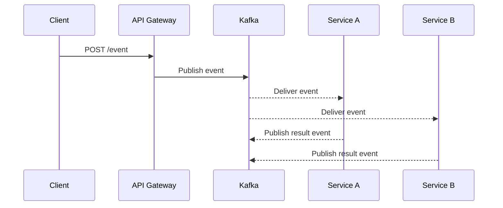

## 4.5 Imperative vs. Declarative

| Style | Description | Example |
|-------|-------------|---------|
| **Imperative** | Specify *how* to do it, step by step | `for item in list: if item > 0: process(item)` |
| **Declarative** | Specify *what* you want; the system determines how | `list.filter(λ x: x > 0).map(process)` |

Declarative styles appear in SQL (describe the result set, not the scan plan), HTML (describe structure, not rendering), configuration files (describe desired state, not transition steps), and functional transformations. Kubernetes resource manifests and Terraform HCL are declarative infrastructure[^68].

> **Key Insight:** The DevOps and GitOps movements are fundamentally about shifting infrastructure management from imperative ("run these commands") to declarative ("describe the desired state"). This shift enables automation, version control, and idempotent operations[^69].

---

[^57]: Booch, G. *Object-Oriented Analysis and Design with Applications*. 3rd Edition. Addison-Wesley, 2007.
[^58]: Gamma et al. *Design Patterns*, 1994. "Favor object composition over class inheritance."
[^59]: Hughes, J. "Why Functional Programming Matters." *The Computer Journal*, 32(2), 1989.
[^60]: Bloch, J. *Effective Java*. 3rd Edition. Addison-Wesley, 2018. Items 42-44 (Lambda and Stream usage).
[^61]: O'Sullivan, B., Stewart, D., & Goerzen, C. *Real World Haskell*. O'Reilly Media, 2008. Preface discusses practical FP.
[^62]: Reactive Streams organization. *Reactive Streams*. reactivestreams.org, 2013-present.
[^63]: Reactive Streams specification. *Reactive Streams: JVM Protocol for Asynchronous Stream Processing with Non-Blocking Back Pressure*. Version 1.0.3, 2019.
[^64]: Akarin, P. "The Problem with Reactive Programming." *Medium*, 2021. (Title approximate; multiple articles discuss debugging difficulties in reactive stacks.)
[^65]: Gamma et al. *Design Patterns*, 1994. Observer pattern.
[^66]: Richardson, C. *Microservices Patterns*. Manning Publications, 2018. Chapters 4 (Event-driven patterns) and 11 (Managing distributed transactions).
[^67]: Webex Engineering Blog. "Chaos Engineering in Webex Contact Center." blog.webex.com/engineering, 2023.
[^68]: Morris, K. *Infrastructure as Code: Dynamic Systems for the Cloud Age*. 2nd Edition. O'Reilly Media, 2020.
[^69]: Burns, B. *Kubernetes Up and Running*. 3rd Edition. O'Reilly Media, 2022. Chapter 1, "Declarative Infrastructure."

---

<!-- PART V -->


# Part V: Architecture and System Design

---

## 5.1 The Monolith -- Still the Default Starting Point

A monolithic architecture deploys the entire application as a single unit[^70]. Despite the popularity of microservices, monoliths remain the correct starting point for most projects.

**Advantages of monoliths:**

- Simple deployment (one artifact)
- No network hops between components (lower latency)
- Easier debugging and testing
- ACID transactions across the entire domain

**When monoliths become problematic:**

- Deployment risk scales with size (one bad change affects everything)
- Scaling is coarse-grained (must scale entire application, not individual components)
- Team coupling (many developers modifying the same codebase)

> **Key Insight:** Martin Fowler articulated the advice in 2015 that is still relevant: "Almost all the successful microservice stories have started with a monolith that got too big and was broken up"[^71]. Start monolithic. Extract services when you have evidence that the monolith's constraints are blocking you.

## 5.2 Distributed Systems Fundamentals

A distributed system is one in which the failure of a computer you did not even know existed can render your own computer unusable[^72]. Every backend engineer working with microservices, cloud infrastructure, or multi-node deployments must understand the fundamental impossibility results and trade-offs.

### The CAP Theorem

In a distributed system that replicates data, you can guarantee at most two of three properties[^73]:

| Property | Definition |
|----------|------------|
| **Consistency** | Every read receives the most recent write (linearizability) |
| **Availability** | Every request receives a non-error response |
| **Partition Tolerance** | System continues operating despite network partitions |

Since network partitions are inevitable in distributed systems, the real choice is between **CP** (consistent but may reject requests during partitions) and **AP** (available but may return stale data during partitions)[^74].

### The PACELC Theorem

An extension of CAP: in the face of a **P**artition, choose **A**vailability or **C**onsistency; **E**lse (during normal operation), choose **L**atency or **C**onsistency[^75].

| System | Partition: A or C | Normal: L or C |
|--------|-------------------|----------------|
| DynamoDB | A | L (eventual consistency) |
| PostgreSQL (single node) | N/A | C (strong consistency) |
| Cassandra | A (tunable) | L (tunable) |
| Kafka (acks=all) | C | L |
| CockroachDB | C | C (sacrifices latency) |

### Consensus

Distributed consensus is the problem of getting multiple nodes to agree on a single value[^76]:

| Algorithm | Key Properties | Used By |
|-----------|---------------|---------|
| **Paxos** | Proven correct, complex to implement | Google Chubby (original), ZooKeeper (ZAB variant) |
| **Raft** | Designed for understandability; equivalent guarantees to Paxos | etcd, CockroachDB, TiKV |
| **PBFT** (Practical Byzantine Fault Tolerance) | Tolerates malicious nodes | Some blockchain systems |

### Failure Modes in Distributed Systems

| Failure Mode | Description | Mitigation |
|--------------|-------------|------------|
| **Network partition** | Nodes cannot communicate | CAP-aware design, retry logic |
| **Byzantine failure** | Nodes behave arbitrarily or maliciously | Byzantine fault tolerance (rare in backend) |
| **Clock skew** | Clocks on different nodes disagree on time | NTP, logical clocks (Lamport timestamps) |
| **Split-brain** | Partitions create two independently operating clusters | Quorum-based decisions, fencing tokens |
| **Cascading failure** | One failure triggers failures in dependent components | Circuit breakers, bulkheads, timeouts |
| **Thundering herd** | Many clients simultaneously retry after a failure | Exponential backoff with jitter |

> **Trade-off Alert:** Consensus algorithms (Paxos, Raft) provide strong consistency but add latency (typically 2-3 round trips per write). For many applications, eventual consistency with conflict resolution is acceptable and significantly faster[^77].

## 5.3 Microservices Architecture

Microservices structure an application as a collection of small, autonomous services, each running in its own process and communicating via lightweight mechanisms[^78].

**When microservices are appropriate:**

- Large, independently deployable components owned by different teams
- Different components have different scaling requirements
- Technology diversity is needed (polyglot persistence, polyglot programming)
- Fault isolation is critical

**When microservices are premature:**

- Small team (< 10 engineers)
- Domain not well-understood
- No operational infrastructure for distributed systems (observability, deployment, service discovery)

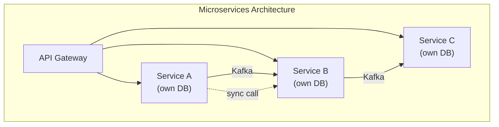

**Essential supporting infrastructure for microservices:**

- Service discovery (Consul, etcd, or Kubernetes DNS)
- API gateway (Kong, Envoy, or custom)
- Distributed tracing (OpenTelemetry)
- Centralized logging (ELK/EFK stack)
- Container orchestration (Kubernetes)
- Secrets management (Vault)
- Circuit breakers (Resilience4j, Envoy)

Sam Newman's *Building Microservices* (2nd edition, 2021) provides a comprehensive guide, emphasizing that the hard parts of microservices are organizational, not technical[^79].

## 5.4 Event-Driven Architecture

Event-driven architecture (EDA) uses events as the primary mechanism for communication between decoupled services[^80]. Three primary topologies:

| Topology | Description | Coupling |
|----------|-------------|----------|
| **Mediator** | Central orchestrator coordinates event flow between services | Medium (mediator knows about steps) |
| **Broker** | No central coordinator; services publish and subscribe independently | Low (services know only events, not each other) |
| **Event mesh** | Dynamic routing layer that distributes events across heterogeneous environments | Lowest (infrastructure handles routing) |

**The Webex platform primarily uses the Broker topology** with Kafka as the backbone, as described in their chaos engineering and architecture blog posts[^81].

**Event types (event taxonomy):**

| Event Type | Purpose | Example |
|------------|---------|---------|
| **Domain event** | Something that happened in the business domain | `OrderPlaced`, `MeetingStarted` |
| **Integration event** | Published for cross-service communication | `UserCreated` (published by Auth Service for other services) |
| **Command** | A request to perform an action (handled by one consumer) | `SendEmail`, `ProcessPayment` |

## 5.5 CQRS and Event Sourcing

**CQRS** (Command Query Responsibility Segregation) separates read and write operations into different models[^82]:

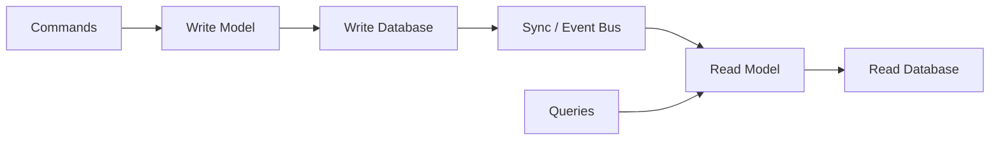

**Event Sourcing** stores all changes as a sequence of immutable events, rather than storing only current state[^83]:

| Approach | Storage | Query Pattern | Trade-off |
|----------|---------|---------------|-----------|
| **Traditional (CRUD)** | Current state only | Direct query of current data | Simple, but loses history |
| **Event Sourcing** | Immutable event log | Rebuild state by replaying events | Full audit trail, temporal queries, but complex |

**When to use:**

- Audit trails are required (financial systems, compliance domains)
- Temporal queries are needed ("what was the state at time T?")
- Event replay enables new projections and features without data migration
- Domain complexity benefits from an explicit event model

**When to avoid:**

- Simple CRUD domains where history provides no value
- Systems with very high event volumes where replay time is prohibitive (mitigated by snapshotting[^84])
- Teams without experience with event-driven patterns

> **Key Insight:** CQRS and Event Sourcing are often conflated but are independent patterns. CQRS can exist without Event Sourcing (separate read/write databases with standard CRUD). Event Sourcing can exist without CQRS (event store used for both reads and writes). Combining them is common but not required[^85].

## 5.6 API Design

APIs are the contracts between software components. Three dominant styles:

### REST (Representational State Transfer)

Roy Fielding's architectural style (2000) for distributed hypermedia systems[^86]:

| Constraint | Description |
|------------|-------------|
| Client-server | Separation of concerns between UI and data storage |
| Stateless | Each request contains all information needed to process it |
| Cacheable | Responses must indicate cacheability |
| Uniform interface | Resource identification (URIs), manipulation through representations, self-descriptive messages, HATEOAS |
| Layered system | Intermediaries (load balancers, proxies) can be inserted transparently |

**REST API design best practices:**

- Use nouns for resources (`/users/{id}`), HTTP methods for operations
- Version APIs explicitly (`/v2/users`)
- Use HTTP status codes meaningfully (200, 201, 400, 401, 403, 404, 409, 429, 500, 503)
- Implement pagination for list endpoints (cursor-based preferred over offset)[^87]
- Use consistent error response formats

### gRPC

Google's high-performance RPC framework using Protocol Buffers and HTTP/2[^88]:

| Feature | REST | gRPC |
|---------|------|------|
| Schema | OpenAPI (optional) | Protobuf (mandatory, compiled) |
| Transport | HTTP/1.1 or HTTP/2 | HTTP/2 only |
| Serialization | JSON (text) | Protocol Buffers (binary, ~10x smaller) |
| Streaming | WebSockets (separate) | Native (unary, server-streaming, client-streaming, bidirectional) |
| Browser support | Native | Limited (requires gRPC-Web proxy) |
| Code generation | Optional (OpenAPI) | Built-in (multi-language) |

**When to use gRPC:**

- Internal service-to-service communication (low latency, high throughput)
- Streaming data (real-time feeds, large payloads)
- Polyglot environments needing consistent contracts
- When binary efficiency matters (mobile, IoT)

**When to use REST:**

- Public APIs (universally understood, tooling support)
- Browser-facing APIs (gRPC-Web exists but adds complexity)
- When human readability of payloads matters (debugging)

### GraphQL

A query language for APIs and a runtime for fulfilling those queries[^89]:

- Client specifies exactly the data it needs (no over-fetching or under-fetching)
- Single endpoint; query structure determines response shape
- Strongly typed schema with introspection
- Risk: N+1 query problems, complex caching, over-flexibility enabling abuse

> **Trade-off Alert:** API style selection is not about which is "best" but about context. The Webex platform uses REST for public APIs, gRPC for internal service communication, and WebSockets for real-time connections -- reflecting the contextual nature of this decision[^90].

## 5.7 Data Layer -- Databases and Storage

### Relational Databases (SQL)

Relational databases model data as tables with relationships, enforcing ACID properties[^91]:

| ACID Property | Definition |
|---------------|------------|
| **Atomicity** | Transaction is all-or-nothing |
| **Consistency** | Transaction brings database from one valid state to another |
| **Isolation** | Concurrent transactions do not interfere (levels: Read Uncommitted, Read Committed, Repeatable Read, Serializable) |
| **Durability** | Committed data survives system failures (via WAL) |

**PostgreSQL** is the dominant open-source RDBMS, known for extensibility, standards compliance, and JSON support (JSONB)[^92]. It supports full ACID, MVCC for concurrency, and has extensive indexing (B-tree, hash, GiST, SP-GiST, GIN, BRIN).

**When relational databases are the right choice:**

- Data integrity is paramount (financial, healthcare)
- Complex queries with joins, aggregations, and transactions
- Schema enforcement prevents data corruption
- Reporting and analytics require structured queries

### NoSQL Databases

NoSQL databases sacrifice some relational guarantees for flexibility, scale, or specific access patterns[^93]:

| Type | Example | Data Model | Best For |
|------|---------|------------|----------|
| **Document** | MongoDB | JSON/BSON documents | Flexible schemas, rapid prototyping |
| **Key-Value** | Redis, DynamoDB | Key-value pairs | Caching, session storage, leaderboards |
| **Column-family** | Cassandra, HBase | Rows with dynamic columns | Time-series, write-heavy workloads, wide-column analytics |
| **Graph** | Neo4j, JanusGraph | Nodes + edges | Relationship-heavy queries (social networks, recommendations) |
| **Time-series** | TimescaleDB, InfluxDB | Time-indexed metrics | Monitoring, IoT, metrics storage |

**The "polyglot persistence" principle** advocates using different database technologies optimized for different access patterns within the same system[^94]. The Webex guide mentions PostgreSQL, Cassandra, Redis, and OpenSearch -- reflecting polyglot persistence in practice.

> **Trade-off Alert:** Polyglot persistence increases operational complexity (multiple database systems to maintain, monitor, back up). Prefer fewer database technologies unless the performance difference is measured and significant.

### Database Design Principles

- **Normalization** (1NF through 5NF): Eliminates data redundancy but increases join complexity[^95].
- **Denormalization**: Duplicates data for read performance; requires write-time synchronization.
- **Indexing**: B-tree indexes for range queries, hash indexes for equality, composite indexes for multi-column queries[^96].
- **Sharding**: Horizontal partitioning of data across nodes; introduces cross-shard query complexity[^97].
- **Replication**: Copies of data across nodes for availability and read scaling. Leader-follower (most common) or multi-leader (conflict resolution required)[^98].

## 5.8 Message Brokers and Streaming

Message brokers decouple producers and consumers, enabling asynchronous communication[^99]:

| System | Model | Ordering | Persistence | Throughput | Use Case |
|--------|-------|----------|-------------|------------|----------|
| **Kafka** | Distributed log | Per-partition | Durable | Very high | Event streaming, log aggregation, CQRS |
| **RabbitMQ** | AMQP queue | Per-queue | Transient or durable | Medium | Task queues, RPC, routing |
| **NATS** | Pub/sub + JetStream | Per-stream | JetStream: durable | Very high | Microservices, IoT, edge |
| **Redis Streams** | Distributed log | Per-stream | AOF/durable | High | Lightweight event streaming |
| **Amazon SQS** | Managed queue | FIFO or standard | Durable | High | Decoupled services, task processing |

**Kafka architecture:**

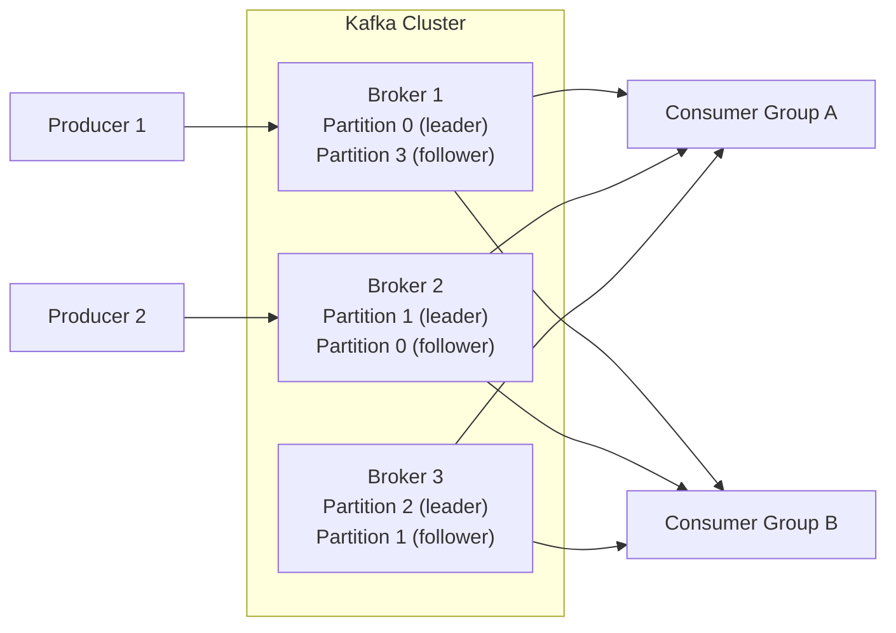

**Kafka key concepts:**

- **Topics**: Named feeds of records (analogous to tables)
- **Partitions**: Ordered, immutable sequences within a topic (parallelism unit)
- **Consumer groups**: Set of consumers that jointly consume a topic; each partition consumed by exactly one consumer in a group[^100]
- **Offsets**: Consumer tracks its position in a partition; enables at-least-once, at-most-once, or effectively-once delivery semantics

> **Key Insight:** Kafka is not just a message queue -- it is a distributed log. Messages are retained regardless of consumption, enabling replay, multiple consumer groups processing the same events, and temporal queries. This fundamental difference from traditional queues (RabbitMQ, SQS) makes Kafka suitable for event sourcing and streaming analytics[^101].

## 5.9 Caching Strategies

Caching stores frequently accessed data in faster storage to reduce latency and backend load[^102]:

| Strategy | Description | Consistency | Use Case |
|----------|-------------|-------------|----------|
| **Cache-aside** | Application checks cache; on miss, reads from DB and populates cache | Eventual | General-purpose caching |
| **Read-through** | Cache layer handles DB reads transparently | Eventual | Simplified application code |
| **Write-through** | Writes go to cache and DB synchronously | Strong | Write-heavy with strong consistency needs |
| **Write-behind** (write-back) | Writes go to cache; DB updated asynchronously | Eventual (risk of data loss) | Write-heavy with tolerance for loss |
| **Read-ahead** | Cache pre-loads data predicted to be needed | Eventual | Predictable access patterns |

**Cache invalidation strategies:**

- **TTL** (Time To Live): Data expires after a fixed duration[^103].
- **Event-based invalidation**: Invalidate cache entries when the underlying data changes (typically via Kafka event or database trigger).
- **Version-based**: Cache key includes version; new versions naturally invalidate old entries.

> **Trade-off Alert:** "There are only two hard things in Computer Science: cache invalidation and naming things"[^104]. Cache invalidation is hard because it requires keeping two data stores consistent. TTL-based expiry is the simplest strategy but introduces staleness. Event-based invalidation is more precise but adds architectural complexity.

## 5.10 Resilience Patterns

Production systems must handle partial failures gracefully. These patterns, documented extensively by Michael Nygard in *Release It!* (2007, 2nd ed. 2018) and practiced at Webex, are essential for distributed systems[^105]:

| Pattern | Description | When to Apply |
|---------|-------------|---------------|
| **Circuit Breaker**[^25] | Tracks failure rate; opens (rejects calls) when threshold exceeded; half-opens periodically to test recovery | Any remote call (HTTP, database, message broker) |
| **Retry with Backoff** | Retry failed operations with exponential delays and jitter | Transient failures (network blips, temporary overloads) |
| **Bulkhead**[^106] | Isolate failure domains (separate thread/connection pools per downstream) | Preventing one slow service from consuming all resources |
| **Timeout** | Set maximum wait time for operations | Every remote call must have a timeout |
| **Fallback** | Return degraded but functional results on failure | User-facing operations where partial results are better than errors |
| **Rate Limiting** | Restrict request rate per client/source | Protecting against overload (accidental or malicious) |
| **Health Check** | Periodic verification that services are operational | Load balancers, orchestrators, monitoring |
| **Load Shedding** | Reject excess requests when capacity is reached | Protecting system stability during traffic spikes |

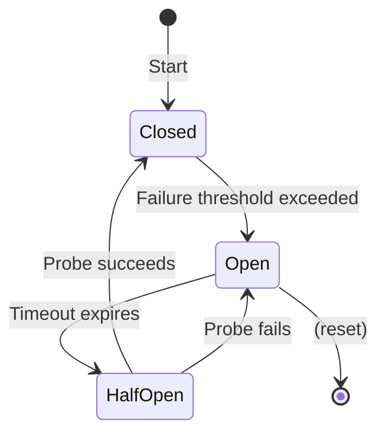

> **Junior Engineer Note:** These patterns are not theoretical -- they are the infrastructure that keeps Webex's 99.999% uptime SLA achievable. Every call to another service, database, or external API should have: (1) a timeout, (2) a circuit breaker, and (3) a retry policy with backoff. This is not optional in production.

---

[^70]: Fowler, M. "MonolithFirst." martinfowler.com, 2015.
[^71]: Fowler, M. "Microservices." martinfowler.com, 2014 (updated 2021). Section on "The Monolith Comes First."
[^72]: Tanenbaum, A. S. & van Steen, M. *Distributed Systems: Principles and Paradigms*. 3rd Edition. Pearson, 2017.
[^73]: Gilbert, S. & Lynch, N. "Brewer's Conjecture and the Feasibility of Consistent, Available, Partition-Tolerant Web Services." *ACM SIGACT News*, 33(2), 2002.
[^74]: Abadi, D. "Consistency Tradeoffs in Modern Distributed Database System Design." *IEEE Computer*, 45(2), 2012.
[^75]: Abadi, D. "Consistency Tradeoffs in Modern Distributed Database System Design." *IEEE Computer*, 2012. (PACELC formulation.)
[^76]: Lamport, L. "The Part-Time Parliament." *ACM Transactions on Computer Systems*, 16(2), 1998. (Paxos paper.)
[^77]: Kleppmann, M. *Designing Data-Intensive Applications*, 2017. Chapter 9, "Consistency and Consensus."
[^78]: Newman, S. *Building Microservices*. 2nd Edition. O'Reilly Media, 2021. Chapter 1.
[^79]: Newman, S. *Building Microservices*, 2021. Preface and Chapter 1.
[^80]: Richardson, C. *Microservices Patterns*, 2018. Chapter 4.
[^81]: Webex Engineering Blog. "Chaos Engineering in Webex Contact Center." blog.webex.com/engineering, 2023.
[^82]: Young, G. "CQRS Documents." cqrs.files.wordpress.com, 2010.
[^83]: Vernon, V. *Implementing Domain-Driven Design*. Addison-Wesley, 2013. Chapter 7 (Event Sourcing).
[^84]: Greg Young. "Snapshots." blog.gregoryyoung.net, 2010. (Snapshotting in event-sourced systems.)
[^85]: Fowler, M. "CQRS." martinfowler.com, 2005 (updated 2015). "CQRS and Event Sourcing are independent patterns."
[^86]: Fielding, R. T. *Architectural Styles and the Design of Network-based Software Architectures*. PhD Dissertation, UC Irvine, 2000.
[^87]: RESTful API Guidelines. *API Guidelines -- Pagination*. github.com/microsoft/api-guidelines (Microsoft REST API Guidelines).
[^88]: gRPC Authors. *gRPC: A High-Performance, Open-Source Universal RPC Framework*. grpc.io, 2015-present.
[^89]: GraphQL Foundation. *GraphQL Specification*. graphql.org/spec/. Latest version: October 2021.
[^90]: Webex Platform Architecture. Cisco Live BRKCOL-2698, 2026.
[^91]: Date, C. J. *An Introduction to Database Systems*. 8th Edition. Addison-Wesley, 2003.
[^92]: PostgreSQL Global Development Group. *PostgreSQL 17 Documentation*. postgresql.org/docs/17/, 2024.
[^93]: Cattell, R. "Scalable SQL and NoSQL Data Stores." *ACM SIGMOD Record*, 39(4), 2011.
[^94]: Sadalage, P. J. & Fowler, M. *NoSQL Distilled: A Brief Guide to the Emerging World of Polyglot Persistence*. Addison-Wesley, 2012.
[^95]: Date, C. J. *An Introduction to Database Systems*, 2003. Chapters 8-10 (Normalization).
[^96]: PostgreSQL Documentation. "Indexes." postgresql.org/docs/17/indexes.html.
[^97]: Kleppmann, M. *Designing Data-Intensive Applications*, 2017. Chapter 6.
[^98]: Kleppmann, M. *Designing Data-Intensive Applications*, 2017. Chapter 5, "Replication."
[^99]: Richardson, C. *Microservices Patterns*, 2018. Chapter 4, "Event-driven architecture patterns."
[^100]: Apache Kafka Authors. *Apache Kafka Documentation*. kafka.apache.org/documentation/. Current: 3.7+.
[^101]: Kreps, J., Narkhede, N., & Rao, J. "Kafka: a Distributed Messaging System for Log Processing." *Proceedings of NetDB*, 2011.
[^102]: Kleppmann, M. *Designing Data-Intensive Applications*, 2017. Chapter 5, "Replication," section on caching.
[^103]: Redis Documentation. "Setting Expiration Time on Keys." redis.io/docs/latest/develop/use/key-expiry/.
[^104]: Attributed to Phil Karlton, widely cited. Exact source uncertain; frequently attributed to Alex Papadimoulis (The Daily WTF, 2007).
[^105]: Nygard, M. T. *Release It!*. 2nd Edition. Pragmatic Bookshelf, 2018.
[^106]: Nygard, M. T. *Release It!*, 2018. Chapter 5, "Bulkheads."

---

<!-- PART VI -->


# Part VI: Infrastructure and Deployment

---

## 6.1 Operating Systems and Linux

Linux is the dominant operating system for servers, containers, and cloud infrastructure[^107]. Backend engineers must understand:

| Concept | Description | Why It Matters |
|---------|-------------|----------------|
| **Process management** | `fork`, `exec`, signals, `systemd` services | Understanding how applications run, how containers work |
| **File system hierarchy** | `/etc`, `/var`, `/proc`, `/tmp`, permissions model | Configuration, logs, temp files, security |
| **Networking tools** | `netstat`/`ss`, `curl`, `dig`, `iptables`/`nftables`, `tcpdump` | Debugging connectivity, firewalls, traffic capture |
| **Package management** | `apt`/`yum`/`dnf`, `pip`, container package management | Dependency management, security patching |
| **Shell scripting** | Bash/Zsh, pipes, `awk`/`sed`/`grep`, environment variables | Automation, CI/CD scripts, operational tasks |
| **Resource limits** | `ulimit`, cgroups, `systemd` resource controls | Preventing runaway processes, container resource isolation |

**Linux is also the foundation of containers**: Docker containers are Linux processes using namespaces (isolation) and cgroups (resource limiting)[^108].

## 6.2 Networking, Load Balancing, and DNS

### Load Balancing

| Type | Layer | Algorithms | Examples |
|------|-------|------------|----------|
| **L4 (Transport)** | TCP/UDP | Round-robin, least connections, IP hash | HAProxy (TCP mode), AWS NLB |
| **L7 (Application)** | HTTP | Round-robin, weighted, path-based, header-based | NGINX, AWS ALB, Envoy |
| **Global (DNS)** | DNS | Geographic routing, latency-based, failover | AWS Route 53, Cloudflare |

**Reverse proxy pattern**: A reverse proxy sits in front of backend servers, distributing requests, handling SSL termination, and providing a single entry point[^109].

### DNS

DNS is the phone book of the internet[^110]. For backend engineers, understanding is essential for:

- Service discovery in Kubernetes (headless services, CoreDNS)
- Load balancing via DNS (weight-based, latency-based routing)
- Caching behavior and TTL impact on deployments
- Split-horizon DNS for hybrid cloud

### Content Delivery Networks (CDNs)

CDNs cache static and dynamic content at edge locations worldwide, reducing latency for end users[^111]. Two modes:

- **Push CDN**: Origin server pushes content to edge nodes
- **Pull CDN**: Edge nodes fetch content on first request (cache miss), then serve from cache

## 6.3 Containerization

Containers package an application with its dependencies into a standardized unit[^112]:

| Concept | Description |
|---------|-------------|
| **Image** | Read-only template containing application code, runtime, libraries, and filesystem |
| **Container** | Running instance of an image; isolated via Linux namespaces and cgroups |
| **Registry** | Central repository for storing and distributing images (Docker Hub, ECR, GCR) |
| **Dockerfile** | Declarative specification for building an image (multi-stage builds preferred) |

**Multi-stage Dockerfile (best practice):**

```dockerfile
# Build stage
FROM golang:1.22 AS builder
WORKDIR /app
COPY go.mod go.sum ./
RUN go mod download
COPY . .
RUN CGO_ENABLED=0 go build -o server .

# Runtime stage (minimal image)
FROM gcr.io/distroless/static-debian12
COPY --from=builder /app/server /server
ENTRYPOINT ["/server"]
```

**Best practices:**

- Use minimal base images (distroless, alpine, or scratch)[^113]
- Never store secrets in images
- Use `.dockerignore` to exclude unnecessary files
- Pin image versions for reproducibility
- Scan images for vulnerabilities (Trivy, Snyk, Grype)[^114]

## 6.4 Container Orchestration -- Kubernetes

Kubernetes (K8s) automates deployment, scaling, and management of containerized applications[^115]:

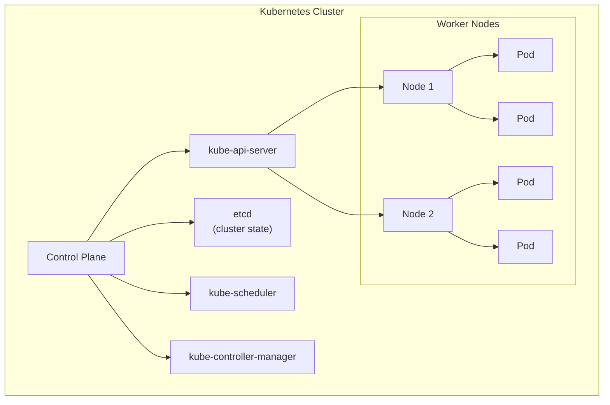

**Core resources:**

| Resource | Purpose |
|----------|---------|
| **Pod** | Smallest deployable unit; one or more co-located containers |
| **Deployment** | Declarative updates, rolling rollouts, rollback |
| **Service** | Stable network endpoint (ClusterIP, NodePort, LoadBalancer) |
| **StatefulSet** | Ordered, stable deployment for stateful workloads (databases) |
| **ConfigMap / Secret** | Configuration and sensitive data injection |
| **Ingress** | HTTP routing to services (path-based, host-based) |
| **Helm** | Package manager for Kubernetes (templated manifests) |

**Key operational concepts:**

- **Declarative desired state**: You declare what you want; Kubernetes continuously reconciles current state with desired state[^116].
- **Self-healing**: Failed containers are restarted; failed nodes are drained and rescheduled.
- **Horizontal Pod Autoscaling (HPA)**: Scales pods based on CPU, memory, or custom metrics.
- **Namespaces**: Logical isolation within a cluster (multi-tenancy, environment separation).

> **Junior Engineer Note:** Kubernetes is not a platform -- it is a platform for building platforms. The Webex guide references EKS (AWS managed Kubernetes), Karpenter (autoscaling), and Helm (packaging). Understanding these components is essential, but the fundamentals (Pods, Deployments, Services, ConfigMaps) are the foundation.

## 6.5 Cloud Computing Models

| Model | What You Manage | What Provider Manages | Examples |
|-------|----------------|----------------------|----------|
| **IaaS** | OS, middleware, runtime, data | Virtualization, servers, storage, networking | AWS EC2, GCP Compute Engine, Azure VMs |
| **PaaS** | Application, data | Everything else | Heroku, Google App Engine, AWS Elastic Beanstalk |
| **SaaS** | Nothing (just use it) | Everything | Gmail, Salesforce, Slack |
| **FaaS** (Serverless) | Application code | Everything else | AWS Lambda, GCP Cloud Functions, Azure Functions |

**Major cloud providers and their backend-relevant services:**

| Category | AWS | GCP | Azure |
|----------|-----|-----|-------|
| **Compute** | EC2, Lambda, ECS, EKS | Compute Engine, Cloud Run, GKE | VMs, Functions, AKS |
| **Database** | RDS, Aurora, DynamoDB, ElastiCache | Cloud SQL, AlloyDB, Firestore, Memorystore | Azure SQL, Cosmos DB, Cache for Redis |
| **Storage** | S3, EBS, EFS | Cloud Storage, Persistent Disk | Blob Storage, Managed Disks |
| **Messaging** | SQS, SNS, MSK (managed Kafka) | Pub/Sub, Managed Kafka | Service Bus, Event Hubs |
| **Networking** | VPC, CloudFront, Route 53, NLB/ALB | VPC, Cloud CDN, Cloud DNS, Cloud Load Balancing | VNet, Front Door, Traffic Manager |

**Key cloud concepts for backend engineers:**

- **Availability Zones (AZs)**: Isolated data centers within a region[^117].
- **Regions**: Geographic areas containing multiple AZs.
- **Multi-region vs. multi-AZ**: Multi-AZ provides fault tolerance within a region; multi-region provides geographic redundancy.
- **Cost optimization**: Reserved instances, spot instances, right-sizing, auto-scaling[^118].

## 6.6 Service Mesh

A service mesh is a dedicated infrastructure layer for managing service-to-service communication[^119]:

| Feature | Description | Implementation |
|---------|-------------|----------------|
| **Traffic management** | Load balancing, routing, retries, circuit breaking | Envoy proxy, Istio |
| **Security** | mTLS between all services (zero-trust networking) | Istio, Linkerd |
| **Observability** | Automatic metrics, logs, traces for all service communication | Istio + Prometheus, Linkerd + Grafana |
| **Policy enforcement** | Rate limiting, access control, quota management | Istio, OPA (Open Policy Agent) |

**Istio** (used at Webex)[^120] deploys an Envoy sidecar proxy alongside each service:

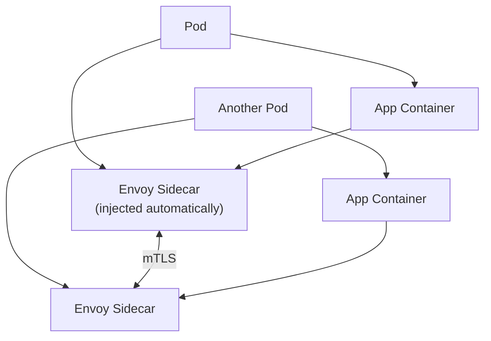

> **Trade-off Alert:** Service meshes add significant operational complexity and resource overhead (each sidecar uses CPU and memory). For small deployments or simple architectures, the overhead may exceed the benefit. The mesh becomes valuable at scale when you need consistent policies across many services[^121].

## 6.7 CI/CD Pipelines

CI/CD automates the path from code change to production deployment[^122]:

| Stage | Activities | Tools |
|-------|------------|-------|
| **Continuous Integration** | Commit, build, test, report | GitHub Actions, GitLab CI, Jenkins |
| **Continuous Delivery** | Package, deploy to staging, validate, manual approval | Same as above + ArgoCD, Spinnaker |
| **Continuous Deployment** | Automated deployment to production on merge | Same + feature flags, canary analysis |

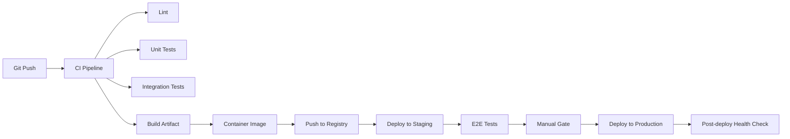

**Pipeline best practices:**

- Fail fast: run fastest checks first (lint, then unit tests, then integration tests)
- Make pipelines reproducible (pinned tool versions, containerized build environments)
- Separate build from deploy: an artifact that passes CI should be deployable to any environment
- Implement rollback capability for every deployment

## 6.8 GitOps and Infrastructure as Code

**Infrastructure as Code (IaC)** manages infrastructure through machine-readable configuration files rather than manual processes[^123]:

| Tool | Type | State Management | Configuration Language |
|------|------|------------------|----------------------|
| **Terraform** | Provisioning | Remote state (S3, Terraform Cloud) | HCL (HashiCorp Configuration Language) |
| **Ansible** | Configuration management | Stateless (push-based) | YAML playbooks |
| **Pulumi** | Provisioning | Remote state | Python, TypeScript, Go |
| **CloudFormation** | Provisioning (AWS) | Managed by AWS | YAML/JSON |

**GitOps** extends IaC by using Git as the single source of truth for both application and infrastructure declarative state[^124]:

- **Push-based**: CI pipeline pushes changes to the cluster (traditional CI/CD).
- **Pull-based**: Agent in the cluster pulls changes from Git (ArgoCD, Flux)[^125].

**ArgoCD** (referenced in the Webex guide) implements GitOps for Kubernetes:

- Watches a Git repository for changes
- Compares desired state (Git) with live state (cluster)
- Automatically syncs or alerts on drift

> **Key Insight:** The Webex engineering blog states they use "infrastructure-as-code and modern GitOps practices, where Git repositories serve as the authoritative source"[^126]. This is the industry standard for production Kubernetes environments.

## 6.9 Deployment Strategies

| Strategy | Downtime | Rollback Speed | Resource Cost | Risk |
|----------|----------|----------------|---------------|------|
| **Rolling update** | Zero | Moderate | Low | Gradual exposure to issues |
| **Blue-green** | Zero | Instant (switch back) | 2x | Expensive; database migration complexity |
| **Canary** | Zero | Fast | Moderate | Requires traffic splitting infrastructure |
| **Recreate** | Yes | Slow | Low | Downtime during transition |
| **Shadow (dark launch)** | Zero | N/A | High | Production traffic duplicated; analysis required |

**Canary deployment detail**: Deploy new version to a small percentage of traffic (1-5%), monitor for errors/latency, then gradually increase. Automated canary analysis can promote or rollback based on metrics[^127].

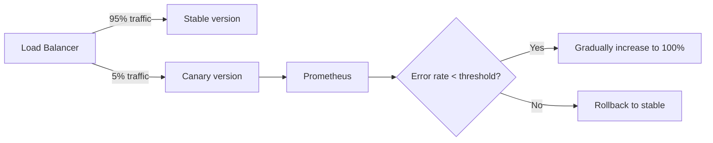

## 6.10 Secret Management

Secrets (API keys, passwords, certificates, encryption keys) must never be stored in code, configuration files, or container images[^128].

| Approach | Pros | Cons |
|----------|------|------|
| **HashiCorp Vault** | Dynamic secrets, fine-grained policies, audit logging | Operational complexity |
| **Kubernetes Secrets** | Native, simple | Base64-encoded (not encrypted) by default; needs etcd encryption |
| **Cloud provider (AWS Secrets Manager, GCP Secret Manager)** | Managed, integrated with IAM | Vendor lock-in |
| **SOPS** (Mozilla) | Git-friendly encrypted files | Manual key management |
| **External secrets operator** | Bridges external secret stores to K8s Secrets | Additional operator dependency |

**Secret management best practices:**

- Never commit secrets to Git (use `.gitignore` and pre-commit hooks)
- Rotate secrets regularly (automate where possible)
- Use least-privilege access (Vault policies, IAM roles)
- Audit secret access (Vault audit logs, CloudTrail)
- Inject secrets at runtime (sidecars, init containers), not at build time

---

[^107]: Linux Foundation. *Linux Kernel Documentation*. kernel.org/doc/html/latest/.
[^108]: The Linux Documentation Project. "Linux Containers in 500 Lines of Code." *LWN.net*, 2019.
[^109]: RFC 7230. *Hypertext Transfer Protocol (HTTP/1.1): Message Syntax and Routing*. IETF, 2014.
[^110]: Mockapetris, P. RFC 1034. *Domain Names -- Concepts and Facilities*. IETF, 1987.
[^111]: Nygard, M. T. *Release It!*, 2018. Chapter 12 discusses CDN patterns.
[^112]: Docker Authors. *What is a Container?* docs.docker.com/get-started/overview. 2024.
[^113]: Google. *Distroless Container Images*. github.com/GoogleContainerTools/distroless. 2024.
[^114]: Aqua Security. *Trivy: Comprehensive Vulnerability Scanner*. github.com/aquasecurity/trivy. 2024.
[^115]: Kubernetes Authors. *Kubernetes Documentation*. kubernetes.io/docs/. Latest stable: 1.30.
[^116]: Burns, B. *Kubernetes Up and Running*, 3rd Edition. O'Reilly, 2022. Chapter 1.
[^117]: AWS Documentation. "Regions and Availability Zones." docs.aws.amazon.com/AWSEC2/latest/UserGuide/.
[^118]: AWS Well-Architected Framework. "Cost Optimization Pillar." docs.aws.amazon.com/wellarchitected/latest/cost-optimization-pillar/.
[^119]: CNCF. "Service Mesh Interface Specification." smi-spec.io. 2020. (Note: SMI is now archived; Istio has its own Gateway API integration.)
[^120]: Istio Authors. *Istio Documentation*. istio.io/latest/docs/. 2024.
[^121]: William Morgan. "Service Mesh Face-Off: Istio vs Linkerd." Buoyant blog. 2022.
[^122]: Humble, J. & Farley, D. *Continuous Delivery: Reliable Software Releases through Build, Test, and Deployment Automation*. Addison-Wesley, 2010.
[^123]: Morris, K. *Infrastructure as Code*, 2nd Edition. O'Reilly, 2020.
[^124]: Weaveworks. *GitOps -- What You Need to Know*. weaveworks.com/what-is-gitops, 2022.
[^125]: Argo Project. *ArgoCD Documentation*. argo-cd.readthedocs.io. 2024.
[^126]: Webex Engineering Blog. "Resilience by Design." blog.webex.com/engineering, 2025.
[^127]: Newman, S. *Building Microservices*, 2021. Chapter 10 (Deploying Microservices).
[^128]: OWASP. "Secrets Management Cheat Sheet." owasp.org/www-project-cheat-sheets/secrets-management-cheat-sheet/. 2023.

---

<!-- PART VII -->


# Part VII: Security Across the Full Stack

---

## 7.1 The Security Mindset

Security is not a feature to be added after development -- it is a property of the entire development lifecycle[^129]. The **"shift-left"** movement advocates integrating security practices early and throughout the software development lifecycle rather than treating it as a final gate[^130].

**Principles of secure engineering:**

| Principle | Description |
|-----------|-------------|
| **Least privilege** | Grant minimum permissions needed for a task |
| **Defense in depth** | Multiple layers of security controls; no single point of failure |
| **Fail securely** | Default to deny access on failure; never fail open |
| **Complete mediation** | Verify authorization on every access, not just the first |
| **Economy of mechanism** | Keep security mechanisms as simple as possible |
| **Psychological acceptability** | Security mechanisms should not make the system unusable |

These principles originate from Saltzer and Schroeder's 1975 paper, "The Protection of Information in Computer Systems," and remain the foundation of security engineering[^131].

## 7.2 OWASP Top 10 -- Application Security Baseline

The OWASP (Open Worldwide Application Security Project) Top 10 lists the most critical web application security risks[^132]:

| Rank | Risk | Key Mitigation |
|------|------|----------------|
| A01 | **Broken Access Control** | Enforce server-side authorization checks on every request |
| A02 | **Cryptographic Failures** | Encrypt sensitive data at rest and in transit; use established libraries |
| A03 | **Injection** (SQL, NoSQL, OS, LDAP) | Use parameterized queries; avoid string concatenation |
| A04 | **Insecure Design** | Threat modeling during design phase |
| A05 | **Security Misconfiguration** | Hardened defaults; automated configuration scanning |
| A06 | **Vulnerable and Outdated Components** | Dependency scanning (SCA); automated updates |
| A07 | **Identification and Authentication Failures** | MFA; rate-limit authentication attempts |
| A08 | **Software and Data Integrity Failures** | Signed releases; supply chain verification |
| A09 | **Security Logging and Monitoring Failures** | Centralized logging; alerting on suspicious patterns |
| A10 | **Server-Side Request Forgery (SSRF)** | Validate and sanitize URLs; restrict outbound network access |

> **Key Insight:** Injection vulnerabilities (A03) remain in the Top 10 after 20+ years because developers continue to build queries through string concatenation. The fix is universally understood (parameterized queries) but not universally applied[^133].

## 7.3 Authentication and Authorization

| Concept | Definition | Common Implementations |
|---------|------------|----------------------|
| **Authentication** | Verifying identity ("who are you?") | Passwords, MFA, SSO, OAuth 2.0, OIDC, SAML |
| **Authorization** | Verifying permissions ("what are you allowed to do?") | RBAC, ABAC, ACLs, policy engines |
| **Accounting** | Tracking actions ("what did you do?") | Audit logs, SIEM |

**Modern authentication patterns:**

| Pattern | Description | When to Use |
|---------|-------------|-------------|
| **Session-based** | Server stores session state; client holds session ID (cookie) | Traditional web apps |
| **Token-based (JWT)** | Client holds signed token containing claims; stateless verification | APIs, SPAs, microservices[^134] |
| **OAuth 2.0** | Delegated authorization; resource owner grants limited access to third party | Third-party API access, social login |
| **OIDC** (OpenID Connect) | Identity layer on top of OAuth 2.0; provides ID tokens with user info | SSO, enterprise authentication |
| **mTLS** | Mutual certificate-based authentication between services | Service-to-service (service mesh) |

**Authorization models:**

| Model | Description | Complexity |
|-------|-------------|------------|
| **RBAC** (Role-Based) | Permissions assigned to roles; users assigned to roles | Low |
| **ABAC** (Attribute-Based) | Permissions based on user/resource/environment attributes | Medium-High |
| **ReBAC** (Relationship-Based) | Permissions based on relationships between entities (Google Zanzibar) | High[^135] |

## 7.4 Encryption -- At Rest, In Transit, and End-to-End

| Scope | Description | Mechanisms |
|-------|-------------|------------|
| **In transit** | Data encrypted during network transport | TLS 1.3, IPSec |
| **At rest** | Data encrypted when stored | AES-256, filesystem-level encryption (LUKS, BitLocker), database encryption (TDE) |
| **End-to-end** | Only communicating parties can decrypt; provider cannot | MLS (Messaging Layer Security), Signal Protocol, PGP |

**TLS 1.3** (the current standard)[^136]:

- Reduced handshake: 1-RTT (0-RTT for resumed connections)
- Removed weak cipher suites (RC4, 3DES, SHA-1, static RSA/DH)
- Forward secrecy mandatory (ephemeral key exchange)
- Encrypted handshake (most metadata now encrypted)

**Key management** is critical: encryption is only as strong as the protection of encryption keys[^137]. Use dedicated key management systems (AWS KMS, HashiCorp Vault, Cloud KMS) rather than storing keys alongside encrypted data.

> **Trade-off Alert:** End-to-end encryption provides strong privacy but prevents server-side processing (search, analytics, compliance monitoring). Webex uses MLS for E2EE[^138] while maintaining server-side capabilities through key escrow and selective decryption with user consent. This tension between privacy and functionality is a fundamental design challenge.

## 7.5 Network Security

| Layer | Mechanism | Purpose |
|-------|-----------|---------|
| **Perimeter** | Firewalls (WAF, network ACLs) | Block unauthorized external access |
| **Network** | VPN, PrivateLink, VPC peering | Secure internal communication across networks |
| **Transport** | mTLS (mutual TLS) | Authenticate and encrypt service-to-service communication |
| **Application** | Input validation, output encoding, CSP headers | Prevent application-level attacks |
| **Zero-trust** | Verify every request regardless of network location | Eliminate implicit trust[^139] |

**Zero-trust architecture** (NIST SP 800-207)[^140]:

Traditional perimeter security assumes everything inside the network is trusted. Zero-trust assumes nothing is trusted. Every request must be authenticated, authorized, and encrypted -- whether it originates inside or outside the network perimeter.

Key components:
- Identity-based access (not network-based)
- Micro-segmentation (least-privilege network access)
- Continuous verification (not just at connection time)
- Device posture checks (endpoint security verification)

The Webex guide describes Webex as implementing "zero-trust architecture" with MLS end-to-end encryption[^141].

## 7.6 Supply Chain Security

Software supply chain attacks target the build and dependency pipeline rather than the application directly[^142]:

| Attack Vector | Example | Mitigation |
|---------------|---------|------------|
| **Dependency confusion** | Malicious package on public registry with same name as internal package | Namespace scoping, version pinning, registry configuration |
| **Compromised dependency** | Popular library backdoored (event-stream, ua-parser-js) | Dependency scanning, SBOM, lock files |
| **Build pipeline compromise** | CI/CD server modified to inject malicious code | Reproducible builds, signed artifacts, isolated build environments |
| **Typosquatting** | Malicious package named similarly to popular package | Careful dependency review, name similarity detection |
| **Git commit signing** | Unsigned commits can be impersonated | GPG/SSH signing, branch protection rules |

**SLSA Framework** (Supply-chain Levels for Software Artifacts)[^143]:

| Level | Description | Requirements |
|-------|-------------|-------------|
| SLSA 1 | Basic integrity | Build process documented; provenance generated |
| SLSA 2 | Hosted build service | Build runs on hosted service; provenance signed |
| SLSA 3 | Hardened builds | Source and build platform verified; non-fresh builds auditable |
| SLSA 4 | Reproducible | Two independent builds produce identical results |

**SBOM** (Software Bill of Materials): A machine-readable list of all components, dependencies, and versions in a software artifact. Mandated for US federal software by Executive Order 14028 (2021)[^144].

## 7.7 Compliance Frameworks

| Framework | Scope | Key Requirements |
|-----------|-------|------------------|
| **SOC 2** | US service organizations | Trust service criteria: security, availability, processing integrity, confidentiality, privacy |
| **FedRAMP** | US federal cloud services | NIST 800-53 controls, continuous monitoring, third-party assessment[^145] |
| **GDPR** | EU personal data | Data minimization, consent, right to erasure, breach notification, DPO |
| **HIPAA** | US health information | Administrative, physical, and technical safeguards for PHI |
| **PCI DSS** | Payment card data | 12 requirements for cardholder data protection |
| **ISO 27001** | Information security management | ISMS (Information Security Management System) requirements |

> **Junior Engineer Note:** Compliance is not optional -- it is a legal and contractual obligation. Webex holds FedRAMP authorization[^146] and FIPS 140-3 compliance, which directly influences how backend engineers handle data storage, encryption, access control, and logging.

## 7.8 Security Testing

| Type | What It Tests | Tools |
|------|---------------|-------|
| **SAST** (Static Application Security Testing) | Source code for vulnerabilities | SonarQube, CodeQL, Semgrep, Bandit |
| **DAST** (Dynamic Application Security Testing) | Running application for vulnerabilities | OWASP ZAP, Burp Suite, Nuclei |
| **SCA** (Software Composition Analysis) | Third-party dependencies for known CVEs | Snyk, Dependabot, Trivy, Grype |
| **IAST** (Interactive Application Security Testing) | Running application with instrumentation | Contrast Security, Hdiv |
| **Penetration testing** | Manual or automated exploitation | Professional pentesters, Metasploit |
| **Threat modeling** | Design-phase risk identification | STRIDE, DREAD, attack trees[^147] |

**Security testing should be integrated into CI/CD:**

- SAST and SCA on every pull request (fast, automated)
- DAST on staging environment before production deployment
- Penetration testing periodically (quarterly for critical systems)
- Threat modeling at design phase (before implementation)

> **Key Insight:** Security testing is necessary but not sufficient. It finds known vulnerability patterns. Threat modeling and secure design address unknown risk categories that automated tools cannot detect[^148].

---

[^129]: OWASP. "Secure Software Development Lifecycle (SSDLC)." owasp.org/www-project-samm/. 2024.
[^130]: Google. "Shift-Left Testing." *SRE Workbook*, 2018. sre.google/workbook/testing-release/.
[^131]: Saltzer, J. H. & Schroeder, M. D. "The Protection of Information in Computer Systems." *Proceedings of the IEEE*, 63(9), 1975.
[^132]: OWASP. "OWASP Top 10 -- 2021." owasp.org/Top10/. 2021.
[^133]: Halfond, W. G. J., Viegas, J., & Orso, A. "A Classification of SQL Injection Attacks and Countermeasures." *Proceedings of the IEEE International Symposium on Secure Software Engineering*, 2006.
[^134]: Jones, M. B., et al. *JSON Web Token (JWT)*. RFC 7519. IETF, 2015.
[^135]: Pang, H., et al. "Zanzibar: Google's Consistent, Global Authorization System." *Proceedings of USENIX ATC*, 2019.
[^136]: Rescorla, E. *The Transport Layer Security (TLS) Protocol Version 1.3*. RFC 8446. IETF, 2018.
[^137]: NIST. "Key Management Recommendations." *Special Publication 800-57 Part 1*. 2020.
[^138]: Webex guide: "MLS (Messaging Layer Security) end-to-end encryption." Based on IETF RFC 9420.
[^139]: Kindervag, J. "No More Chewy Centers: Introducing The Zero Trust Model Of Information Security." *Forrester Research*, 2010.
[^140]: NIST. *Zero Trust Architecture*. Special Publication 800-207. August 2020.
[^141]: Webex guide, Section 1.3.
[^142]: NIST. "Secure Software Development Practices to Mitigate Supply Chain Risks." *NISTIR 8397*. 2022.
[^143]: SLSA Authors. "Supply-chain Levels for Software Artifacts." slsa.dev. 2023.
[^144]: Executive Order 14028. "Improving the Nation's Cybersecurity." The White House, May 12, 2021.
[^145]: FedRAMP. *FedRAMP Authorization Process*. fedramp.gov. 2024.
[^146]: Cisco. "Webex Contact Center Enterprise -- FedRAMP Authorization." cisco.com, 2024.
[^147]: Shostack, A. *Threat Modeling: Designing for Security*. Wiley, 2014.
[^148]: OWASP. "Application Security Verification Standard (ASVS)." owasp.org/www-project-application-security-verification-standard/. 2021.

---

<!-- PART VIII -->


# Part VIII: Testing Strategies

---

## 8.1 Testing Philosophy and the Test Pyramid

The purpose of testing is not to prove software is correct -- it is to increase confidence that software behaves as intended[^149]. Testing is an economic decision: the cost of finding and fixing a defect increases exponentially as it moves from development to production[^150].

### The Test Pyramid

Mike Cohn's Test Pyramid (2009) provides a model for test distribution[^151]:

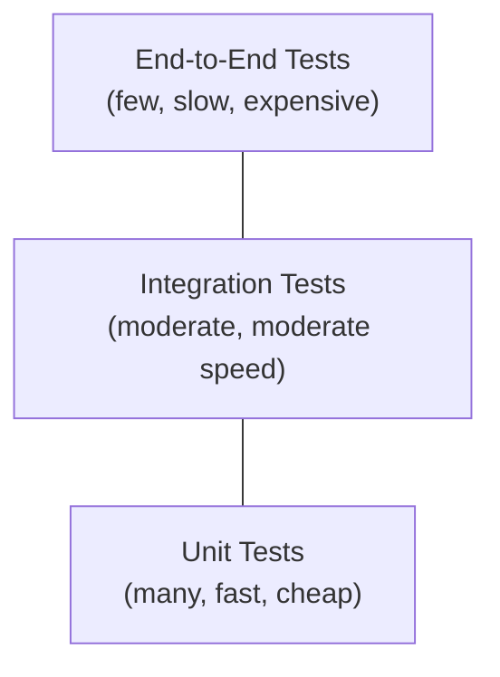

| Level | Scope | Speed | Cost | Quantity |
|-------|-------|-------|------|----------|
| **Unit** | Single function/class | Milliseconds | Low | Most |
| **Integration** | Multiple components together | Seconds | Medium | Moderate |
| **End-to-End** | Full system through UI/API | Minutes | High | Few |

### Alternative Models

The pyramid is not the only valid model. Competing perspectives include:

- **Testing Trophy** (Kent C. Dodds)[^152]: Emphasizes integration tests as the foundation, with unit tests at a moderate level and E2E at the top. Argument: integration tests provide more confidence per test than unit tests while being less brittle than E2E tests.

- **Testing Diamond** (Jason Arleo)[^153]: Integration tests at the core (largest portion), unit tests at the top, and E2E tests at the base. Argument: in modern applications with few external dependencies (mocked/stubbed), integration tests are the most valuable.

> **Key Insight:** The right model depends on your architecture. Microservices with external API boundaries benefit from integration testing (between services). Monolithic applications with complex business logic benefit from unit testing. High-UI applications benefit from E2E testing. Choose your test distribution based on where defects are most likely and most expensive[^154].

## 8.2 Unit Testing

Unit tests verify individual components in isolation[^155]:

**Characteristics of effective unit tests:**

| Property | Description |
|----------|-------------|
| **Fast** | Complete in milliseconds |
| **Deterministic** | Same input always produces same output |
| **Isolated** | No dependency on external systems, databases, or networks |
| **Self-validating** | Automatic pass/fail (no manual inspection) |
| **Timely** | Written at or near the time of production code |

**What to test:**

- Business logic (domain rules, calculations, validations)
- Edge cases (empty inputs, boundary values, error conditions)
- Public API contracts (return types, error behaviors)
- State transitions (state machines)

**What not to test:**

- Framework behavior (testing that Spring autowires correctly)
- Third-party library internals
- Trivial code (getters, setters, pass-throughs)
- Implementation details (test behavior, not structure)[^156]

```python
# Good unit test: tests behavior, not implementation
def test_calculate_total_with_discount():
    order = Order(items=[Item(price=100), Item(price=50)])
    order.apply_discount(PercentDiscount(10))
    assert order.total == 135.0  # (100 + 50) * 0.9

# Bad unit test: tests implementation detail
def test_calculate_total_internal_list():
    order = Order(items=[Item(price=100), Item(price=50)])
    assert len(order._items) == 2  # Tests internal structure
```

## 8.3 Integration Testing

Integration tests verify that components work together correctly[^157]:

| Integration Type | Description | Example |
|------------------|-------------|---------|
| **Component** | Multiple classes/modules within a service | Service + Repository + Database |
| **Service** | Multiple services communicating | API Gateway + Auth Service + User Service |
| **External** | Integration with external systems | Payment API, Email Service, S3 |

**Best practices:**

- Use real databases (testcontainers) rather than mocks for database integration[^158]
- Use contract tests (see [Section 8.5](#85-contract-testing)) for cross-service integration
- Clean up test data (transaction rollback, test containers, dedicated test databases)
- Set reasonable timeouts for integration tests (detect hanging connections)

> **Junior Engineer Note:** Integration tests are where most production bugs originate -- at the boundaries between components. A function may work perfectly in isolation (unit test passes) but fail when connected to a real database or receiving real network responses. Integration tests catch these failures.

## 8.4 End-to-End Testing

E2E tests validate complete user workflows through the production stack[^159]:

| Tool | Type | Use Case |
|------|------|----------|
| **Playwright** | Browser automation | Web UI E2E testing (Webex's current direction[^160]) |
| **Cypress** | Browser automation | Web UI E2E testing (being phased out at Webex) |
| **Selenium** | Browser automation | Legacy web testing |
| **k6 / Locust** | Load/performance | Scalability testing |
| **Postman / REST-assured** | API testing | API workflow validation |

**Trade-offs:**

| Advantage | Disadvantage |
|-----------|-------------|
| Highest confidence (tests real user paths) | Slow (minutes per run) |
| Catches UI bugs, integration bugs, environment bugs | Fragile (breaks with UI changes) |
| Business-readable scenarios | Expensive to maintain |
|  | Cannot run in parallel easily |

> **Trade-off Alert:** The Webex guide references Cypress for E2E testing, while noting that Webex's own repositories are migrating to Playwright. The shift reflects Playwright's superior cross-browser support, faster execution, and better auto-waiting mechanisms. Tool selection should follow evidence, not convention[^161].

## 8.5 Contract Testing

Contract testing verifies that services communicate correctly by validating API specifications (contracts) without requiring integration test environments[^162]:

| Approach | Description | Tools |
|----------|-------------|-------|
| **Consumer-driven** | Consumer defines expected API behavior; provider validates against it | Pact |
| **Provider-driven** | Provider defines API specification; consumers validate against it | OpenAPI, AsyncAPI, gRPC reflection |
| **Bi-directional** | Both consumer and provider verify the same contract | Pact (Bi-Directional) |

**Contract testing vs. integration testing:**

| Aspect | Contract Testing | Integration Testing |
|--------|-----------------|-------------------|
| Environment | No shared environment needed | Requires running services |
| Speed | Fast (in-process) | Slow (network calls) |
| Scope | Interface correctness | End-to-end behavior |
| Coupling | Low (contract is the only dependency) | High (all services must be available) |

The Webex chaos engineering blog mentions contract testing as part of their testing culture[^163].

## 8.6 Property-Based Testing

Property-based testing (PBT) defines properties (invariants) that should hold for all inputs, rather than testing specific input-output pairs[^164]:

| Framework | Language | Approach |
|-----------|----------|---------|
| **Hypothesis** | Python | Generates random inputs; shrinks failing cases |
| **fast-check** | JavaScript/TypeScript | Random value generation with shrinking |
| **QuickCheck** | Haskell (original), ports in many languages | Original PBT framework |
| **PropEr** | Erlang | Property-based testing for Erlang/Elixir |

```python
from hypothesis import given, strategies as st

@given(st.lists(st.integers()))
def test_sort_idempotent(xs):
    """Sorting an already-sorted list should not change it."""
    assert sorted(sorted(xs)) == sorted(xs)

@given(st.lists(st.integers()))
def test_sort_preserves_length(xs):
    """Sorting should not add or remove elements."""
    assert len(sorted(xs)) == len(xs)
```

> **Key Insight:** PBT is particularly valuable for data transformation code, serialization/deserialization, and algorithm implementations. It frequently finds edge cases that human testers never consider[^165].

## 8.7 Performance and Load Testing

Performance testing validates system behavior under load[^166]:

| Type | Purpose | Example |
|------|---------|---------|
| **Load testing** | Expected production load | Simulate 10,000 concurrent users |
| **Stress testing** | Beyond expected capacity | Find the breaking point |
| **Soak/Endurance testing** | Sustained load over time | 8 hours at production traffic |
| **Spike testing** | Sudden traffic surge | 0 to 10,000 users in 30 seconds |
| **Scalability testing** | Verify auto-scaling works | Measure response time as instances scale |

**Tools:**

| Tool | Type | Language | Key Feature |
|------|------|----------|-------------|
| **k6** | Load testing | JavaScript | Developer-friendly scripting, CI integration |
| **Locust** | Load testing | Python | Distributed testing, code-based scenarios |
| **JMeter** | Load testing | Java/XML | GUI-based, wide protocol support |
| **Gatling** | Load testing | Scala | High-performance, detailed reports |
| **wrk / wrk2** | HTTP benchmarking | C | Simple, high-throughput |

**Performance metrics to measure:**

- **Latency**: p50, p95, p99, p99.9 (percentiles, not averages)[^167]
- **Throughput**: requests per second (RPS)
- **Error rate**: percentage of failed requests
- **Resource utilization**: CPU, memory, disk I/O, network I/O
- **Saturation**: queue depth, thread pool utilization

> **Junior Engineer Note:** Average latency is misleading. A system with 100ms average but 10,000ms p99 appears healthy on averages but has a 1% failure rate that affects thousands of users. Always report percentiles[^168].

## 8.8 Chaos Engineering

Chaos engineering is the discipline of experimenting on a system to build confidence in its behavior under turbulent conditions[^169]:

**Principles (from Netflix, formalized by the Principles of Chaos organization)[^170]:**

1. **Steady state**: Define normal behavior (measured by throughput, error rates, latency)
2. **Hypothesize**: "The system will continue to function despite X failure"
3. **Introduce real-world events**: Network latency, packet loss, server failures, resource exhaustion
4. **Observe**: Compare actual behavior against hypothesized behavior
5. **Minimize blast radius**: Start small, in production-like environments

**Common chaos experiments:**

| Experiment | Target | Tool |
|------------|--------|------|
| Kill random containers | Service resilience | Chaos Mesh, LitmusChaos |
| Inject network latency | Timeout handling | Chaos Mesh, ToxiProxy |
| Fill disk | Log rotation, space management | AWS FIS, Chaos Mesh |
| Simulate AZ failure | Multi-AZ resilience | AWS FIS |
| Database failover | Persistence layer resilience | Manual or custom scripts |

> **Key Insight:** Webex runs chaos experiments regularly, including Kafka blips, database failovers, AZ failures, and DNS issues[^171]. Their "Resilience by Design" blog describes an active-active architecture across 3 AZs with a no-maintenance-window philosophy -- chaos engineering is how they verify this works.

## 8.9 Test-Driven Development and Behavior-Driven Development

**TDD** (Test-Driven Development) follows a short cycle[^172]:

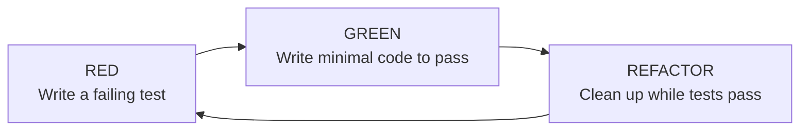

**BDD** (Behavior-Driven Development) extends TDD by writing tests in natural language, typically structured as Gherkin scenarios[^173]:

```gherkin
Feature: Shopping Cart

  Scenario: Apply percentage discount
    Given a cart with items totaling $100
    When a 10% discount is applied
    Then the cart total should be $90
    And the discount amount should be $10
```

**When TDD/BDD adds value:**

- Complex business logic where edge cases are numerous
- APIs where test-as-documentation helps other developers
- Teams transitioning from "no tests" to structured testing

**When TDD/BDD adds overhead:**

- Prototyping and exploration (temporary code)
- UI-heavy work where tests are inherently slow
- Simple CRUD operations with framework-generated code

## 8.10 Test Doubles and Mocking

Test doubles substitute real dependencies in tests[^174]:

| Type | Description | Purpose |
|------|-------------|---------|
| **Dummy** | Passed around but never used | Satisfy parameter requirements |
| **Stub** | Returns predefined values | Provide test data |
| **Spy** | Records calls made for later verification | Verify interactions |
| **Mock** | Pre-programmed with expectations; fails if not met | Verify specific interaction sequences |
| **Fake** | Working implementation with shortcuts (in-memory DB) | Replace expensive real dependencies |

> **Trade-off Alert:** Over-mocking creates tests that verify mock setup rather than business logic. Favor real implementations (testcontainers for databases, HTTP test servers for APIs) over mocks when feasible. Mocks are appropriate for external services you cannot control[^175].

---

[^149]: ISTQB. *ISTQB Foundation Level Syllabus*. Version 4.0. 2023.
[^150]: Boehm, B. & Basili, V. R. "Software Defect Reduction Top 10 List." *IEEE Computer*, 34(1), 2001.
[^151]: Cohn, M. *Succeeding with Agile: Software Development Using Scrum*. Addison-Wesley, 2009. Chapter on testing.
[^152]: Dodds, K. C. "Testing Trophy." Kent C. Dodds Blog. kentcdodds.com/blog/how-i-test. 2018.
[^153]: Arleo, J. "Testing Diamond." Medium post (title approximate), 2019.
[^154]: Fowler, M. "TestPyramid." martinfowler.com/bliki/TestPyramid.html. 2012 (updated).
[^155]: Meszaros, G. *xUnit Test Patterns: Refactoring Test Code*. Addison-Wesley, 2007.
[^156]: Practical approach recommended by: Bounding, G. *97 Things Every Programmer Should Know*. O'Reilly, 2010. Item 10.
[^157]: Voskamp, S. "Integration Testing." (Title approximate.) Principles are well-established in testing literature; see ISTQB syllabus.
[^158]: Testcontainers Authors. *Testcontainers*. testcontainers.org. Java, Go, Python, Node.js libraries.
[^159]: Humble, J. & Farley, D. *Continuous Delivery*, 2010. Chapter 4, "Deploying and Releasing Applications."
[^160]: Webex GitHub repositories (webex/webex-js-sdk) show migration from Cypress to Playwright.
[^161]: Playwright Authors. *Playwright Documentation*. playwright.dev. 2024.
[^162]: Pact Authors. *Pact Documentation*. docs.pact.io. Consumer-driven contract testing.
[^163]: Webex Engineering Blog. "Chaos Engineering in Webex Contact Center." 2023.
[^164]: Claessen, K. & Hughes, J. "QuickCheck: A Lightweight Tool for Random Testing of Haskell Programs." *Proceedings of ICFP '00*, 2000.
[^165]: Pickard, J. "Property-Based Testing." (Title approximate.) Community validation of PBT for finding edge cases is well-documented.
[^166]: ISTQB. *Performance Testing*. ISTQB syllabus section.
[^167]: Gil Tene. "Coordinated Omission." * latencyguru.com*. 2019. (Argument for percentiles over averages.)
[^168]: Drummond, R. "Don't Average Percentiles." *ACM Queue*, 2018.
[^169]: Netflix Technology Blog. "Chaos Engineering: Building Confidence in System Behavior through Experiments." 2011.
[^170]: Principles of Chaos. *principlesofchaos.org*. 2011-present.
[^171]: Webex Engineering Blog. "Chaos Engineering in Webex Contact Center." 2023.
[^172]: Beck, K. *Test Driven Development: By Example*. Addison-Wesley, 2002.
[^173]: North, D. "What's in a Story?" BDD Introduction. danNorth.net, 2006.
[^174]: Meszaros, G. *xUnit Test Patterns*, 2007. Chapter 10 (Test Doubles).
[^175]: Hamcrest authors recommend: "Don't mock everything." Principle is well-established in testing community.

---

<!-- PART IX -->


# Part IX: Observability and Operations

---

## 9.1 The Three Pillars -- Metrics, Logs, Traces

Observability is the ability to understand the internal state of a system from its external outputs[^176]. The three pillars of observability are complementary signal types:

| Pillar | What It Is | Primary Use | Granularity |
|--------|------------|-------------|-------------|
| **Metrics** | Numerical measurements aggregated over time | Dashboards, alerting, capacity planning | Aggregate |
| **Logs** | Discrete timestamped events | Debugging specific incidents, audit trails | Per-event |
| **Traces** | Request flow across distributed services | Latency analysis, dependency mapping, error localization | Per-request |

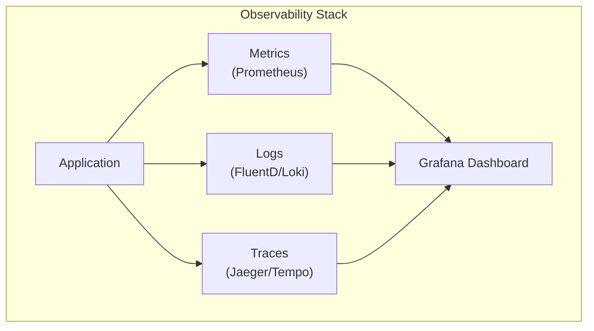

> **Key Insight:** Metrics tell you *what* is wrong, traces tell you *where* it is wrong, and logs tell you *why*. Effective observability requires all three[^177]. Monitoring (predefined dashboards) tells you known failure modes; observability (exploration of unknown states) tells you about failures you have not anticipated.

## 9.2 Structured Logging

Structured logging encodes log data in machine-parseable formats (typically JSON) rather than free-text[^178]:

```json
{
  "timestamp": "2026-07-11T14:30:00.000Z",
  "level": "ERROR",
  "service": "meeting-service",
  "trace_id": "abc-123-def-456",
  "message": "Failed to persist meeting state",
  "error": "ConnectionTimeout",
  "meeting_id": "mtg-789",
  "duration_ms": 5000
}
```

**Structured vs. unstructured logging:**

| Aspect | Unstructured | Structured |
|--------|-------------|------------|
| Human readability | High | Moderate |
| Machine parsing | Difficult (regex) | Native (JSON query) |
| Aggregation | Manual | Automatic (ELK, Loki) |
| Correlation | Impossible | Traces link via trace_id |

**Logging best practices:**

- Use structured JSON format
- Include correlation IDs (trace_id, request_id) in every log line
- Log at appropriate levels (DEBUG, INFO, WARN, ERROR, FATAL)
- Do not log sensitive data (PII, secrets, tokens)
- Use contextual logging (service name, version, environment)
- Aggregate logs centrally (ELK stack, Grafana Loki, Datadog)

## 9.3 Distributed Tracing

Distributed tracing tracks a request as it flows through multiple services[^179]:

| Concept | Description |
|---------|-------------|
| **Trace** | The full path of a request through the system |
| **Span** | A single unit of work within a trace (one service, one database call) |
| **Trace context** | Metadata propagated across service boundaries (trace ID, span ID, sampling flags) |
| **Sampling** | Strategy for deciding which traces to record (all, probabilistic, tail-based) |

**OpenTelemetry** is the CNCF standard for instrumenting applications with metrics, logs, and traces[^180]:

- Vendor-neutral: output to any backend (Jaeger, Zipkin, Grafana Tempo, Datadog)
- Auto-instrumentation for common frameworks (Spring, Express, FastAPI)
- Manual instrumentation for custom spans
- W3C Trace Context propagation standard

**Sampling strategies:**

| Strategy | Description | Trade-off |
|----------|-------------|-----------|
| **Always-on** | Record every trace | Storage cost; high overhead |
| **Probabilistic** | Record X% of traces | Misses rare events |
| **Tail-based** | Record after analysis (errors, high latency) | Requires buffer; captures interesting traces |

> **Junior Engineer Note:** When debugging a production issue in a distributed system, the first thing to check is the trace. A single trace showing the full request path, timing for each span, and error propagation is often more valuable than hours of log searching.

## 9.4 SLI, SLO, SLA, and Error Budgets

These concepts from Google's SRE framework form the bridge between engineering and business[^181]:

| Term | Definition | Example |
|------|------------|---------|
| **SLI** (Service Level Indicator) | A quantitative measure of a specific aspect of service level | 99.95% of requests complete in < 200ms |
| **SLO** (Service Level Objective) | The target value for an SLI over a specified time window | 99.9% availability over 30 days |
| **SLA** (Service Level Agreement) | Contractual commitment with consequences for failure | 99.99% uptime with credits for breach |
| **Error Budget** | 1 - SLO; the allowed proportion of failures | At 99.9% SLO, 0.1% (8.76 hours/year) is the error budget |

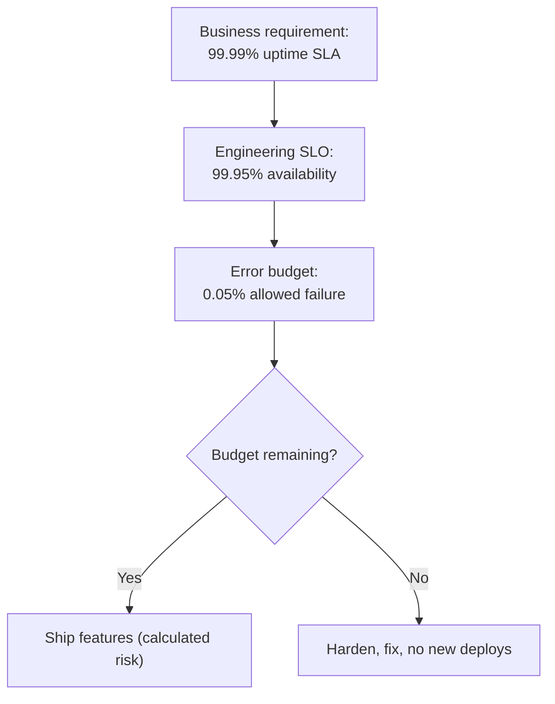

> **Key Insight:** Error budgets turn reliability from an abstract goal into a quantitative trade-off. When the error budget is depleted, the team must stop feature work and focus on reliability. When the budget is healthy, the team can take calculated risks[^182].

**The Webex guide specifies a 99.999% SLA for Webex Calling**, which allows approximately 5.26 minutes of downtime per year[^183]. This extreme reliability requirement shapes every engineering decision: active-active across 3 AZs, no-maintenance-window philosophy, chaos testing, and tiered resiliency.

## 9.5 Alerting Strategy

Effective alerts notify engineers of problems that require human intervention[^184]:

**Alert types by severity:**

| Level | Action Required | Response Time | Example |
|-------|----------------|---------------|---------|
| **Critical** | Immediate intervention | Minutes | Service down, data loss, security breach |
| **Warning** | Investigation needed | Hours | Elevated error rate, high latency, low disk |
| **Info** | Awareness only | Next business day | Deployment completed, auto-scaling event |

**Alerting best practices:**

- Alert on symptoms (high error rate), not causes (disk full)[^185]
- Each alert should be actionable (what to do, runbook link)
- Avoid alert fatigue (tune thresholds, deduplicate, correlate)
- Page only for customer-impacting issues; use non-urgent channels (Slack, email) for everything else
- Monitor error budgets: alert when budget is depleting faster than expected

**Tools:** PagerDuty, Opsgenie, VictorOps, Grafana OnCall

## 9.6 Incident Management and Postmortems

Incident management is the structured process for responding to production incidents[^186]:

| Phase | Activities |
|-------|------------|
| **Detection** | Automated alerts, user reports, monitoring dashboards |
| **Triage** | Assess severity, assemble incident response team, communicate status |
| **Mitigation** | Restore service (rollback, failover, scale up, feature flag) |
| **Resolution** | Root cause fix, not just symptoms |
| **Postmortem** | Blameless analysis of what happened, why, and how to prevent recurrence |

**Incident severity classification (common pattern):**

| Severity | Impact | Example |
|----------|--------|---------|
| **SEV1** | Major customer impact; revenue at risk | Complete service outage |
| **SEV2** | Significant impact; degraded experience | Feature unavailable for subset of users |
| **SEV3** | Minor impact; workaround exists | Performance degradation |
| **SEV4** | No customer impact; operational concern | Certificate expiring soon |

**Blameless postmortem** (a Google SRE practice)[^187]:

- Focus on system and process failures, not individual mistakes
- No-blame does not mean no-accountability -- it means accountability for improvement
- Every significant incident produces a written postmortem
- Action items are tracked and completed with the same rigor as product features

> **Key Insight:** The Webex guide references their "proactive incidents via automated E2E checks" and "ITIL-based processes"[^188]. This is the operational discipline that enables 99.999% uptime -- not heroic firefighting, but systematic prevention and response.

## 9.7 SRE Practices

Site Reliability Engineering (SRE) applies software engineering to operations problems[^189]:

| Practice | Description |
|----------|-------------|
| **Toil reduction** | Automate repetitive operational tasks |
| **Capacity planning** | Predict future resource needs; provision ahead of demand |
| **Change management** | Controlled rollouts with automated rollback on failure |
| **Incident management** | Structured response with severity classification and postmortems |
| **Monitoring** | Dashboards, alerts, and dashboards for service health |
| **Release engineering** | CI/CD pipeline design, canary deployments, feature flags |
| **SLO management** | Error budgets driving engineering priorities |

**Toil** is work that is manual, repetitive, automatable, tactical, and has no enduring value[^190]. SRE teams target minimizing toil (Google's target: <50% of SRE time on toil).

> **Junior Engineer Note:** If you find yourself doing the same operational task more than twice, automate it. Write a script, create a runbook, or build a tool. Your future self (and your teammates) will thank you.

## 9.8 Performance Engineering

Performance engineering is the practice of systematically measuring, analyzing, and optimizing system performance[^191]:

**Key concepts:**

| Concept | Description |
|---------|-------------|
| **Latency** | Time between request and response |
| **Throughput** | Requests handled per unit time |
| **Utilization** | Percentage of capacity in use |
| **Saturation** | How much work is queued waiting for resources |
| **Apdex** (Application Performance Index) | Standardized score (0-1.0) for user satisfaction based on response time |

**Performance anti-patterns:**

| Anti-Pattern | Description | Fix |
|--------------|-------------|-----|
| **N+1 queries** | Fetching related data in a loop instead of a join/batch | Use JOIN, IN queries, or DataLoader |
| **Missing indexes** | Database queries scanning full tables | Analyze query plans; add appropriate indexes |
| **Connection pool exhaustion** | Too few connections for concurrent requests | Tune pool size; use connection pooling |
| **Over-fetching** | Loading more data than needed | Select specific columns; use GraphQL |
| **Synchronous blocking** | Blocking thread waiting for I/O | Use async I/O, non-blocking calls |
| **No caching** | Repeatedly computing/storing the same result | Add caching layer (see [Section 5.9](#59-caching-strategies)) |

> **Trade-off Alert:** Premature optimization (tuning performance before measuring) is harmful[^192]. Measure first, identify bottlenecks with profiling and monitoring, then optimize. The bottleneck is rarely where you expect.

---

[^176]: Majors, C. "What is Observability?" *lightstep.com/blog*, 2017. (Popularized the term in software engineering.)
[^177]: Charity Major. "Observability vs. Monitoring." *Interprete*, 2020.
[^178]: Structured logging is well-established; see: *12 Factor App*, 2011, Section XI (Logs).
[^179]: Google Dapper Authors. "Dapper, a Large-Scale Distributed Systems Tracing Infrastructure." Google Technical Report, 2010.
[^180]: OpenTelemetry Authors. *OpenTelemetry Documentation*. opentelemetry.io/docs/. 2024.
[^181]: Beyer, B., et al. *Site Reliability Engineering*, 2016. Chapters 4 (SLOs) and 6 (Monitoring).
[^182]: Beyer, B., et al. *The Site Reliability Workbook*. O'Reilly, 2018. Chapter 31 (SLO Engineering).
[^183]: Webex Calling Enterprise Page. "99.999% SLA." webex.com/enterprise-cloud-calling.html.
[^184]: Beyer, B., et al. *Site Reliability Engineering*, 2016. Chapter 5, "Monitoring Distributed Systems."
[^185]: Rob Ewaschuk. "My Philosophy on Alerting." Google SRE presentation, 2012.
[^186]: Beyer, B., et al. *Site Reliability Engineering*, 2016. Chapter 14 (Emergency Response).
[^187]: Google SRE. "Postmortem Culture: Learning from Failure." *site reliabilityengineering.googleblog.com*, 2016.
[^188]: Webex guide, Section 1.4 (Engineering Culture).
[^189]: Beyer, B., et al. *Site Reliability Engineering*, 2016. Full text.
[^190]: Beyer, B., et al. *Site Reliability Engineering*, 2016. Chapter 5, "Eliminating Toil."
[^191]: Gunther, N. J. *The Art of Capacity Planning*. 2nd Edition. O'Reilly, 2007.
[^192]: Knuth, D. E. "Structured Programming with go to Statements." *ACM Computing Surveys*, 6(4), 1974.

---

<!-- PART X -->


# Part X: Professional and Interpersonal Dimensions

---

## 10.1 Technical Communication

Technical communication is the ability to convey complex technical concepts clearly and accurately to different audiences[^193]:

| Audience | Communication Style | Format |
|----------|-------------------|--------|
| **Fellow engineers** | Precise, jargon-acceptable, code-inclusive | PRs, code comments, design docs |
| **Product managers** | Outcome-focused, trade-off oriented, non-technical impact | Design proposals, sprint planning, roadmap discussions |
| **Leadership** | Business impact, risk, timeline, resource needs | Technical briefs, status updates, escalation docs |
| **Cross-functional** | Concrete examples, shared vocabulary, visual aids | Architecture diagrams, runbooks, incident reports |

**Essential communication practices:**

- **Write before you code**: Design docs clarify thinking and catch issues early[^194].
- **Communicate uncertainty**: "I don't know, but I can find out" is a valid and respected answer.
- **Ask clarifying questions**: Misunderstood requirements are the most expensive source of rework.
- **Document decisions**: What was decided, why, what alternatives were considered (see ADRs below).

## 10.2 Technical Writing and Documentation

### Architecture Decision Records (ADRs)

ADRs capture significant architectural decisions with context and rationale[^195]:

```markdown
# ADR-001: Use Kafka for Event Streaming

## Status
Accepted

## Context
Our services need to communicate asynchronously. We require durable,
replayable event streams for CQRS projections and analytics.

## Decision
We will use Apache Kafka (managed via Strimzi on Kubernetes) as the
central event backbone.

## Consequences
- Positive: Durable log enables replay; multi-consumer support; high throughput
- Negative: Operational complexity; requires monitoring topic lag
- Risks: Topic partitioning strategy must be designed upfront
```

### Documentation Types

| Type | Purpose | Audience | Update Frequency |
|------|---------|----------|-----------------|
| **README** | Getting started, quick reference | New developers | On every significant change |
| **API docs** | Endpoint specifications | API consumers | On every API change (auto-generated) |
| **Architecture docs** | System design rationale | Engineers, architects | Quarterly or on major changes |
| **Runbooks** | Operational procedures | On-call engineers | After every incident |
| **ADRs** | Decision rationale | Engineers | Once per decision (append only) |

**The arc42 framework** provides a template for documenting software architecture[^196]:

1. Introduction and goals
2. Constraints
3. System scope and context
4. Solution strategy
5. Building block view
6. Runtime view
7. Deployment view
8. Cross-cutting concepts
9. Architectural decisions
10. Technical risks
11. Glossary

> **Key Insight:** Documentation is a gift to your future self and your teammates. Undocumented systems become "tribal knowledge" that is lost when team members leave. Write documentation as if the person reading it has never seen the system and is debugging a production incident at 3 AM.

## 10.3 Collaboration and Team Dynamics

| Practice | Description | Evidence of Value |
|----------|-------------|-------------------|
| **Pair programming** | Two engineers work on one workstation | Studies show 15% more time but significantly fewer defects[^197] |
| **Mob programming** | Entire team works on one problem simultaneously | Effective for complex design decisions and knowledge sharing |
| **Code review** | Systematic peer review of code changes | 60-90% defect reduction[^198] |
| **Design review** | Collaborative review of architectural proposals | Catches design flaws before implementation |
| **Knowledge sharing** | Tech talks, brown bags, internal wikis | Reduces bus factor; accelerates onboarding |

**The bus factor** (also "truck factor"): The minimum number of team members who must be hit by a bus before the project stalls. A bus factor of 1 is a critical risk. Knowledge sharing practices (pair rotation, documentation, cross-training) increase the bus factor[^199].

**Remote collaboration practices:**

- Written communication over verbal (creates durable record)
- Asynchronous-first (meetings as last resort)
- Over-communicate context in PRs, issues, and docs
- Explicit status updates (do not assume visibility)

## 10.4 Agile, Lean, and Delivery Practices

### Agile Manifesto (2001)

Four values that prioritize flexibility and delivery[^200]:

1. Individuals and interactions over processes and tools
2. Working software over comprehensive documentation
3. Customer collaboration over contract negotiation
4. Responding to change over following a plan

### The Scrum Framework (2020)

The most widely adopted agile methodology[^201]:

| Element | Description | Cadence |
|---------|-------------|---------|
| **Sprint** | Time-boxed iteration (1-4 weeks) | Every sprint |
| **Sprint Planning** | Team selects work for the sprint | Start of sprint |
| **Daily Standup** | Synchronize and identify blockers | Daily, 15 min |
| **Sprint Review** | Demo completed work to stakeholders | End of sprint |
| **Sprint Retrospective** | Team reflects on process improvements | End of sprint |

**Kanban** is an alternative delivery framework focused on flow[^202]:

- Visualize work (Kanban board)
- Limit work in progress (WIP limits)
- Manage flow (measure and optimize cycle time)
- Make policies explicit
- Continuous improvement

> **Trade-off Alert:** Agile methodologies have been both over-applied (ceremony without substance) and under-applied (waterfall with agile labels). The core insight -- delivering incrementally and adapting to feedback -- is what matters, not whether you follow Scrum, Kanban, or another framework strictly.

### Extreme Programming (XP)

XP practices that remain relevant[^203]:

- Pair programming
- Test-driven development
- Continuous integration
- Simple design
- Refactoring
- Collective code ownership

## 10.5 Career Development and Growth

### Engineering Career Tracks

Most engineering organizations have dual career tracks[^204]:

| Track | Focus | Growth Path |
|-------|-------|-------------|
| **Individual Contributor (IC)** | Technical depth and breadth | Junior -> Mid -> Senior -> Staff -> Principal -> Distinguished |
| **Management** | People, process, and organizational leadership | Tech Lead -> Engineering Manager -> Director -> VP -> CTO |

**Will Larson's framework for Staff+ roles** (*Staff Engineer*, 2021)[^205]:

| Role | Scope | Primary Contribution |
|------|-------|---------------------|
| **Senior Engineer** | One team | Technical expertise and mentoring |
| **Staff Engineer** | Multiple teams / one domain | Technical strategy, cross-team coordination |
| **Principal Engineer** | Entire organization | Industry-wide technical vision |
| **Distinguished Engineer** | Company + industry | External influence and long-term technical direction |

**Effective learning strategies for junior engineers:**

| Strategy | Description | Impact |
|----------|-------------|--------|
| **Deliberate practice** | Targeted improvement on weak areas | Highest ROI |
| **Reading code** | Study well-written production code | Understands patterns in context |
| **Writing code** | Build projects, contribute to open source | Develops implementation skill |
| **Building in public** | Share learnings via blogs, talks, mentoring | Reinforces understanding and builds network |
| **Reading postmortems** | Learn from others' failures without experiencing them | Develops failure intuition |
| **Pairing with seniors** | Work alongside experienced engineers | Accelerates skill transfer |

> **Key Insight:** The Webex guide explicitly mentions that engineering roles value "curiosity and adaptability" and "bringing your fun, curiosity, and personality"[^206]. Technical skill gets you the interview; curiosity and growth mindset get you the career.

### Git Workflow Models

| Model | Description | Best For |
|-------|-------------|----------|
| **Trunk-based** | All developers commit to a single branch (main/trunk); short-lived feature branches | Small teams, continuous delivery[^207] |
| **GitFlow** | Separate branches for features, releases, hotfixes, and development | Scheduled releases, long-lived support branches |
| **GitHub Flow** | Feature branches + pull requests to main | Most modern web applications |
| **Release Flow** | Main + release branches (Microsoft's model) | Products with scheduled releases |

The Webex guide references GitHub Actions, GitLab CI, and Jenkins for CI/CD, with trunk-based or GitHub Flow as the predominant patterns in cloud-native development[^208].

---

[^193]: Technical communication principles from: Markel, S. *Technical Communication*. 12th Edition. McGraw-Hill, 2019.
[^194]: Google Engineering Practices Documentation. "Design Docs at Google." abseil.io/resources/swe-book/html/ch09.html.
[^195]: Nygard, M. T. "Documenting Architecture Decisions." *cognitect.com/blog*, 2011. (Original ADR proposal.)
[^196]: Gernot Starke, Peter Hruschka, et al. *arc42: Practical Software Architecture Documentation*. arc42.org. 2024.
[^197]: Laurie Williams, et al. "Strengthening the Case for Pair Programming." *IEEE Software*, 17(4), 2000. (15% more time, 15% fewer defects.)
[^198]: McConnell, S. *Code Complete*, 2004. Chapter 20.
[^199]: "The Bus Factor." *wiki.c2.com*. (Origin of the term in software engineering.)
[^200]: Beck, K., et al. *Manifesto for Agile Software Development*. agilemanifesto.org, 2001.
[^201]: Schwaber, K. & Sutherland, J. *The Scrum Guide*. Scrum.org, 2020.
[^202]: Anderson, D. J. *Kanban: Successful Evolutionary Change for Your Technology Business*. Blue Hole Press, 2010.
[^203]: Beck, K. *Extreme Programming Explained: Embrace Change*. 2nd Edition. Addison-Wesley, 2004.
[^204]: Spolsky, J. "The Joel Test: 12 Steps to Better Code." *Joel on Software*, 2000.
[^205]: Larson, W. *Staff Engineer: Leadership Beyond the Management Track*. Will Larson, 2021.
[^206]: Webex guide, Section 1.8.
[^207]: Humble, J. & Farley, D. *Continuous Delivery*, 2010. Advocates trunk-based development.
[^208]: Webex guide, Section 1.5 (Technology Stack).

---

<!-- BACK MATTER -->


# Back Matter

---

## Cross-Reference Index

This index connects related concepts across sections. Use it to trace how a concept in one domain relates to others.

| Concept | Primary Section | Related Sections |
|---------|----------------|-----------------|
| **ACID transactions** | [5.7](#57-data-layer--databases-and-storage) | [5.5](#55-cqrs-and-event-sourcing), [5.1](#51-the-monolith--still-the-default-starting-point) |
| **Active-active deployment** | [6.9](#69-deployment-strategies) | [9.4](#94-sli-slo-sla-and-error-budgets), [5.2](#52-distributed-systems-fundamentals) |
| **Actor model** | [3.3](#33-concurrency-and-parallelism) | [4.4](#44-event-driven-programming), [5.4](#54-event-driven-architecture) |
| **Alerting** | [9.5](#95-alerting-strategy) | [9.1](#91-the-three-pillars--metrics-logs-traces), [9.7](#97-sre-practices) |
| **API design** | [5.6](#56-api-design) | [7.3](#73-authentication-and-authorization), [8.5](#85-contract-testing) |
| **Async/Await** | [3.3](#33-concurrency-and-parallelism) | [4.3](#43-reactive-programming), [4.4](#44-event-driven-programming) |
| **Availability Zones** | [6.5](#65-cloud-computing-models) | [5.2](#52-distributed-systems-fundamentals), [9.4](#94-sli-slo-sla-and-error-budgets) |
| **Big-O notation** | [3.2](#32-algorithms-and-computational-complexity) | [3.1](#31-data-structures), [9.8](#98-performance-engineering) |
| **Cache-aside pattern** | [5.9](#59-caching-strategies) | [9.8](#98-performance-engineering), [3.1](#31-data-structures) |
| **Circuit breaker** | [5.10](#510-resilience-patterns) | [5.3](#53-microservices-architecture), [6.6](#66-service-mesh) |
| **Clean Architecture** | [2.1](#21-solid-principles) | [5.3](#53-microservices-architecture), [2.3](#23-separation-of-concerns-and-modularity) |
| **Cloud computing** | [6.5](#65-cloud-computing-models) | [6.3](#63-containerization), [6.4](#64-container-orchestration--kubernetes) |
| **Code review** | [2.6](#26-code-review-as-a-discipline) | [10.3](#103-collaboration-and-team-dynamics), [7.8](#78-security-testing) |
| **Community of practice** | [10.3](#103-collaboration-and-team-dynamics) | [10.5](#105-career-development-and-growth) |
| **Compliance** | [7.7](#77-compliance-frameworks) | [7.4](#74-encryption--at-rest-in-transit-and-end-to-end), [7.3](#73-authentication-and-authorization) |
| **Concurrency** | [3.3](#33-concurrency-and-parallelism) | [4.3](#43-reactive-programming), [4.4](#44-event-driven-programming) |
| **Containerization** | [6.3](#63-containerization) | [6.4](#64-container-orchestration--kubernetes), [6.10](#610-secret-management) |
| **Contract testing** | [8.5](#85-contract-testing) | [8.3](#83-integration-testing), [5.6](#56-api-design) |
| **CQRS** | [5.5](#55-cqrs-and-event-sourcing) | [4.4](#44-event-driven-programming), [5.4](#54-event-driven-architecture) |
| **Data structures** | [3.1](#31-data-structures) | [5.7](#57-data-layer--databases-and-storage), [3.2](#32-algorithms-and-computational-complexity) |
| **Deadlock** | [3.3](#33-concurrency-and-parallelism) | [9.6](#96-incident-management-and-postmortems) |
| **Dependency injection** | [2.1](#21-solid-principles) | [2.3](#23-separation-of-concerns-and-modularity) |
| **Deployment strategies** | [6.9](#69-deployment-strategies) | [6.7](#67-cicd-pipelines), [6.8](#68-gitops-and-infrastructure-as-code) |
| **Design patterns** | [2.4](#24-design-patterns--gang-of-four-and-beyond) | [4.1](#41-object-oriented-programming), [5.10](#510-resilience-patterns) |
| **DevOps** | [6.8](#68-gitops-and-infrastructure-as-code) | [9.7](#97-sre-practices), [6.7](#67-cicd-pipelines) |
| **Distributed tracing** | [9.3](#93-distributed-tracing) | [9.1](#91-the-three-pillars--metrics-logs-traces), [5.3](#53-microservices-architecture) |
| **DNS** | [3.5](#35-networking-fundamentals) | [6.2](#62-networking-load-balancing-and-dns) |
| **DRY principle** | [2.2](#22-dry-kiss-yagni-and-related-axioms) | [2.3](#23-separation-of-concerns-and-modularity), [2.5](#25-refactoring-and-technical-debt) |
| **Docker** | [6.3](#63-containerization) | [6.4](#64-container-orchestration--kubernetes), [6.7](#67-cicd-pipelines) |
| **Event-driven architecture** | [5.4](#54-event-driven-architecture) | [4.4](#44-event-driven-programming), [5.5](#55-cqrs-and-event-sourcing) |
| **Event sourcing** | [5.5](#55-cqrs-and-event-sourcing) | [5.4](#54-event-driven-architecture), [5.8](#58-message-brokers-and-streaming) |
| **Fault tolerance** | [5.10](#510-resilience-patterns) | [5.2](#52-distributed-systems-fundamentals), [9.4](#94-sli-slo-sla-and-error-budgets) |
| **First principles** | [1.2](#12-first-principles-thinking) | [1.3](#13-systems-thinking) |
| **Functional programming** | [4.2](#42-functional-programming) | [4.3](#43-reactive-programming), [3.3](#33-concurrency-and-parallelism) |
| **gRPC** | [5.6](#56-api-design) | [5.3](#53-microservices-architecture), [6.6](#66-service-mesh) |
| **GitOps** | [6.8](#68-gitops-and-infrastructure-as-code) | [6.7](#67-cicd-pipelines), [6.9](#69-deployment-strategies) |
| **Hash tables** | [3.1](#31-data-structures) | [5.9](#59-caching-strategies) |
| **Incident management** | [9.6](#96-incident-management-and-postmortems) | [9.7](#97-sre-practices), [9.5](#95-alerting-strategy) |
| **Kafka** | [5.8](#58-message-brokers-and-streaming) | [5.4](#54-event-driven-architecture), [5.5](#55-cqrs-and-event-sourcing) |
| **Kubernetes** | [6.4](#64-container-orchestration--kubernetes) | [6.3](#63-containerization), [6.6](#66-service-mesh) |
| **Load balancing** | [6.2](#62-networking-load-balancing-and-dns) | [5.10](#510-resilience-patterns), [5.3](#53-microservices-architecture) |
| **Message brokers** | [5.8](#58-message-brokers-and-streaming) | [5.4](#54-event-driven-architecture), [4.4](#44-event-driven-programming) |
| **Microservices** | [5.3](#53-microservices-architecture) | [5.1](#51-the-monolith--still-the-default-starting-point), [6.6](#66-service-mesh) |
| **mTLS** | [7.5](#75-network-security) | [6.6](#66-service-mesh), [7.3](#73-authentication-and-authorization) |
| **NoSQL** | [5.7](#57-data-layer--databases-and-storage) | [3.1](#31-data-structures) |
| **OAuth 2.0 / OIDC** | [7.3](#73-authentication-and-authorization) | [5.6](#56-api-design) |
| **OOP** | [4.1](#41-object-oriented-programming) | [2.1](#21-solid-principles), [2.4](#24-design-patterns--gang-of-four-and-beyond) |
| **OpenTelemetry** | [9.3](#93-distributed-tracing) | [9.1](#91-the-three-pillars--metrics-logs-traces) |
| **OWASP** | [7.2](#72-owasp-top-10--application-security-baseline) | [7.8](#78-security-testing), [7.1](#71-the-security-mindset) |
| **PostgreSQL** | [5.7](#57-data-layer--databases-and-storage) | [5.5](#55-cqrs-and-event-sourcing), [8.3](#83-integration-testing) |
| **Rate limiting** | [5.10](#510-resilience-patterns) | [7.5](#75-network-security), [6.6](#66-service-mesh) |
| **React** | [Part VI reference in Webex guide] | [2.3](#23-separation-of-concerns-and-modularity) |
| **Redis** | [5.8](#58-message-brokers-and-streaming) | [5.9](#59-caching-strategies) |
| **REST** | [5.6](#56-api-design) | [8.5](#85-contract-testing) |
| **Retry with backoff** | [5.10](#510-resilience-patterns) | [3.5](#35-networking-fundamentals), [9.8](#98-performance-engineering) |
| **SOLID** | [2.1](#21-solid-principles) | [4.1](#41-object-oriented-programming) |
| **SLI/SLO/SLA** | [9.4](#94-sli-slo-sla-and-error-budgets) | [9.7](#97-sre-practices), [9.5](#95-alerting-strategy) |
| **Service mesh** | [6.6](#66-service-mesh) | [5.3](#53-microservices-architecture), [7.5](#75-network-security) |
| **Structured logging** | [9.2](#92-structured-logging) | [9.3](#93-distributed-tracing), [9.1](#91-the-three-pillars--metrics-logs-traces) |
| **TDD** | [8.9](#89-test-driven-development-and-behavior-driven-development) | [8.2](#82-unit-testing), [2.5](#25-refactoring-and-technical-debt) |
| **Testing pyramid** | [8.1](#81-testing-philosophy-and-the-test-pyramid) | [8.2](#82-unit-testing), [8.3](#83-integration-testing), [8.4](#84-end-to-end-testing) |
| **Threat modeling** | [7.8](#78-security-testing) | [7.1](#71-the-security-mindset), [7.2](#72-owasp-top-10--application-security-baseline) |
| **TLS** | [7.4](#74-encryption--at-rest-in-transit-and-end-to-end) | [3.5](#35-networking-fundamentals), [7.5](#75-network-security) |
| **Zero-trust** | [7.5](#75-network-security) | [7.3](#73-authentication-and-authorization), [6.6](#66-service-mesh) |

---

## Glossary

| Term | Definition | Section |
|------|-----------|---------|
| **ABAC** | Attribute-Based Access Control; authorization based on attributes of the user, resource, and environment | [7.3](#73-authentication-and-authorization) |
| **ACID** | Atomicity, Consistency, Isolation, Durability; properties guaranteeing reliable database transactions | [5.7](#57-data-layer--databases-and-storage) |
| **ADR** | Architecture Decision Record; a document capturing the context, decision, and rationale for an architectural choice | [10.2](#102-technical-writing-and-documentation) |
| **API** | Application Programming Interface; a contract defining how software components communicate | [5.6](#56-api-design) |
| **AVL Tree** | A self-balancing binary search tree where the heights of two child subtrees differ by at most one | [3.1](#31-data-structures) |
| **BDD** | Behavior-Driven Development; a testing methodology extending TDD with natural-language specifications | [8.9](#89-test-driven-development-and-behavior-driven-development) |
| **Big-O** | Mathematical notation describing the upper bound of algorithm complexity as input grows | [3.2](#32-algorithms-and-computational-complexity) |
| **Bulkhead** | A resilience pattern isolating failure domains to prevent cascading failures | [5.10](#510-resilience-patterns) |
| **Canary deployment** | Releasing to a small subset of users before full rollout | [6.9](#69-deployment-strategies) |
| **CAP theorem** | Consistency, Availability, Partition tolerance -- at most two can be guaranteed simultaneously in a distributed system | [5.2](#52-distributed-systems-fundamentals) |
| **Circuit breaker** | A resilience pattern that stops calls to a failing service and periodically tests for recovery | [5.10](#510-resilience-patterns) |
| **CQRS** | Command Query Responsibility Segregation; separating read and write models | [5.5](#55-cqrs-and-event-sourcing) |
| **CRDT** | Conflict-free Replicated Data Type; a data structure that can be replicated and updated independently with guaranteed convergence | [5.2](#52-distributed-systems-fundamentals) |
| **DDL** | Data Definition Language; SQL statements that define or modify schema structure | [5.7](#57-data-layer--databases-and-storage) |
| **Dead letter queue** | A queue where messages are sent when processing fails after maximum retries | [5.10](#510-resilience-patterns) |
| **Deployment strategy** | A systematic approach to releasing new versions (rolling, blue-green, canary, etc.) | [6.9](#69-deployment-strategies) |
| **Distributed tracing** | Tracking a request as it flows through multiple services in a distributed system | [9.3](#93-distributed-tracing) |
| **DLQ** | Dead Letter Queue | [5.10](#510-resilience-patterns) |
| **DNS** | Domain Name System; translates domain names to IP addresses | [3.5](#35-networking-fundamentals) |
| **EDR** | Error Budget Rate; 1 - SLO, defining acceptable failure proportion | [9.4](#94-sli-slo-sla-and-error-budgets) |
| **EKS** | Elastic Kubernetes Service; AWS's managed Kubernetes service | [6.4](#64-container-orchestration--kubernetes) |
| **Event sourcing** | Storing state changes as an immutable sequence of events | [5.5](#55-cqrs-and-event-sourcing) |
| **Exponential backoff** | Retry strategy where wait time increases exponentially between attempts | [5.10](#510-resilience-patterns) |
| **Fan-out** | A pattern where a single message is delivered to multiple subscribers | [5.4](#54-event-driven-architecture) |
| **FedRAMP** | Federal Risk and Authorization Management Program; US government cloud security standard | [7.7](#77-compliance-frameworks) |
| **FIPS 140-3** | Federal Information Processing Standard for cryptographic modules | [7.4](#74-encryption--at-rest-in-transit-and-end-to-end) |
| **gRPC** | Google's high-performance RPC framework using Protocol Buffers and HTTP/2 | [5.6](#56-api-design) |
| **HMAC** | Hash-based Message Authentication Code; cryptographic authentication for messages | [7.2](#72-owasp-top-10--application-security-baseline) |
| **IaC** | Infrastructure as Code; managing infrastructure through machine-readable configuration files | [6.8](#68-gitops-and-infrastructure-as-code) |
| **IaaS** | Infrastructure as a Service; cloud model providing virtualized computing resources | [6.5](#65-cloud-computing-models) |
| **IAM** | Identity and Access Management | [7.3](#73-authentication-and-authorization) |
| **JWT** | JSON Web Token; a compact, URL-safe means of representing claims between parties | [7.3](#73-authentication-and-authorization) |
| **Kafka** | Apache Kafka; a distributed event streaming platform | [5.8](#58-message-brokers-and-streaming) |
| **Karpenter** | An open-source Kubernetes node autoscaler | [6.4](#64-container-orchestration--kubernetes) |
| **Kubernetes** | An open-source container orchestration platform | [6.4](#64-container-orchestration--kubernetes) |
| **MVCC** | Multi-Version Concurrency Control; database technique allowing concurrent reads and writes via snapshots | [5.7](#57-data-layer--databases-and-storage) |
| **mTLS** | Mutual TLS; bidirectional certificate-based authentication | [7.5](#75-network-security) |
| **NAT** | Network Address Translation; maps private IP addresses to public ones | [6.2](#62-networking-load-balancing-and-dns) |
| **NoSQL** | Database category non-relational databases (document, key-value, column-family, graph) | [5.7](#57-data-layer--databases-and-storage) |
| **OIDC** | OpenID Connect; identity layer on top of OAuth 2.0 | [7.3](#73-authentication-and-authorization) |
| **OpenTelemetry** | CNCF standard for instrumenting applications with metrics, logs, and traces | [9.3](#93-distributed-tracing) |
| **PACELC** | Extension of CAP: in partition choose A or C; else choose L or C | [5.2](#52-distributed-systems-fundamentals) |
| **PBT** | Property-Based Testing; defining properties (invariants) rather than specific test cases | [8.6](#86-property-based-testing) |
| **Paxos** | A family of protocols for achieving consensus in a distributed system | [5.2](#52-distributed-systems-fundamentals) |
| **Protocol Buffers** | Google's language-neutral binary serialization format | [5.6](#56-api-design) |
| **RBAC** | Role-Based Access Control; authorization based on assigned roles | [7.3](#73-authentication-and-authorization) |
| **Raft** | A consensus algorithm designed for understandability, equivalent to Paxos | [5.2](#52-distributed-systems-fundamentals) |
| **Reactive Streams** | Standard for asynchronous stream processing with backpressure | [4.3](#43-reactive-programming) |
| **REST** | Representational State Transfer; an architectural style for networked hypermedia systems | [5.6](#56-api-design) |
| **SAST** | Static Application Security Testing; analyzing source code without execution | [7.8](#78-security-testing) |
| **SBOM** | Software Bill of Materials; machine-readable list of all components in a software artifact | [7.6](#76-supply-chain-security) |
| **SLSA** | Supply-chain Levels for Software Artifacts; framework for supply chain security | [7.6](#76-supply-chain-security) |
| **SLO** | Service Level Objective; target value for an SLI over a specified time window | [9.4](#94-sli-slo-sla-and-error-budgets) |
| **SLI** | Service Level Indicator; quantitative measure of a specific aspect of service performance | [9.4](#94-sli-slo-sla-and-error-budgets) |
| **Sliding window** | Rate limiting algorithm counting requests within a moving time window | [5.10](#510-resilience-patterns) |
| **Smart quotes** | N/A | [9.8](#98-performance-engineering) |
| **Span** | A single unit of work within a distributed trace | [9.3](#93-distributed-tracing) |
| **TDD** | Test-Driven Development; writing tests before production code | [8.9](#89-test-driven-development-and-behavior-driven-development) |
| **Toil** | Manual, repetitive, automatable operational work with no enduring value | [9.7](#97-sre-practices) |
| **Token bucket** | Rate limiting algorithm using a bucket that fills at a constant rate | [5.10](#510-resilience-patterns) |
| **VPC** | Virtual Private Cloud; isolated network within a cloud provider | [6.5](#65-cloud-computing-models) |
| **WAL** | Write-Ahead Log; persistence mechanism ensuring data integrity | [5.7](#57-data-layer--databases-and-storage) |
| **WebSocket** | Full-duplex persistent connection protocol over a single TCP connection | [3.5](#35-networking-fundamentals) |
| **Zero-trust** | Security model requiring strict identity verification for every request regardless of network location | [7.5](#75-network-security) |

---

## Bibliography

### Foundational Books

1. Beck, K. *Test Driven Development: By Example*. Addison-Wesley, 2002.
2. Beck, K. *Extreme Programming Explained: Embrace Change*. 2nd Edition. Addison-Wesley, 2004.
3. Burns, B. & Oppenheimer, D. "Design Patterns for Container-Based Distributed Systems." *HotCloud '16*, 2016.
4. Burns, B. *Kubernetes Up and Running*. 3rd Edition. O'Reilly Media, 2022.
5. Brooks, F. P. *The Mythical Man-Month*. 20th Anniversary Edition. Addison-Wesley, 1995.
6. Beyer, B., Jones, C., Petoff, J., & Murphy, N. R. *Site Reliability Engineering*. O'Reilly Media, 2016.
7. Beyer, B., et al. *The Site Reliability Workbook*. O'Reilly Media, 2018.
8. Booch, G. *Object-Oriented Analysis and Design with Applications*. 3rd Edition. Addison-Wesley, 2007.
9. Date, C. J. *An Introduction to Database Systems*. 8th Edition. Addison-Wesley, 2003.
10. Evans, E. *Domain-Driven Design: Tackling Complexity in the Heart of Software*. Addison-Wesley, 2003.
11. Fowler, M. *Refactoring: Improving the Design of Existing Code*. 2nd Edition. Addison-Wesley, 2018.
12. Gamma, E., Helm, R., Johnson, R., & Vlissides, J. *Design Patterns: Elements of Reusable Object-Oriented Software*. Addison-Wesley, 1994.
13. Hunt, A. & Thomas, D. *The Pragmatic Programmer*. 20th Anniversary Edition. Addison-Wesley, 2019.
14. Kleppmann, M. *Designing Data-Intensive Applications*. O'Reilly Media, 2017.
15. Knuth, D. E. *The Art of Computer Programming*. Vols. 1-4A. Addison-Wesley, 1997-2022.
16. Larson, W. *Staff Engineer: Leadership Beyond the Management Track*. Will Larson, 2021.
17. Martin, R. C. *Clean Architecture*. Prentice Hall, 2017.
18. Martin, R. C. *Agile Software Development: Principles, Patterns, and Practices*. Prentice Hall, 2003.
19. McIlroy, M. D., McNaughton, R., & Tarjan, R. E. "A Killer Adversary for Quicksort." *Software: Practice and Experience*, 29(4), 1999.
20. Meszaros, G. *xUnit Test Patterns: Refactoring Test Code*. Addison-Wesley, 2007.
21. Morris, K. *Infrastructure as Code*. 2nd Edition. O'Reilly Media, 2020.
22. Newman, S. *Building Microservices*. 2nd Edition. O'Reilly Media, 2021.
23. Nygard, M. T. *Release It!*. 2nd Edition. Pragmatic Bookshelf, 2018.
24. Pressman, R. S. & Maxim, B. R. *Software Engineering: A Practitioner's Approach*. 9th Edition. McGraw-Hill, 2020.
25. Richardson, C. *Microservices Patterns*. Manning Publications, 2018.
26. Vernon, V. *Implementing Domain-Driven Design*. Addison-Wesley, 2013.

### Standards and Specifications

27. RFC 7230. *HTTP/1.1: Message Syntax and Routing*. IETF, 2014.
28. RFC 7540. *HTTP/2*. IETF, 2015.
29. RFC 8446. *The Transport Layer Security (TLS) Protocol Version 1.3*. IETF, 2018.
30. RFC 9000. *QUIC: A UDP-Based Multiplexed and Secure Transport*. IETF, 2021.
31. RFC 7519. *JSON Web Token (JWT)*. IETF, 2015.
32. RFC 9420. *The Messaging Layer Security (MLS) Protocol*. IETF, 2023.
33. NIST SP 800-207. *Zero Trust Architecture*. NIST, 2020.
34. NIST CSF 2.0. *Cybersecurity Framework*. NIST, February 2024.
35. ISTQB Foundation Level Syllabus. Version 4.0. 2023.

### Industry Reports and Technical Publications

36. Gilbert, S. & Lynch, N. "Brewer's Conjecture and the Feasibility of Consistent, Available, Partition-Tolerant Web Services." *ACM SIGACT News*, 33(2), 2002.
37. Abadi, D. "Consistency Tradeoffs in Modern Distributed Database System Design." *IEEE Computer*, 45(2), 2012.
38. Lamport, L. "The Part-Time Parliament." *ACM TOCS*, 16(2), 1998.
39. Ongaro, D. & Ousterhout, J. "In Search of an Understandable Consensus Algorithm." *USENIX ATC*, 2014.
40. Saltzer, J. H. & Schroeder, M. D. "The Protection of Information in Computer Systems." *Proceedings of the IEEE*, 63(9), 1975.
41. Fielding, R. T. *Architectural Styles and the Design of Network-based Software Architectures*. PhD Dissertation, UC Irvine, 2000.
42. Kreps, J., Narkhede, N., & Rao, J. "Kafka: A Distributed Messaging System for Log Processing." *NetDB*, 2011.
43. Pang, H., et al. "Zanzibar: Google's Consistent, Global Authorization System." *USENIX ATC*, 2019.
44. Dweck, C. S. *Mindset: The New Psychology of Success*. Random House, 2006.
45. Meadows, D. H. *Thinking in Systems: A Primer*. Chelsea Green Publishing, 2008.

### Online Resources

46. Apache Kafka Documentation. kafka.apache.org/documentation/. Current: 3.7+.
47. Apache Flink Documentation. flink.apache.org/. Current: 1.18+.
48. Argo Project Documentation. argo-cd.readthedocs.io/. 2024.
49. Docker Documentation. docs.docker.com/. 2024.
50. GitHub Actions Documentation. docs.github.com/actions. 2024.
51. Grafana Documentation. grafana.com/docs/. 2024.
52. gRPC Documentation. grpc.io/docs/. 2024.
53. HashiCorp Vault Documentation. developer.hashicorp.com/vault/docs. 2024.
54. Istio Documentation. istio.io/latest/docs/. 2024.
55. Kubernetes Documentation. kubernetes.io/docs/. 1.30.
56. OpenTelemetry Documentation. opentelemetry.io/docs/. 2024.
57. OWASP Top 10. owasp.org/Top10/. 2021.
58. PostgreSQL Documentation. postgresql.org/docs/17/. 2024.
59. React Documentation. react.dev/. 2024.
60. Spring Boot Documentation. docs.spring.io/spring-boot/reference/. 2024.

### Conference Presentations

61. Cisco Live EMEA 2026. BRKCOL-2698: Webex Platform Architecture. ciscolive.com.
62. Pike, R. "Concurrency is not Parallelism." GopherCon, 2012.
63. Ongaro, D. & Ousterhout, J. "In Search of an Understandable Consensus Algorithm." USENIX ATC, 2014.

---

<!-- PART XI: WEBEX INTEGRATION -->


# Part XI: Integration with the Webex Portfolio Guide

---

This section maps every technology, pattern, and concept referenced in the *Webex Backend Engineer -- Complete Portfolio Preparation Guide* to the corresponding synthesis section, fills identified gaps, and provides an optimized learning path aligned to the guide's project sequence.

---

## 11.1 Technology-to-Synthesis Mapping

Every technology and concept referenced in the Webex guide is mapped to its corresponding synthesis section:

| Guide Technology / Concept | Synthesis Section | Notes |
|----------------------------|-------------------|-------|
| **Java (Spring Boot)** | [4.1](#41-object-oriented-programming), [2.1](#21-solid-principles) | Primary language for 4/5 Webex backend roles |
| **Python (FastAPI)** | [4.2](#42-functional-programming), [3.3](#33-concurrency-and-parallelism) | asyncio for concurrent I/O |
| **Go** | [3.3](#33-concurrency-and-parallelism), [4.2](#42-functional-programming) | Goroutines and channels (CSP model) |
| **C/C++** | [3.4](#34-memory-management), [3.3](#33-concurrency-and-parallelism) | Manual memory management; device engineering |
| **TypeScript/JavaScript** | [4.3](#43-reactive-programming), [3.3](#33-concurrency-and-parallelism) | Event loop model; frontend (React) |
| **Swift** | [4.1](#41-object-oriented-programming) | iOS client roles |
| **PostgreSQL** | [5.7](#57-data-layer--databases-and-storage), [8.3](#83-integration-testing) | Primary relational database; JSONB support |
| **Apache Cassandra** | [5.7](#57-data-layer--databases-and-storage) | NoSQL column-family; write-heavy workloads |
| **Redis / Redis Cluster** | [5.9](#59-caching-strategies), [5.8](#58-message-brokers-and-streaming) | Caching, session state, presence, pub/sub |
| **Apache Kafka** | [5.8](#58-message-brokers-and-streaming), [5.4](#54-event-driven-architecture) | Central event backbone; Strimzi operator on K8s |
| **Strimzi Kafka Operator** | [5.8](#58-message-brokers-and-streaming), [6.4](#64-container-orchestration--kubernetes) | Kubernetes-native Kafka management |
| **Apache Flink** | [5.8](#58-message-brokers-and-streaming), [9.1](#91-the-three-pillars--metrics-logs-traces) | Stream processing; windowing; exactly-once |
| **OpenSearch / Elasticsearch** | [5.7](#57-data-layer--databases-and-storage) | Full-text search; log analytics |
| **Kubernetes (EKS)** | [6.4](#64-container-orchestration--kubernetes) | Container orchestration; deployment target |
| **Docker** | [6.3](#63-containerization) | Container packaging; multi-stage builds |
| **Helm** | [6.4](#64-container-orchestration--kubernetes) | Kubernetes package management |
| **Karpenter** | [6.4](#64-container-orchestration--kubernetes) | Kubernetes autoscaling (replaces Cluster Autoscaler) |
| **Istio (service mesh)** | [6.6](#66-service-mesh), [7.5](#75-network-security) | mTLS, circuit breakers, traffic management |
| **HashiCorp Vault** | [6.10](#610-secret-management), [7.4](#74-encryption--at-rest-in-transit-and-end-to-end) | Secrets management with sidecar pattern |
| **AWS (EC2, S3, RDS, Aurora, Lambda, EKS)** | [6.5](#65-cloud-computing-models), [5.7](#57-data-layer--databases-and-storage) | Primary cloud platform |
| **Ansible** | [6.8](#68-gitops-and-infrastructure-as-code) | Configuration management |
| **Terraform** | [6.8](#68-gitops-and-infrastructure-as-code) | Infrastructure provisioning |
| **Jenkins** | [6.7](#67-cicd-pipelines) | CI/CD pipeline orchestration |
| **GitHub Actions** | [6.7](#67-cicd-pipelines) | CI/CD (GitHub-native) |
| **GitLab CI** | [6.7](#67-cicd-pipelines) | CI/CD (GitLab-native) |
| **GitOps** | [6.8](#68-gitops-and-infrastructure-as-code) | Git as single source of truth |
| **RESTful APIs** | [5.6](#56-api-design) | Public API style |
| **gRPC** | [5.6](#56-api-design) | Internal service communication |
| **WebSockets** | [3.5](#35-networking-fundamentals) | Real-time bidirectional communication |
| **SIP / SRTP / WebRTC** | [3.5](#35-networking-fundamentals), [7.4](#74-encryption--at-rest-in-transit-and-end-to-end) | Real-time media protocols |
| **TLS 1.3** | [7.4](#74-encryption--at-rest-in-transit-and-end-to-end) | Transport encryption |
| **MLS (Messaging Layer Security)** | [7.4](#74-encryption--at-rest-in-transit-and-end-to-end) | End-to-end encryption |
| **mTLS** | [7.5](#75-network-security) | Service-to-service authentication |
| **Zero-trust architecture** | [7.5](#75-network-security) | No implicit trust |
| **FedRAMP** | [7.7](#77-compliance-frameworks) | US federal compliance |
| **FIPS 140-3** | [7.4](#74-encryption--at-rest-in-transit-and-end-to-end) | Cryptographic module compliance |
| **Circuit breakers** | [5.10](#510-resilience-patterns) | Cascading failure prevention |
| **Rate limiting** | [5.10](#510-resilience-patterns) | Overload protection |
| **Chaos engineering** | [8.8](#88-chaos-engineering) | Chaos Mesh + AWS FIS |
| **Event sourcing** | [5.5](#55-cqrs-and-event-sourcing) | Event-driven state management |
| **CQRS** | [5.5](#55-cqrs-and-event-sourcing) | Read/write model separation |
| **Active-active across 3 AZs** | [6.9](#69-deployment-strategies), [5.2](#52-distributed-systems-fundamentals) | High availability pattern |
| **Prometheus** | [9.1](#91-the-three-pillars--metrics-logs-traces) | Metrics collection |
| **FluentD** | [9.2](#92-structured-logging) | Log forwarding |
| **Kibana** | [9.1](#91-the-three-pillars--metrics-logs-traces), [9.2](#92-structured-logging) | Log visualization |
| **ThousandEyes** | [6.2](#62-networking-load-balancing-and-dns) | Network intelligence |
| **Cypress / Playwright** | [8.4](#84-end-to-end-testing) | Browser E2E testing |
| **Contract testing** | [8.5](#85-contract-testing) | Service interface validation |
| **SOLID principles** | [2.1](#21-solid-principles) | Code design quality |
| **SLI / SLO / SLA** | [9.4](#94-sli-slo-sla-and-error-budgets) | Reliability measurement |
| **Microservices** | [5.3](#53-microservices-architecture) | Architectural style |
| **Event-driven architecture** | [5.4](#54-event-driven-architecture) | Communication pattern |
| **Dead letter queue** | [5.10](#510-resilience-patterns) | Failed message handling |
| **Idempotency** | [2.2](#22-dry-kiss-yagni-and-related-axioms), [5.10](#510-resilience-patterns) | Duplicate-safe operations |
| **Backpressure** | [4.3](#43-reactive-programming), [5.10](#510-resilience-patterns) | Flow control |
| **At-least-once delivery** | [5.8](#58-message-brokers-and-streaming) | Kafka delivery semantics |
| **Exactly-once semantics** | [5.2](#52-distributed-systems-fundamentals), [5.8](#58-message-brokers-and-streaming) | Kafka transactions |
| **HMAC signatures** | [7.2](#72-owasp-top-10--application-security-baseline), [7.4](#74-encryption--at-rest-in-transit-and-end-to-end) | Webhook authentication |
| **S3 pre-signed URLs** | [7.4](#74-encryption--at-rest-in-transit-and-end-to-end) | Temporary file access |
| **JSONB** | [5.7](#57-data-layer--databases-and-storage) | Flexible document storage in PostgreSQL |
| **Consistent hashing** | [3.1](#31-data-structures), [5.9](#59-caching-strategies) | Distributed partitioning |
| **Fan-out** | [5.4](#54-event-driven-architecture) | Presence notification pattern |
| **State machines** | [2.4](#24-design-patterns--gang-of-four-and-beyond) | Call routing, presence states |
| **Expand-contract migration** | [5.7](#57-data-layer--databases-and-storage), [2.5](#25-refactoring-and-technical-debt) | Zero-downtime schema changes |
| **CRDTs** | [5.2](#52-distributed-systems-fundamentals) | Conflict-free replication |
| **Split-brain** | [5.2](#52-distributed-systems-fundamentals) | Distributed failure mode |
| **Thundering herd** | [5.2](#52-distributed-systems-fundamentals) | Concurrent retry pattern |
| **Strangler Fig** | [2.4](#24-design-patterns--gang-of-four-and-beyond) | Monolith migration |
| **Canary deployment** | [6.9](#69-deployment-strategies) | Gradual rollout |
| **ArgoCD** | [6.8](#68-gitops-and-infrastructure-as-code) | GitOps for Kubernetes |
| **SOPS** | [6.10](#610-secret-management) | Secrets in Git |
| **OpenTelemetry** | [9.3](#93-distributed-tracing) | Distributed tracing standard |
| **Apdex** | [9.8](#98-performance-engineering) | User satisfaction metric |
| **N+1 queries** | [9.8](#98-performance-engineering) | Common performance anti-pattern |

---

## 11.2 Gaps in the Webex Guide -- Supplementary Content

The synthesis covers several topics that the Webex guide references but does not explain in detail. This section fills those gaps.

### Gap 1: Expand-Contract Migration Pattern

The Webex guide recommends Project 3 (Database Migration Orchestrator) but does not detail the expand-contract pattern:

| Phase | Action | Risk | Example |
|-------|--------|------|---------|
| **Expand** | Add new column (nullable or with default) | Low (additive change) | `ALTER TABLE users ADD COLUMN email_v2 VARCHAR(255)` |
| **Migrate** | Backfill data in batches | Medium (long-running on large tables) | Background job copying `email` -> `email_v2` |
| **Contract** | Remove old column after validation | High (breaking change) | `ALTER TABLE users DROP COLUMN email` |

**Key constraint on PostgreSQL**: DDL statements (ALTER TABLE) implicitly commit the current transaction, which means they cannot be rolled back within a transaction block[^209]. This is a common pitfall referenced in the Webex guide.

**Tools for online schema changes**: `gh-ost` (GitHub's Online Schema Migration) and `pt-online-schema-change` (Percona Toolkit) avoid table locks by creating shadow tables and performing delta synchronization[^210].

### Gap 2: Idempotency in Distributed Systems

The Webex guide references idempotency as essential for event processing but does not explain implementation patterns:

**Idempotency key pattern:**

```python
import hashlib

async def process_event(event: dict, idempotency_store):
    key = hashlib.sha256(
        f"{event['type']}:{event['id']}:{event['timestamp']}".encode()
    ).hexdigest()

    if await idempotency_store.exists(key):
        return  # Already processed

    await idempotency_store.set(key, "processing", ttl=3600)
    result = await handle_event(event)
    await idempotency_store.set(key, "completed", ttl=86400)
    return result
```

**Database-level idempotency**: Use unique constraints to prevent duplicate inserts:

```sql
-- PostgreSQL: UPSERT for idempotent inserts
INSERT INTO events (event_id, payload, processed_at)
VALUES ($1, $2, NOW())
ON CONFLICT (event_id) DO NOTHING;
```

### Gap 3: Kafka Topic Design

The Webex guide mentions Kafka extensively but does not cover topic design decisions:

| Decision | Options | Recommendation |
|----------|---------|----------------|
| **Partition count** | Per-topic configuration | Start with `2 * consumer_count`; increase as needed (cannot decrease) |
| **Replication factor** | 1, 2, 3+ | Use `min(3, broker_count)` for production |
| **Retention** | Time-based, size-based, compacted | Time-based for events; compacted for state changes |
| **Key selection** | Any field or null | Use entity ID for ordering guarantees per entity |
| **Compression** | none, gzip, snappy, lz4, zstd | lz4 or zstd for balanced throughput/compression |

**Partition count planning**: The Webex guide identifies this as an engineering challenge. Key insight: partitions determine the maximum parallelism for consumers within a consumer group. Adding partitions later requires careful consideration of message ordering[^211].

[^209]: PostgreSQL Documentation. "Transaction Control." *PostgreSQL 17 Manual*. "CREATE INDEX, and other DDL commands, do not run inside the transaction block." postgresql.org/docs/17/ddl-commands-en.html.
[^210]: GitHub. *gh-ost: GitHub's Online Schema Migration Tool for MySQL*. github.com/github/gh-ost. 2024. Percona Toolkit. *pt-online-schema-change*. docs.percona.com/percona-toolkit/.
[^211]: Apache Kafka Documentation. "Topics." kafka.apache.org/documentation/#topics. "The topic partition count can only be increased, not decreased."
[^214]: Kleppmann, M. "How to do distributed locking." martinkleppmann.com, 2016. Antirez (S. Sanfilippo). "Is Redlock safe?" antirez.com, 2016. (Redlock debate between Kleppmann and Redis author.)

### Gap 4: Exactly-Once Semantics in Kafka

The Webex guide mentions "at-least-once delivery" and "exactly-once semantics" but does not differentiate:

| Delivery Semantics | Guarantee | Implementation | Trade-off |
|--------------------|-----------|----------------|-----------|
| **At-most-once** | Message may be lost, never duplicated | `acks=0` or consumer commits before processing | Simple but lossy |
| **At-least-once** | Message may be duplicated, never lost | `acks=all` + consumer commits after processing | Requires idempotent consumers |
| **Exactly-once** | Message processed exactly once | Kafka transactions + idempotent producer | Complex; latency overhead |

Kafka's "exactly-once" (actually "effectively-once") semantics require[^212]:

1. Idempotent producer (`enable.idempotence=true`)
2. Atomic writes across partitions (transactions)
3. Idempotent consumer processing (application-level deduplication)

### Gap 5: WebSocket Protocol Deep Dive

The Webex guide references WebSocket for real-time connections but does not explain the protocol:

**WebSocket lifecycle:**

1. **Handshake**: HTTP upgrade request from client; server responds with `101 Switching Protocols`
2. **Data frames**: Full-duplex communication using framed binary/text messages
3. **Ping/Pong**: Built-in keepalive mechanism
4. **Close**: Graceful shutdown with close codes

**Connection management challenges:**

| Challenge | Description | Mitigation |
|-----------|-------------|------------|
| **Reconnection** | Connections drop due to network issues | Exponential backoff with jitter |
| **Load balancing** | Sticky sessions required for stateful connections | IP-hash load balancing or token-based routing |
| **Horizontal scaling** | Connections are stateful | Pub/sub system for cross-node message delivery |
| **Health monitoring** | Distinguishing idle from dead connections | Ping/pong + connection timeout |

### Gap 6: Load Testing Strategy

The Webex guide mentions "daily load tests" but does not detail methodology:

**Load testing methodology:**

1. **Baseline**: Measure performance at current traffic levels
2. **Soak test**: Run at expected peak for sustained period; watch for memory leaks, connection pool exhaustion
3. **Stress test**: Gradually increase load until system breaks; find the ceiling
4. **Spike test**: Simulate sudden traffic surge (e.g., 9 AM workday start)
5. **Capacity test**: Determine how many instances/servers are needed for projected growth

**Key metrics to track during load tests:**

- Response time percentiles (p50, p95, p99, p99.9)
- Error rate per endpoint
- Throughput (requests per second)
- Resource utilization (CPU, memory, connection pools, thread pools)
- Queue depths (Kafka consumer lag, HTTP connection queue)
- Garbage collection frequency and duration

### Gap 7: Distributed Locking

The Webex guide's call routing engine (Project 9) requires preventing assignment races. Distributed locking is a core concept:

**Redis-based distributed lock (Redlock algorithm)[^213]:**

```python
import redis
import time
import uuid

class DistributedLock:
    def __init__(self, redis_client, lock_key, ttl_seconds=10):
        self.redis = redis_client
        self.lock_key = lock_key
        self.ttl = ttl_seconds
        self.lock_value = str(uuid.uuid4())

    def acquire(self) -> bool:
        """Try to acquire lock with NX (not exists) + PX (expiry)."""
        return self.redis.set(
            self.lock_key, self.lock_value,
            nx=True, px=self.ttl * 1000
        )

    def release(self) -> bool:
        """Release only if we own the lock (compare-and-delete)."""
        script = """
        if redis.call("get", KEYS[1]) == ARGV[1] then
            return redis.call("del", KEYS[1])
        else
            return 0
        end
        """
        return self.redis.eval(script, 1, self.lock_key, self.lock_value)
```

> **Trade-off Alert:** Martin Kleppmann's critique of Redlock (2016) argues that distributed locks with bounded TTL are fundamentally unsafe for correctness-critical operations. The Redlock author (Antirez) responded defending the algorithm for different use cases. For most backend applications, Redis-based locks with short TTLs are practical; for safety-critical operations, use consensus-based locks (etcd, ZooKeeper)[^214].

---

## 11.3 Optimal Learning Path

The following learning path is ordered by dependency: each stage builds on knowledge from previous stages. Within each stage, topics are ordered by priority for Webex backend roles.

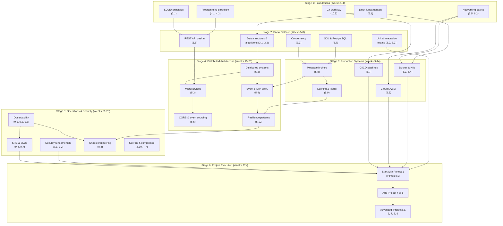

### Stage 1: Foundations (Weeks 1-4)

| Topic | Synthesis Section | Webex Guide Connection | Resource |
|-------|-------------------|----------------------|----------|
| Linux fundamentals | 6.1 | Every Webex backend role requires Linux | Linux man pages, "The Linux Command Line" (Shotts) |
| Networking (TCP/IP, HTTP, DNS) | 3.5, 6.2 | Webex runs on private backbone; WebRTC/SIP requires network knowledge | "Computer Networking: A Top-Down Approach" (Kurose & Ross) |
| Git workflow | 10.5 | GitHub is the development platform | Pro Git (git-scm.com) |
| OOP and FP paradigms | 4.1, 4.2 | Webex uses Java, Python, Go, TypeScript | Official language documentation |
| SOLID principles | 2.1 | Code quality expectation in all roles | "Clean Architecture" (Robert Martin) |

### Stage 2: Backend Core (Weeks 5-8)

| Topic | Synthesis Section | Webex Guide Connection | Resource |
|-------|-------------------|----------------------|----------|
| Data structures & algorithms | 3.1, 3.2 | Interview requirement; performance reasoning | "Introduction to Algorithms" (CLRS) |
| PostgreSQL & SQL | 5.7 | Primary database for Persistence Team | PostgreSQL official documentation |
| REST API design | 5.6 | Public-facing APIs | "RESTful Web APIs" (Richardson) |
| Unit & integration testing | 8.2, 8.3 | Testing culture emphasized in all roles | "xUnit Test Patterns" (Meszaros) |
| Concurrency | 3.3 | Async processing, WebSocket, Kafka consumers | Language-specific documentation |

### Stage 3: Production Systems (Weeks 9-14)

| Topic | Synthesis Section | Webex Guide Connection | Resource |
|-------|-------------------|----------------------|----------|
| Docker & Kubernetes | 6.3, 6.4 | Deployment target for all services | Official Docker & K8s documentation |
| AWS services | 6.5 | Primary cloud; EC2, S3, RDS, Lambda, EKS | AWS Well-Architected Framework |
| Message brokers (Kafka) | 5.8 | Central event backbone | "Kafka: The Definitive Guide" (Narkhede) |
| Caching & Redis | 5.9 | Presence state, session management, rate limiting | Redis documentation |
| CI/CD pipelines | 6.7 | Jenkins, GitHub Actions, GitLab CI | Tool-specific documentation |

### Stage 4: Distributed Architecture (Weeks 15-20)

| Topic | Synthesis Section | Webex Guide Connection | Resource |
|-------|-------------------|----------------------|----------|
| Distributed systems | 5.2 | CAP, consensus, failure modes | "Designing Data-Intensive Applications" (Kleppmann) |
| Microservices | 5.3 | Webex CC is microservices-based | "Building Microservices" (Newman) |
| Event-driven architecture | 5.4 | Core pattern at Webex | "Microservices Patterns" (Richardson) |
| CQRS & Event Sourcing | 5.5 | Session tracking, meeting state | Greg Young's original papers |
| Resilience patterns | 5.10 | Circuit breakers, bulkheads, retry | "Release It!" (Nygard) |

### Stage 5: Operations & Security (Weeks 21-26)

| Topic | Synthesis Section | Webex Guide Connection | Resource |
|-------|-------------------|----------------------|----------|
| Security fundamentals | 7.1, 7.2 | Zero-trust, E2EE, FedRAMP | OWASP Top 10, NIST CSF |
| Observability | 9.1, 9.2, 9.3 | Monitoring, Prometheus, FluentD, Kibana | OpenTelemetry documentation |
| SRE & SLOs | 9.4, 9.7 | 99.999% SLA, error budgets | "Site Reliability Engineering" (Google) |
| Chaos engineering | 8.8 | Chaos Mesh + AWS FIS at Webex | "Chaos Engineering" (Caspero et al.) |
| Secrets & compliance | 6.10, 7.7 | Vault, FedRAMP, FIPS 140-3 | Vault documentation, NIST publications |

### Stage 6: Project Execution (Weeks 27+)

Based on the guide's ranking and your target team:

**Priority 1 (start here):**

| Project | Why First | Prerequisites |
|---------|-----------|---------------|
| **Project 3: DB Migration Orchestrator** | Highest interview impact; directly maps to Persistence Team | PostgreSQL (5.7), Java/Python (4.1/4.2), Kafka (5.8) |
| **Project 1: Event-Driven Meeting Tracker** | Core architectural pattern; demonstrates Kafka mastery | Kafka (5.8), event sourcing (5.5), PostgreSQL (5.7) |

**Priority 2 (build after completing Priority 1):**

| Project | Why Next | Prerequisites |
|---------|----------|---------------|
| **Project 4: API Gateway** | Resilience patterns; every microservice needs this | Circuit breakers (5.10), API design (5.6), Redis (5.9) |
| **Project 5: Webhook Delivery** | Reliable delivery; maps to Developer Platform | Kafka (5.8), HMAC (7.4), idempotency (11.2, Gap 2) |

**Priority 3 (advanced projects):**

| Project | Why Later | Prerequisites |
|---------|-----------|---------------|
| **Project 2: Presence Service** | Complex real-time distributed state | WebSockets (11.2, Gap 5), Redis (5.9), fan-out (5.4) |
| **Project 6: Chat Persistence** | Full stack: storage + search + compliance | PostgreSQL JSONB (5.7), OpenSearch (5.7), S3 (7.4) |
| **Project 9: Call Routing Engine** | State machines + real-time systems | Distributed locking (11.2, Gap 7), Redis (5.9) |
| **Project 8: AI Transcript Pipeline** | Most complex; requires GPU/ML infrastructure | Python (4.2), Kafka (5.8), ML inference serving |

**Team-specific paths (from guide Section 5):**

| Target Team | Must-Build | Should-Build |
|-------------|-----------|-------------|
| **Persistence Team** | Projects 1, 3, 6 | Projects 4, 7 |
| **Contact Center** | Projects 5, 9 | Projects 1, 3, 4 |
| **Developer Platform** | Projects 5, 8 | Projects 3, 4, 7 |
| **SRE / Cloud Edge** | Projects 4, 7, 10 | Projects 1, 3 |

---

## 11.4 Cross-Reference: Guide Concepts to Broader Context

| Guide Concept | Broader Context in Synthesis |
|---------------|------------------------------|
| "Event-driven microservices" | [5.3](#53-microservices-architecture) + [5.4](#54-event-driven-architecture) + [5.8](#58-message-brokers-and-streaming) |
| "Active-active across 3 AZs" | [5.2](#52-distributed-systems-fundamentals) (CAP, PACELC) + [6.9](#69-deployment-strategies) (deployment) + [9.4](#94-sli-slo-sla-and-error-budgets) (SLA) |
| "Chaos engineering" | [8.8](#88-chaos-engineering) (discipline) + [5.10](#510-resilience-patterns) (patterns) + [9.7](#97-sre-practices) (SRE) |
| "No-maintenance-window philosophy" | [6.9](#69-deployment-strategies) (zero-downtime deployments) + [5.10](#510-resilience-patterns) (resilience) + [9.4](#94-sli-slo-sla-and-error-budgets) (error budgets) |
| "Resiliency tiers" | [5.10](#510-resilience-patterns) (circuit breakers, bulkheads) + [5.3](#53-microservices-architecture) (service boundaries) |
| "Kafka at scale" | [5.8](#58-message-brokers-and-streaming) (architecture) + [11.2](#112-gaps-in-the-webex-guide--supplementary-content) Gap 3 (topic design) + Gap 4 (delivery semantics) |
| "AI inference orchestration" | [4.3](#43-reactive-programming) (backpressure) + [3.3](#33-concurrency-and-parallelism) (GPU scheduling) + [6.4](#64-container-orchestration--kubernetes) (K8s for GPU workloads) |
| "Zero-downtime migrations" | [11.2](#112-gaps-in-the-webex-guide--supplementary-content) Gap 1 (expand-contract) + [5.7](#57-data-layer--databases-and-storage) (database internals) |
| "Polyglot persistence" | [5.7](#57-data-layer--databases-and-storage) (SQL + NoSQL selection) + [3.1](#31-data-structures) (access pattern analysis) |
| "Strimzi Kafka operator" | [5.8](#58-message-brokers-and-streaming) (Kafka) + [6.4](#64-container-orchestration--kubernetes) (K8s operator pattern) |
| "Istio service mesh" | [6.6](#66-service-mesh) (overview) + [7.5](#75-network-security) (mTLS) + [5.10](#510-resilience-patterns) (circuit breakers) |
| "GitOps practices" | [6.8](#68-gitops-and-infrastructure-as-code) (definition) + [6.7](#67-cicd-pipelines) (pipeline) + [6.9](#69-deployment-strategies) (deployment strategies) |
| "Webex Developer Platform" | [5.6](#56-api-design) (API design) + [8.5](#85-contract-testing) (contract testing) + [7.2](#72-owasp-top-10--application-security-baseline) (API security) |
| "SRE culture" | [9.7](#97-sre-practices) (practices) + [9.4](#94-sli-slo-sla-and-error-budgets) (SLOs) + [9.6](#96-incident-management-and-postmortems) (postmortems) |
| "Metrics-driven decisions" | [9.1](#91-the-three-pillars--metrics-logs-traces) (observability) + [9.4](#94-sli-slo-sla-and-error-budgets) (SLIs/SLOs) + [10.4](#104-agile-lean-and-delivery-practices) (delivery metrics) |
| "AI-augmented development" | [10.4](#104-agile-lean-and-delivery-practices) (XP practices) + [10.5](#105-career-development-and-growth) (learning) |

---

> **Junior Engineer Note:** This integration section is your roadmap. Start at Stage 1, follow the dependency chain, and begin projects only after completing Stages 1-3. Each project in the Webex guide is a test of your understanding across multiple synthesis sections. If a project feels overwhelming, identify which synthesis sections it maps to and review those first.

---

*End of document.*
