# Portfolio Preparation Guide for Backend Engineers at StraitsX (Card Issuing)

## Table of Contents

1. [Role Summary](#role-summary)  
2. [Key Technical Signals from the Job Description](#key-technical-signals-from-the-job-description)  
3. [Architectural Overview of Recommended Projects](#architectural-overview-of-recommended-projects)  
4. [Project 1: Card Issuing and Transaction Processing Platform](#project-1-card-issuing-and-transaction-processing-platform)  
5. [Project 2: Payment Gateway Integration Service](#project-2-payment-gateway-integration-service)  
6. [Project 3: Microservice Architecture (recommended)](#project-3-microservice-architecture-recommended)  
7. [Project 4: Webhook Processing System](#project-4-webhook-processing-system)  
8. [Project 5: Background Job Processing](#project-5-background-job-processing)  
9. [Project 6: Observability Stack](#project-6-observability-stack)  
10. [Project 7: Rate Limiting & API Gateway](#project-7-rate-limiting--api-gateway)  
11. [Project 8: Database Migration Tool](#project-8-database-migration-tool)  
12. [Project 9: Secure API Authentication and Authorization Service](#project-9-secure-api-authentication-and-authorization-service)  
13. [Project 10: Transaction Reconciliation Engine](#project-10-transaction-reconciliation-engine)  
14. [Priority Ranking and Implementation Order](#priority-ranking-and-implementation-order)  
15. [Summary of All Projects](#summary-of-all-projects)  
16. [Recommended Reading and Resources](#recommended-reading-and-resources)

---

## Role Summary

**Company:** StraitsX (Fazz Financial Group) -- Southeast Asian fintech infrastructure  
**Position:** Backend Engineer, Card Issuing Team  
**Location:** Jakarta, Indonesia  
**Core Mission:** Build a zero-to-one[^1] card issuing platform and scalable fintech infrastructure

[^1]: **Zero-to-one**: Building a product or system from nothing to its first functional version, as opposed to iterating on an existing system. Coined by Peter Thiel in *Zero to One* (2014), it emphasizes creating something entirely new rather than incrementally improving what already exists.

---

## Key Technical Signals from the Job Description

| Signal | Why It Matters |
|--------|---------------|
| **Golang** (strong proficiency) | Primary language -- every project should be in Go |
| **Card issuing / payment processing** | Domain-specific: PCI-DSS[^2], transaction idempotency[^3], ledger[^4] integrity |
| **Zero-to-one platform** | They want builders who can architect from scratch, not just maintain |
| **Microservices architecture[^5]** | Service decomposition, inter-service communication, distributed systems[^6] |
| **SQL (MariaDB/MySQL)** | Relational data modeling, migrations, query optimization |
| **Third-party payment integrations** | API[^7] integration patterns, webhook[^8] handling, retry logic |
| **Scalable systems** | Concurrency[^9], caching, horizontal scaling[^10], load testing |
| **Docker[^11] + CI/CD[^12]** | Containerization, automated pipelines, deployment strategies |

[^2]: **PCI-DSS (Payment Card Industry Data Security Standard)**: A set of security standards designed to ensure that all companies that accept, process, store, or transmit credit card information maintain a secure environment. See [PCI SSC](https://www.pcisecuritystandards.org/).
[^3]: **Idempotency**: The property of an operation where performing it multiple times has the same effect as performing it once. In payments, this prevents double-charges when a request is retried due to network failures.
[^4]: **Ledger**: An append-only record of all financial transactions. In fintech, ledgers follow double-entry bookkeeping principles where every debit has a corresponding credit entry.
[^5]: **Microservices architecture**: A software design approach where an application is built as a collection of small, independently deployable services, each running its own process and communicating via lightweight protocols (HTTP, gRPC, message queues).
[^6]: **Distributed systems**: Systems where components located on networked computers communicate and coordinate their actions by passing messages. They introduce challenges like network partitions, partial failures, and eventual consistency.
[^7]: **API (Application Programming Interface)**: A set of protocols, tools, and definitions that allow different software applications to communicate with each other. RESTful APIs use HTTP methods (GET, POST, PUT, DELETE) to perform operations on resources.
[^8]: **Webhook**: A mechanism where a server sends real-time HTTP callbacks to another system when a specific event occurs, rather than requiring the receiving system to poll for updates.
[^9]: **Concurrency**: The ability of a system to handle multiple tasks simultaneously. In Go, concurrency is achieved through goroutines (lightweight threads) and channels (communication pipes between goroutines).
[^10]: **Horizontal scaling (scaling out)**: Adding more machines to a system to handle increased load, as opposed to vertical scaling (scaling up), which adds more resources (CPU, RAM) to a single machine.
[^11]: **Docker**: A platform that uses OS-level virtualization to deliver software in packages called containers. Containers bundle an application with all its dependencies, ensuring consistent behavior across environments.
[^12]: **CI/CD (Continuous Integration / Continuous Deployment)**: Development practices where code changes are automatically built, tested, and deployed. CI ensures code is integrated and frequently tested; CD automates deployment to production.

---

## Architectural Overview of Recommended Projects

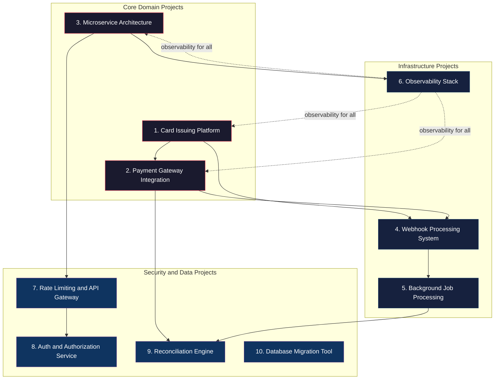

---

## Project 1: Card Issuing and Transaction Processing Platform

### What It Is

A simplified card issuing system that simulates the full card lifecycle: card creation, activation, authorization[^13], clearing[^14], settlement[^15], and dispute handling. Users can issue virtual cards, make simulated transactions, and view real-time balances.

[^13]: **Authorization**: The first phase of a card transaction where the issuer verifies that the cardholder has sufficient funds or credit and approves or declines the transaction in real-time. The funds are reserved but not yet transferred.
[^14]: **Clearing**: The process of exchanging financial transaction details between the acquiring bank and the issuing bank to facilitate posting to the cardholder's account. This typically happens in batches after authorization.
[^15]: **Settlement**: The actual transfer of funds between banks to complete a transaction. This occurs after clearing and involves the movement of money through the card network (Visa, Mastercard).

### Why It Is Relevant

This is the exact domain StraitsX operates in. Building even a simplified version demonstrates understanding of the card payment lifecycle, which most backend engineers never encounter. According to the Visa Developer documentation and Mastercard's payment processing guides, card authorization involves multi-step state machines[^16] with strict idempotency requirements.

[^16]: **State machine**: A computational model where a system can be in exactly one of a finite number of states at any given time. Transitions between states are triggered by events. In card issuing, a card moves through states like inactive, active, blocked, and closed.

### Backend Concepts and Engineering Challenges

- **Finite state machines** for card status (inactive -> active -> blocked -> closed)
- **Idempotent** transaction processing (preventing double-charges)
- **Event sourcing[^17]** for transaction history (append-only ledger pattern)
- **Optimistic locking[^18]** for concurrent balance updates
- **PCI-DSS** awareness (tokenization[^19], never storing raw PANs[^20])

[^17]: **Event sourcing**: A design pattern where state changes are stored as a sequence of events rather than storing only the current state. The current state can be reconstructed by replaying all events. This provides a complete audit trail and enables temporal queries.
[^18]: **Optimistic locking**: A concurrency control method where a record is read, modified, and written back with a version check. If another process modified the record between the read and write (detected by a version mismatch), the operation fails and must be retried. This avoids the overhead of database-level locks.
[^19]: **Tokenization**: The process of replacing sensitive data (like a credit card number) with a non-sensitive placeholder (token) that has no exploitable value. The original data is stored securely in a token vault.
[^20]: **PAN (Primary Account Number)**: A variable-length number (up to 19 digits, per ISO/IEC 7812) on a payment card that identifies the card issuer and the cardholder's account. Common lengths are 13 to 19 digits; Visa and Mastercard typically use 16 digits. PCI-DSS prohibits storing full PANs in plaintext.

### Recommended Architecture and Tech Stack

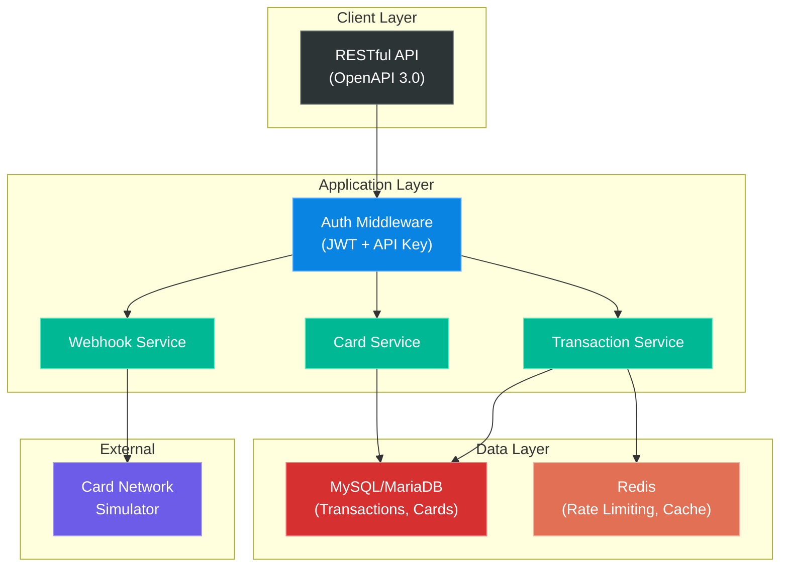

- **Language:** Go
- **Database:** MySQL/MariaDB (matches their stack)
- **Cache[^21]:** Redis[^22] (for rate limiting, session tokens)
- **Architecture:** Modular monolith[^23] with clear domain boundaries (can evolve to microservices)
- **API:** RESTful with OpenAPI 3.0[^24] spec
- **Auth:** JWT[^25] + API key authentication

[^21]: **Cache**: A high-speed data storage layer that stores a subset of data so that future requests for that data can be served faster than by accessing the primary data store. Caches reduce database load and improve response times.
[^22]: **Redis (Remote Dictionary Server)**: An open-source, in-memory data structure store used as a database, cache, message broker, and streaming engine. It supports data structures like strings, hashes, lists, sets, and sorted sets.
[^23]: **Modular monolith**: A monolithic application that is internally structured into well-defined modules with clear boundaries and interfaces. Unlike a traditional monolith, modules can be extracted into separate services when needed, providing a migration path to microservices.
[^24]: **OpenAPI 3.0**: A specification for defining APIs in a standard, language-agnostic format. It describes endpoints, request/response formats, authentication, and other details, enabling automatic documentation generation and client SDK creation.
[^25]: **JWT (JSON Web Token)**: A compact, URL-safe token format for securely transmitting information between parties as a JSON object. JWTs are digitally signed (using HMAC or RSA) and contain claims about the user (e.g., user ID, roles, expiration).

### Essential Features

- Issue virtual cards with configurable limits
- Simulate authorization requests (approve/decline based on rules)
- Transaction ledger with double-entry bookkeeping[^26]
- Idempotency keys on all mutating endpoints
- Webhook notifications for card events
- Rate limiting per API key

[^26]: **Double-entry bookkeeping**: An accounting system where every transaction is recorded in at least two accounts as both a debit and a credit. The total debits must always equal the total credits, providing a built-in error-checking mechanism.

### Common Implementation Pitfalls

- Using floating-point numbers for money (use `decimal` or integer cents to avoid precision errors)
- Not handling concurrent transactions on the same card (race conditions[^27])
- Missing idempotency on payment endpoints (causes double-charges)
- Storing sensitive card data without proper encryption
- Not implementing proper transaction isolation levels[^28]

[^27]: **Race condition**: A flaw in a system where the output depends on the unpredictable sequence or timing of multiple concurrent operations. In payments, a race condition could allow two simultaneous transactions to both succeed even when funds are insufficient.
[^28]: **Transaction isolation level**: A setting that determines how and when changes made by one transaction are visible to other transactions. Common levels include READ COMMITTED (sees only committed data) and REPEATABLE READ (consistent snapshot within a transaction). Higher isolation prevents anomalies but reduces concurrency.

### Required Knowledge

- Double-entry bookkeeping basics
- Idempotency patterns in distributed systems
- Database transaction isolation levels (READ COMMITTED, REPEATABLE READ)
- PCI-DSS scope awareness

### Estimated Difficulty

**Hard** -- 4 to 6 weeks

### Resume and Interview Value

Extremely high. This directly maps to StraitsX's core product. In interviews, you can discuss card authorization flows, idempotency, and ledger design -- topics that signal domain expertise.

### Extensions

- Add 3D Secure[^29] simulation (EMV 3DS protocol)
- Implement a simple dispute/chargeback[^30] workflow
- Add multi-currency support with FX[^31] rate conversion
- Build a card scheme simulator (Visa/Mastercard network simulation)

[^29]: **3D Secure (3DS)**: An authentication protocol designed to be an additional security layer for online credit and debit card transactions. The "3D" refers to the three domains involved: the acquirer domain, the issuer domain, and the interoperability domain (card network).
[^30]: **Chargeback**: A forced reversal of a credit card payment that comes from the cardholder's issuing bank. The cardholder disputes a charge, and the issuer pulls the funds back from the merchant's acquiring bank.
[^31]: **FX (Foreign Exchange)**: The exchange of one currency for another. In payment processing, FX conversion occurs when a transaction involves a different currency than the cardholder's billing currency.

---

## Project 2: Payment Gateway Integration Service

### What It Is

A Go service that acts as an abstraction layer over multiple payment providers (e.g., Stripe, Adyen, Xendit). It normalizes different provider APIs into a unified interface, handles webhooks, manages provider failover, and provides transaction reconciliation.

### Why It Is Relevant

The job description explicitly mentions "Integrate with third-party payment providers for local and global card transactions." This project demonstrates the exact skill: building reliable integrations with external payment APIs, which is notoriously tricky due to inconsistent APIs, webhook reliability, and reconciliation challenges.

### Backend Concepts and Engineering Challenges

- **Adapter pattern[^32]** for normalizing multiple provider APIs
- Webhook signature verification and idempotent processing
- **Circuit breaker pattern[^33]** for provider failover
- **Retry with exponential backoff[^34] and jitter[^35]**
- Reconciliation: comparing internal records vs. provider records
- **Eventual consistency[^36]** handling

[^32]: **Adapter pattern**: A structural design pattern that allows objects with incompatible interfaces to collaborate. It wraps an existing class with a new interface so it can work with code that expects a different interface. In payment integrations, each provider has a different API, so adapters normalize them into a common interface.
[^33]: **Circuit breaker pattern**: A stability pattern that detects failures and prevents an application from repeatedly trying to execute an operation likely to fail. When failures exceed a threshold, the circuit "opens" and subsequent calls fail fast without calling the remote service. After a timeout, it enters a "half-open" state to test if the service has recovered. See *Release It!* by Michael Nygard.
[^34]: **Exponential backoff**: A retry strategy where the wait time between retries increases exponentially (e.g., 1s, 2s, 4s, 8s...). This prevents overwhelming a struggling service with rapid retries and gives it time to recover.
[^35]: **Jitter**: A random variation added to the backoff delay to prevent synchronized retries from multiple clients (the "thundering herd" problem). Without jitter, all clients retry at the same intervals, creating traffic spikes.
[^36]: **Eventual consistency**: A consistency model where, given enough time without new updates, all replicas of a data item will converge to the same value. In distributed payment systems, the internal state and provider state may temporarily differ but will eventually align.

### Recommended Architecture and Tech Stack

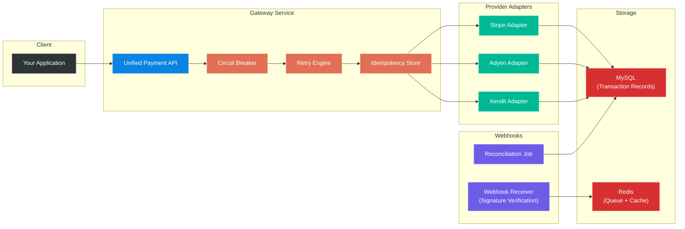

- **Language:** Go
- **Database:** MySQL (transaction records)
- **Queue:** Redis Streams[^37] or RabbitMQ[^38] (for async webhook processing)
- **HTTP Client:** Custom retry/timeout middleware
- **Observability:** Structured logging (zerolog[^39]/zap[^40]) + OpenTelemetry[^41] traces

[^37]: **Redis Streams**: A data structure in Redis that acts as an append-only log with consumer group support. It enables message queue semantics (publish/subscribe with persistence) within Redis, suitable for event streaming and task queues.
[^38]: **RabbitMQ**: An open-source message broker that implements the Advanced Message Queuing Protocol (AMQP). It receives messages from producers, stores them, and delivers them to consumers, supporting patterns like work queues, pub/sub, and routing.
[^39]: **zerolog**: A high-performance, zero-allocation JSON logger for Go. It focuses on structured logging with minimal overhead, producing JSON output suitable for log aggregation systems.
[^40]: **zap**: A high-performance structured logging library for Go developed by Uber. It offers both a sugared (printf-style) and a structured (field-based) API, with benchmarks showing it is significantly faster than standard library loggers.
[^41]: **OpenTelemetry**: An open-source observability framework for generating, collecting, and exporting telemetry data (traces, metrics, and logs). It provides vendor-neutral APIs and SDKs for instrumenting applications.

### Essential Features

- Unified payment API (charge, refund, status check)
- Provider adapter interface (at least 2 implementations)
- Webhook endpoint with signature verification and replay protection
- Automatic failover between providers
- Reconciliation job that compares internal vs. provider state
- Idempotency key store

### Common Implementation Pitfalls

- Not handling partial failures (provider charged but webhook delivery failed)
- Trusting webhook payloads without signature verification
- Not implementing reconciliation (silent data drift)
- Tight coupling to one provider's data model
- Missing timeout configuration on HTTP clients

### Required Knowledge

- Webhook best practices (Stripe's guide is the gold standard)
- Circuit breaker pattern (see: *Release It!* by Michael Nygard)
- Idempotency in distributed payment systems

### Estimated Difficulty

**Hard** -- 3 to 4 weeks

### Resume and Interview Value

High. Shows you can build resilient integrations -- a core responsibility listed in the job description. Interviewers will ask about failure modes, and you will have concrete examples to discuss.

### Extensions

- Add A/B testing[^42] between providers (route percentage of traffic)
- Implement provider health scoring
- Build a reconciliation dashboard
- Add support for local payment methods (GoPay, OVO, DANA for Indonesia)

[^42]: **A/B testing**: An experiment where two or more variants are compared by showing them to similar users at random and measuring the difference in outcomes. In payment routing, A/B testing compares provider success rates, latency, or cost.

---

## Project 3: Scalable REST API with Microservice Boundaries

### What It Is

A well-structured Go REST API that demonstrates proper service decomposition. For example, split a "Digital Wallet" into: User Service, Wallet Service, Transaction Service, Notification Service -- each with its own database, communicating via HTTP/gRPC[^43] and async events.

[^43]: **gRPC (Google Remote Procedure Call)**: A high-performance, open-source RPC framework that uses Protocol Buffers (protobuf) for serialization and HTTP/2 for transport. It supports bidirectional streaming and is generally more efficient than REST for inter-service communication due to binary serialization and HTTP/2 multiplexing.

### Why It Is Relevant

The job description requires "microservices architecture" experience. Rather than building a monolith and calling it microservices, this project demonstrates understanding of why and how to decompose services, handle inter-service communication, and manage distributed data.

### Backend Concepts and Engineering Challenges

- Service decomposition by domain (DDD[^44] bounded contexts[^45])
- **Database-per-service pattern**
- Synchronous (HTTP/gRPC) vs. asynchronous (event-driven) communication
- **Saga pattern[^46]** for distributed transactions
- **API Gateway pattern**
- Service discovery[^47] and configuration management

[^44]: **DDD (Domain-Driven Design)**: A software design approach that focuses on modeling software to match a business domain. It emphasizes collaboration between technical and domain experts, using a ubiquitous language (shared vocabulary) and organizing code around business concepts rather than technical layers.
[^45]: **Bounded context**: A DDD concept that defines the boundary within which a particular domain model is valid and applicable. Different bounded contexts may have different models for the same entity (e.g., "User" in the Auth context vs. "Customer" in the Billing context).
[^46]: **Saga pattern**: A pattern for managing distributed transactions across multiple services. Instead of a single ACID transaction, a saga is a sequence of local transactions. If one step fails, compensating transactions (rollback steps) are executed to undo previous steps. Two variants exist: choreography (event-based) and orchestration (central coordinator).
[^47]: **Service discovery**: The automatic detection and registration of services in a distributed system. Services register themselves with a registry (e.g., Consul, etcd) when they start, and other services query the registry to find them. This eliminates hardcoded addresses and enables dynamic scaling.

### Recommended Architecture and Tech Stack

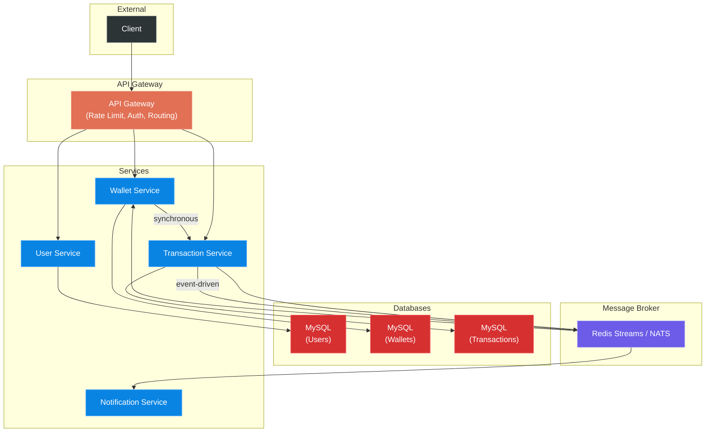

- **Language:** Go
- **Databases:** MySQL per service
- **Message broker:** Redis Streams or NATS[^48]
- **API Gateway:** Custom Go reverse proxy or Traefik[^49]
- **Container orchestration:** Docker Compose[^50] (local), documented Kubernetes[^51] manifests
- **Proto/IDL:** OpenAPI for REST, protobuf[^52] for gRPC (demonstrate both)

[^48]: **NATS**: A lightweight, high-performance messaging system designed for cloud-native applications, IoT messaging, and microservices architectures. It supports pub/sub, request/reply, and queue group patterns with at-most-once and at-least-once delivery.
[^49]: **Traefik**: A modern HTTP reverse proxy and load balancer designed for microservices. It integrates with container orchestrators (Docker, Kubernetes) for automatic service discovery and configuration.
[^50]: **Docker Compose**: A tool for defining and running multi-container Docker applications. A single YAML file configures all services, networks, and volumes, enabling one-command startup of an entire application stack.
[^51]: **Kubernetes (K8s)**: An open-source container orchestration platform that automates deploying, scaling, and managing containerized applications. It provides service discovery, load balancing, self-healing, and rolling updates.
[^52]: **Protocol Buffers (protobuf)**: Google's language-neutral, platform-neutral mechanism for serializing structured data. It is smaller and faster than JSON, making it ideal for inter-service communication. Define data structures in `.proto` files and compile them into language-specific code.

### Essential Features

- At least 3 services with clear domain boundaries
- Event-driven communication for async operations
- Distributed transaction handling (saga or outbox pattern[^53])
- Health check endpoints per service
- Centralized structured logging
- Docker Compose for full local development

[^53]: **Outbox pattern**: A pattern for reliably publishing events as part of a database transaction. Instead of directly publishing to a message broker (which could fail independently of the DB transaction), events are written to an "outbox" table within the same transaction. A separate process polls the outbox and publishes events, ensuring atomicity.

### Common Implementation Pitfalls

- "Distributed monolith[^54]" -- services too coupled via synchronous calls
- No event replay capability (messages lost = data inconsistency)
- Shared database between services (defeats the purpose of decomposition)
- Over-engineering -- starting with 10 services when 3 would suffice
- Missing distributed tracing (impossible to debug in production)

[^54]: **Distributed monolith**: A system that is deployed as multiple services but still has the tight coupling, shared databases, and synchronous dependencies of a monolith. It gets the operational complexity of microservices without the benefits of independent deployability.

### Required Knowledge

- Domain-Driven Design basics (bounded contexts)
- CAP theorem[^55] trade-offs
- Outbox pattern for reliable event publishing
- *Building Microservices* by Sam Newman

[^55]: **CAP theorem**: Originally conjectured by Eric Brewer in 2000 and formally proven by Gilbert and Lynch in 2002, this theorem states that a distributed system can guarantee at most two of three properties: Consistency (all nodes see the same data), Availability (every request receives a response), and Partition tolerance (the system continues operating despite network partitions). Since network partitions are unavoidable in distributed systems, the real design choice is between consistency and availability during a partition.

### Estimated Difficulty

**Hard** -- 3 to 5 weeks

### Resume and Interview Value

High. Directly demonstrates the "microservices architecture" requirement. Be prepared to discuss why you decomposed services the way you did.

### Extensions

- Add gRPC for inter-service communication
- Implement CQRS[^56] for read-heavy services
- Add service mesh[^57] simulation (Istio[^58] concepts)
- Implement distributed tracing with Jaeger[^59]

[^56]: **CQRS (Command Query Responsibility Segregation)**: A pattern that separates read and write operations into different models. The write model handles commands (mutations), while the read model is optimized for queries. This allows independent scaling and optimization of each side.
[^57]: **Service mesh**: A dedicated infrastructure layer for managing service-to-service communication. It handles concerns like load balancing, encryption, observability, and access control, typically implemented as a sidecar proxy alongside each service.
[^58]: **Istio**: An open-source service mesh that provides traffic management, security, and observability for microservices. It deploys as sidecar proxies (Envoy) alongside each service, intercepting all network communication.
[^59]: **Jaeger**: An open-source distributed tracing system originally developed by Uber. It traces requests as they flow through multiple services, helping identify latency bottlenecks and failure points in distributed systems.

---

## Project 4: Rate Limiting and API Gateway Service

### What It Is

A standalone Go API gateway that implements rate limiting[^60] (token bucket[^61], sliding window[^62]), API key authentication, request routing, response caching, and abuse detection. Designed to sit in front of a payment API.

[^60]: **Rate limiting**: A technique for controlling the number of requests a client can make to an API within a specified time period. It prevents abuse, ensures fair usage, and protects backend services from being overwhelmed.
[^61]: **Token bucket algorithm**: A rate limiting algorithm where tokens are added to a bucket at a fixed rate. Each request consumes one token. If the bucket is empty, the request is rejected. This allows bursts (up to bucket size) while maintaining an average rate.
[^62]: **Sliding window counter**: A rate limiting algorithm that divides time into smaller windows and uses a weighted count of the current and previous windows to calculate the rate. It is more accurate than fixed windows and smoother than sliding window logs.

### Why It Is Relevant

Fintech APIs require robust rate limiting to prevent abuse and ensure fair usage. The job description mentions "security and engineering best practices" and "scalable systems." A gateway is a critical infrastructure component that demonstrates both.

### Backend Concepts and Engineering Challenges

- Rate limiting algorithms (token bucket, sliding window counter)
- Distributed rate limiting with Redis
- API key management and scoping
- Request/response middleware[^63] chains
- Load balancing[^64] algorithms
- Response caching strategies

[^63]: **Middleware**: Software that sits between the operating system or network and applications, or between two applications. In web frameworks, middleware refers to functions that process HTTP requests and responses in a chain, executing before or after the main handler (e.g., authentication, logging, CORS).
[^64]: **Load balancing**: The process of distributing incoming network traffic across multiple servers to ensure no single server is overwhelmed. Algorithms include round-robin, least connections, IP hash, and weighted distribution.

### Recommended Architecture and Tech Stack

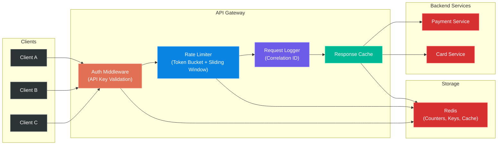

- **Language:** Go (net/http or chi[^65] router)
- **Store:** Redis (rate limit counters, API keys)
- **Algorithms:** Token bucket (per-key), sliding window (global)
- **Middleware:** Auth, rate limit, logging, recovery, CORS[^66]
- **Metrics:** Prometheus[^67] exposition endpoint

[^65]: **chi**: A lightweight, idiomatic Go HTTP router built on the standard `net/http` package. It supports middleware chaining, URL parameters, sub-routers, and is fully compatible with the Go standard library.
[^66]: **CORS (Cross-Origin Resource Sharing)**: A browser security mechanism that allows or restricts web applications from making requests to a domain different from the one that served the web page. Servers send CORS headers to specify which origins, methods, and headers are permitted.
[^67]: **Prometheus**: An open-source monitoring and alerting system that collects metrics as time-series data. It scrapes HTTP endpoints that expose metrics in a specific text format, stores them, and supports a powerful query language (PromQL) for analysis and alerting.

### Essential Features

- Per-API-key rate limiting with configurable limits
- Multiple rate limit strategies (per-second, per-minute, sliding window)
- API key CRUD with scoped permissions
- Request logging with correlation IDs[^68]
- Health check and readiness endpoints
- Graceful shutdown[^69] handling

[^68]: **Correlation ID**: A unique identifier attached to a request at the entry point of a system and propagated through all services that handle it. It enables tracing a single request across multiple services for debugging and observability.
[^69]: **Graceful shutdown**: The process of shutting down a server by first stopping new connections, waiting for in-flight requests to complete (up to a timeout), and then exiting. This prevents abrupt disconnections and data corruption.

### Common Implementation Pitfalls

- Race conditions in in-memory rate limiting (use Redis INCR[^70] with TTL[^71])
- Not handling Redis failures gracefully (fail-open vs. fail-closed)
- Clock skew[^72] in distributed rate limiting
- Not differentiating between rate limit and concurrency limits
- Missing graceful degradation under extreme load

[^70]: **INCR**: A Redis atomic operation that increments the integer value of a key by one. It is used in rate limiting to atomically increment request counters, avoiding race conditions that would occur with read-modify-write sequences.
[^71]: **TTL (Time To Live)**: A value that determines how long a piece of data should be kept before it is discarded or expired. In Redis, TTL is set per key and automatically deletes the key when the timer expires, which is essential for time-windowed rate limiting.
[^72]: **Clock skew**: The difference in time between two or more clocks in a distributed system. Even small discrepancies can cause issues in rate limiting, token expiration, and log ordering. Mitigation includes using NTP (Network Time Protocol) and tolerating small differences in time-based checks.

### Required Knowledge

- Token bucket algorithm (Cloudflare's blog post is an excellent resource)
- Redis atomic operations
- HTTP middleware patterns in Go

### Estimated Difficulty

**Medium** -- 2 to 3 weeks

### Resume and Interview Value

Medium-high. Shows infrastructure thinking and security awareness. Good for discussing scalability challenges in interviews.

### Extensions

- Add DDoS[^73] detection heuristics
- Implement request signing (HMAC[^74])
- Add geographic rate limiting
- Build a real-time dashboard showing traffic patterns

[^73]: **DDoS (Distributed Denial of Service)**: A cyberattack where multiple compromised systems are used to target a single system with a flood of traffic, overwhelming it and making it unavailable to legitimate users.
[^74]: **HMAC (Hash-based Message Authentication Code)**: A mechanism for verifying both the integrity and authenticity of a message using a cryptographic hash function (e.g., SHA-256) combined with a secret key. Used in API request signing to prove that a request came from a trusted source and was not tampered with.

---

## Project 5: Database Migration and Schema Management Tool

### What It Is

A CLI[^75] tool (in Go) for managing database schema migrations with support for: versioned migrations, rollback, dry-run, migration generation from model diffs, and migration CI validation. Think of it as a custom-built golang-migrate or Atlas alternative with domain-specific features.

[^75]: **CLI (Command-Line Interface)**: A text-based interface for interacting with a computer program by typing commands. CLI tools are preferred for automation, scripting, and integration with CI/CD pipelines.

### Why It Is Relevant

The job description emphasizes SQL databases (MariaDB/MySQL) and CI/CD pipelines. Schema migrations are a critical part of database lifecycle management, especially in fintech where schema changes must be backward-compatible and zero-downtime[^76]. This demonstrates deep database engineering skills.

[^76]: **Zero-downtime deployment**: A deployment strategy where application updates are released without any interruption in service. For database migrations, this requires backward-compatible schema changes (e.g., adding new columns without removing old ones until all application instances are updated).

### Backend Concepts and Engineering Challenges

- Schema versioning and migration ordering
- Online schema change strategies (zero-downtime)
- Migration CI validation (detect conflicts in PRs)
- Database introspection and diff generation
- Transaction-safe DDL[^77] execution
- Backward-compatible migration patterns (expand-contract[^78])

[^77]: **DDL (Data Definition Language)**: SQL statements that define or modify database structures (tables, indexes, schemas). Examples include CREATE, ALTER, and DROP. Unlike DML (Data Manipulation Language), DDL behavior regarding transactions varies across databases -- MySQL does not support transactional DDL, while PostgreSQL does.
[^78]: **Expand-contract pattern (also called expand-migrate-contract)**: A strategy for making backward-compatible database schema changes. In the "expand" phase, new columns/tables are added alongside existing ones. In the "migrate" phase, data is copied or new code uses the new structure. In the "contract" phase, old columns/tables are removed after all consumers have migrated.

### Recommended Architecture and Tech Stack

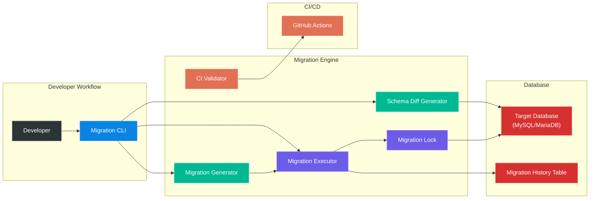

- **Language:** Go (CLI with cobra[^79])
- **Database:** MySQL/MariaDB driver
- **Testing:** Testcontainers[^80] for integration tests
- **CI integration:** GitHub Actions[^81] validation step
- **Storage:** Migration history table in target database

[^79]: **cobra**: A Go library for creating modern CLI applications. It provides command/subcommand structure, automatic help generation, flag parsing, and shell completion.
[^80]: **Testcontainers**: A library that provides lightweight, throwaway instances of common databases, message brokers, and other dependencies running in Docker containers. Used in integration testing to ensure tests run against real infrastructure rather than mocks.
[^81]: **GitHub Actions**: GitHub's built-in CI/CD platform that automates build, test, and deployment workflows. Workflows are defined in YAML files triggered by events like pushes, pull requests, or schedules.

### Essential Features

- `migrate up/down` with version tracking
- `migrate diff` to generate migration from schema changes
- Dry-run mode (show SQL without executing)
- Migration conflict detection (parallel branches)
- Lock mechanism to prevent concurrent migrations
- Validation mode for CI (fail if unapplied migrations exist)

### Common Implementation Pitfalls

- Not wrapping DDL in transactions (partial migrations on failure)
- Breaking backward compatibility (deploy code before migration)
- Not testing rollback (assume rollback always works)
- Missing lock mechanism (two instances running the same migration)
- Not handling large table migrations (ALTER TABLE on 100M+ rows)

### Required Knowledge

- MySQL DDL transaction semantics
- Online schema change tools (gh-ost[^82], pt-online-schema-change[^83])
- Expand-contract migration pattern
- *Database Reliability Engineering* by Laine Campbell and Charity Majors

[^82]: **gh-ost (GitHub Online Schema Transmogrifier)**: GitHub's triggerless tool for performing online MySQL schema migrations without locking the table. Unlike pt-online-schema-change, gh-ost does not use database triggers. Instead, it creates a ghost table with the new schema, copies data in chunks, and captures concurrent writes by streaming the MySQL binary log (pretending to be a replica). It performs an atomic table swap at cut-over time.
[^83]: **pt-online-schema-change**: Percona's tool for altering MySQL tables without locking them. It creates a copy of the table, applies the schema change, and uses triggers to capture writes during the migration.

### Estimated Difficulty

**Medium** -- 2 to 3 weeks

### Resume and Interview Value

Medium. Signals database maturity and operational awareness. Strong talking point for CI/CD and zero-downtime deployment discussions.

### Extensions

- Add automatic backup before destructive migrations
- Implement migration dependency graph
- Add support for data migrations (not just schema)
- Build a web UI for migration history visualization

---

## Project 6: Observability Stack for Backend Services

### What It Is

An instrumentation and observability layer added to a Go backend service, implementing the three pillars: **structured logging** (zerolog/zap), **metrics** (Prometheus), and **distributed tracing** (OpenTelemetry). Includes alerting rules and a Grafana[^84] dashboard.

[^84]: **Grafana**: An open-source analytics and visualization platform. It connects to data sources like Prometheus, Elasticsearch, and PostgreSQL to create interactive dashboards with graphs, alerts, and annotations.

### Why It Is Relevant

The job description mentions "troubleshoot system issues, performance bottlenecks, and scalability challenges." Observability is how you do this in production. Most mid-level engineers can write code but struggle with production debugging. This project demonstrates operational maturity.

### Backend Concepts and Engineering Challenges

- Three pillars of observability[^85] (logs, metrics, traces)
- Structured logging with correlation IDs
- RED metrics[^86] (Rate, Errors, Duration) for services
- OpenTelemetry context propagation across services
- Alerting on SLOs[^87] (Service Level Objectives)
- Dashboard design for operational awareness

[^85]: **Three pillars of observability**: The three types of telemetry data needed to understand a system's internal state: **logs** (discrete events with timestamps), **metrics** (numeric measurements aggregated over time), and **traces** (end-to-end records of requests as they flow through services).
[^86]: **RED metrics**: A monitoring methodology for request-driven services introduced by Tom Wilkie (Grafana Labs) in 2015: **Rate** (requests per second), **Errors** (error rate), and **Duration** (latency distribution, especially P99). It complements Google's four golden signals from the SRE book.
[^87]: **SLO (Service Level Objective)**: A target level of reliability for a service, expressed as a percentage (e.g., 99.9% of requests complete within 200ms). SLOs are derived from SLIs (Service Level Indicators) and inform error budgets.

### Recommended Architecture and Tech Stack

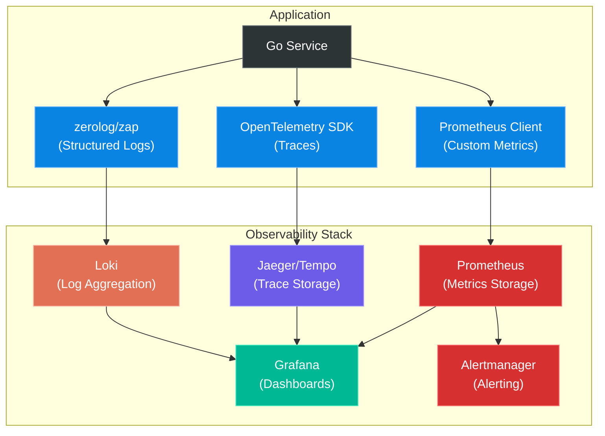

- **Language:** Go
- **Logging:** zerolog or zap (structured JSON)
- **Metrics:** Prometheus client + Grafana dashboards
- **Tracing:** OpenTelemetry SDK -> Jaeger/Tempo
- **Alerting:** Prometheus Alertmanager[^88] rules
- **Docker Compose:** Full local observability stack

[^88]: **Alertmanager**: A component of the Prometheus ecosystem that handles alerts sent by Prometheus. It deduplicates, groups, routes, and delivers notifications to receivers like PagerDuty, Slack, or email.

### Essential Features

- Structured logs with request correlation IDs
- Prometheus metrics endpoint with custom business metrics
- OpenTelemetry traces across service boundaries
- Grafana dashboard with RED metrics
- Alerting rules for error rate, latency P99, saturation
- Health check endpoints (liveness[^89] + readiness[^90])

[^89]: **Liveness probe**: A health check that determines if a process is running and not deadlocked. If it fails, the orchestrator (e.g., Kubernetes) restarts the container. It should check internal state, not external dependencies.
[^90]: **Readiness probe**: A health check that determines if a process is ready to accept traffic. If it fails, the orchestrator stops routing requests to it. It should check dependencies like database connections and cache availability.

### Common Implementation Pitfalls

- High-cardinality[^91] metrics (tagging with user_id = millions of series)
- Not sampling traces (storing 100% = cost explosion)
- Logging sensitive data (PII[^92] in structured logs)
- Missing context propagation (traces break across services)
- Alert fatigue[^93] (too many alerts = all ignored)

[^91]: **Cardinality**: In metrics, the number of unique time series generated by the combination of a metric name and its label values. High cardinality (e.g., labels with user IDs) can overwhelm monitoring systems and cause excessive memory usage.
[^92]: **PII (Personally Identifiable Information)**: Any data that could be used to identify a specific individual, such as names, email addresses, phone numbers, or financial account numbers. Logging PII violates privacy regulations like GDPR and PCI-DSS.
[^93]: **Alert fatigue**: A condition where operators receive so many alerts that they begin to ignore or respond slowly to them, including critical ones. It is caused by poorly tuned thresholds, non-actionable alerts, or excessive alert volume.

### Required Knowledge

- Prometheus exposition format
- OpenTelemetry specification
- Grafana PromQL[^94]
- Google SRE[^95] book chapters on monitoring

[^94]: **PromQL (Prometheus Query Language)**: Prometheus's functional query language for selecting and aggregating time-series data in real-time. It supports filtering, aggregation, rate calculations, and subqueries.
[^95]: **SRE (Site Reliability Engineering)**: A discipline that applies software engineering principles to infrastructure and operations. Originated at Google, SRE focuses on reliability, automation, and measurable targets (SLOs, error budgets). See the *Site Reliability Engineering* book by Betsy Beyer et al.

### Estimated Difficulty

**Medium** -- 2 weeks

### Resume and Interview Value

Medium-high. Production readiness signal. Interviewers appreciate candidates who think about observability before incidents happen.

### Extensions

- Add SLO/SLI[^96] tracking with error budgets[^97]
- Implement log-based alerting (Loki[^98])
- Add chaos engineering[^99] experiments (inject failures, verify alerts)
- Build a custom trace analyzer for payment flows

[^96]: **SLI (Service Level Indicator)**: A quantitative measure of a service's reliability, such as the percentage of successful requests or the ratio of fast responses. SLIs are the raw metrics from which SLOs are derived.
[^97]: **Error budget**: The allowed amount of unreliability for a service, calculated as 100% minus the SLO target. For a 99.9% SLO, the error budget is 0.1% (approximately 43 minutes per month). When the budget is exhausted, new deployments are paused until reliability improves.
[^98]: **Loki**: Grafana's open-source log aggregation system. Unlike Elasticsearch, it indexes only metadata (labels) rather than log content, making it cost-effective and tightly integrated with Grafana dashboards.
[^99]: **Chaos engineering**: The practice of intentionally injecting failures into a system to test its resilience and discover weaknesses before they cause real outages. Pioneered by Netflix (Chaos Monkey), it involves controlled experiments like killing services, introducing latency, or corrupting data.

---

## Project 7: Idempotent Webhook Processing System

### What It Is

A robust webhook processing framework in Go that handles incoming webhooks from payment providers with: signature verification, idempotent processing, retry with dead-letter queue[^100], event ordering guarantees, and replay protection.

[^100]: **Dead-letter queue (DLQ)**: A queue that holds messages that could not be processed successfully after a specified number of retries. Instead of discarding failed messages, they are stored for manual inspection, debugging, and potential reprocessing.

### Why It Is Relevant

Card issuing platforms receive constant webhooks (transaction notifications, card status changes, settlement confirmations). The job description's "integrate with third-party payment providers" directly requires this. Stripe's webhook best practices are the industry gold standard.

### Backend Concepts and Engineering Challenges

- HMAC signature verification
- Idempotency key processing (deduplication)
- At-least-once delivery[^101] with idempotent consumers
- Dead letter queues for failed processing
- Event ordering and sequence numbering
- Webhook replay protection (timestamp + nonce[^102])

[^101]: **At-least-once delivery**: A message delivery guarantee where every message is delivered one or more times, but duplicates are possible. The consumer must be idempotent to handle duplicates correctly. This contrasts with at-most-once (messages may be lost) and exactly-once (no duplicates, no losses -- extremely hard in distributed systems).
[^102]: **Nonce (number used once)**: A random or sequential number that is used only once in a cryptographic communication. In webhooks, a nonce is included in the signed payload and verified by the receiver to prevent replay attacks (re-submitting a captured valid request).

### Recommended Architecture and Tech Stack

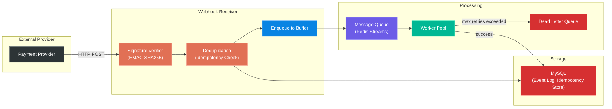

- **Language:** Go
- **Queue:** Redis Streams or RabbitMQ
- **Database:** MySQL (idempotency store, event log)
- **Crypto:** HMAC-SHA256 for signature verification
- **Testing:** Property-based testing[^103] for deduplication logic

[^103]: **Property-based testing**: A testing technique where instead of writing individual test cases with specific inputs and expected outputs, you define properties (invariants) that should hold for all valid inputs, and the testing framework generates random inputs to try to violate those properties. Libraries like `rapid` in Go automate this.

### Essential Features

- Webhook receiver with signature verification
- Idempotent event processing (store event_id, skip duplicates)
- Retry with exponential backoff (max 3 attempts)
- Dead letter queue for permanently failed events
- Webhook replay for debugging (re-process historical events)
- Monitoring: processed/failed/duplicated event counts

### Common Implementation Pitfalls

- Checking idempotency outside the processing transaction (TOCTOU[^104] race)
- Not handling out-of-order delivery (event B arrives before event A)
- Storing webhook secrets in code (use environment variables or secret manager)
- Not accounting for provider-specific payload differences
- Missing clock tolerance in timestamp validation (plus or minus 5 minutes)

[^104]: **TOCTOU (Time of Check to Time of Use)**: A race condition where the state of a resource changes between the time it is checked and the time it is used. In webhook processing, two identical webhooks could both pass the idempotency check if the check and the processing are not atomic.

### Required Knowledge

- HMAC and webhook security
- Exactly-once vs. at-least-once semantics
- Message queue delivery guarantees
- Distributed consensus basics

### Estimated Difficulty

**Medium** -- 2 weeks

### Resume and Interview Value

Medium-high. Demonstrates reliability engineering thinking. Excellent for discussing "what happens when things fail" in interviews.

### Extensions

- Add configurable retry policies per event type
- Implement event sourcing on top of webhook events
- Build a webhook testing tool (send test events, verify processing)
- Add schema validation for webhook payloads

---

## Project 8: Background Job Processing System

### What It Is

A Go-based distributed job processing system (like a simplified Sidekiq[^105] or Bull[^106]) that supports: delayed jobs, scheduled jobs, retries with backoff, job prioritization, concurrency control, and dead letter handling. Use it to run settlement batches, reconciliation jobs, and notification delivery.

[^105]: **Sidekiq**: A popular background job processing framework for Ruby that uses Redis as its backing store. It supports concurrent execution, retries, scheduled jobs, and dead letter queues. It is widely considered the industry standard for Ruby background processing.
[^106]: **Bull**: A Node.js library for handling distributed jobs and messages backed by Redis. It provides reliable queue semantics with support for delayed jobs, retries, priorities, and concurrency control.

### Why It Is Relevant

Card issuing platforms have critical background workloads: end-of-day settlement, transaction reconciliation, fraud scoring, notification delivery. The job description mentions "build and maintain scalable systems" -- background job processing is fundamental to scalability.

### Backend Concepts and Engineering Challenges

- Worker pool[^107] patterns in Go (goroutines[^108] + channels[^109])
- Delayed priority queues[^110] (Redis sorted sets[^111])
- Exponential backoff with jitter for retries
- Concurrency control (semaphore[^112] pattern)
- Job serialization[^113] and versioning
- Graceful shutdown with job completion

[^107]: **Worker pool**: A concurrency pattern where a fixed number of worker goroutines (or threads) pull tasks from a shared queue. This limits concurrency to prevent resource exhaustion while maximizing throughput.
[^108]: **Goroutine**: A lightweight thread managed by the Go runtime. Goroutines are much cheaper than OS threads (starting at ~2KB of stack memory vs. ~1MB for threads), enabling an application to run thousands or millions of concurrent goroutines.
[^109]: **Channel**: A typed conduit in Go for communication between goroutines. Channels provide a safe way to share data without explicit locks or condition variables, following Go's philosophy: "Do not communicate by sharing memory; instead, share memory by communicating."
[^110]: **Priority queue**: A data structure where each element has a priority, and elements with higher priority are dequeued before elements with lower priority, regardless of insertion order. In job processing, this ensures critical jobs (e.g., fraud alerts) are processed before low-priority ones (e.g., report generation).
[^111]: **Redis sorted set**: A Redis data structure that stores unique elements ordered by a score. It supports O(log N) insertion, deletion, and range queries by score. In job processing, the score represents the scheduled execution time, enabling efficient delayed job retrieval.
[^112]: **Semaphore**: A synchronization primitive that limits the number of concurrent accesses to a shared resource. In Go, a buffered channel of size N acts as a semaphore, allowing at most N goroutines to proceed concurrently.
[^113]: **Serialization**: The process of converting a data structure or object into a format that can be stored or transmitted and reconstructed later. In job processing, job payloads are serialized (e.g., to JSON) for storage in the queue and deserialized by workers.

### Recommended Architecture and Tech Stack

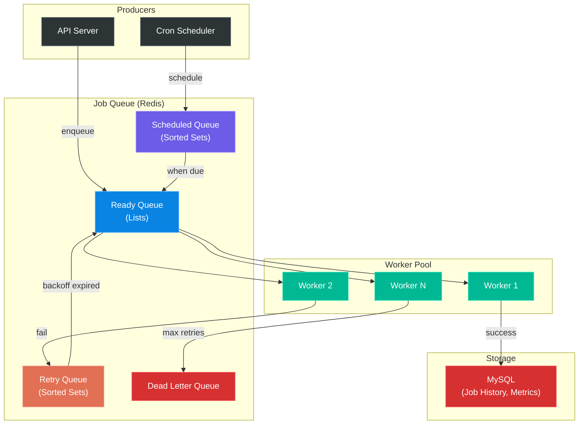

- **Language:** Go
- **Queue:** Redis (sorted sets for delayed, lists for ready)
- **Database:** MySQL (job history, metrics)
- **Concurrency:** Worker pool with configurable parallelism
- **CLI:** Job management (enqueue, status, retry failed)

### Essential Features

- Delayed and scheduled job execution
- Configurable retry with exponential backoff
- Job priority levels
- Dead letter queue for exhausted retries
- Concurrency limits per job type
- Job execution history and metrics
- Graceful shutdown (complete in-flight jobs)

### Common Implementation Pitfalls

- Lost jobs on crash (not using `BLMOVE` / `BRPOPLPUSH` -- the reliable queue pattern)
- No heartbeat[^115] for long-running jobs (assumed dead, re-queued)
- Unbounded retry (not capping max attempts)
- Not serializing job payload version (breaking changes in deserialization)
- Memory leaks from accumulated completed job data

[^114]: **BRPOPLPUSH**: A Redis atomic operation that blocks on a source list, pops the last element, and pushes it to a destination list. Note: deprecated since Redis 6.2.0 in favor of `BLMOVE RIGHT LEFT`, which provides the same semantics with more flexibility. In job processing, it atomically moves a job from the ready queue to a processing queue, ensuring no job is lost even if the worker crashes.
[^115]: **Heartbeat**: A periodic signal sent by a process to indicate that it is alive and functioning. In job processing, workers send heartbeats while processing long-running jobs. If the heartbeat stops, the job is assumed to have failed and is re-queued.

### Required Knowledge

- Redis sorted sets and reliable queue patterns
- Go concurrency patterns (select[^116], context[^117] cancellation)
- *Concurrency in Go* by Katherine Cox-Buday

[^116]: **select**: A Go statement that lets a goroutine wait on multiple channel operations simultaneously. It blocks until one of its cases can proceed, then executes that case. This is the primary mechanism for multiplexing channel operations in Go.
[^117]: **context**: A Go package for carrying deadlines, cancellation signals, and request-scoped values across API boundaries and between goroutines. Contexts are threaded through function calls and enable cooperative cancellation of long-running operations.

### Estimated Difficulty

**Medium-Hard** -- 3 weeks

### Resume and Interview Value

High. Demonstrates systems thinking beyond request/response. Discussable in interviews as an example of building infrastructure from scratch, which matches their "zero-to-one" culture.

### Extensions

- Add cron-like scheduling (cron expressions[^118])
- Implement job chaining (A -> B -> C)
- Add distributed locking[^119] (prevent duplicate processing across instances)
- Build a web dashboard for job monitoring

[^118]: **Cron expression**: A string format used to specify schedules in the cron daemon. It consists of five or six fields representing minute, hour, day of month, month, day of week (and optionally second). For example, `0 9 * * 1-5` means "at 9:00 AM, Monday through Friday."
[^119]: **Distributed lock**: A mechanism for ensuring that only one process in a distributed system can perform a particular operation at a time. Implementations include Redis-based locks (Redlock algorithm) and database-based advisory locks.

---

## Project 9: Secure API Authentication and Authorization Service

### What It Is

A Go service implementing enterprise-grade auth for fintech APIs: OAuth 2.0[^120] client credentials flow, API key management with scoped permissions, JWT with RS256[^121], token rotation[^122], audit logging, and RBAC[^123].

[^120]: **OAuth 2.0**: An authorization framework that enables applications to obtain limited access to user resources without exposing credentials. Defined in RFC 6749, it defines several grant types (flows) for different use cases: authorization code (web apps), client credentials (machine-to-machine), implicit (deprecated), and resource owner password credentials (deprecated). Additional flows like device code (RFC 8628) and PKCE (RFC 7636) were added in later specifications.
[^121]: **RS256**: An asymmetric signing algorithm for JWTs that uses RSA public-key cryptography. The token is signed with a private key and verified with a corresponding public key. This is preferred over HS256 (symmetric) when the verifier should not need the signing secret.
[^122]: **Token rotation**: The practice of issuing new tokens and invalidating old ones on a regular schedule. This limits the damage window if a token is compromised. For refresh tokens, rotation means each use of a refresh token returns a new refresh token and invalidates the old one.
[^123]: **RBAC (Role-Based Access Control)**: An access control model where permissions are assigned to roles rather than directly to users. Users are then assigned roles, simplifying permission management. For example, an "admin" role might have all permissions, while a "viewer" role has only read permissions.

### Why It Is Relevant

"Implement security and engineering best practices" is explicitly in the job description. Fintech APIs require robust auth -- card operations need fine-grained permissions (e.g., "can view balance" but "cannot issue card"). PCI-DSS compliance also demands audit trails.

### Backend Concepts and Engineering Challenges

- OAuth 2.0 flows (client credentials for machine-to-machine)
- JWT signing and verification (RS256)
- API key lifecycle management (create, rotate, revoke)
- RBAC with permission inheritance
- Audit logging for security events
- Rate limiting per auth scope

### Recommended Architecture and Tech Stack

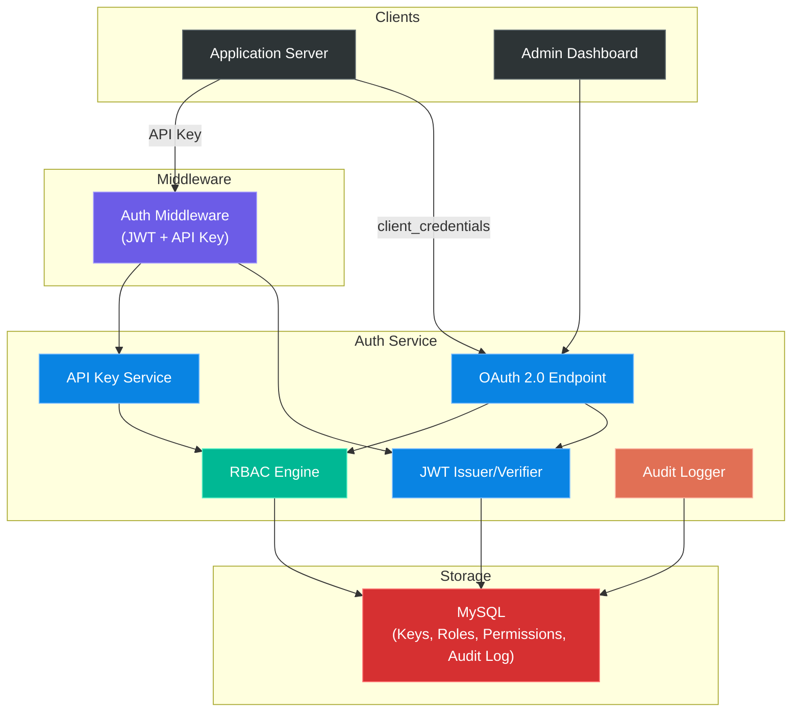

- **Language:** Go
- **Database:** MySQL (keys, roles, audit log)
- **Crypto:** RSA key pair generation, JWT
- **Middleware:** Auth middleware for protected routes
- **Testing:** Table-driven tests[^124] for permission checks

[^124]: **Table-driven tests**: A Go testing idiom where test cases are defined as a slice of structs containing inputs and expected outputs, then iterated with a loop. This reduces boilerplate, makes it easy to add new test cases, and produces clear test output showing which case failed.

### Essential Features

- OAuth 2.0 client credentials flow
- API key CRUD with scoped permissions
- JWT token issuance and verification
- RBAC with configurable roles and permissions
- Comprehensive audit logging (who did what, when)
- Token rotation without downtime

### Common Implementation Pitfalls

- Storing JWT signing keys in code (use environment variables or a vault[^125])
- Not implementing token revocation (blacklist[^126] or short TTL)
- Overly broad permissions (admin = everything)
- Missing audit logging for auth events
- Not rotating API keys regularly

[^125]: **Vault**: A tool for securely storing and accessing secrets (API keys, passwords, certificates, encryption keys). HashiCorp Vault is the most well-known implementation, providing a unified interface for managing secrets with access control, audit logging, and dynamic secret generation.
[^126]: **Token blacklist**: A store (typically Redis) that maintains a list of revoked tokens. When a token is presented, the blacklist is checked in addition to verifying the signature and expiration. This enables token revocation before the natural expiration time.

### Required Knowledge

- OAuth 2.0 specification (RFC 6749)
- JWT structure and signature verification
- RBAC vs. ABAC[^127] models
- OWASP[^128] API Security Top 10

[^127]: **ABAC (Attribute-Based Access Control)**: An access control model where access decisions are based on attributes of the user, resource, action, and environment. It is more flexible than RBAC but more complex to implement. For example, "allow access if user.department == 'finance' AND resource.classification != 'top-secret' AND time.hour BETWEEN 9 AND 17."
[^128]: **OWASP (Open Web Application Security Project)**: A nonprofit foundation that works to improve software security. The OWASP API Security Top 10 is a list of the most critical API security risks, including broken object-level authorization, broken authentication, excessive data exposure, and lack of resources and rate limiting.

### Estimated Difficulty

**Medium** -- 2 to 3 weeks

### Resume and Interview Value

Medium-high. Security is non-negotiable in fintech. Demonstrates you think about authorization boundaries, not just authentication.

### Extensions

- Add OAuth 2.0 PKCE[^129] flow for public clients
- Implement IP allowlisting per API key
- Add anomaly detection (unusual access patterns)
- Implement multi-tenant[^130] isolation

[^129]: **PKCE (Proof Key for Code Exchange)**: An extension to the OAuth 2.0 authorization code flow (defined in RFC 7636) that prevents authorization code injection attacks. It uses a dynamically generated cryptographic code verifier (a random string) and a code challenge (its hashed version) to ensure that only the client that initiated the flow can exchange the authorization code for tokens. Originally designed for public clients (mobile apps, SPAs), PKCE is now recommended for all OAuth 2.0 clients per the OAuth 2.1 draft specification.
[^130]: **Multi-tenancy**: An architecture where a single instance of software serves multiple tenants (customers or organizations). Each tenant's data is isolated and invisible to other tenants, either through separate databases, separate schemas, or shared tables with tenant IDs.

---

## Project 10: Transaction Reconciliation Engine

### What It Is

A batch processing system that compares internal transaction records against external provider statements (simulated CSV[^131]/JSON feeds), identifies discrepancies (missing transactions, amount mismatches, duplicates), and generates reconciliation reports.

[^131]: **CSV (Comma-Separated Values)**: A plain-text format for tabular data where each line is a data record and fields are separated by commas. Despite its simplicity, CSV parsing has many edge cases: quoted fields containing commas, different delimiters, encoding variations, and inconsistent line endings.

### Why It Is Relevant

Reconciliation is a critical, often overlooked, fintech operation. Card issuers must reconcile every transaction against card network settlement files. The job description mentions "reporting systems" and "reliability improvements" -- reconciliation is exactly this.

### Backend Concepts and Engineering Challenges

- Batch processing patterns (chunked reads, streaming)
- Data comparison algorithms (hash-based matching)
- Discrepancy classification and resolution workflows
- Large file processing (streaming, memory efficiency)
- Idempotent batch jobs (re-runnable without duplication)
- Reporting and alerting on anomalies

### Recommended Architecture and Tech Stack

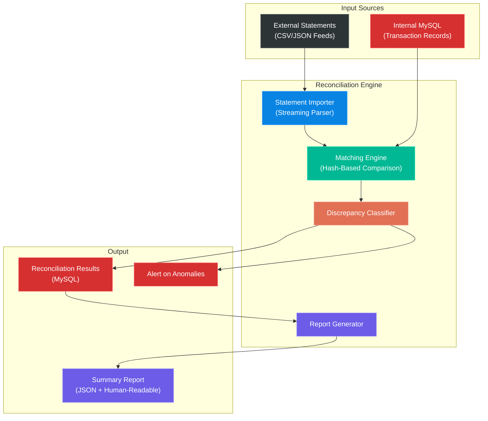

- **Language:** Go
- **Database:** MySQL (internal records, reconciliation results)
- **File processing:** CSV/JSON streaming parser
- **Batch framework:** Custom chunked processor with checkpointing[^132]
- **Output:** Reconciliation report (JSON + human-readable)

[^132]: **Checkpointing**: In batch processing, periodically saving the current position or state of a job so that if the process crashes, it can resume from the last checkpoint rather than restarting from the beginning. This is essential for processing large datasets that take hours to complete.

### Essential Features

- Import external provider statements (CSV/JSON)
- Match against internal records (by transaction ID, amount, date)
- Classify discrepancies: missing internal, missing external, amount mismatch, duplicate
- Generate reconciliation summary report
- Checkpoint/resume for large datasets
- Idempotent re-run (same input = same result)

### Common Implementation Pitfalls

- Loading entire file into memory (OOM[^133] on large statements)
- Not handling timezone differences between systems
- Matching only by transaction ID (misses re-keyed transactions)
- Not logging reconciliation decisions (audit trail)
- Assuming perfect data quality (missing fields, malformed records)

[^133]: **OOM (Out of Memory)**: A condition where a program attempts to allocate more memory than is available, causing the operating system to terminate the process. In Go, this can happen when loading large files entirely into memory; mitigations include streaming (processing data in chunks) and using `io.Reader` interfaces.

### Required Knowledge

- Stream processing in Go (`io.Reader` patterns)
- Batch processing design patterns
- Financial reconciliation concepts
- *Designing Data-Intensive Applications* by Martin Kleppmann (chapters on batch processing)

### Estimated Difficulty

**Medium-Hard** -- 3 weeks

### Resume and Interview Value

High. Most candidates never build reconciliation systems. This demonstrates fintech domain depth and data reliability thinking -- highly differentiated for a StraitsX application.

### Extensions

- Add auto-resolution rules for common discrepancy patterns
- Implement near-real-time reconciliation (streaming, not just batch)
- Add ML[^134]-based anomaly detection for unusual discrepancies
- Build a web dashboard for manual discrepancy review

[^134]: **ML (Machine Learning)**: A subset of artificial intelligence where systems learn patterns from data without being explicitly programmed. In reconciliation, ML can detect anomalous transactions that do not match known patterns, flagging them for human review.

---

## Priority Ranking and Implementation Order

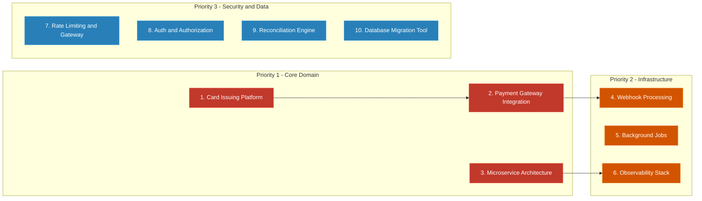

| Priority | Project | Rationale |
|----------|---------|-----------|
| 1 | Card Issuing Platform | Core domain -- demonstrates understanding of their business |
| 2 | Payment Gateway Integration | Explicit job description responsibility -- third-party integrations |
| 3 | Microservice Architecture | Core job description requirement -- shows system design thinking |
| 4 | Webhook Processing System | Essential for payment integrations |
| 5 | Background Job Processing | Infrastructure skill -- matches "scalable systems" |
| 6 | Observability Stack | Production readiness signal |
| 7 | Rate Limiting and API Gateway | Infrastructure + security |
| 8 | Auth and Authorization Service | Security best practices |
| 9 | Reconciliation Engine | Fintech domain differentiation |
| 10 | Database Migration Tool | Database engineering maturity |

---

## Key Principles Across All Projects

1. **All projects in Go** -- the job description requires "strong proficiency in Golang"
2. **MySQL/MariaDB** -- matches their stack exactly
3. **Write tests** -- table-driven tests in Go, integration tests with Testcontainers
4. **Dockerize everything** -- Dockerfile + docker-compose.yml in every repository
5. **CI/CD from day one** -- GitHub Actions with lint, test, build
6. **Structured logging** -- zerolog/zap with JSON output
7. **API documentation** -- OpenAPI 3.0 spec for every API
8. **README matters** -- architecture diagram, setup instructions, design decisions

---

## Summary of All Projects

| # | Project | Difficulty | Duration | Key Concept |
|---|---------|-----------|----------|-------------|
| 1 | Card Issuing Platform | Hard | 4-6 weeks | State machines, idempotency, event sourcing |
| 2 | Payment Gateway Integration | Hard | 3-4 weeks | Adapter pattern, circuit breaker, reconciliation |
| 3 | Microservice Architecture | Hard | 3-5 weeks | DDD, saga pattern, database-per-service |
| 4 | Webhook Processing System | Medium | 2 weeks | HMAC, deduplication, dead-letter queues |
| 5 | Background Job Processing | Medium-Hard | 3 weeks | Worker pools, priority queues, graceful shutdown |
| 6 | Observability Stack | Medium | 2 weeks | RED metrics, distributed tracing, SLOs |
| 7 | Rate Limiting and API Gateway | Medium | 2-3 weeks | Token bucket, distributed rate limiting |
| 8 | Auth and Authorization Service | Medium | 2-3 weeks | OAuth 2.0, JWT, RBAC, audit logging |
| 9 | Reconciliation Engine | Medium-Hard | 3 weeks | Batch processing, streaming, discrepancy analysis |
| 10 | Database Migration Tool | Medium | 2-3 weeks | Schema versioning, zero-downtime, expand-contract |

---

## Recommended Reading and Resources

| Resource | Why |
|----------|-----|
| *Designing Data-Intensive Applications* -- Martin Kleppmann | Foundational for distributed systems thinking |
| *Release It!* -- Michael Nygard | Production anti-patterns (circuit breaker, retry, timeout) |
| *Building Microservices* -- Sam Newman | Service decomposition strategies |
| Stripe Engineering Blog | Best-in-class payment API design |
| *Concurrency in Go* -- Katherine Cox-Buday | Go-specific concurrency patterns |
| Google SRE Book | Monitoring, alerting, SLOs |
| Visa/Mastercard Developer Docs | Card network protocols and APIs |
| *Database Reliability Engineering* -- Laine Campbell and Charity Majors | Operational database practices |
| OWASP API Security Top 10 | API security best practices |

---

## Footnote Index

All footnotes are defined inline at their first occurrence. This index provides a quick reference for finding specific terms:

| # | Term | Defined In |
|---|------|-----------|
| 1 | Zero-to-one | Role Summary |
| 2 | PCI-DSS | Key Technical Signals |
| 3 | Idempotency | Key Technical Signals |
| 4 | Ledger | Key Technical Signals |
| 5 | Microservices architecture | Key Technical Signals |
| 6 | Distributed systems | Key Technical Signals |
| 7 | API | Key Technical Signals |
| 8 | Webhook | Key Technical Signals |
| 9 | Concurrency | Key Technical Signals |
| 10 | Horizontal scaling | Key Technical Signals |
| 11 | Docker | Key Technical Signals |
| 12 | CI/CD | Key Technical Signals |
| 13 | Authorization | Project 1 |
| 14 | Clearing | Project 1 |
| 15 | Settlement | Project 1 |
| 16 | State machine | Project 1 |
| 17 | Event sourcing | Project 1 |
| 18 | Optimistic locking | Project 1 |
| 19 | Tokenization | Project 1 |
| 20 | PAN | Project 1 |
| 21 | Cache | Project 1 |
| 22 | Redis | Project 1 |
| 23 | Modular monolith | Project 1 |
| 24 | OpenAPI 3.0 | Project 1 |
| 25 | JWT | Project 1 |
| 26 | Double-entry bookkeeping | Project 1 |
| 27 | Race condition | Project 1 |
| 28 | Transaction isolation level | Project 1 |
| 29 | 3D Secure | Project 1 |
| 30 | Chargeback | Project 1 |
| 31 | FX | Project 1 |
| 32 | Adapter pattern | Project 2 |
| 33 | Circuit breaker pattern | Project 2 |
| 34 | Exponential backoff | Project 2 |
| 35 | Jitter | Project 2 |
| 36 | Eventual consistency | Project 2 |
| 37 | Redis Streams | Project 2 |
| 38 | RabbitMQ | Project 2 |
| 39 | zerolog | Project 2 |
| 40 | zap | Project 2 |
| 41 | OpenTelemetry | Project 2 |
| 42 | A/B testing | Project 2 |
| 43 | gRPC | Project 3 |
| 44 | DDD | Project 3 |
| 45 | Bounded context | Project 3 |
| 46 | Saga pattern | Project 3 |
| 47 | Service discovery | Project 3 |
| 48 | NATS | Project 3 |
| 49 | Traefik | Project 3 |
| 50 | Docker Compose | Project 3 |
| 51 | Kubernetes | Project 3 |
| 52 | Protocol Buffers | Project 3 |
| 53 | Outbox pattern | Project 3 |
| 54 | Distributed monolith | Project 3 |
| 55 | CAP theorem | Project 3 |
| 56 | CQRS | Project 3 |
| 57 | Service mesh | Project 3 |
| 58 | Istio | Project 3 |
| 59 | Jaeger | Project 3 |
| 60 | Rate limiting | Project 4 |
| 61 | Token bucket algorithm | Project 4 |
| 62 | Sliding window counter | Project 4 |
| 63 | Middleware | Project 4 |
| 64 | Load balancing | Project 4 |
| 65 | chi | Project 4 |
| 66 | CORS | Project 4 |
| 67 | Prometheus | Project 4 |
| 68 | Correlation ID | Project 4 |
| 69 | Graceful shutdown | Project 4 |
| 70 | INCR (Redis) | Project 4 |
| 71 | TTL | Project 4 |
| 72 | Clock skew | Project 4 |
| 73 | DDoS | Project 4 |
| 74 | HMAC | Project 4 |
| 75 | CLI | Project 5 |
| 76 | Zero-downtime deployment | Project 5 |
| 77 | DDL | Project 5 |
| 78 | Expand-contract pattern | Project 5 |
| 79 | cobra | Project 5 |
| 80 | Testcontainers | Project 5 |
| 81 | GitHub Actions | Project 5 |
| 82 | gh-ost | Project 5 |
| 83 | pt-online-schema-change | Project 5 |
| 84 | Grafana | Project 6 |
| 85 | Three pillars of observability | Project 6 |
| 86 | RED metrics | Project 6 |
| 87 | SLO | Project 6 |
| 88 | Alertmanager | Project 6 |
| 89 | Liveness probe | Project 6 |
| 90 | Readiness probe | Project 6 |
| 91 | Cardinality | Project 6 |
| 92 | PII | Project 6 |
| 93 | Alert fatigue | Project 6 |
| 94 | PromQL | Project 6 |
| 95 | SRE | Project 6 |
| 96 | SLI | Project 6 |
| 97 | Error budget | Project 6 |
| 98 | Loki | Project 6 |
| 99 | Chaos engineering | Project 6 |
| 100 | Dead-letter queue | Project 7 |
| 101 | At-least-once delivery | Project 7 |
| 102 | Nonce | Project 7 |
| 103 | Property-based testing | Project 7 |
| 104 | TOCTOU | Project 7 |
| 105 | Sidekiq | Project 8 |
| 106 | Bull | Project 8 |
| 107 | Worker pool | Project 8 |
| 108 | Goroutine | Project 8 |
| 109 | Channel | Project 8 |
| 110 | Priority queue | Project 8 |
| 111 | Redis sorted set | Project 8 |
| 112 | Semaphore | Project 8 |
| 113 | Serialization | Project 8 |
| 114 | BRPOPLPUSH | Project 8 |
| 115 | Heartbeat | Project 8 |
| 116 | select | Project 8 |
| 117 | context | Project 8 |
| 118 | Cron expression | Project 8 |
| 119 | Distributed lock | Project 8 |
| 120 | OAuth 2.0 | Project 9 |
| 121 | RS256 | Project 9 |
| 122 | Token rotation | Project 9 |
| 123 | RBAC | Project 9 |
| 124 | Table-driven tests | Project 9 |
| 125 | Vault | Project 9 |
| 126 | Token blacklist | Project 9 |
| 127 | ABAC | Project 9 |
| 128 | OWASP | Project 9 |
| 129 | PKCE | Project 9 |
| 130 | Multi-tenancy | Project 9 |
| 131 | CSV | Project 10 |
| 132 | Checkpointing | Project 10 |
| 133 | OOM | Project 10 |
| 134 | ML | Project 10 |
