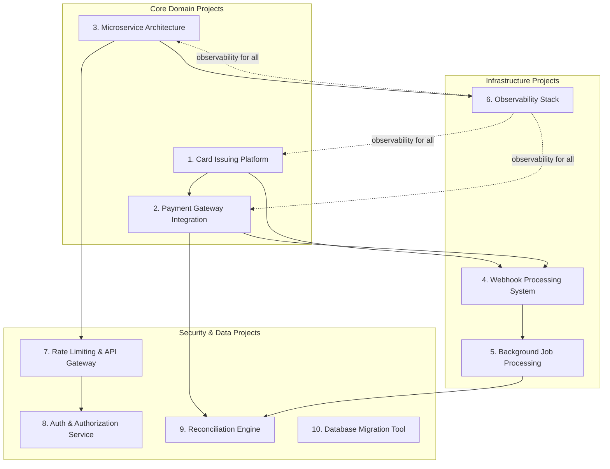
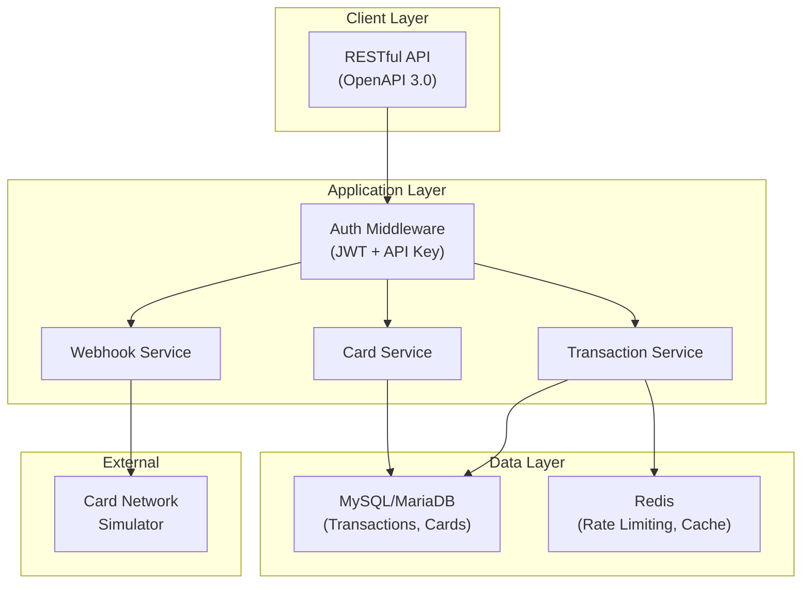
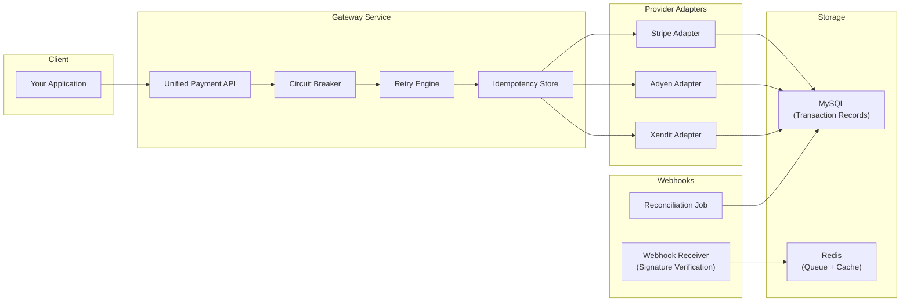
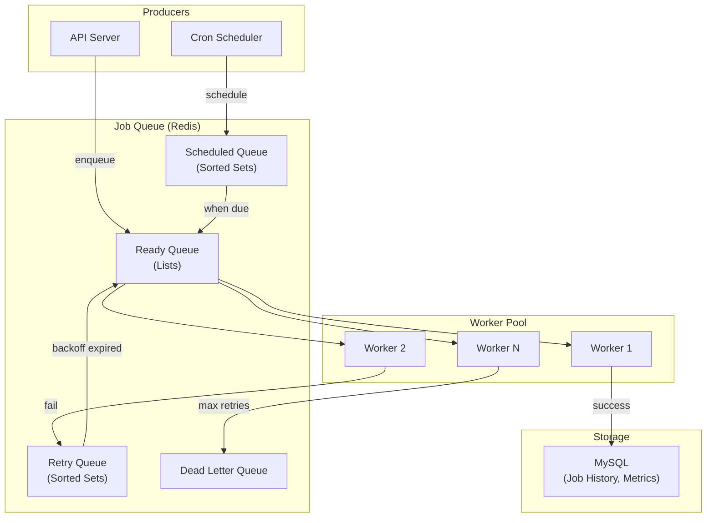
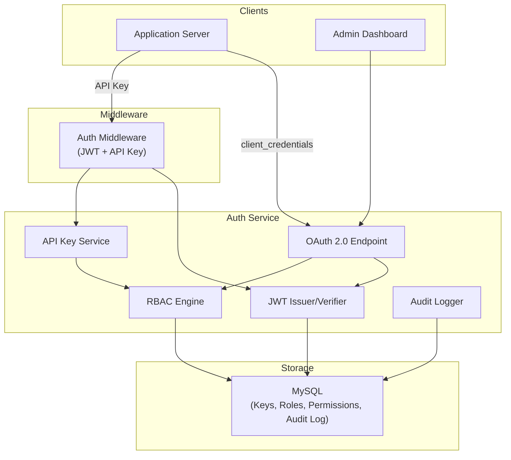
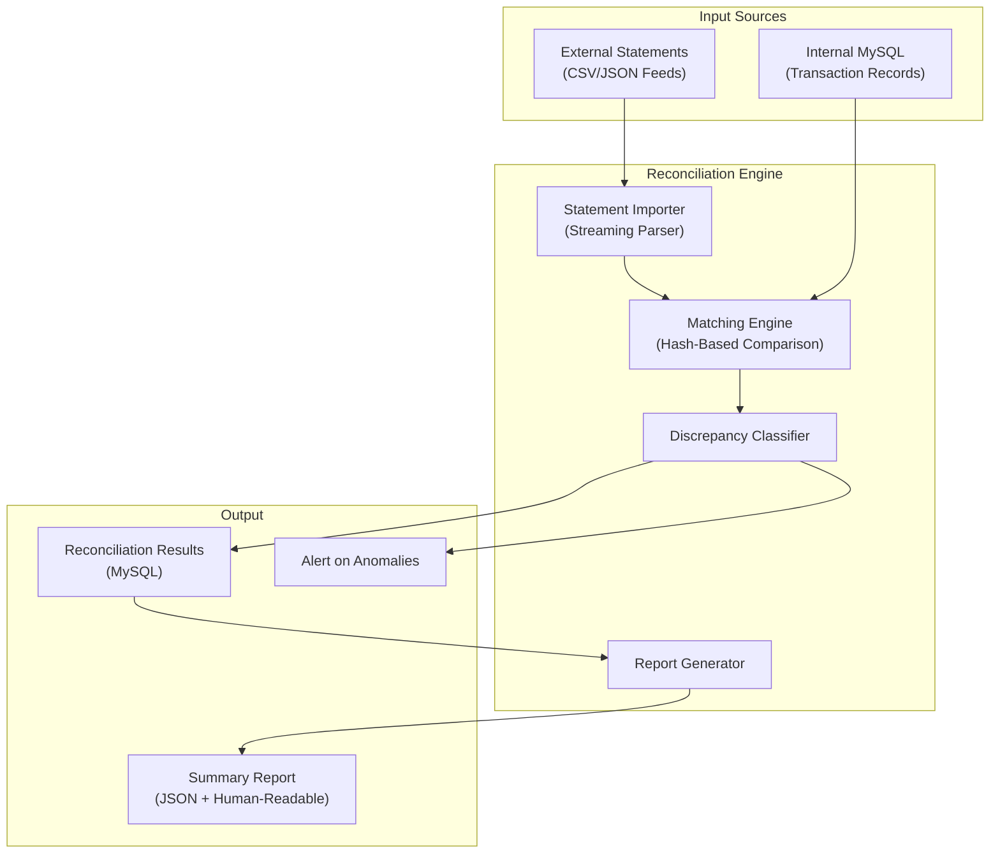
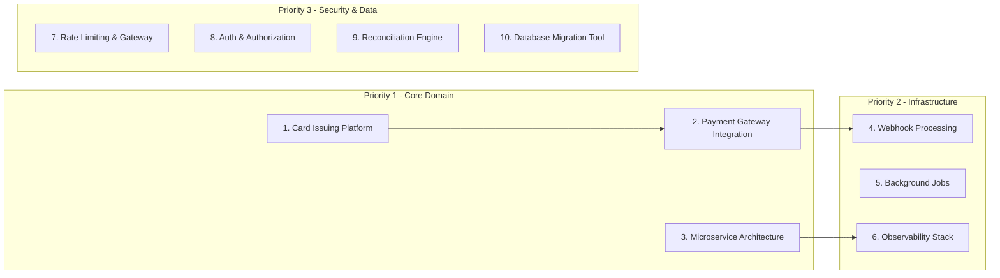

# Portfolio Project Recommendations for StraitsX Backend Engineer (Card Issuing)

## Table of Contents

1. [Role Summary](#role-summary)  
2. [Key Technical Signals from the Job Description](#key-technical-signals-from-the-job-description)  
3. [Architectural Overview of Recommended Projects](#architectural-overview-of-recommended-projects)  
4. [Project 1: Card Issuing and Transaction Processing Platform](#project-1-card-issuing-and-transaction-processing-platform)  
5. [Project 2: Payment Gateway Integration Service](#project-2-payment-gateway-integration-service)  
6. [Project 3: Microservice Architecture (recommended)](#project-3-microservice-architecture-recommended)  
7. [Project 4: Webhook Processing System](#project-4-webhook-processing-system)  
8. [Project 5: Background Job Processing](#project-5-background-job-processing)  
9. [Project 6: Observability Stack](#project-6-observability-stack)  
10. [Project 7: Rate Limiting & API Gateway](#project-7-rate-limiting--api-gateway)  
11. [Project 8: Database Migration Tool](#project-8-database-migration-tool)  
12. [Project 9: Secure API Authentication and Authorization Service](#project-9-secure-api-authentication-and-authorization-service)  
13. [Project 10: Transaction Reconciliation Engine](#project-10-transaction-reconciliation-engine)  
14. [Priority Ranking and Implementation Order](#priority-ranking-and-implementation-order)  
15. [Summary of All Projects](#summary-of-all-projects)  
16. [Recommended Reading and Resources](#recommended-reading-and-resources)

---

## Role Summary

**Company:** StraitsX (Fazz Financial Group) -- Southeast Asian fintech infrastructure  
**Position:** Backend Engineer, Card Issuing Team  
**Location:** Jakarta, Indonesia  
**Core Mission:** Build a zero-to-one[^1] card issuing platform and scalable fintech infrastructure

[^1]: **Zero-to-one**: Building a product or system from nothing to its first functional version, as opposed to iterating on an existing system. Coined by Peter Thiel in *Zero to One* (2014), it emphasizes creating something entirely new rather than incrementally improving what already exists.

---

## Key Technical Signals from the Job Description

| Signal | Why It Matters |
|--------|---------------|
| **Golang** (strong proficiency) | Primary language -- every project should be in Go |
| **Card issuing / payment processing** | Domain-specific: PCI-DSS[^2], transaction idempotency[^3], ledger[^4] integrity |
| **Zero-to-one platform** | They want builders who can architect from scratch, not just maintain |
| **Microservices architecture[^5]** | Service decomposition, inter-service communication, distributed systems[^6] |
| **SQL (MariaDB/MySQL)** | Relational data modeling, migrations, query optimization |
| **Third-party payment integrations** | API[^7] integration patterns, webhook[^8] handling, retry logic |
| **Scalable systems** | Concurrency[^9], caching, horizontal scaling[^10], load testing |
| **Docker[^11] + CI/CD[^12]** | Containerization, automated pipelines, deployment strategies |

[^2]: **PCI-DSS (Payment Card Industry Data Security Standard)**: A set of security standards designed to ensure that all companies that accept, process, store, or transmit credit card information maintain a secure environment. See [PCI SSC](https://www.pcisecuritystandards.org/).
[^3]: **Idempotency**: The property of an operation where performing it multiple times has the same effect as performing it once. In payments, this prevents double-charges when a request is retried due to network failures.
[^4]: **Ledger**: An append-only record of all financial transactions. In fintech, ledgers follow double-entry bookkeeping principles where every debit has a corresponding credit entry.
[^5]: **Microservices architecture**: A software design approach where an application is built as a collection of small, independently deployable services, each running its own process and communicating via lightweight protocols (HTTP, gRPC, message queues).
[^6]: **Distributed systems**: Systems where components located on networked computers communicate and coordinate their actions by passing messages. They introduce challenges like network partitions, partial failures, and eventual consistency.
[^7]: **API (Application Programming Interface)**: A set of protocols, tools, and definitions that allow different software applications to communicate with each other. RESTful APIs use HTTP methods (GET, POST, PUT, DELETE) to perform operations on resources.
[^8]: **Webhook**: A mechanism where a server sends real-time HTTP callbacks to another system when a specific event occurs, rather than requiring the receiving system to poll for updates.
[^9]: **Concurrency**: The ability of a system to handle multiple tasks simultaneously. In Go, concurrency is achieved through goroutines (lightweight threads) and channels (communication pipes between goroutines).
[^10]: **Horizontal scaling (scaling out)**: Adding more machines to a system to handle increased load, as opposed to vertical scaling (scaling up), which adds more resources (CPU, RAM) to a single machine.
[^11]: **Docker**: A platform that uses OS-level virtualization to deliver software in packages called containers. Containers bundle an application with all its dependencies, ensuring consistent behavior across environments.
[^12]: **CI/CD (Continuous Integration / Continuous Deployment)**: Development practices where code changes are automatically built, tested, and deployed. CI ensures code is integrated and tested frequently; CD automates deployment to production.

---

## Architectural Overview of Recommended Projects

---

## Project 1: Card Issuing and Transaction Processing Platform

### What It Is

A simplified card issuing system that simulates the full card lifecycle: card creation, activation, authorization[^13], clearing[^14], settlement[^15], and dispute handling. Users can issue virtual cards, make simulated transactions, and view real-time balances.

[^13]: **Authorization**: The first phase of a card transaction where the issuer verifies that the cardholder has sufficient funds or credit and approves or declines the transaction in real-time. The funds are reserved but not yet transferred.
[^14]: **Clearing**: The process of exchanging financial transaction details between the acquiring bank and the issuing bank to facilitate posting to the cardholder's account. This typically happens in batches after authorization.
[^15]: **Settlement**: The actual transfer of funds between banks to complete a transaction. This occurs after clearing and involves the movement of money through the card network (Visa, Mastercard).

### Why It Is Relevant

This is the exact domain StraitsX operates in. Building even a simplified version demonstrates understanding of the card payment lifecycle, which most backend engineers never encounter. According to the Visa Developer documentation and Mastercard's payment processing guides, card authorization involves multi-step state machines[^16] with strict idempotency requirements.

[^16]: **State machine**: A computational model where a system can be in exactly one of a finite number of states at any given time. Transitions between states are triggered by events. In card issuing, a card moves through states like inactive, active, blocked, and closed.

### Backend Concepts and Engineering Challenges

- **Finite state machines** for card status (inactive -> active -> blocked -> closed)
- **Idempotent** transaction processing (preventing double-charges)
- **Event sourcing[^17]** for transaction history (append-only ledger pattern)
- **Optimistic locking[^18]** for concurrent balance updates
- **PCI-DSS** awareness (tokenization[^19], never storing raw PANs[^20])

[^17]: **Event sourcing**: A design pattern where state changes are stored as a sequence of events rather than storing only the current state. The current state can be reconstructed by replaying all events. This provides a complete audit trail and enables temporal queries.
[^18]: **Optimistic locking**: A concurrency control method where a record is read, modified, and written back with a version check. If another process modified the record between the read and write (detected by a version mismatch), the operation fails and must be retried. This avoids the overhead of database-level locks.
[^19]: **Tokenization**: The process of replacing sensitive data (like a credit card number) with a non-sensitive placeholder (token) that has no exploitable value. The original data is stored securely in a token vault.
[^20]: **PAN (Primary Account Number)**: A variable-length number (up to 19 digits, per ISO/IEC 7812) on a payment card that identifies the card issuer and the cardholder's account. Common lengths are 13 to 19 digits; Visa and Mastercard typically use 16 digits. PCI-DSS prohibits storing full PANs in plaintext.

### Recommended Architecture and Tech Stack

- **Language:** Go
- **Database:** MySQL/MariaDB (matches their stack)
- **Cache[^21]:** Redis[^22] (for rate limiting, session tokens)
- **Architecture:** Modular monolith[^23] with clear domain boundaries (can evolve to microservices)
- **API:** RESTful with OpenAPI 3.0[^24] spec
- **Auth:** JWT[^25] + API key authentication

[^21]: **Cache**: A high-speed data storage layer that stores a subset of data so that future requests for that data can be served faster than by accessing the primary data store. Caches reduce database load and improve response times.
[^22]: **Redis (Remote Dictionary Server)**: An open-source, in-memory data structure store used as a database, cache, message broker, and streaming engine. It supports data structures like strings, hashes, lists, sets, and sorted sets.
[^23]: **Modular monolith**: A monolithic application that is internally structured into well-defined modules with clear boundaries and interfaces. Unlike a traditional monolith, modules can be extracted into separate services when needed, providing a migration path to microservices.
[^24]: **OpenAPI 3.0**: A specification for defining APIs in a standard, language-agnostic format. It describes endpoints, request/response formats, authentication, and other details, enabling automatic documentation generation and client SDK creation.
[^25]: **JWT (JSON Web Token)**: A compact, URL-safe token format for securely transmitting information between parties as a JSON object. JWTs are digitally signed (using HMAC or RSA) and contain claims about the user (e.g., user ID, roles, expiration).

### Essential Features

- Issue virtual cards with configurable limits
- Simulate authorization requests (approve/decline based on rules)
- Transaction ledger with double-entry bookkeeping[^26]
- Idempotency keys on all mutating endpoints
- Webhook notifications for card events
- Rate limiting per API key

[^26]: **Double-entry bookkeeping**: An accounting system where every transaction is recorded in at least two accounts as both a debit and a credit. The total debits must always equal the total credits, providing a built-in error-checking mechanism.

### Common Implementation Pitfalls

- Using floating-point numbers for money (use `decimal` or integer cents to avoid precision errors)
- Not handling concurrent transactions on the same card (race conditions[^27])
- Missing idempotency on payment endpoints (causes double-charges)
- Storing sensitive card data without proper encryption
- Not implementing proper transaction isolation levels[^28]

[^27]: **Race condition**: A flaw in a system where the output depends on the unpredictable sequence or timing of multiple concurrent operations. In payments, a race condition could allow two simultaneous transactions to both succeed even when funds are insufficient.
[^28]: **Transaction isolation level**: A setting that determines how and when changes made by one transaction are visible to other transactions. Common levels include READ COMMITTED (sees only committed data) and REPEATABLE READ (consistent snapshot within a transaction). Higher isolation prevents anomalies but reduces concurrency.

### Required Knowledge

- Double-entry bookkeeping basics
- Idempotency patterns in distributed systems
- Database transaction isolation levels (READ COMMITTED, REPEATABLE READ)
- PCI-DSS scope awareness

### Estimated Difficulty

**Hard** -- 4 to 6 weeks

### Resume and Interview Value

Extremely high. This directly maps to StraitsX's core product. In interviews, you can discuss card authorization flows, idempotency, and ledger design -- topics that signal domain expertise.

### Extensions

- Add 3D Secure[^29] simulation (EMV 3DS protocol)
- Implement a simple dispute/chargeback[^30] workflow
- Add multi-currency support with FX[^31] rate conversion
- Build a card scheme simulator (Visa/Mastercard network simulation)

[^29]: **3D Secure (3DS)**: An authentication protocol designed to be an additional security layer for online credit and debit card transactions. The "3D" refers to the three domains involved: the acquirer domain, the issuer domain, and the interoperability domain (card network).
[^30]: **Chargeback**: A forced reversal of a credit card payment that comes from the cardholder's issuing bank. The cardholder disputes a charge, and the issuer pulls the funds back from the merchant's acquiring bank.
[^31]: **FX (Foreign Exchange)**: The exchange of one currency for another. In payment processing, FX conversion occurs when a transaction involves a different currency than the cardholder's billing currency.

---

## Project 2: Payment Gateway Integration Service

### What It Is

A Go service that acts as an abstraction layer over multiple payment providers (e.g., Stripe, Adyen, Xendit). It normalizes different provider APIs into a unified interface, handles webhooks, manages provider failover, and provides transaction reconciliation.

### Why It Is Relevant

The job description explicitly mentions "Integrate with third-party payment providers for local and global card transactions." This project demonstrates the exact skill: building reliable integrations with external payment APIs, which is notoriously tricky due to inconsistent APIs, webhook reliability, and reconciliation challenges.

### Backend Concepts and Engineering Challenges

- **Adapter pattern[^32]** for normalizing multiple provider APIs
- Webhook signature verification and idempotent processing
- **Circuit breaker pattern[^33]** for provider failover
- **Retry with exponential backoff[^34] and jitter[^35]**
- Reconciliation: comparing internal records vs. provider records
- **Eventual consistency[^36]** handling

[^32]: **Adapter pattern**: A structural design pattern that allows objects with incompatible interfaces to collaborate. It wraps an existing class with a new interface so it can work with code that expects a different interface. In payment integrations, each provider has a different API, so adapters normalize them into a common interface.
[^33]: **Circuit breaker pattern**: A stability pattern that detects failures and prevents an application from repeatedly trying to execute an operation likely to fail. When failures exceed a threshold, the circuit "opens" and subsequent calls fail fast without calling the remote service. After a timeout, it enters a "half-open" state to test if the service has recovered. See *Release It!* by Michael Nygard.
[^34]: **Exponential backoff**: A retry strategy where the wait time between retries increases exponentially (e.g., 1s, 2s, 4s, 8s...). This prevents overwhelming a struggling service with rapid retries and gives it time to recover.
[^35]: **Jitter**: A random variation added to the backoff delay to prevent synchronized retries from multiple clients (the "thundering herd" problem). Without jitter, all clients retry at the same intervals, creating traffic spikes.
[^36]: **Eventual consistency**: A consistency model where, given enough time without new updates, all replicas of a data item will converge to the same value. In distributed payment systems, the internal state and provider state may temporarily differ but will eventually align.

### Recommended Architecture and Tech Stack

- **Language:** Go
- **Database:** MySQL (transaction records)
- **Queue:** Redis Streams[^37] or RabbitMQ[^38] (for async webhook processing)
- **HTTP Client:** Custom retry/timeout middleware
- **Observability:** Structured logging (zerolog[^39]/zap[^40]) + OpenTelemetry[^41] traces

[^37]: **Redis Streams**: A data structure in Redis that acts as an append-only log with consumer group support. It enables message queue semantics (publish/subscribe with persistence) within Redis, suitable for event streaming and task queues.
[^38]: **RabbitMQ**: An open-source message broker that implements the Advanced Message Queuing Protocol (AMQP). It receives messages from producers, stores them, and delivers them to consumers, supporting patterns like work queues, pub/sub, and routing.
[^39]: **zerolog**: A high-performance, zero-allocation JSON logger for Go. It focuses on structured logging with minimal overhead, producing JSON output suitable for log aggregation systems.
[^40]: **zap**: A high-performance structured logging library for Go developed by Uber. It offers both a sugared (printf-style) and a structured (field-based) API, with benchmarks showing it is significantly 

... [OUTPUT TRUNCATED - 38459 chars omitted out of 88459 total] ...

 Is

A Go-based distributed job processing system (like a simplified Sidekiq[^105] or Bull[^106]) that supports: delayed jobs, scheduled jobs, retries with backoff, job prioritization, concurrency control, and dead letter handling. Use it to run settlement batches, reconciliation jobs, and notification delivery.

[^105]: **Sidekiq**: A popular background job processing framework for Ruby that uses Redis as its backing store. It supports concurrent execution, retries, scheduled jobs, and dead letter queues. It is widely considered the industry standard for Ruby background processing.
[^106]: **Bull**: A Node.js library for handling distributed jobs and messages backed by Redis. It provides reliable queue semantics with support for delayed jobs, retries, priorities, and concurrency control.

### Why It Is Relevant

Card issuing platforms have critical background workloads: end-of-day settlement, transaction reconciliation, fraud scoring, notification delivery. The job description mentions "build and maintain scalable systems" -- background job processing is fundamental to scalability.

### Backend Concepts and Engineering Challenges

- Worker pool[^107] patterns in Go (goroutines[^108] + channels[^109])
- Delayed priority queues[^110] (Redis sorted sets[^111])
- Exponential backoff with jitter for retries
- Concurrency control (semaphore[^112] pattern)
- Job serialization[^113] and versioning
- Graceful shutdown with job completion

[^107]: **Worker pool**: A concurrency pattern where a fixed number of worker goroutines (or threads) pull tasks from a shared queue. This limits concurrency to prevent resource exhaustion while maximizing throughput.
[^108]: **Goroutine**: A lightweight thread managed by the Go runtime. Goroutines are much cheaper than OS threads (starting at ~2KB of stack memory vs. ~1MB for threads), enabling an application to run thousands or millions of concurrent goroutines.
[^109]: **Channel**: A typed conduit in Go for communication between goroutines. Channels provide a safe way to share data without explicit locks or condition variables, following Go's philosophy: "Do not communicate by sharing memory; instead, share memory by communicating."
[^110]: **Priority queue**: A data structure where each element has a priority, and elements with higher priority are dequeued before elements with lower priority, regardless of insertion order. In job processing, this ensures critical jobs (e.g., fraud alerts) are processed before low-priority ones (e.g., report generation).
[^111]: **Redis sorted set**: A Redis data structure that stores unique elements ordered by a score. It supports O(log N) insertion, deletion, and range queries by score. In job processing, the score represents the scheduled execution time, enabling efficient delayed job retrieval.
[^112]: **Semaphore**: A synchronization primitive that limits the number of concurrent accesses to a shared resource. In Go, a buffered channel of size N acts as a semaphore, allowing at most N goroutines to proceed concurrently.
[^113]: **Serialization**: The process of converting a data structure or object into a format that can be stored or transmitted and reconstructed later. In job processing, job payloads are serialized (e.g., to JSON) for storage in the queue and deserialized by workers.

### Recommended Architecture and Tech Stack

- **Language:** Go
- **Queue:** Redis (sorted sets for delayed, lists for ready)
- **Database:** MySQL (job history, metrics)
- **Concurrency:** Worker pool with configurable parallelism
- **CLI:** Job management (enqueue, status, retry failed)

### Essential Features

- Delayed and scheduled job execution
- Configurable retry with exponential backoff
- Job priority levels
- Dead letter queue for exhausted retries
- Concurrency limits per job type
- Job execution history and metrics
- Graceful shutdown (complete in-flight jobs)

### Common Implementation Pitfalls

- Lost jobs on crash (not using `BLMOVE` / `BRPOPLPUSH` -- the reliable queue pattern)
- No heartbeat[^115] for long-running jobs (assumed dead, re-queued)
- Unbounded retry (not capping max attempts)
- Not serializing job payload version (breaking changes in deserialization)
- Memory leaks from accumulated completed job data

[^114]: **BRPOPLPUSH**: A Redis atomic operation that blocks on a source list, pops the last element, and pushes it to a destination list. Note: deprecated since Redis 6.2.0 in favor of `BLMOVE RIGHT LEFT`, which provides the same semantics with more flexibility. In job processing, it atomically moves a job from the ready queue to a processing queue, ensuring no job is lost even if the worker crashes.
[^115]: **Heartbeat**: A periodic signal sent by a process to indicate that it is alive and functioning. In job processing, workers send heartbeats while processing long-running jobs. If the heartbeat stops, the job is assumed to have failed and is re-queued.

### Required Knowledge

- Redis sorted sets and reliable queue patterns
- Go concurrency patterns (select[^116], context[^117] cancellation)
- *Concurrency in Go* by Katherine Cox-Buday

[^116]: **select**: A Go statement that lets a goroutine wait on multiple channel operations simultaneously. It blocks until one of its cases can proceed, then executes that case. This is the primary mechanism for multiplexing channel operations in Go.
[^117]: **context**: A Go package for carrying deadlines, cancellation signals, and request-scoped values across API boundaries and between goroutines. Contexts are threaded through function calls and enable cooperative cancellation of long-running operations.

### Estimated Difficulty

**Medium-Hard** -- 3 weeks

### Resume and Interview Value

High. Demonstrates systems thinking beyond request/response. Discussable in interviews as an example of building infrastructure from scratch, which matches their "zero-to-one" culture.

### Extensions

- Add cron-like scheduling (cron expressions[^118])
- Implement job chaining (A -> B -> C)
- Add distributed locking[^119] (prevent duplicate processing across instances)
- Build a web dashboard for job monitoring

[^118]: **Cron expression**: A string format used to specify schedules in the cron daemon. It consists of five or six fields representing minute, hour, day of month, month, day of week (and optionally second). For example, `0 9 * * 1-5` means "at 9:00 AM, Monday through Friday."
[^119]: **Distributed lock**: A mechanism for ensuring that only one process in a distributed system can perform a particular operation at a time. Implementations include Redis-based locks (Redlock algorithm) and database-based advisory locks.

---

## Project 9: Secure API Authentication and Authorization Service

### What It Is

A Go service implementing enterprise-grade auth for fintech APIs: OAuth 2.0[^120] client credentials flow, API key management with scoped permissions, JWT with RS256[^121], token rotation[^122], audit logging, and RBAC[^123].

[^120]: **OAuth 2.0**: An authorization framework that enables applications to obtain limited access to user resources without exposing credentials. Defined in RFC 6749, it defines several grant types (flows) for different use cases: authorization code (web apps), client credentials (machine-to-machine), implicit (deprecated), and resource owner password credentials (deprecated). Additional flows like device code (RFC 8628) and PKCE (RFC 7636) were added in later specifications.
[^121]: **RS256**: An asymmetric signing algorithm for JWTs that uses RSA public-key cryptography. The token is signed with a private key and verified with a corresponding public key. This is preferred over HS256 (symmetric) when the verifier should not need the signing secret.
[^122]: **Token rotation**: The practice of issuing new tokens and invalidating old ones on a regular schedule. This limits the damage window if a token is compromised. For refresh tokens, rotation means each use of a refresh token returns a new refresh token and invalidates the old one.
[^123]: **RBAC (Role-Based Access Control)**: An access control model where permissions are assigned to roles rather than directly to users. Users are then assigned roles, simplifying permission management. For example, an "admin" role might have all permissions, while a "viewer" role has only read permissions.

### Why It Is Relevant

"Implement security and engineering best practices" is explicitly in the job description. Fintech APIs require robust auth -- card operations need fine-grained permissions (e.g., "can view balance" but "cannot issue card"). PCI-DSS compliance also demands audit trails.

### Backend Concepts and Engineering Challenges

- OAuth 2.0 flows (client credentials for machine-to-machine)
- JWT signing and verification (RS256)
- API key lifecycle management (create, rotate, revoke)
- RBAC with permission inheritance
- Audit logging for security events
- Rate limiting per auth scope

### Recommended Architecture and Tech Stack

- **Language:** Go
- **Database:** MySQL (keys, roles, audit log)
- **Crypto:** RSA key pair generation, JWT
- **Middleware:** Auth middleware for protected routes
- **Testing:** Table-driven tests[^124] for permission checks

[^124]: **Table-driven tests**: A Go testing idiom where test cases are defined as a slice of structs containing inputs and expected outputs, then iterated with a loop. This reduces boilerplate, makes it easy to add new test cases, and produces clear test output showing which case failed.

### Essential Features

- OAuth 2.0 client credentials flow
- API key CRUD with scoped permissions
- JWT token issuance and verification
- RBAC with configurable roles and permissions
- Comprehensive audit logging (who did what, when)
- Token rotation without downtime

### Common Implementation Pitfalls

- Storing JWT signing keys in code (use environment variables or a vault[^125])
- Not implementing token revocation (blacklist[^126] or short TTL)
- Overly broad permissions (admin = everything)
- Missing audit logging for auth events
- Not rotating API keys regularly

[^125]: **Vault**: A tool for securely storing and accessing secrets (API keys, passwords, certificates, encryption keys). HashiCorp Vault is the most well-known implementation, providing a unified interface for managing secrets with access control, audit logging, and dynamic secret generation.
[^126]: **Token blacklist**: A store (typically Redis) that maintains a list of revoked tokens. When a token is presented, the blacklist is checked in addition to verifying the signature and expiration. This enables token revocation before the natural expiration time.

### Required Knowledge

- OAuth 2.0 specification (RFC 6749)
- JWT structure and signature verification
- RBAC vs. ABAC[^127] models
- OWASP[^128] API Security Top 10

[^127]: **ABAC (Attribute-Based Access Control)**: An access control model where access decisions are based on attributes of the user, resource, action, and environment. It is more flexible than RBAC but more complex to implement. For example, "allow access if user.department == 'finance' AND resource.classification != 'top-secret' AND time.hour BETWEEN 9 AND 17."
[^128]: **OWASP (Open Web Application Security Project)**: A nonprofit foundation that works to improve software security. The OWASP API Security Top 10 is a list of the most critical API security risks, including broken object-level authorization, broken authentication, excessive data exposure, and lack of resources and rate limiting.

### Estimated Difficulty

**Medium** -- 2 to 3 weeks

### Resume and Interview Value

Medium-high. Security is non-negotiable in fintech. Demonstrates you think about authorization boundaries, not just authentication.

### Extensions

- Add OAuth 2.0 PKCE[^129] flow for public clients
- Implement IP allowlisting per API key
- Add anomaly detection (unusual access patterns)
- Implement multi-tenant[^130] isolation

[^129]: **PKCE (Proof Key for Code Exchange)**: An extension to the OAuth 2.0 authorization code flow (defined in RFC 7636) that prevents authorization code injection attacks. It uses a dynamically generated cryptographic code verifier (a random string) and a code challenge (its hashed version) to ensure that only the client that initiated the flow can exchange the authorization code for tokens. Originally designed for public clients (mobile apps, SPAs), PKCE is now recommended for all OAuth 2.0 clients per the OAuth 2.1 draft specification.
[^130]: **Multi-tenancy**: An architecture where a single instance of software serves multiple tenants (customers or organizations). Each tenant's data is isolated and invisible to other tenants, either through separate databases, separate schemas, or shared tables with tenant IDs.

---

## Project 10: Transaction Reconciliation Engine

### What It Is

A batch processing system that compares internal transaction records against external provider statements (simulated CSV[^131]/JSON feeds), identifies discrepancies (missing transactions, amount mismatches, duplicates), and generates reconciliation reports.

[^131]: **CSV (Comma-Separated Values)**: A plain-text format for tabular data where each line is a data record and fields are separated by commas. Despite its simplicity, CSV parsing has many edge cases: quoted fields containing commas, different delimiters, encoding variations, and inconsistent line endings.

### Why It Is Relevant

Reconciliation is a critical, often overlooked, fintech operation. Card issuers must reconcile every transaction against card network settlement files. The job description mentions "reporting systems" and "reliability improvements" -- reconciliation is exactly this.

### Backend Concepts and Engineering Challenges

- Batch processing patterns (chunked reads, streaming)
- Data comparison algorithms (hash-based matching)
- Discrepancy classification and resolution workflows
- Large file processing (streaming, memory efficiency)
- Idempotent batch jobs (re-runnable without duplication)
- Reporting and alerting on anomalies

### Recommended Architecture and Tech Stack

- **Language:** Go
- **Database:** MySQL (internal records, reconciliation results)
- **File processing:** CSV/JSON streaming parser
- **Batch framework:** Custom chunked processor with checkpointing[^132]
- **Output:** Reconciliation report (JSON + human-readable)

[^132]: **Checkpointing**: In batch processing, periodically saving the current position or state of a job so that if the process crashes, it can resume from the last checkpoint rather than restarting from the beginning. This is essential for processing large datasets that take hours to complete.

### Essential Features

- Import external provider statements (CSV/JSON)
- Match against internal records (by transaction ID, amount, date)
- Classify discrepancies: missing internal, missing external, amount mismatch, duplicate
- Generate reconciliation summary report
- Checkpoint/resume for large datasets
- Idempotent re-run (same input = same result)

### Common Implementation Pitfalls

- Loading entire file into memory (OOM[^133] on large statements)
- Not handling timezone differences between systems
- Matching only by transaction ID (misses re-keyed transactions)
- Not logging reconciliation decisions (audit trail)
- Assuming perfect data quality (missing fields, malformed records)

[^133]: **OOM (Out of Memory)**: A condition where a program attempts to allocate more memory than is available, causing the operating system to terminate the process. In Go, this can happen when loading large files entirely into memory; mitigations include streaming (processing data in chunks) and using `io.Reader` interfaces.

### Required Knowledge

- Stream processing in Go (`io.Reader` patterns)
- Batch processing design patterns
- Financial reconciliation concepts
- *Designing Data-Intensive Applications* by Martin Kleppmann (chapters on batch processing)

### Estimated Difficulty

**Medium-Hard** -- 3 weeks

### Resume and Interview Value

High. Most candidates never build reconciliation systems. This demonstrates fintech domain depth and data reliability thinking -- highly differentiated for a StraitsX application.

### Extensions

- Add auto-resolution rules for common discrepancy patterns
- Implement near-real-time reconciliation (streaming, not just batch)
- Add ML[^134]-based anomaly detection for unusual discrepancies
- Build a web dashboard for manual discrepancy review

[^134]: **ML (Machine Learning)**: A subset of artificial intelligence where systems learn patterns from data without being explicitly programmed. In reconciliation, ML can detect anomalous transactions that do not match known patterns, flagging them for human review.

---

## Priority Ranking and Implementation Order

| Priority | Project | Rationale |
|----------|---------|-----------|
| 1 | Card Issuing Platform | Core domain -- demonstrates understanding of their business |
| 2 | Payment Gateway Integration | Explicit job description responsibility -- third-party integrations |
| 3 | Microservice Architecture | Core job description requirement -- shows system design thinking |
| 4 | Webhook Processing System | Essential for payment integrations |
| 5 | Background Job Processing | Infrastructure skill -- matches "scalable systems" |
| 6 | Observability Stack | Production readiness signal |
| 7 | Rate Limiting and API Gateway | Infrastructure + security |
| 8 | Auth and Authorization Service | Security best practices |
| 9 | Reconciliation Engine | Fintech domain differentiation |
| 10 | Database Migration Tool | Database engineering maturity |

---

## Summary of All Projects

| # | Project | Difficulty | Duration | Key Concept |
|---|---------|-----------|----------|-------------|
| 1 | Card Issuing Platform | Hard | 4-6 weeks | State machines, idempotency, event sourcing |
| 2 | Payment Gateway Integration | Hard | 3-4 weeks | Adapter pattern, circuit breaker, reconciliation |
| 3 | Microservice Architecture | Hard | 3-5 weeks | DDD, saga pattern, database-per-service |
| 4 | Webhook Processing System | Medium | 2 weeks | HMAC, deduplication, dead-letter queues |
| 5 | Background Job Processing | Medium-Hard | 3 weeks | Worker pools, priority queues, graceful shutdown |
| 6 | Observability Stack | Medium | 2 weeks | RED metrics, distributed tracing, SLOs |
| 7 | Rate Limiting and API Gateway | Medium | 2-3 weeks | Token bucket, distributed rate limiting |
| 8 | Auth and Authorization Service | Medium | 2-3 weeks | OAuth 2.0, JWT, RBAC, audit logging |
| 9 | Reconciliation Engine | Medium-Hard | 3 weeks | Batch processing, streaming, discrepancy analysis |
| 10 | Database Migration Tool | Medium | 2-3 weeks | Schema versioning, zero-downtime, expand-contract |

---

## Recommended Reading and Resources

| Resource | Why |
|----------|-----|
| *Designing Data-Intensive Applications* -- Martin Kleppmann | Foundational for distributed systems thinking |
| *Release It!* -- Michael Nygard | Production anti-patterns (circuit breaker, retry, timeout) |
| *Building Microservices* -- Sam Newman | Service decomposition strategies |
| Stripe Engineering Blog | Best-in-class payment API design |
| *Concurrency in Go* -- Katherine Cox-Buday | Go-specific concurrency patterns |
| Google SRE Book | Monitoring, alerting, SLOs |
| Visa/Mastercard Developer Docs | Card network protocols and APIs |
| *Database Reliability Engineering* -- Laine Campbell and Charity Majors | Operational database practices |
| OWASP API Security Top 10 | API security best practices |

---
