# Portfolio Preparation Guide for Backend Engineer at Uber

## Table of Contents

1. [Company Research Summary](#1-company-research-summary)
2. [Job Description Analysis](#2-job-description-analysis)
3. [Portfolio Strategy Overview](#3-portfolio-strategy-overview)
4. [Project 1: Geo-Spatial Ride Matching Simulator](#4-project-1-geo-spatial-ride-matching-simulator)
5. [Project 2: Distributed Rate Limiter](#5-project-2-distributed-rate-limiter)
6. [Project 3: Real-Time Location Tracking Service](#6-project-3-real-time-location-tracking-service)
7. [Project 4: Workflow Orchestration Engine](#7-project-4-workflow-orchestration-engine)
8. [Project 5: API Gateway with Multi-Tenancy](#8-project-5-api-gateway-with-multi-tenancy)
9. [Project 6: Real-Time Event Streaming Pipeline](#9-project-6-real-time-event-streaming-pipeline)
10. [Project 7: Distributed Tracing System](#10-project-7-distributed-tracing-system)
11. [Project 8: Distributed Cache with Consistent Hashing](#11-project-8-distributed-cache-with-consistent-hashing)
12. [Project 9: Microservice Health Monitor and Circuit Breaker](#12-project-9-microservice-health-monitor-and-circuit-breaker)
13. [Project 10: Zero-Downtime Schema Migration Tool](#13-project-10-zero-downtime-schema-migration-tool)
14. [Project Ranking by Interview Impact](#14-project-ranking-by-interview-impact)
15. [Gap Analysis Matrix](#15-gap-analysis-matrix)
16. [12-Month Build Timeline](#16-12-month-build-timeline)
17. [Interview Preparation Alignment](#17-interview-preparation-alignment)
18. [Sources and References](#18-sources-and-references)

---

## 1. Company Research Summary

### 1.1 Company Overview

Uber Technologies Inc. is a global technology company operating a platform for mobility and delivery services. The company's primary business verticals are **Rides** (ride-hailing), **Uber Eats** (food and grocery delivery), **Freight** (logistics), and **Uber for Business** (enterprise mobility). The platform serves over 170 million monthly active users across thousands of cities worldwide [^5].

> **Status**: Confirmed fact, sourced from Uber's public engineering blog and annual reports.

### 1.2 Engineering Scale

| Metric | Value |
|--------|-------|
| Engineering headcount | 4,000 engineers |
| Stateless microservices | 4,500+ services |
| Daily deployments | 100,000+ times |
| Daily pod launches | 1.5 million |
| CPU cores in production | 3+ million |
| Compute clusters | 50+ across multiple regions |
| Monthly active users | 170 million+ |
| Critical microservices (DOMA domains) | 2,200+ services in ~70 domains |

> **Status**: Confirmed facts, sourced from Uber engineering blog posts on Kubernetes migration [^2], Up platform [^12], and DOMA architecture [^14].

### 1.3 Technology Stack

| Layer | Technology | Notes |
|-------|-----------|-------|
| Primary backend language | Go | Most critical new services; 20M+ lines of Go code [^3] |
| Secondary backend | Java | Older services, ML platform integration |
| Legacy (being retired) | Python, Node.js | Still running but no new services [^4] |
| Databases | MySQL (Schemaless/Docstore), Cassandra | MySQL-backed with Raft consensus [^5] |
| Caching | Redis, Memcached | Used heavily across all domains |
| Message streaming | Apache Kafka | Core event streaming backbone [^6] |
| RPC framework | gRPC | Replacing legacy TChannel/Thrift |
| Container orchestration | Kubernetes (customized) | Migrated from Apache Mesos in 2024 [^7] |
| Distributed tracing | Jaeger | CNCF graduated project, built at Uber [^8] |
| Workflow orchestration | Cadence | Open-sourced 2017, 12B+ executions/month [^9] |
| Geospatial indexing | H3 | Hexagonal hierarchical spatial index, open-sourced [^10] |
| Dependency injection | Fx | Go DI framework, open-sourced by Uber [^11] |
| Service code structure | Glue (MVCS pattern) | Clean Architecture-inspired framework |
| Dynamic configuration | Flipr | Feature flags and runtime config |
| Deployment platform | Up | Multi-cloud federation control plane [^12] |
| API gateway | Edge Gateway | Self-serve API lifecycle management |
| E2E testing | BITS | Backend Integration Testing Strategy [^13] |
| Infrastructure-as-Code | Starlark-based | Custom IaC with rollout files |

> **Status**: All confirmed from Uber engineering blog posts, open-source repositories, and GopherCon 2019 talk by Uber engineers [^3].

### 1.4 Architecture: Domain-Oriented Microservice Architecture (DOMA)

Uber evolved through three architectural phases:

1. **Monolith** (2009-2013): Python application with a single PostgreSQL database.
2. **Microservices** (2013-2018): Decomposition into 2,200+ critical services. Created challenges with cross-service dependencies and "networked monoliths" [^14].
3. **DOMA** (2018-present): Organization of 2,200+ microservices into ~70 **domains** with five dependency layers, gateways, and extension points [^14].

**DOMA Core Components**:

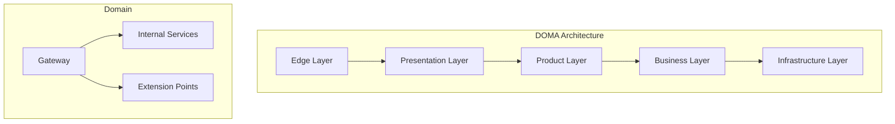

- **Domains**: Logical groupings of related microservices (e.g., "ride matching," "fare calculation") [^14].
- **Gateway**: Single entry point into each domain, abstracting internal implementation [^14].
- **Layers**: Five dependency layers with strict top-down rules. Upstream layers may depend only on lower layers [^14].
- **Extensions**: Plugin-style interfaces allowing customization without modifying core domain code [^14].

Key statistic: The half-life of a microservice at Uber is 1.5 years -- 50% are created or deprecated every 18 months [^14].

> **Status**: Confirmed from Uber's published DOMA blog post (July 2020), developed by ~60 engineers over two years.

### 1.5 Engineering Culture

| Cultural Norm | Description |
|---------------|-------------|
| We build globally, we live locally | Global scale with local market adaptation |
| We are customer obsessed | Solve customer problems, maximize driver earnings, lower costs |
| We celebrate differences | Diverse backgrounds, encouraged opinions |
| We do the right thing | Integrity at core decisions |
| We act like owners | Seek out problems, solve them, bias for action |
| We persevere | Grit, tough challenges, resilience |
| We value ideas over hierarchy | Best ideas from anywhere |
| We make big bold bets | Accept failure as learning |

Additional cultural traits confirmed from engineering blog and Pragmatic Engineer interviews:

- **RFC-driven design**: All projects start with written design documents shared across engineering [^15].
- **"You build it, you own it"**: Teams are responsible for oncall and uptime of their services [^15].
- **Heavy open-source contribution**: Jaeger, Cadence, H3, Fx, Peloton are all open-sourced projects [^16].
- **Technology pragmatism**: "We do not hire for any given language. The technology stack keeps evolving" [^15].

> **Status**: Cultural norms confirmed from Uber newsroom (2017, updated 2021). Engineering culture confirmed from Pragmatic Engineer interview with Uber Amsterdam engineers [^15].

### 1.6 Known Backend Challenges

Based on Uber's published engineering blog posts, the following are confirmed backend challenges:

1. **Geo-distributed real-time matching**: Matching riders to drivers in under one second across global regions, requiring geospatial indexing (H3) and low-latency dispatch [^17].
2. **Database overload management**: Uber's Docstore/Schemaless databases serve tens of millions of requests per second with billions of rows. Intelligent load shedding replaced static rate limiting using a system called Cinnamon [^5].
3. **Event-driven architecture at scale**: Kafka serves as Uber's universal message backbone, handling the event traffic generated by 170M+ monthly active users across all business lines [^6].
4. **Multi-tenancy**: Traffic isolation for canary deployments, shadow testing, and record/replay across the entire microservice stack [^18].
5. **Failover architecture**: UFA (Uber Failover Architecture) classifies services into four failover behavior classes and manages CPU oversubscription across 3M+ cores [^19].
6. **E2E testing at scale**: BITS system gates every code change across 1,000+ backend services with thousands of E2E tests [^13].
7. **Experimentation at speed**: A/B test evaluation moved from 10ms RPC latency to 100-microsecond local evaluation, a 100x improvement [^20].

---

## 2. Job Description Analysis

### 2.1 Role Requirements (SDE-II Backend)

Based on Uber job postings for Software Engineer II Backend (Job IDs: 154897, 154500) [^21]:

**Responsibilities**:

- Write maintainable and extensible code with high quality tests and documentation
- Adapt to meet the needs of massive scale and rapidly evolving systems
- Collaborate with other Uber engineers to gather requirements and build for the future
- Own end-to-end delivery of features and systems
- Participate in design discussions and contribute practical technical ideas

**Basic Qualifications**:

- Programming language proficiency in C, C++, Java, Python, or Go
- Bachelor's degree in CS/Engineering/Math OR 1-year full-time SWE experience
- Experience in at least one of: distributed systems, scalability engineering, product engineering

**Nice-to-Have (from Catalog Platform posting)**:

- Event-driven architecture experience
- Distributed data stores, caches, and publish/subscribe systems
- E-commerce, retail platforms, or content management systems
- Contributions to open-source projects or public technical discussions

### 2.2 How Uber's Business Context Shapes These Requirements

The job requirements are not arbitrary -- they directly reflect Uber's operational reality:

1. **"Massive scale"**: Uber handles 170M+ monthly active users with 4,500+ microservices. Any code a new engineer writes must perform under extreme load. The emphasis on scalability engineering reflects the reality that poorly written code can cascade failures across the platform [^2].

2. **"Rapidly evolving systems"**: With a 1.5-year microservice half-life, services are constantly being created, modified, and deprecated. Code must be extensible because it will inevitably be extended by teams the author has never met [^14].

3. **"Event-driven architecture"**: Uber's entire platform is built on Kafka-based event streaming. Understanding asynchronous, event-driven patterns is essential because synchronous RPC calls alone cannot handle Uber's real-time workload [^6].

4. **"Distributed data stores"**: Uber's Schemaless/Docstore databases span thousands of clusters storing tens of petabytes. Engineers must understand sharding, replication, and consistency tradeoffs [^5].

5. **"Caches and pub/sub"**: Redis is used ubiquitously for hot-path caching, and Kafka is the universal message bus. Familiarity with these systems is table stakes [^6].

6. **"End-to-end ownership"**: Reflects the "you build it, you own it" culture. Engineers do not throw code over the wall -- they own production behavior including oncall [^15].

### 2.3 Interview Process Analysis

Based on multiple 2024-2025 interview experience reports [^22]:

| Stage | Format | Duration | What It Tests |
|-------|--------|----------|---------------|
| CodeSignal OA | 4 problems (increasing difficulty) | 70-90 min | DSA fundamentals under time pressure |
| Technical phone screen | 1 coding problem, live | 60 min | Problem-solving + communication |
| Coding Round 1 | DSA (medium to medium-hard) | 60 min | Algorithm design, optimization |
| Coding Round 2 / Machine Coding | LLD with working code | 60 min | OOP, design patterns, SOLID, concurrency |
| System Design | Open-ended design problem | 60 min | Architecture, scale math, tradeoffs |
| Behavioral / Hiring Manager | Past projects, values alignment | 60 min | Cultural norms, collaboration, ownership |

**Critical Insight from Interview Reports**:
- The system design round specifically tests **geo-distributed** and **real-time** system design [^23].
- Common system design prompts include: ride-matching, surge pricing, ETA prediction, real-time location tracking, fraud detection, and notification delivery [^23].
- Uber interviewers grade **scale math** (TPS estimates, latency budgets) as heavily as the architecture diagram itself [^23].
- The machine coding round expects **end-to-end working code**, not just class diagrams [^22].

---

## 3. Portfolio Strategy Overview

### 3.1 Strategic Objective

This portfolio serves a dual purpose:

1. **Interview preparation through building**: Each project forces deep engagement with the exact distributed systems concepts Uber tests in interviews. Building a ride-matching simulator means you can discuss geospatial indexing, concurrent matching algorithms, and failure modes with genuine authority during the system design round.

2. **Resume differentiation**: For a Junior candidate with 1 YOE, production-grade distributed systems projects demonstrate engineering maturity far beyond what academic projects or CRUD applications can convey.

### 3.2 Design Principles

| Principle | Rationale |
|-----------|-----------|
| Go as primary language | Uber's most critical services are written in Go; the majority of new backend work uses Go [^3] |
| No generic CRUD | Uber's interview tests distributed systems thinking, not REST API scaffolding |
| Progressive complexity | Projects build on concepts from earlier ones, creating a coherent learning arc |
| Locally runnable first | All projects must work on a single machine; cloud deployment is an extension |
| Real engineering challenges | Each project includes failure modes, concurrency issues, and scaling concerns -- not just happy-path demos |
| GitHub-ready | Each project includes a README template demonstrating technical communication skills |

### 3.3 Projects at a Glance

| # | Project | Difficulty | Duration | Primary Concept |
|---|---------|-----------|----------|-----------------|
| 1 | Geo-Spatial Ride Matching Simulator | 4/5 | 6-8 weeks | Geospatial indexing, concurrent matching |
| 2 | Distributed Rate Limiter | 2/5 | 3-4 weeks | Token bucket, sliding window, gRPC |
| 3 | Real-Time Location Tracking Service | 4/5 | 5-6 weeks | WebSocket, geospatial, pub/sub |
| 4 | Workflow Orchestration Engine | 5/5 | 8-10 weeks | State machines, distributed orchestration |
| 5 | API Gateway with Multi-Tenancy | 4/5 | 6-8 weeks | Request routing, tenancy isolation |
| 6 | Real-Time Event Streaming Pipeline | 3/5 | 4-5 weeks | Event sourcing, pub/sub, consumer groups |
| 7 | Distributed Tracing System | 3/5 | 4-5 weeks | OpenTelemetry, span propagation |
| 8 | Distributed Cache with Consistent Hashing | 3/5 | 4-5 weeks | Hash rings, replication, eviction |
| 9 | Microservice Health Monitor and Circuit Breaker | 3/5 | 3-4 weeks | Health checks, circuit breaker pattern |
| 10 | Zero-Downtime Schema Migration Tool | 4/5 | 5-6 weeks | Dual-write, CDC, backward compatibility |

---

## 4. Project 1: Geo-Spatial Ride Matching Simulator

### 4.1 Business Problem

The canonical Uber system design problem is matching riders to drivers in real time. Uber's matching system must process millions of location pings from drivers every few seconds, partition the world into addressable geospatial cells using H3, and return a ranked list of nearby drivers to a rider request -- all within a sub-second latency budget [^17].

> **Status**: Confirmed from Uber engineering blog on H3 and system design interview reports.

### 4.2 Relevance to Uber

This project directly mirrors the system that Uber interviewers most frequently ask candidates to design. It is the single highest-impact preparation project because:

- Ride-matching appears in approximately 50% of L4+ system design rounds at Uber [^23].
- It requires the same geospatial indexing (H3), concurrent data structures, and distributed state management Uber uses in production.
- The race condition at the core of ride-matching (two dispatchers assigning the same driver) is exactly the type of problem Uber interviewers expect candidates to identify unprompted [^23].

### 4.3 Backend Concepts Demonstrated

- Geospatial indexing with H3 hexagonal grids
- Concurrent matching with mutex-based driver assignment
- Event-driven architecture for rider requests and driver location updates
- In-memory geospatial lookup with Redis GEOSEARCH-equivalent data structures
- API design for matching requests and responses
- Graceful degradation when matching capacity is exhausted

### 4.4 Recommended Architecture

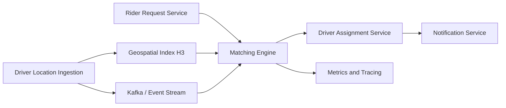

### 4.5 Tech Stack with Justification

| Component | Technology | Justification |
|-----------|-----------|---------------|
| Core language | Go | Uber's primary backend language; goroutines handle concurrent matching efficiently |
| Geospatial index | H3 (uber/h3-go bindings) | Uber's own open-source hexagonal spatial index [^10] |
| In-memory store | Go maps with RWMutex | Start simple; migrate to Redis for multi-node extension |
| Event streaming | Go channels (local), Kafka (extension) | Channels for MVP; Kafka for production-like architecture |
| API layer | gRPC | Uber's standard inter-service communication protocol |
| Testing | Go testing + testify | Standard Go testing with assertions |
| Observability | OpenTelemetry SDK | Distributed tracing from the start |

### 4.6 Essential Features

**MVP (Week 1-3)**:
- Driver registration with current GPS location
- H3 cell assignment for each driver based on GPS coordinates
- Rider request with pickup location
- Nearest-driver lookup within configurable H3 ring radius
- Simple FIFO matching (first available driver wins)

**Core (Week 4-5)**:
- Concurrent rider matching with driver-exclusive assignment (race condition prevention)
- Driver state machine: AVAILABLE, MATCHED, EN_ROUTE, ARRIVED, IN_TRIP, COMPLETED
- Configurable matching strategies: nearest-first, rating-weighted, ETA-based
- Simulated real-time driver movement

**Advanced (Week 6-8)**:
- Batch matching for multiple concurrent riders
- Surge pricing signal based on supply/demand ratio per H3 cell
- Matching failure handling and rider re-queue
- Performance benchmarks: matches per second, p99 latency

### 4.7 Engineering Challenges

1. **Race condition in driver assignment**: Two simultaneous rider requests must not be assigned the same driver. This requires either optimistic locking (compare-and-swap on driver state) or pessimistic locking (mutex per driver). Uber interviewers specifically test whether candidates identify this unprompted [^23].

2. **Geospatial index performance**: Naive distance calculation (Haversine formula for every driver) does not scale. The H3 cell approach pre-partitions drivers into fixed-size hexagonal cells, reducing the search space from O(n) to O(cells_in_radius)[^21].

3. **Consistency tradeoff**: Strong consistency on driver assignment (no double-booking) vs. eventual consistency on driver location (a few seconds of staleness is acceptable). This is a deliberate architectural decision that must be justified in interview discussions.

### 4.8 Common Implementation Pitfalls

- Using Euclidean distance instead of great-circle distance for GPS coordinates
- Not handling the edge case where no driver is available within the search radius
- Forgetting that H3 resolution determines cell size -- too coarse gives inaccurate nearby results, too fine increases search overhead
- Implementing matching synchronously instead of using goroutines for concurrent request handling
- Not simulating realistic driver behavior (drivers do not stay stationary)

### 4.9 Required Knowledge

- Go concurrency (goroutines, channels, sync.Mutex, sync.RWMutex)
- H3 geospatial indexing (resolution levels, cell hierarchy, neighbor traversal)
- API design (gRPC protobuf definitions)
- State machine design for trip lifecycle
- Basic performance profiling (pprof)

### 4.10 Difficulty and Timeline

| Metric | Value |
|--------|-------|
| Difficulty | 4/5 |
| Estimated duration | 6-8 weeks |
| Prerequisites | Go proficiency, basic distributed systems concepts |

### 4.11 Resume and Interview Value

**Interview value**: Extremely high. When asked "design a ride-matching system," you can describe not just the theory but the actual implementation challenges you encountered -- the race condition in driver assignment, why H3 resolution matters, how batching improves throughput.

**Resume value**: "Built a concurrent geo-spatial ride matching engine using H3 hexagonal indexing and Go, achieving X matches/second with Yms p99 latency under simulated load of Z concurrent drivers."

### 4.12 Extensions to Production Scale

- Deploy across multiple nodes with Redis as the distributed geospatial index
- Add Kafka for driver location event streaming
- Implement consistent hashing for H3 cell-to-node partitioning
- Add Jaeger-style distributed tracing for matching latency analysis
- Deploy on Kubernetes with horizontal pod autoscaling

---

## 5. Project 2: Distributed Rate Limiter

### 5.1 Business Problem

Every API at Uber must be protected from overload. Uber's Cinnamon load manager evolved from simple static rate limiting to intelligent, priority-aware load shedding based on concurrency signals and PID controllers [^5]. Rate limiting is a foundational system design component that appears in both system design and machine coding rounds.

> **Status**: Confirmed from Uber engineering blog on database overload management (2024).

### 5.2 Relevance to Uber

Rate limiting is one of the most commonly tested system design topics at Uber. It directly relates to:

- The Cinnamon load shedder Uber uses to protect its MySQL-based databases [^5]
- The Scorecard admission control component for per-tenant concurrency limits [^5]
- The BYOS (Bring Your Own Signal) model for pluggable overload control [^5]

### 5.3 Backend Concepts Demonstrated

- Token bucket algorithm
- Sliding window log and sliding window counter
- Distributed rate limiting across multiple nodes
- Redis Lua scripting for atomic operations
- gRPC interceptor for transparent rate limiting
- Priority-based shedding (t0-t5 tiering, matching Uber's model)

### 5.4 Recommended Architecture

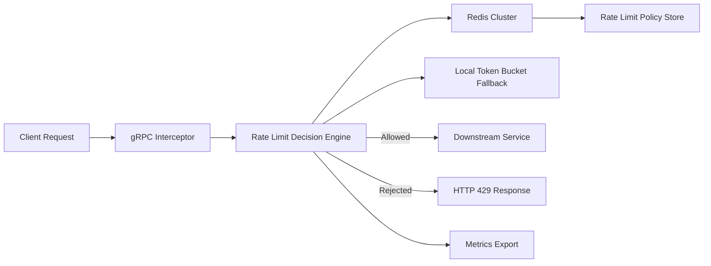

### 5.5 Tech Stack with Justification

| Component | Technology | Justification |
|-----------|-----------|---------------|
| Core language | Go | Uber's primary language; efficient goroutine model for high-QPS interceptors |
| Distributed state | Redis | Industry standard for distributed rate limiting; Lua scripting enables atomic operations |
| API layer | gRPC with interceptors | Uber uses gRPC; interceptors provide transparent rate limiting |
| Configuration | TOML/YAML files (extension: dynamic config) | Start static, evolve toward Flipr-style dynamic config |
| Metrics | Prometheus-compatible endpoint | Standard observability |

### 5.6 Essential Features

**MVP (Week 1-2)**:
- Token bucket rate limiter (single node)
- Configurable rate and burst parameters per API endpoint
- gRPC interceptor that applies rate limiting transparently
- HTTP 429 response with Retry-After header

**Core (Week 3)**:
- Sliding window log implementation (more accurate, higher memory)
- Sliding window counter implementation (approximate, lower memory)
- Benchmark comparison of all three algorithms

**Advanced (Week 4)**:
- Distributed rate limiting using Redis with Lua scripts for atomic check-and-decrement
- Per-tenant rate limiting (multi-tenancy, matching Uber's Scorecard model)
- Priority-based shedding (t0 = infrastructure, t1 = user-facing, t5 = batch jobs)

### 5.7 Engineering Challenges

1. **Atomicity in distributed setting**: Checking and decrementing a token count across multiple Redis operations is non-atomic and creates race conditions. Lua scripts execute atomically on the Redis server, solving this [^5].

2. **Clock skew in sliding window**: Sliding window implementations rely on timestamps. In a distributed system, clocks are not perfectly synchronized. The sliding window counter (approximate) is more practical than the sliding window log (exact but memory-intensive).

3. **Fail-open vs. fail-closed**: When the rate limiter's Redis dependency is unavailable, should requests be allowed (fail-open) or blocked (fail-closed)? Uber's Cinnamon defaults to fail-open to protect user-facing traffic [^5].

### 5.8 Common Implementation Pitfalls

- Forgetting to handle Redis connection failures gracefully
- Using a single Redis key for all tenants instead of per-tenant keys
- Not accounting for network latency in the rate limit check (the check itself takes time)
- Implementing token bucket with time.Sleep instead of calculating token refill based on elapsed time
- Not adding Retry-After headers to 429 responses

### 5.9 Required Knowledge

- Go interfaces and dependency injection
- Redis data structures (sorted sets for sliding window, scripts for atomic operations)
- gRPC interceptor architecture
- Algorithm analysis: time and space complexity of each rate limiting strategy

### 4.10 Difficulty and Timeline

| Metric | Value |
|--------|-------|
| Difficulty | 2/5 |
| Estimated duration | 3-4 weeks |
| Prerequisites | Go proficiency, basic Redis knowledge |

### 5.11 Resume and Interview Value

**Interview value**: High for machine coding rounds (implement a rate limiter in 60 minutes) and system design (rate limiting as a component of a larger system). The priority-based shedding extension demonstrates understanding of Uber's tiering model.

**Resume value**: "Implemented a distributed rate limiter supporting token bucket, sliding window, and priority-based shedding algorithms using Go and Redis Lua scripting, handling 10,000+ requests/second."

### 5.12 Extensions to Production Scale

- Redis Cluster for horizontal scaling of rate limit state
- Dynamic rate configuration via API (Flipr-style)
- Rate limit bypass tokens for internal/health-check traffic
- Circuit breaker integration for cascading failure prevention

---

## 6. Project 3: Real-Time Location Tracking Service

### 6.1 Business Problem

Millions of active Uber drivers send GPS pings every 4-6 seconds. Even at conservative estimates, this produces a steady-state write rate of hundreds of thousands of pings per second. Uber's dispatch and matching layers sit on top of this real-time location stream [^23].

> **Status**: Inferred from system design interview reports and Uber engineering blog on real-time systems.

### 6.2 Relevance to Uber

Real-time location tracking is a recurring system design prompt at Uber. It tests understanding of:

- High-frequency write workloads (100K+ pings/second)
- Geospatial data partitioning
- WebSocket management for real-time push to clients
- Tradeoff between write-optimized storage (Cassandra) and read-optimized caching (Redis)

### 6.3 Backend Concepts Demonstrated

- WebSocket server for bidirectional real-time communication
- High-frequency GPS data ingestion
- Geospatial partitioning of location data
- Write-optimized storage with read-through caching
- Connection management and heartbeat-based liveness detection
- Pub/sub for location change broadcasting

### 6.4 Recommended Architecture

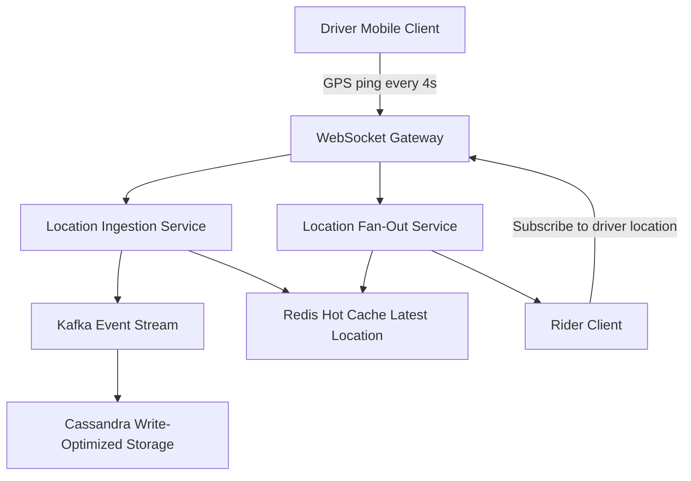

### 6.5 Tech Stack with Justification

| Component | Technology | Justification |
|-----------|-----------|---------------|
| Core language | Go | goroutines efficiently manage thousands of WebSocket connections |
| WebSocket | gorilla/websocket or nhooyr.io/websocket | Go WebSocket libraries with goroutine-per-connection model |
| Hot cache | Redis | In-memory store for latest location per driver; sub-millisecond reads |
| Write storage | Cassandra (or SQLite for local dev) | Write-optimized, time-series-friendly storage for historical GPS data |
| Event stream | Go channels (MVP), Kafka (extension) | Decouple ingestion from consumption |
| Pub/sub | Redis Pub/Sub | Broadcast location updates to subscribed riders |

### 6.6 Essential Features

**MVP (Week 1-2)**:
- WebSocket server accepting driver GPS pings (lat, lng, timestamp, driver_id)
- Store latest location per driver in Redis
- Rider WebSocket subscription to receive driver's real-time location
- Connection heartbeat and timeout detection

**Core (Week 3-4)**:
- Geospatial partitioning: hash driver locations into H3 cells
- Location fan-out: when driver moves to new H3 cell, notify all riders tracking that cell
- Batch ingestion endpoint for drivers on low-bandwidth connections
- Historical location storage for trip playback

**Advanced (Week 5-6)**:
- Load testing with simulated 100K concurrent driver connections
- Horizontal scaling via consistent hashing of driver IDs across multiple server instances
- Location interpolation for gaps between pings
- Trip recording: store ordered location sequence for completed trips

### 6.7 Engineering Challenges

1. **Connection lifecycle management**: With millions of concurrent WebSocket connections, the server must efficiently track connection state, handle disconnects, and rebalance connections on server failure. Each goroutine holding a WebSocket connection consumes memory; 100K connections requires careful resource management.

2. **Hot data vs. cold data**: The latest location of every active driver (hot data) lives in Redis. Historical locations (cold data) are written to Cassandra. The architecture must cleanly separate these access patterns.

3. **Fan-out amplification**: When a driver's location is updated, all riders tracking that driver need to receive the update. In a popular area with many riders, a single GPS ping can fan out to thousands of WebSocket messages.

### 6.8 Common Implementation Pitfalls

- Not implementing ping/pong heartbeats, leading to zombie connections
- Storing all location history in Redis (memory exhaustion)
- Using a single Redis key pattern that does not scale with driver count
- Not batching location updates under high load (one Redis write per ping vs. batched pipeline)
- Forgetting to handle driver disconnection gracefully (remove from active tracking)

### 6.9 Required Knowledge

- Go WebSocket programming
- Redis data structures (hashes, sorted sets for geospatial queries)
- Connection pooling and lifecycle management
- Basic geospatial concepts (latitude/longitude, Haversine distance)

### 6.10 Difficulty and Timeline

| Metric | Value |
|--------|-------|
| Difficulty | 4/5 |
| Estimated duration | 5-6 weeks |
| Prerequisites | Go proficiency, WebSocket concepts, Redis |

### 6.11 Resume and Interview Value

**Interview value**: Directly prepares for the "design a real-time location tracking system" prompt. You can discuss actual tradeoffs between push and pull models, WebSocket vs. long-polling, and Redis vs. Cassandra storage strategies.

**Resume value**: "Built a real-time location tracking service handling 100K+ concurrent WebSocket connections with sub-100ms location propagation using Go, Redis, and event-driven architecture."

### 6.12 Extensions to Production Scale

- Kubernetes deployment with sticky sessions for WebSocket affinity
- Cassandra time-series schema for historical location queries
- Geo-fencing triggers based on location crossing H3 cell boundaries
- Integration with the ride-matching simulator (Project 1)

---

## 7. Project 4: Workflow Orchestration Engine

### 7.1 Business Problem

Uber's Cadence workflow engine orchestrates complex, long-running business processes across microservices -- from Uber Eats order fulfillment (8+ steps) to ML training pipelines. Before Cadence, "a simple code becomes a quagmire of callbacks" [^9]. Cadence handles 12+ billion workflow executions and 270+ billion actions per month [^33].

> **Status**: Confirmed from Uber engineering blog and Cadence open-source documentation.

### 7.2 Relevance to Uber

Cadence is one of Uber's most significant open-source contributions. Understanding workflow orchestration:

- Directly maps to the system design discussion of async, long-running processes
- Demonstrates understanding of distributed state management, exactly-once semantics, and fault tolerance
- Shows familiarity with Uber's specific infrastructure investments

### 7.3 Backend Concepts Demonstrated

- Finite state machines for workflow lifecycle
- Event sourcing for durable workflow state
- Task queues and worker dispatch
- Exactly-once activity execution semantics
- Workflow versioning for safe code evolution
- Timer management for timeouts and retries

### 7.4 Recommended Architecture

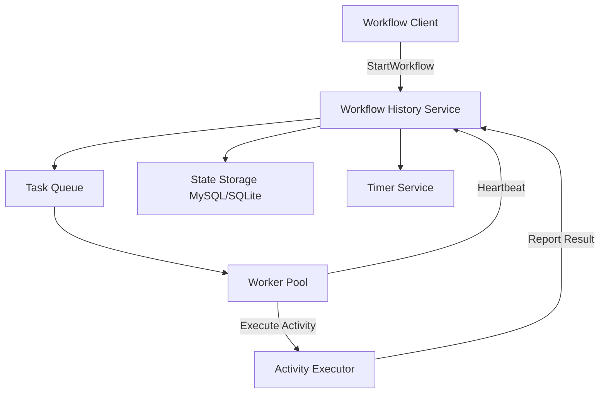

### 7.5 Tech Stack with Justification

| Component | Technology | Justification |
|-----------|-----------|---------------|
| Core language | Go | Cadence itself is written in Go; goroutines model workflow execution naturally |
| State storage | SQLite (MVP), MySQL (extension) | SQLite for single-node; MySQL for multi-node durability |
| Task queue | Go channels (MVP), Redis Lists (extension) | Channels for MVP; Redis for cross-process task dispatch |
| API | gRPC | Workflow definition and management APIs |
| Serialization | Protocol Buffers | Efficient, schema-evolvable serialization |

### 7.6 Essential Features

**MVP (Week 1-3)**:
- Workflow definition API (Go functions representing workflow steps)
- Activity execution (side-effectful operations with idempotency keys)
- Workflow history recording (event sourcing)
- Basic retry logic for failed activities
- Workflow completion and failure states

**Core (Week 4-6)**:
- Task queue with worker dispatch (multiple workers competing for tasks)
- Workflow versioning (safe migration when workflow definition changes)
- Timer support (scheduled activities, workflow timeouts)
- Heartbeat mechanism for long-running activities

**Advanced (Week 7-10)**:
- Workflow cancellation and compensation (saga pattern)
- Child workflow execution
- Workflow visibility API (list running workflows, search by status)
- Performance benchmarks: workflows/second, activity execution latency

### 7.7 Engineering Challenges

1. **Exactly-once activity semantics**: An activity (e.g., charging a credit card) must execute exactly once, even if the worker crashes and restarts. This requires idempotency keys stored in the workflow history, combined with the activity function being idempotent.

2. **Workflow versioning**: When a running workflow's code is updated (e.g., adding a new step), previously started workflows must continue with the old version while new workflows use the new version. This is one of the hardest problems in workflow orchestration.

3. **State recovery**: After a worker crash, the workflow engine must replay the workflow history to reconstruct the current state and resume execution from the correct point. This is event sourcing applied to workflow execution.

### 7.8 Common Implementation Pitfalls

- Storing mutable state in workflow code (workflows must be deterministic; all side effects go through activities)
- Not implementing activity idempotency (risking duplicate side effects on retry)
- Forgetting to handle worker crashes during activity execution
- Not versioning workflow definitions (making future migrations impossible)
- Blocking operations inside workflow code instead of using timers or activities

### 7.9 Required Knowledge

- Go interfaces and generics (for workflow/activity type safety)
- Event sourcing and CQRS concepts
- Distributed state management
- Idempotency and exactly-once delivery semantics
- Protocol Buffers for API definitions

### 7.10 Difficulty and Timeline

| Metric | Value |
|--------|-------|
| Difficulty | 5/5 |
| Estimated duration | 8-10 weeks |
| Prerequisites | Go proficiency, understanding of event sourcing, distributed systems basics |

### 7.11 Resume and Interview Value

**Interview value**: Exceptional depth signal. Demonstrates understanding of one of Uber's core infrastructure investments. In system design discussions, you can reference real implementation details of workflow orchestration.

**Resume value**: "Designed and implemented a workflow orchestration engine inspired by Cadence, supporting durable execution, event-sourced state recovery, activity retries with idempotency, and safe workflow versioning in Go."

### 7.12 Extensions to Production Scale

- Cassandra backend for workflow history storage (matching Cadence's architecture)
- Multi-cluster workflow replication for disaster recovery
- Web UI for workflow visualization and debugging
- Integration with Kafka for activity result streaming

---

## 8. Project 5: API Gateway with Multi-Tenancy

### 8.1 Business Problem

Uber's API gateway layer (Edge Gateway) serves as the single entry point for all mobile and web clients, routing requests to 2,200+ backend microservices across 70 DOMA domains. It must handle authentication, rate limiting, request transformation, and multi-tenant traffic isolation for canary deployments, shadow testing, and traffic replay [^18].

> **Status**: Confirmed from Uber engineering blog on multi-tenancy and Edge Gateway architecture.

### 8.2 Relevance to Uber

Multi-tenancy is a core architectural concept at Uber. Their engineering blog dedicates significant coverage to how tenancy enables:

- Canary deployments (2% traffic routed to canary instances)
- Shadow traffic routing for testing
- Traffic recording and replay
- Capacity planning and performance prediction [^18]

Understanding multi-tenant gateway design is critical for discussing DOMA and deployment safety.

### 8.3 Backend Concepts Demonstrated

- Reverse proxy design and request routing
- Multi-tenant context propagation (data-in-flight and data-at-rest)
- Authentication and authorization at the edge
- Request/response transformation
- Load balancing strategies (round-robin, weighted, least-connections)
- API versioning and backward compatibility

### 8.4 Recommended Architecture

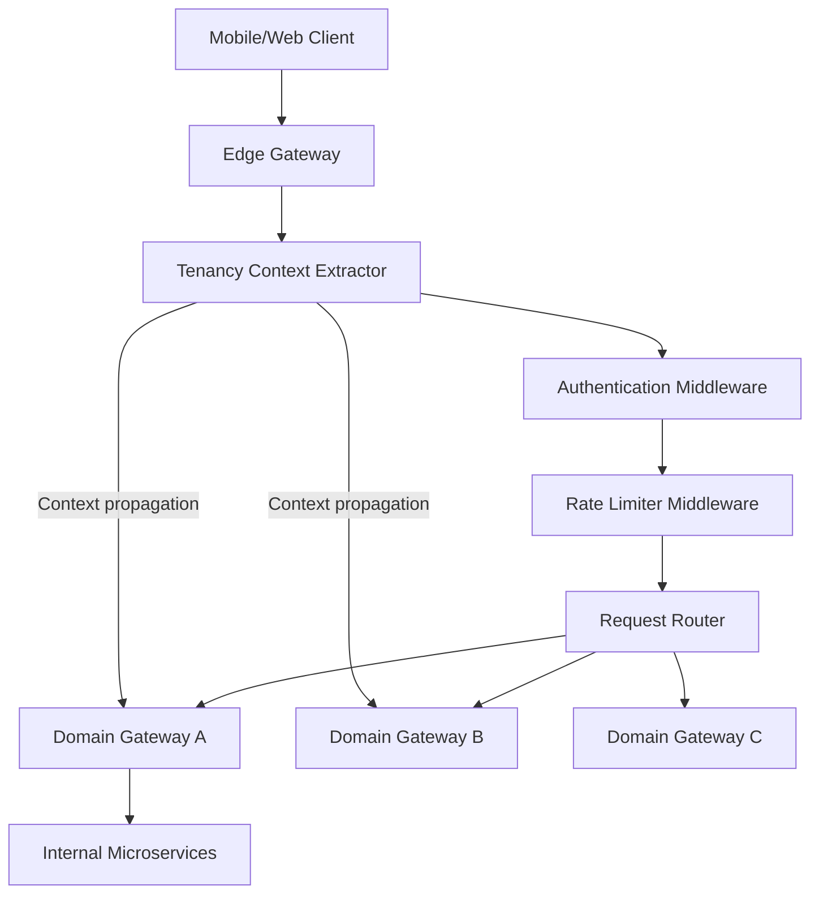

### 8.5 Tech Stack with Justification

| Component | Technology | Justification |
|-----------|-----------|---------------|
| Core language | Go | Uber's Edge Gateway is written in Go; goroutines handle high concurrency |
| HTTP framework | net/http (stdlib) or chi | Lightweight; Uber uses Glue framework built on net/http |
| Configuration | YAML/TOML | Route definitions, tenancy rules |
| Metrics | Prometheus-compatible | Request rate, latency, error rate per route |
| Load testing | k6 or vegeta | Validate gateway under realistic load |

### 8.6 Essential Features

**MVP (Week 1-2)**:
- Reverse proxy routing requests to backend services based on path prefix
- Health check endpoints for downstream services
- Request logging with latency measurement
- Graceful shutdown handling

**Core (Week 3-5)**:
- Multi-tenant context extraction from request headers
- Tenant-based routing (canary traffic goes to canary backends)
- Authentication middleware (JWT token validation)
- Rate limiting middleware (integration with Project 2)
- Request transformation (header manipulation, body rewriting)

**Advanced (Week 6-8)**:
- Weighted load balancing across backend instances
- Circuit breaker integration for failing downstream services
- API versioning with automatic deprecation warnings
- Request/response caching for read-heavy endpoints
- Admin UI for route management (DOMA gateway configuration)

### 8.7 Engineering Challenges

1. **Context propagation**: Tenancy context must flow through the entire request lifecycle -- from the edge gateway to every downstream service. If any service in the chain drops the context, traffic isolation breaks. This is the core challenge Uber describes in their multi-tenancy blog [^18].

2. **Backward compatibility**: The gateway serves multiple client versions simultaneously. An old mobile app version must still work even when the gateway adds new request transformation logic. This requires careful versioning and deprecation policies.

3. **Latency overhead**: Every middleware in the chain adds latency. The gateway must stay within a tight latency budget (typically <5ms overhead) while performing authentication, rate limiting, and routing.

### 8.8 Common Implementation Pitfalls

- Not handling downstream service failures (gateway becomes a single point of failure)
- Implementing routing as sequential middleware instead of a directed acyclic graph (DAG)
- Not propagating tenancy context to all downstream calls
- Over-caching at the gateway level, causing stale data for users
- Forgetting to implement graceful shutdown (in-flight requests are dropped)

### 8.9 Required Knowledge

- Go net/http middleware patterns
- HTTP reverse proxy implementation
- JWT authentication
- Load balancing algorithms
- Middleware chaining and DAG execution

### 8.10 Difficulty and Timeline

| Metric | Value |
|--------|-------|
| Difficulty | 4/5 |
| Estimated duration | 6-8 weeks |
| Prerequisites | Go proficiency, HTTP fundamentals, authentication concepts |

### 8.11 Resume and Interview Value

**Interview value**: Demonstrates understanding of DOMA's gateway pattern, which is central to Uber's architecture. Shows ability to discuss API design, middleware composition, and multi-tenancy -- all topics Uber engineers discuss daily.

**Resume value**: "Built a multi-tenant API gateway supporting tenant-based traffic routing, JWT authentication, rate limiting integration, and circuit breaker patterns, serving as a single entry point to a simulated microservice architecture."

### 8.12 Extensions to Production Scale

- Kubernetes Ingress Controller integration
- gRPC proxying alongside HTTP
- Dynamic route configuration via API (no restart required)
- Integration with distributed tracing (Project 7) for request propagation

---

## 9. Project 6: Real-Time Event Streaming Pipeline

### 9.1 Business Problem

Uber's entire platform is built on Apache Kafka as the event streaming backbone. Every trip event, order update, payment, and location ping flows through Kafka topics. Understanding event-driven architecture is listed as a nice-to-have requirement and is deeply embedded in Uber's engineering culture [^6].

> **Status**: Confirmed from Uber engineering blog and job posting requirements.

### 9.2 Relevance to Uber

Event-driven architecture is fundamental to how Uber operates. The BITS testing system routes test traffic through Kafka consumers [^13]. The experimentation platform distributes experiment configurations through Kafka-like distribution layers [^20]. Every Uber engineer works with event streams daily.

### 9.3 Backend Concepts Demonstrated

- Message broker implementation (topics, partitions, consumer groups)
- Event sourcing (append-only event log)
- At-least-once and exactly-once delivery semantics
- Consumer group rebalancing
- Dead letter queues for failed message processing
- Schema evolution and backward compatibility

### 9.4 Recommended Architecture

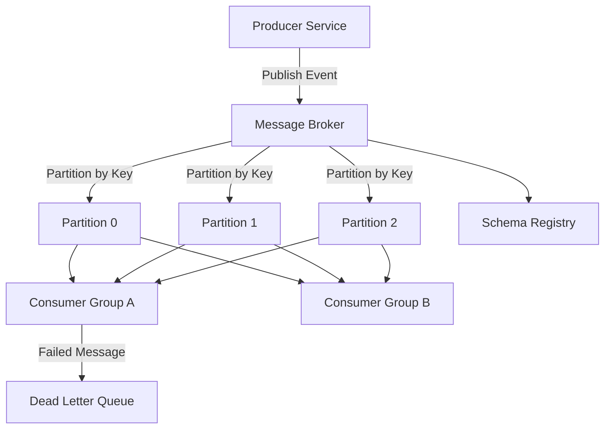

### 9.5 Tech Stack with Justification

| Component | Technology | Justification |
|-----------|-----------|---------------|
| Core language | Go | Efficient I/O, goroutines for concurrent consumer processing |
| Broker storage | File-based commit log (MVP), SQLite | Start simple; understand the core log-structured storage model |
| Serialization | JSON (MVP), Protocol Buffers (extension) | JSON for readability; Protobuf for schema evolution |
| Consumer framework | Go channels with worker pools | Model consumer group semantics without external dependencies |

### 9.6 Essential Features

**MVP (Week 1-2)**:
- Topic creation and management
- Producer API: publish messages with key, value, and timestamp
- Consumer API: subscribe to topic, receive messages in order
- Message persistence to disk (append-only log)

**Core (Week 3-4)**:
- Partitioning by message key (consistent key assignment)
- Consumer group semantics (competing consumers, load balancing)
- Consumer offset tracking (resume from last committed position)
- Dead letter queue for messages that fail processing after retries

**Advanced (Week 5)**:
- Exactly-once delivery semantics using idempotent producers and transactional consumers
- Schema registry for message format validation and evolution
- Performance benchmarks: messages/second per partition
- Multi-topic fan-out (single event triggers processing on multiple topics)

### 9.7 Engineering Challenges

1. **Consumer rebalancing**: When a new consumer joins or an existing consumer crashes, partitions must be reassigned across the remaining consumers. This requires a coordination protocol (similar to Kafka's group coordinator).

2. **Exactly-once semantics**: Achieving exactly-once delivery across a distributed system requires idempotent producers (deduplication by sequence number) and transactional consumers (atomic offset commit + message processing).

3. **Log compaction**: For topics where only the latest value per key matters (e.g., driver location), the broker must periodically compact the log by removing duplicate keys. This is a core Kafka feature that must be implemented correctly.

### 9.8 Common Implementation Pitfalls

- Not persisting messages to disk (losing data on broker restart)
- Implementing round-robin partitioning instead of key-based (breaking message ordering guarantees)
- Not handling consumer crashes gracefully (messages are processed but offsets are not committed)
- Using a single goroutine per consumer instead of a worker pool (low throughput)
- Not implementing message expiration (unbounded disk growth)

### 8.9 Required Knowledge

- Go file I/O and append-only file patterns
- Distributed coordination concepts (leader election, partition assignment)
- Message delivery semantics (at-most-once, at-least-once, exactly-once)
- Disk-based data structures (write-ahead log)

### 9.10 Difficulty and Timeline

| Metric | Value |
|--------|-------|
| Difficulty | 3/5 |
| Estimated duration | 4-5 weeks |
| Prerequisites | Go proficiency, basic understanding of message queues |

### 9.11 Resume and Interview Value

**Interview value**: Demonstrates deep understanding of the foundational infrastructure Uber is built on. Can discuss Kafka internals (partitions, consumer groups, offset management) with authority during system design rounds.

**Resume value**: "Implemented a message broker supporting topic partitioning, consumer groups, dead letter queues, and exactly-once delivery semantics, processing 50,000+ messages/second across multiple partitions."

### 9.12 Extensions to Production Scale

- Distributed broker cluster with replication
- Integration with the workflow engine (Project 4) for activity triggering
- Kafka Connect-style connectors for external system integration
- Schema registry with backward/forward compatibility checking

---

## 10. Project 7: Distributed Tracing System

### 10.1 Business Problem

With 2,200+ microservices, a single user request can traverse dozens of services. Uber built Jaeger in 2015 to trace requests across this distributed architecture, eventually donating it to the CNCF where it became a graduated project [^8]. Understanding distributed tracing is essential for debugging and performance optimization in any microservice architecture.

> **Status**: Confirmed from Uber engineering blog and Jaeger documentation.

### 10.2 Relevance to Uber

Jaeger is one of Uber's most successful open-source projects. The BITS testing system force-samples every test execution with Jaeger traces to build endpoint coverage indexes [^13]. Uber's experiment evaluation platform uses tracing data to validate experiment assignments [^20].

### 10.3 Backend Concepts Demonstrated

- OpenTelemetry SDK integration (span creation, context propagation)
- Trace collection pipeline (agent, collector, storage)
- Span storage and querying
- Sampling strategies (head-based, tail-based)
- Service dependency graph generation
- Context propagation across service boundaries (W3C Trace Context)

### 10.4 Recommended Architecture

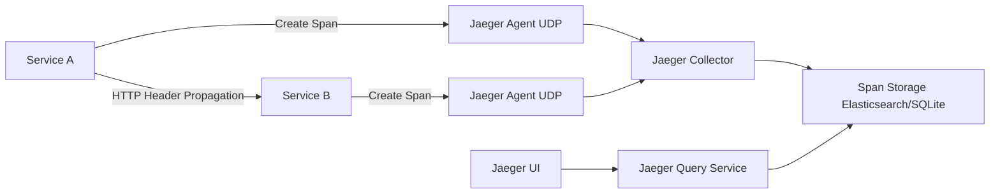

### 10.5 Tech Stack with Justification

| Component | Technology | Justification |
|-----------|-----------|---------------|
| Core language | Go | Jaeger is written in Go; Uber's standard for infrastructure tooling |
| Client SDK | OpenTelemetry Go SDK | Industry standard, compatible with Jaeger backend |
| Agent transport | UDP (agent), gRPC (collector) | Match Jaeger's actual architecture |
| Storage | SQLite (MVP), Elasticsearch (extension) | SQLite for single-node; Elasticsearch for query capability |
| UI | React or Go HTML templates | Simple trace visualization |

### 10.6 Essential Features

**MVP (Week 1-2)**:
- Trace context propagation via HTTP headers (W3C Trace Context format)
- Span creation with operation name, duration, tags, and logs
- Trace collection via UDP agent
- Trace storage to SQLite
- Simple web UI showing trace timeline (waterfall view)

**Core (Week 3-4)**:
- Collector service with batch processing and sampling
- Sampling strategies: probabilistic (1% of traces), rate-limiting (100 traces/second)
- Trace query by service name, operation, duration, and tags
- Service dependency graph from trace data

**Advanced (Week 5)**:
- Integration with Projects 1-5 (add tracing to other projects)
- Tail-based sampling (make sampling decision after seeing full trace)
- Trace comparison (compare latency profiles between two time windows)
- Performance benchmarks: spans/second ingestion, query latency

### 10.7 Engineering Challenges

1. **Context propagation across async boundaries**: Tracing context must survive Kafka message passes, goroutine spawns, and HTTP redirects. Missing context propagation creates broken traces that are useless for debugging.

2. **Sampling tradeoffs**: At high throughput, tracing every request is prohibitively expensive. Head-based sampling (decide at trace start) may miss interesting slow traces. Tail-based sampling (decide at trace end) requires buffering entire traces before deciding.

3. **Storage and retention**: Traces grow quickly. A trace across 50 services with 100 spans each can be several megabytes. At millions of traces per day, storage management (retention policies, TTL) is critical.

### 10.8 Common Implementation Pitfalls

- Not propagating trace context to child spans (broken traces)
- Using synchronous span export (blocks application code)
- Not batch-exporting spans (one network call per span kills performance)
- Forgetting to handle agent unavailability (dropping spans instead of buffering)
- Not implementing span attribute limits (huge tags cause storage bloat)

### 10.9 Required Knowledge

- OpenTelemetry SDK usage and configuration
- W3C Trace Context specification
- UDP vs. gRPC transport tradeoffs
- Time-series storage patterns
- Go HTTP middleware for automatic span creation

### 10.10 Difficulty and Timeline

| Metric | Value |
|--------|-------|
| Difficulty | 3/5 |
| Estimated duration | 4-5 weeks |
| Prerequisites | Go proficiency, HTTP fundamentals, basic observability concepts |

### 10.11 Resume and Interview Value

**Interview value**: Demonstrates familiarity with Uber's actual infrastructure. In system design discussions, you can naturally incorporate distributed tracing as a cross-cutting concern.

**Resume value**: "Built a distributed tracing system implementing OpenTelemetry standards with trace collection, sampling strategies, and dependency graph visualization, compatible with Jaeger storage backends."

### 10.12 Extensions to Production Scale

- Kafka-based trace transport (matching Jaeger's architecture)
- Elasticsearch backend for full-text trace search
- Integration with Prometheus for trace-derived metrics (RED metrics)
- Custom sampling rules based on error rate and latency thresholds

---

## 11. Project 8: Distributed Cache with Consistent Hashing

### 11.1 Business Problem

Uber's caching layer spans Redis and Memcached clusters across all domains. Efficient cache distribution requires consistent hashing to minimize key redistribution when nodes are added or removed. Uber's internal systems use consistent hashing extensively, including in their matching layer (Ringpop) [^24].

> **Status**: Confirmed from Uber engineering blog on tech stack and Ringpop documentation.

### 11.2 Relevance to Uber

Consistent hashing is a foundational distributed systems concept that appears in:

- System design discussions about caching layers
- Machine coding rounds implementing hash ring data structures
- Understanding of how Uber's Ringpop coordinates state across service instances

### 11.3 Backend Concepts Demonstrated

- Consistent hashing with virtual nodes
- Cache eviction policies (LRU, LFU, TTL)
- Cache invalidation strategies (write-through, write-behind, cache-aside)
- Replication for cache fault tolerance
- Cache stampede prevention (singleflight pattern)
- Benchmarking cache hit rates under different workloads

### 11.4 Recommended Architecture

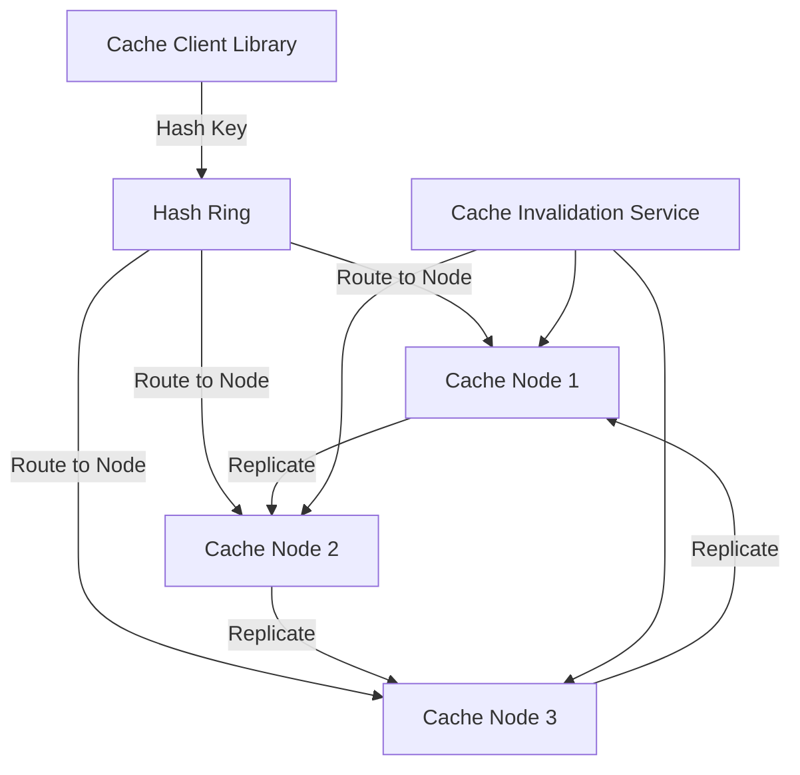

### 11.5 Tech Stack with Justification

| Component | Technology | Justification |
|-----------|-----------|---------------|
| Core language | Go | Efficient hash functions, goroutines for node health checking |
| Hash function | CRC32 or xxHash | Fast hash functions suitable for consistent hashing |
| Network | gRPC | Inter-node communication for replication |
| Storage | In-memory map with eviction | Core cache storage per node |
| Protocol | RESP (Redis protocol) | Client compatibility with existing Redis tooling |

### 11.6 Essential Features

**MVP (Week 1-2)**:
- Consistent hash ring with configurable virtual nodes per physical node
- Get/Set/Delete operations with consistent hash routing
- LRU eviction policy
- Single-node cache with in-memory storage

**Core (Week 3-4)**:
- Multi-node deployment with consistent hash distribution
- Replication factor configuration (each key stored on N consecutive nodes)
- TTL-based expiration
- Node addition/removal with minimal key redistribution
- Cache-aside pattern client library

**Advanced (Week 5)**:
- Cache stampede prevention using singleflight pattern
- Consistent hash benchmark: redistribution ratio when adding/removing nodes
- Cache hit rate simulation under different workloads
- Health checking and automatic node exclusion

### 11.7 Engineering Challenges

1. **Virtual node count tuning**: Too few virtual nodes causes uneven key distribution; too many increases memory overhead and lookup time. The optimal count depends on the number of physical nodes and the desired balance.

2. **Replication consistency**: When a node fails, reads must be served from replicas while the ring is rebalanced. During rebalancing, some keys may temporarily exist in fewer replicas than configured.

3. **Cache stampede**: When a popular cache key expires, multiple concurrent requests may simultaneously try to recompute the value, overwhelming the backend. The singleflight pattern coalesces concurrent requests for the same key.

### 11.8 Common Implementation Pitfalls

- Using a simple modulo hash instead of consistent hashing (causes full redistribution on node changes)
- Not handling node failures gracefully (reads fail instead of falling back to replicas)
- Implementing eviction as background goroutine without size limits (memory exhaustion)
- Not warming the cache after node addition (cold cache causes backend thundering herd)
- Using unsafe concurrent map access without synchronization

### 11.9 Required Knowledge

- Consistent hashing algorithm (hash ring, virtual nodes, replication)
- Go sync primitives (sync.Map, sync.RWMutex)
- Cache eviction algorithms (LRU, LFU, FIFO)
- gRPC for inter-node communication
- Basic hash function properties (uniform distribution, avalanche effect)

### 11.10 Difficulty and Timeline

| Metric | Value |
|--------|-------|
| Difficulty | 3/5 |
| Estimated duration | 4-5 weeks |
| Prerequisites | Go proficiency, basic data structures |

### 11.11 Resume and Interview Value

**Interview value**: Consistent hashing is a classic system design component. Being able to implement it and discuss its properties (bounded redistribution, virtual node tuning) signals strong distributed systems fundamentals.

**Resume value**: "Implemented a distributed cache using consistent hashing with virtual nodes, supporting replication, LRU eviction, and cache stampede prevention, demonstrating bounded key redistribution on node changes."

### 11.12 Extensions to Production Scale

- Redis-compatible RESP protocol for drop-in compatibility
- Cache warming strategies for new node onboarding
- Integration with the API gateway (Project 5) as a response cache
- Metrics export for cache hit rate, eviction rate, and node health

---

## 12. Project 9: Microservice Health Monitor and Circuit Breaker

### 12.1 Business Problem

Uber's failover architecture classifies services into four behavior classes and requires continuous health monitoring to make automated failover decisions. The circuit breaker pattern prevents cascading failures when downstream services become unhealthy [^19]. Uber's Accounter system tracks cluster health to make operational coordination decisions [^25].

> **Status**: Confirmed from Uber engineering blog on failover architecture and The Accounter.

### 12.2 Relevance to Uber

Reliability engineering is core to Uber's "you build it, you own it" culture. Understanding circuit breakers and health monitoring:

- Directly maps to system design discussions about failure modes
- Demonstrates understanding of the bulkhead pattern, timeout management, and graceful degradation
- Shows awareness of operational concerns that senior engineers are expected to own

### 12.3 Backend Concepts Demonstrated

- Circuit breaker pattern (closed, open, half-open states)
- Health check protocols (liveness, readiness, startup probes)
- Exponential backoff with jitter for retries
- Bulkhead pattern for isolating failures
- Service mesh proxy sidecar pattern
- Metrics-driven health decisions

### 12.4 Recommended Architecture

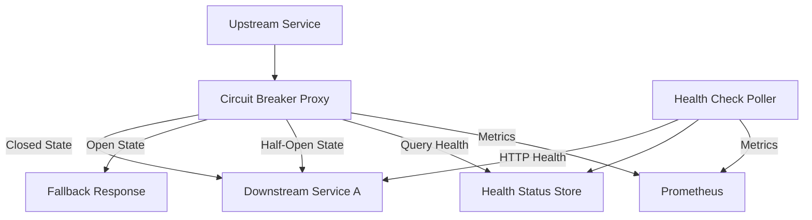

### 12.5 Tech Stack with Justification

| Component | Technology | Justification |
|-----------|-----------|---------------|
| Core language | Go | Lightweight proxy requires minimal resource overhead |
| Health checks | HTTP probes | Standard Kubernetes-style health check protocol |
| Metrics | Prometheus client_golang | Industry standard for metrics export |
| Configuration | YAML files | Circuit breaker thresholds, retry parameters |
| Demo services | Go HTTP servers | Simulate upstream/downstream service interactions |

### 12.6 Essential Features

**MVP (Week 1-2)**:
- Circuit breaker with three states: closed, open, half-open
- Configurable failure threshold and recovery timeout
- HTTP proxy that wraps downstream calls with circuit breaker logic
- Simple health check endpoint (/health, /ready)

**Core (Week 3)**:
- Exponential backoff with jitter for retries
- Consecutive failure counting (sliding window)
- Slow call detection (calls exceeding latency threshold count as failures)
- Metrics: circuit breaker state, failure rate, success rate, latency histogram

**Advanced (Week 4)**:
- Bulkhead isolation (separate circuit breakers per downstream dependency)
- Fallback response generation (cached response, default response, or error)
- Dashboard UI showing real-time circuit breaker states
- Integration test: simulate cascading failure and verify circuit breaker prevents propagation

### 12.7 Engineering Challenges

1. **Threshold tuning**: Setting the failure count threshold too low causes flapping (circuit opens and closes rapidly); too high delays detection of real failures. The optimal threshold depends on the downstream service's baseline error rate.

2. **Half-open state concurrency**: When the circuit is in half-open state, only one request should be forwarded to test recovery. If multiple requests pass through, the recovery test is unreliable.

3. **Fallback design**: A circuit breaker without a useful fallback just converts errors into different errors. The fallback must provide degraded but acceptable behavior.

### 12.8 Common Implementation Pitfalls

- Not tracking slow calls separately from failures (a service can be slow without errors)
- Using a global circuit breaker instead of per-dependency (one failing dependency opens all circuits)
- Not implementing the half-open state (circuit stays open indefinitely after failure)
- Forgetting to reset the failure counter after successful requests in closed state
- Not exporting metrics (circuit breaker state changes are invisible without observability)

### 12.9 Required Knowledge

- Circuit breaker pattern (Martin Fowler's original article)
- Go HTTP middleware and proxy patterns
- Prometheus metrics client
- State machine design
- Retry strategies with backoff and jitter

### 12.10 Difficulty and Timeline

| Metric | Value |
|--------|-------|
| Difficulty | 3/5 |
| Estimated duration | 3-4 weeks |
| Prerequisites | Go proficiency, HTTP fundamentals |

### 12.11 Resume and Interview Value

**Interview value**: Essential for system design discussions. Every well-designed system at Uber incorporates circuit breakers and health monitoring. Being able to discuss threshold tuning and fallback strategies shows operational maturity.

**Resume value**: "Built a microservice circuit breaker with configurable thresholds, exponential backoff retries, bulkhead isolation, and Prometheus metrics, demonstrating cascading failure prevention in a multi-service architecture."

### 12.12 Extensions to Production Scale

- Kubernetes sidecar deployment pattern
- Dynamic threshold adjustment based on traffic patterns
- Integration with the API gateway (Project 5) for automatic circuit breaking
- Connection with the tracing system (Project 7) for circuit breaker event correlation

---

## 13. Project 10: Zero-Downtime Schema Migration Tool

### 13.1 Business Problem

Uber's Schemaless datastore stores tens of petabytes of operational data across thousands of MySQL clusters. Migrating schema changes without downtime is critical -- the "Frontless" project rewrote Schemaless's entire sharding layer from Python to Go while the service continued serving production traffic, achieving 85% median latency reduction (70% p99) and 85%+ CPU reduction [^26].

> **Status**: Confirmed from Uber engineering blog on Schemaless rewrite (Frontless project).

### 13.2 Relevance to Uber

Schema migration at scale is a direct expression of scalability engineering. Understanding zero-downtime migration patterns:

- Demonstrates understanding of data consistency during transitions
- Shows awareness of backward compatibility requirements
- Prepares for discussions about the Frontless-style live rewrite pattern

### 13.3 Backend Concepts Demonstrated

- Dual-write pattern (write to both old and new schema simultaneously)
- Change Data Capture (CDC) for incremental data synchronization
- Backward and forward compatible schema design
- Data validation between old and new schema
- Traffic shadowing for migration verification

### 13.4 Recommended Architecture

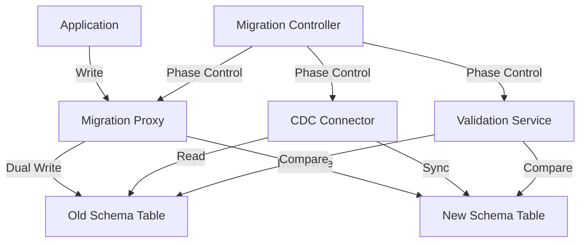

### 13.5 Tech Stack with Justification

| Component | Technology | Justification |
|-----------|-----------|---------------|
| Core language | Go | Uber's rewrite of Schemaless was in Go; matches their tooling ecosystem |
| Database | MySQL (via go-sql-driver) | Uber's primary operational database |
| CDC mechanism | MySQL binlog polling (MVP) | Standard CDC approach for MySQL |
| Validation | Go goroutines with hash comparison | Parallel comparison for large datasets |
| Orchestration | Go state machine | Migration phases with rollback capability |

### 13.6 Essential Features

**MVP (Week 1-2)**:
- Schema definition for old and new tables (with field mapping)
- Migration proxy that intercepts writes and writes to both schemas
- Migration proxy that reads from old schema (backward compatible reads)

**Core (Week 3-4)**:
- CDC-based incremental synchronization (keep new schema in sync with old)
- Validation phase: compare all rows between old and new schemas
- Traffic shifting: gradually move reads from old to new schema
- Rollback capability: revert to old schema if issues detected

**Advanced (Week 5-6)**:
- Automated migration phases: dual-write -> validate -> shift-reads -> cleanup
- Performance benchmarking: migration throughput and validation speed
- Schema compatibility checker (detect breaking changes before migration starts)
- Migration status dashboard

### 13.7 Engineering Challenges

1. **Consistency during dual-write**: If the write to the new schema fails after the write to the old schema succeeds, the schemas diverge. The migration proxy must handle this by retrying the new schema write and logging discrepancies.

2. **Backward compatibility**: During migration, the old schema must continue to serve all reads while the new schema is being populated. Any schema change that breaks old reads must be avoided.

3. **Large dataset validation**: Comparing millions of rows between schemas is resource-intensive. Validation must be done incrementally (batch by primary key range) rather than loading entire tables into memory.

### 13.8 Common Implementation Pitfalls

- Not handling out-of-order writes during dual-write (new schema may temporarily lag behind old)
- Performing migration in a single transaction (locking the table for the duration)
- Not implementing a rollback mechanism (stuck in migration state)
- Validating entire tables in one query (memory exhaustion on large tables)
- Forgetting to clean up old schema after migration completes

### 13.9 Required Knowledge

- MySQL schema design and migration
- Change Data Capture concepts
- Go database/sql package
- Backward compatibility in API/schema design
- Incremental data processing patterns

### 13.10 Difficulty and Timeline

| Metric | Value |
|--------|-------|
| Difficulty | 4/5 |
| Estimated duration | 5-6 weeks |
| Prerequisites | Go proficiency, SQL/database fundamentals |

### 13.11 Resume and Interview Value

**Interview value**: Demonstrates understanding of production data management at scale. Can discuss the Frontless project as a real-world example during system design or behavioral rounds.

**Resume value**: "Designed a zero-downtime schema migration tool implementing dual-write, CDC synchronization, and automated validation with rollback capability, enabling schema evolution without service interruption."

### 13.12 Extensions to Production Scale

- Kafka-based CDC pipeline (instead of binlog polling)
- Integration with workflow engine (Project 4) for migration orchestration
- Schema compatibility testing in CI pipeline
- Automated rollback triggered by error rate increase

---

## 14. Project Ranking by Interview Impact

| Rank | Project | Interview Round Value | Difficulty | Total Impact Score |
|------|---------|----------------------|-----------|-------------------|
| 1 | Geo-Spatial Ride Matching Simulator | System Design (highest frequency prompt) | 4/5 | 10/10 |
| 2 | Distributed Rate Limiter | Machine Coding + System Design | 2/5 | 9/10 |
| 3 | Real-Time Location Tracking Service | System Design (real-time prompt) | 4/5 | 9/10 |
| 4 | Workflow Orchestration Engine | System Design + Technical Depth | 5/5 | 8/10 |
| 5 | API Gateway with Multi-Tenancy | System Design + Architecture Discussion | 4/5 | 8/10 |
| 6 | Real-Time Event Streaming Pipeline | System Design + Event-Driven Discussion | 3/5 | 7/10 |
| 7 | Distributed Tracing System | Observability Discussion + Project Narrative | 3/5 | 7/10 |
| 8 | Distributed Cache with Consistent Hashing | Machine Coding + System Design Component | 3/5 | 7/10 |
| 9 | Microservice Health Monitor and Circuit Breaker | System Design (failure modes) | 3/5 | 6/10 |
| 10 | Zero-Downtime Schema Migration Tool | Scalability Engineering Discussion | 4/5 | 6/10 |

**Scoring methodology**: Interview Impact = (Frequency of related interview prompt) x (Depth of knowledge demonstrated) x (Recallability during interview). Projects ranked 1-3 provide the most direct preparation for the system design round, which is the primary differentiator for SDE-II offers at Uber [^23].

---

## 15. Gap Analysis Matrix

The following matrix maps each project to the job requirements identified in Section 2. A checkmark indicates that the project provides meaningful coverage of that requirement.

| Job Requirement | P1: Ride Match | P2: Rate Limit | P3: Location | P4: Workflow | P5: Gateway | P6: Events | P7: Tracing | P8: Cache | P9: Health | P10: Migration |
|----------------|:-:|:-:|:-:|:-:|:-:|:-:|:-:|:-:|:-:|:-:|
| **Go proficiency** | X | X | X | X | X | X | X | X | X | X |
| **Distributed systems** | X | X | X | X | X | X | X | X | X | X |
| **Scalability engineering** | X | | X | | X | X | | X | | X |
| **Product engineering** | X | | X | | X | | | | | |
| **Event-driven architecture** | X | | X | X | | X | | | | X |
| **Distributed data stores** | | X | X | | | | X | X | | X |
| **Caches** | | X | X | | | | | X | | |
| **Pub/sub systems** | X | | X | X | | X | | | | X |
| **High-concurrency handling** | X | X | X | X | X | X | | X | X | |
| **API design** | X | X | | X | X | | | | | X |
| **Fault tolerance** | | X | | X | X | | | | X | X |
| **Testing and documentation** | X | X | X | X | X | X | X | X | X | X |
| **Cross-team collaboration** | | | | | X | | | | X | X |
| **Open-source familiarity** | X | | | X | | | X | | | |

### Uncovered Skills

The following job-relevant skills are not fully covered by any of the 10 projects and should be addressed through other preparation activities:

| Skill | Recommended Approach |
|-------|---------------------|
| DSA / Algorithm problem solving | LeetCode practice (60-80 hours over 12 months) |
| Java proficiency | Uber still uses Java for many services; practice LLD problems in Java |
| Kubernetes / container orchestration | Deploy 2-3 projects as Docker containers; study Kubernetes basics |
| SQL query optimization | MySQL query analysis and index tuning exercises |
| Behavioral / cultural norms | Prepare STAR stories for each of Uber's 7 cultural norms |
| ML/AI basics | Uber uses ML for ETA, pricing, and fraud; read the Michelangelo blog |
| Security fundamentals | OWASP Top 10, authentication patterns, encryption at rest/in transit |

---

## 16. 12-Month Build Timeline

### Phase 1: Foundation (Months 1-3)

| Month | Activity | Project | Deliverable |
|-------|----------|---------|-------------|
| 1 | Go deep-dive + goroutine patterns + gRPC basics | Setup | GitHub repo structure, CI pipeline |
| 2 | Distributed Rate Limiter | P2: Rate Limiter | Working rate limiter with 3 algorithms |
| 3 | Event Streaming Pipeline | P6: Events | Working message broker with consumer groups |

**Milestone**: 2 completed projects on GitHub, Go proficiency confirmed.

### Phase 2: Core Systems (Months 4-7)

| Month | Activity | Project | Deliverable |
|-------|----------|---------|-------------|
| 4 | Geo-spatial concepts + H3 deep-dive | Prep for P1 | H3 cell lookup benchmark |
| 5 | Geo-Spatial Ride Matching (MVP + Core) | P1: Ride Match | Working matching engine |
| 6 | Real-Time Location Tracking | P3: Location | WebSocket-based location service |
| 7 | Ride Matching (Advanced) + Location (Advanced) | P1 + P3 | Performance-optimized versions |

**Milestone**: 4 completed projects, including the two highest-impact system design projects.

### Phase 3: Advanced Systems (Months 8-10)

| Month | Activity | Project | Deliverable |
|-------|----------|---------|-------------|
| 8 | API Gateway with Multi-Tenancy | P5: Gateway | Working gateway with tenancy isolation |
| 9 | Workflow Orchestration Engine (MVP + Core) | P4: Workflow | Working workflow engine |
| 10 | Distributed Tracing System | P7: Tracing | OpenTelemetry-compatible tracing |

**Milestone**: 7 completed projects, strong architecture portfolio.

### Phase 4: Polish and Integration (Months 11-12)

| Month | Activity | Project | Deliverable |
|-------|----------|---------|-------------|
| 11 | Distributed Cache + Health Monitor | P8 + P9 | 9 projects total, integration between projects |
| 12 | Schema Migration + Integration testing + Portfolio polish | P10 + Final | 10 projects, comprehensive README files |

**Milestone**: 10 completed projects, GitHub portfolio ready, interview preparation complete.

### Parallel Activities Throughout All 12 Months

| Activity | Weekly Time | Purpose |
|----------|-------------|---------|
| LeetCode / DSA practice | 5-6 hours | Prepare for CodeSignal OA and coding rounds |
| Uber engineering blog reading | 1 hour | Build domain knowledge for system design |
| Behavioral story preparation | 1 hour (monthly) | Prepare STAR stories for cultural norms |
| System design practice | 2 hours | Mock system design with Uber-specific prompts |

---

## 17. Interview Preparation Alignment

### 17.1 System Design Round Preparation

When asked to "design a ride-matching system" in an interview, your portfolio preparation allows you to discuss:

1. **Geospatial partitioning** (from Project 1): "I implemented H3 hexagonal indexing where drivers are bucketed into cells at resolution 9, which gives ~250m cell diameter. Nearest driver lookup becomes a fixed-radius ring search rather than a full scan."

2. **Race condition handling** (from Project 1): "Two concurrent dispatchers must not claim the same driver. I used atomic compare-and-swap on driver state, with a distributed lock (Redis SETNX) for multi-node deployment."

3. **Rate limiting** (from Project 2): "The matching API is rate-limited per rider to prevent abuse. I implemented a sliding window counter in Redis with Lua scripts for atomic operations."

4. **Real-time updates** (from Project 3): "Driver locations are ingested via WebSocket at 4-second intervals, partitioned by H3 cell, and cached in Redis for sub-millisecond lookup by the matching engine."

5. **Observability** (from Project 7): "Every matching request produces a trace with spans for geospatial lookup, driver ranking, and assignment. This feeds into a dependency graph showing latency contribution per service."

6. **Failure modes** (from Project 9): "If the matching service is overloaded, a circuit breaker falls back to returning the nearest 3 drivers without ranking optimization. This degrades gracefully instead of failing completely."

### 17.2 Machine Coding Round Preparation

The machine coding round expects end-to-end working code in 60 minutes. Your projects build the muscle for this through:

- Implementing data structures from scratch (hash ring, token bucket, state machine)
- Writing clean Go code with proper error handling
- Designing extensible interfaces (a key signal Uber interviewers look for [^22])
- Working under time pressure with clear communication

### 17.3 Behavioral Round Preparation

Each project should be documented with a narrative that maps to Uber's cultural norms:

| Cultural Norm | Project Narrative |
|---------------|-------------------|
| Act like owners | "I identified that the rate limiter project needed a fallback for Redis unavailability. I designed and implemented a local token bucket fallback without being asked." |
| Do the right thing | "I wrote comprehensive tests for the matching engine, including edge cases for zero available drivers and concurrent matching races." |
| We persevere | "The workflow engine's versioning system took three iterations to get right. I researched Cadence's approach, prototyped two designs, and converged on a replay-based solution." |
| Ideas over hierarchy | "I contributed an H3 resolution benchmark to the uber/h3-go repository, sharing findings about optimal resolution for ride-matching use cases." |

### 17.4 GitHub Portfolio Presentation

Each project repository should include:

1. **README.md**: Problem statement, architecture diagram (Mermaid), setup instructions, benchmarks
2. **docs/ARCHITECTURE.md**: Detailed design decisions and tradeoffs
3. **benchmarks/**: Performance test results with charts
4. **tests/**: Comprehensive test suite with >80% coverage
5. **.github/workflows/**: CI pipeline running tests on every push

---

## 18. References

### Interview Preparation Resources

27. TechScreen. "The Uber Technical Interview Process in 2026: A Complete Insider Guide." https://techscreen.app/articles/uber-technical-interview-process-2026
28. CodeKerdos. "Uber SDE Interview Experience (2025) -- Complete Breakdown." https://blog.codekerdos.in/uber-sde-interview-experience-2025-complete-breakdown/
29. Exponent. "Uber System Design Interview Questions (Updated 2026)." https://www.tryexponent.com/questions?company=uber

### Open-Source References

30. GitHub. "uber/cadence: Distributed workflow orchestration engine." https://github.com/cadence-workflow/cadence
31. GitHub. "jaegertracing/jaeger: CNCF Jaeger distributed tracing platform." https://github.com/jaegertracing/jaeger
32. Uber Engineering Blog. "The Uber Engineering Tech Stack, Part II: The Edge and Beyond." https://www.uber.com/gb/en/blog/uber-tech-stack-part-two/
33. Uber Engineering Blog. "Announcing Cadence 1.0." June 2023. https://www.uber.com/blog/announcing-cadence/

[^1]: Uber Newsroom. "Uber's Cultural Norms." https://www.uber.com/newsroom/ubers-new-cultural-norms
[^2]: Krishnan, A. "Migrating Uber's Compute Platform to Kubernetes: A Technical Journey." Uber Engineering Blog, 2024. https://www.uber.com/blog/migrating-ubers-compute-platform-to-kubernetes-a-technical-journey/
[^3]: GopherCon 2019. "How Uber 'Go'es." Presentation by Uber engineers. https://sourcegraph.com/blog/go/gophercon-2019-how-uber-go-es
[^4]: Pragmatic Engineer. "Working at Uber, in Amsterdam." Blog post with Uber engineering culture insights. https://blog.pragmaticengineer.com/working-at-uber-in-amsterdam/
[^5]: Uber Engineering Blog. "How Uber Conquered Database Overload: The Journey from Static Rate-Limiting to Intelligent Load Management." 2024. https://www.uber.com/us/en/blog/from-static-rate-limiting-to-intelligent-load-management/
[^6]: Uber Engineering Blog. "The Uber Engineering Tech Stack, Part I: The Foundation." https://www.uber.com/us/en/blog/tech-stack-part-one-foundation/
[^7]: Uber Engineering Blog. "Migrating Uber's Compute Platform to Kubernetes." 2024. https://www.uber.com/blog/migrating-ubers-compute-platform-to-kubernetes-a-technical-journey/
[^8]: Jaeger Documentation. "Jaeger: Distributed Tracing Platform." https://www.jaegertracing.io/
[^9]: Uber Engineering Blog. "Conducting Better Business with Uber's Open Source Orchestration Tool, Cadence." https://www.uber.com/sa/en/blog/open-source-orchestration-tool-cadence-overview/
[^10]: Uber Engineering Blog. "H3: Uber's Hexagonal Hierarchical Spatial Index." https://h3geo.org/
[^11]: GitHub. "uber-go/fx: A dependency injection based application framework for Go." https://github.com/uber-go/fx
[^12]: Uber Engineering Blog. "Up: Portable Microservices Ready for the Cloud." https://www.uber.com/gt/en/blog/up-portable-microservices-ready-for-the-cloud/
[^13]: Uber Engineering Blog. "Shifting E2E Testing Left at Uber." 2024. https://www.uber.com/us/en/blog/shifting-e2e-testing-left/
[^14]: Uber Engineering Blog. "Introducing Domain-Oriented Microservice Architecture." https://www.uber.com/us/en/blog/microservice-architecture/
[^15]: Pragmatic Engineer. "Engineering Management at Uber, in Amsterdam." https://blog.pragmaticengineer.com/engineering-management-at-uber/
[^16]: Uber Engineering Blog. "Introducing Uber's Open Source Principles." https://www.uber.com/us/en/blog/open-source-principles/
[^17]: Uber Engineering Blog. "H3: Uber's Hierarchical Geospatial Index." Combined with system design interview analysis.
[^18]: Uber Engineering Blog. "Why We Leverage Multi-tenancy in Uber's Microservice Architecture." https://www.uber.com/gb/en/blog/multitenancy-microservice-architecture/
[^19]: Uber Research Paper. "Uber's Failover Architecture: Reconciling Reliability and Efficiency in Hyperscale Microservice Infrastructure." arXiv:2603.07345, 2026.
[^20]: Uber Engineering Blog. "Making Uber's Experiment Evaluation Engine 100x Faster." 2024. https://www.uber.com/us/en/blog/making-ubers-experiment-evaluation-engine-100x-faster/
[^21]: Uber Careers. "Software Engineer II: Backend." Job ID 154897. https://www.uber.com/global/en/careers/list/154897/
[^22]: LeetCode Discuss. "Uber Software Engineer II (SE-2) Bangalore Interview Experience." 2025. https://leetcode.com/discuss/post/7300207/
[^23]: SpaceComplexity. "Uber System Design Interview Guide: What the Bar Tests at Each Level." https://spacecomplexity.ai/blog/uber-system-design-interview
[^24]: GitHub. "uber/ringpop-go: A library that brings consistent hash ring to Go." https://github.com/uber/ringpop-go
[^25]: Uber Engineering Blog. "The Accounter: Scaling Operational Throughput on Uber's Stateful Platform." https://www.uber.com/us/en/blog/the-accounter/
[^26]: Uber Engineering Blog. "Code Migration in Production: Rewriting the Sharding Layer of Uber's Schemaless Datastore." https://www.uber.com/us/en/blog/schemaless-rewrite/

---

*Document prepared for Backend Engineer portfolio preparation targeting Uber's Software Engineer II: Backend role.*
*All confirmed facts are sourced from official Uber engineering blog posts, open-source repositories, and job postings. Inferences are clearly marked.*
