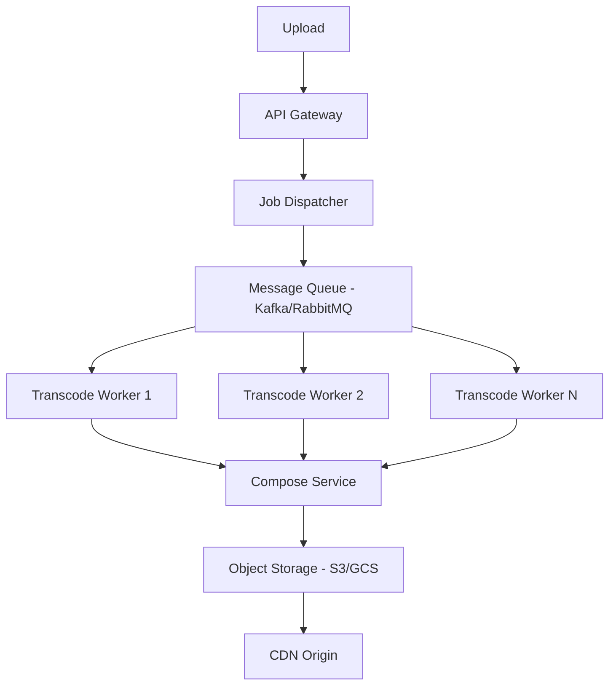
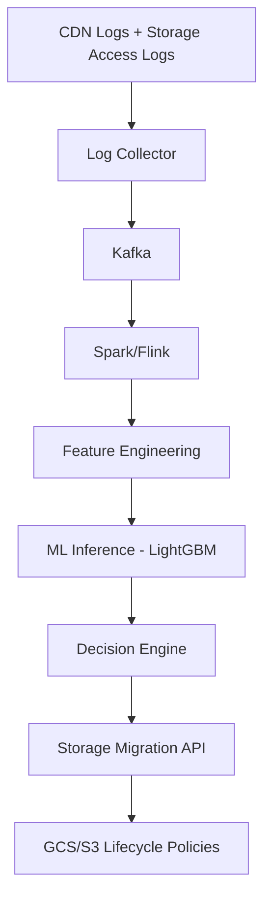
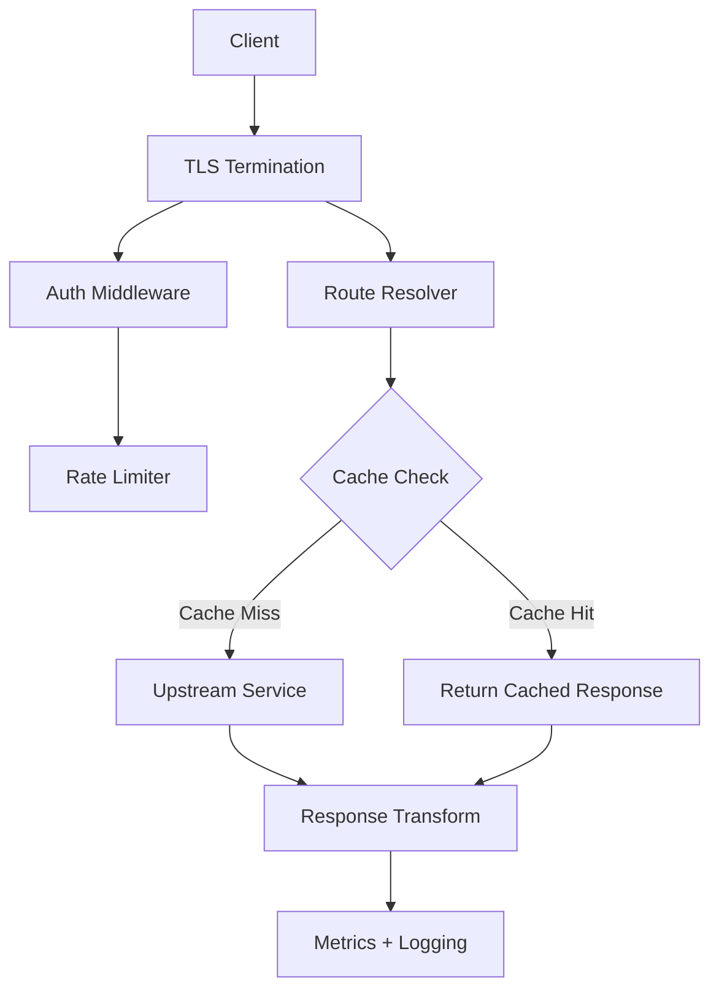
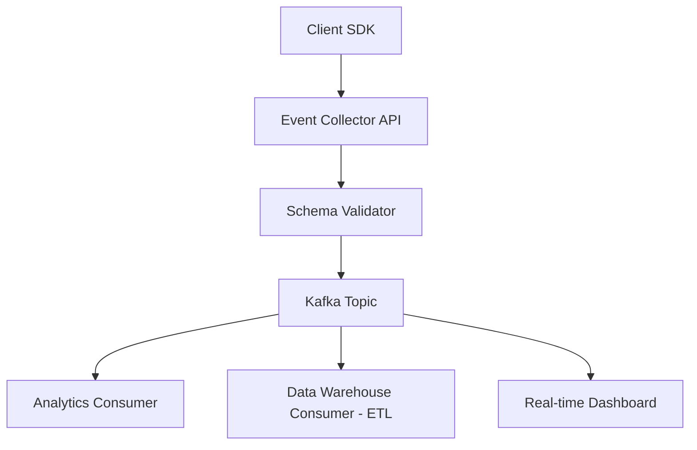
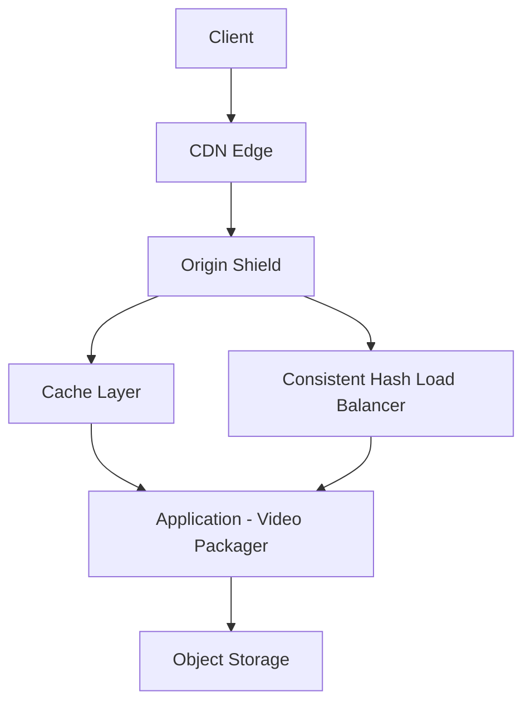
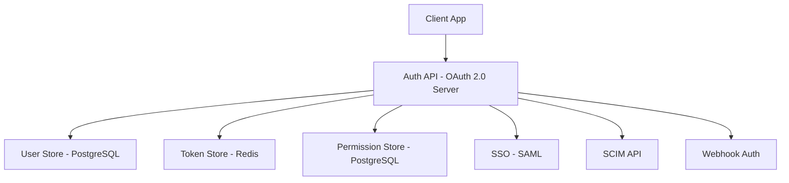
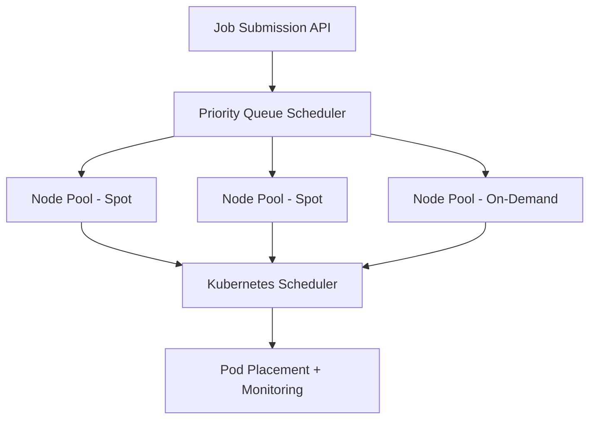
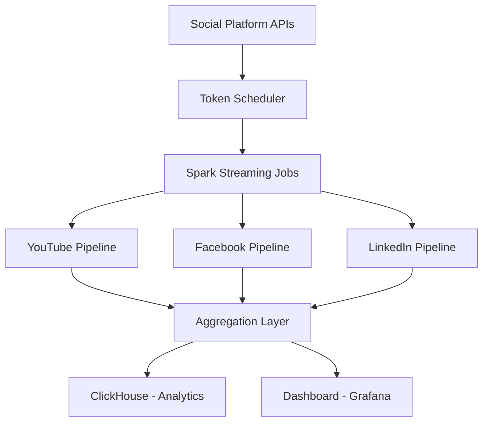
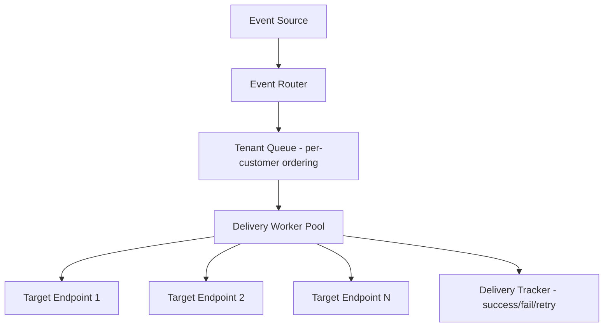
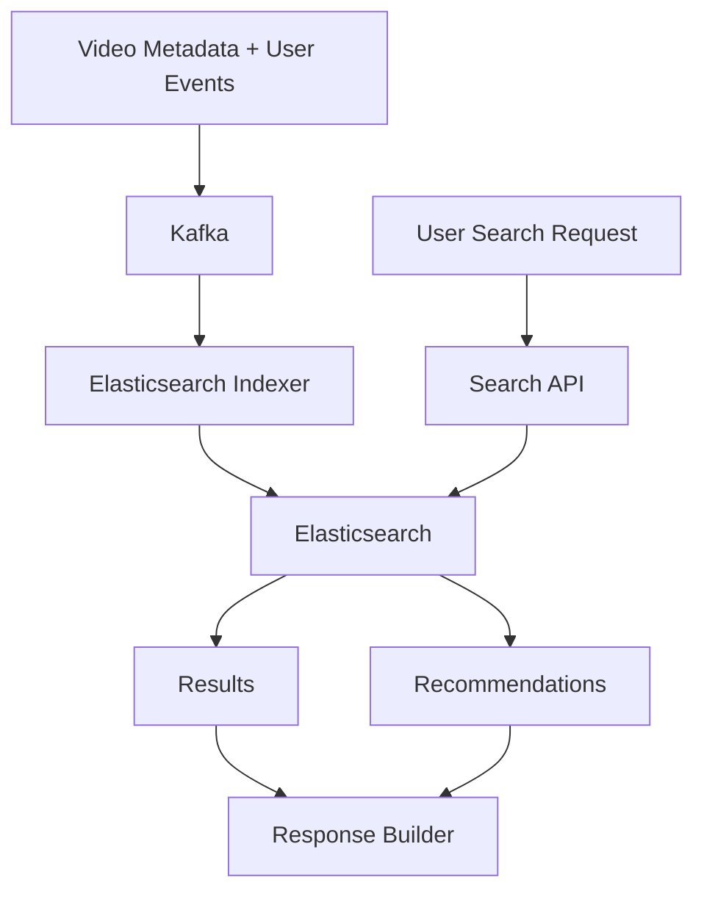

# Portfolio Preparation Guide for Backend Engineer at Vimeo

## Table of Contents

1. [Company Research](#1-company-research)
2. [Technology Stack & Architecture](#2-technology-stack--architecture)
3. [Job Requirements Analysis](#3-job-requirements-analysis)
4. [Portfolio Project Recommendations](#4-portfolio-project-recommendations)
5. [Project Rankings by Interview Impact](#5-project-rankings-by-interview-impact)
6. [Gap Analysis](#6-gap-analysis)

---

## 1. Company Research

### 1.1 What Vimeo Does

Vimeo[^1] is a video software platform headquartered in New York City with R&D centers in Tel Aviv, Israel and Bengaluru, India. The platform enables individuals and organizations to create, host, manage, and monetize video content. Vimeo serves millions of users across two broad segments:

- **Creators and individuals** -- tools for video creation, editing, recording, and sharing (Vimeo Create, Vimeo Record)
- **Enterprise and media organizations** -- OTT[^2] streaming, video library management, analytics, and branded video experiences for businesses ranging from independent creators to Fortune 500 companies[^2]

The platform processes hundreds of thousands of new uploads daily and delivers billions of video views per month[^3]. Vimeo pivoted from a consumer YouTube competitor into a B2B SaaS[^4] video platform, generating revenue primarily through subscriptions.

### 1.2 Key Products

| Product | Description |
|---|---|
| **Video Hosting & Playback** | Core platform for uploading, storing, and streaming video with adaptive bitrate delivery (HLS[^5]/DASH[^6]) |
| **Vimeo OTT** | White-label streaming service enabling businesses to build their own subscription-based video apps |
| **Vimeo Create** | AI-powered video creation and editing tools for businesses |
| **Vimeo Record** | Screen and camera recording tool for internal/business communication |
| **Video Library** | Enterprise content management for large-scale video archives |
| **Analytics** | Video performance and social media analytics across platforms |
| **API & SDKs** | REST API enabling third-party integrations (OpenAPI specification published)[^7] |

### 1.3 Engineering Culture (Inferred from Public Sources)

Based on engineering blog posts, conference talks, and job postings, several cultural characteristics emerge:

**Confirmed facts:**
- Engineers write backend code in PHP, Go, Ruby, Python, Node.js, Java, C, C++, and Rust[^8]
- The team values progressive modernization over wholesale rewrites -- the PHP codebase (originally ~500,000 lines) has been incrementally improved rather than replaced[^8]
- Vimeo created Psalm (PHP static analysis tool) in-house, now open source with 5,800+ GitHub stars[^9]
- Engineers contribute to upstream open-source projects (HAProxy[^10] bounded-load hashing, Terraform Google Beta provider)[^11]
- The company uses a custom job scheduler called Quickset for cost-optimized Kubernetes[^12] workload placement[^13]
- Cross-functional collaboration is emphasized across product, design, frontend, ML, and data teams

**Reasonable inferences:**
- Teams are organized around product domains (Growth, Monetization, Content & Media, AI Applications, Core Services, Create)
- There is an active push to modernize legacy systems while maintaining stability
- Cost optimization is a significant engineering concern (Spot[^14] instances, storage tiering, ML-driven classification)
- The engineering blog is actively maintained, suggesting internal investment in engineering branding and knowledge sharing

### 1.4 Business Domain Challenges

Vimeo operates in the video technology domain, which presents unique backend engineering challenges:

1. **Massive scale** -- hundreds of petabytes of video served monthly; over 1.5 millennia (1,500+ years) of content uploaded annually[^15]
2. **Transcoding complexity** -- videos must be transcoded into multiple formats, resolutions, codecs (H.264, H.265, AV1), and streaming protocols (HLS[^5], DASH[^6])
3. **Storage economics** -- managing costs across hot/warm/cold/archive storage tiers for billions of video objects
4. **Real-time packaging** -- on-the-fly video packaging (Skyfire) serving nearly a billion DASH/HLS requests per day[^16]
5. **Multi-region delivery** -- consistent performance across regions with CDN[^17] integration
6. **Event data processing** -- 85 billion events per month flowing through the data pipeline[^18]
7. **AI/ML integration** -- AI-powered subtitles, recommendations, content analysis, storage optimization

---

## 2. Technology Stack & Architecture

### 2.1 Backend Languages

| Language | Usage | Source |
|---|---|---|
| **Go (Golang)** | Primary language for new microservices[^19] and infrastructure tools (Falkor, Pentagon, Dials, HAProxy[^10] log server) | Engineering blog, job postings |
| **PHP** | Legacy monolith (~500K+ lines), still in production, being incrementally modernized | Engineering blog |
| **Python** | AI/ML services, data pipelines, Django for Create products, scripting, Spark jobs | Job postings, engineering blog |
| **Ruby** | Legacy components, Rails backend for Content & Media | Job posting (Sr. Frontend Engineer, Content & Media) |
| **C/C++** | Video transcoders (Falkor transcoders written in C) | Engineering blog |
| **Scala/Java** | Apache Spark data pipelines | Engineering blog |
| **Node.js** | Some backend services | Engineering blog |
| **Rust** | "A bit of Rust" -- used sparingly | Engineering blog |

### 2.2 Cloud Infrastructure

**Confirmed: Google Cloud Platform (GCP)** as primary cloud provider[^20]:

- **Compute:** Google Compute Engine (GCE), Google Kubernetes Engine (GKE)
- **Storage:** Google Cloud Storage (GCS) -- multi-regional, with lifecycle policies for storage tiering
- **Databases:** Cloud Spanner (primary, 16 nodes, 50.8 billion rows, 99.999% uptime), Cloud SQL (lower-volume services)
- **Messaging:** Google Cloud PubSub (at-least-once[^21] delivery)
- **Networking:** Cloud NAT, VPC-native clusters
- **ML:** Kubeflow Pipelines on GKE
- **IaC[^22]:** Terraform

Also uses AWS in some contexts (mentioned in job postings as "AWS/GCP").

### 2.3 Databases & Data Stores

| Database | Role | Scale |
|---|---|---|
| **Cloud Spanner** | Primary relational database, video metadata indexing | 16 nodes, 50.8B rows, 4.5TB, multi-region, 99.999% uptime |
| **Cloud SQL (MySQL)** | Satellite services, lower-volume workloads | Smaller scale |
| **Redis / Memcached** | Caching layer (Skyfire indexes, session data) | Used for shared caching across video packager |
| **Elasticsearch** | Search and recommendation systems | Personalization and recommendation algorithms |
| **HBase + Phoenix** | Analytics data storage | Used with Spark pipelines |
| **ClickHouse** | Analytics OLAP[^23] database | Video analytics |
| **Druid** | Real-time analytics | Time-series event data |
| **Snowflake** | Data warehouse for BI[^24] | "High-quality data" for business consumption |
| **BigQuery** | Data store on GCP, engineering-oriented analytics | Intermediate processing, not BI-facing |

### 2.4 Data Pipeline & Streaming

- **Apache Kafka** -- primary message broker[^25] for event streaming; Confluent managed cluster[^26]
- **Apache Spark** (structured streaming) -- distributed data processing for social analytics, token scheduling, API backpressure[^27] management
- **Apache Airflow** -- workflow orchestration for ETL[^28] jobs
- **Schema Registry[^29]** -- enforcing data contracts on Kafka topics
- **Kafka Streams or KSP (Confluent)** -- planned enrichment layer for real-time data processing (source mentions "KSP over confluent"; exact acronym interpretation uncertain)

### 2.5 Communication & Networking

- **REST APIs** -- primary API style (OpenAPI-spec'd)
- **gRPC[^30]** -- used for internal service communication (newer services)
- **MessagePack RPC** -- older internal RPC protocol (predating gRPC adoption)
- **HAProxy[^10]** -- load balancer used extensively (with custom bounded-load consistent hashing[^31] algorithm contributed upstream)[^10]
- **Fastly CDN[^17]** -- edge content delivery for video
- **Protocols:** TCP/IP, HTTP, TLS, DNS (deep understanding expected per job postings)

### 2.6 DevOps & Platform Engineering

- **Kubernetes[^12] (GKE)** -- container orchestration, multi-region deployment
- **Terraform** -- infrastructure as code
- **HashiCorp Vault** -- secrets management (with Pentagon for K8s synchronization)
- **Docker** -- containerization
- **CI/CD** -- Psalm integrated into CI pipeline for PHP; standard deployment tooling
- **Blue/green deployments[^32]** -- managed via HAProxy[^10] admin socket
- **Observability** -- custom Go service parsing HAProxy[^10] syslog into StatsD[^33] metrics
- **Monitoring:** Prometheus[^34] (bonus/desired skill per job postings, not confirmed actively in use), StatsD[^33] (confirmed in production), Monte Carlo for data observability (confirmed)

### 2.7 Key Internal Systems

| System | Description |
|---|---|
| **Falkor** | Next-gen transcoding infrastructure -- Go API, C transcoders, Kubernetes[^12], PubSub queues, Spot[^14] instances, 3 US regions |
| **Skyfire** | Dynamic on-the-fly video packager -- ~1 billion DASH/HLS requests/day |
| **Artax** | Transparent proxy converting fragmented ISOBMFF[^35] to progressive ISOBMFF[^35] |
| **Quickset** | Custom Kubernetes[^12] job scheduler for cost-optimized task placement |
| **Big Picture** | Structured event tracking platform replacing legacy "Fatal Attraction" system |
| **Pentagon** | Open-source Vault-to-Kubernetes secret synchronization tool |
| **Psalm** | Open-source PHP static analysis type checker (5,800+ stars) |
| **Dials** | Open-source Go configuration package (supports CUE, JSON, YAML, TOML, env vars, flags) |

---

## 3. Job Requirements Analysis

### 3.1 Composite Requirements from Active Backend Roles

I analyzed the following active Vimeo backend roles to build this composite:

1. **Sr. Software Engineer, Core Services** (New York/Remote)
2. **Sr. Backend Developer, AI** (Tel Aviv)
3. **Software Engineer, AI** (Tel Aviv)
4. **Principal Software Engineer** (Tel Aviv)
5. **Software Engineer III, Backend** (Bengaluru)
6. **Software Engineer II, Fullstack** (Bengaluru)
7. **Senior Software Engineer, Growth** (New York)
8. **Engineering Manager, Monetization** (New York/Remote)

### 3.2 Technical Skills Matrix

| Skill Area | Requirement Level | Evidence |
|---|---|---|
| **Go (Golang)** | Must-have for new services | Core Services: "5+ years production Go"; Falkor, Pentagon all written in Go |
| **Python** | Must-have | AI roles, Create team, data pipelines |
| **PHP** | Advantage/Plus | Legacy codebase still in production |
| **Microservices[^19] architecture** | Must-have | Explicitly required across all roles |
| **REST API design** | Must-have | All roles; OpenAPI-spec'd public API |
| **gRPC[^30]** | Strongly preferred | Core Services mentions gRPC endpoints |
| **Databases (MySQL/PostgreSQL)** | Must-have | Explicitly listed across roles |
| **Cloud Spanner** | Domain-specific knowledge | Primary database at scale |
| **GCP** | Must-have (or AWS) | "Experience with AWS/GCP is required" |
| **Kubernetes[^12]** | Must-have | Core Services: "5+ years Kubernetes must" |
| **Distributed systems[^36]** | Must-have | All senior roles |
| **Linux/UNIX fundamentals** | Must-have | Core Services explicitly lists |
| **Internet protocols (TCP/IP, HTTP, TLS, DNS)** | Must-have | Deep understanding expected |
| **Authentication/Authorization (RBAC[^37], ReBAC[^38], SSO[^39], SCIM[^40], OAuth)** | Preferred | India roles, IAM[^41] platform work |
| **Testing (unit, integration)** | Must-have | "Write unit and integration tests" across all roles |
| **Code reviews** | Must-have | "Conduct code reviews" across all roles |
| **Scalability & Performance** | Must-have | Implicit in every role |
| **Data processing (Kafka, Spark)** | Preferred | Data-adjacent roles |
| **CI/CD** | Expected | Cross-cutting concern |
| **Observability & Monitoring** | Expected | "Stringent monitoring standards" |
| **AI/ML integration** | Bonus/Preferred | AI-specific roles |

### 3.3 How Business Context Shapes These Requirements

**Why Go is paramount:** Vimeo is actively migrating from PHP to Go for new services. Every new microservice[^19], infrastructure tool, and API endpoint is written in Go. The Core Services team's mandate is to "shed legacy baggage" by building Go replacements. This is not optional -- it is the company's explicit architectural direction.

**Why GCP knowledge matters:** Unlike many companies using AWS, Vimeo runs primarily on Google Cloud. Their use of Cloud Spanner (a Google-unique database), GKE, PubSub, and BigQuery means GCP-specific knowledge is directly valuable.

**Why video domain knowledge is valuable (but not required):** Most job postings list "experience with video services" as a bonus, not a requirement. However, understanding concepts like transcoding, adaptive bitrate streaming, CDN[^17] delivery, and video container formats (ISOBMFF[^35]/MP4) would significantly differentiate a candidate.

**Why authentication/authorization matters:** Vimeo is building an IAM[^41] platform (mentioned in India backend roles) and serves enterprise customers who need SSO[^39], SCIM[^40], and fine-grained access control. Understanding RBAC[^37] and ReBAC[^38] is increasingly important.

**Why data scale matters:** With 85 billion events per month and 50+ billion rows in Spanner, candidates must demonstrate comfort with large-scale data systems[^36], not just CRUD applications.

---

## 4. Portfolio Project Recommendations

### Project 1: Distributed Video Transcoding Pipeline

**What it is:** A production-grade video transcoding service that accepts video uploads, parallelizes transcoding across multiple workers, and outputs adaptive bitrate streams (HLS[^5] and DASH[^6]) in multiple resolutions and codecs. This is the most directly relevant project to Vimeo's core infrastructure (Falkor).

**Why it is relevant:** Vimeo's Falkor system is their most critical infrastructure -- it handles all video transcoding. Understanding distributed transcoding, chunk-based parallelism, and fault-tolerant job processing is directly applicable.

**Backend concepts demonstrated:**
- Distributed job scheduling and work distribution
- Event-driven architecture with message queues[^25]
- Horizontal scaling[^42] with worker pools
- Idempotent[^43] processing and at-least-once[^21] delivery semantics
- State machine[^44] design for pipeline orchestration
- Fault tolerance[^45] with retry logic and partial failure recovery
- Container-based deployment with Kubernetes[^12]

**Recommended architecture:**

**Tech stack with justification:**
- **Go** -- primary language (matches Vimeo's direction); strong concurrency model with goroutines[^46] for parallel processing
- **FFmpeg[^47]** -- industry-standard video processing library (C library with Go bindings)
- **Kafka or RabbitMQ** -- message queue[^25] for job distribution (Vimeo uses Kafka and PubSub)
- **PostgreSQL** -- job state tracking and metadata storage
- **Redis** -- job queue priority, caching video metadata
- **Docker + Kubernetes[^12]** -- container orchestration (matches Vimeo's infrastructure)
- **S3 or GCS** -- object storage for source and output files
- **MinIO** -- local S3-compatible storage for development

**Essential features:**
- Chunk-based parallel transcoding (split video into segments, transcode in parallel, reassemble)
- Multiple output profiles (720p, 1080p, 4K; H.264, H.265, AV1)
- HLS[^5] and DASH[^6] manifest generation
- Webhook callbacks on job completion
- Progress tracking and status API
- Graceful handling of worker failures and retries
- Cost-aware scheduling (priority queues for different job sizes)

**Engineering challenges:**
- Video chunk splitting without re-encoding (keyframe[^48]-aligned splitting)
- Correctly concatenating transcoded chunks (moov box construction)
- Handling duplicate messages (at-least-once[^21] delivery)
- Optimizing for ephemeral compute (Spot[^14]/preemptible instances)
- Managing storage I/O bottlenecks
- Accurate progress reporting across distributed workers

**Common implementation pitfalls:**
- Splitting video at non-keyframe[^48] boundaries (causes visual artifacts)
- Ignoring audio synchronization across chunks
- Not handling partial chunk failures gracefully
- Underestimating the complexity of manifest (MPD/M3U8) generation
- Not using connection pooling[^49] for storage access
- Over-provisioning workers for small videos

**Required knowledge:**
- Video container formats (MP4/ISOBMFF[^35], fragmented ISOBMFF[^35])
- Video codecs and encoding parameters (CRF[^50], preset, profile)
- Adaptive bitrate streaming protocols (HLS[^5], DASH[^6])
- Distributed systems patterns (saga pattern, state machines[^44])
- Kubernetes[^12] resource management (CPU/memory requests, limits)
- Cloud storage APIs (multipart upload, presigned URLs)

**Estimated difficulty:** Hard (8/10)

**Resume/interview value:** Very High. This project demonstrates the exact kind of distributed system Vimeo builds. It can anchor system design interviews about video infrastructure, job scheduling, and fault tolerance[^45]. The Falkor engineering blog provides excellent talking points.

**Extensions toward production scale:**
- Integrate a cost optimizer that selects between Spot[^14] and on-demand instances
- Add GPU-accelerated transcoding nodes
- Implement ABR[^51] quality analysis (VMAF/SSIM scoring)
- Multi-region deployment with intelligent routing
- Real-time monitoring dashboard with per-job metrics

---

### Project 2: Intelligent Video Storage Tiering System

**What it is:** An ML-powered system that classifies video assets by access frequency and automatically migrates them between storage tiers (hot, warm, cold, archive) to optimize costs while maintaining performance. This mirrors Vimeo's real system described in their engineering blog.

**Why it is relevant:** Vimeo explicitly published a detailed blog post about solving this exact problem with LightGBM and K-means clustering. Recreating this demonstrates understanding of their actual production challenges.

**Backend concepts demonstrated:**
- Event-driven data collection and processing
- ML model serving in production (feature engineering, inference pipeline)
- Storage lifecycle management
- Data pipeline orchestration
- Cost optimization algorithms
- Time-series analysis and prediction

**Recommended architecture:**

**Tech stack with justification:**
- **Python** -- ML ecosystem (scikit-learn, LightGBM, pandas); matches Vimeo's AI/ML stack
- **Apache Kafka** -- log ingestion pipeline
- **Apache Spark or Apache Flink** -- stream processing for feature computation
- **LightGBM** -- gradient boosting framework (explicitly used by Vimeo)
- **PostgreSQL** -- feature store and model metadata
- **Redis** -- caching access frequency counters
- **S3/GCS** -- target storage with lifecycle policies
- **Docker + Kubernetes[^12]** -- deployment and model serving

**Essential features:**
- Multi-source log ingestion (CDN[^17], storage access, application logs)
- Feature engineering pipeline (decay-weighted access frequency, retrieval ratios, moving averages)
- ML model for hot/cold classification
- Automated storage tier migration with rollback capability
- Cost dashboard showing projected savings
- A/B testing framework for model evaluation

**Engineering challenges:**
- Accurate feature extraction from heterogeneous log sources
- Handling the delay between access and migration decision
- Avoiding "thrashing" (moving objects back and forth between tiers)
- Managing deletion penalties for cold/archive transitions
- Training model with time-series cross-validation
- Ensuring migration doesn't impact serving performance

**Common implementation pitfalls:**
- Using naive access counts instead of decay-weighted metrics
- Not accounting for retrieval costs when moving to cold storage
- Over-fitting the model to historical patterns
- Not implementing circuit breakers for migration operations
- Ignoring the cost of the migration operation itself

**Required knowledge:**
- ML feature engineering for time-series data
- Cloud storage class economics (Standard, Nearline, Coldline, Archive)
- Stream processing frameworks
- Pandas/NumPy for feature computation
- Model evaluation metrics (precision, recall, F1 for classification)
- Cloud storage APIs (lifecycle policies, object metadata)

**Estimated difficulty:** Hard (8/10)

**Resume/interview value:** Very High. This demonstrates ML engineering in a cost-optimization context, which is a major concern at Vimeo's scale. Directly maps to their published engineering blog post, providing excellent interview conversation starters.

**Extensions toward production scale:**
- Multi-objective optimization (cost vs. latency vs. availability)
- Reinforcement learning for migration timing
- Integration with Kubernetes[^12]-based inference serving (Kubeflow)
- Real-time alerting on anomalous access patterns
- Cross-region storage optimization

---

### Project 3: High-Performance API Gateway with Rate Limiting and Caching

**What it is:** A custom API gateway[^52] built in Go that handles authentication, rate limiting, response caching, request routing, and observability -- similar to what Vimeo's HAProxy[^10] infrastructure provides but built as a Go service.

**Why it is relevant:** Vimeo's public REST API serves millions of requests. Their internal infrastructure relies heavily on HAProxy[^10] with custom algorithms. Building a Go-based gateway demonstrates the exact kind of infrastructure work the Core Services team does.

**Backend concepts demonstrated:**
- HTTP proxy and reverse proxy architecture
- Token bucket[^27] and sliding window rate limiting algorithms
- Consistent hashing[^31] for cache distribution
- Connection pooling[^49] and keep-alive management
- Middleware[^21]/chain-of-responsibility pattern
- TLS termination and certificate management
- Prometheus[^34]-compatible metrics emission

**Recommended architecture:**

**Tech stack with justification:**
- **Go** -- high-performance networking; Vimeo's infrastructure language of choice
- **Redis** -- distributed rate limiting counters and response cache
- **etcd or Consul** -- service discovery and configuration
- **Prometheus[^34] + Grafana** -- observability stack
- **golang.org/x/net/http2** -- HTTP/2 support
- **Docker + Kubernetes[^12]** -- deployment

**Essential features:**
- Configurable rate limiting per API key (token bucket[^27] algorithm)
- Multi-tier caching (in-memory LRU[^53], Redis distributed cache)
- Consistent hashing[^31] for request routing (reference Vimeo's bounded-load algorithm)
- Request/response transformation middleware[^21]
- Circuit breaker[^54] for upstream service protection
- Structured logging with request tracing (correlation IDs)
- Health check endpoints and readiness probes
- Blue/green deployment[^32] support (matching Vimeo's HAProxy[^10] pattern)

**Engineering challenges:**
- Implementing bounded-load consistent hashing[^31] correctly (the actual algorithm from Vimeo's contribution to HAProxy[^10])
- High-throughput rate limiting without Redis as a bottleneck
- Cache invalidation strategies (TTL, event-based, tag-based)
- Handling slow upstream services without blocking the gateway
- Zero-downtime configuration reloads
- Memory-efficient request buffering for large payloads

**Common implementation pitfalls:**
- Race conditions in distributed rate limiting
- Cache stampede[^55] on popular endpoints
- Not implementing proper timeout cascading between layers
- Hard-coding routing rules instead of using service discovery
- Ignoring connection pool exhaustion under load

**Required knowledge:**
- HTTP/1.1 and HTTP/2 protocol details
- Consistent hashing[^31] algorithms and their variants
- Rate limiting algorithms (token bucket[^27], sliding window, fixed window)
- Cache eviction policies (LRU[^53], LFU, ARC)
- Circuit breaker[^54] patterns
- Go concurrency primitives (channels, sync.Pool)
- Kubernetes[^12] health checks and graceful shutdown

**Estimated difficulty:** Medium-Hard (7/10)

**Resume/interview value:** High. Demonstrates infrastructure engineering skills directly applicable to Vimeo's Core Services team. The bounded-load hashing connection to Vimeo's actual HAProxy[^10] contribution is a unique talking point.

**Extensions toward production scale:**
- WebSocket proxying support
- gRPC[^30] reverse proxy with protocol translation
- Dynamic routing via control plane API
- Request coalescing for identical concurrent requests
- WAF[^56] integration for security filtering

---

### Project 4: Real-Time Event Streaming Platform with Schema Evolution

**What it is:** A structured event collection and processing platform (similar to Vimeo's "Big Picture") that enforces schemas at the source, validates events in transit, and routes them to multiple downstream systems (analytics, data warehouse, real-time dashboards).

**Why it is relevant:** Vimeo built "Big Picture" to replace their legacy "Fatal Attraction" event system. This was a major engineering effort involving schema validation, multi-platform SDKs, and Kafka-based routing. Understanding this problem space is directly relevant.

**Backend concepts demonstrated:**
- Schema-first event design
- Schema[^29] registry[^29] with backward/forward compatibility
- Event-driven architecture with multiple consumers[^57]
- Backpressure[^27] management in streaming systems
- Data contract enforcement
- Multi-destination event routing
- Exactly-once[^58] processing semantics

**Recommended architecture:**

**Tech stack with justification:**
- **Go or Python** -- API server (Go for performance, Python for SDK flexibility)
- **Apache Kafka** -- event streaming backbone
- **Schema Registry[^29] (Confluent)** -- schema[^29] versioning and compatibility enforcement
- **PostgreSQL** -- schema[^29] definitions, event metadata, consumer[^57] offsets
- **Redis** -- real-time counters and aggregation cache
- **ClickHouse or TimescaleDB** -- real-time analytics queries
- **Protobuf or Avro** -- binary event serialization

**Essential features:**
- Schema[^29] definition DSL[^59] (YAML/JSON-based event schema[^29] specification)
- Auto-generated SDKs from schema[^29] definitions (Python, JavaScript, Go)
- Schema[^29] registry[^29] with compatibility checks (backward, forward, full)
- Event validation at ingestion (type checking, required fields, enum validation)
- Multi-consumer[^57] routing (route events to different systems based on schema[^29]/topic)
- Dead letter queue[^60] for invalid events
- Event volume dashboard with real-time metrics
- Schema[^29] migration tooling for breaking changes

**Engineering challenges:**
- Designing a schema[^29] evolution strategy that doesn't break consumers[^57]
- Handling high-throughput event ingestion (>100K events/sec)
- Idempotent[^43] event processing across multiple consumers[^57]
- Schema[^29] registry[^29] performance under high write throughput
- Debugging schema[^29] compatibility issues across consumer[^57] versions
- Managing consumer[^57] lag and backpressure[^27]

**Common implementation pitfalls:**
- Allowing untyped/"anything goes" event payloads (this is what Vimeo's old system suffered from)
- Not versioning schemas[^29] from day one
- Breaking consumers[^57] when evolving event schemas[^29]
- Not implementing schema[^29] validation at the SDK level
- Ignoring late-arriving events in streaming consumers[^57]

**Required knowledge:**
- Apache Kafka internals (topics, partitions, consumer[^57] groups, offsets)
- Schema[^29] evolution strategies (Avro/Protobuf compatibility rules)
- Stream processing concepts (windowing, watermarks, exactly-once[^58])
- Event sourcing[^44] patterns
- Data modeling for analytics workloads
- SDK design principles

**Estimated difficulty:** Medium-Hard (7/10)

**Resume/interview value:** High. Event-driven architecture is a core pattern at Vimeo (85B events/month). This project demonstrates understanding of data contracts, schema[^29] evolution, and streaming infrastructure -- all critical at Vimeo's scale.

**Extensions toward production scale:**
- Multi-region Kafka with MirrorMaker 2 replication
- Schema[^29] registry[^29] with UI for schema[^29] exploration
- Consumer[^57] group management API
- Event replay capability from any point in time
- Integration with data quality monitoring (Monte Carlo-style)

---

### Project 5: Video Content Delivery Orchestrator with Intelligent Caching

**What it is:** A content delivery orchestration system that sits between the video origin and CDN[^17], implementing intelligent caching strategies, cache warming, origin shielding[^61], and consistent-hash[^31]-based request routing -- similar to Vimeo's Skyfire packager.

**Why it is relevant:** Skyfire serves nearly 1 billion DASH/HLS requests per day. The bounded-load consistent hashing[^31] algorithm was a Vimeo innovation. Understanding CDN[^17] orchestration and cache-efficient request routing is deeply relevant.

**Backend concepts demonstrated:**
- Consistent hashing[^31] with bounded loads
- Multi-level caching (edge, regional, origin)
- Origin shielding[^61] and request coalescing
- Cache invalidation strategies
- CDN[^17] partner integration
- HTTP range request handling
- Performance optimization for video delivery

**Recommended architecture:**

**Tech stack with justification:**
- **Go** -- high-performance networking; consistent with Vimeo's stack
- **Redis** -- distributed cache for manifest and metadata
- **HAProxy[^10]** -- load balancer (with bounded-load hashing if possible, or custom implementation)
- **NGINX** -- origin shield and reverse proxy
- **PostgreSQL** -- cache metadata and video catalog
- **Docker + Kubernetes[^12]** -- deployment with auto-scaling

**Essential features:**
- Bounded-load consistent hashing[^31] implementation (the algorithm from Vimeo's HAProxy[^10] contribution)
- Multi-tier caching with LRU[^53] eviction
- Cache warming on video upload
- HTTP range request support (critical for video seeking)
- Origin request coalescing (dedup concurrent requests for same resource)
- Real-time cache hit ratio monitoring
- Blue/green deployment[^32] support

**Engineering challenges:**
- Correctly implementing bounded-load consistent hashing[^31] (balancing cache locality vs. load distribution)
- Handling server pool changes without cache thrashing
- Range request support with proper Content-Length and Content-Range headers
- Cache key design for video manifests vs. video segments
- Warm-up strategies that don't overwhelm the origin
- Handling cache stampede[^55] for popular newly-uploaded videos

**Common implementation pitfalls:**
- Using modulo hashing instead of consistent hashing[^31]
- Not accounting for server weights in hash distribution
- Ignoring the impact of autoscaling on cache hit rates
- Caching manifests too aggressively (they change during transcoding)
- Not implementing request coalescing for thundering herd[^62] scenarios

**Required knowledge:**
- Consistent hashing[^31] algorithms and their variants
- HTTP caching semantics (ETag, Cache-Control, Range requests)
- Video streaming protocols (HLS[^5]/DASH[^6] segment structure)
- CDN[^17] integration patterns
- Load balancer configuration and algorithms
- Go's net/http package and connection pooling[^49]

**Estimated difficulty:** Hard (8/10)

**Resume/interview value:** Very High. Directly maps to Vimeo's Skyfire system. The bounded-load consistent hashing[^31] connection to Vimeo's actual upstream contribution is a powerful differentiator in interviews. Excellent for system design discussions.

**Extensions toward production scale:**
- Multi-CDN[^17] orchestration with failover
- Edge compute integration (Cloudflare Workers, Fastly Compute)
- Intelligent pre-fetching based on analytics
- A/B testing different caching strategies
- Cost-based routing across CDN[^17] providers

---

### Project 6: Authentication & Authorization Service (IAM Platform)

**What it is:** A complete identity and access management platform supporting OAuth 2.0[^63], OpenID Connect[^64], SSO[^39] via SAML[^65], SCIM[^40] provisioning, RBAC[^37]/ReBAC[^38] authorization models, API key management, and webhook authentication -- built as a set of Go microservices[^19].

**Why it is relevant:** Vimeo is actively building their IAM[^41] platform (mentioned in India backend roles), serves enterprise customers requiring SSO[^39], and their API uses OAuth 2.0[^63]. Authentication is a cross-cutting concern touching every service.

**Backend concepts demonstrated:**
- OAuth 2.0[^63] authorization server implementation
- JWT[^66] token generation, validation, and refresh flows
- SAML[^65] 2.0 SSO[^39] integration
- SCIM[^40] 2.0 user provisioning
- RBAC[^37] and ReBAC[^38] authorization models
- API key lifecycle management
- Cryptographic operations (signing, encryption, hashing)

**Recommended architecture:**

**Tech stack with justification:**
- **Go** -- security-critical service benefits from Go's memory safety and performance
- **PostgreSQL** -- user store, permission policies, API keys (encrypted at rest)
- **Redis** -- token session store, rate limiting
- **Vault (HashiCorp)** -- secrets and encryption key management (used at Vimeo)
- **Docker + Kubernetes[^12]** -- deployment with network policies for security

**Essential features:**
- OAuth 2.0[^63] flows (authorization code, client credentials, PKCE[^67])
- JWT[^66] with RS256 signing and proper key rotation
- SAML[^65] 2.0 SP[^68] implementation for enterprise SSO[^39]
- SCIM[^40] 2.0 endpoint for automated user provisioning/deprovisioning
- RBAC[^37] model (roles, permissions, resource hierarchies)
- ReBAC[^38] model (relationship-based policies, e.g., "user X is a collaborator on video Y")
- API key generation with scoped permissions and rotation
- Webhook HMAC[^69] signature verification
- Audit logging for all auth events
- Rate limiting per API key

**Engineering challenges:**
- Secure token storage and rotation without downtime
- Proper CSRF[^70] and redirect URI validation in OAuth flows
- SAML[^65] XML signature validation (complexity of XML security)
- ReBAC[^38] policy evaluation performance at scale
- Key rotation without breaking existing tokens
- Multi-tenant isolation for enterprise customers

**Common implementation pitfalls:**
- Storing JWT[^66]s in localStorage (XSS vulnerability)
- Not validating the `iss`, `aud`, and `exp` claims
- Implementing SAML[^65] without proper XML canonicalization
- Hard-coding encryption keys instead of using a KMS
- Not implementing token revocation properly
- Ignoring clock skew in token expiration validation

**Required knowledge:**
- OAuth 2.0[^63] specification (RFC 6749, RFC 6750, RFC 7636)
- JWT[^66] specification (RFC 7519) and JWS/JWE
- SAML[^65] 2.0 specification
- SCIM[^40] 2.0 specification
- RBAC[^37] and ReBAC[^38] authorization models (e.g., Zanzibar/SpiceDB)
- Cryptographic primitives (RSA, ECDSA, HMAC-SHA256)
- OWASP[^71] security best practices

**Estimated difficulty:** Hard (8/10)

**Resume/interview value:** High. Authentication is a cross-cutting concern at Vimeo. Enterprise customers require SSO[^39] and SCIM[^40]. This project demonstrates security engineering, protocol implementation, and the ability to build foundational infrastructure.

**Extensions toward production scale:**
- Multi-region token replication
- Device fingerprinting for anomaly detection
- Step-up authentication for sensitive operations
- Integration with identity providers (Okta, Azure AD, Google Workspace)
- Fine-grained audit log querying with time-travel

---

### Project 7: Kubernetes-Native Job Scheduler with Spot Instance Optimization

**What it is:** A custom Kubernetes[^12] job scheduler that intelligently places batch workloads across a cluster, prioritizing Spot[^14]/preemptible instances for cost savings while maintaining availability guarantees -- similar to Vimeo's Quickset scheduler.

**Why it is relevant:** Quickset is a critical internal tool that optimizes costs for Vimeo's massive transcoding workload by fitting tasks to Spot[^14] instances. Understanding cost-aware scheduling on Kubernetes[^12] is directly applicable.

**Backend concepts demonstrated:**
- Kubernetes[^12] API and custom controllers
- Resource bin-packing[^72] and scheduling algorithms
- Spot[^14]/preemptible instance management
- Queue-based workload management
- Autoscaling policies
- Cost modeling and optimization

**Recommended architecture:**

**Tech stack with justification:**
- **Go** -- Kubernetes[^12] ecosystem language; client-go library
- **Kubernetes[^12]** -- the target platform (GKE)
- **Redis** -- job queues and priority management
- **Prometheus[^34]** -- node utilization and cost metrics
- **PostgreSQL** -- job history and cost tracking
- **Kubebuilder** -- for building Kubernetes[^12] operators

**Essential features:**
- Job submission with resource requirements and priority
- Spot[^14] instance priority scheduling (prefer Spot[^14], fall back to on-demand)
- Bin-packing[^72] algorithm for efficient resource utilization
- Preemption handling (graceful migration when Spot[^14] instances are reclaimed)
- Queue-based task scheduling with fairness guarantees
- Real-time cost dashboard
- Integration with Kubernetes[^12] HPA[^73] for autoscaling

**Engineering challenges:**
- Bin-packing[^72] optimization (NP-hard problem, need heuristics)
- Handling Spot[^14] instance preemption without data loss
- Balancing between cost optimization and job completion SLAs[^74]
- Fair scheduling across multiple job queues
- Accurate resource estimation for heterogeneous workloads
- Coordinating with cluster autoscaler

**Common implementation pitfalls:**
- Ignoring Pod[^75] resource requests (leads to OOM[^76] kills or wasted resources)
- Not implementing graceful shutdown for preempted jobs
- Over-scheduling on Spot[^14] instances without fallback capacity
- Not tracking actual vs. requested resource usage
- Ignoring data locality when scheduling compute tasks

**Required knowledge:**
- Kubernetes[^12] API (Pods[^75], nodes, resource quotas, priority classes)
- Bin-packing[^72] algorithms (First Fit Decreasing, etc.)
- Cloud provider Spot[^14]/Preemptible instance lifecycle
- Kubernetes[^12] CRD[^77]s (Custom Resource Definitions[^77])
- Go Kubernetes[^12] client-go library
- Kubernetes[^12] scheduler framework

**Estimated difficulty:** Very Hard (9/10)

**Resume/interview value:** High. Demonstrates deep Kubernetes[^12] expertise and cost optimization thinking. Quickset is one of Vimeo's most impactful internal tools. This project shows you understand the operational realities of running large-scale workloads in the cloud.

**Extensions toward production scale:**
- Multi-cluster scheduling across regions
- Machine learning-based workload prediction for proactive scaling
- Integration with cloud billing APIs for real-time cost tracking
- Support for GPU and TPU workloads
- Spot[^14] instance price prediction and bidding optimization

---

### Project 8: Video Analytics & Social Media Data Pipeline

**What it is:** A distributed data pipeline that ingests video analytics from multiple social media platforms (YouTube, Facebook, Instagram, LinkedIn) at scale, handles rate limiting via backpressure[^27], and produces aggregated analytics dashboards -- matching Vimeo's real social analytics system.

**Why it is relevant:** Vimeo built exactly this system using Apache Spark structured streaming with backpressure[^27] control. The engineering blog post describes this system in detail. It demonstrates understanding of external API integration at scale.

**Backend concepts demonstrated:**
- Distributed stream processing with backpressure[^27]
- Rate-limited external API integration at scale
- Token lifecycle management (OAuth token refresh at scale)
- Multi-stage pipeline architecture
- Data quality validation and monitoring
- Time-series data aggregation

**Recommended architecture:**

**Tech stack with justification:**
- **Python/Scala** -- Spark jobs (matches Vimeo's data engineering stack)
- **Apache Spark** -- distributed processing with structured streaming
- **Kafka** -- event ingestion and pipeline decoupling
- **ClickHouse** -- fast OLAP[^23] queries for dashboards
- **PostgreSQL** -- token store, pipeline configuration
- **Airflow** -- DAG[^78] orchestration for batch components
- **Grafana** -- monitoring and dashboard visualization

**Essential features:**
- Backpressure[^27]-controlled API calls using Spark's `maxOffsetsPerTrigger`
- OAuth token management with automatic refresh and revocation
- Platform-specific pipeline decoupling (separate pipeline per social platform)
- Rate limit tracking and dynamic adjustment
- Data quality validation at each pipeline stage
- Historical trend analysis and anomaly detection
- Dashboard with real-time metrics per platform

**Engineering challenges:**
- Accurately modeling rate limits per platform (they differ and change)
- Token scheduling that distributes API calls evenly throughout the day
- Handling API changes and deprecations without pipeline downtime
- Exactly-once[^58] processing semantics across distributed workers
- Backfilling historical data without overwhelming APIs
- Data normalization across platforms with different metrics

**Common implementation pitfalls:**
- Not accounting for different rate limit windows per platform
- Ignoring token expiration and refresh timing
- Using micro-batch intervals that don't align with rate limits
- Not implementing retry with exponential backoff[^79]
- Hard-coding platform-specific API paths

**Required knowledge:**
- Apache Spark structured streaming (triggers, watermarks, output modes)
- OAuth 2.0[^63] token refresh flows
- Social media API rate limit specifications
- Stream processing concepts (backpressure[^27], exactly-once[^58])
- ClickHouse schema[^29] design for time-series analytics
- Apache Airflow DAG[^78] design

**Estimated difficulty:** Medium-Hard (7/10)

**Resume/interview value:** Medium-High. Demonstrates data engineering skills and understanding of distributed processing. The backpressure[^27] mechanism is an excellent talking point for system design interviews about rate-limited external integrations.

**Extensions toward production scale:**
- ML-based anomaly detection for sudden metric changes
- Predictive analytics for social media performance
- Cross-platform attribution modeling
- Automated report generation and distribution
- Cost tracking per platform API usage

---

### Project 9: Scalable Webhook Delivery System

**What it is:** A reliable, ordered, at-least-once[^21] webhook delivery system with retry logic, signature verification, delivery tracking, and a management API -- critical for Vimeo's platform which uses webhooks for developer integrations.

**Why it is relevant:** Vimeo's API uses OAuth and webhooks as key integration patterns. SaaS platforms depend on reliable webhook delivery. Building a production-grade webhook system demonstrates understanding of distributed systems[^36], reliability engineering, and API design.

**Backend concepts demonstrated:**
- At-least-once[^21] delivery with idempotency[^43]
- Exponential backoff[^79] with jitter[^80]
- Signature generation and verification (HMAC[^69]-SHA256)
- Ordered delivery within a tenant
- Dead letter queue[^60] and manual retry
- Rate limiting per endpoint
- Event deduplication

**Recommended architecture:**

**Tech stack with justification:**
- **Go** -- high-throughput delivery workers; consistent with Vimeo's stack
- **PostgreSQL** -- delivery log, webhook configurations, retry tracking
- **Redis** -- per-tenant ordered queues, deduplication cache
- **Kafka** -- event ingestion from upstream services
- **Docker + Kubernetes[^12]** -- deployment with horizontal scaling[^42]

**Essential features:**
- Per-tenant ordered delivery (guaranteed ordering within a single webhook subscription)
- Exponential backoff[^79] with jitter[^80] for retries (configurable: 5 attempts over 24 hours)
- HMAC[^69]-SHA256 signature on every delivery (with timestamp for replay protection)
- Delivery log with full request/response capture
- Webhook endpoint testing/validation API
- Event filtering (subscribe to specific event types)
- Batch delivery mode for high-volume consumers
- Rate limiting per endpoint to prevent consumer overload
- Dead letter queue[^60] for permanently failed deliveries

**Engineering challenges:**
- Maintaining ordering guarantees while achieving horizontal scalability[^42]
- Handling slow consumer endpoints without blocking the pipeline
- Accurate idempotency[^43] detection (using event IDs)
- Managing delivery backpressure[^27] when many endpoints are failing
- Webhook payload size limits and compression
- Secure delivery (TLS validation, IP allowlisting)

**Common implementation pitfalls:**
- Using a single queue for all tenants (breaks ordering guarantees)
- Not implementing idempotency[^43] keys (causes duplicate processing)
- Fixed retry intervals (causes thundering herd[^62] on recovery)
- Not logging full delivery details (makes debugging impossible)
- Ignoring consumer endpoint health (wastes resources on dead endpoints)

**Required knowledge:**
- Distributed queue systems and ordering semantics
- HMAC[^69] signature generation and verification
- Exponential backoff[^79] algorithms
- Idempotency[^43] patterns in distributed systems[^36]
- Go concurrent programming (goroutines[^46], channels)
- HTTP client best practices (timeouts, connection pooling[^49], redirects)

**Estimated difficulty:** Medium (6/10)

**Resume/interview value:** Medium-High. Webhooks are fundamental to SaaS platforms. This project demonstrates reliability engineering, at-least-once[^21] delivery patterns, and practical distributed systems[^36] design. Good for demonstrating attention to production concerns.

**Extensions toward production scale:**
- Multi-region delivery with global ordering
- Webhook payload transformation/templating
- Integration with CloudEvents[^81] specification
- Consumer endpoint health monitoring and automatic suspension
- WebSocket-based push delivery for low-latency consumers

---

### Project 10: Video Metadata Search & Recommendation Engine

**What it is:** A search and recommendation system for video content that combines full-text search, content-based filtering, and collaborative filtering[^82], deployed as Go microservices[^19] with Elasticsearch and a simple ML model.

**Why it is relevant:** Vimeo has a Search and Recommendation team running Elasticsearch. Personalization is critical for their platform. This project demonstrates the intersection of backend services, data engineering, and ML serving.

**Backend concepts demonstrated:**
- Search engine integration (Elasticsearch)
- Real-time index updates from event streams
- Feature engineering for recommendation
- Hybrid recommendation (content-based + collaborative)
- REST API design for search and recommendations
- Caching strategies for recommendation results

**Recommended architecture:**

**Tech stack with justification:**
- **Go** -- API services (performance-critical search serving)
- **Elasticsearch** -- full-text search and faceted filtering
- **Redis** -- recommendation result caching, user session data
- **Kafka** -- real-time index updates from event stream
- **Python** -- ML model training (scikit-learn, LightGBM)
- **PostgreSQL** -- user profiles, video metadata catalog

**Essential features:**
- Full-text search with relevance scoring (BM25[^83])
- Faceted filtering (by category, duration, upload date, privacy)
- Autocomplete and suggestions
- "Watch next" recommendations based on viewing history
- Trending/popular content ranking
- Real-time index updates (new videos appear in search within seconds)
- Search analytics (track what users search for, click-through rates)

**Engineering challenges:**
- Cold start problem for new videos (no engagement data)
- Balancing relevance, diversity, and freshness in recommendations
- Elasticsearch index tuning for fast query response
- Real-time index updates without search performance degradation
- A/B testing different ranking algorithms
- Handling search spikes during popular content releases

**Common implementation pitfalls:**
- Over-relying on keyword matching without understanding intent
- Not implementing search result caching (wastes Elasticsearch resources)
- Ignoring query performance monitoring
- Not handling Elasticsearch cluster splits or node failures
- Hard-coding boosting rules instead of making them configurable

**Required knowledge:**
- Elasticsearch query DSL and mapping configuration
- BM25[^83] and TF-IDF relevance algorithms
- Collaborative filtering[^82] basics (matrix factorization)
- Go Elasticsearch client libraries
- Index design for search performance
- Feature engineering for recommendation models

**Estimated difficulty:** Medium-Hard (7/10)

**Resume/interview value:** Medium. Demonstrates search engineering and ML serving skills. Good for showing breadth beyond pure backend infrastructure. The combination of real-time indexing and ML recommendations is appealing.

**Extensions toward production scale:**
- Vector search with embeddings for semantic similarity
- Multi-language search support
- Personalized search results based on user preferences
- Federated search across multiple content types
- Real-time query performance monitoring with alerting

---

## 5. Project Rankings by Interview Impact

| Rank | Project | Difficulty | Interview Impact | Why |
|---|---|---|---|---|
| 1 | Distributed Video Transcoding Pipeline | Hard (8/10) | **Very High** | Most directly maps to Falkor. Demonstrates distributed systems, fault tolerance, and the exact domain Vimeo operates in. Anchors system design interviews. |
| 2 | High-Performance API Gateway with Consistent Hashing | Medium-Hard (7/10) | **Very High** | Maps to Skyfire/HAProxy work. Bounded-load hashing is a Vimeo innovation. Demonstrates infrastructure engineering and performance optimization. |
| 3 | Intelligent Video Storage Tiering System | Hard (8/10) | **Very High** | Directly mirrors Vimeo's published engineering work. Combines ML and backend engineering. Excellent conversation starter ("I read your blog post about this"). |
| 4 | Video Content Delivery Orchestrator | Hard (8/10) | **Very High** | Maps to Skyfire (1B requests/day). Consistent hashing + CDN orchestration is a unique differentiator. |
| 5 | Real-Time Event Streaming Platform | Medium-Hard (7/10) | **High** | Maps to Big Picture system. 85B events/month scale demonstrates understanding of event-driven architecture. |
| 6 | IAM Platform (Auth Service) | Hard (8/10) | **High** | Directly maps to Vimeo's active IAM platform development. Enterprise customers need this. |
| 7 | Kubernetes Job Scheduler | Very Hard (9/10) | **High** | Maps to Quickset. Deep Kubernetes expertise. Cost optimization is a major theme. |
| 8 | Scalable Webhook Delivery System | Medium (6/10) | **Medium-High** | Demonstrates reliability engineering and at-least-once delivery. Practical SaaS concern. |
| 9 | Video Analytics Data Pipeline | Medium-Hard (7/10) | **Medium-High** | Maps to Vimeo's Spark-based social analytics. Data engineering skills. |
| 10 | Video Search & Recommendation Engine | Medium-Hard (7/10) | **Medium** | Demonstrates search + ML serving. Good for breadth but less infrastructure-focused. |

**Recommended portfolio subset (choose 3-4 for maximum impact):**
- **Projects 1 + 2 + 6** -- Covers video infrastructure (transcoding + delivery) and foundational platform (IAM). Hits Go, Kubernetes, distributed systems, and security.
- **Projects 1 + 3 + 5** -- Covers video infrastructure + data/ML engineering. Demonstrates breadth across systems engineering and data engineering.
- **Projects 2 + 4 + 7** -- Deep infrastructure focus. Most impressive for a Core Services role. Shows mastery of Kubernetes, caching, and scheduling.

---

## 6. Gap Analysis

### 6.1 Coverage Matrix: Job Requirements vs. Projects

| Job Requirement | Covered by Projects | Gap Assessment |
|---|---|---|
| **Go proficiency** | 1, 2, 3, 5, 7, 8, 9, 10 | Well covered. Build projects in Go. |
| **Python proficiency** | 3, 4, 9, 10 | Partially covered. Consider adding Python to at least 2 projects. |
| **Microservices[^19] architecture** | 1, 2, 5, 6, 7, 8 | Well covered. |
| **REST API design** | 2, 6, 8, 10 | Covered. Include OpenAPI specs in projects. |
| **gRPC[^30]** | Partial (6, 7 mention gRPC) | **Gap.** Add gRPC endpoints to at least one project. |
| **Databases (MySQL/PostgreSQL)** | All projects | Well covered. |
| **Cloud Spanner** | Not directly implemented | **Gap.** Can reference understanding in interview; Spanner is proprietary and not practical for portfolio projects. |
| **GCP** | 1, 2, 3, 7 | Covered but could be stronger. Deploy at least 2 projects on GCP. |
| **Kubernetes[^12]** | 1, 2, 3, 5, 6, 7 | Well covered. |
| **Distributed systems[^36]** | 1, 2, 4, 5, 7, 8, 9 | Well covered. |
| **Internet protocols (TCP/IP, HTTP, TLS)** | 2, 3, 8, 9 | Covered through practical implementation. |
| **Linux/UNIX fundamentals** | Implicit in all projects | Covered through deployment and operations. |
| **Authentication/Authorization** | 6 (primary), 3, 8 | Well covered. |
| **Testing (unit, integration)** | Should be in all projects | **Gap.** Ensure every project has comprehensive test suites. |
| **Code reviews** | N/A for portfolio | **Gap.** Write well-documented code with ADRs[^84]; contribute to open source. |
| **Scalability & Performance** | 1, 2, 3, 4, 5, 7 | Well covered. |
| **Video domain knowledge** | 1, 4, 5, 10 | Covered. |
| **AI/ML integration** | 3, 10 | Partially covered. |
| **Observability (monitoring, logging)** | 2, 5, 7, 9 | Covered but ensure all projects include proper observability. |

### 6.2 Remaining Gaps to Address

**Gap 1: gRPC Implementation**
- **Impact:** Core Services roles explicitly mention gRPC[^30]. All current projects primarily use REST.
- **Recommendation:** Add gRPC[^30] service definitions to Project 1 (Transcoding Pipeline) and Project 6 (IAM). Use Protocol Buffers[^85] for service definitions and implement both REST and gRPC[^30] endpoints.

**Gap 2: Cloud Spanner Knowledge**
- **Impact:** Spanner is Vimeo's primary database with 50.8B rows. Direct experience is rare outside Google.
- **Recommendation:** Study Spanner's architecture (Paxos[^86] replication, TrueTime[^87], interleaved tables). Reference it in system design discussions. If budget allows, use the Spanner emulator for local development.

**Gap 3: PHP Legacy Codebase Understanding**
- **Impact:** Much of Vimeo's production code is PHP. While Go is the future, understanding PHP shows you can work in the existing codebase.
- **Recommendation:** Familiarize yourself with PHP 8 features and Psalm static analysis. Not a portfolio project, but worth demonstrating awareness.

**Gap 4: Production Testing Practices**
- **Impact:** Every job posting emphasizes "unit and integration tests."
- **Recommendation:** Every project should include:
  - Unit tests with >80% coverage
  - Integration tests using Testcontainers[^88] or similar
  - Load testing scripts (k6, vegeta)
  - Property-based testing for critical algorithms (e.g., consistent hashing[^31] correctness)

**Gap 5: Open Source Contributions**
- **Impact:** Vimeo actively contributes to open source (Psalm, Pentagon, Dials, HAProxy[^10], Terraform). Contributing to their repos or similar projects demonstrates alignment.
- **Recommendation:** Contribute to Vimeo's open-source projects on GitHub, or to HAProxy[^10], Kubernetes[^12], or related infrastructure projects.

**Gap 6: System Design Communication**
- **Impact:** Portfolio projects demonstrate building skills, but interviews focus heavily on design communication.
- **Recommendation:** For each project, prepare a 1-page Architecture Decision Record (ADR[^84]) explaining trade-offs. Practice presenting system designs verbally.

### 6.3 Summary Recommendation

For maximum competitiveness at Vimeo, your portfolio should demonstrate:

1. **Go expertise with distributed systems[^36]** -- Projects 1, 2, and 7 show this best
2. **Video domain understanding** -- Projects 1, 4, and 5 show this directly
3. **Kubernetes[^12] and cloud-native patterns** -- Projects 1, 5, and 7 show this best
4. **Cost-aware engineering** -- Projects 2, 3, and 7 demonstrate cost optimization thinking
5. **Production readiness** -- All projects should include testing, observability, and documentation
6. **AI/ML awareness** -- Project 3 (storage tiering) shows ML in a production context

**The single most impactful thing you can do:** Build Project 1 (Distributed Video Transcoding Pipeline) end-to-end in Go on Kubernetes[^12]. This one project, done well with comprehensive tests and documentation, demonstrates more relevant skills than any other combination. It maps directly to Falkor, uses Go, runs on Kubernetes[^12], handles distributed systems[^36] challenges, and operates in the video domain.

---

## Footnotes

### Section 1: Company Research

### Section 2: Technology Stack & Architecture

### Section 3: Job Requirements

### Section 4: Projects

### Section 4: Additional Technical Terms

### Section 4: Additional Patterns and Concepts

[^1]: Vimeo, Inc. -- formerly publicly traded on NASDAQ (ticker: VMEO, 2021-2025). Taken private by Bending Spoons in November 2025.
[^2]: OTT (Over-The-Top) -- delivery of video content directly to viewers via the internet, bypassing traditional cable or satellite television platforms.
[^3]: "Vimeo powers video platform with Google Cloud databases," Google Cloud Blog (https://cloud.google.com/blog/products/databases/vimeo-powers-video-platform-with-google-cloud-databases)
[^4]: SaaS (Software as a Service) -- a software delivery model where applications are hosted centrally and accessed via the internet.
[^5]: HLS (HTTP Live Streaming) -- an adaptive bitrate streaming protocol developed by Apple that delivers video over HTTP as a sequence of small file segments, enabling smooth playback across varying network conditions.
[^6]: DASH (Dynamic Adaptive Streaming over HTTP) -- an adaptive bitrate streaming standard (ISO/IEC 23009-1) that allows clients to dynamically switch between different quality representations of video based on network conditions.
[^7]: Vimeo API OpenAPI specification available at https://github.com/vimeo/openapi
[^8]: Matt Brown, "It's not legacy code -- it's PHP," Vimeo Engineering Blog (https://medium.com/vimeo-engineering-blog/its-not-legacy-code-it-s-php-1f0ee0462580)
[^9]: vimeo/psalm on GitHub (https://github.com/vimeo/psalm) -- 5,860 stars, MIT license
[^10]: HAProxy (High Availability Proxy) -- an open-source load balancer and reverse proxy for TCP and HTTP-based applications, widely used for high-traffic websites and APIs. Vimeo contributed a bounded-load consistent-hashing algorithm upstream.
[^11]: "Cloud computing, secrets, and adventures in open source," Vimeo Engineering Blog; "Improving load balancing with a new consistent-hashing algorithm," Vimeo Engineering Blog (https://medium.com/vimeo-engineering-blog/improving-load-balancing-with-a-new-consistent-hashing-algorithm-9f1bd75709ed)
[^12]: Kubernetes (often abbreviated K8s) -- an open-source container orchestration platform originally developed by Google that automates the deployment, scaling, and management of containerized applications across clusters of machines.
[^13]: Quentin Mazars-Simon, "Riding the dragon," Vimeo Engineering Blog (https://medium.com/vimeo-engineering-blog/riding-the-dragon-e328a3dfd39d)
[^14]: Spot instances (AWS) / Preemptible instances (GCP) -- cloud compute instances available at a significant discount compared to on-demand pricing, but which can be reclaimed by the cloud provider with short notice when capacity is needed. Ideal for fault-tolerant, flexible workloads.
[^15]: Job posting, "Sr. Software Engineer, Core Services" (https://www.softwarecareers.org/jobs/67c7d8d1dd68c860f9692a2f)
[^16]: "Improving load balancing with a new consistent-hashing algorithm," Vimeo Engineering Blog
[^17]: CDN (Content Delivery Network) -- a geographically distributed network of servers that caches and delivers content to users from the nearest edge location, reducing latency and bandwidth costs.
[^18]: "How Vimeo Keeps Data Intact with 85B Events Per Month," Firebolt (https://www.firebolt.io/blog/how-vimeo-keeps-data-intact-with-85b-events-per-month)
[^19]: Microservices -- an architectural style that structures an application as a collection of loosely coupled, independently deployable services, each responsible for a specific business capability.
[^20]: Google Cloud Blog, "Vimeo powers video platform with Google Cloud databases"
[^21]: Fault tolerance -- the ability of a system to continue operating correctly even when some of its components fail, achieved through redundancy, graceful degradation, and recovery mechanisms.
[^22]: IaC (Infrastructure as Code) -- managing and provisioning computing infrastructure through machine-readable configuration files rather than manual processes.
[^23]: OLAP (Online Analytical Processing) -- a computing method that enables users to efficiently retrieve and analyze multidimensional data.
[^24]: BI (Business Intelligence) -- technologies and practices for collecting, integrating, analyzing, and presenting business data.
[^25]: CRD (Custom Resource Definition) -- a Kubernetes API extension mechanism that allows users to define new resource types (custom objects) beyond the built-in resources, enabling operators and controllers to manage application-specific resources.
[^26]: Firebolt interview with Vimeo data engineering team
[^27]: Token bucket -- a rate limiting algorithm where tokens are added to a bucket at a fixed rate and each request consumes a token; requests are rejected when the bucket is empty, smoothing bursts while enforcing an average rate limit.
[^28]: ETL (Extract, Transform, Load) -- a process that extracts data from source systems, transforms it to fit operational needs, and loads it into a target database or data warehouse.
[^29]: Connection pooling -- a technique that maintains a pool of reusable database or network connections, avoiding the overhead of establishing a new connection for each request.
[^30]: gRPC (Google Remote Procedure Call) -- a high-performance, open-source RPC framework developed by Google that uses Protocol Buffers for serialization and HTTP/2 for transport, enabling efficient communication between microservices.
[^31]: Consistent hashing -- a hashing technique that maps both servers and keys to a hash ring, minimizing the number of keys that need to be remapped when servers are added or removed. Vimeo contributed a bounded-load variant to HAProxy that caps the maximum load on any server.
[^32]: Message queue -- a middleware component that enables asynchronous communication between services by storing messages in a buffer until the consuming service is ready to process them, decoupling producers from consumers.
[^33]: StatsD -- a simple protocol and daemon for collecting and aggregating application metrics such as counters, timers, and gauges, typically forwarding data to a monitoring backend.
[^34]: Prometheus -- an open-source systems monitoring and alerting toolkit that collects and stores metrics as time series data. Listed as a bonus/desired skill in Vimeo job postings, not confirmed as actively in use.
[^35]: ISOBMFF (ISO Base Media File Format, ISO/IEC 14496-12) -- the structural format underlying MP4, QuickTime, and 3GPP files. It defines how media data and metadata are organized in a box-based container structure.
[^36]: Distributed systems -- systems whose components are located on different networked computers, which communicate and coordinate their actions by passing messages, requiring careful handling of issues like consistency, availability, and fault tolerance.
[^37]: RBAC (Role-Based Access Control) -- access control mechanism where permissions are assigned to roles rather than individual users.
[^38]: ReBAC (Relationship-Based Access Control) -- an access control model that considers the relationships between subjects and objects when making authorization decisions.
[^39]: SSO (Single Sign-On) -- an authentication scheme that allows a user to log in with a single set of credentials to access multiple independent applications.
[^40]: SCIM (System for Cross-domain Identity Management) -- an open standard for automating the exchange of user identity information between identity providers and service providers.
[^41]: IAM (Identity and Access Management) -- a framework of policies and technologies that ensures the right individuals access the right resources at the right times for the right reasons.
[^42]: Blue/green deployments -- a deployment strategy that maintains two identical production environments (blue and green), switching traffic from one to the other for zero-downtime releases and instant rollback capability.
[^43]: State machine -- a computational model consisting of a set of states, transitions between them, and actions, used to model the lifecycle of processes, requests, or workflows in a predictable and verifiable way.
[^44]: At-least-once delivery -- a message delivery guarantee ensuring that every message is delivered at least once, possibly multiple times due to network retries. Consumers must handle duplicate messages through idempotent processing.
[^45]: Idempotent -- the property of an operation where performing it multiple times produces the same result as performing it once, critical for safety in retry scenarios within distributed systems.
[^46]: Goroutines -- lightweight threads managed by the Go runtime, enabling concurrent execution with minimal overhead compared to OS threads.
[^47]: FFmpeg -- a free, open-source software suite for recording, converting, and streaming audio and video. It provides a rich library of codecs, filters, and muxers used as the industry standard for video processing.
[^48]: Keyframe (I-frame) -- a video frame that is fully encoded without reference to other frames, serving as a random access point in the video stream. Video chunk splitting must align with keyframes to avoid visual artifacts.
[^49]: Middleware -- software that runs between the application and the network, providing common services such as authentication, logging, rate limiting, and request transformation in a composable chain.
[^50]: Exactly-once delivery -- a message delivery guarantee ensuring that each message is processed exactly one time, despite potential network retries or failures. Difficult to achieve in distributed systems and typically approximated via at-least-once delivery combined with idempotent processing.
[^51]: ABR (Adaptive Bitrate) -- a streaming technique that dynamically adjusts video quality based on available network bandwidth.
[^52]: API Gateway -- a server that acts as a single entry point for API calls, routing requests to appropriate services and handling cross-cutting concerns like authentication, rate limiting, and caching.
[^53]: LRU (Least Recently Used) -- a cache eviction policy that discards the entries that have not been accessed for the longest time, based on the assumption that recently used items are more likely to be used again.
[^54]: Circuit Breaker -- a design pattern that prevents an application from repeatedly trying to execute an operation likely to fail, allowing it to continue without waiting for fault tolerance.
[^55]: Cache Stampede -- when many requests simultaneously attempt to regenerate a cache entry after it expires, overwhelming the backend.
[^56]: WAF (Web Application Firewall) -- a security solution that monitors and filters HTTP traffic between a web application and the internet, protecting against common web exploits.
[^57]: Schema Registry -- a centralized repository that stores and manages schemas (data contracts) for event-driven systems, enforcing compatibility rules (backward, forward, full) to prevent breaking changes from propagating to consumers.
[^58]: Backpressure -- a feedback mechanism in streaming systems where a downstream consumer signals to an upstream producer to slow down when it cannot process data fast enough, preventing overload and resource exhaustion.
[^59]: DSL (Domain-Specific Language) -- a specialized computer language designed for a particular application domain.
[^60]: Dead Letter Queue -- a queue to which messages are sent when they cannot be processed successfully, allowing for later inspection and reprocessing.
[^61]: Consumer group (Kafka) -- a group of consumers that collaboratively consume messages from Kafka topics, with each partition assigned to exactly one consumer in the group, enabling parallel processing and load balancing.
[^62]: Event sourcing -- an architectural pattern where state changes are stored as an immutable sequence of events rather than as mutable current state, enabling replay, audit trails, and temporal queries.
[^63]: OAuth 2.0 -- an authorization framework that enables applications to obtain limited access to user accounts on third-party services.
[^64]: OpenID Connect -- an identity layer on top of OAuth 2.0 that allows clients to verify user identity and obtain basic profile information.
[^65]: SAML (Security Assertion Markup Language) -- an XML-based standard for exchanging authentication and authorization data between an identity provider and a service provider.
[^66]: JWT (JSON Web Token) -- a compact, URL-safe means of representing claims to be transferred between two parties, signed with JSON-based signatures.
[^67]: PKCE (Proof Key for Code Exchange) -- a security extension to OAuth 2.0 that prevents authorization code interception attacks.
[^68]: SP (Service Provider) -- in SAML terminology, the application or service that the user wants to access.
[^69]: HMAC (Hash-based Message Authentication Code) -- a specific type of message authentication code involving a cryptographic hash function and a secret key.
[^70]: CSRF (Cross-Site Request Forgery) -- an attack that forces an end user to execute unwanted actions on a web application in which they are currently authenticated.
[^71]: OWASP (Open Worldwide Application Security Project) -- a nonprofit foundation that works to improve the security of software.
[^72]: Pod (Kubernetes) -- the smallest deployable unit in Kubernetes, representing one or more tightly coupled containers that share network namespace, storage volumes, and a lifecycle. Pods are scheduled onto nodes by the Kubernetes scheduler.
[^73]: HPA (Horizontal Pod Autoscaler) -- a Kubernetes resource that automatically scales the number of pods in a deployment based on observed CPU utilization or other custom metrics.
[^74]: SLA (Service Level Agreement) -- a commitment between a service provider and a client defining the expected level of service.
[^75]: CRF (Constant Rate Factor) -- a video encoding quality parameter used by codecs like x264/x265 that targets a constant perceptual quality level rather than a fixed bitrate, allowing the encoder to allocate more bits to complex scenes and fewer to simple ones.
[^76]: Bin-packing -- a resource allocation strategy that attempts to fit workloads into the minimum number of nodes (like packing items into bins), maximizing resource utilization and minimizing infrastructure costs. Common in Kubernetes scheduling and cloud cost optimization.
[^77]: OOM (Out of Memory) -- a condition where a process or container exceeds its allocated memory limit and is terminated by the operating system or container runtime. In Kubernetes, OOM kills result from exceeding Pod memory limits.
[^78]: DAG (Directed Acyclic Graph) -- a graph structure where nodes represent tasks and edges represent dependencies, with no cycles; used in workflow orchestration.
[^79]: Origin shielding -- a CDN technique where a single intermediate cache (the "shield") protects the origin server by absorbing requests from multiple edge locations, reducing origin load and improving cache efficiency.
[^80]: Thundering herd -- a performance problem that occurs when a large number of processes or requests are simultaneously awakened or released to compete for a shared resource, causing excessive contention and potential system overload.
[^81]: CloudEvents -- a specification for describing event data in a common way, providing interoperability across services, platforms, and systems.
[^82]: Collaborative filtering -- a method of making automatic predictions about the interests of a user by collecting preferences from many users.
[^83]: BM25 (Best Matching 25) -- a ranking function used by search engines to estimate the relevance of documents to a given search query.
[^84]: Exponential backoff -- a retry strategy where the wait time between successive retry attempts increases exponentially (e.g., 1s, 2s, 4s, 8s), preventing clients from overwhelming a recovering service.
[^85]: Protocol Buffers (protobuf) -- a language-neutral, platform-neutral mechanism for serializing structured data, developed by Google.
[^86]: Paxos -- a family of protocols for achieving consensus in a network of unreliable processors.
[^87]: TrueTime -- a Google-proprietary API that returns the current time as a confidence interval rather than a point estimate, enabling globally consistent transactions.
[^88]: Testcontainers -- a library that provides lightweight, throwaway instances of common databases, Selenium browsers, or anything else that can run in a Docker container.
[^89]: (Reserved for future use)
[^90]: Horizontal scaling -- adding more machines or instances to handle increased load, as opposed to vertical scaling which adds more resources (CPU, memory) to an existing machine.
[^91]: (Reserved for future use)
[^92]: Jitter -- a small random variation added to retry intervals in exponential backoff to prevent multiple clients from retrying at exactly the same time, reducing synchronized bursts of traffic.
[^93]: ADR (Architecture Decision Record) -- a document that captures an important architectural decision along with its context and consequences.

---

## Sources

All sources are from official Vimeo channels, engineering blog posts, job postings, and verified third-party references:

1. Vimeo Engineering Blog (https://medium.com/vimeo-engineering-blog) -- primary source for architecture decisions
2. Vimeo Careers Page (https://vimeo.com/careers) -- all job postings referenced
3. Vimeo GitHub Organization (https://github.com/vimeo) -- open-source projects
4. Google Cloud Blog -- Vimeo case study on Cloud Spanner
5. Vimeo API Documentation (https://developer.vimeo.com) -- REST API specifications
6. Vimeo OpenAPI Specification (https://github.com/vimeo/openapi) -- API schema
7. HAProxyConf 2019 talk -- Vimeo's HAProxy usage details
8. Firebolt interview with Vimeo data engineering team -- data pipeline architecture
9. Google Cloud Customer Case Study -- Vimeo infrastructure details
10. Vimeo Greenhouse job board -- all active job postings analyzed
