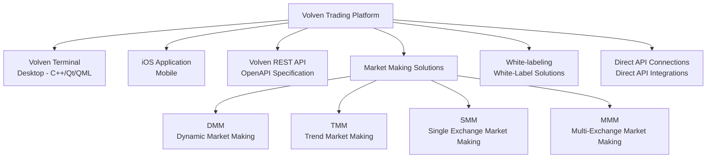
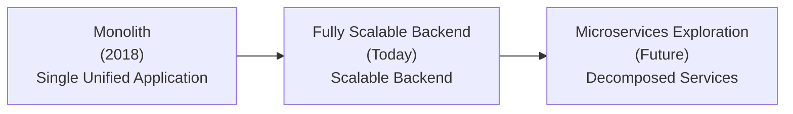
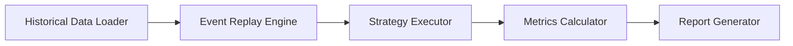
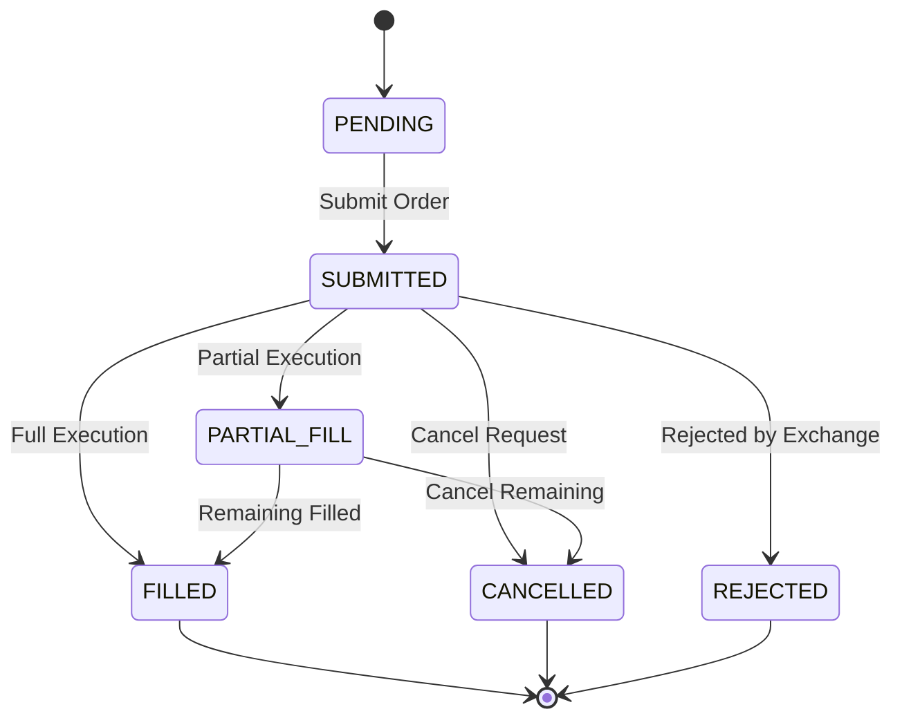
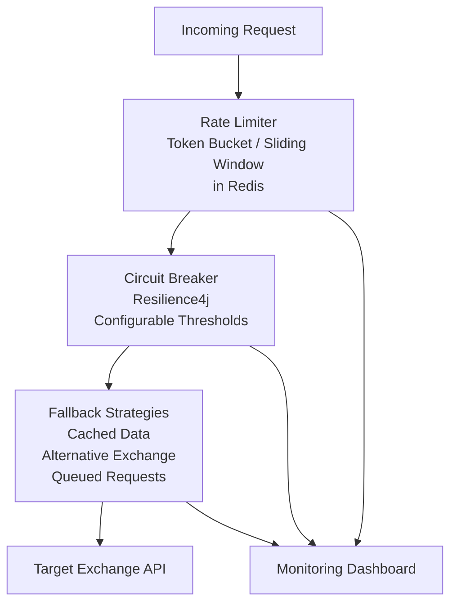

# Portfolio Preparation Guide for Backend Engineer at Volven

## Table of Contents

1. [Company Overview](#part-1-company-overview)
2. [Role Analysis](#part-2-role-analysis)
3. [Portfolio Project Recommendations](#part-3-portfolio-project-recommendations)
4. [Ranking & Gap Analysis](#part-4-ranking--gap-analysis)

---

## Part 1: Company Overview

### 1.1 Company Profile

Volven AS is a Norwegian fintech[^1] company headquartered in Oslo and founded in 2017. The company operates an algorithmic cryptocurrency[^2] trading platform designed for the crypto market. Volven serves two primary customer segments: individual retail traders and financial institutions that require market making[^3] and white-labeling[^4] solutions.

Volven was founded by Filip Berg-Nielsen, a professional with more than 25 years of experience in traditional finance. Before founding Volven, Berg-Nielsen worked as an HFT[^5] market maker[^6] at Carnegie and First Securities[^7]. Volven’s CTO, Grzegorz Tekiela, has more than 10 years of software engineering experience and a Master’s degree in Computer Science from the Silesian University of Technology. Tekiela’s LinkedIn profile indicates that he is a systems architect who leads the company’s technical development[^8].

The company had approximately 35 employees in 2024, with operational presence in Norway and Poland[^9]. Total funding raised has reached roughly USD 9 million, including a USD 2 million round in 2020 and a USD 7 million round in 2021[^10]. Volven has received a VCS[^11] license from Finanstilsynet[^12], Norway’s financial supervisory authority, and operates a subsidiary named Volven Broker AS[^13].

### 1.2 Products and Services

Volven offers a comprehensive product ecosystem for algorithmic cryptocurrency trading[^14]:

- **Volven Terminal**: A desktop application built with the C++[^15]/Qt[^16]/QML[^17] stack, serving as the company’s core product for algorithmic trading.
- **iOS Application**: A mobile trading application for cryptocurrency markets.
- **Volven REST API[^18]**: A public API with an OpenAPI[^19] specification, including Strategy API[^20] endpoints such as `POST /strategy-orchestrator/strategies/action/create` for managing trading strategies.
- **Market Making Solutions**: Institutional market making[^3] products, including DMM[^21] (Dynamic Market Making), TMM[^22] (Trend Market Making), SMM[^23] (Single Exchange Market Making), and MMM[^24] (Multi-Exchange Market Making).
- **White-labeling[^4]**: White-label solutions for institutions that want to adopt Volven’s trading infrastructure under their own brand.
- **Direct API Connections**: Direct API[^18] integrations for institutional clients.

**Volven Product Ecosystem Diagram:**

### 1.3 Trading Strategies and Algorithms

Volven operates a broad portfolio of trading strategies[^25]:

| Category | Strategy | Description |
|----------|----------|-------------|
| TWAP[^26] Variants | TWAP, TARB[^27], Slicer | Time-Weighted Average Price variants with arbitrage and short-term adaptations |
| Smart Orders | SMO[^28], ALO[^29] | Smart Order (dynamic price tracking) and Advanced Limit Order |
| Trend | Bull Trader, Bear Trader | Market-trend-based strategies |
| Market Making | Drive, Trend, Single/Multi Exchange | Multiple market-making[^3] variants |
| Risk Management | Cobra | Auto take profit and stop loss (still under development) |
| AI/ML | Gen 4 Neural Networks[^138] | Self-learning[^140] algorithms based on fourth-generation neural networks[^138] |

All strategies support SPOT[^30] and FUTURES[^31] trading.

### 1.4 Infrastructure and Volume

Volven connects to major exchanges including Binance (BIN), Bybit (BYB), OKX, Crypto.com (CRYPTO), Interactive Brokers (IB), and TYR Markets (VB)[^32]. The company has reported trading volume[^221] of more than USD 2 billion in 2022 and processes more than 500,000 trade orders per month[^33]. Its infrastructure claims 99.9% uptime with 0.1 millisecond latency[^105] on co-located[^34] servers near exchanges[^35].

### 1.5 Tech Stack[^36]

The following is a structured analysis of Volven’s tech stack[^36] based on confirmed data and reasonable inference:

**Confirmed Facts** (based on employee LinkedIn profiles, Qt[^17] case studies, and company posts):

| Component | Technology | Source |
|----------|-----------|--------|
| Desktop Frontend | C++[^15], Qt[^16]/QML[^17] | Qt case study, LinkedIn profiles |
| Primary Backend | Java[^37], Spring Boot[^38] | Engineer LinkedIn profile |
| Event-Driven Layer | Spring Cloud Stream[^39] | LinkedIn profile |
| Cloud Framework | Spring Cloud[^40] | LinkedIn profile |
| Relational Database | MySQL[^41] | LinkedIn profile |
| NoSQL Database | Cassandra[^42] | LinkedIn profile |
| Time-Series Database[^174] | InfluxDB[^43] | LinkedIn profile |
| Monitoring | New Relic | LinkedIn profile |
| API[^18] | REST[^18], OpenAPI[^19], JSON[^44] | Public API specification |
| Marketing CMS | WordPress[^45] | Website analysis |
| UI Design | Figma[^46] | Internal information |

**Reasonable Inference** (based on the domain and industry patterns):

| Component | Likely Technology | Rationale |
|----------|-------------------|-----------|
| Co-located[^34] Infrastructure | Bare-metal servers / colocation[^34] | A 0.1ms latency[^105] claim is difficult to achieve on public cloud |
| Message Broker | Apache Kafka[^47] or RabbitMQ[^48] | Required for event-driven architecture[^49] with Spring Cloud Stream[^39] |
| Caching | Redis[^50] | Standard for real-time market data |
| Container Orchestration | Docker[^51] / Kubernetes[^52] | Useful for microservices[^53] exploration |
| CI/CD[^54] | Jenkins[^55] or GitLab CI[^56] | Standard for Java[^37] backend teams |
| API Gateway[^57] | Spring Cloud Gateway[^58] or Zuul[^59] | Part of the Spring Cloud[^40] ecosystem |

### 1.6 Engineering Culture

Volven has a strong high-frequency trading (HFT[^5]) DNA. The company is built by professional traders for traders, which means that every technical decision is shaped by real-world performance and reliability requirements[^60]. The target of 0.1 millisecond latency[^105] and the fact that the business runs 24/7 indicate that availability and performance are not marketing slogans, but actual business requirements.

The company motto, “People are not our most important asset. The right people are,” suggests a selective hiring culture that values culture fit[^61] and proven technical ability[^62]. A small team of roughly 35 people with high business impact means that each engineer is expected to operate with substantial autonomy and independence.

LinkedIn culture ratings show work-life balance at 4.3/5 and compensation at 4.3/5, while company culture is rated 2.7/5[^63]. The lower culture score may indicate a demanding environment, which is consistent with a 24/7 high-frequency trading business.

### 1.7 Domain-Specific Backend Challenges

1. **Ultra-Low Latency[^105]**: Every millisecond matters. The backend must process and respond to orders in sub-millisecond time.
2. **24/7 Availability**: Crypto markets never close. The system must handle downtime without service disruption.
3. **Data Consistency**: In trading, inconsistencies between internal systems and exchanges can directly cause financial loss.
4. **Security and Regulation**: As a Finanstilsynet[^12]-licensed entity, Volven must comply with strict security and reporting standards.
5. **Strategy Scalability**: Adding new strategies or exchanges must not require major architectural refactoring.
6. **Order Integrity**: Orders must be processed exactly once—no duplicates, no missing orders, and no double execution.

---

## Part 2: Role Analysis

### 2.1 Likely Responsibilities

Based on Volven’s architectural evolution from a monolith[^64] in 2018 to a “fully scalable[^65] backend” today, and its exploration of microservices[^53], a Backend Engineer at Volven is likely responsible for[^64]:

- **Backend Development and Maintenance**: Building, testing, and maintaining Java[^37]/Spring Boot[^38] backend services that process trade orders.
- **Architectural Evolution**: Contributing to the transition from a monolith[^64] to a more modular and scalable[^65] architecture, including service decomposition[^66].
- **Exchange Integration**: Developing and maintaining connections to multiple cryptocurrency[^2] exchanges (Binance, Bybit, OKX, etc.) via REST API[^18] and WebSocket[^67].
- **Performance and Optimization**: Optimizing code to meet ultra-low latency[^105] targets through profiling, caching[^50], and database tuning.
- **Event-Driven Systems**: Building event-based systems with Spring Cloud Stream[^39] for inter-service communication.
- **Security**: Implementing encryption, authentication, and access control in line with financial regulations.
- **Monitoring and Observability**: Using New Relic to monitor system health and respond to incidents in real time.
- **High-Quality Code Delivery**: Writing code that is maintainable, testable, and safe to deploy.

### 2.2 Required Technical Skills

| Category | Required Skill | Importance |
|----------|----------------|------------|
| Programming Languages | Java[^37] (primary), C++[^15] (for performance-critical components) | Critical |
| Frameworks | Spring Boot[^38], Spring Cloud[^40], Spring Cloud Stream[^39] | Critical |
| Databases | MySQL[^41] (relational), Cassandra[^42] (NoSQL), InfluxDB[^43] (time-series[^174]) | High |
| Architecture | Microservices[^53], Event-Driven Architecture[^49], Domain-Driven Design[^74] | High |
| Protocols | REST API[^18], WebSocket[^67], gRPC[^68] (likely) | High |
| DevOps | Docker[^51], Kubernetes[^52], CI/CD[^54] pipelines | Medium-High |
| Security | OAuth2[^69], JWT[^70], data encryption, secure coding practices | High |
| Trading Domain | Understanding of crypto markets, order types[^218], market data feeds[^120] | Medium-High |
| Monitoring | New Relic, logging frameworks, alerting systems | Medium |

### 2.3 Architectural Expectations

Volven is in an interesting architectural transition. In 2018, its backend was a monolith[^64]. Today, it has a “fully scalable[^65] backend” and is exploring microservices[^53][^71]. For a Backend Engineer, this implies:

**Volven Architecture Evolution Diagram:**

- **Monolith Understanding[^64]**: The ability to work inside an existing monolithic codebase without destabilizing the system.
- **Microservices Understanding[^53]**: The ability to design properly decomposed services with clear domain boundaries.
- **Event-Driven Patterns**: Deep familiarity with asynchronous messaging[^225], event sourcing[^72], and CQRS[^73] for inter-service communication.
- **Legacy Awareness[^75]**: The ability to respect legacy code while driving modernization[^75] incrementally.

### 2.4 Scalability, Security, and Reliability Requirements

**Scalability**: With 500K+ orders per month and USD 2B+ in volume, the system must absorb sudden traffic spikes—such as those caused by market volatility[^160]—without performance degradation. Horizontal scaling[^76] via microservices[^53] and message queues is essential.

**Reliability**: 99.9% uptime means a maximum of 8.76 hours of downtime per year. For a 24/7 trading platform, that includes planned maintenance. Every outage potentially creates losses for clients. High availability[^77] (HA[^77]) patterns such as active-active deployment[^78], automatic failover[^79], and data replication[^80] are mandatory.

**Security**: As a Finanstilsynet[^12]-licensed entity, Volven must comply with European financial security standards. This includes at-rest encryption[^81] and in-transit encryption[^82], multi-factor authentication, a complete audit trail[^175], periodic third-party penetration testing[^83], and incident response capability.

### 2.5 Communication Skills

In a small team with diverse backgrounds, communication is mandatory. Volven likely seeks engineers who can[^63]:

- Document architectural decisions clearly.
- Communicate effectively with cross-functional teams (trading, research, operations).
- Participate constructively in code review.
- Write self-documenting[^84] code.
- Provide realistic estimates and manage expectations.

### 2.6 Desired Engineer Profile

Given the “right people” culture and the high-frequency trading DNA, Volven is likely looking for an engineer who:

- Cares deeply about performance rather than accepting “good enough.”
- Can work autonomously in a demanding environment.
- Understands the real consequences of bugs in financial systems.
- Is willing to learn the trading domain even without prior specialization.
- Thinks systematically about failure modes[^85] and edge cases[^86].
- Takes responsibility for code that reaches production.

---

## Part 3: Portfolio Project Recommendations

### Project 1: Low-Latency Order Processing Engine

- **Project Name**: OrderMatch -- Low-Latency Order Matching Engine
- **Why It Matters**: Volven processes 500K+ orders per month with a 0.1ms latency[^105] target. Understanding how to build an efficient order matching engine is foundational to its trading operations.
- **Backend Concepts Demonstrated**: Lock-free[^89] data structures, memory-efficient order book[^87] management, non-blocking I/O[^90], latency[^105] profiling, zero-copy[^91] data transfer, and batch processing[^92] for high throughput[^221].
- **Recommended Architecture**: An event-sourced[^72] architecture with an in-memory order book[^87]. Use a ring buffer[^93] for incoming orders, a lock-free concurrent data structure[^94] for the order book[^87], and batch commit[^95] for throughput[^221]. Separate the networking layer from the business logic so each can evolve independently.
- **Recommended Tech Stack[^36] and Rationale**:
  - **Java[^37] (Loom/Project Loom[^97])**: Virtual threads[^96] let you handle thousands of simultaneous connections without the overhead of conventional threads.
  - **LMAX Disruptor[^98]**: An ultra-low-latency event processing framework inspired by production trading systems.
  - **JMH[^99] (Java Microbenchmark Harness)**: For accurate latency[^105] profiling and benchmarking.
  - **Chronicle Map[^100]**: A memory-mapped file[^101] solution for order book[^87] persistence without conventional I/O overhead.
- **Core Features**: Real-time bid/ask[^88] order book[^87], FIFO[^102] matching with price-time priority[^103], cancel-replace handling, partial fill[^104] support, order book[^87] snapshot and recovery, and latency[^105] measurement per order.
- **Technical Challenges**: Avoiding garbage collection[^106] pauses, handling race conditions[^107] under concurrent matching, implementing crash recovery without losing orders, and maintaining consistency under high contention[^108].
- **Common Pitfalls**: Overusing synchronized blocks[^109] (which harms parallelism[^110]), ignoring memory layout and cache coherency[^111], performing I/O in the hot path[^112], and skipping real-world benchmarking.
- **Required Knowledge**: Concurrent data structures, the Java Memory Model[^114], JMH[^99] benchmarking, memory and GC tuning, and market order book[^87] fundamentals.
- **Difficulty**: 4/5 (High)
- **Resume/Interview Value**: Very high. This demonstrates performance-critical engineering and trading-domain understanding.
- **Production-Scale Extension**: Add distributed order book[^87] replication[^80], FIX protocol[^115] connectivity, and a risk-check[^116] gateway before orders enter the matching engine.

### Project 2: Real-Time Market Data Aggregator

- **Project Name**: MarketPulse -- Real-Time Multi-Exchange Market Data Stream
- **Why It Matters**: Volven is connected to six different exchanges. Aggregating market data in real time with consistency and low latency[^105] is a core backend challenge.
- **Backend Concepts Demonstrated**: WebSocket[^67] client management, normalization across APIs[^18], fan-out pattern[^117], backpressure[^118] handling, deduplication[^119], and real-time aggregation[^169].
- **Recommended Architecture**: A multi-threaded WebSocket[^67] client pool connected to several exchanges, a data normalization layer, Kafka[^47]/RabbitMQ[^48] as a message bus[^121], and a consumer layer that publishes aggregated data. Use an event-driven architecture[^49] consistent with Volven’s Spring Cloud Stream[^39] stack.
- **Recommended Tech Stack[^36] and Rationale**:
  - **Java[^37] + Spring Boot[^38] + Spring Cloud Stream[^39]**: Consistent with Volven’s backend stack[^36].
  - **WebSocket[^67] Client (Java-WebSocket[^122] or Netty[^133])**: For streaming connections to exchanges.
  - **Apache Kafka[^47]**: A message broker for high-reliability fan-out[^117].
  - **InfluxDB[^43]**: Time-series[^174] storage for historical tick data[^128].
  - **Redis[^50]**: Cache for frequently accessed latest bid/ask[^88].
- **Core Features**: Simultaneous connections to at least three exchanges, data format normalization, tick deduplication[^119], fan-out[^117] to multiple consumers, automatic reconnection with exponential backoff[^123], and data-gap detection/recovery.
- **Technical Challenges**: Multiple exchange formats, long-lived WebSocket[^67] stability, burst handling during volatility[^160], and ensuring no data loss.
- **Common Pitfalls**: Mishandled WebSocket[^67] disconnections, parsing inside the event loop[^124], missing backpressure[^118], and ignoring exchange rate limits[^125].
- **Required Knowledge**: WebSocket[^67] protocol, crypto market data[^122], Kafka[^47] or an equivalent broker, exchange API documentation, and backpressure[^118] patterns.
- **Difficulty**: 3/5 (Medium)
- **Resume/Interview Value**: High. This shows domain understanding, multi-system integration, and familiarity with Volven’s stack[^36].
- **Production-Scale Extension**: Add a schema registry[^126], per-exchange lag monitoring, and historization in InfluxDB[^43] with tailored retention policies[^127].

### Project 3: WebSocket Trading Dashboard Backend

- **Project Name**: TradeStream -- Real-Time WebSocket Trading Dashboard Backend
- **Why It Matters**: Volven Terminal is the company’s main desktop product built with C++[^15]/Qt[^16]/QML[^17]. A backend that delivers real-time data over WebSocket[^67] is a critical component.
- **Backend Concepts Demonstrated**: WebSocket[^67] server management, pub/sub[^129] messaging, multi-client session management, efficient message serialization, and heartbeat[^130]/health-check mechanisms.
- **Recommended Architecture**: A Spring Boot[^38] application with a WebSocket[^67] endpoint (STOMP[^131] or raw WebSocket[^67]), pub/sub[^129] channels organized by topic (trading pair[^137], order updates, portfolio updates), and backend services that publish events to connected clients. Add connection pooling[^134] and per-client rate limiting[^125].
- **Recommended Tech Stack[^36] and Rationale**:
  - **Java[^37] + Spring Boot[^38] + Spring WebSocket[^135]**: A standard Java[^37] stack for WebSocket[^67] servers and aligned with Volven’s backend.
  - **STOMP over WebSocket[^136]**: Lightweight, standardized messaging, or raw WebSocket[^67] for full control.
  - **Redis[^50] Pub/Sub[^129]**: For communication between backend instances.
  - **Cassandra[^42]**: For storing historical messages queried by clients.
  - **Netty[^133] (optional)**: For higher performance if Spring WebSocket[^135] is not sufficient.
- **Core Features**: Multiple concurrent WebSocket[^67] connections, topic subscriptions, real-time push for order book[^87] changes, trade updates, and portfolio changes, heartbeat[^130], graceful disconnect handling, and message acknowledgment[^131].
- **Technical Challenges**: Scaling to thousands of WebSocket[^67] connections, delivery guarantees, reconnection synchronization, and memory management for active sessions.
- **Common Pitfalls**: Poor cleanup leading to memory leaks[^222], overly chatty protocols, lack of compression, and ignoring client reconnection logic.
- **Required Knowledge**: WebSocket[^67] protocol (RFC 6455[^137]), STOMP[^132], Spring WebSocket[^135], connection management, and real-time client-server communication.
- **Difficulty**: 3/5 (Medium)
- **Resume/Interview Value**: High. Very relevant to Volven Terminal and real-time systems.
- **Production-Scale Extension**: Add a WebSocket[^67] gateway cluster with sticky sessions, a binary protocol for lower bandwidth, and a client-side SDK[^138].

### Project 4: Algorithmic Trading Strategy Backtesting Engine

- **Project Name**: StrategyLab -- Backtesting Engine[^139] for Algorithmic Trading Strategies[^219]
- **Why It Matters**: Volven operates multiple algorithmic strategies[^219] and is developing Gen 4 self-learning[^140] neural networks[^138]. A backtesting[^139] engine is essential for validating strategies before production deployment.
- **Backend Concepts Demonstrated**: Historical data pipelines, event replay[^190], parallel strategy execution, statistical analysis (Sharpe ratio[^141], max drawdown[^142], win rate[^143]), and result reporting.
- **Recommended Architecture**: A pipeline architecture:

Historical data loader -> event replay engine -> strategy executor -> metrics calculator -> report generator. Run strategies in an isolated environment with a simulated order book[^87]. Support parallel backtests[^139] across multiple parameter sets.

- **Recommended Tech Stack[^36] and Rationale**:
  - **Java[^37] + Spring Boot[^38]**: For orchestration and API[^18] delivery.
  - **InfluxDB[^43]**: For historical market data[^120] and time-series[^174] queries.
  - **MySQL[^41]**: For strategy configuration and backtest[^139] results.
  - **Cassandra[^42]**: For very large historical tick data[^128].
  - **JUnit[^154] + TestContainers[^155]**: For isolated strategy testing in containers.
  - **WebSocket[^67] (optional)**: For real-time progress updates during runs.
- **Core Features**: Load historical candle[^145]/tick[^128] data, replay events chronologically, simulate order execution (including slippage[^146] and fill simulation[^147]), compute metrics, support multiple timeframes, and export results in standard formats.
- **Technical Challenges**: Handling years of tick data[^128], ensuring deterministic replays, realistic market simulation (spread[^157], depth[^158], latency[^105]), and safe parallel execution.
- **Common Pitfalls**: Survivorship bias[^148], look-ahead bias[^149], overfitting[^150], and poor handling of data gaps[^156].
- **Required Knowledge**: Trading and order execution, financial metrics, time-series[^174] data management, pipeline design, and parallel computing.
- **Difficulty**: 4/5 (High)
- **Resume/Interview Value**: Very high. Demonstrates deep trading-domain understanding and analytical system design.
- **Production-Scale Extension**: Add walk-forward optimization[^151], Monte Carlo simulation[^152] for risk analysis, and integration with paper trading[^153].

### Project 5: Multi-Exchange API Gateway

- **Project Name**: ExchangeHub -- Multi-Exchange API Gateway[^57]
- **Why It Matters**: Volven connects to six exchanges with heterogeneous APIs[^18]. Managing connections, authentication, rate limiting[^125], and data normalization in one gateway is a real architectural challenge.
- **Backend Concepts Demonstrated**: API gateway pattern[^160], adapter pattern[^161], per-exchange rate limiting[^125], circuit breaker[^162] pattern, request/response transformation, and centralized authentication management.
- **Recommended Architecture**: A facade pattern[^163] with one adapter[^161] per exchange. Each adapter[^161] handles exchange-specific authentication, request/response formats, and rate limiting[^125]. The gateway[^57] exposes a unified API[^18] for the rest of the backend. Use a circuit breaker[^162] for problematic exchanges.
- **Recommended Tech Stack[^36] and Rationale**:
  - **Java[^37] + Spring Boot[^38] + Spring Cloud Gateway[^58]**: Consistent with Volven’s stack[^36].
  - **Resilience4j[^164]**: For circuit breaker[^162], rate limiter, and retry support.
  - **MySQL[^41]**: For exchange configuration and rate-limit settings.
  - **Redis[^50]**: For distributed rate-limiting[^125] state and session caching.
  - **Spring Cloud Stream[^39]**: For circuit-breaker and rate-limit notifications.
- **Core Features**: Unified API[^18] access, per-exchange rate limits[^125], circuit breaker[^162] with fallback[^170], request signing[^166] for exchanges that require it (HMAC[^167], API key management), response normalization, and full request logging for audit[^175].
- **Technical Challenges**: Different exchange specs, rate limits[^125], and authentication schemes; all must be abstracted without sacrificing exchange-specific capabilities.
- **Common Pitfalls**: Over-abstracting away exchange-specific features, mishandling error codes, ignoring idempotency[^168] for order placement, and incorrect retries that can cause double execution[^169].
- **Required Knowledge**: API design patterns[^160], circuit breaker[^162] and resilience patterns, REST API[^18] best practices, HMAC[^167] signing[^166], and at least 2–3 major crypto exchange APIs.
- **Difficulty**: 4/5 (High)
- **Resume/Interview Value**: Very high. This is infrastructure directly supporting Volven’s trading operations.
- **Production-Scale Extension**: Add smart routing based on liquidity and latency[^105], auto-detection of API[^18] changes, and a self-healing circuit breaker[^162] with adaptive thresholds.

### Project 6: Real-Time P&L Calculation Engine

- **Project Name**: ProfitCalc -- Real-Time Profit and Loss Calculation Engine
- **Why It Matters**: Real-time P&L is essential for any trading platform. Volven’s retail and institutional clients need accurate, up-to-date P&L for decision-making and risk management[^1][^14].
- **Backend Concepts Demonstrated**: Event sourcing[^72] for trade history, real-time aggregation[^169], incremental calculation patterns, concurrent processing, and numerical accuracy in floating-point arithmetic[^172].
- **Recommended Architecture**: An event-sourced[^72] architecture where trade events are appended to a store[^179]. The P&L calculator consumes events incrementally instead of recomputing from scratch. Separate realized P&L (closed positions) and unrealized P&L (open positions), with tick-based updates for unrealized values.
- **Recommended Tech Stack[^36] and Rationale**:
  - **Java[^37] + Spring Boot[^38]**: Consistent with Volven’s stack[^36].
  - **InfluxDB[^43]**: For historical P&L time-series[^174].
  - **Redis[^50]**: For queryable real-time P&L state.
  - **Cassandra[^42]**: For long-term trade-history storage.
  - **Spring Cloud Stream[^39]**: For real-time trade-event consumption.
  - **BigDecimal[^171] (Java[^37])**: For precision in financial calculations[^173]—do not use float/double for money.
- **Core Features**: Realized P&L per trade and cumulative, unrealized P&L based on current market price, P&L by strategy, exchange, and trading pair[^137], fee breakdowns, daily/weekly/monthly aggregation[^169], and report exports.
- **Technical Challenges**: Floating-point arithmetic[^172] correctness, consistency during replays or reconnections, and performance for portfolios with thousands of open positions.
- **Common Pitfalls**: Using `double` for money, ignoring hidden costs (funding fees, spread[^157]), and mishandling edge cases[^86] such as partial fills[^104] and cancels.
- **Required Knowledge**: Basic accounting principles, financial mathematics[^173], BigDecimal[^171] best practices, event sourcing[^72], and time-series[^174] analysis.
- **Difficulty**: 3/5 (Medium)
- **Resume/Interview Value**: High. Demonstrates financial accuracy and real-time system design.
- **Production-Scale Extension**: Add tax-lot tracking, multi-currency P&L with real-time FX rates, and integration with regulatory reporting systems.

### Project 7: Event-Driven Order Management System

- **Project Name**: OrderFlow -- Event-Driven Order Management System (OMS)
- **Why It Matters**: Volven uses an event-driven architecture[^49] with Spring Cloud Stream[^39][^9]. A robust order management layer is the heart of any trading system. An event-driven OMS ensures that every order-state change is auditable and can be processed asynchronously[^225].
- **Backend Concepts Demonstrated**: Event sourcing[^72], CQRS[^73], saga pattern[^176] for distributed transactions, state machine[^177] design for order lifecycle, and idempotency[^168] handling.
- **Recommended Architecture**: A CQRS[^73] design with a write model that processes commands (place, cancel, modify) and a read model that serves queries. A state machine[^177] manages order lifecycle:

**Order Lifecycle State Machine Diagram:**

Use an event store[^179] for persistence and separate read-optimized projections[^178].

- **Recommended Tech Stack[^36] and Rationale**:
  - **Java[^37] + Spring Boot[^38] + Spring Cloud Stream[^39]**: Consistent with Volven’s stack[^36], and Spring Cloud Stream[^39] simplifies event-driven[^49] implementation.
  - **MySQL[^41]**: For the write model (event store[^179]) and read model (projections[^178]).
  - **Kafka[^47]**: For a reliable event bus.
  - **Redis[^50]**: For order book[^87] state caching.
  - **JUnit[^154] + Testcontainers[^155]**: For end-to-end testing with Kafka[^47].
- **Core Features**: Full order lifecycle management, event replay[^190] for debugging, a valid order state machine[^177], idempotency[^168] handling, order modification and cancellation support, and a complete audit trail[^175] for every state change.
- **Technical Challenges**: Correct idempotency[^168] to prevent double execution[^169], distributed transactions between OMS and exchange gateway, and consistency between write and read models[^178].
- **Common Pitfalls**: Event ordering[^180] issues, unhandled concurrent commands on the same order, and overusing event sourcing[^72] for simple CRUD.
- **Required Knowledge**: Event sourcing[^72], CQRS[^73], saga/orchestration patterns[^176], state machine[^177] design, idempotency[^168], and Spring Cloud Stream[^39].
- **Difficulty**: 4/5 (High)
- **Resume/Interview Value**: Very high. Directly applicable to Volven’s move toward event-driven[^49] microservices[^53].
- **Production-Scale Extension**: Add event versioning for schema evolution[^181], dead-letter queue[^182] handling, and cross-shard[^183] order routing.

### Project 8: Rate Limiter and Circuit Breaker for Exchange APIs

- **Project Name**: ResilientConnect -- Rate Limiting[^125] and Circuit Breaker[^162] System
- **Why It Matters**: Every cryptocurrency exchange[^2] has different rate limits[^125]. Binance, for example, has a REST API[^18] limit of 1,200 requests per minute, while other exchanges may be lower or higher. Volven must manage those constraints while still processing 500K+ orders per month[^32][^33].
- **Backend Concepts Demonstrated**: Token bucket[^184] rate limiting, sliding window[^185] algorithms, circuit breaker[^162] states (closed/open/half-open), adaptive rate limiting[^186], health monitoring, and graceful degradation[^170].
- **Recommended Architecture**: A layered resilience design:

(1) Per-exchange rate limiting[^125] using token bucket[^184] or sliding window[^185] in Redis[^50], (2) a circuit breaker[^162] implemented with Resilience4j[^164], (3) fallback[^170] strategies such as cached data, alternative exchanges, or queued requests, and (4) a monitoring dashboard for connection health.

- **Recommended Tech Stack[^36] and Rationale**:
  - **Java[^37] + Spring Boot[^38]**: Consistent with Volven’s stack[^36].
  - **Resilience4j[^164]**: Modern Java[^37] resilience library including circuit breaker[^162], rate limiter, bulkhead[^187], and retry.
  - **Redis[^50]**: For distributed[^189] rate-limiting[^125] state.
  - **Spring Cloud Stream[^39]**: For circuit-breaker notifications.
  - **New Relic (integration point)**: For circuit-breaker and rate-limiter metrics.
- **Core Features**: Per-exchange configurable rate limits, circuit breaker[^162] auto-recovery, adaptive rate limiting[^186], fallback[^170] strategies, a real-time health dashboard, and alerts when rate limits[^125] are exhausted.
- **Technical Challenges**: Accurate rate limiting[^125] in distributed[^189] environments, tuning circuit-breaker[^162] thresholds correctly, and handling situations where all exchanges fail simultaneously.
- **Common Pitfalls**: Overly conservative rate limiting[^125], overly sensitive circuit breakers[^162], ignoring clock skew[^188] in distributed[^189] systems, and failing to distinguish read vs. write endpoint limits.
- **Required Knowledge**: Resilience patterns, Redis[^50] programming, distributed[^189] systems, and basic networking.
- **Difficulty**: 3/5 (Medium)
- **Resume/Interview Value**: High. This shows resilience engineering, which is critical in 24/7 trading systems.
- **Production-Scale Extension**: Add machine-learning-based adaptive rate limiting[^186], predictive circuit breaking[^162], and cross-exchange load balancing.

### Project 9: Audit Trail and Trade Compliance Logging System

- **Project Name**: AuditChain -- Trade Compliance and Audit Trail[^175] System
- **Why It Matters**: As a Finanstilsynet[^12]-licensed entity, Volven must maintain a complete audit trail[^175] for every trading activity[^13]. This is not optional; it is a regulatory requirement. Every order, cancellation, modification, and system event must be traceable.
- **Backend Concepts Demonstrated**: Immutable event logging[^191], append-only storage[^192], log aggregation[^193], structured logging[^194], compliance reporting[^195], and data retention policies[^127].
- **Recommended Architecture**: An immutable event log[^191] with write-through to multiple storage tiers: hot storage[^196] for fast queries and cold storage[^197] for compliance. Tag every event with timestamp, user ID, order ID, and metadata. Use structured logging[^194] to make querying and reporting easier.
- **Recommended Tech Stack[^36] and Rationale**:
  - **Java[^37] + Spring Boot[^38] + Spring AOP[^198]**: AOP[^199] allows cross-cutting concerns[^224] such as logging without adding boilerplate[^223] to business logic.
  - **Cassandra[^42]**: Append-only[^192], immutable storage well suited for audit trail[^175] workloads.
  - **MySQL[^41]**: For metadata and reporting queries that need joins.
  - **ELK Stack[^200] (Elasticsearch[^201], Logstash[^202], Kibana[^203])**: For log aggregation[^193], search, and visualization.
  - **Spring Cloud Stream[^39]**: For asynchronous[^225] logging events so order processing latency[^105] is unaffected.
- **Core Features**: Immutable logs for every trade action, structured logging[^194], searchable audit trails, compliance report generation (daily, weekly, monthly), and retention management with GDPR[^204] compliance.
- **Technical Challenges**: Writing audit logs without affecting order-processing latency[^105], keeping audit logs synchronized with actual state, and handling high-volume logs during volatile[^160] periods.
- **Common Pitfalls**: Synchronous logging in the hot path[^112], missing log correlation across microservices[^53], inconsistent formats, and no anti-tampering[^207] mechanism.
- **Required Knowledge**: Logging best practices, Cassandra[^42] modeling, Spring AOP[^198], financial compliance requirements (MiFID II[^205], AML[^206]), and GDPR[^204].
- **Difficulty**: 3/5 (Medium)
- **Resume/Interview Value**: High. Shows regulatory awareness and production-grade compliance thinking.
- **Production-Scale Extension**: Add a cryptographic hash chain for anti-tampering[^207], integration with regulatory reporting APIs[^18], and automated anomaly detection on audit logs[^175].

### Project 10: Time-Series Analytics Engine for Trading Metrics

- **Project Name**: TradeMetrics -- Time-Series[^174] Analytics Engine for Trading Metrics
- **Why It Matters**: Volven claims 99.9% uptime and 0.1ms latency[^105]. Monitoring and analyzing these metrics in real time requires a time-series[^174] analytics engine capable of handling large data volumes. Trading strategies also require historical performance analysis for optimization.
- **Backend Concepts Demonstrated**: Time-series[^174] ingestion, downsampling[^208], continuous aggregation[^209], alerting rules, and dashboard-ready query APIs[^18].
- **Recommended Architecture**: An ingestion pipeline from multiple metrics[^212] sources (latency[^105], throughput[^221], error rates, trading volume) into InfluxDB[^43]. Continuous aggregation[^209] jobs for downsampling[^208] (raw -> per-minute -> per-hour -> per-day). An alerting engine checks thresholds and triggers notifications. A query API[^18] serves dashboard consumption.
- **Recommended Tech Stack[^36] and Rationale**:
  - **Java[^37] + Spring Boot[^38]**: For APIs[^18] and orchestration.
  - **InfluxDB[^43]**: A time-series[^174] database already used by Volven and purpose-built for trading metrics[^212].
  - **Spring Cloud Stream[^39]**: For consuming metrics[^212] events from other services.
  - **Cassandra[^42]**: For long-term storage with high retention.
  - **New Relic (integration)**: To correlate internal metrics[^212] with application performance.
  - **Grafana (optional)**: For dashboard visualization.
- **Core Features**: Ingestion APIs[^18] for multiple metric types, downsampling[^208] pipelines (1s -> 1m -> 1h), continuous aggregation[^209] functions (avg, p50, p95, p99, max, min), configurable alerts, and a REST API[^18] for querying metrics[^212].
- **Technical Challenges**: Burst ingestion under high load, multiple retention policies[^127] by resolution, and query performance for large time ranges.
- **Common Pitfalls**: Storing everything at maximum resolution forever, skipping downsampling[^208], and ignoring high cardinality[^210] in time-series[^174] data.
- **Required Knowledge**: Time-series[^174] database concepts, InfluxDB[^43] internals, metrics[^212] collection patterns (pull vs push[^213]), and basic statistical aggregation.
- **Difficulty**: 3/5 (Medium)
- **Resume/Interview Value**: High. Shows observability infrastructure skills that are critical for 24/7 operations.
- **Production-Scale Extension**: Add machine-learning anomaly detection, predictive alerting, and capacity planning based on historical growth patterns.

---

## Part 4: Ranking & Gap Analysis

### 4.1 Project Ranking by Interview Impact

| Rank | Project | Interview Impact | Reason |
|------|---------|------------------|--------|
| 1 | OrderMatch (Low-Latency Order Processing) | Highest | Core Volven competency; performance and domain knowledge |
| 2 | OrderFlow (Event-Driven OMS) | Highest | Directly applicable to Volven’s architecture; advanced patterns |
| 3 | ExchangeHub (Multi-Exchange API Gateway) | High | Critical infrastructure; resilience engineering |
| 4 | StrategyLab (Backtesting Engine) | High | Deep domain relevance; analytics capabilities |
| 5 | MarketPulse (Market Data Aggregator) | High | Core data pipeline; real-time processing |
| 6 | TradeStream (WebSocket Dashboard Backend) | Medium-High | Relevant to Volven Terminal; real-time skills |
| 7 | ProfitCalc (P&L Engine) | Medium-High | Financial accuracy; real-time aggregation |
| 8 | ResilientConnect (Rate Limiter/Circuit Breaker) | Medium-High | Resilience patterns; directly applicable |
| 9 | AuditChain (Audit Trail System) | Medium | Compliance awareness; structured logging |
| 10 | TradeMetrics (Time-Series Analytics) | Medium | Observability and monitoring infrastructure |

### 4.2 Job Requirements vs. Portfolio Matrix

| Job Requirement | Covered By |
|-----------------|------------|
| Java / Spring Boot | All projects (1-10) |
| Event-Driven Architecture | OrderFlow (7), MarketPulse (2), AuditChain (9), TradeMetrics (10) |
| Low Latency / Performance | OrderMatch (1), MarketPulse (2), ProfitCalc (6) |
| Microservices | ExchangeHub (5), OrderFlow (7), ResilientConnect (8) |
| Real-Time Processing | MarketPulse (2), TradeStream (3), ProfitCalc (6) |
| Multi-Exchange Integration | ExchangeHub (5), MarketPulse (2) |
| WebSocket / Streaming | TradeStream (3), MarketPulse (2) |
| Time-Series Data (InfluxDB) | TradeMetrics (10), StrategyLab (4), ProfitCalc (6) |
| NoSQL (Cassandra) | MarketPulse (2), AuditChain (9), TradeMetrics (10) |
| Relational DB (MySQL) | OrderMatch (1), ExchangeHub (5), OrderFlow (7) |
| Circuit Breaker / Resilience | ResilientConnect (8), ExchangeHub (5) |
| Trading / Financial Domain | OrderMatch (1), StrategyLab (4), ProfitCalc (6) |
| Security / Compliance | AuditChain (9), ExchangeHub (5) |
| Monitoring / Observability | TradeMetrics (10), ResilientConnect (8) |

### 4.3 Remaining Skill Gaps and How to Close Them

| Skill Gap | Closing Strategy |
|-----------|------------------|
| C++ / Qt / QML | Build a simple trading chart component in C++/Qt. It does not need to be as complex as Volven Terminal—just a WebSocket[^67] client plus chart rendering to demonstrate C++[^15]. |
| Kubernetes[^52] / Container Orchestration | Deploy at least 2–3 portfolio projects to a Kubernetes[^52] cluster (Minikube[^220] or a cloud free tier). Document the deployment architecture. |
| Kafka[^47] / Deep Message Broker Knowledge | Add Kafka[^47] to MarketPulse or OrderFlow. Focus on partitioning strategy[^215], consumer groups[^214], and exactly-once semantics[^213]. |
| C++[^15] for Performance-Critical Backend | As a bonus, implement a small component (for example, an order book[^87]) in C++[^15] and call it from Java[^37] via JNI[^216] or REST[^18]. |
| Deep Trading Knowledge | Learn market microstructure[^217], order types[^218] (limit, market, stop, iceberg), and cryptocurrency[^2] market mechanics. Take an online algorithmic trading[^219] course. |
| GDPR[^204] and European Financial Regulation | Study GDPR[^204], MiFID II[^205] trade-reporting requirements, and AML[^206] requirements. Document your understanding in the portfolio. |

### 4.4 Execution Priority

**Phase 1 (High Priority — first 4 weeks):**
1. OrderMatch (Low-Latency Order Processing) — main showcase piece
2. ExchangeHub (Multi-Exchange API Gateway) — strong infrastructure piece
3. OrderFlow (Event-Driven OMS) — architectural thinking demonstration

**Phase 2 (Medium Priority — weeks 5–8):**
4. StrategyLab (Backtesting Engine) — domain knowledge demonstration
5. MarketPulse (Market Data Aggregator) — real-time skills
6. ResilientConnect (Rate Limiter/Circuit Breaker) — resilience patterns

**Phase 3 (Supporting Priority — weeks 9–12):**
7. TradeStream (WebSocket Dashboard Backend)
8. ProfitCalc (P&L Engine)
9. AuditChain (Audit Trail System)
10. TradeMetrics (Time-Series Analytics)

**Portfolio Execution Gantt Diagram:**

### 4.5 Portfolio Presentation Tips

1. Create a professional README for each project explaining the problem, solution, and trade-offs. Recruiters will read the README and code structure more than they will run the code.
2. Include architecture diagrams (Mermaid, PlantUML, or draw.io). Volven values engineers who can communicate architecture visually.
3. Document trade-offs: explain why you chose a specific technology, what alternatives you considered, and why you made the final decision.
4. Demonstrate production readiness: proper error handling, configuration management, and test coverage. Volven operates 24/7 and values robust systems.
5. Tie each project back to Volven: every README should include a section explaining how the project maps to Volven’s specific challenges.
6. Use a relevant tech stack[^36]: the more projects that use Java[^37]/Spring Boot[^38]/InfluxDB[^43]—the stack[^36] Volven uses—the more coherent your narrative becomes.
7. Prepare for deep dives: recruiters may ask about specific implementation details, so be able to explain every critical line of code.

---

## Footnotes

[^1]: fintech = financial technology, an industry that combines financial services with information technology.
[^2]: cryptocurrency = digital currency that uses cryptography to secure transactions.
[^3]: market making = a trading strategy that simultaneously quotes buy (bid) and sell (ask) prices to provide liquidity.
[^4]: white-labeling = a solution that allows another party to use Volven’s infrastructure under its own brand.
[^5]: HFT = High-Frequency Trading, a form of trading that uses high-speed computers to execute orders in very short timeframes.
[^6]: market maker = an entity that provides liquidity by continuously quoting both buy and sell prices.
[^7]: Volven.io -- Official Website. Company products and services.
[^8]: Filip Berg-Nielsen LinkedIn Profile. Experience at Carnegie and First Securities as an HFT market maker.
[^9]: Grzegorz Tekiela LinkedIn Profile. Volven CTO, systems architect, 10+ years of experience.
[^10]: Company data from Crunchbase, Lusha, and Prospeo.
[^11]: Volven funding from investment sources and Crunchbase.
[^12]: VCS = Virtual Currency Service, the license required to operate crypto services in Norway.
[^13]: Finanstilsynet = Norway’s Financial Supervisory Authority.
[^14]: Volven.io - Official Website. Company products and services.
[^15]: Volven.io - Product pages and Volven REST API documentation.
[^16]: C++ = a high-performance programming language used for systems that require maximum execution speed.
[^17]: Qt = a cross-platform application development framework for desktop, mobile, and embedded systems.
[^18]: QML = Qt Meta Language, a declarative language for designing user interfaces in the Qt framework.
[^19]: REST API = Representational State Transfer Application Programming Interface, a web-service architecture based on HTTP.
[^20]: OpenAPI = a standard specification for formally describing and documenting REST APIs.
[^21]: Strategy API = an API for managing and controlling algorithmic trading strategies.
[^22]: DMM = Dynamic Market Making, a market-making strategy that adjusts prices dynamically based on market conditions.
[^23]: TMM = Trend Market Making, a market-making strategy that accounts for market trends.
[^24]: SMM = Single Exchange Market Making, a market-making strategy that operates on a single exchange only.
[^25]: MMM = Multi-Exchange Market Making, a market-making strategy that operates across multiple exchanges simultaneously.
[^26]: Volven.io - Algorithm/Strategy descriptions. TWAP, TARB, Slicer, Cobra, and others.
[^27]: TWAP = Time-Weighted Average Price, a strategy that executes orders evenly over a given time period.
[^28]: TARB = Time-Weighted Average Price with Arbitrage variation, a TWAP variant used to exploit price differences between exchanges.
[^29]: SMO = Smart Order, an intelligent order that automatically tracks the best price across exchanges.
[^30]: ALO = Advanced Limit Order, an advanced limit order with automated controls.
[^31]: SPOT = direct trading of crypto assets without leverage, where the buyer owns the asset outright.
[^32]: FUTURES = crypto futures trading with leverage, allowing profit from both price increases and decreases.
[^33]: Volven.io - Connected exchanges and partnership announcements.
[^34]: Volven.io - Company metrics: USD 2B+ volume, 500K+ orders/month.
[^35]: Volven.io - Infrastructure claims: 99.9% uptime, 0.1ms latency.
[^36]: co-located / colocation = placing servers in the same data-center facility as exchange servers to reduce latency.
[^37]: tech stack = the collection of software technologies used to build and run an application.
[^38]: Java = a class-based object-oriented programming language and Volven’s primary backend language, running on the JVM.
[^39]: Spring Boot = a Java framework that simplifies building microservice-based applications with auto-configuration.
[^40]: Spring Cloud Stream = a framework for building event-driven messaging systems integrated with Apache Kafka or RabbitMQ.
[^41]: Spring Cloud = a framework ecosystem for building microservices applications in Java, including service discovery, config server, and gateway components.
[^42]: MySQL = an open-source relational database management system that uses Structured Query Language.
[^43]: Cassandra = a distributed NoSQL database designed for large-scale data with high availability.
[^44]: InfluxDB = a time-series database designed specifically for storing and querying metrics, events, and time-series data.
[^45]: JSON = JavaScript Object Notation, a lightweight text-based data exchange format that is easy for humans and machines to read.
[^46]: WordPress = an open-source content management system used for Volven’s marketing CMS.
[^47]: Figma = a cloud-based UI/UX design tool for design-team collaboration.
[^48]: Apache Kafka = a distributed data-streaming platform designed for high throughput and fault tolerance.
[^49]: RabbitMQ = a message broker that implements the AMQP protocol for service-to-service communication.
[^50]: event-driven architecture = a software architecture in which program flow is determined by events that are produced or consumed.
[^51]: Redis = an in-memory database commonly used for caching, session storage, and real-time messaging.
[^52]: Docker = a containerization platform that runs applications in isolated and portable containers.
[^53]: Kubernetes = a container orchestration system that automates deployment, scaling, and management of containerized applications.
[^54]: microservices = a software architecture that breaks an application into small, independent services that communicate with each other.
[^55]: CI/CD = Continuous Integration / Continuous Deployment, the practice of automating code integration and deployment to production.
[^56]: Jenkins = a widely used open-source CI/CD automation server.
[^57]: GitLab CI = an integrated CI/CD service that is part of the GitLab platform.
[^58]: API Gateway = a centralized gateway that manages access to APIs, handling authentication, rate limiting, and routing.
[^59]: Spring Cloud Gateway = the native API gateway for the Spring Cloud ecosystem, built on Spring WebFlux.
[^60]: Zuul = an API gateway developed by Netflix that was formerly a standard in the Spring Cloud ecosystem.
[^61]: Volven careers page and company description. “Built by traders FOR traders.”
[^62]: culture fit = the degree to which a person’s values and behavior align with the organization’s culture.
[^63]: Volven company motto. Source: Volven.io and company media profiles.
[^64]: LinkedIn company ratings. Work-life balance 4.3/5, compensation 4.3/5, culture 2.7/5.
[^65]: monolith = an application architecture in which all components are deployed as a single unified unit.
[^66]: Analysis based on Volven’s architectural evolution (monolith in 2018 to scalable backend) and job-posting patterns in trading companies.
[^67]: scalable = the ability of a system to handle increased load by adding resources.
[^68]: service decomposition = the process of breaking a monolith into independently deployable services based on functional domains.
[^69]: WebSocket = a network communication protocol that enables real-time two-way data exchange over a single TCP connection.
[^70]: gRPC = a high-performance Remote Procedure Call framework that uses Protocol Buffers and HTTP/2.
[^71]: OAuth2 = an authorization protocol that allows limited access to resources on behalf of the resource owner.
[^72]: JWT = JSON Web Token, a JSON-based token format used for authorization and authentication between services.
[^73]: Volven engineering blog and LinkedIn posts about architectural evolution.
[^74]: event sourcing = a design pattern in which every state change is stored as an immutable sequence of events.
[^75]: CQRS = Command Query Responsibility Segregation, an architectural pattern that separates the write model from the read model.
[^76]: domain-driven design = a software design approach that places the business domain model at the center of development.
[^77]: legacy = older systems, code, or technologies that are still in use and require maintenance or gradual modernization.
[^78]: horizontal scaling = increasing capacity by adding more servers or instances.
[^79]: HA / high availability = the ability of a system to remain operational even when components fail.
[^80]: active-active deployment = a deployment setup where two or more instances are active at the same time and share traffic.
[^81]: failover = automatic switching to a backup system or component when the primary one fails.
[^82]: data replication = duplicating data across multiple locations or nodes to improve availability and resilience.
[^83]: at-rest encryption = encryption of data while it is stored on disk or in a database.
[^84]: in-transit encryption = encryption of data while it travels across a network to prevent interception.
[^85]: penetration testing = security testing that simulates attacks to find vulnerabilities in a system.
[^86]: self-documenting = code written clearly enough that its purpose and behavior are understandable without extra documentation.
[^87]: failure modes = the ways a system can fail, including unexpected scenarios.
[^88]: edge cases = special or unusual cases at the boundary of normal system behavior.
[^89]: order book = a list of all active buy (bid) and sell (ask) orders on an exchange for an asset pair.
[^90]: bid/ask = the buy (bid) and sell (ask) prices available in the market.
[^91]: lock-free = a concurrent programming technique that lets multiple threads access data without locks or mutexes.
[^92]: non-blocking I/O = input/output operations that do not block the executing thread, allowing it to continue other work while waiting.
[^93]: zero-copy = a data transfer technique that moves data without copying it through intermediate buffers.
[^94]: batch processing = processing data or transactions in groups to improve throughput.
[^95]: ring buffer = a circular data structure used for efficient buffering with fixed memory allocation.
[^96]: lock-free concurrent data structure = a data structure that can be safely accessed by multiple threads without locking.
[^97]: batch commit = committing data to storage in groups rather than one record at a time.
[^98]: virtual threads = lightweight threads managed by the JVM that allow thousands of active threads with minimal overhead.
[^99]: Project Loom = an OpenJDK project that brings virtual threads to the Java platform.
[^100]: LMAX Disruptor = an ultra-low-latency event-processing framework developed by LMAX Exchange and inspired by production trading systems.
[^101]: JMH = Java Microbenchmark Harness, a benchmarking tool included in OpenJDK for accurate Java performance measurement.
[^102]: Chronicle Map = a high-performance Java data-persistence library based on memory-mapped files.
[^103]: memory-mapped file = a file mapped directly into process memory so data can be accessed as if it were an in-memory array.
[^104]: FIFO = First In First Out, an ordering principle where the first element in is the first one out.
[^105]: price-time priority = a priority rule in which the best price is processed first, and when prices match, arrival time decides.
[^106]: partial fill = a condition where an order is only partially executed because available liquidity is insufficient.
[^107]: latency = the delay between a request being sent and a response being received, measured in milliseconds or microseconds.
[^108]: garbage collection = Java’s automatic memory-management mechanism that detects and frees memory that is no longer in use.
[^109]: race conditions = situations where program outcomes depend on the order or timing of concurrent threads.
[^110]: high contention = a situation in which many threads compete for the same resource, reducing performance.
[^111]: synchronized blocks = Java code blocks that only one thread may enter at a time, used to preserve data consistency.
[^112]: parallelism = the ability of a system to run multiple processes or computations simultaneously.
[^113]: cache coherency = the mechanism that keeps data consistent across CPU caches when one location changes.
[^114]: hot path = the code-execution path most frequently used by a program and critical to overall performance.
[^115]: ConcurrentHashMap = a thread-safe Java Map implementation that supports concurrent access without full locking.
[^116]: Java Memory Model = the specification defining how threads may interact with memory, including visibility and ordering.
[^117]: FIX protocol = Financial Information eXchange, a standard communication protocol used globally in financial markets.
[^118]: risk check = a risk review performed on an order before it is processed by the matching engine.
[^119]: fan-out pattern = a pattern in which one message or event is sent to multiple consumers or services simultaneously.
[^120]: backpressure = a control mechanism that limits the rate at which a producer sends data so consumers are not overwhelmed.
[^121]: data deduplication = the process of detecting and removing duplicate data so it is not processed more than once.
[^122]: market data = market information that includes prices, volumes, and other trading data available in real time.
[^123]: message bus = communication infrastructure that lets different services exchange messages asynchronously without direct coupling.
[^124]: Java-WebSocket = a Java library for implementing WebSocket clients and servers.
[^125]: exponential backoff = a retry strategy in which the wait time between retries increases exponentially to avoid overload.
[^126]: event loop = the main loop in an event-driven architecture that continuously checks and processes incoming events.
[^127]: rate limiting = restricting the number of requests or operations allowed per unit of time to protect a system from overload.
[^128]: schema registry = a central repository for storing, managing, and versioning the data schemas used in an event pipeline.
[^129]: retention policy = a policy that determines how long data is kept in a database before it is deleted or archived.
[^130]: tick data = data that records every smallest price movement in the market, including timestamp and volume.
[^131]: pub/sub = publish-subscribe, a communication pattern in which publishers send messages to a channel and subscribers receive them.
[^132]: heartbeat = a periodic signal exchanged between components to confirm that a connection is still alive and functioning.
[^133]: message acknowledgment = confirmation from a consumer that a message has been received and processed successfully.
[^134]: STOMP = Simple Text Oriented Messaging Protocol, a lightweight text-based messaging protocol that runs over WebSocket.
[^135]: Netty = an asynchronous Java networking framework designed for high performance and scalability.
[^136]: connection pooling = a technique for managing a pool of already-open network connections so they can be reused.
[^137]: STOMP over WebSocket = the use of STOMP messages sent over a WebSocket connection.
[^138]: RFC 6455 = the standards document that formally defines the WebSocket protocol.
[^139]: neural network = an artificial neural network, a machine-learning model inspired by biological neural networks.
[^140]: backtesting = testing a trading strategy with historical data to evaluate performance before applying it to live markets.
[^141]: self-learning = a system or model’s ability to improve itself based on data and experience without explicit programming.
[^142]: Sharpe ratio = a measure of investment return per unit of risk taken; higher is better.
[^143]: max drawdown = the maximum decline from a portfolio peak to its lowest point, measuring worst-case risk.
[^144]: win rate = the percentage of trades that are profitable out of all trades.
[^145]: profit factor = total profit divided by total loss; values above 1 indicate a profitable strategy.
[^146]: candle data = OHLC (Open, High, Low, Close) data shown in candlestick format.
[^147]: slippage = the difference between the expected price when an order is placed and the actual execution price.
[^148]: fill simulation = order-fill simulation based on historical market conditions including spread, depth, and latency.
[^149]: survivorship bias = a selection bias that occurs when only surviving assets or strategies are considered and failed ones are ignored.
[^150]: look-ahead bias = bias that occurs when decisions use information that was not available at the time of decision.
[^151]: overfitting = when a model or strategy is too tailored to historical data and performs poorly on new data.
[^152]: walk-forward optimization = a trading-strategy optimization method that uses rolling windows to reduce overfitting.
[^153]: Monte Carlo simulation = a probabilistic simulation method that uses repeated random sampling to model possible outcomes.
[^154]: paper trading = simulated trading using virtual money, used to validate strategies without real financial risk.
[^155]: JUnit = the standard unit-testing framework for Java.
[^156]: TestContainers = a Java library that runs isolated Docker containers for integration testing.
[^157]: data gap = missing or incomplete data over a certain time range, often caused by exchange maintenance.
[^158]: spread = the difference between bid and ask prices, reflecting liquidity and transaction cost.
[^159]: market depth = the amount of orders at various price levels in the order book.
[^160]: volatility = the degree of price variation in an asset over time; higher volatility means higher risk.
[^161]: API gateway pattern = an architecture pattern that provides a single entry point for backend services, handling authentication, routing, and aggregation.
[^162]: adapter pattern = a structural design pattern that converts one class’s interface into the interface expected by the client.
[^163]: circuit breaker = a design pattern that monitors failures and automatically stops calls to a failing service to prevent cascade failure.
[^164]: facade pattern = a design pattern that provides a simplified interface to a complex subsystem.
[^165]: Resilience4j = a lightweight Java library that provides resilience patterns such as circuit breaker, rate limiter, bulkhead, and retry.
[^166]: Netflix Hystrix = an older Netflix resilience library that is in maintenance mode and has been replaced by Resilience4j.
[^167]: request signing = the process of adding a digital signature to an API request to verify integrity and sender authenticity.
[^168]: HMAC = Hash-based Message Authentication Code, an authentication code that uses cryptographic hash functions to verify data integrity.
[^169]: idempotency = the property of an operation whereby performing it multiple times yields the same result as performing it once.
[^170]: double execution = unwanted duplicate execution, where an order or transaction is executed more than once.
[^171]: graceful degradation = a system’s ability to keep operating with limited features or reduced performance when some components fail.
[^172]: BigDecimal = a high-precision Java data type used for financial calculations that require numerical accuracy.
[^173]: floating-point arithmetic = arithmetic using floating-point numbers, which has precision limitations and can introduce rounding errors.
[^174]: financial mathematics = the branch of mathematics applied to finance, including pricing models, risk management, and portfolio optimization.
[^175]: time-series = data ordered by time, where each point carries a timestamp and changes over time.
[^176]: audit trail = a complete chronological record of every activity or change in a system.
[^177]: saga pattern = a pattern for managing distributed transactions by defining a sequence of local steps, each with a compensating transaction for rollback.
[^178]: state machine = a mathematical model that defines a set of states and transitions between them based on inputs or events.
[^179]: projections = data projections, materialized views built from an event stream for efficient querying.
[^180]: event store = immutable event storage that serves as the source of truth in event sourcing.
[^181]: event ordering = the ordering of events that must be preserved so the system state remains correct.
[^182]: schema evolution = evolution of a data schema while preserving backward compatibility so older data remains readable.
[^183]: dead letter queue = a queue for messages that fail processing after several attempts, allowing investigation and manual handling.
[^184]: cross-shard = an operation or query that spans multiple shards (partitions) in a distributed database.
[^185]: token bucket = a rate-limiting algorithm in which requests are allowed only when tokens are available in a bucket; tokens are added periodically.
[^186]: sliding window = a rate-limiting technique that counts requests within a moving time window, more accurate than a fixed window.
[^187]: adaptive rate limiting = rate limiting that automatically adjusts its threshold based on current system or market conditions.
[^188]: bulkhead = an isolation pattern that limits the impact of a failure in one component so it does not spread to the entire system.
[^189]: clock skew = the time difference between two or more computers in a distributed system, which can lead to inconsistent data.
[^190]: distributed systems = systems whose components are spread across multiple computers or locations and communicate over a network.
[^191]: event replay = replaying events from an event store for debugging, recovery, or state reconstruction.
[^192]: immutable event logging = logging events in a non-modifiable way, where each entry cannot be changed or deleted after being written.
[^193]: append-only storage = a storage model in which data can only be appended, not edited or deleted.
[^194]: log aggregation = collecting logs from multiple sources and services into one centralized location for analysis.
[^195]: structured logging = a logging approach in which each log entry is written in a structured format (JSON, key-value) that is easy to search and analyze.
[^196]: compliance reporting = report generation to satisfy regulatory and compliance requirements.
[^197]: hot storage = storage optimized for fast queries and frequent access, usually using high-performance storage.
[^198]: cold storage = long-term storage that is rarely accessed, used for archives and regulatory retention.
[^199]: Spring AOP = Spring Aspect-Oriented Programming, a Spring module that enables cross-cutting concerns such as logging and security without changing business code.
[^200]: AOP = Aspect-Oriented Programming, a programming paradigm that separates cross-cutting concerns (logging, security, transactions) from business logic.
[^201]: ELK Stack = Elasticsearch + Logstash + Kibana, a technology stack for log management, search, and visualization.
[^202]: Elasticsearch = a REST-based search and analytics engine used for full-text search and data analysis.
[^203]: Logstash = an open-source data-processing tool that collects, processes, and ships logs to Elasticsearch.
[^204]: Kibana = a web-based visualization tool that works with Elasticsearch for dashboards and analysis.
[^205]: GDPR = General Data Protection Regulation, the EU personal-data protection regulation in force since May 2018.
[^206]: MiFID II = Markets in Financial Instruments Directive II, the EU regulation governing financial services and markets.
[^207]: AML = Anti-Money Laundering, a set of regulations and procedures for preventing money laundering.
[^208]: anti-tampering = security mechanisms designed to detect and prevent illegal changes to data or logs.
[^209]: downsampling = reducing the resolution of time-series data from raw data to a lower level for storage and query efficiency.
[^210]: continuous aggregation = an automatic, ongoing aggregation process that runs periodically.
[^211]: cardinality = the number of unique values in a field or tag in a time-series database; high cardinality can affect performance.
[^212]: continuous queries = queries run automatically and continuously by a time-series database to produce aggregated data.
[^213]: metrics collection = the process of gathering metric data from various sources for monitoring and analysis.
[^214]: pull vs push = two metric-collection approaches: pull (the server fetches data from targets) vs push (targets send data to the server).
[^215]: exactly-once semantics = a messaging-system guarantee that each message is delivered exactly once, no more and no less.
[^216]: consumer groups = groups of consumers that work together to process Kafka messages from partitions in parallel.
[^217]: partitioning strategy = a strategy for splitting data into multiple partitions (shards) for load distribution and scalability.
[^218]: JNI = Java Native Interface, Java’s mechanism for calling native code (C/C++) from Java programs.
[^219]: market microstructure = the study of the detailed mechanisms of how markets work at the smallest level, including price formation and liquidity.
[^220]: order types = the types of trading orders, including limit orders, market orders, stop orders, and more.
[^221]: algorithmic trading = trading that uses algorithms and computer programs to execute orders automatically.
[^222]: Minikube = a lightweight Kubernetes tool for running a local Kubernetes cluster on a development machine.
[^223]: throughput = the amount of data or transactions successfully processed per unit of time.
[^224]: memory leak = a condition where a program keeps using memory but does not release it, causing memory usage to grow continuously.
[^225]: boilerplate = repetitive code needed in many places that does not add business logic.
[^226]: cross-cutting concerns = aspects of a program that affect many components (such as logging and security) and are not centralized in a single module.
[^227]: asynchronous = operating non-sequentially, allowing a component to continue execution without waiting for another operation to finish.
[^228]: streaming = the continuous transmission of data as a flow rather than in large batches.

---

*This document was prepared based on public research about Volven AS. Some analyses are inferential and based on industry patterns and available public data. Please verify the latest information directly with Volven.io or their recruiting contact before submitting an application.*
