# Portfolio Preparation Guide for Backend Engineers at Webex

## Table of Contents

1. [Part 1: Company Research -- Webex by Cisco](#part-1-company-research---webex-by-cisco)
2. [Part 2: Job Description Analysis](#part-2-job-description-analysis)
3. [Part 3: Portfolio Project Recommendations](#part-3-portfolio-project-recommendations)
4. [Project 1: Real-Time Event-Driven Meeting Session Tracker](#project-1-real-time-event-driven-meeting-session-tracker)
5. [Project 2: Distributed Presence & Availability Service](#project-2-distributed-presence--availability-service)
6. [Project 3: Resilient Database Migration & Failover Orchestrator](#project-3-resilient-database-migration--failover-orchestrator)

---

## Part 1: Company Research -- Webex by Cisco

### 1.1 What the Company Does

Webex is Cisco's collaboration and customer experience (CX)[^8] platform, positioned as an enterprise-grade competitor to Zoom, Microsoft Teams, and Google Meet. It provides a **unified SaaS[^9] platform** spanning:

| Domain | Products |
|--------|----------|
| **Collaboration (UCaaS[^10])** | Meetings, Messaging (Teams), Calling, Webinars, Events, Video Messaging |
| **Customer Experience (CCaaS[^11])** | Contact Center, AI Agents, Webex Connect (CPaaS[^12]), Workforce Optimization |
| **Devices (Hardware)** | Room devices, Desk devices, Phones, Headsets, Cameras, Whiteboards |
| **Platform/Developer** | Webex APIs, SDKs[^13] (JS, Java, Python), Bot Framework, Adaptive Cards |
| **Security & Management** | Control Hub[^14] (single-pane admin), Hybrid Data Security, Key Management Service (KMS[^15]) |

**Scale:** Over 6 billion meeting minutes per month[^117], over 29 million cloud calling users[^118], 90,000+ WebRTC[^16] meetings/month on Webex Teams alone[^119], deployments across 195+ markets[^120] with 99.999% uptime SLA[^17] for Webex Calling[^121].

### 1.2 Products in Detail

1. **Webex Suite** -- The flagship all-in-one bundle: Calling + Meetings + Messaging + Events + Polling (Slido) + Whiteboarding + Video Messaging. This is the primary revenue driver.

2. **Webex Contact Center** -- Cloud-native CCaaS with AI-powered routing, real-time analytics, and digital-first multi-channel support (voice, chat, email, SMS, social). This is where much of Webex's cutting-edge engineering happens (microservices[^18], chaos engineering[^19], real-time media).

3. **Webex Calling** -- Global cloud PBX[^20] serving over 29 million users. Supports hybrid deployment (cloud + on-prem CUCM[^21] coexistence), PSTN[^22] connectivity through certified partners in 65+ countries, and survivability gateways for WAN failure scenarios.

4. **Webex Connect (formerly IMI)** -- CPaaS for automating end-to-end customer journeys. Event-driven, microservices-based.

5. **AI Assistant & AI Agents** -- An evolving system of AI agents: Notetaker, Scheduler, Task, Polling, Receptionist, and the newly announced **Translator Agent** (real-time speech-to-speech translation preserving voice characteristics). This is a major strategic investment.

6. **Webex Developer Platform** -- Public APIs, JavaScript SDK (monorepo, 75+ repos on GitHub), Java SDK, Bot Framework, and Webex Contact Center SDK for building custom integrations.

### 1.3 Business Domain & Customers

Webex targets **enterprise and mid-market organizations** across regulated industries (government/FedRAMP[^23], healthcare, finance, education, legal). Key differentiators:

- **Security-first positioning** -- MLS (Messaging Layer Security[^24]) end-to-end encryption, zero-trust architecture[^25], FIPS 140-3[^26], FedRAMP authorization[^122], and IL-5[^27] environment support
- **Deployment flexibility** -- Cloud, hybrid, on-premises, and even air-gapped deployments (via Cisco AI PODs with NVIDIA)
- **Data sovereignty** -- Regional data residency across US, EU, APAC, Australia, UK, and expanding to Middle East
- **Cisco heritage** -- Leverages Cisco's networking backbone, ThousandEyes[^28] integration, and existing enterprise relationships

### 1.4 Engineering Culture (Confirmed Facts)

Extracted from engineering blog posts, job postings, and conference talks:

| Aspect | Evidence | Source |
|--------|----------|--------|
| **Resilience-first design** | Active-active across 3 AZs[^29], no-maintenance-window philosophy, resiliency tiers (Critical/Non-Critical/Add-On) | Webex Engineering Blog: "Resilience by Design" (2025) |
| **Chaos engineering** | Regular chaos testing (Kafka blips, DB failovers, AZ failures, DNS issues), Chaos Mesh + AWS FIS[^30] | Webex Engineering Blog: "Chaos Engineering in Webex CC" (2023) |
| **Event-driven microservices** | Services communicate via Kafka messaging; stateless/externalized state in Kubernetes | Job postings + Chaos Engineering blog |
| **SRE culture** | 24/7 SRE + DevOps, proactive incidents via automated E2E checks, ITIL[^31]-based processes | "Resilience by Design" blog + Senior Cloud Engineer JD |
| **Infrastructure as Code** | Git as authoritative source, GitOps[^32] practices, Ansible for automation | Chaos Engineering blog |
| **AI investment** | Homegrown K8s controller ("Slotty"), custom ASR[^33] model (K2), 84% cost reduction, 300x demand surge handled | "AI Cost Optimization" blog (2023) |
| **Open source engagement** | Public GitHub org (75 repos), WebRTC core, JS SDK, Java SDK, Python gateway | github.com/webex |
| **Testing culture** | Daily load tests, automated chaos tests, contract testing[^34], Cypress E2E[^35], Gauge for accessibility | Multiple engineering blogs + JD |
| **Data-driven decisions** | CSAT[^36], NPS[^37], metrics-driven improvements; deep analytics via Control Hub + ThousandEyes | Galway Software Engineer JD |

### 1.5 Known Technology Stack

| Layer | Technologies (Confirmed) | Sources |
|-------|--------------------------|---------|
| **Languages** | Java, Python, C/C++, TypeScript/JavaScript, Go, Swift | Multiple JDs, GitHub repos |
| **Backend Frameworks** | Spring Boot (Java), RESTful APIs[^38], WebSockets[^39], gRPC[^40] | JDs + Webex CC sample code |
| **Databases** | PostgreSQL (primary), AWS Aurora (RDS[^41]), Cassandra[^42] (NoSQL[^43]), OpenSearch[^44]/Elasticsearch | Senior Backend Engineer JD + Chaos blog |
| **Message Broker** | Apache Kafka[^45] (Strimzi[^46] Kafka operator), Apache Flink[^47] for streaming | Architecture blog + Chaos blog |
| **Container/Orchestration** | Kubernetes[^48] (EKS[^49] + self-managed), Docker, Karpenter[^50] (autoscaling) | Engineering blogs + JD |
| **Service Mesh** | Istio[^51] (mTLS[^52], circuit breakers, traffic control) | "Resilience by Design" |
| **Cloud** | AWS primary (EC2[^53], S3[^54], RDS, Lambda[^55], EKS), Cisco Data Centers, multi-hyperscaler | Multiple sources |
| **CI/CD[^56]** | Jenkins, GitHub Actions, GitLab CI | JDs |
| **Infrastructure Automation** | Ansible, Terraform (IaC), GitOps | JDs + Engineering blogs |
| **Secrets Management** | HashiCorp Vault[^57] (sidecars for resilience) | "Resilience by Design" |
| **Monitoring/Observability** | Prometheus (implied by time-series migration), FluentD[^58], Kibana[^59], ThousandEyes integration | Engineering blogs |
| **Frontend (Web)** | React, TypeScript, Momentum UI (internal component lib) | Technical architecture article |
| **Testing** | Cypress, Gauge, contract testing, chaos testing (Chaos Mesh + AWS FIS) | Blogs + JD[^123] |
| **Real-time Media** | WebRTC, SIP[^60], SRTP[^61]/TLS 1.3[^62] | Cisco Live BRKCOL-2698 + SDK repos |
| **AI/ML** | Custom ASR (K2), gRPC inference, dynamic micro-batching, RaggedTensor | "AI Cost Optimization" |

### 1.6 Architecture (Confirmed)

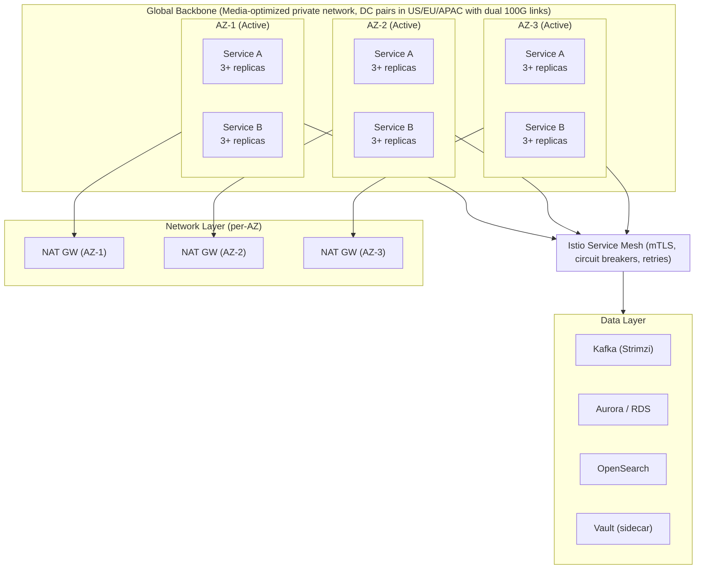

**Key architectural patterns:**
- **Event-driven microservices** with Kafka as the backbone
- **Active-active** across 3 Availability Zones
- **No-maintenance-window** philosophy -- zero customer impact changes
- **Resiliency tiers** -- Critical services remain fully operational during incidents
- **Dependency tiering** -- budgets, breakers, and fallbacks for every external call
- **Infrastructure-agnostic services** deployable across Webex DCs, AWS, and other hyperscalers

### 1.7 Backend Engineering Challenges at Scale

1. **Global real-time media routing** -- Sub-millisecond latency across 6+ billion minutes/month on a private backbone with hot-potato routing[^63]
2. **Multi-region data residency** -- Consistent service behavior while keeping data sovereignty in 15+ regions
3. **Kafka at scale** -- Strimzi operator managing thousands of topics across AZs, handling rebalancing during live traffic without call drops
4. **AI inference orchestration** -- Custom Kubernetes controller (Slotty) managing GPU workloads with predictive capacity management
5. **Zero-downtime migrations** -- Moving over 29 million users between infrastructure versions with no customer impact
6. **Chaos-resilient persistence** -- PostgreSQL/Cassandra failovers that complete in seconds, not minutes
7. **Multi-tenant isolation** -- Per-customer security boundaries across shared infrastructure
8. **Hybrid deployment consistency** -- Same AI/security capabilities across cloud, hybrid, on-prem, and air-gapped

### 1.8 What Engineering Appears to Value

Based on recurring themes across JDs and engineering content:

- **Ownership & end-to-end thinking** -- "Design, build, lead end-user features used by millions"
- **Resilience engineering mindset** -- Not just building features, but designing for failure
- **Collaboration** -- "Play to win -- collaborate closely with engineers, product managers, designers"
- **AI-augmented development** -- Explicit mention of using LLM[^64] tools for productivity, with "strong validation and ownership of shipped code"
- **Quality consciousness** -- Test strategy, code reviews, design reviews, continuous improvement
- **Curiosity & adaptability** -- "Bring your fun, curiosity, and personality"
- **Metrics-driven approach** -- CSAT, NPS, production metrics as the primary feedback loop

---

## Part 2: Job Description Analysis

### 2.1 Representative Role Profiles Found

I found **5 distinct Webex backend roles** that represent the range of positions:

| Role | Team | Experience | Core Stack |
|------|------|------------|------------|
| Senior Backend Engineer (Persistence) | Webex Service Engineering & SRE | 8-12 yrs | Java, Python, PostgreSQL, AWS, K8s |
| Software Engineer (Collaboration) | Webex Engineering Group (Galway) | 2-5+ yrs | C++, Swift, TypeScript, Java, Spring |
| Senior Cloud Engineer (SRE) | Webex Cloud Edge (Federal) | 5-10 yrs | Python/Go, Ansible, K8s, AWS |
| Backend Software Engineer (Intersight) | Data Center Compute | 5+ yrs | Go, Java, Kafka, MongoDB (preferred), K8s |
| Technical Leader (Developer Platform) | Webex Developer Platform | 10-15 yrs | Python, JavaScript, API/SDK, RAG[^65] |

### 2.2 Required Competencies (Cross-Role Synthesis)

**Technical Hard Skills:**

| Category | Specifics | Frequency in JDs |
|----------|-----------|-------------------|
| **Languages** | Java, Python (primary); Go, C/C++, TypeScript (secondary) | 5/5 roles |
| **Databases** | PostgreSQL + Aurora/RDS, Cassandra, OpenSearch | 4/5 roles |
| **Messaging** | Kafka (event-driven architecture), Apache Flink | 3/5 roles |
| **Containers** | Docker, Kubernetes (EKS), Helm | 5/5 roles |
| **Cloud (AWS)** | EC2, S3, RDS, Lambda, EKS, Direct Connect | 5/5 roles |
| **CI/CD** | Jenkins, GitHub, GitOps | 4/5 roles |
| **API Design** | RESTful APIs, WebSockets, gRPC, SDK design | 5/5 roles |
| **Security** | mTLS, Vault, E2EE[^66], zero-trust, FedRAMP | 3/5 roles |
| **Observability** | Metrics, logging, tracing, alerting | 4/5 roles |
| **AI/ML** | Data pipelines, inference services, RAG | 3/5 roles |

**Soft Skills & Engineering Practices:**

| Competency | Evidence |
|------------|----------|
| **Distributed systems understanding** | Explicit in 4/5 roles |
| **Microservices architecture** | Explicit in 4/5 roles |
| **SRE/DevOps mindset** | Core in 3/5 roles |
| **Design reviews & code reviews** | Explicit in 3/5 roles |
| **Cross-functional collaboration** | All roles mention product + DevOps + design |
| **Testing strategy** | Unit, integration, E2E, contract testing |
| **AI-augmented development** | Mentioned in Galway roles (2025-2026 postings) |

### 2.3 How Business Context Shapes Requirements

Webex's engineering expectations are directly driven by its business realities:

1. **Real-time collaboration requires sub-millisecond reliability** -- Kafka mastery, event-driven patterns, circuit breakers, and chaos engineering are not "nice to have" -- they are survival skills.

2. **Enterprise customers demand SLAs** -- 99.999% uptime SLA means every engineer must think about failure modes, active-active deployment, and graceful degradation[^67].

3. **Global scale with data sovereignty** -- Multi-region deployment, data residency, and infrastructure-agnostic service design are core constraints.

4. **Hybrid deployment model** -- Services must work identically across cloud, on-prem, and air-gapped environments, requiring clean abstraction layers.

5. **AI is a strategic bet** -- Custom inference infrastructure (Slotty, Sherpa), RAG pipelines, and AI agent orchestration require backend engineers who understand GPU scheduling, gRPC, and cost optimization.

6. **Rapid feature velocity at scale** -- Zero-downtime deployments, staged rollouts, and GitOps practices enable deploying to millions without disruption.

---

## Part 3: Portfolio Project Recommendations

### Project 1: Real-Time Event-Driven Meeting Session Tracker

**What:** A backend system that tracks real-time meeting session lifecycle events (join, leave, mute/unmute, screen share, recording start/stop) across multiple concurrent meetings, with event sourcing[^68] and temporal queries.

**Why Relevant:** Webex meetings generate billions of events monthly. Understanding how to capture, store, query, and replay session events is fundamental to Webex's analytics, billing, and quality-of-experience features. This directly mirrors the event-driven microservice architecture described in Webex CC engineering blogs.

**Backend Concepts Demonstrated:**
- Event sourcing and CQRS[^69]
- Kafka topic design for high-throughput event ingestion
- Temporal data modeling for session state reconstruction
- Idempotent[^70] event processing
- Backpressure[^71] handling under load spikes

**Recommended Architecture:**

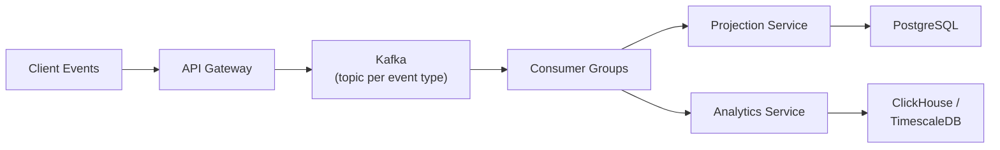

**Tech Stack:**
- Java (Spring Boot) or Python (FastAPI) -- both are primary Webex backend languages
- Apache Kafka for event streaming
- PostgreSQL for materialized projections
- Docker + docker-compose for local development
- Optional: TimescaleDB[^72] for time-series analytics queries

**Essential Features:**
- Event ingestion API (REST + WebSocket for real-time push)
- Kafka producers/consumers with at-least-once delivery[^73]
- Session state reconstruction from event log
- Temporal queries ("what was the state of meeting X at time T?")
- Dead letter queue[^74] for failed event processing
- Health check endpoints + basic observability (Prometheus metrics)

**Engineering Challenges:**
- Ordering guarantees across Kafka partitions
- Handling late-arriving events and out-of-order delivery
- Partitioning strategy for millions of concurrent sessions
- Rebalancing consumers without losing events

**Common Pitfalls:**
- Coupling event producers to consumer processing speed
- Ignoring idempotency (duplicated events cause incorrect state)
- Not designing for replay (schema evolution breaks reconstruction)
- Underestimating partition count planning for Kafka topics

**Required Knowledge:**
- Kafka fundamentals (producers, consumers, consumer groups, partitions)
- Event sourcing patterns
- REST API design
- Basic database indexing and query optimization

**Difficulty:** Level 3 of 5 (Intermediate)

**Resume Value:** High -- demonstrates event-driven architecture, which is the core pattern at Webex. Directly maps to Kafka messaging used across Webex CC and collaboration services.

**Interview Value:** Very high -- system design questions about event ordering, exactly-once semantics[^75], and session state management are staples at Webex-level interviews.

**Production Extensions:**
- Schema registry (Avro[^76]/Protobuf[^77]) for event versioning
- Exactly-once semantics with Kafka transactions
- Multi-region event replication
- Integration with Apache Flink for real-time aggregation

---

### Project 2: Distributed Presence & Availability Service

**What:** A presence service that tracks and broadcasts user online/offline/busy status across distributed nodes with sub-100ms propagation, supporting millions of concurrent users with fan-out[^78] notification delivery.

**Why Relevant:** Presence is one of the most critical services in Webex -- it powers the green dot, Do Not Disturb[^79], call status, and the entire real-time availability model across Meetings, Messaging, and Calling. The Galway JD explicitly mentions "rich presence and DND for CUCM clients" as a key feature.

**Backend Concepts Demonstrated:**
- Distributed presence protocols (heartbeat vs. event-based)
- Fan-out notification delivery at scale
- Consistent hashing[^80] for node assignment
- Conflict resolution in distributed state
- Graceful degradation when nodes fail

**Recommended Architecture:**

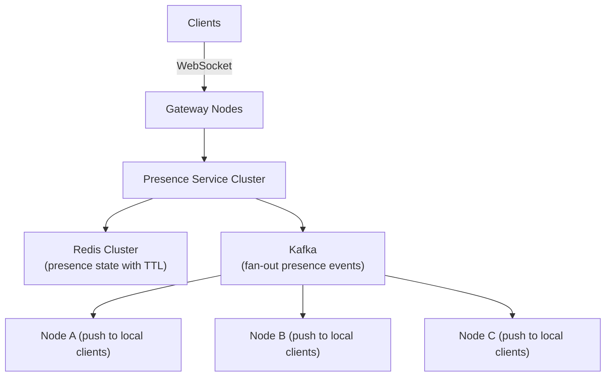

**Tech Stack:**
- Python (asyncio + FastAPI) or Go for gateway nodes
- Redis Cluster[^81] for presence state storage (TTL[^82]-based heartbeats)
- Kafka for presence change event propagation
- WebSocket for real-time client connections
- Docker Compose for local multi-node simulation

**Essential Features:**
- Heartbeat-based liveness detection (configurable intervals)
- WebSocket connections with reconnection handling
- Fan-out: one presence change propagates to N subscribed clients
- Subscription model (subscribe/unsubscribe to specific user presence)
- Partition tolerance: what happens when a gateway node dies?
- Presence history query (last seen, daily availability timeline)

**Engineering Challenges:**
- Fan-out amplification: 1M users x 50 contacts = 50M notifications/day
- Split-brain[^83]: two gateway nodes disagree on user presence
- Hot-key problem: celebrity users with millions of subscribers
- Backpressure during peak hours (9 AM workday start)

**Common Pitfalls:**
- Using HTTP polling instead of persistent connections
- No TTL on presence state (dead nodes leave stale "online" markers)
- Synchronous fan-out blocking the event loop
- Not handling WebSocket reconnection gracefully

**Required Knowledge:**
- WebSocket protocol and connection management
- Redis data structures and pub/sub
- Consistent hashing or other partitioning strategies
- Event-driven notification systems

**Difficulty:** Level 4 of 5 (Intermediate-Advanced)

**Resume Value:** Very high -- presence is a core feature of every Webex product. Shows understanding of real-time distributed state.

**Interview Value:** Excellent -- leads naturally to system design discussions about scale, consistency, and failure modes.

**Production Extensions:**
- Multi-region presence with CRDT[^84]-based eventual consistency
- Presence federation across organizations (B2B)
- Device-level presence (mobile vs. desktop)
- Integration with calendar systems for automated status

---

### Project 3: Resilient Database Migration & Failover Orchestrator

**What:** A Python/Java tool that performs zero-downtime database schema migrations across PostgreSQL primary-replica clusters, with automated failover, rollback capabilities, and chaos-aware health validation.

**Why Relevant:** The Webex Persistence Team (the most actively hiring team) literally manages "large-scale persistence services" across "Webex Data Centers and AWS Cloud" with "reliability, scalability, and performance for millions of users." Their chaos engineering revealed that Aurora failover caused 30-minute outages until they fixed the JDBC driver -- this project shows you understand that problem space.

**Backend Concepts Demonstrated:**
- Zero-downtime schema migration strategies (expand-contract pattern)
- Database failover orchestration with health validation
- Idempotent migration scripts
- Automated rollback on health check failure
- Chaos-aware migration testing

**Recommended Architecture:**

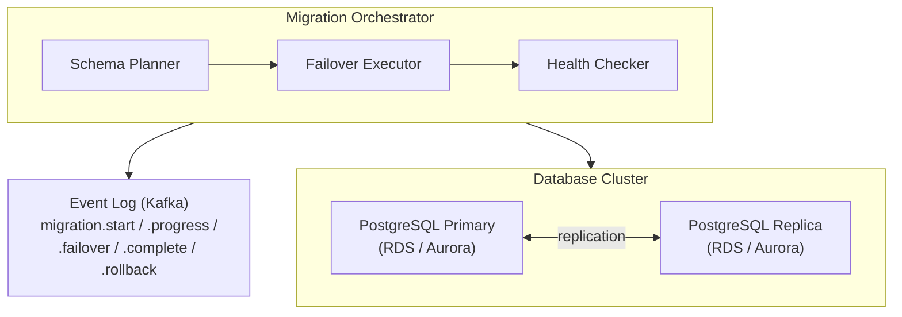

**Tech Stack:**
- Python (SQLAlchemy + psycopg2) or Java (Spring Boot + JDBC)
- PostgreSQL (primary + read replica, or Aurora)
- Apache Kafka for migration event logging
- HashiCorp Vault (or a mock) for credentials management
- Docker Compose with health checks for local testing
- Bats or pytest for integration tests that simulate failures

**Essential Features:**
- Expand phase: add new columns/tables without breaking reads
- Migrate phase: backfill data in batches with rate limiting
- Contract phase: remove old columns after validation
- Automated failover during migration if primary dies
- Rollback on health check failure (timeout, error rate, replication lag)
- Migration progress tracking via Kafka events
- Chaos injection: simulate AZ failure during migration

**Engineering Challenges:**
- Long-running migrations on tables with billions of rows
- Consistent state across replicas during schema changes
- Detecting and recovering from partial migration failure
- Lock contention during column additions on high-traffic tables

**Common Pitfalls:**
- Running DDL[^85] inside transactions on PostgreSQL (DDL commits implicitly)
- Not accounting for read-replica lag during expand phase
- No circuit breaker on health checks (cascading failures)
- Assuming migrations are idempotent without testing

**Required Knowledge:**
- PostgreSQL internals (MVCC[^86], WAL[^87], replication)
- DDL statement behavior in PostgreSQL
- Health check design patterns
- Basic understanding of AWS RDS/Aurora

**Difficulty:** Level 4 of 5 (Intermediate-Advanced)

**Resume Value:** Extremely high -- directly targets the Webex Persistence Team's core responsibility. Shows you understand their pain points.

**Interview Value:** Excellent -- the Aurora JDBC driver failover issue from the chaos engineering blog is exactly the kind of "war story" question Webex interviewers ask about.

**Production Extensions:**
- Online schema change tools integration (gh-ost or pt-online-schema-change)
- Multi-region migration coordination
- Automated migration dry-run with production data snapshots
- Integration with CI/CD pipeline for migration-as-code

---

### Project 4: Multi-Region API Gateway with Circuit Breakers & Rate Limiting

**What:** A production-grade API gateway that routes requests across multiple backend microservices with intelligent load balancing, circuit breakers[^88], rate limiting, request transformation, and observability.

**Why Relevant:** Webex's architecture relies on hundreds of microservices communicating through APIs and Kafka. The Istio service mesh with circuit breakers, consistent timeouts, and retry algorithms is a core part of their infrastructure. This project demonstrates the API gateway and resilience patterns they use daily.

**Backend Concepts Demonstrated:**
- API gateway pattern
- Circuit breaker implementation (Hystrix-style)
- Token bucket[^89] / sliding window[^90] rate limiting
- Request/response transformation
- Distributed tracing (OpenTelemetry[^91])
- Health check aggregation

**Recommended Architecture:**

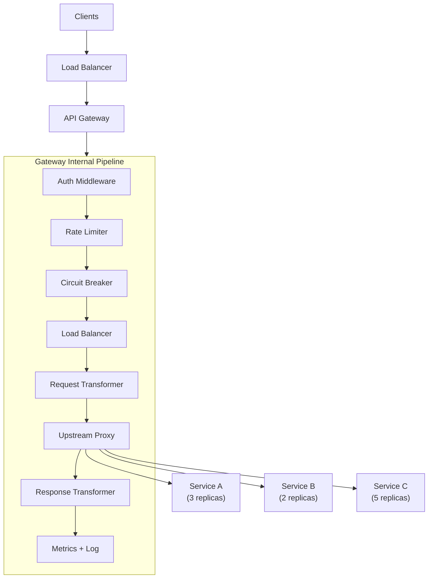

**Tech Stack:**
- Go or Java (Spring Boot) for the gateway service
- Redis for distributed rate limiting state
- In-memory circuit breaker (or Resilience4j[^92] if Java)
- OpenTelemetry SDK for distributed tracing
- Prometheus + Grafana for metrics and dashboards
- Docker Compose for multi-service local environment

**Essential Features:**
- Token bucket rate limiting with Redis-backed distributed counters
- Circuit breaker with three states: closed[^93], open[^94], half-open[^95]
- Configurable retry policies with exponential backoff[^96] and jitter[^97]
- Request routing based on path, header, or method
- Request/response transformation (header injection, body rewriting)
- Health check aggregation across upstream services
- Graceful degradation when upstream services are down

**Engineering Challenges:**
- Distributing rate limit counters across gateway instances without over-counting
- Circuit breaker state synchronization across gateway nodes
- Timeout cascading across chained service calls
- Distinguishing between slow responses and actual failures

**Common Pitfalls:**
- Synchronous circuit breaker blocking the event loop
- Not setting upstream timeouts (connection pool exhaustion)
- Rate limiting by IP instead of authenticated user
- No bulkheading[^98] -- one slow service kills the gateway

**Required Knowledge:**
- HTTP protocol deep dive (connection pooling, keep-alive)
- Circuit breaker pattern (Netflix Hystrix / Resilience4j concepts)
- Redis for distributed coordination
- Reverse proxy fundamentals

**Difficulty:** Level 4 of 5 (Intermediate-Advanced)

**Resume Value:** High -- every Webex microservice sits behind this kind of infrastructure. Shows systems-level thinking.

**Interview Value:** High -- "Design a circuit breaker" and "Design a rate limiter" are classic backend interview questions that Webex engineers definitely ask.

**Production Extensions:**
- gRPC proxy support for internal service communication
- mTLS between gateway and upstream (mirroring Istio)
- WebSocket upgrade support for real-time connections
- Canary routing for A/B testing new service versions

---

### Project 5: Webhook Delivery Service with Guaranteed At-Least-Once Delivery

**What:** A resilient webhook[^99] delivery service that sends HTTP callbacks to external systems with guaranteed at-least-once delivery, exponential backoff retry, delivery status tracking, and a management dashboard.

**Why Relevant:** Webex Developer Platform exposes webhooks for bot integrations, meeting events, and contact center callbacks. The Developer Platform team (hiring Technical Leaders) needs bulletproof delivery infrastructure. The BYoVA[^100] and media forking sample code on GitHub shows webhook/event delivery is core to the platform.

**Backend Concepts Demonstrated:**
- Reliable message delivery with retry semantics
- Exponential backoff with jitter
- Webhook signature verification (HMAC[^101])
- Idempotency keys for duplicate prevention
- Delivery queue with prioritization

**Recommended Architecture:**

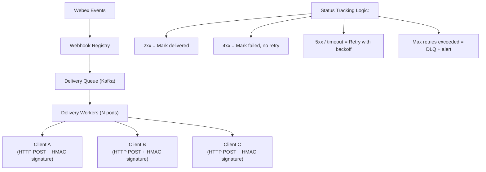

**Tech Stack:**
- Python (Celery + FastAPI) or Java (Spring Boot + custom queue)
- Kafka or Redis Streams for the delivery queue
- PostgreSQL for delivery log and webhook registry
- Docker Compose for local development
- HMAC-SHA256 for webhook signatures

**Essential Features:**
- Register webhooks with URL, event types, and secret
- Deliver webhooks with exponential backoff (1s, 5s, 30s, 2min, 10min)
- HMAC-SHA256 signature on every delivery for verification
- Delivery status API: delivered, pending, failed, dead-lettered
- Circuit breaker per webhook endpoint (stop hammering broken endpoints)
- Batch delivery for high-volume events
- Management dashboard showing delivery success rates per client

**Engineering Challenges:**
- Handling "poison pill" webhooks (endpoints that always timeout)
- Ordering guarantees: should event A always arrive before event B?
- Scaling workers to handle 100K+ deliveries/minute
- Idempotency: clients may receive the same event twice -- handle gracefully

**Common Pitfalls:**
- Not respecting `Retry-After` headers from clients
- Using synchronous HTTP calls in delivery workers
- No maximum retry limit (infinite retries exhaust resources)
- Logging webhook payloads with sensitive data

**Required Knowledge:**
- HTTP protocol (status codes, timeouts, connection management)
- Queue-based async processing
- Cryptographic signatures (HMAC)
- Retry and backoff algorithms

**Difficulty:** Level 3 of 5 (Intermediate)

**Resume Value:** High -- directly applicable to Webex Developer Platform team. Shows production reliability thinking.

**Interview Value:** Good -- "Design a webhook delivery system" is a practical system design question that tests reliability engineering knowledge.

**Production Extensions:**
- Multi-region webhook delivery with geographic routing
- Encrypted webhook payloads (JWE[^102])
- Webhook event filtering at the server side
- Integration testing framework for webhook consumers

---

### Project 6: Chat Message Persistence & Search Service

**What:** A backend service for persisting chat messages with full-text search, message threading, attachment handling, and compliance-aware retention policies.

**Why Relevant:** Webex Teams messaging is one of the core products, and the Persistence Team specifically manages "persistence services that power Webex Teams, Meetings, and the Webex Suite." Message storage, search, and retention across millions of users is a core backend challenge.

**Backend Concepts Demonstrated:**
- Document storage with hybrid search (keyword + vector)
- Message threading with efficient ancestor queries
- Attachment handling (S3 storage with metadata in DB)
- Compliance-aware retention (legal hold, auto-deletion)
- Write-optimized vs. read-optimized storage patterns

**Recommended Architecture:**

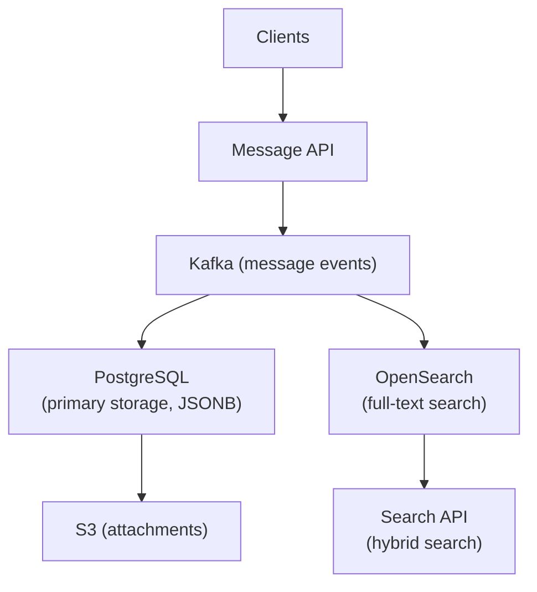

**Tech Stack:**
- Python (FastAPI) or Java (Spring Boot)
- PostgreSQL for message storage (JSONB[^103] for flexible metadata)
- OpenSearch/Elasticsearch for full-text search
- S3 (or MinIO[^104] locally) for file attachments
- Kafka for async message indexing pipeline
- Docker Compose with all components

**Essential Features:**
- Send/receive messages with proper ordering (timestamp + sequence)
- Thread support: reply-to chains, thread participant tracking
- Full-text search across message content, sender, date range
- Attachment upload/download with pre-signed URLs[^105]
- Compliance retention: legal hold flag, auto-deletion after N days
- Message reactions and read receipts
- Search index synced via Kafka (not direct writes)

**Engineering Challenges:**
- Maintaining message order across partitions
- Keeping PostgreSQL and OpenSearch index in sync
- Efficient thread queries (recursive CTEs[^106] or materialized paths)
- Storage cost management for billions of messages

**Common Pitfalls:**
- Writing to OpenSearch synchronously in the message send path
- Not using JSONB for flexible metadata (rigid schema breaks fast)
- Ignoring index bloat in OpenSearch over time
- Sequential ID generation creating a bottleneck

**Required Knowledge:**
- PostgreSQL JSONB and full-text search
- OpenSearch/Elasticsearch indexing and query patterns
- S3 pre-signed URLs for secure file access
- Kafka-based data synchronization patterns

**Difficulty:** Level 4 of 5 (Intermediate-Advanced)

**Resume Value:** Very high -- directly maps to the Persistence Team's responsibilities.

**Interview Value:** Excellent -- "Design a chat messaging system" is a canonical system design question.

**Production Extensions:**
- End-to-end encryption (MLS protocol integration)
- Multi-region replication with conflict resolution
- AI-powered message summarization pipeline
- GDPR[^107] right-to-erasure implementation

---

### Project 7: Real-Time Analytics & Metrics Pipeline

**What:** A metrics collection, aggregation, and visualization pipeline that ingests high-volume application metrics, performs real-time aggregation, and serves dashboards with sub-second query latency.

**Why Relevant:** Webex's "Rearguard" monitoring system provides "continuous E2E tests for each persona in all regions." Their "metrics backend migration to a resilient, horizontally scalable time-series store" is an active project. Understanding metrics pipelines is critical for SRE roles.

**Backend Concepts Demonstrated:**
- Time-series data modeling and storage
- Real-time stream aggregation (windowing)
- Metric downsampling and retention policies
- Push vs. pull metric collection
- Dashboard serving with efficient query patterns

**Recommended Architecture:**

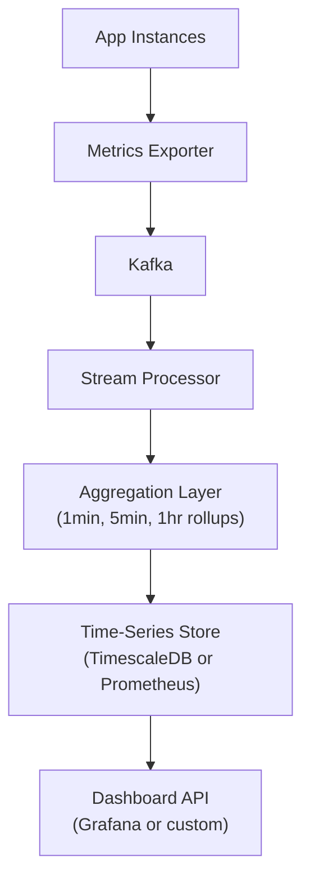

**Tech Stack:**
- Python or Go for the metrics exporter and aggregation service
- Kafka for metric transport
- TimescaleDB (PostgreSQL extension) for time-series storage
- Prometheus for local metric exposition
- Grafana for visualization (or a custom React dashboard)
- Docker Compose for local development

**Essential Features:**
- Metrics ingestion endpoint (OpenTelemetry format)
- Kafka-based transport with backpressure handling
- Real-time aggregation: 1-minute, 5-minute, 1-hour rollups
- Downsampling: raw data retained 24h, 1min rollup 7d, 1hr rollup 90d
- Alert rule evaluation (threshold-based, anomaly detection)
- Dashboard API supporting time-range queries

**Engineering Challenges:**
- Handling metric bursts (e.g., thousands of nodes reporting simultaneously)
- Efficient time-series query performance with billions of data points
- Consistent aggregation across late-arriving metrics
- Storage cost management with retention policies

**Common Pitfalls:**
- Storing raw metrics indefinitely (storage explosion)
- Not pre-aggregating at ingestion time (query-time aggregation is too slow)
- Ignoring metric cardinality (high-cardinality labels destroy performance)
- Synchronous aggregation blocking the ingestion pipeline

**Required Knowledge:**
- Time-series database concepts (compaction, downsampling)
- Stream processing fundamentals (windowing, tumbling vs. sliding windows)
- Prometheus exposition format
- Grafana dashboard configuration

**Difficulty:** Level 4 of 5 (Intermediate-Advanced)

**Resume Value:** High -- directly relates to Webex's observability infrastructure and SRE roles.

**Interview Value:** Good -- "Design a monitoring system" is a common system design question.

**Production Extensions:**
- Multi-region metric federation
- Anomaly detection with ML models
- SLO[^108]/SLI[^109] calculation and error budget tracking
- Integration with incident management (PagerDuty, Opsgenie)

---

### Project 8: AI-Powered Meeting Transcript & Summarization Pipeline

**What:** An end-to-end pipeline that ingests meeting audio, performs speech-to-text transcription, generates AI summaries with action items, and stores results with full search capability.

**Why Relevant:** Webex AI Assistant is a major strategic investment. Their "AI Cost Optimization" blog details custom ASR models (K2), inference orchestration (Slotty/Sherpa), and the entire model lifecycle pipeline. The Notetaker Agent and Task Agent are actively shipping features. This project touches their most visible AI initiative.

**Backend Concepts Demonstrated:**
- Real-time audio streaming and chunked processing
- AI model inference serving with batching
- Document processing pipeline (audio -> text -> summary -> search index)
- Cost-aware resource management for GPU workloads
- Async pipeline orchestration with failure recovery

**Recommended Architecture:**

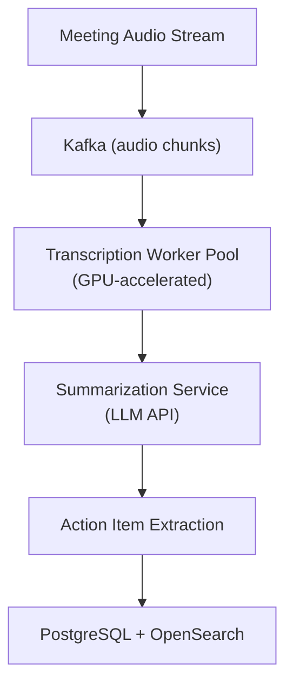

**Tech Stack:**
- Python (FastAPI + Celery[^110] for worker orchestration)
- Kafka for audio chunk transport
- OpenAI Whisper (or a smaller model like Vosk) for local STT
- OpenAI API (or local LLM) for summarization
- PostgreSQL for transcript storage
- OpenSearch for full-text search across transcripts
- Docker Compose (GPU passthrough optional)

**Essential Features:**
- Audio upload endpoint with chunked processing
- Speech-to-text with speaker diarization[^111] (who said what)
- Summarization with configurable detail levels
- Action item extraction with assignee and due date
- Search across transcripts by keyword, speaker, or date
- Cost tracking per meeting (model inference cost estimation)
- Pipeline monitoring: transcription latency, summary quality metrics

**Engineering Challenges:**
- Handling long meetings (1+ hour audio files)
- Speaker diarization accuracy with similar voices
- Maintaining context across chunked audio processing
- Balancing summary quality vs. latency vs. cost

**Common Pitfalls:**
- Not chunking audio properly (losing sentence boundaries)
- Treating all meetings the same size (no adaptive processing)
- No retry logic for transient API failures
- Ignoring audio quality issues (echo, background noise)

**Required Knowledge:**
- Audio processing basics (formats, chunking, sample rates)
- AI model inference serving
- Pipeline orchestration patterns
- Cost optimization for cloud AI services

**Difficulty:** Level 5 of 5 (Advanced)

**Resume Value:** Extremely high -- directly maps to Webex's flagship AI features (AI Assistant, Notetaker Agent, Task Agent).

**Interview Value:** Excellent -- "How would you build a real-time transcription pipeline?" is exactly the kind of question Webex AI infrastructure engineers ask.

**Production Extensions:**
- Custom ASR model fine-tuning (mirroring Webex's K2 model)
- Kubernetes controller for GPU scheduling (inspired by "Slotty")
- Multi-language support with language detection
- Real-time streaming transcription (not batch)

---

### Project 9: Contact Center Call Routing Engine

**What:** A call routing engine that routes incoming customer calls to optimal agents based on skills, availability, priority, and queue rules, with real-time queue management and analytics.

**Why Relevant:** Webex Contact Center is their most technically sophisticated product, with active chaos engineering, event-driven architecture, and microservices. The routing engine is the brain of any contact center -- understanding call routing, queue management, and agent assignment is directly applicable.

**Backend Concepts Demonstrated:**
- State machine[^112] modeling (call states, agent states)
- Real-time queue management with priority scheduling
- Skills-based routing algorithms
- Event-driven state transitions
- Real-time analytics and reporting

**Recommended Architecture:**

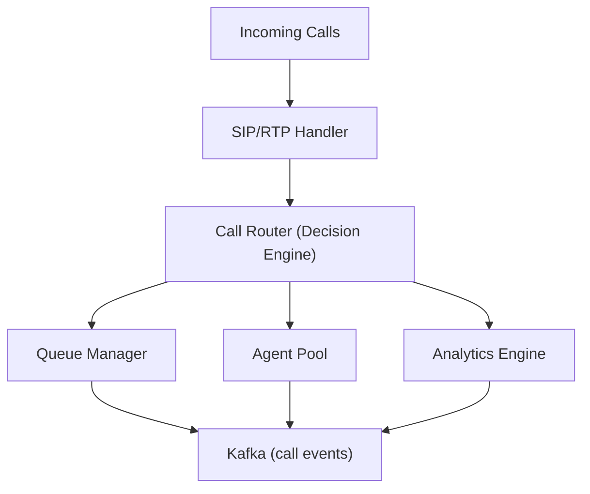

**Tech Stack:**
- Java (Spring Boot) -- aligning with Webex CC's Java services
- PostgreSQL for configuration (routing rules, agent profiles, queues)
- Redis for real-time agent state and queue positions
- Kafka for call event streaming
- WebSocket for real-time dashboard updates

**Essential Features:**
- Call state machine (incoming -> queued -> ringing -> connected -> completed)
- Skills-based routing: match caller language/issue to agent skills
- Priority queuing with VIP bypass
- Overflow routing: if no agent available after N seconds, route to backup
- Real-time agent state management (available, on-call, break, wrap-up)
- Live queue dashboard showing wait times, agent utilization, SLA compliance
- Historical analytics: average handle time, first-call resolution rate

**Engineering Challenges:**
- Maintaining accurate agent state across distributed nodes
- Preventing race conditions (two callers assigned to same agent)
- Real-time SLA calculation with sliding windows
- Graceful handling of agent sudden disconnection mid-call

**Common Pitfalls:**
- Polling-based agent state instead of event-driven
- No guard against assignment races (distributed locking)
- Ignoring wrap-up time after call completion
- Hard-coded routing logic instead of configurable rules engine

**Required Knowledge:**
- Finite state machines
- Real-time systems and event-driven design
- Queue management algorithms
- WebSocket for real-time dashboards

**Difficulty:** Level 4 of 5 (Intermediate-Advanced)

**Resume Value:** Very high -- directly maps to Webex Contact Center engineering.

**Interview Value:** Excellent -- tests state machine design, real-time systems, and distributed coordination.

**Production Extensions:**
- AI-powered routing (predict best agent using ML)
- Multi-channel routing (voice + chat + email unified)
- A/B testing different routing strategies
- Integration with CRM (Salesforce) for context injection

---

### Project 10: Infrastructure Automation & Deployment Pipeline (GitOps)

**What:** A GitOps-based deployment pipeline that automates infrastructure provisioning, application deployment, and configuration management across multiple environments, with automated rollback and drift detection.

**Why Relevant:** Webex uses "infrastructure-as-code and modern GitOps practices, where Git repositories serve as the authoritative source." Ansible, Jenkins, GitHub, and Kubernetes are core tools in every Webex backend JD. This project demonstrates the operational practices Webex demands.

**Backend Concepts Demonstrated:**
- GitOps workflow (Git as single source of truth)
- Infrastructure as Code (Terraform + Ansible)
- Canary deployments[^113] with automated rollback
- Configuration drift detection and remediation
- Secret management and rotation

**Recommended Architecture:**

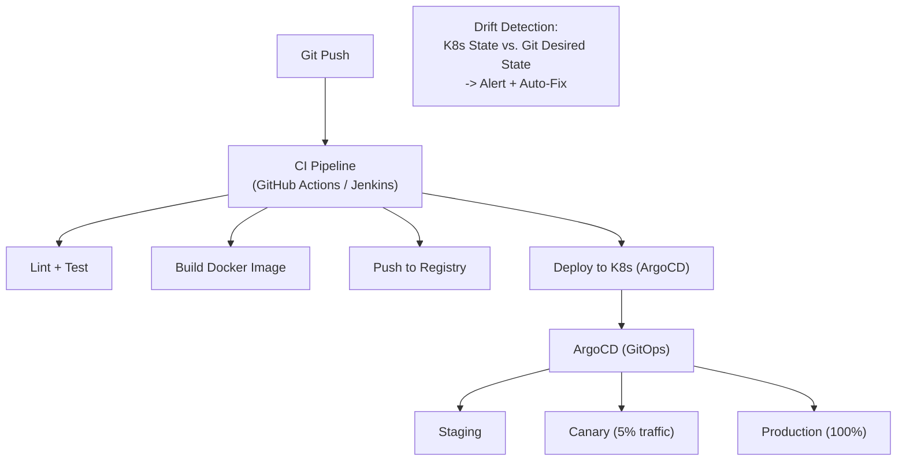

**Tech Stack:**
- Terraform for infrastructure provisioning
- Ansible for configuration management
- Kubernetes (Minikube or kind for local) for orchestration
- ArgoCD[^114] for GitOps deployment
- GitHub Actions for CI pipeline
- Vault (or SOPS[^115]) for secret management
- Docker for containerization

**Essential Features:**
- Infrastructure provisioning via Terraform (VPC[^116], RDS, EKS)
- Configuration management via Ansible playbooks
- CI pipeline: lint -> test -> build -> push -> deploy
- Canary deployment: deploy to 5% traffic, monitor, then promote
- Automated rollback on health check failure
- Drift detection: compare live K8s state with Git desired state
- Secret rotation with zero-downtime

**Engineering Challenges:**
- Coordinating Terraform and Ansible state across environments
- Canary deployment traffic splitting without service mesh
- Handling database migrations during deployment
- Maintaining consistent state between Git and live infrastructure

**Common Pitfalls:**
- Storing secrets in Git (use SOPS or Vault)
- No rollback strategy (stuck in broken deployments)
- Environment drift (dev != staging != prod)
- Manual interventions bypassing GitOps (shadow infrastructure)

**Required Knowledge:**
- Kubernetes deployment strategies
- Terraform resource management and state
- Ansible playbook design
- CI/CD pipeline design

**Difficulty:** Level 4 of 5 (Intermediate-Advanced)

**Resume Value:** High -- shows operational maturity that Webex SRE/DevOps roles require.

**Interview Value:** Good -- "Describe your deployment process" and "How do you handle rollback?" are standard questions.

**Production Extensions:**
- Multi-cluster deployment across regions
- Automated performance testing in canary phase
- Chaos engineering integration (deploy, inject failure, verify, promote)
- Cost tracking per deployment (AWS Cost Explorer integration)

---

## Part 4: Project Ranking by Interview Impact

| Rank | Project | Interview Impact | Why |
|------|---------|-----------------|-----|
| 1 | DB Migration & Failover Orchestrator | 5/5 | Directly maps to Persistence Team's number one challenge. Chaos engineering blog's Aurora failover story is a perfect interview topic. |
| 2 | AI Transcript & Summarization Pipeline | 5/5 | Maps to Webex's biggest strategic bet (AI Assistant). Shows understanding of Slotty/Sherpa/K2 infrastructure. |
| 3 | Real-Time Meeting Session Tracker | 5/5 | Event sourcing + Kafka is the core pattern at Webex. Demonstrates the most fundamental architectural concept. |
| 4 | Distributed Presence Service | 4/5 | Core feature of every Webex product. Tests real-time distributed systems knowledge. |
| 5 | Contact Center Call Routing Engine | 4/5 | Directly maps to Webex CC. Tests state machines, real-time systems, and routing algorithms. |
| 6 | Chat Message Persistence & Search | 4/5 | Maps to Persistence Team's messaging responsibilities. Tests document storage and search. |
| 7 | Multi-Region API Gateway | 4/5 | Tests resilience patterns (circuit breakers, rate limiting) used in every Webex service. |
| 8 | Webhook Delivery Service | 3/5 | Maps to Developer Platform team. Tests reliable delivery patterns. |
| 9 | Metrics Pipeline | 3/5 | Maps to SRE roles. Tests time-series storage and stream processing. |
| 10 | GitOps Deployment Pipeline | 3/5 | Tests operational practices. Important but less "backend engineering" focused. |

---

## Part 5: Gap Analysis

### Job Requirements Coverage Matrix

| Requirement | P1 (DB Migrate) | P2 (AI Pipeline) | P3 (Event Tracker) | P4 (Presence) | P5 (Routing) | P6 (Chat) | P7 (Gateway) | P8 (Webhook) | P9 (Metrics) | P10 (GitOps) |
|---|---|---|---|---|---|---|---|---|---|---|
| Java/Spring Boot | Yes | | Yes | | Yes | Yes | Yes | | | |
| Python | Yes | Yes | | Yes | | | | Yes | Yes | |
| PostgreSQL | Yes | | Yes | | Yes | Yes | | Yes | Yes | |
| Kafka | | Yes | Yes | Yes | Yes | Yes | | Yes | Yes | |
| Kubernetes | | Yes | | | | | | | | Yes |
| Docker | Yes | Yes | Yes | Yes | Yes | Yes | Yes | Yes | Yes | Yes |
| AWS Services | Yes | | | | | Yes | | | | Yes |
| RESTful APIs | Yes | Yes | Yes | Yes | Yes | Yes | Yes | Yes | Yes | |
| WebSockets | | | Yes | Yes | Yes | | | | Yes | |
| gRPC | | Yes | | | | | | | | |
| CI/CD | | | | | | | | | | Yes |
| Circuit Breakers | Yes | | | Yes | | | Yes | Yes | | |
| Chaos Engineering | Yes | | | | | | | | | Yes |
| Microservices | Yes | Yes | Yes | Yes | Yes | Yes | Yes | Yes | Yes | Yes |
| Distributed Systems | Yes | Yes | Yes | Yes | Yes | Yes | Yes | Yes | Yes | Yes |
| AI/ML Concepts | | Yes | | | | | | | | |
| Testing Strategy | Yes | Yes | | | Yes | Yes | Yes | | Yes | Yes |
| Observability | | Yes | | | | | Yes | | Yes | |

### Skills Potentially Uncovered (Gaps)

| Skill Gap | Relevant To | How to Address |
|-----------|-------------|----------------|
| **Go language** | Intersight/Cloud Edge roles | Add Go implementation to one project (API Gateway is a good fit) |
| **VoIP/SIP protocols** | Calling/Contact Center roles | Extend Project 9 with SIP signaling simulation |
| **C/C++ systems programming** | Device engineering roles | Lower priority unless targeting device-embedded teams |
| **Swift/iOS** | Mobile client roles | Not relevant for pure backend positions |
| **Cassandra/NoSQL** | Persistence Team (preferred skill) | Add a Cassandra-backed storage option to Project 6 |
| **Terraform (deep)** | Cloud Edge/SRE roles | Expand Project 10 with multi-environment Terraform |
| **FedRAMP/Compliance** | Federal roles | Add compliance audit logging to any project |
| **Real-time media (WebRTC)** | Meeting infrastructure roles | Not covered -- would require a dedicated WebRTC project |
| **Service mesh (Istio)** | Platform infrastructure roles | Deploy projects on Kubernetes with Istio sidecars |
| **OpenSearch/Elasticsearch (deep)** | Persistence + CC roles | Deepen search capabilities in Projects 6 and 9 |

### Recommendation: Optimal Portfolio Selection

**If applying to the Persistence Team (most active hiring):**
- Must-build: Projects 1, 3, 6
- Should-build: Projects 4, 7
- Nice-to-have: Project 2

**If applying to Contact Center team:**
- Must-build: Projects 5, 9
- Should-build: Projects 1, 3, 4
- Nice-to-have: Project 2

**If applying to Developer Platform team:**
- Must-build: Projects 5, 8
- Should-build: Projects 3, 4, 7
- Nice-to-have: Project 2

**If applying to SRE/Cloud Edge:**
- Must-build: Projects 4, 7, 10
- Should-build: Projects 1, 3
- Nice-to-have: Project 9

---

## Footnotes

[^1]: Webex official website: https://www.webex.com/

[^2]: Webex Engineering Blog: https://blog.webex.com/engineering/

[^3]: Cisco Careers: https://careers.cisco.com/

[^4]: Webex GitHub organization (75 repositories, top languages: JavaScript, Python, Swift, Java, TypeScript): https://github.com/webex

[^5]: Cisco Live EMEA 2026 session BRKCOL-2698 -- Webex Platform Architecture presentation: https://www.ciscolive.com/c/dam/r/ciscolive/emea/docs/2026/pdf/BRKCOL-2698.pdf

[^6]: Webex Developer Documentation: https://developer.webex.com/

[^7]: Representative job postings found on Cisco Careers, Shine.com, NodeFlair, TealHQ, and trabajo.org (accessed July 2026).

[^8]: **CX (Customer Experience):** The sum of all interactions a customer has with a brand across all touchpoints, and the resulting perception of the brand. In enterprise software, CX platforms manage customer interactions across voice, chat, email, and social channels.

[^9]: **SaaS (Software as a Service):** A software delivery model where applications are hosted by a provider and accessed over the internet, eliminating the need for local installation and maintenance.

[^10]: **UCaaS (Unified Communications as a Service):** A cloud-delivered model that integrates enterprise communications services -- such as calling, messaging, video conferencing, and collaboration tools -- into a single platform.

[^11]: **CCaaS (Contact Center as a Service):** A cloud-based model for delivering contact center software and infrastructure, enabling organizations to manage customer interactions across multiple channels without owning on-premises hardware.

[^12]: **CPaaS (Communications Platform as a Service):** A cloud-based platform that provides developers with APIs and tools to embed real-time communication features (voice, video, messaging) into their own applications.

[^13]: **SDK (Software Development Kit):** A collection of software tools, libraries, documentation, and code samples that developers use to build applications for a specific platform or service.

[^14]: **Control Hub:** Webex's centralized administration portal providing a single interface for managing users, devices, policies, analytics, and troubleshooting across all Webex services.

[^15]: **KMS (Key Management Service):** A service responsible for generating, storing, rotating, and managing cryptographic keys used to encrypt and decrypt data at rest and in transit.

[^16]: **WebRTC (Web Real-Time Communication):** An open-source protocol and API standard that enables real-time peer-to-peer communication (voice, video, and data) directly in web browsers without requiring plugins or native applications.

[^17]: **SLA (Service Level Agreement):** A formal commitment between a service provider and customer defining the expected level of service, including uptime guarantees, performance metrics, and remedies for non-compliance. A 99.999% SLA allows approximately 5.26 minutes of downtime per year.

[^18]: **Microservices:** An architectural style where an application is structured as a collection of small, independent services, each running in its own process and communicating via lightweight protocols (typically HTTP APIs or message queues).

[^19]: **Chaos engineering:** A discipline of experimentally injecting failures into systems to identify weaknesses before they cause real outages. Pioneered by Netflix (Chaos Monkey) and now widely adopted in enterprise SRE practices.

[^20]: **PBX (Private Branch Exchange):** A telephone system within an organization that switches calls between users on local lines while allowing all users to share a certain number of external phone lines. Cloud PBX moves this function to hosted infrastructure.

[^21]: **CUCM (Cisco Unified Communications Manager):** Cisco's enterprise IP telephony and call processing platform, also known as CallManager. It provides call routing, voicemail integration, and device management for on-premises deployments.

[^22]: **PSTN (Public Switched Telephone Network):** The traditional global circuit-switched telephone network that provides infrastructure and services for public telecommunication. Enterprise systems connect to PSTN via SIP trunks or gateways.

[^23]: **FedRAMP (Federal Risk and Authorization Management Program):** A US government-wide program that provides a standardized approach to security assessment, authorization, and continuous monitoring for cloud products and services used by federal agencies.

[^24]: **MLS (Messaging Layer Security):** An open standard (formerly known as the Messaging Layer Security protocol, IETF RFC 9420) for end-to-end encrypted group messaging that provides cryptographic guarantees of authenticity, confidentiality, and forward secrecy.

[^25]: **Zero-trust architecture:** A security model that requires strict identity verification for every person and device trying to access resources, regardless of whether they are inside or outside the network perimeter. The principle is "never trust, always verify."

[^26]: **FIPS 140-3:** A US government standard (Federal Information Processing Standard) specifying security requirements for cryptographic modules used to protect sensitive information. FIPS 140-3 is the latest revision, harmonized with international standard ISO/IEC 19790.

[^27]: **IL-5 (Impact Level 5):** The highest impact level under the US Department of Defense's cloud security model, applicable to Controlled Unclassified Information (CUI) requiring the highest level of protection. It mandates data encryption at rest and in transit, and US-only data processing.

[^28]: **ThousandEyes:** A Cisco-acquired network intelligence platform that provides visibility into the Internet and cloud networks, enabling organizations to monitor and troubleshoot application and network performance from the end-user perspective.

[^29]: **AZ (Availability Zone):** An isolated location within a cloud region, typically corresponding to one or more discrete data centers with independent power, networking, and connectivity. Deploying across multiple AZs provides fault tolerance and high availability.

[^30]: **AWS FIS (Fault Injection Simulator):** A fully managed service from Amazon Web Services that enables running chaos engineering experiments on AWS workloads to test resilience by injecting faults such as network disruptions, API errors, and resource exhaustion.

[^31]: **ITIL (Information Technology Infrastructure Library):** A set of best practices for IT service management (ITSM) that aligns IT services with business needs. ITIL defines processes for incident management, change management, problem management, and more.

[^32]: **GitOps:** An operational framework where Git repositories serve as the single source of truth for declarative infrastructure and application configurations. Changes are applied automatically through CI/CD pipelines triggered by Git commits, enabling version-controlled, auditable infrastructure management.

[^33]: **ASR (Automatic Speech Recognition):** AI technology that converts spoken language into written text. Webex uses custom ASR models (such as their K2 model) for meeting transcription, voicemail transcription, and real-time captioning.

[^34]: **Contract testing:** A testing methodology that verifies that services communicate correctly with each other by validating the "contracts" (API specifications) between them, without requiring integration test environments.

[^35]: **E2E (End-to-End) testing:** Testing methodology that validates the entire application workflow from the user's perspective, simulating real user interactions across multiple components and services.

[^36]: **CSAT (Customer Satisfaction Score):** A metric measuring how satisfied customers are with a product, service, or interaction, typically gathered through post-interaction surveys on a numerical scale.

[^37]: **NPS (Net Promoter Score):** A customer loyalty metric based on a single survey question: "How likely are you to recommend this product/service to a friend or colleague?" Responses are scored 0-10 and grouped into Promoters, Passives, and Detractors.

[^38]: **RESTful APIs:** Application Programming Interfaces designed according to Representational State Transfer (REST) architectural constraints, using standard HTTP methods (GET, POST, PUT, DELETE) for communication between client and server.

[^39]: **WebSockets:** A communication protocol providing full-duplex, persistent connections over a single TCP connection, enabling real-time bidirectional data transfer between client and server without repeated HTTP requests.

[^40]: **gRPC:** A high-performance, open-source Remote Procedure Call (RPC) framework developed by Google that uses Protocol Buffers for serialization and HTTP/2 for transport, supporting streaming, authentication, and load balancing.

[^41]: **RDS (Relational Database Service):** Amazon Web Services' managed relational database service that handles routine database tasks such as provisioning, patching, backup, recovery, and scaling.

[^42]: **Cassandra:** An open-source, distributed NoSQL database designed for handling large amounts of data across many commodity servers with no single point of failure, known for high availability and linear scalability.

[^43]: **NoSQL (Not Only SQL):** A category of database management systems that differ from traditional relational databases in data models, scalability patterns, and query languages. Types include document, key-value, column-family, and graph databases.

[^44]: **OpenSearch:** An open-source search and analytics engine forked from Elasticsearch by AWS, used for full-text search, log analytics, and observability workloads.

[^45]: **Apache Kafka:** A distributed event streaming platform capable of handling trillions of events per day, providing publish-subscribe messaging, stream processing, and durable storage with high throughput and fault tolerance.

[^46]: **Strimzi:** An open-source operator for running Apache Kafka on Kubernetes, providing a Kubernetes-native way to deploy, manage, and run Kafka clusters including cluster operators, topic operators, and user operators.

[^47]: **Apache Flink:** A distributed processing framework for stateful computations over unbounded and bounded data streams, providing event-time processing, exactly-once semantics, and fault tolerance via distributed snapshots.

[^48]: **Kubernetes (K8s):** An open-source container orchestration platform originally developed by Google that automates deployment, scaling, and management of containerized applications across clusters of machines.

[^49]: **EKS (Elastic Kubernetes Service):** Amazon Web Services' managed Kubernetes service that simplifies running Kubernetes on AWS by handling control plane management, patching, and upgrades.

[^50]: **Karpenter:** An open-source Kubernetes node autoscaler that automatically provisions right-sized compute resources based on pod scheduling requirements, replacing the default Cluster Autoscaler with faster, more flexible scaling.

[^51]: **Istio:** An open-source service mesh that provides a uniform way to secure, connect, and monitor microservices. It manages service-to-service communication with features including traffic management, security (mTLS), and observability.

[^52]: **mTLS (Mutual TLS):** A security protocol where both the client and server authenticate each other using X.509 certificates, providing bidirectional identity verification and encrypted communication. Istio uses mTLS by default between all services in the mesh.

[^53]: **EC2 (Elastic Compute Cloud):** Amazon Web Services' service offering resizable virtual machines (instances) for running applications in the cloud, with configurable compute, memory, storage, and networking.

[^54]: **S3 (Simple Storage Service):** Amazon Web Services' object storage service offering industry-leading scalability, data availability, security, and performance for storing and retrieving any amount of data.

[^55]: **Lambda:** Amazon Web Services' serverless compute service that runs code in response to events without provisioning or managing servers, charging only for actual compute time consumed.

[^56]: **CI/CD (Continuous Integration / Continuous Deployment):** Software development practices where code changes are automatically built, tested, and deployed to production environments, enabling rapid and reliable software delivery.

[^57]: **HashiCorp Vault:** An open-source tool for securely accessing secrets such as API keys, passwords, and certificates. It provides a unified interface to any secret, with tight access control, detailed audit logging, and dynamic secret generation.

[^58]: **FluentD:** An open-source data collector for unified logging that allows you to collect, process, and forward log data from various sources to multiple destinations.

[^59]: **Kibana:** An open-source data visualization and exploration tool designed for use with Elasticsearch, providing dashboards, graphs, and ad-hoc queries for log analytics.

[^60]: **SIP (Session Initiation Protocol):** A signaling protocol used for initiating, maintaining, modifying, and terminating real-time communication sessions (voice, video, messaging) over IP networks.

[^61]: **SRTP (Secure Real-time Transport Protocol):** A security extension of RTP (Real-time Transport Protocol) that provides encryption, message authentication, and replay protection for real-time media streams.

[^62]: **TLS 1.3 (Transport Layer Security version 1.3):** The latest version of the TLS cryptographic protocol, providing encrypted communication over computer networks with improved security and performance compared to TLS 1.2, including reduced handshake latency.

[^63]: **Hot-potato routing:** A network routing strategy where traffic is handed off to the destination network as quickly as possible. Webex uses this approach to move meeting traffic off the public Internet and onto their private backbone network at the earliest opportunity.

[^64]: **LLM (Large Language Model):** A type of artificial intelligence model trained on large datasets of text, capable of understanding and generating human language. Examples include GPT-4, Claude, and LLaMA.

[^65]: **RAG (Retrieval-Augmented Generation):** A technique that enhances LLM responses by retrieving relevant information from external knowledge bases before generating answers, combining the generative capability of LLMs with the precision of information retrieval.

[^66]: **E2EE (End-to-End Encryption):** A communication system where only the communicating users can decrypt messages, ensuring that the service provider, intermediaries, and any third party cannot access the plaintext content.

[^67]: **Graceful degradation:** A design approach where a system continues to operate at a reduced but acceptable level of functionality when some of its components fail, rather than failing completely.

[^68]: **Event sourcing:** An architectural pattern where state changes are stored as an immutable sequence of events, rather than just the current state. This provides a complete audit trail and enables temporal queries (reconstructing state at any point in time).

[^69]: **CQRS (Command Query Responsibility Segregation):** A pattern that separates read operations (queries) from write operations (commands) into different models, allowing each to be optimized independently for its specific workload.

[^70]: **Idempotent:** A property of operations where performing the same operation multiple times produces the same result as performing it once. Critical in distributed systems where network retries may cause duplicate requests.

[^71]: **Backpressure:** A feedback mechanism in stream processing where a downstream consumer signals to an upstream producer to slow down when it cannot keep up with the incoming data rate, preventing system overload and data loss.

[^72]: **TimescaleDB:** An open-source time-series database built as a PostgreSQL extension, providing automatic partitioning, aggregation, and compression of time-series data while maintaining full SQL compatibility.

[^73]: **At-least-once delivery:** A message delivery guarantee ensuring that each message is delivered to the consumer at least once, though potentially more than once. Consumers must be idempotent to handle duplicate messages correctly.

[^74]: **Dead letter queue (DLQ):** A queue where messages are sent when they cannot be processed successfully after a defined number of retry attempts, allowing for later inspection, debugging, and manual reprocessing without blocking the main queue.

[^75]: **Exactly-once semantics:** A message delivery guarantee where each message is processed exactly one time, neither lost nor duplicated. Achieved in Kafka through transactional producers and idempotent consumers.

[^76]: **Avro:** A data serialization format developed within the Apache Software Foundation, providing compact binary encoding, schema evolution, and integration with Kafka for event schema management.

[^77]: **Protobuf (Protocol Buffers):** A language-neutral, platform-neutral mechanism developed by Google for serializing structured data, commonly used in gRPC communication and as a Kafka message format.

[^78]: **Fan-out:** A messaging pattern where a single message is delivered to multiple subscribers or consumers. In presence systems, one status change must be propagated to all contacts who have subscribed to that user's status.

[^79]: **DND (Do Not Disturb):** A user status mode in collaboration tools that suppresses incoming notifications and indicates to others that the user is unavailable for interruption.

[^80]: **Consistent hashing:** A distributed hashing technique that minimizes reorganization when nodes are added or removed from a distributed system, ensuring that only a small fraction of keys need to be remapped.

[^81]: **Redis Cluster:** A distributed implementation of Redis that provides automatic sharding of data across multiple Redis nodes, with built-in replication and automatic failover for high availability.

[^82]: **TTL (Time To Live):** A mechanism that sets an expiration time on data, after which it is automatically deleted. In presence systems, TTL on heartbeat keys ensures that stale presence state is cleaned up when a node crashes.

[^83]: **Split-brain:** A distributed systems failure scenario where network partitions cause two or more nodes to independently operate and potentially make conflicting decisions, each believing they are the authoritative source.

[^84]: **CRDT (Conflict-free Replicated Data Type):** A data structure designed for distributed systems that can be replicated across multiple nodes and updated independently, with a mathematical guarantee that all replicas will eventually converge to the same state without requiring coordination.

[^85]: **DDL (Data Definition Language):** SQL commands that define or modify database schema structure, such as CREATE TABLE, ALTER TABLE, and DROP INDEX. In PostgreSQL, DDL statements implicitly commit the current transaction.

[^86]: **MVCC (Multi-Version Concurrency Control):** A database concurrency control technique where each transaction sees a snapshot of the database as of a specific point in time, allowing readers and writers to operate concurrently without blocking each other. PostgreSQL implements MVCC using tuple versioning.

[^87]: **WAL (Write-Ahead Log):** A persistence mechanism where all changes are first written to a log before being applied to the actual data files. This ensures data integrity and enables point-in-time recovery and replication in PostgreSQL.

[^88]: **Circuit breaker:** A resilience pattern that wraps calls to external services and monitors for failures. When failures exceed a threshold, the circuit "opens" and subsequent calls fail fast without hitting the failing service, allowing it time to recover.

[^89]: **Token bucket:** A rate limiting algorithm where tokens are added to a bucket at a fixed rate. Each request consumes a token, and requests are rejected when the bucket is empty. Allows controlled bursts while enforcing an average rate limit.

[^90]: **Sliding window:** A rate limiting algorithm that counts requests within a moving time window. Unlike fixed windows, sliding windows provide smoother rate limiting by avoiding boundary effects at window transitions.

[^91]: **OpenTelemetry:** An open-source observability framework providing vendor-neutral APIs, libraries, and agents for collecting distributed traces, metrics, and logs from applications.

[^92]: **Resilience4j:** A lightweight fault tolerance library for Java, inspired by Netflix Hystrix, providing circuit breakers, rate limiters, retries, bulkheads, and time limiters for building resilient applications.

[^93]: **Circuit breaker (closed state):** The normal operating state where requests flow through to the downstream service. Failures are counted, and when the failure threshold is exceeded, the circuit transitions to the open state.

[^94]: **Circuit breaker (open state):** The fault state where requests are immediately rejected without calling the downstream service. After a configured timeout, the circuit transitions to half-open state to test recovery.

[^95]: **Circuit breaker (half-open state):** An intermediate state where a limited number of test requests are allowed through to the downstream service. If they succeed, the circuit closes (recovers); if they fail, the circuit opens again.

[^96]: **Exponential backoff:** A retry strategy where the wait time between retry attempts increases exponentially (e.g., 1s, 2s, 4s, 8s, 16s), reducing the load on a struggling service and allowing it time to recover.

[^97]: **Jitter:** Random variation added to retry intervals to prevent multiple clients from retrying simultaneously (thundering herd effect). Strategies include full jitter (random between 0 and computed delay) and equal jitter (half random, half fixed).

[^98]: **Bulkheading:** A resilience pattern inspired by ship design, where components are isolated into separate pools so that failure in one pool does not cascade to others. In practice, this means separate thread/connection pools for different downstream services.

[^99]: **Webhook:** A user-defined HTTP callback triggered by an event in a source system. When the event occurs, the source system makes an HTTP POST request to the configured URL, delivering event data to the subscribing system in real time.

[^100]: **BYoVA (Bring Your Own Virtual Agent):** A Webex Contact Center feature that allows organizations to integrate their own custom AI/virtual agent implementations using gRPC or WebSocket interfaces, extending the platform's conversational AI capabilities.

[^101]: **HMAC (Hash-based Message Authentication Code):** A cryptographic construction combining a hash function (e.g., SHA-256) with a secret key to produce a unique signature for a message, enabling the receiver to verify both the integrity and authenticity of the data.

[^102]: **JWE (JSON Web Encryption):** A standard (RFC 7516) for encrypting arbitrary content using JSON-based data structures, providing confidentiality for data in transit or at rest.

[^103]: **JSONB:** A PostgreSQL data type that stores JSON documents in a decomposed binary format, supporting indexing, querying, and manipulation of JSON data with operators and functions while maintaining the flexibility of schema-less storage.

[^104]: **MinIO:** An open-source, S3-compatible object storage server that provides a local alternative to Amazon S3 for development, testing, and on-premises deployments.

[^105]: **Pre-signed URLs:** Time-limited URLs that grant temporary access to private objects in a storage service (like S3) without requiring the client to have direct credentials, enabling secure file uploads and downloads.

[^106]: **CTE (Common Table Expression):** A named temporary result set defined within a SQL query using the WITH clause, useful for breaking down complex queries into readable logical blocks. PostgreSQL supports recursive CTEs for hierarchical data traversal.

[^107]: **GDPR (General Data Protection Regulation):** European Union regulation governing data protection and privacy for individuals within the EU, including the "right to erasure" (right to be forgotten) requiring organizations to delete personal data upon request.

[^108]: **SLO (Service Level Objective):** An internal target for a specific level of service reliability, defined as a target percentage (e.g., 99.9% availability) for a SLI over a specified time window, used to drive engineering decisions.

[^109]: **SLI (Service Level Indicator):** A quantitative measure of a specific aspect of service performance, such as availability (successful requests / total requests), latency (percentage of requests under threshold), or throughput.

[^110]: **Celery:** An open-source distributed task queue for Python that enables running tasks asynchronously across worker processes, supporting task scheduling, retry logic, result backends, and monitoring.

[^111]: **Speaker diarization:** The process of partitioning an audio stream into segments according to speaker identity -- determining "who spoke when." This is a key component of meeting transcription systems that need to attribute statements to specific participants.

[^112]: **State machine (Finite State Machine / FSM):** A computational model consisting of a finite number of states, transitions between those states, and actions. In call routing, a call progresses through defined states (ringing, connected, on-hold, completed) with valid transitions at each stage.

[^113]: **Canary deployment:** A deployment strategy where a new version of an application is released to a small subset of users (the "canary") before rolling out to the full production environment, allowing early detection of issues with minimal impact.

[^114]: **ArgoCD:** A declarative, GitOps continuous delivery tool for Kubernetes that automates the deployment of applications by syncing desired state from Git repositories to live Kubernetes clusters.

[^115]: **SOPS (Secrets OPerationS):** An open-source tool from Mozilla for managing encrypted secrets files, supporting multiple encryption backends (AWS KMS, GCP KMS, Azure Key Vault, PGP) for securely storing secrets in Git.

[^116]: **VPC (Virtual Private Cloud):** A logically isolated section of a cloud provider's network where you can launch resources in a virtual network that you define, controlling IP address ranges, subnets, route tables, and network gateways.

[^117]: Source: Cisco Blog -- "The Webex Backbone: Because Every Millisecond Counts" -- "It powers over 6 billion minutes per month for hundreds of millions of monthly users worldwide." https://blogs.cisco.com/collaboration/webex-backbone

[^118]: Source: Webex Official Website -- "Over 29 million users count on us to power our cloud calling." https://www.webex.com/single-platform.html

[^119]: Source: Webex Engineering Blog -- "Embedding Webex Teams Meetings with the JavaScript SDK" -- "In our environment, we see over 90,000 Webex Teams meetings using WebRTC per month." https://blog.webex.com/collaboration/video-conferencing/embedding-webex-teams-meetings-with-the-javascript-sdk/

[^120]: Source: Webex Blog -- "Cisco Calling in 2025" -- "We also extended our globally availability to over 195 markets worldwide." https://blog.webex.com/collaboration/cisco-calling-in-2025-innovation-across-cloud-premises-and-hybrid/

[^121]: Source: Webex Calling Enterprise Page -- "99.999% SLA Trust Webex Calling for enterprise-grade communication backed by a 99.999% SLA." https://www.webex.com/enterprise-cloud-calling.html

[^122]: **FedRAMP (Federal Risk and Authorization Management Program) authorization:** Webex Contact Center Enterprise is FedRAMP authorized (Moderate baseline) for U.S. State and Federal governments. CUCM 15 is FIPS 140-3 compliant. Source: https://www.cisco.com/c/en/us/products/contact-center/webex-contact-center-enterprise/index.html

[^123]: Note: The Cypress and Gauge references originate from a single third-party Medium blog post by an individual Webex engineer, not from official Cisco documentation. Official Webex GitHub repositories (e.g., webex/widgets) show migration toward Playwright for E2E testing. The contract testing and chaos testing references are confirmed by official engineering blog posts and job descriptions.

---

## Sources

1. Webex Engineering Blog -- "Resilience by Design" (2025): https://blog.webex.com/engineering/resilience-by-design-how-webex-contact-center-stays-up-when-the-cloud-wobbles/
2. Webex Engineering Blog -- "Chaos Engineering in Webex CC" (2023): https://blog.webex.com/engineering/chaos-engineering-in-webex-contact-center/
3. Webex Engineering Blog -- "AI Cost Optimization" (2023): https://blog.webex.com/innovation-ai/ai-cost-optimization/
4. Cisco Live BRKCOL-2698 -- Webex Platform Architecture (2026): https://www.ciscolive.com/c/dam/r/ciscolive/emea/docs/2026/pdf/BRKCOL-2698.pdf
5. Webex Blog -- "Connected Intelligence" (2026): https://blog.webex.com/innovation-ai/connected-intelligence-the-future-of-collaboration/
6. Cisco Careers -- Senior Backend Engineer (Persistence Team): https://nodeflair.com/jobs/cisco-senior-backend-engineer-java-python-postgresql-aws-distributed-systems-devops-8-to-12-years-510242
7. Cisco Careers -- Software Engineer (Galway): https://ie.trabajo.org/job-2263-1bd58dbb3bd88ea06c9283abe3534b87
8. Cisco Careers -- Senior Cloud Engineer (Federal SRE): https://www.tealhq.com/job/senior-cloud-engineer_7ea1aa7fe260aa7293fff230d16de5c6fe7ca
9. Webex GitHub Organization: https://github.com/webex (75 repos, top languages: JavaScript, Python, Swift, Java, TypeScript)
10. Webex JS SDK Architecture: https://github.com/webex/webex-js-sdk/blob/master/webex-plugin-architecture.md
11. Webex AI Agent RAG Architecture: https://blog.webex.com/customer-experience/building-ai-agents-that-get-knowledge-retrieval-right-every-time/
12. Webex Backbone Architecture: https://blogs.cisco.com/collaboration/webex-backbone
13. Technical Architecture at Webex (Medium): https://dalipkumar703.medium.com/technical-architecture-at-cisco-webex-7140560ef03e
14. Webex CC Architecture Documentation: https://help.webex.com/article/utqcm7/Webex-Contact-Center-Architecture
15. Webex CC Sample Code (GitHub): https://github.com/CiscoDevNet/webex-contact-center-provider-sample-code
