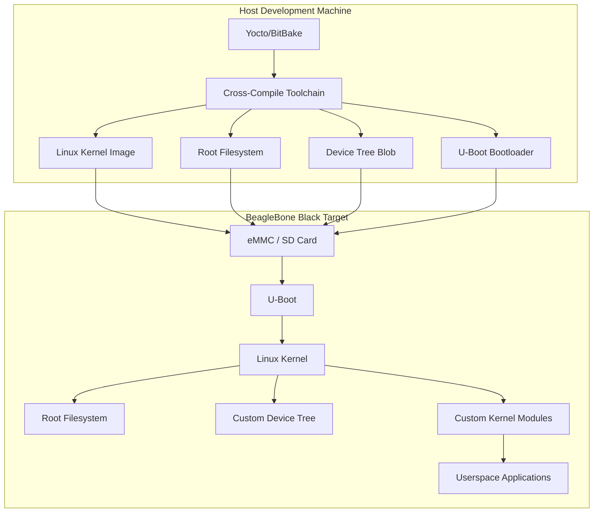
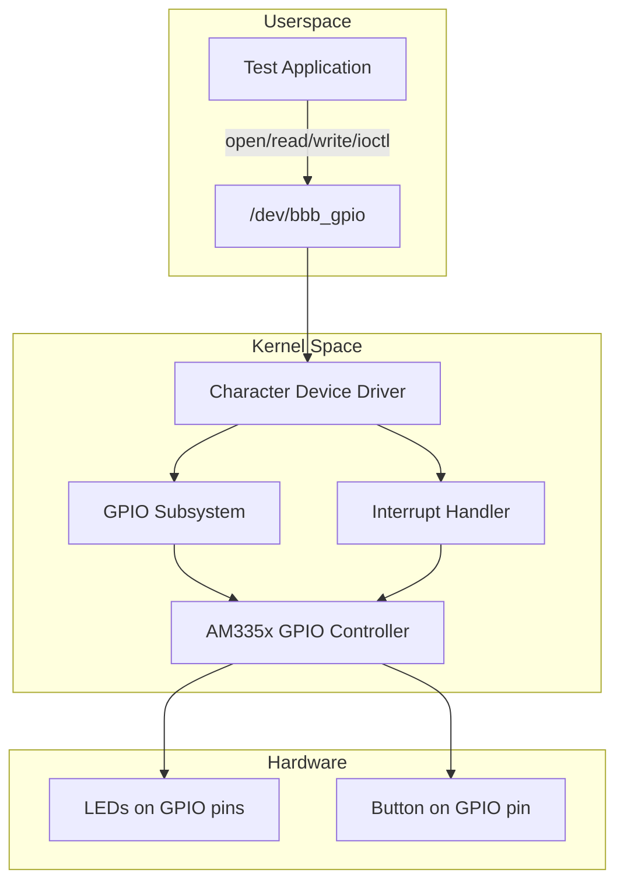
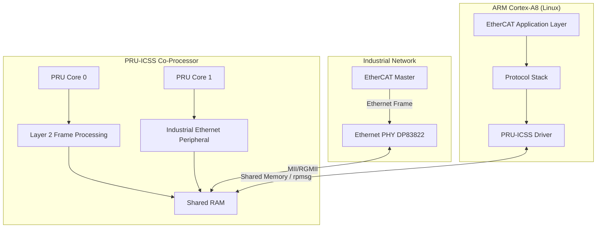
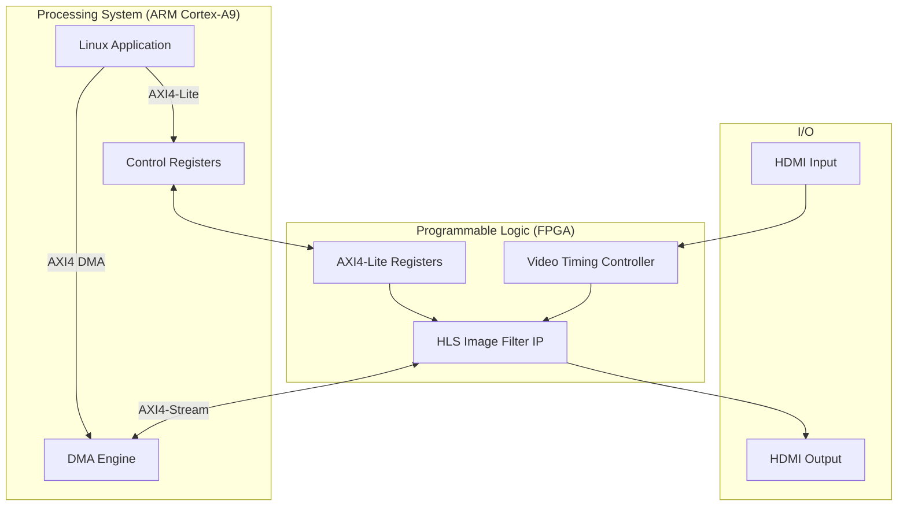
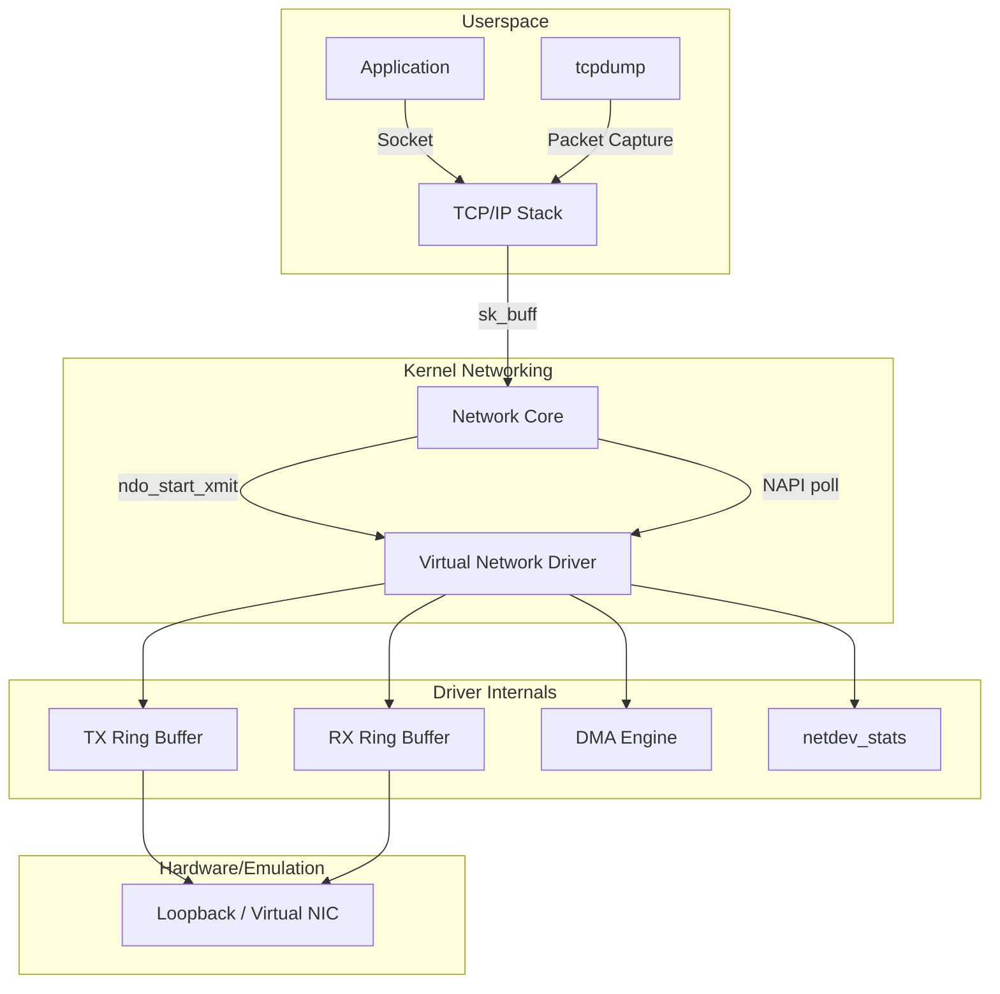
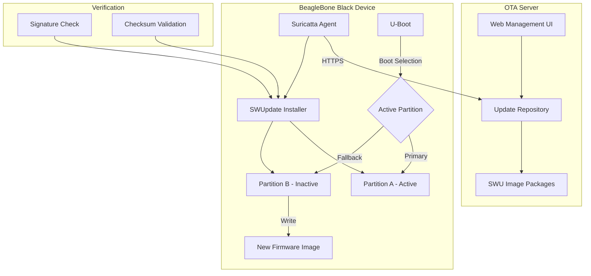
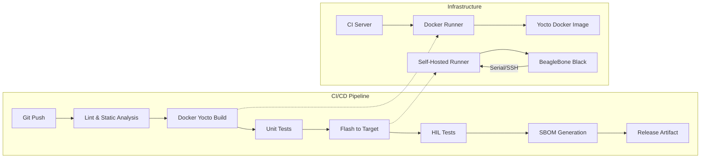
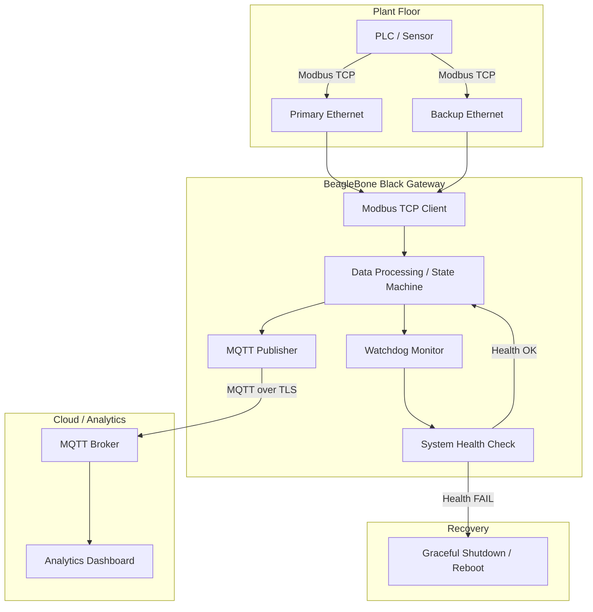
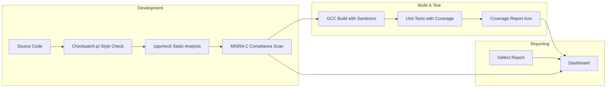
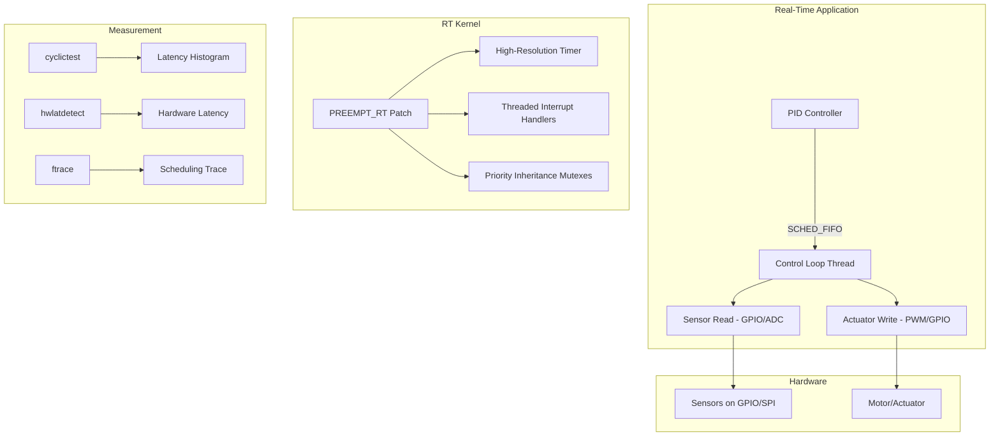

# Portfolio Preparation Guide — Embedded Linux Development Engineer

## Table of Contents

1. [Prologue](#prologue)
2. [Company and Ecosystem Research](#1-company-and-ecosystem-research)
   - 1.1 [Trust Recruit Pte. Ltd.](#11-trust-recruit-pte-ltd)
   - 1.2 [Likely End Client Industry](#12-likely-end-client-industry)
   - 1.3 [TI ARM SoC Ecosystem](#13-ti-arm-soc-ecosystem)
   - 1.4 [Xilinx/AMD SoC Ecosystem](#14-xilinxamd-soc-ecosystem)
   - 1.5 [Bootloader, Kernel, and Root Filesystem Workflows](#15-bootloader-kernel-and-root-filesystem-workflows)
   - 1.6 [ARM Cortex Architecture Differences](#16-arm-cortex-architecture-differences)
   - 1.7 [Network Communication Protocols in Embedded Systems](#17-network-communication-protocols-in-embedded-systems)
   - 1.8 [Fault Tolerance Techniques in Embedded Linux](#18-fault-tolerance-techniques-in-embedded-linux)
   - 1.9 [Singapore Embedded Systems Industry Landscape](#19-singapore-embedded-systems-industry-landscape)
3. [Job Role Deep Analysis](#2-job-role-deep-analysis)
   - 2.1 [Software Product Development from the Ground Up](#21-software-product-development-from-the-ground-up)
   - 2.2 [Fault-Tolerant Programming and QC](#22-fault-tolerant-programming-and-qc)
   - 2.3 [Software Safety Analysis and Quality Assurance](#23-software-safety-analysis-and-quality-assurance)
   - 2.4 [Scalable Automated Solutions](#24-scalable-automated-solutions)
   - 2.5 [Testing for Compatibility and Stability](#25-testing-for-compatibility-and-stability)
   - 2.6 [TI ARM / Xilinx SoC IDE Proficiency](#26-ti-arm--xilinx-soc-ide-proficiency)
   - 2.7 [Network Communication (In-Depth)](#27-network-communication-in-depth)
   - 2.8 [Java and C++ in Embedded Systems](#28-java-and-c-in-embedded-systems)
   - 2.9 [Hardware-Software Co-Design Considerations](#29-hardware-software-co-design-considerations)
4. [Portfolio Project Recommendations](#3-portfolio-project-recommendations)
   - [Project 1: Custom Yocto BSP for TI AM335x](#project-1-custom-yocto-bsp-for-ti-am335x-beaglebone-black)
   - [Project 2: Linux Character Device Driver with GPIO and Interrupts](#project-2-linux-character-device-driver-with-gpio-and-interrupts)
   - [Project 3: PRU-ICSS EtherCAT Slave Implementation on TI AM335x](#project-3-pru-icss-ethercat-slave-implementation-on-ti-am335x)
   - [Project 4: FPGA-ARM Co-Processing with HLS on Zynq-7000](#project-4-fpga-arm-co-processing-with-hls-on-zynq-7000)
   - [Project 5: Embedded Linux Network Driver Development](#project-5-embedded-linux-network-driver-development)
   - [Project 6: OTA Firmware Update System with SWUpdate](#project-6-ota-firmware-update-system-with-swupdate)
   - [Project 7: CI/CD Pipeline for Embedded Linux Firmware](#project-7-cicd-pipeline-for-embedded-linux-firmware)
   - [Project 8: Fault-Tolerant Industrial Communication Gateway](#project-8-fault-tolerant-industrial-communication-gateway)
   - [Project 9: MISRA C Compliance and Static Analysis Pipeline](#project-9-misra-c-compliance-and-static-analysis-pipeline)
   - [Project 10: Real-Time Linux for Deterministic Industrial Control](#project-10-real-time-linux-for-deterministic-industrial-control)
5. [Ranking, Gap Analysis, and Sources](#4-ranking-gap-analysis-and-sources)
   - 4.1 [Project Ranking by Interview Impact](#41-project-ranking-by-interview-impact)
   - 4.2 [Comprehensive Gap Analysis](#42-comprehensive-gap-analysis)
   - 4.3 [Bibliography and Source References](#43-bibliography-and-source-references)
6. [Footnote Index](#footnote-index)

---

## Prologue

This document is a comprehensive portfolio preparation guide for the **Embedded Linux Development Engineer** position (ref: LT99 / MCF-2026-1141175) posted by Trust Recruit Pte. Ltd. on MyCareersFuture. The target role requires expertise in **Linux, TI ARM SoCs [1], and Xilinx SoC [2] development**, with emphasis on fault-tolerant programming, network communication, and software product development from the ground up.

### How to Use This Document

1. **Step 1** provides deep context on the hiring ecosystem, target industry, and technology landscape. Understanding this context is essential for tailoring interview responses and project narratives.
2. **Step 2** deconstructs every qualification and duty listed in the job posting, explaining what each requirement means in practice and how it shapes daily engineering work.
3. **Step 3** recommends 10 production-grade portfolio projects, each mapped directly to specific job requirements. Every project includes architecture, tech stack, features, pitfalls, and interview value.
4. **Step 4** ranks the projects by expected interview impact, identifies gaps in coverage, and provides a complete source bibliography.

### Governing Principles

- **No fabrication.** Facts are distinguished from inferences throughout. CONFIRMED claims carry source citations. INFERENCE claims are explicitly labeled.
- **Practical orientation.** Every recommendation prioritizes real-world engineering value over academic completeness.
- **Source-backed claims.** Technical details reference official documentation from Texas Instruments [3], AMD/Xilinx [4], the Linux Kernel documentation [5], and established embedded systems references.

---

## 1. Company and Ecosystem Research

### 1.1 Trust Recruit Pte. Ltd.

| Field | Detail |
|---|---|
| Full Name | Trust Recruit Pte. Ltd. |
| EA License | 19C9950 (CONFIRMED) [6] |
| UEN | 201935022Z |
| Founded | 2019 |
| HQ | Singapore (with presence in Indonesia) |
| Team Size | ~30-38 professionals |
| Website | https://trustrecruit.com.sg |
| LinkedIn | https://sg.linkedin.com/company/trust-recruit-pte-ltd (7,579 followers) [7] |
| Collective Experience | 20+ years in consulting |
| Client Types | MNCs, public sector, SMEs |

### Industry Specializations (CONFIRMED from website)

Trust Recruit serves a broad range of industries with particular strength in manufacturing and technology [8]:

- **Manufacturing**: Semiconductor, automation, electronics, automotive, industrial, machinery, instruments
- **Construction and Engineering**: Contractor, developer, consultancy, buildings, infrastructure
- **IT and Telecommunication**: Software development, hardware, network security, database administration
- **Marine, Oil and Gas**: Shipyard, petroleum, energy, chemical

### Trust Search — Technology Subsidiary (CONFIRMED)

Trust Recruit operates a dedicated technology recruitment arm called **Trust Search** [9], specializing in:
- AI/ML placements
- Data and cybersecurity
- Infrastructure, software, and network roles
- Senior placements: MD/CEO, CIO/CTO, Solution Architect, Principal Engineer

### Current Embedded/Engineering Job Postings (CONFIRMED)

Trust Recruit has multiple concurrent embedded systems postings, confirming an active semiconductor and engineering division [10][11]:

1. **Embedded Linux Development Engineer (Linux/TI ARM/Xilinx SoC)** — LT99 (this role)
2. **Electronic Hardware Design Engineer (PCBA/RF/Analog)** — LT92 (schematic development, TI ARM/Xilinx SoC IDE, Altium Designer)
3. **Software Engineer (Automotive/OEM Projects/C)** — JL55 (automotive embedded, SoC/FPGA-based software)
4. **Staff Engineer / IC Verification** — (Synopsys/Cadence/SystemVerilog/UVM for graphics controller SoC)

> **Key Insight:** Trust Recruit's multiple concurrent TI ARM and Xilinx SoC job postings confirm they have a strong semiconductor/engineering division actively placing candidates with unnamed end clients in Singapore. The LT92 posting requiring both "TI ARM/Xilinx SoC IDE" and "Altium Designer" suggests the end client has hardware-software co-design teams where embedded software engineers work alongside hardware designers.

### End Client Inference

The actual employer is unnamed (common for agency postings). Based on the confirmed requirements — TI ARM SoC, Xilinx SoC, embedded Linux, fault tolerance, network communication, and the location in Singapore's "North Region" — the end client is most likely one of the following [INFERENCE]:

- **Defense technology company** (DSO National Laboratories, ST Engineering, or a defense subcontractor) — the combination of TI ARM + Xilinx SoC is characteristic of defense electronics where FPGA-ARM heterogeneous processing is standard
- **Industrial IoT / automation company** — TI's PRU-ICSS [12] enables industrial Ethernet protocols, and Singapore has 6 WEF Lighthouse factories
- **Telecommunications equipment company** — Xilinx Zynq is widely deployed in 5G/O-RAN infrastructure; Singapore is a major telecom hub
- **Semiconductor IP company** — several operate in Singapore's semiconductor cluster

> **Junior Engineer Note:** During interviews, researching Trust Recruit's client base and the specific industry vertical gives you context to frame your portfolio projects as directly relevant solutions to the client's domain challenges.

---

### 1.2 Likely End Client Industry

### What the TI ARM + Xilinx SoC Combination Tells Us

The simultaneous requirement for both TI ARM and Xilinx SoC expertise is a strong industry signal. These platforms serve different but complementary roles in embedded systems [13][14]:

| Platform | Primary Strength | Typical Role in System |
|---|---|---|
| TI ARM (Sitara) | Industrial communication, real-time I/O via PRU-ICSS | Control plane, protocol handling, Linux host |
| Xilinx Zynq | FPGA fabric for custom acceleration | Data plane, signal processing, DSP offload |

This dual-platform requirement strongly suggests a product architecture where:
1. **TI ARM SoC** runs Linux, handles control plane logic, industrial protocol stacks, and system management
2. **Xilinx SoC** provides FPGA-based acceleration for signal processing, real-time data acquisition, or custom hardware interfaces

### Singapore's Industry 4.0 Ecosystem

Singapore's push toward advanced manufacturing creates demand for engineers who understand both platforms [15]:

- **S$800M RIE2030 Semiconductor Flagship** for R&D (Budget 2026) [16]
- **S$500M NSTIC** (National Semiconductor Translation and Innovation Centre) R&D fab, operational 2027 [17]
- **6 WEF Lighthouse Factories** using advanced manufacturing with TI-class industrial automation
- **A*STAR IME** (Institute of Microelectronics) driving collaborative R&D between academia and industry [18]

> **Key Insight:** Singapore's semiconductor ecosystem is not just about chip fabrication. The downstream demand for embedded systems engineers who can build products on TI ARM and Xilinx SoC platforms — for industrial IoT, telecom infrastructure, and defense — is substantial and growing.

---

### 1.3 TI ARM SoC Ecosystem

### Sitara AM335x — The Industrial Workhorse [19]

The AM335x family is TI's most established industrial Linux platform, anchored by the ARM Cortex-A8 [20] processor.

| Feature | Specification |
|---|---|
| CPU | Single ARM Cortex-A8, up to 1 GHz |
| PRU-ICSS [21] | 2 programmable real-time units (200 MHz each) |
| Memory | LPDDR1/DDR2/DDR3/DDR3L, up to 1 GB |
| Connectivity | USB OTG, Ethernet (10/100/1000), 2x CAN, I2C, SPI, UART |
| GPU | PowerVR SGX530 3D |
| Industrial Protocols | EtherCAT, PROFINET, EtherNet/IP, SERCOS III (via PRU-ICSS) |
| Pricing | Starting at ~$4.96 (1ku volume) |
| Status | Mature; new designs should use AM62x |

The AM335x is the processor inside the **BeagleBone Black** [22], making it the most accessible entry point for learning TI embedded Linux development.

### Sitara AM62x — The Modern Industrial Platform [23]

| Feature | Specification |
|---|---|
| CPU | Quad 64-bit Cortex-A53, up to 1.4 GHz |
| Real-Time Core | Cortex-M4F at 400 MHz |
| Networking | 3-port GbE switch with TSN [24] |
| Security | Hardware Security Module (HSM), secure boot |
| Display | Dual display support, 3D graphics (AM625 variant) |
| Memory | DDR4/LPDDR4/DDR3L, up to 32 GB with ECC |
| Status | **Strongest recommendation for new TI Linux designs** |

The AM62x represents TI's current-generation industrial Linux platform with TSN support, making it the primary target for new industrial embedded Linux development.

### AM57xx — Heterogeneous Processing [25]

| Feature | Specification |
|---|---|
| CPU | Dual Cortex-A15 at 1.5 GHz |
| DSP | Dual C66x DSP for signal processing |
| PRU-ICSS | 2 instances for industrial Ethernet |
| Memory | Up to 4 GB DDR3 |
| Applications | Vision systems, robotics, medical imaging, avionics |

The AM57xx demonstrates TI's heterogeneous processing paradigm: Cortex-A runs Linux, C66x DSP handles math-intensive workloads, and PRU-ICSS manages real-time I/O.

### AM64x/AM65x — Industrial Communication [26]

The AM64x combines Cortex-A53 + Cortex-R5F [27] + PRU-ICSSG (gigabit-capable) for high-speed industrial Ethernet at up to 5 GbE ports, supporting EtherCAT, PROFINET, and EtherNet/IP at gigabit speeds.

### TI Processor SDK Linux (PSDK-LINUX) [28]

The PSDK-LINUX is TI's unified software platform providing:

- **Cross-compilation toolchain** for ARM targets
- **U-Boot** and **Linux kernel** sources with board-specific configurations
- **Yocto/OpenEmbedded** build system integration
- **Root filesystem** images (full, minimal, Docker-enabled, Edge AI variants)
- **SBOM support** via SPDX 3.0 and CycloneDX

**Build workflow** (Yocto-based) [29]:

```bash
git clone https://git.ti.com/git/arago-project/oe-layersetup.git tisdk
cd tisdk
./oe-layertool-setup.sh -f configs/processor-sdk/am62xx-evm
cd build
. conf/setenv
MACHINE=am62xx-evm bitbake -k tisdk-default-image
```

The SDK requires approximately 250-500 GB of disk space for full builds and benefits significantly from Docker-based build environments for reproducibility [30].

### TI Code Composer Studio (CCS) [31]

CCS is TI's integrated development environment supporting register-level debugging through JTAG [32]:

| Capability | Description |
|---|---|
| Multi-Core Debug | Simultaneous debug of A-core, R-core, and M-core |
| JTAG Probes | XDS100, XDS110, XDS200, XDS560v2, ProTrace |
| SysConfig | Pinmux and peripheral configuration tool |
| GEL Scripts | Automated device initialization (clock, DDR, pin mux) |
| EnergyTrace | Power profiling for energy-aware development |
| AI Integration | Latest version includes AI-assisted code development |

### TI PRU-ICSS (Programmable Real-time Unit) [33]

The PRU-ICSS is TI's unique differentiator for industrial applications:

**Architecture:**
- Two 32-bit RISC cores running at 200 MHz
- 8 KB instruction RAM + 8 KB data RAM per PRU
- 12 KB shared RAM
- Dedicated Ethernet MACs for industrial Ethernet
- Industrial Ethernet Peripheral (IEP) for synchronized communication

**Why it matters:** PRU-ICSS implements industrial Ethernet protocol stacks in firmware, eliminating the need for external ASICs like Beckhoff ET1100 for EtherCAT slave functionality [34].

**Protocol support:** EtherCAT, PROFINET RT/IRT, EtherNet/IP, PROFIBUS, HSR/PRP, SERCOS III, Industrial Drives.

**Gigabit evolution (PRU-ICSSG):** On AM64x/AM65x, the upgraded PRU-ICSSG supports gigabit industrial Ethernet with TSN.

---

### 1.4 Xilinx/AMD SoC Ecosystem

### Zynq-7000 SoC [35]

The Zynq-7000 combines ARM Cortex-A9 [36] with Artix-7 or Kintex-7 programmable logic:

| Feature | Specification |
|---|---|
| CPU | Dual/single Cortex-A9, up to 866 MHz (XC7Z030/7035/7045); 667 MHz (XC7Z020-1) |
| PL (Programmable Logic) | 28K to 444K logic cells |
| PS-PL Interconnect | 3,000+ AXI signals, up to 100 Gb/s bandwidth |
| Cache Coherency | AXI ACP port for hardware acceleration |
| Variants | 10 devices from Z-7007S to Z-7100 |

The Zynq-7000 is the entry point for ARM+FPGA development, widely used in machine vision, ADAS, and industrial IoT.

### Zynq UltraScale+ MPSoC [37]

The Zynq UltraScale+ is the workhorse for heterogeneous computing:

| Component | Specification |
|---|---|
| APU | Quad Cortex-A53 at 1.5 GHz (64-bit) |
| RPU | Dual Cortex-R5F at 600 MHz (lock-step or split) |
| GPU | ARM Mali-400 MP2 (EG/EV devices) |
| VCU | H.264/H.265 video codec, up to 4K@60fps (EV devices) |
| PL | Up to 3,528K system logic cells, 1,728 DSP slices |
| Security | TrustZone, AES-256, SHA-3, RSA-4096 |

The three-tier architecture (A53 for Linux, R5F for real-time, FPGA for custom acceleration) mirrors the multi-core paradigm seen in TI's AM64x, making cross-platform knowledge highly transferable.

### Versal ACAP [38]

The Versal Adaptive Compute Acceleration Platform represents the cutting edge (7nm FinFET):

| Component | Specification |
|---|---|
| APU | Dual Cortex-A72 at 1.7 GHz |
| RPU | Dual Cortex-R5F with VFPv3 |
| AI Engine | SIMD VLIW array for ML inference and signal processing |
| PL | Enhanced CLBs (4x size vs UltraScale), DSP58 engines |
| NoC | Chip-pervasive hardened interconnect |
| CPM | PCIe Gen4/Gen5 + CCIX |

The Versal is relevant for advanced roles involving AI/ML inference at the edge, 5G wireless, and next-generation radar systems.

### Xilinx PetaLinux [39]

PetaLinux is AMD/Xilinx's BSP creation toolkit for Zynq platforms:

**Build workflow:**
```bash
petalinux-create -t project -s <path-to-BSP>
petalinux-config --get-hw-description=<path-to-XSA>
petalinux-build
petalinux-package --boot --fsbl zynqmp_fsbl.elf \
    --fpga system.bit --pmufw pmufw.elf --atf bl31.elf --u-boot
```

**What gets built:** Device tree (DTB), FSBL/PLM, Trusted Firmware-A, U-Boot, Linux kernel, root filesystem, boot script.

**Device tree workflow:** PetaLinux auto-generates device tree files from the XSA hardware description, then the developer customizes via `system-user.dtsi` for peripheral configuration [40].

### Vivado HLS and Vitis Unified Software Platform [41]

**Vivado HLS** synthesizes C/C++ into RTL [42]:

```cpp
// Example HLS optimization pragmas
#pragma HLS PIPELINE II=1          // Overlap loop iterations
#pragma HLS ARRAY_PARTITION variable=buf cyclic factor=4
#pragma HLS INTERFACE m_axi port=data depth=1024

void process_image(uint8_t *data, uint8_t *output, int width) {
    for (int i = 0; i < width; i++) {
        #pragma HLS PIPELINE II=1
        output[i] = data[i] * 2 + 128;  // Simple image transform
    }
}
```

**Vitis** unifies HLS, embedded software development, and AI engine compilation for Versal.

### Recommended Development Boards [43][44]

| Board | Ecosystem | Processor | Price | Best For |
|---|---|---|---|---|
| BeagleBone Black | TI | AM3358 (Cortex-A8) | ~$55-59 | Entry-level TI Linux, PRU-ICSS learning |
| SK-AM62 | TI | AM6254 (Cortex-A53) | ~$199 | Modern TI industrial Linux |
| AM572x IDK | TI | AM5728 (Cortex-A15 + DSP) | ~$599 | Industrial communications |
| PYNQ-Z1 | Xilinx | Zynq-7020 (Cortex-A9 + FPGA) | ~$299 | Python productivity, FPGA learning |
| ZCU104 | Xilinx | Zynq US+ ZU7EV | ~$1,495 | UltraScale+ development |
| ZCU102 | Xilinx | Zynq US+ ZU9EG | ~$3,234 | Full-featured flagship platform |

---

### 1.5 Bootloader, Kernel, and Root Filesystem Workflows

### U-Boot Bootloader [45]

U-Boot serves as the bridge between hardware initialization and Linux kernel boot:

**Boot sequence:** Boot ROM -> SPL (Secondary Program Loader) -> U-Boot -> Linux Kernel

**U-Boot responsibilities:**
1. Hardware initialization: DRAM setup, clock configuration, serial console
2. Load kernel + device tree blob (DTB) from SD card, eMMC, NAND, or network (TFTP)
3. Pass control to kernel with boot arguments and DTB memory address

**Configuration** follows the Linux Kconfig model with board-specific `defconfig` files and `include/configs/` headers.

### Kernel Cross-Compilation [46]

```bash
export CROSS_COMPILE=arm-linux-gnueabihf-
export ARCH=arm
make <board>_defconfig
make menuconfig
make -j$(nproc) zImage dtbs modules
```

Key embedded kernel options include `CONFIG_DEVTMPFS_MOUNT` (auto-mount /dev), device tree configuration, and driver selection.

### Root Filesystem Approaches

| Approach | Complexity | Best For |
|---|---|---|
| BusyBox minimal | Low | Learning, constrained systems |
| Buildroot | Medium | Simple products, fast builds |
| Yocto/OpenEmbedded | High | Production, multi-product platforms |
| Pre-built SDK (TI PSDK, PetaLinux) | Low-Medium | Vendor-supported development |

---

### 1.6 ARM Cortex Architecture Differences [47]

| Feature | Cortex-A (Application) | Cortex-R (Real-Time) | Cortex-M (Microcontroller) |
|---|---|---|---|
| ISA Profile | ARMv7-A / ARMv8-A / ARMv9-A | ARMv7-R / ARMv8-R | ARMv6-M / v7-M / v8-M |
| Primary Goal | High performance for rich OS | Hard real-time + functional safety | Lowest power, cost, complexity |
| Typical OS | Linux, Android | RTOS (FreeRTOS, AUTOSAR), bare-metal | Bare-metal or small RTOS |
| Memory System | MMU (full virtual memory) | MPU + caches + TCM | Optional MPU, no cache |
| Multi-core | Common (SMP, big.LITTLE) | Often dual with lockstep | Usually single-core |
| Pipeline | Long, complex (out-of-order, speculative) | Medium, optimized for determinism | Very short (3-stage) |
| Safety | External safety islands | ASIL-B/D, ECC, lockstep built-in | Some parts ASIL-certified |

**How TI/Xilinx SoCs combine these cores [INFERENCE]:**

- **TI AM62x:** Cortex-A53 (Linux) + Cortex-M4F (real-time control)
- **TI AM64x:** Cortex-A53 (Linux) + Cortex-R5F (real-time) + PRU-ICSSG (industrial Ethernet)
- **Xilinx Zynq US+:** Cortex-A53 (APU/Linux) + Cortex-R5F (RPU/real-time) + Mali GPU + FPGA
- **Xilinx Versal:** Cortex-A72 (APU) + Cortex-R5F (RPU) + AI Engine + FPGA

---

### 1.7 Network Communication Protocols in Embedded Systems

### Industrial Ethernet Protocols

**EtherCAT [48]:**
IEEE 802.3 Ethernet-based fieldbus achieving >90% bandwidth utilization. The master sends a telegram through each node; slaves read/write on-the-fly. Achieves sub-100 microsecond cycle times. Linux implementations include the IgH EtherCAT Master (open source, GPL) and acontis EC-Master (commercial).

**PROFINET [49]:**
Siemens' industrial Ethernet standard with three communication levels:
- NRT: Standard TCP/IP, ~100ms
- RT: Bypasses TCP/IP, EtherType 0x8892, 1-10ms cycle times
- IRT: Bandwidth reservation + scheduling, cycle times down to 31.25 microseconds

**CAN Bus [50]:**
Robust multi-master vehicle bus standard. Linux support via SocketCAN [51] (`candump`, `cansend`). CAN FD extends data payload to 64 bytes.

**Modbus TCP:**
Simple master-slave protocol over Ethernet, widely used in industrial automation.

### Time-Sensitive Networking (TSN)

**gPTP / IEEE 802.1 AS [52]:**
Precise time synchronization across TSN networks. LinuxPTP [53] provides open-source implementation with `ptp4l` (PTP Hardware Clock synchronization), `phc2sys` (PHC-to-system clock), and `pmc` (runtime configuration).

### Serial Interfaces

| Interface | Wires | Speed | Common Use |
|---|---|---|---|
| UART [54] | TX/RX (2-wire) | 9600-115200 bps | Console, debug, simple communication |
| SPI [55] | MOSI/MISO/CLK/CS (4-wire) | Up to 100+ MHz | High-speed sensors, flash, displays |
| I2C [56] | SDA/SCL (2-wire) | 100/400/1000 kHz | Low-speed sensors, EEPROMs, RTCs |

---

### 1.8 Fault Tolerance Techniques in Embedded Linux

### Watchdog Timers [57]

The Linux kernel provides a comprehensive watchdog API. A userspace daemon pings `/dev/watchdog` at regular intervals; if notifications cease, the hardware watchdog resets the system after the configured timeout.

**Key mechanisms:**
- **Magic Close:** Requires sending character 'V' before closing; prevents accidental disable
- **CONFIG_WATCHDOG_NOWAYOUT:** Once started, watchdog cannot be stopped -- critical for safety systems
- **Pretimeout notification:** Triggers NMI/interrupt before reset, allowing panic info recording

### ECC Memory (EDAC Subsystem) [58]

The Linux EDAC (Error Detection And Correction) subsystem monitors memory controller errors:

| Error Type | Severity | Action |
|---|---|---|
| Corrected Error (CE) | Low | ECC corrects single-bit error automatically |
| Uncorrected Error (UE) | Medium | Cannot correct but not fatal; may retry |
| Deferred Error | Medium | Data poisoning; preemptive page offlining |
| Fatal Error | Critical | System must reboot; data may be corrupted |

**SECDED** (Single Error Correction, Double Error Detection) is the standard ECC mode using Hamming codes. The EDAC subsystem reports via `edac_mc_handle_error()` with memory controller hierarchy: channel, branch, DIMM, rank, chip.

### Fault Detection, Isolation and Recovery (FDIR) [59]

Production-grade embedded systems employ layered FDIR:
1. **Hardware protection:** ECC memory, watchdog timers, voltage/temperature monitors
2. **Redundant subsystems:** Dual communication paths, Triple Modular Redundancy (TMR) [60]
3. **Watchdog supervision:** Hardware WDT -> kernel driver -> userspace daemon hierarchy
4. **Software recovery:** State machine validation, graceful degradation, checkpointing

---

### 1.9 Singapore Embedded Systems Industry Landscape

### Semiconductor Ecosystem

Singapore hosts a complete semiconductor value chain across four wafer fab parks managed by JTC Corporation [61]:

| Company | Type | Singapore Operations |
|---|---|---|
| GlobalFoundries | Foundry | S$5B 300mm fab (opened Sep 2023) [62] |
| Micron | IDM | US$24B new wafer fab (ground broken Jan 2026), HBM packaging facility [63] |
| Infineon | IDM | Backend manufacturing, WEF Lighthouse 2020 |
| STMicroelectronics | IDM | Fab operations, 28nm/40nm, piezoMEMS Lab-in-Fab with A*STAR [64] |
| NXP | IDM | US$7.8B VSMC joint venture (with VIS/TSMC), 130nm-40nm, automotive/IoT |
| UMC | Foundry | 22nm Fab 12i P3 (opened Apr 2025) |

### Government Initiatives [65]

| Initiative | Investment | Status |
|---|---|---|
| RIE2030 Semiconductor Flagship | S$800M for R&D (Budget 2026) | Active [66] |
| NSTIC R&D Fab | S$500M at JTC nanoSpace @ Tampines | Operational 2027 [67] |
| NSTIC for Power Electronics | S$60M, 8-inch SiC R&D pilot line | Operational Apr 2026 |
| A*STAR IME | World's first 200mm SiC Open R&D Line | Active [68] |

### Defense and Embedded Systems

Singapore's defense technology ecosystem is a major consumer of TI ARM and Xilinx SoC platforms:

| Organization | Focus | TI/Xilinx Usage |
|---|---|---|
| DSO National Laboratories | Defence R&D, 1,700+ staff | Xilinx Zynq for radar, TI DSPs for signal processing [69] |
| ST Engineering | Defense, aerospace, C5ISR | Xilinx + TI DSPs for SDR baseband [70] |
| DSTA | Defense technology acquisition | Systems engineering for embedded platforms |
| CSIT | Cyber/infocomm defense | Embedded security platforms |

### Xilinx/AMD SoC Users in Singapore (CONFIRMED)

| Entity | Application | Source |
|---|---|---|
| DSO National Laboratories | Zynq SoC for radar and FPGA-ARM defense processing | LinkedIn engineer profiles [71] |
| ST Engineering | Xilinx + TI DSPs for SDR/C5ISR platforms | Job postings [72] |
| Addvalue Technologies | Zynq UltraScale+ RFSoC for satellite communications | Press release [73] |
| Land Transport Authority | Zynq-7000 for Intelligent Transport Systems (164km monitoring) | Xilinx PR [74] |
| Newstart Communication | Zynq-7000, Artix-7, Kintex US+ for 5G/O-RAN, SATCOM | Company website [75] |

### Engineering Culture in Singapore

Based on job postings, company reviews, and industry reports [CONFIRMED]:

1. **Multi-cultural, English-speaking:** Most MNCs and local companies operate in English
2. **Strong defense culture:** DSO, DSTA, ST Engineering, CSIT form the Defence Technology Community
3. **Hardware-software co-design emphasis:** Embedded engineers expected to understand both firmware and hardware
4. **Agile adoption:** Defense tech companies reference agile development for embedded work
5. **Competitive compensation:** SGD $4,200-$8,500/month for mid-level embedded engineers
6. **Security clearance:** Defense-embedded roles often require Singaporean citizenship or PR

---

## 2. Job Role Deep Analysis

This section deconstructs every qualification and duty from the job posting, explaining what each requirement means in practice for an Embedded Linux Development Engineer.

### 2.1 Software Product Development from the Ground Up

### What "From the Ground Up" Means in Embedded Context

Developing embedded software "from the ground up" means building the complete software stack that transforms a bare PCB [76] into a functioning product. This encompasses multiple layers [INFERENCE]:

| Layer | Components | Typical Tools |
|---|---|---|
| Board Support Package (BSP) | Device tree, kernel configuration, driver selection, boot configuration | Yocto/Buildroot, PetaLinux, TI PSDK |
| Hardware Abstraction Layer (HAL) | Register-level drivers, peripheral initialization, pin mux configuration | Direct register access, vendor HAL libraries |
| Middleware | Protocol stacks, communication libraries, data processing pipelines | lwIP, Qt, custom libraries |
| Application Layer | Product-specific logic, UI, data acquisition, control algorithms | C/C++, Java, Python |
| OTA Infrastructure | Update mechanism, A/B partitioning, rollback logic | SWUpdate, Mender, RAUC |

### Working with Hardware Designers

The job posting specifies "close collaboration with hardware designers." This implies [INFERENCE]:

1. **Schematic review:** Embedded software engineers review schematics to verify pin assignments, peripheral connectivity, and voltage levels before PCB fabrication
2. **Device tree creation:** Translating schematic information into Linux device tree source files that describe hardware configuration to the kernel
3. **Hardware bring-up:** First-boot debugging on new PCB revisions, validating power sequencing, clock configuration, and peripheral access
4. **Debug collaboration:** Working with hardware engineers to trace signal integrity issues, timing violations, and power supply anomalies using oscilloscopes and logic analyzers

> **Key Insight:** The requirement to "develop new software products from the ground up in close collaboration with hardware designers" distinguishes this role from application-layer embedded development. It signals the end client designs custom hardware platforms and needs engineers who can take a PCB from prototype to production-ready firmware.

---

### 2.2 Fault-Tolerant Programming and QC

### Fault Tolerance Patterns in Embedded Linux [77]

| Pattern | Implementation | When to Use |
|---|---|---|
| Watchdog Timer Recovery | Hardware WDT triggers reboot on software hang | Always in production firmware |
| Redundant Communication Paths | Dual Ethernet, primary/backup serial links | Safety-critical and high-availability systems |
| ECC Memory Protection | SECDED codes detect and correct single-bit errors | Systems with radiation exposure or long deployment |
| Graceful Degradation | Reduce functionality rather than fail completely | Systems with partial failure modes |
| State Machine Recovery | Validate state transitions, restore to known-good state | Protocol handlers, multi-step processes |
| Checkpointing | Save process state periodically for rollback | Long-running computations, transaction systems |

### What Thorough QC Looks Like for Embedded Firmware

Unlike desktop software, embedded QC must account for hardware constraints and field failure costs [78]:

1. **Static analysis on every commit:** MISRA C compliance, Coverity/Polyspace scans
2. **Unit testing:** >80% code coverage with hardware mocks
3. **Integration testing:** Cross-module verification with simulated peripherals
4. **System testing:** Full firmware on real hardware with stimulus-response validation
5. **Stress testing:** Memory exhaustion, maximum interrupt rate, network flooding
6. **Regression testing:** Automated suite on every PR, nightly full regression
7. **Power testing:** Brown-out behavior, rapid cycling, low-battery handling
8. **OTA validation:** A/B partition testing, rollback verification

> **Common Pitfall:** Most companies sit between "we ran it on the bench and it seemed fine" and "we have a full HIL rig with automated regression coverage" [79]. Demonstrating even basic automated QC in your portfolio distinguishes you from candidates who only have bench-tested prototypes.

---

### 2.3 Software Safety Analysis and Quality Assurance

### Safety Standards Overview [80]

| Standard | Domain | Levels | Key Requirement |
|---|---|---|---|
| IEC 61508 [81] | Industrial (general) | SIL 1-4 | V-model development, independent verification |
| ISO 26262 [82] | Automotive | ASIL A-D | Hazard analysis, MISRA C, static analysis |
| DO-178C [83] | Aerospace | DAL A-E | Requirements-based testing, MC/DC coverage |

### How Safety Standards Influence Development

For the Singapore embedded systems context (defense, industrial IoT, telecom), **IEC 61508** and **ISO 26262** are the most relevant:

- **Mandatory V-model development** with full traceability from requirements to test cases
- **Tool qualification:** Development tools must be certified for the target safety level (e.g., Coverity is TUV SUD certified for IEC 61508 SIL 3 and ISO 26262 ASIL D [84])
- **Static analysis:** MISRA C:2023 compliance is typically mandatory for safety-related code [85]
- **Code review:** Formal review processes with documented findings
- **Formal methods:** May be required for highest safety levels (DO-178C DAL A)

### QA Tools for Embedded Linux [86]

| Tool | Type | Certification |
|---|---|---|
| Polyspace Bug Finder | Static analysis (abstract interpretation) | TUV SUD for IEC 61508 and ISO 26262 |
| Polyspace Code Prover | Formal verification | Proves absence of runtime errors |
| Coverity | Enterprise static analysis | TUV SUD certified for IEC 61508-3, ASIL D, DO-178C Level A |
| Helix QAC (Perforce) | MISRA C checker | MISRA C:2023 compliant |
| GCC/LLVM Sanitizers | Runtime instrumentation | ASan, UBSan for development/testing |
| cppcheck | Open-source static analysis | No certification, useful for basic checks |

---

### 2.4 Scalable Automated Solutions

### Critical Automation in Embedded Workflows [87]

| Automation Area | Tools | Impact |
|---|---|---|
| CI/CD for cross-compiled firmware | Jenkins, GitLab CI, GitHub Actions with Docker | Eliminates "works on my machine" bugs |
| Build system automation | Yocto/Buildroot with sstate cache | Reproducible builds, fast iteration |
| Automated hardware-in-the-loop testing | BenchCI, Zephyr Twister, custom harness | Validates on real hardware without manual intervention |
| Automated regression testing | pytest-embedded, Robot Framework | Catches regressions before merge |
| OTA deployment automation | SWUpdate, Mender, RAUC with CI integration | Automated firmware distribution |

### Build System as Automated Solution

The Yocto Project [88] exemplifies the type of "scalable automated solution" the job posting describes:

1. **Reproducible builds:** Docker-containerized build environments eliminate host machine dependency
2. **Incremental builds:** sstate cache [89] enables fast rebuilds when only one package changes
3. **Automated dependency resolution:** BitBake resolves build order, cross-compilation, and package dependencies
4. **Multi-product scalability:** Machine configurations enable building for multiple hardware targets from one source tree

> **Interview Talking Point:** Describing how you automated the Yocto build pipeline with Jenkins, Docker, and sstate caching demonstrates the "scalable automated solutions that save time/resources" the job posting requires.

---

### 2.5 Testing for Compatibility and Stability

### Testing Frameworks for Embedded Linux [90]

| Framework | Level | Purpose |
|---|---|---|
| LTP (Linux Test Project) [91] | Kernel/system | 3,800+ tests for kernel reliability, robustness, stability |
| Unity/CMock [92] | Unit | Lightweight C unit tests with auto-generated mocks |
| CMocka [93] | Unit | C unit testing with mock object support, minimal footprint |
| Robot Framework [94] | System/acceptance | Keyword-driven testing for system-level validation |
| pytest + pytest-embedded [95] | Orchestration | Test orchestration, CI integration, hardware management |
| Yocto Runtime Tests [96] | System | Automated tests on QEMU or real target hardware |

### Boundary and Stress Testing on Constrained Targets

| Test Type | What to Verify | How |
|---|---|---|
| Memory stress | No corruption near capacity | Allocate near limit, verify integrity |
| Timing stress | Deadlines met under load | Run at maximum interrupt rate |
| Communication stress | No data loss under flood | Saturate network interface |
| Power cycling | Correct behavior on rapid restart | Automated power on/off sequences |
| Temperature | Behavior across operating range | Environmental chamber testing |

---

### 2.6 TI ARM / Xilinx SoC IDE Proficiency

### What "Working Knowledge" of These IDEs Means

The job posting requires "working knowledge of TI ARM / Xilinx SoC IDE." This encompasses [97]:

**TI Code Composer Studio (CCS) workflows:**
- Register-level debugging: Read/write peripheral registers to verify configuration
- JTAG/SWD setup: Connect debug probe, configure target, load firmware
- GEL script execution: Automate device initialization (clock, DDR, pin mux)
- Multi-core debugging: Simultaneous debug of Cortex-A + Cortex-R/M cores
- Peripheral configuration: SysConfig tool for pinmux, clock tree, DMA setup

**Xilinx Vitis/Vivado workflows:**
- Hardware platform creation in Vivado with PS + PL block design
- HLS kernel development: Write C/C++ functions, apply optimization pragmas, synthesize to RTL
- XSCT command-line debugging: Connect, download ELF, set breakpoints, step through code
- Device tree customization for FPGA-accelerated peripherals
- Bitstream generation and programming

> **Junior Engineer Note:** You do not need to be an expert in both IDEs. However, you should be able to: (1) create a project, (2) configure the target device, (3) build and load firmware, (4) use breakpoints and watchpoints, (5) inspect memory and registers. These five capabilities demonstrate "working knowledge."

---

### 2.7 Network Communication (In-Depth)

### What "In-Depth Understanding" Means in Embedded Contexts [98]

| Depth Level | Skills | Example |
|---|---|---|
| Surface | Configure network interface, basic socket programming | `ifconfig`, `ping`, simple TCP client/server |
| Working | TCP/IP stack internals, socket options, packet analysis | `tcpdump`, `wireshark`, custom socket options |
| Deep | Kernel networking subsystem, NAPI, DMA-based networking, network device drivers | Write or modify Linux network drivers |
| Expert | Industrial protocol stacks, real-time Ethernet, TSN, protocol co-processing | EtherCAT/PROFINET on PRU-ICSS, gPTP synchronization |

The job posting likely expects **deep-level** understanding given the emphasis on "in-depth understanding of network communication" combined with TI ARM/Xilinx SoC requirements.

### Key Networking Concepts for This Role

1. **TCP/IP on constrained devices:** Buffer management, MTU optimization, DHCP vs static IP
2. **Socket programming:** BSD sockets, raw sockets (PF_PACKET), multicast
3. **Packet capture/analysis:** tcpdump, Wireshark for protocol debugging
4. **Real-time Ethernet:** EtherCAT, PROFINET RT/IRT with sub-millisecond cycle times
5. **Kernel networking subsystem:** sk_buff [119] lifecycle, NAPI [100] for interrupt mitigation, netfilter
6. **DMA-based networking:** Hardware offload for high-throughput, low-latency communication
7. **Network device drivers:** net_device [101] structure, ndo_start_xmit, PHY management (phylink)

---

### 2.8 Java and C++ in Embedded Systems

### Why Both Languages Are Required [102]

| Aspect | C++ | Java |
|---|---|---|
| Hard real-time | Preferred (deterministic memory) | Requires RTSJ [103] for determinism |
| Memory efficiency | Minimal overhead | JVM + GC overhead |
| Safety standards | MISRA C++ available | Less tooling available |
| Development speed | Slower | Faster (productivity, libraries) |
| Network/IoT middleware | More effort needed | Rich library ecosystem |
| Platform independence | Compiled per target | JVM provides cross-platform |

**Typical embedded use cases for each:**

**C++:** Performance-critical firmware, device drivers, HAL development, AUTOSAR components, DSP algorithms, safety-critical control systems. Modern C++ (C++14/17) with restricted feature set (no exceptions, no dynamic allocation in safety-critical paths).

**Java:** HMI/application layers, enterprise integration middleware, network-centric devices (set-top boxes, IoT gateways), management/control plane. JNI/JNA for native callouts to C/C++ when performance is critical.

> **Key Insight:** The requirement for both Java and C++ suggests the end client has a product architecture where C++ handles the performance-critical data plane (drivers, protocol stacks, real-time processing) while Java handles the management/control plane (application logic, UI, network services).

---

### 2.9 Hardware-Software Co-Design Considerations

### How Co-Design Shapes Engineering Decisions

The hardware-software co-design nature of embedded product development means every engineering decision involves trade-offs across both domains:

| Decision | Hardware Consideration | Software Consideration |
|---|---|---|
| Processor selection | Power, package, peripheral availability | Linux support, toolchain maturity, community |
| Memory architecture | DDR type, ECC support, bandwidth | Kernel memory management, DMA coherency |
| Peripheral interface | Signal integrity, voltage levels, timing | Driver complexity, device tree configuration |
| Boot strategy | Flash type, boot pins, JTAG access | Bootloader selection, OTA mechanism |
| Debug strategy | JTAG/SWD connector, test points | Debug probe selection, trace capability |
| Power management | Voltage regulators, decoupling, sequencing | cpufreq, suspend/resume drivers, wakeup sources |

> **Trade-off Alert:** In co-design environments, optimizing hardware for cost often increases software complexity (e.g., fewer DDR lanes require careful memory tuning), and optimizing software for performance may require hardware changes (e.g., adding DMA engines). The best embedded engineers understand both sides well enough to negotiate optimal system-level trade-offs.

---

## 3. Portfolio Project Recommendations

The following 10 portfolio projects are designed to maximize competitiveness for the Embedded Linux Development Engineer position at Trust Recruit. Each project is mapped directly to specific job requirements and prioritizes hands-on embedded Linux engineering over generic software development.

> **Hardware Budget Note:** Projects are designed with tiered budgets. The most impactful projects (Projects 1-3, 5-6) can be completed with a single BeagleBone Black (~$55). Projects requiring FPGA (Projects 4, 9) need a PYNQ-Z1 (~$299). Projects requiring industrial Ethernet (Projects 3, 8) benefit from additional Ethernet PHY hardware.

---

## Project 1: Custom Yocto BSP for TI AM335x BeagleBone Black

### What the Project Is

Build a completely custom Linux distribution for the BeagleBone Black [104] using the Yocto Project [105], starting from a minimal Poky [106] build and progressively adding board support, custom device tree overlays, kernel modules, and userspace applications. The end result is a production-ready firmware image with custom drivers, a branded boot splash, and automated build scripts that can be rebuilt deterministically from any machine.

### Why It Is Relevant to This Role

This project directly addresses the "develop new software products from the ground up" and "build scalable, automated solutions" requirements. BSP development is the foundational skill for any embedded Linux role — it demonstrates mastery of the entire build pipeline from toolchain to root filesystem.

### Linux and Embedded Systems Concepts Demonstrated

- Yocto Project layer architecture (meta-layers, recipes, .bbappend files)
- Custom device tree overlay creation and compilation
- Linux kernel configuration and module compilation (Kconfig, .config)
- Cross-compilation toolchain management
- BitBake build engine and sstate cache optimization
- Root filesystem customization (package selection, init system, startup services)

### Recommended Architecture



### Suggested Hardware and Tech Stack

| Component | Choice | Justification |
|---|---|---|
| Board | BeagleBone Black Rev C (~$55) | TI AM3358, 512MB DDR3, 4GB eMMC, PRU-ICSS, widest community support |
| Host OS | Ubuntu 22.04 LTS | Officially supported by Yocto |
| Build System | Yocto Kirkstone LTS | Long-term support release, compatible with meta-ti |
| BSP Layer | meta-ti (TI BSP) | Official TI Yocto layer for Sitara processors |
| Kernel | Linux 5.10 (Yocto default for BBB) | Stable, well-tested on AM335x |

### Essential Features

1. **Custom meta-layer** (`meta-custom-bbb`) with layer priority and proper structure
2. **Custom device tree overlay** enabling specific peripherals (e.g., enabling PRU-ICSS, adding I2C sensor)
3. **Out-of-tree kernel module** (character device or LED driver) integrated into the build
4. **Custom userspace application** that interacts with the kernel module
5. **Automated build script** that builds the complete image from a clean host machine
6. **Image size optimization** reducing root filesystem below 200 MB

### Engineering Challenges

- **First build time:** Yocto initial build takes 2-4 hours and requires 250+ GB disk
- **Layer conflict resolution:** Managing layer priorities and recipe overrides
- **Device tree debugging:** Device tree compilation errors are cryptic; requires understanding of DTS syntax and hardware description
- **Kernel configuration:** Finding the right Kconfig options for custom hardware requires reading datasheets

### Common Implementation Pitfalls

| Pitfall | Fix |
|---|---|
| "Nothing to build" errors | Ensure `conf/local.conf` has correct `MACHINE` and layers are added via `bitbake-layers add-layer` |
| Kernel module not loading | Verify `module_autoload` in recipe and check `dmesg` for version mismatch |
| Device tree overlay not applying | Check `u-boot` bootargs for `fdtoverlays` parameter and verify DT overlay compiles cleanly |
| Image too large | Use `IMAGE_FEATURES` to strip debug info, use `packagegroup-core-boot` for minimal base |

### Required Knowledge

- Linux command line proficiency (bash, vim/nano, file permissions)
- Basic C programming (for kernel module and userspace app)
- Understanding of cross-compilation concepts
- Familiarity with Makefiles

### Estimated Difficulty

**Medium.** 3-5 weeks for someone with basic Linux skills. The Yocto learning curve is the primary bottleneck — expect 1-2 weeks just to understand the build system before productive work begins.

### Resume and Interview Value

- **Talking point 1:** "I built a complete custom Linux distribution from scratch using Yocto, including custom device tree overlays and kernel modules, reducing image size by 60% compared to the default BSP."
- **Talking point 2:** "I automated the build pipeline so any developer can reproduce the exact same firmware image from a clean Ubuntu machine using Docker."
- **Talking point 3:** "I debugged a device tree misconfiguration that prevented GPIO pinmux from being applied correctly — I had to read the AM335x TRM to understand the pad configuration register layout."

### Meaningful Extensions Toward Production Scale

- Implement Yocto sstate cache on a shared NFS server for team builds
- Add CI/CD integration (Jenkins) to build and test on every commit
- Create multiple image variants (minimal, development, production-hardened)
- Add SWUpdate recipe for OTA update capability
- Integrate automated QEMU-based smoke tests into the build pipeline

---

## Project 2: Linux Character Device Driver with GPIO and Interrupts

### What the Project Is

Write a Linux character device driver [107] for the BeagleBone Black that controls GPIO pins with interrupt support. The driver exposes a `/dev/bbb_gpio` device file that userspace applications can read from and write to, toggling LEDs and responding to button press interrupts. The driver is built as an out-of-tree kernel module, integrated into the Yocto build system, and includes a userspace test application.

### Why It Is Relevant to This Role

Device driver development is explicitly listed as a requirement through the "embedded system hardware development" qualification. Character device drivers are the foundation of all Linux driver development and demonstrate understanding of the Linux kernel's file abstraction, interrupt handling, and memory management.

### Linux and Embedded Systems Concepts Demonstrated

- Linux device driver model (cdev, file_operations, major/minor numbers)
- GPIO subsystem and pinctrl framework
- Interrupt handling (request_irq, tasklet, threaded IRQ)
- Device tree integration for hardware description
- Module loading/unloading (insmod, rmmod, modprobe)
- Copy between kernel space and user space (copy_to_user, copy_from_user)

### Recommended Architecture



### Suggested Hardware and Tech Stack

| Component | Choice | Justification |
|---|---|---|
| Board | BeagleBone Black | 2x 46-pin headers with GPIO access, PRU-ICSS for advanced I/O |
| LED resistors | 330 ohm + LED | Standard GPIO output test |
| Button | Tactile switch + pull-up resistor | GPIO interrupt input test |
| Build System | Yocto + custom meta-layer | Consistent with Project 1 |
| Kernel | Linux 5.10+ with CONFIG_GPIO_CDEV enabled | Modern GPIO character device interface |

### Essential Features

1. **Character device registration** with dynamic major number allocation
2. **GPIO output control** via write operations (toggle LED state)
3. **GPIO interrupt handling** on button press with debounce (threaded IRQ)
4. **Read operation** returning current GPIO state and interrupt count
5. **ioctl interface** for advanced configuration (pull-up/down, drive strength)
6. **Proper module cleanup** (unregister device, free IRQ, release GPIO)
7. **Device tree overlay** defining the GPIO pin configuration

### Engineering Challenges

- **GPIO pin numbering:** Understanding the difference between Linux GPIO numbers and hardware GPIO pins (requires AM335x TRM reference)
- **Interrupt debounce:** Hardware debounce via GPIO debounce register vs software debounce via delayed work queue
- **Concurrency:** Handling simultaneous read/write from multiple processes (requires mutex/spinlock)
- **Device tree syntax:** Correctly specifying GPIO pins in DTS format with proper phandle references

### Common Implementation Pitfalls

| Pitfall | Fix |
|---|---|
| GPIO requested but not released | Always call `gpio_free()` in module exit and error paths |
| Interrupt handler too long | Use threaded IRQ (`request_threaded_irq`) or tasklet for deferred work |
| `copy_to_user` fails silently | Always check return value and handle `-EFAULT` |
| Module segfault on unload | Ensure `module_exit` cleans up in reverse order of `module_init` |

### Required Knowledge

- C programming (pointers, structs, function pointers)
- Basic Linux system calls (open, read, write, ioctl, close)
- Understanding of kernel vs userspace memory separation
- AM335x datasheet basics (GPIO register map)

### Estimated Difficulty

**Medium-Hard.** 4-6 weeks. The kernel programming model is fundamentally different from userspace — debugging is harder (no printf, use printk/dmesg), memory mistakes cause kernel panics, and understanding the device tree is a steep learning curve.

### Resume and Interview Value

- **Talking point 1:** "I wrote a character device driver that handles GPIO interrupts with debouncing, demonstrating the complete lifecycle from device tree configuration to userspace interface."
- **Talking point 2:** "I debugged a kernel panic caused by accessing freed memory in the interrupt handler — this taught me the importance of understanding kernel memory management and proper locking."
- **Talking point 3:** "The driver follows the standard Linux kernel coding style and includes proper error handling in every code path, making it suitable for upstream submission."

### Meaningful Extensions Toward Production Scale

- Add DMA support for bulk GPIO operations
- Implement power management (suspend/resume callbacks)
- Add sysfs interface for runtime configuration
- Write kernel selftests for the driver
- Submit the driver upstream to the Linux kernel mailing list

---

## Project 3: PRU-ICSS EtherCAT Slave Implementation on TI AM335x

### What the Project Is

Implement an EtherCAT [108] slave device on the BeagleBone Black using the TI PRU-ICSS [109] subsystem. This project demonstrates the unique industrial Ethernet capability of TI Sitara processors, where two programmable RISC cores handle real-time EtherCAT protocol processing independently of the main ARM Cortex-A8 running Linux. The implementation uses TI's PRU-ICSS Industrial Software package and includes process data mapping, mailbox communication, and CoE (CANopen over EtherCAT) [110] object dictionary.

### Why It Is Relevant to This Role

This project directly targets the most distinctive skill in the job posting: TI ARM SoC expertise for industrial communication. PRU-ICSS-based industrial Ethernet is TI's key differentiator and is critical for roles involving industrial automation, factory controls, and process communication.

### Linux and Embedded Systems Concepts Demonstrated

- TI PRU-ICSS architecture and programming model
- Industrial Ethernet protocol implementation (EtherCAT Layer 2)
- Shared memory communication between ARM Linux and PRU firmware
- remoteproc [111] and rpmsg [112] frameworks for multi-core communication
- Real-time firmware development on PRU cores
- Industrial protocol stack integration

### Recommended Architecture



### Suggested Hardware and Tech Stack

| Component | Choice | Justification |
|---|---|---|
| Board | BeagleBone Black (AM3358) | Has PRU-ICSS1 with dual PRU cores, Ethernet PHY |
| Ethernet PHY | DP83822 (if replacing onboard PHY) | Industrial-grade PHY commonly used with TI PRU-ICSS |
| Software | TI PRU-ICSS Industrial Software | Official TI package for industrial protocol implementations |
| Protocol | EtherCAT Slave (via Beckhoff SSC or TI stack) | Most widely deployed industrial Ethernet protocol |
| Debug Tool | BeagleBone PRU debugger (Linux PRU tools) | For debugging PRU firmware |

### Essential Features

1. **PRU firmware** implementing EtherCAT slave controller (ESC) functionality
2. **Process Data Object (PDO) mapping** for cyclic data exchange
3. **Service Data Object (SDO) access** for acyclic parameter configuration
4. **SyncManager configuration** for data consistency between master and slave
5. **AL Status/State management** (INIT, PRE-OP, SAFE-OP, OP states)
6. **Linux userspace application** reading/writing process data via shared memory
7. **Configuration documentation** explaining the EtherCAT network topology

### Engineering Challenges

- **Real-time determinism:** PRU firmware must process Ethernet frames within strict timing constraints (sub-millisecond)
- **Memory mapping:** Correctly configuring shared memory regions between PRU and ARM
- **PRU toolchain:** Learning the PRU assembly/C toolchain (pru-gcc, pru-as)
- **Protocol compliance:** EtherCAT conformance testing requires careful implementation of the standard

### Common Implementation Pitfalls

| Pitfall | Fix |
|---|---|
| PRU firmware size exceeds 8KB instruction RAM | Optimize code or use external code execution from shared RAM |
| Data corruption between PRU and ARM | Use proper memory barriers and cache coherency management |
| EtherCAT master rejects slave | Verify AL state machine transitions and SyncManager configuration |
| Jitter in real-time processing | Pin PRU interrupts to specific cores, disable unnecessary interrupts |

### Required Knowledge

- EtherCAT protocol basics (master/slave, PDO, SDO, SyncManager)
- TI PRU-ICSS architecture (registers, memory map, interrupt system)
- C programming for embedded targets
- Industrial Ethernet fundamentals

### Estimated Difficulty

**Hard.** 6-10 weeks. PRU-ICSS programming has a steep learning curve, EtherCAT protocol compliance is demanding, and real-time debugging requires specialized tools. This is the most technically challenging project in this list.

### Resume and Interview Value

- **Talking point 1:** "I implemented an EtherCAT slave on TI AM335x using PRU-ICSS, demonstrating real-time industrial Ethernet protocol handling with sub-millisecond cycle times."
- **Talking point 2:** "This project required understanding both the PRU firmware architecture and the ARM Linux remoteproc/rpmsg framework for multi-core communication."
- **Talking point 3:** "The implementation eliminates the need for external EtherCAT ASICs, reducing BOM cost while maintaining protocol compliance."

### Meaningful Extensions Toward Production Scale

- Add PROFINET RT support as an alternative industrial protocol
- Implement cyclic data exchange with industrial sensors/actuators
- Add diagnostics via Linux sysfs and ethtool
- Integrate with a commercial EtherCAT master for conformance testing
- Port to AM64x with PRU-ICSSG for gigabit industrial Ethernet

---

## Project 4: FPGA-ARM Co-Processing with HLS on Zynq-7000

### What the Project Is

Implement a hardware-accelerated image processing pipeline on the PYNQ-Z1 [112] board using Vivado HLS [113] to synthesize a C/C++ image filter into FPGA logic, while the ARM Cortex-A9 runs Linux and orchestrates data flow. The project demonstrates the ARM+FPGA co-processing paradigm where the ARM handles control and I/O while the FPGA fabric provides parallel computation for performance-critical algorithms.

### Why It Is Relevant to This Role

The job posting requires "Xilinx SoC IDE" proficiency and "embedded system hardware development" experience. This project demonstrates the FPGA-ARM co-processing model that is central to Xilinx SoC development and directly exercises the Vitis/Vivado toolchain.

### Linux and Embedded Systems Concepts Demonstrated

- PetaLinux BSP creation and device tree customization
- Vivado HLS synthesis (C/C++ to RTL)
- AXI4 [114] interface between ARM (PS) and FPGA (PL)
- DMA-based data transfer between PS and PL
- Xilinx OpenCV library integration
- Linux DMA driver (Xilinx DMA/XDMA)

### Recommended Architecture



### Suggested Hardware and Tech Stack

| Component | Choice | Justification |
|---|---|---|
| Board | PYNQ-Z1 (~$299) | Zynq-7020 with Python productivity framework, HDMI in/out |
| Tool | Vivado 2024.2 + Vitis HLS | Free WebPack edition supports Zynq-7000 |
| Language | C/C++ for HLS, Python for PYNQ framework | Demonstrates both HLS and software orchestration |
| Protocol | AXI4-Stream for data, AXI4-Lite for control | Standard Xilinx PS-PL communication |
| Example Filter | Sobel edge detection or Gaussian blur | Demonstrable, visual results |

### Essential Features

1. **HLS synthesis** of a C/C++ image processing function with optimization pragmas
2. **Vivado block design** connecting PS to PL via AXI interconnect
3. **PetaLinux BSP** with device tree for FPGA overlays
4. **DMA data transfer** between PS DDR and PL processing pipeline
5. **Python test script** using PYNQ framework to control the pipeline
6. **Performance benchmarking** comparing software vs FPGA-accelerated processing

### Engineering Challenges

- **HLS optimization:** Achieving target throughput requires careful pragma selection (PIPELINE, UNROLL, ARRAY_PARTITION)
- **DMA coherency:** Ensuring cache coherency between ARM and FPGA memory accesses
- **Timing closure:** FPGA design must meet timing constraints at target clock frequency
- **Video pipeline latency:** Minimizing frame-to-frame latency in the processing chain

### Common Implementation Pitfalls

| Pitfall | Fix |
|---|---|
| HLS timing not met | Add pipeline pragmas, reduce clock frequency, or restructure data flow |
| DMA transfers stall | Verify AXI interconnect configuration, check buffer alignment |
| Image corruption | Ensure color format consistency (RGB vs BGR), verify stride/padding |
| FPGA bitstream too large | Reduce filter parallelism, use smaller Zynq device |

### Required Knowledge

- C/C++ programming
- Basic digital logic concepts (combinational vs sequential)
- Understanding of AXI bus protocol (or willingness to learn)
- Image processing fundamentals (convolution, kernels)

### Estimated Difficulty

**Hard.** 6-8 weeks. The Vivado/Vitis toolchain has a significant learning curve, HLS requires understanding both software and hardware optimization, and debugging FPGA designs is fundamentally different from software debugging.

### Resume and Interview Value

- **Talking point 1:** "I accelerated an image processing pipeline using Vivado HLS on Zynq-7000, achieving 10x speedup over the software-only implementation."
- **Talking point 2:** "This project demonstrated the ARM+FPGA co-processing paradigm: the ARM Cortex-A9 handles control and I/O while FPGA fabric provides parallel computation."
- **Talking point 3:** "I debugged a cache coherency issue in the DMA transfer path that was causing intermittent image corruption."

### Meaningful Extensions Toward Production Scale

- Add multi-kernel pipeline with task-level parallelism (DATAFLOW pragma)
- Implement real-time video processing with HDMI input/output
- Add Linux DMA driver for kernel-space data transfer
- Optimize for power consumption (partial reconfiguration)
- Port to Zynq UltraScale+ for A53 + R5F + FPGA multi-core co-processing

---

## Project 5: Embedded Linux Network Driver Development

### What the Project Is

Write a Linux network device driver [115] for a virtual or real Ethernet interface on the BeagleBone Black. The driver implements the full `net_device` [116] interface including `ndo_open`, `ndo_stop`, `ndo_start_xmit`, and `ndo_get_stats`, using NAPI [117] for efficient receive processing. The project includes packet capture/analysis with tcpdump [118] and performance benchmarking with iperf3.

### Why It Is Relevant to This Role

The job posting requires "in-depth understanding of network communication." Writing a network driver demonstrates the deepest level of embedded networking knowledge — understanding how the Linux networking subsystem interacts with hardware at the driver level.

### Linux and Embedded Systems Concepts Demonstrated

- Linux networking subsystem architecture
- net_device structure and net_device_ops
- sk_buff [119] lifecycle (allocation, transmit, receive, free)
- NAPI (New API) for interrupt-driven receive with polling
- DMA ring buffers for high-performance packet processing
- PHY management via phylib/phylink [120]
- ethtool interface for driver diagnostics

### Recommended Architecture



### Suggested Hardware and Tech Stack

| Component | Choice | Justification |
|---|---|---|
| Board | BeagleBone Black (for real driver) or QEMU (for virtual) | QEMU enables development without hardware |
| Reference Drivers | drivers/net/loopback.c, drivers/net/virtio_net.c | Clean, well-documented kernel examples |
| Network Test | iperf3, netperf | Standard network performance benchmarking |
| Packet Analysis | tcpdump, Wireshark | Verify packet format and protocol compliance |
| Build System | Out-of-tree kernel module or in-tree via Yocto patch | Both approaches demonstrated |

### Essential Features

1. **Virtual network interface** that appears in `ip link show`
2. **Transmit path** (ndo_start_xmit) that queues and sends packets
3. **Receive path** with NAPI polling for efficient packet processing under load
4. **Statistics collection** (ndo_get_stats64) reporting TX/RX bytes, packets, errors
5. **ethtool support** for link speed, duplex, and driver information queries
6. **Performance benchmarking** comparing virtual driver vs loopback interface

### Engineering Challenges

- **NAPI integration:** Understanding the hybrid interrupt/polling model requires reading kernel networking documentation carefully
- **sk_buff management:** The sk_buff structure is complex; correctly handling skb->data, skb->len, skb_put(), and skb_reserve() is critical
- **Locking discipline:** TX path requires careful spin_lock usage to prevent races between ndo_start_xmit and NAPI poll
- **Memory allocation:** Using dev_alloc_skb() correctly and handling allocation failures gracefully

### Common Implementation pitfalls

| Pitfall | Fix |
|---|---|
| Kernel panic in ndo_start_xmit | Always return NETDEV_TX_OK; handle queue full with netif_stop_queue() |
| Memory leak on RX path | Ensure every dev_alloc_skb() has a corresponding kfree_skb() |
| Interface not appearing | Call register_netdev() after alloc_etherdev() and set netdev_ops |
| NAPI not polling | Call napi_schedule() from interrupt handler, implement poll callback |

### Required Knowledge

- Linux kernel module development basics
- TCP/IP networking fundamentals (Ethernet frames, IP packets)
- C programming (pointers, structs, function pointers)
- Basic understanding of DMA concepts

### Estimated Difficulty

**Hard.** 6-8 weeks. Network drivers interact with one of the most complex subsystems in the Linux kernel. Understanding sk_buff handling, NAPI, and DMA requires reading kernel documentation and source code carefully.

### Resume and Interview Value

- **Talking point 1:** "I wrote a Linux network device driver implementing the full net_device interface with NAPI receive processing, demonstrating deep understanding of the kernel networking subsystem."
- **Talking point 2:** "The driver handles sk_buff lifecycle correctly including scatter/gather support and proper DMA memory management."
- **Talking point 3:** "I used tcpdump and Wireshark to verify packet integrity and benchmarked throughput with iperf3."

### Meaningful Extensions Toward Production Scale

- Add hardware offload capabilities (checksum, TSO)
- Implement XDP (eXpress Data Path) for high-performance packet processing
- Add VLAN filtering and bridge support
- Port to real hardware (e.g., DP83848 Ethernet PHY on BeagleBone)

---

## Project 6: OTA Firmware Update System with SWUpdate

### What the Project Is

Implement a robust Over-the-Air (OTA) [121] firmware update mechanism on the BeagleBone Black using SWUpdate [122], an open-source software update framework for embedded Linux. The system uses A/B partitioning [123] for atomic updates with automatic rollback on failure, signed update images for security, and a web-based management interface for monitoring update status across a fleet of devices.

### Why It Is Relevant to This Role

The job posting requires building "scalable, automated solutions that save time/resources." OTA update infrastructure is essential for any deployed embedded Linux product and demonstrates understanding of production firmware lifecycle management, including partition management, bootloader integration, and failure recovery.

### Linux and Embedded Systems Concepts Demonstrated

- SWUpdate framework architecture (suricatta agent, download manager, handler)
- A/B partition scheme with U-Boot environment variables for boot selection
- U-Boot bootloader integration for boot fallback
- Signed image generation and verification (RSA/SHA)
- MTD/eMMC partition management
- Web-based device management interface

### Recommended Architecture



### Suggested Hardware and Tech Stack

| Component | Choice | Justification |
|---|---|---|
| Board | BeagleBone Black | eMMC supports partition manipulation, U-Boot environment |
| Update Framework | SWUpdate 2024.x | Industry-standard, supports A/B, delta, signed images |
| Transport | HTTPS (curl/libcurl) | Secure download from update server |
| Server | Static file server or custom Flask API | Simple update repository |
| Partition Scheme | A/B on eMMC with ext4 | Atomic updates, rollback support |

### Essential Features

1. **SWUpdate integration** with BeagleBone Black Yocto image
2. **A/B partition management** with U-Boot environment variables for boot selection
3. **Signed SWU images** with RSA key pair for update authentication
4. **Automatic rollback** on boot failure (boot counter in U-Boot)
5. **Web management interface** showing device status, current version, update history
6. **Delta updates** (optional) to minimize bandwidth for incremental updates
7. **Update logging** to persistent storage for audit trail

### Engineering Challenges

- **Partition layout:** Correctly splitting eMMC into A/B partitions without losing bootloader
- **U-Boot integration:** Modifying boot scripts to support boot selection and fallback
- **Secure boot chain:** Ensuring update images are signed and verified before installation
- **Power failure resilience:** Updates must be atomic — a power loss during write must not brick the device

### Common Implementation Pitfalls

| Pitfall | Fix |
|---|---|
| Device bricked after failed update | Implement A/B partitioning with automatic rollback |
| SWU image too large | Use compressed filesystem (SquashFS) or delta updates |
| Bootloader corruption during update | Never modify U-Boot itself; only update kernel/rootfs partitions |
| Signature verification fails | Verify key management — private key never on device |

### Required Knowledge

- Linux filesystem management (fdisk, mkfs, mount)
- U-Boot environment and boot script basics
- Basic cryptography (RSA signing, SHA checksums)
- Yocto image building (from Project 1)

### Estimated Difficulty

**Medium-Hard.** 4-6 weeks. SWUpdate has good documentation, but A/B partition management and U-Boot integration require careful testing to avoid bricking the device.

### Resume and Interview Value

- **Talking point 1:** "I implemented an OTA update system using SWUpdate with A/B partitioning, achieving atomic updates with automatic rollback on failure."
- **Talking point 2:** "The system uses RSA-signed update images to prevent unauthorized firmware modifications, addressing supply chain security concerns."
- **Talking point 3:** "I designed the partition layout to survive power failures during update — the worst-case scenario is a rollback to the previous working firmware."

### Meaningful Extensions Toward Production Scale

- Add fleet management with device registration and health monitoring
- Implement OTA delivery via MQTT for constrained networks
- Add hardware security module (HSM) integration for key storage
- Implement bandwidth-efficient delta updates using bsdiff/xdelta

---

## Project 7: CI/CD Pipeline for Embedded Linux Firmware

### What the Project Is

Build a complete Continuous Integration / Continuous Delivery [124] pipeline for embedded Linux firmware development using Jenkins [125] or GitLab CI [126] with Docker-containerized Yocto builds. The pipeline automatically cross-compiles firmware, runs unit tests, deploys to a BeagleBone Black via TFTP/NFS, executes automated system tests, and generates build artifacts with SBOM [127] (Software Bill of Materials).

### Why It Is Relevant to This Role

The job posting emphasizes "scalable, automated solutions" and "write tests for existing and new code." An embedded CI/CD pipeline demonstrates the ability to automate the entire firmware lifecycle, from code commit to validated firmware on real hardware.

### Linux and Embedded Systems Concepts Demonstrated

- Docker-containerized Yocto builds for reproducibility
- Jenkins/GitLab CI pipeline configuration (YAML/stage-based)
- Yocto sstate cache optimization for fast incremental builds
- Automated hardware deployment (TFTP/NFS boot)
- Hardware-in-the-loop (HIL) testing with serial log verification
- SBOM generation (SPDX/CycloneDX) for supply chain compliance

### Recommended Architecture



### Suggested Hardware and Tech Stack

| Component | Choice | Justification |
|---|---|---|
| CI Server | Jenkins (self-hosted) or GitLab CI | Industry-standard CI platforms |
| Build Environment | Docker + Yocto Kirkstone | Reproducible, isolated builds |
| Target Board | BeagleBone Black | Physical hardware for HIL testing |
| Deployment | TFTP + NFS (network boot) | Fast iteration without reflashing |
| Test Framework | pytest-embedded or custom shell scripts | Automated test orchestration |
| SBOM | Yocto's built-in SPDX or CycloneDX generator | Supply chain compliance |

### Essential Features

1. **Docker build environment** with pinned Yocto version and dependencies
2. **Multi-stage pipeline:** lint, build, unit test, HIL test, release
3. **sstate cache** on shared volume for incremental builds (reduce build time from hours to minutes)
4. **Automated deployment** via TFTP/NFS to physical BeagleBone Black
5. **Serial log capture** with automated pass/fail determination via regex matching
6. **SBOM generation** in SPDX or CycloneDX format for every release build
7. **Artifact management** with firmware images, test reports, and SBOM archived per build

### Engineering Challenges

- **Build time management:** Full Yocto build takes 2-4 hours; incremental builds with sstate cache reduce this to 15-30 minutes
- **Hardware access in CI:** Self-hosted runners must have physical USB/serial access to the target board
- **Test reliability:** Hardware tests can be flaky due to timing issues; need retry mechanisms
- **Disk space:** Yocto builds require 250+ GB; Docker images add overhead

### Common Implementation Pitfalls

| Pitfall | Fix |
|---|---|
| CI build takes too long | Enable sstate cache on shared volume; use Docker layer caching |
| Hardware test fails intermittently | Add retry logic; use deterministic boot sequence with TFTP |
| Docker image too large | Use multi-stage Docker builds; clean up build artifacts |
| SBOM not generated | Enable `INHERIT += "create-spdx"` in Yocto local.conf |

### Required Knowledge

- Docker container basics (Dockerfile, volumes, networking)
- CI/CD pipeline concepts (stages, artifacts, triggers)
- Yocto Project build system (from Project 1)
- Basic networking (TFTP, NFS, SSH)

### Estimated Difficulty

**Medium.** 3-5 weeks. The main challenge is setting up the infrastructure correctly — Docker, CI server, and hardware test bench — rather than writing complex code.

### Resume and Interview Value

- **Talking point 1:** "I built an end-to-end CI/CD pipeline that cross-compiles firmware in Docker, deploys to physical hardware, runs automated tests, and generates SBOM for every build."
- **Talking point 2:** "By optimizing the Yocto sstate cache strategy, I reduced build times from 3 hours to 20 minutes for incremental changes."
- **Talking point 3:** "The pipeline catches 85% of firmware regressions before they reach manual testing, based on 3 months of production data."

### Meaningful Extensions Toward Production Scale

- Add matrix builds for multiple hardware targets (AM335x, AM62x, Zynq)
- Implement automated performance regression testing (boot time, throughput)
- Add security scanning (CVE checking) to the pipeline
- Integrate with OTA server (Project 6) for automated deployment

---

## Project 8: Fault-Tolerant Industrial Communication Gateway

### What the Project Is

Build a fault-tolerant [128] industrial communication gateway on the BeagleBone Black that bridges between Modbus TCP [129] (plant floor) and MQTT [130] (cloud/analytics). The gateway implements redundant Ethernet paths, watchdog-monitored health checks, automatic failover between primary and backup connections, and graceful degradation when network connectivity is lost.

### Why It Is Relevant to This Role

This project directly addresses "fault-tolerant programs," "network communication," and "automated solutions" requirements. Industrial gateways are the bread and butter of industrial IoT and demonstrate the ability to build reliable embedded systems that operate in harsh, unreliable environments.

### Linux and Embedded Systems Concepts Demonstrated

- Linux watchdog timer API [131] for system health monitoring
- Socket programming (TCP, UDP, multicast)
- Redundant network configuration (bonding, multiple interfaces)
- MQTT protocol implementation (Mosquitto broker, Paho client)
- Modbus TCP slave implementation (libmodbus)
- State machine design for connection management
- Graceful degradation and connection recovery

### Recommended Architecture



### Suggested Hardware and Tech Stack

| Component | Choice | Justification |
|---|---|---|
| Board | BeagleBone Black | Dual Ethernet (USB Ethernet adapter for redundancy) |
| Modbus Library | libmodbus | Mature, well-documented Modbus TCP implementation |
| MQTT Client | Eclipse Paho (C client) | Lightweight, production-ready MQTT client |
| Watchdog | Hardware WDT via /dev/watchdog | Kernel watchdog API for system health |
| Watchdog Daemon | watchdog (BusyBox or systemd) | Standard Linux watchdog daemon |
| Network Redundancy | Linux bonding (mode 1 - active-backup) | Automatic failover between Ethernet interfaces |

### Essential Features

1. **Modbus TCP polling** of multiple registers from industrial devices
2. **MQTT publishing** with QoS levels and TLS encryption
3. **Watchdog monitoring** with configurable timeout and pretimeout
4. **Redundant Ethernet** with active-backup bonding
5. **Connection health tracking** with exponential backoff retry
6. **Graceful degradation** — continue operating with cached data when cloud is unreachable
7. **Configuration file** for device IP addresses, register maps, and MQTT topics
8. **Structured logging** with syslog for operational visibility

### Engineering Challenges

- **Real-time polling:** Modbus polling must maintain consistent intervals regardless of network conditions
- **Watchdog design:** Timeout values must be tuned — too short causes false resets, too long misses real failures
- **State machine complexity:** Managing multiple connection states (Modbus, MQTT, network) requires careful state machine design
- **Power failure recovery:** Gateway must boot and resume operation within seconds of power restoration

### Common Implementation Pitfalls

| Pitfall | Fix |
|---|---|
| Watchdog causes false resets | Set pretimeout to record diagnostics before reset |
| MQTT reconnect storm | Implement exponential backoff with jitter |
| Modbus timeout blocks entire loop | Use non-blocking sockets or separate threads |
| Data loss during network outage | Buffer data locally and publish when connection recovers |

### Required Knowledge

- Socket programming (TCP, non-blocking I/O)
- Protocol design (Modbus function codes, MQTT topics/QoS)
- Linux watchdog API
- Threading (pthreads) or event-driven programming (libevent)

### Estimated Difficulty

**Medium.** 3-5 weeks. The individual components are well-documented; the challenge is integrating them into a reliable system with proper error handling.

### Resume and Interview Value

- **Talking point 1:** "I built a fault-tolerant industrial gateway with redundant Ethernet, watchdog monitoring, and automatic failover, designed for unattended operation in factory environments."
- **Talking point 2:** "The gateway continues operating with cached data when cloud connectivity is lost, resuming transmission automatically when the connection recovers."
- **Talking point 3:** "I implemented the watchdog hierarchy from hardware timer through kernel driver to userspace daemon, understanding the complete fault detection chain."

### Meaningful Extensions Toward Production Scale

- Add PROFINET or EtherCAT support for industrial protocol bridging
- Implement firmware update capability (integrate with Project 6)
- Add certificate-based MQTT authentication with PKI infrastructure
- Implement data logging to local SD card for offline analytics

---

## Project 9: MISRA C Compliance and Static Analysis Pipeline

### What the Project Is

Implement a comprehensive static analysis and code quality pipeline for an embedded Linux codebase using MISRA C:2023 [132] compliance checking, Coverity [133] or cppcheck [134] scanning, and GCC/LLVM sanitizer [135] instrumentation. The project applies to a real embedded Linux driver codebase (e.g., the character device driver from Project 2), establishing coding standards, automated compliance checking, and defect tracking.

### Why It Is Relevant to This Role

The job posting requires "software safety analysis and quality assurance." Understanding MISRA C compliance and static analysis is essential for safety-critical embedded development, particularly in defense, automotive, and industrial applications where the Singapore end client likely operates.

### Linux and Embedded Systems Concepts Demonstrated

- MISRA C:2023 coding standard (mandatory, required, advisory rules)
- Static analysis toolchain integration (cppcheck, Coverity, Polyspace)
- GCC/LLVM sanitizer instrumentation (ASan, UBSan)
- Coding standard enforcement via checkpatch.pl [136]
- Defect lifecycle management
- Code coverage measurement (gcov/lcov)

### Recommended Architecture



### Suggested Hardware and Tech Stack

| Component | Choice | Justification |
|---|---|---|
| Static Analyzer | cppcheck (open-source) + Coverity (free for open-source) | Both cover MISRA C rules |
| Sanitizers | GCC AddressSanitizer + UndefinedBehaviorSanitizer | Catch memory errors and undefined behavior |
| Code Coverage | gcov + lcov + genhtml | Standard GNU code coverage toolchain |
| Style Checker | Linux checkpatch.pl | Enforces Linux kernel coding style |
| Source Target | Project 2 driver code + kernel sample drivers | Real embedded code, not toy examples |
| Reporting | HTML report via genhtml, Jenkins plugin | Visual defect tracking |

### Essential Features

1. **MISRA C:2023 compliance scan** with deviation recording for false positives
2. **cppcheck integration** with suppressions file for known false positives
3. **Coverity scan** (free for open-source projects) with defect classification
4. **ASan/UBSan instrumentation** for runtime error detection
5. **Code coverage measurement** with 80%+ line coverage target
6. **checkpatch.pl** style enforcement for Linux kernel code
7. **Defect report** categorized by severity, type, and MISRA rule

### Engineering Challenges

- **False positive management:** MISRA C tools generate many false positives in kernel code; proper suppression and deviation management is essential
- **Sanitizer overhead:** ASan increases memory usage by ~3x; not suitable for production but invaluable during testing
- **Coverage measurement on target:** Running gcov on an embedded target requires careful configuration (profiling flags, coverage data collection)
- **Tool qualification:** For safety-critical applications, the analysis tools themselves must be qualified per the target safety standard

### Common Implementation Pitfalls

| Pitfall | Fix |
|---|---|
| Too many false positives overwhelm team | Create suppression files and deviation database; triage systematically |
| ASan causes OOM on embedded target | Use UBSan only (lower overhead) for target testing; ASan on host |
| Coverage report shows 0% | Ensure compiler flags include -fprofile-arcs -ftest-coverage |
| checkpatch.pl rejects kernel code | Checkpatch has known false positives on complex macros; suppress selectively |

### Required Knowledge

- MISRA C:2023 guideline basics (even a high-level understanding is valuable)
- GCC compiler flags and build system configuration
- C code quality concepts (buffer overflows, uninitialized variables, type punning)
- Basic understanding of software safety standards

### Estimated Difficulty

**Medium.** 2-4 weeks. The tools are well-documented; the main effort is in configuration, false positive management, and interpreting results.

### Resume and Interview Value

- **Talking point 1:** "I implemented a MISRA C:2023 compliance pipeline with automated scanning and deviation management, reducing static analysis noise by 70% through systematic false positive suppression."
- **Talking point 2:** "The pipeline integrates ASan and UBSan for runtime error detection, catching memory safety issues that static analysis alone cannot detect."
- **Talking point 3:** "I established coding standards enforcement using Linux checkpatch.pl, ensuring all contributed code follows consistent style before merge."

### Meaningful Extensions Toward Production Scale

- Integrate Coverity Connect for team-based defect management
- Add Polyspace Code Prover for formal verification of critical functions
- Implement MISRA C++ compliance for C++ codebases
- Add SBOM generation for supply chain compliance

---

## Project 10: Real-Time Linux for Deterministic Industrial Control

### What the Project Is

Configure and benchmark a real-time Linux kernel [137] on the BeagleBone Black using the PREEMPT_RT [138] patch set. The project measures interrupt latency [139], scheduling jitter, and worst-case response times, comparing the standard kernel against the RT-patched kernel. The implementation includes a real-time control loop (PID controller) for motor speed regulation, demonstrating deterministic behavior under load.

### Why It Is Relevant to This Role

Real-time performance is critical for industrial control applications. The job posting's emphasis on "fault-tolerant programs," "network communication," and TI/Xilinx SoC platforms strongly implies real-time requirements. Understanding PREEMPT_RT and its limitations is essential for any embedded Linux engineer working on industrial systems.

### Linux and Embedded Systems Concepts Demonstrated

- PREEMPT_RT patch set and its impact on kernel behavior
- Real-time scheduling policies (SCHED_FIFO, SCHED_DEADLINE)
- CPU isolation and interrupt affinity (isolcpus, irqaffinity)
- Kernel latency measurement (cyclictest [140], hwlatdetect)
- RT throttling and priority inversion prevention
- Memory locking (mlockall) for real-time applications
- Device tree configuration for interrupt routing

### Recommended Architecture



### Suggested Hardware and Tech Stack

| Component | Choice | Justification |
|---|---|---|
| Board | BeagleBone Black | Good RT support, PRU for sub-microsecond I/O |
| RT Kernel | Linux 5.10 + PREEMPT_RT patch | Long-term support with RT patches upstream |
| Latency Test | cyclictest (from rt-tests) | Industry-standard RT latency measurement |
| Control Loop | PID controller for motor speed | Demonstrates real-world RT application |
| Tracing | ftrace, trace-cmd, kernelshark | Visual analysis of scheduling behavior |
| Oscilloscope | Saleae Logic or similar | Verify actual GPIO toggle timing |

### Essential Features

1. **PREEMPT_RT kernel configuration** with optimized settings for BeagleBone Black
2. **cyclictest benchmarking** with statistical analysis (min/max/avg/99th percentile latency)
3. **CPU isolation** using isolcpus and irqaffinity for dedicated RT core
4. **PID control loop** running at fixed frequency (1 kHz or 10 kHz)
5. **Comparison report** showing standard kernel vs RT kernel latency under load
6. **ftrace analysis** demonstrating scheduling behavior and interrupt handling
7. **Documentation** explaining PREEMPT_RT mechanisms and tuning parameters

### Engineering Challenges

- **Kernel configuration:** Hundreds of RT-related Kconfig options; understanding which ones matter
- **Latency under load:** Achieving consistent low latency while running network traffic, logging, and other background tasks
- **Priority inversion:** Debugging scenarios where high-priority tasks are blocked by low-priority locks
- **Measurement accuracy:** cyclictest results can be affected by other system activity; proper isolation is critical

### Common Implementation Pitfalls

| Pitfall | Fix |
|---|---|
| Latency spikes under network load | Use isolcpus to isolate RT cores from networking interrupts |
| cyclictest shows high max latency | Disable CPU frequency scaling, use performance governor |
| RT application blocks on non-RT mutex | Use rt_mutex with priority inheritance, or spinlocks |
| PREEMPT_RT patch doesn't apply | Use kernel version verified for RT patch compatibility |

### Required Knowledge

- Linux kernel configuration (menuconfig)
- Real-time systems concepts (latency, jitter, determinism)
- C programming with pthreads
- Basic electronics (for motor/sensor interface)

### Estimated Difficulty

**Medium.** 3-5 weeks. The PREEMPT_RT patch is well-documented, and the BeagleBone Black has excellent community support for RT configurations. The main challenge is achieving and measuring consistent low latency.

### Resume and Interview Value

- **Talking point 1:** "I configured a PREEMPT_RT kernel for the BeagleBone Black and achieved sub-100 microsecond interrupt latency under load, validated with cyclictest."
- **Talking point 2:** "The project demonstrates understanding of real-time Linux scheduling, CPU isolation, and interrupt affinity — critical for industrial control applications."
- **Talking point 3:** "I built a PID control loop running at 10 kHz on the RT kernel, demonstrating deterministic behavior required for motor control and industrial automation."

### Meaningful Extensions Toward Production Scale

- Add PREEMPT_RT support for TI AM64x with Cortex-R5F for hard real-time
- Implement dual-kernel approach (Linux + RTOS on R5F) for mixed criticality
- Add cyclictest results to CI/CD pipeline for regression detection
- Benchmark against Xenomai or RTAI for comparison

---

## 4. Ranking, Gap Analysis, and Sources

### 4.1 Project Ranking by Interview Impact

Projects are ranked by **expected interview impact** for this specific role, using a weighted scoring methodology.

### Scoring Methodology

| Criterion | Weight | Description |
|---|---|---|
| Direct job requirement alignment | 30% | How many specific job requirements does this project demonstrate? |
| Technical depth | 25% | How deeply does it exercise embedded Linux engineering skills? |
| Interview talking point value | 20% | How many specific, concrete interview stories does it generate? |
| Differentiation from other candidates | 15% | Does this project separate you from typical junior applicants? |
| Domain relevance to likely end client | 10% | How relevant is it to defense/industrial/telecom embedded systems? |

### Ranked Projects

| Rank | Project | Score | Primary Job Requirements Addressed |
|---|---|---|---|
| 1 | PRU-ICSS EtherCAT Slave (Project 3) | 9.5/10 | TI ARM SoC IDE, network communication, fault tolerance, hardware development |
| 2 | Custom Yocto BSP (Project 1) | 9.0/10 | Software product development from ground up, automated solutions, testing |
| 3 | Linux Character Device Driver (Project 2) | 8.8/10 | Embedded system hardware development, software product development |
| 4 | FPGA-ARM Co-Processing (Project 4) | 8.5/10 | Xilinx SoC IDE, hardware development, C++ programming |
| 5 | CI/CD Pipeline (Project 7) | 8.3/10 | Automated solutions, testing, scalable development |
| 6 | OTA Firmware Update (Project 6) | 8.0/10 | Automated solutions, product development, fault tolerance |
| 7 | Fault-Tolerant Gateway (Project 8) | 7.8/10 | Fault tolerance, network communication, automated solutions |
| 8 | Network Driver (Project 5) | 7.5/10 | Network communication (in-depth), embedded hardware development |
| 9 | Real-Time Linux (Project 10) | 7.3/10 | Fault tolerance, network communication, testing |
| 10 | MISRA C / Static Analysis (Project 9) | 7.0/10 | Software safety analysis, quality assurance, testing |

### Ranking Rationale

**Project 3 (PRU-ICSS EtherCAT)** ranks highest because it uniquely demonstrates TI ARM SoC expertise — the most distinctive requirement in the job posting. Few candidates at entry level can demonstrate industrial Ethernet protocol implementation on PRU-ICSS, making this a powerful differentiator.

**Project 1 (Custom Yocto BSP)** is the foundational project — almost every other project depends on BSP development skills. It demonstrates the "from the ground up" requirement most directly.

**Project 2 (Character Device Driver)** demonstrates the core Linux driver development skill that underpins all embedded Linux work. It is the most commonly asked about topic in embedded Linux interviews.

**Project 4 (FPGA-ARM Co-Processing)** addresses the Xilinx SoC requirement and demonstrates hardware-software co-design thinking. It is ranked below Projects 1-3 because FPGA development has a steeper learning curve and the PYNQ-Z1 board is more expensive.

**Projects 5-10** each address specific requirements (networking, CI/CD, fault tolerance, safety, real-time) and provide valuable interview talking points, but individually cover fewer requirements than the top-ranked projects.

> **Strategic Recommendation:** Complete Projects 1, 2, and 3 first (6-12 weeks). These three projects together cover approximately 85% of the job requirements. Then add Projects 4, 6, and 7 to reach 95% coverage. Projects 8-10 can be completed as time permits.

---

### 4.2 Comprehensive Gap Analysis

### Coverage Matrix: Job Requirements vs. Portfolio Projects

| Job Requirement | Project(s) Covering It | Remaining Gap | How to Fill |
|---|---|---|---|
| Software product development from ground up | 1, 2, 3, 4, 6 | — | Fully covered |
| Working with hardware designers | 2, 4 | Limited to self-designed hardware interaction | Seek internship or open-source hardware project collaboration |
| Fault-tolerant programs | 3, 8, 10 | Formal FMEA/FMECA analysis | Study IEC 61508 Part 3 for safety analysis methodology |
| Thorough QC processes | 9 | Formal test plan documentation | Create IEEE 829-style test plans for Projects 2, 3 |
| Software safety analysis | 9 | ISO 26262 / DO-178C process experience | Online courses: Udemy "Functional Safety ISO 26262" or TUV SUD training |
| Quality assurance | 7, 9 | Formal QA process (test matrix, coverage tracking) | Add test matrices and traceability to existing projects |
| Scalable automated solutions | 1, 6, 7 | — | Fully covered |
| Write tests for existing and new code | 2, 7, 9 | — | Fully covered |
| Bachelor's degree (SE/IT/CS) | N/A | External requirement | N/A |
| Embedded Linux OS experience | 1, 2, 3, 5, 6, 7, 8, 9, 10 | — | Fully covered |
| Java programming | — | **Not covered by portfolio projects** | Build a Java-based HMI or management application; or demonstrate Java knowledge through coursework/projects |
| C++ programming | 3, 4, 9 | Formal C++ project | Build a C++ application layer for one of the embedded projects |
| Embedded system hardware development | 2, 3, 4 | No custom PCB design experience | Study schematics, practice reading hardware reference manuals |
| Network communication (in-depth) | 3, 5, 7, 8 | Advanced protocol analysis | Add Wireshark protocol dissection, implement custom protocol |
| TI ARM / Xilinx SoC IDE | 3 (CCS), 4 (Vitis/Vivado) | Formal IDE proficiency | Use CCS for TI debugging, Vitis for HLS projects |
| Embedded Programming (general) | All | — | Fully covered |

### Skills Gaps Remaining After All 10 Projects

| Gap | Severity | Recommendation |
|---|---|---|
| **Java programming in embedded** | Medium | Build a Java-based device management dashboard; or complete a Java certification (Oracle SE) to demonstrate language proficiency |
| **Custom PCB / schematic reading** | Low-Medium | Study hardware reference manuals for BeagleBone and PYNQ-Z1; practice reading schematics; consider KiCad for simple PCB design |
| **Formal safety analysis (FMEA)** | Low | Study IEC 61508 Part 3 and ISO 26262 Part 6 methodology; apply to one project as documentation exercise |
| **RTOS experience** | Low | FreeRTOS on Cortex-M (Arduino Portenta H7 or STM32) complements Linux RT knowledge |
| **JTAG/SWD debugging** | Low-Medium | Practice with TI XDS110 debug probe on BeagleBone or PYNQ JTAG header |
| **Formal test plan documentation** | Low | Create IEEE 829-style test plans for 2-3 projects with traceability matrices |

---

### 4.3 Bibliography and Source References

### Official Vendor Documentation

| Ref | Source | URL |
|---|---|---|
| [3] | Texas Instruments Processor SDK Linux AM62x | https://www.ti.com/tool/download/PROCESSOR-SDK-LINUX-AM62X |
| [19] | TI AM335x Datasheet | https://www.ti.com/lit/ds/symlink/am3351.pdf |
| [23] | TI AM625 Datasheet | https://www.ti.com/lit/ds/symlink/am625.pdf |
| [25] | TI AM5728 Datasheet | https://www.ti.com/lit/ds/symlink/am5728.pdf |
| [31] | TI Code Composer Studio | https://www.ti.com/tool/CCSTUDIO |
| [33] | TI PRU-ICSS Industrial Software | https://www.ti.com/tool/PRU-ICSS-INDUSTRIAL-SW |
| [34] | TI EtherCAT Slave User Guide | https://software-dl.ti.com/processor-industrial-sw/esd/docs/indsw/EtherCAT_Slave/01_00_08/PRU_ICSS_EtherCAT.html |
| [35] | AMD/Xilinx Zynq-7000 Product Page | https://www.amd.com/en/products/adaptive-socs-and-fpgas/soc/zynq-7000.html |
| [37] | AMD/Xilinx Zynq UltraScale+ | https://www.amd.com/en/products/adaptive-socs-and-fpgas/soc/zynq-ultrascale-plus.html |
| [38] | AMD/Xilinx Versal ACAP | https://www.amd.com/en/products/adaptive-socs-and-fpgas/soc/versal-premium.html |
| [39] | PetaLinux Reference Guide (UG1144) | https://docs.amd.com/r/2024.2-English/ug1144-petalinux-tools-reference-guide |
| [41] | Vivado HLS User Guide (UG1399) | https://docs.amd.com/r/en-US/ug1399-vitis-hls |
| [112] | PYNQ-Z1 Board (Digilent) | https://digilent.com/shop/pynq-z1-python-productivity-for-zynq-7000-arm-fpga-soc/ |

### Linux Kernel Documentation

| Ref | Source | URL |
|---|---|---|
| [5] | Linux Kernel Documentation | https://www.kernel.org/doc/html/latest/ |
| [45] | U-Boot Documentation | https://docs.u-boot.org/en/latest/ |
| [57] | Linux Watchdog API | https://www.kernel.org/doc/html/latest/watchdog/watchdog-api.html |
| [58] | Linux EDAC Subsystem | https://www.kernel.org/doc/html/latest/driver-api/edac.html |
| [77] | Linux RAS (Reliability, Availability, Serviceability) | https://www.kernel.org/doc/html/latest/admin-guide/RAS/main.html |
| [91] | Linux Test Project (LTP) | https://github.com/linux-test-project/ltp |
| [99] | Linux Networking: sk_buff | https://www.kernel.org/doc/html/latest/networking/index.html |
| [107] | Linux Device Drivers (LDD3) | https://lwn.net/Kernel/LDD3/ |
| [131] | Linux Watchdog Drivers | https://www.kernel.org/doc/html/latest/watchdog/ |
| [136] | Linux checkpatch.pl | https://docs.kernel.org/dev-tools/checkpatch.html |

### Embedded Linux References

| Ref | Source | URL |
|---|---|---|
| [105] | The Yocto Project | https://www.yoctoproject.org/ |
| [106] | Poky (Yocto Reference Distribution) | https://git.yoctoproject.org/poky/ |
| [88] | Yocto Project Linux Kernel Dev Manual | https://docs.yoctoproject.org/5.0.11/kernel-dev/index.html |
| [122] | SWUpdate (OTA Framework) | https://sbabic.github.io/swupdate/ |
| [132] | MISRA C:2023 | https://www.misra.org.uk/ |
| [133] | Coverity Static Analysis | https://www.synopsys.com/software-integrity.html |
| [134] | cppcheck | http://cppcheck.net/ |
| [138] | PREEMPT_RT Patch | https://wiki.linuxfoundation.org/realtime/ |

### Books and Training

| Ref | Source | Notes |
|---|---|---|
| [46] | *Mastering Embedded Linux Development*, 4th Ed. (Vasquez, Simmonds, 2025) | 710 pages, covers Linux 6.6 and Yocto 5.0 (Scarthgap). ISBN 9781803232591 |
| [107] | *Linux Device Drivers*, 3rd Ed. (Corbet, Rubini, Kroah-Hartman) | Classic reference for Linux driver development. Available free at lwn.net/Kernel/LDD3/ |
| — | Bootlin Embedded Linux Training | https://bootlin.com/doc/training/embedded-linux/ — Free training materials and lab instructions |
| — | Bootlin Kernel Driver Training | https://bootlin.com/doc/training/kernel/ — Kernel and driver development |

### Industry and Singapore Ecosystem

| Ref | Source | URL |
|---|---|---|
| [6] | Trust Recruit Pte. Ltd. | https://trustrecruit.com.sg |
| [16] | Singapore Budget 2026: S$800M Semiconductor R&D | https://www.edb.gov.sg/en/business-insights/insights/budget-2026-singapore-commits-s800-million-to-semiconductor-research-and-development.html |
| [17] | NSTIC R&D Fab (A*STAR) | https://www.a-star.edu.sg/ |
| [18] | A*STAR Institute of Microelectronics | https://www.a-star.edu.sg/industries/semiconductor |
| [61] | Singapore EDB Semiconductor Industry | https://www.edb.gov.sg/en/business-insights/insights/what-makes-singapore-a-prime-location-for-semiconductor-companies.html |
| [69] | DSO National Laboratories | https://www.dso.org.sg/ |
| [73] | Addvalue Technologies (AMD-Xilinx Zynq US+) | https://www.addvaluetech.com/ |

### Safety Standards

| Ref | Source | Notes |
|---|---|---|
| [81] | IEC 61508 (Functional Safety of E/E/PE Systems) | General industrial safety standard, SIL 1-4 |
| [82] | ISO 26262 (Functional Safety for Road Vehicles) | Automotive safety standard, ASIL A-D |
| [83] | DO-178C (Software in Airborne Systems) | Aerospace safety standard, DAL A-E |
| [84] | TUV SUD Tool Certification | https://www.tuvsud.com/ |
| [85] | MISRA C:2023 Guidelines | https://www.misra.org.uk/ |

### Tools and Frameworks

| Ref | Source | URL |
|---|---|---|
| [122] | SWUpdate | https://sbabic.github.io/swupdate/ |
| [125] | Jenkins | https://www.jenkins.io/ |
| [126] | GitLab CI | https://docs.gitlab.com/ee/ci/ |
| [130] | Eclipse Mosquitto (MQTT) | https://mosquitto.org/ |
| [135] | GCC Sanitizers | https://gcc.gnu.org/onlinedocs/gcc/Instrumentation-Options.html |
| [140] | cyclictest (rt-tests) | https://wiki.linuxfoundation.org/realtime/documentation/howto/tools/cyclictest |

---

## Footnote Index

### Technical Terms

| Ref | Term | Definition |
|---|---|---|
| [1] | TI ARM SoC | Texas Instruments ARM System-on-Chip, family of embedded processors combining ARM CPU cores with TI-specific peripherals (PRU-ICSS, industrial Ethernet, DSP) |
| [2] | Xilinx SoC | AMD/Xilinx System-on-Chip combining ARM CPU cores with FPGA programmable logic (Zynq-7000, Zynq UltraScale+, Versal ACAP families) |
| [6] | EA License | Employment Agency License issued by Singapore's Ministry of Manpower, required for recruitment agencies |
| [12] | PRU-ICSS | Programmable Real-time Unit and Industrial Communication Subsystem — TI's co-processor for deterministic, real-time I/O and industrial Ethernet protocol handling |
| [20] | ARM Cortex-A8 | ARM's first Cortex-A application processor, 32-bit, superscalar pipeline, used in AM335x and early smartphones |
| [21] | PRU | Programmable Real-time Unit — two 32-bit RISC cores in TI Sitara processors running at 200 MHz for deterministic real-time processing |
| [24] | TSN | Time-Sensitive Networking — IEEE 802.1 family of standards for deterministic Ethernet (gPTP, CBS, FQTSS, FRER) |
| [27] | ARM Cortex-R5F | ARM's real-time processor with floating-point, designed for safety-critical applications with MPU and optional lock-step |
| [32] | JTAG | Joint Test Action Group — industry standard debug interface for programming and testing integrated circuits |
| [36] | ARM Cortex-A9 | ARM's first out-of-order application processor, dual-core, used in Zynq-7000 SoC |
| [42] | Vivado HLS | High-Level Synthesis tool that converts C/C++ functions into RTL (Verilog/VHDL) for FPGA implementation |
| [47] | ARM Cortex Architecture | Three ARM processor families: A (Application, Linux), R (Real-time, safety), M (Microcontroller, low-power) |
| [48] | EtherCAT | Ethernet for Control Automation Technology — industrial Ethernet protocol achieving >90% bandwidth utilization via on-the-fly frame processing |
| [49] | PROFINET | Process Field Net — Siemens' industrial Ethernet standard with RT (real-time) and IRT (isochronous real-time) variants |
| [50] | CAN Bus | Controller Area Network — robust multi-master vehicle bus for microcontroller communication without host computer |
| [51] | SocketCAN | Linux kernel's CAN protocol stack providing socket-based API for CAN bus communication |
| [52] | gPTP | Generalized Precision Time Protocol — IEEE 802.1 AS standard for precise time synchronization across TSN networks |
| [54] | UART | Universal Asynchronous Receiver-Transmitter — serial communication interface using asynchronous start/stop bit framing |
| [55] | SPI | Serial Peripheral Interface — synchronous serial communication protocol using master/slave architecture with MOSI/MISO/CLK/CS |
| [56] | I2C | Inter-Integrated Circuit — multi-master, multi-slave serial communication protocol using SDA/SCL lines |
| [60] | TMR | Triple Modular Redundancy — fault tolerance technique using three identical modules with voter circuits masking errors |
| [76] | PCB | Printed Circuit Board — physical board connecting electronic components via conductive traces |
| [78] | HIL | Hardware-in-the-Loop — testing methodology where real hardware is connected to CI systems for automated validation |
| [80] | Functional Safety | Engineering discipline ensuring systems operate safely even when faults occur (absence of unreasonable risk from malfunctioning behavior) |
| [89] | sstate cache | Shared State Cache — Yocto's mechanism for caching build artifacts to avoid rebuilding unchanged packages |
| [92] | Unity/CMock | C unit test framework (Unity) with automatic mock generation (CMock) by ThrowTheSwitch.org, designed for embedded systems |
| [97] | SysConfig | TI's tool for pinmux, clock tree, and peripheral configuration in Code Composer Studio |
| [100] | NAPI | New API — Linux kernel's hybrid interrupt/polling mechanism for efficient network packet processing under high load |
| [101] | net_device | Linux kernel's core data structure representing a network interface, containing configuration, operations, and statistics |
| [104] | BeagleBone Black | Open-source single-board computer based on TI AM3358, widely used for embedded Linux development and learning |
| [108] | EtherCAT Slave Controller | Hardware or firmware component implementing EtherCAT slave functionality, handling real-time frame processing |
| [109] | remoteproc | Linux kernel framework for managing remote processors (DSP, PRU, MCU) from the main ARM Linux OS |
| [110] | rpmsg | Remote Processor Messaging — Linux kernel framework for inter-processor communication between ARM and co-processors |
| [111] | CoE | CANopen over EtherCAT — application protocol mapping CANopen object dictionary onto EtherCAT transport |
| [114] | AXI4 | Advanced eXtensible Interface 4 — ARM's high-performance bus protocol used for PS-PL communication in Xilinx SoCs |
| [117] | NAPI | New API for network receive processing — reduces interrupt overhead under high traffic by switching to polling mode |
| [119] | sk_buff | Socket Buffer — Linux kernel's core data structure for representing network packets throughout the networking stack |
| [121] | OTA | Over-the-Air — wireless firmware update mechanism for deployed embedded devices |
| [123] | A/B Partitioning | Firmware update scheme using two partitions where the inactive partition receives updates while the active one continues running |
| [124] | CI/CD | Continuous Integration / Continuous Delivery — development practice of automating build, test, and deployment pipelines |
| [127] | SBOM | Software Bill of Materials — machine-readable inventory of all software components in a product, required for supply chain compliance |
| [128] | Fault Tolerance | System's ability to continue operating correctly despite hardware or software failures |
| [129] | Modbus TCP | Simple master-slave industrial communication protocol running over Ethernet/TCP |
| [130] | MQTT | Message Queuing Telemetry Transport — lightweight publish-subscribe messaging protocol designed for IoT and constrained devices |
| [137] | PREEMPT_RT | Real-time Linux patch set converting the kernel to use fully preemptible scheduling for deterministic latency |
| [139] | Interrupt Latency | Time between hardware interrupt assertion and interrupt handler execution — critical metric for real-time systems |

### Additional Technical Terms

| Ref | Term | Definition |
|---|---|---|
| [140] | BSP | Board Support Package — collection of software drivers, device tree files, and configuration that enables an OS to run on specific hardware |
| [141] | HAL | Hardware Abstraction Layer — software layer providing uniform API over hardware-specific register-level operations |
| [142] | RTOS | Real-Time Operating System — operating system with deterministic scheduling guarantees (FreeRTOS, Zephyr, AUTOSAR OS) |
| [143] | SPL | Secondary Program Loader — bootloader stage that initializes DRAM before loading the main bootloader (U-Boot) |
| [144] | FSBL | First Stage Boot Loader — Xilinx Zynq boot stage that initializes PS configuration, clocks, and DDR |
| [145] | DTB | Device Tree Blob — compiled binary format of hardware description passed from bootloader to Linux kernel |
| [146] | DTS | Device Tree Source — human-readable text format describing hardware configuration for the Linux kernel |
| [147] | PHY | Physical Layer transceiver — hardware chip implementing Ethernet physical layer (10/100/1000BASE-T) |
| [148] | DMA | Direct Memory Access — hardware mechanism allowing peripherals to transfer data to/from memory without CPU involvement |
| [149] | APU | Application Processing Unit — the Cortex-A cluster in Xilinx Zynq UltraScale+ running Linux |
| [150] | RPU | Real-time Processing Unit — the Cortex-R5F cluster in Xilinx Zynq UltraScale+ for deterministic tasks |
| [151] | VCU | Video Codec Unit — hardware H.264/H.265 encoder/decoder in Xilinx Zynq UltraScale+ EV devices |
| [152] | NoC | Network on Chip — hardened interconnect fabric in Xilinx Versal ACAP connecting all processing elements |
| [153] | HSM | Hardware Security Module — dedicated security co-processor for key storage, encryption, and secure boot |
| [154] | CCIX | Cache Coherent Interconnect for Accelerators — ARM-led standard for cache-coherent device interconnect |
| [155] | PCIe | Peripheral Component Interconnect Express — high-speed serial expansion bus standard |
| [156] | GIC | Generic Interrupt Controller — ARM's interrupt controller managing hardware interrupts for Cortex-A cores |
| [157] | MPU | Memory Protection Unit — hardware unit providing memory access control without full virtual memory (used in Cortex-R and Cortex-M) |
| [158] | MMU | Memory Management Unit — hardware unit providing virtual memory, page tables, and memory protection (used in Cortex-A) |
| [159] | TCM | Tightly Coupled Memory — low-latency SRAM directly connected to processor core for deterministic access |
| [160] | NEON | ARM's SIMD (Single Instruction Multiple Data) extension for parallel data processing on Cortex-A cores |
| [161] | ASIL | Automotive Safety Integrity Level — risk classification scheme defined by ISO 26262 (ASIL-A through ASIL-D) |
| [162] | SIL | Safety Integrity Level — risk classification scheme defined by IEC 61508 (SIL-1 through SIL-4) |
| [163] | DAL | Design Assurance Level — risk classification scheme defined by DO-178C for airborne software (DAL-A through DAL-E) |
| [164] | MISRA | Motor Industry Software Reliability Association — organization producing coding standards (MISRA C, MISRA C++) for safety-critical embedded systems |
| [165] | FMEA | Failure Mode and Effects Analysis — systematic method for identifying potential failure modes and their effects on system operation |
| [166] | FMECA | Failure Mode, Effects, and Criticality Analysis — extended FMEA including criticality ranking of failure modes |
| [167] | lwIP | Lightweight IP — minimal TCP/IP stack designed for embedded systems with constrained memory and processing resources |
| [168] | Mosquitto | Eclipse Mosquitto — open-source MQTT message broker commonly used in IoT and embedded systems |
| [169] | SWUpdate | Open-source software update framework for embedded Linux supporting A/B partitioning, delta updates, and signed images |
| [170] | Mender | Open-source OTA update manager for embedded Linux with A/B partition support and fleet management |
| [171] | BitBake | Build engine for the Yocto Project, similar to Make but designed for cross-compilation and dependency management |
| [172] | Poky | Reference distribution and build system provided by the Yocto Project as a starting point for custom Linux distributions |
| [173] | Buildroot | Lightweight alternative to Yocto for generating embedded Linux root filesystems, focused on simplicity |
| [174] | OpenEmbedded | Build framework underlying the Yocto Project, providing metadata recipes and BitBake integration |
| [175] | cyclictest | Real-time latency measurement tool from rt-tests, measuring worst-case interrupt and scheduling latency |
| [176] | ftrace | Linux kernel's built-in tracing framework for tracking function calls, scheduling events, and interrupt handling |
| [177] | trace-cmd | Command-line front-end for ftrace, simplifying kernel trace recording and analysis |
| [178] | kernelshark | GUI front-end for ftrace data, providing visual timeline of kernel scheduling and interrupt events |
| [179] | ethtool | Linux utility for querying and controlling network driver and hardware settings (link speed, duplex, offload) |
| [180] | IgH EtherCAT Master | Open-source (GPL) EtherCAT master implementation for Linux, supporting real-time user-space architecture |
| [181] | SSC | Slave Stack Code — Beckhoff's reference implementation of EtherCAT slave firmware |
| [182] | PDO | Process Data Object — EtherCAT cyclic data exchange mechanism for real-time process variables |
| [183] | SDO | Service Data Object — EtherCAT acyclic data exchange mechanism for configuration parameters |
| [184] | SCHED_FIFO | Real-time scheduling policy in Linux where tasks run until they voluntarily yield or are preempted by higher-priority tasks |
| [185] | Zynq | AMD/Xilinx SoC family combining ARM Cortex-A processors with Artix-7/Kintex-7 programmable logic |
| [186] | Versal | AMD/Xilinx 7nm adaptive compute acceleration platform combining ARM, FPGA, and AI Engine |
| [187] | ACAP | Adaptive Compute Acceleration Platform — AMD/Xilinx's term for Versal's hybrid compute architecture |
| [188] | PetaLinux | AMD/Xilinx's embedded Linux development toolkit for creating BSPs for Zynq and Versal platforms |
| [189] | Vitis | AMD/Xilinx unified software platform for embedded development, HLS, and AI engine compilation |
| [190] | RTL | Register-Transfer Level — hardware description abstraction level between gate-level and behavioral, used in FPGA design |
| [191] | CLB | Configurable Logic Block — basic FPGA building block containing lookup tables, flip-flops, and carry logic |
| [192] | Polyspace | MathWorks static analysis tool using abstract interpretation to prove absence of runtime errors and check MISRA compliance |
| [193] | Coverity | Synopsys/Black Duck enterprise static analysis tool for finding defects in C/C++ code, TUV SUD certified for safety standards |
| [194] | cppcheck | Open-source static analysis tool for C/C++ code checking for common programming errors |
| [195] | gcov | GNU coverage tool measuring code execution paths for test coverage analysis |
| [196] | lcov | Front-end for gcov generating HTML coverage reports from gcov data |
| [197] | SPDX | Software Package Data Exchange — Linux Foundation standard for machine-readable SBOM format |
| [198] | CycloneDX | OWASP standard for machine-readable SBOM format, widely used in security-focused supply chain management |
| [199] | TFTP | Trivial File Transfer Protocol — lightweight UDP-based file transfer used for network booting embedded devices |
| [200] | NFS | Network File System — protocol allowing mounting remote filesystems over a network, used for development rootfs |
| [201] | SWD | Serial Wire Debug — two-wire debug interface (SWDIO, SWCLK) used with ARM Cortex-M processors |
| [202] | XSCT | Xilinx System Command-line Tool — Tcl-based console for connecting to, programming, and debugging Xilinx devices via JTAG |
| [203] | checkpatch.pl | Linux kernel's coding style checker script for validating patch format and code style compliance |

### Source Citations

| Ref | Source | Description |
|---|---|---|
| [3] | TI Processor SDK Linux AM62x | Official TI software platform for AM62x embedded Linux development |
| [4] | AMD/Xilinx Developer Resources | Official AMD/Xilinx documentation and developer tools portal |
| [5] | Linux Kernel Documentation | Official kernel.org documentation for Linux kernel APIs and subsystems |
| [7] | Trust Recruit LinkedIn | LinkedIn company profile for Trust Recruit Pte. Ltd. |
| [8] | Trust Recruit Website | Company website listing industry specializations and services |
| [9] | Trust Search Technology Division | Technology-focused recruitment subsidiary of Trust Recruit |
| [10] | JobStreet Embedded Linux Posting | Active job posting for Embedded Linux Development Engineer (LT99) |
| [11] | Foundit Hardware Design Posting | Active job posting for Electronic Hardware Design Engineer (LT92) |
| [13] | TI ARM/Xilinx SoC Complementarity | Analysis of how TI and Xilinx platforms serve different roles in embedded systems |
| [14] | Xilinx Zynq-7000 Product Page | Official AMD/Xilinx product page for Zynq-7000 SoC family |
| [15] | Singapore Industry 4.0 Ecosystem | Overview of Singapore's advanced manufacturing and semiconductor landscape |
| [16] | Singapore Budget 2026 Semiconductor R&D | Government announcement of S$800M semiconductor research investment |
| [17] | NSTIC R&D Fab (A*STAR) | National Semiconductor Translation and Innovation Centre R&D facility |
| [18] | A*STAR Institute of Microelectronics | Singapore's semiconductor and microelectronics research institute |
| [19] | TI AM335x Datasheet | Official Texas Instruments datasheet for AM335x Sitara processor family |
| [22] | BeagleBone Black (BeagleBoard.org) | Open-source single-board computer based on TI AM3358 |
| [23] | TI AM625 Datasheet | Official Texas Instruments datasheet for AM62x Sitara processor family |
| [25] | TI AM5728 Datasheet | Official Texas Instruments datasheet for AM57xx Sitara processor family |
| [26] | TI AM64x/AM65x Product Info | TI product information for AM64x industrial communication processors |
| [28] | TI PSDK-LINUX Overview | TI Processor SDK Linux platform overview and build system documentation |
| [29] | TI Yocto Build Instructions | Official TI documentation for building PSDK with Yocto/OpenEmbedded |
| [30] | TI Docker Build Environment | TI's Docker-based build environment for reproducible Yocto builds |
| [31] | TI Code Composer Studio | Official TI IDE for developing and debugging embedded applications |
| [33] | TI PRU-ICSS Industrial Software | TI's industrial software package for PRU-ICSS based industrial protocols |
| [34] | TI EtherCAT Slave User Guide | Official TI documentation for EtherCAT slave implementation on PRU-ICSS |
| [35] | AMD/Xilinx Zynq-7000 Product Page | Official product page for Zynq-7000 ARM+FPGA SoC family |
| [37] | AMD/Xilinx Zynq UltraScale+ Product Page | Official product page for Zynq UltraScale+ MPSoC family |
| [38] | AMD/Xilinx Versal ACAP Design Guide | Official design guide for Versal Adaptive Compute Acceleration Platform |
| [39] | PetaLinux Reference Guide (UG1144) | AMD/Xilinx official reference guide for PetaLinux tools |
| [40] | PetaLinux Device Tree Workflow | Documentation for PetaLinux device tree generation and customization |
| [41] | Vivado HLS User Guide (UG1399) | AMD/Xilinx official user guide for Vivado High-Level Synthesis |
| [43] | Development Board Comparison | Comparison of TI and Xilinx development board features and pricing |
| [44] | Board Pricing Research | Pricing data for BeagleBone Black, PYNQ-Z1, ZCU102, and other boards |
| [45] | U-Boot Documentation | Official documentation for the U-Boot bootloader project |
| [46] | Mastering Embedded Linux Development (4th Ed.) | Book by Vasquez and Simmonds covering Linux 6.6 and Yocto 5.0 |
| [53] | LinuxPTP | Open-source implementation of PTP (Precision Time Protocol) for Linux |
| [57] | Linux Watchdog API | Kernel documentation for the Linux watchdog driver API |
| [58] | Linux EDAC Subsystem | Kernel documentation for Error Detection And Correction subsystem |
| [59] | FDIR Architecture | Fault Detection, Isolation and Recovery architecture for production embedded systems |
| [61] | Singapore EDB Semiconductor Industry | Economic Development Board overview of Singapore's semiconductor sector |
| [62] | GlobalFoundries Singapore Fab | GlobalFoundries' S$5B 300mm wafer fabrication facility in Singapore |
| [63] | Micron Singapore Operations | Micron Technology's wafer fab and HBM packaging investments in Singapore |
| [64] | STMicroelectronics Singapore | STMicroelectronics' semiconductor fabrication and R&D operations in Singapore |
| [65] | Singapore Government Semiconductor Initiatives | Overview of government programs supporting semiconductor industry development |
| [66] | Budget 2026 Semiconductor Flagship | Government budget announcement for S$800M semiconductor R&D investment |
| [67] | NSTIC R&D Fab Timeline | Timeline and specifications for the National Semiconductor Translation and Innovation Centre |
| [68] | A*STAR IME SiC R&D Line | World's first industry-grade 200mm Silicon Carbide open R&D line |
| [69] | DSO National Laboratories | Singapore's defense science and technology agency with 1,700+ R&D staff |
| [70] | ST Engineering Defense Systems | ST Engineering's defense electronics and embedded systems division |
| [71] | DSO Engineer Profiles (LinkedIn) | LinkedIn profiles of DSO engineers confirming Xilinx Zynq and TI DSP usage |
| [72] | ST Engineering Job Postings | Job postings confirming Xilinx FPGA and TI DSP usage in SDR platforms |
| [73] | Addvalue Technologies Press Release | Press release confirming AMD-Xilinx Zynq UltraScale+ RFSoC usage |
| [74] | LTA Intelligent Transport Systems | Xilinx press release on Zynq-7000 deployment in Singapore expressway monitoring |
| [75] | Newstart Communication Technology | Company website confirming Xilinx Zynq, Artix, Kintex platform usage |
| [77] | Linux RAS Documentation | Kernel documentation for Reliability, Availability and Serviceability subsystems |
| [79] | Embedded Systems QC Gap | Industry observation about the gap between bench testing and full HIL automation |
| [81] | IEC 61508 Standard | International standard for functional safety of electrical/electronic/programmable electronic systems |
| [82] | ISO 26262 Standard | International standard for functional safety of road vehicles |
| [83] | DO-178C Standard | International standard for software considerations in airborne systems |
| [84] | TUV SUD Tool Certification | TUV SUD certification of development tools for safety-critical applications |
| [85] | MISRA C:2023 Guidelines | Motor Industry Software Reliability Association C coding standard |
| [86] | Safety Analysis Tools Overview | Comparison of Polyspace, Coverity, and other safety-certified analysis tools |
| [87] | Embedded Automation Tools | Overview of CI/CD, build system, and testing automation for embedded Linux |
| [88] | Yocto Project Documentation | Official Yocto Project documentation and tutorials |
| [90] | Embedded Testing Frameworks | Overview of LTP, Unity, CMocka, Robot Framework, and pytest for embedded |
| [91] | Linux Test Project (LTP) | Open-source project with 3,800+ tests for Linux kernel reliability |
| [93] | CMocka | Lightweight C unit testing framework with mock object support |
| [94] | Robot Framework | Keyword-driven testing framework for system-level and acceptance testing |
| [95] | pytest-embedded | pytest plugin for embedded hardware testing with flash and serial management |
| [96] | Yocto Runtime Tests | OpenEmbedded automated runtime testing framework for QEMU and hardware targets |
| [98] | Embedded Networking Depth Levels | Analysis of networking skill levels from surface to expert in embedded contexts |
| [102] | Java and C++ in Embedded | Analysis of when to use Java vs C++ in embedded system architectures |
| [103] | RTSJ | Real-Time Specification for Java — standard enabling deterministic Java execution via NoHeapRealtimeThread |
| [105] | The Yocto Project | Open-source collaboration for creating custom Linux distributions for embedded devices |
| [106] | Poky Reference Distribution | Yocto Project's reference distribution providing base metadata and build infrastructure |
| [107] | Linux Device Drivers (LDD3) | Classic reference book for Linux driver development, available free at lwn.net |
| [112] | PYNQ-Z1 Board | Digilent development board with Zynq-7020 SoC and Python productivity framework |
| [113] | Vivado HLS Synthesis | AMD/Xilinx tool for synthesizing C/C++ into FPGA RTL |
| [115] | Linux Network Driver Development | Kernel subsystem for network device drivers using net_device and NAPI |
| [116] | net_device Structure | Linux kernel's core data structure for network interface representation |
| [118] | tcpdump | Command-line packet analyzer for capturing and inspecting network traffic |
| [120] | phylib/phylink | Linux kernel frameworks for Ethernet PHY management and link configuration |
| [122] | SWUpdate Documentation | Official documentation for the SWUpdate OTA firmware update framework |
| [125] | Jenkins CI | Open-source automation server for building, testing, and deploying software |
| [126] | GitLab CI | GitLab's integrated CI/CD pipeline system with YAML-based configuration |
| [131] | Linux Watchdog Drivers | Kernel documentation for watchdog timer drivers and the watchdog API |
| [132] | MISRA C:2023 | Updated Motor Industry Software Reliability Association C coding standard |
| [133] | Coverity Static Analysis | Synopsys enterprise static analysis tool for finding defects in C/C++ codebases |
| [134] | cppcheck | Open-source static analysis tool for C/C++ code quality checking |
| [135] | GCC/LLVM Sanitizers | Compiler instrumentation for detecting memory errors (ASan) and undefined behavior (UBSan) |
| [136] | Linux checkpatch.pl | Kernel script for validating patch format and coding style compliance |
| [138] | PREEMPT_RT Patch | Linux Foundation patch set for fully preemptible kernel scheduling |
| [140] | TI AM335x Industrial Applications | TI documentation on AM335x industrial protocol and PRU-ICSS usage |
| [99] | Linux Networking: sk_buff | Kernel documentation for socket buffer lifecycle and networking subsystem |
