# Portfolio Preparation Guide for Linux Engineer at Jane Street

## Table of Contents

1. [Company Research](#part-1-company-research)
2. [Job Description Analysis](#part-2-job-description-analysis)
3. [Portfolio Project Recommendations](#part-3-portfolio-project-recommendations)
4. [Ranking, Gap Analysis, and Sources](#part-4-ranking-gap-analysis-and-sources)

---

# Part 1: Company Research

## 1.1 What Jane Street Does

Jane Street is a quantitative trading firm[^1] that describes itself as "a quantitative trading firm that uses deeply researched, scientifically-based strategies to provide liquidity in financial markets around the world."[^2] The firm trades equities, options, ETFs[^3], and other instruments across global markets, executing billions of dollars in daily transactions[^4].

**Confirmed facts:**

- Proprietary trading firm (not a bank, not an asset manager)[^1]
- Trades across global markets: equities, fixed income, ETFs, derivatives[^2]
- More than 3,000 employees across five global offices[^5]
- Offices in New York, London, Hong Kong, Singapore, and Amsterdam[^6]
- Average employee compensation exceeded $1.4M in 2024[^7]

**Reasonable inferences:**

- The firm's revenue is derived primarily from market-making[^1] and proprietary trading strategies[^2]
- Technology is central to the business: the firm builds rather than buys most of its infrastructure[^4]
- The small headcount relative to trading volume implies heavy automation and leverage per engineer

## 1.2 Products and Business Domain

Jane Street does not have external "products" in the traditional SaaS sense. Its product _is_ its trading infrastructure. Key internal systems include:

| System | Description | Source |
|--------|-------------|--------|
| Trading systems | Low-latency order execution, market-making algorithms, portfolio management | [^1] |
| Aria | Internal distributed message bus based on state machine replication with strong ordering and reliability guarantees | [^8] |
| Mailcore | Homegrown email server written and configured in OCaml[^9] | [^9] |
| Superstore | Distributed columnar database central to Jane Street's tech stack | [^10] |
| Hive | Massive compute cluster for ML research | [^10] |
| Iron | Internal code review and release management system, written in OCaml | [^11] |
| Dune | OCaml build system originated at Jane Street, now an industry standard | [^12] |
| Hardcaml | OCaml domain-specific language[^13] for hardware design and FPGA[^14] programming | [^15] |
| magic-trace | High-resolution process tracing tool using Intel PT[^16] | [^15] |
| memtrace | Streaming memory profiler for OCaml programs | [^17] |

## 1.3 Technology Stack

| Layer | Technology | Source |
|-------|-----------|--------|
| Primary language | OCaml (approximately 65M lines of OCaml code; ~70M total codebase)[^12] | Official blog |
| Secondary language | Python (approximately 5M lines)[^12] | Official blog |
| Systems programming | C, C++ (small amounts)[^15] | Performance Engineering page |
| Hardware acceleration | FPGAs via Hardcaml (OCaml DSL)[^15] | Official blog |
| GPU computing | CUDA[^17], TensorRT for ML inference[^15] | Performance Engineering page |
| Build system | Dune (originated at Jane Street)[^12] | Official blog |
| Version control | Mercurial (internal), Git (external open-source)[^18] | Blog post |
| Kernel bypass networking | Solarflare ef_vi / OpenOnload[^19] | Job posting |
| Networking | Custom multicast, PTP[^20] clock sync, BGP[^21] | Signals and Threads podcast |
| Testing | Antithesis (deterministic hypervisor testing)[^8], AFL[^8] fuzzing, QuickCheck[^8] | Official blog |
| Tracing/profiling | magic-trace (Intel PT[^16]), memtrace[^17] | Performance Engineering page |
| Code review | Iron (internal, OCaml)[^11] | GitHub |

## 1.4 Engineering Culture (Confirmed)

From official sources[^4][^7][^22]:

- **Flat hierarchy**: No formal titles. Ideas matter more than position[^7].
- **"Be nice" is a real hiring criterion**: Intellectual humility and kindness are weighted heavily during hiring[^7][^23].
- **Collaborative problem-solving**: Team boundaries are porous; helping others is expected and encouraged[^4].
- **Intellectual curiosity as core value**: Internal tech talks, brown-bag lunches, and daily open discussion are standard[^4].
- **1.5-year rotation program**: New engineers rotate through core libraries, performance engineering, incremental computation, and advanced functional programming[^4].
- **"High-fidelity" communication**: Clear, honest, precise communication is non-negotiable[^7].
- **Open source commitment**: Over 400 public repositories on GitHub[^24]. The firm releases over a million lines of code publicly[^4].
- **Slow, rigorous hiring**: The firm deliberately limits hiring velocity to maintain "intellectual density"[^7].

## 1.5 Systems Engineering Culture (Confirmed from Job Descriptions and Podcast)

The Linux Engineer role sits in the **IT and Systems Engineering** group[^25]. Confirmed characteristics of this team:

- Maintains the "critical infrastructure underlying the rest of Jane Street's technology"[^25]
- Comprises a mix of in-house and open-source software; the team investigates and innovates at every level[^25]
- Daily work includes: kernel performance debugging, developing management tools, resolving production issues in real time[^25]
- Three pillars of ongoing projects: **deployment automation, scalable configuration management, obsessive monitoring**[^25]
- Works directly with Trading, Technology, and Operations with firm-wide scope[^25]
- Performs comprehensive root-cause analyses and integrates long-term fixes in a clean and robust way[^25]
- Builds custom monitoring tools rather than relying solely on off-the-shelf solutions[^25]

**Signals and Threads[^26] episodes confirm:**

- Jane Street built a custom clock synchronization infrastructure: GPS reference clocks feed into PTP[^20] grandmasters, which distribute time to Linux hosts acting as NTP[^27] servers for the rest of the network, achieving approximately 35-40 microsecond accuracy from UTC[^20]
- They use dedicated NICs[^28] and networks for time distribution
- They built their own email server (Mailcore) because they wanted configuration-as-code[^9]
- Production engineers use both tabletop simulations and hands-on exercises for incident training[^29]

## 1.6 Known Linux and Unix Infrastructure Responsibilities (Inferred from Sources)

Based on the job descriptions, podcast content, and related role postings:

```mermaid
graph TD
    A[Linux Engineer Responsibilities] --> B[Kernel Performance]
    A --> C[Network Infrastructure]
    A --> D[Deployment Automation]
    A --> E[Monitoring and Observability]
    A --> F[Production Incident Response]
    A --> G[Configuration Management]

    B --> B1[Kernel tuning and profiling]
    B --> B2[Memory and scheduling optimization]
    B --> B3[eBPF and perf usage]

    C --> C1[Clock synchronization - PTP/NTP]
    C --> C2[Low-latency multicast]
    C --> C3[Kernel bypass networking]

    D --> D1[CI/CD pipelines]
    D --> D2[System provisioning]
    D --> D3[Rollback and recovery]

    E --> E1[Custom monitoring tools]
    E --> E2[Metrics collection and alerting]
    E --> E3[Dashboard development]

    F --> F1[Real-time issue resolution]
    F --> F2[Root-cause analysis]
    F --> F3[Post-mortem documentation]

    G --> G1[Idempotent configuration]
    G --> G2[Fleet state management]
    G --> G3[Drift detection]
```

## 1.7 What They Value in Engineers (Confirmed)

From the interview process documentation[^23][^30] and Yaron Minsky's statements[^7]:

1. **Problem-solving ability** over specific knowledge[^30]
2. **Communication** -- narrating thought process, asking clarifying questions[^30]
3. **Iterative improvement** -- starting with a working solution, then optimizing[^30]
4. **Intellectual humility** -- admitting what you do not know[^7]
5. **Collaborative mindset** -- treating interviews as pair programming[^30]
6. **Code quality** -- clean, readable, well-named code[^30]
7. **Curiosity and learning velocity** -- they teach you what you need to know[^25]
8. **"Nice and humble"** -- not making others uncomfortable, not lowering intellectual density[^7]

---

# Part 2: Job Description Analysis

## 2.1 Role Summary

The Linux Engineer role is fundamentally a **Systems Programmer and Administrator** position. The team is described as including "Systems Engineers, Administrators and Programmers"[^25] -- this hybrid title signals that Jane Street does not separate "operations" from "engineering." A candidate is expected to both build tools AND operate systems.

The role sits at the intersection of infrastructure, reliability, and systems programming. Unlike a traditional sysadmin role focused on keeping existing systems running, this position explicitly involves developing new tools, investigating kernel behavior, and innovating at every level of the stack.

## 2.2 Required Responsibilities Mapped to Skills

| Responsibility from Job Description | Underlying Skill | Priority |
|--------------------------------------|------------------|----------|
| "Debugging kernel performance" | Kernel tracing (perf[^31], eBPF[^32], ftrace[^33]), understanding scheduling, memory management | High |
| "Developing management tools" | Systems programming (C, Python, Bash), API design, CLI tools | High |
| "Resolving production issues in real time" | Incident response, debugging under pressure, observability | Critical |
| "Deployment automation" | Configuration management, CI/CD[^34], infrastructure-as-code[^35] | High |
| "Scalable configuration management" | State management, idempotent operations[^36], large fleet management | High |
| "Obsessive monitoring" | Metrics, alerting, log aggregation, custom instrumentation | Critical |
| "Root-cause analyses" | Systems thinking, debugging methodology, kernel/systems tracing | Critical |
| "Integrate long-term fixes" | Systems programming, kernel knowledge, robust engineering | High |

## 2.3 Technical Skills Analysis

### Must-Have (Required)

| Skill | Why It Matters at Jane Street | How Business Context Influences It |
|-------|-------------------------------|-----------------------------------|
| Linux fundamentals | Every trading system runs on Linux. Understanding process lifecycle[^37], memory[^38], scheduling[^39] is essential. | Trading systems demand deterministic, predictable behavior from the OS. |
| Unix command line and shell scripting | Day-to-day operations, debugging, automation | Speed matters -- you need to diagnose and fix issues in real-time during market hours. |
| OS fundamentals (virtual memory, process lifecycle) | Understanding how applications interact with hardware | Low-latency trading requires knowing exactly how memory and processes behave at every level. |
| Network protocols (basic) | Every trade involves network communication | Multicast[^40], TCP[^41], UDP[^42], kernel bypass networking are daily concerns. |
| Programming (any language, strong) | Building tools, automation, infrastructure | The firm builds rather than buys. Custom tools are the norm. |

### Strong Plus (Differentiators)

| Skill | Why It Is a Differentiator |
|-------|--------------------------|
| C / systems programming | Kernel work, understanding memory at the hardware level, writing performance-critical tools |
| gdb[^43], perf[^31], DTrace[^44], eBPF[^32], SystemTap[^45] | These are the core tools for Linux performance debugging. Jane Street lists them explicitly. |
| PCIe[^46], NVMe[^47], NUMA[^48] familiarity | Modern hardware architecture is critical for low-latency systems. Understanding cache hierarchies, memory locality, and I/O subsystems separates good engineers from great ones. |
| OCaml[^49] / functional programming | Not required but shows willingness to learn their stack. Learning basic OCaml signals cultural fit. |
| Sockets programming | Network performance at the kernel level, understanding TCP internals, kernel bypass |

## 2.4 How Jane Street's Business Shapes This Role

### Latency Is Existential

In quantitative trading, microseconds of delay can mean millions in lost profit[^15]. This means:

- Every system interaction with the kernel matters
- Clock synchronization must be sub-100 microsecond accuracy[^20]
- Memory allocation patterns must be predictable
- Network stack tuning is not optional -- it is a competitive advantage

### Uptime Is Non-Negotiable

Markets are open during specific hours; downtime during trading means direct financial loss. This means:

- Monitoring must be "obsessive" (their word)[^25]
- Incident response must be fast and methodical
- Automation reduces human error during high-stress situations
- Root-cause analysis must produce lasting fixes, not band-aids

### The Infrastructure Team Has Firm-Wide Scope

Linux Engineers touch everything: trading systems, research clusters, data pipelines, email, security. This means:

- Breadth of knowledge is as valuable as depth
- Communication with non-infrastructure teams is essential
- Changes must be tested and validated across diverse workloads

### They Build Rather Than Buy

Jane Street has a strong culture of building custom solutions when existing tools do not meet their needs (Mailcore[^9], Aria[^8], Iron[^11], their monitoring tools[^25]). This means:

- Systems programming ability is valued over vendor-specific certifications
- Engineering judgment about build-versus-buy decisions is important
- Understanding first principles matters more than memorizing tool syntax

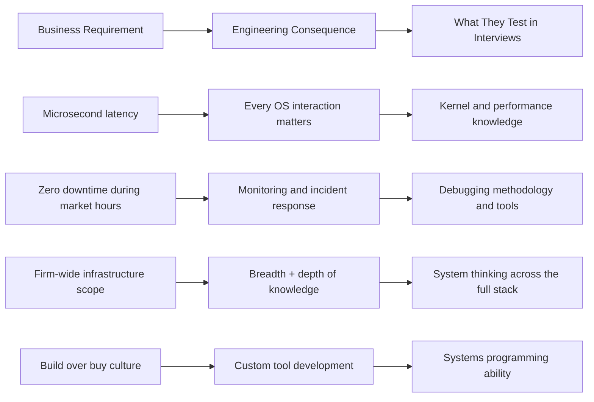

---

# Part 3: Portfolio Project Recommendations

Given that the target candidate is transitioning from another field into Linux and Systems Engineering, the portfolio must demonstrate:

1. **Rapid, self-directed learning** into systems territory
2. **Depth of understanding** (not just running commands, but understanding why)
3. **Systems thinking** (understanding how components interact)
4. **Production sensibility** (monitoring, error handling, documentation)
5. **Communication ability** (each project should have clear README and architecture documentation)

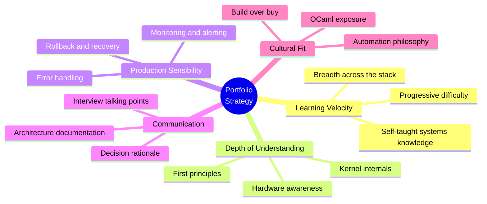

---

## Project 1: Custom Linux Process Monitor with eBPF

### What It Is

A real-time process monitoring tool built using eBPF[^32] that traces system calls[^50], monitors scheduling latency, and reports per-process resource usage with microsecond-level precision.

### Why It Is Relevant

Jane Street explicitly lists eBPF as a desirable skill[^25]. Their Linux Engineers debug kernel performance daily. This project directly demonstrates the ability to observe kernel behavior -- the single most important skill for the role. It also maps directly to their "obsessive monitoring" philosophy[^25].

### Linux and Systems Concepts Demonstrated

- eBPF program writing and loading[^32]
- Linux kernel tracing infrastructure (kprobes[^51], tracepoints[^52])
- Process lifecycle[^37] (fork, exec, exit, signals)
- Scheduling[^39] (CFS[^53], scheduling latency, context switches)
- System call interception and analysis[^50]
- perf_event[^31] subsystem
- Linux procfs[^54] and sysfs[^55]

### Recommended Architecture

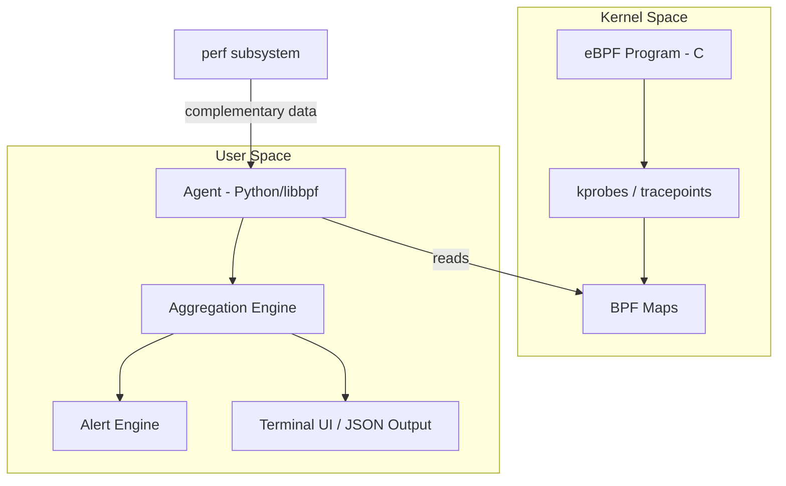

### Tech Stack with Justification

| Component | Technology | Justification |
|-----------|-----------|---------------|
| Kernel-side programs | C | Required for eBPF kernel programs; demonstrates systems programming |
| eBPF framework | libbpf or BCC (BPF Compiler Collection)[^56] | Industry-standard eBPF frameworks |
| User-space orchestration | Python | Accessible, fast to prototype; Jane Street's secondary language |
| Kernel version target | Linux 5.x+ | Required for modern eBPF features (BPF ring buffer, CO-RE[^57]) |
| Complementary profiling | perf[^31] | Standard Linux profiling tool for validating observations |

### Essential Features

- Per-process CPU time, context switches, and scheduling latency tracking
- System call frequency and latency histogram (similar to perf stat but custom)
- Alerting when scheduling latency exceeds a configurable threshold (simulating real-time trading requirements)
- Configurable filtering by process name, PID, or cgroup[^58]
- Output as structured data (JSON) for downstream consumption

### Engineering Challenges

- Understanding eBPF's verifier[^59] constraints (limited loop iterations, stack size limits)
- Handling BPF map[^60] lifecycle and data sharing between kernel and user space
- Dealing with kernel version differences and CO-RE[^57] portability
- Minimizing overhead of the monitoring tool itself (the observer effect)
- Correctly interpreting scheduling latency in context of NUMA[^48] topology

### Common Implementation Pitfalls

- Not handling eBPF verifier rejections gracefully (most beginners hit this repeatedly)
- Using incorrect BPF map types for the intended use case
- Forgetting to handle the case where the target process has already exited
- Overhead from excessive event production overwhelming the perf buffer[^61]
- Not pinning BPF programs correctly, leading to orphaned kernel resources

### Required Knowledge

- Linux system calls[^50] and their semantics
- Basic kernel concepts (modules, tracepoints[^52], kprobes[^51])
- C programming (pointers, structs, memory management)
- eBPF[^32] architecture and programming model
- Linux procfs[^54] filesystem

### Estimated Difficulty

Medium-Hard (especially if new to C and kernel concepts). Estimated 3-5 weeks of focused work.

### Resume and Interview Value

HIGH. This directly maps to the "debugging kernel performance" responsibility and eBPF is explicitly listed in the job description. It demonstrates systems programming in C, kernel interaction, and a performance engineering mindset.

### Extensions Toward Production Scale

- Add eBPF-based network packet tracing
- Implement per-container (cgroup[^58]) monitoring for containerized workloads
- Add a Prometheus[^62] metrics exporter endpoint
- Implement historical data recording and trend analysis
- Port to libbpf CO-RE[^57] for kernel-version-independent deployment

---

## Project 2: High-Performance UDP Multicast Benchmarking Suite

### What It Is

A tool that benchmarks UDP[^42] multicast[^40] message throughput and latency on Linux, measuring tail latencies (p99, p99.9, p99.99) under various kernel configurations, interrupt affinities, and socket buffer sizes. Includes kernel parameter optimization scripts.

### Why It Is Relevant

Jane Street processes "millions of multicast messages per second on a single core"[^15]. Market data distribution relies on multicast. Understanding how to achieve high-throughput, low-latency network performance on Linux is core to their trading infrastructure.

### Linux and Systems Concepts Demonstrated

- UDP[^42] sockets and multicast[^40] group management
- Linux network stack internals (NAPI[^63], interrupt coalescing[^64], GRO[^65])
- NIC[^28] interrupt affinity (IRQ[^66] affinity / SMP affinity)
- Socket buffer tuning (SO_RCVBUF, SO_SNDBUF, net.core.rmem_max)
- CPU pinning and NUMA[^48]-aware socket binding
- Kernel bypass concepts (introduction to DPDK[^67] / ef_vi[^68] concepts)
- epoll[^69] versus poll versus select for high-throughput I/O

### Recommended Architecture

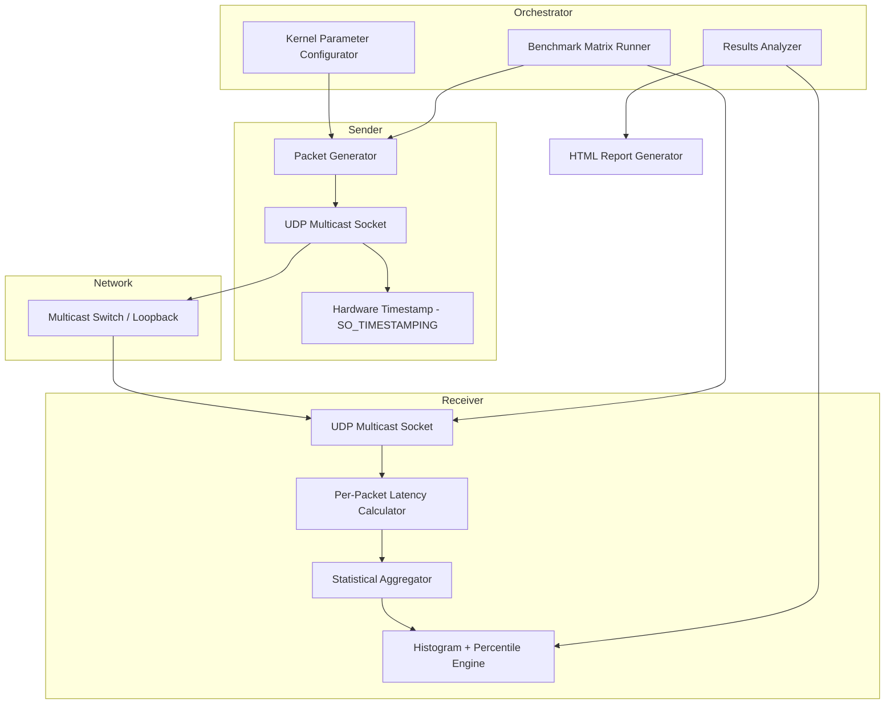

### Tech Stack with Justification

| Component | Technology | Justification |
|-----------|-----------|---------------|
| Packet sender and receiver | C | Maximum control over socket behavior, kernel interaction, and low-level networking |
| Orchestration and analysis | Python | For benchmark orchestration, results analysis, and visualization |
| Kernel tuning | sysctl | Network stack tuning parameters (net.core, net.ipv4) |
| NIC configuration | ethtool[^70] | NIC hardware feature configuration |
| Profiling | perf[^31] | To profile the benchmark itself and identify bottlenecks |

### Essential Features

- Configurable packet rates (100K to 10M+ packets/second)
- Per-packet hardware timestamping (SO_TIMESTAMPING[^71])
- Tail latency measurement (not just averages -- p99, p99.9, p99.99)
- Configurable: CPU affinity, socket buffer sizes, interrupt coalescing
- Before/after comparison: baseline versus optimized kernel parameters
- HTML report with latency histograms and throughput curves

### Engineering Challenges

- Achieving accurate latency measurement (kernel timestamping versus userspace)
- Handling packet loss without skewing latency statistics
- Understanding NIC hardware features (RSS[^72], hardware timestamps, offloading[^73])
- Kernel parameter tuning without destabilizing the system
- Dealing with CPU cache effects on packet processing

### Common Implementation Pitfalls

- Using clock_gettime(CLOCK_REALTIME) instead of CLOCK_MONOTONIC[^74] or hardware timestamps
- Not accounting for NIC interrupt coalescing[^64] affecting latency measurements
- Ignoring NUMA[^48] locality (socket bound to wrong NUMA node causes 2-3x latency increase)
- Bufferbloat[^75] from oversized socket buffers
- Forgetting to set SO_REUSEADDR/SO_REUSEPORT for multicast

### Required Knowledge

- UDP[^42] and multicast[^40] networking
- Linux network stack basics
- Socket programming API
- Basic understanding of CPU architecture (caches, NUMA[^48])
- sysctl and /proc/sys/net tuning

### Estimated Difficulty

Medium (especially if transitioning from web development with some C networking experience). Estimated 3-4 weeks.

### Resume and Interview Value

HIGH. Directly demonstrates understanding of the networking challenges Jane Street faces. The focus on tail latencies shows production-grade thinking (not just "it works," but "it works under worst-case conditions").

### Extensions Toward Production Scale

- Add DPDK[^67] or AF_XDP[^76] for kernel-bypass testing
- Implement market-data-style message parsing (ITCH/FIX[^77] protocol)
- Add multi-NIC testing with cross-NIC multicast
- Build a continuous benchmarking pipeline with regression detection
- Simulate exchange-like multicast behavior with random message sizes

---

## Project 3: Automated Linux Fleet Configuration Management System

### What It Is

A configuration management system (inspired by Ansible/Salt[^78] concepts but built from scratch) that can declaratively manage the state of multiple Linux systems -- package installation, file management, service configuration, user accounts, kernel parameters, and security hardening -- with idempotent[^36] operations and comprehensive audit logging.

### Why It Is Relevant

Jane Street explicitly states "scalable configuration management" is an ongoing project focus[^25]. They automate everything they can. Building a configuration management tool (even a simple one) demonstrates understanding of their core infrastructure philosophy.

### Linux and Systems Concepts Demonstrated

- Linux package management (apt/dnf/yum internals)
- systemd[^79] service management (unit files, timers, journals)
- File permissions, ownership, SELinux[^80]/AppArmor contexts
- Kernel parameter management (sysctl)
- User and group management at scale
- SSH-based remote execution
- Idempotent[^36] operations and state convergence
- Configuration drift detection

### Recommended Architecture

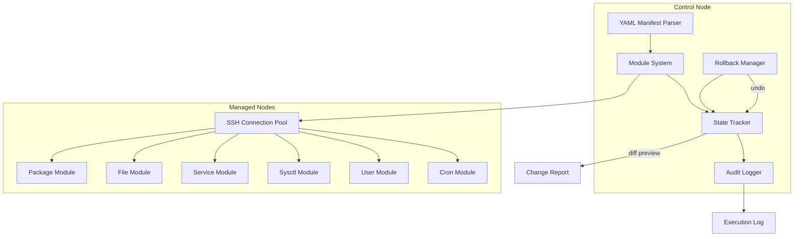

### Tech Stack with Justification

| Component | Technology | Justification |
|-----------|-----------|---------------|
| Primary language | Python | Shows ability to build infrastructure tools; Python is Jane Street's secondary language (~5M lines)[^12] |
| Remote execution | SSH (paramiko or subprocess) | Standard remote execution mechanism |
| Template rendering | Jinja2[^81] | Configuration file templating |
| Data format | YAML (PyYAML) | Manifest parsing |
| Test environment | Linux VMs (Vagrant or Docker) | Multi-host management testing |
| Testing | pytest | Test framework |

### Essential Features

- Declarative YAML manifests describing desired system state
- At least 6 module types: packages, files, services, users, sysctl, cron
- Idempotent[^36] execution (running twice produces no changes on second run)
- Diff preview mode (show what would change without changing anything)
- Rollback capability for each change
- Execution report with per-host status, changes made, and timing

### Engineering Challenges

- Designing a clean module API that is extensible
- Handling partial failures (some hosts succeed, some fail)
- Detecting configuration drift accurately
- Testing idempotency thoroughly
- Managing SSH connection pooling and error handling

### Common Implementation Pitfalls

- Not handling SSH timeouts and connection errors gracefully
- Making changes non-idempotent (running twice doubles the changes)
- Not checking return codes of remote commands
- Overlooking edge cases in file templating (permissions, symlinks)
- Forgetting error handling for "service not found" or "package already installed"

### Required Knowledge

- Linux system administration fundamentals
- SSH and remote execution
- Python (classes, context managers, error handling)
- YAML/JSON data formats
- systemd[^79] basics
- Linux permissions model

### Estimated Difficulty

Medium. Estimated 3-4 weeks.

### Resume and Interview Value

MEDIUM-HIGH. Shows understanding of their configuration management philosophy. Building a tool (rather than just using one) demonstrates the engineering mindset they value. The idempotency and rollback features show production-grade thinking.

### Extensions Toward Production Scale

- Add a web dashboard for fleet status visualization
- Implement configuration templating with variable interpolation per host group
- Add Ansible module compatibility layer
- Implement push versus pull agent modes
- Add secrets management integration (Vault-style)
- Build a continuous compliance checker

---

## Project 4: Linux Kernel Performance Profiling Dashboard

### What It Is

A comprehensive performance profiling system that uses perf[^31], /proc, /sys, and custom eBPF[^32] programs to collect, aggregate, and visualize Linux system performance data in real-time. A lightweight, self-contained alternative to Grafana[^82] plus Prometheus[^62], purpose-built for kernel-level metrics.

### Why It Is Relevant

Jane Street's Linux Engineers use profiling tools daily[^25]. Their Performance Engineering page emphasizes "a disciplined approach to measurement"[^15]. This project demonstrates the ability to observe and reason about system behavior -- essential for debugging kernel performance and resolving production issues.

### Linux and Systems Concepts Demonstrated

- perf[^31] subsystem (CPU profiling, cache misses, branch prediction)
- Hardware performance counters (PMC[^83])
- /proc/stat, /proc/meminfo[^84], /proc/diskstats, /proc/net
- /sys/devices/system/cpu topology
- CPU cache hierarchy (L1, L2, L3) effects on performance
- Memory allocation patterns (RSS[^85], VSZ[^86], page faults[^87], huge pages[^88])
- I/O scheduling and disk performance (IOPS, throughput, latency)
- Kernel scheduling statistics (/proc/schedstat[^89])

### Recommended Architecture

```mermaid
graph TD
    subgraph Data Collection Layer
        A[perf event listener - C] --> B[Ring Buffer]
        C[/proc reader - Python] --> B
        D[eBPF tracepoints] --> B
    end
    subgraph Aggregation Engine
        B --> E[Rolling Statistics]
        E --> F[Mean, p99, histograms]
        E --> G[Rate calculations]
    end
    subgraph Storage
        F --> H[SQLite Time-Series Store]
    end
    subgraph Presentation
        H --> I[HTTP Server - Python]
        I --> J[HTML Dashboard with Chart.js]
    end
    subgraph Alerting
        F --> K[Threshold Engine]
        K --> L[Notification Output]
    end
```

### Tech Stack with Justification

| Component | Technology | Justification |
|-----------|-----------|---------------|
| Perf event listener | C | Direct perf_event_open() syscall access for high-frequency events |
| Aggregation engine | Python | For statistical processing and web server |
| System metrics | Linux procfs[^54]/sysfs[^55] | Direct access to kernel statistics |
| Storage | SQLite[^90] | Lightweight local storage for historical data |
| Dashboard | http.server + HTML/JS | Demonstrate ability to build monitoring tools, not just configure Grafana |
| Complementary tracing | eBPF[^32] | For function-level tracing beyond what perf provides |

### Essential Features

- Real-time CPU profiling with flame graph[^91] generation
- Memory usage tracking with allocation/deallocation rates
- Disk I/O latency histograms
- Network throughput per interface
- NUMA[^48]-aware metrics (per-node memory and CPU stats)
- Configurable collection intervals and retention
- HTML-based dashboard with auto-refresh

### Engineering Challenges

- Minimizing the monitoring tool's own performance impact (the observer effect)
- Efficiently processing high-frequency perf events
- Correctly interpreting hardware performance counter[^83] values
- Handling the volume of data from multiple metric sources simultaneously
- Designing meaningful aggregation without losing important tail events

### Common Implementation Pitfalls

- The monitoring tool itself becoming a performance bottleneck
- Not handling perf_event_open permission errors (CAP_PERFMON, kernel.perf_event_paranoid[^92])
- Collecting too much data and overwhelming storage
- Displaying raw numbers without context (what does "3ms scheduling latency" mean for this workload?)
- Not considering the overhead of context switches between collection components

### Required Knowledge

- Linux perf[^31] subsystem
- /proc and /sys filesystem structure
- Basic statistics (percentiles, histograms, rolling averages)
- Hardware performance counters[^83] concept
- Web development basics (HTML, JavaScript, HTTP)
- Python or C

### Estimated Difficulty

Medium-Hard. Estimated 4-5 weeks.

### Resume and Interview Value

HIGH. This is the most directly interview-relevant project. During a project deep-dive round, you can walk through trade-offs in real-time monitoring, explain why you chose certain metrics, and discuss the observer effect -- all topics Jane Street cares about.

### Extensions Toward Production Scale

- Add eBPF[^32]-based function-level tracing (similar to BCC tools[^56])
- Implement distributed collection across multiple hosts
- Add anomaly detection (statistical deviation alerts)
- Build custom perf scripts for specific workload patterns
- Integrate with their actual monitoring stack (if hired)

---

## Project 5: Clock Synchronization Monitoring and Validation System

### What It Is

A system that monitors clock synchronization accuracy across multiple Linux hosts using NTP[^27]/PTP[^20], validates synchronization quality against a configurable threshold (e.g., less than 100 microseconds from UTC[^93]), and provides real-time dashboards and alerting when drift exceeds acceptable bounds.

### Why It Is Relevant

Jane Street had to solve this exact problem. Their Signals and Threads[^26] podcast episode on clock synchronization[^20] details how they built a GPS --> PTP[^20] --> NTP[^27] hierarchy achieving less than 35 microsecond accuracy to comply with European financial regulations requiring less than 100 microsecond synchronization. This is a real, high-value systems engineering problem in financial trading.

### Linux and Systems Concepts Demonstrated

- NTP[^27] (Network Time Protocol) internals and configuration
- PTP[^20] (Precision Time Protocol / IEEE 1588[^94])
- Hardware timestamping[^71] on NICs[^28]
- Linux kernel timekeeping (clocksource, TSC[^95], HPET[^96])
- Clock drift[^97], jitter[^98], and offset[^99] measurement
- chrony[^100] / ntpd[^101] configuration and diagnostics
- Statistical analysis of time series data
- systemd[^79] timers and cron for periodic checks

### Recommended Architecture

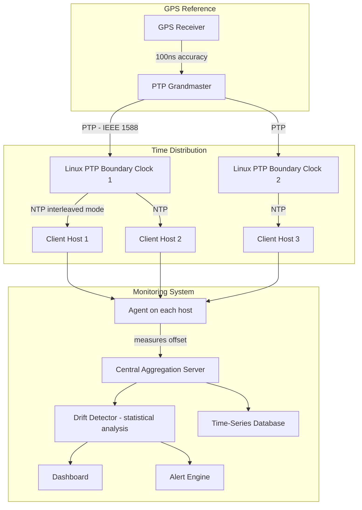

### Tech Stack with Justification

| Component | Technology | Justification |
|-----------|-----------|---------------|
| Monitoring agents | Python | For collecting and reporting clock offset data |
| High-precision timestamps | C | Using clock_gettime(CLOCK_REALTIME) and hardware timestamping interfaces |
| NTP implementation | chrony[^100] | Modern NTP implementation, more accurate than ntpd[^101] |
| PTP implementation | LinuxPTP[^102] | PTP implementation for testing |
| Storage | InfluxDB or SQLite | Time series storage |
| Dashboard | Grafana or custom HTML | Visualization |

### Essential Features

- Per-host clock offset[^99] measurement with microsecond precision
- Historical drift[^97] tracking and trend analysis
- PTP grandmaster selection monitoring
- Alerting when offset exceeds configurable threshold
- Comparison of chrony versus ntpd accuracy
- Simulated GPS reference clock for testing
- Report generation showing compliance with time synchronization requirements

### Engineering Challenges

- Achieving accurate clock offset[^99] measurement (network asymmetry[^103] effects)
- Understanding and configuring hardware timestamping[^71]
- Handling NTP/PTP interaction and potential conflicts
- Statistical methods for distinguishing genuine drift[^97] from measurement noise
- Dealing with leap seconds[^104] and time zone complexities

### Common Implementation Pitfalls

- Measuring round-trip time and dividing by 2 (ignores network asymmetry[^103])
- Not using CLOCK_MONOTONIC[^74] for intervals (affected by NTP adjustments)
- Confusing clock offset[^99] with clock drift[^97]
- Not accounting for software timestamp overhead versus hardware timestamps[^71]
- Running both ntpd and chrony simultaneously (they conflict)

### Required Knowledge

- NTP[^27] protocol basics (stratum[^105], offset[^99], delay, dispersion)
- Linux time subsystem
- Basic statistics (standard deviation, confidence intervals)
- Network protocol debugging
- systemd[^79] service management

### Estimated Difficulty

Medium-Hard. Estimated 3-5 weeks.

### Resume and Interview Value

VERY HIGH. This is almost certainly something the Jane Street Linux team has worked on. Being able to discuss this problem intelligently -- especially the trade-offs between NTP and PTP, hardware versus software timestamps, and the statistical challenges of clock synchronization -- would be impressive in an interview.

### Extensions Toward Production Scale

- Add PTP hardware timestamping[^71] support via SO_TIMESTAMPING[^71]
- Implement IEEE 1588[^94] Transparent Clock emulation
- Build automated compliance reporting for financial regulations
- Add GPS receiver integration for Grandmaster validation
- Deploy as a distributed system with quorum-based alerting

---

## Project 6: Custom Linux Kernel Module for Priority Process Scheduling

### What It Is

A loadable Linux kernel module[^106] that implements a custom CPU scheduling policy designed for latency-sensitive workloads. The module intercepts scheduling decisions and applies custom priority logic based on process importance, CPU affinity, and real-time constraints. Includes a user-space control interface via procfs[^54].

### Why It Is Relevant

Jane Street's trading systems need deterministic, low-latency behavior. Understanding how Linux scheduling[^39] works at the kernel level -- and being able to modify it -- is an advanced skill that directly maps to "debugging kernel performance." While they may not write custom schedulers in production, the knowledge of CFS[^53], RT scheduling, and CPU affinity is essential.

### Linux and Systems Concepts Demonstrated

- Linux kernel module[^106] development (loadable kernel modules)
- CFS[^53] (Completely Fair Scheduler) internals
- Real-time scheduling policies (SCHED_FIFO[^107], SCHED_DEADLINE[^108])
- CPU affinity (sched_setaffinity[^109], taskset)
- Kernel module API (module_init, module_exit, procfs[^54] filesystem interface)
- Kernel-userspace communication (procfs[^54], sysfs[^55], ioctl[^110])
- Process priority and nice values[^111]
- NUMA[^48]-aware scheduling considerations

### Recommended Architecture

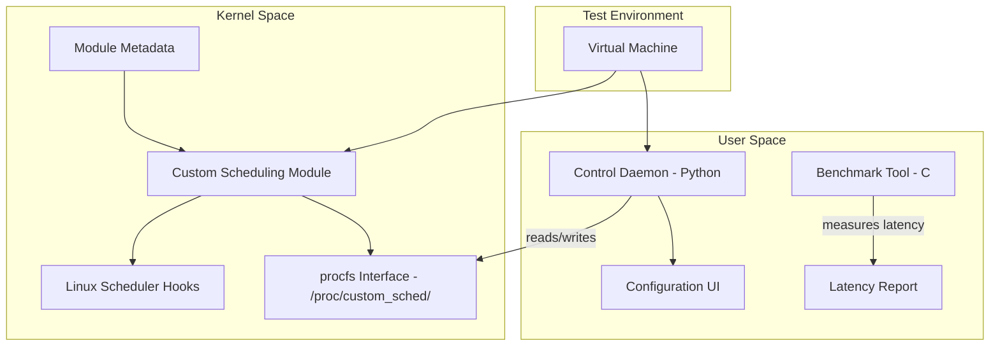

### Tech Stack with Justification

| Component | Technology | Justification |
|-----------|-----------|---------------|
| Kernel module | C | Required for kernel module development; ultimate systems programming demonstration |
| Build system | Linux kernel headers + Makefile (kbuild[^112]) | Standard kernel module build process |
| Control daemon | Python | User-space orchestration and monitoring |
| Test environment | Virtual machine | Safe kernel development and testing |

### Essential Features

- Loadable kernel module that registers a custom scheduling class
- User-space control via /proc/custom_sched/
- Per-process priority assignment
- CPU pinning support
- Latency measurement before and after module loading
- Comprehensive documentation of kernel API usage

### Engineering Challenges

- Kernel module development requires careful memory management (no garbage collection in kernel space)
- Understanding the scheduler's internal data structures
- Avoiding kernel panics from incorrect module code
- Handling concurrency in kernel space (spinlocks[^113], RCU[^114])
- Debugging kernel code (printk, ftrace[^33], kgdb[^115])

### Common Implementation Pitfalls

- Null pointer dereferences causing kernel panics[^116]
- Not releasing kernel resources on module unload (memory leaks in kernel space are catastrophic)
- Sleeping in atomic context (calling sleep while holding a spinlock[^113])
- Race conditions in kernel code
- Not testing module unload/reload cycles thoroughly

### Required Knowledge

- C programming (advanced: pointers, memory management, data structures)
- Linux kernel architecture basics
- Scheduler[^39] internals (at least conceptual understanding)
- Kernel module build process (kbuild[^112])
- procfs[^54]/sysfs[^55] interface

### Estimated Difficulty

Hard. Estimated 5-7 weeks. This is the most technically challenging project in the portfolio.

### Resume and Interview Value

VERY HIGH. Writing a kernel module is a strong signal of systems programming ability. Even if the module is simple, the fact that you can navigate kernel code, understand the scheduler, and produce working kernel code is impressive.

### Extensions Toward Production Scale

- Add NUMA[^48]-aware scheduling decisions
- Implement cgroup[^58] integration for container-aware scheduling
- Add real-time scheduling with DEADLINE[^108] policy support
- Build a scheduling policy simulator before kernel implementation
- Add performance counters to measure the module's own impact

---

## Project 7: Secure Boot and Disk Encryption Infrastructure

### What It Is

An automated system for deploying and validating Linux servers with full-disk encryption (LUKS2[^117]), secure boot chain (UEFI[^118] --> shim[^119] --> GRUB[^120] --> kernel), TPM[^121]-backed key storage, and automated key escrow[^122] for disaster recovery. Includes compliance validation scripts.

### Why It Is Relevant

Financial firms have strict security requirements. Jane Street's Security Operations Engineer role[^123] mentions "endpoint security controls," "disk encryption," and "application control." While the Linux Engineer role is not security-focused, understanding security at the infrastructure level is essential for someone maintaining production trading systems.

### Linux and Systems Concepts Demonstrated

- LUKS2[^117] full-disk encryption setup and management
- UEFI[^118] Secure Boot[^124] chain
- TPM[^121] 2.0 (Trusted Platform Module) integration
- Key management and escrow[^122]
- dm-crypt[^125] device mapper
- initramfs[^126] and early boot process
- Kernel command line parameters
- systemd-cryptenroll[^127]
- Compliance checking and audit trails

### Recommended Architecture

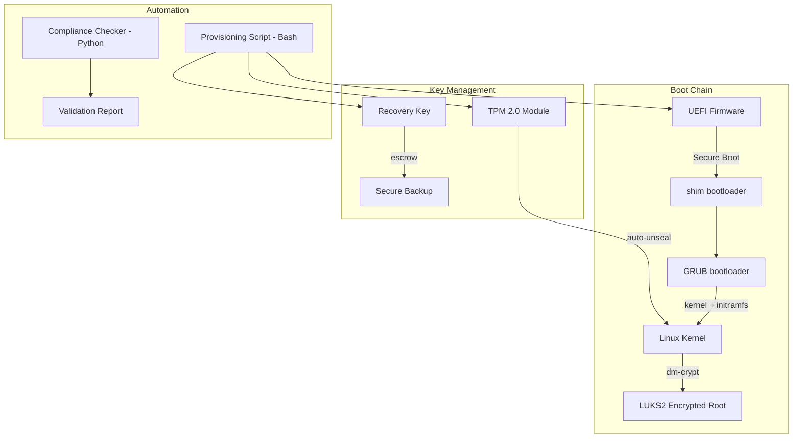

### Tech Stack with Justification

| Component | Technology | Justification |
|-----------|-----------|---------------|
| System provisioning | Bash | Demonstrates advanced shell scripting mastery, explicitly required[^25] |
| Compliance checking | Python | For structured reporting and validation logic |
| Encryption management | cryptsetup[^117] | LUKS2 management |
| Volume management | systemd[^79] | For encrypted volume management via systemd-cryptenroll[^127] |
| TPM interaction | tpm2-tools[^128] | TPM 2.0 command-line tools |
| Test environment | Linux VMs | Safe testing of boot chain modifications |

### Essential Features

- Automated LUKS2[^117] setup with strong defaults (Argon2id[^129] KDF[^130], AES-256-XTS[^131])
- UEFI[^118] Secure Boot[^124] validation
- TPM[^121] 2.0-backed auto-unlock (seal/unseal)
- Recovery key generation and secure escrow[^122]
- Compliance report: encryption status, cipher suite, key strength
- Rollback procedure for each step

### Engineering Challenges

- Understanding the secure boot chain and where each component lives
- TPM[^121] 2.0 authorization hierarchies and policies
- initramfs[^126] rebuilding and debugging
- Handling edge cases (TPM clear, firmware update breaking secure boot)
- Automated testing of security configurations

### Common Implementation Pitfalls

- Forgetting to back up the LUKS header before testing
- Not understanding the difference between TPM-sealed keys and passphrase-based unlock
- Breaking the initramfs[^126] with incorrect crypttab configuration
- Not handling the case where the TPM is cleared or fails
- Leaving debug/test configurations in production setups

### Required Knowledge

- Linux boot process (UEFI[^118] --> bootloader --> kernel --> initramfs[^126] --> root)
- dm-crypt[^125] and LUKS[^117] concepts
- Basic cryptography (symmetric encryption, key derivation)
- Shell scripting (advanced)
- systemd[^79] and initramfs[^126]

### Estimated Difficulty

Medium-Hard. Estimated 3-4 weeks.

### Resume and Interview Value

MEDIUM. This project demonstrates breadth (security plus systems) and production sensibility. It is not as directly relevant as profiling or networking projects, but it shows you think about the full infrastructure stack.

### Extensions Toward Production Scale

- Add network-bound disk encryption (NBD + LUKS[^117])
- Implement automated key rotation
- Add compliance reporting for PCI-DSS[^132] / SOC2[^133] requirements
- Build a central key management server
- Integrate with configuration management (Project 3)

---

## Project 8: Production Incident Response Simulation Platform

### What It Is

A controlled Linux environment that injects realistic production failures (network partitions, disk full, memory exhaustion, kernel OOM[^134], clock skew, process crashes) and guides users through systematic debugging and resolution using standard Linux tools. Includes scoring, timing, and documented root-cause analyses.

### Why It Is Relevant

Jane Street's Linux Engineers "resolve production issues in real time" and "perform comprehensive root-cause analyses"[^25]. Their Production Engineering team uses "tabletop simulations and hands-on exercises to train Production Engineers"[^29]. This project demonstrates exactly the incident response mindset they value.

### Linux and Systems Concepts Demonstrated

- Linux failure injection (tc netem[^135], cgroup[^58] memory limits, ulimit[^136])
- Process management (signals[^137], cgroups[^58], OOM killer[^134])
- Filesystem management (disk full scenarios, inode[^138] exhaustion)
- Network debugging (iptables[^139], tc[^135], strace[^140], tcpdump[^141])
- systemd[^79] service management (failure modes, restart policies)
- Log analysis (journalctl[^142], syslog[^143])
- Kernel messages (dmesg[^144])
- Memory debugging (free, vmstat[^145], /proc/meminfo[^84])
- Core dump[^146] analysis basics

### Recommended Architecture

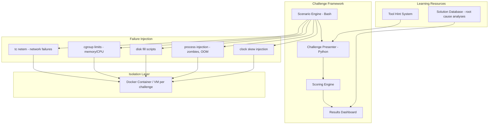

### Tech Stack with Justification

| Component | Technology | Justification |
|-----------|-----------|---------------|
| Failure injection | Bash | Demonstrates advanced shell scripting; direct interaction with Linux failure mechanisms |
| Challenge framework | Python | For the orchestration, scoring, and reporting engine |
| Isolation | Docker or VMs | Safe failure injection without damaging host systems |
| Failure mechanisms | Linux namespaces/cgroups, tc, iptables | Standard Linux failure injection and network manipulation tools |
| Debugging tools | strace, lsof, tcpdump, vmstat, iostat, perf | Standard Linux debugging toolkit |

### Essential Features

At least 10 different failure scenarios:

1. Disk filling up (log rotation failure)
2. Memory leak causing OOM[^134]
3. Network partition between services
4. Clock skew breaking TLS[^147] certificates
5. Zombie processes[^148] consuming resources
6. File descriptor[^149] exhaustion
7. DNS[^150] resolution failure
8. Kernel module causing soft lockup[^151]
9. Swap thrashing[^152] degrading performance
10. Process stuck in D-state[^153] (uninterruptible sleep)

Each scenario includes: observable symptoms, required debugging steps, root-cause explanation.

### Engineering Challenges

- Creating realistic failure scenarios that mirror actual production issues
- Injecting failures without crashing the test environment
- Designing scenarios that require tool usage (not just guessing)
- Documenting root causes clearly and accurately
- Making scenarios progressively more complex

### Common Implementation Pitfalls

- Failure injection being too aggressive (actually crashing the VM)
- Scenarios being too obvious (disk full is just "df shows 100%")
- Not providing enough context for realistic debugging
- Making scenarios too narrow (only one possible solution)
- Forgetting to clean up after each scenario

### Required Knowledge

- Linux system administration
- Standard debugging tools (strace[^140], lsof[^154], tcpdump[^141], perf[^31], gdb[^43] basics)
- Process lifecycle[^37] and signals[^137]
- Memory management concepts
- Network debugging
- Shell scripting

### Estimated Difficulty

Medium. Estimated 3-4 weeks.

### Resume and Interview Value

HIGH. This project is unique and memorable. During an interview, you can walk through specific scenarios and explain your debugging methodology -- exactly what they would ask about in a project deep-dive round. It also maps directly to the Production Engineering team's training approach[^29].

### Extensions Toward Production Scale

- Add distributed failure scenarios (multi-host)
- Implement automated scoring with tool-usage tracking
- Build a web UI for the challenge platform
- Add scenarios based on real trading infrastructure issues (multicast failures, clock sync problems)
- Integrate with Kubernetes for container-based failure injection (chaos engineering[^155])

---

## Project 9: OCaml Build Environment with Linux Toolchain Integration

### What It Is

A fully configured development environment for OCaml[^49] that integrates with the Linux system -- including Dune[^12] build system, OPAM[^156] package management, custom build rules for C interop, and a CI[^34] pipeline that builds and tests OCaml packages on multiple Linux distributions. Includes a tutorial project demonstrating OCaml/C FFI[^157] for systems programming.

### Why It Is Relevant

Jane Street's language of choice is OCaml[^4][^12]. While they explicitly say "no prior OCaml experience is required," demonstrating willingness and ability to learn OCaml is a strong signal of cultural fit. The project also demonstrates understanding of build systems (Dune, which Jane Street created[^12]), which is relevant to infrastructure work.

### Linux and Systems Concepts Demonstrated

- OCaml toolchain setup (OPAM[^156], Dune[^12], ocamlfind)
- C/OCaml FFI[^157] (Foreign Function Interface)
- Build system configuration (Dune files)
- Cross-compilation concepts
- CI[^34]/CD[^35] pipeline on Linux
- Package management
- Development environment reproducibility

### Recommended Architecture

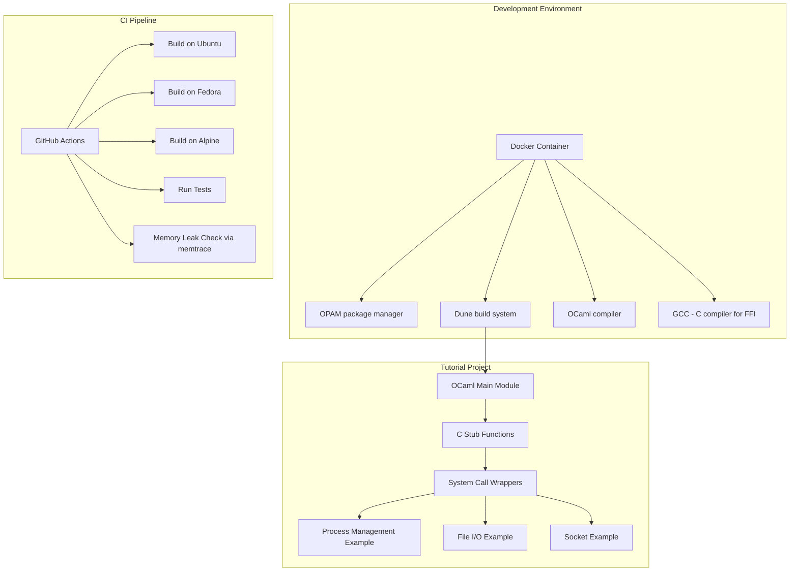

### Tech Stack with Justification

| Component | Technology | Justification |
|-----------|-----------|---------------|
| Primary language | OCaml[^49] | Learning Jane Street's primary language shows commitment and cultural fit |
| Build system | Dune[^12] | Their build system; understanding it shows infrastructure awareness |
| Package manager | OPAM[^156] | OCaml's standard package manager |
| C interop | C (GCC) | For FFI examples demonstrating system calls, sockets |
| Environment | Docker | Reproducible development environment |
| CI/CD | GitHub Actions | Demonstrates pipeline understanding |

### Essential Features

- Working OCaml[^49] development environment in Docker
- Tutorial project with 5+ examples of OCaml calling C (process management, file I/O, network sockets)
- Dune[^12] build configuration with proper directory structure
- CI[^34] pipeline that builds and tests on 3 Linux distributions
- Memory leak detection using memtrace[^17] (Jane Street's own tool)
- Performance comparison: OCaml versus C for a simple benchmark

### Engineering Challenges

- Understanding OCaml's memory model and garbage collector[^158]
- Correctly interfacing OCaml values with C types at the FFI[^157] boundary
- Setting up cross-compilation if targeting ARM architecture
- Handling OPAM[^156] package version conflicts
- Writing meaningful tests for FFI code

### Common Implementation Pitfalls

- Incorrect C stub definitions causing segfaults[^159]
- Not understanding OCaml's value representation (tagged pointers, the `value` type)
- Memory leaks at the OCaml/C boundary
- Dune[^12] build rule syntax errors
- Not using OPAM pinning for reproducible builds

### Required Knowledge

- Basic OCaml[^49] syntax and concepts (functional programming)
- C programming basics
- Build system concepts
- Docker
- CI[^34]/CD[^35] pipeline design

### Estimated Difficulty

Medium. Estimated 2-3 weeks.

### Resume and Interview Value

MEDIUM. This is a "nice to have" project that signals cultural fit. It is not as technically deep as kernel modules or eBPF, but it shows you are serious about the role and willing to invest in learning their stack. Combined with a systems-heavy project, it rounds out the portfolio.

### Extensions Toward Production Scale

- Add OCaml async programming examples (using Jane Street's Async[^160] library)
- Build a small OCaml tool that monitors Linux system stats (connecting to Project 4)
- Implement OCaml bindings for a Linux-specific library
- Add property-based testing using OCaml's QCheck
- Contribute a small fix to an open-source Jane Street OCaml library

---

## Project 10: End-to-End Linux Observability Stack

### What It Is

A complete, self-built observability stack comprising three components: a metrics collector (agents on each host), a time-series database, and a visualization layer -- all implemented from scratch without using Prometheus[^62], Grafana[^82], or other off-the-shelf tools. Demonstrates full-stack infrastructure understanding.

### Why It Is Relevant

Jane Street builds custom monitoring tools[^25]. They emphasize "obsessive monitoring" as a core philosophy. This project demonstrates you understand the full monitoring pipeline and can build rather than just configure existing tools.

### Linux and Systems Concepts Demonstrated

- System metrics collection (/proc, /sys, perf[^31] counters)
- Network protocol design (for agent-to-server communication)
- Time-series data storage and compression
- HTTP server implementation
- Frontend/backend integration
- Alerting logic (threshold, rate-of-change, anomaly detection)
- Agent lifecycle management

### Recommended Architecture

```mermaid
graph TD
    subgraph Agent Layer
        A1[Agent - Host 1] -->|HTTP| D[Server]
        A2[Agent - Host 2] -->|HTTP| D
        A3[Agent - Host N] -->|HTTP| D
    end
    subgraph Agent Internals
        A1 --> B1[/proc reader]
        A1 --> B2[CPU metrics]
        A1 --> B3[Memory metrics]
        A1 --> B4[Disk I/O metrics]
        A1 --> B5[Network metrics]
    end
    subgraph Server
        D --> E[Time-Series DB - custom mmap storage]
        D --> F[Query API]
        D --> G[Alert Engine]
    end
    subgraph Presentation
        F --> H[Web Dashboard - HTML/JS]
        G --> I[Email / stdout notifications]
    end
    subgraph Health Monitoring
        D --> J[Agent Health Checker]
        J -->|detects offline agents| G
    end
```

### Tech Stack with Justification

| Component | Technology | Justification |
|-----------|-----------|---------------|
| High-performance agent | C | For the metric collector and time-series DB, demonstrating systems programming |
| Server and web UI | Python | For the HTTP server and dashboard |
| Metric access | /proc and /sys | Direct system metric access without external dependencies |
| Storage | SQLite or custom mmap[^161] storage | For time-series data with efficient storage |
| Dashboard | HTML/JavaScript | Lightweight frontend without heavy frameworks |
| Alerting | Custom logic | Demonstrates alerting rule design understanding |

### Essential Features

- Agent collects: CPU usage, memory, disk I/O, network, process count
- Agent runs on configurable interval with configurable retention
- Server handles concurrent agent connections
- Time-series DB with efficient storage and query API
- Dashboard with auto-refreshing charts
- Alert rules with email/stdout notification
- Agent health monitoring (detect offline agents)

### Engineering Challenges

- Efficient time-series data storage (compression[^162], compaction[^163])
- Handling bursty metric ingestion without data loss
- Designing a clean, extensible metric format
- Building a responsive dashboard without heavy frameworks
- Agent-server protocol design for reliability

### Common Implementation Pitfalls

- Storing metrics as raw values without compression (storage explosion)
- Not handling agent disconnections gracefully
- Dashboard polling too frequently (self-inflicted denial of service)
- Not considering metric cardinality[^164] (too many unique label combinations)
- Alert fatigue[^165] from poorly configured thresholds

### Required Knowledge

- Linux system administration
- HTTP protocol
- Data structures (ring buffers, time-series storage)
- C or Python (or both)
- Basic frontend development
- Statistical concepts for alerting

### Estimated Difficulty

Medium-Hard. Estimated 4-5 weeks.

### Resume and Interview Value

HIGH. This demonstrates you can build the entire monitoring pipeline that Jane Street's Linux Engineers work with daily. The fact that you built it from scratch (not just configured Prometheus plus Grafana) shows systems thinking and engineering depth.

### Extensions Toward Production Scale

- Add distributed tracing support (OpenTelemetry[^166]-compatible)
- Implement metric downsampling[^167] and retention policies
- Add TLS[^147] for agent-server communication
- Build a query language for metric exploration
- Add support for custom metrics (application-specific counters)
- Implement push-based alerting (PagerDuty[^168] integration)

---

# Part 4: Ranking, Gap Analysis, and Sources

## 4.1 Projects Ranked by Interview Impact

| Rank | Project | Interview Impact | Rationale |
|------|---------|-----------------|-----------|
| 1 | Clock Synchronization Monitor (#5) | Highest | Almost certainly something Jane Street has built. Discussing this shows deep systems understanding of a problem they have publicly described solving. |
| 2 | Kernel Module for Scheduling (#6) | Highest | Ultimate signal of systems programming ability. Even a simple module is impressive. Demonstrates ability to work at the kernel level. |
| 3 | eBPF Process Monitor (#1) | Highest | Directly maps to "debugging kernel performance" and eBPF is explicitly listed in the job description. |
| 4 | Production Incident Simulator (#8) | High | Unique, memorable, and directly maps to incident response work. Provides excellent interview talking points. |
| 5 | Custom Observability Stack (#10) | High | Demonstrates full-stack infrastructure understanding. Aligns with their "obsessive monitoring" philosophy. |
| 6 | UDP Multicast Benchmarking (#2) | High | Maps directly to market data infrastructure challenges. Shows networking depth and tail-latency thinking. |
| 7 | Kernel Performance Dashboard (#4) | High | Their stated philosophy is "a disciplined approach to measurement." This project embodies that. |
| 8 | Config Management System (#3) | Medium-High | Demonstrates automation philosophy, but less technically distinctive than other projects. |
| 9 | OCaml Build Environment (#9) | Medium | Signals cultural fit and learning velocity. Important as a complement to systems-heavy projects. |
| 10 | Secure Boot Infrastructure (#7) | Medium | Good breadth signal but less directly relevant to the core Linux Engineer responsibilities. |

## 4.2 Gap Analysis

### Covered Requirements

| Job Requirement | Covered by Project(s) | Coverage Level |
|-----------------|----------------------|----------------|
| Linux fundamentals | #1, #3, #4, #6, #8 | Comprehensive |
| Unix command line / shell scripting | #3, #7, #8 | Comprehensive |
| OS fundamentals (virtual memory, process lifecycle) | #1, #4, #6, #8 | Comprehensive |
| Network protocols (basic) | #2, #5 | Strong |
| C / systems programming | #1, #2, #4, #6, #10 | Comprehensive |
| perf, eBPF, DTrace, SystemTap, gdb | #1, #4 | Moderate |
| Deployment automation | #3 | Adequate |
| Configuration management | #3 | Strong |
| Monitoring / observability | #4, #5, #10 | Comprehensive |
| Production troubleshooting | #8 | Strong |
| Root-cause analysis | #5, #8 | Strong |
| OCaml / functional programming | #9 | Moderate |
| Strong programming (any language) | All projects | Comprehensive |
| Communication skills | Documentation quality across all projects | Demonstrated |

### Remaining Gaps

These skills are not fully covered by the ten projects and should be addressed through other means:

| Skill Gap | How to Address |
|-----------|---------------|
| GDB deep debugging | Practice core dump analysis, gdb debugging sessions on C programs |
| Hardware architecture (PCIe, NVMe, NUMA depth) | Read "Computer Architecture: A Quantitative Approach" by Hennessy and Patterson; build an NVMe benchmarking side project |
| Mercurial version control | Jane Street uses Mercurial internally -- familiarize with basic concepts through official documentation |
| Antithesis / deterministic testing | Read Jane Street's blog post on testing[^8]; understand the concept even without access to the tool |
| Financial domain knowledge | Jane Street says it is not required, but understanding market microstructure basics provides context |
| DTrace and SystemTap | While eBPF covers similar ground, explicitly practicing DTrace (on FreeBSD/macOS) or SystemTap adds breadth |
| Network packet crafting | Practice with Scapy or raw sockets for understanding protocol internals |

## 4.3 Recommended Implementation Order

Given a transition from another field into Linux and Systems Engineering, the following order builds skills progressively:

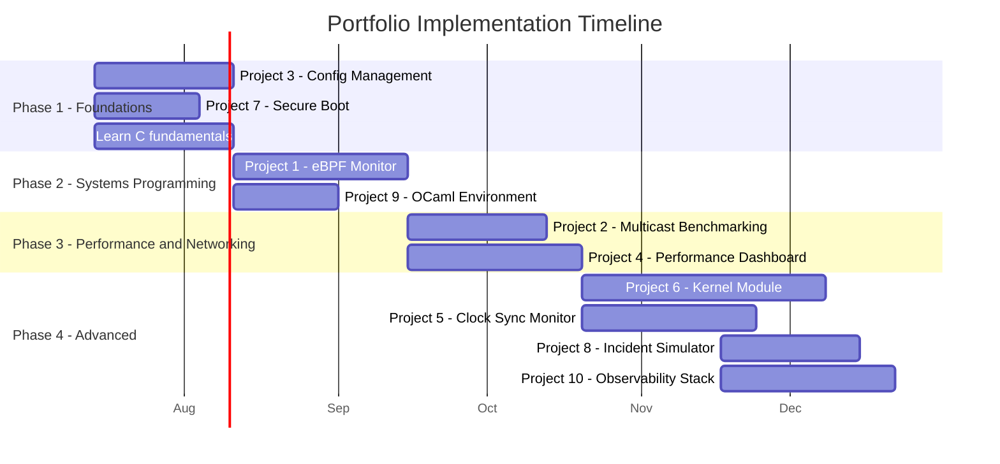

**Phase 1 -- Foundations (Weeks 1-4):**

- Project #3 (Config Management) -- Builds Linux administration fundamentals
- Project #7 (Secure Boot) -- Deepens system administration and shell scripting
- Begin learning C if not already known

**Phase 2 -- Systems Programming (Weeks 5-10):**

- Project #1 (eBPF Monitor) -- Introduces C plus kernel interaction
- Project #9 (OCaml Environment) -- Parallel learning of OCaml

**Phase 3 -- Performance and Networking (Weeks 11-16):**

- Project #2 (Multicast Benchmarking) -- Networking depth plus C
- Project #4 (Performance Dashboard) -- Combines C, profiling, and web development

**Phase 4 -- Advanced (Weeks 17-24):**

- Project #6 (Kernel Module) -- Peak systems programming
- Project #5 (Clock Sync) -- Deep specialized knowledge directly relevant to Jane Street
- Project #8 (Incident Simulator) -- Demonstrates operational maturity
- Project #10 (Observability Stack) -- Capstone combining everything

## 4.4 Interview Preparation Strategy

Jane Street's interview process[^23][^30] emphasizes collaborative problem-solving. The portfolio provides material for the **project deep-dive round**, where interviewers push hard on every technical decision.

### How to Use the Portfolio in Interviews

1. **Select 2-3 projects** that best demonstrate breadth and depth
2. For each project, be prepared to explain:
   - Why this design, not alternatives
   - What you would change with more time
   - What broke during development and how you debugged it
   - What production scaling challenges you anticipate
3. **Narrate your thought process** -- Jane Street values the journey, not just the destination[^30]
4. **Admit what you do not know** -- intellectual humility is a core value[^7]
5. **Code in whatever language you are strongest in** -- do not attempt OCaml cold in an interview[^30]

### Key Interview Themes the Portfolio Supports

| Interview Theme | Portfolio Evidence |
|----------------|-------------------|
| Problem decomposition | Every project required breaking complex problems into manageable components |
| Iterative improvement | Projects include "extensions toward production scale" showing awareness of limitations |
| Systems thinking | Projects span kernel, networking, storage, and user space |
| Communication | Each project has architecture documentation and rationale |
| Learning velocity | Portfolio demonstrates progression from fundamentals to kernel modules |
| Production sensibility | Every project includes monitoring, error handling, and rollback considerations |

## 4.5 Key Sources

### Official Jane Street Resources

| Source | Type | Location |
|--------|------|----------|
| Linux Engineer Job Description (New York) | Official job posting | janestreet.com/join-jane-street/position/8061059002/ |
| Linux Engineer Job Description (London) | Official job posting | janestreet.com/join-jane-street/position/5372886002/ |
| Linux Engineer Job Description (Hong Kong) | Official job posting | janestreet.com/join-jane-street/position/8104305002/ |
| Linux Engineer Job Description (Singapore) | Official job posting | janestreet.com/join-jane-street/position/5701269002/ |
| Technology Overview | Official company page | janestreet.com/technology/ |
| Performance Engineering | Official company page | janestreet.com/performance-engineering/ |
| Interviewing Overview | Official company page | janestreet.com/join-jane-street/interviewing/ |
| Preparing for a Software Engineering Interview | Official guidance | janestreet.com/preparing-for-a-software-engineering-interview/ |
| "OCaml All the Way Down" | Official blog post | blog.janestreet.com/ocaml-all-the-way-down/ |
| "Getting from Tested to Battle-Tested" | Official blog post | blog.janestreet.com/getting-from-tested-to-battle-tested/ |
| "How We Accidentally Built a Better Build System" | Official blog post | blog.janestreet.com/how-we-accidentally-built-a-better-build-system-for-ocaml-index/ |
| "What a Jane Street Interview Is Like" | Official blog post | blog.janestreet.com/what-a-jane-street-dev-interview-is-like/ |
| Signals and Threads: Clock Synchronization | Official podcast episode | signalsandthreads.com/clock-synchronization/ |
| Signals and Threads: Performance Engineering on Hard Mode | Official podcast episode | signalsandthreads.com/performance-engineering-on-hard-mode/ |
| Signals and Threads: Build Systems | Official podcast episode | signalsandthreads.com/build-systems/ |
| Signals and Threads: Building a Functional Email Server | Official podcast episode | signalsandthreads.com/building-a-functional-email-server/ |
| Signals and Threads: Solving Puzzles in Production | Official podcast episode | signalsandthreads.com/solving-puzzles-in-production-with-liora-friedberg/ |
| System Jitter and Where to Find It (Tech Talk) | Official tech talk | janestreet.com/tech-talks/system-jitter-and-where-to-find-it/ |
| Jane Street GitHub Organization | Official open source | github.com/janestreet (406 repositories) |
| Jane Street Open Source Portal | Official open source | opensource.janestreet.com/ |
| Signals and Threads Podcast (full catalog) | Official podcast | signalsandthreads.com/ |

### External Sources

| Source | Type | Location |
|--------|------|----------|
| Jane Street Interview Process 2020 Edition | Official blog post | blog.janestreet.com/jane-street-interview-process-2020/ |
| "Jane Street Is Hiring Rigorously" (Yaron Minsky quotes) | External reporting | efinancialcareers.sg |
| Jane Street Software Engineer Interview Guide | External guide | interviewquery.com/interview-guides/jane-street-software-engineer |
| Jane Street ASIC Engineer JD (kernel patches reference) | Official job posting | janestreet.com/join-jane-street/position/8213653002/ |
| Jane Street System Jitter Tech Talk | Official tech talk | janestreet.com/tech-talks/system-jitter-and-where-to-find-it/ |
| Tudor Brindus Resume (ef_vi reference) | External (engineer resume) | tbrindus.ca/resume/ |
| Nvidia GTC Talk: Jane Street Infrastructure | External conference talk | nvidia.com/en-us/on-demand/session/gtc25-s74219/ |

---

## Summary

This portfolio is designed around five principles aligned with what Jane Street values:

1. **Demonstrates learning velocity** -- The target candidate is transitioning into Linux/SysEng, and these projects show the ability to rapidly acquire deep systems knowledge independently.

2. **Maps directly to the job description** -- Every project maps to at least one stated responsibility or skill requirement from the Linux Engineer posting.

3. **Shows production-grade thinking** -- Monitoring, error handling, rollback, testing, and documentation are built into every project design.

4. **Demonstrates the "build rather than buy" mindset** -- Jane Street builds custom tools when existing ones do not suffice. Every project involves building from scratch rather than just configuring existing software.

5. **Provides interview ammunition** -- Each project creates material for the "project deep-dive" round, where interviewers push on every technical decision[^23].

---

[^1]: Jane Street describes itself as "a quantitative trading firm" on its official website (janestreet.com). Quantitative trading is the use of mathematical models and algorithms to make trading decisions, as opposed to traditional discretionary trading.

[^2]: From Jane Street's official website and public descriptions. The firm provides liquidity, meaning it continuously offers to buy and sell securities, earning the bid-ask spread.

[^3]: ETF stands for Exchange-Traded Fund, a type of investment fund that trades on stock exchanges like individual stocks. Jane Street is one of the world's largest ETF market makers.

[^4]: From Jane Street's Technology page (janestreet.com/technology/), which describes the engineering team building systems that "handle billions of dollars in daily transactions."

[^5]: From Jane Street's official website (janestreet.com/who-we-are/): "more than 3000 employees across five global offices." efinancialcareers.ie reports 2,960 employees at end of 2024.

[^6]: From Jane Street's official website (janestreet.com/who-we-are/) stating "more than 3000 employees across five global offices" in New York, London, Hong Kong, Singapore, and Amsterdam.

[^7]: From Yaron Minsky's statements reported by efinancialcareers.sg, 2024-2025. Minsky co-founded Jane Street's use of OCaml in 2002.

[^8]: From Jane Street's blog post "Getting from Tested to Battle-Tested" (blog.janestreet.com/getting-from-tested-to-battle-tested/). Aria is described as "a low-latency shared message bus with strong ordering and reliability guarantees." Antithesis is described as an "end-to-end automated testing platform" that runs systems inside a "completely deterministic hypervisor." AFL is a coverage-guided fuzzer for binary instrumentation.

[^9]: From the Signals and Threads podcast episode "Building a Functional Email Server" (signalsandthreads.com/building-a-functional-email-server/). Mailcore is Jane Street's homegrown email server written in OCaml with configuration-as-code philosophy.

[^10]: From the Signals and Threads podcast episode about Jacob Baskin (podcasts.apple.com/us/podcast/signals-and-threads/id1528917129). Superstore is "a distributed columnar database now central to Jane Street's tech stack." Hive is described as "Jane Street's massive compute cluster for research."

[^11]: From the GitHub repository github.com/janestreet/iron. Iron is described as "Jane Street's internal code review tool." The repository notes it "was never possible to run outside of Jane Street."

[^12]: From Jane Street's blog post "How We Accidentally Built a Better Build System for OCaml" (blog.janestreet.com). Dune originated at Jane Street as "Jbuilder" around 2016, was renamed Dune, and is now the standard OCaml build system. The post states the codebase grew from 4M to 65M+ lines of OCaml, plus 5M lines of Python, totaling approximately 70M lines.

[^13]: Domain-Specific Language (DSL): a programming language specialized for a particular application domain, in this case hardware circuit design. Hardcaml allows describing digital circuits using OCaml syntax rather than traditional hardware description languages like Verilog or VHDL.

[^14]: FPGA stands for Field-Programmable Gate Array, an integrated circuit designed to be configured by a customer or designer after manufacturing. FPGAs allow hardware-level optimization for specific workloads.

[^15]: From Jane Street's Performance Engineering page (janestreet.com/performance-engineering/). States the firm builds "highly-optimized packet processing systems that are capable of handling millions of multicast messages per second on a single core."

[^16]: Intel PT stands for Intel Processor Trace, a hardware feature in modern Intel CPUs that records control flow information with minimal overhead. magic-trace uses it to capture a ring buffer of recent execution history.

[^17]: From github.com/janestreet/memtrace. Memtrace is "a streaming client for OCaml's Memprof, which generates compact traces of a program's memory use." It is used at Jane Street to find memory leaks in production systems.

[^18]: From the blog post about "Putting the I back in IDE" (blog.janestreet.com). Jane Street uses Mercurial for internal version control and an internal code review system called Iron, rather than Git and GitHub pull requests.

[^19]: Solarflare ef_vi is a kernel-bypass networking API that allows user-space applications to directly access NIC hardware, bypassing the kernel network stack for lower latency. OpenOnload is Solarflare's (now Xilinx/AMD) user-space networking overlay.

[^20]: PTP stands for Precision Time Protocol (IEEE 1588), a protocol for synchronizing clocks across a network with sub-microsecond accuracy. From the Signals and Threads episode on Clock Synchronization (signalsandthreads.com/clock-synchronization/). Jane Street's hybrid PTP+NTP system achieves approximately 35-40 microsecond worst-case error bound from UTC.

[^21]: BGP stands for Border Gateway Protocol, the routing protocol that manages how packets are forwarded between autonomous systems on the Internet. From the Signals and Threads episode "The Network as a Program with Nate Foster."

[^22]: From Jane Street's Technology page (janestreet.com/technology/): "One of the things that most surprises people who join Jane Street is how willing everyone is to help each other out."

[^23]: From Jane Street's blog post "What a Jane Street Software Engineering Interview Is Like" (blog.janestreet.com/what-a-jane-street-dev-interview-is-like/): "While interviewing, we try to evaluate how well you would fit in our work environment by collaboratively solving a problem."

[^24]: From github.com/janestreet at time of research: 406 public repositories, 2,275 followers.

[^25]: From the official Jane Street Linux Engineer job description (janestreet.com/join-jane-street/position/8061059002/ and equivalent London posting at position/5372886002/).

[^26]: Signals and Threads is Jane Street's official technology podcast, hosted by Ron Minsky, available at signalsandthreads.com.

[^27]: NTP stands for Network Time Protocol, the standard protocol for synchronizing computer clocks over a network. NTP typically achieves millisecond-level accuracy on local networks.

[^28]: NIC stands for Network Interface Card (also called Network Interface Controller), the hardware component that connects a computer to a network.

[^29]: From the Signals and Threads episode "Solving Puzzles in Production with Liora Friedberg" (pocketcasts.com). Liora is a Production Engineer at Jane Street who discusses how "production engineering blends high-stakes puzzle solving with thoughtful software engineering."

[^30]: From Jane Street's official interview preparation guide (janestreet.com/preparing-for-a-software-engineering-interview/) and their interview process blog post (blog.janestreet.com/jane-street-interview-process-2020/). Key quotes: "the journey through the interview is a lot more important than the snapshot of the solution at the end" and "Nope! You can interview in whichever language you know best."

[^31]: perf is the Linux kernel's built-in performance analysis tool, part of the Linux perf events subsystem. It uses hardware performance counters for CPU profiling, cache miss analysis, and branch prediction analysis with minimal overhead.

[^32]: eBPF (extended Berkeley Packet Filter) is a Linux kernel technology that allows running sandboxed programs in kernel space without modifying kernel source code or loading kernel modules. It is used for networking, security, and observability.

[^33]: ftrace is the Linux kernel's built-in function tracer, used for debugging and analyzing kernel behavior. It provides hooks into kernel functions and can trace scheduling, interrupts, and syscalls.

[^34]: CI stands for Continuous Integration, the practice of frequently merging code changes into a shared repository and running automated tests to detect integration issues early.

[^35]: CD stands for Continuous Deployment (or Continuous Delivery), the practice of automatically deploying code changes to production environments after passing automated tests and quality checks.

[^36]: Idempotent means that performing an operation multiple times produces the same result as performing it once. In configuration management, this ensures that applying the same configuration twice does not cause unintended side effects.

[^37]: Process lifecycle refers to the stages a Linux process goes through: creation (fork/clone), execution (exec), running, stopped, and termination (exit/wait). Understanding this lifecycle is fundamental to systems programming and administration.

[^38]: Linux memory management involves virtual memory, page tables, physical memory allocation, swap, and memory-mapped files. The kernel manages how processes access physical memory through virtual address spaces.

[^39]: Linux scheduling is the kernel subsystem that decides which process runs on which CPU core and for how long. The default scheduler is CFS (Completely Fair Scheduler), which uses a red-black tree to track process virtual runtime.

[^40]: Multicast is a network communication method where a single sender transmits data to a group of receivers simultaneously. In financial markets, multicast is used to distribute market data from exchanges to multiple trading systems efficiently.

[^41]: TCP (Transmission Control Protocol) is a connection-oriented, reliable transport protocol that guarantees ordered delivery of data. It includes flow control and congestion control mechanisms.

[^42]: UDP (User Datagram Protocol) is a connectionless, unreliable transport protocol that provides minimal overhead. It is preferred for real-time data like market feeds where low latency matters more than guaranteed delivery.

[^43]: gdb (GNU Debugger) is the standard debugger for programs running on Linux. It allows inspecting program state, setting breakpoints, stepping through code, examining memory and registers, and analyzing core dumps.

[^44]: DTrace is a dynamic tracing framework originally developed for Solaris, also available on macOS and FreeBSD. It allows safe, production-safe tracing of kernel and user-space functions without system modification.

[^45]: SystemTap is a Linux kernel tracing and scripting language that allows writing probes to collect data on kernel activity. It is similar in concept to DTrace but specific to Linux.

[^46]: PCIe (Peripheral Component Interconnect Express) is a high-speed serial bus standard for connecting hardware components (GPUs, NVMe drives, network cards) to the CPU. Understanding PCIe topology is important for performance optimization.

[^47]: NVMe (Non-Volatile Memory Express) is a storage protocol designed for solid-state drives that connects via PCIe, providing much lower latency and higher throughput than older SATA-based SSDs.

[^48]: NUMA (Non-Uniform Memory Access) is a memory architecture where memory access time depends on the memory's location relative to the processor. In NUMA systems, each CPU has local memory that is faster to access than memory attached to other CPUs.

[^49]: OCaml is a general-purpose, statically-typed, functional programming language with roots in ML (Meta Language). Jane Street adopted it as their primary language around 2002 and has since extended it significantly.

[^50]: System calls (syscalls) are the programmatic interface between user-space applications and the Linux kernel. Common examples include open(), read(), write(), fork(), and exec(). They are the fundamental mechanism by which applications request kernel services.

[^51]: kprobes are a Linux kernel debugging mechanism that allows inserting breakpoints at almost any kernel instruction. They are used for tracing kernel function calls and collecting runtime information without modifying kernel source code.

[^52]: Tracepoints are static tracing points embedded in the Linux kernel source code at specific locations. Unlike kprobes, tracepoints are pre-defined by kernel developers and provide a stable API for tracing kernel events.

[^53]: CFS (Completely Fair Scheduler) is the default process scheduler in the Linux kernel since version 2.6.23. It uses a red-black tree data structure to track each process's virtual runtime and ensures fair CPU time distribution.

[^54]: procfs is a virtual filesystem in Linux mounted at /proc that provides an interface to kernel data structures. It contains information about processes, hardware, and kernel configuration. Key files include /proc/cpuinfo, /proc/meminfo, and /proc/[pid]/.

[^55]: sysfs is a virtual filesystem in Linux mounted at /sys that exports information about devices, drivers, and kernel features to user space. It is organized by device hierarchy and provides a structured view of the system's hardware topology.

[^56]: BCC (BPF Compiler Collection) is a toolkit for creating efficient kernel tracing and manipulation programs using eBPF. It provides Python and Lua bindings for writing eBPF programs and includes pre-built tools for common tracing tasks.

[^57]: CO-RE (Compile Once, Run Everywhere) is an eBPF portability framework that allows eBPF programs to be compiled once and run across multiple kernel versions by using BTF (BPF Type Format) information to handle kernel structure differences.

[^58]: cgroups (control groups) are a Linux kernel feature that limits, accounts for, and isolates the resource usage (CPU, memory, I/O, network) of process groups. They are the foundation of container technologies like Docker.

[^59]: The eBPF verifier is a static analysis component in the Linux kernel that validates eBPF programs before they are loaded. It ensures programs are safe by checking for bounded loops, valid memory access, and absence of undefined behavior.

[^60]: BPF maps are data structures shared between eBPF kernel programs and user-space applications. They are used for passing data between kernel and user space, aggregating statistics, and maintaining state.

[^61]: The perf ring buffer (also called perf event buffer) is a shared memory region between kernel and user space that allows efficient, lock-free transfer of perf events. It is used by tools like perf and eBPF programs.

[^62]: Prometheus is an open-source systems monitoring and alerting toolkit originally developed at SoundCloud. It collects metrics via a pull model, stores them in a time-series database, and provides PromQL for querying.

[^63]: NAPI (New API) is the Linux kernel's mechanism for high-performance network packet processing. It replaces the older interrupt-driven approach with a hybrid polling model to reduce overhead under high packet rates.

[^64]: Interrupt coalescing is a NIC hardware feature that batches multiple interrupts into a single interrupt to reduce CPU overhead. While it improves throughput, it can increase latency.

[^65]: GRO (Generic Receive Offload) is a Linux kernel networking feature that aggregates multiple incoming packets into larger ones before passing them up the network stack, reducing per-packet processing overhead.

[^66]: IRQ stands for Interrupt Request. IRQ affinity refers to assigning specific hardware interrupts to specific CPU cores, which is important for optimizing network performance and reducing contention.

[^67]: DPDK (Data Plane Development Kit) is a set of libraries and drivers for fast packet processing. It enables user-space network packet handling by bypassing the kernel network stack.

[^68]: ef_vi is Solarflare's (now AMD/Xilinx) kernel-bypass networking API that provides direct user-space access to NIC hardware for ultra-low-latency networking.

[^69]: epoll is a Linux system call for event-driven I/O multiplexing. It efficiently monitors multiple file descriptors and is the standard mechanism for building high-performance network servers on Linux.

[^70]: ethtool is a Linux command-line utility for querying and modifying NIC parameters such as speed, duplex mode, offloading features, and hardware timestamping.

[^71]: SO_TIMESTAMPING is a Linux socket option that enables hardware and software timestamping of network packets at various points in the send/receive path (transmission, reception, and both).

[^72]: RSS (Receive Side Scaling) is a NIC feature that distributes incoming network packets across multiple CPU cores to improve receive performance. It uses packet header hashing to assign flows to queues.

[^73]: Offloading refers to NIC hardware features that move processing from the CPU to the NIC, such as checksum calculation, TCP segmentation, and VLAN tagging.

[^74]: CLOCK_MONOTONIC is a Linux clock that steadily increases and is not affected by changes to the system clock (e.g., NTP adjustments). It is the correct clock to use for measuring elapsed time intervals.

[^75]: Bufferbloat is the phenomenon where excessive buffering in network equipment causes high latency and jitter. It occurs when buffers are too large, causing packets to queue for extended periods.

[^76]: AF_XDP is a Linux socket type that allows user-space applications to receive and transmit network packets by bypassing the kernel network stack, similar to DPDK but using the standard socket API.

[^77]: FIX (Financial Information eXchange) is a messaging protocol standard for electronic trading. ITCH is a NASDAQ proprietary protocol for streaming market data. Both are used in low-latency financial trading.

[^78]: Ansible and Salt are configuration management and automation tools. Ansible uses SSH and YAML playbooks; Salt uses a master-minion architecture with its own communication protocol.

[^79]: systemd is the init system and service manager for most modern Linux distributions. It manages system services, mounting, networking, timers, and other system resources through unit files.

[^80]: SELinux (Security-Enhanced Linux) is a Linux kernel security module that implements mandatory access control (MAC), restricting what processes can do based on security policies.

[^81]: Jinja2 is a template engine for Python that allows generating dynamic text (like configuration files) from templates with variable interpolation and control structures.

[^82]: Grafana is an open-source analytics and interactive visualization platform that provides charts, graphs, and alerts when connected to supported data sources like Prometheus.

[^83]: PMC (Performance Monitoring Counter) are specialized hardware registers in modern CPUs that count events such as instructions executed, cache misses, branch mispredictions, and cycles.

[^84]: /proc/meminfo is a Linux virtual file that provides detailed information about system memory usage, including total/free/available memory, swap usage, buffer/cache sizes, and kernel memory allocations.

[^85]: RSS (Resident Set Size) is the portion of a process's memory that is held in physical RAM (as opposed to swapped to disk or mapped but not loaded). It is a key metric for understanding memory usage.

[^86]: VSZ (Virtual Size) is the total virtual memory size of a process, including all mapped regions (shared libraries, memory-mapped files, swapped pages). It can be much larger than RSS.

[^87]: Page faults occur when a program accesses a page of memory that is mapped in its virtual address space but not currently loaded in physical memory. The kernel must then load the page from disk or a page cache.

[^88]: Huge pages are memory pages larger than the default 4KB size (typically 2MB or 1GB). They reduce TLB (Translation Lookaside Buffer) misses and improve performance for applications with large memory working sets.

[^89]: /proc/schedstat is a Linux virtual file that provides scheduling statistics per CPU and per process, including time spent running, waiting, and on the run queue.

[^90]: SQLite is a lightweight, serverless, self-contained relational database engine that stores data in a single file. It is widely used for embedded databases and local data storage.

[^91]: A flame graph is a visualization of profiled software, showing the call stack as a series of stacked rectangles where width represents the proportion of time spent in each function.

[^92]: kernel.perf_event_paranoid is a Linux sysctl setting that controls access to performance monitoring events. Values range from -1 (no restrictions) to 3 (restricted to user processes only).

[^93]: UTC (Coordinated Universal Time) is the primary time standard by which the world regulates clocks and time. It is successor to GMT (Greenwich Mean Time) and is maintained by atomic clocks.

[^94]: IEEE 1588 is the standard for Precision Time Protocol (PTP), defining protocols for synchronizing clocks across a network with sub-microsecond accuracy.

[^95]: TSC (Time Stamp Counter) is a 64-bit register present in all modern x86 processors that counts CPU cycles since reset. It is used as a high-resolution clock source in Linux.

[^96]: HPET (High Precision Event Timer) is a hardware timer on modern PC motherboards that provides a more stable clock source than older PIT (Programmable Interval Timer) for operating systems.

[^97]: Clock drift is the gradual deviation of a clock from the correct time, caused by hardware imperfections, temperature variations, and other factors. Drift is typically measured in parts per million (ppm).

[^98]: Jitter is the variation in latency or timing between events. In clock synchronization, jitter refers to the variation in measured clock offset over time.

[^99]: Clock offset is the difference between a local clock and a reference clock at a given point in time. NTP and PTP protocols measure and correct offset to synchronize clocks.

[^100]: chrony is an implementation of the NTP protocol that provides better accuracy than ntpd, especially on systems with intermittent network connections or varying clock drift rates.

[^101]: ntpd is the traditional NTP daemon, the reference implementation of the Network Time Protocol. It has been largely superseded by chrony for new deployments.

[^102]: LinuxPTP is an implementation of the Precision Time Protocol (IEEE 1588) for Linux, providing both PTP client and server functionality.

[^103]: Network asymmetry occurs when the forward and reverse paths between two nodes have different latencies. This is a fundamental challenge for NTP because the protocol assumes symmetric paths for accurate offset measurement.

[^104]: Leap seconds are periodic adjustments to UTC to account for the slowing of Earth's rotation. They can cause timekeeping issues in computing systems if not handled properly.

[^105]: In NTP, stratum defines the distance from the reference clock. Stratum 0 represents the reference clocks themselves (e.g., atomic clocks, GPS), stratum 1 represents servers directly connected to stratum 0, and so on.

[^106]: A loadable kernel module (LKM) is a piece of code that can be loaded into the Linux kernel at runtime without rebooting. It allows extending kernel functionality (device drivers, filesystems, system calls) dynamically.

[^107]: SCHED_FIFO is a Linux real-time scheduling policy that assigns processes a fixed priority and runs them in first-in-first-out order. Higher-priority SCHED_FIFO processes always preempt lower-priority ones.

[^108]: SCHED_DEADLINE is a Linux real-time scheduling policy that uses the Earliest Deadline First (EDF) algorithm. Processes specify a runtime, deadline, and period, and the scheduler guarantees deadlines are met.

[^109]: sched_setaffinity is a Linux system call that sets the CPU affinity mask of a process, controlling which CPU cores the process is allowed to run on.

[^110]: ioctl (input/output control) is a Linux system call used to send device-specific commands to device drivers or kernel modules. It is a general-purpose mechanism for user-kernel communication.

[^111]: Nice values are Linux process priority adjustments ranging from -20 (highest priority) to +19 (lowest priority). The "nice" name refers to how "nice" a process is to other processes (higher nice value = nicer = lower priority).

[^112]: kbuild is the build system used by the Linux kernel. It handles compilation of kernel source, loadable modules, and device tree blobs using Makefiles and configuration scripts.

[^113]: A spinlock is a synchronization primitive in the Linux kernel that busy-waits (spins) until the lock is acquired. Spinlocks are used in contexts where sleeping is not allowed (interrupt handlers, preemption-disabled regions).

[^114]: RCU (Read-Copy-Update) is a Linux kernel synchronization mechanism optimized for read-heavy workloads. Readers access data without locking; writers create copies, update pointers, and defer freeing old data.

[^115]: kgdb is a kernel debugger for Linux that allows debugging the kernel using gdb over a serial connection. It supports breakpoints, watchpoints, and single-step execution of kernel code.

[^116]: A kernel panic is a Linux kernel error from which recovery is impossible without restarting. It is analogous to a Blue Screen of Death in Windows and typically indicates a critical error in kernel code.

[^117]: LUKS2 (Linux Unified Key Setup version 2) is the standard for disk encryption on Linux. It provides a platform-independent format for encrypted volumes with support for multiple key slots, strong key derivation, and metadata.

[^118]: UEFI (Unified Extensible Firmware Interface) is the modern replacement for BIOS (Basic Input/Output System). It is firmware that initializes hardware during boot and provides runtime services to the operating system.

[^119]: shim is a small UEFI bootloader that serves as a first-stage loader, enabling Secure Boot on Linux systems. It is signed with a Microsoft key and loads the actual bootloader (GRUB).

[^120]: GRUB (GRand Unified Bootloader) is the most common bootloader for Linux systems. It loads the kernel and initramfs into memory and transfers control to the operating system.

[^121]: TPM (Trusted Platform Module) is a dedicated hardware chip on the motherboard that provides secure cryptographic functions including key generation, storage, and platform integrity measurement.

[^122]: Key escrow is the practice of storing copies of encryption keys with a trusted third party or secure backup location, enabling recovery if the original keys are lost.

[^123]: From the official Jane Street Security Operations Engineer job description (janestreet.com/join-jane-street/position/8428218002/).

[^124]: Secure Boot is a UEFI security feature that ensures only trusted, cryptographically signed bootloaders and operating systems can be loaded during the boot process.

[^125]: dm-crypt is the Linux kernel's device mapper target for transparent disk encryption. It works below the filesystem layer and encrypts/decrypts data transparently.

[^126]: initramfs (initial RAM filesystem) is a temporary root filesystem loaded into memory during the Linux boot process. It contains necessary drivers and scripts to mount the real root filesystem, including for LUKS-encrypted volumes.

[^127]: systemd-cryptenroll is a systemd utility for enrolling cryptographic tokens (such as TPM 2.0) into LUKS2 encrypted volumes, enabling automatic unlocking.

[^128]: tpm2-tools is a collection of command-line tools for interacting with TPM 2.0 chips, providing utilities for key management, signing, sealing, and attestation.

[^129]: Argon2id is the winner of the Password Hashing Competition, used as the key derivation function in LUKS2. It is designed to be resistant to GPU-based brute-force attacks.

[^130]: KDF (Key Derivation Function) is a cryptographic function that derives one or more secret keys from a secret value (such as a password) using a salt and iteration count.

[^131]: AES-256-XTS is an encryption mode used for disk encryption. AES is the Advanced Encryption Standard; 256 refers to the key length in bits; XTS (XEX-based Tweaked-codebook mode with Ciphertext Stealing) is a mode specifically designed for storage encryption.

[^132]: PCI-DSS (Payment Card Industry Data Security Standard) is a security standard for organizations that handle credit card data, requiring specific encryption, access control, and monitoring measures.

[^133]: SOC2 (System and Organization Controls 2) is an auditing standard developed by the AICPA for service organizations, evaluating controls related to security, availability, processing integrity, confidentiality, and privacy.

[^134]: OOM (Out of Memory) is a Linux kernel situation where the system runs out of memory. The OOM killer is a kernel mechanism that selects and terminates processes to free memory.

[^135]: tc (traffic control) is a Linux tool for configuring network traffic shaping, scheduling, and manipulation. netem (Network Emulator) is a tc discipline that simulates network conditions like delay, loss, and duplication.

[^136]: ulimit is a Linux shell command and system call that sets resource limits for processes, including file size, number of open files, CPU time, and memory usage.

[^137]: Signals are software interrupts sent to a process in Linux to notify it of events. Common signals include SIGTERM (termination request), SIGKILL (forced termination), SIGSEGV (segmentation fault), and SIGCHLD (child process status change).

[^138]: Inodes (index nodes) are data structures in Linux filesystems that store metadata about files (permissions, ownership, timestamps, disk block locations). Running out of inodes prevents file creation even if disk space remains.

[^139]: iptables is the traditional Linux kernel firewall utility for configuring network packet filtering rules. It is being replaced by nftables in newer kernels.

[^140]: strace is a Linux diagnostic tool that traces system calls and signals made by a running process. It is one of the most useful debugging tools for understanding what a program is doing at the kernel level.

[^141]: tcpdump is a powerful command-line packet analyzer for Linux that captures and displays network traffic. It can filter packets by protocol, host, port, and other criteria.

[^142]: journalctl is the command-line utility for querying and viewing systemd journal logs. It provides structured logging with filtering by priority, unit, time range, and other criteria.

[^143]: syslog is the standard for message logging on Linux and Unix systems. It defines a protocol and API for sending and receiving log messages from kernel and user-space processes.

[^144]: dmesg is a Linux command that prints kernel ring buffer messages, which contain kernel-level log messages including hardware detection, driver loading, and error messages.

[^145]: vmstat (virtual memory statistics) is a Linux tool that reports information about processes, memory, paging, block I/O, traps, and CPU activity.

[^146]: A core dump is a file containing the memory image of a process at the time it crashed. It can be analyzed with gdb to determine the cause of the crash.

[^147]: TLS (Transport Layer Security) is a cryptographic protocol for securing network communications. It provides encryption, authentication, and integrity for data transmitted over networks. TLS 1.3 is the current standard.

[^148]: A zombie process is a process that has completed execution but still has an entry in the process table because its parent process has not yet called wait() to collect its exit status.

[^149]: A file descriptor is a non-negative integer that represents an open file, socket, pipe, or other I/O resource in Linux. Processes have a limited number of file descriptors (configurable via ulimit).

[^150]: DNS (Domain Name System) is the hierarchical naming system that translates domain names (like example.com) into IP addresses. It is fundamental to network communication.

[^151]: A soft lockup occurs when a CPU is held in kernel mode for too long without yielding, typically due to a long-running kernel task or a bug. It is detected by the kernel's watchdog mechanism.

[^152]: Swap thrashing occurs when a system repeatedly swaps memory pages between RAM and disk, causing severe performance degradation. It typically indicates insufficient physical memory for the workload.

[^153]: D-state (uninterruptible sleep) is a Linux process state where a process is waiting for an I/O operation to complete and cannot be interrupted by signals. Extended D-state can indicate disk or NFS problems.

[^154]: lsof (list open files) is a Linux/Unix command that lists information about files opened by processes, including regular files, directories, block/character devices, sockets, and pipes.

[^155]: Chaos engineering is the discipline of experimenting on a system to build confidence in its ability to withstand turbulent conditions in production. Netflix's Chaos Monkey is a well-known example.

[^156]: OPAM (OCaml Package Manager) is the standard package manager for OCaml. It handles installation, versioning, and dependency resolution for OCaml libraries and applications.

[^157]: FFI (Foreign Function Interface) is a mechanism that allows a program written in one programming language to call functions written in another. The OCaml/C FFI allows OCaml programs to call C functions and vice versa.

[^158]: A garbage collector is an automatic memory management system that reclaims memory occupied by objects that are no longer in use. OCaml uses a generational garbage collector with a minor (young) and major (old) heap.

[^159]: A segfault (segmentation fault) is a type of program error that occurs when a program tries to access memory it is not allowed to access, typically due to null pointer dereferences, buffer overflows, or incorrect pointer arithmetic.

[^160]: Jane Street's Async library (github.com/janestreet/async) is an OCaml library for asynchronous programming, providing cooperative concurrency with lightweight threads (called "deferreds").

[^161]: mmap (memory-mapped file) is a Unix/POSIX system call that maps files or devices into memory, allowing file I/O to be performed as memory operations. It is used for efficient random access to file data.

[^162]: Compression in time-series databases refers to algorithms (like Gorilla encoding, delta encoding) that reduce storage requirements for time-stamped numeric data by exploiting temporal locality.

[^163]: Compaction in time-series databases is the process of merging multiple smaller data files into larger ones, improving read performance and reducing file system overhead.

[^164]: Cardinality refers to the number of unique values in a dataset. In monitoring, high cardinality (many unique label combinations) can cause memory and storage explosion.

[^165]: Alert fatigue is the desensitization that occurs when operators receive too many alerts, leading to important alerts being ignored or delayed. It is a significant operational risk in monitoring systems.

[^166]: OpenTelemetry is an open-source observability framework for generating and collecting telemetry data (traces, metrics, logs) from applications and infrastructure.

[^167]: Downsampling is the process of reducing the resolution of time-series data by aggregating data points over larger time intervals (e.g., converting per-second data to per-minute averages).

[^168]: PagerDuty is a digital operations management platform that provides incident management, alerting, and on-call scheduling for technical teams.
