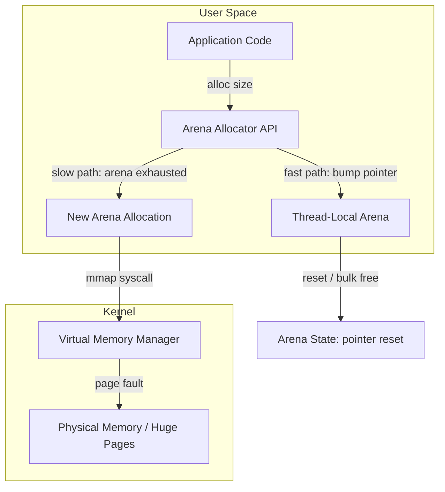
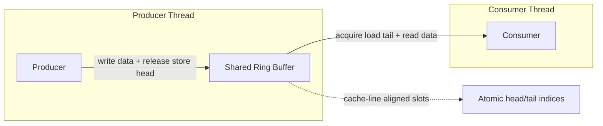
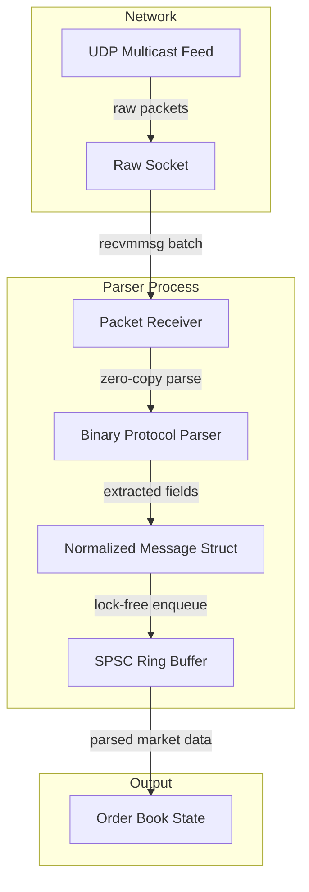
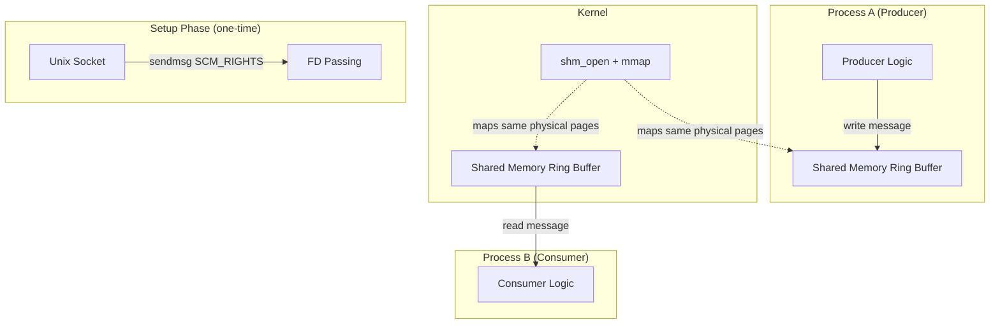
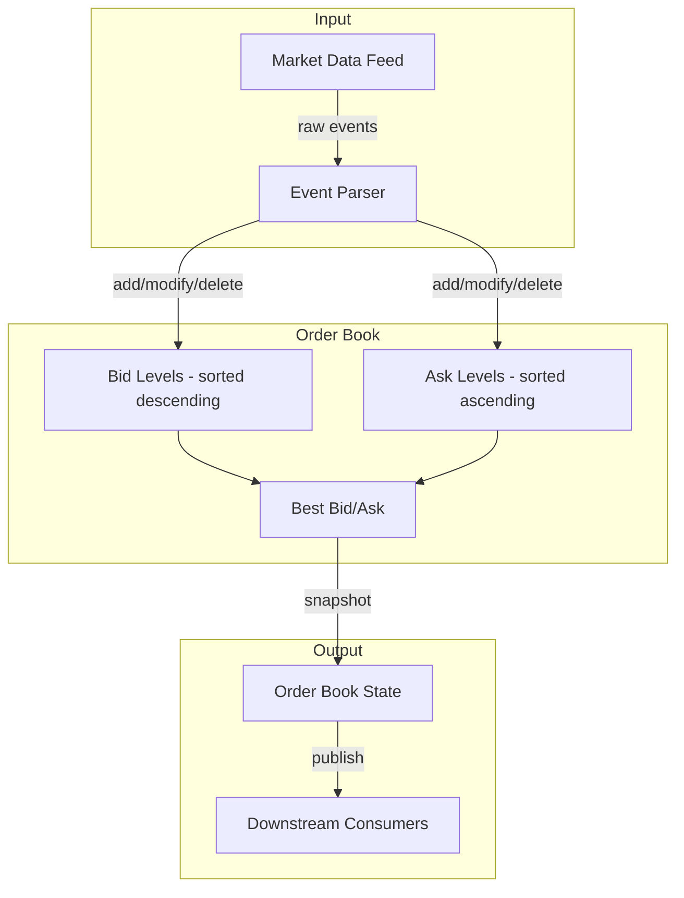
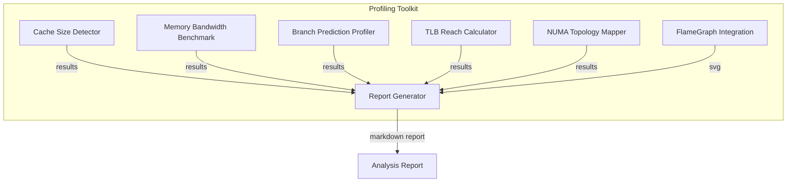
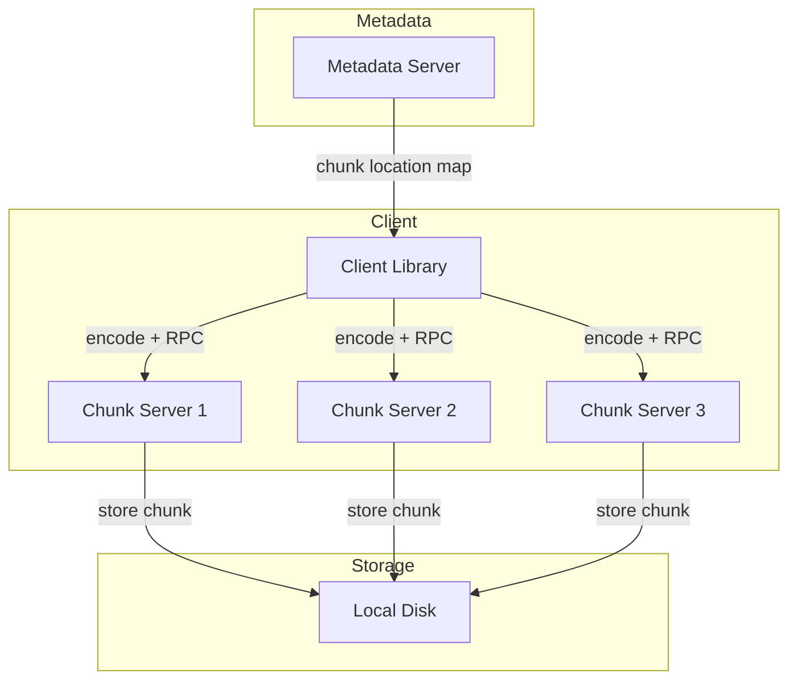
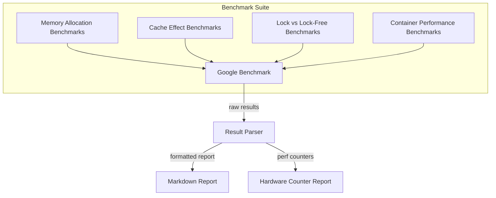

# Portfolio Preparation Guide for Low-Level Systems Engineer at HRT

## Table of Contents

1. [Prerequisites: What to Study Before Starting Projects](#prerequisites-what-to-study-before-starting-projects)
2. [Portfolio Projects](#portfolio-projects)
3. [Project 1: Arena Memory Allocator](#project-1-arena-memory-allocator)
4. [Project 2: Lock-Free SPSC Ring Buffer](#project-2-lock-free-spsc-ring-buffer)
5. [Project 3: Userspace UDP Packet Parser](#project-3-userspace-udp-packet-parser)
6. [Project 4: Shared Memory IPC Ring Buffer](#project-4-shared-memory-ipc-ring-buffer)
7. [Project 5: Lock-Free MPMC Queue](#project-5-lock-free-mpmc-queue)
8. [Project 6: Market Data Order Book](#project-6-market-data-order-book)
9. [Project 7: Simple Kernel Module (Character Device)](#project-7-simple-kernel-module-character-device)
10. [Project 8: Linux Performance Profiling Toolkit](#project-8-linux-performance-profiling-toolkit)

---

## Prerequisites: What to Study Before Starting Projects

Before building portfolio projects, you must acquire foundational C++ and systems knowledge. This is non-negotiable for the target role.

### Phase 0: C++ Fundamentals (Weeks 1-4)

**Study resources:**

| Resource | Focus | Why |
|----------|-------|-----|
| *Programming: Principles and Practice Using C++* (Bjarne Stroustrup) | C++ syntax, OOP, RAII | Written by C++'s creator; foundational |
| *Effective Modern C++* (Scott Meyers) | Move semantics, smart pointers, lambdas | The #1 resource HRT interviewers expect candidates to know |
| CppCon talks on YouTube (search "C++ basics") | Modern C++17/20 features | Free, practical, shows industry standards |
|learncpp.com | Structured C++ tutorial | Free, comprehensive, up-to-date |

**Key C++ concepts you must master:**

- RAII[^1] (Resource Acquisition Is Initialization) -- ownership model that prevents resource leaks
- Smart pointers (`std::unique_ptr`, `std::shared_ptr`, `std::weak_ptr`)
- Move semantics and rvalue references
- `std::vector` vs `std::list` -- why HRT prefers contiguous containers
- Templates (basic)
- `constexpr` and compile-time computation
- `std::atomic` and the C++ memory model (critical for HRT)

### Phase 1: Systems Programming Foundations (Weeks 3-6, overlapping with C++)

**Study resources:**

| Resource | Focus | Why |
|----------|-------|-----|
| *Computer Systems: A Programmer's Perspective* (Bryant & O'Hallaron) | How computers work from a programmer's perspective | The canonical systems textbook |
| "What Every Programmer Should Know About Memory" (Ulrich Drepper) | CPU caches, memory hierarchy, TLB | HRT explicitly recommends this; referenced in their Huge Pages blog post |
| *Operating Systems: Three Easy Pieces* (free online) | Virtual memory, processes, threads, synchronization | Free, clear, comprehensive |
| Linux man pages: `mmap(2)`, `fork(2)`, `pipe(2)`, `socket(2)` | POSIX syscall interface | The actual API for systems programming |

**Key systems concepts you must understand:**

- Virtual memory and page tables
- CPU cache hierarchy (L1/L2/L3, cache lines, false sharing)
- Process vs thread vs coroutine
- POSIX threads (pthreads) and mutexes
- Atomics and memory ordering (`memory_order_acquire`, `memory_order_release`, `memory_order_seq_cst`)
- System calls and the kernel/user-space boundary
- File descriptors and I/O models (blocking, non-blocking, epoll)

### Phase 2: Networking Basics (Weeks 5-8)

**Study resources:**

| Resource | Focus | Why |
|----------|-------|-----|
| *UNIX Network Programming, Vol. 1* (W. Richard Stevens) | Socket programming, I/O models | The definitive networking reference |
| *Beej's Guide to Network Programming* (free online) | Practical UDP/TCP socket coding | Accessible, hands-on |
| DPDK documentation (dpdk.org) | Kernel bypass networking concepts | HRT uses DPDK; understanding concepts matters even without hardware |

---

## Portfolio Projects

### Project 1: Arena Memory Allocator

**What it is:**
A custom memory allocator that allocates from a large pre-allocated memory region (the "arena") using `mmap`[^2] instead of relying on the system `malloc`[^3]. The arena allocates memory in bulk from the operating system, then hands out small pieces to callers with near-zero overhead. It supports thread-local arenas, automatic reset (bulk deallocation), and optional huge page backing[^4].

**Why it is relevant to HRT:**
Memory allocation is one of the most critical low-latency concerns in trading systems. The standard `malloc`/`free` calls involve locks, fragmentation, and syscall overhead that can cost hundreds of nanoseconds -- unacceptable when total latency budgets are measured in single-digit microseconds. HRT's Huge Pages blog post[^5] directly discusses how memory management impacts trading performance. Every HRT C++ engineer must understand custom memory management.

**Linux/systems concepts demonstrated:**

- `mmap(2)` syscall for obtaining virtual memory pages from the kernel[^2]
- Virtual memory and page table management
- Huge pages (2 MiB) and TLB[^6] coverage (directly from HRT's blog)
- Thread-local storage and per-thread arenas
- Memory alignment and cache-line alignment[^7]
- `munmap(2)` for returning memory to the OS
- `MAP_HUGETLB` and `MAP_ANONYMOUS` flags

**Architecture:**



**Tech stack:**

| Component | Technology | Justification |
|-----------|-----------|---------------|
| Language | C++ (C++17 minimum) | Target language for HRT; direct memory control |
| Build system | CMake | Industry standard for C++ projects |
| Memory backing | `mmap` with `MAP_ANONYMOUS` | Direct OS memory interface |
| Huge pages | `MAP_HUGETLB` (optional) | HRT's own optimization technique |
| Benchmarking | Google Benchmark | Precise, repeatable microbenchmarks |
| Testing | Google Test | Standard C++ testing framework |

**Essential features:**

1. **Bulk allocation via `mmap`** -- allocate large chunks (e.g., 256 MiB) from the OS in one syscall, then subdivide
2. **Bump-pointer allocation** -- O(1) allocation by advancing a pointer (no free-list management on the fast path)
3. **Thread-local arenas** -- each thread gets its own arena to eliminate lock contention
4. **Automatic bulk deallocation** -- "reset" the arena by resetting the pointer back to the start (all allocations freed at once)
5. **Huge page backing** -- optionally back the arena with 2 MiB huge pages for better TLB coverage
6. **Alignment guarantee** -- all returned pointers are aligned to at least `alignof(std::max_align_t)`
7. **Out-of-memory handling** -- graceful failure when the OS cannot satisfy `mmap`
8. **Benchmark suite** -- comparison of allocation speed vs `malloc`/`new`, with and without huge pages

**Engineering challenges:**

- **Thread safety** -- thread-local arenas eliminate contention but require careful TLS[^8] management
- **Fragmentation** -- bump allocators do not free individual objects; design for "allocate many, free all" patterns
- **Huge page allocation failures** -- `MAP_HUGETLB` can fail if the system lacks contiguous huge pages; must fall back gracefully
- **Cache-line false sharing** -- if arena metadata (e.g., the bump pointer) shares a cache line between threads, performance degrades; pad to 64 bytes
- **`mmap` vs `brk`/`sbrk`** -- `mmap` is preferred because it returns pages that can be individually unmapped; `brk` has fragmentation issues

**Common implementation pitfalls:**

| Pitfall | Fix |
|---------|-----|
| Using `new`/`malloc` inside the arena itself (infinite recursion) | Pre-allocate arena storage before constructing the allocator |
| Forgetting to `munmap` on destruction (memory leak) | Track the base pointer and size; call `munmap` in destructor |
| Not handling `mmap` returning `MAP_FAILED` | Always check return value; `MAP_FAILED` is `(void*)-1`, not `NULL` |
| Thread-local arena causing excessive memory usage | Set a maximum arena size; fall back to a shared arena with lock when exceeded |
| Ignoring alignment requirements | Always round up allocation size to satisfy `alignof(std::max_align_t)` |

**Required knowledge before starting:**

- C++ memory model (stack vs heap vs mmap'd memory)
- Basic POSIX system calls (`mmap`, `munmap`, `madvise`)
- CPU cache lines and alignment
- Thread-local storage in C++ (`thread_local` keyword)
- Benchmarking methodology (avoiding dead code elimination, warm-up)

**Difficulty:** Medium (3-4 weeks with C++ basics)
**Estimated hours:** 40-60 hours

**Resume and interview value:**
High. This project directly demonstrates understanding of:
- Virtual memory and `mmap` (asked in HRT systems rounds)
- Huge pages and TLB (HRT's own blog topic)
- Cache-line alignment and false sharing (asked in HRT interviews)
- Custom memory management (required for low-latency C++)
- Benchmarking methodology (HRT values measurement-driven optimization)

**Extensions toward production scale:**

- Add slab allocator[^9] for fixed-size objects (common in trading systems)
- Implement pool allocation with object recycling
- Add `madvise(MADV_HUGEPAGE)` for transparent huge pages
- Integrate with a custom `operator new` replacement for global allocation
- Add metrics: allocation count, arena utilization, fragmentation ratio
- Port to a lock-free design using `compare_exchange_weak` for the bump pointer

---

### Project 2: Lock-Free SPSC Ring Buffer

**What it is:**
A lock-free[^10], single-producer single-consumer (SPSC)[^11] ring buffer implemented in C++ using `std::atomic`[^12] with explicit memory ordering. The producer writes data into the buffer; the consumer reads it, with no locks, no syscalls, and no kernel involvement on the fast path. Designed for zero-copy message passing between two threads.

**Why it is relevant to HRT:**
Lock-free data structures are the single most asked-about topic in HRT's systems interview round. HRT engineers explicitly discuss `memory_order_acquire`, `memory_order_release`, and the difference between lock-free and wait-free[^13]. This project directly demonstrates the exact knowledge tested in interviews.

**Linux/systems concepts demonstrated:**

- `std::atomic` with explicit memory ordering (acquire/release semantics)[^12]
- Cache-line alignment to prevent false sharing
- Memory barriers and compiler barriers
- volatile vs atomic (and why `std::atomic` is correct)
- CPU cache coherence protocols (MESI/MOESI)[^14]
- x86 memory model (TSO[^15]) vs ARM memory model
- SPSC vs MPMC queue trade-offs

**Architecture:**



**Tech stack:**

| Component | Technology | Justification |
|-----------|-----------|---------------|
| Language | C++ (C++17, C++20 for `std::atomic_ref`) | Direct control over atomics and memory ordering |
| Build system | CMake | Standard |
| Benchmarking | Google Benchmark with pinning | Precise throughput/latency measurement |
| Threading | `std::thread` + `std::atomic` | No external dependencies |
| Testing | Google Test + custom stress tests | Must verify correctness under contention |

**Essential features:**

1. **Lock-free enqueue/dequeue** -- no `std::mutex`, no `std::condition_variable`; only atomic operations on head and tail indices
2. **Explicit memory ordering** -- `memory_order_release` on store, `memory_order_acquire` on load (not `seq_cst`)
3. **Cache-line padding** -- head and tail on separate cache lines (64 bytes) to prevent false sharing
4. **Power-of-two capacity** -- enables bitwise modulo (`& (capacity - 1)`) instead of expensive integer division
5. **Compile-time capacity** -- template parameter for zero-overhead ring buffer sizing
6. **Throughput benchmark** -- measures millions of messages/second between pinned threads
7. **Latency benchmark** -- measures round-trip time for producer-consumer pairs
8. **Correctness stress test** -- concurrent producer/consumer with validation of all messages

**Engineering challenges:**

- **Memory ordering correctness** -- using `memory_order_relaxed` is subtly wrong; the consumer must see the complete data before the head advances. This requires `release`/`acquire` pairs.
- **Cache-line false sharing** -- if head and tail are in the same 64-byte cache line, producer and consumer invalidate each other's cache lines on every operation, destroying performance
- **Compiler reordering** -- the compiler may reorder memory operations around atomics; explicit memory ordering prevents this
- **Padding overhead** -- `alignas(64)` padding wastes memory but is essential for performance
- **SPSC limitation** -- multiple producers or consumers require a more complex MPMC queue (note this limitation clearly in documentation)

**Common implementation pitfalls:**

| Pitfall | Fix |
|---------|-----|
| Using `memory_order_seq_cst` everywhere (overly conservative, hurts performance on ARM) | Use the minimum required ordering: `release` for store, `acquire` for load |
| Not padding head/tail to cache-line boundaries | Use `alignas(64)` or `std::hardware_destructive_interference_size` |
| Using `std::mutex` instead of atomics (defeats the purpose) | Replace with `std::atomic` + memory ordering |
| Forgetting that SPSC does not support multiple producers | Document the constraint; extend to MPMC only if needed |
| Not checking `empty()`/`full()` correctly with atomics | Load the other thread's index with `acquire` before checking |

**Required knowledge before starting:**

- C++ `std::atomic` basics (load, store, compare_exchange)
- The concept of memory ordering (acquire/release/seq_cst)
- Cache lines and false sharing
- Producer-consumer pattern
- Basic threading (`std::thread`)

**Difficulty:** Medium-Hard (3-5 weeks)
**Estimated hours:** 50-70 hours

**Resume and interview value:**
Very high. This is the exact type of data structure HRT asks about in the systems round. Being able to implement this from scratch while explaining `memory_order_acquire` vs `memory_order_release` vs `memory_order_seq_cst` demonstrates deep C++ systems knowledge.

**Extensions toward production scale:**

- Extend to MPMC (multi-producer multi-consumer) using a ticket-based approach
- Add backpressure signaling (semaphore or condition variable for the slow path)
- Implement across processes using POSIX shared memory (`shm_open` + `mmap`)
- Add `std::span`-based zero-copy API (return a view into the buffer, not a copy)
- Benchmark on both x86 and ARM to show memory model differences
- Compare against `boost::lockfree::spsc_queue` for performance validation

---

### Project 3: Userspace UDP Packet Parser

**What it is:**
A high-performance UDP packet receiver and parser written in C++ that processes raw market data packets at high throughput. It receives UDP packets via raw sockets (simulating kernel bypass concepts), parses binary protocol headers (simulating a market data feed), and extracts structured fields (timestamps, prices, volumes) into a normalized internal representation. Includes a throughput benchmark showing packets/second and latency measurements.

**Why it is relevant to HRT:**
HRT's system design interview literally asks candidates to "design a market data ingestion pipeline" with "multicast UDP from NYSE/NASDAQ (~5M packets/sec)" and "SLA: 99.9th percentile latency < 30 microseconds"[^16]. This project demonstrates the foundational skills for that exact problem.

**Linux/systems concepts demonstrated:**

- UDP socket programming (`socket(AF_INET, SOCK_DGRAM, 0)`)
- Raw socket reception and binary protocol parsing
- Zero-copy parsing concepts (parsing headers without allocating new memory)
- `recvmmsg(2)` for batch packet reception (reduces syscall overhead)
- `SO_REUSEPORT` for multi-socket packet distribution
- Kernel networking stack overhead (why HRT uses DPDK to bypass it)
- Network byte order conversion (`ntohs`, `ntohl`)
- Timestamp precision (CLOCK_MONOTONIC vs NIC hardware timestamps)

**Architecture:**



**Tech stack:**

| Component | Technology | Justification |
|-----------|-----------|---------------|
| Language | C++ (C++17) | Direct socket API access, performance |
| Networking | Linux raw UDP sockets | Direct OS networking interface |
| Build system | CMake | Standard |
| Benchmarking | Custom + Google Benchmark | Measure packets/second and per-packet latency |
| Ring buffer | Reuse Project 2 | Integration demonstrates composability |
| Packet generation | Python script (scapy) | Generate test traffic at high rates |

**Essential features:**

1. **Batch packet reception** -- use `recvmmsg(2)` to receive up to 32 packets per syscall, reducing overhead
2. **Zero-copy header parsing** -- parse packet headers in-place without copying into temporary buffers
3. **Binary protocol definition** -- define a realistic binary protocol with fields: message type, sequence number, timestamp (nanoseconds), symbol ID, price (fixed-point), volume
4. **Normalized output** -- convert raw bytes into strongly-typed C++ structs
5. **Throughput measurement** -- count packets/second and bytes/second
6. **Latency measurement** -- measure time from packet reception to parsed output (nanosecond precision)
7. **Packet loss detection** -- detect sequence number gaps and report statistics
8. **Generator script** -- Python script that generates realistic test traffic at configurable rates

**Engineering challenges:**

- **Syscall overhead** -- each `recvfrom(2)` is a context switch; `recvmmsg` batches them but still requires kernel-to-userspace copies
- **Kernel networking overhead** -- Linux TCP/UDP stack introduces copies and scheduling overhead (the Luna paper HRT cites[^17] discusses this); explain why DPDK exists
- **Binary parsing correctness** -- byte-order conversion, alignment, padding in binary protocols
- **Timestamp accuracy** -- software timestamps have microsecond-level jitter; explain why NIC hardware timestamps are preferred for HFT
- **Backpressure** -- what happens when the parser cannot keep up with incoming packets

**Common implementation pitfalls:**

| Pitfall | Fix |
|---------|-----|
| Using `recvfrom` one packet at a time (high syscall overhead) | Use `recvmmsg` for batched reception |
| Copying entire packet into a `std::string` before parsing | Parse directly from the socket buffer (zero-copy) |
| Using floating-point for prices (precision loss) | Use fixed-point integers (e.g., price * 10000) |
| Forgetting `ntohs`/`ntohl` for network byte order | Always convert from network to host byte order |
| Not handling partial reads | UDP is datagram-based (complete messages), but handle edge cases |

**Required knowledge before starting:**

- Basic UDP socket programming (in any language; port to C++)
- Binary data representation (endianness, alignment)
- C++ structs and memory layout
- Basic performance measurement

**Difficulty:** Medium (3-4 weeks)
**Estimated hours:** 40-55 hours

**Resume and interview value:**
Very high. Directly addresses HRT's system design interview question. Demonstrates networking knowledge, binary protocol handling, and performance awareness. The discussion of kernel bypass limitations shows understanding of why HRT uses DPDK.

**Extensions toward production scale:**

- Replace raw sockets with DPDK (requires NIC hardware with DPDK support)
- Add hardware timestamping support via `SO_TIMESTAMPING`
- Implement multicast group joining/leaving
- Add protocol versioning and backward compatibility
- Integrate with Order Book state machine (Project 6)
- Add per-symbol sharding for parallel parsing

---

### Project 4: Shared Memory IPC Ring Buffer

**What it is:**
An inter-process communication (IPC)[^18] system using POSIX shared memory (`shm_open` + `mmap`) that allows two independent processes to exchange messages without going through the kernel on the data path. Directly inspired by HRT's SmallGrid shmqueue architecture[^19]. The fast path involves only memory writes to shared pages -- zero syscalls after initial setup.

**Why it is relevant to HRT:**
HRT's SmallGrid system uses exactly this pattern: "we create a shared memory ring buffer (which I will call a shmqueue)... by creating the shmqueue ourselves, we can read and write to the shmqueue with just the overhead of writing to memory"[^19]. This is a real production pattern used at HRT for hot-path IPC.

**Linux/systems concepts demonstrated:**

- `shm_open(3)` and `mmap(2)` for POSIX shared memory[^18]
- Memory-mapped files and shared memory regions
- Atomic operations across process boundaries
- `MAP_SHARED` vs `MAP_PRIVATE` flags
- File descriptor passing via `sendmsg`/`recvmsg` (SCM_RIGHTS)[^19]
- Process lifecycle and cleanup (what happens when a process crashes)
- `ftruncate(2)` for sizing shared memory objects

**Architecture:**



**Tech stack:**

| Component | Technology | Justification |
|-----------|-----------|---------------|
| Language | C++ (C++17) | Direct POSIX API access |
| Shared memory | `shm_open` + `mmap` | POSIX standard for cross-process shared memory |
| FD passing | Unix domain socket + `SCM_RIGHTS` | HRT's actual approach for initial setup |
| Build system | CMake | Standard |
| Testing | Two-process test harness | Verify correctness across process boundaries |

**Essential features:**

1. **POSIX shared memory creation** -- `shm_open` to create named shared memory objects
2. **Ring buffer in shared memory** -- producer and consumer indices stored in the shared region
3. **Zero-copy message passing** -- messages written directly to shared memory pages
4. **File descriptor passing** -- use Unix domain socket to pass the shared memory FD from producer to consumer (avoids both processes needing to `open` the same name)
5. **Crash recovery** -- detect process death via the Unix socket closing; rebuild state from shared memory
6. **Configurable buffer size** -- command-line parameter for ring buffer capacity
7. **Throughput benchmark** -- messages/second between two processes
8. **Integration example** -- producer generates simulated market data, consumer aggregates statistics

**Engineering challenges:**

- **Crash safety** -- if the producer crashes mid-write, the consumer may read corrupted data; need sequence numbers or a CRC to detect this
- **Memory ordering across processes** -- atomics in shared memory work the same as across threads, but the compiler does not know about cross-process sharing
- **FD lifecycle** -- the shared memory object persists after process exit unless explicitly unlinked (`shm_unlink`)
- **No kernel involvement on fast path** -- the entire point is that after setup, data moves only through shared physical pages

**Common implementation pitfalls:**

| Pitfall | Fix |
|---------|-----|
| Forgetting `shm_unlink` (shared memory persists forever) | Unlink in the creator process after the consumer has attached |
| Not checking `ftruncate` return value | Always verify the shared memory is sized correctly |
| Using `fork()` instead of separate processes | Use `fork` for testing, but document that real use is separate processes |
| Not handling `MAP_FAILED` from `mmap` | Check return value; `MAP_FAILED` is `(void*)-1` |
| Race condition during FD passing | Ensure the consumer has attached before the producer starts writing |

**Required knowledge before starting:**

- POSIX shared memory API (`shm_open`, `mmap`, `shm_unlink`)
- Unix domain sockets (`AF_UNIX`)
- Atomic operations (from Project 2)
- Basic process management (`fork`, `exec`)

**Difficulty:** Medium-Hard (3-5 weeks)
**Estimated hours:** 45-65 hours

**Resume and interview value:**
High. Demonstrates cross-process IPC, POSIX APIs, shared memory management, and crash safety -- all directly relevant to HRT's production systems. The FD passing via `SCM_RIGHTS` is a specific advanced technique that shows deep systems knowledge.

**Extensions toward production scale:**

- Add a ring buffer pool (multiple ring buffers for different message types)
- Implement the daemon architecture from SmallGrid (centralized broker)
- Add memory-mapped metadata (buffer statistics visible to monitoring tools)
- Integrate with Project 3 (UDP parser writes to shared memory ring)
- Add lock-free multi-producer support using `compare_exchange_weak`
- Add `mlock(2)` to prevent page faults on the hot path

---

### Project 5: Lock-Free MPMC Queue

**What it is:**
A multi-producer, multi-consumer (MPMC)[^20] lock-free queue using a fixed-size ring buffer with per-slot sequence counters. This is the canonical "LMAX Disruptor[^21]" style queue adapted for C++ with explicit memory ordering. Supports multiple threads enqueuing and dequeuing simultaneously without locks.

**Why it is relevant to HRT:**
HRT's systems design interviews ask about SPMC vs MPMC trade-offs[^16]. The ability to implement and explain an MPMC queue demonstrates mastery of lock-free programming, which is the primary technical filter for C++ roles at HRT.

**Linux/systems concepts demonstrated:**

- `compare_exchange_weak` and `compare_exchange_strong`[^12]
- Memory ordering in CAS loops (the fundamental lock-free primitive)
- Per-slot sequence numbers for producer-consumer coordination
- Padding to prevent false sharing
- ABA problem[^22] and its prevention
- Spin-waiting vs yielding (`std::this_thread::yield`)

**Architecture:**

```mermaid
graph TB
    subgraph "Producers"
        P1[Producer 1] -->|CAS head| Q[Fixed-Size Ring Buffer]
        P2[Producer 2] -->|CAS head| Q
    end
    subgraph "Ring Buffer"
        Q -->|slot[i].sequence| S1[Slot 0: seq + data]
        Q -->|slot[i].sequence| S2[Slot 1: seq + data]
        Q -->|slot[i].sequence| S3[Slot N: seq + data]
    end
    subgraph "Consumers"
        Q -->|CAS tail| C1[Consumer 1]
        Q -->|CAS tail| C2[Consumer 2]
    end
```

**Tech stack:**

| Component | Technology | Justification |
|-----------|-----------|---------------|
| Language | C++ (C++17) | Required for lock-free primitives |
| Atomics | `std::atomic<size_t>` with explicit ordering | Core of the implementation |
| Build system | CMake | Standard |
| Benchmarking | Google Benchmark with thread pinning | Measure throughput under contention |
| Testing | Google Test + stress test | Verify correctness under high concurrency |

**Essential features:**

1. **Per-slot sequence counters** -- each slot stores its sequence number; producers advance `head` via CAS; consumers advance `tail` via CAS
2. **CAS-based enqueue/dequeue** -- `compare_exchange_weak` loop for both operations
3. **Configurable capacity** -- power-of-two template parameter
4. **Cache-line padded slots** -- each slot padded to 64 bytes to prevent false sharing
5. **Spin-wait with backoff** -- when a slot is contended, spin briefly then yield
6. **Throughput benchmark** -- measure messages/second with N producers and M consumers
7. **Correctness test** -- verify all messages are delivered exactly once, in order per-producer
8. **Comparison with mutex-based queue** -- benchmark against `std::queue` + `std::mutex` to show the advantage

**Engineering challenges:**

- **CAS loop correctness** -- the CAS can fail spuriously; the loop must retry with updated values
- **Sequence number management** -- the sequence number acts as both a "slot ready" flag and an ordering mechanism; getting this wrong causes lost or duplicate messages
- **ABA problem** -- if a producer enqueues, dequeues, and re-enqueues to the same slot, a concurrent CAS might succeed incorrectly; the sequence counter prevents this
- **Performance under high contention** -- CAS retry rates increase with more threads; measure and document this

**Common implementation pitfalls:**

| Pitfall | Fix |
|---------|-----|
| Using `memory_order_seq_cst` everywhere (slow on ARM) | Use `acquire`/`release` for CAS operations |
| Not handling CAS failure (infinite loop) | Always retry with the updated load value |
| Padding slots incorrectly (false sharing) | Use `alignas(64)` on each slot struct |
| Spinning forever when queue is empty/full | Add a `yield()` or exponential backoff after N retries |
| Not documenting MPMC limitations (ABA at extreme scale) | Document known limitations and edge cases |

**Required knowledge before starting:**

- `std::atomic` and CAS operations
- Memory ordering (from Project 2)
- False sharing and cache lines
- Multi-threaded testing techniques

**Difficulty:** Hard (4-6 weeks)
**Estimated hours:** 60-80 hours

**Resume and interview value:**
Very high. This is the canonical lock-free data structure. Being able to implement it and explain the CAS loop, sequence numbering, and memory ordering demonstrates the exact skill HRT tests in the systems round.

**Extensions toward production scale:**

- Add batch enqueue/dequeue for amortized CAS overhead
- Implement across processes using shared memory (combine with Project 4)
- Add timeout-based blocking (wait-free fast path, blocking slow path)
- Port to ARM and compare x86 vs ARM memory model performance
- Add a lock-free queue-of-queues for topic-based routing

---

### Project 6: Market Data Order Book

**What it is:**
An in-memory order book[^23] that maintains real-time bid/ask price levels for a simulated financial instrument. Ingests market data events (add, modify, delete, trade) from a feed (generated by Project 3 or a test harness), maintains sorted price levels, and supports snapshot queries. Designed for microsecond-level update latency.

**Why it is relevant to HRT:**
This is the exact system design question HRT asks: "design a market data ingestion pipeline... Output: normalized OrderBook state pushed to 50 downstream trading-strategy processes"[^16]. Building this demonstrates domain knowledge in HRT's core business.

**Linux/systems concepts demonstrated:**

- Lock-free data structures for concurrent access
- Sorted container design (red-black tree vs skip list vs sorted vector)
- Cache-friendly data layout for price levels
- Latency measurement at nanosecond resolution (`clock_gettime(CLOCK_MONOTONIC)`)
- Memory pre-allocation (no allocation on the hot path)
- Event-driven architecture

**Architecture:**



**Tech stack:**

| Component | Technology | Justification |
|-----------|-----------|---------------|
| Language | C++ (C++17) | Performance-critical data structure |
| Data structure | Custom sorted vector or `std::map` | Sorted by price level |
| Build system | CMake | Standard |
| Testing | Google Test + replay test harness | Verify correctness against known data |
| Benchmarking | Custom nanosecond timer | Measure per-update latency |

**Essential features:**

1. **Event processing** -- handle ADD, MODIFY, DELETE, and TRADE events
2. **Sorted price levels** -- bids sorted descending (highest first), asks sorted ascending (lowest first)
3. **Best bid/ask query** -- O(1) lookup of top-of-book
4. **Level aggregation** -- aggregate volume at each price level
5. **Snapshot export** -- dump current state as a structured object
6. **Latency tracking** -- measure per-event processing time
7. **Replay test** -- generate a sequence of events and verify final state matches expected
8. **Pre-allocated memory** -- no `new`/`malloc` on the hot path; all memory pre-allocated

**Engineering challenges:**

- **Sorted insertion performance** -- `std::map` (red-black tree) has O(log n) insertion but poor cache behavior; sorted vectors have O(n) insertion but excellent cache locality; the trade-off depends on workload
- **No allocation on hot path** -- pre-allocate all possible price levels; use a free-list for recycling deleted levels
- **Concurrency** -- multiple threads may update the book simultaneously; consider sharding by symbol
- **Correctness** -- market data events can arrive out of order, duplicate, or contradictory; the book must handle all edge cases

**Common implementation pitfalls:**

| Pitfall | Fix |
|---------|-----|
| Using `new` for every price level update (allocation overhead) | Pre-allocate a pool of price level objects |
| Using floating-point for prices (precision loss) | Use fixed-point integers (price in hundredths of a cent) |
| Naive sorted insertion (O(n) copy on every add) | Use sorted vector with batch updates, or a tree structure |
| Not handling out-of-sequence events | Track sequence numbers; log or discard stale events |
| Forgetting to update best bid/ask after modifications | Maintain pointers to top-of-book; update on every change |

**Required knowledge before starting:**

- Financial market basics (what is a bid, ask, order book)
- C++ data structures (`std::vector`, `std::map`)
- Fixed-point arithmetic
- Nanosecond timing (`clock_gettime`)

**Difficulty:** Medium-Hard (3-5 weeks)
**Estimated hours:** 50-70 hours

**Resume and interview value:**
High. This demonstrates domain knowledge (trading systems), data structure design, and performance optimization. Directly maps to HRT's system design interview question.

**Extensions toward production scale:**

- Shard by symbol for multi-symbol support
- Add multicast distribution via shared memory (combine with Project 4)
- Implement market-by-price and market-by-order views
- Add historical state replay for debugging
- Integrate with Project 3 (UDP feed parser feeds into this order book)
- Add per-level depth aggregation for market depth visualization

---

### Project 7: Simple Kernel Module (Character Device)

**What it is:**
A Linux kernel module[^24] that creates a character device[^25] in `/dev/`. User-space programs can `open`, `read`, `write`, and `close` this device, and the kernel module processes these requests in kernel space. The module implements a simple circular buffer that passes data between kernel and user space.

**Why it is relevant to HRT:**
HRT's "Low Level C++" role explicitly mentions "kernel programming" as a key skill area[^12]. Understanding the kernel/user-space boundary is fundamental to knowing why kernel bypass (DPDK) exists, how `mmap` works under the hood, and how to write efficient system calls. While you will not write kernel modules at HRT (they use DPDK instead), understanding the kernel explains *why* these abstractions exist.

**Linux/systems concepts demonstrated:**

- Linux kernel module lifecycle (`module_init`, `module_exit`)[^24]
- Character device registration (`cdev`, `file_operations`)[^25]
- Kernel/user-space data copying (`copy_to_user`, `copy_from_user`)
- Kernel memory allocation (`kmalloc`, `kfree`)
- Module parameters and `/proc` or `/sys` interface
- `dmesg` for kernel log output
- `insmod`/`rmmod` for module management
- Build system for out-of-tree kernel modules (`Kbuild`)

**Architecture:**

```mermaid
graph TB
    subgraph "User Space"
        A[User Application] -->|write data| B[/dev/hrt_circ]
        A -->|read data| B
    end
    subgraph "Kernel Space"
        B -->|copy_from_user| C[Kernel Module]
        C -->|circular buffer| D[Internal Buffer]
        D -->|copy_to_user| B
    end
```

**Tech stack:**

| Component | Technology | Justification |
|-----------|-----------|---------------|
| Language | C (kernel modules must be C) | Linux kernel is written in C |
| Build system | Kbuild + Makefile | Required for out-of-tree kernel modules |
| Testing environment | Virtual machine (QEMU/VirtualBox) | Never test kernel modules on production hardware |
| Debugging | `dmesg`, `printk` | Kernel logging |

**Essential features:**

1. **Character device creation** -- register a device at `/dev/hrt_circ` with `cdev_add`
2. **Read/write operations** -- implement `file_operations.read` and `file_operations.write`
3. **Circular buffer** -- kernel-space ring buffer for data between write and read
4. **Module parameters** -- configure buffer size at load time (`module_param`)
5. **Sysfs interface** -- expose buffer statistics via `/sys/`
6. **Proper cleanup** -- `module_exit` function that unregisters everything
7. **Documentation** -- README explaining how to build, load, test, and unload
8. **Safety** -- handle all error paths; never leak kernel memory

**Engineering challenges:**

- **Kernel coding discipline** -- no exceptions, no STL, no `new`/`delete`; all kernel API calls must be checked for errors
- **Memory safety** -- kernel bugs crash the entire system; thorough testing in a VM is essential
- **Concurrency** -- multiple processes may access the device simultaneously; proper locking in kernel space
- **User/kernel boundary** -- `copy_to_user` and `copy_from_user` can fail; always check return values

**Common implementation pitfalls:**

| Pitfall | Fix |
|---------|-----|
| Forgetting to check `copy_to_user` return value (security hole) | Always check and handle partial copies |
| Not freeing resources in `module_exit` (kernel memory leak) | Track all allocations; free in reverse order |
| Using `printk` excessively (floods kernel log) | Use debug levels (`pr_debug`) and conditional compilation |
| Running kernel module on production hardware (risk of kernel panic) | Always test in a VM first |
| Not handling `MODULE_LICENSE` (kernel taint warning) | Include proper license declaration |

**Required knowledge before starting:**

- Basic C programming (kernel modules are C, not C++)
- Linux command line (`insmod`, `rmmod`, `lsmod`, `dmesg`)
- Virtual machine setup (QEMU or VirtualBox)
- Basic kernel concepts (processes, system calls)

**Difficulty:** Hard (4-6 weeks)
**Estimated hours:** 55-75 hours

**Resume and interview value:**
High for demonstrating breadth. While HRT does not typically write kernel modules, understanding the kernel/user-space boundary is essential for explaining why kernel bypass, `mmap`, and DPDK exist. This project proves you can work at the lowest software layer.

**Extensions toward production scale:**

- Add `ioctl`[^26] commands for control operations
- Implement `mmap` support (map kernel buffer directly to user space)
- Add interrupt handling (simulate with a timer)
- Port to a Linux container with kernel module loading capability
- Integrate with Project 1 (arena allocator backed by kernel module)

---

### Project 8: Linux Performance Profiling Toolkit

**What it is:**
A suite of C++ programs and shell scripts that systematically measure CPU microarchitecture[^27] characteristics: L1/L2/L3 cache sizes, cache line size, TLB[^6] reach, memory bandwidth, branch prediction[^28] accuracy, and NUMA[^29] topology. Each program isolates one hardware characteristic and produces a clear report. Includes a profiling guide showing how to use `perf stat`, `perf record`, and FlameGraph[^30] to analyze C++ programs.

**Why it is relevant to HRT:**
HRT explicitly asks interview candidates about "CPU cache effects, NUMA awareness, branch prediction" and expects them to understand these at the hardware level[^10][^13]. This project demonstrates that you can measure and reason about hardware behavior -- not just know it theoretically.

**Linux/systems concepts demonstrated:**

- `perf stat` for hardware performance counters[^31]
- `perf record` + `perf report` for profiling
- FlameGraph for visualizing CPU time distribution
- CPU cache hierarchy (L1/L2/L3) measurement
- TLB miss measurement
- Memory bandwidth benchmarking
- NUMA node detection and inter-node memory access costs
- Branch prediction and branch target prediction
- `cpuid` instruction for CPU feature detection

**Architecture:**



**Tech stack:**

| Component | Technology | Justification |
|-----------|-----------|---------------|
| Language | C++ (benchmarks) + Bash (orchestration) | C++ for performance-critical measurement code |
| Profiling | `perf`, FlameGraph, `cpuid` | Linux-native profiling tools |
| NUMA detection | `numactl`, `lscpu`, `/sys/devices/system/node/` | Linux NUMA interfaces |
| Output | Markdown report with tables and charts | Clear, portable documentation |
| Build system | Makefile + CMake | Simple for this type of project |

**Essential features:**

1. **Cache hierarchy探测** -- write programs that measure L1, L2, L3 cache sizes and associativity by timing memory accesses at increasing strides
2. **Cache line measurement** -- determine cache line size by detecting when two accesses start invalidating each other
3. **Memory bandwidth** -- measure sustained read/write bandwidth using streaming access patterns
4. **Branch prediction analysis** -- compare performance of sorted vs unsorted array iteration (the classic branch prediction demo)
5. **TLB reach calculation** -- compute TLB coverage for 4 KiB vs 2 MiB pages (directly from HRT's blog)
6. **NUMA topology** -- detect NUMA nodes, measure inter-node vs intra-node latency
7. **FlameGraph generation** -- profile a sample C++ program and generate an interactive FlameGraph
8. **`perf stat` integration** -- run `perf stat` on each benchmark and extract hardware counter values

**Engineering challenges:**

- **Measurement noise** -- CPU frequency scaling, background processes, and interrupt handling affect measurements; must pin CPU cores and disable turbo boost
- **Compiler optimization** -- the compiler may optimize away "unused" benchmark code; use `volatile` sinks or `DoNotOptimize` barriers
- **Hardware variation** -- results differ across CPU models; document the test hardware
- **Interpreting results** -- raw numbers are meaningless without explanation; each benchmark must include a "what this means" section

**Common implementation pitfalls:**

| Pitfall | Fix |
|---------|-----|
| Not pinning to a specific CPU core (`taskset`) | Use `taskset -c 0` to pin benchmarks to core 0 |
| Compiler optimizing away the benchmark loop | Use `asm volatile("" : "+r"(result))` or Google Benchmark's `DoNotOptimize` |
| Not disabling frequency scaling | Set `performance` governor: `cpupower frequency-set -g performance` |
| Measuring one-shot access instead of sustained bandwidth | Use large arrays that exceed cache; stream through them |
| Not documenting hardware specifications | Record CPU model, RAM, kernel version in every report |

**Required knowledge before starting:**

- Basic C++ performance programming
- Linux command line tools (`perf`, `taskset`, `cpupower`)
- Understanding of CPU caches and memory hierarchy (from "What Every Programmer Should Know About Memory")
- Basic shell scripting

**Difficulty:** Medium (3-4 weeks)
**Estimated hours:** 40-55 hours

**Resume and interview value:**
High. This project proves you can reason about hardware behavior, use profiling tools, and optimize code based on measurement -- not guesswork. HRT interviewers value candidates who can explain *why* code is fast or slow at the hardware level.

**Extensions toward production scale:**

- Add SIMD[^32] (AVX-512) benchmarks for vectorization analysis
- Add page fault measurement (compare `mmap` vs `malloc` for large allocations)
- Integrate with Project 1 (measure arena allocator with huge pages enabled vs disabled)
- Add a `perf` wrapper script that generates a formatted report from any binary
- Create a CI-compatible version that tracks performance over time

---

### Project 9: Erasure-Coded Distributed Storage

**What it is:**
A simplified distributed key-value store that splits files into chunks and distributes them across multiple nodes using erasure coding[^33] (Reed-Solomon[^34]). Implements a chunk server that stores data, a metadata server that tracks chunk locations, and a client library that handles encode/decode. Inspired by HRT's Blobby filesystem[^13].

**Why it is relevant to HRT:**
HRT built Blobby because existing storage solutions hit limitations at their scale. The Blobby blog post[^13] details their architecture: erasure coding with 6+3 chunks, FoundationDB metadata, Copysets-based placement, and the challenges of building storage systems with small teams. This project demonstrates the core concepts.

**Linux/systems concepts demonstrated:**

- Erasure coding (Reed-Solomon) for data durability[^33]
- Distributed systems concepts (chunk servers, metadata servers)
- Network RPC (TCP-based client-server communication)
- File I/O and chunk management
- Fault tolerance (data survives node failures)
- XFS/ext4 local filesystem operations
- Concurrent request handling

**Architecture:**



**Tech stack:**

| Component | Technology | Justification |
|-----------|-----------|---------------|
| Language | Go or C++ (your choice) | Go for faster prototyping; C++ for systems depth |
| Erasure coding | `gf-complete` (C library) or custom implementation | Reed-Solomon over GF(2^8) |
| Networking | TCP sockets or gRPC | Client-chunkserver communication |
| Metadata | SQLite or in-memory map | Simple metadata tracking |
| Build system | Go modules or CMake | Depending on language choice |
| Testing | Multi-process test harness | Verify data survives simulated node failures |

**Essential features:**

1. **Erasure encoding** -- split a file into 6 data chunks + 3 parity chunks using Reed-Solomon
2. **Chunk distribution** -- distribute chunks across 3+ simulated chunk servers
3. **Metadata server** -- track which chunks are on which servers
4. **Write path** -- encode, distribute, store, update metadata
5. **Read path** -- lookup metadata, fetch chunks, decode, reassemble file
6. **Fault tolerance test** -- kill a chunk server; verify data is still recoverable
7. **Throughput measurement** -- measure encode/decode speed and network throughput
8. **Simple CLI** -- `store <file>`, `retrieve <file>`, `status`

**Engineering challenges:**

- **Erasure coding math** -- Reed-Solomon requires Galois Field arithmetic; using a library (`gf-complete`) is strongly recommended over implementing from scratch
- **Chunk alignment** -- chunks must be fixed-size; the last chunk may need padding
- **Metadata consistency** -- if a write fails mid-way, metadata must not reflect a partial write
- **Concurrency** -- multiple clients may write simultaneously; metadata server must handle concurrent requests

**Common implementation pitfalls:**

| Pitfall | Fix |
|---------|-----|
| Implementing Galois Field arithmetic from scratch (error-prone) | Use `gf-complete` or a well-tested library |
| Not handling partial failures (metadata updated but chunk write failed) | Use two-phase commit or idempotent writes |
| Fixed chunk size too small (wastes parity chunks on small files) | Use a minimum file size threshold; store small files directly |
| Not verifying data integrity after reconstruction | Always CRC32 check chunks after decode |

**Required knowledge before starting:**

- Basic networking (TCP client/server in Go or C++)
- File I/O operations
- Concepts of data durability and fault tolerance
- Galois Field arithmetic (or willingness to learn via library documentation)

**Difficulty:** Hard (5-7 weeks)
**Estimated hours:** 70-100 hours

**Resume and interview value:**
High. Demonstrates distributed systems knowledge, data durability concepts, and storage system design -- directly relevant to HRT's storage team and the Blobby architecture.

**Extensions toward production scale:**

- Replace TCP with DPDK for kernel-bypass networking
- Use FoundationDB for metadata (like Blobby)
- Implement Copysets-based chunk placement (from Blobby's architecture)
- Add repair service that detects and recovers lost chunks
- Add prober service for continuous latency monitoring (like Blobby's probers)
- Support append-only writes (like Blobby's design choice)

---

### Project 10: Automated C++ Microbenchmark Suite

**What it is:**
A comprehensive C++ benchmarking framework that automatically tests and reports on the performance characteristics of common operations: memory allocation, cache effects, branch prediction, lock vs lock-free, and container performance. Uses Google Benchmark as the foundation and generates a formatted report with tables, recommendations, and comparisons.

**Why it is relevant to HRT:**
HRT's culture emphasizes measurement-driven optimization. Their blog posts consistently show benchmark results (Huge Pages: 4.5x improvement, NVMe data service: 3600 MB/s, etc.). Being able to write, run, and interpret benchmarks is a core engineering skill at HRT.

**Linux/systems concepts demonstrated:**

- Google Benchmark framework usage
- CPU frequency scaling and its impact on measurements
- `perf stat` integration for hardware counter correlation
- Statistical rigor (warm-up, multiple iterations, outlier removal)
- FlameGraph integration for visual profiling
- CI/CD integration for performance regression detection

**Architecture:**



**Tech stack:**

| Component | Technology | Justification |
|-----------|-----------|---------------|
| Language | C++ (C++17) | Direct performance measurement |
| Framework | Google Benchmark | Industry standard for C++ microbenchmarks |
| Profiling | `perf stat`, FlameGraph | Hardware counter correlation |
| Build system | CMake | Standard |
| Reporting | Python script for Markdown generation | Format results into readable reports |
| CI | GitHub Actions (optional) | Track performance over time |

**Essential features:**

1. **Allocation benchmarks** -- compare `malloc`, `new`, arena allocator (Project 1), and pool allocator
2. **Cache benchmarks** -- measure access time at L1, L2, L3, and main memory sizes
3. **Lock benchmarks** -- compare `std::mutex`, `std::shared_mutex`, and lock-free (Project 2/5)
4. **Container benchmarks** -- `std::vector` vs `std::list` vs `std::deque` for various access patterns
5. **Branch prediction benchmarks** -- sorted vs unsorted iteration, branchless vs branched code
6. **Report generation** -- Markdown file with tables, speedup calculations, and recommendations
7. **`perf stat` integration** -- for each benchmark, capture cache misses, branch misses, instructions
8. **Reproducibility** -- document CPU model, kernel version, compiler version, compiler flags

**Engineering challenges:**

- **Measurement methodology** -- warm-up runs, statistical significance, outlier handling
- **Compiler optimization pitfalls** -- the compiler can optimize away benchmarks; must prevent dead code elimination
- **CPU frequency scaling** -- turbo boost and power management change clock speed during benchmarks
- **Reproducibility** -- results vary across hardware; must document the exact test environment

**Common implementation pitfalls:**

| Pitfall | Fix |
|---------|-----|
| Not pinning CPU core (results vary across cores) | Use `taskset -c 0` |
| Not disabling frequency scaling | Set `performance` governor |
| Compiler optimizing away benchmark body | Use `DoNotOptimize` and `ClobberMemory` barriers |
| Not running enough iterations | Google Benchmark auto-determines iteration count |
| Comparing debug vs release builds | Always benchmark with `-O2` or `-O3` |

**Required knowledge before starting:**

- C++ performance programming
- Basic `perf` usage
- Understanding of what benchmarks measure and what they do not
- Google Benchmark API basics

**Difficulty:** Medium (2-3 weeks)
**Estimated hours:** 30-45 hours

**Resume and interview value:**
Medium-high. This project shows you can measure and reason about performance systematically. It integrates results from Projects 1, 2, and 5, creating a cohesive portfolio narrative.

**Extensions toward production scale:**

- Add continuous performance regression tracking in CI
- Extend to ARM architecture for cross-platform comparison
- Add NUMA-aware benchmarks (compare local vs remote memory access)
- Integrate with project-specific benchmarks (order book update latency, packet parsing throughput)
- Add `bpftrace`[^35] for dynamic kernel tracing during benchmarks

---

## Part 4: Project Ranking and Gap Analysis

### 4.1 Ranking by Expected Interview Impact

| Rank | Project | Interview Impact | Difficulty | Why |
|------|---------|-----------------|------------|-----|
| **1** | Lock-Free SPSC Ring Buffer | Very High | Medium-Hard | Directly tested in systems round; `memory_order_acquire`/`release` is the #1 asked topic |
| **2** | Lock-Free MPMC Queue | Very High | Hard | Canonical lock-free data structure; demonstrates CAS, ABA, memory ordering |
| **3** | Market Data Order Book | Very High | Medium-Hard | Exact HRT system design question; domain knowledge + data structure design |
| **4** | Arena Memory Allocator | High | Medium | Demonstrates `mmap`, virtual memory, huge pages (HRT blog topic), cache alignment |
| **5** | Userspace UDP Packet Parser | High | Medium | Networking fundamentals; demonstrates understanding of why kernel bypass exists |
| **6** | Shared Memory IPC Ring Buffer | High | Medium-Hard | HRT's actual production pattern (SmallGrid shmqueue); cross-process IPC |
| **7** | Linux Performance Profiling Toolkit | High | Medium | Proves hardware-level reasoning; use `perf`, FlameGraph, cache analysis |
| **8** | Erasure-Coded Distributed Storage | High | Hard | Blobby-inspired; demonstrates distributed systems + storage knowledge |
| **9** | Simple Kernel Module | Medium-Hard | Hard | Shows breadth at lowest software layer; explains kernel/user-space boundary |
| **10** | C++ Microbenchmark Suite | Medium-Hard | Medium | Integrates other projects; shows measurement methodology |

### 4.2 Gap Analysis: Job Requirements vs. Projects

**Target: Low-Level Systems Engineer (C++) at HRT**

| Job Requirement | Covered By | Remaining Gap |
|----------------|------------|---------------|
| Advanced C++ (daily use) | All 10 projects | Need sustained practice (6+ months of C++ work) |
| UNIX/Linux operating systems | Projects 4, 7, 8, 10 | Kernel internals (scheduling, interrupts) not deeply covered |
| System/processor performance | Projects 1, 8, 10 | Need deeper study of Agner Fog's optimization manuals |
| Network communication | Projects 3, 5, 9 | DPDK integration (requires NIC hardware) not possible without hardware |
| OS internals (virtual memory, scheduling) | Projects 1, 4, 7 | No actual kernel source code reading |
| CPU architecture (caches, NUMA, branch prediction) | Projects 1, 8 | Need hands-on NUMA testing (requires multi-socket server) |
| Lock-free data structures | Projects 2, 5 | Need to study and implement more patterns (stacks, lists) |
| Memory ordering semantics | Projects 1, 2, 5 | Need to reason about ARM vs x86 differences |
| FPGA/ASIC awareness | None | Must study conceptually (HRT does not expect SWE to write Verilog) |
| Fault-tolerant systems | Projects 4, 9 | Need more distributed fault tolerance patterns |
| Competitive-programming algorithms | None | Must practice LeetCode hard problems separately (separate from portfolio) |
| Brainteaser/probability | None | Must study separately (e.g., "A Practical Guide to Quantitative Finance Interviews") |

### 4.3 Recommended Learning and Project Timeline

**Phase 0 (Weeks 1-4): C++ Foundations + Study**
- Study C++ (Stroustrup, Meyers, learncpp.com)
- Study systems basics (CS:APP, OSTEP)
- Start Project 1 (Arena Allocator) as first C++ project

**Phase 1 (Weeks 5-10): Core Systems Projects**
- Complete Project 1 (Arena Allocator)
- Complete Project 2 (SPSC Ring Buffer)
- Start Project 3 (UDP Packet Parser)
- Begin LeetCode practice (5-10 problems/week, easy then medium)

**Phase 2 (Weeks 11-16): Networking + IPC**
- Complete Project 3 (UDP Packet Parser)
- Complete Project 4 (Shared Memory IPC)
- Start Project 5 (MPMC Queue)
- Intensify LeetCode practice (hard problems, 3-5/week)

**Phase 3 (Weeks 17-22): Integration + Depth**
- Complete Project 5 (MPMC Queue)
- Complete Project 6 (Order Book)
- Complete Project 7 (Kernel Module)
- Study brainteasers and probability

**Phase 4 (Weeks 23-28): Production + Polish**
- Complete Project 8 (Profiling Toolkit)
- Complete Project 9 (Distributed Storage) -- optional
- Complete Project 10 (Benchmark Suite)
- Polish all projects: README, documentation, tests, benchmarks
- Mock interviews (coding + systems rounds)

### 4.4 Critical Advice for Your Specific Situation

1. **Be honest about your timeline.** You are targeting a role that requires 1+ years of C++ daily use. With no C++ and no systems background, you need at minimum 6-9 months of focused study and project work before you are competitive. Do not rush the application.

2. **Start with your strength.** Your Go experience is relevant. Project 9 (Distributed Storage) can be started in Go to build the distributed systems logic, then port performance-critical sections to C++. This demonstrates your ability to learn and adapt.

3. **LeetCode is mandatory.** HRT's OA eliminates 88-92% of applicants. Portfolio projects do not substitute for algorithmic problem-solving speed. Dedicate at least 30% of your prep time to competitive programming.

4. **Build in public.** Host all projects on GitHub with clear READMEs, architecture diagrams, and benchmark results. HRT engineers value clean documentation and clear thinking.

5. **Consider intermediate roles.** If the Low-Level Systems role feels out of reach initially, consider applying for Systems Automation/Python or C++/Python mixed roles first, then rotating internally (HRT encourages this[^12]).

---

## References

| # | Source | URL |
|---|--------|-----|
| [^1] | RAII - cppreference.com | en.cppreference.com/cpp/language/raii |
| [^2] | mmap(2) - Linux man page | man7.org/linux/man-pages/man2/mmap.2.html |
| [^3] | malloc(3) - Linux man page | man7.org/linux/man-pages/man3/malloc.3.html |
| [^4] | Huge Pages - HRT Beat | hudsonrivertrading.com/hrtbeat/low-latency-optimization-part-1 |
| [^5] | HRT Huge Pages Blog Post | hudsonrivertrading.com/hrtbeat/low-latency-optimization-part-1 |
| [^6] | TLB - Wikipedia | en.wikipedia.org/wiki/Translation_lookaside_buffer |
| [^7] | CPU Caches - Ulrich Drepper | people.freebsd.org/~lstewart/articles/cpumemory.pdf |
| [^8] | Thread-local storage - cppreference.com | en.cppreference.com/cpp/language/storage_duration |
| [^9] | Slab allocator - Wikipedia | en.wikipedia.org/wiki/Slab_allocation |
| [^10] | TechInterview - HRT Guide 2026 | techinterview.org/companies/hudson-river-trading |
| [^11] | SPSC queue - Wikipedia | en.wikipedia.org/wiki/Single-producer_consumer_queue |
| [^12] | std::atomic - cppreference.com | en.cppreference.com/cpp/atomic/atomic |
| [^13] | HRT Beat - Engineering and Interviewing | hudsonrivertrading.com/hrtbeat/engineering-and-interviewing-at-hrt |
| [^14] | MESI protocol - Wikipedia | en.wikipedia.org/wiki/MESI_protocol |
| [^15] | Total Store Order - Wikipedia | en.wikipedia.org/wiki/Total_store_order |
| [^16] | OAVO - HRT Onsite Guide | oavoservice.com/en/articles/hrt-vo-onsite-five-rounds-guide |
| [^17] | Luna paper (Linux networking overhead) | Referenced in HRT intern spotlight post |
| [^18] | POSIX shared memory - man7.org | man7.org/linux/man-pages/man3/shm_open.3.html |
| [^19] | HRT Beat - SmallGrid | hudsonrivertrading.com/hrtbeat/an-intro-to-smallgrid |
| [^20] | MPMC queue - Wikipedia | en.wikipedia.org/wiki/Concurrent_data_structure |
| [^21] | LMAX Disruptor | lmax-exchange.github.io/disruptor/ |
| [^22] | ABA problem - Wikipedia | en.wikipedia.org/wiki/ABA_problem |
| [^23] | Order book - Investopedia | investopedia.com/terms/o/order-book.asp |
| [^24] | Linux kernel module - Wikipedia | en.wikipedia.org/wiki/Loadable_kernel_module |
| [^25] | Character device - Linux kernel docs | docs.kernel.org/driver-api/char_devices.html |
| [^26] | ioctl(2) - Linux man page | man7.org/linux/man-pages/man2/ioctl.2.html |
| [^27] | CPU microarchitecture - Wikipedia | en.wikipedia.org/wiki/Microarchitecture |
| [^28] | Branch prediction - Wikipedia | en.wikipedia.org/wiki/Branch_predictor |
| [^29] | NUMA - Wikipedia | en.wikipedia.org/wiki/Non-uniform_memory_access |
| [^30] | FlameGraph - Brendan Gregg | github.com/brendangregg/FlameGraph |
| [^31] | perf - Linux perf wiki | perf.wiki.kernel.org |
| [^32] | SIMD - Wikipedia | en.wikipedia.org/wiki/SIMD |
| [^33] | Erasure coding - Wikipedia | en.wikipedia.org/wiki/Erasure_code |
| [^34] | Reed-Solomon - Wikipedia | en.wikipedia.org/wiki/Reed%E2%80%93Solomon_error_correction |
| [^35] | bpftrace - bpftrace.org | bpftrace.org |
